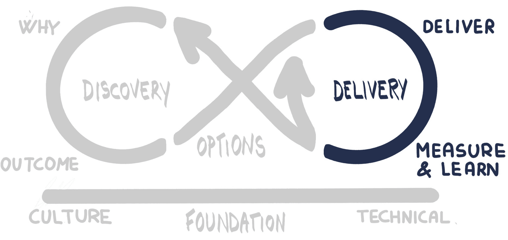

# 第五部分：交付它

在*第四部分*，*优先排序*中，我们第一次经历了选项枢纽。我们将从发现循环中得到的所有学习和想法应用到更多的实践中，根据其价值进行组织。我们使用了优先排序技术来帮助我们切分价值，并考虑如何规划和设计可以通过利用 OpenShift 平台提供的先进部署功能来运行的实验。

正如 Gabrielle Benefield 和 Ryan Shriver 在 *Mobius Outcome Delivery QuickStart Guide* 中概述的那样（可以从 [mobiusloop.com](http://mobiusloop.com) 免费下载），Mobius 鼓励通过持续的发现、验证和学习来推动产品开发。以这种方式构建产品需要扎实的文化和技术实践基础，这些基础能够支持持续的实验、快速发布和快速反馈方法。事实上，持续的研究和实验与功能交付一样，都是产品开发的一部分。

研究、实验和实施之间的主要区别在于需要投入的时间和金钱，这些投入是为了引导团队朝着构建正确的、与目标成果一致的事物前进。Mobius 鼓励从最少的投资中交付最大价值的理念。

图 12.0.1：交付循环 – 设置场景

当我们进入交付循环时，我们将进行研究、执行实验并实施功能。我们如何做到这一点？我们是要使用像 Scrum 这样的框架，还是**大规模敏捷框架**（**SAFe**），或者是**大规模 Scrum 框架**（**LeSS**），或者 Lean？我们是要遵循一种规定的做法或方法论吗？不，我们不这样做！正如本书中所述——事实上，这也是 Mobius 和开放实践库背后的心态——我们将提供一套实践工具箱，帮助你在交付循环中游刃有余。我们不会说有一种正确的方式来做事，因为这种方式并不存在。我们的方法是根据背景、学习和经验进行调整。我们将介绍一些我们发现非常有效的流行实践，并分享一些背后的故事和技巧。

你选择哪些实践取决于你，但在几乎所有情况下，我们强烈建议使用能够实现快速交付、快速反馈并持续学习的实践。

为此，本节被分为两个章节。*第十二章*，*执行交付*，完全讲解了执行交付——瀑布式方法和敏捷方法之间的差异，以及用于增量和迭代交付的流行敏捷实践。*第十三章*，*衡量与学习*，则专注于衡量指标并学习它们所传递的信息。我们可以使用各种不同类型的指标，应用于小规模的增量交付，不断地进行改进。

图 12.0.2：交付循环
