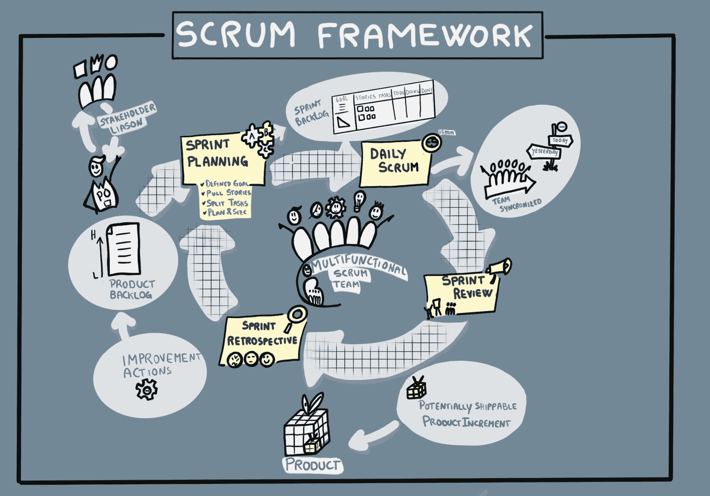
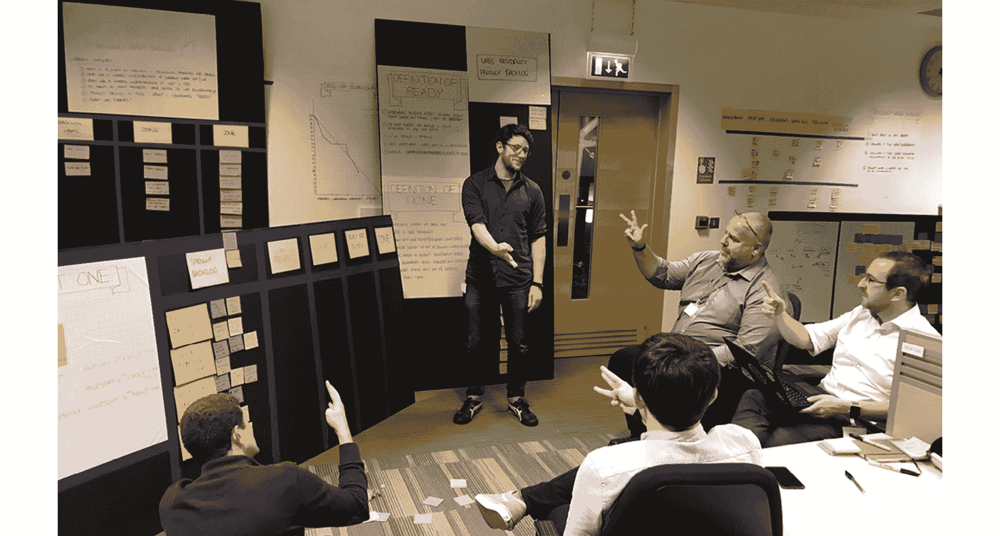

# 第十二章：12. 做交付

最终，代码没有价值，直到它被交付到生产环境，并且其相关功能被使用。是时候将我们迄今为止学到的内容与交付联系起来。

我们已经进入本书的下半部分，除了像*第三部分*《发现它》中那样建立技术基础外，我们还没有编写任何应用代码，也没有交付任何内容。我们所做的是通过一系列巨大的实践，帮助我们发现、设定结果、评估和优先排序选项，并决定接下来要交付什么。现在，我们已经到了编写代码、交付功能、执行实验并从进一步的研究中学习的阶段。

在本章中，我们将探讨不同的交付方法。你可能会立即预期本章将全是关于**敏捷**，并且使用敏捷方法论是交付工作软件的唯一方式。然而，除了回顾敏捷的起源和我们可以使用它的不同方式外，我们还将强调它并不是唯一的选择。仍然存在适合采用传统交付方法的场景，比如**瀑布模型**。在本章中，我们将：

+   解释瀑布模型和敏捷方法论。

+   看看复杂、复杂性和清晰系统之间的区别，以及我们如何利用它们推动敏捷方法的适用性。

+   探讨 Mobius 循环是与框架无关的，通过不同的视角、速度和迭代频率，可以用来解释各种类型的交付。

+   分享一些工具和技巧，帮助你为交付迭代做好**准备**。

+   描述我们常用的一些实践和示例，帮助完成交付迭代；例如，迭代（或冲刺）计划、每日站会、展示会和回顾会。

+   看看随着团队的成熟和持续改进，他们如何调整自己的工作实践和方法。

+   分享一些工具和技巧，帮助你完成工作软件功能的**交付**，重点关注功能性和非功能性的接受标准。

+   第一次看到我们所有的实践如何结合在一起，形成一个持续交付引擎。

图 12.1：瀑布模型和敏捷团队

让我们先来看一下这两种现象——瀑布模型和敏捷方法。如*图 12.1*所示，瀑布模型通常与甘特图、依赖关系以及组织中一个部门到另一个部门的交接工作相关。敏捷则采取不同的思维方式，更加跨职能。有人可能会说瀑布模型已经过时，正在消亡。但我们将在本章后面看到，瀑布模型依然有一些有效的应用场景。

## 瀑布模型

瀑布项目被分解为线性步骤；每个步骤都依赖于前一步的完成才能开始下一步。第一步是收集用户需求，接下来是设计和规划，然后是软件开发。一旦测试和部署完成，我们就进入了维护和运营阶段。

图 12.2：瀑布流程

这种交付方法在软件开发之外有着悠久的历史，尤其是在传统工程领域。在建造桥梁或工厂时，*项目计划*会列出所有人员、资源、任务和整体项目的时间表。瀑布方法可以被描述为一种*计划驱动*的工程过程，其中成功的衡量标准是开发是否能够跟上计划的进度。

通过遵循计划，个体差异得到了最小化。在工业领域，这有助于使交付和成本可预测。由于传统的瀑布模型不允许循环，需求和设计通常会被收集在大量的文档中以开始规划。对于团队来说，修改和理解这些文档变得非常棘手，因为除了重新阅读所有文档外，几乎没有其他方法来达成共享理解。你是否参加过书籍评审会议？当一群人读同一本书时，你会得到多少不同的观点？将这一点与组织提出昂贵的变更请求，并且修改文档的可能性结合起来，很快就会看到这种方法对公司来说可能是多么灾难性。那么，这种方法在软件领域如何呢？

我们常常发现，在软件领域中，需求与最终用户的期望不符。这是因为在我们开发软件的过程中，关于原始需求和设计的问题以及误解变得难以解决。由于设计和业务需求团队在开发阶段的参与较少，因此没有机会更新设计或理念。

使用瀑布方法交付客户和业务价值要花费更长时间——因为工作软件通常要到瀑布过程的最后阶段才交付。想想看，在等待你的优秀应用程序到来时，你浪费了多少时间。如果它永远不会到来呢？或者更糟，来得太晚，错过了市场机会？

在瀑布执行过程中，变更需求通常会被留到另一个瀑布阶段。如果变更非常紧急，它们可能会通过某种变更请求机制来处理。然而，这实际上是一种循环形式——这引导我们走向一种更迭代的方法。在瀑布模型中，这些循环仍然可能非常耗时且成本高昂。如果只有更快的方法就好了！

温斯顿·沃克·罗伊斯是美国计算机科学家，也是德克萨斯州奥斯丁市洛克希德软件技术中心的主管。他是软件开发领域的先驱，因其 1970 年的论文而闻名，从中错误地引出了单次通过的瀑布模型。没错，瀑布模型被误解了！

图 12.3：瀑布模型并不是为了单次通过而设计的！

Barry Boehm 在 1987 年写道：“*罗伊斯 1970 年的论文通常被认为是定义了* *阶段性瀑布模型的论文。然而，令人惊讶的是，早期的 Benington* *和 Hosier 的论文已经很好地接近了瀑布模型，而且罗伊斯的论文早已将原型开发作为与瀑布模型兼容的一个重要步骤*。”1

罗伊斯展示了，虽然大型软件系统的开发需要更为彻底的方法，但单次顺序执行方法中存在固有的风险。他提出了迭代方法，并倡导项目应该至少经过两次这样的过程。然而，许多瀑布项目开始时就只有单次的执行流程，从左到右，仅执行一次迭代，这并非罗伊斯所推荐或预期的方式——瀑布计划从来不应只执行一次。

瀑布模型确实推动了其他方法的创新，而敏捷模型则纠正了对迭代的关注。

1 Barry W. Boehm (1987)。在《ICSE '87 软件工程国际会议论文集》中发表的文章《软件过程管理：从历史中得到的经验教训》，第 296-298 页

## 敏捷的诞生

敏捷开发方法已经讨论并实践了超过二十年。*敏捷宣言*的诞生源于一群软件开发领域的著名人士，他们在犹他州的滑雪度假胜地聚集，进行了一次关键分析，探讨为何 IT 项目名声如此糟糕。他们回顾了 90 年代过去 10 年的软件交付情况，得出结论认为，IT 项目的执行周期过长，超出预算，且常常未能为最终用户提供价值。于是，这些人在旅行结束时坐下来，写下了*敏捷软件开发宣言*。

我们知道你在想什么：这个宣言一定是一个庞大的文档吧！一本填满了关于如何编写软件以及如何管理需求和成本的详细说明书。事实上，它比这简单得多——简单到几乎可以写成一条推文！

图 12.4：敏捷软件开发宣言

敏捷宣言 2 是一套简单的价值观，突出了某些价值高于其他价值的重要性。

*工作软件优于详细文档*——“这听起来不错，我就不用写文档了”，这可能是一些人的想法。但他们错了。这些价值观并不是说右边的东西不重要，而是左边的东西更有价值。这是人们在引用宣言时常常忘记的部分。

2 [`agilemanifesto.org/`](https://agilemanifesto.org/)

除了这组价值观之外，这个团队还提出了一套 12 项原则 3 来支持这些价值观。

图 12.5：敏捷宣言背后的原则

这些原则为我们预见到的*敏捷行为*提供了更多细节。将这些原则一起阅读，它们为讨论什么是*敏捷*提供了极为有用的资源。如今，敏捷已经成为一个过度使用的流行词，常常被插入到句子中。例如，“*我们将使用敏捷来交付这个项目*”或者“*我们将安装敏捷*”。通过阅读并讨论这 12 条声明，可以为我们对敏捷的理解提供清晰和一致性。

3 [`agilemanifesto.org/principles`](https://agilemanifesto.org/principles)

敏捷宣言与传统的瀑布式方法相比，强调的是：

+   更加*适应性强*，而不是*规定性强*。

+   更加*以人为本*，而不是*以过程为本*。

在工业革命初期，弗雷德里克·泰勒（Frederick Taylor），一位广为人知的美国机械工程师，曾描述在工厂车间工作的工人是*懒惰的*、*贪婪的*和*愚蠢的*。工厂是由不在车间工作的建筑师和工程师设计建造的。敏捷的一个核心理念是，做实际工作的人员和团队决定如何完成工作。

敏捷的一个重要部分是其聚焦于跨职能团队交付工作软件。设计师和业务相关方持续参与这个过程。与瀑布式不同，当出现有关最终用户体验的问题时，团队可以根据最先进的信息进行研究和回答。

敏捷方法论关注于同时进行的工作流，这些工作流构成了一个基准，帮助我们控制变化。计划会不断修订，以反映产品开发过程中获得的经验教训。成功的关键在于由工作软件所提供的价值。

敏捷关注于直接与最终用户连接的产品，而不是那些可能与用户无关的努力和产出。团队通过协作来推动成功的交付，使用过程和工具来优化产品交付。

敏捷方法最显著的特点之一是将项目交付分解成更小的迭代阶段。这对于需要定期修订和测试的软件产品非常有效。由于工作是逐步进行的，团队可以轻松调整正在处理的内容。他们可以快速调整工作重点，专注于高价值的功能，并将这些功能尽早且迅速地交付给客户。

一些敏捷方法的批评者恰当地指出，敏捷项目也会失败。然而，失败的并不是方法论，而是团队和组织。通常，原因可以清楚地表述为团队承受了过多的*技术债务*——添加新功能或修改现有软件变得很难快速完成，因为代码库混乱，或者架构根本就不合理。

从根本上讲，敏捷是一种意识形态或哲学——一种思维方式。它通过《敏捷宣言》中的四个价值声明得以阐述，并通过十二条原则进一步定义。敏捷通过一系列实践得以实现，其中许多实践都在开放实践库中。这些实践被归类为流行的敏捷框架，如 Scrum、看板和**SAFe**（**Scaled Agile Framework**）。所有这些构成了敏捷生态系统。

图 12.6：将敏捷思维分解为价值观、原则、实践和框架

在我们深入探讨敏捷方法之前，先来考虑一下 OpenShift 如何与敏捷方法相辅相成并推动业务敏捷性。

## OpenShift 如何帮助？

技术是使敏捷方法高效并能应对变化的基础支柱之一。OpenShift 是一个协作平台，它允许拥有不同技能的团队成员汇聚在一起，安全地编写、测试、交付和运营他们的应用软件。该平台提升了团队动态，因为团队成员可以快速、轻松地在一个统一的环境中工作——他们不会被迫孤立工作。在不同的 OpenShift 项目中同时运行多个工作流非常适合敏捷交付。不同的集群可以用来隔离生产和非生产工作负载。尽管每个环境的规模可能不同，但它们在软件构成上是相同的。这通过消除各个环境之间的版本和配置漂移，提升了质量。

正如我们在引言中提到的，我们仍然认为在交付过程中，较少敏捷的方法（包括瀑布方法）也有其存在的价值。现在，让我们来看一下不同项目的特点，这些特点可以决定最佳的方法是什么。

## 决策制定背景

2020 年，Red Hat 出版了一本名为*变革需要实践*的电子书。4 这是回应商业领袖们反复提出的一个问题：为什么如此多的数字化转型努力失败？在这本电子书中，Red Hat Open Innovation Labs 的全球总监 Mike Walker 解释道：“*在复杂的社会技术系统中，创造创新变革的是一群人，而不是个人或经理。这些团队必须通过持续的探测、感知和响应结果的循环来调整系统*。”

为了探索**探测、感知和响应**结果的循环，让我们引入一个非常有帮助的框架，将这种方法与不同系统中使用的其他方法进行比较。

### Cynefin 框架

**Cynefin 框架**是由 Dave Snowden 在 1999 年创建的，当时他在 IBM 全球服务部门工作。*Cynefin*是威尔士语中的“栖息地”一词，这一框架提供了五种决策情境或*领域*：

+   *清晰*（直到 2014 年以前被称为*简单*，但最近由 Snowden 重新命名为*清晰*）

+   *复杂*

+   *复杂*

+   *混乱*

+   *无序*

4 [`www.redhat.com/en/resources/transformation-takes-practice-open-practice-library-ebook`](https://www.redhat.com/en/resources/transformation-takes-practice-open-practice-library-ebook)

该框架旨在帮助经理识别他们如何看待情况，并理解自己和他人的行为。该框架借鉴了系统理论的研究，5 复杂性理论的研究，6 网络理论的研究，7 以及学习理论的研究。8

图 12.7：Cynefin 框架

*清晰*，或称*显而易见*的领域代表了*已知的已知*。这意味着已有规则（或最佳实践），情况是稳定的，因果关系是明确的——如果做 X，期望得到 Y。这是法律结构、标准操作程序和经过验证的有效实践的领域。

5 [`en.wikipedia.org/wiki/Systems_theory`](https://en.wikipedia.org/wiki/Systems_theory)

6 [`en.wikipedia.org/wiki/Complexity_theory_and_organizations`](https://en.wikipedia.org/wiki/Complexity_theory_and_organizations)

7 [`en.wikipedia.org/wiki/Network_theory`](https://en.wikipedia.org/wiki/Network_theory)

8 [`en.wikipedia.org/wiki/Learning_theory_(education)`](https://en.wikipedia.org/wiki/Learning_theory_(education))

*复杂*领域由*已知的未知*组成。因果关系需要分析或专业知识，其中有一系列正确答案。该框架建议*感知*–*分析*–*响应*，即首先评估事实，然后进行分析并据此应用适当的良好操作实践。9

*复杂*领域代表了*未知的未知*。因果关系只能事后推断，且没有正确答案。Snowden 和 Boone 写道，“*有启发性的模式*...*可以浮现出来*，” “*如果领导者进行可失败的实验*。”Cynefin10 将这一过程称为*探测*–*感知*–*回应*。

在*混乱*领域，因果关系不明确。Patrick Lambe 写道，在这个领域，“事件是‘*太过混乱以至于无法等待基于知识的反应*’”。“*行动*—*任何行动*—*是回应的首要也是唯一方式*”。11 在这种情况下，管理者必须*行动*–*感知*–*回应*，*行动*以建立秩序，*感知*稳定所在，*回应*以将混乱转变为复杂。

我们与客户合作的大部分工作都位于复杂和复杂领域之间。为了进一步区分这两个领域，我们来看一下*《转型需要实践》*电子书中使用的一个有帮助的例子，来说明法拉利与雨林的区别。

### 法拉利与雨林

哈佛商业评论的一项最新研究 12 显示，80%的企业领导者表示他们的数字化转型努力无效。对于追求数字化转型的组织来说，关键的一步是认识到复杂系统和复杂性系统之间的区别。想象一辆法拉利。它由成千上万个部件组成，但它们的总和以及各部件如何互动以形成整体是可以基本了解的。诊断和修理一辆故障的法拉利需要感知、分析和回应反馈与学习。一辆法拉利是一个复杂的系统。

9 [`hbr.org/2007/11/a-leaders-framework-for-decision-making`](https://hbr.org/2007/11/a-leaders-framework-for-decision-making)

10 [`hbr.org/2007/11/a-leaders-framework-for-decision-making`](https://hbr.org/2007/11/a-leaders-framework-for-decision-making)

11 [Lambe, Patrick (2007). 《组织知识：分类法、知识与组织效能》。牛津：Chandos 出版公司，136.](https://www.elsevier.com/books/organising-knowledge/lambe/978-1-84334-227-4)

12 [`www.redhat.com/cms/managed-files/cm-digital-transformation-harvard-business-review-analyst-paper-f22537-202003-en_0.pdf`](https://www.redhat.com/cms/managed-files/cm-digital-transformation-harvard-business-review-analyst-paper-f22537-202003-en_0.pdf)

现在想象一下雨林。它是一个动态的生态系统，有数十亿个相互作用的生物和元素。我们在某种程度上理解这些动态，但它们基本上是不可预测的，因果关系只在事后显现。威胁雨林的问题最好通过探测、感知和响应来解决。换句话说，需要持续的假设、实验和测量周期来达到期望的结果。雨林是一个复杂的系统。

如今的大型组织更像是雨林，而不是法拉利。这是一个复杂的社会技术系统，有许多动态——包括人类和技术——在发挥作用，抵制量化。这种区别很重要，因为许多企业领导人认为组织是复杂的系统，分析是达到最佳解决方案的关键。但在复杂系统中，探测和感知，或者假设和实验，通过快速和迭代的周期，更有效地识别最佳解决方案和想法。

这一切与 PetBattle 等案例研究的应用交付有什么关系？交付方法学附带大量术语。我们何时使用 Scrum 而不是 Kanban？燃尽图只是反向甘特图吗？在使用瀑布模型时如何展示交付的价值？最终，每种方法或方法都试图达到类似的目标：在任何给定产品中完成一个特性集，可以释放给我们的最终用户。

在尝试理解使用哪种方法论时，一些良好的起点指南包括以下内容：

+   瀑布模型最适合按线性方式完成的项目，在这种项目中，清晰地*感知-分类-响应*是最佳实践。因此，遵循标准操作规程安装和测试软件产品将是一次性的工作，不会从敏捷性或迭代中获益。不需要返回先前的工作阶段。这通常被视为传统的工作方式。

+   诸如 Scrum 之类的迭代敏捷框架关注通过完成和展示小的工作增量并根据反馈进行检查和适应。换句话说，我们采用了 Cynefin 复杂领域中表达的*探测-感知-回应*方法。其他敏捷框架如 Kanban 主要关注持续交付。接下来完成优先级最高的项目，并将一定量的工作从积压清单中拉到较小的工作流中。这也支持*探测-感知-回应*的思维方式。

让我们回到我们一直在本书中使用 Moebius 环的可视化和心智模型。

### 什么时候使用 Moebius 环思维方式才有意义？

我们喜欢 Moebius 环的一个原因是我们可以用它来解释我们曾参与的任何项目、计划或工作。

由于它是框架无关的，因此不要求使用 Scrum 或 Kanban。它没有规定团队或组织应通过多少次迭代，无论是围绕一个循环还是两个循环。它符合 Cynefin 框架的四个既定领域中的任何一个。

图 12.8：Cynefin 框架与 Mobius 循环

**复杂**领域的项目非常适合采用敏捷方法。通过 Mobius 循环可视化，这意味着从发现循环开始，确立首批目标成果。选项转向涉及细化接下来要发现或交付的内容，并决定要交付的选项。交付循环创建一个小的增量设计并进行构建，在生产中运行该增量以收集数据，并在学习和反思已实现的成果之前进行度量。然后，有一个适应点，可以选择再次进入发现循环，进行另一个交付循环，或返回选项转向以重新优先排序和调整方向。只要产品交付和/或运营持续进行，这个循环将永无止境。通过持续改进，将会越来越渴望加速发现和交付的迭代速度。

**复杂**领域的项目非常适合**敏捷**方法。通过 Mobius 循环可视化，这意味着从发现循环开始并确立目标成果。由于复杂领域的项目在回应之前需要进行感知和分析，因此这一过程可能会更慢且更为详细。对于复杂项目，通过选项进入交付，再到发现、交付或选项的循环，都会经历类似的模式。

最后，**混乱**领域的项目需要迅速行动，并尽可能快地脱离该领域。这可能意味着从交付循环开始进行紧急行动，随着混乱程度的减轻，开始重新组合并组织选项和发现循环。完成向发现循环的转变后，项目将从混乱状态转变为更复杂的项目。如今，大多数应用程序开发都被视为复杂的。

那么，像 PetBattle 这样的应用程序在 Cynefin 框架中处于何种位置，应该考虑什么样的最佳交付方法？

## PetBattle——复杂、繁琐，还是清晰？

我们的 PetBattle 客户在我们将代码构建、测试并部署到生产环境之前，无法使用任何创新功能的想法。旧的爱好者应用程序是一次性完成并发布的。新的 PetBattle 组织是否应该继续这种方法？

团队走访了他们在发现循环和选项过程中所产生的所有成果。他们讨论了如何以最佳方式传递这些精彩的想法。在这次会议中，提出的一些评论包括：

+   在*第三部分，探索它*中解释的探索环节里，我们只对少部分功能创意进行了深入探索，即与影响图中的*增加上传者网站参与度*部分相关的内容。那部分是投资者投入大部分 Donal Dollars 的地方！我们最终需要考虑其他影响，或在看到早期功能构建的结果后深入探索这一部分。

+   事件风暴中有很多粉色便签——这些代表了我们需要回答的疑问、假设和其他未知问题，最终我们需要解答并去除它们。

+   到目前为止进行的事件风暴集中在*玛丽参加每日锦标赛并赢得奖品*这一情节。随着我们考虑新的功能和/或未知问题的答案，我们将需要进行更多的事件风暴。

+   我们有一些好的目标结果和一些出色的假设声明，支持所有选项。但如果局面没有改变，而这些假设被证明是错误的怎么办？那我们就得重新开始。

+   当我们在*第四部分，优先排序*中细化我们的选项时，在价值切片板上，我们确定了几个需要进行的实验。一些将通过 A/B 测试、功能切换和金丝雀发布进行，而一些则需要 UI 原型制作和技术探索，在进行这些操作后，我们才能推进。

+   我们通过采访玛丽制作的同理心地图非常好。但它也显示了我们对用户的许多未曾想到的地方。当我们为其他用户制作同理心地图时会发生什么？或者，当我们开始与广告商和合作伙伴接触并为他们制作同理心地图时，他们会说些什么？

+   平台上仍然有许多技术未知和待学习的内容。

有许多已知的未知问题，可能还有更多的未知未知问题！面对如此多的未知问题，我们如何以一种确保质量（不会破坏宠物大战锦标赛！）、速度（团队能否快速按时交付变化？）和效率（团队能否以低成本和便捷方式反复部署变化）的方式交付这些变化？

像大多数以用户为中心的应用程序一样，PetBattle 是一个复杂的社会技术系统，具有许多动态因素，包括人类和技术方面的因素。随着实践的不断发展，我们现在可以在接近首次（以及许多次）交付迭代时，转向*探测-感知-响应*的思维方式。

将一个复杂的产品带入首次交付的迭代意味着我们必须决定从选项清单中优先交付什么内容。我们还需要检查团队是否准备好处理所选项目，并且有信心他们已经具备足够的信息和理解来交付它们。这引出了另一个基础实践，即定义和评估交付准备度。

## 准备好的定义

Scrum 框架的共同创始人杰夫·萨瑟兰指出，许多 Scrum 项目失败的主要原因之一，是团队在处理根本没有准备好进行工作的项目。它们要么太模糊，无法被业务和技术利益相关者理解，要么太大，或者项目的范围不明确。

许多团队选择采用**就绪定义（Definition of Ready）**来减少这种风险。完工定义（Definition of Done）已经被敏捷团队广泛使用多年——我们将在本章稍后探讨这一点。而就绪定义的应用则较为少见。像开放实践库中的所有实践一样，定义就绪是一种工具，可以从工具箱中取出，用来解决问题。如果一个团队因为不明确且缺乏共同理解而在开始工作之前就遇到困难，添加一个就绪定义可能会提升团队未来的成功率。

就绪定义是一项团队用于设定与他人共同理解标准和期望的实践，目的是明确什么样的产品待办事项（Product Backlog item）才算是准备好可以进行工作的。最终的成果是由团队共同创建、维护和执行的，并公开展示，方便团队成员和其他人轻松参考。它通常基于经验，就像本书中其他实践所生成的成果一样。它是一个活生生的工具，随着学习和经验的积累，会不断改进。我们常常发现，在回顾会议期间的讨论，会促使就绪定义得到改进。例如，当一个团队遇到阻碍，未能完成他们在冲刺中拉取的事项时，他们可能会问自己，如果可以做得不同一点，是否能防止这些事项在冲刺中被阻塞。如果出现了共同的模式，并且能够通过改进流程来准备未来的事项，使其能够按时交付，那么这些标准可以写成就绪定义标准。

就绪定义通常从编写用户故事和/或验收标准开始。当我们查看产品待办事项时，它们通常都是相当高层次的，例如**登录**、**选择项目**、**提交订单**。乍一看，你可能会觉得这些事项的范围已经很明确，可以按预期交付。然而，开发团队成员提出的几个简单问题就揭示了其中存在的模糊性：

+   当你说“登录”时，你是指用用户名和密码登录吗？

+   如果我没有注册用户名，会发生什么？

+   如果我输入错误的密码，会发生什么？

+   登陆后应该立即发生什么？

编写用户故事的实践在敏捷团队中变得非常流行，因为它将一个功能的想法转化为对话（或者至少是创建对话的承诺）。

Mountain Goat Software 的 Mike Cohn 推动了用户故事的流行，并解释了这一做法如何帮助我们*将关注点从编写需求转移到讨论需求上。所有敏捷用户故事都包含一两句话，且更重要的是，一系列关于期望功能的对话*。13

用户故事通常遵循以下模板：作为一个<用户类型>，我想要<某个目标>，以便<某个原因>。

因此，在开发团队成员、业务利益相关者和产品负责人之间进行简短对话后，**登录**功能可以被重新编写为：“*作为一个零售银行客户，我想通过用户名和正确的密码登录，以便查看我的最新银行余额*。”这场对话可能还促使了将这个功能拆分为几个其他用户故事，分别聚焦于如何获取用户名/密码、如果输入了错误的凭证该怎么办、登录后可用的其他信息和选项、其他类型的客户应该能够查看和执行的操作等。

用户故事实践促进了三个结果，也就是所谓的三 C：

1.  它生成了一个**卡片**——用户故事足够简短，可以写在一张小的索引卡片上（或数字等效物）。

1.  它生成了**对话**——通过编写这个用户故事并捕捉需要进一步澄清或未知的内容，同时为处理该项提供了足够的方向。

1.  它提供了**确认**，确认该单个项目的范围和期望，能够为最终用户提供一小部分价值。

13 [`www.mountaingoatsoftware.com/agile/user-stories`](https://www.mountaingoatsoftware.com/agile/user-stories)

INVEST 标准是检查用户故事的一个良好模式。

图 12.9：INVEST 标准

你会注意到，将一个功能重新编写为用户故事有助于回答一些示例问题，但并不是所有问题都能解答。虽然我们可以通过编写许多用户故事来回答开发人员可能有的每个问题，但这可能导致用户故事过于细化，开发人员会将它们组合起来写代码。因此，为了准备交付项，第二种常见做法是编写验收标准。

验收标准是对理解的进一步阐述，通常写在记录用户故事的索引卡背面。验收标准是产品负责人和利益相关方在项完成时的满意条件。这些是低层次的二元澄清点——基本上是产品负责人可以逐一检查的复选框列表，以确保某个功能已经交付并符合业务期望。因此，我们的**登录**功能的一些验收标准可能包括以下内容：

+   有一个用于输入用户名和密码的文本框。

+   在下面，有一个超链接，用于创建新的用户名。

+   用户名输入时将以纯文本形式显示。

+   密码输入时将以星号形式隐藏。

+   如果用户名/密码正确，客户详情页面将显示页面顶部的银行余额。

+   如果用户名/密码错误，将出现错误信息。

+   如果在 15 分钟内连续三次输入错误密码，系统将再锁定 15 分钟。

这些条目代表小型的、独立的测试（可以自动化）。它们特定于正在构建的功能。在本章后面，我们将展示如何使用另一个做法——完成定义，来推动其他类型的测试。

编写用户故事和接受标准有助于在团队成员、产品负责人和利益相关者之间生成共享的理解。这些通常是在产品待办事项梳理会议中使用的做法，前一章节已经讨论过这些会议。

如果团队认为这些做法有价值，他们可以选择将其添加到他们的就绪定义中，以便始终按流程编写用户故事和接受标准，以确保产品待办事项准备好进行处理。如果某个项目没有接受标准，那么它就不准备好，团队需要进行一些优化并编写接受标准，或者将该项目降级到产品待办事项列表中，寻找已准备好的替代项目。

现在，必须指出通过使用就绪定义可能出现的一些误用和问题。首先，这不是引入大量开发前阶段门槛的机会。就绪定义不应包括编写长篇规格说明、签署设计文档、获得架构审查委员会批准等内容。就绪定义的重点是让团队有信心，如果他们将某项工作带入交付迭代中，他们能够完成它。

其次，就绪定义不是团队的强制性做法。像本书中的所有做法一样，它是一个有用的工具，值得尝试。如果团队在交付迭代中遇到工作难以开展的问题，建议尝试使用就绪定义这一做法。

当我们查看团队的就绪定义时，我们寻找专注于团队及其舒适度或信心的声明，因为这些显然是促使团队前进的标准。

让我们来看看 PetBattle 团队制定的就绪定义标准。

## PetBattle – 就绪定义

PetBattle 团队在他们的第一次交付迭代前几天开会。他们查看了从价值切片和发现循环实践中产生的产品待办事项。显然，团队对功能具体交付内容和涉及的工作存在一些不适和不一致。因此，团队安排了一系列 40 分钟的产品待办事项梳理会议。

在第一次会议中，他们集体头脑风暴出了他们的准备好定义，并一致同意在未来的所有产品待办事项精炼会议中使用此定义，以验证和确保任务准备好进行工作。

准备好定义包括：

1.  团队已与产品负责人达成一致，编写并同意了验收标准，并在必要时与业务或技术相关方达成一致。

1.  团队认为该项任务可以在开发后的几天内交付。

1.  团队已经使用相对估算技术共同对该项任务进行了大小估算。

1.  团队理解该项任务在现有或新兴架构中的位置。

1.  团队已看到并能够访问 UI 和技术研究资料。

1.  团队已满足完成该项任务所需的所有依赖关系，或者团队有信心在迭代内能够满足这些依赖关系。

1.  团队认为进行这些工作的价值是显而易见的。

团队达成一致，他们将定期使用“五指信心投票”或“罗马投票”来评估他们对上述七个要点的舒适度和信心。他们一致认为，绝不应将未准备好的任务带入交付迭代。为了保持待办事项的准备状态，他们需要大量短时间的产品待办事项精炼会议。

若要与更广泛的社区讨论准备好定义，或阅读更多信息甚至改进实践，可以查看[`openpracticelibrary.com/practice/definition-of-ready/`](https://openpracticelibrary.com/practice/definition-of-ready/)上的开放实践库页面。

现在我们有一些**准备好**交付的任务，接下来我们来看看最流行的迭代交付敏捷框架——Scrum。

## Scrum

当你听到有人说他们现在在做敏捷，或者他们的团队在使用敏捷，或者他们的组织已经采纳了敏捷方法时，极有可能他们实际上是在做某种形式的 Scrum。

Scrum 并不等同于敏捷。正如前面提到的，敏捷是一种理念，它由敏捷宣言中规定的价值观和原则支撑。Scrum 是将敏捷理念转化为现实的若干框架之一，并通过一系列实践使这些原则成为可能。它也是目前最受欢迎的敏捷框架。

它是由 Jeff Sutherland 和 Ken Shwaber 在 1990 年代创建的，并且受到 Takeuchi Hirotaka 和 Nonaka Ikujiro 在他们发布的*The New New Product Development Game*一书中的启发。14

已经有大量关于 Scrum 的书籍出版，正如任何优秀的框架一样，它在学习和经验的基础上不断发展和完善。我们强烈推荐阅读 Sutherland 和 Schwaber 所呈现的 Scrum 指南的最新版本，网址为[`scrumguides.org/`](https://scrumguides.org/)。这是我们建议定期重新阅读的文献，以便刷新对这一强大框架的记忆和知识。尤其是在框架进行更新或发布新版本时，这一点尤为重要。

我们在本书中不会教授 Scrum，因为有很多更好的文章和书籍，最重要的是，Scrum 指南能够做得更好。我们将展示的是我们如何在项目中使用 Scrum，它如何融入 Mobius 循环，并分享一些关于 Scrum 采纳的成功与失败故事。

我们喜欢 Scrum 的原因之一是它的简洁性。人们常常将与敏捷相关的许多（现在已经有几百种）实践误认为是 Scrum。事实上，Scrum 的实践非常少。我们通常将它们描述为 3-5-3（听起来有点像体育队的阵型！）。

14 [`hbr.org/1986/01/the-new-new-product-development-game`](https://hbr.org/1986/01/the-new-new-product-development-game)

图 12.10：Scrum 框架

这个 Scrum 图可以通过将角色、事件和工件分组来最好地描述。

### 3-5-3 阵型

3-5-3 阵型代表了 3 个角色、5 个事件（以前称为仪式）和 3 个工件。这三个角色分别是产品负责人、ScrumMaster 和开发团队。五个事件包括 Sprint 计划会议、每日 Scrum（通常称为每日站会）、Sprint 评审（有时称为展示会）、Sprint 回顾会议，以及作为固定时间框架的 Sprint 本身。三个工件是产品待办事项、Sprint 待办事项和产品增量。就这样！这就是 Scrum 的全部内容。这三个角色、五个事件和三个工件。你所听到或看到的其他内容，比如“就绪定义”和“完成定义”、燃尽图和燃起图、用户故事和故事点等等，都是很好的辅助实践，但不是 Scrum 框架的一部分。接下来，我们将分享一些关于 Scrum 框架每个组成部分的建议和示例，从角色开始。

### 产品负责人角色

在*第十一章*，*选项转折*中，我们介绍了产品所有权的概念，并强烈推荐观看 Henrik Kniberg 的*简明产品所有权*视频 15。如果你还没有看过，请先放下这本书，马上去看。即使你看过，我们仍建议再看一遍。那 15 分钟的视频内容简直是金玉良言。

"**产品负责人应当在整个发现循环和选项转折过程中发挥关键作用，并提供支持，**" Kniberg 解释道，他们的主要关注点是促进开发团队成员和利益相关者之间的沟通与协作。他们通过利用许多选项转折的实践来传达产品的愿景，并为团队设定优先级。

在交付迭代中，这种沟通更为重要。拥有一个能够代表业务、代表用户（甚至代表技术利益相关者）并且能够与开发人员定期沟通的产品负责人，是促使 Scrum 团队高效运作的关键因素。这意味着面对面的互动、谈判、对齐，以及在开发团队与产品负责人之间推动共同理解。

图 12.11：产品负责人和开发团队之间的合作

15 [`www.youtube.com/watch?v=502ILHjX9EE`](https://www.youtube.com/watch?v=502ILHjX9EE)

产品负责人需要定期与开发团队保持联系，尤其是在产品待办事项梳理期间，例如，编写和商定接受标准，并在 Scrum 事件中，如冲刺计划会议中。

图 12.12：开发团队成员与产品负责人和业务专家澄清理解

在*第十一章*的案例研究故事中，*选项转换*，*与不同产品负责人实验*，我们提到产品负责人应该把当前的角色视为一种自我毁灭的角色，不需要长期存在。他们可以通过成功地帮助开发团队成员，直接将他们与利益相关者和用户连接，并建立这些关系到一个程度，使得他们的引导角色不再需要，从而使自己变得多余。

### ScrumMaster 角色

我们没有包括 ScrumMaster 实际操作的照片，因为可以说，ScrumMaster 不应该总是处于前线行动中。其角色是一个支持性的角色。ScrumMaster 应该创造一个环境和一个安全空间，使得开发团队能够看到所有的行动。当然，这一切并不会立刻发生，尤其是对于一个新组建的团队或一个不熟悉敏捷或 Scrum 的团队。在这种情况下，他们需要辅导团队掌握 Scrum 流程，帮助团队朝着更具生产力的环境迈进。

通过出色的引导、实践的充分准备和有效的实践辅导，ScrumMaster 应该促进团队的自主性、自我纠正和持续改进以及自组织。这是另一个角色，在这个角色中，扮演者应该努力消除对自己的需求。最终，自主、 自组织、自我纠正的团队应该不再需要被引导或领导。

### 开发团队角色

如我们所见，产品负责人应该努力消除对自身的依赖，因为开发团队与用户和利益相关者之间有着良好的连接，且具备强大的心理安全感，能够进行双向反馈和交流。ScrumMaster 应该努力消除对自身的依赖，因为他们已经创造了一个充满信息辐射的环境，团队完全自治，自我修正、自我组织，并且不断改进。

这就只剩下 Scrum 框架中的一个角色没有消除对自身的依赖——开发团队。"开发团队"这一术语可能会有些混淆。首先，正如我们在本书中已经提到过的，DevOps 旨在打破开发与运维之间的壁垒，但 Scrum 术语似乎仍然偏重于开发。实际上，开发团队应该包括具备宽度和深度的 T 型人才，团队成员之间应该能够从产品积压工作中的每个功能设计、构建、测试、部署、运营到维护，涵盖所有环节。

一个优秀的开发团队很可能是由优秀的 ScrumMaster 为其创造了成功的条件。团队的工作空间将充满信息辐射器和由发现循环、选项转换、交付循环及基础实践生成的文档。团队的环境会经过精心设计，确保开发团队能够在最佳的条件下工作，尽可能消除所有预见的和不可预见的障碍。他们会组织团队远离电脑的时间，确保团队有足够的食物和水，组织社交活动，并持续监控和改善团队的开放文化和心理安全感。团队的动力水平、情绪以及赋权感、自主性、掌握感和目的感应定期进行评估和衡量（使用*第四章*，*开放文化*中介绍的实践，如社会契约、停止世界事件、情绪弹珠和实时回顾等）。

图 12.13：跨职能开发团队

在本书的后续章节中，*第十八章*，*维持它*，我们将探讨更大规模的多团队组织及其帮助团队间协作的新模式。但首先，让我们看看每个使用 Scrum 的团队应该始终拥有的文档。

### 产品积压工作文档

"积压工作"这一术语在敏捷开发中经常使用。如果团队采用的是 Scrum 框架，那么很重要的一点是要认识到存在不同类型的积压工作，它们的用途也各不相同。产品积压工作展示了整个产品的所有工作和创意，按照产品负责人确定的价值优先级进行排序，并且对利益相关者可见；例如，下一步将要开发的优先级最高的功能。

在*第十一章，选项枢轴*中，我们介绍了产品待办事项，并展示了它如何从价值切片和用户故事映射中产生，并通过诸如影响与努力优先级排序、如何-现在-哇优先级排序、延迟成本和加权最短工作优先等实践进行优先级排序。从前面的章节中，我们知道，产品待办事项中的所有条目都是通过发现循环中的实践和对话生成的，例如影响映射、事件风暴、人本设计、非功能映射和基于指标的过程映射。

产品待办事项是一个如此重要的工件，应该显眼地展示，供所有人访问，并且应该定期由产品负责人、开发团队成员、ScrumMaster 以及其他利益相关者和任何对该产品下一步感兴趣的人使用。

产品待办事项是动态的，可以随时更新。所有导致产品待办事项条目的实践也都有动态的工件，随时可以更新。因此，任何时候，利益相关者可能会有新的影响或交付想法，这些想法可以直接添加到影响图上。开发团队可以在 Sprint 期间举行一次时间盒的事件风暴会议，以完善并回答现有事件风暴中的一些未解答问题，或者他们可能会针对业务的全新领域开始一个事件风暴。更多的用户访谈、人本设计和同理心映射应该继续进行。所有这些都会导致改进、优化和新的想法，可以通过价值切片进行处理、优先级排序，并最终进入产品待办事项。

图 12.14：公开展示在墙上的产品待办事项

Sprint 待办事项是一个不同的工件，更加聚焦于特定的 Sprint 或交付迭代。

### Sprint 待办事项工件

Sprint 待办事项是在 Sprint 计划会议期间创建的，展示了团队从产品待办事项中提取到 Sprint 待办事项中的所有条目（在评估它们符合就绪定义后）。Sprint 计划会议的结果是一个 Sprint 待办事项，展示在一个高度使用且非常重要的信息辐射器——Sprint 看板上。

图 12.15：Sprint 看板上的 Sprint 待办事项

Sprint 看板是交付循环迭代中使用最频繁的工件之一，也是我们最喜欢的信息辐射器之一。在前面的示例中，展示了以下信息：

1.  Sprint 编号。

1.  Sprint 目标——用一到两句话描述产品在下一个增量中应该做的，但当前尚未完成的功能。理想情况下，这应该与在发现循环中达成的总体目标成果相连接。

1.  关键日期——Sprint 计划会议、Sprint 回顾会议和 Sprint 迭代回顾日，以及该 Sprint 所需的时间。

1.  从产品 Backlog 中提取的 Sprint Backlog 项目。两者之间是 1 对 1 的匹配，应该能够轻松从产品 Backlog 追溯到 Sprint Backlog。

1.  已达成的每个 Sprint Backlog 项目的接受标准。

1.  按照已达成的接受标准交付特性的低级任务。这些任务通过颜色编码来突出特性开发的跨职能性，不同的颜色代表前端和后端开发、数据、基础设施、运营和设计。

1.  各列代表每个任务的工作流——Sprint Backlog、进行中、被阻塞、待审查和完成。

1.  头像，用于显示哪些配对或多人小组正在进行中的列上工作某个特定任务。

1.  Burndown 图，16，一种流行的可视化实践，展示了任务完成的进度——在这种情况下，任务进度与 Sprint 的时间线（按天计算）进行对比。

    16 [`openpracticelibrary.com/practice/burndown/`](https://openpracticelibrary.com/practice/burndown/)

以下模板可在本书的 GitHub 仓库 17 中找到，并可下载以虚拟方式生成相同的 Sprint Board。

图 12.16：分布式团队的数字 Sprint Board 模板

Sprint Board 最令人印象深刻和强大的方面之一是，它提供了开发给定特性的整个生命周期中（几乎）最后的可追溯性部分。如果你能参照所有 Discovery、Options 和 Delivery 工件，你应该能看到一个低级任务（通常是由一对开发团队成员执行、需要几个小时的开发活动）及其与以下内容的连接：

1.  Sprint Backlog 中的整体特性/用户故事以及接受标准。

1.  该特性在产品 Backlog 中的位置。

1.  使用价值切片和其他优先级工具来对该特性进行优先级排序。

1.  该特性如何融入事件驱动系统和整体业务流程中的事件风暴。

1.  在影响图中假设的该特性对可衡量影响的预测。

1.  在影响图中捕获的演员，特性可以通过这些演员进行用户测试。

1.  在影响图和目标成果中捕获的整体目标，特性应当朝着这一目标努力。

最终的可追溯性部分是工作软件，这是 Scrum 框架的第三个增量。

17 [`github.com/PacktPublishing/DevOps-Culture-and-Practice-with-OpenShift`](https://github.com/PacktPublishing/DevOps-Culture-and-Practice-with-OpenShift)

### 产品增量工件。

《敏捷宣言》的第七条原则指出，工作的软件是进度的主要衡量标准。当《敏捷宣言》的原始作者大约十年后再度聚会时，他们进行了回顾性会议，看看他们的学习和经验是否会推动对价值观或原则的任何更新。普遍共识是，这些原则依然成立，除了在某些情况下强调工作的软件的重要性外，其他没有需要改变的地方。

许多 Scrum 团队在这一环节失败，无法在 Sprint 评审会上展示工作的软件。即使他们确实有部分构建好的软件在此次评审会上展示，这也不足够。展示时应该始终有工作的软件。

## 展示给我产品！

我们在 Red Hat Open Innovation Labs 中用于提高意识和分享工作方式的众多技巧之一，是在驻场合作期间分享简短的总结报告。

通常会将类似的总结分享给客户，附带工件链接、实践过程中的照片以及捕获或采取的反馈。

Mark O'Callaghan 是位于纽约的 Open Innovation Labs 驻场负责人。在 2018 年 1 月，他领导了一项面向 UNICEF18 的合作，重点是数据科学，尤其是将一些遗留应用的数据可视化，以支持联合国儿童基金会在哥伦比亚的工作。

Mark 会每周向 Red Hat 社区的 Labs 战略团队及其他相关方分享此合作的电子邮件更新。在他的每周总结中，他总是会包括指向最新版本应用的链接。这是运行在 OpenShift 上的工作软件。

这是一个很棒的例子：总是一个好主意拥有一个产品增量，一个人们可以点击的应用链接——来查看、使用并提供反馈。

18 [`www.redhat.com/en/proof-of-concept-series`](https://www.redhat.com/en/proof-of-concept-series)

我们对 Scrum 框架的最后一站，是探索五个 Scrum 事件——Sprint 规划、每日 Scrum、Sprint 评审、Sprint 回顾，以及 Sprint 本身。

### Sprint 规划事件

在本章的前一部分，我们展示了 Sprint 看板，这是一种了不起的信息显示工具，提供了大量关于团队当前在做什么以及在此次交付循环中的计划内容。Sprint 规划事件正是产生该工件的事件。Scrum 指南详细说明了 Sprint 规划事件应该如何进行、谁应该参加、应持续多久等等。以下是我们通常如何操作的。

首先，我们确立一个目标。这应该是一个简短的一到两句话，总结冲刺的重点是什么。在一周的时间内，产品将做些什么当前做不到的事情？它可能会取得什么成果？这通常是一个与产品负责人进行对话的好时机，产品负责人可以站在白板旁准备清晰地阐述其动机并写下来。但他或她总是会得到开发团队的大力支持，并且有大量的文档可以参考。回顾我们在发现环节中确立的目标成果是非常有帮助的，这些成果通常会在旁边并且可见。查看产品待办事项列表也是有用的。如果它已经被很好地优化和优先排序，那么列表顶部的项目应该能提供一些线索，指示我们在下一次迭代中可以工作哪些内容。当然，回顾和提醒所有其他文档上的有价值信息，如同理心地图、用户研究、影响地图、事件风暴、回顾反馈、行动项等等也是非常有帮助的。有时，我们会草拟目标，然后在冲刺规划会议中进一步澄清和确认。

接下来，团队将开始从产品待办事项列表中拉取项目，按照优先级从顶部开始 – 产品负责人或项目经理不会做这个工作。重要的是要摆脱传统交付模式中常见的“推动现象”，并让团队参与拉取所需的项目，以实现目标。

在将项目从产品待办事项列表中拉入冲刺待办事项列表时，团队应确认这些项目是否真的准备好进行开发，可以通过查阅他们的“已准备好定义”（Definition of Ready）来确认。如果你们像我们一样，采用短周期的一周冲刺，可能很难在一周内找到足够的时间进行精炼，以满足所有“已准备好定义”标准，尤其是在冲刺规划之前。因此，我们通常会花一些时间确保项目已经准备好，验收标准已经编写并且被理解，团队也通常对该项目感到舒适和有信心。

第三步是将这些项目拆解为低层次的任务。我们需要捕捉完成该功能所需做的所有事情，以满足验收标准并符合“完成定义”（Definition of Done，稍后会讲到）。这是一个很好的机会，采用另一种发散-聚焦模式或解放结构，如*第四章*中介绍的*开放文化*，例如 1-2-4-全体（1-2-4-all）。让每个人思考实现这一增量所需的工作，并将其可视化是这个方法的一个非常强大的方面。这是超级详细设计！这是在我们甚至还没有编写代码之前就解决了 Bug！正如我们在示例冲刺看板中看到的那样，使用不同颜色的便利贴来表示不同类型的任务，如前端、后端、数据、设计、基础设施、运维等，可以很好地展示团队的跨职能特性。

图 12.17：产品负责人 Paul 继续在他的目标上进行迭代，而 MakMakMakMak 开发团队的一名成员将项目从产品待办事项列表中拉入到冲刺待办事项列表中。

经过大量协作，将个人的任务想法合并成对，再将这些对合并成成对的对，最后合并成一个完整的团队，我们应该得到一个冲刺看板，这将是未来一周工作的完整可视化。团队应该完全一致，知道需要完成哪些工作。那么，我们能做到这一点吗？我们通过信心投票结束冲刺规划活动——我们有多有信心？我们能通过交付冲刺待办事项中的特性来实现冲刺目标吗？我们能满足所有已商定的验收标准并在冲刺评审的日期之前完成所有任务吗？团队成员通过手指投票——0 或 1 表示非常低的信心，我们需要重新规划或讨论如何提高信心。4 或 5 的集体共识是我们想要的，这表明从一开始就充满信心。

图 12.18：关于实现冲刺目标的信心投票

如你从照片中看到的，那些大约 8 英尺乘 4 英尺的泡沫板，正如我们在*第五章*中解释的，*开放环境与开放领导力*，作为冲刺看板非常强大。它们轻便且便于携带，可以轻松地运输到不同的区域，例如每日 Scrum 或每日站立会议。

迭代或冲刺计划在开放实践库中有自己的条目，这是一个很好的资源，可以进一步了解、贡献改进并与更广泛的社区讨论该实践的使用。你可以在[`openpracticelibrary.com/practice/iteration-planning/`](https://openpracticelibrary.com/practice/iteration-planning/)找到这个页面。

### 每日 Scrum 事件

这个事件是最流行的敏捷实践，通常也是敏捷团队开始采用敏捷实践的方式。每天仅花 15 分钟同步活动，对于保持团队联系和推动自主性非常有价值。

我们发现**与看板交谈**的方式非常有效。每个成员总结他们昨天的工作（以帮助团队实现冲刺目标），今天计划做什么（以帮助团队实现冲刺目标），以及任何阻碍或障碍（阻止团队实现冲刺目标），看板可以被更新，以确保它传达的信息与团队成员所说的相符。个人的头像是否显示他们正在处理的任务？我们是否已经达成共识，哪些任务将组成对或小组？阻碍是否清晰地显示在“阻塞”栏目中？

图 12.19：每日 Scrum 实践

每日 Scrum 通常是**Scrum-but**反模式开始出现的地方。Scrum-but 代表着 Scrum 团队所表现出的不符合 Scrum 框架的活动或行为。例如：

+   我们使用 Scrum，但我们的所有管理人员都会参加 Daily Scrum 以获取状态更新。

+   我们使用 Scrum，但我们的 Daily Scrum 通常会持续 30 到 60 分钟。

+   我们使用 Scrum，但我们会变动 Daily Scrum 的时间和参与人员。

这些都是与一个极其简单的实践相反的做法，简单的实践仅仅是为了让开发团队互相同步并突出任何阻碍因素。Jeff Sutherland 常说，如果你的 Daily Scrum 超过 15 分钟，那你就做错了。

如果你有关于这个实践的经验分享或改进建议，请访问 [`openpracticelibrary.com/practice/daily-standup/`](https://openpracticelibrary.com/practice/daily-standup/) 页面。

让我们快速跳到 Sprint 结束时，看看一个非常有价值的实践——Sprint 回顾会或展示会。

### Sprint 回顾会

Scrum 框架称这个事件为 Sprint 回顾会，并提供展示新产品增量和邀请反馈的机会。这个 Open Practice Library 条目被称为展示会。

关于展示会的一些提示和建议如下：

首先，邀请全世界！这是一个展示产品增量给重要利益相关者和用户的绝佳机会。最好将这个活动安排在每个迭代的同一时间和地点，并且让远程加入变得更加便捷——投资于良好的视频会议系统可以真正提高参与度。

这是一个与现有利益相关者和发现环路实践的贡献者重新连接的好机会。看看你影响图上的参与者。看看我们为之制作同理心图的那些人。我们能把他们请回来，看看新兴的产品并提供进一步的反馈吗？

展示会不仅仅是展示闪亮的新功能特性，而是展示团队所做的所有工作，并展示给更广泛的利益相关者群体。我们的展示会通常包括：

+   CI/CD 基础设施（也许还包括展示如何交付一个小功能特性，以及如何触发 CI/CD 管道）。

+   关于 UI/UX 的更新，包括任何新的用户研究或用户测试，原型的演变，以及由此产生的学习成果。

+   最新版本的全局视图和新兴架构。

+   展示团队如何工作以及他们使用的实践。这通常包括我们称之为“实践角”的内容——一个信息展示板，包含 Möbius 循环和基础结构，以及团队使用的所有实践。

+   更新的产品待办事项列表，包含产品负责人关于下一步的期望。

+   回顾整体目标结果和启用结果，以及最新的产品增量是否在这些衡量指标上有所改进。

+   在与团队通常工作所在的相同物理工作空间中进行展示，开放墙面走动的选项，检查所有发现、选项、交付和基础工件以及信息辐射器。

图 12.20：冲刺回顾/展示

在下一章，我们将深入探讨更多关于度量和学习的内容，包括那些从展示活动中获得的反馈。展示不应仅限于一个活动。我们需要寻找其他创意方式，向世界展示我们在这次最新迭代的交付循环中交付了什么，以及我们是如何交付的。

如前所述，我们的参与负责人通常会简短写一篇总结，概述进展并分享最新的产品增量和其他工件。他们通过电子邮件将其发送给所有利益相关者以及对产品和/或团队感兴趣的人。从视觉上看，可以通过加入一些活动的照片或团队行动的短视频蒙太奇，展示产品从上一个冲刺中不断演变的过程。我们的参与几乎总是会制作一系列每周的视频，当这些视频一个接一个地观看时，会呈现出一个令人惊叹的故事。

正如我们在产品增量工件中所解释的，拥有可工作的软件是展示的最重要组成部分。能够提供应用程序链接并邀请展示观众触摸和体验用户界面非常吸引人。在工作空间中放置一台始终运行最新增量的工作软件产品的笔记本电脑，对访问工作空间的利益相关者来说非常有意义，大家可以在墙上走动，回顾所有实践的功能历史，亲身体验它们在产品中的呈现。

最终，如果我们没有从展示中获得反馈，它的价值是有限的。优秀的 ScrumMaster 和参与负责人会在这方面进行创意发挥。不要仅仅将其局限于结尾时的*任何问题或反馈*环节。可以在 Google 文档中允许在线反馈，或在 Slack 或短信上开设反馈渠道。邀请利益相关者进行价值投票，或使用净推荐值（Net Promoter Score）来捕捉基于指标的新反馈，了解利益相关者推荐产品和/或团队的可能性。

## 如果我们采取传统交付模式，我们何时会发现这些问题？

几年前，我与一个团队一起为爱尔兰的一家电信公司构建一个新的购物门户。我们使用设计思维框架，通过同理心映射、情境图、痛点和机会来收集要开发的功能列表。从用户那里直接获得信息是非常宝贵的，我们将从他们那里学到的所有内容提炼成三个目标结果，用于产品的首次发布。我们构建了一个产品待办事项列表，来完善我们的门户产品。

然后，在五周的发现阶段后，我们采用了 Scrum。每两周的迭代交付一个产品增量。每个 Sprint 都包括 Sprint 计划会、每日 Scrum、Sprint 回顾和 Sprint 回顾活动。

如果你看这张照片，其实它来自于 Sprint 2 回顾！我之所以选择这张照片，是因为在我拍完这张照片的几秒钟后，画面外的一位女士叫出了我们完全忽略的定价管理中的一些关键复杂性。这是我们直到这一刻才考虑到的事情。

图 12.21：Sprint 2 回顾

这一事件凸显了早期和定期反馈在不断发展的产品中的积极作用。如果我们没有尝试 Scrum，这一问题何时才会被发现呢？

它还突出了这样一种反馈，触发了进一步发现的需求（例如，通过设计思维）。

这个例子很好地展示了从交付循环中获得的学习和反馈，如何触发需要回到发现循环的需求。我们将在*第十八章*《保持它》中回到这个话题，并探讨其他相关模式。

要分享经验、学习，贡献改进，或者仅仅是阅读更多关于此的内容，请查看[`openpracticelibrary.com/practice/showcase/`](https://openpracticelibrary.com/practice/showcase/)。我们还将在下一章中回到如何捕获基于度量的反馈的其他方式。Showcase 是收集这些反馈的主要论坛之一。另一个是 Sprint 回顾活动。

### Sprint 回顾活动

这是本书中最重要的实践。若我们不进行回顾，我们就无法学习；若我们不学习，我们就无法改进；若我们不改进，那这一切又有何意义呢？

在*第四章，开放文化*中，我们将回顾作为反馈机制引入，特别是我们介绍了实时回顾实践，作为将开放文化融入团队基础的好方法。希望实时回顾实践在通过发现循环、选项转折和交付循环的过程中发挥了良好的作用，并继续使用。它提供了一个立即添加反馈的地方，以回应实时发生的事情。

回顾是短暂的活动，团队可以暂时从当前的工作中抽身，花些时间检查他们的工作方式，并反思哪些方面做得好，哪些做得不好，以及哪些方面可以调整和改进。

如果你参与过一个长期的传统瀑布项目，你可能在最后做过某种形式的**经验教训**练习。这是所有人坐下来捕捉所有他们如果现在要重新开始可能会做得不同的事情的地方。所有这些都会被写下来并存档在某个共享驱动器中。如果我们幸运的话，其他团队或项目可能会从这些学习中受益，但往往情况是这些东西再也不会被看到了。嗯，回顾就像这样，但它们发生得更加频繁，并且涉及团队在学习过程中从中受益！

回顾可以随时进行。事实上，你可能想在一个长时间的事件风暴会议之后或者第一次产品 Backlog 优先级会议之后安排一个回顾。这是《开放实践库》的基础概念，因为它是一个可以随时使用的工具。Sprint 回顾是我们在 Sprint 或交付循环结束时进行的活动。Scrum 框架规定它应该在 Sprint Review 之后立即进行。

有数百种不同的回顾格式、风格和主题。人们不断想出新的、有趣的、创造性的和充满活力的方式来进行回顾。请查看《开放实践库》的回顾页面 19，其中包含许多这样的链接。如果你有自己喜欢的链接或者自己进行过回顾，你可以提交一个拉取请求并添加进去！

我们将分享几种我们进行过的回顾方式，并区分*广度回顾*和*深度回顾*。

广度回顾主要检查活动集中的时间段，并询问哪些工作得很好，哪些不好，以及下一次如何做得更好，以解决那些做得不够好的事情。

我们推荐的回顾方法是使用*分散-聚合*技术或解放结构，以确保每个人都有机会贡献他们的反馈意见。因此，请允许每个人默默地写下他们对工作情况、问题所在以及可能采取的纠正措施的反馈意见的几分钟时间。

然后我们汇聚并合并每个人的想法到一个信息辐射器上。我们对共同主题进行分类，并进行短期讨论以达成一致。最后，我们就一组修正行动达成一致意见，对它们进行优先排序，并同意负责推动它们的责任人。

19 [`openpracticelibrary.com/practice/retrospectives/`](https://openpracticelibrary.com/practice/retrospectives/)

下一个回顾应始终通过回顾上一个回顾的行动来开启。以下是一些询问这些问题和提供回顾信息辐射器标题的替代方式：

+   在下一个冲刺中，我们应该开始做什么（目前没有做的）？我们应该停止做什么（目前在做的）？我们应该继续做什么？我们应该做更多什么？我们应该做更少什么？

+   我们应该增加什么？我们应该删减什么？我们应该保留什么？我们应该改进什么？

+   在上一个冲刺中，是什么让我们开心？是什么让我们生气？是什么让我们难过？

+   在上一个冲刺中，我们喜欢什么？我们学到了什么？我们缺少什么？我们渴望什么？这种格式被称为**4Ls**。

为其中一种方法准备一个简单的画布，将帮助团队收集和组织反馈，并将所得到的学习和行动展示给所有人看。

图 12.22：流行的回顾格式

一种稍微更具创意和趣味的方法已经变得非常流行，那就是使用类比来反思和检查上一个冲刺。可以准备带有以下主题的画布：

+   **帆船**：我们的岛屿是什么——我们所追求的目标或方向？风是什么——能带我们到达目的地的因素？哪些因素代表着锚，将我们拖回并减慢速度？有哪些岩石或风险是我们可能忽视的？

+   **热气球**：热气代表那些帮助我们上升的因素。什么代表可能会拖慢我们的重量？我们想要驶向哪个阳光明媚的方向，以保证顺利前行？哪些恶劣天气可能让我们的旅程充满颠簸？

+   **赛车**：是什么让我们前进？是什么让我们放慢速度？

还有许多其他类似的格式：*三只小猪*回顾，其中房屋分别由稻草、木棒和砖块建成；星球大战回顾，其中有光明面和黑暗面。我们甚至跟随过一些以音乐为主题的回顾，比如猫王和 ABBA，其中歌曲标题代表不同的检查方面。

回顾会议的一些常见陷阱包括过分关注负面问题，而忽视了已经取得的成功。一个好的方法是，如果某些事情做得很好，我们该如何**加强**这种行为，做得更好？另一个常见的陷阱是未能捕捉回顾事项。我们很容易在一小时内抱怨所有让我们烦恼的事情，但我们能做什么切实的事情来解决问题，或至少让情况变得更好？

另一方面，有时我们会提出太多想要解决的问题和改进的想法。使用优先级实践（如前一章所述）并将行动计划展示在自己的待办事项列表上，让大家都能看到并协助推进。

图 12.23：回顾画布和行动列表示例

回顾会议应该是有趣且引人入胜的。它们应该是团队期待的东西，让每个人都充满动力投入其中。这是团队持续改进的一个机会。

为了帮助保持团队的参与感，特别是对于那些长期运作的产品团队，调整形式非常有帮助。可以尝试为回顾会议引入新的创意。轮流让团队成员担任主持人，让他们共同分享这一实践的所有权，找出哪些方法在回顾会议中效果良好，哪些我们应该多做，哪些则不行。换句话说，有时候我们应该对我们的回顾会议进行回顾！

最后一个小建议来自多年的经验，关于如何在常规工作场所以外举办回顾会议，也就是我们所称的**酒吧回顾**。

## 酒吧回顾！

2007 年，我第一次体验到了一个优秀的 Scrum 团队。在过去的几年里，我曾接触过敏捷方法，但那时的实践很不规范，充满了很多所谓的 Scrum-buts（“Scrum 但是”）。一位团队成员（他来自一家高效能的软件公司，且在 Scrum 方面非常有经验）建议我们将回顾会议搬到外面的地方，去当地的酒吧举办。他认为，远离日常工作空间能够让团队成员更好地回顾和反思前一个冲刺的情况。

我们还认识到，在传统项目中，经过数月的努力，软件最终上线，我们通常会通过某种活动来庆祝这一时刻。而在 Scrum 中，我们应该在每次冲刺结束时发布软件，并力求在每次冲刺后实现上线，朝着持续交付的目标前进。因此，庆祝是合适的，而最好的庆祝地点，莫过于当地的酒吧了！

最后一点是，人们在放松的酒吧氛围中可以更诚实，也能更有创意地提出想法。必须说，经过多年的经验，一些最好的改进想法正是来自酒吧回顾！

图 12.24：酒吧回顾

当然，将所有捕捉到的文档和学习成果带回到实际工作空间，并将回顾会议的行动项纳入待办事项列表是非常重要的，这样它们才能被优先处理并付诸实践。

尝试改变回顾会议的地点。我曾经带领我的团队突破了酒吧的局限，做过的活动包括十人保龄球、城市高尔夫，甚至在一个不错的咖啡馆里聚会，一起享受*回顾*式*早餐*！

关于回顾会议有很多要分享的内容。请查看[`openpracticelibrary.com/practice/retrospectives`](https://openpracticelibrary.com/practice/retrospectives)。页面上有几个很棒的资源链接。如果你发现了一个绝妙的回顾会议形式，欢迎通过点击页面上的*改进此实践*按钮添加进去。

现在，我们已经了解了 Scrum 的 3-5-3 框架，并从实际使用中获得了一些轶事和经验教训，让我们看看 PetBattle 团队是如何实践 Scrum 的。

## PetBattle 团队的一次冲刺：准备阶段

PetBattle 团队决定采用一周为期的 Sprint 节奏。Aidan、Emma 和 Jen 以前使用过 Scrum，但总是采用两周的 Sprint；他们把这次机会视为缩短反馈周期和更快交付结果的机会。

提醒自己 Scrum 的价值观和框架后，团队在一个未使用的白板上列出了 Scrum 团队成员。现在将只有一个 Scrum 团队。Valerie 当然是产品负责人（Product Owner）。跨职能的开发团队将由四名工程师（Ciaran、Aidan、Emma 和 Jen）、UX 设计师（Dave）和质量保证专家（Susan）组成。Eoin 将担任 ScrumMaster。

Valerie 对她的产品待办事项列表感到非常自豪。她通过使用所有的发现循环（Discovery Loop）和选项调整（Options Pivot）实践，认为她的利益相关者对产品待办事项有了充分的理解，并且使用 WSJF 经济优先级模型进行了很好的优先级排序。

图 12.25：PetBattle 产品待办事项列表

团队将他们的准备定义（Definition of Ready）挂在墙上，并且一直在进行简短的产品待办事项精炼会议，确保根据准备定义将产品待办事项中的前十项准备好。这意味着要与 Valerie 一起讨论这些事项（她偶尔会邀请一两位利益相关者来支持讨论），并编写接受标准。

团队使用了信心投票（Confidence Voting）实践来评估他们是否认为某个事项能够在几天的开发周期内交付。他们还会讨论并更新正在形成的逻辑架构图，以确保他们对功能的构建有共同的理解。Dave 已经做了很多 UI 草图和线框图，并会在适当的时候将这些加入讨论中。

Sprint 节奏已经设定。Sprint 规划会议将在每周四上午 10:00 到 12:00 之间进行。每日 Scrum 会议将在每天早晨的 09:30 到 09:45 之间安排。Sprint 展示会将在每周三下午 15:00 举行，紧接着是 Sprint 回顾会议（Sprint Retrospective），该会议将在 16:30 召开，地点在外部场所。

## PetBattle 的一周 Sprint：Sprint 1 规划

第一次冲刺规划会议由 Eoin 精心主持，他把议程贴在墙上并有效地管理时间。团队花了 15 分钟讨论 Sprint 1 的目标。Valerie 希望看到 PetBattle 应用程序能够正常运行，这样她就能将链接分享给 Mary 和其他几位自愿担任用户测试者的人。为了做到这一点，她认为一个好的起点是能够添加自己的宠物并启动一个比赛。如果应用程序能在一周内做到这一点，她会很满意。Jen 非常希望能够利用他们在建立技术基础时所做的所有绿色工作，确保所有组件都通过 CI/CD 进行构建，并实现自动部署和跟踪。四位工程师非常希望采取以运营为优先的思维方式，并确保从一开始就拥有良好的自动化恢复框架以及可配置的日志记录功能。

将这些想法汇总后，团队确定了 Sprint 1 的目标：构建 PetBattle 的“行走骨架”，将前端与 API 和数据库连接，并通过 CI/CD 提供操作基础。

接下来的议程是从产品待办事项中拉取条目，最终检查它们是否准备就绪，并将其放入冲刺待办事项列表。Eoin 提议团队复制便签，并保持产品待办事项的信息展示完整。他会在将条目添加到 Sprint 1 待办事项列表时，在产品待办事项上标记这些条目。Eoin 还提出了一个想法，在 Sprint 待办事项上显示该条目所关联的结果。这可以通过参考“价值切片”板轻松查看。总体而言，这意味着我们有一个很好的信息展示板，显示了团队多么注重结果导向。

团队将产品待办事项列表中的前十项拉入了冲刺待办事项列表。他们讨论并对验收标准进行了最终修改。Valerie 感到兴奋，因为这将使她通过“价值切片”方法在短短一周内交付出所有顶端的价值！Aidan 和 Ciaran 开始有些紧张，因为冲刺待办事项列表逐渐填满了。他们很高兴看到，冲刺的内容平衡了功能开发与非功能开发，以及关注操作的工作。团队也很高兴能进行一些关于 CI/CD 的教育研讨会，并将长期期待的早餐和午餐计划落实，以帮助改善文化。但也有一些关于 TLS 安全性和确保性能的担忧。这将需要一些技术性的突破和研究，而距离第一次展示会只有四个工作日，Aidan 和 Ciaran 担心他们没有足够的时间完成所有任务。

他们继续进行了 Sprint 计划活动的第二部分，将所有事项分解为任务。他们决定为任务进行颜色编码，所有任务将写在方形的便签纸上。粉色便签代表应用开发，蓝色便签代表 UI/UX 和前端开发，浅绿色便签代表数据配置，紫色便签代表自动化，深绿色便签代表基础设施和平台工作，黄色便签代表测试。还有一些任务专注于文化建设、团队建设和其他软性/模糊任务！他们决定将这些任务称为“软任务”，并将其写在橙色便签上。

团队分成了若干对，每一对专注于两个功能。每五分钟，他们就轮换一次故事，以便每一对能够思考每个功能的任务。然后，所有任务都被添加到 Sprint 看板中，重复的任务被移除，之后团队对每个任务进行了讨论，直到大家确信他们已经掌握了每个 Sprint 待办事项的低级细节，并能够按照约定的接受标准交付。

最后，Eoin 使用五指投票法（Fist of Five）来进行信心投票。在三秒倒计时后，每个人用手指（从一到五）展示他们有多自信能够实现 Sprint 目标，即按接受标准和任务要求，在下周三下午 3 点之前交付 Sprint 待办事项。投票结果从二到四不等，其中 Ciaran、Aidan、Emma 和 Jen 都只投了两根手指。关于完成所有十个功能的紧张情绪在不断增加。经过讨论，Valerie 提议将与安全性和性能相关的任务移除，并重新放回产品待办事项中。第二次信心投票后，所有人投了四或五票，团队的气氛也变得更加轻松和愉快！

Sprint 看板已经准备好，其中包括一个燃尽图，用来可视化看板上 26 个任务的进展。

图 12.26：Sprint 1 计划后的 PetBattle Sprint 看板

现在我们已经看完了 Sprint 1 计划，让我们看看团队在交付过程中表现如何。

## PetBattle 的 Sprint 生活：Sprint 1 交付

Sprint 1 正式开始。团队遵循他们的社会契约，在第一次学习某些内容时作为一个整体进行合作，而其他任务则以配对的方式进行。他们每天早晨都举行日常 Scrum 会议，虽然不总是在 09:30 开始，有时会议会延时 15 分钟。这一情况将会在 Sprint 回顾会议上进行讨论。

在 Eoin 的不断催促下，团队开始逐渐熟悉更新 Sprint 看板，头像更加清晰地显示了每个人在做什么。他们也逐渐熟悉了燃尽图，燃尽图显示了在 Sprint 过程中不同时间点，完成的任务数量。对于团队何时可以宣告一个功能或任务完成，仍然存在一些混淆。这个问题将在 Sprint 总结会议中再次提到。

在此之前，星期三下午 15:00，团队一直在紧张地完成最后的任务；虽然差不多完成了，但仍有一些任务在进行中。CI/CD 一直运作良好，Sprint 回顾的当天上午，应用程序的版本已经被推广到他们的测试环境中。

图 12.27：PetBattle Sprint 1 看板完成

## PetBattle 生命中的一次冲刺：Sprint 1 回顾与总结

有一些利益相关者参加了 Sprint 回顾，但并没有 Valerie 预期的那么多。团队需要思考如何最好地分享更新。Sprint 回顾过程中出现了一些小问题，但总体来说，作为第一次 Sprint，进展还算顺利。Valerie 解释了她为团队设定的目标，Eoin 介绍了 Sprint 看板。团队成员依次展示了他们所做的功能。一些功能展示了应用程序的新前端界面，另一些功能则更具技术性，展示了配置文件的讲解和一些测试的运行。他们甚至展示了早餐和午餐轮换表，并且说明了他们如何与 Deliveroo 建立工作关系！Dave 分享了用户体验的更新，以及他计划在下一个 Sprint 中进行更多的用户测试。Susan 展示了自动化测试框架并成功运行了自动化测试。

展示环节结束时，Ciaran 展示了基于最新 CI/CD 基础设施的更新大图。这次演示是基于这个基础设施进行的。Eoin 展示了一个新的信息显示板，名为**实践角落**。这是一个巨大的莫比乌斯环和基础结构，展示了团队迄今为止用来构建他们基础架构的所有实践，包括如何让他们顺利进入发现循环、完成选项转折，并且现在完成了第一个交付循环迭代。这一切真的让人感受到团队所使用的所有实践是如何紧密结合的。利益相关者们被邀请走到墙边，进一步探索这些实践的细节。

开发团队与 Eoin 一起去了当地的酒吧，带了一堆便利贴。他们进行了 Sprint 1 总结会议，采用了简单的*开始-停止-继续*格式。团队集体总结了本次 Sprint，大家一致认为他们应该：

+   继续进行配对和集体协作

+   停止迟到参加每日 Scrum

+   开始在每日 Scrum 更新时拿着哑铃，以防更新时间过长

+   开始创建一个社交播放列表，下午有些音乐可听

+   开始使用“完成定义”实践（包括在 Sprint 2 中编写完成定义）

+   继续使用并改进 CI/CD 解决方案

+   开始拥有更多信息显示器，如构建监视器和测试分数

团队举杯庆祝：冲刺一结束！第二天，他们将重新开始进行 Sprint 2 的规划。

这些 PetBattle 故事展示了完整的 Scrum 交付周期的示例。当团队选择执行更多的交付循环时，同样的过程会重复进行。

### 使用 Scrum 与分布式团队

与本书前面介绍的实践类似，本章以及交付循环中介绍的实践都是高度协作和可视化的。一个成功的关键因素是让 Scrum 团队共地办公，并能够使用诸如产品待办事项列表和冲刺待办事项列表等物理工具。

但许多 Scrum 团队在人员分布的情况下也取得了成功，尤其是在他们投资了强大的数字协作和视频会议工具时。*第四章*《开放文化》中提到的文化和心理安全的重要性在这里更加显著，至关重要的是学习和持续改进的能力。这是 Scrum 团队成功的关键，因此，花时间促进持续学习的环境可以为分布式 Scrum 团队的成功奠定基础。

有许多工具可以模拟在房间内实际使用的每个实践和工作方式。我们力求复制我们在房间中使用的每个实践，以便在线实时工作。因此，如果一个团队在 Sprint 规划期间使用便签和白板进行协作，他们需要能够使用工具完成相同的操作。如果他们使用一个大白板来管理产品待办事项，他们需要一个工具来在线托管它。如果他们使用信心投票或计划扑克进行相对估算，他们需要一个工具来继续这样做。如果他们在房间中使用燃尽图，他们需要找到一种方法在线上继续使用它。

为帮助您入门，我们提供了一个简单的 Sprint Board，可用于在 Sprint 规划过程中构建冲刺待办事项，计划 Sprint 评审时的功能演示，并在 Sprint 回顾中传播学习成果。您可以在[`github.com/PacktPublishing/DevOps-Culture-and-Practice-with-OpenShift`](https://github.com/PacktPublishing/DevOps-Culture-and-Practice-with-OpenShift)下载此工具。

图 12.28：分布式团队使用的数字 Sprint Board

为了完成关于 Scrum 的这一部分，我们将抛出一个重磅消息。Scrum 是次优的。Scrum 不符合持续交付（Continuous Delivery）的要求。Scrum 实际上可能在交付过程中造成瓶颈，而不是消除瓶颈！

你现在可能会好奇，为什么我们花了这么多时间和篇幅解释 Scrum，分享使用 Scrum 的故事和经验，并让我们的 PetBattle 团队采纳 Scrum。那么，Scrum 为我们提供了一个急需的节奏和一套保障措施，以便以更加敏捷的方式开始工作。通常情况下，新的或不成熟的团队需要这些保障措施和框架来确保走在正确的道路上，并确保交付价值。但随着团队的成熟和提升，可能会有某个时刻，我们可以去除一些或全部的这些保障措施。

### 我们什么时候应该停止使用 Scrum？

许多团队和利益相关者都喜欢 Scrum。能够更频繁地看到成果提前交付的节奏是非常令人满足的，它解决了传统瀑布式开发复杂系统中遇到的许多问题。

在*第十一章*，*选择权转变*中，我们讨论了产品负责人应该如何努力消除自己在团队中的角色，因为开发团队与用户和利益相关者有着非常紧密的联系，并且具备强大的心理安全感，能够进行双向反馈和对话。在本章的前面部分，我们讨论了 ScrumMaster 应该如何努力消除自己在团队中的角色，因为他们已经为团队提供了一个充满信息辐射的环境，且团队完全自主、自我纠正、自我组织并不断改进。产品负责人和 ScrumMaster 有两个非常强大的保障措施来促进 Scrum 框架的实施。这些保障措施可能永远存在，但我们应该力求做到。

让我们看看其他一些我们可能希望去除的保障措施的例子。

## 团队提出的疑问表明我们可能已经超越了 Scrum 的范畴

在与长期存在的 Scrum 团队合作了几个月之后，看到他们不断改进并随着时间的推移变得更加自主，真是令人非常高兴。我注意到高效能团队有一个共同的模式，那就是一段时间后，他们开始提出一些非常好的问题，关于他们使用的流程和实践。一些 ScrumMaster、产品负责人和开发团队成员提出的问题示例如下：

+   为什么我们要等 X 天才进行演示/发布？Scrum 规定每个冲刺的最后一天举行冲刺评审会议。但有时，团队会在冲刺的第一天就完成一个功能，并准备好进行演示和发布！

+   为什么我们不持续进行回顾会议？实时回顾会议是一种很棒的实践，能够更实时地捕捉回顾反馈和行动，而不是等到冲刺结束后再进行。如果团队有效地运用了这一方法，或许就不需要等到冲刺结束再达成改进行动的共识。

+   为什么我们要每天做 15 分钟的站立会议，当我们已经知道每个人在做什么时？当团队越来越多地使用集体编程时，这种情况尤其成立。团队成员彼此紧密联系，合作得非常紧密，以至于每天正式同步的需求大大减少。

我在一家欧洲汽车公司与一位产品负责人合作时，在他第五个冲刺中有了一个大的*恍然大悟*时刻，他问道：“*为什么我要等到冲刺结束才能看到特性 X*？”他希望将团队引导到一种心态：“*当你完成一个特性时*，*给我展示它*，*如果我满意的话*，*我们就直接发布它吧。*”

上面的示例展示了 Scrum 如何可能会阻碍持续交付。当然，它们可以比每个冲刺仅发布一次更加频繁地发布。Scrum 框架并没有说只能或应该只发布一次。

当团队达到这些认识和成熟的阶段时，团队成员可能会觉得，如果转向不同的方法，采用看板，他们可以更持续地交付。

### 看板

看板是日语中的*标志牌*。看板起源于汽车行业，特别是丰田汽车中，作为一种精益制造的调度系统。

在敏捷环境中，看板是另一种方法论。它特别致力于更好地协调和平衡团队成员之间的工作。最著名的是，它使用*看板*来帮助可视化整个过程。看板分为*待办工作*、*进行中的工作*和*已完成的工作*几个类别。每个任务都会写在卡片上，随着任务的进展，卡片会从一个栏目移动到另一个栏目。任务按优先级排列。看板让每个人都保持在同一页，并且非常显眼，因此可以轻松进行修正。

## 看板！

在 2018 年与我们开放创新实验室团队成员一起举办 DevOps 文化与实践启用工作坊时，我们有幸遇到了我们的日本同事。我们书中描述的许多精益文化和流程都源自日本，因此我们总是从与那里的同行合作中学到很多。

在课程中，我们多次提到看板，结果似乎引发了一些笑声！我们的日本同事最终告诉我们不要再说**看板板**，因为我们其实是在说**标志牌板**。因此，我们现在称这个工具为“看板”。

看板要求对任何时刻进行中的任务数量进行严格限制。这被称为*进行中的工作*（Work In Progress，简称 WIP）限制。一旦达到 WIP 限制，新的工作就不能进入该栏目。团队需要协作修复问题、识别瓶颈并完成任务。这种协作工作方式有助于团队流程的持续改进。团队可以定期开会讨论需要改变的地方，并将这些变化展示在看板上。

图 12.29：示例看板

Scrum 和 Kanban 不是相互排斥的。事实上，在我们的 PetBattle 示例中，我们讲解了团队使用 Scrum，但在 Sprint 看板上，他们使用 Kanban 来可视化和跟踪工作。

## PetBattle – 提前发布，频繁发布，持续发布

实现并交付 PetBattle 比赛功能需要快速完成。现有的业余爱好者应用程序是以非常临时的方式开发的，因此当前几乎没有任何流程。采用敏捷 Scrum 或 Kanban 看起来是跨职能团队的一个很好的起点。

团队能决定何时将*PetBattle 比赛功能*部署到生产环境吗？YES！团队能决定如何构建、测试和部署*PetBattle 比赛功能*吗？YES！通过让团队具备自主权，决策会在团队内有信息的地方进行。这种信任和将 PetBattle 应用交付的职责从创始人授权给团队的做法，对产品未来的成功至关重要。

看板在开放实践库中有自己的页面，可以用于获取更多信息、讨论和改进，网址是[`openpracticelibrary.com/practice/kanban/`](https://openpracticelibrary.com/practice/kanban/)。

我们还没有介绍的一个重要实践，适用于同时使用 Scrum 和 Kanban 的团队，那就是完成定义。

## 完成标准

在编写软件特性的过程中，Done 代表什么？是指你的代码能在电脑上编译并运行吗？是指已经进行了测试吗？是指代码已经提交了吗？文档呢？操作准备呢？这些都是很好的问题，而且如果你问不同的人，你可能会得到非常不同的答案。

当我们在 Scrum 中使用看板和/或 Sprint 看板时，右侧有一列标为 DONE。那么，Done 在这里意味着什么呢？这就是我们使用完成定义实践的原因。完成定义是一个跨团队达成一致并与其他人共享的标准，必须在任何工作项被任何团队成员视为完成之前满足。它是*由团队共同创建、维护并执行*的，其中涉及每个工作项必须执行的非功能性和功能性工作。

在本章早些时候，我们讨论了如何针对产品待办列表中的特性或故事编写验收标准。这是一个特定的标准，适用于相关特性的具体上下文，仅限于该特性。完成标准是额外的标准，也需要在每个特性的规划和交付过程中予以考虑。

因此，如果我们说我们始终将代码提交到源代码控制系统中以触发 CI 构建，并且在此之前没有完成的特性不应被视为完成，那么我们可以将这一点添加到完成定义中。如果团队一致同意，我们应始终有一定比例的代码覆盖自动化测试，并且绝不低于该比例，我们可以编写完成定义标准来管理这一点。

## 宠物战斗 - 完成定义

在 Sprint 1 中，宠物战斗团队已经制定了完成准备的定义，并且它有效地确保了他们接受进入 Sprint 的项目已经被充分理解，且团队有信心能够在 Sprint 内完成它们。

然而，他们并没有编写完成定义。这导致了 Sprint 中的一些挑战，因为在什么情况下特性才算完成存在模糊性。这个问题在 Sprint 回顾讨论中提出，团队同意在 Sprint 2 中举行完成定义工作坊。

Eoin 主持了这次讨论，并提出了一个问题：无论处理什么内容，处理 Sprint 待办事项时应该始终做些什么。团队提供了几个建议：

+   代码和其他任何工件必须始终提交到 Git 中的特性分支。

+   特性分支应该已经合并到主分支中。

+   CI 构建应该始终运行，并且所有测试都通过。

+   我们将检查文档文件夹，并对产品文档进行更新，以支持正在进行的工作。

+   产品负责人应该已经看到功能正常，并且验收标准得到满足。

这为工作坊提供了一个很好的起点，特别是 Aidan 和 Emma 认识到，完成定义是一个很好的工具，可以确保他们通过非功能性轮头脑风暴出的非功能性方面能被考虑到每个项目中。

其中一些项目因涉及特定的配置工作而出现在了价值切分板上。但许多项目需要团队行为或一些自动化工具，持续专注于解决**非功能性需求**（**NFRs**）。

团队重新审视了非功能性轮中的所有项目，并将每个项目分类到三个列表中的一个：

1.  需要平台设置/配置/探索

1.  随平台免费提供

1.  团队行为/原则

图 12.30：将非功能性需求转移到完成定义标准

第一列中的项目被视为要包括在产品待办列表中的特性，因为它们需要特定的工作来使其在 Sprint 中启用。第三列中的所有项目应该被视为完成定义的一部分。然而，由于它们过于底层和详细，团队决定在完成定义中添加一些额外的项目，以确保它们得到适当的考虑：

+   必须至少有一个自动化集成测试覆盖验收标准。

+   将进行检查（尽可能自动化），以确保所有非功能性原则得到遵守。

+   该功能正在演示用的笔记本电脑上运行，并随时准备向相关利益方展示。

“完成定义”提供了一个有效管理非功能性需求和质量的地方。虽然它最初是一个大的可视化信息展示器，但它会将越来越多的质量注入到产品中。它还提供了许多自动化的机会。鉴于“完成定义”标准是每个进入冲刺的待办事项都需要测试的内容，满足这些标准的相同测试应一遍又一遍地运行。因此，自动化无疑是我们在这里的好帮手。要进一步了解“完成定义”的实践，请访问[`openpracticelibrary.com/practice/definition-of-done/`](https://openpracticelibrary.com/practice/definition-of-done/)页面。

现在我们已经引入了“完成定义”（Definition of Done），在计划冲刺或任务以交付特定功能时，我们可以改进团队应该问每个待办事项的问题。为了满足商定的验收标准并遵守“完成定义”，需要哪些任务来交付这个功能？而且，随着回顾会议不断检查如何改进，团队应该考虑将什么内容加入到“完成定义”中，以改进整体产品，并考虑什么内容需要自动化，使“完成”成为 CI/CD 的一部分。

当一个团队没有可见的“完成定义”或者未遵循该定义，或未将其融入到他们的 CI/CD 流水线中时，这通常会成为一种糟糕的敏捷气味，往往导致技术债务上升和团队速度减慢。让我们来看一下我们曾见过的其他几种糟糕的敏捷气味。

## 糟糕的敏捷气味

多年来，我们在敏捷团队中发现了几种反模式，这些都是我们在与客户合作时早期就会关注和测试的事项。以下是我们的十大反模式：

1.  没有产品负责人，或者产品负责人缺乏三个重要属性——有决策权、能与团队保持联系、并且理解业务。

1.  没有可工作的软件：要么 CI/CD 工作不充分（或者根本没有实施），要么自动化测试不足。应该始终有一个可以随时演示或发布的工作版本。它可能功能不多，业务方可能希望在发布前增加更多功能，但这必须始终是一个业务决策，而不是技术限制。

1.  冲刺是提前规划好的。由于范围可变，我们需要让团队控制他们加载到冲刺中的内容。随着时间的推移，他们将建立关于速度和可预测性的度量——这两者都应该不断改进，并且有强大的工具帮助他们准确地估算和预测。

1.  回顾会议没有进行，或没有产生任何行动。持续改进应该是每个参与该工作系统的人的 DNA 的一部分。回顾会议是实现这一目标的基本构建模块。

1.  每日站会超过 30 分钟且会议过多。为了让敏捷交付有效，我们必须允许团队专注于工作并自己找到解决方案。过多的会议只会拖慢他们的进度。让我们将会议限制在 Scrum 的基本事件和产品待办事项精炼（Product Backlog Refinement）上。

1.  水瀑模型（Water-Scrum-Fall）：前期规划和设计，特性的交付分阶段进行，但只能到预生产阶段，因为需要一个尾部操作准备阶段。这会剥夺敏捷的所有优势，并且无法提供持续交付。可以考虑使用莫比乌斯环（Mobius Loop）来阐明我们实际在这些循环中运行的速度和频率。

1.  团队不是跨职能的。这会导致依赖关系、阻塞点和无法持续交付。

1.  团队缺乏对不准备好的项目说“不”的授权。使用像准备好定义（Definition of Ready）这样的工具，并赋予团队自主权，能够提升文化、动机以及持续交付的能力。

1.  功能性特性与非功能性特性在冲刺中被拉入的工作不平衡。我们需要持续平衡来自团队的需求和反馈（例如，回顾会议），包括持续改进架构和 CI/CD 的需求，并保持团队充满自主性、精通感和目标感。否则，技术债务上升，动机下降，持续交付减慢或停止。

1.  推动而非拉动。我们所建立的系统是为了赋能团队拉取工作，而不是让工作为他们规划并强加给他们。

这些不良敏捷气味应当牢记，如果它们开始出现，我们建议使用回顾会议作为讨论和调整方向的起点。

## 结论

在本章中，我们从发现循环（Discovery Loop）和选项转折（Options Pivot）开始，重点介绍了如何使用交付循环的实践将特性交付到产品中。我们通过 Cynefin 框架探索了不同的交付领域，发现瀑布模型在*明确*领域仍然有效，而敏捷更适合*复杂*和*复杂性*领域的工作。

我们探讨了敏捷的起源，敏捷宣言，并详细了解了 Scrum 和 Kanban 方法、它们所采用的实践，以及支持性实践，如准备好定义（Definition of Ready）和完成定义（Definition of Done）。

图 12.31：将交付循环实践和更多实践添加到基础架构中，以支持交付

我们现在可以看到，敏捷框架和实践如何在使用像 OpenShift 这样的平台时帮助实现持续交付，并且当与高绩效团队和自主文化结合时，我们可以更早、更频繁地交付真正重要的成果。

在接下来的章节中，我们将深入探讨交付循环中的“测量与学习”部分，并探讨促进测量和学习的不同机制和工具。
