# 第十三章：13. 衡量与学习

*通过遵循这一过程可以工程化创业成功，这意味着它可以被学习，这也意味着它可以被教授。* – 埃里克·里斯

在他的书《精益创业》中，埃里克·里斯（Eric Ries）将初创公司描述为一个*旨在* *在极度不确定的条件下创造新产品或服务的人类机构*。他概述了一个应对这种不确定性的过程，在这个过程中围绕**最小可行产品**（**MVP**）的创建形成了一个紧密的反馈循环。他认为，能够迅速反应、快速失败并利用数据驱动的度量方法有助于基于理性而非情感做出决策。这种从小实验中学习的能力可以看作是一种商业敏捷性——在不断变化的环境面前快速调整的能力。在精益术语中，这个反馈循环可以总结为**构建、衡量、学习**。

这个过程中的文化和人文方面不容忽视。不确定性和人性往往是共生的。美国社会学家罗恩·韦斯特鲁姆（Ron Westrum）认为，具有更好“信息流”的组织运作更高效。他认为，一个良好的文化需要组织内各人之间的信任与合作，因此它反映了组织内部的协作与信任水平。

其次，较好的组织文化可以表明更高质量的决策。在具有这种文化的团队中，不仅有更好的信息可以用来做决策，而且如果决策错误，团队也更容易反转这些决策，因为团队更可能是开放和透明的，而不是封闭和僵化的。

那么，我们如何将这些想法应用到我们的交付过程中呢？当交付的时间表紧张，截止日期迫在眉睫时，团队交付和运营软件系统的能力对业务表现至关重要。

在软件领域，通常有两股相互竞争的力量在起作用。创新本质上伴随着系统的变化，而运行软件则是为最终客户提供服务，意味着系统必须保持稳定。在这里，我们可以识别出两个需要关注的重要领域：

+   帮助衡量团队开发和交付实践的有效性

+   开始衡量和监控能够快速诊断问题的活动

本章我们将探讨不同的机制和技术，从我们的交付环节中提取度量数据，并利用这些数据推动决策和下一步行动。我们将这种方法称为**指标驱动的转型**。我们还将学习什么是值得衡量的，以及如何获取这些度量数据并使其可见，最终帮助解答我们在转型过程中是否取得了任何进展的问题。

## 指标驱动的转型

基于度量的转型侧重于使用基于价值的业务指标来理解与技术相关的投资如何影响组织绩效，并提供特定的工具和指导，以帮助改善这些指标。

在上一章中，我们研究了不同的交付方法，无论是瀑布方法，还是使用敏捷框架如 Scrum 或 Kanban。随着我们完成交付循环，我们希望采取基于价值的度量来验证假设，确认实验结果，澄清特性交付的影响，确定我们是否朝着设定的目标结果前进，并根据结果决定下一步的行动。

在我们的交付生态系统中，我们可以采取许多不同层次的度量方法，并且可以从越来越多的来源收集这些数据。本章将探讨我们可以从软件和平台自动收集的指标，以及我们可以用来收集来自用户、客户、员工和更广泛组织的指标的实践。我们先从重新审视我们已经使用过的一些实践开始，看看我们如何利用这些实践收集度量数据和学习。

## 在哪里进行衡量和学习

在*第十章*，*设定目标*中，我们介绍了基于从发现循环中的实践中获得的所有学习来设定目标结果的做法。我们展示了如何使这些目标具有可衡量性，以及如何将其可视化为信息辐射器，以便每个人都能检查它们。通过使用度量，我们可以检查当前的量化状态，我们的过往轨迹，以及我们希望达到的每个可衡量结果。

我们解释了主要（以业务为中心）结果和支持性促进性结果之间的区别，后者是基于非功能性结果的。从那时起，我们围绕这些目标结果组织了所有工作，并将其辐射到其他实践成果中，包括交付循环中的选项轴和 Scrum 看板上的价值切片。这些结果应该是我们衡量的起点，重新可视化它们将帮助我们衡量我们在实现目标价值过程中取得的进展（或没有进展）：

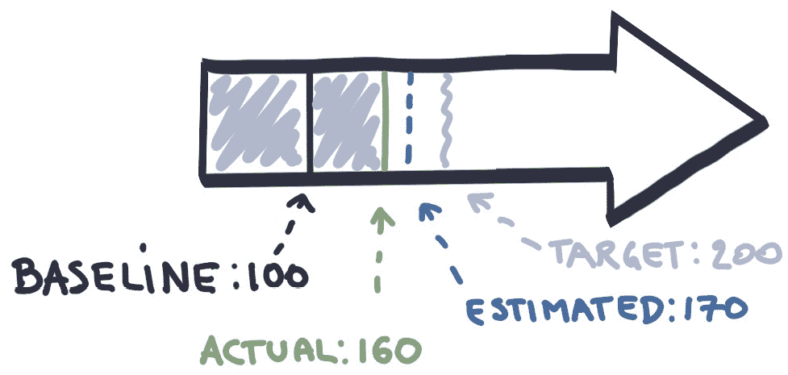

图 13.1：衡量目标

在衡量结果时，我们需要注意任何可能形成历史基线的先前测量，并且要考虑任何价值估算与实际价值之间的差异。思考这些不同形式的度量让我们提出了这样一个问题：*我们应该在哪里和何时进行度量和学习，又应该在哪里检查这些度量？*

### 展示

理想情况下，我们在交付项目完成后立即进行度量。这可能是在 Scrum 的一个冲刺结束时，或者是在 Kanban 中交付一个完成的特性后。或许我们可以将度量数据收集嵌入到应用程序代码中，并在展示会前或展示会期间运行报告。例如，如果我们的目标结果是将用户基数增加到 10,000 人，那么每个展示会都可以提供当前用户基数的更新，并展示其是否朝着目标的正确方向发展。

由于数据可用性存在延迟，可能无法在展示会活动中呈现。在这种情况下，有两种应对方案。首先，我们可以利用展示会本身收集一些度量和来自利益相关者的反馈。或者，我们也可以收集来自利益相关者和用户对最新产品增量的度量和反馈。但该如何进行呢？

或许我们的目标结果是围绕利益相关者的信心和/或用户在我们逐步构建的应用程序中的满意度。如果是这样，那在展示会后询问利益相关者他们对所见内容的信心或满意度，还有什么比这更好的机会呢？这可以是定量的，例如我们可以要求利益相关者在 1-10 的评分范围内对产品进行评分。也可以是定性的，通过围绕评分展开的对话以及收集反馈数据时的附加反馈。

或许我们的目标结果是围绕员工参与度和团队技能。再次强调，在交付循环的每次迭代结束时，调查团队成员的幸福感并让他们对不同的技能进行自我评分，又有什么比这更好的机会呢？这种可视化不仅可以让我们看到趋势，还能帮助我们识别由于团队教育和文化活动所产生的正负效应。

展示会活动提供了展示各种度量标准的机会：软件交付度量、平台度量和团队速度度量。我们稍后会深入探讨这些内容。如果这些内容对观众有吸引力并帮助他们理解团队所做工作的影响，那么一定要包括它们。然而，能够进行更深入对话的活动通常是紧随展示会之后的回顾性。

### 回顾性

在上一章中，我们介绍了回顾性实践并探讨了多种实施格式。接下来，让我们进一步考虑度量标准，并从工程师的角度看回顾性。

## 回顾性 – 工程师视角

回到 1980 年代末，我清晰地记得在化学工程课程中第一次接触到**反馈回路**和**控制理论**，那时软件工程还没有完全占据我的职业生涯！如果你想控制油箱中的液位、管道中的流量，或者几乎任何动态变化的系统，你需要学习如何保持系统的稳定。软件工程中的回顾实践总是让我想起那些二阶反馈回路，它们是我们软件设计和开发过程中的物理连接，让我们能够学习和适应，从而使系统变得更加稳定。

回顾会议的共同目标是让团队检查刚刚发生的事情，同时让他们能够调整和改进未来的工作。这是一个至关重要的功能。如果没有反馈或者反馈没有得到处理，团队可能会开始对整个交付过程失去信心。在工程领域，如果反馈失败，油箱就会溢出！

没有什么比度量指标应当作为回顾会议中的热议话题更不令人意外了。讨论表现不佳的 SDO 或 CI/CD 度量指标的团队，可以深入了解软件交付过程中出了什么问题。因此，当构建开始需要 20 分钟才能完成时，应该庆祝。这意味着度量指标的测量和趋势已到位，团队现在可以采取行动找出为何变得如此缓慢，并寻求改进。

通过及时听取反馈，能够节省大量浪费的时间和资源。如果忽视反馈，可能会在接下来的一年里，花时间做补救项目，而不是推出新的创收功能。这个故事的寓意是：回顾，回顾，再回顾！你真的永远不会得到足够的反馈。

在我们创建技术基础（在*第六章，开放技术实践 - 开始，正确启动*，和*第七章，开放技术实践 - 中期*中提到）时，所有的工具和技术都已经到位，我们可以收集和进行大量的数据、度量和分析。如果你进行酒吧回顾（如前一章所介绍），没有什么比拿几份工具报告打印件，带到酒吧去，边喝着吉尼斯啤酒边分析它们更好的了！

图 13.2：酒吧回顾 – 讨论度量指标

导出你的构建统计数据、最新的测试结果、静态代码分析报告、燃尽图，以及你能找到的其他任何数据，把它们都摆在桌上，问问自己：这些数据告诉我们什么是我们之前不知道的？我们能学到什么？存在哪些模式？我们能在下一个迭代中做些什么来改进这些测量？

常见的回顾会议行动包括：更加关注 CI/CD 基础设施，提升代码覆盖率的阈值，并为团队增加更多或更快速的反馈循环，以便从中学习。

## 在回顾会议中检查构建统计

这是我最喜欢用来突出回顾会议（Retrospective）强大影响力的一个例子。我在 2008 年为一家英国电信公司提供访问控制管理解决方案时收集了这个图表。我的团队使用 Scrum 和持续交付方法，构建了一个基于 Java 的应用程序。他们使用 Hudson 进行持续集成，并且有大量的自动化测试，这些测试作为团队"完成定义"的一部分，逐步集成到应用程序中。

每两周导出几个构建图表，并带到团队的回顾会议中。下图展示了构建的持续时间以及构建的成功情况（红色表示构建失败，黄色表示构建成功但部分自动化测试失败，蓝色表示构建成功且所有自动化测试通过）：

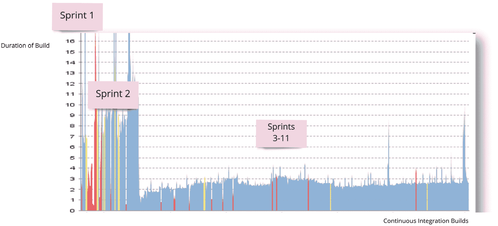

图 13.3：在回顾会议中检查构建时间统计（图表已加注标签，反映了数据所涉及的冲刺）

正如我们所见，在第 1 次冲刺（Sprint 1）中，构建非常不稳定。该图表的一个早期版本在第 1 次冲刺结束时被带到了酒吧回顾会上。团队进行了检查，并一致认为，在第 2 次冲刺中，他们将花一些时间调查构建稳定性问题。

两周后，第 2 次冲刺完成，ScrumMaster 带来了 Hudson 上打印出的这个图表。好消息是，第 1 次冲刺回顾的行动得到了回报，构建变得更加稳定。然而，团队注意到有时构建完成的时间超过了 15 分钟。这是一个比所需时间更长的反馈循环，因此在第 3 次冲刺中采取了进一步的回顾行动来解决这个问题。从第 3 次冲刺开始，我们可以看到构建大多数时候保持稳定并且相对快速。

想象一下，如果我们没有在回顾会议中查看这些数据。想象一下，如果我们让缓慢的构建问题继续拖延下去。想象一下，会浪费多少时间。这就是为什么我们要进行以指标为驱动的回顾会议。

当我们走出冲刺后，我们将有机会学习我们设计的实验结果。

### 实验——结果！

在*第十一章*，*选项枢纽（Options Pivot）*中，当我们介绍选项枢纽时，我们介绍了一些可以在实验中设计的高级部署策略。如果我们在设计实验时决定使用其中一种或多种策略，那么现在就是衡量和学习实际结果的时刻。

如果我们设计了 A/B 测试，我们会查看收集到的关于流量、互动、时间花费以及其他相关指标的数据，以便根据用户行为的变化来评估这两个版本的有效性。

如果我们设计了金丝雀发布，我们是否从参与金丝雀发布候选的用户行为中学到了经验，以验证是否应该将该功能推广到更广泛的用户群体？同样地，通过暗启动和功能切换，我们从使用中收集指标来评估是否应该将功能发布扩展到更大的用户群体，或者应该关闭并回滚暗启动。

从这些实验和相应的分析中获得的所有学习都是定量的。这意味着你可以研究数据，观察趋势，决定是否延伸实验，或者创建全新的实验。随着你运行更多实验并收集更多数据，你的决策能力变得更加强大，并且是基于从中收集的度量标准。

当然，并不是所有事情都能通过数字验证。通过与最终用户交谈获得进一步的学习和理解是必要的，这称为定性反馈。让我们探索几种帮助我们做到这一点的实践，从用户测试开始。

### 用户测试

基于用户的测试是一种专注于用户与产品互动的技术。这些评估类型直接涉及最终用户，并专注于个人。让我们通过查看两种用户测试实践来深入了解一下：可用性测试和灵活测试。

### 可用性测试

在可用性测试会议中，团队观察真实用户与产品的互动。通常，一个主持人与用户坐在一起，要求他们完成任务并在操作过程中解释他们的思考过程。团队则坐在另一个房间，通过视频链接观察测试过程。

可用性测试不是焦点小组；它专注于用户在真实世界中的想法和行为。如*第八章*“发现为什么和谁”，所介绍的同理地图，可以是一个非常有用的支持实践。

可用性测试可以运行在现有产品、原型甚至竞争对手的产品上。原型可以是工作代码，也可以是几个可点击的图像。早期和频繁地测试，以创建让用户喜爱并解决真实需求的产品。

可用性测试经常会突出一些对于产品开发人员来说显而易见但对用户可能会令人困惑的事情。我们认为用户需要的可能并不是他们实际需要的。实际上，用户认为他们需要的也许并不是他们实际需要的！可用性测试可以帮助回答诸如，“我们是否在正确的轨道上？”“我们仍然需要解决哪些问题？”或者“我们接下来应该开发哪些功能？”通过从真实用户获得早期反馈，团队可以避免浪费时间在一个令人困惑或没有用处的功能上。

## “我们不是我们的用户”

我曾与一位非常出色的设计师共事，他曾告诉我：“*我们不是我们的用户*。”由于我在开发团队中花了相当多的时间在代码编辑器前，我认为我明白他的意思。但直到后来发生了一件事，我才真正理解他的意思。

我们正在为一个抵押贷款应用程序构建一个轻量级的原型。前端使用了一个现有的银行 API 来计算抵押贷款，我们正在构建的应用程序在提示用户输入收入估算之前，会先询问几个初步问题。用户最初填入的文本框中有一个占位符，内容是*例如 100,000.00*。

在与产品负责人和用户体验设计师一起进行开发和测试时，我们一定填写了这个表单上百次！每次使用表单时，我们都是以完全相同的方式填写的，只是将 100000 填入那个框中。我们从来没有任何人往框中填过小数点！

几周后，我们开始进行一些真实世界的测试。当然，第一个使用我们应用程序的人填写了表单，把"120000.00"输入到框中并点击了提交。正如你可能想象的那样，我们原本预期一切都会顺利进行，用户反馈环节会继续进行；但实际上，应用程序崩溃了。

图 13.4：抵押贷款应用程序

进行可用性测试的业务分析师立即打电话告诉我们应用程序坏了。我们重新回放了用户的操作，结果发现银行的 API 无法接受小数点。但对我们来说，真正的惊讶是我们团队没有人注意到这个问题。作为一个小团队，我们迅速通过更新占位符文本并仅向 API 发送整数来解决了这个问题。

这个例子总是提醒我，我们不是我们的用户。用户在应用程序中会做出奇怪又神奇的事情。即使你试图测试所有的场景，几乎总会有一些你没有想到的边缘情况，而且很有可能第一个使用你应用程序的人会做出那个奇怪的事情！

在[openpracticelibrary.com/practice/usability-testing](http://openpracticelibrary.com/practice/usability-testing)的开放实践库中，您可以深入了解可用性测试实践，分享自己的经验，提出问题，并进一步改进这一实践。

在组织可用性测试时，您可能遇到的一些挑战包括让实际客户访问遗留系统，或者没有足够的时间、资金或专家来进行这种程度的测试。游击测试提供了一种低成本的替代方案或补充形式的定性用户测试。

### 游击测试

游击测试是一种低成本、精益和敏捷的方法，用于在短时间内针对特定任务收集数据来测试和验证假设。参与者不会提前招募，而是由团队在多种环境中接触，目标是类似的人群，例如在咖啡馆的顾客，或在办公室环境中的管理员。

这种测试提供了一种简单的方法来收集足够的数据，以做出明智的战略设计决策。它还可以帮助高级利益相关者和产品团队理解可用性测试和客户反馈的重要性。团队中的每个人都可以在没有研究专家的情况下参与。它是一种灵活的方法，可以在产品开发的任何阶段实施。

## 在繁忙的都柏林银行进行游击测试，带着一盒甜甜圈！

进行任何可用性测试或从控制组生成反馈不必是一个涉及大量焦点小组的庞大昂贵的活动；它可以是一个简单的活动！在前一个示例中，我们在每个迭代后进行游击测试。这是一种产生真实世界反馈的惊人方式，而且几乎不花费什么。

我们会进入一家银行，每周选择不同的分行，分布在城市的不同区域，以获得不同的观点。我们带的东西非常简单——只有应用程序和一大盒甜甜圈！计划也很简单：我们会引诱人们来到我们的摊位，邀请他们参与一个简单的反馈环节，作为交换，我们提供免费的甜甜圈！用户会实际体验应用程序，并给我们一些宝贵的见解，帮助我们发现遗漏或未考虑到的地方。甜甜圈的盒子成本很低，但它为我们提供的反馈却是无价的。

了解更多关于游击测试的实践，分享你自己的经验，提问，进一步完善这个实践，可以访问[openpracticelibrary.com/practice/guerilla-testing/](http://openpracticelibrary.com/practice/guerilla-testing/)。

## 宠物对战可用性测试

通过观察变更的顺利交付和生产系统的整体稳定性，宠物对战团队希望避免当应用程序的业余版本迅速传播时出现的失败类型，同时快速向软件产品中引入新的修复和功能。

团队希望收集数据并测量的第一个领域是：将新特性投入测试环境所需的时间。通过自动化并减少将修复和特性投入可进行测试的环境所需的时间，将缩短反馈循环，使团队能够快速获得对其更改的反馈，而不是等待发布。PetBattle 团队不确定该测量哪些正确的指标，但他们认为从这个开始有助于发现更多可能有用的软件交付指标。

团队希望关注的第二个测量领域是一些简单的性能测试。在测试环境中，计划是同时加载 PetBattle 应用程序，观察其表现并尝试识别系统中的任何错误或瓶颈。提前进行检查希望能够揭示团队在应用程序的业余版中看到的任何问题。同样，团队还不确定该将哪些系统部分作为性能测试的重点，或者应该关注哪些指标，但将 PetBattle 套件部署到可以进行此类测试的环境中是第一步。

采取度量与学习的方法来进行展示、回顾、实验和用户测试，使我们进入一个持续循环：构建一些小的东西，找出衡量方法，收集数据并从中学习，这将激发更多的想法。

在*精益创业*中闻名的*构建、衡量、学习*反馈循环，是平台、技术和文化工具赋予我们的一项最强大的工具和思维模式，这些工具贯穿了本书的内容：

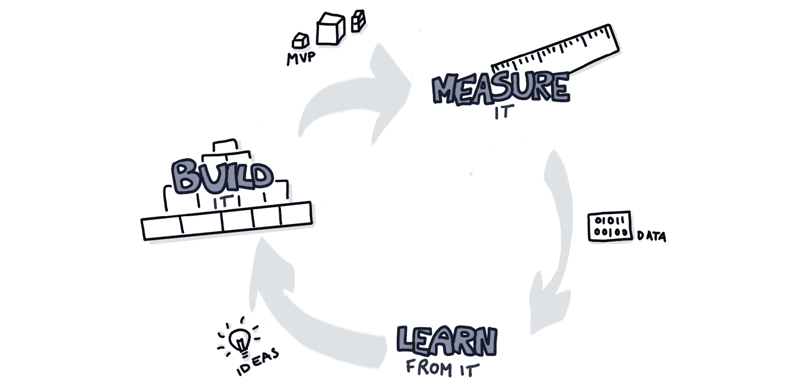

图 13.5：精益 – 构建、衡量、学习

让我们更详细地探讨一下该测量什么。

## 测量什么？

*你测量的就是你得到的。* – H. Thomas Johnson

在评估作为*构建、衡量、学习*反馈循环的一部分时，我们将站在巨人的肩膀上。我们可以利用大量关于 DevOps 指标的文献，并将在这里指出我们当前的最爱。榜单最上面的是 DevOps DORA 报告 1 和书籍《加速》2，这两部作品描述了科学家们如何通过数据驱动的方法来衡量 DevOps 文化和实践。在**DORA**报告中，卓有成效的 IT 交付组织从代码提交到主干（Git 中的代码）到“运行在生产环境中”大约需要一个小时。这听起来很棒！因此，让我们来看一下可以帮助我们集中精力实现这一目标的一些详细指标。

### 衡量服务交付和运营绩效（SDO）

对于任何团队来说，一个关键问题是，*什么是好的表现？*

根据《Accelerate》中的研究，领先的组织每天多次更新软件，而不是每几个月更新一次，这提高了他们利用软件探索市场、响应事件并比竞争对手更快发布功能的能力。然而，这种响应速度的巨大提升并没有以稳定性或质量为代价，因为失败被迅速发现并修复。

衡量软件交付性能是一项艰巨的任务。我们可能很容易认为基于输出的度量已经足够。一些人经常声称，度量可能看起来类似于以下内容：

+   开发人员每天编写并提交的代码行数

+   以团队利用率作为衡量团队生产力的标准

+   团队的速度（或每个冲刺交付的故事/功能数量）

不幸的是，如果我们稍微深入分析一下这些内容，我们可以迅速发现所有这些度量的缺陷。

1 [`www.devops-research.com/research.html#reports`](https://www.devops-research.com/research.html#reports)

2 [`itrevolution.com/book/accelerate`](https://itrevolution.com/book/accelerate)

是不是可以通过一段 100 行的代码写出比 200 行代码更好的解决方案？表面上看似如此，但哪种解决方案更容易随着时间推移进行维护呢？哪种方案更清晰且更容易让新开发者发现和理解？可能是 200 行的代码对于团队来说更易于维护和学习，而不是那段只有专家理解的精心编写的黑魔法代码。如果一个团队的资源 100%都用于功能开发，那么他们何时才能有时间进行学习、处理临时工作或管理技术债务？没有时间做这些活动最终会导致交付和创新的停滞。如果一个团队每个冲刺交付 10 个故事，这比每个冲刺交付 5 个故事的团队更好吗？当不同团队在处理无关的工作项时，我们真的能比较他们的输出吗？可能不能。我们的用户故事是否对业务和最终客户的价值和大小相同？跨不同产品和所有权的团队之间很难做出这样的判断。

这些度量标准我们称之为基于输出的度量。我们可以将重点从团队产生的内容转移到目标或目标结果上。通过专注于整体结果，团队成员不会因为度量错误的东西而互相竞争。一个经典的例子是奖励开发团队成员推动新特性上线的速度，而奖励运维团队成员的服务稳定性。这些度量标准鼓励开发人员尽可能快速地将低质量代码投入生产，而运维人员则通过设置繁琐的变更管理流程来阻碍变更。

如果不专注于测量或测量正确的内容，而是专注于输出而非结果，可能很快就会陷入困境。幸运的是，DORA 报告开始列出团队可以用来评估 SDO 的一些关键指标：

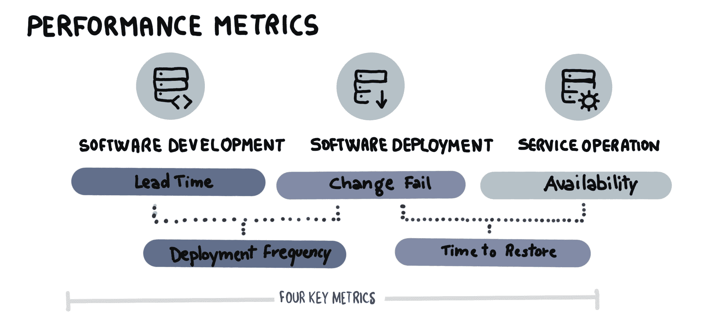

图 13.6：DORA – 性能指标

**软件开发指标**是衡量开发和交付过程有效性的指标，通过以下方式进行测量：

+   **前置时间**：从代码提交到发布到生产环境的时间

+   **部署频率**：团队将代码发布到生产环境的频率

前置时间是精益理论的一个关键元素：通过缩短将产品特性交付给最终用户的时间，团队可以缩短反馈循环，了解最终用户的喜好与不喜欢。如果团队构建了错误的东西，当前置时间较短时，他们可以迅速调整方向（或转变）以纠正问题。

另一个因素是交付工作的大小，即**批量大小**。通过快速向最终用户交付小而增量的价值，可以保持较低的前置时间。随着交付节奏的加快，如何确保系统稳定性不受影响？

**软件部署指标**是衡量系统稳定性和发布质量的指标。它们通过以下方式进行测量：

+   **恢复时间**：从检测到影响用户的事件到修复或解决的时间

+   **变更失败率**：已发布的变更中失败或导致用户影响事件的数量

生产环境中有多少变更失败？发生故障时，恢复服务到最终用户的时间是多久？如果发生变更时故障能迅速修复，开发团队的客户会更满意，理想情况下变更应该完全没有失败！

**服务操作指标**通过称为**服务可用性**的指标捕捉操作性能。假设你的产品销售网站崩溃了，公司会计可能会问，*我们的应用现在有产生收入吗？* 测量服务可用性是将技术目标与期望的业务成果联系起来的好方法。

目前为止定义的指标在帮助团队理解关键的软件、交付和操作指标方面发挥了重要作用，这些指标有助于更好的组织结果。为了帮助捕捉和传播这些指标，Red Hat 投资了一个开源项目，开发出了一个名为 Pelorus 的仪表板工具 3。

3 [`github.com/konveyor/pelorus/`](https://github.com/konveyor/pelorus/)

### Pelorus

Pelorus 是一个执行仪表板，帮助可视化我们在 SDO 成功指标上的进展。它利用了 Prometheus 和 Grafana 等开源工具来跟踪进展，既可以在团队内部（局部）跟踪，也可以在组织内（全球）跟踪：

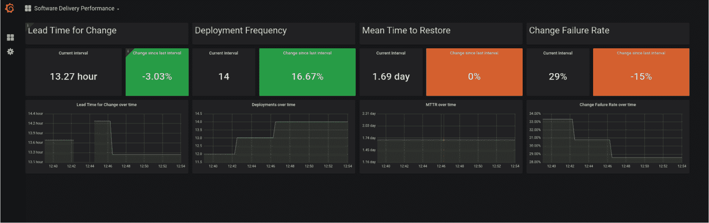

图 13.7：Pelorus – SDO 仪表板和指标

Pelorus 由一组导出器组成，可以自定义数据点，从不同的提供者收集指标。随着更多人参与，导出器自动收集指标的来源在不断增加。目前包括 OpenShift（作为部署时间导出器）、Git 提供商 GitHub、GitLab 和 Bitbucket（作为提交时间导出器），以及 JIRA 和 ServiceNow（作为已建立的问题追踪器）。

使用从提供者收集的数据点，计算指标来表示一个衡量标准。每个结果通过一组代表性指标来衡量：**变更周期时间**、**部署频率**、**恢复时间平均值**和**变更失败率**。

Pelorus 为团队提供了一个绝佳的机会，可以在团队旁边展示这些重要指标的实时信息。团队还可以定期在展示会和回顾会议上检查和讨论这些指标，并问自己可以采取哪些改进措施或实验来进一步提升这些指标。我们还应该衡量什么？

### 测量精益指标

精益运动还提出了一些指标，帮助衡量软件交付绩效。最简单的形式下，你只需要每个工作项或故事的两个信息：开始日期和完成日期。这听起来很容易衡量！但当然，你需要一些关于这些定义的政策。通过这两个度量，我们可以开始衡量许多不同的事情，特别是：

+   **过程中的时间**：每单位工作所需的时间。

+   **交付周期时间**：从请求功能到其交付到生产环境之间的时间。

+   **流动效率（或触点时间/交付周期时间）**：产品实际被团队工作并且增加价值的时间。

+   **截止日期绩效**：功能按时交付的频率。

这些指标大多数是性能的**滞后**指标。换句话说，它们衡量的是已经发生的事情。也可以制定**前瞻**指标，利用这些数据帮助预测未来的绩效。其中一个例子是基于工作项或故事进出团队的流动情况。工作项的净流动量可以预测截止日期交付的信心。当团队接受越来越多的工作时，这会减慢他们按时交付项的能力。因此，团队内外工作项的净流动量成为衡量工作项交付绩效的前瞻性指标。

启动和结束日期能够告诉我们很多信息。随着时间的推移，项目的分布也有助于对团队所承担的工作类型进行分类。例如，正常工作项可能与因生产故障而转到团队的优先工作项不同。另一个例子可能是需要长时间等待安全或合规团队批准的工作。这些工作项相比于不需要此类批准的正常工作项，通常会有更长的前置时间。

### 衡量 SLO、SLA 和 SLI

这些**服务级别**（**SL**）指标的目标是让客户、供应商和用户在系统行为和性能方面达成一致。特别是，每个人都需要知道并同意一些共同的 SL 问题，例如以下问题：

+   系统将可用多久，多久可用一次？

+   如果发生故障，恢复服务的响应速度会有多快？

+   如果我们发出单个请求，系统的响应速度会有多快？

+   如果我们发出许多并发请求怎么办？

+   服务的用户希望知道这些问题的答案，以便他们能够规划和设计如何使用任何给定的服务。例如，如果您正在构建一个必须始终可用的解决方案，并且它依赖于一个仅在工作时间可用的第三方服务，您可能需要不同的设计，或者实现一个缓存解决方案，或使用另一个具有更高可用性的服务。

SL 缩写可以大致定义如下：

+   **SLA**：通常是您组织与客户、供应商和用户之间签订的正式合同。

+   **SLO**：SL 目标是您的团队必须交付的结果，以满足协议。

+   **SLI**：SL 指标是用来衡量团队表现的实际指标数值。

正确衡量 SLA 可能非常困难。例如，服务可能可用，但性能降级。若只有部分用户经历部分中断，情况也会变得更复杂。捕捉这种 SLA 复杂性并准确衡量它是非常困难的。

SLAs 的一个好处是，它们可以让 IT 经理定量地衡量业务结果。因此，他们不需要处理诸如“我的应用程序无法加载，速度非常慢”等通用的定性投诉，而是可以衡量应用程序的可用性（正常运行时间）和百分位页面加载速度。

SLO 是关于在特定 SLA 中的一个指标的协议。一个简单的例子是，我们同意将搜索结果快速返回给最终用户，平均搜索延迟为 200 毫秒。相反，SLI 通常衡量 SLO。因此，我们可能会定义一个搜索目标的上限，例如规定 99%的搜索延迟必须小于 300 毫秒。

通过定量地指定和发布我们服务的 SLA、SLI 和 SLO，最终用户可以设定对服务性能的期望。这可以避免用户因服务缓慢而提出的定性抱怨，或者过度依赖某项服务，而用户期望它的可用性超出了实际情况。

## PetBattle 服务级别

当前的 PetBattle 爱好者应用没有 SLA——零，完全没有。PetBattle V2 将被构建为高可用性系统。考虑到该应用的受欢迎程度以及它是我们初创公司唯一的潜在收入来源，它被指定为“关键任务”应用。冗余将从各个层面进行构建：云基础设施层（网络、存储和计算），以及应用层（可扩展的冗余高可用服务）。PetBattle V2 将重新设计为“无共享架构”，以便最大化水平扩展而不会出现瓶颈。PetBattle V2 将要求满足 99.99%的可用性 SLA。这意味着每月允许的停机时间不超过 4 分钟！

任何外部系统如果有较低的可用性 SLA，在失败时都会对 PetBattle V2 的 SLA 产生负面影响。PetBattle 团队编写代码并运行服务，理想情况下，在开发和交付环节中，外部服务提供商应尽可能少。任何纳入应用程序的新服务都必须设计以满足这些 SLA。

通过定量地指定和发布我们服务的 SLA、SLI 和 SLO，最终用户可以设定对服务性能的期望。这可以避免用户因服务缓慢而提出的基于指标的定性抱怨，或者过度依赖某项服务，而用户期望它的可用性超出了实际情况。

### 测量安全性

恶意用户随时可能出现。我们如何确保保存在应用程序中的用户数据不会被滥用？或者如何避免我们的应用服务被用于非预期的用途，从而对组织或声誉造成损害？如今，数据泄露和与软件应用程序及服务相关的安全漏洞在媒体上屡见不鲜。回答这些问题通常是**信息安全**（**InfoSec**）分析师或团队的主要关注点。应对这些安全问题的现代方法被称为**将安全性左移**。这一术语与将信息安全整合进软件交付流程的团队相关，而不是将其作为一个独立的阶段，发生在开发过程的下游。

将安全性集成到软件开发中，不仅可以提高交付性能，还能提高安全质量。通过在系统中设计和实现安全性及合规性指标，可以测量对安全标准的持续合规性：

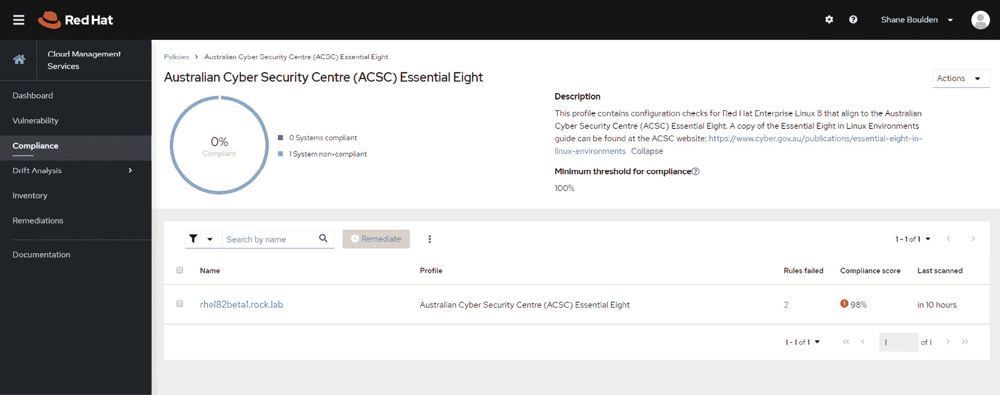

图 13.8：基于标准的系统合规性

## PetBattle 安全性

PetBattle 团队已要求创始人聘请一位信息安全专业人员，参与开发过程。他们担心 PetBattle V2 中用户详细信息的潜在数据泄露，特别是当我们开始为站点盈利时，如果需要开始收集支付详情。PetBattle 团队已教育他们的开发人员常见的安全风险，如 OWASP Top 10 及其预防方法。

团队计划将安全扫描和测试度量整合到他们的构建流水线中。通过使用 OpenShift 平台和受信任的软件供应链，团队可以显著减少修复可能出现的安全问题所花费的时间。

团队已经确定，每个人都需要非常熟悉整体解决方案的详细网络设计。这应该有助于避免恶意攻击者的攻击。团队还希望确保所有平台和应用程序都易于修补——这样他们就可以在**常见漏洞与暴露**（**CVE**）4 出现时，轻松地保持框架的更新。

4 [`cve.mitre.org`](https://cve.mitre.org)

拥有一个安全的系统意味着确保栈中的所有层都本身是安全的——包括确保硬件环境安全、操作系统安全、所使用的容器镜像层安全、应用程序所依赖的组件安全、应用程序代码安全、暴露应用服务的网络安全，最终确保最终用户能够安全地与应用程序进行交互。

衡量这些安全层，确保它们符合各种行业标准，并为新漏洞的出现制定具体行动计划，要求团队在软件交付生命周期的每个阶段都紧密合作。安全不应只是**首席信息安全官**（**CISO**）的工作。做得对的话，安全是无处不在的，并被设计进平台和软件系统中，安全专业人员应积极参与作为核心交付团队的一部分，而不仅仅是在渗透测试时充当“拒绝者”5。

安全是一个需要独立成书的话题。通过将安全向左移动，我们将在本书后续部分涉及技术话题，包括容器镜像和漏洞扫描、容器健康指数、CVE 补丁、OpenShift 合规性操作员、OpenShift 容器安全操作员以及通过 ACM 执行安全策略。这些工具可以帮助你为自己构建和补充一个持续合规的平台和应用程序套件。

### 性能衡量

软件开发人员常用一句格言——*先让它工作，再让它工作得更快*。这句话的真理在于，某些功能必须先存在，才能做得更快！性能和安全性等特性通常是我们应用程序最重要的非功能性需求，必须从一开始就设计到系统中，才能确保成功。让我们来定义一下什么是性能。

**性能** 衡量系统处理单个事务的速度。这可以在孤立状态下或者负载下进行测量。系统的性能对其吞吐量有重大影响。当最终用户谈论性能时，他们通常指的是吞吐量；他们只关心自己事务的性能，而不关心其他人的事务。对他们来说，如果系统的响应时间超过了他们的预期，那么系统就算是崩溃了。

**吞吐量** 描述了系统在给定时间内能够处理的事务数量。系统的性能显然会影响其吞吐量，但不一定是线性关系。吞吐量总是受到系统中某个约束的限制，这就是所谓的瓶颈。试图优化或提高系统中非瓶颈部分的性能并不会增加吞吐量。

5 *Mr. No* 是一本仅在法国发行的 *Mr. Men* 系列书籍。Mr. No 总是与每个人和一切事物意见相左。*Mr. No* 在法国出版时的标题是 *Monsieur Non*。这是两本未以英文出版的 *Mr. Men* 书籍之一。

如果我们衡量最终用户请求的数量，吞吐量将根据请求的多少而变化。这是一个衡量可扩展性的标准。当一个系统具有水平可扩展性时，意味着我们可以通过增加容量（更多的服务器、更多的 pods 或容器）来处理更多的吞吐量。在无共享架构中，我们可以增加容量，直到达到已知的瓶颈。例如，在 OpenShift 中，这可能是每个节点的 pods 数量，或者每个集群的最大节点数量。

还值得注意的是，对于任何给定的系统，“可接受的响应时间”可能是不同的！对于移动/网页应用程序来说，任何超过一两秒的响应时间都会让用户用手指离开，去浏览其他网站或应用。对于银行的交易系统来说，响应时间可能在毫秒级别甚至更短。要了解一个系统所需的容量，我们需要先全面了解系统，再将其拆解成各个部分。这被称为*系统思维*。通过从整体到细节地思考一个系统，我们可以找出系统中的瓶颈。

在任何时刻，系统容量都由一个约束因素决定。假设是数据库限制了事务吞吐量。一旦我们改善了这个瓶颈——例如，通过使用更快的存储、添加索引或使用更好的数据库技术——系统中的下一个瓶颈就会成为性能限制因素——例如，应用服务器的容量现在限制了吞吐量。

## 《宠物对战》性能

当《宠物对战》发布到全世界时，用户们会联手对抗我们。有时，用户群体会非常庞大。试想一下，Instagram 的编辑们在指着《宠物对战》网站时咯咯笑着说：“放出猫咪大军！”大规模的用户群体可能会触发应用程序的卡顿、死锁和难以察觉的竞态条件。

《宠物对战》团队希望运行特殊的压力测试，重点测试 UI 和 API 层中的深度链接或热点 URL。目前，用户和数据库之间有着直接的耦合，因此开发人员已经知道，在进行扩展时，可能需要某种形式的缓存。

如果我们将监控作为优先事项，就可以优化我们的基础设施和应用监控系统，确保收集到关于正确服务的信息，并有效利用这些信息。有效监控带来的可见性和透明度是无价的。主动监控是强大技术基础的关键组成部分。

团队计划将《宠物对战》应用套件部署到一个环境中，在负载下开始对系统的部分进行性能测试。他们希望从简单的目标开始，针对系统的各个部分进行测试，例如 API，以了解系统在负载下的行为。通过早期且频繁地进行此类测试，他们可以发现瓶颈，并从中制定解决方案。

就像安全性一样，将性能测试提前放到构建和部署过程中，可以提供更快的反馈，并有机会在开发生命周期的早期发现并修复问题。对于整个应用套件的复杂系统测试，通常要等到开发接近尾声时才能进行；然而，测试单独的 API、端点，甚至 UI 的部分可以通过自动化的方式频繁且尽早地进行。进行这种自动化性能测试的主要好处之一是能够建立一个关于系统性能的基线理解。如果没有进行这种自动化测试，任何改变系统性能特征的代码更改往往会被忽视，而你最终可能会在准备上线前才去应对性能问题。

### 测量部署的痛点

如果你曾经需要在夜班或周末工作，帮助将软件产品的大规模发布部署到生产环境中，你就会理解在上线前工程师和技术人员所感受到的焦虑和担忧。在文献中，这种现象被称为部署痛苦，它能够突出开发与测试任务和发布与运维任务之间的脱节。

从根本上讲，大多数部署问题都源于一个复杂且脆弱的部署过程，其中发生了以下情况：

+   软件通常在编写时并没有考虑到可部署性。

+   部署到生产环境需要手动操作步骤。

+   部署阶段涉及多个交接环节。

中断是所有系统中的常态，OpenShift 也不例外。有许多 Kubernetes 原语可以帮助我们的业务服务保持运行并保持可用（包括副本控制器、滚动部署、健康检查、Pod 中断预算、水平 Pod 自动扩展器和集群自动扩展器）。但即使拥有最好的基础设施，故障仍然可能发生。云服务中断、硬件故障、资源耗尽和配置错误仍然可能威胁到业务服务。

### 测量文化

指标与转型之间是有联系的。测量有助于指导所采用的实践。例如，通过收集 CI/CD 指标（如 PetBattle 应用程序的构建和部署时间），团队可以采用并发展出简化的 CI/CD 实践，从而实现更快、更频繁的发布，并且确信失败将是罕见的。随着团队逐渐习惯于定期将软件发布到生产环境，业务也开始相信发布可以以低风险对最终用户进行。这样就能加速新功能的发布，缩短反馈周期，并最终培养出一种鼓励快速变化和创新的文化。现在我们已经真正开始为公司解锁转型性的变革：

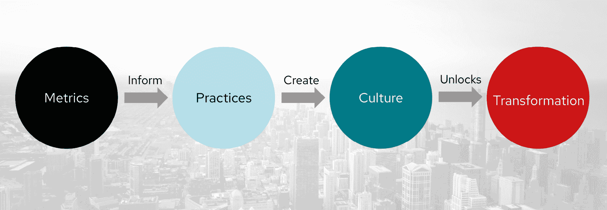

图 13.9：指标与转型之间的联系

运营指标通常衡量非常复杂的自适应系统中的失败。当出现故障时，权威式的责备文化会试图寻找“人为错误”并归咎于此。这种对失败的反应不仅不好，还应该被视为有害的。

任何故障分析的目标都应该是发现我们如何改善信息流动，让人们拥有更好、更及时的信息，或者找到更好的工具来帮助防止在看似正常的操作后发生灾难性故障。

### 测量应用程序指标

到目前为止收集的所有指标都集中在非功能性参数上。那么，关于业务应用程序呢？我们能否获取一些关于应用程序使用情况的实时指标，并将其与这些其他指标一起展示？

## PetBattle 应用程序指标

应用程序开发人员发现，通过利用 PetBattle API 服务器中的 MicroProfile 指标扩展，生成自定义应用程序指标是多么容易。创始人想知道实时上传了多少只猫。开发人员将指标扩展添加到他们的应用程序中，该扩展提供了默认的 Java 虚拟机（VM）指标，如堆、CPU 和线程。它还允许团队暴露来自应用程序的自定义指标。例如，通过在代码中添加 Java 注解，他们可以轻松地测量上传猫的频率。

现在可以使用 Prometheus 和 Grafana 抓取这些指标并在仪表盘上显示：

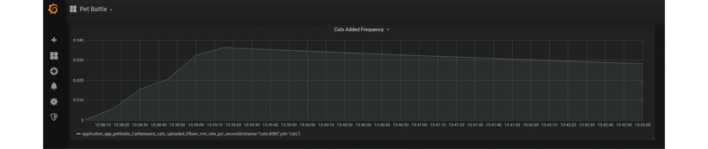

图 13.10：使用 Prometheus 和 Grafana 分析 PetBattle 应用程序的指标

我们可以监控内部指标，也可以监控外部指标。可以设置一个外部虚拟用户（通常称为合成用户）定期监控 PetBattle 应用程序。这个合成客户端体验与真实用户相同的系统视图。当该客户端无法处理一个虚拟交易时，例如尝试将其虚拟猫进入锦标赛时，无论内部监控是否显示问题，这都是一个问题！

团队认为有许多可能的稳定性指标，他们可以轻松地测量并在超出某个阈值时发出警报。慢响应通常会从一层传播到另一层，形成一种渐进式的级联故障。当网站变慢时，用户往往会更频繁地点击刷新按钮，导致流量越来越大。如果我们赋予系统监控自身性能的能力（换句话说，它变得可观察），那么系统也能告诉团队它何时未能满足其服务级别协议（SL 协议）。以下是一些示例：

+   用户数量和活跃会话

+   API 层的线程阻塞

+   API 或数据库层的内存不足事件

+   用户界面中的慢响应

+   高数据库 CPU

### 衡量基础设施平台的成本和利用率

OpenShift 带有一个成本管理和计量应用程序，可用于显示基础设施使用情况。您可以在 OpenShift 中部署成本管理指标操作器，报告和 API 作为 SaaS 解决方案的一部分提供，网址为[cloud.redhat.com](http://cloud.redhat.com)。

它允许 PetBattle 团队执行以下操作：

+   可视化、理解和分析资源和成本的使用情况。

+   预测他们未来的消耗并与预算进行比较。

+   优化资源和消耗。

+   识别需要调查的使用模式。

+   与可以从成本和资源数据中受益的第三方工具集成。

有许多可用的可视化和仪表板。*图 13.11*展示了一个大规模演示环境中的概览仪表板作为示例。可以在基础设施和业务层面跟踪成本和使用情况。用户可以标记项目和应用程序，以获得详细的拆分数据和历史趋势。这些仪表板可以帮助回答常见问题，例如：

+   显示按使用情况和成本排序的顶部项目和顶部集群：

    +   哪些项目的成本最高？

    +   哪些集群的成本最高？

+   显示度量标准如何影响成本：

    +   成本的驱动因素是什么？CPU、内存、存储？

    +   下一个日历月的预测成本是多少？

可以在累计成本和日成本之间切换，并且可以跨集群、云和项目进行筛选和深入分析：

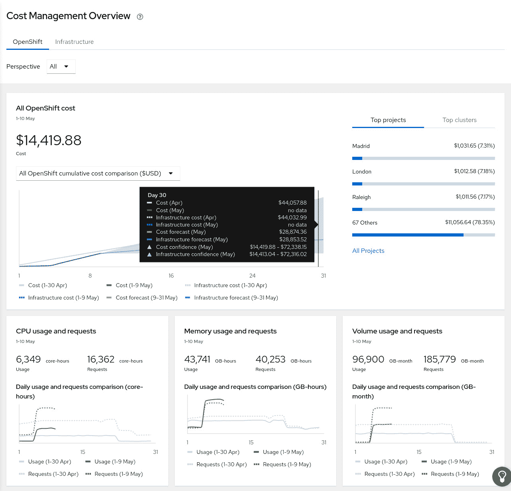

图 13.11：cloud.redhat.com 上的成本管理概览仪表板

您可以查看成本管理产品文档，6，其中有关于此服务的更多细节，包括跨混合云的常见配置选项。

6 [`access.redhat.com/documentation/zh-cn/cost_management_service/2021`](https://access.redhat.com/documentation/zh-cn/cost_management_service/2021)

### 资源和服务的测量

有许多简单的高级检查应适用于我们所有的资源和服务。**USE**方法是一个简单的检查清单，可以总结为*对于每个资源，监控以下项目*：

+   **利用率**：资源忙碌的时间百分比。

+   **饱和度**：资源执行的额外或超负荷的工作量，通常是队列长度或类似的指标。

+   **错误**：发生的错误事件的数量。

应该调查错误，因为它们可能会影响性能，并且在失败模式可恢复时可能不会立即被发现。这包括失败并重试的操作，以及从冗余设备池中故障的设备：

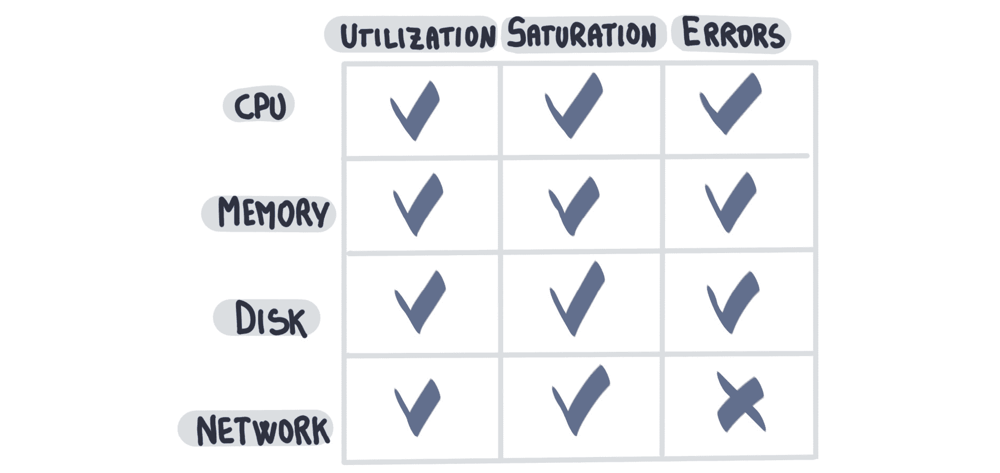

图 13.12：USE 度量标准

我们可以将 USE 度量标准映射到常见资源，并以表格形式展示，如*图 13.12*所示，便于快速识别系统中发生的问题类型。OpenShift 度量堆栈支持在集群和节点级别的预配置 USE 方法仪表板：

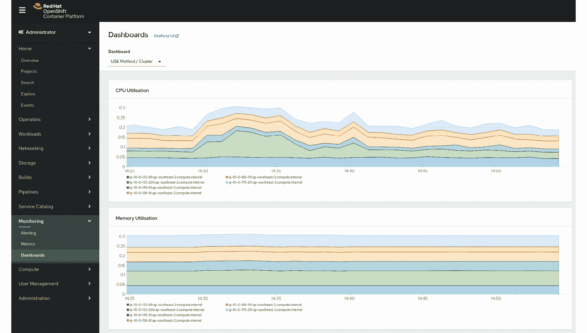

图 13.13：OpenShift 监控 USE 仪表板

类似地，**RED**方法可以总结为*对于每个服务，监控请求*：

+   **速率**：每秒请求数

+   **错误**：失败的请求数量

+   **持续时间**：请求完成所需的时间

RED 方法是一个很好的基准，可以应用于大多数基于请求的服务。它减少了 SRE 的认知负担；换句话说，他们可以用相同的方式思考大量支持的服务的基准指标。RED 方法在批处理导向或流式服务中会出现问题。在《Google SRE 手册》中，原始的“四个黄金信号”包括了 RED 和饱和度指标。

### 用户体验分析

宠物战斗用户界面中蕴藏着大量的用户分析数据。最明显的分析涉及非功能性性能度量，例如页面加载时间和响应延迟。希望通过测量并基准化基本的用户界面性能，团队能够防止应用服务被大量客户涌入所冲击！

标准做法是使用直方图（百分位数）来进行测量，这可以更好地理解异常值的表现。可靠地测量和聚合来自多个来源的高速度指标的分位数/百分位数可不是一项简单的任务。

## 宠物战斗用户体验分析

鉴于将宠物战斗货币化的主要目标，加入提供网络分析的全球企业之一，帮助向最终用户销售定向广告，可能比从头开始构建定制的分析和广告解决方案更有效地利用资源。分析服务可以快速提供页面加载时间、点击率、广告、站点搜索优化和建议，并帮助识别增销机会——当然是收费的。

作为测试最终用户体验的一部分，对用户界面进行自动化负载测试可以为团队提供一个关于运营宠物战斗 V2 站点的预览。

我们在这一部分展示了我们可以使用指标执行的多种不同层次的定量分析。现在，让我们看看这些如何转化为我们关注的结果。

## 可视化可测量的结果

现在我们有很多可以测量的东西。我们如何判断自己是否*推动了变化*，并对现状产生了可察觉的影响？通常情况下，关键的指标和数据并不是所有人都能看到的；它们隐藏在计算机上的登录页面后面。

为了解决这个隐藏数据的问题，我们可以利用更多的信息辐射器，将所有信息展示在团队工作区域的墙壁上，使用仪表板和大屏幕，以便直观地展示交付工作各个方面。我们可以分享对团队成员、利益相关者和用户都很有用的各种信息。它可以被物理地展示在墙壁、窗户、门和其他平面表面上，并且放置在那些能够从中获得价值的人眼前。

使信息更加易于获取会带来一些有趣的后果。这些后果包括团队合作的速度和准确性的提高。因为信息现在是随时可见的，人们经常会被提醒。并且，如果信息始终显示出来，就不需要浪费时间去寻找重要信息。由于人们不断地被提醒，信息的准确性也更有可能得到保证，如果信息不准确，就会有人提出问题！

当不属于核心团队的人进入团队空间时，墙面上展示的信息可以立即被读取。利益相关者和对团队工作感兴趣的人可以立即更好地理解和意识到正在进行的工作。这一活动通常被称为*走墙*。相关方可以检查墙上的资料，并与团队成员就这些资料进行交流。这与信息隐藏在系统背后，需要登录才能查看的情况截然不同。

### 主动通知

那么，当事情开始出问题时，会发生什么呢？当系统本身无法通过自动重启 Pod 或扩展集群节点来解决问题时，会发生什么？这就进入了**警报**的领域。

警报可以有多种形式。它可能是凌晨 03:00 时出现的那个可怕的短信，表明事情已经严重出问题，或者是一个更为微妙的警报，比如 Slack 消息提示某项更新成功。这里的关键是信息是被推送的，而不是被拉取的。OpenShift 内置了警报功能，我们将在*第十六章*中更详细地探讨这个问题，*掌控它*。

经典的警报形式之一是当应用程序的内存使用量出现激增时。这可能导致应用程序失败或不断重启。在这些情况下，团队可能会在仪表板上看到内存激增的情况，并开始调查问题。当然，我们可以通过将来自不同来源的数据结合起来并基于这些数据发出警报，从而使这个反馈循环变得更加迅速。例如，如果我们的应用程序内存激增，我们可以捕获那个时刻的日志，并将这两个事件推送给团队，这可能有助于更快地诊断问题。智能通知的真正优势在于能够对事件作出更加迅速的反应。

向开发团队发送关于故障的警报非常重要。通知可以来自系统的各个层面；它不仅仅是深夜接到的那个可怕的电话，告诉你网站宕机了！每当有任务运行来构建我们的代码或部署新版本的应用程序时，向团队的即时通讯软件发送一个快速的通知是通知相关利益方的一个好方法。如果信息是及时的，我们可以更有效地作出反应。这可能意味着拉动安东绳并停止生产线，以便我们集合起来解决问题。

### 改变客户

我们日常依赖的软件有时会出现停机。及时通知开发人员和 SRE 关键故障信息对于解决问题至关重要。透明地通知客户系统故障以及解决路径，能够让你在众多公司中脱颖而出。许多公司都会为他们的软件提供状态页面，让用户了解服务是否正常。例如，Quay 容器仓库的状态页面 7 为你提供了服务哪些部分仍然正常运行的情况。这是一个很好的信息展示平台！一些全球顶级的软件公司不仅会发布停机状态，还会几乎实时地发布他们为解决问题所采取的步骤。像 GitHub 和 GitLab 这样的公司会通过 Twitter 发布消息，或者开设 Google Doc 发布更新，尽可能为用户提供接近实时的更新。这种透明度非常值得称赞，尤其是当他们遇到的问题可以让其他使用相同技术的人深入讨论时。这让大家可以变得更加主动，在下次重大升级时避免犯同样的错误！

7 [`status.quay.io/`](https://status.quay.io/)

警报只有在及时触发时才有用。如果警报在条件发生后才触发，且没人能及时采取措施，那就没有任何意义。设计警报阈值时往往需要在平衡中找到一个点，以确保负责产品或系统的人可以主动采取行动，而不是一到达到某个限制就频繁地“狼来了”似的发送警报。

## 玩转通知和构建！

作为一个自认懒惰的开发者，我知道当我推送代码时，我很可能不会去检查自动构建的结果。我知道这是自大，但请听我解释。通常，我的想法是，它在我本地没问题，构建过程中还能出什么问题呢？

事实上，很多时候，事情确实会出错，比如我忘记连接代码，或者在提交前忘记添加文件。事情就是会出错。这也是为什么无论我在哪里工作，我都喜欢在 Jenkins 上查看大仪表盘，就像*图 13.14*所示，或者监控器，这样每个人都能看到构建状态。

它们是反馈环路中如此重要的一个元素。我看到这样一个仪表盘时，能立刻看到一些关键信息，这些信息能让我更轻松地完成工作，比如当前构建的步骤、是谁触发了构建、或者有多少个测试失败了！这些是简单的信息，但作为一个懒开发者，我几乎无法忽视那些闪烁着红色警告的东西！

我喜欢任何可以帮助缩短反馈周期的东西。我特别喜欢一个与 Jenkins 仪表盘配合良好的插件，叫做 **Build Fail Analyzer**。它会解析构建日志中的特定正则表达式，如果找到匹配项，它可以显示一条消息。在项目中，这张截图来自一个团队，他们已经养成了试图将失败问题规范化的习惯，因此当检测到问题时，它可以提示我们解决，而不需要翻阅日志。

在这个仪表盘上，在左中侧，我可以看到 dev-portal-fe-e2e-tests 测试套件失败，问题是 selenium 没有启动。有了这个信息，我不需要打开 Jenkins 去查看日志发生了什么 —— 我可以直接去 OpenShift 查看为什么 pod 没有启动：

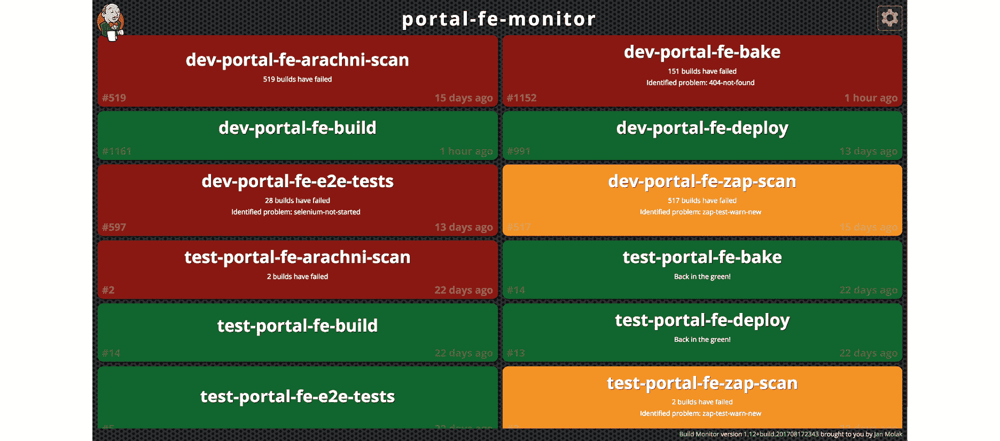

图 13.14：Jenkins 中的 Build Fail Analyzer

构建失败有时被视为一种诅咒状态。我们尝试鼓励无责文化，但有时玩玩“责任游戏”也是一种乐趣。我肯定是这个文化的粉丝！每当你构建失败，你就会被认为是牛仔程序员，那个人骑进小镇，肆意开枪，根本不顾后果。或者你可能只是代码里留了个拼写错误！

无论如何，如果仪表盘变红，那么你就得像个牛仔一样打扮。这支团队更进一步：不仅你需要戴上粉色的牛仔帽，直到问题解决，还得骑上木制的 hobby horse！即使是去洗手间或者喝咖啡，马和帽子也得随你一起去！你会惊讶地发现，穿着这种装备走到餐厅时，你会收到多少好奇的目光：

图 13.15：牛仔程序员

更多傻乎乎的例子来自我几年前在一个项目中参与的工作。那时还没有使用容器平台，我们有几台手动配置的虚拟机，它们在我们发布软件时至关重要。这是一个庞大的项目，全球分布了七个 Scrum 团队。我们正在构建一个包含 50 个产品微服务的套件，因此我们的构建农场总是忙个不停！

有一次，我们不得不让管理我们基础设施的 IT 公司回滚到之前的某个备份，因为有人以 root 身份执行了大量命令，导致 Jenkins 发生了几项故障。即使是提交 `sev1` 故障单，也花了几天才解决！我们不能让这种事情再发生，因为它严重影响了团队的士气和生产力。因此，我们决定动脑筋想个办法。我们使用 Slack 作为消息客户端，知道你可以通过 webhook 向频道发送消息。我们还知道，如果有人以 root 用户登录机器，我们可以执行 bash 脚本。结合这些，我们在 Slack 实例中创建了 Kenny Loggins 频道...因为当你以 root 身份登录服务器时，你就进入了 *危险地带*！

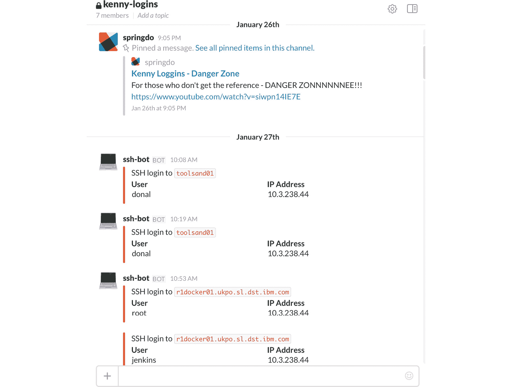

图 13.16：Kenny Loggins 频道

本节展示了我们可以通过多种方式来可视化结果，并利用衡量标准触发主动通知，以加快学习过程。让我们看看如何将这一切与我们在交付环中学到的其他内容进行总结。

## 创建交付地图

我们通过一张发现地图结束了*第三部分*，*发现它*，这张地图是一个信息展示板，概述了发现环的迭代过程。我们通过一张选项地图结束了*第四部分*，*优先排序它*，该地图总结了我们希望验证的想法和假设，如何交付这些选项，以及我们计划首先处理哪些选项。

我们将通过一张交付地图结束*第五部分*，*交付它*。这是一个开放源代码的工件，可以在莫比乌斯工具包中找到，您可以使用它来总结您在交付环中学习到的所有内容和做出的决策。

这张地图应该与您的发现地图紧密结合，并用于总结以下内容：

+   **行动**：我们本周可以做些什么来改善结果？

+   **进行中**：我们当前正在进行的工作是什么？

+   **完成**：什么准备好进行审查？

+   **影响**：我们在实现结果方面取得了什么进展？

+   **学习**：我们学到了什么？

+   **洞察**：我们的下一步是什么？

当我们离开交付环并返回*第七部分*，*改进它，保持它*中的选项枢纽时，我们将通过询问*我们的下一步是什么？*来完成这张地图的最后部分。

现在，让我们看看 PetBattle 在交付环第一次迭代结束时的交付地图。

## PetBattle – 交付地图

*图 13.17*包含了许多细节，可能在打印时无法完全读取。要查看完整内容，您可以访问本书在 GitHub 上的仓库：[`github.com/PacktPublishing/DevOps-Culture-and-Practice-with-OpenShift`](https://github.com/PacktPublishing/DevOps-Culture-and-Practice-with-OpenShift)：

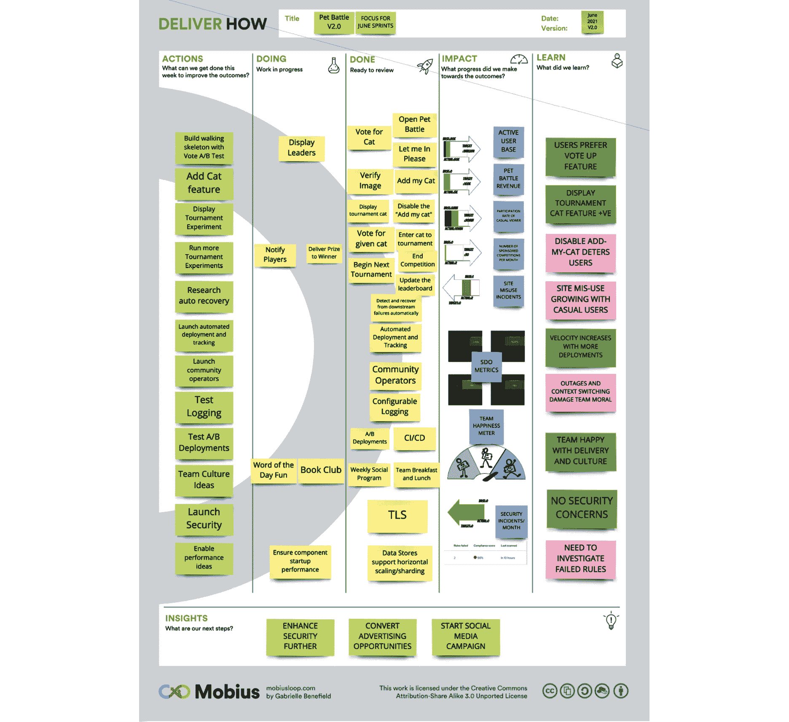

图 13.17：PetBattle 交付地图

交付地图提供了一个强有力的总结，概述了我们在交付环中经历的整个旅程。像所有其他工件一样，它是一个动态的、不断变化的总结，应定期回顾并在每次后续迭代后更新。

## 结论

我们现在已经完成了莫比乌斯环的旅程。在本章中，我们重点关注了从我们发布的功能、运行的实验和进行的研究中可以获得的衡量标准和学习成果。持续关注衡量标准使我们能够做出更具实质性的决策，这些决策有数据支持的证据。

Scrum 和其他敏捷团队经常举办的展示和回顾活动提供了充分的机会来展示指标并强调学习成果。我们借此机会重新审视我们在选项枢轴（Options Pivot）上的实验，并调查实际发生了什么。这通常涉及查看平台提供的高级部署功能所提供的分析数据——A/B 测试结果、金丝雀发布、功能切换和暗发布的结果。

我们还强调了与整个团队一起进行可用性测试的重要性，同时与最终用户直接连接，培养更多的共情，并观察他们测试不断发展的应用程序。游击测试也提供了一种低成本且简单的方式来从用户那里获取反馈和学习：

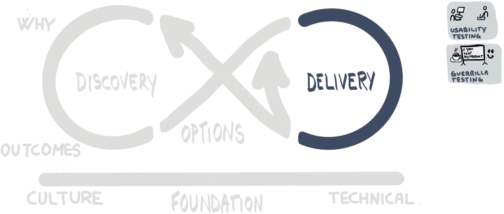

图 13.18：交付环

我们探索了平台、软件和我们的团队提供的许多不同指标。由 DORA 和 Accelerate 推广的服务交付和运营绩效指标，以及像 Pelorus 这样的开源工具提供的指标，能够为 DevOps 文化和实践的成功提供领先指标。这些指标可以通过进一步收集关于安全、性能、文化、应用程序本身以及基础设施的度量来支持。实时、公开和透明地展示这些指标的重要性不容小觑，同时，采取行动以便对指标的变化做出反应并迅速调整行为和实践，也同样至关重要。

当我们结束*第五部分*，*交付它*时，我们可以看到许多实践使我们能够在文化和技术基础上顺利地航行于莫比乌斯环：

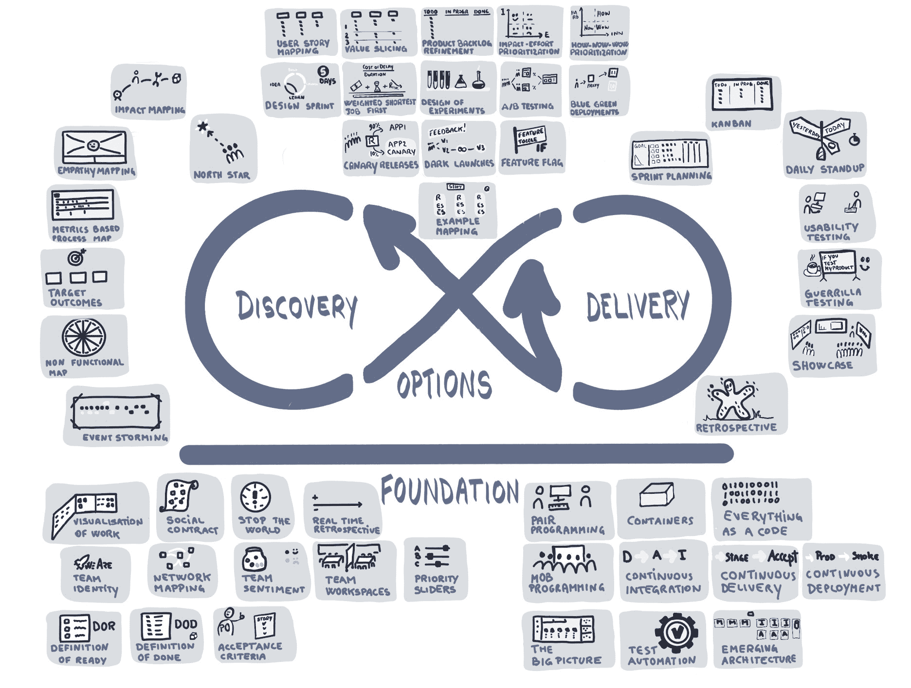

图 13.19：映射到莫比乌斯环的实践

尽管我们已经完成了莫比乌斯环的一个循环，但我们并未完成这段旅程。我们永远不会完成这段旅程，直到整个产品关闭并退役。这是因为莫比乌斯环是无限的，永无止境。当我们从交付环回到选项枢轴时，我们将在*第十七章*，*改进它*中探讨我们绕环旅行的洞察，并询问我们学到了什么，接着探讨下一步要做什么。

在那之前，我们将花费几章时间深入探讨技术解决方案。在本章中，我们已经开始了这一过程。在*第十四章*，*构建它*中，我们将探讨我们如何构建解决方案的其他方面。在*第十五章*，*运行它*中，我们将重点关注如何运行解决方案。在*第十六章*，*拥有它*中，我们将探讨什么意味着拥有解决方案。这三章构成了我们书籍的*第六部分*，它们讲述了产品团队如何*构建它*、*运行它*、*拥有它*。
