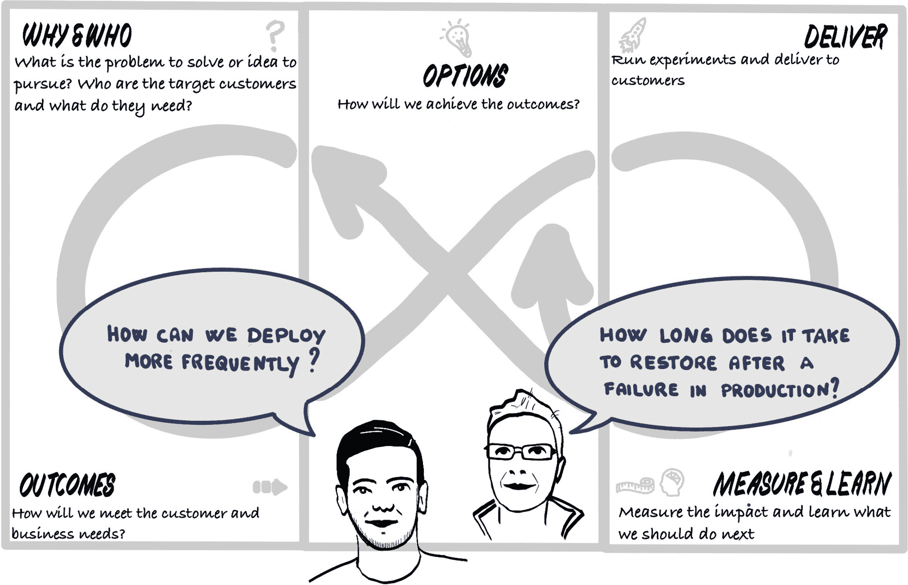
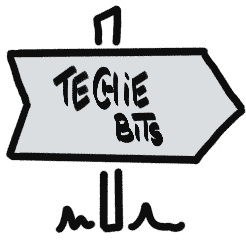

# 第六部分：构建它、运行它、拥有它

在之前的章节中，我们讨论了如何发现和优先处理工作，以交付像 PetBattle 这样的应用程序。这包括在构建解决方案组件时需要考虑的各个方面。现在，是时候实际交付可用的软件了：

图 14.0.1：聚焦于“如何做”

本节内容涵盖了以下内容：

+   使用我们首选的自动化工具链构建解决方案组件（API、前端等）。

+   以可重复的方式将这些组件部署到 OpenShift 容器平台。

+   拥有并管理这些组件，让我们能够看到网站在一个激励开发者社区文化中茁壮成长。

一旦我们的“猫王计划”完成，我们将通过这个过程变得非常富有！作为 PetBattle 的投资者，我们可以购买岛屿，投资航天工程，或者整天坐在泳池旁喝马提尼，直到感到无聊，开始一种名为*Pet-Coin*的新加密货币，并最终把所有的钱都赔光。

为了正确设定预期，我们不会详细讲解所有的应用程序代码。所有的源代码都可以通过书籍中的 Git 仓库访问，您可以根据自己的节奏进行查看。逐行分析代码是非常有价值的，尤其是 Helm、Quarkus 和 AI 代码。

我们的重点是如何使用 OpenShift 中提供的工具来构建、部署和运行应用程序。我们将深入探讨一些高级功能，例如 Operators、Serverless、Service Mesh 以及 CI/CD 工具的示例和技巧。我们的目的是提供示例和建议，解释为什么选择使用某些工具或技巧和方法，以及它们如何在 PetBattle 项目中协同工作。然后，您可以根据自己的项目需求，选择您想要使用的工具和方法。

本节分为三部分：

1.  *第十四章*，*构建它*：在这一章中，我们介绍如何使用 Git 作为唯一的真理来源。我们将讨论如何使用 Tekton 或 Jenkins 对源代码进行打包。

1.  *第十五章*，*运行它*：本节讨论了测试、将 Knative 作为新组件引入我们的应用、运行 A/B 测试，并使用 OpenShift 中的一些高级部署功能捕获用户数据。

1.  *第十六章*，*拥有它*：本节内容涉及如何通过监控和警报反馈循环保持系统运行。我们还将讨论 Kubernetes 中 Operator 的重要性。

在这些章节中，我们强调一个核心信念，即所有团队成员都应该对自己的代码感到自豪。团队成员应该希望去“构建它、运行它”并最终“拥有它”。

如果您觉得低级技术细节对您来说有些过于复杂，或者这不是您特别感兴趣的内容，也没关系！接下来的三章可能会感觉像是换了个节奏，但我们建议不要完全跳过这些章节。

不必过于担心低级细节、代码片段和截图，重要的是每个人都能掌握本书中概念的价值。这包括团队想要进行的任何技术改进的价值。接下来的章节将有助于阐明这一点。
