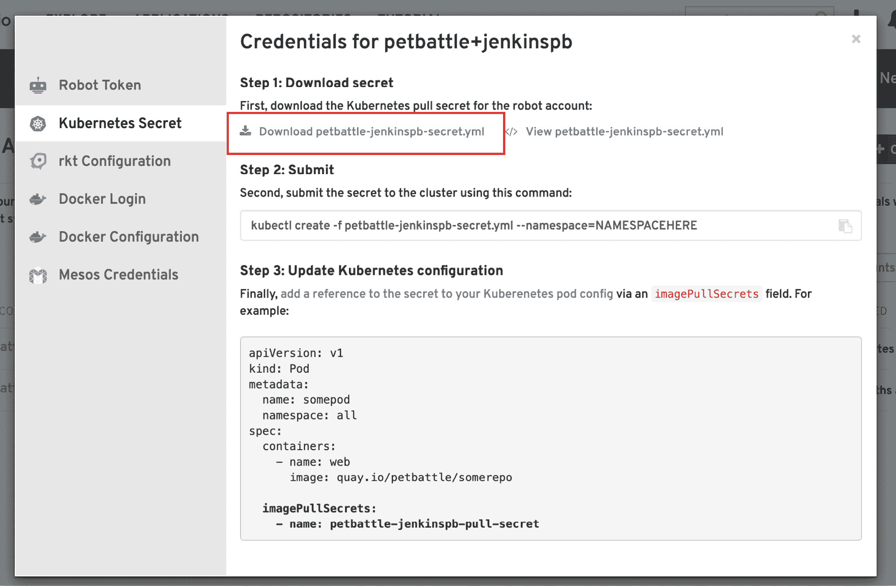
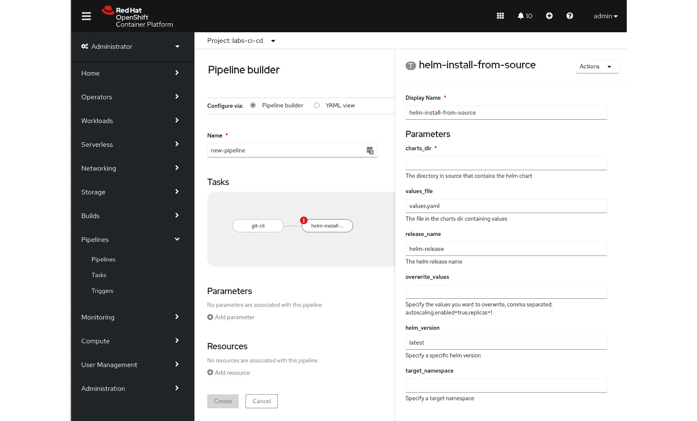

# 14. 构建它

"*在我的机器上运行正常*"——这是开发者、测试人员和运维人员在编写、测试和验证代码时经常听到的一句话。*在我的机器上运行正常*是源自孤岛式团队的一种说法，在这种团队中，问题的责任像温布尔登网球场上的网球一样来回传递。存在于这些孤岛式团队之间的隐形墙，导致工作在团队之间传递，但没有承担从头到尾的完整责任，这个问题已经存在了几十年。我们需要打破这种行为！从现在起，不再是“*在我的机器上运行正常*”，而是，“*你的代码在构建系统中的进展如何*？”我们代码所经过的构建和部署管道是共同的责任。为了实现这一点，所有团队成员都必须为管道做出贡献，并准备在管道出现故障时修复它。


图 14.1：在我的机器上运行正常

如果你的代码构建失败，因为你忘记检查某个依赖项，或者如果你的测试没有通过，那么修复它是你的责任！部署管道的目的是创建一个可重复的流程，使我们的代码能够通过它，并加速发布的同时降低风险。如果我们知道每次提交到代码库时，所有测试都会执行，我们就会对最终的应用程序有很大的信心。如果我们随着应用程序复杂性的增加，不断增加测试量，这也应该提高我们的信心。团队要想拥有自己的软件管道是至关重要的。

拥有像 OpenShift 这样的平台，有点像披头士在萨维尔街的苹果公司大楼屋顶上唱歌，唱的是人们*团结起来*。开发者、运维、测试人员、架构师、设计师、数据库管理员和分析师，大家共同使用像 OpenShift 这样的平台，提供了一个共享的协作空间。在这个平台上构建应用程序和业务服务，开发人员可以以安全、受控的方式自服务满足他们的所有需求，打破团队之间的壁垒，消除等待权限才能部署应用程序等瓶颈——这使得每个人都能用相同的语言，通过现代应用交付和技术解决方案推动业务成果的实现。

## 集群资源

本书的这一部分将是最具技术性的之一。如*附录*中所述，本章中使用**CodeReady Containers**（**CRCs**）运行代码示例的最低要求如下：


表 14.1：使用 CRCs 运行代码示例的最低要求

随着所需内存的增加，技术内容也已经讲解完毕，让我们更详细地深入探讨。我们将从现有 PetBattle 应用程序的组件开始，随着它从一个业余周末项目转变为一个高可用的、以生产为基础的设置，这一设置是由一个强大的跨职能团队构建和维护的。

## 现有的 PetBattle 架构

初始的 PetBattle 架构相当基础，围绕在单个**虚拟机**（**VM**）中运行的应用组件进行部署。初始架构有三个主要组件：一个 JavaScript 前端；一个基于 Java 的后端，提供 API 和数据库；以及一个单实例的 MongoDB。这里的内容并不令人兴奋或复杂，但其中隐藏着技术债务和糟糕实现的雷区，这导致了网站流量增长时出现各种问题。

这种架构的问题似乎包括：

+   单体架构——一切都必须作为一个整体进行部署和扩展，没有独立的可移动部分。

+   身份验证和访问控制不存在。

+   测试？单元测试？但说真的，没多少。

+   它需要大量的数据维护，因为所有数据都存储在数据库中。

+   不良行为者向我们友好的猫咪应用添加不当图片。

+   脆弱的应用——如果出现问题，应用程序会崩溃，且一切都需要重启。

在*第九章*，*发现方式*中，我们进行了一个事件风暴练习，帮助推动了一个新提议的架构。它由一个 UI 组件和一个支持服务组成，后者向 UI 提供不同的 REST API，如*图 14.2*所示：


图 14.2：PetBattle 的初始业余架构

现在，让我们来看看 PetBattle 的各个组件。

### PetBattle 组件

在接下来的章节中，我们将探索自动化、测试，以及将 PetBattle 扩展到包括监控、警报、Knative Serving 和 Service Mesh 等方面。但首先，让我们设想 PetBattle 团队已经完成了几个开发冲刺。他们从事件风暴中构建了资源，现在拥有了如*图 14.3*所示的组件和架构。通过事件风暴，我们还发现需要身份验证来管理用户。为此，我们选择了 Keycloak 作为工具。


图 14.3：PetBattle 的演进架构

现在，PetBattle 的架构正变得越来越复杂。它有一个连接到两个服务的 UI，以提供数据。**单点登录**（**SSO**）和用户管理由 Keycloak 提供。让我们更详细地看看架构的每个组件。

### 用户界面

用户界面使用 Angular1 v12 编写，这是 Google 提供的一个完整的 JavaScript 框架，用于构建 Web 和移动应用程序。该应用程序会进行转译，静态站点代码随后从运行 Nginx（一个 Web 服务器）实例的容器中提供，由 Red Hat 提供。应用程序在启动时会拉取其配置，配置中设置了所有依赖服务的端点，例如 Keycloak 和 API。此配置作为 ConfigMap 在 OpenShift 中进行管理。

### 宠物服务

宠物服务是一个简单的服务，使用 Java Quarkus2 作为框架，并通过 MongoDB 数据库来检索和存储上传到平台参加比赛的宠物详情。

### 比赛服务

比赛服务也使用 Quarkus 框架，并将状态存储在 MongoDB 和 Infinispan 分布式缓存中。MongoDB 用于存储比赛的详细信息，例如哪个宠物赢得了比赛——但为什么我们使用缓存呢？

那么，答案是比赛只存在有限的时间，使用数据库存储时间数据并不适合我们的用例。而且，Infinispan 将缓存数据存储在内存中，访问速度比磁盘上的数据要快得多。其缺点是，如果 Infinispan 的 pod 死掉或崩溃，数据就会丢失。然而，我们计划在生产环境中通过至少保留两个副本来规避这一问题，数据将在这些 pod 之间进行复制。

### 用户管理

用户管理、身份验证和访问控制是架构中需要解决的其他几个关键部分。我们使用的是 Keycloak，3 一个开源身份和访问管理工具，用于提供这些功能。我们本可以自己编写一些代码来实现这些功能，但安全性是一个需要大量专业知识才能做到正确的领域，而 Keycloak 在使用开放标准来正确完成这项工作方面做得非常出色。

1 [`angular.io/`](https://angular.io/)

2 [`quarkus.io/`](https://quarkus.io/)

3 [`www.keycloak.org/`](https://www.keycloak.org/)

### 攻击计划

最初，我们将以相对手动的方式将核心 PetBattle 应用组件和服务部署到 OpenShift 上。我们希望能够在本地开发，增加新功能，展示 Helm 和 OpenShift 结合使用的简便性，使我们能够反复部署代码。一旦完成，我们将通过各种工具（包括 Tekton/Jenkins、Argo CD 和 GitOps）来自动化设置和部署过程。我们还将探讨如何使用 Knative 添加新组件到架构中，并尝试一些更高级的部署能力。最后，在*第十六章*，*掌控它*中，我们将关注应用监控与告警，以及使用服务网格进行可追溯性的相关内容。*图 14.4*展示了架构中添加的额外组件，包括通过服务网格代理的 Knative 猫侦测服务。


图 14.4：PetBattle 的目标架构，包括最终的 OpenShift 部署

我们将尽可能使用命令行来展示和解释相关命令。每个步骤也可以通过 OpenShift 网页控制台来执行。如果你是 OpenShift 新手，网页控制台是一个很好的起点，里面有许多提示和教程！

## 运行 PetBattle

在*第六章*，*开放技术实践* - *起步*，*正确开始*中，我们讨论了 Helm 及其作为应用生命周期管理工具的使用，用于安装、升级和回滚应用部署。我们将从命令行开始，但如果你更喜欢使用网页控制台的方法，可以跳到本节的末尾。如果你需要帮助安装 Helm 命令行工具，可以回顾一下*第六章*内容。现在，让我们来看一下如何轻松地将 PetBattle 应用套件作为 Helm 图表部署到 OpenShift 中的单个项目中。在你的终端中，添加 PetBattle Helm 仓库：

```
$ helm repo add petbattle \
```

```
     https://petbattle.github.io/helm-charts
```

有三个主要应用组成了 PetBattle，可以在 Helm 仓库中搜索到：


表格 14.2：组成 PetBattle 的三个主要应用

基础设施 Helm 图表通常作为锦标赛 Helm 图表的依赖项进行部署，但也可以选择单独部署。这在调试过程中非常有用。**不适合家庭观看**（**NSFF**）组件是一个可选图表，提供了一项功能，可以通过 API 检查上传的图像是否符合我们面向家庭友好应用的安全内容标准。


表格 14.3：基础设施和 NSFF Helm 图表

我们可以使用以下命令搜索这些图表的最新版本：

```
$ helm search repo pet-battle
```

现在让我们将主 PetBattle 应用部署到 OpenShift 集群中。我们需要更新 PetBattle 前端的 `values.yaml` 文件本地副本，以匹配我们的集群 URL。这是为了在部署时连接到正确的后端服务集群。我们可以在部署 PetBattle 应用套件时，将这些值提供给我们的 Helm 图表。让我们下载一个 `values.yaml` 文件示例进行编辑：

```
$ wget https://raw.githubusercontent.com/petbattle/pet-battle/master/chart/values.yaml/tmp/values.yaml
```

打开 `values.yaml` 文件，并将 `config_map` 中列出的五个 URL 替换为你 OpenShift 集群的 URL（例如，如果你使用 CRC，则将 `apps.cluster.com` 域名改为 `apps-crc.testing`）。例如：

```
# custom end point injected by config map
```

```
config_map: '{
```

```
  "catsUrl": "https://pet-battle-api-petbattle.apps.cluster.com",
```

```
  "tournamentsUrl": "https://pet-battle-tournament-petbattle.apps.cluster.com",
```

```
  "matomoUrl": "https://matomo-labs-ci-cd.apps.cluster.com/",
```

```
  "keycloak": {
```

```
    "url": "https://keycloak-petbattle.apps.cluster.com/auth/",
```

```
    "realm": "pbrealm",
```

```
    "clientId": "pbclient",
```

```
    "redirectUri": "https://pet-battle-petbattle.apps.cluster.com/*",
```

```
    "enableLogging": true
```

```
   }
```

```
}'
```

将 `pet-battle`、`pet-battle-api` 和 `pet-battle-tournament` 集成到你的集群中。为此，你需要登录到 OpenShift 集群。例如：

```
# Login to OpenShift
```

```
$ oc login -u <username> --server=<server api url>
```

```
$ helm upgrade --install pet-battle-api \
```

```
petbattle/pet-battle-api --version=1.0.15 \
```

```
--namespace petbattle --create-namespace
```

```
$ helm upgrade --install pet-battle \
```

```
petbattle/pet-battle --version=1.0.6 \
```

```
-f /tmp/values.yaml --namespace petbattle
```

```
$ helm upgrade --install pet-battle-tournament \
```

```
petbattle/pet-battle-tournament --version=1.0.39 \
```

```
--set pet-battle-infra.install_cert_util=true \
```

```
--timeout=10m \
```

```
--namespace petbattle
```

如果 `pet-battle-tournament` 安装超时，只需重新运行它。

每个 Helm 安装图表命令应返回类似以下的信息：

```
    NAME: pet-battle-api
```

```
    LAST DEPLOYED: Thu Feb 25 19:37:38 2021
```

```
    NAMESPACE: petbattle
```

```
    STATUS: deployed
```

```
    REVISION: 1
```

```
    TEST SUITE: None
```

使用 `helm list` 命令可以列出已安装的 Helm 图表。你应该能在你的 `petbattle` 项目中看到以下的 Pod。示例如 *图 14.5* 所示：


图 14.5：宠物战斗 Pod

比赛服务将需要几分钟才能部署并稳定下来。这是因为其依赖的基础设施图表正在为 Keycloak、Infinispan 和 Grafana 部署运维订阅。进入 OpenShift Web 控制台，你现在应该能够看到如 *图 14.6* 所示的 PetBattle 应用套件。访问 PetBattle 前端，开始使用应用。


图 14.6：在 OpenShift 开发者视图中部署的 PetBattle Helm 图表

现在你已经学会了如何通过命令行安装 PetBattle Helm 图表——有人可能会说这是比较困难的方式！接下来，我们将演示 OpenShift 中 Helm 的一些集成功能——有人可能会说这是一种更简便的方式！我们可以创建一个 `HelmChartRepository` 自定义资源对象，它指向我们的 PetBattle Helm 图表仓库；可以把它看作是 OpenShift 中的 `helm repo add`。运行以下命令来安装图表仓库：

```
cat <<EOF | oc apply -f -
```

```
apiVersion: helm.openshift.io/v1beta1
```

```
kind: HelmChartRepository
```

```
metadata:
```

```
  name: petbattle-charts
```

```
spec:
```

```
  name: petbattle
```

```
  connectionConfig:
```

```
    url: https://petbattle.github.io/helm-charts
```

```
EOF
```

完成此操作后，我们可以进入 OpenShift 的开发者视图，选择添加 Helm 图表，并通过菜单和表单驱动的方式安装我们的 Helm 图表——只需选择一个图表并进行安装：


图 14.7：通过 OpenShift 中的 HelmChartRepository 视图添加 PetBattle

这可以为团队之间共享服务提供极好的开发者体验。后端团队可以将新应用发布到仓库，而下游团队可以通过单击操作将其部署到开发环境中。事实上，如果你添加了一个 Helm 值模式文件，OpenShift 将构建一个 **所见即所得**（**WYSIWYG**）表单，便于配置值文件。

## Argo CD

当我们在*第二部分*中建立我们的基础时，*建立基础*，我们使用 Helm 和 Argo CD 启动了所有的构建、部署和工具。我们在运行启动自动化时做出了一些有主见的选择，值得详细讨论我们做出的一些权衡。我们在建立技术基础时遵循了我们的行动号召，并规划了适合我们作为 PetBattle 产品团队的工作方案，同时回顾并讨论了哪些有效，哪些效果不太好。

结果表明，对于我们的开发团队来说，启动所有的 CI/CD 工具变成了一项极为重要的任务。我们被赋予了一个任意的（但必要的）约束条件，即我们的开发 OpenShift 集群每两周必须从头开始重建。因此，我们需要确保我们的 CI 和 CD 能够快速且反复地启动。例如，更新 SonarQube Helm 图表版本变得非常简单，只需更改一行并推送到 Git。通过遵循我们的 "一切皆代码" 实践，所有 OpenShift 基础设施定义、CI/CD 工具以及流水线定义都存储在 Git 中。声明的 CI/CD 工具状态由 Argo CD 持续同步到我们的开发集群，因此这种更改会在一分钟内同步并部署到我们的集群。

能够有效地生命周期管理所有与构建应用程序相关的支持工具需要付出努力并关注细节，但从长远来看，这是值得的，因为你将建立一个能够轻松且反复应对变化的系统。我们围绕变更的成本优化了应用生命周期，使得变更的成本（即人力成本）尽可能小。毕竟，人力时间是我们最大的资源成本！

我们所有工具的版本都已检查并存入 Git，使用 `MAJOR.MINOR` 版本标签来标记小的 bug 修复和安全补丁。`MAJOR.MINOR.PATCH` 版本不是标签，但它们指定了一个固定的版本（理想情况下！）。选择一个策略，不会让团队被困在旧的且不再支持的版本中。当然，如果你通过自动化优化了较小的变更成本，那么更改版本的问题就会变得不那么突出！

4 [`semver.org/`](https://semver.org/)

我们为软件交付生命周期选择了*推送*（CI）和*拉取*（CD）模型。构建镜像和工件（Helm 图表和配置）以及单元和集成测试的任务是*推送* CI 模型的一部分。在每次代码提交时，构建管道触发器（Tekton 或 Jenkins）会被激活。Argo CD 控制器的任务是将我们在 OpenShift 集群中部署的内容与 Git 仓库中声明的应用状态保持同步。这是一个 GitOps 拉取模型用于 CI。关键点是，Git 是唯一的可信来源，所有内容都可以从这个来源重新创建。


图 14.8：持续交付的 GitOps 推送和拉取模型

我们看到这种方法的主要好处是它以开发者为中心。代码库中的任何变化都会触发管道构建和部署。这为团队提供了快速反馈，能迅速发现任何故障，因为自动化测试总是会针对新代码运行。拉取 CD 模型将构建和测试管道的同步性解耦。构建的工件（容器镜像和配置）可以一次构建，然后通过整个生命周期进行标签化和推广，所有这些都由 Git 控制。这对审计非常有帮助，可以清楚地追踪是谁、在何时更改了什么。我们可以轻松地追溯提交和推送的代码，以及与构建、测试和部署相关的内容。这也是一种灵活的方法，因为并非所有工件都需要被构建。配置可以通过相同的模型进行更改和部署。该模型也非常灵活，能够支持不同的开发工作流模型。例如，Gitflow 和基于主干的开发可以根据团队的工作方式轻松支持。

## 基于主干的开发和环境

在设计初始管道时，我们绘制了基本的构建、打包、部署、集成测试、标签和发布阶段。在*图 14.9*中，我们可以看到 MultiBranchPipeline 插件、分支和命名空间。


图 14.9：分支和命名空间

这帮助我们明确了 Git 分支、持续集成任务、持续交付任务之间的职责划分，以及这些任务将在哪些 OpenShift 项目中执行。


图 14.10：分支和活动建模

因为我们遵循基于主干的开发，5，我们的主分支（main/master）会经历完整的生命周期，包括构建、标记和推广。也就是说，镜像会被构建、单元测试和功能测试，然后在部署到`labs-staging`项目之前，首先在`labs-test`进行端到端测试。对于任何短期存在的功能分支或拉取请求，我们决定仅进行单元测试、构建，并将这些源代码部署到我们的`labs-dev` OpenShift 项目中。通过这种方式，我们可以定制不同代码分支上发生的管道任务。每次代码提交都会消耗一定的时间和资源，这在我们的管道中是一个权衡，必须根据管道中包含的内容进行调整，以帮助提升整体产品质量。

5 [`trunkbaseddevelopment.com`](https://trunkbaseddevelopment.com)

## 应用间模式的结构

我们选择使用 Helm；记住，最基本的 Helm 只是一个用于打包我们基于 Kubernetes 的应用程序资源的模板语言。每个 PetBattle 应用程序都有自己的 Git 仓库和 Helm 图表，使得独立于其他应用进行开发变得更容易。这个每个应用程序都有自己 *Helm 图表* 的框框如 *图 14.11* 所示。开发者可以通过运行 `helm install` 安装应用图表，获得与我们的完全自动化管道相同的体验和最终结果。这在可用性角度非常重要。Argo CD 对所有适合 Kubernetes 部署的打包格式（如 Kustomize、Helm，以及原始 YAML 文件）提供了极好的支持。因为 Helm 是一种模板语言，我们可以通过不同的值来改变 Helm 图表模板及其生成的 Kubernetes 对象。


图 14.11：应用打包、Helm 和 Argo CD 结合应用间模式

GitOps 的一个严格观点是，改变状态并不像仅仅提交填写过的模板和其中的值那样*纯粹*。例如，Kustomize 没有模板化，采用了这种方法。我们使用 Kustomize 来部署我们的 CI/CD 自动化与 Argo CD，因为我们认为它更适合这个用例。这意味着我们不太可能为我们的 PetBattle 产品拥有大量的 CI/CD 环境——目前只有一个。

这里的权衡是，虽然我们使用 GitOps 来同步 Helm 图表本身，但应用程序值的供应可能来自多个地方，因此你必须小心理解在哪里发生值的覆盖和优先级问题，如下所示：

+   提供的`values.yaml`文件（或其子图表依赖项）——这些文件由 Argo CD 控制器保持同步。

+   在命令行上使用 `helm template --set`。这些可以在模板或触发器中指定，具体取决于管道的运行方式。

我们使用 Argo CD 应用定义来部署每一个应用。我们为每一个希望部署的环境使用一个 Argo CD 应用定义。这是 *图 14.11* 中显示的红色框。我们使用 Argo CD 采用应用套件模式 6 将这些全部打包；有些人可能称之为应用套件！在 PetBattle 中，我们通过 Helm chart 生成应用套件定义。这是 *图 14.11* 中的第三个外部绿色框。该外部框的配置保存在与我们的应用不同的 Git 仓库中。

应用套件模式是我们声明性地指定一个仅包含其他应用的 Argo CD 应用。在我们的例子中，这就是 `pet-battle-suite` 应用。我们选择将所有从主分支/master 构建的应用放在这个 `pet-battle-suite` 伞形下。我们有一个用于 *测试* 和 *阶段* 环境的 PetBattle 套件。*图 14.12* 显示了阶段环境的应用套件：


图 14.12：Argo CD，已部署的应用套件

6 [`argoproj.github.io/argo-cd/operator-manual/cluster-bootstrapping/#app-of-apps-pattern`](https://argoproj.github.io/argo-cd/operator-manual/cluster-bootstrapping/#app-of-apps-pattern)

在 Git 中，我们使用以下模式建模不同的分支：

+   `labs-test`, `labs-staging`)

+   仅限 `labs-dev` 命名空间

我们应用的 Argo CD 同步策略设置为 *自动化* + *修剪*，这样子应用会在清单更改时自动创建、同步和删除。如果需要，你可以更改或禁用此设置。我们还会配置一个针对 CI/CD Git 仓库的 webhook，以便任何更改都会触发 Argo CD 同步所有应用；这避免了当 CI/CD 代码更改时需要等待三分钟的同步周期。

Git 修订版可以为每个子应用设置为特定的 Git 提交 **安全哈希算法** (**SHA**) 值。Git SHA 是为每次提交到仓库时计算出的独特的 40 字符代码，因此是不可移动的，不像标签。这样可以确保即使子应用的仓库发生变化，只有当父应用更改该修订版时，应用才会发生变化。或者，你可以将其设置为 HEAD/master/main 或分支名称，以保持与特定分支同步。越接近生产环境，使用 Git 提交 SHA 来管理应用版本是一个好主意。将生产环境固定为确切版本可以确保在出现问题时更容易追踪。此结构是灵活的，可以根据你的产品团队的需求进行调整。

## 构建它 – PetBattle 的 CI/CD

现在让我们动手深入了解一些更技术性的话题。我们如何以可重复和安全的方式将代码从开发阶段推向生产环境？如果你还记得在*第二部分*、*建立基础*中，我们了解了 DevOps 恐龙 Derek，以及我们为测试他威慑力所经历的种种困难。现在，我们将以相同的方式开始处理我们的 PetBattle 应用，首先从前端开始。

### 大致架构

在我们接触任何一行代码之前，我们总是喜欢关注大致架构。这有助于我们框定工具的作用和使用原因，并从高层次构建出我们的流水线。让我们以相同的方式构建我们管理 PetBattle 源代码的细节。顺便提醒一下，PetBattle 前端是一个 Angular 应用程序。它使用 Node.js v12 构建，并部署到 Red Hat Nginx 镜像上。

在从基础开始的大致架构基础上，让我们添加一些我们考虑在 PetBattle 前端实现的步骤，以便为频繁的变更推送做好准备。


图 14.13：大致架构，包括团队认为将使用的工具

快速提醒一下，我们在*第二部分*、*建立基础*中定义的大致架构，识别了我们可能使用的所有工具，如*图 14.13*所示，包括：

+   Jenkins：用于自动化构建和测试我们的软件

+   Nexus：用于托管我们的二进制文件和 Helm 图表

+   Argo CD：用于管理我们的部署

+   SonarQube：用于评估我们的代码质量

+   Zalenium：用于自动化浏览器测试

现在工具已到位，让我们思考一下代码在部署过程中应经过哪些阶段。团队应从小处开始——我们需要多少自动化才能使代码编译并部署？团队开始时非常重要，要有一个简单的端到端流程，否则，事情会很快变得混乱，导致不必要的复杂性，甚至可能什么都不交付。它还很重要，因为我们正在创建的反馈回路需要是快速的。我们不想要一个很复杂、考虑周全的过程，但需要几个小时才能运行！这不是我们想要创建的反馈回路。

我们总是使用三个简单的阶段：构建 > 烘焙 > 部署。对于工程师来说，一个好的模式是保持对他们流水线的抽象定义，这样他们可以在任何应用程序中更好地复用这个模式，无论使用何种技术。每个阶段应该有一个明确的接口，包含输入和输出。以这种方式复用流水线定义可以减少在后端和前端之间切换的上下文切换。考虑到这一点，我们可以以以下方式定义我们构建的各个阶段。

### 构建

*输入*：*代码库*

*输出*：*一个“已编译”并且经过单元测试的软件工件*


图 14.14：大致架构中的 BUILD 组件

构建过程应该始终采用我们的源代码，编译它，并在生成某种制品之前运行一些单元测试，这些制品将存储在 Nexus 中。通过将构建过程的接口定义得如此简单，我们可以在每种技术或应用程序类型中替换实现。例如，当构建 PetBattle 前端 Angular 应用程序时，我们将使用 **Node 包管理器** (**npm**) 在构建阶段完成这些步骤，但 Java 应用程序可能会使用 Gradle 或 Maven 来实现相同的效果。最困难的工作将在这一阶段完成，通常它对所使用的框架或语言的依赖性最大。我们将在后续阶段看到，最初使用的技术变得不那么重要，因此代码的重用性可以更高。

### 烘焙阶段

*输入*: *一个“已编译”软件制品*

*输出*: *一个已标记的* *容器镜像*


图 14.15：大图中的 BAKE 组件

这是将我们在前一步作为输出创建的软件制品打包成一个盒子，即 Linux 容器镜像的过程。然后，这个镜像会被标记并存储在容器注册中心中，可以是 OpenShift 内置的，也可以是外部的。在 OpenShift 中，我们有多种方式可以实现这一点，例如使用 source-2-image、二进制构建或提供 Containerfile/Dockerfile。

### 部署阶段

*输入*: *一个已标记的镜像*

*输出*: *在特定环境中运行的应用程序*


图 14.16：大图中的 DEPLOY 组件

将刚刚推送到注册中心的镜像以及任何其他运行所需的服务或配置一起部署。我们的应用程序将打包为 Helm 图表，因此部署可能需要修补我们应用程序图表中引用的镜像。我们希望我们的流水线支持多种工作流。对于功能开发，我们可以直接 `helm install` 到开发命名空间。但对于发布候选版本，我们应该将新的发布信息提交到 Git，以触发变更的发布。这一工作流的实现是步骤的责任，即正在执行的低级内容。部署的抽象视图应该导致一个*已验证*的应用程序被部署到我们的集群上（并最终推广到生产环境）。

团队通过在他们的大图中添加一些漂亮的涂鸦来捕捉他们构建的应用程序的这些阶段。接下来，他们开始考虑如何将应用程序从测试环境推广到生产环境。在容器中构建应用程序时，我们希望确保该应用程序可以在任何环境中运行，因此单独控制应用程序配置至关重要。团队也不希望为了不同的环境而重新构建应用程序，因此一旦镜像构建并部署，它在推广之前需要进行验证。让我们进一步探讨这些阶段。

### 系统测试

*输入*: *正在测试的应用程序名称和版本*

*输出*: *成功的测试* *报告和经过验证的应用程序*


图 14.17：来自大图的系统测试组件

通过前端驱动应用程序中的用户行为，验证应用程序是否按预期行为运行。如果构成应用程序的所有连接部分（微服务、身份验证和前端）都按预期工作，那么应用程序可以通过审核，并且不需要重新构建。我们为 PetBattle 编写的系统测试用例将是团队已经同意的验收标准。因此，我们可以将应用程序签署为准备好交给真实用户使用。任何在栈中发生变化的组件都应该触发此阶段；这不仅仅是前端的责任。

### 推广

*输入*: *经过验证的镜像名称和版本*

*输出*: *在生产环境中运行应用程序*


图 14.18：来自大图的推广组件

在应用程序按预期工作（基于我们通过的系统测试用例）后，我们现在可以将构成我们应用程序的镜像及其配置推广到新环境中。当然，在 GitOps 的世界中，这并不是手动推出新的部署，而是将新版本和任何自定义配置提交到我们的配置仓库，在那里它们将被 Argo CD 接收并部署。


图 14.19：包含所有管道阶段的大图

在*图 14.19*中，我们可以看到包含管道各个阶段的大图。现在，团队已经知道他们的软件将在跨越集群时会经历哪些阶段，他们可以填充更低层次的细节，即每个步骤。在这个阶段，团队正试图找到如何构建通用的管道步骤，而不考虑他们使用的技术。这将使他们的软件栈可以更好地复用，但更重要的是，减少为多种技术编写软件的工程师的认知负担。为此，把使用的技术标注在大图上是一个好主意。在 PetBattle 的案例中，使用的是 Angular 和 Quarkus（构建工具是 Node.js 和 Maven）。他们使用新的颜色便签写下每个服务为了完成每个阶段定义的接口将经过的步骤。

在*图 14.20*中，我们详细描述了管道构建阶段可能的步骤。首先，我们安装应用程序依赖项。接着，我们测试、校验并编译代码。最后，我们将成功的构建工件存储到 Nexus 仓库中，以便在下一个阶段——烘焙阶段中使用。


图 14.20：构建阶段及其步骤的细分

团队继续完善各个阶段的步骤。最终，他们为每个阶段添加了一些示例容器，部署到每个命名空间，以展示为使 PetBattle 系统正常运行而部署的所有组件的视图。具体内容请参见*图 14.21*：


图 14.21：我们软件交付过程的完整大局观

大局观是一种有助于团队统一工具链内容及其使用方式的实践。这也是一个很好的工具，可以向非技术团队成员展示，帮助他们理解能够反复构建和测试代码的复杂性和实用性。和我们所有的实践一样，它也永远不会完成；当有新的工具进入我们的工具链，或者我们在管道中添加了新阶段时，我们首先将其添加到大局观中。它是我们软件交付过程的活文档。现在大局观已完成，我们继续实现它所描述的组件。

### 选择你自己的冒险

我们理解，做任何事都有很多方法，软件开发中通常有成百上千种甚至更多的方法。考虑到这一点，我们希望在此与亲爱的读者相遇。我们的意思是，接下来的章节将介绍两种实现同一目标的方法，请根据自己所在的上下文选择更适合的方式。

Jenkins 是许多公司和开发者首选的构建工具。它已经存在一段时间了，当然它也有一些特点。当它最初构思时，Jenkins 并没有考虑以容器的形式部署。为了保持与时俱进并展望未来，我们决定使用 Tekton 和 Jenkins 编写大局观的代码。两者都可以轻松调整用于前端和后端开发，但为了本书的目的，我们将使用 Jenkins 来自动化 Angular 应用程序的大局观部分。对于用 Java（Quarkus）编写的 API，我们将使用 Tekton，并以更符合 Kubernetes 的方式来设置相同的内容。这两条路径都可以供热衷的读者进行尝试并运行，但我们将以这种方式拆分叙述，以便更好地说明。

所以，就像你在*选择你自己的冒险*书籍中一样，现在你可以选择接下来想要跟随的路径。如果你对 Jenkins 自动化不感兴趣，可以直接跳到 Tekton 部分。本书中两个选项的代码都可以在 Git 仓库中找到。

在尝试本章中的内容之前，请确保已完成*第七章*中的引导步骤，*开放技术实践——* *中点*部分，位于*实施 GitOps——让我们用一些真实的工作代码来构建大局观！*章节下。这些步骤使用 GitOps 将 CI/CD 工具部署到您的集群中。接下来的章节我们将使用的主要工具包括 Jenkins、Argo CD 和 Tekton。

## Jenkins–前端

Jenkins 是我们值得信赖的伙伴，它将为我们处理繁重的代码工作——编译、测试等。为了充分利用工具包中的所有工具，我们首先需要配置一些项目。这包括但不限于管理机密信息并添加 webhook，以便开发人员提交代码时，能够触发我们的 Jenkins 自动化。

### 将 Argo CD 连接到 Git

让我们来谈谈 GitOps。我们希望我们的 Git 仓库成为唯一的真理源，并且 Argo CD 控制器分析当前部署到我们集群中的内容与存储在 Git 仓库中的内容之间的差异。Argo CD 可以根据它看到的所需状态（在 Git 中）与实际状态（在集群中）之间的差异，执行一些操作，比如自动同步它们，或发送通知表明这两种状态不符合预期。例如，在 Git 中我们可能设置了版本 123 的应用程序，但集群中当前部署的是版本 122。

为了在我们的配置仓库和 Argo CD 之间建立这种连接，我们需要创建一个指向仓库的 Argo CD 应用程序-应用程序的集合。应用程序-应用程序的集合模式是一种描述系统所有元素的简洁方式。假设我们有一个名为`App-1`的应用程序，它代表我们的完整系统。这个`App-1`由可独立部署的服务组成，例如`App-1a`、`App-1b`、`App-1c`等。对于 PetBattle，我们有整个系统，包含前端、API 和其他服务。我们也为我们的暂存和测试环境创建了类似的应用集合；这使得我们可以将应用程序-应用程序的集合视为一套应用程序。

如果我们克隆我们在*第七章*中建立的`ubiquitous-journey`7 项目，以启动我们的集群，那么这里会有另一组用于我们的应用栈的图表，这些应用栈位于*applications*/*deployments*中。应用这些定义将创建一个指向我们的 Helm 图表的 Argo CD 应用程序自定义资源，这些图表将在 Tekton 或 Jenkins 的构建过程中创建。

配置文件(`values-applications-stage.yaml`)包含 Helm 图表版本和应用程序版本，这些将在 Jenkins 成功构建后更新。我们希望 Argo CD 在应用更改到集群时监控这些值。这些值文件还包含我们对基本 Helm 图表在特定环境中的覆盖内容，例如，前端配置的配置地图，用于与它所需的服务进行通信（`tournament-svc`、`cats-svc`等）。以下代码片段展示了这一点。这些值在开发、测试和暂存环境之间有所不同，因此这种模式使我们能够对应用程序启动时使用的配置进行版本控制。

```
pet_battle_stage:
```

```
    name: pet-battle-stage
```

```
    enabled: true
```

```
    source: *helm_repo
```

```
    chart_name: pet-battle
```

```
    sync_policy_automated: true
```

```
    destination: labs-staging
```

```
    source_ref: 1.0.6
```

```
    values:
```

```
      fullnameOverride: pet-battle
```

```
      image_repository: quay.io
```

```
      image_name: pet-battle
```

```
      image_namespace: petbattle
```

```
      config_map: '{ "catsUrl": "https://pet-battle-api-labs-staging.apps.hivec.sandbox1405.opentlc.com", "tournamentsUrl": "https://pet-battle-tournament-labs-staging.apps.hivec.sandbox1405.opentlc.com", "matomoUrl": "https://matomo-labs-ci-cd.apps.hivec.sandbox1405.opentlc.com/", "keycloak": { "url": "https://keycloak-labs-staging.apps.hivec.sandbox1405.opentlc.com/auth/", "realm": "pbrealm", "clientId": "pbclient", "redirectUri": "https://pet-battle-labs-staging.apps.hivec.sandbox1405.opentlc.com/*", "enableLogging": true } }'
```

```
      image_version: "master"
```

```
    project:
```

```
      name: pet-battle-stage
```

```
      enabled: true
```

7 [`github.com/petbattle/ubiquitous-journey`](https://github.com/petbattle/ubiquitous-journey)

因此，当我们部署一个指向这个 Git 仓库的 Argo CD 应用时，它会找到额外的应用并创建我们的应用的应用模式。仓库的结构被简化了，但你可以看到这个图表非常基础，只有两个模板：一个用来在 Argo CD 中创建项目，另一个用来在项目中定义应用。

```
ubiquitous-journey/applications
```

```
├── README.md
```

```
├── alerting
```

```
│   └── ....
```

```
├── build
```

```
│   ├── ...
```

```
└── deployment
```

```
    ├── Chart.yaml
```

```
    ├── argo-app-of-apps-stage.yaml
```

```
    ├── argo-app-of-apps-test.yaml
```

```
    ├── templates
```

```
    │   ├── _helpers.tpl
```

```
    │   ├── argoapplicationdeploy.yaml
```

```
    │   └── argocd-project.yaml
```

```
    ├── values-applications-stage.yaml
```

```
    └── values-applications-test.yaml 
```

我们可以去 Argo CD UI 手动将它连接到这个仓库，或者使用 Argo CD CLI 创建 Argo CD 应用的自定义资源，但我们不如直接运行这个便捷的一行命令，连接我们预生产和测试的应用模式：

```
# from the root of ubiquitous-journey
```

```
$ cd applications/deployment
```

```
# install an app-of-apps for each test and staging
```

```
$ helm upgrade --install pet-battle-suite-stage -f \
```

```
argo-app-of-apps-stage.yaml \--namespace labs-ci-cd .
```

```
$ helm upgrade --install pet-battle-suite-test -f \
```

```
argo-app-of-apps-test.yaml \--namespace labs-ci-cd .
```

配置好这些后，我们应该能在 UI 中看到 Argo CD 创建了应用的应用定义，但它无法与子应用同步。这是因为我们还没有构建它们！一旦它们可用，Argo CD 会启动并为我们同步它们。


图 14.22：Argo CD 同步 PetBattle 应用套件到预生产环境

现在扩展这个应用的应用模式非常简单。我们只需连接一次 Git 和 Argo CD。如果在接下来的几个 Sprint 后，PetBattle 团队意识到他们需要添加新的组件或服务，他们只需扩展 `values.yaml` 文件，即 `values-applications-stage.yaml` 或 `values-applications-test.yaml`，为其预生产或测试环境添加对新组件图表位置和版本的引用。例如，对于 `cool-new-svc`：

```
cool_new_svc_stage:
```

```
    name: cool-new-svc-stage
```

```
    enabled: true
```

```
    source: *helm_repo
```

```
    chart_name: cool-new-svc
```

```
    sync_policy_automated: true
```

```
    destination: labs-staging
```

```
    source_ref: 1.0.1 # version of the helm chart
```

```
    values:
```

```
      fullnameOverride: cool-new-svc
```

```
      image_repository: quay.io
```

```
      image_name: pet-battle
```

```
      image_namespace: petbattle
```

```
      image_version: "2.1.3" # version of the application image
```

```
    project:
```

```
      name: pet-battle-stage
```

```
      enabled: true
```

### 我们流水线中的密钥

Jenkins 将负责编译我们的代码，将镜像推送到注册中心，并将值写入 Git。这意味着 Jenkins 需要一些密钥！在我们的案例中，我们使用 Quay.io 来托管镜像，因此 Jenkins 需要访问权限，以便能够将我们的打包容器镜像推送到该仓库，这需要身份验证。如果你正在跟随 PetBattle 仓库的分支并希望创建你自己的 `pet-battle` 实例，可以去 [`quay.io/`](https://quay.io/) 注册一个免费的账户。你可以通过 GitHub、Google 或你的 Red Hat 账户登录。

### Quay.io

在 Quay 上创建三个新仓库，每个仓库对应我们将要构建的一个应用组件。你可以将它们标记为公开仓库，因为私有仓库需要付费。


图 14.23：Quay.io 中的 PetBattle 镜像

这些仓库作为我们推送镜像的空镜像存储，但我们需要提供正确的 Jenkins 访问权限来推送它们，因此点击 UI 上的机器人图标创建一个新的服务账户，供 Jenkins 使用。给它起个合适的名字和描述以提高可读性。


图 14.24：Quay.io 中的机器人

我们将把之前创建的所有仓库标记为由这个机器人写入。点击添加权限：


图 14.25：Quay.io 中的机器人 RBAC

现在仓库和机器人账户已经创建，我们可以下载将用于管道的密钥！点击密钥名称旁边的齿轮图标，选择查看凭证。


图 14.26：如何在 Quay.io 查看机器人凭证

在弹出的页面中，下载 Kubernetes YAML 文件并将其存储在你自己的 `pet-battle` 分支中。



图 14.27：下载 Kubernetes 密钥

我们可以将其应用于我们的集群（首先确保你已经登录）：

```
$ oc apply -n labs-ci-cd -f petbattle-jenkinspb-secret.yml
```

### GitHub

Jenkins 还需要一个密钥，以便能够推送更新到我们存储在 Git 中的 Helm 值文件。我们应用程序的值文件将包含我们希望传递给模板的属性，例如 ConfigMap 变量，或者图像的位置，例如 Quay.io。我们应用程序部署的值文件还将包含一个指向要通过补丁更新我们的 DeploymentConfigs 进行部署的图像版本的引用（即我们应用程序的 SemVer，例如 1.0.1）。我们不希望手动更新这个，而是希望由机器人（Jenkins）在构建成功后更新它。因此，这个密钥将用于将这些版本更改写入我们的配置仓库，这些仓库由 Argo CD 指定。我们以这种方式跟踪所有环境中的版本变化，因为毕竟，如果不在 Git 中，它就不是真实的。

要为 GitHub 创建密钥，只需进入开发者设置视图。在登录 GitHub 的情况下，路径为 **设置 > 开发者设置 > 个人访问令牌**，或者直接访问 [`github.com/settings/tokens`](https://github.com/settings/tokens) 以便快捷操作。创建一个新的 **个人访问令牌**（**PAT**）；这个令牌可以用来进行身份验证并将代码推送到仓库。为它取个合适的名字，并允许它访问仓库。


图 14.28：GitHub 个人访问令牌权限

保存令牌的值，因为没有生成新令牌之前，你将无法再次访问它。获取令牌后，我们可以通过将其添加到 `basic-auth` 密钥中来在 Jenkins 中创建一个密钥。为了使与该密钥将在同一命名空间中运行的 Jenkins 能够使用该密钥的值，我们可以应用一个特殊的注解，`credential.sync.jenkins.openshift.io: "true"`。这一小段魔法将允许通过仅更新密钥来在 Jenkins 中更新任何凭证！

如果你在自己的分支中操作并跟随本教程，请更新密钥中的 `GITHUB_TOKEN` 和 `GITHUB_USERNAME` 值，并将其应用到集群中：

```
$ cat <<EOF | oc apply -f- 
```

```
apiVersion: v1
```

```
stringData:
```

```
  password: GITHUB_TOKEN
```

```
  username: GITHUB_USERNAME
```

```
kind: Secret
```

```
metadata:
```

```
  labels:
```

```
    credential.sync.jenkins.openshift.io: "true"
```

```
  name: git-auth
```

```
  namespace: labs-ci-cd
```

```
type: kubernetes.io/basic-auth
```

```
EOF
```

### SealedSecrets

你可能会认为这些机密应该保存在某个安全的地方——你是对的！如果你想探索将机密存储在 Git 中的想法，以便它们也能变得*GitOpsy*（是的，我刚才确实又发明了一个词），那么我们可以使用 Bitnami 的 SealedSecrets。它提供了一个加密机密的控制器，允许我们以明文形式存储它们。这意味着我们可以将它们提交到 Git！通过 SealedSecret 自定义资源的魔力，它会解密 SealedSecret，并代表你创建一个常规的 Kubernetes 秘密。我们已经编写了 Jenkins Helm 图表来接受 SealedSecrets，正是为了这个原因！

你可以通过在 Ubiquitous Journey Git 项目中启用它，将 SealedSecrets 部署到集群中。打开 `bootstrap/values-bootstrap.yaml`。只需将 `enabled` 标志更改为 `true`，然后当然是 Git 提交这些更改。这样将会与 Argo CD 同步，并在你的集群中创建一个 Bitnami SealedSecrets 实例，默认情况下在 `labs-ci-cd` 命名空间中。由于这是我们正在向工具中添加的新组件，当然我们也应该更新我们的 Big Picture，并添加描述我们如何使用它的句子。

```
sealed-secrets:
```

```
  # Disabled by default
```

```
  enabled: true
```

```
  nameOverride: sealed-secrets
```

一旦控制器创建完成，我们可以通过以下几个步骤来加密我们的机密：

1.  使用他们的 GitHub 发布页面上的说明安装 `kubeseal`：[`github.com/bitnami-labs/sealed-secrets/releases`](https://github.com/bitnami-labs/sealed-secrets/releases)。

1.  登录到部署了 SealedSecrets 的集群并注意命名空间（在我们的例子中，默认为 `labs-ci-cd`）。

1.  使用 `kubeseal` 命令行工具处理你现有的机密。设置正确的命名空间非常重要，否则机密将无法解密。在这种情况下，我们将其加密为 `super-dooper-secret`。它应该看起来像这样：

    ```
    # create secret file from step 3
    $ cat << EOF > /tmp/super-dooper.yaml
    ---
    apiVersion: v1
    kind: Secret
    metadata:
      name: super-dooper
      labels:
        credential.sync.jenkins.openshift.io: "true"
    type: "kubernetes.io/basic-auth"
    stringData:
      password: "myGitHubToken"
      username:  "donal"
    EOF 
    # encrypt the secret $ kubeseal < /tmp/super-dooper.yaml > /tmp/sealed-super-dooper.yaml \
      -n labs-ci-cd \
      --controller-namespace labs-ci-cd \
      --controller-name sealed-secrets \
      -o yaml
    ```

1.  现在，你可以直接将该机密应用到集群中进行验证，但你*应该*通过将其提交到 Git 来使用 Argo CD 将其添加到集群中。如果它不在 Git 中，那就不算真正的机密。在这里，我们可以看到 SealedSecret 在应用到集群之前的样子。如你所见，对于我们加密的每个变量，它是一个非常大的加密字符串：

    ```
    # have a look at the sealed secret
    $ cat /tmp/sealed-super-dooper.yaml 
    apiVersion: bitnami.com/v1alpha1
    kind: SealedSecret
    metadata:
      creationTimestamp: null
      name: super-dooper
      namespace: labs-ci-cd
    spec:
      encryptedData:
        password: AgC6NyZa2to2MtKbXYxJBCOfxmnSQ4PJgV8KGdDRawWstj24FIEm5YCyH6n/BXq9DEPIJL4IshLb2+/kONKHMhKy0CW5iGVadi13GcvO7lxZpVLeVr4T3nc/AqDwPrZ2KdzAI62h/7O4o2htRWrYnKqzmUqdESzMxWCK9dl7HZyArGadvwrH98iR48avsaNWJRvhMEDD6EMjS5yQ2vJYFMcMzOVyMtbD4f8e3jK7OO+vqoXsHtiuHk4HB63BZZqreiDcFgZMGaD6Bo6FyMSs/tbkBjttiRvP5zZJ5fqC8IEgbZeuwhJ1eVOeKs/2xGBUMoEiYo6cKaUOqV9k130K2wcdXgN8B25phkRK9DpO23LoF/7/uLwNn01pCcxAxm1/2kvX24uPLtirmg1rQ03E9qrnlvykyJ+9G3QBNtIlsiuoYmEYogZCSRZX29Cm0GWLolYPhlhMDDN6VQI6ktKCH6ubMcbh888Gn2KF8NzpQvV5wN9mQVFMR8+wNVkLGsaN+EEdgAc2CmiajIXur3zu4Menq3iWzJcWHdyTNlROpJeFH9qyfJLzbkWinPyzyBZEXeiZVKZ/ZAYEvXpyHAUngbnNnUO8HBwsLHb//uYEzWRufIJezCy9PYxUVSBNIdfPybuCSeb87Bgry/+5D5aUjrqLuKJUhsLWIL3waHyvQswUjCQlcgFA7OZ9lwMqkDUYy9SnYatIZ98kf1Z6DA==
        username: AgDY4NgxKug07A+jZ63h0Rdisfm6o7kVaKaiaPek9ZOiHsox1A0P4klYaK/7cTEyOCpFVC/2nx00TX6F2KbA1GsRHkjnU/79nOkYWqsWWTU32c/0Re8sSEIPX7aVgR/sMXYeWyRediRogA23xFcFzIFSvw4fZ2XpeX0BZNPbMdwZv2b+j/cjW8Po75B5gqbjwhMyH36QUApnjmoWmutLONVgAnHVM2rBr1Kx4wgxyy+hdmj+6ZkgMBckd53lMVX0unRVW93Ij2eDcxTwN+HvVY7nBDmxVHuYAt6t31+DXpqBew10kNDxd8Xw2MpUFDb3JpMwIVtTntmgeoyCHmo7nCYzQkGhwdrEYzoLVQBq+jf0Wmu3YRpEzZbegdTU3QfS1J7XM+86pAF6gcgbmrhpguGkU+PwnzPMxGNkq445oEPpvRemftjyFf7A8C+bZ90lrvVzZsfOue8WdXKm66vZoYuMPqA2o2HQV0IraaNGYPt9FmiAuXqWhzKsSVsbURXUUOaZIPAyX1z5V1reRz+gs/cGHYKbmUua7XOFQr32siANI1IkRPi9cT+9iP9GGdq5RzZL75cJGFV8BorZ3CMADGC+skrFKOExFvSrvofBnODB/xnPuirzsnQPcxtdvIz+sCv4M8qG2j0ASH1DBLLF7vMP9rLBgA1sPtzqX0CBakjuOjYDqpbXaKqHrM6kdTuBvO7tTDpAYA==
      template:
        metadata:
          creationTimestamp: null
          labels:
            credential.sync.jenkins.openshift.io: "true"
          name: super-dooper
          namespace: labs-ci-cd
        type: kubernetes.io/basic-auth
    # apply it to the cluster
    $ cat /tmp/sealed-super-dooper.yaml | oc apply -f- -n labs-ci-cd sealedsecret.bitnami.com/super-dooper configured
    ```

1.  要*GitOpsify*（是的，我刚才确实发明了这个词），打开 `ubiquitous-journey/values-tooling.yaml` 中的 Jenkins 配置。使用机密生成步骤的输出将加密信息添加到每个密钥，按照如下所示设置 Jenkins `sealed_secrets` 的值。此处示例已为提高可读性而进行了裁剪：

    ```
    - name: jenkins
      enabled: true
      source: https://github.com/redhat-cop/helm-charts.git
      ...
      values:
        ...
        sealed_secrets:
          - name: super-dooper
            password: AgAD+uOI5aCI9YKU2NYt2p7as.....
            username: AgCmeFkNTa0tOvXdI+lEjdJmV5u7FVUcn86SFxiUAF6y.....
    ```

1.  如果你已经在*步骤 4*中手动应用了机密，请通过运行 `cat /tmp/sealed-super-dooper.yaml | oc delete -f- -n labs-ci-cd` 删除它。然后 `Git commit` 这些更改，这样它们就可以供 Jenkins 使用，更重要的是，保存在 Git 中。在 Argo CD 中，我们应该看到 SealedSecret 生成了一个常规的机密。

    图 14.29：来自 Argo CD 的 SealedSecrets

1.  在 Jenkins 中，我们应该看到所有通过 `magic` 注释（`credential.sync.jenkins.openshift.io: "true"`）同步的机密已经可用。

图 14.30：从 Kubernetes 自动加载的 Jenkins 密钥

为了简化起见，我们将继续进行，而不去封闭机密；机密和 GitOps 的话题仅用于说明目的。

### Jenkinsfile 的结构

有些人可能熟悉 `Jenkinsfile`，但对于那些不熟悉的人，让我们来看一下它的结构。`Jenkinsfile` 只是一个简单的 `Jenkinsfile`。它是一种 *一切皆代码* 的实践，定义了我们希望管道按顺序执行的操作。

`Jenkinsfile` 由管道定义和一组块组成，以下是来自我们 PetBattle 前端的内容。如果你对这个文件的具体位置感到好奇，可以在 Git 中找到它，位于项目根目录。*图 14.31* 已简化了一些：


图 14.31：Jenkinsfile 的结构

`Jenkinsfile` DSL 的关键要素包括：

+   `pipeline {}` 是所有声明式 Jenkins 管道的开始。

+   `environment {}` 定义将在所有构建阶段使用的环境变量。可以在这里定义全局变量。

+   `options {}` 包含您希望在作业中全局运行的特定作业规格；例如，设置终端颜色或默认超时时间。

+   `stages {}` 封装了管道将经过的多个阶段块，即 `stage`。

+   `stage {}`：所有作业必须至少有一个阶段。这是构建的逻辑部分，将被执行，例如 `bake-image`，并包含步骤、代理和其他阶段特定的配置。

+   `agent {}` 指定构建应该在哪个节点上运行，例如 `jenkins-agent-npm`。

+   `steps {}`：每个阶段都有一个或多个步骤。这些步骤可能包括执行 shell 命令、脚本、Git 检出等。

+   `post {}` 用于指定构建后的操作。Jenkins 的声明式管道语法提供了非常有用的回调 `success`、`failure` 和 `always`，这些回调对于控制作业流程或在命令执行后处理报告非常有用。

+   `when {}` 用于流程控制。它可以在阶段级别使用，也可以防止管道进入该阶段；例如，当分支是 master 时，部署到测试环境。

+   `parallel {}` 用于同时执行一些块。默认情况下，Jenkins 按顺序执行每个阶段。如果某些任务可以并行完成，那么应该并行执行，因为这样可以加速开发团队的反馈循环。

对我们而言，我们正在创建大局中的组件，分别是构建（Build）> 烘焙（Bake）> 部署（Deploy）。

构建阶段应始终获取源代码，进行编译，执行一些静态代码检查（lint）和测试，然后生成软件包，并将其存储到 Nexus。我们应生成测试报告，并在决定是否失败构建时由 Jenkins 进行解读。我们正在构建一个 Angular 应用程序，但 Jenkins 不知道如何执行 `npm` 或其他基于 JavaScript 的命令，因此我们需要告诉它使用包含 `npm` 二进制文件的代理。这时，我们在 Jenkins 部署中启动的代理将派上用场。每个构建的代理都会将所需的二进制文件（即 `npm`）扩展到基础代理镜像中，并推送到集群中。这个 ImageStream 将被标记为 `role=jenkins-slave`，这样如果它们在同一命名空间中运行，Jenkins 就能自动发现它。为了使用这个，我们只需要配置 Jenkins 阶段使用 `agent { label "jenkins-agent-npm" }`。


图 14.32：Jenkins 代理发现魔法

构建阶段将使用此代理并执行一些步骤。首先需要捕获应用程序的版本，以便在整个管道中使用，通过读取应用程序的清单文件（Java 使用 `pom.xml`，Node 使用 `package.json`）。此版本随后将用于所有生成的工件，包括我们的镜像和 Helm 图表版本，并应遵循语义化版本控制（SemVer）（例如，`<major>.<minor>.<patch> = 1.0.1`）。接下来，我们将拉取依赖项，运行测试，进行代码静态检查，构建代码，并将结果发布到 Jenkins，将软件包发布到 Nexus。

这将在 Jenkins 声明式流水线中显示如下：

```
stage("Build (Compile App)") {
```

```
  agent { label "jenkins-agent-npm" }
```

```
  steps {
```

```
    script {
```

```
        env.VERSION = sh(returnStdout: true, script: "npm run version --silent").trim()
```

```
        env.PACKAGE = "${APP_NAME}-${VERSION}.tar.gz"
```

```
    }
```

```
    sh 'printenv'
```

```
    echo '### Install deps ###'
```

```
    // sh 'npm install'
```

```
    sh 'npm ci --registry http://sonatype-nexus-service:${SONATYPE_NEXUS_SERVICE_SERVICE_PORT}/repository/labs-npm'
```

```
    echo '### Running linter ###'
```

```
    sh 'npm run lint'
```

```
    echo '### Running tests ###'
```

```
    sh 'npm run test:ci'
```

```
    echo '### Running build ###'
```

```
    sh '''
```

```
        npm run build
```

```
    '''
```

```
    echo '### Packaging App for Nexus ###'
```

```
    sh '''
```

```
        tar -zcvf ${PACKAGE} dist Dockerfile nginx.conf
```

```
        curl -v -f -u ${NEXUS_CREDS} --upload-file ${PACKAGE} http://${SONATYPE_NEXUS_SERVICE_SERVICE_HOST}:${SONATYPE_NEXUS_SERVICE_SERVICE_PORT}/repository/${NEXUS_REPO_NAME}/${APP_NAME}/${PACKAGE}
```

```
    '''
```

```
  }
```

```
  post {
```

```
    always {
```

```
      junit 'junit.xml'
```

```
      publishHTML target: [
```

```
        allowMissing: true,
```

```
        alwaysLinkToLastBuild: false,
```

```
        keepAll: false,
```

```
        reportDir: 'reports/lcov-report',
```

```
        reportFiles: 'index.html',
```

```
        reportName: 'Code Coverage'
```

```
      ]
```

```
    }
```

```
  }
```

```
}
```

我们的 Bake 阶段将始终获取上一步的输出，在这种情况下是存储在 Nexus 中的软件包，并将其放入容器中。在我们的案例中，我们将执行一个 OpenShift 构建。这将导致软件包被添加到基础容器中并推送到仓库。如果我们正在执行沙箱构建，比如在某个分支上开发新特性，那么我们不关心将镜像推送到外部——因此可以使用 OpenShift 的内部注册表。如果这个构建是发布候选版本，那么我们将推送到 Quay.io（我们用于存储镜像的外部注册表）。Bake 阶段的步骤细节可以在本书配套的 Git 仓库中找到：[`github.com/petbattle/pet-battle/blob/master/Jenkinsfile`](https://github.com/petbattle/pet-battle/blob/master/Jenkinsfile)。

从鸟瞰图来看，整个过程的思路是从 Nexus 获取软件包，然后创建一个 OpenShift `BuildConfig`，进行二进制构建，并将软件包传递给它。然后你应该能看到构建在 OpenShift 集群中执行。


图 14.33：Jenkins 阶段概述：Bake 和 Deploy

部署将把刚刚打包好的应用及其依赖项部署到我们的集群中。最初，我们会将应用推送到 `labs-test` 环境。我们希望将应用及其 Kubernetes 资源打包为 Helm 图表，因此在部署过程中，我们将使用最新的发布版本来更新 values 文件中引用的应用版本。因此，我们的部署阶段被分为两个部分。

第一个步骤是将新的镜像信息和任何仓库配置（例如，我们刚刚构建的镜像所在位置）补丁到 Helm 图表中！然后将其存储在 Nexus 中，可以用作 Helm 图表仓库。

其次，它将安装这个 Helm 图表。根据我们所在的分支，应用部署的行为有所不同。如果我们在 `master` 或 `main` 上构建，它是发布候选版本，因此不再使用 `oc` 应用配置——这是 GitOps 环境！相反，我们可以将最新的更改提交到我们的 Argo CD 配置仓库（Ubiquitous Journey）。如果我们按正确的方式操作，这个仓库中的提交应该是大部分自动化的。通过这种方式管理我们的应用使得回滚变得容易——我们所需要做的只是 Git revert！


图 14.34：Jenkins 从管道运行自动提交新版本

### 分支

我们的管道设计用于在 *多分支* 环境中工作，为 Git 中提交的每个分支创建新的管道实例。每个分支的行为稍有不同。在我们的世界中，任何合并到 `master` 或 `main` 的内容都被视为发布候选版本。这意味着，当开发人员准备合并代码时，他们会修改 `package.json` 版本（或 Java 项目的 `pom.xml` 版本），以便尝试通过管道并最终部署到生产环境。我们可以自动化版本管理，但因为我们的工作流程一直很简单，所以由开发人员来管理版本，他们最了解是否是补丁、次要版本或主要版本。

这意味着，任何不在 `main` 或 `master` 分支上的内容都被视为管道的沙箱执行。如果某个构建是沙箱构建，它的作用是为开发人员提供该功能当前开发状态的快速反馈。如果它失败了，它还可以作为其他工程师的警告，表明该内容还不准备合并。沙箱构建应该被看作是临时的——我们不希望它们一直存在——因此我们对管道做了一些关键修改以适应这一点：

1.  **内部注册表**：如果我们将构建的镜像推送到外部仓库，它会变得拥挤且凌乱，充满了不必要的镜像。每次开发者提交到任何分支时都会创建新的镜像，这可能会引发清理的麻烦；因此我们使用内部注册表，它会自动为我们修剪旧镜像。只有在我们知道某个发布可能会进入生产环境时，才会使用外部注册表。

1.  **Helm 安装**：对于我们的部署，我们并不希望引入像 Argo CD 这样的重量级工具来管理开发/沙盒环境的部署。它并不是必须的，所以我们只是使用 Jenkins 来执行 Helm 安装。这样可以验证我们的应用程序能按预期进行部署。我们使用 Argo CD 和 GitOps 来管理测试和预发布环境中的部署，但对于任何低环境，我们也应该把它们视作临时环境（就像测试和预发布环境一样）。

这种方法允许我们支持多种不同类型的 Git 工作流。我们可以通过相同的流水线方法支持 GitHub Flow、Gitflow 和 Trunk。

### Webhooks

在我们实际触发 Jenkins 为我们构建之前，添加一些 webhook 来加速我们的开发是非常重要的。我们需要两个，一个用于 Argo CD 配置仓库，一个用于 Jenkins，放在我们的源代码仓库中。

当我们向 Argo CD 监视的 Git 仓库提交新更改时，它会进行轮询。轮询时间是可以配置的，但谁愿意浪费时间等待呢？Argo CD 允许你配置 webhook 来通知它，在更改发生时启动同步操作。

如果我们希望在 Argo CD 完成操作后进行某些操作（例如系统测试），这尤其重要。我们在 Jenkins 中的流水线是同步运行的，而 Argo CD 是异步的，因此任何能减少这些行为之间等待时间的做法都是至关重要的。

在 GitHub 上，我们可以配置 Ubiquitous Journey 的 webhook，当仓库更新时触发 Argo CD。在 GitHub 上，添加一个 webhook，地址为我们的 Argo CD 服务器地址后面加上 `/api/webhook`。


图 14.35：在 Git 提交时触发 Argo CD 的 Webhook

### Jenkins

每次我们向源代码仓库提交时，都希望 Jenkins 执行构建。我们使用的是 Jenkins 的多分支插件，这意味着当我们向仓库提交时，webhook 会触发一个分支扫描，这应该会拉取任何新的功能分支来构建流水线或为任何新代码提交创建构建。

配置 `pet-battle` 前端的 Jenkins webhook 非常简单。在 GitHub 的 *Hooks* 页面上，添加我们的 Jenkins 实例的 URL，格式如下，其中触发令牌是我们 GitHub 项目的名称。作为一种约定，我倾向于使用 Git 项目的名称作为令牌，因此如果你使用 Jenkins 构建后端，后端也会采用相同的方法：`JENKINS_URL/multibranch-webhook-trigger/invoke?token=[Trigger token]`

例如，前端应用的 webhook URL 可能是这样的：

[`jenkins-labs-ci-cd.apps.petbattle.com/multibranch-webhook-trigger/invoke?token=pet-battle`](https://jenkins-labs-ci-cd.apps.petbattle.com/multibranch-webhook-trigger/invoke?token=pet-battle)

### 将一切结合起来

我们现在已经了解了 Jenkins 文件是什么以及它为我们做了什么。我们讨论了分支和我们所说的构建成为发布候选版本的含义（即，版本提升并且在 master/main 上）。我们也简单介绍了如何使用 Helm 和 GitOps 部署，提交更改并让 Argo CD 为我们推出更改……但是我们如何将 Jenkins 与所有这些魔法连接起来呢？

就像所有这些事情一样，有几种方法。我们*可以*打开 Jenkins 并点击 `seed-multibranch-pipelines` 作业！你们中的一些人可能已经注意到，当我们从 Ubiquitous Journey 部署 Helm chart 时，Jenkins 被配置为指向我们组织的 PetBattle GitHub。我们在镜像中设置了一些环境变量（在 `ubiquitous-journey/values-tooling.yaml` 中）以指向我们的 GitHub 组织，如下所示：

```
- name: GITHUB_ACCOUNT
```

```
value: 'petbattle'
```

```
- name: GITHUB_ORG
```

```
value: 'true'
```

如果你正在跟随 Ubiquitous Journey 的 fork，并且希望查看整个管道的运行过程，更新 ARGOCD_CONFIG_REPO 为指向你的 fork，且 QUAY_ACCOUNT 为指向你在 Quay.io 上的用户。

这些是由内置于 Jenkins 镜像中的 `seed-multibranch-pipelines` 作业使用的，用于扫描组织中的仓库，查找包含 `Jenkinsfile` 并且没有归档的仓库。如果找到，它会自动为我们创建多分支 Jenkins 作业。在我们的案例中，Cats API 和 PetBattle 前端都有一个 `Jenkinsfile`，所以作业会为我们自动创建，无需配置任何东西！如果你跟随这个过程，但不是使用 GitHub 而是 GitLab，你可以设置 `GITLAB_*` 环境变量来实现相同的效果。


图 14.36：Jenkins seed 用于创建我们的 Jenkins 作业

如果你打开 Jenkins，并深入查看 `pet-battle` 文件夹中的前端代码库，你应该会看到构建任务；例如，一个名为 `cool-new-cat` 的 Git 分支和 `master` 分支，每个分支都有管道执行。打开 Blue Ocean 视图，我们可以更清楚地理解我们构建的流程控制，正如之前讨论过的那样。


图 14.37：Jenkins 发布候选管道

对于我们认为是发布候选版本的主分支，构建的工件可能会一直沿着流水线走。如果我们正在更新应用程序，我们会更新清单版本，并且提交 Git，这应该会触发构建。从这个点开始，我们的构建环境已经配置好，流水线应该开始执行。我们将目标指向外部仓库，构建的镜像将推送到 Quay.io，以便在多个集群之间进行移植。我们的 Helm chart 的值会被修补并推送到 Nexus 进行存储。如果我们需要更新 Helm chart 本身，例如添加一些新的配置到 chart 中或添加一个新的 Kubernetes 资源，我们当然也应该更新 chart 的版本。对于我们的部署，我们会修补 Argo CD 配置仓库（Ubiquitous Journey）并提供新的发布信息，它应该会自动同步并将我们的应用程序部署到`labs-test`命名空间！然后，我们会运行验证步骤，检查正在发布的版本是否与新版本匹配（基于标签），并且已经成功。


图 14.38：Jenkins 特性开发流水线

对于我们的功能分支，思路大致相同，但不需要外部仓库。我们的 charts 也会被修改，以覆盖名称并包括分支。这意味着，每次向功能分支提交时，我们都会部署一个新的应用程序，路由中包含分支名称。因此，对于我们的`cool-new-cat`分支，应用程序将作为`cool-new-cat-pet-battle`部署，并在开发环境中可用。

Big Picture 中新增的其余阶段，系统测试和推广，将在下一章中详细讨论，我们将更详细地了解 PetBattle 的测试。

### Jenkinsfile 的下一步

Jenkins 已经存在一段时间了。它不是构建软件的最容器化方法，但周围有一个丰富的生态系统。它能够持续这么长时间，因为大家喜欢它！希望这能让你对我们 PetBattle 应用程序中 Jenkins 的应用有所了解，但这远不是终点。故事中还是有一些漏洞的，正如你们中的一些人可能已经注意到了。例如，一旦构建成功部署到测试环境，我该如何将其进一步推广？我是否需要做更多的测试？好吧，答案将在下一章给出，我们将探讨系统测试，并进一步扩展我们的流水线以包含推广镜像的步骤。在成功的流水线执行结束时，我们仓库中的值文件并未更新；我们应该考虑将成功构建的工件细节写回到仓库中，这样它总是能够设置一个合理的默认值，指向当前已部署的内容。

我们在这里写的阶段非常庞大，确实包含一些`bash`和其他逻辑。例如，如果你要构建一个非前端应用程序，你可能会想用 Golang 来构建。大部分情况下，唯一需要改变的是构建阶段，因为将某个东西放入容器以及我们如何打包我们的 Helm 图表并部署应用程序的方式保持不变。一旦应用程序（无论是使用什么语言或框架）被放入容器中，那么我们如何运输它也保持不变。这意味着在 Bake 和 Deploy 阶段重用代码的潜力很高，从而降低了在 OpenShift 等平台上采用新技术的门槛。但是要小心——在大量应用程序的多个任务中复制粘贴相同的步骤可能会导致某个错误被复制到各处。对管道的修改也可能变得很昂贵，因为你需要更新每个仓库中的每个`Jenkinsfile`。


图 14.39：潜伏的龙，小心！

Jenkins 通过使用共享库来解决这些问题，最近还引入了**Jenkins 模板引擎**（**JTE**）。JTE 通过从治理的角度强制执行管道方法来解决这个问题。虽然这看起来像是一种很好的方式来在企业范围内实现标准化，但这里有潜在的风险！

应用一个标准管道而没有正当理由，或者不给团队提供拉取请求并针对其特定用例做出更改的能力，就相当于将开发和运维分隔开来。我们与许多客户合作过，他们曾尝试过类似的方法，最终发现这让他们的速度变慢，而不是加快。那些实施管道的团队认为自己在提供帮助和优质服务，但当事情出错时，他们却成了修复的瓶颈。对于一些团队来说，采用强硬方法可能不适合他们的用例，因此管道就成了他们加速发展的障碍。

Tekton 是另一种让我们实现更高管道重用性的方式，同时也更好地支持我们的 GitOps 架构。现在让我们来探讨它在 Java 微服务中的应用。

## Tekton—后端

Tekton8 是一个开源的云原生 CI/CD 工具，构成了 OpenShift 管道的基础。9

### Tekton 基础知识

Jenkins 和 Tekton 之间有很多相似之处。例如，两者都可以用来将管道定义作为代码存储在 Git 仓库中。Tekton 作为一个运算符部署在我们的集群中，允许用户在 YAML 文件中定义`Pipeline`和`Task`。Tekton Hub10 是一个用于共享这些 YAML 资源的仓库，能够为标准工作流提供极高的重用性。

8 [`tekton.dev`](https://tekton.dev)

9 [`docs.openshift.com/container-platform/4.7/cicd/pipelines/understanding-openshift-pipelines.html`](https://docs.openshift.com/container-platform/4.7/cicd/pipelines/understanding-openshift-pipelines.html)

10 [`hub.tekton.dev`](https://hub.tekton.dev)


图 14.40: Tekton Hub 和 OpenShift 集群任务

OpenShift 还将这些任务作为 `ClusterTasks` 在全局范围内提供。要编写一个流水线，你可以将这些任务定义串联在一起。OpenShift 提供了一个引导式的 `Pipeline` 构建器 UI 来完成这项任务。你将不同的任务连接在一起，并根据每个任务定义中的要求，定义参数和输出。



图 14.41: OpenShift 流水线构建器 UI

我们的流水线定义中有许多任务活动需要持久化存储。在使用 Maven 构建我们的后端 PetBattle API 和 Tournament 应用程序时，我们通过 Nexus 仓库管理器拉取 Java 依赖项。为了加速这个过程，我们可以在本地执行与笔记本电脑上相同的缓存操作，并将这些依赖项存储在 `.m2/repository` 文件夹中，跨构建共享它们。我们还使用持久化存储来存储构建后的工件，以便它们可以在流水线的不同步骤之间共享。另一个用例是将 Kubernetes 秘密挂载到我们的流水线中：

```
# maven pipeline 
```

```
apiVersion: tekton.dev/v1beta1
```

```
kind: Pipeline
```

```
metadata:
```

```
  name: maven-pipeline
```

```
  labels:
```

```
    petbattle.app/uj: ubiquitous-journey
```

```
spec:
```

```
  workspaces:
```

```
    - name: shared-workspace
```

```
    - name: maven-settings
```

```
    - name: argocd-env-secret
```

```
    - name: maven-m2
```

```
    - name: git-auth-secret 
```

```
# binding the workspace in the PipelineRun object
```

```
  resourcetemplates:
```

```
    - apiVersion: tekton.dev/v1beta1
```

```
      kind: PipelineRun
```

```
      metadata:
```

```
      ...        workspaces:
```

```
        - name: shared-workspace
```

```
          persistentVolumeClaim:
```

```
            claimName: build-images
```

```
        - name: maven-settings
```

```
          persistentVolumeClaim:
```

```
            claimName: maven-source
```

```
        - name: argocd-env-secret
```

```
          secret:
```

```
            secretName: argocd-token
```

```
        - name: maven-m2
```

```
          persistentVolumeClaim:
```

```
            claimName: maven-m2
```

```
        - name: git-auth-secret
```

```
          secret:
```

```
            secretName: git-auth
```

在 Tekton 中，我们通过命名的 `workspaces` 将这些 Kubernetes 对象链接起来，当我们创建所谓的 `PipelineRun` 时，后者代表一次流水线运行的代码。同样，单个任务的执行是 `TaskRun`。每个 `workspace` 随后会作为该 `PipelineRun` 中任务的资源，如下所示。

### 可重用流水线

在开始编写和设计 Tekton 流水线之前，有一些选择需要做出。第一个选择是决定是为每个应用编写一个流水线，还是编写可重用的流水线，这些流水线可以用于相似的应用程序。

在 PetBattle 中，我们开始时为每个应用程序编写一个流水线；这类似于在每个应用程序的 Git 仓库中都有一个 `Jenkinsfile`。API 和 Tournament PetBattle 应用程序都使用 Java、Quarkus 和 Maven 构建，因此将流水线代码整合并为这两个应用程序编写一个可重用的参数化流水线是有意义的，因为它们始终有相似的任务。我们在 PetBattle 中使用 `maven-pipeline` 来实现这一点。


图 14.42: PetBattle 的 Tekton 流水线

当然，你也可以将重用限制在 `Task` 级别，但我们在 PetBattle 的 UI、API 和 Tournament 应用程序之间共享公共任务。最终，开发团队必须权衡维护一个流水线和每个应用程序流水线自治之间的利弊。没有放之四海而皆准的答案。

### 使用 Tekton 进行构建、打包和部署

下一步是开始设计我们在流水线中使用的内容。这是一个非常迭代的过程！在我们的宏观图中，我们讨论了构建、打包和部署过程，因此增加遵循此方法论的流水线任务步骤是有意义的。


图 14.43：PetBattle 的 Tekton 流水线使用的任务定义列表

`maven-pipeline` 开始通过将应用程序和 CI/CD（普遍旅程）代码库克隆到共享的 `workspace` 中。我们通过调用 Maven 来构建和测试应用程序，从而检查代码质量，质量报告会被上传到我们的 SonarQube 镜像中。

我们检查 SonarQube 中的质量门是否通过，然后调用 Maven 来打包我们的应用程序。Tekton 提供了有用的构造，允许我们在任务步骤失败时通过指定 `retries` 数量以及使用 `runAfter` 任务名称列表来重新尝试任务步骤。

```
    - name: quality-gate-check
```

```
      retries: 1
```

```
      taskRef:
```

```
        name: sonarqube-quality-gate-check
```

```
      workspaces:
```

```
        - name: output
```

```
          workspace: shared-workspace
```

```
      params:
```

```
      - name: WORK_DIRECTORY
```

```
        value: "$(params.APPLICATION_NAME)/$(params.GIT_BRANCH)"
```

```
      runAfter:
```

```
      - save-test-results
```

在 Java Quarkus 中，打包格式可以是 fat JAR、爆炸式快速 JAR 或基于 GraalVM 的本地镜像。这些格式各有利弊。11 然而，在 PetBattle 中，我们使用的是爆炸式快速 JAR，这让我们在更快的构建时间和更快的启动时间之间做出权衡。这是构建阶段的结束。我们将单元测试向左移动到流水线中，这样在进入打包和部署阶段之前，我们可以快速反馈任何代码质量问题。


图 14.44：在 OpenShift 中查看 PipelineRun，显示正在执行的任务

11 [`quarkus.io/guides/maven-tooling`](https://quarkus.io/guides/maven-tooling)

接下来是打包阶段。我们使用一个标准的 OpenShift BuildConfig 对象，并通过 Kustomize 加载它，因为我们没有将其与 Helm 图表一起打包。我们使用 `oc start build` 命令在打包的应用程序上执行二进制构建。我们决定不将构建好的应用程序包上传到 Nexus，因为我们希望使用容器镜像作为部署单元。如果我们正在构建需要支持我们服务的库，那么这些库应该在这个阶段被捕获到 Nexus 中。值得指出的是，我们也可以在此时将镜像推送到外部注册中心，这样它可以在 OpenShift 集群之间轻松共享。


图 14.45：流水线的打包部分

下一步是进行代码检查并打包应用程序的 Helm 图表。然后，将版本化的图表上传到 Nexus。如果我们在应用程序分支上，下一步流水线操作将是将 `helm install` 安装到 `labs-dev` 项目中。我们可以在 Tekton 流水线中利用 `when` 语句来配置这种行为：

```
- name: helm-install-apps-dev # branches only deploy to dev
```

```
      when:
```

```
        - Input: "$(params.GIT_BRANCH)"
```

```
          Operator: notin
```

```
          Values: ["master","trunk","main"]
```

```
      taskRef:
```

```
        name: helm-install-from-chartrepo
```

当在 trunk/HEAD 上时，ImageStream 会被版本化并打标签到我们将要部署应用程序的命名空间（`labs-test`、`labs-staging`）。由于我们在实践 GitOps，应用程序是通过 Argo CD 和 Git 部署的。Argo CD 的应用程序的值文件会更新为新的图表和镜像版本。这些文件会通过管道检查并执行 `git commit`。Argo CD 配置为自动同步我们在 `labs-test` 和 `labs-staging` 中的应用程序，管道的最后一步是确保同步任务成功。


图 14.46：管道的部署部分

在 OpenShift web 控制台中，开发人员可以访问到大量的管道信息，所有管道任务的日志也可以轻松查看。


图 14.47：Tekton 管道进度和状态悬浮

Tekton 还提供了一个非常好的命令行工具，叫做 `tkn`，它可以用于执行 OpenShift 控制台中所有可用的管道操作，例如查看日志、启动管道运行和定义 Tekton 对象。

```
$ tkn pr list -n labs-ci-cd
```

名称 启动时间 持续时间 状态

```
pet-battle-tournament-44vg5   1 days ago 27 minutes   Failed
```

```
pet-battle-9d9c7              2 days ago 19 minutes   Succeeded
```

```
pet-battle-api-jcgn2          2 days ago 21 minutes   Succeeded
```

```
pet-battle-kfch9              2 days ago 5 minutes    Failed
```

```
pet-battle-tournament-br5xd   2 days ago 24 minutes   Failed
```

```
pet-battle-api-5l4sd          2 days ago 23 minutes   Failed
```

现在让我们来看看如何触发构建。

### 触发器和 Webhooks

每次开发人员将代码推送到 Git 时，我们希望触发一个构建。这确保了我们可以最快地获得所有代码变更的反馈。在 Tekton 中，这是通过使用一个 `EventListener` pod 对象来实现的。创建时，会部署一个 pod，暴露我们定义的触发器操作。


图 14.48：Tekton 触发器流

Tekton 触发器通过让 `EventListener` 对象接收传入的 webhook 通知来工作，使用拦截器处理这些通知，并根据拦截器的允许从模板中创建 Kubernetes 资源，同时从 webhook 的正文中提取字段（假设正文是一个 JSON 文件）：

```
apiVersion: triggers.tekton.dev/v1alpha1
```

```
kind: EventListener
```

```
metadata:
```

```
  name: github-webhook
```

```
  labels:
```

```
    app: github
```

```
spec:
```

```
  serviceAccountName: pipeline
```

```
  triggers:
```

```
    - name: pet-battle-api-webhook-all-branches ...
```

```
    - name: pet-battle-api-webhook-pr ...
```

```
    - name: pet-battle-tournament-webhook-all-branches ...
```

```
    - name: pet-battle-tournament-webhook-pr ...
```

```
    - name: pet-battle-webhook-all-branches ...
```

```
    - name: pet-battle-webhook-pr ...
```

在 OpenShift 中，我们将 `EventListener` 的 webhook 端点作为路由暴露，以便可以将其连接到 Git。不同类型的 `TriggerBinding` 被传递到我们的 `TriggerTemplate`。然后，`TriggerTemplate` 定义了要创建的 Tekton 资源。在我们的案例中，这是一个 `PipelineRun` 或 `TaskRun` 定义。

```
triggers:
```

```
    - name: pet-battle-api-webhook-all-branches
```

```
      interceptors: # fixme add secret.ref
```

```
        - cel:
```

```
            filter: >-
```

```
              (header.match('X-GitHub-Event', 'push') &&
```

```
                body.repository.full_name ==
```

```
                                        'petbattle/pet-battle-api')
```

```
            overlays:
```

```
            - key: truncated_sha
```

```
              expression: "body.head_commit.id.truncate(7)"
```

```
            - key: branch_name
```

```
              expression: "body.ref.split('/')[2]"
```

```
            - key: app_of_apps_key
```

```
              expression: "body.repository.name.replace('-','_',-1)"
```

```
      bindings:
```

```
      - kind: TriggerBinding
```

```
        ref: github-trigger-binding
```

```
      template:
```

```
        ref: pet-battle-api-maven-trigger-template
```

Tekton 使用一种表达式语言，称为**通用表达式语言**（**CEL**），13 用来根据 JSON 主体和请求头解析和过滤请求。这是必要的，因为 Webhook 的有效载荷和 Git 工作流可能会有所不同。例如，我们使用 GitHub，并且将拉取请求与对我们的 main/HEAD 分支的更改视为不同。我们在上述示例中所做的一项自定义是，根据 Git 仓库名称在触发绑定中定义 Argo CD 的 app-of-apps 键。这使我们可以在管道的部署阶段检查只更改了的那个应用的同步状态，而不是整个应用套件。虽然触发过程看起来复杂，但在处理各种 Git SCM 和开发团队可用的工作流时，这种灵活性是必需的。

12 [`docs.github.com/en/developers/webhooks-and-events/webhook-events-and-payloads`](https://docs.github.com/en/developers/webhooks-and-events/webhook-events-and-payloads)

13 [`github.com/google/cel-go`](https://github.com/google/cel-go)

有一些便捷的模板已经被 Ubiquitous Journey 加载到`labs-ci-cd`项目中，可以用于手动触发`PipelineRun`——如果你还没有配置 GitHub webhook，这个功能非常有用。

```
$ oc -n labs-ci-cd process pet-battle-api | oc -n labs-ci-cd create -f-
```

```
$ oc -n labs-ci-cd process pet-battle | oc -n labs-ci-cd create -f-
```

```
$ oc -n labs-ci-cd process pet-battle-tournament | oc -n labs-ci-cd create -f-
```

你可以手动将 webhook 添加到你的 GitHub 项目中 14，指向在`labs-ci-cd`项目中暴露的`EventListener`路由。

```
$ oc -n labs-ci-cd get route webhook \     -o custom-columns=ROUTE:.spec.host --no-headers
```

否则，查看 PetBattle Ubiquitous Journey 文档，了解可以运行的 Tekton 任务，这些任务能够自动将这些 webhook 添加到你的 Git 仓库中。

### GitOps 我们的管道

我们的管道、任务、触发器、工作空间和卷定义本身通过 GitOps 应用到`labs-ci-cd`项目中。这里的想法是最小化我们对管道进行适应的难度。例如，我们可能想要在管道步骤中增加一些安全检查。如果测试失败，或者生产环境中的服务失败，我们就需要调整管道，以适应更多的质量控制或测试步骤。添加新工具或修改任务步骤仅仅是将管道代码定义推送到 Git 中而已。

```
# PetBattle Tekton objects
```

```
  - name: tekton-pipelines
```

```
    destination: labs-ci-cd
```

```
    enabled: true
```

```
    source: https://github.com/petbattle/ubiquitous-journey.git
```

```
    source_path: tekton
```

```
    source_ref: main
```

```
    sync_policy: *sync_policy_true
```

```
    no_helm: true
```

在我们的 Tekton 源文件夹中，我们使用 Kustomize 来应用所有定义 Tekton 对象的 YAML 文件。这些管道对象通过 Argo CD 保持同步。

14 [`docs.github.com/en/developers/webhooks-and-events/creating-webhooks`](https://docs.github.com/en/developers/webhooks-and-events/creating-webhooks)

## 我应该使用哪个？

CI/CD 工具的生态系统庞大 15，并且充满活力和健康。CNCF 在这个类别中的工具生态系统今天有不少于 36 个产品和项目。在试图回答“我应该使用哪一个？”这个问题时，最好考虑多个因素：

+   你的团队是否拥有某些工具或语言的相关经验？例如，Jenkins 中的代码流水线使用 Groovy 语言，因此如果你的团队具有 Groovy 或 JavaScript 技能，这可能是一个不错的选择。

+   该工具是否能与平台轻松集成？CNCF 中的大多数工具已与 Kubernetes 良好集成，并且具有云原生的血统。但这并不意味着所有工具在部署、平台集成或生命周期管理方面都是相同的——有些可能只是**软件即服务**（**SaaS**）形式的工具，使用代理进行部署，而另一些则可以通过在集群中使用命名空间隔离为每个团队进行部署。还有一些工具，如 Argo CD 和 Tekton，可以使用操作器模式在集群范围内部署，并通过**操作器生命周期管理器**（**OLM**）来管理它们的生命周期。由于 OpenShift Pipelines 操作器的存在，Tekton 与 OpenShift 的 Web 控制台集成非常出色。

+   工具部署模型：Jenkins 和 Argo CD 都采用客户端-服务器模型进行部署。在大规模应用时可能会遇到问题，例如需要管理成千上万的流水线或数百个应用程序。可能需要使用多个部署来扩展到不同团队和集群。Argo CD 和 Tekton 使用 CRD 和操作器模式扩展 Kubernetes，因此它们的部署在扩展模型上更符合 Kubernetes 本地化。

+   企业支持：大多数工具都提供供应商支持，但并非所有工具都有。这对于需要与供应商建立关系的企业组织至关重要，以涵盖认证、培训、安全修复和产品生命周期等问题。

15 [`landscape.cncf.io/card-mode?category=continuous-integration-delivery&grouping=category`](https://landscape.cncf.io/card-mode?category=continuous-integration-delivery&grouping=category)


图 14.49：CNCF CI/CD 工具生态图

+   活跃的开源社区：一个充满活力的上游社区非常重要，它是合作、共享代码和知识的场所。功能和插件的快速开发通常源自一个基于实际用户问题和需求的社区。

+   使用同一工具进行 CI 和 CD，还是使用不同的工具？正如我们在 PetBattle 中所展示的那样，有时 CI 使用推式模型，CD 使用拉式模型并使用不同的工具是有意义的。

+   可扩展性模型：这对于工具周围的生态系统非常重要。Jenkins 拥有一个出色的插件模型，允许许多不同的扩展到核心。Tekton 有类似的模型，但它与 Jenkins 的不同之处在于，用户可以在任务中使用任何容器。评估这些扩展很重要，因为它们在核心工具之上提供了很多价值。一个好的例子是，Tekton 在管理测试仪表盘和结果方面不如 Jenkins 及其插件那样好，因此我们可能会依赖 Allure 来完成这项工作。报告和仪表盘扩展对于在 CI/CD 过程中尽量缩短反馈循环至关重要。

一旦你考虑了这些理想， hopefully 你会对适合你的产品和团队的工具组合达成共识。设计和规划是回答各个连续部署步骤如何进行以及应使用什么应用打包方法（例如，是否使用模板）的必要手段。到目前为止，我们已经培养了一种以实验为驱动的方法来回答这些问题，这里并不是非此即彼的工具选择，而是选择最适合当前任务的工具！

## 结论

在本章中，我们介绍了如何将 Git 作为唯一的可信来源。我们涵盖了如何使用它来打包源代码，选择使用模板或不使用模板的方式。

Tekton 或 Jenkins。在下一章中，我们将重点介绍测试，使用 Knative 向我们的应用程序添加新组件，进行 A/B 测试，并利用 OpenShift 中一些高级部署功能捕获用户指标。
