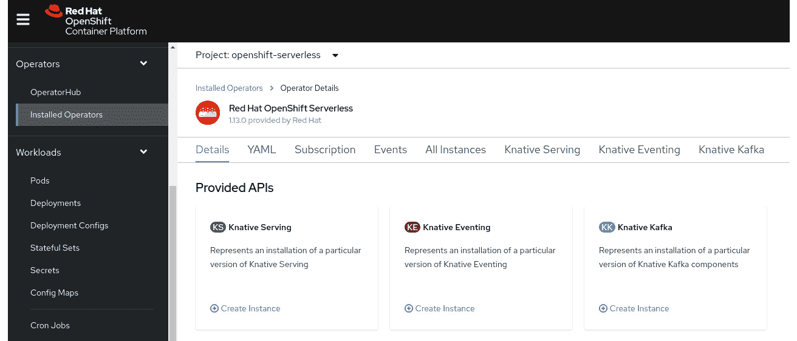
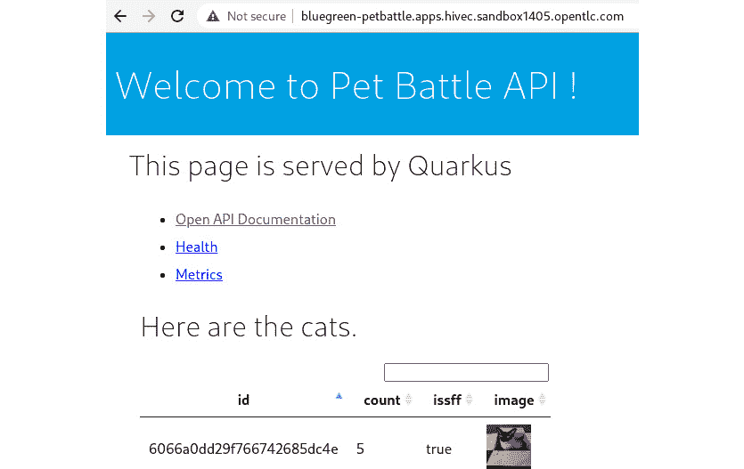
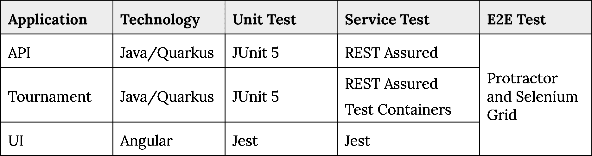
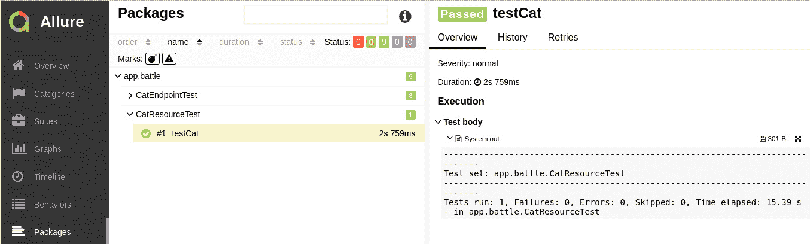
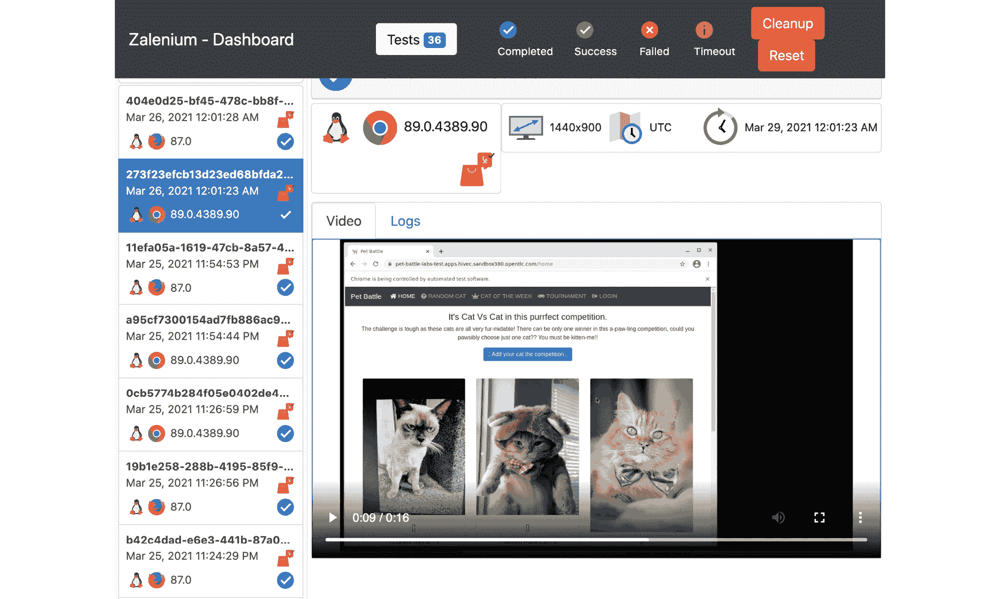
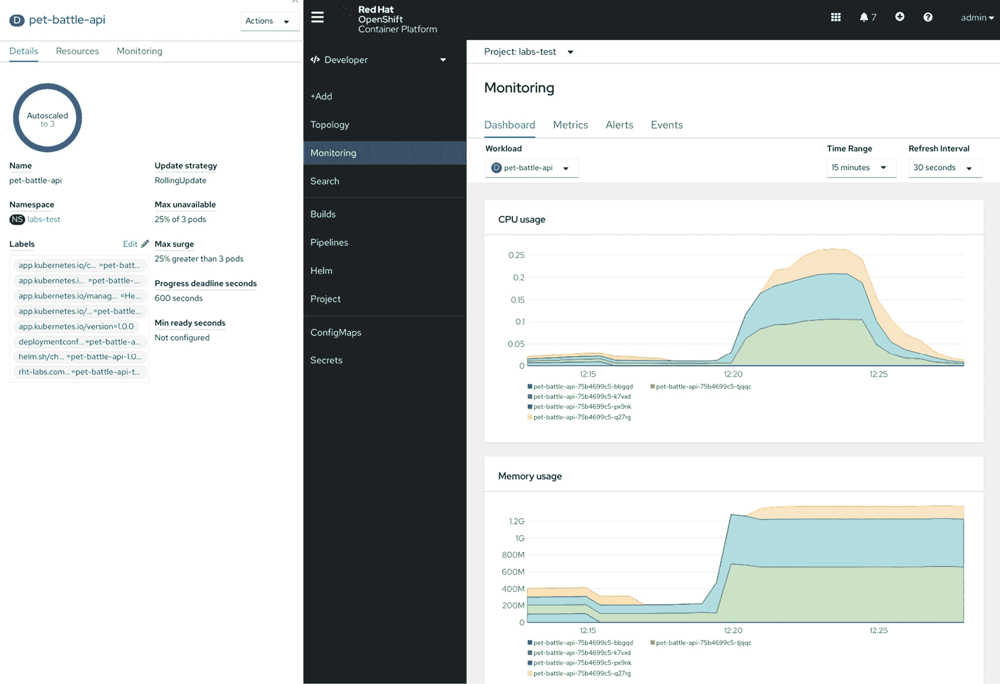
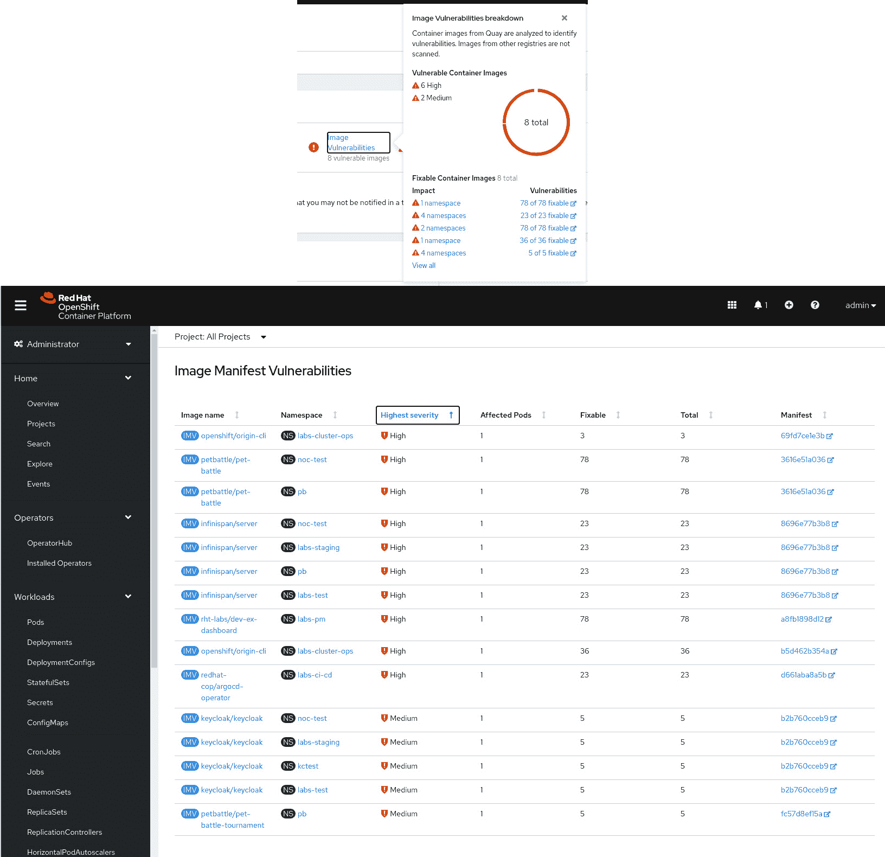
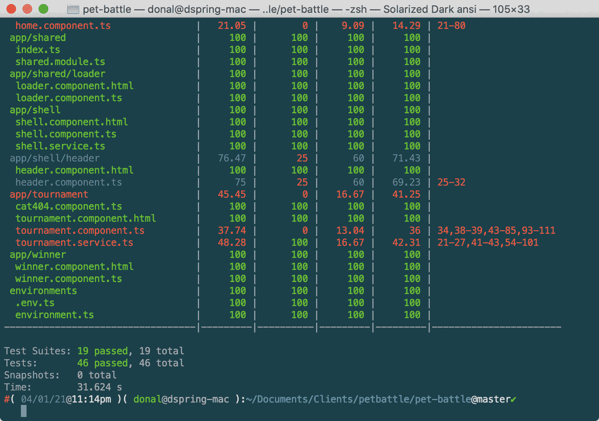

# 15\. 运行它

有句话说，*直到代码在生产环境中运行，它才有价值*。这里的意思是，直到客户使用你的软件，它对你的业务或组织的价值是有限的。这当然是一个广泛的概括！然而，这确实反映了软件的本质——其效用直接与能够运行它以实现最终编写目的相关。为了在生产环境中达到客户预期的服务质量，所有的代码都必须经过严格的测试。

在本章中，我们将探讨 PetBattle 团队如何测试他们的软件，以便在生产环境中能够更有信心地运行。正如我们在*第七章*、*开放技术实践——中期*中讨论的，测试是多方面的，我们将详细介绍测试的类型和范围，从单元测试到端到端测试，再到安全检查等。

当应用的爱好者版本上线后，PetBattle 的创始人很快发现恶意内容被上传到站点。作为本章的一部分，我们将探讨使用训练过的 AI-ML 模型来解决这个问题的现代方案。

在本章的最后部分，我们将探讨一些常见的云部署模式，并展示 A/B 测试和实验，以便深入了解如何安全地衡量和学习在生产环境中部署新特性所带来的影响。

## 不适合家庭的内容（NSFF）组件

正如我们之前提到的，在运行第一代 PetBattle 时，我们面临的一个主要问题是在线恶搞者上传不当图片到系统。这增加了平台的运营开销，因为 PetBattle 的创始人必须手动在 MongoDB 中查找并删除这些违规图片——非常繁琐！

一直在创新的团队决定尝试为这个问题提出一个自动化解决方案。我们决定调查的一个方法是使用**人工智能**（**AI**）对上传的图片进行分类，并将其集成到平台中。

人工智能本身是一个极具吸引力的领域，在这里我们不会深入探讨，只是提到我们正在使用由开源 TensorFlow 机器学习平台提供的预训练图像分类模型。

很好，但我们如何在 OpenShift 上运行这个应用？

计划如下：

1.  生成或获取一个预训练的图像分类模型。

1.  构建包含 TensorFlow 服务组件的容器，可以为我们上传的图片提供模型服务并进行预测。

1.  在 OpenShift 上以“按需扩展”部署模型（即无服务器架构）部署并运行容器。

### 为什么选择无服务器架构？

在基于 Kubernetes 的平台上部署容器时，例如 OpenShift，Kubernetes 负责管理运行中的容器，并且默认情况下，如果容器因错误终止，它会重新启动。基本上，容器始终处于运行状态。这对于那些持续接收和处理流量的容器来说是没问题的，但对于那些偶尔或突发性接收流量的容器来说，持续运行它会浪费系统资源。

我们希望实现的是，在需要时才启动容器，也就是说，在接收到请求时启动。容器启动后，我们希望它处理进入的请求，然后在一段时间没有流量后，优雅地关闭，直到收到进一步的请求。我们还希望容器实例在接收到大量请求时能够自动扩展。

我们可以使用 Kubernetes 水平 Pod 自动扩缩器（Horizontal Pod Autoscaler）自动化平台上容器实例数量的增加和减少；然而，这并不能扩展到零。我们也可以使用类似 `oc scale` 命令的工具，但这需要大量的脚本编写和组件集成。幸运的是，Kubernetes 社区考虑到了这一点，并提出了解决方案，称为 Knative。1

Knative 主要有两个组件，**Knative Serving** 和 **Knative Eventing**。Serving 用于根据 HTTP 流量启动（和关闭）容器。Knative Eventing 功能类似，但它专注于基于事件启动容器，覆盖了更广泛的使用场景。本书的重点将放在使用 Knative Serving 上。不过，我们也会提供一个示例，展示如何使用 Knative Eventing。

### 生成或获取预训练模型

我们已经进行了图像分类实验一段时间了。我们开始使用来自 Open Data Hub 社区的一些组件（[`opendatahub.io/`](https://opendatahub.io/)），并在现有的开源模型基础上训练我们的模型。最终，我们生成了一个训练好的数据模型，能够根据 Yahoo 的 Open NSFW 分类器 2（已用 TensorFlow 重写）对图像进行分类，判断其是否为 NSFF。尽管这个模型并不完美，但它足够用于入门。

数据科学社区中常见的模式是使用像 Seldon3 这样的工具来服务训练好的数据模型，而这些工具是 Open Data Hub 的一部分。然而，对于我们的需求来说，只需要一个简单的对象存储工具。因此，我们选择了 MinIO4，这是一个 Kubernetes 原生对象存储工具。我们决定，如果需要的话，稍后可以使用更先进的存储机制扩展它，比如 OpenShift 容器存储或 AWS S3。

1 [`knative.dev/`](https://knative.dev/)

2 [`github.com/yahoo/open_nsfw`](https://github.com/yahoo/open_nsfw)

3 [`www.seldon.io/`](https://www.seldon.io/)

4 [`min.io/`](https://min.io/)

我们将训练好的数据模型加载到 MinIO 中，看起来是这样的：


图 15.1：TensorFlow 数据模型保存在 MinIO 中

所保存的模型是我们可以使用 TensorFlow Serving 提供的服务之一，5 这基本上为我们提供了一个调用我们保存模型的 API 端点。我们可以部署一个开源的 TensorFlow Serving 镜像，并且只需配置它来找到我们在 S3 存储位置中的保存模型即可。

我们已经忽略了大部分工程化过程，这些过程使得 AI、ML 和 Ops 管道变得更加完善，这并不是因为这不是一个有趣的主题，而主要是因为这需要另一本完全不同的书来充分阐述！如果这个主题对你很重要，那么请看一下 Open Data Hub 项目。6 这是一个基于 Kubeflow 的开源项目，提供工具和技术来构建和运行 OpenShift 上的 AI 和 ML 工作负载。

5 [`www.tensorflow.org/tfx/guide/serving`](https://www.tensorflow.org/tfx/guide/serving)

6 [`opendatahub.io/`](http://opendatahub.io/)

7 [`www.kubeflow.org/`](https://www.kubeflow.org/)

### OpenShift Serverless Operator

在开始为 NSFF 服务部署我们的应用软件之前，我们需要将 OpenShift 无服务器操作员 8 添加到我们的 PetBattle 引导程序中。该操作员安装在集群范围内，以便任何想要使用 Knative 组件 Knative Serving 和 Knative Eventing 的项目都可以这样做。

让我们使用 GitOps、ArgoCD 和 Kustomize 来配置和安装无服务器操作员。首先，我们可以使用 ArgoCD 测试配置。使用命令行从 ArgoCD 登录。添加包含 Knative 无服务器操作员 YAML 订阅的 Git 存储库并创建应用程序：

```
# Login to ArgoCD
```

```
$ argocd login $(oc get route argocd-server --template='{{ .spec.host }}' \
```

```
-n labs-ci-cd):443 --sso --insecure
```

```
# Add our repository
```

```
$ argocd repo add \
```

```
  https://github.com/rht-labs/refactored-adventure.git
```

```
# Create the Knative Operator - this may have already been created for you but here is how to do it on the command line.
```

```
# Create the Knative Operator
```

```
$ argocd app create knative\
```

```
  --repo https://github.com/rht-labs/refactored-adventure.git \
```

```
  --path knative/base \
```

```
  --dest-server https://kubernetes.default.svc \
```

```
  --dest-namespace openshift-serverless \
```

```
  --revision master \
```

```
  --sync-policy automated
```

8 [`github.com/openshift-knative/serverless-operator`](https://github.com/openshift-knative/serverless-operator)

安装完成后，您应该能够在`openshift-serverless`命名空间中成功看到此安装。



图 15.2：OpenShift 无服务器操作员（Knative）

我们还可以将其放入我们的 PetBattle UJ 引导程序中，*第七章*，*开放技术实践 - 中点*，这样我们就不需要手动运行这些命令了。将以下内容添加到我们的`values-tooling.yaml`并将其提交到 Git 中：

```
# Knative stanza in values-tooling.yaml
```

```
- name: knative
```

```
    enabled: true
```

```
    destination: openshift-serverless
```

```
    source: https://github.com/rht-labs/refactored-adventure
```

```
    source_path: knative/base
```

```
    source_ref: master
```

```
    sync_policy: *sync_policy_true
```

```
    no_helm: true
```

现在，操作员已准备好供我们使用，以部署我们的 Knative 服务。

### 部署 Knative Serving 服务

有几种方法可以创建 Knative Serving 服务。我们可以创建 Knative 服务定义并将其安装到我们的集群中。我们已将其打包为 Helm 图表，以便轻松安装：

```
$ helm upgrade --install pet-battle-nsff \
```

```
petbattle/pet-battle-nsff \
```

```
--version=0.0.2 \
```

```
--namespace petbattle
```

容器启动并将模型数据加载到 MinIO 中可能需要一分钟左右；在此过程中它们可能会重启几次。`oc get pods` 命令的输出应该是这样的：MinIO S3 pod 和其完成的数据加载，以及一个 TensorFlow Knative 服务 pod：

```
$ oc get pods --namespace petbattle NAME                                   READY   STATUS   RESTARTS AGE
```

```
Minio-pet-battle-nsff-594fc7759-j7lwv  1/1     Running     0     88s
```

```
minio-pet-battle-nsff-dataload-7x8jg   0/1     Completed   2     88s
```

```
minio-pet-battle-nsff-gfjhz            0/1     Completed   3     88s
```

```
tensorflowserving-pet...-7f79956d9qfp  2/2     Running     2     85s
```

几分钟后，Knative Serving TensorFlow pod 将终止，因为它尚未被调用。这就是所谓的无服务器（Serverless）缩放至零，即当没有调用工作负载时，服务不需要运行。可以使用 Knative 命令行工具**kn**来创建等效的服务，该工具可以从 OpenShift9 控制台下载并安装。如果您希望创建新服务或从头开始开发服务，这是很有用的：

```
$ kn service create tensorflowserving-pb-nsff --namespace petbattle \
```

```
  --image=docker.io/tensorflow/serving:latest \
```

```
  --cmd "tensorflow_model_server" \
```

```
  --arg "--model_config_file=s3://models/models.config" \
```

```
  --arg "--monitoring_config_file=s3://models/prometheus_config.config" \
```

```
  --arg "--rest_api_port=8501" \
```

```
  --env S3_LOCATION=minio-pet-battle-nsff:9000 \
```

```
  --env AWS_ACCESS_KEY_ID=minio \
```

```
  --env AWS_SECRET_ACCESS_KEY=minio123 \
```

```
  --env AWS_REGION=us-east-1 \
```

```
  --env S3_REGION=us-east-1 \
```

```
  --env S3_ENDPOINT=minio-pet-battle-nsff:9000 \
```

```
  --env S3_USE_HTTPS="0" \
```

```
  --env S3_VERIFY_SSL="0" \
```

```
  --env AWS_LOG_LEVEL="3" \
```

```
  --port 8501 \
```

```
  --autoscale-window "120s"
```

9 [`docs.openshift.com/container-platform/4.7/serverless/serverless-getting-started.html`](https://docs.openshift.com/container-platform/4.7/serverless/serverless-getting-started.html)

在这里，我们使用命令行参数和环境变量来告诉 TensorFlow serving 镜像如何运行。`--image` 字段指定我们希望运行的容器镜像及版本——在这种情况下，是最新的 TensorFlow serving 镜像。`--cmd` 字段指定我们希望运行的镜像中的二进制文件，例如，模型服务器命令 `tensorflow_model_server`。`--arg` 和 `--env` 变量指定配置。训练好的模型从 `S3 minio` 服务提供，因此我们指定如何访问 S3 端点。Knative Serving 提供了许多配置选项，如自动扩缩的全局默认设置、指标和追踪。`--autoscale-window` 定义了自动扩缩器在进行扩缩时所考虑的数据量，因此，在这种情况下，如果两分钟内没有流量，则将 pod 扩缩到 0。

Knative 网站 10 提供了关于使用 Knative Serving 时创建的服务资源以及这些资源配置的更多细节。要查找我们的服务的 URL，可以使用以下命令：

```
$ kn route list
```

这为我们提供了测试服务的 HTTP URL 端点。值得注意的是，我们可以拥有多个服务版本，并且在前面提到的路由中，可以在多个版本之间进行流量负载均衡。下图展示了这种做法的实际工作原理：


图 15.3：Knative 对多个应用版本的路由

10 [`knative.dev/docs/serving/`](https://knative.dev/docs/serving/)

Kourier11 是一个基于 Envoy 网关的轻量级入口路由器。使用 Knative 服务配置，用户可以指定 Knative Serving 应用的路由规则。这在我们实验不同的 AI 模型或希望进行 A/B、蓝绿部署（Blue/Green）或金丝雀发布（Canary）时非常有用，例如 12。

### 调用 NSFF 组件

通过路由上的简单 HTTP GET 请求即可调用组件。Pod 会在几秒钟内启动并处理请求，然后在一段时间后（即`--autoscale-window`，即`kn`命令行参数中指定的 120 秒）关闭。使用`kn list route`命令的输出，让我们检查 AI TensorFlow 模型是否可用。`state`应为`AVAILABLE`：

```
$ curl <url from kn route list>/v1/models/test_model
```

```
# For example
```

```
$ curl http://tensorflowserving-pet-battle-nsff-labs-dev.apps.hivec.sandbox882.opentlc.com/v1/models/test_model
```

```
{
```

```
 "model_version_status": [
```

```
  {
```

```
   "version": "1",
```

```
   "state": "AVAILABLE",
```

```
   "status": {
```

```
    "error_code": "OK",
```

```
    "error_message": ""
```

```
   }
```

```
  }
```

```
 ]
```

```
}
```

11 [`developers.redhat.com/blog/2020/06/30/kourier-a-lightweight-knative-serving-ingress/`](https://developers.redhat.com/blog/2020/06/30/kourier-a-lightweight-knative-serving-ingress/)

12 [`medium.com/@kamesh_sampath/serverless-blue-green-and-canary-with-knative-kn-ad49e8b6aa54`](https://medium.com/@kamesh_sampath/serverless-blue-green-and-canary-with-knative-kn-ad49e8b6aa54)

我们还应该看到一个 Pod 正在启动来处理请求，使用：

```
$ oc get pods \
```

```
-l serving.knative.dev/configuration=tensorflowserving-pet-battle-nsff \
```

```
--namespace petbattle
```

```
NAME                          READY   STATUS    RESTARTS   AGE
```

```
tensorflowserving-pet…         2/2     Running   0          21s
```

然后在两分钟后缩小到 0。

我们希望通过发送一些图像来测试我们的 NSFF 服务是否有效。我们有两个经过编码的测试样本图像，可以上传到 NSFF 服务。


图 15.4：NSFF 测试图像

让我们下载这些图像进行测试：

```
$ wget https://raw.githubusercontent.com/petbattle/pet-battle-nsff/main/requests/tfserving/nsff-negative.json
```

```
$ wget https://raw.githubusercontent.com/petbattle/pet-battle-nsff/main/requests/tfserving/nsff-positive.json
```

现在使用简单的`curl`命令将它们提交到我们的 NSFF 服务：

```
$ HOST=$(kn service describe tensorflowserving-pb-nsff -o url)/v1/models/test_model:predict # Daisy Cat - Safe for Families
```

```
curl -s -k -H 'Content-Type: application/json \
```

```
  -H 'cache-control: no-cache' \
```

```
  -H 'Accept: application/json' \
```

```
  -X POST --data-binary '@nsff-negative.json' $HOST
```

```
{ "predictions": [[0.992712617, 0.00728740077]] }
```

```
# Not Safe For Families - Boxing
```

```
curl -s -k -H 'Content-Type: application/json' \
```

```
  -H 'cache-control: no-cache' \
```

```
  -H 'Accept: application/json' \
```

```
  -X POST --data-binary '@nsff-positive.json' $HOST
```

```
{ "predictions": [[0.30739361, 0.69260639]] }
```

我们模型的响应是一个包含两个数字的`predictions`数组。第一个是**适合家庭**的度量，第二个是**不适合家庭**的度量，它们加起来为 1。

因此，我们可以看到 Daisy Cat 与我们的摔跤手相比具有非常高的适合家庭评级（0.993），我们可以在 PetBattle API 中使用这一点，以确定是否可以显示任何给定的图像。通过任意测试，我们已经设定了对于我们认为适合在 PetBattle UI 中查看的图像，安全限制为>=0.6。

我们可以通过将`nssf.enabled`特性标志设置为`true`并在 bash shell 中使用 Knative 服务的主机名，使用以下命令行重新部署我们的 PetBattle API 服务，以调用 NSFF 服务：

```
$ HOST=$(kn service describe tensorflowserving-pet-battle-nsff -o url)
```

```
$ helm upgrade --install pet-battle-api petbattle/pet-battle-api \
```

```
--version=1.0.8 \
```

```
--set nsff.enabled=true \
```

```
--set nsff.apiHost=${HOST##http://} \
```

```
--set nsff.apiPort=80 --namespace petbattle
```

如果我们现在通过 UI 上传这些测试图像到 PetBattle 并检查 API 服务器，我们可以看到拳击图片具有`ISSFF`（适合家庭）标志，Daisy Cat 有一个**true**值：



图 15.5：PetBattle API 保存带有 ISSFF 标志的图像

API 代码将不会返回任何被视为 NSFF 的图片到 PetBattle UI。例如，返回 PetBattle 数据库中所有宠物的 API 代码会通过将`ISSFF`标志设置为`true`进行过滤：

```
@GET
```

```
@Operation(operationId = "list",
```

```
           summary = "get all cats",
```

```
           description = "This operation retrieves all cats from the
```

```
                          database that are safe for work",
```

```
           deprecated = false, hidden = false)
```

```
public Uni<List<Cat>> list() {
```

```
  return Cat.find(ISSFF, true).list();
```

```
}
```

现在我们的 API 已经运行起来了，是时候测试它，看它是否按我们的预期运行。

### 让我们谈谈测试

根据我们与许多开发团队合作的经验，没有什么能像讨论软件是否按预期工作的测试主题一样，能够阻碍许多开发人员的情绪。

对于许多开发人员来说，测试就像是进行牙科检查——很少有人喜欢做，但我们都知道必须做，而且得做得更多。这是一系列必须跨越的桥梁（通常是在压力下）才能让我们精心制作的、手工设计的、工艺精湛的软件作品被接受并进入生产环境。测试人员被视为另一个团队，他们确保我们已经检查了每一个细节，而他们并不欣赏我们为艺术所付出的辛苦。基本上，我们编写代码，*把它扔给测试团队*，然后他们检查它。

如果你正在阅读前面的段落，并且在心里想“是的，是的，就是我们，就是这样做的”，那我们有个非常坏的消息告诉你。*你基本上是在做错事*。当每 6-12 个月就进行一次大规模的软件发布时，这种做法或许是有意义的，但在如今更为敏捷、发布频率更高、更快速的组织中，这种做法被认为是笨重且过时的。当然，也有一些例外情况，比如关键控制系统、严格监管的环境等，但对于大多数企业开发人员来说，情况并非如此。

软件的质量是交付团队的责任，从产品负责人编写用户故事到工程师编写代码及相关测试。正如一位睿智的交付经理曾经说过，“测试是一项活动，而不是一个角色。”在高效的软件交付团队中，测试是贯穿整个软件开发生命周期的持续活动。关于测试，我们有一些原则是我们尽量遵守的：

1.  尽可能进行自动化，但不要自动化到没有人工监督的程度。让用户与待测试的应用程序进行交互总是有价值的，尤其是在进行端到端测试、验收测试和探索性测试时。

1.  测试代码与生产代码同样重要——两者都需要保持更新，并在不再添加价值时被移除或弃用。

1.  一次有意义的测试可能比数百个脚本化的测试用例更有价值。

在*第七章*，*开放技术实践——中点*中，我们介绍了自动化测试金字塔的概念。对于金字塔中定义的每种不同类型的测试，我们在 PetBattle 应用程序中使用了多种测试工具和框架。

一般来说，我们选择使用各个应用技术栈中被认为是默认的测试工具，因为这些工具最简单易用，支持最好，用户文档齐全，而且如果有人是新手，通常也很容易上手：



表 15.1：使用的测试框架

让我们更详细地了解一些这些测试。

### 使用 JUnit 进行单元测试

在 API 和 Tournament 应用程序中，我们有不同的标准单元测试示例。Quarkus 测试 13 对标准单元测试框架 JUnit14 提供了很好的支持。使用此框架的所有单元测试的结构非常相似。让我们以 API 应用程序中的 `CatResourceTest.java`15 为例：

```
@QuarkusTest
```

```
class CatResourceTest {
```

```
  private static final Logger LOGGER = LoggerFactory
```

```
                                      .getLogger("CatResourceTest");
```

```
  @Test
```

```
  void testCat() {
```

```
    PanacheMock.mock(Cat.class);
```

```
    Mockito.when(Cat.count())
```

```
      .thenReturn(Uni.createFrom().item(23l));
```

```
    Assertions.assertEquals(23, Cat.count().await().indefinitely());
```

13 [`quarkus.io/guides/getting-started-testing`](https://quarkus.io/guides/getting-started-testing)

14 [`junit.org/junit5/`](https://junit.org/junit5/)

15 [`github.com/petbattle/pet-battle-api/blob/master/src/test/java/app/battle/CatResourceTest.java`](https://github.com/petbattle/pet-battle-api/blob/master/src/test/java/app/battle/CatResourceTest.java)

在 Java 中，我们使用注解将 Java 类对象（POJO）转化为测试。我们使用 `@QuarkusTest` 注解将 JUnit 框架引入该类，并且我们可以将该类视为一个包含多个单独测试的测试套件。每个方法都是一个单独的测试，并使用 `@Test` 注解。在这个单元测试中，我们没有运行数据库，因此我们使用 `Cat.class` 的 mocks16 进行模拟。mock 是一个虚拟对象，它不会连接到真实的数据库，我们可以用它来测试 `Cat` 类的行为。在此案例中，我们在测试中断言，当我们调用方法 `Cat.count()`（该方法对应于 PetBattle 中宠物图片的点赞数量）时，我们会收到预期的数字（`23`）。我们使用 `Uni` 和 `await()` 函数，因为我们在 Quarkus 应用程序中使用了响应式编程模型。17

我们将这些单元测试作为自动化持续部署管道的一部分运行，并使用我们的 CI/CD 工具（包括 Jenkins、Tekton 和 Allure 等测试报告工具）来可视化和报告测试的成功和历史记录。18



图 15.6：使用 Allure 可视化测试

在下一节中，我们将继续使用 REST Assured 和 Jest 进行服务和组件测试。

### 使用 REST Assured 和 Jest 进行服务和组件测试

Jest 和 REST Assured 是 JavaScript 和 Java 的**行为驱动开发**（**BDD**）框架。我们在*第七章*，*开放技术实践 – 中期*中讨论了 BDD。这些框架使得开发者能够轻松编写测试，语法直观且容易跟随。

16 [`quarkus.io/guides/mongodb-panache`](https://quarkus.io/guides/mongodb-panache)

17 [`quarkus.io/guides/getting-started-reactive#mutiny`](https://quarkus.io/guides/getting-started-reactive#mutiny)

18 [`github.com/allure-framework`](https://github.com/allure-framework)

我们将使用 Jest 覆盖 PetBattle 用户界面的组件测试基础知识 19。该用户界面由多个组件组成。你在打开应用程序时看到的第一个组件是主页。对于主页组件，测试类 20 被命名为 `home.component.spec.ts`：

```
describe('HomeComponent', () => {
```

```
  let component: HomeComponent;
```

```
  let fixture: ComponentFixture<HomeComponent>;
```

```
  beforeEach(async () => {...
```

```
  });
```

```
  beforeEach(() => {...
```

```
  });
```

```
  it('should create', () => {
```

```
    expect(component).toBeTruthy();
```

```
  });
```

```
});
```

每个测试有一个相似的结构：

+   `describe()`: 测试套件的名称以及测试规格参数

+   `beforeEach()`: 在每个测试运行之前，执行作为参数传入的函数

+   `it()`: 定义一个单一的测试，要求有期望值，并且包含逻辑和断言的函数

+   `expect()`: 为测试结果创建期望，通常会配合 `toEqual()` 等匹配函数使用

因此，在这个情况下，单元测试会期望 `HomeComponent` 在测试运行时被正确创建。

19 [`angular.io/guide/testing`](https://angular.io/guide/testing)

20 [`github.com/petbattle/pet-battle/blob/master/src/app/home/home.component.spec.ts`](https://github.com/petbattle/pet-battle/blob/master/src/app/home/home.component.spec.ts)

类似地，在 API 应用程序中，REST Assured 是一个测试工具，允许我们使用熟悉的 `Given,` `When,` `Then` 语法编写测试，语法来自 *第七章*，*开放技术实践——中期*。我们来查看一下测试套件 `CatResourceTest.java`21 中的一个服务 API 测试：

```
@Test
```

```
@Story("Test pet create")
```

```
void testCatCreate() {
```

```
    CatInstance catInstance = new CatInstance();
```

```
    RestAssured.given()
```

```
            .contentType(ContentType.JSON)
```

```
            .body(catInstance.cat)
```

```
            .log().all()
```

```
            .when().post("/cats")
```

```
            .then()
```

```
            .log().all()
```

```
            .statusCode(201)
```

```
            .body(is(notNullValue()));
```

```
}
```

在这个测试中，我们创建了一个 `Cat` 对象。`Cat` 类是 PetBattle 中的数据对象，包含了宠物的上传图片以及其 PetBattle 投票数，并存储在 MongoDB 中。在测试中，给定一个 `Cat` 对象，我们使用 `HTTP POST` 请求 `/cats` 端点，并期望返回状态码为 (`201`)，即 `CREATED`。我们还测试了 HTTP 响应体不为空，它应包含新创建的 `Cat` 的 ID：

```
@QuarkusTest
```

```
@QuarkusTestResource(MongoTestResource.class)
```

```
@Epic("PetBattle")
```

```
@Feature("PetEndpointTest")
```

```
class CatEndpointTest {
```

21 [`github.com/petbattle/pet-battle-api/blob/master/src/test/java/app/battle/CatResourceTest.java`](https://github.com/petbattle/pet-battle-api/blob/master/src/test/java/app/battle/CatResourceTest.java)

在这个服务测试中，我们使用了 `@QuarkusTestResource` 注解来创建并启动一个嵌入式的 MongoDB 进行测试。因此，这个测试比仅使用 mock 的基本单元测试要更复杂一些。我们还使用我们的测试报告工具来跟踪这些服务测试的执行情况：


图 15.7：使用 Allure 可视化服务测试

现在我们已经看到了单元测试的样子，接下来我们将提升测试层级，看看服务级别的测试。

### 使用 Testcontainers 进行服务测试

集成测试通常比单元测试更为复杂，因为需要启动或模拟/虚拟化更多的组件。我们测试金字塔的下一个层级是使用一个名为**Testcontainers**的 Java 框架进行集成测试。22 Testcontainers 允许我们轻松地创建和启动 MongoDB、**KeyCloak**和**Infinispan**等组件，并使用这些组件执行测试。以下类实例化并管理这些容器，并将其注入到 Quarkus 框架的测试生命周期中：

```
$ ls src/test/java/com/petbattle/containers/
```

```
InfinispanTestContainer.java KeycloakTestContainer.java   MongoTestContainer.java
```

在`ITPetBattleAPITest.java`的集成测试代码中，我们仅仅是注入了之前创建的容器，并在测试期间将它们作为资源使用：

```
$ head src/test/java/com/petbattle/integration/ITPetBattleAPITest.java
```

```
package com.petbattle.integration;
```

```
...
```

```
@QuarkusTest
```

```
@DisplayName("API Test Cases")
```

```
@QuarkusTestResource(MongoTestContainer.class)
```

```
@QuarkusTestResource(InfinispanTestContainer.class)
```

```
@QuarkusTestResource(KeycloakTestContainer.class)
```

```
public class ITPetBattleAPITest {
```

22 [`www.testcontainers.org/`](https://www.testcontainers.org/)

这是一个很好的例子，展示了如何在测试阶段使用容器。这些容器被启动，测试执行完毕后，容器被移除。唯一的真正前提是运行测试的机器上需要运行 Docker 守护进程。要运行集成测试，可以使用命令`mvn clean verify -Pintegration`。

### 端到端测试

我们的应用程序由一个用 Angular 编写的前端组成，该前端向两个 API 发起数据请求。一个是用于比赛的，另一个是用于猫的。我们可以将这些组件之间的相互作用看作是整个系统的一部分。每次对这些独立应用程序中的任何一个进行更改时，都应要求重新验证整个系统。端到端的自动化测试主要在用户界面中执行，但也涵盖了底层服务层。

有很多工具可以从用户界面层面进行测试。比较流行的工具包括 Selenium 和 Cypress，它们用于驱动 Web 应用程序并模拟用户行为。每个工具都有优缺点——Selenium 仅仅是浏览器自动化，所以你需要自己带上测试框架，而 Cypress 是一个一体化的测试框架。当 Selenium Grid 在 Kubernetes 上运行时，可以通过在每次测试执行时动态地为每个测试分配浏览器来让我们并行地在多个浏览器上进行测试，这意味着我们不需要让浏览器闲置等待使用。

对于我们的端到端测试，我们使用了 Angular 团队的 Protractor。我们在部署工具时，已经部署了由 Zalando 团队为 Kubernetes 构建的 Selenium Grid 实例（称为 Zalenium [`opensource.zalando.com/zalenium/`](https://opensource.zalando.com/zalenium/)）。Zalenium 非常方便，因为它允许我们回放之前的测试并实时观看它们。在你的集群中，如果你获取 Zalenium 的路由（`oc get routes -n labs-ci-cd`）并附加`/grid/admin/live`，你可以在测试执行时跟踪它们，或者访问`/dashboard`观看历史测试执行。



图 15.8：Zalenium 仪表板，显示测试历史和视频回放

我们的`system-tests`项目（[`github.com/petbattle/system-tests`](https://github.com/petbattle/system-tests)）包含了在每次推送到前端或后端服务后需要执行的所有系统测试。测试是使用 Cucumber 风格的 BDD 编写的。实际上，我们应该能够将 BDD 与 PetBattle Sprint 项目的接受标准连接起来。


图 15.9：在 PetBattle 的 Sprint 看板上，作为接受标准编写的 BDD 示例

这是一个使用 `Given,` `When,` `Then` 语法编写的比赛功能测试：

```
Feature: Tournament features
```

```
  Scenario: Should only be prompted to login on navigating to the
```

```
            tournament
```

```
    Given I am on the home page
```

```
    When  I move to the tournament page
```

```
    Then  I should be redirected to keycloak
```

`system-test` 项目有自己的 Jenkinsfile，因此它已经通过我们的种子任务连接到 Jenkins。我们不会详细介绍这个 Jenkinsfile 的内容。简单来说，管道有两个阶段，符合我们的大致图景，一个用于运行测试，另一个用于在测试通过时提升应用程序。在随附的 Git 仓库中探索此代码：[`github.com/petbattle/system-tests`](https://github.com/petbattle/system-tests)。为了扩展我们 `pet-battle` 的 Jenkinsfile 以触发我们的系统测试任务，我们只需要添加另一个阶段来触发该任务。我们可以使用 Jenkins 的 `post{}` 块，但我们只希望在 `master` 或 `main` 上并生成候选发布版本时触发系统测试。


图 15.10：在 Jenkins 中触发连接我们管道的触发器

有一些参数会在任务之间传递：

+   `APP_NAME`：传递给任务，因此如果测试成功，提升阶段就知道要部署哪个应用。

+   `CHART_VERSION & VERSION`：对图表或应用的任何更新都需要在 Git 中修补，因此这些信息会由触发系统测试的任务传递。

我们可以通过向任务提供这些信息手动运行系统测试任务，但每个具有 Jenkinsfile 的服务应该能够将这些信息传递给系统测试。此任务也可以从 Tekton 触发，如果我们混合使用管道方法。将两个管道连接起来后，只需在设置好 webhook 后运行以下命令即可触发其中一个：

```
$ git commit --allow-empty -m "🍌 kickoff jenkins 🦆" && git push
```

如果我们现在检查 Jenkins Blue Ocean Web UI，我们应该看到以下内容：


图 15.11：系统测试管道

在 Jenkins 中，我们应该看到系统测试管道在运行并在成功时进行提升。该任务还包括 Cucumber 报告。


图 15.12：Jenkins 中的 Cucumber 报告

这些报告提供了有关为哪个浏览器执行了哪些用例的见解，并报告任何可能发生的失败。现在让我们稍作调整，看看非功能性测试。

## 管道与质量门（非功能性测试）

质量通常只是关注测试是否通过。然而，也有代码质量的概念。代码可能按预期执行，但编写方式可能非常糟糕，以至于在添加新更改时，未来可能成为问题的源头。所以现在是时候检查我们代码的质量了。

### SonarQube

作为普适之旅的一部分，我们已经自动化了 SonarQube 的 Helm 图表部署，利用它来测试和衡量代码质量。在 `values-tooling.yaml` 文件中，SonarQube 语句引用了 Helm 图表以及所需的额外插件。许多常见的语言配置插件已经随着 SonarQube 基础版本一同部署，例如 Java、JavaScript 和 Typescript。我们为 Checkstyle（我们的 Java 格式化检查工具）和一个用于检测项目依赖项中公开披露的漏洞的依赖检查器，添加了额外的插件条目：

```
  # Sonarqube
```

```
  - name: sonarqube
```

```
    enabled: true
```

```
    source: https://github.com/redhat-cop/helm-charts.git
```

```
    source_path: "charts/sonarqube"
```

```
    source_ref: "sonarqube-0.0.14"
```

```
    sync_policy: *sync_policy_true
```

```
    destination: *ci_cd_ns
```

```
    values:
```

```
      initContainers: true
```

```
      plugins:
```

```
        install:
```

```
          - https://github.com/checkstyle/sonar-checkstyle/releases/download/8.35/checkstyle-sonar-plugin-8.38.jar
```

```
          - https://github.com/dependency-check/dependency-check-sonar-plugin/releases/download/2.0.7/sonar-dependency-check-plugin-2.0.7.jar
```

在部署了基本的 SonarQube Pod 后，我们需要自动化的最后一部分配置——创建代码质量关卡。质量关卡是代码必须通过的门槛，才能被认为准备好发布。这归结为在代码中定义的一组条件，指定了特定的测量标准，例如：

+   我们添加的代码是否有新的阻塞问题？

+   代码的测试覆盖率是否高于指定的百分比？

+   是否存在可识别的代码漏洞？

SonarQube 让我们通过其 REST API 定义这些质量关卡 23。对于 PetBattle，我们使用 Kubernetes 作业来定义我们的质量关卡 `AppDefault`，并将其打包为 Helm 图表进行部署。该图表通过普适之旅和 ArgoCD 部署。


图 15.13：SonarQube 质量关卡定义

SonarQube 服务器可以通过 REST API 查询，查看特定项目的最近报告是否通过了质量关卡。我们在管道中配置了一个 Tekton 步骤和任务，以便每次运行构建时自动检查这一点。

我们的 PetBattle Java 应用程序使用 Maven 配置，连接到我们的 SonarQube 服务器 Pod，并在每次构建、打包和部署时生成 SonarQube 格式的报告。在可重用的 `maven-pipeline.yaml` 文件中，我们调用以下目标来生成这些报告：

```
# code analysis step maven pipeline     - name: code-analysis
```

```
      taskRef:
```

```
        name: maven
```

```
      params:
```

```
        - name: MAVEN_MIRROR_URL
```

```
          value: "$(params.MAVEN_MIRROR_URL)"
```

```
        - name: MAVEN_OPTS
```

```
          value: "$(params.MAVEN_OPTS)"
```

```
        - name: WORK_DIRECTORY
```

```
          value: "$(params.APPLICATION_NAME)/$(params.GIT_BRANCH)"
```

```
        - name: GOALS
```

```
          value:
```

```
            - install
```

```
            - org.owasp:dependency-check-maven:check
```

```
            - sonar:sonar
```

```
        - name: MAVEN_BUILD_OPTS
```

```
          value:
```

```
            - '-Dsonar.host.url=http://sonarqube-sonarqube:9000'
```

```
            - '-Dsonar.userHome=/tmp/sonar'
```

```
# code analysis step nodejs pipeline     - name: code-analysis
```

```
      taskRef:
```

```
        name: nodejs
```

```
      params:
```

```
        - name: NPM_MIRROR_URL
```

```
          value: "$(params.NPM_MIRROR_URL)"
```

```
        - name: GOALS
```

```
          value:
```

```
            - "run"
```

```
            - "sonar"
```

23 [`docs.sonarqube.org/latest/user-guide/quality-gates/`](https://docs.sonarqube.org/latest/user-guide/quality-gates/)

类似地，对于使用 `nodejs` 的 PetBattle UI，我们可以配置客户端在其 Tekton 管道中调用 SonarQube。一旦这些步骤成功执行，我们可以探索 SonarQube Web UI，并深入了解任何区域以获取更多信息。


图 15.14：SonarQube 项目视图

在最近关于 PetBattle UI 的 A/B 测试支持的开发过程中，一些代码错误似乎悄悄出现了！开发人员可以深入查看并精确找出问题所在，并在代码库中进行修复。SonarQube 根据在语言质量配置文件中定义的严重性对问题进行排名，该配置文件可以根据您的开发代码质量需求进行调整。


图 15.15：SonarQube 挖掘一些错误详情

SonarQube 还会报告上次运行的代码测试覆盖率。在代码库方面，您可以使用 `LCOV`24 格式生成覆盖率报告，因此在 Java 中，这由 `JaCoCo`25 完成，而在 JavaScript 中，覆盖率报告由 `mocha`/`jasmine` 模块生成。这些报告被上传到 SonarQube，为团队提供了关于代码库哪些部分需要更多测试的可视化信息。查看这些信息的一个很好的方式是使用热力图，它将覆盖率接近 100%（绿色）的代码块与完全没有覆盖的代码块（红色）进行了可视化。统计信息也会被报告，包括整体覆盖率百分比、覆盖的行数等。


图 15.16：PetBattle 的 SonarQube 测试覆盖率热力图

24 [`github.com/linux-test-project/lcov`](https://github.com/linux-test-project/lcov)

25 [`www.eclemma.org/jacoco/`](https://www.eclemma.org/jacoco/)

我们用于 Java 应用程序的最后一个插件是 OWASP Dependency-Check 插件。26 我们将安全检查提前到开发流水线的“左侧”。换句话说，我们希望在开发过程的早期发现安全漏洞或 CVE 是如何潜入到我们应用程序的依赖项中的。通过在构建周期的早期识别出哪些依赖项存在 CVE 漏洞，开发人员能够更好地更新这些依赖项，而不是等到应用程序部署后才发现问题。


图 15.17：Dependency-Check 插件报告

该插件从多个开源资源获取数据，包括美国国家漏洞数据库 27 和 Sonatype OSS Index。28 与安全团队成员配合，开发人员可以验证已知漏洞，并通过配置文件抑制任何误报。报告非常详细，包含了这些网站的链接，以帮助 CVE 的识别和报告。

26 [`github.com/dependency-check/dependency-check-sonar-plugin`](https://github.com/dependency-check/dependency-check-sonar-plugin)

27 [`nvd.nist.gov/`](https://nvd.nist.gov/)

28 [`ossindex.sonatype.org/`](https://ossindex.sonatype.org/)

### 性能测试（非功能性）

我们最喜欢的命令行工具之一，用于快速反馈 REST API 性能的是一个叫做**hey**的工具。29 还有很多类似的工具可用。Apache Bench30 可能是最具历史的。


图 15.18：一个简单的 hey 运行

29 [`github.com/rakyll/hey`](https://github.com/rakyll/hey)

30 [`httpd.apache.org/docs/2.4/programs/ab.html`](https://httpd.apache.org/docs/2.4/programs/ab.html)

我们喜欢在命令行中使用 `hey` 来调用 PetBattle API 并列出所有的宠物。我们传入一些表示以下内容的参数：

+   `-c`: 要并发运行的工作者数量

+   `-n`: 要运行的请求数量

+   `-t`: 每个请求的超时时间（秒）

我们可以看到报告的汇总统计信息，而这正是我们喜欢的部分——延迟分布的直方图、HTTP 状态码分布以及 DNS 定时详细信息。这是非常丰富的信息。直方图是显示连续响应延迟数据分布的图表。直方图揭示了汇总统计无法提供的响应时间特性。在统计学中，汇总数据用于描述完整的数据集——例如，最小值、最大值、均值和平均值。**Hey** 在输出的顶部为我们提供了这些汇总统计信息。

图表让数据栩栩如生，因为我们可以开始理解在测试运行的时间内，延迟响应的分布情况。在发送 100 个请求所花费的 4.2 秒内，我们可以看到大多数数据集中在 0.4 秒左右，这几乎占了所有流量的 50%。通常，在服务性能设计中，我们关心的是 95% 或 99% 百分位数。也就是说，对于所有的样本数据，95%（或 99%）的流量响应延迟是多少。在此次测试中，测得值为 0.57 秒——换句话说，95% 的数据响应时间都在或低于这个值。

直方图的形状也很重要。响应延迟在哪里聚集？我们可以很容易地看出响应时间是否均匀分布在平均值（高斯分布）周围，或者它们是否有更长或更短的尾部。这有助于我们在不同负载下表征服务的性能。你可以使用多种负载配置文件，例如，在瞬时流量激增时，我们向 API 发起大量请求，与低负载下的长期浸泡测试相比。你甚至可能已经有类似应用程序的已知负载。这些类型的测试负载的设计非常适合使用开源工具 Apache JMeter31，它能很好地建模线程和负载增加。我们强烈推荐将它作为工具箱中的一个工具。为了简单起见，本文不会覆盖这个工具。

31 [`jmeter.apache.org/`](https://jmeter.apache.org/)

*图 15.19* 中的两个图表展示了简单的负载测试。左边的是一个突发类型的测试——300 个连续用户对我们的 PetBattle API 进行 900 次调用。我们可以看到 95% 响应时间是 15.6 秒——对于用户来说，这个等待时间相当长！右边的是一个持续测试——50 个连续用户对我们的 PetBattle API 进行了 10,000 次调用。统计数据非常不同：测试时长为 461 秒，95% 响应时间是 2.8 秒——从最终用户的角度来看，这要好得多。

在这个阶段，重要的是要思考测试实际在做什么，以及它与 PetBattle 应用套件的关系。如果我们仔细想想，这个测试可能并不能完全反映当前用户界面的行为。例如，我们并不会一次性调用返回 MongoDB 中的所有图片，而是分页返回结果。当然，还有其他 API 端点需要测试，比如 `topcats` API，它返回最受欢迎的前三只宠物，并在每次访问主页时被调用。我们返回的是加载到 PetBattle 中的测试数据集，也就是大约 15 张宠物图片，所以数据量并不庞大。在进行性能测试时，始终要从整体上考虑，了解更广泛的背景，这样才能避免测试错误的内容！


图 15.19：针对 PetBattle API 的突发和持续测试

尽管如此，这些数据值得深思。一个好的结果是，突发和持续测试都只返回了 HTTP 200 响应状态——API 没有返回错误响应。这让我们有信心，说明我们没有破坏任何功能，也没有达到任何内部系统限制。我们还可以检查详细信息，确保 DNS 解析不会在客户端调用过程中造成问题。

现在我们已经熟悉了性能测试的客户端或调用端，让我们转到服务器端运行的 PetBattle API 应用。如果我们浏览到开发者视图，并选择 `labs-test` 命名空间中的 `pet-battle-api` Pod，就能看到一些重要的服务器端信息：

+   PetBattle API 自动扩展为两个 Pod。

+   Pods 的监控指标（如果你尚未启用 CRC，请查看附录）。

作为开发者，我们已经将 PetBattle API 应用配置为使用 **水平 Pod 自动扩展器**（**HPA**）。这指定了 OpenShift 容器平台如何根据从属于我们应用的 Pods 收集的指标，自动增加或减少复制控制器或部署配置的规模，即运行的 Pods 数量。


图 15.20：实验室测试命名空间中的 PetBattle API Pod

在我们的 PetBattle API Helm 图表中，我们为 HPA 指定了最小 Pods、最大 Pods 以及平均 CPU 和内存目标的可配置值。通过使用 hey 工具，我们现在可以测试各种场景，帮助我们在负载下调整 PetBattle API 应用：

```
apiVersion: autoscaling/v2beta2
```

```
kind: HorizontalPodAutoscaler
```

```
metadata:
```

```
  name: {{ include "pet-battle-api.fullname" . }}
```

```
  labels:
```

```
    {{- include "pet-battle-api.labels" . | nindent 4 }}
```

```
spec:
```

```
  scaleTargetRef:
```

```
    {{- if .Values.deploymentConfig }}
```

```
    apiVersion: v1
```

```
    kind: DeploymentConfig
```

```
    {{- else }}
```

```
    apiVersion: apps/v1
```

```
    kind: Deployment
```

```
    {{- end }}
```

```
    name: {{ include "pet-battle-api.fullname" . }}
```

```
  minReplicas: {{ .Values.replicas.min }}
```

```
  maxReplicas: {{ .Values.replicas.max }}
```

```
  metrics:
```

```
    - type: Resource
```

```
      resource:
```

```
        name: cpu
```

```
        target:
```

```
          type: AverageValue
```

```
          averageValue: {{ .Values.hpa.cpuTarget }}
```

```
    - type: Resource
```

```
      resource:
```

```
        name: memory
```

```
        target:
```

```
          type: AverageValue
```

```
          averageValue: {{ .Values.hpa.memTarget }}
```

我们最初在 HPA 中粗略猜测了这些设置，例如，`min replicas = 2`，`max replicas =6`，`CPU = 200m`，`mem = 300Mi`，并在我们的 Deployment 中适当设置了资源限制和请求。我们始终保持至少两个 pod，以确保高可用性。HPA 配置为根据平均内存和 CPU 负载进行扩展。我们尚不清楚应用程序是内存密集型还是 CPU 密集型，因此选择基于这两个度量来扩展。



图 15.21：PetBattle API HPA 正在运行，在负载下扩展 pod

我们使用 hey 启动一个突发工作负载，进行 400 个并发请求，并观察 HPA 的行为，看看它如何启动更多的 pod 以保持指定的内存和 CPU 平均值。一旦测试结束，HPA 会将我们的工作负载缩减到最小，因为应用程序通过 Java 垃圾回收恢复资源。OpenShift 支持 HPA 的自定义指标以及其他类型的 pod 自动伸缩器，例如，垂直 Pod 自动伸缩器。32

结束这一部分时，我们要指出开发人员工具箱中还需要另一个 Kubernetes 对象——**Pod 中断预算**（**PDB**）。同样，使用 Helm Chart 模板配置 PDB，我们可以限制 PetBattle API 应用程序所经历的并发中断次数。通过设置 PDB，我们可以在允许集群管理员管理集群节点生命周期的同时，提供更高的可用性。

32 [`docs.openshift.com/container-platform/4.7/nodes/pods/nodes-pods-using.html`](https://docs.openshift.com/container-platform/4.7/nodes/pods/nodes-pods-using.html)

如果集群正在更新并且节点正在重启，我们希望始终保持至少一个`pet-battle-api` pod 可用：

```
$ oc get pdb 
```

```
NAME       MIN AVAILABLE MAX UNAVAILABLE  ALLOWED DISRUPTIONS   AGE
```

```
pet-battle-api   1           N/A                  1             46h
```

这确保了我们的 PetBattle API 具有高水平的业务服务。我们可以看到`ALLOWED_DISRUPTIONS`被设置为 1——这是因为在此时，HPA 已将可用副本数量扩展至 3，且这一设置会随着可用 pod 数量的变化而变化。

在 OpenShift 上进行应用程序性能测试的一个优点是，开发人员可以轻松地配置、测试、测量和调整他们的应用程序，以便在负载下实现高可用性和高性能。每个应用程序服务都是独立可扩展、可调优和可部署的，这使得在处理规模和性能问题时，反馈循环更快、更具针对性。

在下一部分，我们将看看如何成为一个合格的 OpenShift Kubernetes 公民，自动化 Kubernetes 资源验证作为我们流水线的一部分。

### 资源验证

测试的一个方面目前尚未引起足够关注，那就是部署到集群中的 Kubernetes 资源的质量。为了让应用程序被视为 Kubernetes 中的*好公民*，必须遵循一系列部署最佳实践——包括健康检查、资源限制、标签等——我们将在*第十六章，掌控它*中详细讲解其中的多个方面。然而，我们需要验证应用于集群的资源定义，以确保高度符合行业推荐的最佳实践，以及我们认为适合添加的其他资源建议。这时，**Open Policy Agent** (**OPA**)33 及其相关工具就派上用场了。它使我们能够在 CI 流水线中以及在将资源应用于集群时验证资源定义。OPA 本身是一个策略验证器，策略是使用一种名为 Rego 的语言编写的。额外的 OPA 工具，如 Conftest34 和 Gatekeeper35，从可用性和部署的角度提供了很大的价值和治理。OPA 还可以嵌入到其他第三方工具中，如 KubeLinter36。

33 [`www.openpolicyagent.org/`](https://www.openpolicyagent.org/)

34 [`github.com/open-policy-agent/conftest`](https://github.com/open-policy-agent/conftest)

35 [`github.com/open-policy-agent/gatekeeper`](https://github.com/open-policy-agent/gatekeeper)

36 [`github.com/stackrox/kube-linter`](https://github.com/stackrox/kube-linter)

我们并没有在 PetBattle 中使用 OPA 的服务器端验证组件 Gatekeeper37，但在 Red Hat 实践社区的 GitHub 仓库 38 中有一些示例 Rego 策略，值得深入探索。如果你对此感兴趣，强烈建议查看 OpenShift.com 上关于设置所有这些组件的博客 39。

然而，为了展示如何轻松使用客户端资源验证，以及为什么在流水线中至少应包含一些资源验证，我们创建了一个简单的 Rego 示例。Rego 策略足够容易编写，Rego playground40 是一个很好的地方来编写和验证策略，欢迎去看看。

让我们来看一个示例。在我们的非功能性需求地图中，我们提到过希望在标签命名上保持一致性。根据 Kubernetes 最佳实践，我们应该使用`app.kubernetes.io/instance`标签并将其应用到所有资源上。那么，接下来我们看看如何为此编写一个测试，并将其添加到我们的 Jenkins 流水线中。

一个拒绝创建资源的策略的构成相当简单。如果规则中的所有语句都为真，那么一条消息会形成并返回给解释器。例如，我们编写了一个策略，检查所有资源是否符合 Kubernetes 最佳命名惯例。此策略正在检查 `app.kubernetes.io/instance` 是否存在于提供给它的资源（`input`）上。如果每个语句都为真，那么将返回一条错误消息，指导用户修复问题：

```
deny[msg] {
```

```
  label := "app.kubernetes.io/instance"
```

```
  not input.metadata.labels[label]
```

```
  msg := sprintf("\n%s: does not contain all the expected k8s labels
```

```
                 in 'metadata.labels'.\n Missing '%s'. \nSee: https://kubernetes.io/docs/concepts/overview/working-with-objects/common-labels", [input.kind, label])
```

```
}
```

37 [`github.com/open-policy-agent/gatekeeper`](https://github.com/open-policy-agent/gatekeeper)

38 [`github.com/redhat-cop/rego-policies`](https://github.com/redhat-cop/rego-policies)

39 [`www.openshift.com/blog/automate-your-security-practices-and-policies-on-openshift-with-open-policy-agent`](https://www.openshift.com/blog/automate-your-security-practices-and-policies-on-openshift-with-open-policy-agent)

40 [`play.openpolicyagent.org/`](https://play.openpolicyagent.org/)

我们可以将这个规则与 Conftest 和 Helm 模板结合，创建一种静态验证资源的方式。在 PetBattle 前端代码中，有一个策略文件夹，里面有一些额外的策略，用于检查在运行 `helm template` 命令后，所有标准 Kubernetes 标签 41 是否已设置在我们生成的资源上。通过运行一些命令，我们可以验证这些资源是否已到位。首先，我们使用模板化图表来生成我们在部署软件时将应用的 Kubernetes 资源，其次，我们告诉 Conftest 根据规则检查每个生成的文件：

```
# from the pet battle front end repository (https://github.com/petbattle/pet-battle.git)
```

```
$ for file in $(ls policy/helm-output/pet-battle/templates/); do conftest test policy/helm-output/pet-battle/templates/$file; done
```

```
6 tests, 6 passed, 0 warnings, 0 failures, 0 exceptions
```

```
FAIL - policy/helm-output/pet-battle/templates/deploymentconfig.yaml - 
```

```
DeploymentConfig: does not contain all the expected k8s labels in 'metadata.labels'.
```

```
 Missing 'app.kubernetes.io/name'. 
```

```
See: https://kubernetes.io/docs/concepts/overview/working-with-objects/common-labels
```

```
6 tests, 5 passed, 0 warnings, 1 failure,  0 exceptions
```

```
6 tests, 6 passed, 0 warnings, 0 failures, 0 exceptions
```

```
6 tests, 6 passed, 0 warnings, 0 failures, 0 exceptions
```

当从命令行执行规则时，我们可以清楚地了解图表中缺少的内容。当然，我们可以假设始终让我们的图表遵循最佳实践，但 `jenkins-agent-helm` 也包含了 Conftest 二进制文件，因此我们也可以在 Jenkins 流水线中执行前述语句。这个例子看起来可能很简单，但希望它能给你一些关于可以自动化和测试的事情的思路，尽管这些可能看起来不那么明显。

41 [`kubernetes.io/docs/concepts/overview/working-with-objects/common-labels/#labels`](https://kubernetes.io/docs/concepts/overview/working-with-objects/common-labels/#labels)

### 图像扫描

Red Hat 在 OpenShift 中提供了 Quay 容器安全操作员，将 Quay 和 Clair 图像扫描及漏洞信息引入我们的 OpenShift 集群。任何托管在 [Quay.io](http://Quay.io) 上的容器镜像都会被 Clair 扫描。


图 15.22：Quay 容器安全操作员

任何图像漏洞数据都会通过 OpenShift Web UI 显示，用户和管理员可以轻松查看哪些镜像被认为是漏洞镜像，以及它们部署到哪个命名空间。



图 15.23：易受攻击的容器镜像

部署此操作符后，OpenShift 概览状态会显示镜像漏洞数据，操作员可以深入查看，了解平台上运行的容器镜像的状态。对于 PetBattle，我们并没有对集群中发现的镜像漏洞进行强制执行。如果我们想要将安全扫描工具“向左移动”到我们的部署流水线中，OpenSCAP 网站上有一些很棒的开源扫描工具可供使用。42

### 其他非功能性测试

还有许多其他类型的测试可以用来验证我们的应用程序。在本节中，我们列出了一些我们认为在流水线中重要的内容，但实际上，这个话题远不止这些内容，甚至可以专门写书来探讨！

### Linting

Linter 是一种静态代码分析工具，可以检查代码库中常见的设计陷阱或风格错误。它不会检查已编译的应用程序，而是检查应用程序的结构。这对于那些没有编译的语言（如 JavaScript）非常重要。浏览器可以以不同的方式解释 JavaScript，因此一致性至关重要。

如果考虑到一个大型企业应用程序，可能会有数百个开发人员在同一个代码库上工作。这些开发人员甚至可能是全球分布的，不同的团队负责应用程序生命周期的不同部分。编写软件时保持一致性，可以显著降低维护成本。JavaScript 在编写方式上非常灵活，无论是从函数式编程的角度还是面向对象的角度，因此确保这种一致性至关重要。

PetBattle 前端使用 TSLint/ESLint43 来检查代码风格是否符合一套标准规则。这些规则可以由团队进行调整，但规则会被提交到 Git 中，因此如果有人禁用了它们或更改了它们，都会被发现。我们的 Jenkins 流水线配置为自动检查代码库，使用 `npm lint` 命令，如果开发人员没有遵守标准，构建会失败。

42 [`www.open-scap.org`](https://www.open-scap.org)

43 [`eslint.org/`](https://eslint.org/)


图 15.24：Linting PetBattle 的前端本地扫描 JavaScript 和 HTML

对于 Java Quarkus 应用，使用 Checkstyle44 来分析代码库。

对于 Kubernetes 资源，前述的 Open Policy Agent 可以提供帮助，Helm 也有 `helm lint`45 命令来验证你的图表。

### 代码覆盖率

所以，你已经编写了大量测试，并且认为一切顺利——但你怎么知道你的测试是否足够好，覆盖了代码库的所有部分呢？让我来介绍一下代码覆盖率指标！代码覆盖报告器是一个与单元测试套件一起运行的软件，用来查看测试执行了哪些代码行，以及这些行被执行了多少次。覆盖报告还可以突出显示应用程序中的 if/else 控制流是否未被测试。这一洞察可以提供有关系统中未测试区域的宝贵反馈，从而减少错误数量。

44 [`checkstyle.sourceforge.io/`](https://checkstyle.sourceforge.io/)

45 [`helm.sh/docs/helm/helm_lint/`](https://helm.sh/docs/helm/helm_lint/)

我们的 PetBattle 前端配置为在执行 Jest 测试时运行覆盖报告。Jest 使得生成报告变得非常简单，因为它有一个标志，可以传递给测试运行器来为我们收集覆盖率。每次构建执行时，都会运行覆盖报告，因此应该通过 Jenkins 进行报告。



图 15.25：来自前端单元测试的代码覆盖率报告（本地）

在 Jenkins 流水线中执行我们的测试时，我们已配置 Jest 生成 HTML 报告，Jenkins 可以在作业页面上显示该报告。对于每次构建执行，报告都会添加到作业的主页上。该报告将帮助我们发现哪些代码行没有被测试覆盖。能够深入查看这样的报告，可以让我们更好地了解测试的不足之处。


图 15.26：Jenkins 中的代码覆盖报告为我们提供了详细的洞察

那么，我应该如何处理这些结果呢？从历史上看，我们通常会集中精力在覆盖率较低的地方进行工作。这可以成为回顾会议中的一个很好的讨论点。打印出报告并作为团队讨论，是评估团队为何难以编写足够测试的一个很好的方式。有时，团队在压力下被迫快速交付功能，因此测试可能会被忽视。在构建过程中添加代码覆盖报告器，可以帮助团队保持透明度。你甚至可以设置阈值，确保如果测试覆盖率低于某个百分比（有些团队目标是 80% 或更高），构建将失败，从而阻止流水线，直到质量提高。

## 未测试软件水印


很久以前，我参与了一个结构很差的项目。我是 DevOps 团队的一员，现在我知道这在大多数实现中都是一种反模式！这个项目有很多问题，团队提前计划了三次 Sprint，但没有为测试分配足够的时间。测试总是最后被压缩的任务。

通过与团队的回顾，我们发现根本没有足够的时间进行测试。听起来可能让人难以接受，但问题的根本原因并不是团队的懒惰或技能不足，实际上就是时间问题。项目是按 8 周的周期进行的，从一开始就已经预先规划好，并且最终有一个固定的输出。团队以为他们在做 Scrum，但实际上，他们每个冲刺都在完成功能性里程碑，而没有反馈循环。当然，Scrum 团队的成员也没有参与到工作量估算或规划的环节中。这意味着团队一直处于交付压力之下。


通过回顾，我们决定尝试减轻团队面临的部分压力，因为我们不满意为了某些任意的截止日期而牺牲了质量。我们知道，简单地让管道失败对这些客户来说是行不通的，因此我们不得不在展示软件质量时发挥创意。我们决定在任何测试覆盖率低的应用程序中注入一个水印。这个水印类似于你在任何文档上看到的“DRAFT”标志，但我们的水印略有不同。

一条巨大的横幅上写着“UNTESTED SOFTWARE”（未经测试的软件），它被放置在未通过测试的应用程序上。这种水印不会影响应用程序的用户行为；它只是一个覆盖层，但它是一个让人们开始讨论的绝妙方式。看到一条巨大的“UNTESTED”横幅，肯定会让人们质疑为什么事情会变成这样。

让我们看一些其他方法，看看在持续交付过程中如何可视化风险。

### OWASP Zed Attack Proxy (ZAP)

安全扫描始终是一个热门话题。从我们之前讨论的图像扫描，到我们管道中应用程序的依赖检查，从安全角度看，自动化的内容几乎是无穷无尽的。让我们看另一个可以在管道中包含的有用工具——OWASP Zed Attack Proxy。46

来自他们网站的信息：*OWASP Zed Attack Proxy (ZAP)是世界上最流行的免费安全工具之一，它可以让你自动发现应用程序中的安全漏洞。这使得开发人员可以自动化* *渗透测试和应用程序的安全回归测试，在 CI/CD 管道中进行。*

将 ZAP 安全扫描工具添加到我们的管道中非常简单。只需添加以下`stage`并添加你想要测试的 URL 即可。此图像的源代码可以找到，像我们其他的 Jenkins 图像一样来自 Red Hat CoP。47 Jenkins 中的 ZAP 扫描将生成一个报告，显示我们应用程序中的一些潜在漏洞。

```
stage('🤖 OWASP Scan') {
```

```
  agent { label "jenkins-agent-zap" }
```

```
  steps {
```

```
    sh '''
```

```
      /zap/zap-baseline.py -r index.html -t http://<some website url> || return_code=$?
```

```
      echo "exit value was  - " $return_code
```

```
    '''
```

```
  }
```

```
  post {
```

```
    always {
```

```
      // publish html
```

```
      publishHTML target: [
```

```
          allowMissing: false,
```

```
          alwaysLinkToLastBuild: false,
```

```
          keepAll: true,
```

```
          reportDir: '/zap/wrk',
```

```
          reportFiles: 'index.html',
```

```
          reportName: 'OWASP Zed Attack Proxy'
```

```
        ]
```

```
    }
```

```
  }
```

```
}
```

46 [`www.zaproxy.org/`](https://www.zaproxy.org/)

47 [`github.com/redhat-cop/containers-quickstarts/tree/master/jenkins-agents`](https://github.com/redhat-cop/containers-quickstarts/tree/master/jenkins-agents)

通过这样做，可以在 Jenkins 中查看创建的 Web 报告，报告详细说明了安全漏洞的原因以及应采取的修复措施。


图 15.27：PetBattle 的 Zap 报告示例

在最终的非功能性测试部分，我们来看一下使用一种叫做混沌工程的技术故意破坏我们的代码。

### 混沌工程

混沌工程是故意破坏、限制或影响系统的过程，目的是观察其表现及是否能在随之而来的“混乱”中恢复。虽然大多数测试被视为了解系统在已知稳定状态下如何表现的尝试，但混沌工程则是计算机领域中的“放开公牛在精致的瓷器店中乱跑”——你知道结果会很糟，但不知道具体糟到什么程度。

混沌工程的目的是建立对系统韧性的信心。它还让你更好地理解故障点发生的位置以及任何故障的冲击范围。Kubernetes API 规范中内置了许多韧性特性。Pod 副本可能是最简单的机制，确保在任何给定时间都有多个应用程序实例在运行。使用应用程序特定的机制（如断路器）也很重要，这些机制可以防止故障在系统中蔓延。混沌工程将这些理念向前推进了一步，测试当一个或多个组件完全或部分失效时的系统表现，例如当 CPU 或内存资源不足时。

基本的前提是，在测试的系统处于稳定工作状态时进行观察，然后注入故障。接着观察系统是否能够成功从故障中恢复。通过这种测试，可以得出潜在的调优/修复领域，并了解系统的**平均恢复时间**（**MTTR**）。需要注意的是，混沌工程关注的是整个系统——应用程序和基础设施性能都需要考虑并进行测试。

混沌工程背后的一个关键原则包含在其定义原则中 48——*在系统出现大规模异常行为之前，需要识别其弱点*。

这是采用这种方法时需要考虑的最重要方面之一。你不希望在影响生产的事件中才发现系统的弱点。这类似于定期测试灾难恢复计划的原理。换句话说，Red Hat 的一位同事曾说过，“*当屎飞到风扇上时，首先要做的就是关掉风扇！*”那时没有时间去学习。

有许多工具和框架可以帮助设置混沌工程实践。以下是一些入门工具（尽管还有其他工具）：

+   Litmus Chaos49

+   Kraken50

+   Chaos Mesh51

48 [`principlesofchaos.org/`](https://principlesofchaos.org/)

49 [`litmuschaos.io/`](https://litmuschaos.io/)

50 [`github.com/cloud-bulldozer/kraken`](https://github.com/cloud-bulldozer/kraken)

51 [`chaos-mesh.org/`](https://chaos-mesh.org/)

在一个像“万物皆代码”和 GitOps 这样的实践是我们构建软件以及支撑这些软件的系统的唯一方式的世界里，验证能否应对丢失项目的一种很好的方法就是每周或每晚从头开始重新部署一切，包括你的基础设施！这听起来可能很极端，但这是验证没有任何隐藏的魔法的好方法，确保没有人忘记写下来或编码。

## 意外混乱测试


这是一个我曾经不太愿意分享的故事，但随着时间的推移（而且已经经历了两次），我意识到其实做这件事是件好事。

在为一家航空公司工作时，我不小心删除了 `labs-ci-cd` 项目以及几个其他部署了我们应用的命名空间，包括我们集群的认证提供者。当时，我们的开发已经进行好几周了。我们习惯了重新部署应用程序，删除像 Nexus 或 Jenkins 这样的 CI 工具对我们来说并不是什么大问题，因为我们知道自动化会迅速启动并重新部署它们。

然而，在这次工作中，我们也使用了 GitLab，不幸的是，GitLab 和这些其他工具在同一个项目里！

我首先和团队确认，询问是否可以重建我们工具命名空间中的所有内容。我得到了队友们响亮的“可以”答复，于是我开始删除一些我认为需要清理的东西，并不小心删除了几个额外的项目。大约 30 秒后，团队中的某个人突然警觉地问道，*Git 对其他人也无法使用吗？* 紧接着又有人说，*有人无法登录到集群吗？* 我脸马上变得通红，意识到我刚才做了什么。正如我们在书中所说，Git 是我们唯一的真理来源。*如果它不在 Git 里，那就不是真的* 是我们的座右铭！我们甚至把它写在了墙上！但我刚刚把它删除了。

那么，当某个傻乎乎的人不小心删除了它会发生什么呢？在最初的震惊和恐慌过后，团队拉下了安灯线（Andon Cord）。我们迅速聚在一起，查看究竟发生了什么，以便规划如何恢复不仅仅是 Git，还包括我们添加到集群中的所有内容。幸运的是，所有的工作都存储在 Git 中，所以我们能够重新部署我们的工具，并将我们本地的分布式软件和基础设施副本推送回共享的 Git 仓库中。

团队是跨职能的，拥有我们响应这一问题所需的所有工具和权限。在 1 小时内，我们已经完全恢复了所有应用程序和工具，并且所有自动化都再次顺利运行。

我认为这个例子中的真正力量在于，给定合适的设备和所有权，赋能的团队可以做到一切。我们像一个整体一样，以闪电般的速度解决问题。我们没有被卡在队列中，也不需要向另一个团队提交工单来恢复我们的基础设施。我们能在几分钟内自己搞定——而不是几天或几周后。

我还学到了一点，那就是不要将 Git 与其他工具放在同一个项目中，以防像我这样的人再次出现。我还学会了要注意我们在集群中拥有的权限。作为管理员，我曾能够删除一些我本不应该动的东西。

所以我们已经写好了代码，进行了测试，质量检查，并扫描了漏洞。现在是时候将它部署到集群中了。让我们来探索 Kubernetes 的一个关键好处——根据需求进行应用部署的不同方式，并进行以用户为驱动的实验，以确定用户更喜欢哪些功能。

## 高级部署

从软件编写和测试完成到部署到生产环境的时间应该尽可能短。这样，您的组织就能尽快从软件变更中获得价值。现代解决这个问题的方法当然是通过自动化。部署到生产时需要更改的细节和配置项实在是太多了，甚至像 PetBattle 这样的小型应用套件，手动部署也变得容易出错且繁琐。减少手动劳动的驱动正是我们在本书中所探索的许多 DevOps 实践的核心。

通过采用合适的应用架构并结合 OpenShift 提供的众多平台功能，我们可以将软件部署变更过程中的停机时间降到最小（理想情况下为零！）。让我们来看看 OpenShift 支持的一些常见部署策略：

+   滚动部署：

    +   启动新版本的 Pod，然后自动关闭现有旧版本的 Pod。这对于零停机时间的方案非常有用。

+   金丝雀部署：

    +   启动新版本的单个 Pod，进行测试以确保一切正常，然后将所有旧的 Pod 替换为新的。

+   蓝绿部署：

    +   创建一个并行部署，并在切换流量之前验证一切是否正常。

    +   服务网格流量镜像功能可以在这种方法中发挥作用，用来验证新版本是否按预期工作。

+   重新创建部署：

    +   基本上，将现有的 Pods 缩放到零，然后启动新版本。

    +   用于必须重启应用程序的情况，例如迁移数据库架构或表。

    +   把这个想象成一次 Ripley 部署：“从轨道上起飞并摧毁整个站点。这是唯一能确保的方式。”52

我们可以使用 Helm 图表生命周期或开箱即用的`oc rollback`支持回滚到先前的部署版本。图像和配置在 OpenShift 中是版本化并缓存的，以便轻松支持回滚到先前的版本。

52 [`en.wikiquote.org/wiki/Aliens_(film)`](https://en.wikiquote.org/wiki/Aliens_(film))

### A/B 测试

A/B 测试应用程序是测试或验证新功能在生产环境中表现的一个绝佳方式。这个过程非常简单：你将两个（或更多）不同版本的应用程序部署到生产环境，衡量某些方面的表现，然后看看哪个版本的表现*更好*。鉴于 A/B 测试主要是一种评估用户体验的机制，*更好*取决于你正在实验的方面/功能。例如，你可以对网页布局做一些微妙的调整，测量用户导航到某个按钮所花的时间，或者用户与页面上特定项目的互动持续多长时间。

这是一个非常聪明的方式，在发布到更广泛的群体之前，通过小范围的受众来减少新发布的风险或验证一些新的业务或 UI 功能。可以捕捉用户行为，并进行实验，以便做出有关产品方向的明智决策。

### 实验

让我们回想一下前面章节中提到的生成选项的部分。我们曾提到实验的重要性，我们的价值切片板中包括了一个可以进行 A/B 测试的项目。一个出现的实验是评估用户如何在比赛中为猫投票。他们是否只能点赞（👍）还是也应该能够点踩（👎）？我们可以构建并部署两个版本的应用程序：一个可以同时点赞和点踩，另一个仅能点赞。我们的实验很简单：追踪人们实际使用点踩按钮的频率，这样我们就可以决定它是否是一个必要的功能，或者我们是否应该专注于构建其他功能。


图 15.28：在价值切片板上定义的实验

现在让我们看看如何设置一个简单的实验，将两个版本的应用程序部署并在每个部署实例之间路由流量，生成一些数据来帮助我们做出决策。

### Matomo – 开源分析

OpenShift 为我们提供了一种将流量推送到不同版本应用程序的机制。这本身是有用的，但它并未提供可以作为决策依据的信息。为此，我们需要衡量用户与平台的互动情况。为此，我们将引入用户分析，记录用户与网站互动的指标。我们将使用开源的 Matomo53 平台。虽然还有其他平台可以选择，但在撰写本文时，这是我们的选择，因为它是开源的，并且功能非常完善。为了保持一致性，让我们将 Matomo 加入到我们的整体图中。


图 15.29：包含 Matomo 的新增工具的整体图

53 [`matomo.org/`](https://matomo.org/)

那么，我们如何安装 Matomo 平台呢？Helm 再次来救场。我们将此安装过程自动化，作为 PetBattle 平台的一部分，通过在我们的 Ubiquitous Journey 项目中启用它来实现。它默认部署到我们的 `labs-ci-cd` 命名空间，配置文件位于 `ubiquitous-journey/values-tooling.yaml`：

```
# Matamo
```

```
  - name: matomo
```

```
    enabled: true
```

```
    source: https://github.com/petbattle/pet-battle-analytics.git
```

```
    source_path: charts/matomo
```

```
    sync_policy: *sync_policy_true
```

```
    destination: labs-ci-cd
```

```
    source_ref: main
```

```
    ignore_differences:
```

```
    - group: apps
```

```
      kind: Deployment
```

```
      jsonPointers:
```

```
        - /spec/replicas
```

```
        - /spec/template/spec/containers/0/image
```

然而，如果你只想安装这个工具而不涉及 ArgoCD，你可以直接克隆仓库并手动安装。这个图表是从现有的图表 54 派生出来的，旨在调整它以便更轻松地在 OpenShift 上安装。具体来说，MariaDB 和 Redis 依赖中的安全上下文已经被禁用，以便部署将自动使用目标命名空间的默认服务帐户和关联的 `anyuid`。此外，图表中已添加 OpenShift 路由，以允许应用程序接收流量：

```
$ oc login ...
```

```
$ git clone https://github.com/petbattle/pet-battle-analytics.git \
```

```
&& cd pet-battle-analytics
```

```
$ helm install pba charts/matomo
```

部署了 Matomo 分析后，我们只需要配置前端与之连接。为此，只需更新前端中 `chart/values.yaml` 配置文件中的 `matomoUrl`，让跟踪代码自动跟踪该网站。这将提供基本的站点跟踪，例如页面停留时间或访问的页面数量。

54 [`gitlab.com/ideaplexus/helm/matomo`](https://gitlab.com/ideaplexus/helm/matomo)


图 15.30：配置 matomoUrl 的 config_map

为了进行更有意义的测试，我们可能希望捕捉特定的用户行为。该应用程序已经被设置为将某些事件报告回 Matomo 服务器，例如鼠标点击。每当用户点击按钮为猫投票时，它会捕捉该事件并将其报告给 Matomo。实现这一点非常简单——我们只需要在我们想要跟踪的事件中添加一行代码：

```
this.matomoTracker.trackEvent('A/B Tests', 'Voting', voting)
```

### 部署 A/B 测试

在宠物对战的环境中，让我们来看看如何配置前端的部署来进行这个简单的 A/B 测试。幸运的是，OpenShift 通过提供一种暴露 `route` 并将其连接到多个服务的方法，使得这一切变得非常简单，可以使用 `alternateBackends` 数组来配置额外的服务以便发送流量。我们可以给这里定义的每个服务应用 `weights`，从而设置流量分配给已部署的 A 或 B 服务的百分比。权重可以设置在 0 到 256 之间，如果某个服务的权重降到 0，它将继续服务现有连接，但不会接受新的连接。事实上，OpenShift 允许我们进行的不仅仅是 A 或 B 测试——它还支持 C 和 D，因为 `alternateBackends` 支持最多三个服务！

让我们为 `pet-battle` 部署我们的 A/B 实验。我们可以将这些步骤与 ArgoCD 集成，但为了方便演示，还是用我们熟悉的 Helm 来部署。我们已经预构建了一个镜像，它没有在主页上进行投票的能力 `quay.io/petbattle/pet-battle:no-down-vote`。让我们通过运行简单的 Helm 命令将这个镜像部署到我们的集群中（确保将配置映射设置为正确的集群端点）：

```
$ git clone git@github.com:petbattle/pet-battle.git && cd pet-battle 
```

```
$ helm install nodownvote --set image_version=no-down-vote \
```

```
--set route=false chart --namespace petbattle
```

通过这个命令，我们通过将镜像设置为预构建的镜像并禁用 OpenShift 路由来部署 `pet-battle` 前端的新实例，因为这个路由不需要。我们将通过更新 `prod` 应用来配置我们的生产路由。

运行 `oc get pods` 应该能看到应用程序已启动，如果你检查路由，你应该会看到没有暴露的路由：

```
$ oc get pods
```

名称 准备 状态 重启次数 时长

```
nodownvote-pet-battle-1-deploy  0/1     Completed   0          2m47s
```

```
nodownvote-pet-battle-1-jxzhf   1/1     Running     0          2m43s
```

让我们部署 `pet-battle` 应用的 `prod` 版本，并将 `no-down-vote` 应用作为我们将连接的服务之一。我们的 Helm 图表配置为接受服务名称以及我们希望应用于实验特性的权重，通过 `a_b_deploy.svc_name` 和 `a_b_deploy.weight` 来传递。它默认采用 50/50 的轮询分配。让我们按照这个配置进行部署：

```
# install prod version
```

```
$ helm install prod --set image_version=latest chart \
```

```
--set a_b_deploy.svc_name=no-down-vote-pet-battle --namespace petbattle
```

```
# list pods
```

```
$ oc get pods
```

```
NAME                            READY  STATUS              RESTARTS  AGE
```

```
nodownvote-pet-battle-1-deploy  0/1    Completed           0         4m53s
```

```
nodownvote-pet-battle-1-jxzhf   1/1    Running             0         4m49s
```

```
prod-pet-battle-1-6bbv8         0/1    ContainerCreating   0         12s
```

```
prod-pet-battle-1-deploy        1/1    Running             0         16s
```

进入 `pet-battle` 的 UI，刷新页面后，你应该会看到 50/50 的概率展示“仅支持投赞成票”版本。如果你打开隐身模式或使用其他浏览器并尝试访问前端，你应该会看到另一个版本。需要使用不同的浏览器会话，因为 OpenShift 路由器默认会将你返回到同一个 Pod，因此你总是会访问到相同的版本。


图 15.31：没有投票功能的 PetBattle 前端

运行 `oc get routes` 应该会显示一个路由，且该路由连接到多个服务，且显示 50/50 的 `split prod-pet-battle(50%),no-down-vote-pet-battle(50%)`。你可以通过运行 `oc get route prod-pet-battle -o yaml` 来查看设置的权重，每个权重都是 100：

```
# display the routes
```

```
$ oc get routes
```

```
NAME       HOST/PORT     PATH   SERVICES  PORT  TERMINATION  WILDCARD
```

```
prod-pet-battle      prod-pet-battle-labs-dev.apps…
```

```
      prod-pet-battle(50%),no-down-vote-pet-battle(50%)
```

```
             8080-tcp   edge/Redirect   None
```

可以使用 Helm 很轻松地更新分配给每个应用的流量权重：

```
# update route weights
```

```
$ helm upgrade prod --set image_version=latest chart \ 
```

```
    --set a_b_deploy.svc_name=no-down-vote-pet-battle \
```

```
    --set a_b_deploy.weight=10 --namespace petbattle
```

### 理解结果

如果我们操作已部署的两个版本，可以看到点击按钮的结果是如何被捕获的。如果你打开 Matomo 应用并登录，你会看到一些统计数据。Matomo 的默认密码，如图表中所设定的，是`My$uper$ecretPassword123#`。虽然这个密码一开始可能不是非常安全，但通过 Helm 图表的值可以轻松更改。


图 15.32: Matomo 显示 UP_VOTE 与 DOWN_VOTE 的点击数量

Matomo 渲染饼图可能需要几分钟的时间。我们的简单实验表明，更多的人使用了 UP_VOTE 功能，而不是 DOWN_VOTE 功能。通过将 A/B 测试与 Matomo 中捕获的数据连接，我们现在可以做出更有根据的决策，决定下一步该采取什么行动。

这个实验证明了设置 A/B 测试是多么简单。我们可以利用 OpenShift 平台动态地将用户路由到多个同时部署的应用版本，同时收集关于哪些有效、哪些无效的数据。虽然我们需要对如何使应用程序能够收集特定数据进行一些思考，但现有的开源工具使得这一切变得简单！

### 蓝绿部署

蓝绿部署策略是每个将应用部署到生产环境的团队都应了解的基本部署策略之一。使用这种策略，通过确保在部署过程中有两个版本的应用程序可用，可以最大程度地减少执行部署切换所需的时间。它的另一个优势是，您可以迅速回滚到应用程序的原始版本，而无需回滚任何更改。


图 15.33: 经典的蓝绿部署

这里的权衡是，你需要有足够的资源来运行你部署的应用堆栈的两个版本。如果你的应用程序有持久化状态，例如数据库或非共享磁盘，那么应用架构和约束必须能够容纳这两个并发版本。这通常对于较小的微服务来说不是问题，也是选择这种部署风格的一个好处。

让我们通过以 PetBattle API 为示例的应用堆栈来演示蓝绿部署。在这种情况下，我们将部署两个完整的堆栈，即应用程序和 MongoDB。首先部署我们的应用程序的蓝色版本：

```
# install the blue app stack $ helm upgrade --install pet-battle-api-blue \
```

```
    petbattle/pet-battle-api --version=1.0.15 \
```

```
    --namespace petbattle --create-namespace
```

现在部署绿色应用堆栈。请注意，我们为此有一个不同标签的镜像版本：

```
# install the green app stack
```

```
$ helm upgrade --install pet-battle-api-green \
```

```
  petbattle/pet-battle-api --version=1.0.15 \
```

```
    --set image_version=green \
```

```
    --namespace petbattle
```

接下来，我们将生产环境的 URL 端点暴露为指向蓝色服务的路由：

```
# create the production route
```

```
$ oc expose service pet-battle-api-blue --name=bluegreen \
```

```
--namespace petbattle
```

最后，我们可以通过`oc patch`命令在两者之间切换：

```
# switch service to green
```

```
$ oc patch route/bluegreen --namespace petbattle -p \
```

```
    '{"spec":{"to":{"name":"pet-battle-api-green"}}}'
```

```
# switch back to blue again
```

```
$ oc patch route/bluegreen --namespace petbattle -p \
```

```
    '{"spec":{"to":{"name":"pet-battle-api-blue"}}}'
```

如果你浏览到`bluegreen`路由端点，你应该能轻松地确定应用堆栈：


图 15.34: PetBattle API 的蓝绿部署

尽管这个例子有些牵强，你仍然可以看到允许开发者以自助方式操作 OpenShift 路由层的强大能力。类似的方法也可以用于部署 NSFF 功能，举个例子：使用 Helm chart 参数 `--set nsff.enabled=true` 来部署启用 NSFF 的版本。如果你想的话，还可以通过类似操作 Helm chart 值的方式，将两个应用指向同一个数据库。

如果你有更复杂的用例需要考虑原始蓝色堆栈中的长时间运行事务，即需要排空这些事务，或者你有需要与绿色发布一起迁移的数据存储，执行蓝绿部署的方式有几种更高级的方式。查看 ArgoCD 的发布能力，它具有大量高级功能，55，或者 Knative 蓝绿发布能力，甚至是 Istio56 以获得更多的思路。

### 部署预览

我们应该把 OpenShift 看作是一个可以用来部署应用的“游乐场”，从生产环境到开发者预览环境都能满足需求。过去，开发团队需要提交通知单来申请服务器，并手动配置服务器以展示他们的应用程序，这样的日子已经一去不复返了。将应用程序构建在容器中使我们能够创建可以反复部署在多个环境中的可交付应用。我们在 Jenkins 中为 PetBattle 配置了自动化，每次提交时都会自动运行。对于 Jenkins，我们使用了多分支插件，所以每当开发者向某个分支推送新功能时，系统会自动搭建一个新的流水线并部署该功能的最新更改。

在上一章中讨论到沙箱构建时，你可能觉得这有些过度，而且有点浪费。为什么不直接在拉取请求上构建呢？这是一个很有效的问题，根据你要实现的目标，直接在拉取请求上构建可能已经足够了。我们使用沙箱构建作为引入反馈回路的另一种方式。

55 [`argoproj.github.io/argo-rollouts`](https://argoproj.github.io/argo-rollouts)

56 [`github.com/hub-kubernetes/istio-blue-green-deployment`](https://github.com/hub-kubernetes/istio-blue-green-deployment)

开发者并非孤立存在；他们周围有团队的其他成员，包括产品负责人和设计师。我们能够动态地从管道中启动新功能的部署，这意味着我们可以很容易地将编码工作与设计团队连接起来。开发者可以通过共享最新更改或新功能实现的链接，与设计团队快速获得反馈。这一反馈循环可以在工程师失去工作背景之前迅速进行微小的修改和修订。从每次提交创建部署预览，还允许开发者非常快速地与产品负责人分享应用程序的两个版本，以便在他们做出选择时提供参考。

从我们的 Jenkins 管道中，有一个名为 `cool-new-cat` 的分支。当该分支被构建时，它将把应用程序的新版本推送到 `dev` 环境。应用程序中的变化为了说明目的而很细微，但我们可以看到横幅已经被更改。通过这个新版本的应用程序，我们可以在将其合并到主分支并生成发布候选版本之前，先获得一些反馈。


图 15.35：新功能已部署到沙箱，生成部署预览以收集反馈

*图 15.35* 显示了正在部署的沙箱版本，以及相关的路由、服务和配置映射。

## 结论

恭喜！你刚刚完成了本书迄今为止最具技术性的章节。请不要认为你必须使用书中提到的每一项技术和方法——这并不是重点。调查、评估并选择哪些技术适合你自己的用例和环境。

我们的一些测试实践是我们技术基础的一部分。单元测试、非功能性测试和代码覆盖率测量都是帮助从一开始就将质量构建到我们的应用程序和产品中的关键实践。我们涵盖了许多小而宝贵的技巧，比如资源验证、代码检查和格式化，这些技巧有助于让我们的代码库在维护时负担更小。

我们涵盖了多种部署方法，包括 A/B 测试、金丝雀发布、蓝绿部署和无服务器部署。这些核心技术使我们能够更可靠地将应用程序交付到不同的环境中。我们甚至简要介绍了使用人工智能减少上传到 PetBattle 产品中的不需要的图像。通过将精力集中在应对故障时，我们可以更轻松地接受并为大大小小的失败做好准备。
