# 第十六章：16. 担当责任

"*好啦，我们上线了！PetBattle 终于投入生产了，我们可以打开香槟，庆祝我们的成功*。"但是现在怎么办？我们怎么知道网站是否按预期运行？更重要的是，我们怎么知道它什么时候没有按照我们的意图运行？我们是不是只能等着客户抱怨网站崩溃或发生错误？这显然不是一个好的用户体验模型——也不是我们时间的好用法。

在本章中，我们将讨论可以用来监控网站并在问题开始出现时通知我们的工具和技术，以便我们在整个网站崩溃之前作出反应。我们还将讨论一些高级技术，例如 Operators，帮助你自动化许多日常操作。

## 可观察性

可观察性 1 是对软件组件进行监控，以帮助提取数据的过程。这些数据可以用来确定系统的运行状况，并在发生问题时通知管理员。

1 [`en.wikipedia.org/wiki/Observability`](https://en.wikipedia.org/wiki/Observability)

当我们观察 PetBattle 应用程序的状态时，有许多方面需要考虑：

+   我们怎么知道应用程序实例是否已经初始化并准备好处理流量？

+   我们怎么知道应用程序是否失败而没有崩溃，比如死锁或被阻塞？

+   我们怎么访问应用程序日志？

+   我们怎么访问应用程序的度量指标？

+   我们怎么知道当前运行的应用程序版本？

让我们从探索一些应用程序健康检查开始。

### 探针

*哈喽，哈喽？…这个东西有声音吗？* 在 Kubernetes 中，应用程序的健康状况由一组由 kubelet 定期调用的软件*探针*来决定。探针基本上是平台在每个 Pod 上调用的一个操作，它要么返回成功的值，要么返回失败的值。

探针可以配置为执行以下几种类型的操作：

+   连接到容器监听的特定 TCP 端口。如果端口是开放的，则探针被认为是成功的。

+   调用 HTTP 端点，如果 HTTP 响应代码大于或等于 200 但小于 400。

+   进入容器并执行命令——这可能涉及检查目录中的特定文件。这使得我们可以在那些没有原生提供健康检查的应用程序上放置探针。如果命令以状态码 0 退出，则探针成功。

如果探针失败超过配置的次数，管理 Pod 的 kubelet 将采取预定的行动，例如从服务中移除 Pod 或重新启动 Pod。

Kubernetes 目前支持三种不同类型的探针：

1.  **就绪**：决定 Pod 是否准备好处理传入的请求。如果应用程序需要一些时间来启动，该探针确保在该探针通过之前，不会向 Pod 发送任何流量。此外，如果探针在运行时失败，平台将停止向该 Pod 发送任何流量，直到探针再次成功。就绪探针对于确保在扩展或升级 Pod 时为用户提供零停机时间的体验至关重要。

1.  **存活**：检查 Pod 是否存在进程死锁或崩溃而没有退出；如果是，平台将终止该 Pod。

1.  **启动**：用于防止平台终止一个正在初始化但启动很慢的 Pod。当启动探针被配置时，就绪探针和存活探针会被禁用，直到启动探针通过。如果启动探针一直不通过，Pod 最终会被终止并重新启动。

大多数情况下，你可能只会使用就绪探针和存活探针，除非你有一个启动非常慢的容器。

在 PetBattle Tournament Service 组件中，存活探针和就绪探针的配置如下：

在 `DeploymentConfig`（或 Deployment）中，`/health/live` 和 `/health/ready` URLs 是由 Quarkus 框架自动创建的：

```
        ...
```

```
        livenessProbe:
```

```
          failureThreshold: 3
```

```
          httpGet:
```

```
            path: /health/live
```

```
            port: 8080
```

```
            scheme: HTTP
```

```
          initialDelaySeconds: 0
```

```
          periodSeconds: 30
```

```
          successThreshold: 1
```

```
          timeoutSeconds: 10
```

```
        readinessProbe:
```

```
          failureThreshold: 3
```

```
          httpGet:
```

```
            path: /health/ready
```

```
            port: 8080
```

```
            scheme: HTTP
```

```
          initialDelaySeconds: 0
```

```
          periodSeconds: 30
```

```
          successThreshold: 1
```

```
          timeoutSeconds: 10
```

不同的探针可以调用相同的操作，但我们认为这是不好的做法。就绪探针的语义与存活探针的语义不同。建议存活探针和就绪探针调用容器上的不同端点或操作。

例如，就绪探针可以调用一个操作来验证应用程序是否能够接受请求。如果在 Pod 的生命周期内，就绪探针失败，Kubernetes 将停止向该 Pod 发送请求，直到该探针再次成功。

存活探针是验证应用程序是否能成功处理请求的探针；例如，如果应用程序被阻塞，或者正在接受请求但长时间等待数据库连接变得可用，那么探针会失败，Kubernetes 将重新启动 Pod。可以把存活探针看作是 Kubernetes 版本的 IT Crowd2 工作方式。

### 多米诺效应

我们经常被问到的一个问题是，健康检查是否应该反映应用程序下游依赖项的状态以及应用程序本身的状态？绝对的、明确的答案是 *这取决于情况*。大多数情况下，健康检查应该只关注应用程序，但总是存在一些例外情况。

如果你的健康检查功能对下游系统进行了深度检查，这可能会非常昂贵，并且可能导致级联故障，即下游系统出现问题时，上游 Pod 会因下游问题而被重启。一些遗留的下游系统可能没有健康检查，在这种情况下，更合适的方法是为你的应用程序和架构添加弹性和容错能力。

### 故障容错

这一点的关键是，在调用依赖时利用**熔断器**模式。当熔断器检测到之前的调用失败时，它可以*短路*下游系统的调用。这可以给下游系统留出恢复或重启的时间，而不必处理进入的流量。

熔断器的基本前提是，当下游系统出现故障时，上游系统应该假设下一个请求也会失败，并且不发送该请求。它还可能采取适当的恢复措施，例如返回默认值。

在一个给定的时间段（称为回退期）后，上游系统应该尝试向下游系统发送请求，如果成功，则恢复正常处理。回退期的目的是避免上游系统在下游系统启动时立即向其发送过多请求，导致下游系统被压垮。

2 [`www.quotes.net/mquote/901983`](https://www.quotes.net/mquote/901983)

熔断器功能也可以在应用代码的单独级别上执行：多个框架，如 Quarkus、Netflix Hystrix 和 Apache Camel，都支持熔断器和其他故障容错组件。有关更多详细信息，请查看 Quarkus 故障容错插件。3

平台级熔断器功能由 OpenShift 中的**服务网格**组件提供。与应用级熔断器相比，它具有多个显著的优势：

+   它可以用于任何通过 HTTP/HTTPS 通信的容器。侧车代理被用来注入熔断器功能，而无需修改代码。

+   它提供熔断器功能的动态配置。

+   它提供关于熔断器状态的指标和可视化，贯穿整个平台。

+   服务网格还提供其他故障容错功能，如超时和重试。

### 日志记录

*啊，日志记录！* 没有*真正*的开发者 4 能在他们的职业生涯中获得应有的认可，直到他们在生产日志中花费无数小时，试图找出用户点击“确认”按钮时究竟出了什么问题。如果你曾经在多个日志文件中完成过这项工作，这些文件都托管在不同的系统上，并通过多个终端窗口进行查看，那么你在 IDE 依赖的开发者眼中就是个真正的英雄。

好消息是，Kubernetes 上的应用日志记录是该平台的一级公民——只需配置应用程序将日志写入 STDOUT，平台会自动捕捉并让你查看/筛选这些日志。OpenShift 更进一步，默认提供一个聚合的日志栈，包含 EFK（Elasticsearch、Fluentd 和 Kibana）。这使得开发人员可以跨多个节点上的多个容器搜索和查看日志。如果你想试试看，可以参考 [`docs.openshift.com/container-platform/4.7/logging/cluster-logging-deploying.html`](https://docs.openshift.com/container-platform/4.7/logging/cluster-logging-deploying.html) 中的文档。

3 [`quarkus.io/guides/smallrye-fault-tolerance`](https://quarkus.io/guides/smallrye-fault-tolerance)

4 [`en.wikipedia.org/wiki/No_true_Scotsman`](https://en.wikipedia.org/wiki/No_true_Scotsman)

### 跟踪

所以，首先：不，跟踪并不是在跟踪日志级别下运行的应用日志记录。对于 OpenShift，跟踪是添加到 Kubernetes 平台的功能，它使开发人员能够跨分布式的应用组件集（这些组件运行在集群中不同节点的不同容器中）跟踪请求。跟踪是一个非常有用的工具，用于确定和可视化分布式系统中各服务/组件之间的依赖关系以及性能/延迟瓶颈。

跟踪功能是作为 OpenShift 服务网格组件的一部分提供的。底层的跟踪功能由 Jaeger5 分布式跟踪平台提供。为了支持跟踪，应用程序必须包含一个客户端库，该库将仪表化的请求元数据发送到 Jaeger 收集器，收集器处理并存储数据。然后，可以查询这些数据，以帮助可视化端到端请求工作流。Jaeger 客户端库是特定于语言的，并采用供应商中立的 OpenTracing 规范。

如果你在想，"*哇！* *为每个请求收集元数据将非常昂贵，需要存储和处理*"，你是对的。Jaeger *可以* 这么做，但出于规模考虑，最好记录和处理一部分请求，而不是每一个请求。

### 指标

探针对于判断一个应用是否准备好接受流量，或者它是否卡住了，十分有用。跟踪对于提供分布式系统中的延迟度量非常有效，而日志记录则是一个非常有用的工具，能让你回顾并准确理解发生了什么以及何时发生。

然而，要理解一个系统的深层状态（不，不是*那个*深层状态！）并可能预测其在一段时间后的未来状态，你需要衡量系统的一些关键定量特征，并在一段时间内对其进行可视化/比较。

好消息是，指标相对容易获取；你可以从基础设施组件和软件组件（如 JVM）中获取指标，也可以向应用程序中添加特定领域/自定义的指标。

5 [`www.jaegertracing.io/`](https://www.jaegertracing.io/)

鉴于可用的指标众多，困难的部分是弄清楚哪些指标对你的角色有价值并需要保留；例如，对于应用程序操作员来说，连接池计数和 JVM 垃圾回收暂停时间是极为宝贵的。对于 Kubernetes 平台操作员来说，JVM 垃圾回收暂停时间不那么关键，但平台组件的指标，如与 etcd 相关的指标，则至关重要。

好消息是，OpenShift 提供了集群以及运行在其上的应用程序的指标。在本节中，我们将重点关注应用程序级别的视角。在 Kubernetes 社区中，*事实上的*做法是使用 Prometheus6 来收集指标，使用 Grafana7 来可视化指标。这并不意味着你不能使用其他的指标解决方案，实际上市场上有一些非常优秀的方案，提供了额外的功能。

OpenShift 默认提供 Prometheus 和 Grafana 作为指标栈。此外，它还附带了 Prometheus Alertmanager。Alertmanager 可以在指标值显示某些东西出现问题时（例如线程数量过高或 JVM 垃圾回收暂停时间过长），向操作员发送通知，表明“*麻烦来了*”。例如，线程数量过多或 JVM 垃圾回收暂停时间过长等情况。

很好，那么我们如何为 PetBattle 启用这个功能呢？其实非常简单：

1.  在你的应用程序中使用一个记录指标并将指标暴露给 Prometheus 的指标框架。

1.  配置 Prometheus 从应用程序中获取指标。

1.  在 OpenShift 中可视化指标。

一旦指标被获取，最后一步是使用 Prometheus Alertmanager 配置一个警报。

### 在应用程序中收集指标

以 PetBattle Tournament 服务组件为例，它是使用 Quarkus Java 框架开发的。开箱即用，Quarkus 支持并推荐使用开源的 Micrometer 指标框架。8

6 [`prometheus.io/`](https://prometheus.io/)

7 [`grafana.com/oss/`](https://grafana.com/oss/)

8 [`micrometer.io/`](https://micrometer.io/)

要将此功能添加到 Tournament 服务中，我们只需要将依赖项添加到 Maven POM 文件中，并且添加 Prometheus 依赖。例如：

```
<dependency>
```

```
   <groupId>io.quarkus</groupId>
```

```
   <artifactId>quarkus-micrometer</artifactId>
```

```
</dependency>
```

```
<dependency>
```

```
   <groupId>io.micrometer</groupId>
```

```
   <artifactId>micrometer-registry-prometheus</artifactId>
```

```
</dependency>
```

然后，我们配置一个 Prometheus 注册表，用于在 Prometheus 收集器获取之前将指标存储在应用程序本地。这是在 `src/main/resources/application.properties` 文件中完成的。

```
# Metrics
```

```
quarkus.micrometer.enabled=true
```

```
quarkus.micrometer.registry-enabled-default=true
```

```
quarkus.micrometer.binder-enabled-default=true
```

```
quarkus.micrometer.binder.jvm=true
```

```
quarkus.micrometer.binder.system=true
```

```
quarkus.micrometer.export.prometheus.path=/metrics
```

使用此配置，Prometheus 端点由应用程序 Pod 暴露。我们继续进行测试：

```
# grab the pod name for the running tournament service
```

```
$ oc get pod -n petbattle | grep tournament 
```

```
$ oc exec YOUR_TOURNAMENT_PODNAME -- curl localhost:8080/metrics
```

```
...
```

```
# HELP mongodb_driver_pool_size the current size of the connection pool, including idle and and in-use members
```

```
# TYPE mongodb_driver_pool_size gauge
```

```
mongodb_driver_pool_size{cluster_id="5fce8815a685d63c216022d5",server_address="my-mongodb:27017",} 0.0
```

```
# TYPE http_server_requests_seconds summary
```

```
http_server_requests_seconds_count{method="GET",outcome="SUCCESS",status="200",uri="/openapi",} 1.0
```

```
http_server_requests_seconds_sum{method="GET",outcome="SUCCESS",status="200",uri="/openapi",} 0.176731581
```

```
http_server_requests_seconds_count{method="GET",outcome="CLIENT_ERROR",status="404",uri="NOT_FOUND",} 3.0
```

```
http_server_requests_seconds_sum{method="GET",outcome="CLIENT_ERROR",status="404",uri="NOT_FOUND",} 0.089066563
```

```
http_server_requests_seconds_count{method="GET",outcome="SUCCESS",status="200",uri="/metrics",} 100.0
```

```
# HELP http_server_requests_seconds_max
```

```
# TYPE http_server_requests_seconds_max gauge
```

```
http_server_requests_seconds_max{method="GET",outcome="SUCCESS",status="200",uri="/openapi",} 0.176731581
```

```
http_server_requests_seconds_max{method="GET",outcome="CLIENT_ERROR",status="404",uri="NOT_FOUND",} 0.0 ...
```

如果成功，你应该得到类似于上述的输出。注意，你不仅获得了应用程序级别的度量数据——MongoDB 连接池的度量数据也在其中。这些数据在`application.properties`文件配置后，由 Quarkus 框架自动添加。

### 配置 Prometheus 从应用程序中检索度量数据

Prometheus 在操作模式上有些不同寻常。它不像某些代理那样将度量数据推送到中央收集器，而是采用拉取模式，收集器从应用程序暴露的已知 HTTP/HTTPS 端点检索/抓取度量数据。在我们的例子中，正如上面所见，我们通过`/metrics`端点暴露度量数据。

那么，Prometheus 收集器如何知道何时、何地以及如何收集这些度量数据呢？OpenShift 使用一个 Prometheus 操作符 9，简化了配置 Prometheus 收集度量数据的过程。我们只需部署一个`ServiceMonitor`对象，来指导 Prometheus 如何收集我们的应用程序度量数据。

```
apiVersion: monitoring.coreos.com/v1
```

```
kind: ServiceMonitor
```

```
metadata:
```

```
 labels:
```

```
   app.kubernetes.io/component: pet-battle-tournament
```

```
   k8s-app: pet-battle-tournament
```

```
 name: pet-battle-tournament-monitor
```

```
spec:
```

```
 endpoints:
```

```
 - interval: 30s
```

```
   port: tcp-8080
```

```
   scheme: http
```

```
 selector:
```

```
   matchLabels:
```

```
     app.kubernetes.io/component: pet-battle-tournament
```

9 [`github.com/prometheus-operator/prometheus-operator`](https://github.com/prometheus-operator/prometheus-operator)

在尝试理解此配置时，有几点需要注意，这可能为你节省一些时间：基本上，此配置将在每 30 秒抓取一次相关组件的数据，使用默认的 HTTP 路径`/metrics`。现在，`port: tcp-8080`映射到服务中的端口名称——见下文，以粗体突出显示。如果服务的端口名称是`web`，那么配置将是`port: web`。

```
$ oc describe svc my-pet-battle-tournament
```

```
Name:              my-pet-battle-tournament
```

```
Namespace:         pet-battle-tournament
```

```
Labels:            app.kubernetes.io/component=pet-battle-tournament
```

```
                   app.kubernetes.io/instance=my
```

```
                   app.kubernetes.io/managed-by=Helm
```

```
                   app.kubernetes.io/name=pet-battle-tournament
```

```
                   app.kubernetes.io/version=1.0.0
```

```
                   deploymentconfig=my-pet-battle-tournament
```

```
                   helm.sh/chart=pet-battle-tournament-1.0.0
```

```
Annotations:       Selector:  app.kubernetes.io/component=pet-battle-tournament,app.kubernetes.io/instance=my,app.kubernetes.io/name=pet-battle-tournament,deploymentconfig=my-pet-battle-tournament
```

```
Type:              ClusterIP
```

```
IP:                172.30.228.67
```

```
Port:              tcp-8080  8080/TCP
```

```
TargetPort:        8080/TCP
```

```
Endpoints:         10.131.0.28:8080
```

```
Port:              tcp-8443  8443/TCP
```

```
TargetPort:        8443/TCP
```

```
Endpoints:         10.131.0.28:8443
```

```
Session Affinity:  None
```

```
Events:            <none>
```

用户工作负载监控需要在集群级别启用，才能使 ServiceMonitoring 生效。10 这也是 Kubernetes 两个强大但常被误解和未充分使用的主要特性之一的经典示例，*标签*和*标签选择器*。

10 [`docs.openshift.com/container-platform/4.7/monitoring/enabling-monitoring-for-user-defined-projects.html`](https://docs.openshift.com/container-platform/4.7/monitoring/enabling-monitoring-for-user-defined-projects.html)

以下行表示 Prometheus 将尝试从所有具有`app.kubernetes.io/component: pet-battle-tournament`标签的组件中检索度量数据。我们无需单独列出每个组件；只需要确保该组件具有正确的*标签*，并且使用*选择器*来匹配该标签。如果我们在架构中添加了新组件，那么只需确保它具有正确的标签。当然，所有这些都假设抓取度量数据的方法在所有选定组件之间是一致的；例如，它们都使用`tcp-8080 端口`。

```
selector:
```

```
   matchLabels:
```

```
     app.kubernetes.io/component: pet-battle-tournament
```

我们非常喜欢标签及其关联的选择器。它们作为一种分组组件的方法非常强大：Pods、Services 等。它是一个隐藏的宝藏，你希望早些知道。

### 在 OpenShift 中可视化度量数据

一旦我们检索到度量数据，我们需要解释它们所传递的系统信息。

### 使用 Prometheus 进行查询

为了可视化度量数据，请进入开发者控制台并点击**监控 (1)**，如*图 16.1*所示。然后点击下拉菜单中的**自定义查询 (2)**，并使用**Prometheus 查询语言 (PromQL) (3)** 输入查询。在下面的示例中，我们使用了*http_server_requests_seconds_count*度量指标，但也有其他的度量指标。

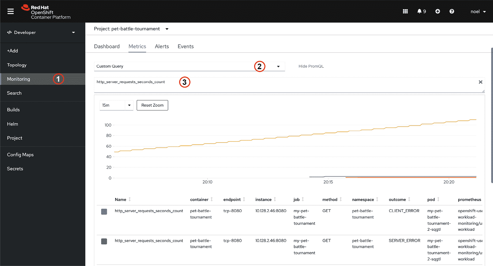

图 16.1：PetBattle 比赛度量数据

让我们探索 OpenShift 提供的一些内置仪表盘，用于监控。

### 使用 Grafana 可视化度量数据

OpenShift 自带了用于集群监控的专用 Grafana 仪表盘。无法修改这些仪表盘并添加自定义的应用程序度量数据，但可以部署一个特定于应用程序的 Grafana 实例并根据需要进行定制。为此，我们首先需要确保 Grafana Operator 已安装在我们使用的命名空间中。

然后，我们将通过部署以下自定义资源来部署一个自定义的 Grafana 设置：

+   一个*Grafana 资源*，用于在命名空间中创建自定义的*grafana*实例

+   一个*GrafanaDataSource 资源*，用于从集群范围内的 Prometheus 实例中拉取度量数据

+   一个*GrafanaDashboard*资源，用于创建仪表盘

好消息是，所有这些操作都是通过 Helm 图表完成的，所以你只需要做以下操作：

```
$ oc get routes
```

```
...                                                                
```

```
grafana-route     grafana-route-pb-noc.apps.someinstance.com     
```

在浏览器中打开`grafana-route`，登录，*看！* 它应该类似于*图 16.2*所示。如果出现没有数据的错误，请检查 BEARER_TOKEN 是否已经设置。可以通过运行以下命令手动修复：[`github.com/petbattle/pet-battle-infra/blob/main/templates/insert-bearer-token-hook.yaml#L80`](https://github.com/petbattle/pet-battle-infra/blob/main/templates/insert-bearer-token-hook.yaml#L80)

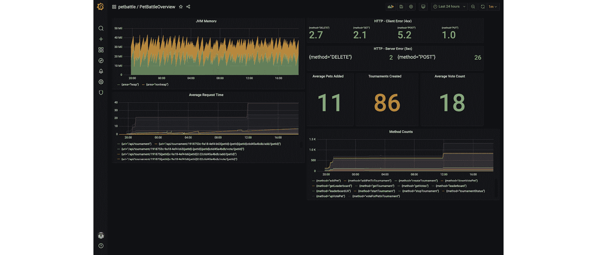

图 16.2：Grafana 中的 PetBattle 度量数据

现在我们将看看一些可以帮助我们进一步进行可观察性的工具。

## 元数据和可追溯性

随着独立可部署的基于服务的架构的采用，管理这些组件及其相互关系的复杂性变得越来越有问题。在接下来的章节中，我们将概述一些可以帮助你解决这一问题的技术。

### 标签

如前所述，标签和标签选择器是 Kubernetes 中更强大的*元数据管理*功能之一。从核心来看，标签是基于文本的键/值对集合，可以附加到一个或多个对象上：Pods、服务、部署等等。标签旨在为用户相关的对象添加信息/语义，而不是核心 Kubernetes 系统。标签选择器是一种方法，用户可以通过它将具有相同标签的项分组在一起。

在 Kubernetes 中，标签和标签选择器最常见的用途之一是服务使用标签选择器将相关的 Pods 分组为服务的端点。

通过一个示例展示可能更容易理解。

那么，让我们从三个 Infinispan Pods 开始。鉴于 Infinispan 操作符通过 StatefulSets 部署 Pods，Pod 名称非常直接：`infinispan-0`、`infinispan-1`、`infinispan-2`。注意附加到 Pods 上的标签（以粗体显示）。

```
$ oc get pods --show-labels=true
```

```
NAME                                   READY   STATUS      RESTARTS   AGE     LABELS
```

```
infinispan-0                           1/1     Running     0          2m25s   app=infinispan-pod,clusterName=infinispan,controller-revision-hash=infinispan-66785c8f,infinispan_cr=infinispan,statefulset.kubernetes.io/pod-name=infinispan-0
```

```
infinispan-1                           1/1     Running     0          5m51s   app=infinispan-pod,clusterName=infinispan,controller-revision-hash=infinispan-66785c8f,infinispan_cr=infinispan,statefulset.kubernetes.io/pod-name=infinispan-1
```

```
infinispan-2                           1/1     Running     0          4m12s   app=infinispan-pod,clusterName=infinispan,controller-revision-hash=infinispan-66785c8f,infinispan_cr=infinispan,statefulset.kubernetes.io/pod-name=infinispan-2
```

当 Tournament 服务想要连接到这些 Infinispan Pods 之一时，它使用由操作符创建和管理的 Infinispan 服务。

```
 $ oc get svc
```

```
NAME         TYPE        CLUSTER-IP  EXTERNAL-IP   PORT(S)     AGE
```

```
infinispan   ClusterIP   172.30.154.122   <none>   11222/TCP   5d20h
```

如果我们进入服务的定义，就会看到选择器（以粗体显示）：

```
$ oc describe service infinispan
```

```
Name: infinispan
```

```
Namespace: pet-battle-tournament
```

```
Labels: app=infinispan-service
```

```
        clusterName=infinispan
```

```
        infinispan_cr=infinispan
```

```
Annotations: service.alpha.openshift.io/serving-cert-signed-by:               openshift-service-serving-signer@1607294893
```

```
             service.beta.openshift.io/serving-cert-secret-name:
```

```
               infinispan-cert-secret
```

```
             service.beta.openshift.io/serving-cert-signed-by:
```

```
               openshift-service-serving-signer@1607294893
```

```
Selector:          app=infinispan-pod,clusterName=infinispan
```

```
Type:              ClusterIP
```

```
IP:                172.30.154.122
```

```
Port:              infinispan  11222/TCP
```

```
TargetPort:        11222/TCP
```

```
Endpoints: 10.128.2.158:11222,10.129.3.145:11222,10.131.0.25:11222
```

```
Session Affinity:  None
```

```
Events:            <none>
```

这将带有标签 `app=infinispan-pod,clusterName=infinispan` 的 Pods 添加到服务中作为端点。这里有两点需要注意：选择器并没有使用分配给 Pod 的所有标签；如果我们扩展了 Infinispan Pods 的数量，选择器会持续进行评估，并自动将新的 Pods 添加到服务中。上述示例是一个非常基础的选择器示例；事实上，选择器要强大得多，支持等式操作和基于集合的操作。请查看 Kubernetes 文档中的示例了解更多信息。11

11 [`kubernetes.io/docs/concepts/overview/working-with-objects/labels/`](https://kubernetes.io/docs/concepts/overview/working-with-objects/labels/)

很好，那么接下来呢？你可以使用什么信息来标记一个资源？这取决于你的需求。如前面在监控部分所示，标签和选择器在配置 Prometheus 时非常有用。标签还可以用于将组件分组在一起，例如组成分布式应用程序的组件。

Kubernetes 提供了一组推荐的标签 12，我们在构建和部署 PetBattle 应用程序时使用了这些标签：

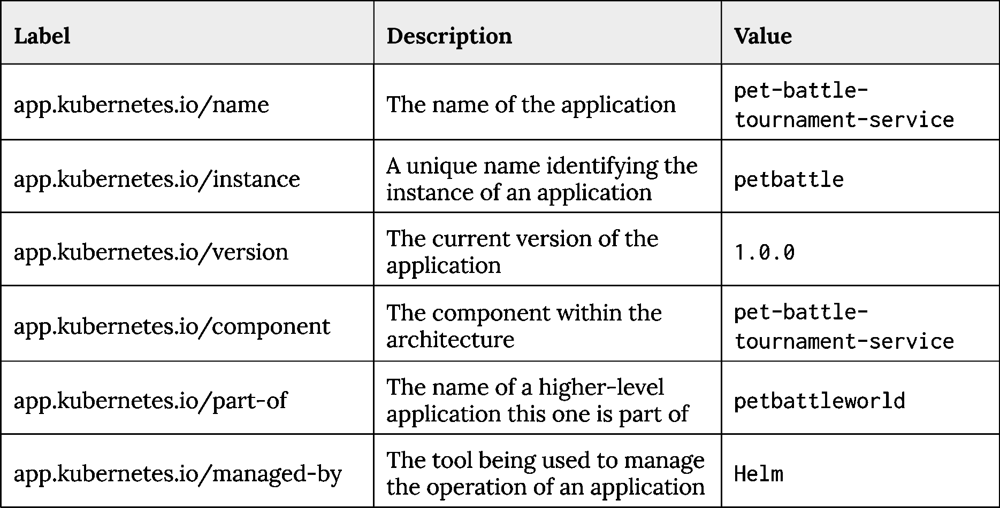

表 16.1：Kubernetes 推荐的标签

12 [`kubernetes.io/docs/concepts/overview/working-with-objects/common-labels/`](https://kubernetes.io/docs/concepts/overview/working-with-objects/common-labels/)

有了这些标签，就可以使用选择器检索并查看应用程序的组件，例如显示 PetBattle 应用的组件部分，而不包括支持应用程序基础设施，即 Infinispan 或 Keycloak。以下命令演示了这一点：

```
$ oc get all -l app.kubernetes.io/part-of=petbattleworld \
```

```
    --server-print=false
```

```
NAME                                                            AGE
```

```
replicationcontroller/dabook-mongodb-1                          2d18h
```

```
replicationcontroller/dabook-pet-battle-tournament-1            26m
```

```
NAME                                                            AGE
```

```
service/dabook-mongodb                                          2d18h
```

```
service/dabook-pet-battle-tournament                            2d18h
```

```
NAME                                                            AGE
```

```
deploymentconfig.apps.openshift.io/dabook-mongodb                2d18h
```

```
deploymentconfig.apps.openshift.io/dabook-pet-battle-tournament  26m
```

名称 年龄

```
imagestream.image.openshift.io/dabook-pet-battle-tournament     26m
```

名称 年龄

```
route.route.openshift.io/dabook-pet-battle-tournament           2d18h
```

让我们来看看其他可以用来增强可追溯性的方法。

### 软件可追溯性

多年来，我们从客户那里观察到的一个问题是，许多人依赖于他们投入生产的软件工件的名称，例如 `super-important-app-1.2.99.0.bin` 或 `critical-service-1.2.jar`。虽然这种方式在 99.9%的情况下有效，但偶尔我们会发现有错误的版本被部署，产生了有趣的结果。

在容器领域，你的部署是一个版本化的工件，包含了你的软件版本，而这又可以通过 GitOps 方法使用版本化的 Helm chart 进行部署。一个良好的构建和部署流水线将确保这些工件版本的各个层级始终保持一致，并提供可追溯性。作为备份，我们还通过在资源上添加注解和在应用二进制文件中记录构建信息来增强已部署工件的可追溯性。

### 注解

注解类似于 Kubernetes 标签——即基于字符串的键/值对——不同之处在于它们并不用于通过选择器来分组或识别对象。注解可以用来存储不同类型的信息；在我们的案例中，我们将使用注解来存储 Git 信息，以帮助软件的可追溯性。

```
apiVersion: v1
```

```
kind: Service
```

```
metadata:
```

```
  annotations:
```

```
    app.openshift.io/vcs-url:      https://github.com/petbattle/tournamentservice.git
```

```
    app.quarkus.io/commit-id:a01a310aadd46911bc4c66b3a063ddb090a3feba
```

```
    app.quarkus.io/vcs-url:      https://github.com/petbattle/tournamentservice.git
```

```
    app.quarkus.io/build-timestamp: 2020-12-23 - 16:43:07 +0000
```

```
    prometheus.io/scrape: "true"
```

```
    prometheus.io/path: /metrics
```

```
    prometheus.io/port: "8080"
```

注解是通过使用 Quarkus Maven 插件，作为 Maven 构建过程的一部分自动添加的。同时请注意，注解也用于为 Prometheus 提供抓取信息，正如前面代码中所突出显示的那样。

### 构建信息

有一种与 Kubernetes 本身无关的方法，但我们强烈推荐一般使用，它是在应用启动时输出源代码控制和构建信息。一个例子嵌入在 Tournament 服务中。

```
$ java -jar tournament-1.0.0-SNAPSHOT-runner.jar
```

```
GITINFO -> git.tags:
```

```
GITINFO -> git.build.version:1.0.0-SNAPSHOT
```

```
GITINFO -> git.commit.id.full:b5d6bfabeea6251b9c17ea52f0e87e2c8e967efd
```

```
GITINFO -> git.commit.id.abbrev:b5d6bfa
```

```
GITINFO -> git.branch:noc-git-info
```

```
GITINFO -> git.build.time:2020-12-24T13:26:25+0000
```

```
GITINFO -> git.commit.message.full:Moved gitinfo output to Main class
```

```
GITINFO -> git.remote.origin.url:git@github.com:petbattle/tournamentservice.git
```

我们使用 Maven 插件 `git-commit-id-plugin` 来生成包含 Git 信息的文件，并将该文件打包为 **Java 压缩包**（**jar**）的一部分。在启动时，我们只需读取该文件并将其内容输出到控制台。非常简单的操作，但非常有效，并且在需要时可以救命。当在 OpenShift 上运行时，这些信息将被 OpenShift 日志组件收集。

## 警报

所以我们拥有所有的度量指标，可以让我们对系统的表现有一些洞察。我们在 Grafana 中有壮观的图表和仪表，但我们几乎不可能整天盯着它们看，以查看是否发生了什么事情。现在是时候为解决方案添加警报功能了。

### 什么是警报？

警报是当某个测量阈值（观察到或计算出的）即将被突破或已经突破时生成的事件。以下是一些警报的例子：

+   系统在过去五分钟内的平均响应时间超过了 100 毫秒。

+   当前活跃用户数低于某个阈值。

+   应用程序的内存使用量接近其最大限制。

警报通常会导致通知发送给人工操作员，无论是通过电子邮件还是即时消息等方式。通知还可以发送触发自动化脚本/流程来处理警报。服务所有者可以分析他们现有的警报，帮助提高服务和系统的可靠性，并减少修复问题时的手动工作量。

### 为什么需要警报？

当系统内发生无法自动处理的情况时，警报就需要人工干预。这可能包括自动解决问题被认为过于危险，或需要人工干预来帮助初步处理、缓解和解决问题的场景。警报也可能成为网站可靠性工程师的一个问题，特别是当警报数量众多、误导性强或对问题原因分析没有帮助时。它们可能会产生无害的警报，但不会引起任何行动。

有一些特点构成了*良好的警报*。警报应该是可操作的，意思是响应警报的人能采取行动。为了具有可操作性，警报必须及时到达，使得能够采取行动，并且应送达正确的团队或位置进行初步处理。警报还可以包含有助于加快初步处理的元数据，例如文档链接。

### 警报类型

我们可以将警报分为三类。13 第一类是**主动**警报，意味着您的业务服务或系统尚未处于危险之中，但在一段时间后可能会出现问题。一个好的例子是，当系统响应时间变差，但尚未到达外部用户会察觉的问题阶段。另一个例子可能是磁盘配额正在填满，但尚未 100%满，可能在几天内会达到最大值。

**被动**警报意味着您的业务服务或系统正处于紧急危险中。您即将违反服务级别协议，需要立即采取行动以防止违规。

**调查性**警报是指您的业务服务或系统处于未知状态。例如，系统可能正在经历某种形式的部分故障，或可能生成了异常错误。另一个例子可能是某个应用程序重启次数过多，这通常是异常崩溃的标志。

这些警报中的每一个也可以根据严重性定向到不同的团队，并非所有警报都需要以相同的紧急程度进行管理。例如，一些警报必须由值班人力资源立即处理，而其他警报可能可以在下一个工作日由应用程序业务支持团队在正常工作时间内处理。让我们探讨如何利用 OpenShift 平台功能轻松配置并为我们的应用程序添加警报。

13 [`www.oreilly.com/content/reduce-toil-through-better-alerting/`](https://www.oreilly.com/content/reduce-toil-through-better-alerting/)

### 管理警报

OpenShift 具有平台监控和警报功能，支持内置的平台组件和用户工作负载。产品文档是配置这些功能时的最佳起点。14 正如我们之前概述的那样，监控和警报利用了 Prometheus 监控堆栈。它与一个名为 Thanos 的开源工具 15 结合使用，Thanos 聚合并提供对我们集群中多个 Prometheus 实例的访问。

PetBattle 应用程序套件的基本配置包括为用户工作负载监控和警报创建两个 ConfigMaps。我们使用 ArgoCD 和一个简单的 kustomize YAML 配置来通过 GitOps 应用这些 ConfigMaps。如果我们打开普遍使用的`values-day2ops.yaml`文件，我们可以为用户工作负载监控创建一个条目。

```
  # User Workload Monitoring
```

```
  - name: user-workload-monitoring
```

```
    enabled: true
```

```
    destination: openshift-monitoring
```

```
    source: https://github.com/rht-labs/refactored-adventure.git
```

```
    source_path: user-workload-monitoring/base
```

```
    source_ref: master
```

```
    sync_policy: *sync_policy_true
```

```
    no_helm: true
```

下一步是利用应用程序指标和 ServiceMonitor，并为我们的 PetBattle 套件配置特定的 Prometheus 警报。

### 用户定义的警报

在*Metrics*部分，我们为 API 和 Tournament 应用程序创建了 ServiceMonitors，允许我们从 Quarkus 应用程序中收集 micrometer 指标。我们希望使用这些指标来配置我们的警报。最简单的方法是浏览到聚合我们所有 Prometheus 指标的 Thanos 查询端点。你可以在`openshift-monitoring`项目中找到它。

```
$ oc get route thanos-querier -n openshift-monitoring
```

14 [`docs.openshift.com/container-platform/4.7/monitoring/configuring-the-monitoring-stack.html#configuring-the-monitoring-stack`](https://docs.openshift.com/container-platform/4.7/monitoring/configuring-the-monitoring-stack.html#configuring-the-monitoring-stack)

15 [`github.com/thanos-io/thanos`](https://github.com/thanos-io/thanos)

我们希望基于 PetBattle API、Tournament 和 UI Pods 是否在某个项目中运行，创建一个简单的反应式警报。我们可以利用 Kubernetes Pod 标签和 Prometheus 查询语言来测试我们的 Pods 是否在运行。

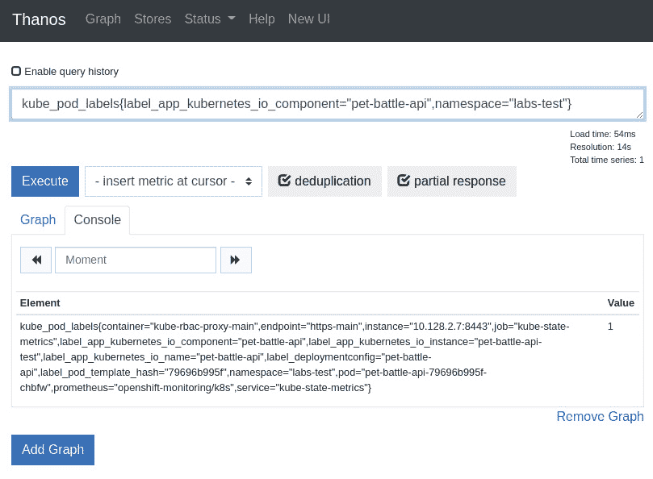

图 16.3：Thanos 查询界面

对于这个用例，我们将 `kube_pod_status_ready` 和 `kube_pod_labels` 查询结合起来，针对每个 Pod 和命名空间组合创建一个 PrometheusRule，当某个条件未满足时触发警报。我们将警报的生成封装在一个 Helm chart 中，以便我们可以轻松地模板化项目和警报严重性值 16，并将部署与我们的 GitOps 自动化连接。

16 [`github.com/petbattle/ubiquitous-journey/blob/main/applications/alerting/chart/templates/application-alerts.yaml`](https://github.com/petbattle/ubiquitous-journey/blob/main/applications/alerting/chart/templates/application-alerts.yaml)

```
spec:
```

```
  groups:
```

```
  - name: petbattle.rules
```

```
    rules:
```

```
    - alert: PetBattleApiNotAvailable
```

```
      annotations:
```

```
        message: 'Pet Battle Api in namespace {{ .Release.Namespace }} is not available for the last 1 minutes.'
```

```
      expr: (1 - absent(kube_pod_status_ready{condition="true" ... for: 1m
```

```
      labels:
```

```
        severity: {{ .Values.petbattle.rules.severity }}
```

如 *图 16.4* 所示，可以在 OpenShift Web 控制台中看到触发的警报。在此示例中，我们已将 `labs-dev` 的警报配置为仅具有 *info* 严重性，因为在该环境中它们不被认为是至关重要的部署。严重性可以设置为 *info*、*warning* 或 *critical*，例如我们对 `labs-test` *和* `labs-staging` 环境使用 *warning*。这些是任意但标准的严重性级别，我们可以用它们来路由警报，稍后我们将讨论这个问题。

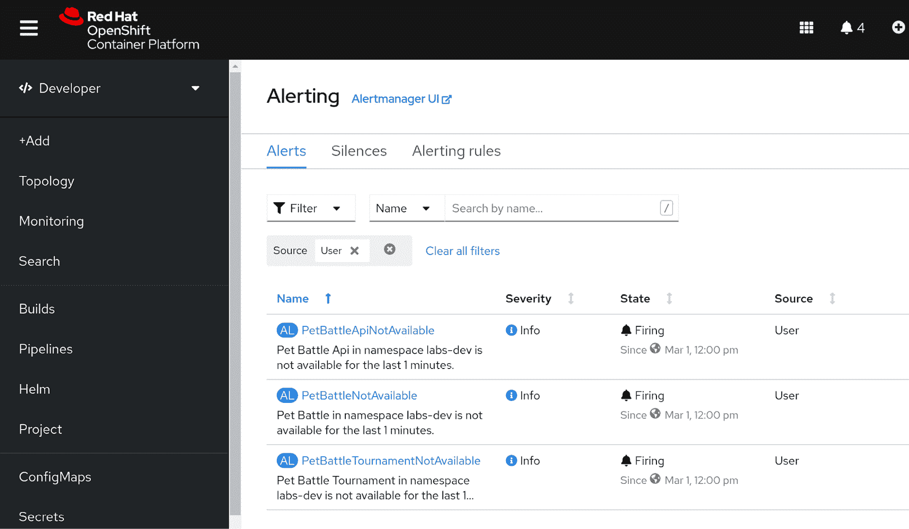

图 16.4：PetBattle 警报在 OpenShift 中触发

我们可以使用相同的方法来创建调查性或主动性警报。这次我们希望测量 API 应用程序的 HTTP 请求时间。在测试过程中，我们发现如果 API 调用时间超过 ~1.5 秒，PetBattle 前端的用户体验会被终端用户认为太慢，可能会导致他们完全放弃使用该 Web 应用程序。

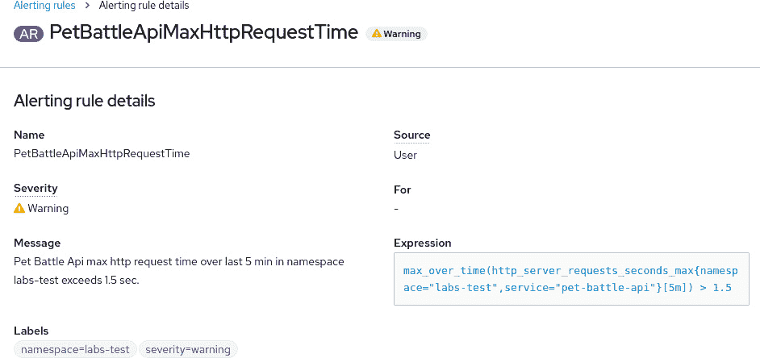

图 16.5：最大请求时间警报规则

在此警报中，我们使用 Prometheus 查询语言和 `http_server_requests_seconds_max` 指标来测试 PetBattle API 应用程序在过去五分钟内的最大请求时间是否超过了 1.5 秒的阈值。如果此警报开始触发，可能的修复措施包括手动扩展 API Pod 的数量，或者如果数据库某些原因表现慢，可能需要增加数据库资源。在未来的迭代中，我们甚至可能尝试通过使用水平 Pod 自动扩展器（Horizontal Pod Autoscaler）来自动化应用扩展，水平 Pod 自动扩展器是 Kubernetes 的一个构件，能够基于指标自动扩展我们的应用程序。

通过这种方式，我们可以继续为我们的 PetBattle 应用程序套件构建警报规则集，在不同的环境中运行应用程序时进行修改，并学习需要注意的条件，同时尽可能自动化修复过程。

### OpenShift Alertmanager

正如我们所看到的，OpenShift 支持三种警报严重性级别：*info*、*warning* 和 *critical*。我们可以根据严重性以及自定义标签（即项目或应用标签）来对警报进行分组和路由。在 OpenShift 管理员控制台中，17 您可以在 **集群设置** 下配置 Alertmanager。

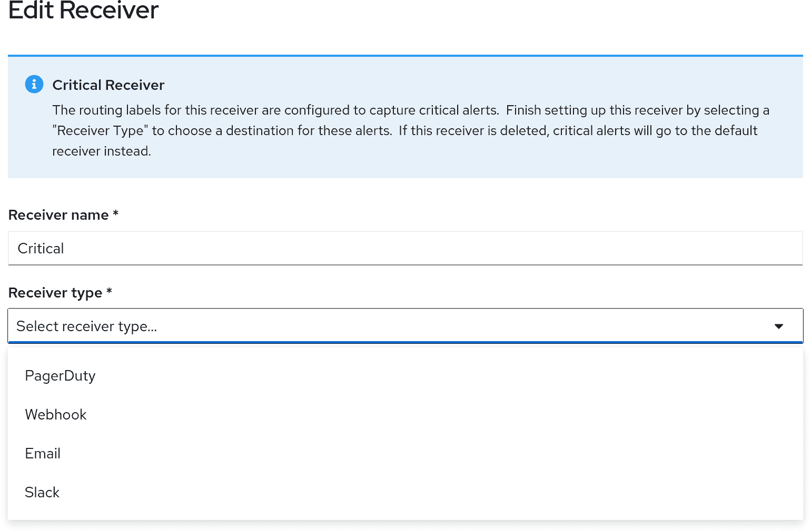

图 16.6：Alertmanager 路由配置

警报可以通过标签进行分组和过滤，然后路由到特定的接收者，如 PagerDuty、Webhook、电子邮件或 Slack。我们可以微调路由规则，以便根据警报的紧急程度，将正确的团队通过正确的渠道接收警报。例如，所有针对 PetBattle UI 应用的*信息*和*警告*级别的警报可能会路由到*前端开发者*的 Slack 渠道，而所有*严重*级别的警报则会路由到值班 PagerDuty 端点以及 Slack 渠道。

17 [`docs.openshift.com/container-platform/4.7/monitoring/managing-alerts.html`](https://docs.openshift.com/container-platform/4.7/monitoring/managing-alerts.html)

警报是成功管理系统运维方面的关键组件，但你需要小心，确保运维团队不会因警报而不堪重负。过多的警报或许多次错误警报可能导致*警报疲劳*，这种情况会使团队养成忽略警报的习惯，从而剥夺警报在系统成功管理中的重要性。

## 服务网格

服务网格功能是 Kubernetes 在其短短历史中最大的新增功能之一。关于使用服务网格的额外复杂性以及是否需要所有功能，存在很多争论。

本书的目的是专注于 OpenShift 提供的内置服务网格，它基于开源 Istio 项目。还有其他实现，如 Linkerd、SuperGloo 和 Traefik，它们也非常出色，提供与 Istio 类似的功能。

OpenShift 服务网格提供以下功能：

+   **安全性**：身份验证和授权、互信 TLS（加密）、策略

+   **流量管理**：弹性功能、虚拟服务、策略、故障注入

+   **可观测性**：服务指标、调用追踪、访问日志

### 为什么选择服务网格？

我们之前讨论过弹性和像断路器这样的模式如何帮助系统从下游故障中恢复。断路器可以通过框架如**SmallRye Fault Tolerance**或**Spring Cloud Circuit Breaker**为 Java 项目添加到应用程序代码范围内；类似的框架如**Polly**18 存在于.NET 环境，**PyBreaker**19 适用于 Python，**Opossum**20 适用于 Node.js。这些框架的一个关键要求是，它们必须添加到应用程序的现有源代码中，并且需要重建应用程序。而在使用服务网格时，断路器是外部于应用程序代码的，不需要在应用程序级别做任何修改即可利用此功能。

18 [`github.com/App-vNext/Polly`](https://github.com/App-vNext/Polly)

19 [`pypi.org/project/pybreaker/`](https://pypi.org/project/pybreaker/)

20 [`nodeshift.dev/opossum/`](https://nodeshift.dev/opossum/)

**互信 TLS**（**mTLS**）也如此，它用于加密服务之间的流量。像 CertManager 或 CertUtil 这样的操作工具可以帮助管理和分发证书，但仍需要修改应用程序代码才能使用该功能。服务网格通过将组件间流量发送通过*侧车代理*来简化这一过程，像 mTLS 这样的功能会*自动神奇*地添加到其中——同样，无需更改应用程序代码。

服务网格的 Istio 组件还管理 TLS 证书的生成和分发，以帮助减少使用 mTLS 时的管理开销。

那么，服务网格是如何实现所有这些神奇功能的呢？基本上，服务网格操作员将一个服务代理容器（基于 Envoy 项目）添加到应用程序 Pod 中，并配置应用流量通过该代理进行路由。该代理向 Istio 控制平面注册，并获取配置设置、证书和路由规则，然后进行配置。Istio 文档对此有更详细的介绍。21

### 旁注 – 侧车容器

人们在听到*侧车*这个词时，通常会联想到一辆摩托车，车上附有一个单轮的乘客车厢——一个*驾驶舱*。由于与摩托车连接，驾驶舱随摩托车一起移动——除了在喜剧小品中，摩托车和侧车分离又重新连接，但那是另一个话题。

在 Kubernetes 中，侧车是与主应用容器在同一 Kubernetes Pod 中运行的容器。这些容器共享相同的网络和 ICP 命名空间，也可以共享存储。在 OpenShift 中，使用服务网格功能时，Pod 被正确注解为`sidecar.istio.io/inject: "true"`，会自动注入一个 Istio 代理作为侧车，与应用容器一起运行。应用程序与外部资源之间的所有后续通信都会通过这个侧车代理，从而使得可以根据需要使用诸如电路断路器、追踪和 TLS 等功能。正如伟大的 Freddie Mercury 曾经说过的，"*这是一种魔力*。" 

```
# Let’s patch the deployment for our pet battle apps 
```

```
# running in petbattle ns and istioify it
```

```
$ helm upgrade \
```

```
--install pet-battle-tournament \
```

```
--version=1.0.39 \
```

```
--set pet-battle-infra.install_cert_util=true \
```

```
--set istio.enabled=true \
```

```
--timeout=10m \
```

```
--namespace petbattle
```

```
petbattle/pet-battle-tournament
```

```
$ oc get deployment pet-battle-tournament -o yaml \
```

```
--namespace petbattle
```

```
...  
```

```
template:
```

```
    metadata:
```

```
      annotations:
```

```
...
```

```
        sidecar.istio.io/inject: "true"
```

```
      labels:
```

```
        app.kubernetes.io/component: pet-battle-tournament
```

```
        app.kubernetes.io/instance: pet-battle-tournament
```

```
        app.kubernetes.io/name: pet-battle-tournament
```

21 [`istio.io/latest/docs/`](https://istio.io/latest/docs/)

如果需要，可以有多个侧车容器。每个容器可以为应用程序 Pod 带来不同的功能：例如，一个用于 Istio，另一个用于日志转发，另一个用于检索安全凭证，等等。很容易知道一个 Pod 是否运行多个容器；例如，`READY`列显示每个 Pod 中有多少容器可用，以及有多少容器已经准备好——也就是说，它的就绪探针已通过。

```
$ oc get pods 
```

```
NAME                            READY   STATUS      RESTARTS   AGE
```

```
infinispan-0                    1/1     Running     0          4h13m
```

```
Pet-battle-3-68fm5              2/2     Running     0          167m
```

```
pet-battle-api-574f77ddc5-l5qx8 2/2     Running     0          163m
```

```
pet-battle-api-mongodb-1-7pgfd  1/1     Running     0          3h50m
```

```
pet-battle-tournament-3-wjr6r   2/2     Running     0          167m
```

```
pet-battle-tou.-mongodb-1-x7t9h 1/1     Running     0          4h9m
```

但是，要注意的是，存在一种诱惑，即尝试一次性使用所有服务网格功能，这被称为 *哦…好亮眼* 的问题。

### 这里有龙！

在涉及多个组件和开发团队的复杂解决方案时，采用服务网格并非一项简单的任务。了解服务网格的一件事是，它跨越了许多团队边界和责任范围。它包括专注于开发人员、运维和安全团队的特性；所有这些团队/人员需要协同工作，理解并充分利用网格提供的功能。如果你刚刚开始，我们的建议是从小做起，弄清楚生产环境中哪些功能是必要的，然后从那里逐步迭代。

在 PetBattle 的案例中，我们决定主要专注于使用流量管理和可观察性方面的一些功能。这样做的理由是，Keycloak 已经解决了许多安全需求，同时我们也希望在十年结束前完成这本书。

### 服务网格组件

服务网格的功能由多个独立的组件组成：

+   Jaeger 和 Elasticsearch 提供调用跟踪功能和日志记录功能。

+   Kiali 提供网格可视化功能。

+   OpenShift 服务网格提供核心的 Istio 功能。

好消息是，所有这些组件都是由操作员安装和管理的，因此安装相对简单。这些组件通过 Helm 安装，如果你想了解更多关于如何安装它们的信息，可以查看 Red Hat OpenShift 文档中的相关内容。

需要注意的一点是，在撰写本书时，OpenShift 服务网格包含一个下游版本的 Istio，名为 Maistra。这主要是由于 OpenShift 的开箱即用的多租户特性，以及限制 Istio 集群范围资源的使用。OpenShift 服务网格还包括一个 **Istio** **OpenShift 路由** (**IOR**) 组件，该组件将 Istio 网关定义映射到 OpenShift 路由上。请注意，Istio 仍然是上游项目，必要时会修复/实现 bugs 或特性请求。

对于流量管理，Istio 提供了以下核心资源：

+   **网关**：控制外部流量如何进入服务网格，类似于 OpenShift 路由。

+   **虚拟服务**：控制流量如何在服务网格内路由到目标服务。这是配置超时、基于上下文的路由、重试、镜像等功能的地方。

+   **目标规则**：流量应用规则后被路由到的服务位置。目标规则可以配置以控制诸如负载均衡策略、连接池、TLS 设置和异常检测（断路器）等流量方面的内容。

还有其他资源，如服务入口、过滤器和工作负载，但我们在这里不会涵盖它们。

### PetBattle 服务网格资源

我们将简要介绍我们在 PetBattle 中使用的一些资源，并解释我们如何使用它们。

### 网关

如前所述，网关资源用于为进入服务网格的流量创建入口路由。

```
apiVersion: networking.istio.io/v1alpha3
```

```
kind: Gateway
```

```
metadata:
```

```
  name: petbattle-gateway-tls
```

```
spec:
```

```
  selector:
```

```
    istio: ingressgateway 
```

```
  servers:
```

```
  - port:
```

```
      number: 443
```

```
      name: https
```

```
      protocol: HTTPS
```

```
    tls:
```

```
      mode: SIMPLE
```

```
      credentialName: "pb-ingressgateway-certs"
```

```
    hosts:     
```

```
    - "*"
```

关于此定义有几点需要注意：它将在*istio-system*命名空间中创建一个 OpenShift 路由，而不是本地命名空间。其次，路由本身将使用 SSL，但默认情况下无法使用 OpenShift 路由器证书。服务网格路由必须提供自己的证书。作为编写本书的一部分，我们采取了务实的方法，将 OpenShift 路由器证书复制到*istio-system*命名空间，并通过*pb-ingressgateway-certs*密钥提供给网关。请注意，这仅用于演示目的——*不要在生产环境中尝试此操作*。生产环境中的正确方法是使用“即服务”证书生成并管理 PKI。

### 虚拟服务

PetBattle 包含多个虚拟服务，如*pet-battle-cats-tls、pet-battle-main-tls*和*pet-battle-tournament-tls*。

```
apiVersion: networking.istio.io/v1alpha3
```

```
kind: VirtualService
```

```
metadata:
```

```
  name: pet-battle-cats-tls
```

```
spec:
```

```
  hosts:
```

```
  - "*"
```

```
  gateways:
```

```
  - petbattle-gateway-tls
```

```
  http:
```

```
  - match:
```

```
    - uri:
```

```
        prefix: /cats
```

```
      ignoreUriCase: true
```

```
    route:
```

```
    - destination:
```

```
        host: pet-battle-api
```

```
        port:
```

```
          number: 8080
```

```
    retries:
```

```
      attempts: 3
```

```
      perTryTimeout: 2s
```

```
      retryOn: gateway-error,connect-failure,refused-stream
```

这些虚拟服务的功能类似，都是配置为：

1.  匹配特定的 URI；在上面的示例中是`/cats`。

1.  一旦匹配，便将流量路由到特定的目标。

1.  通过执行固定次数的请求重试来处理特定错误。

### 目标规则

最终，流量被发送到一个目标，或根据配置分发到一组目标。这就是目标规则的作用。

```
apiVersion: networking.istio.io/v1alpha3
```

```
kind: DestinationRule
```

```
metadata:
```

```
  name: pet-battle-api-port
```

```
spec:
```

```
  host: pet-battle-api.prod.svc.cluster.local
```

```
  trafficPolicy: # Apply to all ports
```

```
    portLevelSettings:
```

```
    - port:
```

```
        number: 8080
```

```
      loadBalancer:
```

```
        simple: LEAST_CONN
```

在我们的示例中，发送到特定端口的流量会根据一个简单的策略进行负载均衡，该策略选择活动请求最少的 Pod。这里可以使用许多负载均衡策略，具体取决于应用的需求——从简单的轮询到高级的恒定哈希负载均衡策略，这些都可以用于会话亲和性。正如之前所提到的，文档中会详细讨论这一点。22

我们可以通过上面的示例来可视化流量的流动，如*图 16.7*所示：

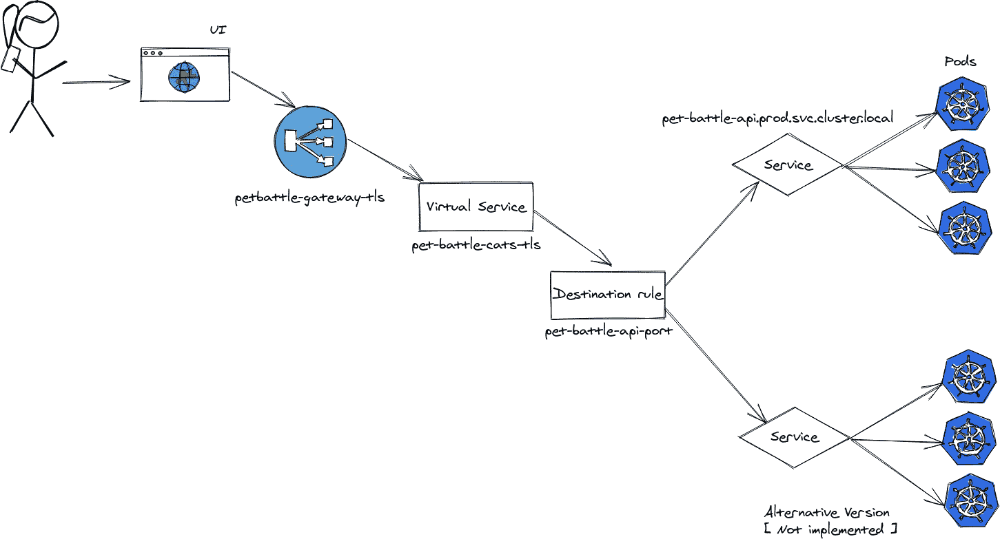

图 16.7：PetBattle 流量流动

22 [`istio.io/latest/docs/`](https://istio.io/latest/docs/)

请注意，*图 16.7*显示了如何使用目标规则将流量发送到服务的备用版本的示例。这对于高级部署策略，如金丝雀发布、蓝绿部署等非常有用。虽然我们在本书中没有讨论如何使用 OpenShift Service Mesh 实现这一点，但鼓励读者深入探讨这个领域。一个很好的起点是上述的 Istio 文档。

当只有少数服务时，管理所有这些资源相对简单，且 PetBattle 在非常基础的方式下利用了服务网格功能。然而，当服务和功能增多时，例如在高级部署模型中使用多个目的地时，需要解析的设置和 YAML 文件量可能会变得非常庞大。这时，网格可视化功能就能派上用场，帮助可视化所有内容是如何协同工作的。为此，我们使用 Kiali 功能，它是 OpenShift 服务网格的一部分。*图 16.8* 展示了如何使用 Kiali 可视化 PetBattle。

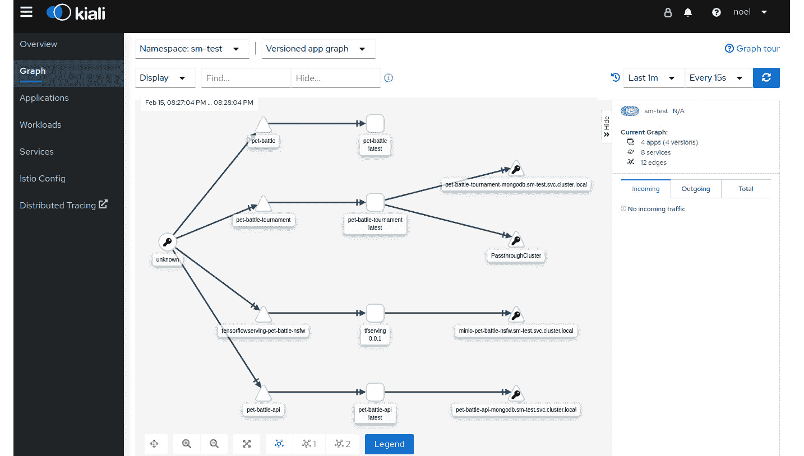

图 16.8：PetBattle 的 Kiali 服务图

Kiali 对于诊断当前网格状态非常有用，它能够动态显示流量的去向以及使用的任何断路器的状态。它还与 Jaeger 集成，用于跨多个系统追踪请求。Kiali 还可以通过语义验证已部署的服务网格资源，帮助防止配置问题。

接下来，我们将探索 OpenShift 4 中最强大的功能之一——Operators（运维管理器）。

## 运维管理器无处不在

OpenShift 4 平台的核心概念是*运维管理器*。到目前为止，我们已经使用了它们，但没有讨论为什么我们需要它们，以及它们在 Kubernetes 平台（如 OpenShift）上实际代表什么。我们将简要介绍这一点，而不对该主题进行全面重写。23

从本质上讲，运维管理器是一种软件模式，它将关于特定软件应用程序的运行和操作的知识进行编码。这个应用程序可能是一个分布式的键值存储，例如 etcd。也可能是一个 Web 应用程序，如 OpenShift Web 控制台。运维管理器的根本作用是表示*任何*可以被编码的应用领域。运维管理器的一个很好比喻是*专家系统*，一种基于规则的软件，代表了对某个事物的知识，并以有意义的方式投入使用。如果我们以数据库为例，运维管理器可能会编码人类数据库管理员每天需要做的事情，如数据库的部署、运行、扩展、备份、修补和升级。

运维管理器的物理运行时不过是一个 Kubernetes Pod，即一组运行在 Kubernetes 平台（如 OpenShift）上的容器。运维管理器通过扩展或向现有的 Kubernetes 和 OpenShift 平台 API 添加新 API 来工作。这个新的端点称为**自定义资源**（**CR**）。CR 是 Kubernetes 中许多扩展机制之一。

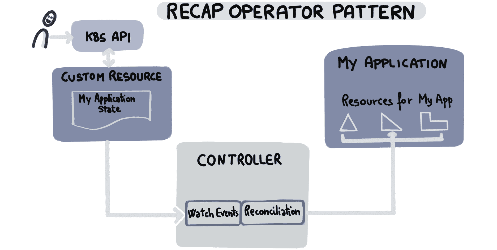

图 16.9：运维管理器模式

23 [`www.redhat.com/en/resources/oreilly-kubernetes-operators-automation-ebook`](https://www.redhat.com/en/resources/oreilly-kubernetes-operators-automation-ebook)

**自定义资源定义**（**CRD**）定义了 CR 是什么。可以将其视为 CR 的定义或架构。Operator Pod *监控*与其自定义资源相关的事件，并采取*协调*措施以实现系统的期望状态。当 Operator Pod 停止或从集群中删除时，它所管理的应用程序应该继续运行。从集群中删除 CRD 会影响它所管理的应用程序。事实上，删除 CRD 会进而删除其 CR 实例。这就是 Operator 模式。

通过 Operator，运行/管理一段软件所需的所有操作经验都可以打包并作为一组容器及相关资源交付。事实上，整个 OpenShift 4 平台本身就是一系列 Operator 的集合！因此，作为平台拥有者，你实际上是通过 Operator 获得了最先进的管理员知识。更好的是，随着新功能和能力的增加，Operator 可以随着时间的推移变得更加先进。OpenShift 平台管理员需要对如何配置 Operator 有很好的理解。这通常涉及在 OpenShift 集群全局配置网页控制台中设置属性，设置 CR 属性值，使用 ConfigMaps 或类似的方法。产品文档 24 通常是了解每个 Operator 设置的最佳来源。

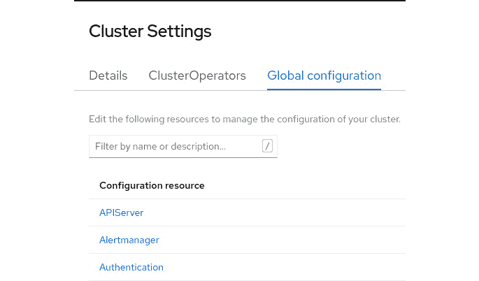

图 16.10：OpenShift 集群设置—配置平台 Operator

24 [`docs.openshift.com/container-platform/4.7`](https://docs.openshift.com/container-platform/4.7)

在 OpenShift 中，Operator 本身的生命周期管理（升级、修补、管理）是通过**Operator 生命周期管理器**（**OLM**）自动化的。这些组件使得从用户的角度来看，升级 OpenShift 平台变得更加可靠，且更容易管理；它大大减轻了操作负担。由于 Operator 本身是作为版本化镜像交付的，我们从不可变容器镜像中获得了与我们自己应用程序相同的好处，即相同的镜像版本可以在多个云环境中一致地运行，从而提高了质量，消除了雪花现象（针对特定环境的独特应用）。

不仅是 OpenShift 平台本身能够利用 Operator。通过 Operator Hub25 共享和分发软件对全球的开发者和供应商开放。我们使用 OLM 和 Operator *订阅*将其部署到我们的集群中。构建和开发 Operator 所需的工具（SDK）是开源的，任何人都可以使用。26

那么，*所有*应用程序都应该作为 Operators 发布吗？简短的答案是“不”。编写、打包、测试和维护一个 Operator 可能对许多应用来说显得有些过度。例如，如果你的应用并不需要与他人共享或分发，只需要在几个集群中构建、打包、部署和配置应用，那么有许多更简单的方法可以实现这一目标，比如使用容器镜像、Kubernetes 和 OpenShift 原生构件（BuildConfigs、Deployments、ReplicaSets、ConfigMaps、Secrets 等）以及像 Helm 这样的工具来实现目标。

### 后台操作符

要完全理解 Operator 如何工作，你需要了解 Kubernetes 控制循环是如何工作的。

### 控制循环

简单来说，Kubernetes 核心只是一个 **键值**（**KV**）存储——一个带有 API 的 etcd 数据存储。进程使用这个 API 对 KV 存储中的键执行 **创建**、**读取**、**更新** 和 **删除**（**CRUD**）操作。进程还可以向 KV 存储注册，以便在它们感兴趣的键或键集合发生变化时收到通知。

25 [`operatorhub.io`](https://operatorhub.io)

26 [`github.com/operator-framework/operator-sdk`](https://github.com/operator-framework/operator-sdk)

当这些进程接收到变更通知时，它们会通过执行某些活动（例如配置 iptables 规则、配置存储等）来响应通知。这些进程了解系统的当前状态和期望状态，并朝着实现该期望状态的方向努力。换句话说，这些进程正在执行 *控制循环* 的角色，意味着它们试图将系统的状态从当前状态带到期望的状态。

在这个例子中，*过程*是一个控制器，它观察一个资源或一组资源的状态，然后进行更改，将资源状态向期望状态靠拢。作为 Kubernetes 的使用者，我们不断地使用控制器。例如，当我们指示 Kubernetes 部署一个 Pod 时，Pod 控制器就会为实现这一目标而工作。控制循环是 Kubernetes 操作的关键，它是一种声明式的，并最终一致的方法。要了解更多信息，请查看 Kubernetes 控制器文档 27 和 OpenShift 博客网站，获取如何构建自己 Operator 的推荐 28。

### Operator 范围

操作符可以是集群范围的，也可以是命名空间范围的。集群范围的操作符在一个命名空间中安装一次，可以在其他命名空间中创建和管理资源；也就是说，作用于整个集群。OpenShift 服务网格操作符及其相关操作符，如 Kiali 和 Jaeger，都是集群范围的。它们默认安装在 `openshift-operators` 或 `openshift-operators-redhat` 命名空间中，并在部署相关 CRD 到其他命名空间时创建和管理资源，如 PetBattle。

命名空间范围的操作符是指在某个命名空间中部署，并且只管理该命名空间中的资源。我们在 PetBattle 中使用了多个这样的操作符，如 Cert-Utils 和 Keycloak。

所有操作符通过名为**Subscription**的 CRD 安装。简要来说（详细信息请参见官方文档），Subscription 描述了如何检索并安装操作符实例。以下是我们用来安装 Grafana 操作符的 Subscription 示例。

27 [`kubernetes.io/docs/concepts/architecture/controller/`](https://kubernetes.io/docs/concepts/architecture/controller/)

28 [`www.openshift.com/blog/kubernetes-operators-best-practices`](https://www.openshift.com/blog/kubernetes-operators-best-practices)

```
apiVersion: operators.coreos.com/v1alpha1
```

```
kind: Subscription
```

```
metadata:
```

```
 name: grafana-operator
```

```
spec:
```

```
 channel: alpha
```

```
 installPlanApproval: Automatic
```

```
 name: grafana-operator
```

```
 source: community-operators
```

```
 sourceNamespace: openshift-marketplace
```

```
 startingCSV: grafana-operator.v3.7.0
```

要查看 PetBattle 需要的一些命名空间范围的操作符，请运行以下命令。

```
$ oc get subscriptions
```

```
NAME                PACKAGE             SOURCE                CHANNEL
```

```
cert-utils-operator cert-utils-operator community-operators   alpha
```

```
grafana-operator    grafana-operator    community-operators   alpha
```

```
infinispan          infinispan          community-operators   2.1.x
```

```
keycloak-operator   keycloak-operator   community-operators   alpha
```

现在让我们来看一下操作符如何被我们的 PetBattle 团队使用。

### PetBattle 中的操作符

我们使用操作符来创建和管理资源，如 Infinispan 缓存和 Keycloak 单点登录实例。我们只需安装 Infinispan 操作符并部署相关的自定义资源，告诉它创建和管理一个复制缓存。我们无需了解如何启动 Infinispan Pods、创建 SSL 证书或提供存储空间。操作符会为我们完成这些工作，如果出现故障或被意外删除，操作符会负责重新创建资源。在 Infinispan 示例中，如果我们删除了 Infinispan K8s 服务，操作符会收到删除通知并自动重新创建该服务。作为开发者，我们无需担心其管理。

将操作符视为*代替你处理事务*是更简单的理解方式。还可以将多个操作符组合使用，以实现自动化复杂的工作流。例如，我们使用 Keycloak 作为其 SSO 网关和用户管理功能。Keycloak 实例通过 Keycloak 操作符进行部署和管理。我们只需构建并将自定义资源发送到 API，操作符会处理其余部分。操作符管理的资源之一是包含 TLS 证书和密钥的 Kubernetes 密钥，客户端在与 Keycloak 实例交互时需要使用这些证书和密钥。鉴于 Keycloak 是我们应用程序的安全网关，确保所有通信都是加密的显得尤为重要。然而，这对基于 Java 的应用程序来说会造成问题；要使用 SSL，JVM 要求提供一个包含 SSL/TLS 证书和密钥的 Java 信任存储，以便 JVM 能够信任它们。

那么，如何将包含 TLS 证书和密钥的密钥转换为 Java 应用程序可以使用的信任库呢？我们可以使用 Bash 脚本、Java Keytool 以及可能的其他工具来提取证书/密钥，创建信任库，进行转换，最后将证书/密钥注入该信任库。这是手动的、复杂的且容易出错的工作。我们还需要为每个环境重新创建这些信任库，并处理证书过期等生命周期事件。

另外，我们可以使用一个操作符，在这种情况下是*Cert-Utils*操作符。我们首先在 PetBattle 命名空间中安装*Cert-Utils*操作符。这个操作符是由红帽咨询 PAAS 实践社区 29 开发的，旨在帮助管理证书和 JVM 密钥库以及信任库。

要使用此操作符，我们首先创建一个包含特定注解的 ConfigMap。Cert-Utils 操作符将检测这些注解，并创建一个包含相关证书和密钥的信任库；它还会将信任库添加到 ConfigMap 中。最后，我们可以将 ConfigMap 挂载到部署中，并指示 JVM 使用该信任库。以下资源定义将创建一个包含相关证书和密钥的信任库。

```
apiVersion: v1
```

```
kind: ConfigMap
```

```
metadata:
```

```
  annotations:
```

```
    service.beta.openshift.io/inject-cabundle : "true"
```

```
    cert-utils-operator.redhat-cop.io/generate-java-truststore: "true"
```

```
    cert-utils-operator.redhat-cop.io/source-ca-key: "service-ca.crt"
```

```
    cert-utils-operator.redhat-cop.io/java-keystore-password: "jkspassword"
```

```
  name: java-truststore
```

29 [`github.com/redhat-cop/cert-utils-operator`](https://github.com/redhat-cop/cert-utils-operator)

这样做的操作如下：

+   `service.beta.openshift.io/inject-cabundle`注解将把服务签名证书包注入到 ConfigMap 中，作为`service-sa.crt`字段。

+   `cert-utils-operator.redhat-cop.io`注解将在 ConfigMap 中创建名为`truststore.jks`的 Java 信任存储，并使用`jkpassword`密码。

在 Tournament 服务中，以下 Quarkus 配置将挂载`java-truststore` ConfigMap，并相应地配置 JVM。

```
# Mount the configmap into the application pod in the /tmp/config/ directory
```

```
quarkus.kubernetes-config.enabled=true
```

```
quarkus.openshift.config-map-volumes.javatruststore.config-map-name=java-truststore
```

```
quarkus.openshift.mounts.javatruststore.path=/tmp/config/
```

```
# Instruct the JVM to use the Truststore
```

```
quarkus.openshift.env-vars.JAVA_OPTS.value=-Djavax.net.ssl.trustStore=/tmp/config/truststore.jks -Djavax.net.ssl.trustStorePassword=jkspassword
```

```
# Tell Infinispan client to use the Truststore when connecting
```

```
quarkus.infinispan-client.trust-store=/tmp/config/truststore.jks
```

```
quarkus.infinispan-client.trust-store-password=jkspassword
```

我们只是略微触及了操作员的表面。OpenShift 配备了许多受支持的操作员，并且还有许多社区操作员可供使用。在本书中，我们使用了许多基于社区的操作员，例如 Infinispan 操作员和 Keycloak 操作员；这些操作员也有产品化版本。OperatorHub 中还提供了来自多个供应商的更多操作员。30

如果需要，也可以编写自己的操作员。OperatorFramework31 是一个开源 SDK，您可以使用 Go、Ansible 或 Helm 编写自己的操作员。

30 [`operatorhub.io/`](https://operatorhub.io/)

31 [`operatorframework.io/`](https://operatorframework.io/)

### 服务提供证书机密

Keycloak 使用 OpenShift 的一个功能，称为*服务提供证书机密*。32 该功能用于流量加密。使用此功能，OpenShift 会自动生成由 OpenShift 证书颁发机构签名的证书，并将其存储在机密中。应用程序（在此情况下是 Keycloak）可以挂载该机密并使用这些证书来加密流量。任何与 Keycloak 实例交互的应用程序只需信任这些证书。OpenShift 还会管理这些证书的生命周期，并在现有证书即将到期时自动生成新证书。

要启用此功能，只需将以下注释添加到服务中：

```
service.beta.openshift.io/serving-cert-secret-name=<NameOfMysecret>
```

在 Keycloak 的情况下，操作员会将此作为其处理的一部分：

```
$ oc get svc keycloak -o yaml
```

```
apiVersion: v1
```

```
kind: Service
```

```
metadata:
```

```
  annotations:
```

```
    description: The web server's https port.
```

```
    service.alpha.openshift.io/serving-cert-secret-name: sso-x509-https-secret
```

```
    service.alpha.openshift.io/serving-cert-signed-by: openshift-service-serving-signer@1615684126
```

```
    service.beta.openshift.io/serving-cert-signed-by: openshift-service-serving-signer@1615684126
```

该机密包含实际的证书和相关的密钥：

```
$ oc get secret sso-x509-https-secret -o yaml
```

```
apiVersion: v1
```

```
data:
```

```
  tls.crt: …...
```

```
  tls.key: …..
```

```
kind: Secret
```

```
metadata:
```

```
  annotations:
```

32 [`docs.openshift.com/container-platform/4.7/security/certificates/service-serving-certificate.html`](https://docs.openshift.com/container-platform/4.7/security/certificates/service-serving-certificate.html)

它还包含证书详细信息：

```
$ oc get secret sso-x509-https-secret -o json \
```

```
    | jq -r '.data."tls.crt"' | base64 --decode \
```

```
    |openssl x509  -text -noout
```

```
Certificate:
```

```
    Data:
```

```
        Version: 3 (0x2)
```

```
        Serial Number: 1283774295358672234 (0x11d0e1eb7ea18d6a)
```

```
        Signature Algorithm: sha256WithRSAEncryption
```

```
        Issuer: CN = openshift-service-serving-signer@1615684126
```

```
        Validity
```

```
            Not Before: Mar 15 08:34:54 2021 GMT
```

```
            Not After : Mar 15 08:34:55 2023 GMT
```

```
        Subject: CN = keycloak.labs-staging.svc
```

```
        Subject Public Key Info:
```

```
            Public Key Algorithm: rsaEncryption
```

这样的操作员模式简化了在 OpenShift 平台上运行复杂中间件基础设施应用程序的负担。

## 结论

要能够在生产环境中成功地大规模运行您的软件，需要对围绕软件堆栈的监控机制有很好的理解。OpenShift 是一个现代化平台，提供了所有所需的功能来观察，并且在很多情况下，可以在应用程序运行时自动修复它们。

在本章中，我们讨论了许多常见的技术模式，这些模式使应用程序开发人员能够利用这些常见的平台功能。例如，最简单的模式之一是始终记录到 STDOUT，这样平台的日志机制就可以被利用。对于容器来说，将日志记录到临时文件系统中的特定文件已成为一种反模式，因为这些文件不易查看。

更复杂的模式对于保持业务服务应用程序的运行也非常重要，即使在发生中断和变更时。正确配置存活性、就绪性和启动探针，以确保应用程序可以部署而不会中断服务，配置 Pod 中断预算，以应对节点重启。使用应用程序功能暴露 Prometheus 指标端点以便在平台上进行警报和监控，是一种很好的方式来提醒团队在需要人工干预时采取行动。

服务网格是 OpenShift 的高级扩展，提取了许多传统上会被打包到应用程序中的功能，以便能够在平台层面更高效地管理它们。这是一个常见的主题：将应用程序和开发的跨切面功能提取出来，并将其利用于所有平台服务的利益。

操作符模式简化了在 OpenShift 平台上运行复杂中间件基础设施应用程序的操作负担，将多年的专家知识封装成软件。毫不奇怪，OpenShift 本身就为其所有核心功能采用了这一出色的模式。真正的强大之处在于能够以自动化的方式管理这一复杂性。由于系统能够自愈并自动升级而无需干预，人力劳动大大减少。以更少做更多的理念依然是游戏的规则。

作为一个跨职能的产品团队，一旦你掌握了这些能力，实际上就能够*把值班的任务交给开发人员*。任何商业服务交付的质量都始于业务发现，接着转向应用软件，扩展到平台功能，最终进入网络世界和通过互联网连接的终端设备。一旦开发人员和跨职能产品团队被授权在每一个需要运行的环境中构建、运行和拥有他们的软件，只有那时，他们才能真正地将客户满意度与他们编码、自动化并持续交付的软件供应链联系起来。
