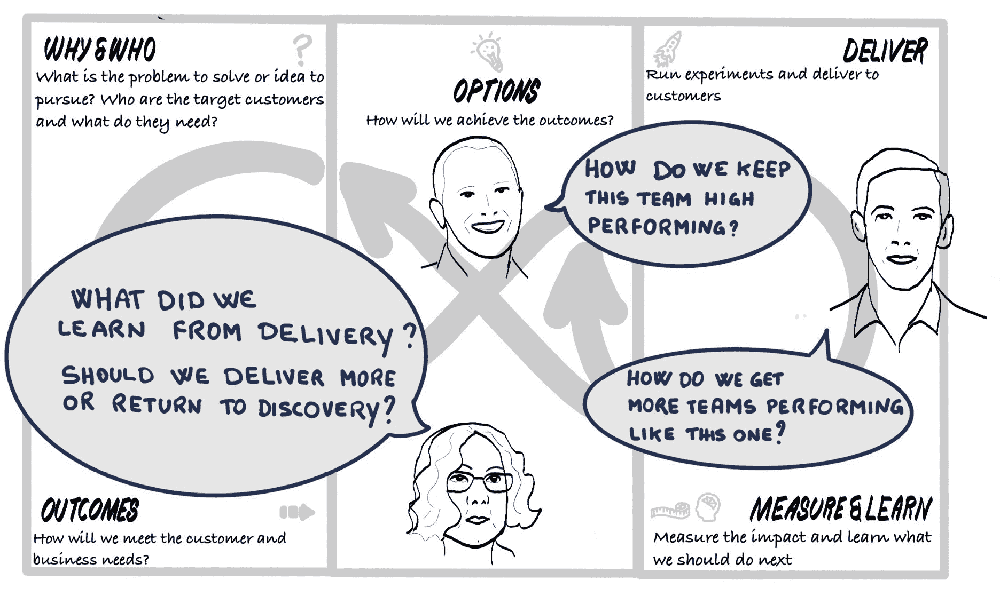
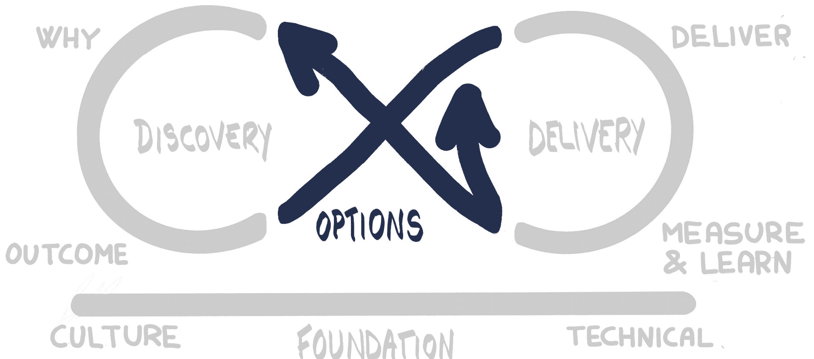

# 第七部分：改进与维持

本书是一次旅程。在*第二部分，建立基础*中，我们为我们的应用产品团队建立了基础。我们将该团队带入了*第三部分，发现它*中的发现循环部分。接着，他们进入了*第四部分，优先考虑它*中的选项枢纽，然后进入了*第五部分，交付它*中的第一次交付循环迭代。

然后，我们在*第六部分，构建它、运行它、拥有它*中与 PetBattle 产品团队一起深入构建应用程序。

在 Mobius Loop 旅程的最后一部分，我们回到了选项枢纽，并问自己从交付循环中学到了什么。

图 17.0.1：改进与可持续性——设定场景

接下来我们应该做什么？我们应该重新进入交付循环，还是返回到发现循环？再回顾一下我们的选项怎么样？这些问题将在*第十七章，改进它*中得到回答。

图 17.0.2：选项枢纽

在*第十八章，维持它*中，我们将回顾我们所走过的整个旅程，并探讨如何维持这种工作方式，包括如何维持我们在本书中所做的人、流程和技术的改进。然后，我们可以开始将这些工作方式在整个组织中扩展和传播到其他团队。
