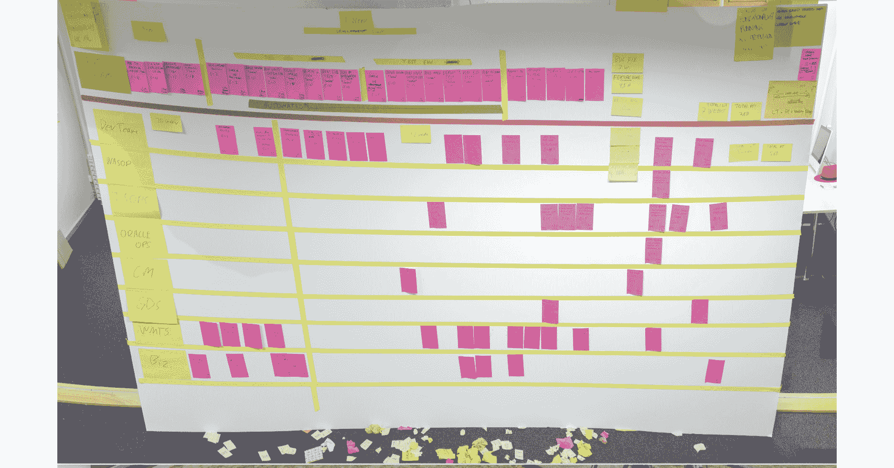

# 17\. 改进它

我们做到了！我们成功绕了一圈莫比乌斯环。

首先，我们建立了开放文化、开放领导和开放技术的基础。我们成功地绕过了发现循环，使用了北极星和影响力映射等实践来发现我们的“为什么”，并使用同理心映射和其他以人为中心的设计工具来发现我们的“谁”。我们甚至通过开始事件风暴、非功能性映射和基于度量的流程映射，开始了我们如何的发现。我们所做的一切都是为了收集足够的信息和集体共享的理解，以推导出一些可衡量的目标结果。

我们使用这些目标结果来引导我们通过选项枢纽。我们探讨了几种优先级排序技术和实践，例如用户故事映射、价值切片、影响与努力优先级排序、如何/现在/哇优先级排序、设计冲刺和加权短作业优先级排序，以产生我们初步的产品待办事项列表。我们设计了进入该待办事项列表的实验。

然后我们进入了交付循环的第一次迭代，功能被编码，应用被编写，我们进行了实验和研究。我们利用了既定的敏捷实践，以便尽可能快地实现对原始结果的度量和学习。

在之前的章节中，我们更深入地探讨了团队用来构建、运行和拥有解决方案的技术。

在莫比乌斯环的每一部分，我们收集了宝贵的信息，这些信息在每个章节的画布中进行了总结。如果我们将这三张画布拼接在一起，就能看到一切是如何连接的：

+   发现：

    +   我们是为谁做的，为什么？

    +   他们的问题、需求或机会是什么？

    +   我们设定的客户和组织结果是什么？

    +   对结果的影响是什么？

+   选项：

    +   我们同意交付的行动是什么？

    +   有哪些选项可以帮助实现这些结果？

    +   相对优先级是什么？

    +   我们学到了什么？

+   交付：

    +   做了什么？

    +   我们说过要研究、实验和发布什么？

图 17.1：莫比乌斯环

本章名为*改进它*。也许整本书都应该叫这个，因为其实，持续改进才是重点。我们所做的一切都专注于如何持续改进；无论是技术、用户体验、文化，还是我们使用的度量指标。

在本章中，我们将探讨当我们完成交付循环的一个迭代时，我们做了什么：我们学到了什么？我们学得够吗？我们是否朝着可衡量的目标结果前进？最重要的是，我们接下来应该做什么？

## 我们学到了什么？

在*第十三章*，*度量与学习*中，我们探讨了我们用来通过以下方式度量和从我们交付的产品增量中学习的技术：

+   来自展示和回顾会议的反馈

+   从用户测试中学习

+   捕捉实验结果

+   服务交付与运营表现

+   服务级别协议、服务级别指标和服务级别目标

+   安全性

+   性能

+   文化

+   应用指标

+   基础设施平台和资源使用情况

这种学习非常重要，应该推动关于所学内容的对话、推论和结论。这就是为什么可视化这些指标如此强大的原因。我们可以立即看到当前的衡量标准是什么，上一轮交付循环之前的衡量标准是什么，以及为了实现预期成果和影响需要达到的目标衡量标准是什么。

如果对话表明我们无法从这些指标中学习，我们需要检查为什么会这样。进行一次深入的回顾，以探讨为什么我们没有从交付循环中学到足够的东西，这可能会非常有帮助。像五个为什么或石川图这样的技术是进行深入回顾的优秀方法，有助于推动这些讨论并推动团队实施改进措施，从而促进学习。

最终，团队需要决定是否正在衡量重要的指标，是否这些衡量标准准确并能够反映他们的工作，数据是否能可靠地引导他们朝着目标结果前进。团队应当问自己的最重要问题是：*我们学到足够了吗？*

## 我们学到足够了吗？

在莫比乌斯循环的这一阶段，我们有一个非常重要的决定要做。从交付循环中出来后，我们可以决定是否再绕一圈交付循环，或者根据在交付循环迭代中捕获的指标和学习返回选项枢纽，重新审视并重新优先排列我们的选项。否则，我们可以继续返回探索循环。

基于我们学习的内容，我们喜欢提出以下问题：

+   根据我们交付的结果，我们是否达成了一个成果？还是我们需要从选项列表或产品积压中提取更多项目，进行更多的交付？如果是的话，向右转，再次绕过交付循环。

+   最近的交付循环中捕获的指标是否表明我们已经达成了一个或多个可衡量的成果？如果是，回到探索阶段验证这一点，并朝着下一个成果努力。

+   我们从交付中学到的内容是否验证、推翻或改善了在探索阶段做出的假设和假设的理解？如果是的话，让我们回到探索阶段，更新这些文档。

+   我们从交付中学到的是否给了我们关于选项优先级的新信息？如果是的话，让我们回到选项枢纽，重新审视一些优先级设定的做法。

+   实验结果是否为我们提供了新的或改进的实验思路？如果是的话，让我们回到选项枢纽，设计这些实验。

随着时间的推移，你会进行更多的发现和交付循环迭代，并在选项转折点上花费更多时间。Mobius 循环提供了一个极好的可视化，展示了你在每个循环上花费了多少时间，你绕每个循环的速度有多快，以及你在不同循环之间转变的频率。它还将帮助你了解你在持续发现和持续交付之间的平衡程度。

一些需要注意的警告信号包括：

+   **我们只是不断在交付循环中打转**。这表明我们没有花时间重新审视和重新评估结果，而是朝着成为一个特性工厂的方向发展，盲目地构建输出。

+   **我们在发现循环上花费了太多时间**。这表明我们处于**分析瘫痪**的状态。我们过度思考和过度分析我们的“为什么”和“谁”，但从未测试过我们的想法或假设。我们可能会错过市场机会，或者什么都不交付。

+   **我们从发现跳跃到交付**。这表明我们没有从发现阶段中获取学习并进行提炼、组织，并作出关于下一步交付内容或如何更快地获取知识和学习（例如，通过研究或实验，而不是盲目地构建特性）的一些重要决策。

+   **我们从交付跳跃到发现**。这表明我们没有花时间将学习反馈到我们的选项和优先级中。

+   **我们从未回到 Mobius 循环的其他部分**。这表明我们没有以迭代或增量的方式工作，也没有将学习融入我们的工作体系中。这实际上是线性的工作，正如我们在*第十二章*《执行交付》中所看到的，当我们探讨**Cynefin**时，只有在工作处于简单领域时，它才是一个真正好的解决方案。

让我们来看一个故事，其中一个重要的转折点和循环之间的变化是由学习引发的。

## 我们需要两个应用，而不是一个！

这来自我们第一次欧洲开放创新实验室的驻地 1。一家瑞士初创公司希望通过一个远程签到应用来颠覆医疗保健领域，专为**急诊室**（**ER**）服务。

我们与客户一起使用事件风暴（Event Storming）来理解业务流程并识别关键的用户流程。团队使用用户故事映射（User Story Mapping）来识别可以用于测试市场的早期切片，随后通过 Scrum 交付了一个非常早期的产品，分为三轮每轮一周的冲刺。

第一次交付的重点完全放在患者需要去急诊室时使用的应用程序上。它完全关注患者的体验，并且大部分用户研究都是针对这些患者角色的。

当利益相关者看到应用的第一个增量时，突然有了一个顿悟时刻。为了完全理解、领会并从这个解决方案中学习，我们需要为两个应用而不是一个应用提供原型。医生和护士筛选请求的体验将是关键。

这促使团队立即回到发现循环，专注于这些用户角色和流程，因为团队对他们的需求和问题缺乏深入了解。

1 [`www.redhat.com/en/blog/red-hat-welcomes-swiss-based-medical-company-easier-ag-waterford-its-emea-open-innovation-labs`](https://www.redhat.com/en/blog/red-hat-welcomes-swiss-based-medical-company-easier-ag-waterford-its-emea-open-innovation-labs)

这是许多例子中的一个，在这些例子中，团队收集了*足够的*信息和反馈，触发了思路的转变和方向的调整。

## “足够的”促使了持续的一切

在本书中，我们多次使用了*足够的*这个词。就在开篇几段中，我们就曾想过，你是否从本书的封面信息中获得了*足够的*信息，去探索更多内容。在*第七章*《开放技术实践——中点》中，当我们构建技术基础时，我们说我们只构建了*足够的*架构，以便产品开发能够继续推进。当我们在*第八章*《发现为什么和谁》中进入发现循环时，我们使用了一些实践来获取*足够的*信息，以便使团队保持一致，达成共享的理解，并具备足够的信心去交付早期实验。在*第九章*《发现如何做》中，当我们开始通过事件风暴等实践来发现我们的“如何做”时，我们获得了*足够的*信息，能够设计出各个组件之间如何交互。在*第十章*《设定成果》中，我们解释了我们总是进行*足够的*发现，以推动选项转变并开始交付的迭代。

现在，我们已经经历了交付循环，最初的*足够的*信息已经增长。相比刚开始时，我们现在知道的更多了。通过交付实践、用户测试、实验结果和度量系统所捕获的措施和学习，我们现在有机会重新审视和更新发现实践。让我们看几个例子。

在*第八章*《发现为什么和谁》中引入的影响力图生成了大量假设陈述。例如，在我们的 PetBattle 案例研究中，我们假设创建每日锦标赛功能将增加上传者的站点参与度，从而帮助我们实现年度目标，即通过现有和新客户群体在年底前创收 10 万美元。嗯，我们现在已经完成了这个功能。事实上，我们在*第十一章*《选项转变》中创建了 A/B 测试，并设计了一个关于下一个锦标赛何时开始的实验。结果告诉了我们什么？我们实现了更多站点参与度的影响吗？这个假设是对的还是错的？让我们更新影响力图。

我们遇到了玛丽，我们的其中一位用户。我们进行了同理心映射（Empathy Mapping）实践，并使用了*第八章*中其他以人为中心的设计技巧，*发现“为什么”和“谁”*。我们听到她说她非常喜欢前三名的排行榜。我们首先和玛丽进行了一些用户原型设计和测试。我们可以在最新的《宠物大战》（PetBattle）软件上再做一次同理心映射，捕捉她对软件最新增量的看法、听到的内容、看到的内容和她的言论。让我们与玛丽和其他用户一起更新或创建新的同理心映射。

我们使用事件风暴（Event Storming）让我们对玛丽参与日常比赛并赢得奖品的业务流程有了足够的了解。在事件风暴中有许多粉色方形便签，代表假设、问题和未知事项。现在，我们交付了一些功能，进行了研究，开展了实验，发展了对话，因此我们知道了更多信息。我们可以更新事件风暴，甚至可能开始生成系统的全新部分或功能领域。

通常，我们只有三个或四个目标成果（Target Outcomes）。也许我们现在已经达成了这些目标，或者接近达成它们；我们的学习和措施可能促使我们重新思考或重写目标成果。也许我们需要考虑下一个目标成果，以将我们的应用提升到一个新的水平，并保持竞争优势。

我们的用户故事地图（User Story Map）、价值切片板（Value Slice Board）和优先级实践已在*第十一章*，*选项转变*中介绍。我们现在已经交付了价值最高切片或切片中的项目。我们的学习可能促使我们重新考虑现有的优先级，或者重新划分并重新规划价值交付。让我们更新这些文档，以反映我们最新的观点。

我们的产品待办事项（Product Backlog）始终准备好进行更多的产品待办事项细化。随着发现和选项转变（Discovery and Options Pivot）文档的所有更新，肯定需要再次查看和更新。让我们细化产品待办事项。

因此，我们从所有实践中产生的所有文档从未完成——它们是不断发展的、有生命的文档。它们应该始终对团队成员和利益相关者可见且易于访问。我们根据衡量标准和学习的频繁更新这些文档，我们的核心产品待办事项（Product Backlog）就会更有价值，我们的产品也能更快响应并适应用户、市场和利益相关者的需求。这就是所谓的**业务敏捷性**。

## 向安全专家学习

在技术和敏捷社区中，关于安全如何融入敏捷流程存在许多争议。我记得曾和一家爱尔兰电信公司的安全负责人进行过长时间的对话。他说，“*敏捷和安全永远不能融合，永远也不会融合。*”

我对此感到好奇，想要更深入地理解（并产生共鸣）。通常，他会在新系统或应用上线前的一到四周内参与到项目中。他会仔细审查每个使用的框架、逻辑架构、物理架构、托管和数据存储，最终会进行一系列的安全渗透测试。通常，他不得不加班到晚上和周末，因为他的安全签署是与相关产品商业发布之前的最后一个里程碑之一。

我们决心尝试将这个安全分析和相关检查*左移*，将安全控制员纳入到流程中，使渗透测试变得更加持续和自动化。

我们首先邀请安全控制员参加所有的 Sprint 评审展示活动。他没有参加前几次，但最终参加了一次。我认为他并不指望能从中得到什么，但他成了会议中最活跃的利益相关者之一。他向我们询问了代码中使用的框架版本、UI 中是否考虑过跨站脚本攻击，以及我们在 CI/CD 中使用了哪些开源工具。我们没有所有的答案，但我们确实在产品待办事项中记录了一些需要研究的内容，并在下一个 Sprint 中安排了精炼工作坊。

几个 Sprint 后，我们展示了从早期反馈中捕获的研究项的输出、成果和学习成果。我们还展示了如何通过自动化代码扫描和漏洞检查扩展了我们的 CI/CD 流水线——并且我们正在研究自动化解决方案，以应对跨站脚本攻击。

安全控制员意识到这不会是一个在上线前几天就让他承受巨大压力的项目。团队正在向他学习，他将自己的需求和知识注入到自动化中。他仍然会留出一周的时间来进行渗透测试，但他感到更加自信。最终，这成为了一个非常积极的经验，也是史上最迅速的安全审批之一。

这次经历突显了在重要利益相关者（如安全控制员）中增加信心的重要性，并且不断地在团队和利益相关者之间分享学习。当然，信心可以通过像信心投票这样的实践来衡量！

这个故事突显了始终改进度量和自动化的重要性。如果某人反复进行相同的活动（例如安全测试），那么它就是自动化的候选者。

### 始终改进度量和自动化

我们在*第十三章*，*衡量与学习*中介绍了一系列度量标准。这并不是一个一次性、有限的清单作为指导，而是一个初步的建议集。当我们基于利益相关者反馈发现需要度量的地方时，我们应当将其加入，特别是当我们将其作为提高学习或信心的机会时。

自动化收集、分析和展示（或可视化）指标是将反馈闭环接近实时的关键。开发人员可以实时获取代码提交的影响反馈，而技术利益相关者则可以从对构建交付物进行的质量检查中获得实时反馈、保障和信心。与此同时，产品负责人和业务利益相关者可以获得关于应用功能使用和采纳的数据；而组织则可以看到其整体的交付新功能的能力和速度。

这与我们如何通过指标可视化和量化持续交付基础设施的全面影响紧密相关。

### 重温基于指标的过程图

在*第十章*，*设定结果*中，我们介绍了基于指标的过程映射实践，作为发现持续交付理由的工具。我们在许多不同的组织中多次使用了这一实践。在采用新实践、技术和文化后，产生的指标令人震惊。

最近，如果我们与一个全新的团队合作，我们选择不在发现阶段的第一次迭代中使用这个实践。虽然这似乎是捕捉遗留流程指标的好方法，但我们已经了解到，新团队缺乏文化基础或心理安全感，无法参与这一活动。你必须问非常深刻的问题，比如*你做这个过程需要多长时间*？以及*你多长时间会犯错或出现不准确的地方，这些问题会在后续任务中被发现，*意味着你需要重新做你的部分*？如果文化中没有安全感，可能会导致误导性答案，甚至损害文化。然而，我们发现，在通过一些交付循环后再进行这一实践非常棒。

## 我的管理层只真正理解数字和电子表格

当我与一家欧洲汽车公司合作时，我每天与产品负责人和 ScrumMaster 进行敏捷教练会议。这是一种“随便问我任何问题”的会议类型，通常是一个很好的机会，可以聊聊工作方式，并生成未来可以尝试的不同想法。

在我们参与的倒数第二周，产品负责人表示他非常满意团队和在过去五周中不断发展的产品。他喜欢信息显示器和可视化；他喜欢每周通过展示会看到产品如何变得生动，并且团队每周都与实际的最终用户见面，进行软件和方法的测试、实验和验证。技术非常棒，团队在 CI/CD 和其他自动化方面的工作令人惊叹！

但他也感到担忧。这个驻场项目是在一个临时的外部设施中进行的。他带了一些同行来“走墙”并亲眼看到工作方式的实际应用，但很多他的领导层并没有见过。他解释说，他的管理层只真正理解数字和电子表格——他们并不完全相信使用便签和五彩斑斓的墙壁。那他该如何证明这真的是一种更好的工作方式呢？

这让我想起了我们在开放实践库中还未使用过的一项实践：基于度量的流程映射。这正是解决这个特定问题的工具。所以，我们拿了一些便签和一块巨大的可移动白板。

图 17.2：为一家欧洲汽车公司使用基于度量的流程图

我们记录了从业务或用户请求一个功能到该功能在生产环境中运行之间的所有事情。我们捕捉了交付时间、过程时间以及完整性和准确性度量，完全按照*第九章*中描述的实践，*发现工作方法*。

我们记录了他们过去交付软件增量的旧方式和新方式的度量数据。对于旧方式，他们会从一些工单系统中筛选出有用的度量数据。而新方式，则通过 Jenkins、GitHub、Ansible 以及其他在项目中使用的工具收集度量数据。他们还可视化了旧团队结构和新团队结构。最终的看板如*图 17.3*所示：

图 17.3：记录旧方式和新方式的不同度量数据

便签上的实际数字和信息对于本书来说并不重要，但这个流程和最终的可视化展示了很多关键的学习点。每一张粉色的便签代表着功能请求和功能上线之间发生的一个*事件*。

所有位于红线下方的内容代表着旧有的功能交付方式。这些任务由不同部门和团队的人员完成——每个部门或团队用横向的黄色线条表示。

当你从左到右阅读粉色便签时，每一次你跨越一条黄色线去阅读右侧下一个便签，就代表着任务的移交或交接给另一个团队。这通常涉及到提交工单、预约资源、预留时间进行沟通以及等待或排队。

所有位于红线以上的内容代表了我们驻场项目启动后，这个新方法交付软件产品的方式。它们都位于同一条横线上，因为这是一个新的、长期存在的跨职能产品团队在完成所有工作。基础设施、设计、开发、测试、部署和运营都由这个新产品团队负责。

绿色线条表示上方粉色任务已被自动化。这就是持续集成/持续交付（CI/CD）的实际应用！这个管道实现了自动代码扫描、构建、容器化、部署、单元测试、端到端测试、合同测试、漏洞扫描、安全性测试和 UI 测试。当我们总结旧方法与新方法，并考虑不同类型开发工作可能带来的一些细微差别时，持续交付的可衡量影响令人震惊。这一点在一个高层领导小组面前展示时，引起了几声惊叹。

表 17.1：衡量新工作方式的影响

一位利益相关者问道，是什么主要促成了这些数字变化的？产品负责人解释说，原因有三。部分归因于所使用的技术，包括 OpenShift 平台；部分归因于工作方式，包括采用的 Mobius Loop 和 Foundation 实践；但最重要的是，这一切归功于团队。这个长期存在的产品团队证明了他们不仅能够实现这些指标，而且还会进一步提升它们。

前述故事中的三个贡献因素是我们应通过持续学习不断改进的内容：改进技术、改进工作方式和改进团队。

本章大部分内容讨论了工作方式，以及我们如何使用 Mobius Loop 模型促进持续改进。接下来我们将考虑技术和团队。

## 改进技术

编写任何关于技术的书籍所面临的挑战在于，它会很快变得过时——只需问问几年前编写《*DevOps 与 OpenShift*》的两位作者即可。在《*DevOps 与 OpenShift*》写作之后，许多模式、技术和产品都发生了变化，我们完全预期这种变化会在未来几年继续发生。

*第六部分，构建它，运行它，拥有它*，聚焦于 PetBattle 技术以及团队如何在 2021 年构建、运行和拥有它。如果你在 2025 年读这本书，我们希望本书中的许多章节仍然有效，但*第六部分*可能已经发生了变化。

对团队而言，至关重要的是要给予足够的时间、空间和能力，去学习新技术、进行实验、研究并实施新产品和框架，以便不断改进他们所构建解决方案中的技术。

对于一个长期存在的产品团队来说，这突显了优秀产品所有权的重要性，以及经过精心优化的产品待办事项，它们能够正确表达所有工作项的价值。这包括非功能性的工作，旨在改善和发展架构，同时利用新技术对其进行更新。

我们在 Red Hat 使用的一些方法，也一直鼓励我们的客户使用，具体包括：

+   分配时间给技术、研究和实验

+   对技术、培训的强有力定期投资，并在适当时提供认证

+   围绕技术的实践与兴趣社区

+   建立技术书籍俱乐部

+   组织并主持定期的网络研讨会、午餐学习会以及其他社区活动

+   参加外部技术会议

+   参加内部会议（例如，Red Hat 每年为所有服务和技术预售人员举办为期一周的内部技术交流活动）

最重要的是，倾听并从团队成员那里学习，并在每个迭代中预留时间促进学习。持续投资于团队学习是高绩效、长期存在的团队最强大的成功因素之一。

## 团队万岁

从本书一开始，我们就提倡长期存在的跨职能团队的重要性。在*第一章，导论—从为什么开始*中，我们讲述了如何帮助 I 型人才（在某一特定技能上有深厚专长）变得更加 T 型（具备多功能的知识和单一技能深度），甚至是 M 型（具备多功能的知识和多项技能深度）。

上述内容我们探讨了如何改善技术。那些建议实际上并不是直接改善技术，而是集中在使用技术的人，并提升他们使用技术的能力。我们如何衡量并学习提升团队技能的影响？我们可以通过哪些方式将其可视化？

## 可视化从 I 型到 T 型再到 M 型的过渡

我们近年来在改进的一个实践是捕捉、衡量并可视化团队的技能。当我们组建一个新团队时，例如开始一个驻场项目时，了解个体的技能和经验非常有帮助。但我们希望以心理安全的方式来进行此项工作，而不是让新同事感到被威胁或是受到考核。所以，我们停止了技术测试，因为它影响了团队士气。取而代之的是，我们使用一个简单的可视化工具，比如蜘蛛图，来展示跨职能团队中不同能力所需的技能水平（0-5）：

图 17.4：使用蜘蛛图可视化团队技能

当然，这也可以通过简单的电子表格软件来完成：

图 17.5：使用电子表格分析团队技能

它还可以通过不同种类的图表进行可视化：

图 17.6：使用直方图分析团队技能

作为一个长期存在的团队，这是一种值得养成的好习惯。团队可以定期检查是否有团队学习的发生，团队及个人是否正在变得更加跨职能。

## 巫师与牛仔

我们最近使用的另一个有趣的学习文化实践是“巫师与牛仔”的类比。在*第六章，开放的技术实践——起步，正确开始*中，我们解释了为什么我们试图根除独角兽开发者。我们不希望团队中有那种拥有所有知识并且高度依赖的英雄人物。

与一家地理空间公司合作时，我们在一次回顾中注意到，存在个体在学习英雄式的技能，但知识没有得到分享的风险。团队一致决定购买一顶巫师帽，当发生这种情况时，取得惊人成就的人需要戴上巫师帽，直到这些知识以对等方式，甚至更好的方式在群体会议中分享。

牛仔帽还用于突出反模式和一些不应该做的事情（例如，应用`-DskipTests=true`来部署构建，而不运行自动化测试）。如果发现此类行为，责任人必须戴上牛仔帽，直到反模式与全体团队分享并且得到教育。

这是一种有趣的做法，为更好的团队文化创造了一个安全的空间。同时，它也是一种教育方式，促进了持续学习。

## 结论

在这一章中，我们探讨了当我们走出交付循环的迭代时，应该怎么做，以确保我们在再次进入交付循环、回到选项转折点或返回发现循环时能够持续改进。我们考察了如何从交付中获取度量和学习，评估我们学到了什么，以及这些是否足够决定接下来的步骤。

我们现在正处于从发现到交付再到发现的持续创新流中。我们从*刚好足够*和*刚好及时*的信息开始，推动进程。我们一直在不断学习。

我们回顾了如何通过回到基于度量的过程映射实践，来衡量我们新系统和工作方式的改进，以量化技术、工作方式和团队的进步。我们认识到在这些方面持续学习和持续改进的重要性。

在本书的最后一章，我们将探讨如何维持我们在本书中所涵盖的一切。我们专注于一个团队和一个梦想。这是有意为之。在我们寻求维持这一点时，我们还将看到如何重用本书中使用的所有模式、方法和实践，以便将产品中心思维扩展到应用和平台，甚至到领导力和战略。
