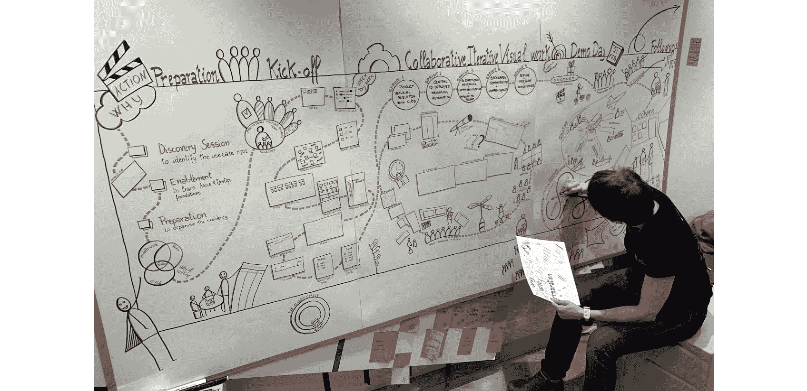

# 第十八章：18. 维持它

在上一章中，我们从 Mobius 循环的一次性旅程过渡到持续不断、永无止境的学习与改进旅程，这个过程基于以度量为基础的结果，覆盖了*第八章*、*发现为什么和谁*，到*第十三章*、*衡量与学习*。

本书重点讲述了一个团队如何在 Mobius 循环中从发现（Discovery）到选项（Options）和交付（Delivery），再回到发现（Discovery）的全过程。开放实践库（Open Practice Library）帮助将 Mobius 实现为一个真正基于结果的交付框架，建立在开放文化和开放技术的基础上。

PetBattle 案例研究讲述的是一个团队如何实现一个共同的目标：成为一个高效能的跨职能、长期存在的团队，交付出色的产品，并充分利用底层技术，包括 OpenShift。通过人员、流程和技术的结合，他们成为了灵感的种子和感染力十足的激情触发器。

Mobius 不仅仅是一个团队可以遵循的地图；它是整个工作系统的导航器。

在本章中，我们将提出这样一个问题：*我们如何利用 Mobius 和* *开放实践来推动这种* *持续发现、持续交付以及在文化和技术基础上进行选项转变的思维方式，在更大规模的组织中推广？* 换句话说，我们如何让 50 个团队像 PetBattle 团队那样协同工作？我们将探索如何使更多的应用产品团队以相同的方式工作，这对平台意味着什么，对领导力和组织战略又意味着什么。

让我们从可视化迄今为止的旅程开始。

## 迄今为止的旅程

让我们使用 Mobius Kit1 中的另一个开源工具，Mobius Navigator。它提供了一个宏观视角和 Mobius 背后的基本理念，可以应用于任何复杂系统。Mobius Navigator 是一种可以应用于组织各个层级的思维模型。

图 18.1：Mobius Navigator

1 [`www.mobiusloop.com/kit/`](https://www.mobiusloop.com/kit/)

我们通常从左侧循环开始，尽管我们不一定非要这样做。有时，遗留系统和组织会在交付过程中从右侧循环开始，并会尽早寻求转向左侧循环。这是因为关于发现阶段有许多重要而强有力的问题需要提出，而组织越早开始回答这些问题，就越有利。

当我们从左侧开始环绕莫比乌斯导航员时，我们会提出强有力的*为什么*问题。我们为什么要这么做？我们为谁而做，这将如何帮助他们？我们发现真正发生了什么，以便得出成果。然后，我们产生想法，完善并规划如何交付选项，决定接下来要处理哪些选项。我们通过设计、创建和启动来交付，并在反思和改进中通过衡量影响来学习。最后，我们通过发现更多、交付更多或完全转变来适应。

莫比乌斯循环让我们能够将莫比乌斯导航员的思维方式深入到一个产品团队，探索他们如何使用发现地图、选项地图和交付地图来持续进化产品，交付具有实际意义的成果，同时内建持续的衡量和学习。我们在 PetBattle 和本书中穿插的许多故事中看到了这一过程的实际应用。

我们在*第十章*《设定成果》的末尾使用了发现地图来总结*第三部分*《发现它》，并捕捉在发现循环中所获得的所有学习成果。我们在*第十一章*《选项转折》的末尾使用了选项地图来总结*第四部分*《优先处理》，并捕捉在选项转折过程中所做出的所有学习和决策。我们在*第十三章*《衡量与学习》的末尾使用了交付地图来总结*第五部分*《交付它》，并捕捉在交付循环中所交付的影响与学习。如果将这些地图连接起来，我们可以看到莫比乌斯循环是如何将这三部分连接在一起，并总结产品演变过程中的学习成果。

*图 18.2*中有很多细节，你可以在上面提到的各章末尾查看单独的地图，或者访问本书在 GitHub 仓库中的 PDF 版本。

图 18.2：PetBattle 莫比乌斯地图：发现、选项、交付

现在，假设在一个组织中有 10 个不同的产品团队以这种方式工作，每个团队都拥有一套属于自己负责的产品或产品领域的地图，这会怎么样呢？

这个想法之所以变得可行，是通过传染性热情、平台的广泛采用，以及在整个组织不同层级上增强的产品思维。

这是一个旁注，但本书的大部分内容都是在 COVID-19 大流行期间写成的，那时**感染**和**传播**是非常负面的现象。现在能够写下关于一些具有积极影响的“传染性”现象，真是令人愉快！

## 传染性热情

我们倡导从一个团队开始的原因之一是通过在组织或部门的一个小范围内进行测试、学习、检查和适应。以单个团队为起点，并展示快速成功的案例，可以在任何传播开始之前展现出非常强大的影响力。这个团队就是我们的“零号病人”2。通过首先采取这一团队的方法，我们实际上是在采取一种敏捷的方法，朝着更敏捷的工作方式迈进。

2 [`zh.wikipedia.org/wiki/案例`](https://en.wikipedia.org/wiki/Index_case)

对于第一个团队，我们希望通过做书中所描述的一切，并采用开放实践库中的方法，帮助他们尽可能快速地学习。没有任何培训课程、YouTube 视频或书籍能够单独使一个团队立即按照本书设想的方式工作，并实现预期的结果。我们希望你从这本书中获得了很多价值，并且充满了灵感和信息，但我们并不认为你的团队会在读完整本书后立刻转变为这种工作模式。

人员和团队可以通过亲自经历整个过程来获得赋能。他们必须建立自己的文化和技术基础。他们必须经历发现循环、选项枢轴和交付循环，亲身体验 Mobius 导航员的思维方式。在这个过程中，他们需要一个应用程序、一个系统，一些能够为真正的终端用户创造商业价值的东西，这样他们才能有机会自己去构建、运行和拥有它。我们建议从一个具有实际商业价值但相对较小的项目开始，这样你可以通过一个小团队进行实验并学习。

使用本书中描述的所有方法和原则将一个应用程序投入生产是一项挑战，你的团队几乎肯定会在整个过程中发现瓶颈和阻碍。好消息是，导航员和思维模型的设计就是为了解决这些问题。

能够按照*第十七章*《改进它》中描述的方式进行改进，能使这些瓶颈和阻碍逐一被解决，并通过度量标准进行验证。许多根本性的阻碍来自于组织中的“信息孤岛”，这些孤岛需要被打破。产品团队需要通过自主、精通和目标感，能够打破这些“信息孤岛”，直到能够交付生产！

这样的团队在执行任务以展示新工作模式时所遇到的挑战需要及时解决，可以通过平台进化或领导力赋能来解决。例如，如果产品所有权不明确或缺失，这个阻碍需要通过回顾性事件（如*第十二章*《交付执行》中所解释）或使用实时回顾性甚至“停止全世界”事件（这些实践在*第四章*《开放文化》中有描述）来提出。最好在一开始就识别这些问题，并通过一个团队解决，而不是接受已知的非最优方式，并最终在整个组织中推广劣质的工作方式。

在本书的开头，我们解释了我们有一个喜欢的说法：我们更倾向于*展示*，而不是*告知*。展示，而不是告知，是我们创造感染性热情的方式。我们必须向世界展示人、过程和技术如何在辉煌的合作中共同运作。让我们来看看我们是如何做到这一点的。

### 演示日

在红帽公司，当我们进行开放创新实验室驻地项目（4-12 周的沉浸式合作，客户在真实的业务用例中体验文化和实践）时，我们总是在驻地项目结束时举办演示日活动。当然，我们会在整个驻地过程中举办多个演示。我们通常使用 Scrum（如*第十二章*所述，*交付实践*），这意味着我们每周会举办一次冲刺评审展示活动（我们通常采用一周的冲刺周期）。

虽然我们鼓励**邀请全世界**来参加这些每周的活动，但实际上并非每个开发人员、操作人员、领导者、工程师以及组织中其他所有相关人员都能参加。我们会录制这些活动，并尝试通过其他媒介传播这些每周展示的信息，但我们发现我们还需要一个特别的演示日活动。

演示日是整个工作方式的展示——包括人员、流程和技术。在我们的驻地计划中，几乎所有的演示日展示都由客户组织中的人员（也称为**驻地成员**）进行展示。到这个阶段时，客户的驻地成员已经感染了这种热情，这是他们展示（而非仅仅讲述）他们在驻地期间如何构建、运营和拥有产品的机会。这是一个展示他们为同行和同事们所做的工作、运营和拥有的机会；但更重要的是，这也是展示这些阶段的*方法*的机会。

这是展示驻地成员在这段时间内共同工作所使用的所有实践的机会，具体包括：

+   他们的文化基础以及如何运用社会契约、停止世界事件和实时回顾等实践。他们展示了他们所取得的团队身份，如何使用团队情感工具，以及如何创建一个令人惊叹、蓬勃发展的团队工作空间。他们解释并展示了如何使用优先级滑块、准备和完成的定义、验收标准等工具，推动轻松的对话、达成共识和共享理解，营造强大的开放文化。

+   他们的技术基础以及如何使用容器和 OpenShift 平台作为其技术基础的核心。加入如一切即代码、测试驱动开发、测试自动化、CI/CD 和持续部署等技术实践，才真正为持续交付提供了强大的平台和基础。他们展示了如何通过结对编程和集体编程实现团队对产品的共同拥有。并展示了如何从这个基础中实现自主性、精通性和目标感。

+   他们走到墙前，解释影响图、同理心图、事件风暴、非功能图以及基于指标的流程图，并展示了这些工具如何共同推动目标可衡量成果，帮助组织朝着其北极星目标前进。

+   他们展示了如何在冲刺中通过使用用户故事地图、价值切片板和他们选择使用的其他优先级排序实践来进行优先排序。

+   他们展示了产品如何发展，架构如何形成，以及迭代和渐进交付中所使用的交付实践。

+   他们展示了他们构建的应用程序，演示了所使用的平台功能，并展示了他们用来改进操作、推动更具实验性的功能开发方法以及实时数据指标的部分平台特性。

+   他们展示了这项技术、这些实践和这个团队所取得的一些令人震惊的指标，并且展示了与传统工作方式的对比。

+   他们直接与领导层分享他们需要什么来维持这种工作方式，以及当他们回到正常工作环境时的希望与担忧。

+   他们以自豪的心情庆祝自己所取得的成就，以及作为一个团队所成为的样子。

当人们充满激情和能量地分享他们用所采用的技术和实践所取得的成就时，那种感染力是无法忽视的。即使是最内向的人，在展示日也能交付出令人难以置信的展示。这是无法用文字描述或解释的东西，你需要亲身到场去感受和体验那份能量和激动。

我们通常在展示日尝试展示的另一个方面是，展示团队日常工作或冲刺中的典型一天。为此，我们在整个参与过程中拍摄了大量的视频。

### 记录旅程

协作的力量很难通过文字或口头表述来说明。当一个团队在进行事件风暴（Event Storming）并且拥有强大的开放文化时，观察到讨论是如何对齐的真是令人惊叹。当一个团队聚集起来优先排序并优化产品待办事项时，达成的业务和技术上的澄清以及作出的决策是非常有力的，尤其是与传统的工作计划方式相比。所有那些使团队拥有如此强大文化的乐趣、能量和幽默是无法用言语传达的。

因此，我们尽力通过照片和视频尽可能多地记录这些。也正因如此，我们在本书中加入了大量照片，试图通过展示而非言辞，呈现文化和这些实践的实际运作。

我们鼓励每个人在团队中或附近拍摄尽可能多的照片和视频（当然需要得到周围人的同意！）。即便是在为期四周的项目中，我们也最终积累了成百上千的照片和视频。

为了激发团队的热情，我们的团队成员通常会制作一部每周展示视频。这不是一部专业制作的视频，而是一些有趣的内容，一两分钟的时间，包含照片和短视频的蒙太奇，简单地让其他人感受到团队空间中的氛围。我们会把这些展示给团队（通常是在星期五下午），这能带来一种自豪感和奖励感。我们得到的反馈是，团队成员会把这些视频展示给他们的家人，这通常是他们喜欢自己所做工作的一个好迹象！

我们鼓励客户在他们的组织中分享这些视频和照片，尤其是那些可能受益或受到启发的人，看到一个团队以这种方式工作的情况，即使他们没有机会亲自访问。有些甚至会被上传到 YouTube，3，这是一种很好的方式来向全世界展示！

虽然照片和视频可以提供团队在一段时间内的概况，但我们也在寻找创意方法来总结更长时间的过程或整个参与经历。一个非常有效的方法是通过绘制经历来呈现。

3 [`youtube.com/playlist?list=PLnqlDDtSH2A4e3dTIGHGyhCYmwIoaYxV5`](https://youtube.com/playlist?list=PLnqlDDtSH2A4e3dTIGHGyhCYmwIoaYxV5)

### 绘制经历

希望你已经注意到素描和涂鸦在复杂领域中能够带来的价值。Ilaria Doria 在本书中提供了许多精彩的素描，帮助内容更加生动，并通过展示而非讲述的方式呈现实践。

这是一种非常有效的讲述故事和记录经验的方法。我们有时会聘请图形艺术家记录演示日，如*图 18.3*所示。图像中有很多细节，可能在印刷品中无法完全阅读。当然，你可以通过访问本书的 GitHub 仓库[`github.com/PacktPublishing/DevOps-Culture-and-Practice-with-OpenShift/`](https://github.com/PacktPublishing/DevOps-Culture-and-Practice-with-OpenShift/)并进行缩放来查看数字版。

还有一篇由 Eric Schabell 撰写的精彩三部分系列博客 4，完整记录了这次特别的参与经历，并包含了这些素描。

图 18.3：开放创新实验室驻留旅程的示例素描

4 [`www.schabell.org/2018/01/inside-my-open-innovation-labs-residency-part-1.html`](https://www.schabell.org/2018/01/inside-my-open-innovation-labs-residency-part-1.html)

在接下来的几周里，我们还逐步构建了这些人、过程和技术在实践中的照片。

图 18.4：具有视觉引导技能的参与领导者

这些展示图曾自豪地悬挂在组织总部的公共区域。它们激发了兴趣，提供了灵感，并成为另一种充满感染力的热情来源。这些视觉展示通常涵盖了你如果亲自走访团队空间时可能看到的一切。

### 走访墙面

我们发现的一种最有效的激发感染性热情的机制就是通过一种叫做“走访墙面”的实践。在*第四章*，*开放文化*中，我们讨论了通过可视化工作以及创建我们在本书中学到的许多信息辐射器所带来的巨大价值。在*第五章*，*开放环境与开放领导力*中，我们解释了组织的领导团队给予团队开放工作空间以展示并使用这些信息辐射器的重要成功因素。走访墙面将这两者结合在一起，为任何可能有兴趣亲眼见证这种工作方式的人提供了一个真正具有吸引力和沉浸感的体验。其理念是，参加走访墙面的人应该能够获得他们所需或想要了解的关于团队、产品、使用的技术以及工作方式的所有信息。仅仅通过查看信息辐射器的成果并与带领参观的人（通常是团队中的成员或与团队关系密切的人）交谈，就能提供一个诚实、充满活力且谦逊的体验，了解团队的人员、流程和技术。

走访墙面的参观并非排练过的，也不遵循剧本。我们只是谈论我们看到的内容，并讲述我们是如何构建我们所看到的东西：大图景、实践角落、影响地图、事件风暴、北极星、基于指标的过程图、价值切片板、产品待办事项、冲刺看板、回顾结果、构建监控、测试指标、部署统计数据、操作仪表板等等。一次成功的走访墙面体验不仅仅是**展示，而非讲解**—它是**感受与展示，而非讲解**。一个高效能的团队拥有自主性、精通度和目标感，采用了出色的开放文化实践，并在世界级平台上采用了最佳技术。当你看到这样的团队在实践这一切时，很难不感受到房间里的文化和能量。这才是真正具有感染力的地方。任何参与走访墙面的团队成员，感受到这种能量，通常都会想加入——并且希望像这个团队一样。

我们曾尝试为一个现场产品团队 5 和一个虚拟产品团队 6 带来一些走访墙面的体验。

当我们无法让每个团队和每个利益相关者亲自访问团队并与他们一起走访墙面时，我们会寻找其他方式，帮助展示团队和技术的实际运作，例如我们所说的**书面展示**。

### 书面展示

书面展示正如其名——将展示活动以书面形式呈现！我们开始每周进行这些活动，最初我们会感到沮丧，因为每周的 Sprint Review Showcase 活动的出席率没有我们预期的那么高。我们邀请了高级领导、利益相关者和其他团队来参观和体验墙壁巡展，但在这个忙碌的世界里，很难让每个人都来参观，尤其是在一个可能只有几周时间的紧凑参与期内，要帮助并启动这个团队。

因此，我们将我们在 Sprint Review 展示活动和墙壁巡展中想要传达给利益相关者的所有内容写下来。我们尽可能通过多彩的照片、链接和蒙太奇视频展示出来。

这些书面展示通常以 HTML 邮件或 PDF 形式呈现（包括所有照片和视频），并且包含指向工件和信息辐射器的链接，以及从不断发展的应用程序、软件交付和平台中收集的最新指标。

给一份书面文档赋予与引人入胜、身临其境的墙壁巡展相同的视觉吸引力是很困难的。但我们可以尝试，而且这种文档的一个巨大优势是，它们可以在组织内部广泛共享，口碑传播成为激发传染性热情的触发器。

5 [`youtu.be/70y6SEz6bas`](https://youtu.be/70y6SEz6bas)

6 [`youtu.be/TtvDJIT6RYo`](https://youtu.be/TtvDJIT6RYo)

### 口碑传播

口碑在现场证明，一次又一次地，成为了维持和增长我们在某个团队中看到的文化的关键因素。在几周内，团队被邀请参加 Sprint Review Showcase 活动和墙壁巡展，收到了书面展示邮件，并看到了看似非常酷的团队和技术内容的照片和视频，这个团队就开始被大家讨论起来。

我们开始在走廊里听到这样的对话：“*你看到五楼的那些人了吗？到处都是便利贴和显示器*……*不确定他们在做什么，但看起来真有趣*”或者“*我们需要去看看那个在地下室呆了几周的产品团队，他们好像在做一些很酷的技术事情，我敢肯定我们能从他们身上学到东西*”甚至，“*我刚和楼下的那个团队一起做了墙壁巡展——他们在做所有你在培训课程上读到和学到的事情，但他们做得更好，且是真实的！*”

当你看到一些关于软件交付和可操作性的指标时，讨论仍在继续。口碑传播开来，关于某个团队取得的惊人成果的消息四散传开。其他人怎么可能不想了解更多呢？

### 令人震撼的不可忽视的指标

在*第十七章*，*改进它*中，我们分享了一个故事，讲述了一位产品负责人如何使用指标向他的领导团队证明 DevOps 的价值，并且他如何利用基于指标的流程映射作为实践来实现这一目标。

*表格 17.1* 中的关键指标显示，通过使用长期存在的产品团队（与项目团队相对）、新的工作方式（与传统的瀑布式项目管理方法相对）和世界一流的容器平台（与虚拟机相对），将新特性投入生产的速度提高了 34 倍以上。

这些指标不言自明。它们是从帮助实现这些变化的基础系统和工具中收集的。当我们展示这些指标并展示所有实践和示范时，我们并不是在谈论成本节省。相反，我们将焦点转向了价值创造和价值实现。这使得利益相关者和领导层开始思考，如果他们能比以往更快地将最先进的特性、应用和能力交到用户手中，34 倍的速度将对他们的业务产生什么影响。

这只是一个团队。如果组织中的所有团队都能像这个团队一样工作会怎样？这个团队通过展示可能的艺术，提供了一个改变的激励蓝图。

## 从一个团队过渡到七个团队

继续讲述*第十七章*中的故事，*改进它*，关于需要通过度量指标来说明他们已经体验了六周的 DevOps 文化和实践的好处，接下来发生了什么？

团队在这个驻地项目期间一直在一个临时实验室中工作，所以第一步是将他们搬回自己的办公室。

而且，这不仅仅是移动人员。所有的看板、所有的工作成果、所有的信息展示器、所有的显示器、所有的便签——它们都需要被搬走！

我们聘请了搬运工来包装并搬运这些物品。

图 18.5：搬移看板和信息展示器，以展示和激励他人

在该组织领导团队的支持下，确保了一个场所，在那里许多 IT 团队开展工作。

这个团队已经在口碑中引起了很大的反响。每周都会分享书面展示，包括一段非正式的、有趣的每周视频。成千上万张照片和短视频被拍摄，并与所有在驻地期间创建的工作成果一起，全部分享回组织自己的 SharePoint 服务器。当然，这些指标也在组织内迅速传播！

将团队保持在一起并保留他们的工具（包括所有的看板）是最重要的第一步。他们做到了这一点。

他们工作所在的空间被称为“看板房”！

更多的墙上展示、更多的赋能和培训课程，以及与越来越多的其他团队和组织各部分进行的更多对话随之而来。

团队仍然需要进一步发展其产品，并将其部署到更多用户的手中，遍布全球。

大约六个月后，我收到了同一位产品负责人发来的邮件，我们在*第十七章*《改进它》中提到过他，邮件中提到了对度量指标的需求。首先，他谈到了这个应用：

“*是的，[这个应用]已经在全球所有 89 个市场上线。运行得相当好，除了少数小问题外，运行非常顺利。*”

他接着解释了他们的 CI/CD 实践如何持续改进——“*我们持续几乎每天都将代码推送到生产环境；目前的记录是两小时内完成 3 次部署，且流水线执行时间已降至约 20 分钟，回归测试总共包含 128 个测试用例*。”

最后，他告诉我这种方法是如何通过富有感染力的热情，逐步扩展到其他团队的——“*成为转变更大一部分组织的一部分，真是让人激动。我现在负责 7 个团队。感觉我们已经起步迅速，虽然还有一些路要走，但进展顺利。*”

还有一件事。他给了我一个更新版的幻灯片，这是他之前在 Demo Day 上使用过的。将新功能交付到生产环境的过程改进已经不再是比传统实践和技术快 34 倍，而是现在快了 105 倍。

表 18.1：基于度量的使用新 DevOps 文化和实践的收益

这是持续改进的一个绝佳例子！

这个故事的精彩之处在于，文化和实践经历了即时的扩展。我们看到产品团队如何在度量指标的支撑下，继续表现和改进。我相信为了实现这一点，领导层需要解决一些障碍和瓶颈。证明这一点的案例是，团队的应用在 89 个市场上实现了运营扩展，同时兴趣和热情也在整个业务中蔓延。

最终，参与实现“*一个团队，一个梦想*”的关键人物，逐步推动七个团队以相同的方式工作、行为和思考。

## 更多的团队，更多的应用产品

当我们准备好释放这种富有感染力的热情，并让更多的应用产品团队以与第一个团队相同的方式运作时，这将是什么样子？

在本书中，我们看到一个团队如何建立自己的基础——由领导力赋能的文化基础和技术基础。我们看到这个团队如何在发现环路中游走，经历选项转折点，然后进入交付环路，并根据学习，要么再次进入交付环路，要么返回发现环路，或者回到选项转折点。这个过程永无止境。

这就是五个应用产品团队的做法，如*图 18.6*所示。每个团队都是一个自主团队，具有掌握能力和目标，专注于他们各自的产品（或如果他们在交付更大产品，则专注于产品区域）。因此，他们每个人都有自己的 Mobius 循环要经历。他们每个人都有自己的文化基础和独特的团队文化。他们每个人都有自己的技术基础，可以不断改进。

图 18.6：代表组织中许多产品的多个 Mobius 循环

有一个补充说明。所有团队都需要得到一个基础支撑。这一基础也由文化和技术两部分组成。文化部分使得团队能够安全地协作、分享和共同学习，采用的技术包括内部源代码和实践社区等。支撑基础的技术部分由平台提供强有力的支持，如 OpenShift，它支撑了采用团队应用的所有技术实践。我们如何将其他团队引入这个整个生态系统？我们如何将他们加入平台？

首先，每个团队都需要经历某种赋能过程。他们需要构建自己的文化和技术基础。他们需要理解自己的“为什么”。他们需要参与自己的发现循环和交付循环。我们坚信任何团队的赋能都需要三次迭代。

## 赋能中的三次迭代的力量

总是似乎是三次。当我们做一些新的事情，然后重复做，再做一次，第三次迭代时事情开始变得清晰。有时这需要更长的时间和更多的迭代（尤其是在复杂性较高的情况下），但三次是任何团队应考虑经历沉浸式、边做边学的赋能体验的最小迭代次数。这也是为什么我们的开放创新实验室驻场周期总是介于 4 到 12 周之间。四周的驻场意味着团队可以花几天时间构建他们的基础，几天时间完成发现循环和选项转变，然后使用 Scrum 进行三次一周的交付循环迭代。每次交付循环的迭代都会交付一个增量的工作软件，这个增量可能是可交付到生产环境的。这些迭代正在启动应用产品的持续增量交付。

现在，这可能不足以达成预期的成果，许多客户会希望回到探索阶段和/或进行更多的交付循环迭代，因此六周和八周的驻地时间更为常见。但总是到了第三次交付循环或第三次冲刺时，人们才真正开始理解。他们意识到，每个展示会都会在每周三下午 3 点举行。他们意识到，周五下午会有一个带有有趣视频的书面展示会。他们意识到，展示会会解释新冲刺中所加载的内容，而这些内容是在每周四上午进行的计划中设定的。这会变成一个模式和节奏，团队成员和利益相关者可以越来越有信心。而且最重要的是，我们开始看到在三次迭代后，持续改进在指标上的影响。

## 这个应用程序本周做了一些上周做不到的事！

在 2017 年，与一家全球石油客户合作时，我们通过四周的开放创新实验室驻地重新构想了他们的一款定价应用，采用了 DevOps 文化和实践。当然，这意味着更早地将用户纳入过程，并进行更多的合作。

我成功争取到了一个资产经济学家的支持，她是该应用的关键用户之一。她从未见过软件开发团队，更别提与他们合作了，因此这对她来说是一个全新的世界。

她没有参加冲刺 1 的展示会。她参加了冲刺 2 的展示会，并且非常沮丧，因为她期望看到的许多功能都没有出现在这个替代应用程序中，而这个应用程序是她工作中依赖的工具。当然，她并没有真正意识到这只是一个早期的产品增量，仍处于开发的初期阶段。但她确实对她看到的一些错误提出了反馈。

第二周是最后一次冲刺评审展示会，她再次参加了。这一次，她看到了一些她的反馈已经被解决，并且一些（不是全部）新功能已经开始被集成到应用程序中。

她恍然大悟，一切都清晰了：她意识到，应用程序正在随着她的参与而不断演进。这一周，它做了一些上周没有做的事情。团队已经在不到一周的时间里采纳了她的反馈并做出了调整！这与她通常在几个月的孤岛式开发后才进行的用户验收测试签署完全不同。

这是第三次迭代时发生了这种积极的认识转变。

所以，我们已经确定，每个新团队至少需要在 Mobius 循环中循环三次，以便真正投入并沉浸在使用平台和 DevOps 文化与实践中。那么，基础部分呢？

## 加强基础

在这里，我们*不*会简单地复制第一个团队的基础。团队需要建立自己的基础。他们还需要定期培养和加强自己的基础。而当它们通过文化和技术相互连接时，它们都需要为共同的基础做出贡献。

当我们在*第二章*中介绍“开放实践库”时，我们解释了这是一个由社区驱动的工具库。在本书中，我们挑选了大约 50 个我们最喜欢的工具，介绍了它们是如何一起使用的，以便交付出基于指标的、真正重要的成果。

这些并不一定是每个团队都应该采用的做法。仅仅因为一套做法对某个团队非常有效，并不意味着它会对每个后续团队同样有效。用来建立基础并绕过莫比乌斯环的做法需要根据当时团队的具体情况和需求出现并做出反应。

这意味着每个团队可能会根据其他团队的做法进行调整。

为了做一个比较，我们可以想象一下，当你家里的马桶坏了时会发生什么。这可能是一次非常有压力的经历，因为失去了一个在家里至关重要的设备！假设你不是一个有经验的马桶修理工，你可能会打电话给水管工。现在，当水管工到达你家时，我们猜测你不会通过告诉他或她要使用哪些工具、顺序如何、需要多长时间来迎接他们。你期望水管工带着一辆货车和/或一个工具箱，里面包含他或她需要的所有工具来调查问题、确认问题的确切原因以及修复所需的内容，评估修复选项（也许还会给出一些建议）、进行修复、测试并确保问题解决且不会再次发生，同时进行清理。水管工很可能需要一些工具来完成这项工作。你不会告诉他们使用哪些工具。你期待他们这些专家自己知道该怎么做！

我们的产品团队也是如此。这就是为什么我们不应该给团队提供一套规范的、一步一步的工具和方法，并期望他们照做。在拥有自主权、掌握技能和明确目标的情况下，我们需要让他们选择自己想要使用的工具和方法，并且我们期望他们带来最好的工具和方法，以最大限度地发挥他们的能力完成工作。如果某个工具或方法不起作用（无论是一开始还是经过一段时间），就把它放回工具箱，尝试另一个更好的工具！通过团队之间的经验分享和社区建设，组织可以找到最适合的工具和方法，这些工具和方法是基于一线团队的实际情况得出的。

正如我们在*第十二章*《交付实践》中所解释的那样，我们还需要寻找何时需要放下某些实践所提供的保护措施。仅仅因为某个产品团队开始使用与 Scrum 框架相关的实践，并且在几个月内取得了很好的效果，并不意味着这些实践应当永远应用于该团队。寻求持续改进的团队需要自我检查，意识到他们已成功使用一段时间的实践可能会变得适得其反，成为瓶颈。

拥有一个共同的文化和技术基础，使得许多团队能够成功地在莫比乌斯环上循环往复。这意味着要创建一种文化，在这种文化中，团队相互学习，充满感染力的热情不断发展——不仅仅是第一支团队，后续的团队和组织也会继续推动这一进程。我们的大部分经验来自开源社区，在这些社区中，成千上万的人通过共同的目标连接起来，迭代和逐步交付成果。我们看到并帮助组织运用开源的原则，在内部组织社区。内源化的实践促进了组织内的协作、贡献和开放性。通过建立实践社区（Communities of Practice）和兴趣社区（Communities of Interest），组织能够实现这一目标。**实践社区**（**CoPs**）为来自不同团队的拥有特定专业技能的人们提供一个合作、分享、思考和启发的空间。好的例子包括 UI/UX 实践社区、产品所有权实践社区或 OpenShift 实践社区。**兴趣社区**（**CoIs**）可以围绕任何对人们感兴趣的主题展开，无论该主题是与组织内部还是外部相关。内源化和实践社区帮助提供并加强文化的基础，多个团队可以持续利用并从中获益。

让我们来看看一些关于如何维持技术的思路。

## 持续技术的创新

任何从事 IT 工作的人都会告诉你，其中一个最大挑战就是跟上所有技术的更新。在今天的世界里，我们中有很大一部分人始终保持联网状态。7 互联网的增长速度和用户数量令人震惊，尤其是当你回顾 1990 年代初期（本书作者刚刚大学毕业时），发达国家中只有大约 5% 的人接入了互联网。变化的速度是永无止境的。

7 [`en.wikipedia.org/wiki/Global_Internet_usage`](https://en.wikipedia.org/wiki/Global_Internet_usage)

正是在这样的背景下，我们将我们的应用和服务从 2014 年的第一次提交（见*图 18.7*）发展到了今天最普及的容器编排平台。

图 18.7：第一次 Kubernetes 提交

对于技术人员来说，挑战在于跟上这种变化的速度。*不*改变是一种选择。然而，这可能是一个致命的选择；想想 Betamax、盒式磁带和 Perl（真令人伤心）！我们在本书中已经提到过几次，我们正在优化某个事物，以尽量减少变更的成本。我们需要尽量减少修改或更改软件部署管道、增强它或让我们获得更快反馈所需的时间。我们需要尽量减少从客户和业务获得想法并将其转化为生产中的工作软件解决方案所需的时间。我们需要尽量减少更新平台所需的时间。这些时间最小化的推动力源于一个认识：在商业和组织中，*时间就是金钱*，而且通常比起*正确*，*快速*更为重要。获得更快的反馈能够让团队根据业务和客户需求更快速地调整和变化。

那么，技术人员如何保持这种状态呢？我们通过不断学习，发展长期团队共享的技术知识和对技术及解决方案的理解，这些技术和解决方案在不断发展和适应。像结对编程和集体编程这样的实践，生动地体现了这种持续学习的体验。它需要技术卓越，能够被团队共享和理解，再结合本书中描述的人员和流程实践，才能取得成功。

无论是大企业还是小企业，都在构建自己的商业平台，建立在各种各样的供应商平台之上。在今天的混合云环境中，这种平台思维至关重要。平台思维成功的主要原因之一是，平台可以成为不同团队之间共享和共同确立最佳实践的地方。如果公共云教会了我们什么，那就是正确的平台和基础设施才是真正可持续的竞争优势。OpenShift 被定位为一个平台，供你的组织和团队在其上开发并持续部署业务应用服务，无论你的基础设施部署在哪里。

生命周期管理这些平台架构是每个组织必须面对的核心技能。许多复杂性在混合云中作为*服务*来管理；这减轻了产品团队

采用学习心态意味着接受你今天所知道的并不一定足够应对未来的变化和挑战。对我们来说，创新、研究和开发发生在世界各地的开源社区。你可以通过商业开源进入并成为其中的一部分，这反过来会成为你组织的竞争优势。商业开源软件项目由单一公司拥有，该公司通过订阅、服务、培训和支持从软件中获得直接和显著的收入。

适应变化在任何 DevOps 或转型计划中都至关重要。我们遇到过很多做错了的 DevOps，很多时候问题归结为这七个方面。警惕这些反模式，并知道如何恰当地应对它们，因为如果不处理好，它们可能会让你走上错误的道路：

图 18.8：七种反模式以及 DevOps **不是**什么

1.  DevOps **不是**一人操作："*是的，我们做 DevOps，Mary 每周二和周四在这里管理我们的流水线*。" 我们经常听到类似"DevOps 人员"这样的说法，但这其实是一种反模式。DevOps 不仅仅是一个团队；它是一种工作方式的追求。它意味着希望对软件的整个生命周期负责，打破妨碍反馈循环的壁垒。这不是某个可以雇佣的高手来修复一切问题，然后在修好后离开。

1.  DevOps **不是**一次性任务：延续这个雇佣高手的比喻，DevOps 不是一次性任务。它不仅仅是配置一次流水线并且永远保持不变。像所有技术一样，这些东西需要培养和发展。当新的组件添加到你的架构中或新的软件出现时，你的流水线和流程也需要进化。

1.  DevOps **不是**云计算：使用云服务或仅仅部署一个 Kubernetes 集群并不意味着你已经在做 DevOps。关键在于如何将平台作为一种促进因素，并将其视为一个能够加速任何转型之旅的产品。

1.  DevOps **不是**给每个人提供 root/admin 权限：这个应该是显而易见的，但做 DevOps 并不意味着仅仅给开发人员和生产环境提供访问权限。它关乎开发人员和站点可靠性工程师的合作，倾听彼此的担忧，并通过可信赖且可靠的流水线优化交付能力。

1.  DevOps **不是**仅仅是工具：仅仅使用 Jenkins 或 Tekton 并不意味着你在做 DevOps。工具只是帮助团队在共享平台和空间上共同协作的载体。真正的目标是创造对软件栈的所有权，并建立一个将用户与开发连接起来的反馈循环，从而加快市场速度。

1.  DevOps **不是**灵丹妙药：这关乎*人、过程和技术*的结合与平衡。做 DevOps 不会解决你所有的问题；它只是其中一个方面。

1.  DevOps **不是**一个独立的团队：如果你的**软件开发生命周期**（**SDLC**）是开发人员编写代码，然后将代码丢给 DevOps 团队去部署/管理，那么你需要重新评估你的 SDLC。

现在，如果*DevOps 团队*的理念是反模式，那就需要问一个问题，“*平台团队的理念是不是一样的反模式呢*？”

我们的第一反应可能是确实如此。如果我们真心想打破所有的壁垒，组建一个完全跨职能的产品团队，那么这应该意味着平台专长要包含在团队中，对吧？我们在*第一章*、*引言* - *从“为什么”开始* 中定义的 T 型或 M 型人才，难道不应该有一个或两个专注于平台的专家吗？

这是我们讨论了好几年的问题，当我们开始考虑多个产品团队共同使用一个平台时，视角会发生变化。这是一个规模问题。当然，拥有平台的一个目标就是解决扩展和重用的问题。它为多个团队提供了加速开发的技术基础。像 PetBattle 这样的单一产品团队可以从平台中获得很多好处。但是，如果 PetBattle 被 Pet Planet（一家有 50 个产品团队的新宠物科技公司）收购，平台带来的规模经济效益将成倍增长。

最近，我们深受 Matthew Skelton 和 Manuel Pais 的著作《*团队拓扑*》的启发，并与之产生了强烈共鸣。他们介绍了不同的团队拓扑，包括：

1.  赋能团队，帮助培训、指导和引导团队学习新实践并获得新技能，就像我们在开放创新实验室驻留项目中所做的那样。

1.  流对齐团队，即对一个单一且有价值的工作流对齐的团队。我们在本书中提到的应用产品团队与此紧密对齐。

1.  平台团队，其目的是使流对齐团队能够以相当大的自主性交付工作。

我们支持平台团队的理念，并不认为它像 DevOps 团队那样是反模式，因为平台是一个产品，应该像产品一样对待。斯凯尔顿和派斯区分了流对齐团队和平台团队，而我们将这两种团队视为产品团队。

这本书的核心内容是关于产品团队如何运作，以及如何将产品思维带入团队的工作中。我们通过莫比乌斯环和基础框架来可视化任何产品的思维模型。

## 双莫比乌斯环 – 平台和应用产品

那么，平台的 Mobius Loop 是如何工作的呢？翻到本书的*第 1 页*！它完全一样！我们将平台视为一个复杂的产品，这意味着我们进行持续的发现、选项转变和持续交付。

图 18.9：应用产品和平台产品的双重 Mobius Loop

平台团队可以使用我们在*第三部分*，*发现它*中介绍的相同的发现方法。与发现商业应用程序不同，他们使用这些方法来发现平台。例如：

+   平台团队可以拥有自己的北极星指标，如*第八章*，*发现为什么与谁*中所描述的那样。这提供了一个最佳捕捉平台为其客户或更具体地说，为应用产品团队交付核心价值的单一指标。

+   平台团队可以拥有自己的影响力图，如*第八章*，*发现为什么与谁*中所描述的那样，交付成果可以被构建到平台中，并且我们假设这些成果对参与者（如开发人员）产生的可衡量影响，以帮助实现平台的目标。

+   平台团队可以使用同理心映射和其他以人为本的设计技术来与例如应用产品团队中的开发人员建立同理心。这在避免跨组织强制实施常见反模式时非常有效；它会激发开发社区的需求，他们希望有一个能帮助他们并解决痛点的平台。

+   平台团队可以使用如*第九章*，*发现如何做*中所描述的事件风暴法，来绘制出开发人员用来或希望用来充分利用平台的流程。这使得平台架构得以显现。我们还可以使用非功能性映射和基于度量的流程映射等实践，来激发一种持续交付的方法，并在平台上进行衡量。

+   平台团队可以设定目标可衡量的结果，如*第十章*，*设定结果*中所列出。

+   平台团队可以使用如用户故事映射、价值切分、影响与努力优先级排序、如何-现在-哇优先级排序和最短任务优先等方法来组织和优先排序他们的工作，以构建一个按价值优先排序的产品待办事项列表，交付给应用产品团队。实验设计、设计冲刺，甚至考虑推进新的平台功能的高级部署概念，都可以被平台团队使用。

+   平台是复杂系统，正如 Cynefin 所定义并在*第十二章*，*交付实施*中解释的那样。这意味着平台通过迭代和增量交付的方式从中受益，并且内置了学习和反馈。像 Scrum 或 Kanban 这样的敏捷交付方法允许平台以迭代方式展示给开发人员和运营人员，并允许收集度量数据和学习。

+   平台团队需要有自己的基础。平台团队需要具备自主性、掌握能力和目标。他们需要有自己的技术基础，以便能够应用诸如“Everything as Code”（一切皆代码）、“大局观”和 CI/CD 等实践，正如*第二部分*《建立基础》中所解释的那样。平台团队的技术基础至关重要；它不仅为新兴的平台开发提供基础，而且成为所有应用产品团队的技术基础。

+   平台团队可以像应用产品团队一样，在充满信息辐射、协作和开放性的空间中工作。事实上，最重要的协作就是与这些应用产品团队的合作。

平台团队和应用产品团队是如何互相连接的？他们各自的反馈循环是如何交织在一起的？开发人员和应用产品团队的其他成员是平台团队的用户和利益相关者。使用平台的决策和动机必须来自这些用户的力量，而不是来自自上而下的管理决策。平台团队不断发展平台和基础设施，以满足开发人员和应用产品团队的需求、机会，并解决他们遇到的问题。

## 连接多层级的产品团队

我在伦敦的开放创新实验室看到的最佳反馈循环之一就是，那里我们常常能看到来自 Red Hat OpenShift 业务单元的工程师在实验室中工作。

我们还在同一空间中开展开放创新实验室的驻地项目，客户在这里使用 OpenShift，有时是第一次使用，同时也在学习如何使用 OpenShift 来实践 DevOps 文化和方法。

当有机会将 OpenShift 工程与客户连接时，我们会抓住机会。这带来了双重好处。我们的客户能够与使用的核心平台产品背后的工程师见面，直接听到他们关于即将推出的功能、路线图和更多内容的介绍；而我们的 OpenShift 工程师则能看到真实的客户在使用他们的产品！他们可以看到客户是如何以及为什么使用这个产品的，哪些方面运作良好，哪些方面存在问题。这是一个很棒的反馈循环。

我们看到的两个最糟糕的反模式是，管理层在没有与用户沟通的情况下做出产品决策，和管理层在没有与开发人员和运维人员沟通的情况下做出平台决策。

那么，管理层可以从中学到什么？领导团队又能从双重莫比乌斯心智模型中学到什么，以应用到平台和应用产品的持续发现和持续交付中呢？如果把组织的领导层和战略也看作是一个复杂的产品，会怎样？

图 18.10：领导力、产品与平台的莫比乌斯生态系统

如果一个组织的战略被视为一个复杂的产品，那么领导层必须采取持续发现、选项转变和持续交付的方法。

战略的产品所有权需要理解市场的背景和动机，这些由产品团队可视化的信息提供支持（就像应用产品团队的产品负责人需要理解用户和业务利益相关者的背景和动机一样；就像平台团队的产品负责人需要理解开发人员和运维人员的背景和动机一样）。

领导层需要自己的基础，并需要为产品和平台基础注入稳定性。在某些情况下，这意味着需要清除*腐朽的基础*，即旧有流程中的问题。我们看到的一些例子包括人力资源、财务、法律和风险管理流程的开展。所有这些都可以从产品思维中受益，并与其用户的同理心紧密相连。

如果我们再次回顾本书中各个章节所介绍的实践，我们可以看到它们如何被领导团队运用产品思维来推动战略。例如：

+   每个战略都应该有一个北极星。

+   影响映射（Impact Mapping）已被许多组织用于推动公司战略，通过目标、参与者、目标影响和交付物进行阐述。

+   像事件风暴、同理心映射等以人为本的设计实践可以用来与股东、财务利益相关者、所有者、竞争对手及其他市场力量建立共同理解和同理心。

+   *第五部分*《交付它》中的选项转变实践可以用来优先排序工作、设计实验，甚至考虑将产品高级部署到市场中。

+   *第六部分*《构建它，运行它，拥有它》中的交付实践可以用来以敏捷方式交付战略增量，并举行展示（向公司和市场展示）和回顾会，以持续改进。衡量重要事项并持续学习。捕捉和辐射组织指标，推动学习和持续改进。

领导战略作为产品的结果是为应用产品团队设定目标。产品团队将目标设定给平台团队。所有团队都通过衡量、学习和可视化来获取信息——以便改进自身，并从平台向产品辐射，再到领导层。

帮助连接这些的最终实践叫做**目标与关键结果**，或称**OKRs**。

OKRs 由**目标**（Objective）——一个明确定义的目标——以及 3-5 个**关键结果**（Key Results）组成，关键结果是用于跟踪目标达成的具体衡量标准。OKRs 的目的是通过具体、明确、可衡量的行动来定义如何实现目标。关键结果可以在 0 到 100%的范围内进行衡量。目标也应得到相关举措的支持，这些举措是帮助实现目标并推动关键结果向前发展的计划和活动。OKRs 可以在组织中共享，目的是为团队提供目标的可见性，并使努力对齐和集中。OKRs 通常在战略、团队和个人层面设定。

启动 OKRs 的一个不错方法是将其与*第八章，发现目标与受众*中介绍的影响映射（Impact Mapping）实践相结合。影响地图中的目标陈述转化为**目标**（**O**）。与目标相关的可衡量影响陈述转化为**关键结果**（**KR**）。因此，在战略与领导力的发现循环中使用的影响映射实践有助于为产品设定意图，每个产品都可以拥有自己的影响地图和 OKRs。平台团队也可以使用影响映射实践来捕捉和传播他们的*为什么*，并构建 OKRs 来支持上层的应用产品和战略。

图 18.11：通过 OKRs 以及信息、指标和学习连接的莫比乌斯环

本书中应用的双循环学习通过使用莫比乌斯环来演化产品，这同样适用于平台和领导力策略。它们都通过 OKRs（目标与关键成果）连接起来，OKRs 从组织中向下流动，并根据来自平台和产品的信息、指标和学习向上变化。

## 结论

在本章中，我们探讨了我们如何*维持它*——如何维持我们在本书中所涉及的一切，甚至可能使其成长！

很多这一切归结为充满感染力的热情——对技术和平台、对工作方式和实践、对团队和文化的热情。我们探讨了不同方式是如何激发这种热情的，并分享了一些关于*同一个团队，同一个梦想*口号如何发展到多个应用产品团队，并最终形成对平台团队需求的故事。

无论你组织中的团队是第一个、第二个、第十个还是第百个应用产品团队、平台团队或领导力团队，把所交付的主题视为一个产品是成功的关键因素。

让我们为你提供向 DevOps 文化与实践转型的十大建议，结合 OpenShift：

1.  永远不要忘记基础——构建文化和技术实践的基础，能够促使业务灵活性。

1.  永远不要停止改进——无论是基础、技术，还是产品。

1.  永远不要停止学习——整个工作系统的核心就是在每个层级都能不断学习。无论是产品、团队、平台还是组织的战略，持续学习应该是每件事的核心。

1.  永远没有完成。我们称之为**#neverdone**，因为我们正在进行无限循环——连续不断的学习双重循环，永无止境，直到产品、平台或组织关闭为止。

1.  展示，而不是告诉。这听起来可能已经说得太多了，但真正的衡量标准是工作的软件。我们需要它来获取反馈，并再次循环改进。

1.  文化至关重要。文化很难定义，但它是团队之间的伙伴关系感。它是那些内部笑话、调侃，这些让大家在困难时刻齐心协力。或者是愿意在这一轮冲刺中做那些繁琐的任务，因为你知道下一个冲刺，别人会轮到自己做。

1.  投资于你的人。文化难以建立，但容易被破坏。失去动力会悄悄侵蚀信任。

1.  听取工程师的意见；但他们也需要倾听并理解业务和用户的需求。

1.  通过实践学习——实验、实验、再实验。安全地失败，快速地失败，最重要的是从中学习。通过实践来学习。

1.  玩得开心！
