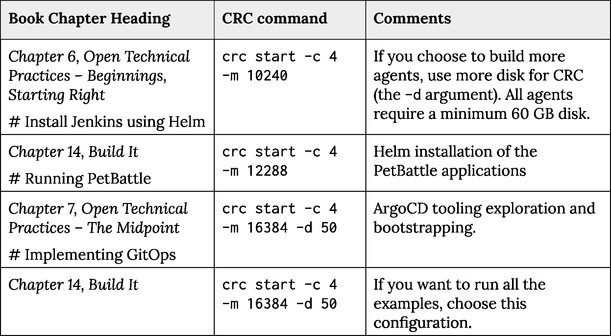

# 附录 A – OpenShift 练习的规模需求


OpenShift 集群支持许多类型的足迹 – 云端、数据中心和本地。您可以通过浏览此链接了解在这些不同环境中安装 OpenShift 的最佳方法：[`cloud.redhat.com/openshift/create/`](https://cloud.redhat.com/openshift/create/)。

*Red Hat 支持*和*社区*版本的 OpenShift 之间存在区别。如果您在做任何工作相关的事情，特别是在企业环境中，强烈建议您获取 Red Hat 版本的全面企业支持。社区版本由开源社区支持，您可以在这里了解更多信息：[`www.okd.io/`](https://www.okd.io/)。

我们已经详细介绍了如何在本地机器上使用**CodeReady Containers**（**CRC**）来开始使用 OpenShift。这里有 CRC 的支持版本，[`cloud.redhat.com/openshift/create/local`](https://cloud.redhat.com/openshift/create/local)，还有社区版本，[`www.okd.io/crc.html`](https://www.okd.io/crc.html)，可供使用。要使用默认设置运行 CRC，请执行以下操作：

```
crc start
```

为了限制使用的系统资源，CRC 并未包含所有 OpenShift 的功能。如果执行本书的技术部分，本地运行 CRC 将需要更长时间。您可能会经常遇到超时情况，并且可能需要*尝试一些命令两次*。因此，请耐心等待，或者考虑使用具有更少资源限制的云托管 OpenShift。如果您有真正的财力用于云托管，或者您拥有可用的虚拟化基础设施，您可以使用二进制安装程序安装 OpenShift 4 集群：

```
openshift-install cluster create
```

这将为您提供一个运行的集群，包含多个主节点和工作节点，并且您可以在安装之前配置不同的选项。在此处阅读文档：[`docs.openshift.com/container-platform/4.7/installing/index.html`](https://docs.openshift.com/container-platform/4.7/installing/index.html)。

CRC 可以使用各种选项启动。重要的是，您可以设置以下内容：

+   `-c, --cpus int`：分配给 OpenShift 集群的 CPU 核心数量（默认值为 4）

+   `-m, --memory int`：分配给 OpenShift 集群的内存量（单位为 MiB，默认值为 9216）

+   `-d, --disk-size uint`：OpenShift 集群使用的总磁盘大小（单位为 GiB，默认值为 31）

您还可以配置 IP 地址 – 查看`crc start --help`获取详细信息。

我们已经使用 CRC 测试了本书中的以下场景，并推荐以下最低规模。如果您在本地有更多资源可用，建议您使用它们！这将改善运行代码时的性能和可用性。



表 A.1：各种书籍场景的最小规模

CRC 被优化为在单台机器上运行，因此默认情况下禁用了指标和监控。可以通过运行以下命令来启用：

```
crc config set enable-cluster-monitoring true
```

请注意，您需要比上面列出的更多内存才能运行监控栈、CI/CD 和 PetBattle。有关 CRC 的完整文档、选项和故障排除，请参见[`code-ready.github.io/crc/`](https://code-ready.github.io/crc/)。

### 如何调整 CRC 虚拟机中的存储大小

要扩展镜像磁盘大小，您需要停止并重新启动 CRC 以正确调整镜像磁盘的大小。这似乎是 CRC 的一个 bug/问题。 [1][2]

在 Linux 上，执行以下操作来调整磁盘大小：

```
$ crc start -c 4 -m 16384 -d 50
```

```
$ CRC_MACHINE_IMAGE=${HOME}/.crc/machines/crc/crc.qcow2
```

```
$ crc stop
```

```
$ cp ${CRC_MACHINE_IMAGE} ${CRC_MACHINE_IMAGE}.ORIGINAL
```

```
$ virt-resize --expand /dev/vda4 \
```

```
$ {CRC_MACHINE_IMAGE}.ORIGINAL ${CRC_MACHINE_IMAGE}
```

```
$ rm -f ${CRC_MACHINE_IMAGE}.ORIGINAL
```

```
crc start -c 4 -m 16384 -d 50
```

### Tekton 持久存储

根据您的环境，OpenShift 集群中可用的存储类类型会有所不同。

### CRC 特定事项

目前，OpenShift 中有两个 Kustomize 覆盖层用于`PersistentVolumeClaims`。这是因为在每个环境中都有不同的存储类可用。在*第七章*，*开放技术实践—中点*中，我们使用 ArgoCD 引导工具。需要通过更改以下注释行来相应地设置 Ubiquitous Journey 文件`tekton/kustomization.yaml`：

```
apiVersion: kustomize.config.k8s.io/v1beta1
```

```
kind: Kustomization
```

```
bases:
```

```
- persistent-volume-claims/aws
```

```
# - persistent-volume-claims/crc
```

```
- rolebindings
```

```
- tasks
```

```
- pipelines
```

```
- templates
```

```
- triggers
```

1 [`access.redhat.com/solutions/4969811`](https://access.redhat.com/solutions/4969811)

2 [`github.com/code-ready/crc/issues/127`](https://github.com/code-ready/crc/issues/127)

### 云特定事项

在 AWS 中，我们使用`aws-efs`（[`docs.openshift.com/container-platform/4.4/storage/persistent_storage/persistent-storage-efs.html`](https://docs.openshift.com/container-platform/4.4/storage/persistent_storage/persistent-storage-efs.html)）进行 RWX 存储。更新版的 EFS 驱动程序正在开发中。如果您的环境中没有这个驱动程序，您仍然可以运行示例，但如果并行运行，可能无法正常执行所有流水线任务。

编辑`tekton/persistent-volume-claims`文件，使用您集群中可用的存储类（例如，AWS 中默认是 gp2）。您可以通过运行以下命令来查找存储类名称：

```
oc get storageclass 
```
