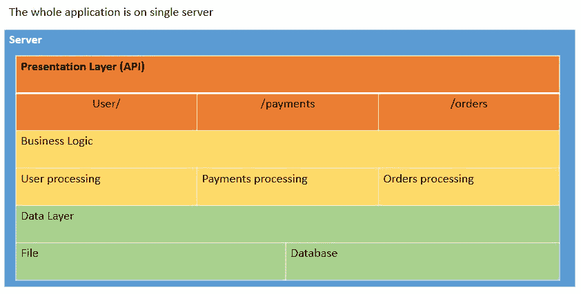
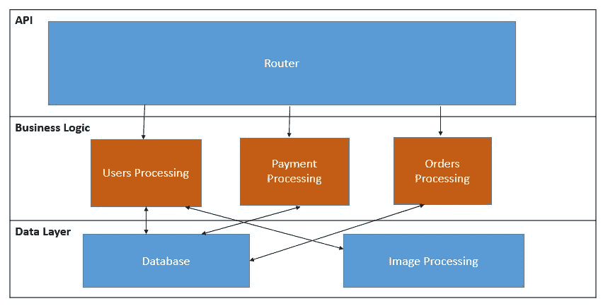
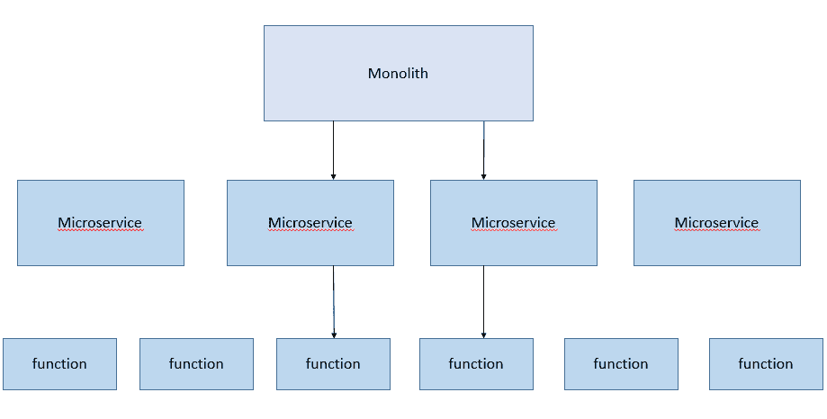

# 第一章：引入无服务器架构

本书将带我们进入无服务器信息技术的世界，了解多个不同的云服务提供商，如 AWS、Azure、Google、OpenWhisk 和其他一些服务。我们将详细介绍每个云服务，并探讨将 DevOps 应用于这些服务的不同方法。我们将研究不同的使用案例，并学习每个案例的最佳实践。

本介绍章节将涵盖以下主题：

+   无服务器简介

+   核心概念

    +   **后端即服务** (**BaaS**)

    +   **功能即服务** (**FaaS**)

    +   AWS Lambda

    +   Azure Functions

    +   Google Functions

    +   OpenWhisk

+   无服务器的优缺点

+   DevOps 与无服务器架构

# 无服务器简介

当我们听到“**无服务器**”这个词时，第一个想到的可能是，*哦，我的代码将在没有任何服务器的情况下自动运行！* 从某种程度上来说，这个想法是正确的：无服务器架构是一种将代码部署到云端并自动执行的过程，用户无需担心底层基础设施、租赁或购买服务器、扩展、监控或容量规划。服务提供商会负责所有这些事情。而且，你不会相信它是多么便宜，管理起来又是多么轻松。现在，你可能在想，*这怎么可能呢？* 为了更详细地了解它的工作原理，让我们将无服务器架构与我们日常生活中的一件事进行对比。

无服务器架构有点像处理我们的洗衣服。我们都需要洗衣服，为此，我们需要购买一台洗衣机。但是，这台洗衣机每周的使用时间大约只有 10 到 15 个小时，其余时间它将处于空闲状态。有趣的是，我们购买服务器来托管我们的应用程序，而大部分时间，服务器在等待请求时处于空闲状态，未被使用。我们拥有大量的服务器，但它们很少被管理或淘汰。由于这些服务器没有得到正确的使用或管理，导致电力供应、容量、存储和内存等资源被浪费。

此外，在洗衣服时，洗衣机只能承受一定的负载和容量。同样，服务器也有类似的限制：它们也只能承载一定的负载和流量。负载或流量越大，处理速度可能会变慢，甚至可能完全停止。现在，为了应对额外的负载，我们可能会决定购买一台更大的洗衣机，这样可以处理更多的衣物，支持更大的负载。但同样，这台高端机器在我们洗大量衣物或只洗一件衣物时，都将消耗相同的资源，这是浪费。同样，在服务器的类比中，当我们需要应对更高流量或请求时，我们可能会购买一台高端服务器。但是，即使是高端服务器，我们每天处理 10 个请求与处理 10,000 个请求时，所消耗的资源是一样的。

此外，要使用洗衣机，我们需要在洗衣前分开衣物，选择程序，添加洗衣液和柔顺剂，如果这些操作不当，可能会弄坏衣物。同样，在使用服务器时，我们也必须确保安装正确的软件——以及正确的软件版本——确保其足够安全，并且始终监控服务是否正常运行。

此外，如果你租的是公寓，可能没有洗衣机，或者你可能会发现当你批量洗衣时，自助洗衣店会更便宜，也更省心。所以你可以根据需要租用自助洗衣店或投币式洗衣机。同样，许多公司，如 AWS、Azure 或 Google，最初也是通过租用服务器起步的。所以我们也可以租用服务器，提供商会负责存储、内存、电力和基本设置。

假设我们决定使用本地自助洗衣店的投币式洗衣机作为最佳选择。现在我们只需要投币洗衣，但我们仍然需要确保添加洗衣液和柔顺剂，并设置正确的程序，否则我们会弄坏衣物。同样，当我们在云上租用服务器时，可能不需要处理电力、存储和内存问题，但我们仍然需要安装所需的软件，监控应用服务，定期升级软件版本，并监控应用性能。

假设我找到了一家新的自助洗衣店，这家店提供送货服务，并按每件衣物收费，所以我可以一次送一批衣物或单件衣物。它们还会为我洗衣并熨烫衣物。现在，我不需要担心使用哪种洗衣液或柔顺剂，也不需要担心选择什么清洗程序，甚至不需要拥有熨斗。但在信息技术的世界中，许多公司仍然在使用租赁的投币式洗衣机系统。它们仍然租用服务器并通过**平台即服务**（**PaaS**）进行管理，仍然需要管理应用程序的停机时间，升级软件版本，并监控服务。

但通过采用无服务器的方法，这一切都可以改变。无服务器计算将自动配置服务器并执行代码。随着流量的增加，它将自动扩展，提供所需的资源，一旦流量减少，它也会缩减规模。

# 核心概念

在早期，“*无服务器*”一词指的是依赖第三方应用或服务来管理服务器端逻辑的应用。这些应用通常是基于云的数据库，如 Google Firebase，或者是身份验证服务，如 Auth0 或 AWS Cognito。它们被称为**Backend as a Service**（**BaaS**）服务。但“无服务器”也意味着代码是为事件触发而开发的，并且在无状态的计算容器中执行。这种架构通常被称为**Function as a Service**（**FaaS**）。让我们更详细地了解一下每种类型的服务。

# Backend as a Service

BaaS 的概念是由 Auth0 和 Google Firebase 提出的。Auth0 最初作为身份验证即服务（authentication as a service）起步，但后来转向了 FaaS。因此，BaaS 本质上是通过第三方服务来实现我们所需的功能，它为应用的实现提供了服务器端逻辑。

常见的做法是，大多数 Web 和移动应用开发者会自己编写身份验证功能，如登录、注册和密码管理，并且每个服务都有自己的 API，需要将其集成到应用中。但这对开发者来说既复杂又耗时，而 BaaS 提供商通过提供统一的 API 和 SDK，帮助开发者将它们与应用前端连接，从而省去了开发自己的后端服务的麻烦。这样就节省了时间和金钱。

例如，假设我们想要构建一个门户网站，该网站需要进行身份验证才能使用我们的服务。我们需要设置登录、注册和身份验证系统，并且我们还需要让消费者能够通过简单的一键操作，使用他们现有的 Google、Facebook 或 Twitter 账户进行登录。单独开发这些功能需要大量的时间和精力。

但是通过使用 BaaS，我们可以轻松地将我们的门户网站与 Google、Facebook 或 Twitter 账户进行集成，实现注册和身份验证。另一个 BaaS 服务是由 Google 提供的 Firebase。Firebase 是一个数据库服务，广泛应用于移动应用，它减少了数据库管理的开销，并且为不同类型的用户提供授权。简而言之，这就是 BaaS 的工作原理。接下来，让我们来看一下无服务器架构中的 FaaS 部分。

# Function as a Service

如本章开头所提到的，FaaS 本质上是一个执行小任务的程序或功能，这些任务由事件触发，与一个执行多种功能的单体应用不同。因此，在 FaaS 架构中，我们将应用拆分成小的、独立的程序或功能，而不是运行在 PaaS 上的、执行多个功能的单体应用。例如，API 中的每个端点都可以是一个单独的函数，我们可以根据需求运行这些函数，而不是一直运行整个应用。

常见的做法是将 API 编码为多层架构，类似三层架构，将代码分解为表示层、业务层和数据层。所有路由都会触发业务层中的相同处理函数，数据将被处理并发送到数据层，该数据层通常是数据库或文件。下图显示了这种三层架构：

对于少量同时用户，这种方式可能工作正常，但当流量呈指数级增长时，我们该如何管理呢？此时，应用将突然成为计算噩梦。因此，理想情况下，我们可以将包含数据库的数据层分离到独立的服务器中来解决这个问题。但是问题依然没有解决，因为 API 路由和业务逻辑仍然在同一个应用中，因此扩展仍然是一个问题。

对于相同的问题，采用无服务器的方法则更加轻松。与其为应用 API 端点和业务逻辑设置一个服务器，不如将应用程序的每个部分拆解成独立的、自动扩展的函数。开发人员编写一个函数，随后无服务器提供商将该函数封装到一个容器中，容器可以在任意数量的服务器上进行监控、克隆和分发，如下图所示：

将应用程序拆分成函数的好处在于，我们可以分别扩展和部署每个函数。例如，如果我们的 API 中某个端点接收到 90%的流量，或者我们的图像处理代码占用了大部分计算时间，那么这个函数或代码片段比扩展整个应用程序更容易进行分发和扩展。

在 FaaS 系统中，函数预计能够在毫秒级别内启动，以便处理单个请求。相比之下，在 PaaS 系统中，通常有一个应用线程，它会长时间运行，并处理多个请求。FaaS 服务按函数的执行时间收费，而 PaaS 服务则按运行服务器应用程序的线程时间收费。

在微服务架构中，应用程序是松散耦合的、精细化的、轻量级的。微服务诞生的原因是将单体应用拆分为小型服务，以便可以独立开发、管理和扩展。但是 FaaS 进一步将这一概念推向了更小的单元，称为函数。

趋势非常明显：工作单元变得越来越小。我们正从单体应用转向微服务，再到现在的函数，如下图所示：

随着容器的兴起，许多云服务商意识到无服务器函数架构将为开发者提供更好的灵活性，让他们构建应用程序时无需担心运维（操作）。AWS 是第一个推出这一服务的公司，命名为 Lambda，之后其他云服务提供商也跟随这一趋势，比如微软 Azure 推出了 Azure Functions，谷歌云推出了 Google Functions。但这一流行趋势也为一些供应商提供了机会，他们开始构建开源版本。一些流行的版本包括 IBM 的 OpenWhisk（基于 Apache 许可），Kubeless（基于 Kubernetes 构建）以及 OpenFaaS（基于 Docker 容器构建）。甚至 Oracle 也加入了这一行列，推出了 Oracle Fn。本章我们将简要介绍每个供应商，了解他们的工作原理。接着，在接下来的书籍中，我们将与这些供应商一起探索他们的 DevOps 方法。

# AWS Lambda

**亚马逊网络服务** (**AWS**) 是首个在 2014 年推出 FaaS 或无服务器服务的公司，命名为 Lambda。如今，他们是这一类无服务器服务的领导者。AWS Lambda 采用事件驱动的方法。当事件触发时，Lambda 执行代码并完成所需功能，并且能够在流量增加时自动扩展，流量减少时自动缩减。Lambda 函数根据事件触发运行，例如对 Amazon S3 存储桶中数据的更改、对 Amazon DynamoDB 表的更改，或响应通过 AWS API Gateway 发出的 HTTP 请求。正是通过这种方式，Lambda 帮助构建多个服务的触发器，如 S3、DynamoDB 和 Kinesis 中的流数据存储。

所以，Lambda 帮助开发者只需关注编码——计算部分，如内存、CPU、网络和空间，由 Lambda 自动处理。它还会自动管理函数的修补、日志记录和监控。从架构上讲，Lambda 函数在一个容器中被调用，该容器是基于提供的配置启动的。这些容器可能会被复用来处理后续的函数调用。当需求减少时，容器会被停用，但这一切都由 Lambda 内部管理，因此用户无需担心，因为他们无法控制这些容器。AWS Lambda 函数支持的语言有 Node.js、Java、C# 和 Python。

在构建无服务器应用时，核心组件是函数和事件源。事件源是 AWS 服务或自定义应用程序，而 Lambda 函数处理这些事件。每个 Lambda 函数的执行时间为 300 秒。

让我们来看一个 AWS Lambda 实际运作的示例。在一个照片分享应用中，用户上传照片，这些照片需要生成缩略图，以便在用户的个人主页上展示。在这种情况下，我们可以使用 Lambda 函数来创建缩略图，这样一旦照片被上传到 AWS S3 存储桶中，支持事件源的 S3 就可以发布对象创建事件并调用 Lambda 函数。Lambda 函数的代码从 S3 存储桶中读取最新的照片对象，创建一个缩略图版本，并将其保存到另一个 S3 存储桶中。

在 第三章，*将 DevOps 应用到 AWS Lambda 应用程序*，我们将探讨如何以自动化的方式创建、运行和部署 Lambda 函数，同时通过日志监控和进行根本原因分析。

# Azure Functions

**Azure Functions** 是微软进入无服务器架构的一个尝试。它于 2016 年 3 月上线。Azure Functions 允许使用 C#、F#、PHP、Node.js、Python 和 Java 编写函数。Azure Functions 还支持 bash、batch 和 PowerShell 文件。Azure Functions 与 **Visual Studio Team System** (**VSTS**)、Bitbucket 和 GitHub 无缝集成，这将使得持续集成和持续部署变得更加容易。Azure Functions 支持多种类型的事件触发器、基于时间的任务事件、OneDrive 和 SharePoint，可以配置为触发函数中的操作。实时处理数据和文件增加了操作无服务器机器人的能力，该机器人使用 Cortana 提供信息。微软还推出了 **Logic Apps**，这是一种带有工作流编排引擎的工具，可以让技术不太熟练的用户构建无服务器应用。Azure Functions 允许在其他 Azure 云服务和 HTTP 请求中创建触发器。每个函数的最大执行时间为五分钟。Azure Functions 提供两种类型的应用服务计划：**动态** 和 **经典**。**应用服务** 是一个容器或环境，用于运行一组 Azure 函数。动态选项类似于 Lambda，我们为函数运行时使用的时间和内存付费。经典选项是为函数分配您现有或预配置的应用资源，而无需额外费用。分配的内存按照应用服务进行，而在 AWS Lambda 中，内存分配是按每个函数来计算的。Azure Functions 允许每个函数最多 10 个并发执行。

Azure Functions 的定价模型与 AWS Lambda 类似。总费用是基于触发器执行的次数和时间来计算的。因此，前一百万次请求是免费的，超过这一数量后，每执行 100,000 次将收费 0.02 美元。

我们将在第四章中讨论自动化部署 Azure Functions，*DevOps 与 Azure Functions*，并探讨不同的 DevOps 过程如何适应，以加速 Azure Functions 的市场发布速度。

# Google Functions

与 AWS Lambda 和 Azure Functions 相比，Google 进入这一领域稍晚一些。它们在 2017 年 3 月发布了 Cloud Functions 的 beta 版本。目前，我们可以通过 Node.js 编写 Google Functions；它们很快将支持其他语言。Google Functions 支持内部事件总线触发器和 HTTP 触发器，响应诸如 GitHub WebHooks、Slack 或任何 HTTPS 请求等事件，还支持 Firebase 分析、实时数据库等来自移动端的事件。

在可扩展性方面，Google Functions 内置了自动扩展功能。Google Functions 支持每个项目最多 1,000 个函数，并允许每个函数执行 400 次，据称这是一个软性限制。Google Functions 允许执行时间为 540 秒（9 分钟）。支持通过 ZIP 上传、云存储和云存储库进行部署。事件源通过云 Pub/Sub 或云存储对象进行。函数执行的日志管理通过 Stackdriver logging 来实现，这是 Google Cloud 的日志工具。

我们将在第五章中深入探讨 Google Functions 的 DevOps 方法，*将 DevOps 与 IBM – OpenWhisk 集成*，并讨论使用 Google Functions 的 DevOps 最佳实践。

# OpenWhisk

**OpenWhisk** 是一个开源的 FaaS 平台，可以部署到云端或本地数据中心。它由 IBM 推动，并且通过 Apache 许可证进行了开源。我们可以通过 **Bluemix**（Bluemix 是 IBM 的云平台）注册 OpenWhisk，或者通过 vagrant 在本地设置。它的工作方式与任何 FaaS 技术类似，比如 AWS Lambda、Azure Functions 或 Google Functions。但 OpenWhisk 支持开放事件提供者。如果我们有自定义事件提供者，可以将其与 OpenWhisk 集成，因为与其他云平台不同，OpenWhisk 允许其服务内的事件。例如，可以通过 OpenWhisk 在 RSS feed 中出现新条目时触发函数。OpenWhisk 还允许组织在其内部设置自己的 FaaS 平台，如果他们不愿意让数据离开组织。OpenWhisk 支持的语言有 Swift、JavaScript 和 Node.js。OpenWhisk 集成了 Docker 支持，用于函数内部二进制代码的执行。

# 其他无服务器架构

还有许多其他无服务器选项，如 OpenFaaS、Fission 和 Iron.io。我在本书中不会详细讨论它们，但我们可以浏览它们的功能。**OpenFaaS**是无服务器架构的一个开源替代方案。它建立在 Docker 容器、Swarm 和 Kubernetes 之上。它有自己的 UI 门户，还支持 CLI 来部署函数。OpenFaaS 支持 Node.js、Python、Go 和 C#，并且可以在 Windows 和 Linux 上运行。我们可以将它部署在云端、本地笔记本电脑或本地服务器上。我们几乎可以为所有事情编写函数——这是 OpenFaaS 的承诺。OpenFaaS 是用 Golang 编写的。它允许通过 HTTP/HTTPS 请求来触发事件。

**Fission**是另一种开源的无服务器架构——其底层技术是 Kubernetes 和 Docker 容器，可以在云端和本地基础设施上部署。它被设计为一组微服务，其组件包括控制器、路由器和池管理器。路由器管理 HTTP 请求，控制器管理函数、事件触发器和环境镜像，池管理器管理容器池并将函数加载到这些容器中。函数是用 Python 编写的。

# 无服务器架构的好处

使用无服务器架构有很多优缺点。我们先来看看其中的亮点。为什么有人会选择使用 AWS Lambda 或 OpenWhiz 等无服务器架构来构建他们的应用？主要原因是应用的高效性、快速扩展的能力，以及最重要的，它的成本。让我们先来看几个重要的优点，然后再讨论缺点。

# 更快的市场推出时间

我们可以更快地将应用推向市场，因为 OPS 变得更加简化，这将帮助开发者专注于他们的开发工作。OPS 团队无需再为编写可以处理扩展的代码或担心底层基础设施而烦恼。

此外，团队可以借助第三方集成（如 OAuth、Twitter 和地图等 API 服务）更快地构建应用。

# 高度可扩展

每个公司都希望他们的应用表现更好、实现零停机时间，并能够随着流量的增加快速而轻松地扩展，但对于单体应用开发来说，这可能变得非常困难。随着应用负载的增加，Ops 团队必须时刻关注底层基础设施的扩展。由于流量激增而导致的停机时间浪费了大量的时间和资金。而无服务器计算具有高度可扩展性，应用可以在几秒钟内进行扩展和缩减。

# 低成本

在无服务器计算中，开发人员仅为函数运行时计费，不像 IaaS 和 PaaS 那样对每个服务器进行 24/7 计费。这对那些拥有大量应用、API 或微服务的公司来说非常有利，这些公司目前 24 小时全天候运行，并且始终使用资源，无论是否需要。但通过无服务器，我们可以根据需要执行函数并共享资源，从而减少空闲时间，并且仍然使应用运行得更快，而不是让应用全天候运行。

# 延迟和地理位置改善

应用的可扩展性取决于三个因素：用户数量、用户位置和网络延迟。在今天的世界里，应用拥有全球用户，这可能会增加延迟。但通过无服务器平台，这种延迟的风险可以得到有效缓解。使用无服务器时，每次事件调用时会实例化一个容器来运行一个函数，这个容器可以创建在离用户地理位置较近的地方，从而自动提高应用的性能。

# 无服务器的缺点

尽管使用无服务器有好处，但也有缺点。让我们来看一下无服务器功能的另一面。

# 复杂性增加

我们在应用中越细化，复杂性就越高。每个函数的代码可能会更简洁，但整个应用会变得更复杂。例如，假设我们将应用拆分成 10 个不同的微服务。我们需要管理 10 个不同的应用，而在单体应用中，只需管理一个应用。

# 工具缺乏

假设我们将单体应用拆分成 50 个不同的函数。我们仍然需要管理、记录、监控和部署这些单体应用，并且有多种过程和工具需要处理。由于无服务器技术在市场上还比较新，当前监控或记录一个只运行几秒钟的应用是有限且具有挑战性的，但随着时间的推移，会有许多高效的方式来解决这个问题。

# 架构的复杂性

很难决定函数应该有多细化，而且评估、实施和测试以检查我们的偏好是非常耗时的。管理过多的函数会变得繁琐，而忽视细化则会导致我们建立迷你单体应用。

# 实现中的缺点

使用无服务器的最大挑战是集成测试。我们将为一个应用编写许多函数，但如何将它们集成在一起作为一个应用运行呢？当然，在此之前，如何测试它们协同工作的效率呢？由于无服务器是新的且仍在成熟过程中，测试过程中添加的选项仍然有限。但在未来的章节中，我们将涵盖部署和测试的几个方面。

# 无服务器与 DevOps

**DevOps**是另一个流行了很长时间的术语。像无服务器一样，DevOps 也是一个令人困惑的术语。许多人对 DevOps 有不同的看法。有些人认为 DevOps 只是工具，有些人认为 DevOps 由几个过程组成——甚至 IaaS 和 PaaS 也属于 DevOps 的范畴。根据我的理解，DevOps 是工具、过程和反馈的协作，它们共同推动 DevOps 的成功实施。但是，为什么我们要在这里谈论 DevOps 呢？简而言之，因为我们需要 DevOps 来顺利过渡到生产环境，记录或监控无服务器函数，并在它们到达用户之前进行测试。

从 DevOps 的功能角度来看，我将涵盖版本控制、持续集成、持续部署、监控和日志记录，适用于 AWS Lambda 函数、Azure Functions、Google Functions 和 OpenWhiz。版本控制是一个管理代码版本的过程，使我们能够进行分支、打包、部署，同时也能回滚到先前的版本。持续集成是开发人员通过自动化构建将代码集成在一起，以便及早发现和解决问题的做法。持续部署本质上是一个管道，代码通过自动化测试不断精炼，然后被部署到环境中。这个管道平稳地向生产环境推进，手动干预最小化。

# 总结

我们将在下一章评估几种无服务器框架，并在本书中通过各种 DevOps 实施教程使用其中一个。在这些 DevOps 实施中，我们将使用一些更流行的 DevOps 工具，比如用于协调的 Jenkins 和用于版本管理的 GitHub。我们还将涉及自动化单元测试、集成测试和系统测试。我们还将关注监控和日志记录的最佳实践，以及更多 DevOps 过程和特性。
