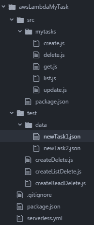
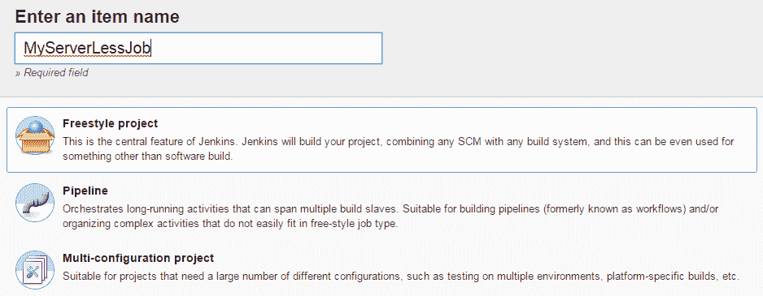
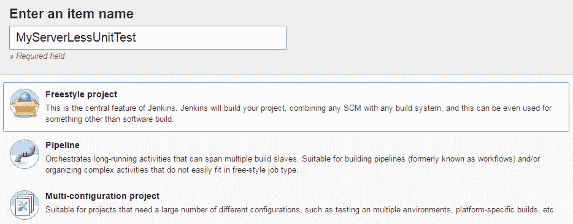

# 第三章：将 DevOps 应用到 AWS Lambda 应用程序

我们简要回顾一下关于 AWS Lambda 函数的内容。亚马逊网络服务是第一个推出无服务器计算模块 Lambda 的网络服务平台，Lambda 函数是用 **Lambda 函数** 编写的。Lambda 函数是无状态的，并且与底层基础设施没有依赖关系。Lambda 函数是响应事件执行的，这些事件可能是一个 HTTP 请求、S3 桶中的数据变化、DynamoDB 表的变化，或者 Kinesis 或 SNS 的变化。Lambda 函数会在事件发生时快速复制，并且在事件数量减少时会缩减规模。

在本章中，我们将介绍部署 Lambda 函数的各种方法，探讨如何轻松地将其部署到多个环境，进行单元测试、系统测试和集成测试。我们还将学习各种部署最佳实践，并通过几个示例来演示这些最佳实践。我们将看到如何管理 AWS Lambda 日志，并将其移到 ELK 堆栈中。

在本章中，我们将探讨以下主题：

+   手动部署 Lambda 函数

+   使用 DevOps 的 AWS Lambda

+   使用 CodeStar 的无服务器架构

+   使用 AWS Lambda 进行蓝绿部署

+   使用 Serverless Framework 的 GitHub 和 Jenkins 管道

+   为无服务器应用程序设置 Jenkins

+   对已部署应用程序进行单元测试

+   将 CloudWatch 与 ELK 集成

我将创建一个简单的应用程序，这是我们日常工作中使用的应用程序。该应用程序是一个缩略图创建器，使用的是 Node.js 应用程序，涉及两个 S3 桶。一个桶用于上传实际的图像，另一个用于存放缩略图。当一张图片上传到图像桶时，会触发一个事件，调用一个函数来调整图片大小并将其上传到缩略图桶中。我们首先看看如何手动执行这一系列事件，然后学习如何通过自动化部署过程来简化这个过程。在 DevOps 相关部分，我们将讨论如何搭建开发环境、自动化测试与部署、应用 CI/CD 管道、日志记录和监控。

# 手动部署 Lambda 函数

我们将在此处使用的 Node.js Lambda 应用程序已经是 AWS 教程的一部分。我们将学习如何通过 AWS 门户创建、部署和执行 Lambda 应用程序。本教程的前提是你拥有一个 AWS 账户；在本章中我们将使用 AWS 免费订阅。下一步是设置 AWS CLI。

你可以通过以下链接创建 AWS 免费账户并设置 AWS CLI：

[`portal.aws.amazon.com/billing/signup#/start`](https://portal.aws.amazon.com/billing/signup#/start)

[`docs.aws.amazon.com/cli/latest/userguide/cli-chap-welcome.html`](https://docs.aws.amazon.com/cli/latest/userguide/cli-chap-welcome.html)

请按照以下步骤操作：

1.  在 AWS 账户和 CLI 设置好后，登录 AWS 控制台 ([`aws.amazon.com/console/`](https://aws.amazon.com/console/))，然后我们将通过登录您的 AWS 账户创建名为 `adminuser` 的 IAM 用户，您可以点击 IAM 链接或通过服务搜索该链接：


1.  然后，我们点击左侧的 Users 链接，打开一个新页面。接着点击 Add User，添加一个名为 adminuser 的用户，并选择两种访问类型：编程访问（Programmatic access）和 AWS 管理控制台访问（AWS Management Console access）。在控制台的密码字段中，输入自定义密码，取消勾选“需要重置密码”复选框，然后点击 Next:Permissions。接下来，我们点击 Create Group 按钮来创建一个新组。我们将该组命名为 `administrators`。然后，勾选 AdminstrativeAccess 复选框，为该组提供完全访问权限，然后点击 Create Group。现在，我们已经创建了一个组，点击 Next:Review。接下来，我们将审核该用户，确保该用户已被添加到管理员组中。然后点击 Create User 按钮。一旦用户创建完成，我们应该能在列表中看到该用户，如下图所示：


我们为教程创建了一个具有管理员权限的用户，但在实际操作中，出于安全考虑，角色和策略会更加受限。

1.  我们需要在 AWS S3 中创建两个桶。这些桶需要通过 `adminuser` 登录创建，因此我们需要使用刚才创建的新用户登录到 AWS 控制台。点击 adminuser 并选择 Security credentials 选项卡。接下来，复制控制台 URL 以进行登录，然后在新的浏览器标签页中打开它。输入我们刚才创建的新用户的用户名和密码，点击 Sign In 登录。一旦登录，搜索 AWS 服务中的 S3。然后进入 S3 控制台管理，点击 Create bucket 按钮，如下图所示：


默认情况下，我们将添加一个唯一的桶和区域名称，区域为美国东部。两个桶的名称应分别为 `Source` 和 `SourceResized`。`Source` 是占位符名称，应替换为实际的桶名称——例如，`my-image-bucket76` 和 `my-image-bucket76resized`**。**因此，`my-image-bucket76` 将是源桶，而 `my-image-bucket76resized` 将是目标桶，如下图所示：


桶名称必须唯一，因为 AWS 只允许使用全局唯一的桶名称。

1.  一旦两个存储桶都成功创建，我们可以上传一张图片，让 Lambda 函数进行调整大小，并将其推送到调整后的存储桶。让我们将一张 JPG 图片上传到 `my-source-bucket76` 存储桶中。点击存储桶名称，然后上传一张图片到这个存储桶。这样会将您重定向到存储桶页面。点击上传按钮，然后会弹出一个窗口。接着，选择“添加文件”以浏览本地目录中的图片文件，并将图片上传到 S3 存储桶中。

1.  下一步是创建一个 Lambda 函数并手动运行它。在这里，我们首先需要按照三个步骤创建部署包，然后创建执行角色（IAM 角色）和 Lambda 函数并进行测试。部署包是一个 ZIP 文件，包含 Lambda 函数及其依赖项：

    +   让我们创建一个部署包。我将使用 Node.js 作为此实践应用的语言，但我们也可以使用 Java 和 Python（这取决于开发人员的偏好）。

    +   创建此部署包的前提是您的本地环境中安装了 Node.js 6.0 或更高版本（[`nodejs.org/en/download/`](https://nodejs.org/en/download/)）。您还应确保已安装 npm。

    +   然后按照以下步骤进行操作。我们将下载用于 Node.js Lambda 函数的图像调整大小的 npm 库，使用以下两个命令中的第一个。第二个命令将下载所需的库：

```
$ mkdir tutorial1; cd tutorial1 $ npm install async gm
```

+   +   打开您最喜欢的编辑器，并将以下脚本复制到名为 `CreateThumbnails.js` 的文件中：

```
// dependencies
var async = require('async');
var AWS = require('aws-sdk');
var gm = require('gm')
            .subClass({ imageMagick: true }); // Enable ImageMagick integration.
var util = require('util');
// constants
var MAX_WIDTH  = 100;
var MAX_HEIGHT = 100;
// get reference to S3 client
var s3 = new AWS.S3();
exports.handler = function(event, context, callback) {
    // Read options from the event.
    console.log("Reading options from event:\n", util.inspect(event, {depth: 5}));
    var srcBucket = event.Records[0].s3.bucket.name;
    // Object key may have spaces or unicode non-ASCII characters.
    var srcKey    =
    decodeURIComponent(event.Records[0].s3.object.key.replace(/\+/g, " ")); 
    var dstBucket = srcBucket + "resized";
    var dstKey    = "resized-" + srcKey;
```

您可以在 [`gist.github.com/shzshi/6e1cf435a4c1aa979e3a9a243c13c44a`](https://gist.github.com/shzshi/6e1cf435a4c1aa979e3a9a243c13c44a) 找到 `CreateThumbnails.js` 的要点。

+   +   作为基本检查，请验证源和目标是否是不同的存储桶：

```
    if (srcBucket == dstBucket) {
       callback("Source and destination buckets are the same.");
        return;
    }
```

+   +   推断图片类型：

```
var typeMatch = srcKey.match(/\.([^.]*)$/);
    if (!typeMatch) {
        callback("Could not determine the image type.");
        return;
    }
    var imageType = typeMatch[1];
    if (imageType != "jpg" && imageType != "png") {
        callback('Unsupported image type: ${imageType}');
        return;
    }
```

+   +   从 S3 下载图片，进行转换，并上传到另一个 S3 存储桶：

```
async.waterfall([
        function download(next) {
            // Download the image from S3 into a buffer.
            s3.getObject({
                    Bucket: srcBucket,
                    Key: srcKey
                },
                next);
            },
        function transform(response, next) {
            gm(response.Body).size(function(err, size) {
```

+   +   推断缩放因子，以避免不自然地拉伸图片：

```
var scalingFactor = Math.min(
                    MAX_WIDTH / size.width,
                    MAX_HEIGHT / size.height
                );
                var width  = scalingFactor * size.width;
                var height = scalingFactor * size.height;
```

+   +   在内存中转换图片缓冲区：

```
this.resize(width, height)
                    .toBuffer(imageType, function(err, buffer) {
                        if (err) {
                            next(err);
                        } else {
                            next(null, response.ContentType, buffer);
                        }
                    });
            });
        },
        function upload(contentType, data, next) {
```

+   +   将转换后的图片流式传输到另一个 S3 存储桶：

```
s3.putObject({
                    Bucket: dstBucket,
                    Key: dstKey,
                    Body: data,
                    ContentType: contentType
                },
                next);
            }
        ], function (err) {
            if (err) {
                console.error(
                    'Unable to resize ' + srcBucket + '/' + srcKey +
                    ' and upload to ' + dstBucket + '/' + dstKey +
                    ' due to an error: ' + err
                );
            } else {
                console.log(
                    'Successfully resized ' + srcBucket + '/' + srcKey
+
                    ' and uploaded to ' + dstBucket + '/' + dstKey
                );
            }
            callback(null, "message");
        }
    );
};
```

现在我们应该能在 `tutorials1` 文件夹中看到两个项目，即 `CreateThumbnail.js` 和 `node_modules` 文件夹。我们将所有这些文件压缩成一个名为 `tutorialsimg.zip` 的文件。这将是我们的 Lambda 函数部署包：

```
$ cd tutorials1
$ zip -r ../tutorialsimg.zip *
```

1.  接下来，我们将在 IAM 中创建 Lambda 函数的执行角色。登录到 AWS 控制台，搜索 IAM 服务，然后进入 IAM 并点击“角色”按钮。点击“创建角色”，选择“AWS 服务”，然后选择 Lambda 作为服务。然后点击“下一步：权限”按钮。接着在策略类型框中搜索 AWSLambda，并勾选 AWSLambdaExecute 复选框。然后搜索 AmazonS3FullAccess 并选择它。然后点击“下一步：审查”按钮。接着，在创建角色页面中，添加角色名称 myLambdaRole，添加描述，然后点击“创建角色”。现在我们拥有了包含可以用于执行 Lambda 函数的策略的角色，以便对 S3 存储桶的内容进行更改。

1.  下一步是在 AWS Lambda 门户上部署 Lambda 函数和节点模块。我们首先进入 AWS 控制台首页，在服务下搜索 Lambda。我们将被重定向到 Lambda 首页。点击“创建函数”，然后在函数信息部分选择“从头开始编写”。我们将函数命名为`myfirstLambdafunction`，运行时选择**Node.js 6.10**。选择现有角色名称为 myLambdaRole 并点击“创建函数”。现在我们将被重定向到 Lambda 函数设计页面。我们将把 Lambda 函数上传到门户。稍微向下滚动，进入“函数代码”部分，然后选择代码输入类型为**上传 .ZIP 文件**，运行时为 Node.js 6.10，并在处理程序字段中输入文本`CreateThumbnail.handler`。现在点击上传按钮，选择名为 tutorialsimg.zip 的文件并上传。当包成功上传后，我们应该能够在函数编辑器中看到 CreateThumbnail.js 文件和 node_modules 文件夹，如下截图所示：


1.  现在，函数和节点模块已经上传，我们将创建一个事件来触发该函数。如果我们滚动到屏幕的右上角，我们将看到一个下拉菜单出现，我们可以用它来添加事件。选择“配置测试事件**”。** 一个弹出框将出现。为事件命名为`myThumbnailEvent`，并在文本字段中添加以下列出的 JSON 文件。确保将`my-source-bucket76`替换为你的源存储桶名称，将`Baby.jpg`替换为你的图像名称。然后继续点击保存：

    你可以在[`gist.github.com/shzshi/7a498513ae43b6572c219843bbba277d`](https://gist.github.com/shzshi/7a498513ae43b6572c219843bbba277d)找到事件 JSON 文件。

```
{
  "Records": [
    {
      "eventVersion": "2.0",
      "eventSource": "aws:s3",
      "awsRegion": "us-west-2",
      "eventTime": "1970-01-01T00:00:00.000Z",
      "eventName": "ObjectCreated:Put",
      "userIdentity": {
        "principalId": "AIDAJDPLRKLG7UEXAMPLE"
      },
      "requestParameters": {
        "sourceIPAddress": "127.0.0.1"
      },
      "responseElements": {
        "x-amz-request-id": "C3D13FE58DE4C810",
        "x-amz-id-2": "FMyUVURIY8/IgAtTv8xRjskZQpcIZ9KG4V5Wp6S7S/JRWeUWerMUE5JgHvANOjpD"
      },
      "s3": {
        "s3SchemaVersion": "1.0",
        "configurationId": "testConfigRule",
        "bucket": {
          "name": "***my-source-bucket76***",
          "ownerIdentity": {
            "principalId": "A3NL1KOZZKExample"
          },
          "arn": "arn:aws:s3:::***my-source-bucket76***"
        },
        "object": {
          "key": "***Baby.jpg***",
          "size": 1024,
          "eTag": "d41d8cd98f00b204e9800998ecf8427e",
          "versionId": "096fKKXTRTtl3on89fVO.nfljtsv6qko"
        }
      }
    }
  ]
}
```

1.  现在我们已经部署了这个功能，并创建了 S3 存储桶和事件。接下来让我们调用这个功能，看看源存储桶中的图像是否被调整大小并推送到调整大小后的 S3 存储桶。为此，请点击“测试”。我们应该能在日志中看到该功能已经成功执行（如下所示的日志文本）。如果你刷新调整大小后的 S3 存储桶，你应该能看到已调整大小的图像文件。你可以直接下载调整大小后的文件，查看调整大小是否成功。我们还可以添加 S3 上传触发器，在任何图像文件上传到源 S3 存储桶时自动触发 `CreateThumbnail` 函数。

eTag: 'd41d8cd98f00b204e9800998ecf8427e'，versionId: '096fKKXTRTtl3on89fVO.nfljtsv6qko' } } } ] } 2018-06-14T21:07:25.469Z ea822830-7016-11e8-b407-9514918aacd8

成功调整大小了 my-source-bucket76/Baby.jpg 并上传至 my-source-bucket76resized/resized-Baby.jpg END RequestId: ea822830-7016-11e8-b407-9514918aacd8

在这个练习中，我们学习了如何手动创建、构建、部署和调用 Lambda 函数，并且我们必须经历一系列步骤才能使其正常工作。现在假设我们需要为一个银行应用程序向门户部署成百上千个这样的 Lambda 函数。要手动完成这项任务，我们需要大量的资源和时间。这时，DevOps 就变得非常有用，它可以使我们的工作更快、更简单。让我们仔细看看如何使用 DevOps 自动化所有相关步骤，使构建、测试和部署 Lambda 函数变得更加简便。

# AWS Lambda 与 DevOps

要开始为 AWS Lambda 实现 DevOps，我们首先创建一个流水线。流水线概述了开发人员创建代码、测试代码并将代码提交到仓库时所涉及的各个阶段。源代码从仓库中提取出来，然后进行构建和测试。之后，进行静态代码分析。一旦部署到类似生产的环境中，就会对其进行验收测试。这就是应用程序如何被监控，以及如何管理日志。在本节中，我们将通过这些食谱来查看这些阶段。我们还将从两个角度来讨论 DevOps——一个是通过 AWS 自身的工具集，另一个是通过无服务器框架，如 GitHub、Jenkins、Mocha（用于测试）和 JSHint（用于源代码分析）。

所以第一步是设置一个本地开发环境，在这里我们可以创建文件夹结构，添加和更改源代码，添加图像等。我们可以在本地运行源代码，执行测试，并调试其中的错误和故障。我们将使用 Node.js 教程来完成这一过程。我们将从零开始设置一个 Node.js 项目，包含单元测试、源代码分析和验收测试。

我创建的 Node.js 应用是一个简单的任务管理器。其底层架构是 AWS Lambda 函数，配合 API 网关用于添加、更新、删除和列出 DynamoDB 表。简而言之，我们将通过 AWS Lambda 函数实现 `create`、`read`、`update` 和 `delete` 功能。

# 与 AWS CodePipeline 的无服务器框架

正如我之前提到的，我们的第一种方法将通过 AWS 自己的 DevOps 工具来实现。我们将从 CodePipeline 开始，它是 AWS 原生的基于云的工具，可以帮助你在 AWS 上快速构建、开发和部署应用程序。我们可以通过 CodePipeline 快速设置持续交付。它有自己的仪表盘，且能轻松与 JIRA、Jenkins、GitHub 和其他项目管理工具集成。让我们来看看如何将其应用于 Lambda 函数。我们将使用本章前面创建的缩略图应用。

这些操作的先决条件如下：

+   **AWS 账户和 AWS 控制台登录凭证：** 本教程第一部分的大部分设置将通过 AWS 控制台完成。我们将使用之前在本章创建的相同 adminuser 账户。

+   **GitHub 仓库：** 你需要创建一个仓库，并将以下仓库中的所有文件和文件夹复制到你的仓库中：

    `https://github.com/shzshi/aws-lambda-thumbnail.git`

+   **CloudFormation 服务角色：** 进入 AWS 控制台首页并搜索 IAM。在 IAM 页面，选择 **角色**，然后点击创建角色。在创建角色页面，选择 AWS 服务，并选择 CloudFormation 作为服务。接着点击下一步：权限，在权限策略页面，选择 AWSLambdaExecute 策略，然后点击下一步：审核。一旦审核页面打开，给角色命名为 `myCloudFormationRole`，然后点击创建角色。现在，对于这个服务角色，我们需要添加额外的策略来执行管道，所以我们需要进入角色页面。我们将在列表中看到我们的角色，点击它。在角色摘要页面，点击添加内联策略，在创建策略页面，点击 JSON 标签，然后将现有的 JSON 脚本替换为 `cloudformationpolicy.json` 中的脚本，`cloudformationpolicy.json` 文件位于 `aws-lambda-thumbnail` 仓库中。点击审核策略。现在我们将策略命名为 `myThumbnailPipelinePolicy`，这样我们就为 CloudFormation 创建了一个服务角色。

+   **CloudFormation 包的存储桶：** 我们需要为 CloudFormation 包创建一个存储桶，所以我们需要进入 AWS 控制台首页并在服务中搜索 S3。接着，我们创建一个名为 `my-cloud-formation-bucket` 的存储桶。这个存储桶用于在我们运行管道时打包我们的工件。

让我们按照以下步骤进行操作：

1.  要为 adminuser 添加并获取 CodeStar 权限，请访问 AWS 控制台（[`console.aws.amazon.com/console/home`](https://console.aws.amazon.com/console/home)），并使用您的根账户凭证登录。这意味着我们需要作为一个免费账户用户登录（我们在章节开始时创建了这个免费账户）。如果你进入 adminuser 登录页面，你会看到页面底部有一个名为“使用根账户凭证登录”的链接。登录后，进入 IAM 服务并点击“用户”。你应该能够在列表中看到 adminuser。现在点击 adminuser 链接，进入“安全凭证”标签。向下滚动，找到“HTTPS Git 凭证用于 AWS CodeCommit”部分，然后点击“生成”按钮。此时将生成用于认证 AWS CodeCommit 的凭证。复制或下载这些凭证。如果你没有复制访问密钥 ID 和密钥访问密钥，请使用“创建访问密钥”按钮生成新的密钥。将这两个密钥的详细信息保存以供以后使用。

1.  现在我们以 adminuser 身份登录控制台。从主页搜索 CodePipeline。页面将会打开。在这个页面中，点击“创建管道”。然后你将被重定向到“创建管道”页面。我们将管道命名为 `myServerlessThumbnailPipeline` 并点击“下一步”。

1.  在源提供程序中，选择 GitHub。接下来我们将被要求连接到 GitHub，请使用你的凭证进行连接。仓库应为我们之前作为先决条件创建的仓库，分支应为我们的文件所在的分支（例如，master）。输入完细节后，点击“下一步”。在设置 CodeBuild 时，创建了一个角色，因此我们需要为此角色添加额外的策略。

1.  在构建提供程序中，选择 AWS CodeBuild，然后在配置项目部分中，选择创建一个新的构建项目。现在我们来添加项目细节：项目名称应为`myThumbnailCodeBuild`，环境镜像应选择“使用 AWS CodeBuild 管理的镜像”，操作系统应选择 Ubuntu，运行时应选择 Node.js，版本应为 Node.js 6.3.1。其余的细节保持默认值，然后点击“保存构建项目”。我们已成功创建了一个 AWS CodeBuild 项目。不过，它也创建了一个服务角色，我们需要为 CodeBuild 项目角色添加一个额外的策略。所以现在我们打开浏览器的新标签页，并以 adminuser 身份登录 AWS 控制台。接着，在服务中搜索 IAM，在 IAM 页面中，进入角色并选择名为 `code-build-myThumbnailCodeBuild-service-role` 或类似名称的服务角色。

现在点击“Add inline policy”，然后点击“Create Policy”页面。选择 S3 服务和“PubObject”操作（在写入访问级别下），并选择资源为所有资源。最后，点击“Review Policy”。将策略命名为`myThumbnailCodeBuildPolicy`。在摘要部分，我们应该能够看到 S3。点击“Create Policy”。现在我们已经为 S3 添加了一个新策略，并将其添加到 CodeBuild 角色中。接下来，我们回到创建 CodePipeline 页面。点击“Next step”。

1.  在“Deploy template”中，我们将“Deployment provider”设置为 AWS CloudFormation。现在我们进入 CloudFormation 部分，按以下截图添加所有详细信息。模板文件基本上是一个导出文件，将由 CloudFormation 使用：

** **

1.  接下来，我们将创建一个角色，以授予 AWS CodePipeline 使用资源的权限。点击“Create role”并按照提示完成步骤。角色创建后，点击“Next”。然后审查管道并点击“Create pipeline”。我们的管道将自动触发。管道的第一个阶段正常工作。如果我们进入 CloudFormation（服务 | CloudFormation），应该能看到为缩略图创建的堆栈。如果勾选复选框并选择事件，我们应该能看到已运行的事件以及其他一些详细信息。接下来，我们将继续向管道添加更多可以批准的阶段，然后部署该函数。

1.  现在，我们将编辑管道并添加一些阶段来部署缩略图 Lambda 函数。点击“编辑”，并向下滚动至底部。点击“+ 阶段”。我们添加一个名为`Approval`的阶段，以便在部署之前审查和批准我们的工作。点击“Action”，从下拉列表中的“Action”类别中选择“approval”。我们将其命名为`Approval`。我们还可以添加一个 SNS 主题来接收批准邮件。为此，我们继续使用默认值并点击“Add action”。

1.  下一阶段是将函数从 Git 仓库部署到 Lambda 函数。点击“+ 阶段”。我们添加一个名为“Deploy”的阶段，点击“Action”，并从下拉列表中的“Action”类别中选择“Deploy”。接下来，我们将操作命名为“myDeploy”，并选择 AWS CloudFormation 作为部署提供商。在 CloudFormation 部分，我们添加一个名为“execute a change set”的操作模式，并选择堆栈名称“mythumbnailstack”和更改集名称“mythumbnailchangeset”。我们将其余细节保持为默认值并点击“Add action”。

1.  现在我们已经添加了两个阶段，点击“Save Pipeline changes”保存管道。系统会提示我们继续操作，点击“Save and Continue”。这一次，管道不会自动触发，因此我们需要点击“Release change”来启动管道。管道成功完成后，我们应该能看到所有阶段都显示为绿色，如下图所示：


1.  让我们检查一下函数是否已经创建，并尝试执行它。我们进入 AWS 控制台主页并搜索 Lambda。我们应该能看到已创建一个缩略图函数。点击打开 Lambda 函数。在函数页面上，向页面的右上角滚动，我们会看到一个下拉菜单，点击后可以添加事件。选择“配置测试事件”。弹出的框中会显示事件名称“myThumbnailEvent”以及一个文本字段。在文本字段中，添加以下 JSON 文件。确保将 `my-source-bucket76` 替换为你的源存储桶名称，将 `Baby.jpg` 替换为你的图像文件名。然后点击“保存”。

事件 JSON 文件可以在 [`gist.github.com/shzshi/7a498513ae43b6572c219843bbba277d`](https://gist.github.com/shzshi/7a498513ae43b6572c219843bbba277d) 找到。

1.  现在我们已经部署了函数，创建了 S3 存储桶和事件。让我们来调用这个函数。点击“测试”。现在你应该能看到函数成功执行的结果。你将看到日志中的详细信息，如果你刷新名为“resized”的 S3 存储桶，我们应该能看到一张已调整大小的图像文件。你可以直接下载这个调整大小后的文件，查看调整是否成功。我们还可以添加一个 S3 放置触发器，以便在任何图像文件上传到源 S3 存储桶时自动触发这个 CreateThumbnail 函数。

在本教程中，我们学习了如何使用 AWS 的 CD 平台 CodePipeline 来部署 Lambda 函数。使用 AWS 提供的各种工具组合，从 GitHub 部署函数到 Lambda 非常迅速。但这些工具的缺点是你需要为它们的使用付费，而且我们必须真正理解 CloudFormation 和角色的配置。现在让我们来看看如何使用开源工具设置一个流水线。

# 使用 Lambda 实现持续集成和持续部署

在这一部分，我们将使用 Jenkins、无服务器框架和其他开源软件来设置持续集成和持续部署。我已将整个项目设置在一个 Git 仓库中（[`github.com/shzshi/aws-lambda-dynamodb-mytasks.git`](https://github.com/shzshi/aws-lambda-dynamodb-mytasks.git)），或者我们可以按照本部分列出的以下步骤进行操作。

本教程中使用的应用程序将创建一个 Lambda 函数和一个 AWS API 网关，以便我们测试 Lambda 函数，该函数将使用 CRUD 操作管理任务，并将数据存储在 DynamoDB 中。

首先，让我们使用无服务器框架创建一个文件夹结构，以创建一个模板函数，如下面的代码所示。我假设你使用的是 Linux 终端，并且所有的指令都是基于 Linux 终端的：

```
$ serverless create --template aws-nodejs --path AWSLambdaMyTask
$ cd AWSLambdaMyTask
```

我们将在`AWSLambdaMyTask`文件夹中看到创建的三个文件。这是一个使用无服务器框架的 Node.js 示例模板。我们将根据示例的需要修改这些文件，如下所示：


1.  让我们在`AWSLambdaMyTask`文件夹中再创建两个文件夹，分别是`src`和`test`。`src`文件夹是我们的源代码文件夹，`test`文件夹是我们的测试用例文件夹，如下所示：

```
$ mkdir test
$ mkdir src  
```

1.  然后我们将使用编辑器创建一个名为`package.json`的文件。这个文件将保存与项目相关的元数据。请将以下内容复制到该文件中，并根据需要进行修改：

```
{
  "name": "AWS-serverless-with-dynamodb",
  "version": "1.0.0",
  "description": "Serverless CRUD service exposing a REST HTTP interface",
  "author": "Shashikant Bangera",
  "dependencies": {
    "uuid": "³.0.1"
  },
  "keywords": [
    "AWS",
    "Deployment",
    "CD/CI",
    "serverless",
    "task"
  ],
  "repository": {
    "type": "git",
    "url": ""
  },
  "bugs": {
    "url": ""
  },
  "author": "Shashikant Bangera <shzshi@gmail.com>",
  "license": "MIT",
  "devDependencies": {
    "AWS-sdk": "².6.7",
    "request": "².79.0",
    "mocha": "³.2.0",
    "serverless": "¹.7.0"
},
  "scripts": {
    "test": "./node_modules/.bin/mocha"
  }
}
```

1.  根据我们的需求，让我们编辑`serverless.yml`文件，如下所示。你可以在下面提到的 GitHub 仓库中找到这个文件：[`github.com/shzshi/aws-lambda-dynamodb-mytasks/blob/master/serverless.yml`](https://github.com/shzshi/aws-lambda-dynamodb-mytasks/blob/master/serverless.yml)：

```
# Welcome to Serverless!
#
# This file is the main config file for your service.
# It's very minimal at this point and uses default values.
# You can always add more config options for more control.
# We've included some commented out config examples here.
# Just uncomment any of them to get that config option.
#
# For full config options, check the docs:
#    docs.serverless.com
#
# Happy Coding!
service: AWSLambdaMyTask
frameworkVersion: ">=1.1.0 <2.0.0"
provider:
  name: AWS
  runtime: nodejs4.3
  environment:
    DYNAMODB_TABLE: ${self:service}-${opt:stage, self:provider.stage}
  iamRoleStatements:
    - Effect: Allow
      Action:
        - dynamodb:Query
        - dynamodb:Scan
        - dynamodb:GetItem
        - dynamodb:PutItem
        - dynamodb:UpdateItem
        - dynamodb:DeleteItem
      Resource: "arn:AWS:dynamodb:${opt:region, self:provider.region}:*:table/${self:provider.environment.DYNAMODB_TABLE}"
functions:
  create:
    handler: src/mytasks/create.create
---
  list:
    handler: src/mytasks/list.list
---
  get:
    handler: src/mytasks/get.get
---
  update:
    handler: src/mytasks/update.update
---
  delete:
    handler: src/mytasks/delete.delete
---
resources:
  Resources:
    mytasksDynamoDbTable:
      Type: 'AWS::DynamoDB::Table'
      DeletionPolicy: Retain
      Properties:
        AttributeDefinitions:
          -
            AttributeName: id
            AttributeType: S
        KeySchema:
          -
            AttributeName: id
            KeyType: HASH
        ProvisionedThroughput:
          ReadCapacityUnits: 1
          WriteCapacityUnits: 1
        TableName: ${self:provider.environment.DYNAMODB_TABLE}
```

1.  让我们移动`src`目录，并创建一个名为`package.json`的文件和一个名为`mytasks`的文件夹，如下所示。`mytasks`文件夹将包含 Node.js 文件，用于在 AWS 上创建、删除、获取、列出和更新 DynamoDB 表：

```
$ cd src
$ mkdir mytasks
$ vim package.json
```

1.  将以下内容复制到`package.json`：

```
{
  "name": "src",
  "version": "1.0.0",
  "description": "",
  "main": "index.js",
  "scripts": {
    "test": "echo \"Error: no test specified\" && exit 1"
  },
  "keywords": [],
  "author": "",
  "license": "MIT",
  "dependencies": {
    "uuid": "².0.3"
  }
}
```

进入`mytasks`文件夹，创建一个`create.js`文件，用于创建、更新、列出、获取和删除 DynamoDB 表。`create.js`文件是 Lambda 函数的处理程序。

1.  将以下内容添加到`src\mytasks\create.js`：

```
'use strict';
const uuid = require('uuid');
const AWS = require('AWS-sdk');
const dynamoDb = new AWS.DynamoDB.DocumentClient();
module.exports.create = (event, context, callback) => {
  const timestamp = new Date().getTime();
  const data = JSON.parse(event.body);
  if (typeof data.text !== 'string') {
    console.error('Validation Failed');
    callback(null, {
      statusCode: 400,
      headers: { 'Content-Type': 'text/plain' },
      body: 'Couldn\'t create the task item.',
    });
    return;
  }
  const params = {
    TableName: process.env.DYNAMODB_TABLE,
    Item: {
      id: uuid.v1(),
      text: data.text,
      checked: false,
      createdAt: timestamp,
      updatedAt: timestamp,
    },
  };
  // write the task to the database
  dynamoDb.put(params, (error) => {
    // handle potential errors
    if (error) {
      console.error(error);
      callback(null, {
        statusCode: error.statusCode || 501,
        headers: { 'Content-Type': 'text/plain' },
        body: 'Couldn\'t create the task item.',
      });
      return;
    }
    // create a response
    const response = {
      statusCode: 200,
      body: JSON.stringify(params.Item),
    };
    callback(null, response);
  });
};
```

1.  将以下内容添加到`src\mytasks\delete.js`：

```
'use strict';
const AWS = require('AWS-sdk'); // eslint-disable-line import/no-extraneous-dependencies
const dynamoDb = new AWS.DynamoDB.DocumentClient();
module.exports.delete = (event, context, callback) => {
  const params = {
    TableName: process.env.DYNAMODB_TABLE,
    Key: {
      id: event.pathParameters.id,
    },
  };
  // delete the task from the database
  dynamoDb.delete(params, (error) => {
    // handle potential errors
    if (error) {
      console.error(error);
      callback(null, {
        statusCode: error.statusCode || 501,
        headers: { 'Content-Type': 'text/plain' },
        body: 'Couldn\'t remove the task item.',
      });
      return;
    }
    // create a response
    const response = {
statusCode: 200,
      body: JSON.stringify({}),
    };
    callback(null, response);
  });
};
```

1.  将以下内容添加到`src\mytasks\get.js`：

```
'use strict';
const AWS = require('AWS-sdk'); // eslint-disable-line import/no-extraneous-dependencies
const dynamoDb = new AWS.DynamoDB.DocumentClient();
module.exports.get = (event, context, callback) => {
  const params = {
    TableName: process.env.DYNAMODB_TABLE,
    Key: {
      id: event.pathParameters.id,
    },
  };
  // fetch task from the database
  dynamoDb.get(params, (error, result) => {
    // handle potential errors
if (error) {
      console.error(error);
      callback(null, {
        statusCode: error.statusCode || 501,
        headers: { 'Content-Type': 'text/plain' },
        body: 'Couldn\'t fetch the task item.',
      });
      return;
    }
    // create a response
    const response = {
      statusCode: 200,
      body: JSON.stringify(result.Item),
    };
    callback(null, response);
  });
};
```

1.  将以下内容添加到`src\mytasks\list.js`：

```
'use strict';
const AWS = require('AWS-sdk'); // eslint-disable-line import/no-extraneous-dependencies
const dynamoDb = new AWS.DynamoDB.DocumentClient();
const params = {
  TableName: process.env.DYNAMODB_TABLE,
};
module.exports.list = (event, context, callback) => {
  // fetch all tasks from the database
  dynamoDb.scan(params, (error, result) => {
    // handle potential errors
    if (error) {
      console.error(error);
      callback(null, {
        statusCode: error.statusCode || 501,
        headers: { 'Content-Type': 'text/plain' },
        body: 'Couldn\'t fetch the tasks.',
      });
      return;
    }
    // create a response
    const response = {
      statusCode: 200,
      body: JSON.stringify(result.Items),
    };
    callback(null, response);
  });
};
```

1.  将以下内容添加到`src\mytasks\update.js`：

```
'use strict';
const AWS = require('AWS-sdk'); // eslint-disable-line import/no-extraneous-dependencies
const dynamoDb = new AWS.DynamoDB.DocumentClient();
module.exports.update = (event, context, callback) => {
  const timestamp = new Date().getTime();
  const data = JSON.parse(event.body);
  // validation
  if (typeof data.text !== 'string' || typeof data.checked !== 'boolean') {
    console.error('Validation Failed');
    callback(null, {
      statusCode: 400,
      headers: { 'Content-Type': 'text/plain' },
      body: 'Couldn\'t update the task item.',
    });
    return;
  }
  const params = {
    TableName: process.env.DYNAMODB_TABLE,
    Key: {
id: event.pathParameters.id,
    },
    ExpressionAttributeNames: {
      '#task_text': 'text',
    },
    ExpressionAttributeValues: {
      ':text': data.text,
      ':checked': data.checked,
      ':updatedAt': timestamp,    },
    UpdateExpression: 'SET #task_text = :text, checked = :checked,
updatedAt = :updatedAt',
    ReturnValues: 'ALL_NEW',
  };
  // update the task in the database
  dynamoDb.update(params, (error, result) => {
    // handle potential errors
    if (error) {
      console.error(error);
      callback(null, {
        statusCode: error.statusCode || 501,
        headers: { 'Content-Type': 'text/plain' },
        body: 'Couldn\'t fetch the task item.',
      });
      return;
    }
// create a response
    const response = {
      statusCode: 200,
      body: JSON.stringify(result.Attributes),
    };
    callback(null, response);
  });
};
```

现在我们将创建测试用例来单元测试我们创建的代码。我们将使用 Mocha 进行单元测试，并重新运行 API。让我们在`test`文件夹中创建一个名为`data`的文件夹，如下所示。该文件夹将包含单元测试将要使用的 JSON 数据：

```
$ mkdir test/data
```

1.  接下来，让我们添加`test/createDelete.js`文件，该文件将在测试完成后创建 DynamoDB 数据并删除它，如下所示：

```
var assert = require('assert');
var request = require('request');
var fs = require('fs');
describe('Create, Delete', function() {
            this.timeout(5000);
    it('should create a new Task, & delete it', function(done) {
                        // Build and log the path
                        var path = "https://" + process.env.TASKS_ENDPOINT + "/mytasks";
                        // Fetch the comparison payload
                        require.extensions['.txt'] = function (module, filename) {
                            module.exports = fs.readFileSync(filename, 'utf8');
                        };
                        var desiredPayload = require("./data/newTask1.json");
                        // Create the new Task
                        var options = {'url' : path, 'form': JSON.stringify(desiredPayload)};
                        request.post(options, function (err, res, body){
                                    if(err){
                                                throw new Error("Create call failed: " + err);
                                    }
                                    assert.equal(200, res.statusCode, "Create Status Code != 200 (" + res.statusCode + ")");
                                    var task = JSON.parse(res.body);
                                    // Now delete the task
                                    var deletePath = path + "/" +
task.id;
                                   request.del(deletePath, function (err, res, body){
                                                if(err){
                                                            throw new Error("Delete call failed: " + err);
                                                }
                                                assert.equal(200, res.statusCode, "Delete Status Code != 200 (" + res.statusCode + ")");
                                                done();
                                    });
                        });
    });
});
```

1.  现在添加`test/createListDelete.js`文件，该文件将在测试完成后创建 DynamoDB 数据、列出它并删除它，如下所示：

```
var assert = require('assert');
var request = require('request');
var fs = require('fs');
describe('Create, List, Delete', function() {
            this.timeout(5000);
    it('should create a new task, list it, & delete it', function(done) {
                        // Build and log the path
----
                        // Fetch the comparison payload
                        require.extensions['.txt'] = function (module, filename) {
----
                        // Create the new Task
                        var options = {'url' : path, 'form': JSON.stringify(desiredPayload)};
                        request.post(options, function (err, res, body){
                                    if(err){
                                                throw new Error("Create call failed: " + err);
                                    }
                                    assert.equal(200, res.statusCode, "Create Status Code != 200 (" + res.statusCode + ")");
// Read the list, see if the new item is there at the end
                                    request.get(path, function (err,
res, body){
                                                if(err){
                                                            throw new Error("List call failed: " + err);
                                                }
                                                assert.equal(200, res.statusCode, "List Status Code != 200 (" + res.statusCode + ")");
                                                var taskList = JSON.parse(res.body);
                                                if(taskList[taskList.length-1].text = desiredPayload.text)     {
                                                            // Item found, delete it
-----
                                                                        assert.equal(200, res.statusCode, "Delete Status Code != 200 (" + res.statusCode + ")");
                                                                        done();
                                                            });
                                                } else {
                                                            // Item not found, fail test
                                                            assert.equal(true, false, "New item not found in list.");
                                                            done();
                                                }
});
                        });
    });
});
```

1.  让我们添加`test/createReadDelete.js`文件，该文件将在测试完成后创建 DynamoDB 数据、读取它并删除它，如下所示：

```
var assert = require('assert');
var request = require('request');
var fs = require('fs');
describe('Create, Read, Delete', function() {
            this.timeout(5000);
    it('should create a new Todo, read it, & delete it', function(done) {
                        // Build and log the path
                        var path = "https://" + process.env.TASKS_ENDPOINT + "/mytasks";
                        // Fetch the comparison payload
                        require.extensions['.txt'] = function (module, filename) {
                            module.exports = fs.readFileSync(filename, 'utf8');
                        };
                        var desiredPayload = require("./data/newTask1.json");
                        // Create the new todo
                        var options = {'url' : path, 'form': JSON.stringify(desiredPayload)};
                        request.post(options, function (err, res, body){
if(err){
                                                throw new Error("Create call failed: " + err);
                                    }
                                    assert.equal(200, res.statusCode, "Create Status Code != 200 (" + res.statusCode + ")");
                                    var todo = JSON.parse(res.body);
                                    // Read the item
                                    var specificPath = path + "/" + todo.id;
                                    request.get(path, function (err, res, body){
                                                if(err){
                                                            throw new Error("Read call failed: " + err);
                                                }
                                                assert.equal(200,
res.statusCode, "Read Status Code != 200 (" + res.statusCode + ")");
                                                var todoList = JSON.parse(res.body);
                                                if(todoList.text = desiredPayload.text)          

                                                            // Item found, delete it
                                                            request.del(specificPath, function (err, res, body){
                                                                        if(err){
                                                                                    throw new Error("Delete call failed: " + err);
                                                                        }
                                                                        assert.equal(200, res.statusCode, "Delete Status Code != 200 (" + res.statusCode + ")");
                                                                        done();
                                                            });
} else {
                                                            // Item not found, fail test
                                                            assert.equal(true, false, "New item not found in list.");
                                                            done();
                                                }
                                    });
                        });
    });
});
```

现在我们将创建两个测试数据文件——`newTask1.json`和`newTask2.json`——可以用于单元测试。

1.  让我们使用上述数据创建`data/newTask1.json`，如下所示：

```
{ "text": "Learn Serverless" }
```

1.  将以下 JSON 数据添加到`data/newTask2`：

```
{ "text": "Test Serverless" }
```

项目文件夹现在应该像以下截图所示：



我们需要在 Git 上创建一个仓库，将之前创建的所有代码推送到仓库，以便我们可以为无服务器项目设置 CI。我假设 Git 已经安装在本地服务器上，且 Git 仓库已经建立。在我的例子中，我已经设置了以下 Git 仓库。我将执行`git clone`，添加文件和文件夹，然后将所有内容推送到 Git 仓库：

```
$ git clone https://github.com/shzshi/AWS-lambda-dynamodb-mytasks.git
```

将会有一个名为`AWS-lambda-dynamodb-mytasks`的文件夹。进入该目录，复制我们之前创建的所有文件，然后将它们推送到仓库，如以下代码所示：

```
$ git add .
$ git commit –m “my first commit”
$ git push origin master
```

# 为无服务器应用程序设置 Jenkins

假设我们已经启动并运行了 Jenkins，我们需要安装 Node.js，然后在 Jenkins 服务器上安装 Mocha 进行单元测试。之后，我们需要安装 Serverless Framework。你可以使用上面提到的 GitHub 仓库中的 Dockerfile（[`github.com/shzshi/aws-lambda-dynamodb-mytasks/blob/master/Dockerfile`](https://github.com/shzshi/aws-lambda-dynamodb-mytasks/blob/master/Dockerfile)）为 Jenkins 和 Serverless 框架配置。如果你使用 Docker，则无需按照 Jenkins 上安装 Node.js 的步骤操作。

按照以下步骤在 Jenkins 节点上安装 Node.js：

```
$ curl -sL https://deb.nodesource.com/setup_6.x | sudo -E bash -
$ sudo apt-get install -y nodejs
$ sudo npm install -g serverless
```

然后打开浏览器并访问 Jenkins 主页。点击“New item”链接。这将打开一个新页面，允许你创建一个自定义名称的作业。选择“Freestyle project”，这是默认选择，然后点击“OK”继续，如下截图所示：



现在，我们需要将 Git 源代码与 Jenkins 集成，然后构建、部署并测试我们的无服务器应用程序。首先，让我们将 Git 仓库添加到 Jenkins 作业中，如下截图所示：


我们需要将构建参数化，添加`AWS_ACCESS_KEY_ID`和`AWS_SECRET_ACCESS_KEY`，如下截图所示。在我们为 Serverless Framework 创建 IAM 用户后，将获得`AWS_ACCESS_KEY_ID`和`AWS_SECRET_ACCESS_KEY`：


接下来，转到“Build | Add build step | Execute shell | Execute build step | Add build step”从下拉菜单中选择，这将打开命令提示符，我们将在其中添加需要运行的命令，如下截图所示：


一旦构建成功，我们就成功将应用程序部署到 Serverless Framework 创建的 AWS S3 桶中。我们还将暴露 API 和函数，允许它们被应用程序使用，以执行 CRUD 操作，如下截图所示：


# Lambda 函数的自动化测试

在之前的配方中，我们查看了如何通过 Jenkins 和 Serverless Framework 自动化构建和部署 Lambda 函数。但我们还可以通过 Jenkins 对已部署的 Lambda 函数进行单元测试。在接下来的配方中，我们将看到如何对 Lambda 函数进行单元测试，检查该函数是否完美部署并正常工作。

# 部署应用程序的单元测试

一旦应用程序部署完成，我们可以在其上运行单元测试。为了进行单元测试，我在`test`文件夹中创建了三个单元测试，我们将使用 Mocha 来测试它们。接下来，在 Jenkins 中创建另一个任务来设置单元测试。这个任务同样是 Jenkins 中的一个自由风格任务，如下图所示：



我们将测试用例所在的 Git 仓库路径添加到 Jenkins 中，如下图所示：


然后，我们添加一个执行 Shell 命令来使用 Mocha 运行单元测试，如下图所示：


如下图所示，我们的测试用例通过了，这证明我们的函数运行得非常正常：


# AWS Lambda 流水线

在本章的这一部分，我们将转向持续交付流水线，继续我们之前做的事情：创建不同的环境，部署到多个环境，进行单元测试，系统测试，并添加审批流程。在这个流水线中，我们将使用 Jenkins、Groovy、Serverless Framework 和 Docker 来设置 Serverless Framework 环境。请确保你已在机器上安装了 Docker。

# 前提条件

我们需要为每个阶段或环境创建一个用户，以便隔离环境，并为每个环境设定部署的阶段。为此，请为每个用户执行以下步骤：

1.  以 root 用户登录 AWS 账户，并进入 IAM（身份和访问管理）页面。

1.  在左侧栏点击“用户”，然后点击“添加用户”按钮，添加用户名 dev-serverless。通过勾选复选框启用程序化访问。然后点击“下一步：权限”按钮。

1.  在权限页面，选择“直接附加现有策略”，搜索并选择“AdministratorAccess”复选框。然后点击“下一步：审核”。

1.  现在检查一切是否正常，然后点击“创建用户”。这将创建一个用户，并展示给我们“访问密钥 ID”和“秘密访问密钥”。将这些密钥临时复制到其他地方。

1.  现在我们已经获取了密钥，将它们作为环境变量导出，这样框架就能访问这些变量，执行所需的功能。

1.  对 sit-serverless 和 prod-serverless 用户重复前面五个步骤。

1.  CloudBees AWS Credentials Jenkins 插件。

现在，按照以下步骤创建流水线：

1.  使用 Git 克隆以下仓库到一个目录：

```
$ git clone https://github.com/shzshi/aws-lambda-dynamodb-mytasks.git
```

1.  进入此目录并使用提供的 Dockerfile 构建 Docker 镜像。通过 `docker images`，我们应该能看到名为 `docker build --rm -f Dockerfile -t aws-lambda-dynamodb-mytasks:latest` 的 Docker 镜像，如以下代码所示：

```
$ cd aws-lambda-dynamodb-mytasks
$ docker build --rm -f Dockerfile -t aws-lambda-dynamodb-mytasks:latest .
$ docker images
```

1.  接下来，我们将运行容器并在浏览器中打开 Jenkins。初始安装密码可以在容器运行日志中找到，如以下代码所示：

```
$ mkdir jenkins
$ docker run --rm -it -p 50000:50000 -p 8080:8080 -v <FULL_PATH_TO_JENKINS_FOLDER>/jenkins:/var/jenkins_home  aws-lambda-dynamodb-mytasks:latest
```

1.  打开浏览器并访问 `http://localhost:8080`。从容器运行中复制密码，它应该类似于以下输出。一旦你登录，安装推荐的插件并为将来登录创建一个 Jenkins 用户。

*Jenkins 初始设置将是必需的。一个管理员用户已经被创建，并且密码已生成。使用以下密码继续安装：*

*6050bfe89a9b463c8e2784060e2225b6*

*这也可以在 /var/jenkins_home/secrets/initialAdminPassword 中找到。*

一旦 Jenkins 启动并运行，我们可以继续创建一个流水线作业，所以点击 New Item，输入项目名称为 `my-serverless-pipeline`，并选择流水线项目。在 Job Configure 中，选择 This project is parameterized 复选框，然后在 Add Parameter 中选择 Credentials Parameter，接着进入 Credentials Parameter 的 Default Value 部分并点击 Add。然后选择 Jenkins。这将打开 Jenkins Credentials Provider 页面。在该页面的 Kind 下拉菜单中，选择 AWS Credentials 并添加用户 `dev-serverless`、`sit-serverless` 和 `prod-serverless`，如以下截图所示。然后点击 Add：


一旦所有 AWS 凭证被添加，拉取它们到 AWS 的 Credentials 参数中，如以下截图所示。确保所有三种凭证参数都已添加，即 `dev`、`sit` 和 `prod`：


你需要创建自己的 Git 仓库，并推送文件到名为 [`github.com/shzshi/aws-lambda-dynamodb-mytasks.git`](https://github.com/shzshi/aws-lambda-dynamodb-mytasks.git) 的仓库中。然后，在你喜欢的编辑器中打开 Jenkins 文件，并取消注释整个环境的所有系统测试代码，如以下代码所示。我们这么做的原因是我们将导出 API 网关端点来执行整个环境的系统测试：

```
stage ('System Test on Dev') {
steps {
    withCredentials([[$class: 'AmazonWebServicesCredentialsBinding', accessKeyVariable: 'AWS_ACCESS_KEY_ID', credentialsId: 'dev-serverless', secretKeyVariable: 'AWS_SECRET_ACCESS_KEY']]) {
    sh ''' 
        export TASKS_ENDPOINT=6pgn5wuqeh.execute-api.us-east-1.amazonaws.com/dev
./node_modules/mocha/bin/mocha ./test/*.js
'''
   }
  }
}

```

现在点击 Pipeline 标签，并选择 Pipeline script 作为定义中的 SCM。将 SCM 设置为 Git，并在 Repository URL 字段中添加你创建的 Git 仓库路径。这个仓库中包含了 Jenkins 文件、Lambda 函数和测试文件夹。其余部分保持默认设置并点击 Save。现在我们的流水线已经保存。接下来是运行流水线。Jenkinsfile 是一个出色的脚本，它将为我们协调流水线的执行。

点击“使用参数构建”。然后你会看到我们的管道构建、测试和部署代码所需要的基于环境的构建参数。

第一次运行应该没有任何测试，仅仅是部署函数和 API 网关到 AWS 云中的任务。控制台输出将提供任务的端点，如下代码所示：

```
endpoints:
  POST - https://6pgn5wuqeh.execute-api.us-east-1.amazonaws.com/dev/mytasks
  GET - https://6pgn5wuqeh.execute-api.us-east-1.amazonaws.com/dev/mytasks
  GET - https://6pgn5wuqeh.execute-api.us-east-1.amazonaws.com/dev/mytasks/{id}
  PUT - https://6pgn5wuqeh.execute-api.us-east-1.amazonaws.com/dev/mytasks/{id}
  DELETE - https://6pgn5wuqeh.execute-api.us-east-1.amazonaws.com/dev/mytasks/{id}
```

用控制台中列出的 API 网关路径替换 Jenkinsfile 中整个环境的任务端点，如下代码所示。然后保存 Jenkinsfile 并将其推送到你创建的 Git 仓库中。我们之所以在构建后期添加端点，是因为 API 网关端点是动态创建的。但我们也可以拥有一个带有自定义域名的静态端点 URL，API 网关中提供了这一功能：

```
export TASKS_ENDPOINT=6pgn5wuqeh.execute-api.us-east-1.amazonaws.com/dev 
```

点击“使用参数构建”来构建作业。在这里，我们应该能够看到系统测试正在与部署步骤一起运行，管道应显示为绿色，如下截图所示：


在前面的示例中，我们学习了 Lambda 函数如何与 API 网关进行任务调用。我们还了解了它们如何通过 Serverless 框架和 Jenkins 部署到 AWS，涉及不同的环境，如开发（dev）、系统集成（sit）和生产（prod）。我们还创建并测试了系统测试。部署和执行将把 Lambda 函数和 API 网关部署到 AWS 云中，并且每个系统测试将执行 Lambda 函数对 DynamoDB 进行 CRUD 操作。因此，如果你进入 DynamoDB，你应该看到为每个环境创建的三个表。你还应该能够看到每个环境的不同功能和 API 网关。

# 部署方法

部署到生产环境总是伴随着一定的困难。在部署到生产环境时，我们会采取很多预防措施。我们在低环境中进行大量的测试，以便尽早解决大部分的漏洞和性能问题。但是我们在部署到生产环境时仍然感到紧张，因为我们永远无法百分之百确定部署的版本是否能完美运行。如果我们使用了部署技术，那么就能大大减少部署失败的风险。部署技术有很多种，但金丝雀部署和蓝绿部署是最受欢迎的两种。我们将一起看一下这两种部署技术在 AWS Lambda 中的应用实例。

# 金丝雀部署

金丝雀部署是一种部署技术，涉及将生产流量逐步从版本 A 转移到版本 B，其中版本 B 是最新版本，版本 A 是之前的版本。AWS 最近引入了 Lambda 函数别名的流量转移。别名是指向特定版本 Lambda 函数的指针，这基本上意味着我们可以通过指定要转移到新版本的流量百分比，将函数的流量在两个不同版本之间进行拆分。当调用别名时，Lambda 会自动在版本之间负载均衡请求。因此，取代用另一个版本替换一个函数，两者可以共存，并且可以监控它们的表现。

这一切听起来很棒，但要做到这一点并不容易。幸运的是，AWS 已经有一个可以帮助我们解决这个问题的服务——CodeDeploy。要在 AWS CodeDeploy 服务中使用金丝雀部署，我们需要创建各种资源。我们需要创建一个 CodeDeploy 应用程序、一个部署组以及函数的别名。我们还需要创建新的权限，并将所有事件源替换为触发别名，而不是最新的函数。但如果我们使用与 Serverless Framework 配合使用的金丝雀部署插件，这一切会变得更简单。让我们通过一个例子学习如何实现这一点。

我们将在接下来的食谱中使用的代码可以在以下网址找到：[`github.com/shzshi/my-canary-deployment.git`](https://github.com/shzshi/my-canary-deployment.git)。

# 设置一个简单的环境

执行以下步骤：

1.  让我们使用以下命令创建一个简单的 serverless 服务。将创建两个文件，分别为 `handler.js` 和 `serverless.yml`：

```
$ serverless create --template aws-nodejs --path my-canary-deployment
```

1.  现在用以下代码替换 `serverless.yml` 的内容。确保它正确缩进。我们正在创建一个包含函数和 API 网关的服务：

```
service: my-canary-deployment 
provider:  
    name: aws  
    runtime: nodejs6.10 

plugins:  
    - serverless-plugin-canary-deployments 
functions:  
    hello:  
        handler: handler.hello  
        events:  
            - http: get hello
```

1.  让我们用以下内容替换 `handler.js` 的内容：

```
module.exports.hello = (event, context, callback) => { 
    const response = { 
        statusCode: 200, 
        body: 'Go Serverless v1.0! Your function executed successfully!' 
    };

    callback(null, response);
};
```

1.  创建一个 `package.json` 文件，如以下代码所示：

```
{
    "name": "my-canary-deployment",
    "version": "1.0.0",
    "description": "",
    "main": "handler.js",
    "scripts": {
        "test": "echo \"Error: no test specified\" && exit 1"
    },
    "author": "shashikant bangera",
    "devDependencies": {
        "serverless-plugin-aws-alerts": "¹.2.4",
        "serverless-plugin-canary-deployments": "⁰.4.0"
    }
}
```

1.  让我们将此功能部署到 AWS，如以下代码所示。确保在部署之前已经配置好你的 AWS 访问密钥和秘密密钥：

```
$ npm install 
$ serverless deploy -v
```

1.  部署成功后，让我们调用该函数并验证执行情况。我们将获得服务端点，所以让我们使用端点调用该函数，如以下代码所示：

```
$ curl https://<my-service-endpoint>-east-1.amazonaws.com/dev/hello

Go Serverless v1.0! Your function executed successfully!
```

# 设置金丝雀部署

一旦初始设置完成，我们将告诉 serverless 金丝雀部署插件将流量在最后两个版本之间分配，并逐渐将更多流量转移到新版本，直到它接收所有负载。

以下是我们可以使用 AWS 的 CodeDeploy 实现的三种渐进式部署类型：

+   **金丝雀：** 流量在一段时间内转移到新版本，时间一到，所有流量将转移到新版本

+   **线性：** 流量会按间隔逐渐转移到新版本，直到新版本接收到所有流量。

+   **一次性全部转移：** 所有流量会一次性转移到新版本。

我们需要明确指定我们将使用的参数和部署类型，可以选择上述任何一种 CodeDeploy 部署选项：

`Canary10Percent30Minutes`、`Canary10Percent5Minutes`、`Canary10Percent10Minutes`、`Canary10Percent15Minutes`、`Linear10PercentEvery10Minutes`、`Linear10PercentEvery1Minute`、`Linear10PercentEvery2Minutes`、`Linear10PercentEvery3Minutes` 或 `AllAtOnce`。

对于我们的教程，我们将使用 `Linear10PercentEvery1Minute`，这意味着新版本的函数将每分钟增加 10% 的流量，直到达到 100%。为了实现这一点，我们需要在函数中设置类型和别名（我们想要创建的别名名称）下的 `deploymentSettings`。让我们更新文件，并重新部署并调用函数，看看流量是如何变化的：

1.  在 `serverless.yml` 中添加部署设置，如下方代码所示：

```
service: my-canary-deployment
provider:
 name: aws
 runtime: nodejs6.10

plugins:
 - serverless-plugin-canary-deployments
functions:
 hello:
     handler: handler.hello
     events:
         - http: get hello
     deploymentSettings:
 type: Linear10PercentEvery1Minute
 alias: Live
```

1.  使用以下代码更新 `handler.js`：

```
module.exports.hello = (event, context, callback) => {
    const response = {
    statusCode: 200,
    body: 'Hey new version is 1.26.1 !'
    };
    callback(null, response);
};
```

1.  让我们部署函数。您将看到以下代码触发 `CodeDeploy` 进行线性部署，并且请求将在两个函数之间进行负载均衡：

```
$ serverless deploy -v

Serverless: Packaging service...
---
Serverless: Checking Stack update progress...
CloudFormation - UPDATE_IN_PROGRESS - AWS::CloudFormation::Stack - my-canary-deployment-dev
CloudFormation - CREATE_IN_PROGRESS - AWS::IAM::Role - CodeDeployServiceRole
CloudFormation - CREATE_IN_PROGRESS - AWS::CodeDeploy::Application - MycanarydeploymentdevDeploymentApplication
CloudFormation - UPDATE_IN_PROGRESS - AWS::Lambda::Function - HelloLambdaFunction
CloudFormation - CREATE_IN_PROGRESS - AWS::CodeDeploy::Application - MycanarydeploymentdevDeploymentApplication
CloudFormation - CREATE_IN_PROGRESS - AWS::IAM::Role - CodeDeployServiceRole
CloudFormation - CREATE_COMPLETE - AWS::CodeDeploy::Application - MycanarydeploymentdevDeploymentApplication
CloudFormation - UPDATE_COMPLETE - AWS::Lambda::Function - HelloLambdaFunction
CloudFormation - CREATE_IN_PROGRESS - AWS::Lambda::Version - HelloLambdaVersionW59z2S8rIu6lAv3dCyvgKLndpEosDs1l1kpbg6Lrg
CloudFormation - CREATE_IN_PROGRESS - AWS::Lambda::Version - HelloLambdaVersionW59z2S8rIu6lAv3dCyvgKLndpEosDs1l1kpbg6Lrg
CloudFormation - CREATE_COMPLETE - AWS::Lambda::Version - HelloLambdaVersionW59z2S8rIu6lAv3dCyvgKLndpEosDs1l1kpbg6Lrg
CloudFormation - CREATE_COMPLETE - AWS::IAM::Role - CodeDeployServiceRole
CloudFormation - CREATE_IN_PROGRESS - AWS::CodeDeploy::DeploymentGroup - HelloLambdaFunctionDeploymentGroup
CloudFormation - CREATE_IN_PROGRESS - AWS::CodeDeploy::DeploymentGroup - HelloLambdaFunctionDeploymentGroup
CloudFormation - CREATE_COMPLETE - AWS::CodeDeploy::DeploymentGroup - HelloLambdaFunctionDeploymentGroup
CloudFormation - CREATE_IN_PROGRESS - AWS::Lambda::Alias - HelloLambdaFunctionAliasLive
CloudFormation - CREATE_IN_PROGRESS - AWS::Lambda::Alias - HelloLambdaFunctionAliasLive
CloudFormation - CREATE_COMPLETE - AWS::Lambda::Alias - HelloLambdaFunctionAliasLive
CloudFormation - UPDATE_IN_PROGRESS - AWS::ApiGateway::Method - ApiGatewayMethodHelloGet
CloudFormation - UPDATE_COMPLETE - AWS::ApiGateway::Method - ApiGatewayMethodHelloGet
CloudFormation - UPDATE_IN_PROGRESS - AWS::Lambda::Permission - HelloLambdaPermissionApiGateway
CloudFormation - UPDATE_IN_PROGRESS - AWS::Lambda::Permission - HelloLambdaPermissionApiGateway
CloudFormation - CREATE_IN_PROGRESS - AWS::ApiGateway::Deployment - ApiGatewayDeployment1530401347906
CloudFormation - CREATE_IN_PROGRESS - AWS::ApiGateway::Deployment - ApiGatewayDeployment1530401347906
CloudFormation - CREATE_COMPLETE - AWS::ApiGateway::Deployment - ApiGatewayDeployment1530401347906
CloudFormation - UPDATE_COMPLETE - AWS::Lambda::Permission - HelloLambdaPermissionApiGateway
CloudFormation - UPDATE_COMPLETE_CLEANUP_IN_PROGRESS - AWS::CloudFormation::Stack - my-canary-deployment-dev
CloudFormation - DELETE_IN_PROGRESS - AWS::Lambda::Permission - HelloLambdaPermissionApiGateway
CloudFormation - DELETE_IN_PROGRESS - AWS::ApiGateway::Deployment - ApiGatewayDeployment1530398711004
CloudFormation - DELETE_SKIPPED - AWS::Lambda::Version - HelloLambdaVersionjAYLrhwIiK3mGoae1oyrqMYfnXsHGIk0IuE6gh2dWdA
CloudFormation - DELETE_COMPLETE - AWS::ApiGateway::Deployment - ApiGatewayDeployment1530398711004
CloudFormation - DELETE_COMPLETE - AWS::Lambda::Permission - HelloLambdaPermissionApiGateway
CloudFormation - UPDATE_COMPLETE - AWS::CloudFormation::Stack - my-canary-deployment-dev
```

1.  让我们调用函数，看看它是否已经实现负载均衡，如下方代码所示：

```
$ curl https://<api-gateway-path>.amazonaws.com/dev/hello
Go Serverless v1.0! Your function executed successfully!

$ curl https://<api-gateway-path>.amazonaws.com/dev/hello
Hey new version is 1.26.1!
```

# 确保部署正常工作

我们的函数部署没有任何问题，但我们如何确保整个系统的正确运行呢？为了确保一切正常工作，我们可以向 CodeDeploy 提供一个变量列表，在部署过程中进行追踪，然后取消部署，如果触发了 `ALARM`，则将所有流量切换到旧版本。在无服务器架构中，我们可以使用另一个插件来设置警报。让我们看看如何操作：

1.  更新 `serverless.yml` 来设置警报，如下方代码所示：

```
service: my-canary-deployment
provider:
 name: aws
 runtime: nodejs6.10

plugins:
    - serverless-plugin-aws-alerts
    - serverless-plugin-canary-deployments

custom:
 alerts:
 dashboards: true

functions:
    hello:
         handler: handler.hello
         events:
             - http: get hello
         alarms:
 - name: test
 namespace: 'AWS/Lambda'
 metric: Errors
 threshold: 1
 statistic: Minimum
 period: 60
 evaluationPeriods: 1
 comparisonOperator: GreaterThanOrEqualToThreshold
         deploymentSettings:
             type: Linear10PercentEvery1Minute
             alias: Live
             alarms:
 - HelloTestAlarm
```

1.  让我们部署函数，看看它是如何工作的，如下方代码所示：

```
$ serverless deploy -v

Serverless: Packaging service...
Serverless: Excluding development dependencies...
Serverless: Uploading CloudFormation file to S3...
Serverless: Uploading artifacts...
Serverless: Uploading service .zip file to S3 (611 B)...
Serverless: Validating template...
Serverless: Updating Stack...
Serverless: Checking Stack update progress...
CloudFormation - UPDATE_IN_PROGRESS - AWS::CloudFormation::Stack - my-canary-deployment-dev
CloudFormation - CREATE_IN_PROGRESS - AWS::CloudWatch::Dashboard - AlertsDashboard
CloudFormation - UPDATE_IN_PROGRESS - AWS::Lambda::Function - HelloLambdaFunction
CloudFormation - UPDATE_COMPLETE - AWS::Lambda::Function - HelloLambdaFunction
CloudFormation - CREATE_IN_PROGRESS - AWS::CloudWatch::Alarm - HelloTestAlarm
CloudFormation - CREATE_IN_PROGRESS - AWS::CloudWatch::Alarm - HelloTestAlarm
CloudFormation - CREATE_IN_PROGRESS - AWS::Lambda::Version - HelloLambdaVersionja19jdYXntxmsiUagZLZfDEMTshQJ8ApOagyYwmXE
CloudFormation - CREATE_COMPLETE - AWS::CloudWatch::Alarm - HelloTestAlarm
CloudFormation - CREATE_IN_PROGRESS - AWS::Lambda::Version - HelloLambdaVersionja19jdYXntxmsiUagZLZfDEMTshQJ8ApOagyYwmXE
CloudFormation - CREATE_COMPLETE - AWS::Lambda::Version - HelloLambdaVersionja19jdYXntxmsiUagZLZfDEMTshQJ8ApOagyYwmXE
CloudFormation - CREATE_IN_PROGRESS - AWS::CloudWatch::Dashboard - AlertsDashboard
CloudFormation - CREATE_COMPLETE - AWS::CloudWatch::Dashboard - AlertsDashboard
CloudFormation - UPDATE_IN_PROGRESS - AWS::CodeDeploy::DeploymentGroup - HelloLambdaFunctionDeploymentGroup
CloudFormation - UPDATE_COMPLETE - AWS::CodeDeploy::DeploymentGroup - HelloLambdaFunctionDeploymentGroup
CloudFormation - UPDATE_IN_PROGRESS - AWS::Lambda::Alias - HelloLambdaFunctionAliasLive
CloudFormation - UPDATE_IN_PROGRESS - AWS::Lambda::Alias - HelloLambdaFunctionAliasLive
CloudFormation - UPDATE_COMPLETE - AWS::Lambda::Alias - HelloLambdaFunctionAliasLive
CloudFormation - CREATE_IN_PROGRESS - AWS::ApiGateway::Deployment - ApiGatewayDeployment1530403890255
CloudFormation - CREATE_IN_PROGRESS - AWS::ApiGateway::Deployment - ApiGatewayDeployment1530403890255
CloudFormation - CREATE_COMPLETE - AWS::ApiGateway::Deployment - ApiGatewayDeployment1530403890255
CloudFormation - UPDATE_COMPLETE_CLEANUP_IN_PROGRESS - AWS::CloudFormation::Stack - my-canary-deployment-dev
CloudFormation - DELETE_IN_PROGRESS - AWS::ApiGateway::Deployment - ApiGatewayDeployment1530401797330
CloudFormation - DELETE_COMPLETE - AWS::ApiGateway::Deployment - ApiGatewayDeployment1530401797330
CloudFormation - DELETE_SKIPPED - AWS::Lambda::Version - HelloLambdaVersionW59z2S8rIu6lAv3dCyvgKLndpEosDs1l1kpbg6Lrg
CloudFormation - UPDATE_COMPLETE - AWS::CloudFormation::Stack - my-canary-deployment-dev
```

部署步骤将在 CodeDeploy 和 CloudWatch 仪表板中创建一个警报，在那里我们可以看到不同的图表，表示调用和错误。您可以登录 AWS 控制台，进入 CodeDeploy 和 CloudWatch，查看警报是如何创建的，并查看仪表板的样子。

# 部署 CodeDeploy 钩子

现在我们拥有了所有工具来尽量减少可能的错误或故障的影响。然而，我们也可以通过首先运行 CodeDeploy 钩子来避免调用包含错误的函数版本。钩子是由 CodeDeploy 在流量切换之前和之后触发的 Lambda 函数。它期望收到钩子成功或失败的通知，只有在成功的情况下才会继续进行下一步。这些钩子非常适合运行集成测试并检查一切是否在云端配合得当，因为一旦失败，系统会自动回滚。

让我们通过以下步骤来看看如何创建钩子：

1.  让我们更新`serverless.yml`以添加钩子详细信息。我们需要授予我们的函数访问 CodeDeploy 的权限，这样我们就可以在钩子中使用 CodeDeploy 的 SDK，如以下代码所示：

```
service: my-canary-deployment 
provider: 
    name: aws
    runtime: nodejs6.10
    iamRoleStatements:
    - Effect: Allow
    Action:
        - codedeploy:*
    Resource:
        - "*" 
plugins: 
    - serverless-plugin-aws-alerts
    - serverless-plugin-canary-deployments

custom:
    alerts:
        dashboards: true

functions:
    hello:
        handler: handler.hello
        events:
            - http: get hello
        alarms:
            - name: test
            namespace: 'AWS/Lambda'
            metric: Errors
            threshold: 1
            statistic: Minimum
            period: 60
            evaluationPeriods: 1
            comparisonOperator: GreaterThanOrEqualToThreshold
        deploymentSettings:
            type: Linear10PercentEvery1Minute
            alias: Live
            preTrafficHook: preHook
            postTrafficHook: postHook
            alarms:
                - HelloTestAlarm
    preHook:
        handler: hooks.pre 
```

```
 postHook:
        handler: hooks.post
```

1.  接下来，我们将创建钩子。让我们在服务目录中创建一个名为`hooks.js`的新文件，并添加以下钩子内容：

```
const aws = require('aws-sdk');
const codedeploy = new aws.CodeDeploy({apiVersion: '2014-10-06'});
module.exports.pre = (event, context, callback) => {
 var deploymentId = event.DeploymentId;
 var lifecycleEventHookExecutionId = event.LifecycleEventHookExecutionId;

console.log('We are running some integration tests before we start shifting traffic...');

var params = {
 deploymentId: deploymentId,
 lifecycleEventHookExecutionId: lifecycleEventHookExecutionId,
 status: 'Succeeded' // status can be 'Succeeded' or 'Failed'
 };

return codedeploy.putLifecycleEventHookExecutionStatus(params).promise()
 .then(data => callback(null, 'Validation test succeeded'))
 .catch(err => callback('Validation test failed'));
};

module.exports.post = (event, context, callback) => {
 var deploymentId = event.DeploymentId;
 var lifecycleEventHookExecutionId = event.LifecycleEventHookExecutionId;
 console.log('Check some stuff after traffic has been shifted...');
 var params = {
 deploymentId: deploymentId,
 lifecycleEventHookExecutionId: lifecycleEventHookExecutionId,
 status: 'Succeeded' // status can be 'Succeeded' or 'Failed'
 };
 return codedeploy.putLifecycleEventHookExecutionStatus(params).promise()
 .then(data => callback(null, 'Validation test succeeded'))
 .catch(err => callback('Validation test failed'));
};
```

1.  现在我们已经创建了钩子，让我们通过以下代码进行部署并查看它们的功能：

```
$ serverless deploy -v
Serverless: Packaging service...
Serverless: Excluding development dependencies...
Serverless: Uploading CloudFormation file to S3...
Serverless: Uploading artifacts...
Serverless: Uploading service .zip file to S3 (1.12 KB)...
Serverless: Validating template...
Serverless: Updating Stack...
Serverless: Checking Stack update progress...
CloudFormation - UPDATE_IN_PROGRESS - AWS::CloudFormation::Stack - my-canary-deployment-dev
CloudFormation - CREATE_IN_PROGRESS - AWS::Logs::LogGroup - PreHookLogGroup
CloudFormation - CREATE_IN_PROGRESS - AWS::Logs::LogGroup - PostHookLogGroup
CloudFormation - CREATE_IN_PROGRESS - AWS::Logs::LogGroup - PreHookLogGroup
CloudFormation - UPDATE_IN_PROGRESS - AWS::IAM::Role - IamRoleLambdaExecution
CloudFormation - CREATE_IN_PROGRESS - AWS::Logs::LogGroup - PostHookLogGroup
CloudFormation - UPDATE_IN_PROGRESS - AWS::CloudWatch::Dashboard - AlertsDashboard
CloudFormation - CREATE_COMPLETE - AWS::Logs::LogGroup - PreHookLogGroup
CloudFormation - CREATE_COMPLETE - AWS::Logs::LogGroup - PostHookLogGroup
CloudFormation - UPDATE_COMPLETE - AWS::CloudWatch::Dashboard - AlertsDashboard
CloudFormation - UPDATE_COMPLETE - AWS::IAM::Role - IamRoleLambdaExecution
CloudFormation - CREATE_IN_PROGRESS - AWS::Lambda::Function - PostHookLambdaFunction
CloudFormation - CREATE_IN_PROGRESS - AWS::Lambda::Function - PreHookLambdaFunction
CloudFormation - UPDATE_IN_PROGRESS - AWS::Lambda::Function - HelloLambdaFunction
CloudFormation - CREATE_IN_PROGRESS - AWS::Lambda::Function - PreHookLambdaFunction
CloudFormation - UPDATE_COMPLETE - AWS::Lambda::Function - HelloLambdaFunction
CloudFormation - CREATE_IN_PROGRESS - AWS::Lambda::Function - PostHookLambdaFunction
CloudFormation - CREATE_COMPLETE - AWS::Lambda::Function - PostHookLambdaFunction
CloudFormation - CREATE_IN_PROGRESS - AWS::Lambda::Version - HelloLambdaVersionUutX83EhRCt0XFaMjWRyD8vAkoceeNRnZXqaeuCkFo
CloudFormation - CREATE_COMPLETE - AWS::Lambda::Function - PreHookLambdaFunction
CloudFormation - CREATE_IN_PROGRESS - AWS::Lambda::Version - PostHookLambdaVersionI0mvapPGCoXwaOw5oaAUMCSPtZYGXKy9YJABLTU
CloudFormation - CREATE_IN_PROGRESS - AWS::Lambda::Version - HelloLambdaVersionUutX83EhRCt0XFaMjWRyD8vAkoceeNRnZXqaeuCkFo
CloudFormation - CREATE_COMPLETE - AWS::Lambda::Version - HelloLambdaVersionUutX83EhRCt0XFaMjWRyD8vAkoceeNRnZXqaeuCkFo
CloudFormation - CREATE_IN_PROGRESS - AWS::Lambda::Version - PostHookLambdaVersionI0mvapPGCoXwaOw5oaAUMCSPtZYGXKy9YJABLTU
CloudFormation - CREATE_COMPLETE - AWS::Lambda::Version - PostHookLambdaVersionI0mvapPGCoXwaOw5oaAUMCSPtZYGXKy9YJABLTU
CloudFormation - CREATE_IN_PROGRESS - AWS::Lambda::Version - PreHookLambdaVersionG9WhVjc3o3mP7moxWMFYoj0jCN4eO1jJBUgGLJmcJA
CloudFormation - CREATE_IN_PROGRESS - AWS::Lambda::Version - PreHookLambdaVersionG9WhVjc3o3mP7moxWMFYoj0jCN4eO1jJBUgGLJmcJA
CloudFormation - CREATE_COMPLETE - AWS::Lambda::Version - PreHookLambdaVersionG9WhVjc3o3mP7moxWMFYoj0jCN4eO1jJBUgGLJmcJA
CloudFormation - UPDATE_IN_PROGRESS - AWS::Lambda::Alias - HelloLambdaFunctionAliasLive
CloudFormation - UPDATE_IN_PROGRESS - AWS::Lambda::Alias - HelloLambdaFunctionAliasLive
```

当 CLI 上的部署仍在继续时，我们应该登录到 AWS Cloud 控制台并转到“服务”|“CloudFormation”。选择名为 my-canary-deployment-dev 的堆栈，向下滚动并选择状态原因列中的 CodeDeploy 链接。我们应该能够看到流量逐步转移的过程，包括预钩子、流量转移和后钩子执行，最终完成整个堆栈的部署。

在这里，我们学习了如何使用 Serverless 框架、各种插件和 AWS CodeDeploy 来设置金丝雀部署。

# 蓝绿部署

像金丝雀部署一样，蓝绿部署是另一种用于生产环境安全部署的方法。在金丝雀部署中，我们逐渐将流量从一个版本转移到下一个版本，直到完全转移到最新版本。但在蓝绿部署中，我们创建了两个不同的环境，一个用于上线，另一个用于暂存新版本。因此，蓝绿部署设置会为暂存和生产创建独立的区域，然后将流量从一个区域路由到另一个区域，同时部署最新版本。

假设我有一个**蓝色**区域(`us-east-1`)，这是生产区域，并且它是实时的，已部署当前版本的 Lambda 函数。现在假设我也发布了一个新版本，所以我将 Lambda 函数（新版本）部署到**绿色**区域(`us-east-2`)，它将作为我的暂存环境。我将在此环境中进行所有测试，一旦满意，就将所有流量重定向到**绿色**区域(`us-east-2`)。现在我的暂存环境已上线，我将继续将最新版本部署到蓝色区域(`us-east-1`)，并测试我的函数以查找漏洞和问题。但假设不幸的是，在**蓝色**区域(`us-east-1`)发现了一些严重的漏洞。

然后，代码被回滚，所有流量再次指向**蓝色**区域(`us-east-1`)，而**绿色**区域(`us-east-2`)再次成为暂存环境：

+   **蓝色：**`$ serverless deploy --stage prod --region us-east-1`

+   **绿色：**`$ serverless deploy --stage prod --region us-east-2`

# 将 CloudWatch 与 ELK 集成

我已经使用 ELK 很长时间了。它曾是我的日常工作，因为 AWS Lambda 日志会被发送到 CloudWatch，但由于我的公司使用 ELK 来集中管理日志，现在我希望将所有 CloudWatch 日志推送到 ELK。

所以我决定将 CloudWatch 日志传输到 ELK。Lambda 日志可以直接传输到 Elasticsearch 或 Redis，由 Logstash 拿取。有一个插件可以帮助我们将 Lambda CloudWatch 日志传输到 ELK。接下来我们将了解如何配置它。我们将使用 Docker ELK 镜像在本地设置 ELK，然后通过 Logstash 插件连接到 AWS CloudWatch，最后将日志推送到 Elasticsearch。让我们按照以下步骤操作：

1.  获取 ELK 的 Docker 镜像，如以下代码所示。如果你已经设置了 ELK 账户，则无需执行此步骤：

```
$ docker pull sebp/elk
$ docker run --rm -it -p 5044:5044 -p 5601:5601 -p 9200:9200 -p 9300:9300 sebp/elk:latest
```

现在，如果你打开浏览器并访问链接 `http://localhost:5601/`，你应该能看到 Kibana 仪表板。

1.  安装 `logstash-input-cloudwatch_logs` 插件。通过 SSH 登录到你在上一步创建的 Docker 容器并安装插件，如以下代码所示：

```
$ docker exec -it <container> bash
$ /opt/logstash/bin/logstash-plugin install logstash-input-cloudwatch_logs

Validating logstash-input-cloudwatch_logs
Installing logstash-input-cloudwatch_logs
Installation successful 
```

1.  插件成功安装后，我们需要创建一个 Logstash 配置文件，帮助我们将 CloudWatch 日志传输到目标位置。打开编辑器，添加以下配置文件并命名为 `cloud-watch-lambda.conf`。我们需要根据 AWS IAM 用户替换 `access_key_id` 和 `secret_access_key`，并更新日志组。我添加了三个 `grok` 过滤器：

    +   第一个过滤器匹配通用的日志消息，其中我们会去除时间戳，并提取出 `[lambda][request_id]` 字段进行索引

    +   第二个 `grok` 过滤器处理 `START` 和 `END` 日志消息

    +   第三个过滤器处理 `REPORT` 消息，并提供最重要的字段

```
[lambda][duration]
[lambda][billed_duration]
[lambda][memory_size]
[lambda][memory_used]
input {
    cloudwatch_logs {
        log_group => "/AWS/lambda/my-lambda"
 access_key_id => "AKIAXXXXXX"
 secret_access_key => "SECRET"
        type => "lambda"
    }
}
```

我们将其命名为 `cloud-watch-lambda.conf` 并将其放置在 Docker 容器的 `/etc/logstash/conf.d` 文件夹中。

1.  现在让我们重启 Logstash 服务，如以下代码所示。完成后，你应该能看到日志已被拉入我们的 ELK 容器：

```
$ /etc/init.d/logstash restart
```

1.  打开浏览器并访问页面 `http://localhost:5601`，我们应该能看到 CloudWatch 的日志流式传输到 ELK，并且可以使用 ELK 过滤器和正则表达式进一步优化此过程。


# 摘要

在本章中，我们学习了如何将 DevOps 与 AWS Lambda 内置的各种工具以及开源工具集成。在下一章中，我们将学习如何通过 Serverless Framework 设置 CI 和 CD，并学习如何在 Azure Functions 中进行监控和日志记录。
