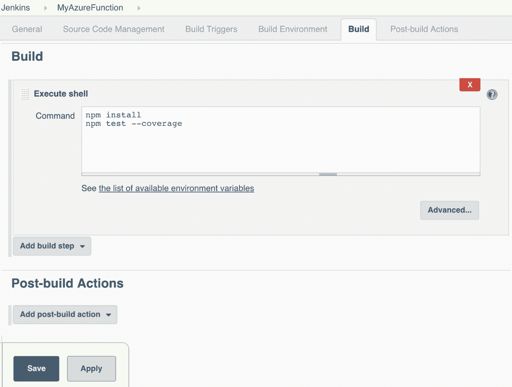

# 第四章：使用 Azure Functions 进行 DevOps

Microsoft Azure 是全球第二大云服务提供商，仅次于 AWS。但直到 2015 年，他们才提供 API 服务，之前在 AWS 和 Google Cloud Functions 等其他云服务领域表现出色。最终，他们决定投资于云函数。所以，Azure Functions 就是 AWS Lambda 的回应，但其底层技术不同，我们将在接下来的章节中详细介绍。Azure Functions 基于 Azure 应用服务和 WebJobs SDK。Azure Functions 支持多种语言，如 F#、Python、Batch、PHP 和 PowerShell，但官方支持的语言是 C# 和 Node.js。我们将在本章节中使用 Node.js 进行所有的教程，并且有关 Azure Functions 的更多详细信息可以参考微软链接：https:/ / msdn. microsoft. com/ en- us/ magazine/ mt793269\. aspx。

在本章中，我们将讨论以下主题：

+   构建一个简单的 Azure 函数

+   使用 Azure Functions 进行持续集成和持续交付

+   持续部署到 Azure Functions

+   Azure Functions 的蓝绿部署

+   监控与日志记录

+   最佳实践

# 构建一个简单的 Azure 函数

我们将首先尝试通过门户创建一个简单的 Azure 函数，然后使用 S 工具和框架自动化构建和部署过程。所以，为了开始使用 Azure Functions，我们需要首先创建一个 Azure 云服务账户。微软提供一个月的免费订阅，我们将在所有 DevOps 相关的示例和演示中使用 Node.js 脚本。

Azure 云账户创建

[`azure.microsoft.com/free/?ref=microsoft.com&utm_source=microsoft.com&utm_medium=docs&utm_campaign=visualstudio`](https://azure.microsoft.com/free/?ref=microsoft.com&utm_source=microsoft.com&utm_medium=docs&utm_campaign=visualstudio)

创建账户后，按照以下步骤操作：

1.  登录 Azure 门户（Azure 门户：[`portal.azure.com/`](https://portal.azure.com/)）。

登录成功后，我们将被重定向到 Azure 门户的主页。

1.  现在，我们需要为 Azure Function 创建资源。点击“创建资源”按钮，这将把我们带到 Azure 市场页面。

1.  在这里，我们需要通过点击 Azure 市场中的 Compute 链接来创建一个计算资源。

1.  然后，我们可以继续通过点击 Function App 链接来创建一个函数（这会打开一个新窗口，我们需要在其中输入 Function App 的详细信息）。

以下截图展示了在创建简单的 Azure 函数时，我们如何在屏幕中进行操作：


1.  点击链接后，将打开一个页面，我们需要在其中输入有关功能应用的详细信息。所以让我们将它命名为`mySampleAppName`。功能应用名称必须是唯一的，因为 Azure Function 不允许在 Azure 云中使用重复的应用名称。接受应用名称后，我们会在应用名称列上看到一个绿色的勾号。然后我们将添加订阅、资源组（可以使用默认值或添加现有的资源组）、操作系统、托管计划、存储（我们可以创建新的存储或使用现有存储）。

保留其他细节为默认设置，并创建一个功能应用：


这将创建一个功能应用，功能将在其中运行。成功创建功能应用后，如果点击**所有资源**，你应该能看到该功能应用。接下来，我们将继续创建应用，之后 Azure 将为该功能创建资源，其中包括存储帐户和功能应用。

1.  现在让我们去**功能应用**，在右侧的功能应用标签下，我们应该能看到我们的功能。点击它并将鼠标悬停在上面，我们应该能看到**+**号。我们可以通过点击+来创建一个新的功能；只有在悬停在**功能**标签上时，才能看到+号。这将打开右侧的一个标签，其中提供了多个选项来创建 Azure 功能。我们将继续选择场景作为**Webhook + API**，并选择 JavaScript 作为语言，然后点击**创建此功能**：


点击按钮后，会打开一个 UI，里面嵌入了一个示例 Node.js 功能。我们可以运行同样的 Azure 功能来检查它的表现。

我们可以通过两种方法运行该功能，一种是 POST 方法，另一种是 GET 方法。默认情况下，功能使用 POST 方法运行。所以让我们点击**运行**按钮。在下一个窗口中，将**请求体**替换为 JSON 值，然后点击**再次运行**。

在 POST 方法中，让我们添加以下 JSON 详情：

```
 {
    "name": "My Azure Function"
 }
```

运行将触发功能并显示请求体中的输出，如下图所示：


而且，当我们将**HTTP 方法**更改为 GET 时，需要提供一个查询参数。为此，点击**+ 添加参数**，在查询中填写键为**name**，值为**DevOps**，然后点击**运行**。在成功执行后，我们可以在日志窗口中看到输出日志为**Hello DevOps**。

所以，在之前的教程中，我们学习了如何创建一个简单的 Hello World Azure 功能，并使用 POST 和 GET 方法执行它。在接下来的章节中，我们将探讨如何自动化部署。

# 使用 Azure Functions 实现持续集成和持续交付

现在，我们通过 Azure 门户创建了一个简单的应用程序，接下来的问题是如何添加多个功能、源代码以及设置自动化构建和部署。当然，我们通过 DevOps 和自动化来完成这些任务。让我们从持续集成开始。正如我们所知，持续集成是 DevOps 的核心部分，在这个过程中，应用程序会集成为一个整体。我们必须通过自动化实现 Azure Functions 的持续集成、自动化测试和持续部署。

首先，我们将创建一条流水线。流水线从代码仓库（如 GitHub 或 SVN）开始，并以生产部署结束。在此过程中的每一环节都必须通过流水线实现自动化，几乎不需要人工干预。我们将在下一章详细讲解流水线的内容。

要实现持续集成，我们需要从将代码推送到 GitHub 仓库开始。开发人员应通过为每个功能模块创建一个特性分支来开始构建应用程序，然后所有的特性分支应当经过审核并合并到开发分支，最终再合并到主分支，以便进行干净的代码构建。所有的特性分支都应该经历持续集成过程，即，功能代码将通过单元测试、状态代码分析以及各种其他自动化测试。然后，特性分支的代码应当合并到主分支。主分支用于构建并部署到 UAT 或 OAT 环境，在那里应进行性能测试，之后再进一步部署到生产环境。

持续交付过程从开发人员将代码提交到本地或特性分支的那一刻开始。自动化构建将被触发，紧接着是单元测试和集成测试。即使代码经过了非常充分的测试，它仍然需要进行可用性和验收测试。因此，成功完成持续集成过程将触发持续交付过程，并将代码交付到 QA 阶段环境。QA 环境通常类似于生产环境。在这里，自动化和手动验收测试将开始执行。通过实现持续交付，我们应该能够每天、每周或每两周发布环境，或根据业务需求进行调整。但我们应该能够不费力或无需手动部署地将代码部署到生产环境。

让我们来看一个遵循持续集成和交付的示例。在这个示例中，我们将使用开源的 DevOps 工具，实际上在 Azure 云上测试和部署应用程序。我们需要像 Jenkins 这样的工具，它是一个流行的开源编排工具，还有我们用于 AWS 部署的无服务器框架，以及用于单元测试代码的 Node.js 模块。

为了验证可行性，我使用 Docker 设置了带有 Node.js 和 npm 的 Jenkins 实例。我已经将这个 Dockerfile 推送到了 GitHub 上的 Git 仓库中，所有示例文件也托管在这个仓库中，以下是我的教程链接，并且我的教程是基于 Linux 系统构建的：[`github.com/shzshi/azure-helloworld-ci.git`](https://github.com/shzshi/azure-helloworld-ci.git)

如果你使用的是 Git 仓库中的 Dockerfile，那么确保你的笔记本电脑/PC 上已经安装了 Docker。我们将首先克隆前面提到的 Git 仓库，并使用以下命令构建 Docker 镜像，镜像中包括 Jenkins、Serverless Framework 以及 Azure Functions 部署所需的所有依赖项：

```
$ git clone https://github.com/shzshi/azure-helloworld-ci.git
$ cd azure-helloworld-ci
$ docker build -t chapter4jenkins:latest .
```

然后使用以下命令运行 Docker 容器，这将创建一个包含 Jenkins、Node.js 8.9、Serverless Framework 2.5 和 npm 5.6 的容器：

```
$ docker run --rm -d -p 50000:50000 -p 8080:8080 chapter4jenkins:latest
```

如果你已经设置了 Jenkins，那么确保服务器上已安装 Node.js 8.9、npm 5.6 和 Serverless Framework 2.5，以便上述示例能正常工作。

一旦 Jenkins 启动并运行，我们将创建一个 Jenkins 作业，它将运行单元测试，并通过 Serverless Framework 将 Azure Function 部署到 Azure 云。成功部署后，我们将通过 Serverless Framework 调用该函数。

按照以下步骤操作：

1.  以下是 Jenkins 首页的截图。我们将创建一个新作业，点击链接 “New Item” 来创建一个新作业：


1.  创建一个作业名称，随便取个名字，选择“Freestyle 项目”并提交 OK：


1.  然后我们将跳转到作业的配置页面，在这里我们将添加用于克隆的 Git 仓库，点击 **Source Code Management** 标签，并按如下所示添加 Git 仓库的详细信息：


1.  然后点击 **Build** 标签页并创建一个执行 Shell，通过 **Add build step** 下拉菜单，添加 `npm install` 来从互联网安装所需的 Node.js 模块，然后运行 Node.js 测试，这将单元测试 Azure 库功能并给出结果。

在将应用部署到 Azure 云之前，我们可以添加许多单元测试来测试我们的功能，以确保应用在进入云端之前已通过单元测试：



确保你已经通过 **Jenkins Home** | **Manage Jenkins** | **Manage Plugins** 安装了 Publish HTML report 插件。

1.  一旦运行了上述作业，就会执行单元测试并生成报告，我们可以通过配置构建后操作来查看该报告。所以，让我们点击 **Post-build Actions** 标签页，然后点击下拉菜单 **Add post-build action** 并选择 **Publish HTML reports**，点击 **Add**，然后按照以下截图进行配置：


1.  **保存**该任务并运行构建。构建成功后，我们应该能够在任务主页上查看代码覆盖率的 HTML 视图。覆盖率会像下面的截图一样，给我们一个关于单元测试执行情况的良好视图：


在上一节中，我们对函数进行了单元测试，并查看了函数的覆盖率。接下来，我们将配置部署到云端。

# 与 Azure Functions 的持续集成

现在，进入部署到 Azure Cloud Functions 的步骤，我们将使用一个无服务器框架。框架将完成所有繁重的工作，但它需要一些前置条件才能正常工作。它们是：**serverless-azure-functions**和**cli az login**，用于获取所需的凭据和账户详情。请按照以下步骤在先决条件部分进行操作：

# 先决条件

我们可以通过 npm 安装`serverless-azure-functions`。以下命令将安装插件的最新版本，但如果你使用的是上面创建的 docker 镜像，它已经包含了这个插件：

```
$ npm i --save serverless-azure-functions
```

但是，为了与 Azure 平台进行交互，我们需要在本地设置 Azure 订阅凭据。为了使`serverless-azure-functions`插件正常工作，我们需要设置一个服务主体，可以通过 Azure 门户网址完成，如下所示：

[`docs.microsoft.com/zh-cn/azure/azure-resource-manager/resource-group-create-service-principal-portal`](https://docs.microsoft.com/zh-cn/azure/azure-resource-manager/resource-group-create-service-principal-portal)

然而，如果你使用的是 PowerShell cmdlets，请使用以下命令：

[`docs.microsoft.com/zh-cn/azure/azure-resource-manager/resource-group-authenticate-service-principal`](https://docs.microsoft.com/zh-cn/azure/azure-resource-manager/resource-group-authenticate-service-principal)

我将使用 CLI 进行教程，但你可以自由选择最合适的方式。或者通过 Azure CLI，请按照以下步骤在本地获取 Azure CLI：

[`docs.microsoft.com/zh-cn/cli/azure/install-azure-cli?view=azure-cli-latest`](https://docs.microsoft.com/zh-cn/cli/azure/install-azure-cli?view=azure-cli-latest)

或者，你也可以使用 Azure Cloud Shell，如下所示：

[`docs.microsoft.com/zh-cn/azure/cloud-shell/overview`](https://docs.microsoft.com/zh-cn/azure/cloud-shell/overview)

一旦 Azure CLI 成功安装，我们应该能够通过以下命令访问`login`：

```
$ az login
```

上一个命令会提示我们访问`https://aka.ms/devicelogin`并提供一个代码和 Azure 身份。然后我们就可以通过 CLI 访问我们的账户。我们将在命令行中看到如下的账户详情：

```
{
  "cloudName": "AzureCloud",
   "id": "c6e5c9a2-a4dd-4c81b4-6bed04f913ea",
   "isDefault": true,
   "name": "My Azure Subscription",  
   "state": "Enabled",
    "tenantId": "5bc108159c-4cbe-a7c9-bce05cb065c1",
    "user": {
      "name": "hello@example.com",
        "type": "user" 
    }
 }
```

我们还需要通过以下命令获取订阅详情：

```
$ az account list
```

接下来，我们需要创建一个服务主体。我们可以通过运行以下命令来完成。这将提供一个 JSON 对象，我们需要使用该对象进行 Azure 云身份验证：

```
$ az ad sp create-for-rbac
 Retrying role assignment creation: 1/36
 {
   "appId": "e28115c2-ba87-4ddb-b3fb-62c91ade4a2e",
   "displayName": "azure-cli-2018-01-30-01-28-48",
   "name": "http://azure-cli-2018-01-30-01-28-48",
   "password": "e87a0489-63a7-41a1-b0ef-9054eda5b8c8",
   "tenant": "0a76ffdc-0cda-4d93-850f-025f940889dc"
 }
```

最后一个前提是需要在 Jenkins 中安装**EnvInject**插件来掩盖 Azure 凭据。请确保已经添加该插件。

# 设置环境变量

最后，我们创建环境变量，包括订阅 ID、租户、名称和密码。我们需要将其导出到 Jenkins 节点，并设置部署。因此，让我们来完成这一步：

1.  在浏览器中打开 Jenkins，点击**新建项目**添加一个新作业。输入项目名称**myAzureFunctionDeploy**并选择**自由风格项目**，然后点击**确定**。

1.  在工作配置页面，勾选**此项目是参数化的**，并在名称下方添加**密码参数**，默认值通过以下 Azure 命令获取：

```
azureServicePrincipalTenantId
azureServicePrincipalClientId
azureServicePrincipalPassword
azureSubId
```

1.  点击**源代码管理**标签，添加仓库 URL：[`github.com/shzshi/azure-helloworld-ci.git`](https://github.com/shzshi/azure-helloworld-ci.git)，该仓库包含所需的文件。

1.  在**构建环境**中选择**将密码注入为构建环境变量**。我们这样做是为了掩盖 Azure 凭据和其他详细信息。

1.  接下来，点击**构建**标签，在执行 Shell 中添加以下示例中的步骤，然后点击**保存**。

```
export azureSubId=${azureSubId}
export azureServicePrincipalTenantId=${azureServicePrincipalTenantId}
export azureServicePrincipalClientId=${azureServicePrincipalClientId}
export azureServicePrincipalPassword=${azureServicePrincipalPassword}
serverless deploy
```

1.  点击**使用参数构建**。然后点击**构建**，作业将构建，创建一个包并将函数部署到 Azure 门户。我们可以在云端测试该函数。函数部署后，我们可以通过无服务器命令提示符调用或运行该函数。我们可以将其集成到冒烟测试或功能测试中，因此我们可以通过命令行或将相同的命令行添加到 Jenkins 作业中来测试函数的实际运行，如下所示：

```
$ serverless invoke -f hello --data {"name": "DevOps"}
```

我们还可以流式传输函数的日志，以查看函数如何被部署，或者它在运行时的表现：

```
$ serverless logs -f <function_name>
```

我们可以修改源代码仓库中的代码，并单独运行这些命令，或者通过像 Jenkins 这样的编排工具来实现完美的持续集成和持续交付。

我们可以通过以下命令集成从 Azure 函数中移除该函数。这可以集成到 Jenkins 管道中，以取消部署或将函数回滚到先前版本：

```
$ serverless remove
```

# 持续部署到 Azure 函数

**持续部署**意味着我们每次提交的代码都应经过自动化的单元测试、集成测试和性能测试，并且经过自动化的源代码分析后，能够成功部署到生产环境中，而无需人工干预。然而，在某些情况下，我们应能够因生产环境中的一些错误或问题回滚部署。回滚可以是自动化的，但通常是手动执行的。我们可以通过 Azure 门户设置一个持续交付的流水线。让我们设置一个简单的持续交付流水线。Azure Cloud 提供了一个开箱即用的功能来设置 Azure Function 的流水线。它与多种源代码管理工具集成，如 Git、GitHub、Bitbucket、Visual Studio Team Services 等。持续部署是按每个函数应用设置的，函数代码也可以通过源代码仓库进行管理，门户中的代码变为只读。因此，一旦代码更新并提交到源代码仓库，函数代码会自动构建并部署到门户。

# 设置一个持续部署的 Azure 部署工具

在这里，我们将演示如何通过 Azure 门户设置与 GitHub 仓库的持续交付：

1.  登录到 Azure 门户 ([`portal.azure.com`](https://portal.azure.com))。登录成功后，点击“所有资源”链接。我们应该能看到已经创建的函数应用：


1.  选择我们需要设置持续部署的应用程序，根据我的示例，我会选择 **azure-helloword-ci**，这将带我们进入函数应用窗口。然后，在函数应用窗口中，我们会选择右上角的“平台功能”标签页，点击“部署选项”：


1.  然后，在部署部分，点击“设置”。接下来会出现一个窗口，标题为“部署选项”。点击链接“选择源”，在下一个窗口中，我们将看到添加源控制的选项。选择 GitHub。

1.  接着我们将看到配置 GitHub 仓库的选项，我们需要授权 Azure Functions 访问我们的私人或公共仓库。请确保使用自己的账户的公共仓库。

1.  配置完成后，我们需要选择仓库，填写选择源、授权、选择组织、选择项目仓库、分支，并可以配置性能测试。我们将被引导到 GitHub 门户，输入我们的 GitHub 凭证以连接到 GitHub 仓库。之后，一旦点击确认，仓库将与 Azure Function 配置，并且 GitHub 中的所有文件更改都会被复制到函数应用中，触发完整站点部署。

1.  我们可以通过点击**配置性能测试**按钮来设置性能测试。我们可以通过创建不同的分支来创建多个环境，然后将代码合并到主分支以进行生产部署。

# Azure Functions 中的蓝绿部署

DevOps 中有多种部署模式：金丝雀部署和蓝绿部署。在本书中，我们将讨论 Azure Functions 的蓝绿部署。蓝绿部署技术通过使用两个相同的生产环境（分别命名为蓝色和绿色）来减少停机时间和风险。在这种模式下，一个环境用于线上运行，另一个用于新更改的预发布。在切换流程中，初始版本的应用程序部署到蓝色环境，所有用户流量都将重定向到蓝色环境。之后，新的应用程序版本被部署到预发布环境（绿色环境）进行测试。当新的软件版本测试合格后，所有流量将切换到绿色环境，并认为该环境为正式生产环境。

# 部署仪表板

开发团队需要始终跟踪部署情况和开发流水线的健康状态。它还需要跟踪部署失败的情况、已完成的发布次数、代码提交次数以及许多对开发周期至关重要的其他指标。有一个开源工具可以帮助跟踪所有这些细节，它就是 Hygieia。Hygieia 是一个开源工具，可以在单一界面上提供构建、部署、质量控制和应用性能的整体视图。它还帮助跟踪部署版本以及应用程序的健康状况。

**Hygieia**是由 Capital One 开发的 DevOps 仪表板工具，该公司已将其开源。

Hygieia 仪表板有两种视图，一种是小部件视图，另一种是流水线视图。小部件视图显示当前冲刺中的功能、代码贡献活动、持续集成活动、代码分析、安全分析、单元和功能测试结果、部署以及环境状态的信息。流水线视图显示部署生命周期的各个组件，展示从开发、集成、QA、性能到生产的进展。Hygieia 还提供产品仪表板，显示各个产品中多个应用的协作仪表板。

Hygieia 有许多插件，可以与 Jira、Subversion、Jenkins、Sonar、IBM UrbanCode Deploy 等多个 DevOps 工具集成或获取日志。由于 Hygieia 是开源的，我们还可以为其构建自己的插件和小部件。

Hygieia 仪表板应用程序开箱即用，能够与 VersionOne、Jira、Subversion、GitHub、Hudson/Jenkins、Sonar、HP Fortify、Cucumber/Selenium 和 IBM Urbancode Deploy 集成。

Hygieia 基于 Java 构建，插件通过 Java 命令行运行。我们可以在 Docker 容器中搭建完整的 Hygieia 仪表盘。请访问以下链接进行设置和集成：[`github.com/capitalone/Hygieia`](https://github.com/capitalone/Hygieia)。

# 监控和日志记录

无服务器应用程序有助于加速开发和提高独立性，并允许触发事件的执行，但当这些功能未按预期工作时，我们如何验证事件是否正在激活正确的功能？在无服务器应用程序中，根本原因分析变得更加复杂，因为服务很小，功能也非常精确。在追踪故障源时，涉及的服务或任何集成点实际上并不存在，而且当有多个功能参与操作时，调查变得非常困难。

这就是日志发挥至关重要作用的地方，但在无服务器架构中进行日志记录时，有一些独特的考虑因素需要加以注意。

多个功能失败并未提供请求的功能，或者日志包含一个统一的事务标识符，这在无服务器应用中是正常现象，因此，当分析功能日志时，可以轻松检测到事务失败，并修复故障问题。

在 Azure Functions 中，我们可以通过多种方式获取日志。最简单的方法是登录到 Azure 门户，进入相应的功能并选择“监视”选项卡。在这里，我们将看到一列功能调用记录、它们的状态，以及最后一次运行的时长。如果我们选择某个失败的调用，则在右侧可以看到准确的日志和其他相关信息。

# 通过 Kudu 访问日志

我们可以通过 Kudu 访问日志。Kudu 是为访问 Microsoft Azure Web 应用环境而开发的。由于 Azure Function 运行在 Web 应用中，我们可以使用 Kudu 来访问 Azure Functions 的日志。Kudu 可以访问环境信息，并且还可以查看运行时附加到功能的实际文件系统的详细信息。

可以通过 Web 浏览器访问 Kudu。相关链接是 [`myAzureFunction.scm.azurewebsites.net`](https://myAzureFunction.scm.azurewebsites.net/)。我们只需要将 `myAzureFunction` 替换为我们的 Web 应用名称。Kudu 的最大优点是，它可以通过 Shell 或浏览的方式让我们访问功能环境的实际文件系统，这使得追踪故障根源变得更容易。

# 通过表存储记录日志信息

所有函数的日志和时间信息都存储在我们之前创建函数应用时所创建的存储帐户中。如果我们安装了 Azure SDK，可以通过 Visual Studio 访问日志。我们还可以通过 Cloud Explorer 窗口访问日志。（如果你有多个 Azure Function 应用，可能有点难记住哪个属于哪个函数应用，但你可以通过查看应用程序设置中的 `AzureWebJobsStorage` 设置内容来找到它）。

# 监控 Azure Function

监控函数非常重要。它能清楚地展示我们的函数或应用在处理流量时的表现，以及在扩展和收缩时的表现。Azure Function 与 Azure 应用程序洞察内置集成。应用程序洞察是由 Azure 提供的 APM（应用程序性能管理）服务。我们可以在创建函数应用时配置应用程序洞察，并将遥测数据发送到应用程序洞察。创建一个新的函数应用，打开应用程序洞察开关并设置应用程序洞察位置：


我们可以在 Azure Cloud 门户的 Metrics Explorer 中查看性能图，以监控函数的健康状况：


# 与 New Relic 集成

New Relic 提供了 Azure Function 的集成，执行以下功能：

+   将 Azure Functions 的数据报告给 New Relic 产品。

+   报告度量数据，如执行的函数数量、发送和接收的字节数以及 HTTP 错误。

+   收集有关服务状态和配置的库存数据。

你可以通过 New Relic 监控并对 Azure Functions 数据设置告警，还可以创建自定义查询和仪表盘。

要激活 Azure Functions 集成，请通过以下链接进行 Azure 集成激活：[`docs.newrelic.com/docs/integrations/microsoft-azure-integrations/getting-started/activate-azure-integrations`](https://docs.newrelic.com/docs/integrations/microsoft-azure-integrations/getting-started/activate-azure-integrations)。

# 最佳实践

面向无服务器的 DevOps 仍然是一个相对年轻且不断发展的领域。无服务器本身正在快速崛起，而在这个框架内，为了实现与其他 DevOps 的自动化部署和集成，变化速度更快。谈到从开发到生产的顺畅代码部署的最佳实践时，我们需要关注 Azure Function 的 DevOps 的各个要素，并从实施过程中吸取经验教训。但由于无服务器技术仍在发展中，且无服务器的 DevOps 仍属于小众领域，我们可能无法涵盖 DevOps 的所有方面。不过，我们将重点关注其中的一些关键要素，并在这里详细讨论。因此，面向无服务器的 DevOps 的主要要素包括：源代码管理、构建、部署、发布管理、监控和日志记录，这几乎与应用程序开发相同。但由于无服务器是微服务架构，因此在将 DevOps 应用到它时有所不同。接下来，我们将探讨每个方面，并学习如何将 DevOps 最好地应用于 Azure Functions。

# 源代码管理

开发人员编写代码并共同协作执行任务，但开发人员不断添加新功能，或者更新代码以提高性能，或增强功能性。这就是我们需要源代码管理的原因。Git 是目前最流行的源代码管理工具之一。因此，我们必须为高效管理代码设定不同的策略。但在此之前，我们需要为 Azure Function 设置一个文件夹结构。

# 文件夹结构

特定功能应用程序的所有函数代码将位于根文件夹中，可能有一个或多个子文件夹，并且包含一个主机配置文件。`host.json` 文件将包含运行时特定的配置。每个函数文件夹将包含一个或多个代码文件、`function.json` 配置文件以及其他函数依赖项。

```
wwwroot
| - host.json
| - myazurenodefunction
| | - function.json
| | - index.js
| | - node_modules|
| | - ... packages ...
| | - package.json
| - myazurecsharpfunction
| | - function.json
| | - run.csx
```

在文件夹结构中，我们需要应用最好的分支策略，以实现稳健的开发和顺畅的部署。最佳实践是拥有多个分支，其中 master 分支是默认分支，方便开发，并便于未来顺利发布到生产环境。这些分支包括功能分支、开发分支、发布分支和热修复分支。

功能分支有助于轻松跟踪某个功能，并促进团队成员之间的并行开发。功能分支可能从开发分支派生，但应始终合并回开发分支。下一个主要分支是开发分支，该分支贯穿项目的开发和支持生命周期。当开发分支的源代码稳定时，它会被合并回 master 分支，成功发布后，每次合并到 master 分支都会触发生产环境的发布。

发布分支可能来自开发分支，但它们必须合并回开发和主分支。发布分支用于准备新的生产发布。发布分支用于下一个大版本发布。它为我们提供了进行次要错误修复的空间，并为发布设置元数据。当发布分支准备好进行实际发布时，我们需要确保它与主分支合并，并且提交必须被标记为未来的历史版本。最后，发布分支应与开发分支合并，以便我们在未来发布中获得此发布的所有更改。

最后是热修复分支。这与发布分支几乎相同，因为它帮助我们进行生产发布。当生产部署失败时，热修复实际上非常有用，因此我们可以快速修复生产问题，以便及时恢复生产。为了解决生产故障，我们从主分支的生产标签中分支出热修复分支，这样一个团队可以修复生产故障，而另一个团队可以继续在开发分支上开发。一般的经验法则是热修复分支可能从主分支分支出去，一旦热修复成功，变更将合并回主分支。它们还需要合并到开发分支，以确保我们在未来发布中拥有这些热修复变更。

# 测试和静态代码分析

测试是开发的重要组成部分，当我们开发任何应用程序时，测试是必须的。它有助于在进入生产之前减少大部分错误和性能问题。在应用程序开发中涉及许多类型的测试。这些包括单元测试、集成测试和性能测试。它们集成到不同的环境部署阶段中。单元测试集成在开发阶段中。

无服务器处理程序应始终是一个使用代码库中的模块的薄层。模块应该有很好的单元测试覆盖率；然后在集成测试期间测试无服务器应用程序将会更加容易。

我们应该尝试在本地运行单元测试和集成测试模块和函数，这样可以帮助更快地运行测试，并且更容易在代码库中找到问题，而无需部署到云端。我们也应该远程运行它们，因为远程基础设施与本地基础设施有所不同。我们可以通过设置流水线并将它们分阶段部署到不同的环境（开发、阶段、用户验收测试、预生产和生产），其中开发和阶段测试应在本地调用，而其他环境则通过远程测试以获得更好的性能。

静态代码分析是分析源代码，以标记编程错误、漏洞、风格错误和可疑构造的过程。我们必须确保在管道阶段集成服务器函数的 linting 工具。这有助于保持代码整洁、减少漏洞，并确保正确缩进。

# 部署和发布

部署模式有多种类型，但我们应选择一个适合我们情况的模式，并将所有功能一次性组合使用：蓝绿部署和金丝雀发布，并且还涉及诸多复杂性，如冗余、高可用性、回滚、A/B 测试和增量发布。所有这些都需要在部署过程中考虑，部署应实现轻松和灵活。因此，在开始自动化之前，最好先决定使用的部署模式。

我们必须确保部署始终被监控，并且随着时间的推移，对部署失败进行分析和改进。所有部署应通过自动化管道触发，尽量减少人工干预，并附加到 GitHub 仓库，采用严格的分支策略。我们还可以将函数应用打包并上传到 Nexus，以便更轻松地回滚。所有部署都应该有一个反馈环，直到项目追踪工具如 JIRA/rally。这将使故障追踪变得更加容易。

# 总结

总结一下，我们涵盖了 Azure Functions 的持续集成、持续部署、日志记录和监控，同时也详细讨论了如何在源代码仓库中管理 Azure Functions 的最佳实践，测试和自动化部署的重要性。无服务器或基于 Azure 云的函数仍处于初期发展阶段，但随着每一天的过去，它们在不断改进。就采纳和改进而言，仍然有很多工作要做。但一旦无服务器的使用增多，围绕它的 DevOps 实践也会逐渐改进并变得更加健壮。在下一章中，我们将学习如何将 DevOps 应用于 OpenWhisk，另一个无服务器提供商。
