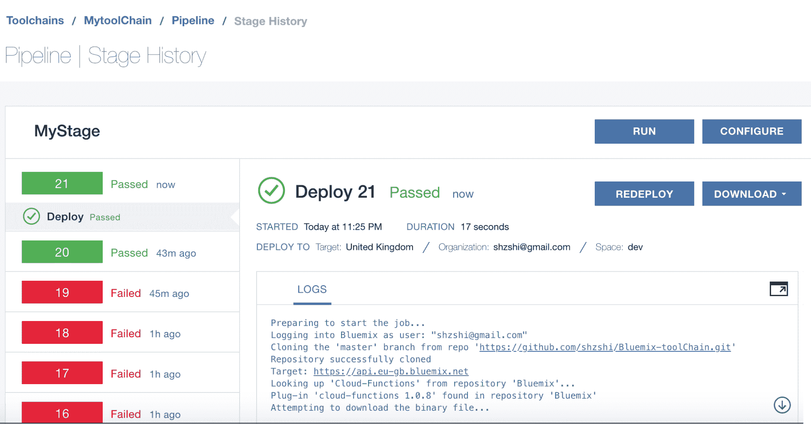

# 第五章：将 DevOps 与 IBM OpenWhisk 集成

本章中，我们将介绍 OpenWhisk，它是一个开源的云端无服务器提供商。我们还将学习如何构建、测试和部署 OpenWhisk 函数，并了解如何管理日志和监控函数。此外，我们还将探讨与 OpenWhisk 一起使用 DevOps 的最佳实践。

# OpenWhisk

**OpenWhisk** 是 Apache 和 IBM 的一个孵化器项目。它通过 IBM Bluemix 门户提供一个开源的云端无服务器平台。我们可以在本地部署或直接使用云端模式。OpenWhisk 的商业版由 IBM 提供，通过 Bluemix 发布，开源版则可以作为本地部署的**基础设施即服务**（**IaaS**）提供，也可以在云端（如 Bluemix、Amazon EC2、Microsoft Azure 或 GCP）使用。开源版本可在 GitHub 上获取，并通过 Apache 许可证公开，用户可以为其贡献代码。

要查看 GitHub 上的开源 OpenWhisk 版本，请访问 [`github.com/apache/incubator-openwhisk/tree/master/docs#getting-started-with-openwhisk`](https://github.com/apache/incubator-openwhisk/tree/master/docs#getting-started-with-openwhisk)。

像其他任何无服务器服务一样，OpenWhisk 执行的是小段代码，这些代码被称为**动作**（即，**函数**），在事件触发时执行。事件可以来自 Bluemix 或外部来源。OpenWhisk 还声称它允许集成自家事件提供者，或任何其他事件提供者，而不像其他无服务器服务提供商那样只限于特定的事件提供者。

OpenWhisk 提供了许多功能，例如自动扩展和负载均衡，开箱即用，无需手动配置集群、负载均衡器和 HTTP 插件。让我们看看 OpenWhisk 的架构图：


动作/函数是在事件触发时执行的，这些事件可以是数据库记录的变化、物联网传感器读数、GitHub 仓库的代码提交，或来自 Web 或移动应用程序的简单 HTTP 请求。这些来源的事件通过触发器传递，并且触发器中的规则允许动作对这些事件作出响应。

**动作**是 OpenWhisk 中对函数的称呼。动作可以是小段的 JavaScript 或 Swift 代码，或者是嵌入在 Docker 容器中的自定义二进制代码。

动作通常是按顺序调用的，一个动作的输出可以作为下一个动作的输入。除了触发器，动作还可以通过多种来源调用，例如 OpenWhisk API、CLI 和 iOS SDK。

OpenShift 支持的语言有 Node.js、Python、Swift、Java 和 PHP，OpenShift 声称其中一个独特卖点是支持 Swift 语言，这在为移动应用编写函数或动作时非常有用。

服务和事件提供商的集成可以通过包来执行。**包**是一个包含了多个 feed 和操作的捆绑包。**Feed** 是一段代码，用于配置外部事件源以触发事件。例如，在银行账户交易中，当发生借记或贷记事件时，会创建一个触发器，触发一个函数/操作来向用户发送关于交易的短信。包中的操作包含可重用的逻辑，服务提供商提供这些逻辑供用户使用。这些服务提供商是事件源，并且可以通过 API 被调用。

OpenWhisk 构建在 NGINX、Kafka、Docker 和 CouchDB 上。这些组件共同作用，提供一个为 OpenWhisk 提供无服务器服务的架构。

# OpenWhisk 设置与配置

OpenWhisk 运作四个重要的概念，具体如下：

+   触发器

+   操作

+   规则

+   序列

# 触发器

**触发器**就像由数据源创建的事件。一些例子包括更改数据库记录、向你的仓库提交新代码，以及来自 Web/移动应用的 HTTP 请求。来自这些源的事件通过触发器进行传递。

# 操作

**操作**是用 Node.js 或 Swift 编写的代码片段，或嵌入在 Docker 容器中的代码。代码被部署并在触发器触发时执行。

# 规则

**规则** 是触发器的一部分，当与操作结合时，每次触发器触发时，规则都会调用相应的操作。

# 序列

操作链称为 **序列**。我们可以将操作串联起来，它们会按顺序依次被调用。一个操作的输出可以成为下一个操作的输入。

# 构建一个 OpenWhisk 应用程序

在本书中，我不会设置 OpenWhisk 的开源版本。相反，我们将通过 Bluemix 门户使用教程，因此我们需要注册 Bluemix 门户。Bluemix 为新用户提供一个免费的一个月订阅。所以让我们在 [`bluemix.net`](https://bluemix.net) 上注册。正如我之前提到的，IBM Bluemix 提供了一个 免费试用 ，前 30 天无需提供信用卡信息。试用期后，我们不需要使用信用卡注册。所有用户每月都可以享受约 400,000 GB-秒的无服务器计算时间。额外的执行时间将按每 GB-秒 $0.000017 收费，按最接近的 100 毫秒进行四舍五入。

# 创建一个 Hello World OpenWhisk 操作

本教程的前提条件是一个 IBM 云账户（免费试用）以及 Node.js 的知识（本书中我们一直在使用）。我们将首先从一个简单的示例开始，然后随着章节的进行逐步将自动化应用于教程代码。所以，让我们在 IBM Bluemix Cloud 的用户界面上创建一个简单的 Hello World 应用，并执行/调用它。

要创建一个 OpenWhisk 操作，请按照以下步骤进行：

1.  进入 IBM 云中的 OpenWhisk 控制台 [`console.bluemix.net/openwhisk/`](https://console.bluemix.net/openwhisk/)。

1.  登录到 IBM Cloud，点击**开始创建**，在浏览器中使用 OpenWhisk 并进入编辑器。

1.  从多个选项中点击**创建动作**。

1.  使用以下参数创建一个新的动作：

| 字段 | 值 |
| --- | --- |
| 动作名称 | `HelloWorld` |
| 封装包 | (默认包) |
| 运行时 | Node.js 6 |

1.  点击**创建**。这将打开 Node.js 的编辑器界面。

1.  默认情况下，OpenWhisk 动作是 JavaScript。它们接收一个关联数组作为输入，并返回另一个关联数组作为输出。

1.  将现有的 Node.js 代码替换为以下内容：

```
/**
  *
  * main() will be invoked when you Run This Action.
  *
  */
function main(params) {
    var myName;  
    myName = params.name;
    if (myName == undefined)
        myName = "";     
    return {
        html: "<b>" + JSON.stringify(params) + "</b>",
        js: "alert('hello " + myName + "');"
    };
}
```

1.  点击**保存**按钮。这将保存动作并将你重定向到调用动作的页面。

1.  让我们点击**更改输入**并添加以下名称输入，然后点击**应用**按钮：

```
{   
 "name": "Serverless"
}
```

1.  现在让我们点击**调用**按钮来执行动作/函数。我们应该能看到以下输出：


输出将以 JavaScript 和 HTML 的形式展示。在前面的教程中，我们创建了一个 OpenWhisk 动作并通过 Bluemix 控制台进行部署。在下一节中，我们将使用 Serverless Framework 来设置部署和自动化。

# 使用 Serverless Framework 的 OpenWhisk

要使用 Serverless Framework 进行部署设置，我们首先需要准备一些东西。因此，考虑到你已经注册了，我们需要通过 Bluemix CLI 检索 Bluemix 端点和密钥，首先我们需要设置和配置 Bluemix CLI，可以通过 [`console.bluemix.net/openwhisk/learn/cli`](https://console.bluemix.net/openwhisk/learn/cli) 完成。

一旦 CLI 设置完成，我们将通过 Bluemix CLI 安装 Cloud Function 插件，然后登录到 Bluemix Cloud 并部署该动作。请按以下步骤操作：

1.  首先，我们使用以下命令从 Bluemix 门户获取端点和认证密钥：

```
$ bx wsk property get --auth whisk auth 
00700a7f-2b1a-4831-bf323a566263ed44:4TBcM7f8g0gj5UPgSVHXwNmMkfpbX36OdWximngOwqZYAJrDSkZwPjeSPjQ45Wm1
```

1.  一旦通过上述命令获得认证详情，我们可以通过`wsk`命令行设置`--apihost`和`--auth`，如下所示：

```
$ wsk property set --apihost OpenWhisk.ng.bluemix.net --auth 00700a7f-2b1a-4831-bf32-3a566263ed44:4TBcM7f8g0gj5UPgSVHXwNmMkfpbX36OdWximngOwqZYAJrDSkZwPjeSPjQ45Wm1

ok: whisk auth set. Run 'wsk property get --auth' to see the new value.
ok: whisk API host set to OpenWhisk.ng.bluemix.net
```

获取和设置密钥的另一种方式是通过门户。我们还可以通过`bashrc`为框架配置凭证以供使用。要做到这一点，首先通过浏览器登录到 Bluemix 门户，进入 API 密钥部分以检索并导出它们。因此，让我们登录到 Bluemix 门户 [`console.bluemix.net/openwhisk/`](https://console.bluemix.net/openwhisk/)，然后在左侧栏选择 API 密钥菜单以获取认证密钥，如下图所示：


1.  让我们进入 Linux 或 macOS 终端，并使用以下代码将认证详情添加到用户配置文件中：

```
$ vi ~/.bashrc
```

1.  从 Bluemix 门户复制以下导出，包含正确的`auth`和`apihost`：

```
export OW_AUTH=00700a7f-2b1a-4831-bf32-3a566263ed44:4TBcM7f8g0gj5UPgSVHXwNmMkfpbX36OdWximngOwqZYAJrDSkZwPjeSPjQ45Wm1
export OW_APIHOST=OpenWhisk.eu-gb.bluemix.net
```

1.  下一步是安装 Serverless Framework 以及相应的依赖和提供程序插件，如下代码所示：

```
$ npm install --global serverless serverless-openwhisk
```

插件必须作为全局模块安装才能正常工作。

# 一个简单的 OpenWhisk 应用

现在让我们通过以下步骤，使用无服务器 Node.js 模板创建一个简单的服务：

1.  创建一个新的无服务器服务/项目：

```
$ serverless create --template openwhisk-nodejs --path new-service 
```

1.  进入新创建的目录：

```
$ cd new-service
```

1.  安装 npm 依赖：

```
$ npm install
```

1.  完成后，将服务和函数部署到 Bluemix 门户：

```
$ serverless deploy -v
```

1.  然后我们调用函数，检查函数是否正确部署。使用以下代码调用无服务器应用：

```
$ serverless invoke --function hello
 {
 "payload": "Hello, World!"
 }
```

在前面的教程中，我们获取了 `auth` 密钥，创建了一个动作，并通过 Serverless Framework 部署了该函数。在下一部分，我们将探讨通过不同的方法设置 CI 和 CD。

# 使用 OpenWhisk 进行持续集成和持续交付

对于部署，我们通常会使用 `wsk` 命令行。我们将使用它执行以下操作：

+   从 GitHub 拉取代码

+   设置 Bluemix 空间以运行应用

+   为应用程序创建服务以供运行

+   配置环境变量，如服务凭证

+   部署 OpenWhisk 触发器和动作

+   推送 Node.js 应用

我们可以使用 IBM Bluemix 工具链，也可以使用开源工具，如 Jenkins 和 Serverless Framework。我们先来看 Bluemix 工具链。

# 设置工具链和仓库集成

让我们通过以下步骤创建一个新的空白工具链。这可以很方便地从 Bluemix 首页[`console.bluemix.net/devops/`](https://console.bluemix.net/devops/)完成：

1.  访问上述 URL，然后点击创建工具链。接下来选择“构建你自己的工具链”模板，如下图所示，给工具链命名，然后点击“创建”。完成！


1.  你将被重定向到“构建你自己的工具链”页面；填写相关信息并点击“创建”按钮。

1.  一旦工具链创建完成，点击**添加工具**。由于目的是在代码推送到 Git 时进行部署，首先要添加的是 GitHub 集成。所以我们选择 GitHub，然后按照步骤操作。你将被提示授权一个 GitHub 账户，并提供之前克隆的仓库 URL。完成后，你的 GitHub 仓库（以及如果你勾选了问题选项，则为其问题）的条目将出现在工具链中，然后我们将添加部署部分，以响应我们 GitHub 仓库中的更改。

# 配置部署

接下来，再次点击“添加工具”，将一个新的条目放入管道中，然后点击“交付管道”添加工具，如下图所示：


一旦交付管道工具就位，点击它，然后继续点击“添加阶段”。顶部有三个标签——输入、作业和环境属性。这些控制着部署活动本身的设置。以下是这些标签的简要概述：

+   输入：这只是管理使用哪个代码库和分支，以及是否手动运行部署或根据需要进行更改。

+   环境属性：这是管理我们在设置脚本中可以使用的变量。可以添加纯文本和秘密字段。我们可以在这里设置需要的值，例如数据库凭证、访问令牌等。这必须包括一个 Bluemix API 密钥，可以通过使用`bx iam api-key-create keyname`生成。在我们的例子中，我们需要创建一个名为`APIKEY`的变量，如下代码所示：

```
 $ bx iam api-key-create myFunction
 Creating API key myFunction as user@email.com...
 OK
 API key myFunction was created
 Please preserve the API key! It cannot be retrieved after it's
 created.
 Name myFunction
 Description
 Created At 2018-02-24T19:16+0000
 API Key X4klg0XvNotJqN_haPWpPirPLhckCA9OFdZDufjcIxLY
```

+   作业：这是实际完成工作的标签。我们将使用一个作业，所以点击“添加作业”，输入“部署”，在部署页面上，我们保持大部分细节为默认设置，确保帐户、组织和空间信息正确无误。

以下部署作业的 Shell 脚本将获取命令的 Cloud Functions 插件（更多关于 Bluemix 命令行工具的信息，请参见文档[`console.bluemix.net/docs/cli/reference/bluemix_cli/get_started.html#getting-started`](https://console.bluemix.net/docs/cli/reference/bluemix_cli/get_started.html#getting-started)），然后使用我们之前配置的 API 密钥进行登录，并定位到所需的 Bluemix 组织和空间。将以下 Shell 脚本添加到 JOBS 的部署脚本列中，然后点击保存：

```
#!/bin/bash
bx plugin install Cloud-Functions -r Bluemix -f
#bx login -a https://api.ng.bluemix.net --apikey $APIKEY -o <email_address> -s development
bx login -a api.eu-gb.bluemix.net --apikey $APIKEY -o <email_address> -s dev
# handy for debugging
bx wsk action invoke /whisk.system/utils/echo -p message helloWorld --blocking --result
# now set up your actions etc
zip helloWorld.zip index.js
bx wsk action update helloWorld --kind nodejs:6 helloWorld.zip
# check everything is as expected
bx wsk action list
```

在将 Cloud Functions 插件添加到 Bluemix 命令行工具后，这个脚本会使用我们在配置部署工具时创建的 API 密钥进行登录。使用内置的`/whisk.system/utils/echo`操作将显示我们在日志中的输出，如果一切配置正确以便与 Cloud Functions 一起工作，否则会显示（希望是有帮助且有信息量的）错误。`action update`命令执行实际的部署，获取新压缩的文件并将其作为一个动作部署。最后一次调用`action list`只是简单地展示我们预期的动作已经存在。

通过检查此任务上的绿色播放按钮，确保一切按预期工作，如下图所示。如果它播放，说明一切就绪！



# 使用无服务器框架的持续集成和持续交付

之前，我们使用 IBM Bluemix 工具设置了持续部署。在这里，我们将使用开源工具为 OpenWhisk 函数设置持续集成和持续交付。我将设置一个安装了 Serverless Framework 的 Jenkins 容器。我已经创建了一个 Dockerfile，通过它可以轻松创建一个包含 Node.js、Serverless Framework 和 OpenWhisk 插件的 Jenkins 容器。我已将这个 Dockerfile 添加到 Git 仓库中。我们将使用天气报告 OpenWhisk 应用程序，进行编码，提交到 GitHub，然后通过 Serverless Framework 将其部署到 Bluemix 云。我们将对应用程序进行单元测试，并通过调用函数来运行冒烟测试（见 [`github.com/shzshi/OpenWhisk-weather-report-serverless.git`](https://github.com/shzshi/OpenWhisk-weather-report-serverless.git)）。让我们更详细地看一下这些步骤：

1.  Git 克隆仓库：

```
$ git clone https://github.com/shzshi/OpenWhisk-weather-report-serverless.git
```

1.  一旦成功克隆，我们需要使用以下代码构建 OpenWhisk 镜像：

```
$ docker build --rm -f OpenWhisk-weather-report-serverless/Dockerfile -t OpenWhisk-weather-report-serverless:latest OpenWhisk-weather-report-serverless
```

1.  一旦 Docker 镜像构建完成，我们将使用以下代码为 `OpenWhisk-weather-report-serverless:latest` 镜像创建一个容器：

```
$ docker run --rm -it -p 50000:50000 -p 8080:8080 -v /Users/HOST_PATH/OpenWhisk-weather-report-serverless/jenkins:/var/jenkins_home OpenWhisk-weather-report-serverless:latest
```

1.  现在，我们将打开浏览器，导航到 Jenkins 应用程序并创建一个作业。由于我的 Docker 容器在本地主机上运行，所以我的 URL 是 `http://localhost:8080/`。

1.  打开 Chrome/IE 浏览器，粘贴上述本地 URL 并打开 Jenkins。在首页，系统会要求输入管理员密码。我们可以从容器运行日志中获取这个密码，格式应类似如下：

```
Jenkins initial setup is required. An admin user has been created and a password generated.

Please use the following password to proceed to installation: 7d4a4a91efb24f369bac95122686bd45
```

1.  一旦我们输入密码，系统将提示我们安装建议的插件。继续进行此操作。它是一次性的活动，因为我们将在 Docker 主机上保存插件，插件添加完成后，系统会要求我们创建一个管理员用户。创建用户并确保记住密码。然后，一旦用户创建完成，就可以开始使用 Jenkins。

1.  现在，让我们创建一个名为 `Serverless-OpenWhisk` 的作业。点击“新建项目”，这会打开一个新页面。在文本框中输入 `Serverless-OpenWhisk`，选择“自由风格项目”，然后点击 OK。

1.  现在，在源管理选项卡中选择 Git，并在“仓库 URL”中添加 `https://github.com/shzshi/OpenWhisk-weather-report-serverless.git`。由于这是一个公共仓库，我们不需要输入凭据。如果使用私人 GitHub 仓库，则需要为 Jenkins 提供凭据来克隆仓库。

1.  接下来，在构建选项卡中的“添加构建步骤”下拉菜单中，选择“执行 shell”。会弹出一个命令文本框。让我们在执行 shell 字段中添加以下代码。您需要将高亮的 `OW_AUTH` 和 `OW_APIHOST` 键替换为我们之前创建的密钥，或者我们可以登录到 OpenWhisk 门户并获取相关信息：

```
npm config set prefix '~/.npm-global'
export PATH=~/.npm-global/bin:$PATH
npm install
./node_modules/mocha/bin/mocha test/test.js
export OW_AUTH=00700a7f-2b1a-4831-bf32-3a566263ed44:4TBcM7f8g0gj5UPgSVHXwNmMkfpbX36OdWximngOwqZYAJrDSkZwPjeSPjQ45Wm1
export OW_APIHOST=OpenWhisk.eu-gb.bluemix.net
serverless deploy -v
serverless invoke --function main -d '{"location":"Paris"}'
```

1.  完成后，保存工作，然后点击立即构建链接。工作将开始运行。它将下载并安装`package.json`中提到的 npm 依赖项，然后运行 mocha 单元测试，将操作部署到 OpenWhisk 云中，然后用一个参数调用该函数/操作，以确保部署成功。输出将类似如下：

```
Building in workspace /var/jenkins_home/workspace/Serverless-OpenWhisk
Cloning the remote Git repository
Cloning repository https://github.com/shzshi/OpenWhisk-weather-report-serverless.git
 > git init /var/jenkins_home/workspace/Serverless-OpenWhisk # timeout=10
Fetching upstream changes from https://github.com/shzshi/OpenWhisk-weather-report-serverless.git
 > git --version # timeout=10
 > git fetch --tags --progress https://github.com/shzshi/OpenWhisk-weather-report-serverless.git +refs/heads/*:refs/remotes/origin/*
 > git config remote.origin.url https://github.com/shzshi/OpenWhisk-weather-report-serverless.git # timeout=10
 > git config --add remote.origin.fetch +refs/heads/*:refs/remotes/origin/* # timeout=10
 > git config remote.origin.url https://github.com/shzshi/OpenWhisk-weather-report-serverless.git # timeout=10
Fetching upstream changes from https://github.com/shzshi/OpenWhisk-weather-report-serverless.git
 > git fetch --tags --progress https://github.com/shzshi/OpenWhisk-weather-report-serverless.git +refs/heads/*:refs/remotes/origin/*
 > git rev-parse refs/remotes/origin/master^{commit} # timeout=10
 > git rev-parse refs/remotes/origin/origin/master^{commit} # timeout=10
Checking out Revision af9511727c7610915701372a7d617e73a03825f5 (refs/remotes/origin/master)
 > git config core.sparsecheckout # timeout=10
 > git checkout -f af9511727c7610915701372a7d617e73a03825f5
Commit message: "updated jenkin host"
First time build. Skipping changelog.
[Serverless-OpenWhisk] $ /bin/sh -xe /tmp/jenkins660311873862513550.sh
+ npm config set prefix ~/.npm-global
+ export PATH=~/.npm-global/bin:/usr/local/sbin:/usr/local/bin:/usr/sbin:/usr/bin:/sbin:/bin
+ npm install
---
---
Finished: SUCCESS
```

本次练习的目的是展示如何通过 Jenkins、Mocha 和 Serverless Framework 设置持续集成。在接下来的章节中，我们将学习如何使其更加健壮，并了解如何使用相同的工具集设置持续交付管道。我们还将使用 gate 设置不同环境间的自动化部署。

# OpenWhisk 的持续交付管道

**持续交付**是 DevOps 的核心功能之一。它不仅有助于加速生产环境的部署，还能帮助创建无 BUG 的应用程序。我们将使用 Jenkins、Serverless Framework 和 OpenWhisk 云的功能，为 OpenWhisk 函数构建一个持续交付平台。我们将继续使用之前构建的天气系统应用，并增强其以符合持续交付模型。我已经将所需的文件添加到本章前面提到的 Git 仓库中。通过在根目录中使用 Jenkinsfile，我们为该项目定义了一个多阶段管道。Jenkinsfile 是 Jenkins 用来运行管道的 groovy 脚本。我们将使用 master 分支进行部署和测试，覆盖从开发阶段到生产的各个环境，前提是部署和测试在管道中都通过。每次部署后（生产环境除外）都会运行集成测试，验证已部署的堆栈是否按预期工作。我们创建的这个管道将使用 Jenkinsfile 和 Serverless Framework，创建多个 Cloud Foundry 空间用于不同的环境，进行单元测试并构建版本推广。让我们通过以下步骤从 Cloud Foundry 空间开始：

1.  登录 Bluemix [at https://bluemix.net](https://bluemix.net)。

1.  导航到 Manage | Account | Cloud Foundry Orgs。

1.  点击查看详情链接，然后点击链接添加 Cloud Foundry 空间。应弹出一个窗口。

1.  添加四个环境：开发环境、SIT、预生产和生产。

创建空间后，我们将为该环境创建 API 密钥，并将其作为参数推送到 Jenkins 中，以便用于部署到不同的环境：

1.  点击 Bluemix 门户左侧的三条线。

1.  然后进入 Functions 并点击它，然后点击 API Key 链接。

1.  我们将复制所有环境的主机和密钥。我们可以通过 CLOUD FOUNDRY SPACE 下拉框更改并切换到不同环境，如下图所示：


现在我们将转到 Jenkins，在那里我们将创建一个流水线作业。我已经将 Jenkinsfile 添加到 Git 仓库中，地址为 [`github.com/shzshi/OpenWhisk-weather-report-serverless/blob/master/Jenkinsfile`](https://github.com/shzshi/OpenWhisk-weather-report-serverless/blob/master/Jenkinsfile)，我们将在这里使用相同的 Git 来设置流水线。

我们将使用之前在教程中创建的相同 Jenkins Docker 容器。我们将创建一个新作业并进行操作。请按照以下步骤进行操作：

1.  在浏览器中打开 Jenkins，地址为 `http://localhost:8080`。

1.  登录 Jenkins 并创建一个新项目。

1.  输入项目名称为 `OpenWhisk_serverless_pipeline`，选择“流水线”（Pipeline），然后点击确定（OK）。

1.  我们将被重定向到另一个页面，在那里我们需要用 OpenWhisk `auth`、OpenWhisk `host` 和流水线的 Git 路径对流水线进行参数化。为此，我们将勾选“此项目已参数化”（This project is parameterised）复选框。

1.  然后，在“添加参数”（Add Parameter）下拉菜单中，我们需要选择“凭证参数”（Credentials Parameter）作为流水线的参数。下图显示了在凭证参数中添加详细信息的页面。我们必须为之前在 Azure 门户中创建的所有环境添加凭证参数。本凭证类型应为“秘密文本”，因为这将有助于我们隐藏身份验证密钥，这些密钥作为环境变量传递到 Jenkins 流水线中。因此，总共我们将创建五个凭证参数：四个用于开发、SIT、预生产和生产环境，另一个用于 OpenWhisk 主机。秘密文本值应从 Bluemix 门户中的 API 密钥部分填写。默认值应通过点击“添加”按钮，然后选择 Jenkins 来填充，这将帮助我们将 `auth` 密钥添加到 Jenkins 凭证提供者中。以下截图提供了更多信息：


1.  我们将凭证设置为“秘密文本”（Secret text）。然后，秘密文本框将填充每个环境的 API 密钥，我们可以从 Azure 门户获取这些密钥。接着，ID 和描述字段将分别给出一个简单的名称，如 `OpenWhisk_DEV_AUTH`，作为参考，如下图所示：


1.  当所有环境的参数添加完成后，我们需要转到“流水线”（Pipeline）选项卡并添加 GitHub 路径。下图显示了我们如何为 Jenkins 流水线添加配置：


1.  一切设置完成后，我们需要用参数运行作业。一旦作业成功运行，如下图所示，Serverless Framework 会打包函数文件，并将它们部署到我们正在通过 serverless invoke 测试的不同环境中：


# OpenWhisk 的部署模式

有多种部署模式可用，但在 DevOps 世界中，有两种模式非常流行。一种是金丝雀部署，另一种是蓝绿部署。我尽力将无服务器部署适配到这些模式中，但仍有改进的空间。让我们来看看如何将 OpenWhisk 动作适配到这些模式中。

# 金丝雀部署

金丝雀部署模式涉及将新版本逐步推出到部分用户或服务器。然后我们对其进行测试，如果表现良好，我们就将其推广到剩余的用户或服务器。这样做的优势在于失败的概率非常低，我们可以在不影响所有流量的情况下分析并解决问题。因此，对于 OpenWhisk，我们可以通过使用区域并将一定比例的流量路由到该区域中的新发布版本来进行设置。如果您不想创建该区域或组织，那么您可以在 Bluemix 门户上将 Cloud Foundry 空间设置为**灾难恢复**（**DR**）环境，并将一定比例的流量转移到 DR 中。这里最好的部分是，如果您发现发布版本有问题，那么您应该能够回滚到先前的版本。

目前，通过 CLI 或 Serverless 框架并没有设置流量百分比路由到特定动作的功能。因此，我们必须通过动作的代码手动设置这一点，就像在 Lambda 中所做的那样。但一旦 OpenWhisk 进一步发展，我们应该会看到这个功能被添加。

# 蓝绿部署

尽管蓝绿部署与金丝雀部署相似，但两者的区别在于，蓝绿部署是使用两个独立且相同的环境并行运行，以减少引入新版本动作的风险，而不是简单地路由流量的百分比。为此，我们创建一个名为暂存的新环境。生产环境用于上线，而暂存环境用于处理新变化。然后，我们将在暂存环境和生产环境之间来回切换。

对于 OpenWhisk，我们可以通过使用 Cloud Foundry 空间创建一个新的暂存环境来实现这一点。然后，我们将当前发布版本的动作部署到蓝色（生产）环境，并通过别名将流量重定向到蓝色环境。接着，在新版本的动作开发完成后，我们将其部署到绿色（暂存）环境进行测试。一旦测试结果令人满意，我们将所有流量重定向到绿色（暂存）环境，并将其投入生产。随后，新版本将被部署到蓝色版本进行测试。

如果性能下降或发布版本有问题，我们会将蓝色（上线）版本回滚到当前版本，并将流量重新引导到蓝色环境，绿色环境则变为暂存环境。

# 动态仪表板

IBM Cloud 提供了一个开箱即用的监控仪表板，它提供了函数调用的图形概述。它还帮助确定云函数操作的性能和健康状况。监控页面分为三个选项卡——活动摘要、活动日志和活动时间线。让我们详细了解每个选项卡。

# 活动摘要

Activity Summary 小部件提供了云函数环境的高级概述。它帮助我们理解并监控启用云函数服务的整体健康和性能。该指标提供以下详细信息：

+   OpenWhisk 操作的使用率，显示它们被调用的次数。

+   所有操作的总体失败率。我们可以通过活动日志小部件发现错误并隔离出发生错误的服务。

+   操作的性能，显示附加到每个操作的平均完成时间。

# 活动时间线

Activity Timeline 小部件显示一个垂直条形图，展示操作的活动。红色表示特定操作中的错误，我们可以将此视图与 Activity Log 关联，以理解操作中的具体错误。

# Activity Log

Activity Log 小部件以我们可以使用的格式显示激活日志，帮助我们查看每次激活的详细信息，如下所示的截图。如果点击 **√** 按钮查看详细日志，它还会显示每次调用所花费的时间以及日期：


我们还可以像上一章那样设置 Hygiea，监控 OpenWhisk 操作的构建、开发和测试。我们还可以使用 Hygiea 设置部署仪表板，以便跟踪不同环境中的部署。正如前面提到的，Hygiea 是监控 DevOps 进展和性能的理想仪表板。

# OpenWhisk 操作日志管理

**日志记录** 在无服务器应用中非常有限，因为没有虚拟机、操作系统和中间件包。但我们必须充分利用我们所拥有的日志功能，以便有效地调试和解决 OpenWhisk 操作中可能遇到的问题。值得庆幸的是，我们仍然可以访问操作的输出日志。所以我们要做的唯一事情就是将文件推送到 Elasticsearch，并为更好的使用进行索引。在本节中，我们将了解如何做到这一点。

我们将在本地使用 Docker 设置 ELK，并将 OpenWhisk 操作日志推送到 ELK。OpenWhisk 云服务自带 ELK 配置，因此我们可以在门户网站上查看聚合的日志。为了实现这一点，我们需要登录到 Bluemix 门户。请按照以下步骤操作：

1.  登录 Bluemix 门户网站 [`console.bluemix.net/`](https://console.bluemix.net/)。

1.  点击 **Functions** 链接，这将带你到函数/操作门户。

1.  在门户中，点击日志。我们将进入一个包含 Kibana 仪表盘的页面。在那里，我们可以搜索所需的日志。关于如何查看这些日志的更多细节可以参考[`console.bluemix.net/docs/openwhisk/openwhisk_logs.html#viewing-activation-logs-in-the-ibm-cloud`](https://console.bluemix.net/docs/openwhisk/openwhisk_logs.html#viewing-activation-logs-in-the-ibm-cloud)。

然而，在门户上维护日志是非常昂贵的，且长时间保存日志更加困难且成本高昂，因此为了节省基础设施成本，我们可以将日志拉取到本地并长时间保留，且成本要低得多。接下来，我们将看看如何在本地设置 ELK 并拉取日志。

# 设置 ELK

我们将使用 Docker 在本地设置 ELK。我们在许多章节中使用过 Docker，因此使用 Docker 设置 ELK 对我们来说应该很容易。我们将使用 Docker Hub 上的官方 Docker 镜像进行设置。我们将使用 Elasticsearch 2.4.1、Logstash 2.4.0 和 Kibana 4.6.1。请输入以下命令：

```
$ docker run -p 5601:5601 -p 5000:5000 -it --name elk sebp/elk:es241_l240_k461
```

当你运行前面的命令时，Docker 将连接到 Docker Hub，下载镜像，然后为 ELK 堆栈创建容器。成功加载 Docker 容器后，我们应该能够通过浏览器使用`localhost:5601`访问 Kibana 仪表盘。

现在我们需要从本地主机端口`5000`创建一个公共主机名和端口，因此我们需要隧道化我们的本地主机。对于我们的示例，我们将使用[`burrow.io`](https://burrow.io)。

# OpenWhisk 动作

我们将使用本章前面创建的现有 OpenWhisk 动作。现在，让我们登录到 Bluemix 门户。进入 Functions | Actions | On monitor。我们应该能够在活动日志小部件中看到 OpenWhisk 函数/动作的日志。我们需要将这些日志拉取到本地 ELK。我们将使用天气报告应用的日志作为示例。

# OpenWhisk 日志转发器

J Thomas 编写了一个 OpenWhisk 转发器，它是另一个 OpenWhisk 函数。这个函数将把 OpenWhisk 动作日志推送到本地 ELK 堆栈。让我们来看看这个是如何完成的。首先，我们需要克隆他创建的公共代码库，做一些修改，然后将这个函数部署到 Bluemix 门户的特定空间。这个函数将使用 burrow 隧道化的主机和端口将日志推送到本地 ELK：

1.  使用以下代码克隆 `j thomas` 的代码库：

```
$ git clone https://github.com/jthomas/OpenWhisk-logstash-forwarder.git
```

1.  导出 OpenWhisk `auth` 和 `api` 主机，用于部署到 Bluemix 门户。你需要登录门户以获取最新的详情，使用以下代码：

```
$ export OW_AUTH=00700a7f-2b1a-4831-bf32-3a566263ed44:4TBcM7f8g0gj5UPgSVHXwNmMkfpbX36OdWximngOwqZYAJrDSkZwPjeSPjQ45Wm1
$ export OW_APIHOST=OpenWhisk.eu-gb.bluemix.net 
```

1.  安装 serverless OpenWhisk 插件和最新版本的 Serverless Framework（如果尚未安装），使用以下代码：

```

$ npm install --global serverless serverless-openwhisk

/usr/local/bin/serverless -> /usr/local/lib/node_modules/serverless/bin/serverless
/usr/local/bin/slss -> /usr/local/lib/node_modules/serverless/bin/serverless
/usr/local/bin/sls -> /usr/local/lib/node_modules/serverless/bin/serverless
> serverless@1.26.1 postinstall /usr/local/lib/node_modules/serverless
> node ./scripts/postinstall.js
serverless@1.26.1
 + serverless-OpenWhisk@0.12.0
 added 5 packages, removed 2 packages and updated 38 packages in 13.232s
```

1.  安装依赖项，如以下代码所示：

```
$ npm install
 WARN registry Unexpected warning for https://registry.npmjs.org/: Miscellaneous Warning EINTEGRITY: sha512-lR3gD69osqm6EYLk9wB/G1W/laGWjzH90t1vEa2xuxHD5KUrSzp9pUSfTm+YC5Nxt2T8nMPEvKlhbQayU7bgFw== integrity checksum failed when using sha512: wanted sha512-lR3gD69osqm6EYLk9wB/G1W/laGWjzH90t1vEa2xuxHD5KUrSzp9pUSfTm+YC5Nxt2T8nMPEvKlhbQayU7bgFw== but got sha1-ygtl2gLtYpNYh4COb1EDgQNOM1Y=. (57090 bytes)
 --- ---
> fsevents@1.1.2 install /Users/shashi/Documents/packt/chapter5/ELK/OpenWhisk-logstash-forwarder/node_modules/fsevents
 > node install
[fsevents] Success: "/Users/shashi/Documents/packt/chapter5/ELK/OpenWhisk-logstash-forwarder/node_modules/fsevents/lib/binding/Release/node-v57-darwin-x64/fse.node" already installed
 Pass --update-binary to reinstall or --build-from-source to recompile
> OpenWhisk-logstash-forwarder@0.1.0 postinstall /Users/shashi/Documents/packt/chapter5/ELK/OpenWhisk-logstash-forwarder
 > npm link serverless-OpenWhisk
/Users/shashi/Documents/packt/chapter5/ELK/OpenWhisk-logstash-forwarder/node_modules/serverless-OpenWhisk -> /usr/local/lib/node_modules/serverless-OpenWhisk
 added 606 packages in 9.933s 

Update available 5.5.1 → 5.8.0
Run npm i -g npm to update
```

1.  使用无服务器架构部署动作，如以下代码所示：

```
 $ serverless deploy
 Serverless: Packaging service...
 Serverless: Excluding development dependencies...
 Serverless: Compiling Functions...
 Serverless: Compiling Packages...
 Serverless: Compiling API Gateway definitions...
 Serverless: Compiling Rules...
 Serverless: Compiling Triggers & Feeds...
 Serverless: Deploying Functions...
 Serverless: Deploying Triggers...
 Serverless: Binding Feeds To Triggers...
 Serverless: Deploying Rules...
 Serverless: Deployment successful! Service Information
 platform: OpenWhisk.eu-gb.bluemix.net
 namespace: _
 service: logging
packages:
 no packages deployed
actions:
 logging-dev-logstash-forwarder myTEST weatherReport-dev-main
triggers:
 logging_logstash-forwarder_schedule_trigger
rules:
 logging_logstash-forwarder_schedule_rule
endpoints (api-gw):
 **failed to fetch routes**
 api gateway key is wrong or has expired! if it has expired, please refresh with wsk bluemix login
endpoints (web actions):
 no web actions deployed
```

一旦操作或功能成功部署，我们将看到与本地 ELK 堆栈相关的日志，并且应该能够查看它们。

# 总结

在本章中，我们了解了什么是 OpenWhisk，并探讨了简化构建、部署、监控和记录 OpenWhisk 功能的各种方法。我们还学习了如何设置持续交付，并创建了一个管道来实现这一点。

在下一章中，我们将学习 Google 函数，了解它们是什么，以及如何通过使用简单的函数，利用 Serverless 框架和其他开源工具设置自动化管道。
