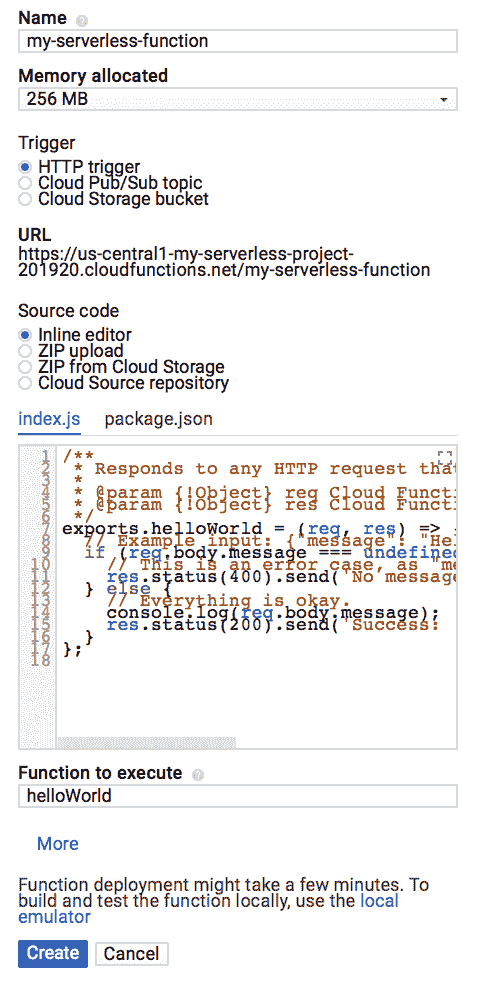

# 第六章：使用 Google Functions 的 DevOps

Google 决定将其无服务器平台推出为 Cloud Functions，但它仍处于成熟阶段。在写这本书时，我们只能使用 Node.js 编写 Google Cloud Functions。这些函数可以通过 Google 内部的事件总线——Pub/Sub 和通过 HTTP 作为来自 Firebase 的移动事件触发。我不会深入讨论 Google Functions 的功能，因为我们在前面的章节中已经讲解过了。因此，在本章中，我们将讨论如何将 DevOps 应用于 Google Functions，以及部署、发布管理、监控和日志记录的最佳实践。我们将通过 `gcloud` 命令行、Serverless Framework 和 Jenkins 进行各种示例和演示。好了，让我们进入 DevOps 主题。

# 使用 Google Functions 的 CI 和 CD 流水线

由于 Google 目前只允许使用 JavaScript 编写代码，因此我们将在本书中使用 Node.js，并提供示例和演示。Google 将其无服务器函数称为 Cloud Functions，因此我们将在本章中始终使用这个术语。因此，Cloud Functions 需要用 JavaScript 编写，并在 Node.js v6.11.5（在写这本书时）中执行，且云函数的源代码必须以 Node.js 模块形式导出。该模块将通过 `require()` 调用加载。因此，函数都包含在一个 `index.js` 文件中。我们可以通过 HTTP 请求方法（如 `GET`、`POST`、`PUT`、`OPTIONS` 和 `DELETE`）来调用该函数。部署可以通过 Google Cloud CLI 提供的命令行工具、GCP 控制台上的云函数 UI 或通过无服务器框架来完成。在本章中，我们将探讨每种方式。可部署的文件是一个 ZIP 文件，其中包含打包的函数，并部署到 Google Cloud 存储桶中。函数的源代码也可以直接放入 Cloud Functions，或者通过上传到 Google Cloud 存储桶来引用它。让我们看看如何通过 Jenkins 流水线进一步自动化函数的部署。

# 云函数的前提条件

让我们来看一下如何使用 GCP 控制台创建和部署云函数。但在此之前，我们需要先访问 Google Cloud Functions 平台。在写这本书时，Google 提供了一个免费的 GCP 账户，内含 300 美元的信用额度，有效期为一年，可用于 GCP 上的任何产品。接下来让我们创建一个。请按照以下步骤操作：

1.  访问以下链接：[`cloud.google.com/free/`](https://cloud.google.com/free/)。

1.  点击“免费试用”按钮，页面将重定向到 Google 账户页面。如果您已经有 Google 账户，可以直接使用它，或者创建一个新的 Google 账户。

1.  输入凭据后，您将被重定向到 GCP 首页。

1.  由于帐户已创建，我们将创建一个 GCP 项目。请前往“管理资源页面”([`console.cloud.google.com/cloud-resource-manager`](https://console.cloud.google.com/cloud-resource-manager))。

1.  我们现在将创建一个项目，点击“创建项目”，输入项目名称为 `My Serverless Project` 并点击“创建”。您将在页面右上角的通知铃铛图标中看到项目正在创建。创建完成后，刷新页面，您将看到该项目出现在列表中。

1.  现在通过打开链接启用项目的云 API：[`console.cloud.google.com/flows/enableapi?apiid=cloudfunctions&redirect=https://cloud.google.com/functions/quickstart`](https://console.cloud.google.com/flows/enableapi?apiid=cloudfunctions&redirect=https://cloud.google.com/functions/quickstart)。页面会显示一个下拉列表，供您选择项目。选择“我的无服务器项目”并点击“继续”，然后该 API 将为项目启用。

1.  我们现在将安装并配置 Google Cloud SDK。以下链接将引导您完成此过程：[`cloud.google.com/sdk/docs/`](https://cloud.google.com/sdk/docs/)。在执行 `gcloud init` 时，您将被提示选择项目。选择我们创建的项目“我的无服务器项目”，并且我们也将完成 GCP 认证。

1.  设置 Node.js 环境。

# 通过 GCP 控制台使用云函数

我们现在将通过 GCP 控制台创建云函数：

1.  前往 GCP 控制台中的云函数概览页面，从下拉列表中选择关联的项目。

1.  点击创建函数。

1.  将函数命名为 `my-serverless-function`。

1.  选择触发器为 HTTP 触发器。

1.  我们使用默认代码，因此它应该由内联编辑器检查。文本区域中会有两个脚本，一个是 `index.js`，另一个是 `package.json`。这是 Google Functions 提供的一个简单的 `helloworld` 函数。该函数会记录您在后续步骤中提供的消息。完成步骤后，您将看到类似下面的截图：



1.  点击创建按钮。现在，功能将被部署，GCP 控制台将重定向到“概览”页面。在功能部署过程中，旁边的图标是一个小的旋转图标。部署完成后，旋转图标将变为绿色勾号。

1.  我们将测试该功能。点击页面右侧特定功能旁边的三个竖点，然后点击“测试功能”：


1.  我们将被重定向到一个函数测试页面。在触发事件字段中，将文本替换为 `{"message":"Hello World!"}` 并点击“测试函数”。在输出字段中，我们应该看到 `Success: Hello World!`，在日志字段中，状态码 200 表示函数运行成功。我们可以通过点击每个日志的箭头查看详细日志。

1.  我们可以通过点击右上角的“查看日志”来查看日志历史。因此，这就是我们通过 GCP 控制台创建和部署函数，并查看函数日志及其历史的方式：


# 使用 `gcloud` 命令行部署云函数

本章的这一部分，我们将通过 `gcloud` 命令行部署 `helloworld` 应用程序。首先，我们需要通过“管理资源”页面创建一个 GCP 项目，启用云函数 API 作为前提条件，最重要的是，已经在本地安装了 `gcloud` SDK：

1.  让我们更新 `gcloud` 组件。打开命令提示符，输入以下命令。你将被提示使用 `gcloud beta` 命令安装组件。安装后，`gcloud` 选中的组件将被安装并在本地配置：

```
$ gcloud components update && gcloud components install beta
```

我们也可以使用 Google Cloud Shell 来跟随部署步骤（[`console.cloud.google.com/?cloudshell=true`](https://console.cloud.google.com/?cloudshell=true)）。Google Cloud Shell 是一个命令行环境，GCP 控制台中预装了 `gcloud` SDK。

1.  让我们为此创建一个函数。我们需要创建一个目录，以便我们的函数放置在其中：

```
$ mkdir helloServerless
$ cd helloServerless
```

1.  让我们在 `helloServerless` 目录下创建一个文件 `index.js`，并填入以下内容：

```
/**
* HTTP Cloud Function.
 * @param {Object} req Cloud Function request context.
 * @param {Object} res Cloud Function response context.
 */
exports.helloServerless = (req, res) => {
  res.send('Hello My Serverless World!');
};
```

1.  我们将使用以下命令部署函数。该命令会将函数部署到 GCP 中。`--trigger-http` 是我们需要指定的触发器。通过此触发器部署时，函数将分配一个端点，可以使用 `describe` 命令查看该端点。部署时可以使用多种不同的触发器：

```
$ gcloud beta functions deploy helloServerless --trigger-http

Deploying function (may take a while - up to 2 minutes)...done.
 availableMemoryMb: 256
 entryPoint: helloServerless
 httpsTrigger:
 url: https://[GCP_REGION]-[PROJECT_ID].cloudfunctions.net/helloServerless
 labels:
 deployment-tool: cli-gcloud
 name: projects/my-serverless-project-201920/locations/us-central1/functions/helloServerless
 serviceAccountEmail: my-serverless-project-201920@appspot.gserviceaccount.com
 sourceUploadUrl: https://storage.googleapis.com/gcf-upload-us-central1-39234144-2d9a-4a19-bf5f-82ef8d19a71b/d2611724-50d0-4339-9ee5-9d140aa674ae.zip?GoogleAccessId=37314512027@cloudservices.gserviceaccount.com&Expires=1524947393&Signature=WCwiJ8E%2B8a6EMMZiz5cWG%2FE%2F7pt8V%2FbqIDyW68utF%2FQXMJR0Pt94e0fC8DcqHbWBAEqHaE9%2B71fOYoWVcXg%2FWos38q%2FIfl%2BTNfaavRr9WyIi6V3M5our8aNI%2FGcntOrHm%2FpMK2LdiBzN6QI%2FiDjPDaA5%2FXohjLD%2BLaGGDHEoHp97%2BqCA7Mzifs%2B%2BhNcYknZ0vjLdpegUqfTUVjDF1h%2BQqg68sIurtT14Bay3uXryeMqYB%2FZv0lTjZIsd7svnUZtXZTNi72HOzP2J7vo1qo%2B74hO7Yy7WJOj2yvDKiFJ4ZXyk8cXvPu3ooNV%2BGy2dc758CFl3u87M%2FuKJV%2Bl0VkDwnQ%3D%3D
 status: ACTIVE
 timeout: 60s
 updateTime: '2018-04-28T19:59:54Z'
 versionId: '1'
```

1.  一旦函数成功部署，我们可以通过部署输出中的 URL 属性执行该函数，或者通过以下命令获取 URL：

```
$ gcloud beta functions describe helloServerless
```

1.  复制、粘贴并运行 URL，在任何浏览器中打开后，我们应该能够看到以下信息：

```
Hello My Serverless World!
```

如此，你可以看到通过 `gcloud` 在 GCP 上部署函数是多么简单。但我们如何确保对其进行单元测试、集成测试，最终实现自动化部署呢？这就是我们将在本章后续部分讨论的内容。不过，大部分工作我们可以通过设置本地开发环境来完成。

# 本地构建和测试

由于云函数运行在 `Node.js` 环境中，我们可以仅使用带有开发工具的 `Node.js` 模拟器在本地构建和测试应用程序。该模拟器是开源的，代码托管在 GitHub 上。让我们看看如何使用它：

1.  通过 npm 或 Yarn 安装模拟器；你需要确保机器上已安装 `Node.js`：

```
$ npm install -g @google-cloud/functions-emulator

/usr/local/bin/functions-emulator -> /usr/local/lib/node_modules/@google-cloud/functions-emulator/bin/functions
 /usr/local/bin/functions -> /usr/local/lib/node_modules/@google-cloud/functions-emulator/bin/functions

> @google-cloud/functions-emulator@1.0.0-beta.4 postinstall /usr/local/lib/node_modules/@google-cloud/functions-emulator
 > node scripts/upgrade-warning

 If you're using the Emulator via the Firebase CLI, you can
 disregard this message.

If you're upgrading @google-cloud/functions-emulator, these
 are the recommended upgrade steps:
1\. Stop the currently running emulator, if any:
functions stop
2\. Uninstall the current emulator, if any:
npm uninstall -g @google-cloud/functions-emulator
3\. Install the new version of the emulator:
npm install -g @google-cloud/functions-emulator

If you have trouble after upgrading, try deleting the config
 directory found in:

~/.config/configstore/@google-cloud/functions-emulator

Then restart the emulator. You can also check for any renegade
 Node.js emulator processes that may need to be killed:

ps aux | grep node
+ @google-cloud/functions-emulator@1.0.0-beta.4
 added 314 packages in 21.252s
```

1.  让我们启动模拟器。此命令将启动模拟器并等待提示：

```
$ functions start
 Warning: You're using Node.js v8.9.2 but Google Cloud Functions only supports v6.11.5.
 Starting Google Cloud Functions Emulator...
 Google Cloud Functions Emulator STARTED
 No functions deployed "_". Run functions deploy --help for how to deploy a function.
```

1.  在本地部署函数；在函数文件夹之前进入一个文件夹并运行以下命令：

```
$ functions deploy helloServerless --trigger-http
 Warning: You're using Node.js v8.9.2 but Google Cloud Functions only supports v6.11.5.
 Copying file:///var/folders/mj/74rcnfp94ll_sj3s95z4nnx00000gn/T/tmp-6681yxqJsPl2WsYI.zip...
 Waiting for operation to finish...done.
 Deploying function......done.
 Function helloServerless deployed.
 ┌────────────┬──────────────────────────────────────────────────────────────────────────────────┐
 │ Property │ Value │
 ├────────────┼──────────────────────────────────────────────────────────────────────────────────┤
 │ Name │ helloServerless │
 ├────────────┼──────────────────────────────────────────────────────────────────────────────────┤
 │ Trigger │ HTTP │
 ├────────────┼──────────────────────────────────────────────────────────────────────────────────┤
 │ Resource │ http://localhost:8010/my-serverless-project-201920/us-central1/helloServerless │
 ├────────────┼──────────────────────────────────────────────────────────────────────────────────┤
 │ Timeout │ 60 seconds │
 ├────────────┼──────────────────────────────────────────────────────────────────────────────────┤
 │ Local path │ /Users/<username>/Documents/packt/chapter6/googlefunction_hello_world │
 ├────────────┼──────────────────────────────────────────────────────────────────────────────────┤
 │ Archive │ file:///var/folders/mj/74rcnfp94ll_sj3s95z4nnx00000gn/T/tmp-6681yxqJsPl2WsYI.zip │
 └────────────┴──────────────────────────────────────────────────────────────────────────────────┘
```

1.  打开输出中提到的 URL 在浏览器中查看。你应该看到消息 `Hello My Serverless World!`；或者通过命令行执行：

```
$ functions call helloServerless
 Warning: You're using Node.js v8.9.2 but Google Cloud Functions only supports v6.11.5.
 ExecutionId: 4b32f8b9-2452-45ee-a0c9-57f2fd3f9d8a
 Result: Hello My Serverless World!
```

1.  此外，你还可以查看以下日志：

```
 $ functions call helloServerless
 Warning: You're using Node.js v8.9.2 but Google Cloud Functions only supports v6.11.5.
 ExecutionId: 4b32f8b9-2452-45ee-a0c9-57f2fd3f9d8a
 Result: Hello My Serverless World!
 <username>s-MacBook-Pro:googlefunction_hello_world <username>$ functions logs read
 Warning: You're using Node.js v8.9.2 but Google Cloud Functions only supports v6.11.5.
 2018-04-28T20:54:55.907Z - info: User function triggered, starting execution
 2018-04-28T20:54:55.914Z - info: Execution took 11 ms, user function completed successfully
 2018-04-28T20:56:10.393Z - info: User function triggered, starting execution
 2018-04-28T20:56:10.394Z - info: Execution took 1 ms, user function completed successfully
 2018-04-28T21:07:14.853Z - info: User function triggered, starting execution
 2018-04-28T21:07:14.859Z - info: Execution took 6 ms, user function completed successfully
 2018-04-28T21:12:13.228Z - info: User function triggered, starting execution
 2018-04-28T21:12:13.229Z - info: Execution took 0 ms, user function completed successfully
```

有关模拟器的更多细节可以在以下链接中找到。我们可以将模拟器与我们最喜欢的开发工具集成，并调试 Google 函数：[`github.com/GoogleCloudPlatform/cloud-functions-emulator`](https://github.com/GoogleCloudPlatform/cloud-functions-emulator)。关于调试 Cloud Functions：[`github.com/GoogleCloudPlatform/cloud-functions-emulator/wiki/Debugging-functions`](https://github.com/GoogleCloudPlatform/cloud-functions-emulator/wiki/Debugging-functions)。

# 持续集成和持续部署（CI/CD）与测试

到目前为止，我们只是创建了一个函数，并提出了几种构建和部署的方法。我们还学会了如何通过模拟器在本地运行函数。但是，我们不能每次手动构建和部署每个函数，而且我们还应该对代码进行版本控制。在本部分的章节中，我们将深入探讨这些方面。

# 源代码管理

**源代码管理**是软件开发中非常重要的一部分。最佳做法是对代码进行版本控制和标签管理。Git 是最流行的源代码管理工具，我们在本章中一直在使用它。因此，为了实现完美的部署周期，我们应该始终创建不同的分支。包括功能分支、开发分支、发布分支，以及默认的主分支。我在之前的章节中已经讲解了有关最佳实践的内容，因此在这里不再讨论分支结构以及代码在分支间的流动管理。然而，关于 Cloud Functions 的文件夹结构是非常重要的。在之前的章节中，我们将函数写在了 `index.js` 中。如果函数数量较少，完全可以将它们管理在 `index.js` 文件中。但如果函数数量达到几百个，那么将它们集中在一个文件中管理就会变得非常繁琐和痛苦。因此，组织函数的一种简单方式如下所示：

```
├── /build/                # Compiled output for Node.js 6.x
├── /src/                    # Application source files
│   ├── someFuncA.js         # Function A
│   ├── someFuncA.test.js    # Function A unit tests
│   ├── someFuncB.js         # Function B
│   ├── someFuncB.test.js    # Function B unit tests
├── index.js                 # Main export(s)
└── package.json             # List of project dependencies and NPM scripts
```

结构化的方式有很多种，但我保持了简单。然而，我会让开发者自行决定结构。

# 持续集成与测试

持续集成和测试是开发周期中另一个重要方面。持续集成将代码合并在一起，测试确保进入生产环境的代码没有错误，并且大多数问题在低环境中得到解决。测试有许多不同的方式：单元测试、集成测试和系统测试。我们将在示例中将这些测试集成到自动化流水线中。我将使用谷歌云提供的示例和一个简单的`hello world`函数，自动化运行它们，然后将它们放入流水线进行一键部署。

我已经创建了一个`HelloWorld`函数，参考了谷歌现有的示例代码库。我已将其放入我的本地代码库中，我们将使用这个库来设置持续集成和测试。我还创建了一个 Dockerfile，它将帮助我们创建一个用于 Jenkins 的 Docker 容器，容器中预安装了`gcloud`、Node.js 和我们将在设置 DevOps 自动化时使用的函数模拟器：

1.  克隆以下提到的 Git 代码库。我们将其克隆到本地，以获取 Dockerfile，你可以通过修改脚本并测试部署进行尝试：

```
$ git clone https://github.com/shzshi/google-functions-helloworld.git
```

1.  我们将在本地构建一个 Docker 镜像，然后启动 Jenkins 门户，以便我们能够设置自动化。你需要确保在本地机器上安装了 Docker，以便运行此示例。

1.  我们进入 Dockerfile 目录：

```
$ cd google-functions-helloworld
```

1.  我们创建一个包含 Jenkins、`gcloud`、函数模拟器、Node.js 和所有其他所需库的 Docker 镜像：

```
$ docker image build -t google-functions .
```

1.  在这里，运行前一行创建的 Docker 容器。Docker 容器将在本地托管，暴露`8080`和`50000`端口。我们还将与本地主机目录映射卷：

```
$ docker run --rm -it -p 50000:50000 -p 8080:8080 -v /My/Local/Host/PATH/chapter6/google-functions/jenkins:/var/jenkins_home google-functions:latest
```

1.  一旦容器运行，我们将通过`http://localhost:8080`浏览 Jenkins 门户。如果这是第一次创建此容器且未映射卷，你将被要求复制并粘贴密码并安装默认插件。

1.  使用之前创建的凭证登录 Jenkins 门户，或者使用已有的凭证。然后点击 New Item。

1.  输入项目名称为`my-serverless-google-functions`，选择 freestyle 项目，然后点击 OK。

1.  进入 Source Code Management 标签页，选择 Git，然后将下面提到的代码库 URL 复制并粘贴到 Repository URL 文本框中，其他保持默认：[`github.com/shzshi/google-functions-helloworld.git`](https://github.com/shzshi/google-functions-helloworld.git)

1.  我们需要在 Jenkins 中为`gcloud`创建一个 Google 服务账户，以便与 GCP 进行身份验证：

    +   访问 OPEN THE LIST OF CREDENTIALS 页面 ([`console.cloud.google.com/apis/credentials?_ga=2.77044693.-1734735492.1524930885`](https://console.cloud.google.com/apis/credentials?_ga=2.77044693.-1734735492.1524930885))

    +   点击 Create Credentials

    +   选择 Service Account Key

    +   点击下拉菜单中的 Service account，并选择 New Service Account

    +   在 Name 中输入服务账户名称

    +   使用默认的服务账户 ID 或生成一个不同的 ID

    +   选择密钥类型：JSON

    +   点击创建，显示服务账户创建窗口，并且您选择的密钥类型的私钥会自动下载到本地计算机，我们将在后续使用它。

    +   点击关闭

1.  您需要分叉您的代码库，并将 `gcloud` 服务账户密钥 JSON 文件的内容复制到文件 `My-Serverless-Project-1d8bacd4886d.json` 中，因为我们将在 Jenkins 中使用此 JSON 文件进行身份验证：[`github.com/shzshi/google-functions-helloworld.git`](https://github.com/shzshi/google-functions-helloworld.git)。

1.  转到 Build 选项卡，在下拉菜单的 Add build step 中选择 Execute Shell，然后将以下步骤添加到 Command 文本区域：

```
gcloud auth activate-service-account --key-file=${WORKSPACE}/My-Serverless-Project-1d8bacd4886d.json
 gcloud config set project ${YOUR_GCP_PROJECT_ID}
 npm install

 export NODE_PATH=${WORKSPACE}/node_modules

# executing unit test
 ${WORKSPACE}/node_modules/.bin/ava test/unit.http.test.js

 # executing integration test
 export BASE_URL=http://localhost:8010/${YOUR_GCP_PROJECT_ID}/${YOUR_GCF_REGION}
${WORKSPACE}/node_modules/.bin/functions start
${WORKSPACE}/node_modules/.bin/functions deploy helloHttp --trigger-http
${WORKSPACE}/node_modules/.bin/ava test/integration.http.test.js
 # deploying to GCP project and executing system test
 gcloud beta functions deploy helloHttp --trigger-http
export BASE_URL=https://${YOUR_GCF_REGION}-${YOUR_GCP_PROJECT_ID}.cloudfunctions.net/helloHttp
${WORKSPACE}/node_modules/.bin/ava test/system.http.test.js
```

1.  我们需要对作业进行参数化，这意味着我们需要添加两个文本参数，一个是 `gcloud` 项目 ID，另一个是 `gcloud` 区域。按照以下截图添加参数。**默认值**需要更改为您的项目名称和区域：


1.  一切看起来正常后，按照前面 13 个步骤中的说明，点击 SAVE，保存项目。

1.  要运行作业，请点击 Build with Parameters 并使用默认参数运行作业。

1.  如果作业成功运行，我们应该看到以下输出，因此 Google Function 已成功通过单元测试、集成测试和系统测试：

```
Building in workspace /var/jenkins_home/workspace/my-serverless-google-functions
 > git rev-parse --is-inside-work-tree # timeout=10
Fetching changes from the remote Git repository
 > git config remote.origin.url https://github.com/shzshi/google-functions-helloworld.git # timeout=10
Fetching upstream changes from https://github.com/shzshi/google-functions-helloworld.git
 > git --version # timeout=10
 > git fetch --tags --progress https://github.com/shzshi/google-functions-helloworld.git +refs/heads/*:refs/remotes/origin/*
 > git rev-parse refs/remotes/origin/master^{commit} # timeout=10
 > git rev-parse refs/remotes/origin/origin/master^{commit} # timeout=10
Checking out Revision bbfb5c17a65dab7f0a8e0b3dc3de82e5792fe21d (refs/remotes/origin/master)
 > git config core.sparsecheckout # timeout=10
 > git checkout -f bbfb5c17a65dab7f0a8e0b3dc3de82e5792fe21d
Commit message: "added function emulator"
 > git rev-list --no-walk bbfb5c17a65dab7f0a8e0b3dc3de82e5792fe21d # timeout=10
[my-serverless-google-functions] $ /bin/sh -xe /tmp/jenkins2470859504083131546.sh
+ gcloud auth activate-service-account --key-file=/var/jenkins_home/workspace/my-serverless-google-functions/My-Serverless-Project-1d8bacd4886d.json
Activated service account credentials for: [jenkins@my-serverless-project-201920.iam.gserviceaccount.com]
+ gcloud config set project my-serverless-project-201920
Updated property [core/project].
+ npm install
npm WARN optional SKIPPING OPTIONAL DEPENDENCY: fsevents@1.2.3 (node_modules/fsevents):
npm WARN notsup SKIPPING OPTIONAL DEPENDENCY: Unsupported platform for fsevents@1.2.3: wanted {"os":"darwin","arch":"any"} (current: {"os":"linux","arch":"x64"})

up to date in 30.041s
+ export NODE_PATH=/var/jenkins_home/workspace/my-serverless-google-functions/node_modules
+ /var/jenkins_home/workspace/my-serverless-google-functions/node_modules/.bin/ava test/unit.http.test.js

   helloHttp: should print a name
   helloHttp: should print hello world

  2 tests passed

+ export BASE_URL=http://localhost:8010/my-serverless-project-201920/us-central1
+ /var/jenkins_home/workspace/my-serverless-google-functions/node_modules/.bin/functions start
Warning: You're using Node.js v8.11.1 but Google Cloud Functions only supports v6.11.5.
Starting Google Cloud Functions Emulator...
Google Cloud Functions Emulator STARTED
┌────────┬───────────┬─────────┬──────────────────────────────────────────────────────────────────────────┐
│ Status │ Name      │ Trigger │ Resource                                                                 │
├────────┼───────────┼─────────┼──────────────────────────────────────────────────────────────────────────┤
│ READY  │ helloHttp │ HTTP    │ http://localhost:8010/my-serverless-project-201920/us-central1/helloHttp │
└────────┴───────────┴─────────┴──────────────────────────────────────────────────────────────────────────┘
+ /var/jenkins_home/workspace/my-serverless-google-functions/node_modules/.bin/functions deploy helloHttp --trigger-http
Warning: You're using Node.js v8.11.1 but Google Cloud Functions only supports v6.11.5.
Copying file:///tmp/tmp-1653qKGF3wXgKZdC.zip...
Waiting for operation to finish...done.
Deploying function............done.
Function helloHttp deployed.
┌────────────┬──────────────────────────────────────────────────────────────────────────┐
│ Property   │ Value                                                                    │
├────────────┼──────────────────────────────────────────────────────────────────────────┤
│ Name       │ helloHttp                                                                │
├────────────┼──────────────────────────────────────────────────────────────────────────┤
│ Trigger    │ HTTP                                                                     │
├────────────┼──────────────────────────────────────────────────────────────────────────┤
│ Resource   │ http://localhost:8010/my-serverless-project-201920/us-central1/helloHttp │
├────────────┼──────────────────────────────────────────────────────────────────────────┤
│ Timeout    │ 60 seconds                                                               │
├────────────┼──────────────────────────────────────────────────────────────────────────┤
│ Local path │ /var/jenkins_home/workspace/my-serverless-google-functions               │
├────────────┼──────────────────────────────────────────────────────────────────────────┤
│ Archive    │ file:///tmp/tmp-1653qKGF3wXgKZdC.zip                                     │
└────────────┴──────────────────────────────────────────────────────────────────────────┘
+ /var/jenkins_home/workspace/my-serverless-google-functions/node_modules/.bin/ava test/integration.http.test.js

   helloHttp: should print a name (110ms)
   helloHttp: should print hello world (104ms)

  2 tests passed

+ gcloud beta functions deploy helloHttp --trigger-http
Deploying function (may take a while - up to 2 minutes)...
.............done.
availableMemoryMb: 256
entryPoint: helloHttp
httpsTrigger:
  url: https://us-central1-my-serverless-project-201920.cloudfunctions.net/helloHttp
labels:
  deployment-tool: cli-gcloud
name: projects/my-serverless-project-201920/locations/us-central1/functions/helloHttp
serviceAccountEmail: my-serverless-project-201920@appspot.gserviceaccount.com
sourceUploadUrl: https://storage.googleapis.com/gcf-upload-us-central1-39234144-2d9a-4a19-bf5f-82ef8d19a71b/5433a10a-52ed-4330-b68a-f3c3be016035.zip?GoogleAccessId=37314512027@cloudservices.gserviceaccount.com&Expires=1525049193&Signature=C3H2oyjrieTuykum%2BH09BqZO63bCXE4vlrWVzOhEMTBAoPAUFTHU96JVqTk7ZiGdl2iv34a7FlR70vE9oo4jnnZApVtCYHVSY9JA3X%2BAn4VR4Aw510UUC7ilZbGGJ5U3eyk1bVlzQxTkx20Mq6yx8JUQqRMj%2FTisHqs0MCHC9k83NJj6JQdF%2BbgVLzPg%2Bfrm06kZzhKqKmLQ7XOMXwSHlm%2F74N6%2B5JyByPvtPlHqgGoIdW8X7eyys4%2B22X3zU0Z3MjXG7emlA9t4Hrpa3oQ0AUiSD78b1Mnfbz%2FYXdj%2BKDY4fjv5JQcOBZLj8DEw8sbcSdJcIvvAKrPwcKy7Y1eiMg%3D%3D
status: ACTIVE
timeout: 60s
updateTime: '2018-04-30T00:16:35Z'
versionId: '2'
+ export BASE_URL=https://us-central1-my-serverless-project-201920.cloudfunctions.net/helloHttp
+ /var/jenkins_home/workspace/my-serverless-google-functions/node_modules/.bin/ava test/system.http.test.js

   helloHttp: should print hello world (371ms)
   helloHttp: should print a name (1.3s)

  2 tests passed

Finished: SUCCESS

```

所以，通过前面的示例，我们能够在本地和 `gcloud` 上构建、测试和部署函数。但我们只是随意地在一个项目上做了这一切。想象一下，如果我们需要有多个环境、性能系统和性能测试，并且尽可能减少手动干预，我们需要设置一个包含审批环节的管道，将函数部署到多个环境，在函数实际投入生产之前解决大部分问题。这就是持续交付发挥作用的地方。

# 使用 Google Functions 进行持续交付

**持续交付**是通过 减少风险、频繁交付并快速反馈，帮助加速产品上市的过程。那么，如何在 Google Cloud Functions 上做到这一点呢？有很多方法可以做到这一点，但我想使用无服务器框架来实现这一目标。这样做有几个原因。其中一个原因是，无服务器框架是一个非常成熟的无服务器功能部署框架。它支持许多不同的供应商，正如我们所看到的，并且有很好的社区支持。我们甚至可以通过 `gcloud` 和 Jenkins 管道来实现持续交付。我们将重用本章前面部分中使用的大部分设置。

# Google 环境

为任何类型的应用程序设置持续交付时，拥有多个环境是至关重要的。但对于无服务器架构，环境的划分并不明确。因此，我们总是需要想出替代方案。我们对 Cloud Functions 也需要做同样的事情。我们通过两种方式设置环境分离——首先，我们可以为环境使用不同的名称来分隔功能，例如 `my-serverless-dev`、`my-serverless-sit` 或 `my-serverless-prod`，但这会增加不必要的复杂性。因此，理想的方式是通过创建不同的项目来分隔环境，如下所示：

1.  登录到 GCP 控制台，转到**管理资源页面**([`console.cloud.google.com/cloud-resource-manager?_ga=2.108039562.-900655901.1524348645`](https://console.cloud.google.com/cloud-resource-manager?_ga=2.108039562.-900655901.1524348645))，点击**创建项目**，在**项目名称**文本框中输入 `Serverless-SIT`，然后点击**创建**。你会看到项目正在创建，页面右上角的通知铃铛图标会显示进度。创建完成后，刷新页面，你将看到项目出现在列表中。同样地，我们将创建 `Serverless-UAT` 和 `Serverless-PROD` 项目。由于我们为 `dev` 环境使用的是本地模拟器，因此我不创建 `dev` 项目。

1.  通过打开链接来为项目启用云 API：[`console.cloud.google.com/flows/enableapi?apiid=cloudfunctions&redirect=https://cloud.google.com/functions/quickstart`](https://console.cloud.google.com/flows/enableapi?apiid=cloudfunctions&redirect=https://cloud.google.com/functions/quickstart)。页面将显示一个项目下拉列表，选择**My Serverless Project**并点击**继续**，然后 API 将会为该项目启用。

1.  登录到 Jenkins 门户 (`http://localhost:8080`)，这是我们在本章的前面部分创建的。然后点击**新建项目**。

1.  在文本框中输入项目名称为 `my-serverless-google-function-pipeline`，然后从列表中选择**管道**，再点击**确定**。

1.  勾选**此项目为参数化**复选框，然后在**添加参数**下拉菜单中选择**字符串参数**。接着，在名称文本框中输入 `DEV_PROJECT_ID`，并在**默认值**文本框中输入我们在步骤 1 中创建的 `dev` 项目的 `project id`。同样，针对每个环境，我们可以创建一个文本参数，直到 `PROD`，最后一个文本参数应为 `YOUR_GCF_REGION`。

1.  点击管道选项卡，在定义下拉菜单中选择**从 SCM 脚本管道**，在 SCM 下拉菜单中选择**Git**。现在，在仓库 URL 文本框中输入 `https://github.com/shzshi/google-functions-helloworld.git`，然后保持其他设置为默认，点击**保存**。

1.  一旦任务保存完成，我们将构建流水线，为此我们需要点击**Build with Parameters**，这样我们可以看到每个参数的默认值。如果你想更改环境或添加不同的项目 ID，我们可以通过文本框输入。

1.  现在点击“Build”，该任务应该首先初始化，即设置先决条件，然后它会运行单元测试，接着功能会被部署到本地开发环境中，之后进行集成测试。接下来的阶段中，功能会被部署到 UAT 环境中，其他环境也会进行同样的操作。生产环境的部署已经设置了有条件的审批。这个流水线可以通过多种方式完成。

# 监控与日志记录

Google 提供了一个仪表板，用于查看调用情况，并通过控制台查看调用日志。所以，一旦登录到控制台并选择特定的功能，我们应该能够看到调用图，并且能够查看执行时间和使用的内存。我们可以查看源代码并测试该功能。如果点击**View Logs**，如以下截图所示，我们应该能够看到调用日志，并且可以深入查看详细日志：


通过仪表板，Google Cloud 还提供了一个监控和日志记录平台，称为**stackdriver**。它为我们展示了 Cloud Function 的健康、性能和可用性的洞察。它与 Google Cloud 平台原生集成。Stackdriver 提供了各种各样的指标、仪表板、告警、日志管理、报告和跟踪功能。

它有先进的告警功能，帮助你快速识别问题。集成的日志记录、跟踪和错误报告能够快速深入分析并找出根本原因。

Stackdriver 让你可以访问日志、指标、跟踪和来自基础设施平台（如虚拟机、容器、中间件和应用层）的其他信号，帮助你从最终用户到后端服务和基础设施跟踪问题。对分布式系统、自动扩展和短暂资源的原生支持意味着你的监控能够无缝地与现代架构兼容。

# 最佳实践

Google Function 仍在 Beta 阶段，正在评估并日益改进。在 DevOps 的最佳实践方面，它与我在上一章节中建议的内容相似，我会推荐使用无服务器框架来自动化 Google Functions 中的部署。无服务器框架还提供了一个模板，用于为 Node.js 创建基本的功能设置。

在整个组织中发展 DevOps 文化并将单体应用程序转向微服务会产生巨大影响。但我们应该能够引导团队走上正确的道路。这需要一些指导，并通过新流程和术语来教育团队。

我们还必须将安全性扩展到 DevOps 工具和组织中。安全性应该是 DevOps 每个方面的一部分，从自动化测试、持续集成到持续部署过程，涵盖云平台中的所有内容。关注云中 DevOps 安全性监控是很有必要的，且应有专门的人负责此事。

**供应商锁定**在我们在 AWS 上开发功能或项目后，想要迁移到 Google Cloud 时，确实是很痛苦的。代码必须根据供应商要求进行修改。但在部署方面，我建议使用无服务器框架进行 DevOps，因为它能够缓解 DevOps 工具和框架的供应商锁定问题。

# 总结

在本章中，我们学习了如何使用 Google Functions 设置 CI 和 CD，并为 Google Functions 设置动态仪表盘。在下一章，我们将讨论如何设置我们自己的私有无服务器表单。我们还将讨论如何为这个无服务器架构设置 CI 和 CD，以及监控与日志记录、单元测试和集成测试。
