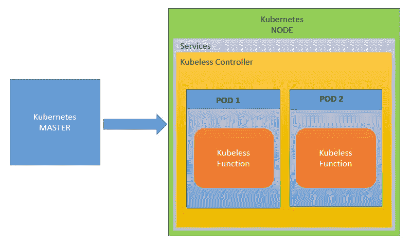
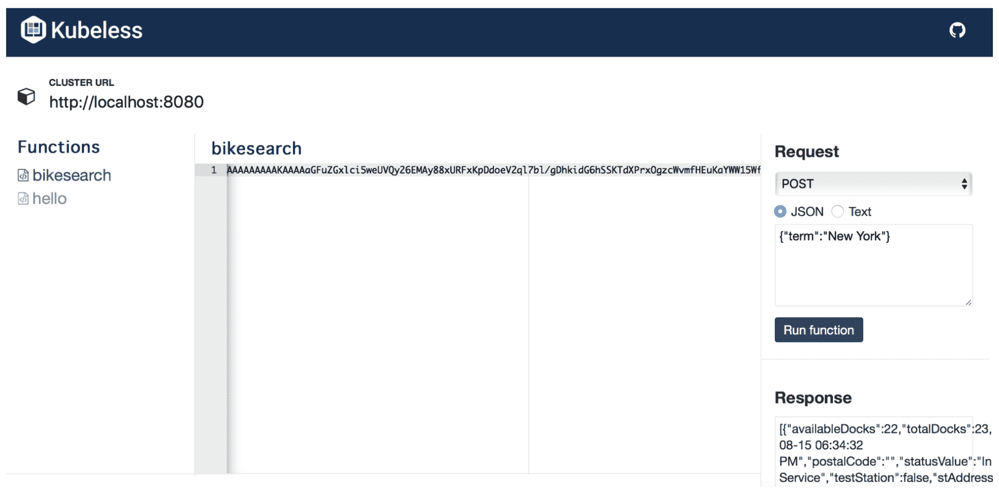

# 为 Kubeless 添加 DevOps 风味

在上一章中，我们了解了 Google Functions 以及如何使用各种不同的工具和过程自动化部署 Google Functions。我们还研究了如何监控和记录服务。本章将介绍另一个开源无服务器框架——Kubeless。我们将学习如何在 minikube 上设置 Kubeless 框架，创建、部署和调用 Kubeless 函数，以及如何构建、部署、记录和监控 Kubeless 函数。

# 什么是 Kubeless？

**Kubeless** 是一个基于 Kubernetes 的开源无服务器框架。它允许我们部署和执行一段代码，而无需担心底层基础设施。它利用 Kubernetes 的资源提供自动扩展、路由和监控功能。部署后的函数可以通过发布–订阅、HTTP 和定时调度触发。发布–订阅事件通过 Kafka 集群进行管理，这是 Kubeless 内置的一个组件，包含一个基础的 Kafka 集群、一个代理和一个 zookeeper。HTTP 触发器通过 Kubernetes 服务提供，定时调度的函数则转化为 cron 作业。Kubeless 支持的语言/运行时包括 `python2.7`、`python3.4`、`python3.6`、`nodejs6`、`nodejs8`、`nodejs_distroless8`、`ruby2.4`、`php7.2`、`go1.10`、`dotnetcore2.0`、`java1.8`、`ballerina0.980.0` 和 `jvm1.8`。Kubeless 还支持 HTTP、NATS、Kafka、cron 和流式触发器。

# Kubeless 架构

Kubeless 使用自定义资源定义，这意味着当你创建自定义资源定义时，Kubernetes API 服务器会为每个指定的版本创建一个资源路径。自定义资源定义可以是命名空间级别的或集群范围的，因此 CRD 被称为函数，这意味着 Kubeless 函数可以像普通的 Kubernetes 资源一样在后台创建，并且会创建一个控制器。控制器将监控这些自定义资源，并在运行时需求下启动。下图展示了该架构的工作原理：



# 如何设置 Kubeless

设置 Kubeless 非常简单。首先，我们从发布页面下载 Kubeless，创建一个命名空间，然后通过发布页面上的 YAML 清单，创建函数的自定义资源定义并启动控制器。如果你是在个人笔记本电脑上设置 Kubeless，那么我们需要使用 minikube 来实现这一点。接下来，让我们看看如何设置 minikube，因为我们将在本教程中使用它。

首先，通过访问 [`github.com/kubernetes/minikube`](https://github.com/kubernetes/minikube) 设置 minikube。安装完成后，我们应该能够在虚拟机内创建一个单节点的 Kubernetes 集群，并且能够通过命令提示符执行 minikube 命令。接下来，我们将创建一个集群并在其中创建 Kubeless 资源。然后，我们将创建一个简单的 Kubeless 函数并进行部署和调用。我们还将为 minikube 设置仪表盘，并查看控制器和函数是如何分别创建和部署的。让我们来看一下如何实现：

1.  让我们创建一个 minikube 本地 Kubernetes 集群，如以下代码所示：

```
$ minikube start
Starting local Kubernetes v1.9.0 cluster...
Starting VM...
Getting VM IP address...
Moving files into cluster...
Setting up certs...
Connecting to cluster...
Setting up kubeconfig...
Starting cluster components...
Kubectl is now configured to use the cluster.
Loading cached images from config file.
```

1.  接下来，使用以下命令创建一个 minikube 仪表盘。该命令触发后会打开一个浏览器，并显示仪表盘。仪表盘将展示我们的服务、Pod 和管理器：

```
$ minikube dashboard
```

1.  现在我们已经有了集群，让我们将 Kubeless 部署到集群中，如以下代码所示。针对多个 Kubernetes 环境（非 RBAC、RBAC 和 OpenShift）提供了多个 Kubeless 清单。我们将使用非 RBAC（非基于角色的访问控制）清单：

```
$ export RELEASE=$(curl -sk https://api.github.com/repos/kubeless/kubeless/releases/latest | grep tag_name | cut -d '"' -f 4)
$ kubectl create ns kubeless
$ echo $RELEASE
$ kubectl create -f https://github.com/kubeless/kubeless/releases/download/v1.0.0-alpha.8/kubeless-non-rbac-v1.0.0-alpha.8.yaml
serviceaccount "controller-acct" created
customresourcedefinition "functions.kubeless.io" created
customresourcedefinition "httptriggers.kubeless.io" created
customresourcedefinition "cronjobtriggers.kubeless.io" created
configmap "kubeless-config" created
deployment "kubeless-controller-manager" created
```

1.  既然我们已经部署了 Kubeless，让我们检查它是否已正确部署：

```
$ kubectl get pods -n kubeless
NAME READY STATUS RESTARTS AGE
kubeless-controller-manager-c6b69df76-65gsh 1/1 Running 0 2m
$ kubectl get deployment -n kubeless
NAME DESIRED CURRENT UP-TO-DATE AVAILABLE AGE
kubeless-controller-manager 1 1 1 1 3m
$ kubectl get customresourcedefinition
NAME AGE
cronjobtriggers.kubeless.io 3m
functions.kubeless.io 3m
httptriggers.kubeless.io 3m
```

1.  接下来，我们需要在本地安装 Kubeless CLI，用于部署、调用和删除 Kubeless 函数，如以下代码所示：

```
$ export OS=$(uname -s| tr '[:upper:]' '[:lower:]') 
$ curl -OL https://github.com/kubeless/kubeless/releases/download/$RELEASE/kubeless_$OS-amd64.zip
$ unzip kubeless_$OS-amd64.zip 
$ sudo mv bundles/kubeless_$OS-amd64/kubeless /usr/local/bin/
```

1.  让我们创建一个函数并进行部署。以下是一个简单的 Python 函数，我们将部署并调用它。创建一个名为 `test.py` 的文件，内容如下：

```
def hello(event, context):
 print event
 return event['data']
```

Kubeless 中的函数具有相同的格式，无论函数的语言或事件源如何。通常，每个函数将执行以下操作：

+   接收一个对象 **event** 作为其第一个参数。该参数包含关于事件源的所有信息。特别是，`data` 键应包含函数请求的主体。

+   接收第二个对象 **context**，它包含关于该功能的常规信息。

+   返回一个字符串/对象，用作调用者的响应。

1.  现在，让我们部署该函数，当我们刷新 minikube 仪表盘时，应该能够看到部署在其中的 `hello` 函数，如以下代码所示：

```
$ kubeless function deploy hello --runtime python2.7 --from-file test.py --handler test.hello --namespace kubeless
INFO[0000] Deploying function...
INFO[0000] Function hello submitted for deployment
INFO[0000] Check the deployment status executing 'kubeless function ls hello'
```

以下列表解释了前面代码中的各种元素：

+   `kubeless function deploy hello` 告诉 Kubeless 注册一个名为 `hello` 的新函数。通过此名称，函数将在网络上可访问。请注意，这个名称不需要与代码内部使用的函数名称相同（我们稍后会通过 `--handler` 选项指定）。

+   `--trigger-http` 告诉 Kubeless 该函数将通过 HTTP 被调用。也可以通过其他方式触发该函数，但此处未涵盖。

+   `--runtime python2.7` 告诉 Kubeless 使用 Python 2.7 来执行代码。节点也支持作为运行时，未来将支持更多的运行时。

+   `--handler test.hello`告诉 Kubeless 调用代码模块中的哪个函数。你可以在上面的 Python 代码中看到，函数名为`hello`。

+   `--from-file /tmp/hello.py`告诉 Kubeless 上传并使用`/tmp/hello.py`文件作为函数的源文件。也可以通过其他方式传递函数。

我们将通过以下命令看到函数自定义资源的创建：

```
$ kubectl get functions
NAME AGE
hello 2m

$ kubeless function ls --namespace kubeless
NAME NAMESPACE HANDLER RUNTIME DEPENDENCIES STATUS
hello kubeless test.hello python2.7 1/1 READY
```

1.  现在，让我们调用这个函数，如下所示：

```
$ kubeless function call hello --data 'Hello Serverless!' --namespace kubeless
Hello Serverless!
```

1.  我们还可以`delete`该函数，如下所示：

```
$ kubeless function delete hello --namespace kubeless
$ kubeless function ls --namespace kubeless
NAME NAMESPACE HANDLER RUNTIME DEPENDENCIES STATUS
```

到目前为止，我们已经在本地安装了 Kubeless，创建了一个简单的函数，进行了部署、调用和撤销部署。接下来的部分，我们将学习如何使用 Serverless 框架自动化部署。

# 设置持续集成和部署

我们将使用 Serverless 框架来启动 Kubeless 函数的开发和部署。Serverless 框架提供了很多功能，可以轻松地采用 Kubeless。让我们来看看 Serverless 提供的各种功能。

# 创建服务

我们将使用 `create` 命令，通过传递运行时和 `path` 来创建基本服务并生成目录。目前，提供了两种运行时环境——Python 和 Node.js。所以，如果我们使用 `path` 参数运行以下命令，它将创建一个包含简单 Serverless 函数的文件夹。目前可用的运行时有 `kubeless-python` 和 `kubeless-nodejs`：

```
$ serverless create --template kubeless-python --path myKubelessFunc
```

`create` 命令将创建一个服务，并且每个服务的配置都将包含以下三个文件：

+   `serverless.yml`：此文件的主要职责是声明服务、定义提供商、定制插件（在我们的案例中是 serverless-kubeless 插件）、以及函数将执行的事件或触发器，并使用 serverless 变量配置文件。

+   `handler.py`：此文件将包含函数代码。`serverless.yml` 中的函数定义将指向 `handler.py`。

+   `package.json`：这是我们函数的 npm 包定义文件，包含所有依赖项和 `kubeless-serverless` 插件。

让我们更新这些文件，包含我们的函数和配置，具体代码如下所示。我们正在更新一个函数，用于从通过 JSON 暴露的站点源中搜索自行车站。我还将代码上传到了 GitHub 仓库：[`github.com/shzshi/kubeless-serverless.git`](https://github.com/shzshi/kubeless-serverless.git)：

```
#handler.py
import urllib2 
import json 
def find(event, context):     
    term = event['data']['term']     
    url = "https://feeds.capitalbikeshare.com/stations/stations.json"     response = urllib2.urlopen(url)     
    stations = json.loads(response.read())     
    hits = []     
    for station in stations["stationBeanList"]:         
        if station["stAddress1"].find(term) > -1:             hits.append(station)     

    return json.dumps(hits)
```

将 `serverless.yaml` 替换为以下内容：

```
# serverless.yml 
service: bikesearch 
provider:  
    name: kubeless  
    runtime: python2.7 
plugins:  
    - serverless-kubeless 
functions:  
    bikesearch:  
        handler: handler.find
```

# 部署函数

由于所需的文件是通过模板创建的，我们可以根据需要修改它们，然后在需要时简单地部署并调用它们。让我们使用 Serverless 部署它们，然后`npm install`将安装 Serverless 所需的依赖项，例如`kubeless-serverless`插件，接着我们可以部署函数，具体代码如下所示：

```
$ npm install
$ serverless deploy -v
Serverless: Packaging service...
Serverless: Excluding development dependencies...
Serverless: Deploying function bikesearch...
Serverless: Pods status: {"waiting":{"reason":"PodInitializing"}}
Serverless: Function bikesearch successfully deployed
Serverless: Skipping ingress rule generation
```

# 调用函数

Kubeless 函数可以通过命令行或 Kubeless 提供的 UI 调用。Kubeless UI 可以通过将文件下载到本地并运行，或通过使用 Docker 镜像和 Dockerfile，或者通过使用仓库中提供的 Kubernetes 清单来进行配置。对于我们的教程，我将使用 Kubernetes 清单，如下所示：

目前，UI 在 minikube 上工作得非常顺利，但如果你有 RBAC 集群，可能需要做一些调整，或者它也可能在没有任何调整的情况下直接工作。

```
$ kubectl create -f https://raw.githubusercontent.com/kubeless/kubeless-ui/master/k8s.yaml
serviceaccount "ui-acct" created
clusterrole "kubeless-ui" created
clusterrolebinding "kubeless-ui" created
deployment "ui" created
service "ui" created
$ minikube service ui -n kubeless
```

`minikube` 命令会弹出一个浏览器并打开 UI。UI 具有创建、编辑、调用和删除函数的功能，因此调用我们部署的函数。让我们在 `textarea` 请求中添加 `{"term":"New York"} `，选择请求方式为 POST，然后点击运行函数。该函数将成功执行，并显示车站数据响应输出，如下截图所示：



我们也可以通过 Serverless Framework 调用相同的函数，函数将执行并获取所需的数据，如下代码所示：

```
$ serverless invoke --function bikesearch --data '{"term":"Albemarle"}' -l
Serverless: Calling function: bikesearch...
--------------------------------------------------------------------
[ { availableDocks: 12,
 totalDocks: 15,
 city: '',
 altitude: '',
 stAddress2: '',
 longitude: -77.079382,
 lastCommunicationTime: '2018-08-15 04:16:15 PM',
 postalCode: '',
 statusValue: 'In Service',
 testStation: false,
 stAddress1: 'Tenleytown / Wisconsin Ave & Albemarle St NW',
 stationName: 'Tenleytown / Wisconsin Ave & Albemarle St NW',
 landMark: '',
 latitude: 38.947607,
 statusKey: 1,
 availableBikes: 1,
 id: 80,
 location: '' } ]
```

Kubeless UI 仓库可以在 [`github.com/kubeless/kubeless-ui`](https://github.com/kubeless/kubeless-ui) 查找。

# Serverless 日志

如果出了问题会发生什么？我们没有设置错误处理机制，但可以通过在调用函数时传递错误来测试日志。所以，让我们在数据中加入错误并调用函数，如下代码所示：

```
$serverless invoke --function bikesearch --data '{"trm":"Albemarle"}' -l
Serverless: Calling function: bikesearch...

  Error --------------------------------------------------

  Internal Server Error

     For debugging logs, run again after setting the "SLS_DEBUG=*" environment variable.

  Get Support --------------------------------------------
     Docs: docs.serverless.com
     Bugs: github.com/serverless/serverless/issues
     Forums: forum.serverless.com
     Chat: gitter.im/serverless/serverless

  Your Environment Information -----------------------------
     OS: darwin
     Node Version: 6.10.3
     Serverless Version: 1.26.1
```

Serverless 返回了一个带有 500 服务器代码的错误消息，这正是你从一个 web 框架中所期望的。然而，为了更好地调试错误来源，查看 Python 堆栈跟踪信息会非常有帮助。那么，让我们获取日志来看看到底是什么错误：

```
$ serverless logs -f bikesearch
Hit Ctrl-C to quit.
172.17.0.1 - - [15/Aug/2018:20:17:18 +0000] "POST / HTTP/1.1" 200 460 "" "" 0/934928
172.17.0.1 - - [15/Aug/2018:20:17:18 +0000] "GET /healthz HTTP/1.1" 200 2 "" "kube-probe/." 0/133
172.17.0.1 - - [15/Aug/2018:20:17:48 +0000] "GET /healthz HTTP/1.1" 200 2 "" "kube-probe/." 0/72
172.17.0.1 - - [15/Aug/2018:20:18:18 +0000] "GET /healthz HTTP/1.1" 200 2 "" "kube-probe/." 0/108
172.17.0.1 - - [15/Aug/2018:20:18:48 +0000] "GET /healthz HTTP/1.1" 200 2 "" "kube-probe/." 0/123
172.17.0.1 - - [15/Aug/2018:20:19:18 +0000] "GET /healthz HTTP/1.1" 200 2 "" "kube-probe/." 0/74
172.17.0.1 - - [15/Aug/2018:20:19:48 +0000] "GET /healthz HTTP/1.1" 200 2 "" "kube-probe/." 0/138
172.17.0.1 - - [15/Aug/2018:20:20:18 +0000] "GET /healthz HTTP/1.1" 200 2 "" "kube-probe/." 0/75
172.17.0.1 - - [15/Aug/2018:20:20:48 +0000] "GET /healthz HTTP/1.1" 200 2 "" "kube-probe/." 0/149
172.17.0.1 - - [15/Aug/2018:20:21:18 +0000] "GET /healthz HTTP/1.1" 200 2 "" "kube-probe/." 0/187
172.17.0.1 - - [15/Aug/2018:20:21:48 +0000] "GET /healthz HTTP/1.1" 200 2 "" "kube-probe/." 0/147
172.17.0.1 - - [15/Aug/2018:20:22:18 +0000] "GET /healthz HTTP/1.1" 200 2 "" "kube-probe/." 0/71
172.17.0.1 - - [15/Aug/2018:20:22:47 +0000] "POST / HTTP/1.1" 200 2131 "" "" 1/232988
Traceback (most recent call last):
 File "/usr/local/lib/python2.7/dist-packages/bottle.py", line 862, in _handle return route.call(**args)
 File "/usr/local/lib/python2.7/dist-packages/bottle.py", line 1740, in wrapper
 rv = callback(*a, **ka)
 File "/kubeless.py", line 76, in handler
 raise res
KeyError: 'term'

```

从 `KeyError` 这一短语中可以清楚地看到，函数因错误的键名而失败，这给我们提供了了解出错原因的视角。但在类似生产的环境中，我们需要更为复杂的错误处理方法。

# 与 Jenkins 的持续集成

在本书中，我们已经研究了不同 Serverless 提供商的持续集成和持续部署，但就 Kubeless 而言（由于它仍在开发中），仍有许多需要改进的地方。在编写本书时，我发现，使用 Serverless Framework 时，我们只能在本地设置部署，前提是我们的 Kubernetes 集群（minikube）、Serverless Framework 和 Jenkins 已经在本地设置好。没有设置远程部署的功能。但随着 Serverless Framework 和 Kubeless 的成熟，这些功能会逐步添加。在接下来的教程中，我已经创建了文件以便在本地设置部署。

你可以通过阅读以下文章来了解如何设置远程部署：[`aws.amazon.com/blogs/opensource/running-faas-on-kubernetes-cluster-on-aws-using-kubeless/`](https://aws.amazon.com/blogs/opensource/running-faas-on-kubernetes-cluster-on-aws-using-kubeless/)。

如果你克隆了这个仓库：[`github.com/shzshi/kubeless-continuous-integration.git`](https://github.com/shzshi/kubeless-continuous-integration.git)，那么你应该能够使用这个模板在本地设置持续集成。

然而，我们可以在笔记本电脑上本地运行这些文件，只要我们安装并配置了 Serverless Framework。让我们来看一下如何操作：

```
$ git clone https://github.com/shzshi/kubeless-continuous-integration.git
$ cd kubeless-continuous-integration
```

我们应该在这个文件夹里看到六个文件和一个目录，但在本教程中我们不会使用 Dockerfile 和 Jenkinsfile。它们可以在使用 Serverless Framework for Kubeless 实现远程部署后使用，示例如下代码：

```
$ npm install
$ npm test
> kubeless-nodejs@1.0.0 test /Users/shashi/Documents/packt/chapter7/kubeless-continuous-integration
> mocha ./test/*.js
kubelesshello
✓ should return 0 when "Hello Kubeless" is present
1 passing (8ms)
```

我们运行了`npm install`来获取 Serverless Framework 和 Node.js 应用程序所需的依赖项并进行测试。接着我们运行了 npm test，在这个过程中我创建了一个简单的单元测试来检查我们的函数是否正常，确保它们在部署到集群之前能够正常工作，如下代码所示：

```
$ serverless deploy -v
Serverless: Packaging service...
Serverless: Excluding development dependencies...
Serverless: Deploying function kubelesshello...
Serverless: Pods status: {"waiting":{"reason":"PodInitializing"}}
Serverless: Pods status: {"waiting":{"reason":"PodInitializing"}}
Serverless: Function kubelesshello successfully deployed
Serverless: Skipping ingress rule generation
```

因此，我们的 Node.js 函数将成功部署，我们可以在本地或通过 Kubeless UI 进行调用并进行测试。调用后，我们应该能够得到`Hello Kubeless`的输出，如下代码所示：

```
$ serverless invoke -f kubelesshello -l
Serverless: Calling function: kubelesshello...
--------------------------------------------------------------------
Hello Kubeless
```

# 监控 Kubeless

我们可以使用 Prometheus 监控`kubeless`函数。Kubeless 的运行时内建支持 Prometheus，运行时将自动收集每个函数的指标。Prometheus 将在默认仪表板上显示这些指标。

可以通过 Grafana 可视化 Prometheus 指标。Grafana 仪表板可以通过 Kubeless 提供的示例 JSON 文件进行配置：[`github.com/kubeless/kubeless/blob/master/docs/misc/kubeless-grafana-dashboard.json`](https://github.com/kubeless/kubeless/blob/master/docs/misc/kubeless-grafana-dashboard.json)。

# Kubeless 的优缺点

在无服务器架构的世界中，Kubeless 才刚刚起步；它还有很长的路要走，才能成为像 AWS Lambda、Azure Function 或 Google Functions 这样的巨头。然而，它依然有不少优势，未来一定会成长为领先的 Serverless 框架之一。我们来看一下它的一些优点：

+   无需服务器配置

+   可以并行运行代码并轻松扩展

+   不像其他服务提供商（如 AWS Lambda、Azure Function 或 Google Functions），它不是供应商独立的

+   与无服务器部署框架的集成

+   用于创建、更新、删除和调用函数的 UI

以下是它的一些缺点：

+   函数的测试和集成仍然需要改进

+   远程部署尚未到位

+   使用大量内存的请求（状态、缓存、队列和持久化存储）由其他系统提供

+   环境管理（开发、质量检查、用户验收测试或生产）没有文档记录或没有到位。

因此，在应用自动化方面，框架仍然需要大量改进，并且需要添加许多功能才能具备足够的功能性。

# 摘要

在本章中，我们了解了 Kubeless 无服务器框架。我们学习了如何设置 Kubeless，部署、移除和调用 Python 和 Node.js 函数。我们还学习了如何监控或记录这些函数。在下一章中，我们将学习使用无服务器技术的最佳实践，以及如何设置自动化和 DevOps。
