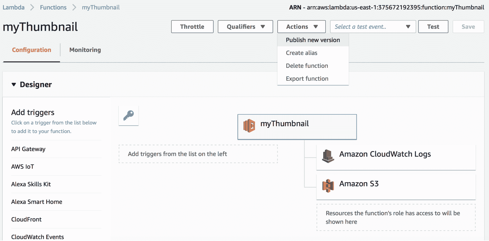

# 第八章：DevOps 与无服务器的最佳实践及未来

在前几章中，我们了解了无服务器（serverless）是什么，以及无服务器功能的多个不同服务提供商。我们还探讨了如何构建、测试和部署无服务器应用程序，以及如何监控和记录执行过程。但是本章非常有趣，因为我们将进一步深入，学习一些关于无服务器的最佳实践。我们还将学习如何构建、部署、监控、记录和保护我们的无服务器应用程序的最佳实践。我们还将研究 DevOps 如何与无服务器一起工作。

# DevOps 的重要方面

DevOps 的两个重要原则是自动化和流程。我们必须自动化从非生产环境到生产环境的每一部分开发，同时要保持持续的反馈，信息在各个环节之间往返流动，同时也要记录一切。让我们看看如何实现这一点的一些最佳实践。

# 协作与工具策略

DevOps 团队需要制定一个跨组织的统一工具策略，并且应该与不同团队（如开发、测试和基础设施）进行协作，共同商定 DevOps 的业务目标。团队之间应该实现无缝协作和集成。目标是实现一切自动化，因此理想的目标是从开发到生产的“一键部署”，并尽量减少人为干预。

# 敏捷开发

有许多敏捷方法论可供选择。Scrum、XP 和 Kanban 是其中一些更受欢迎的选择。你可以选择这些开发方法之一，给你提供一个更灵活的选项来规划、创造更快的输出，并在项目开发过程中保持清晰的聚焦和透明度。敏捷方法论有助于限制进行中的工作，这反过来有助于保持平衡的流程，以避免我们一次性做得过多。

# 版本控制所有内容

当我们谈到版本控制时，首先浮现在我们脑海中的往往是应用程序源代码的版本管理，这是我们非常熟悉的一项实践。但在源代码版本控制的基础上，我们还应该对数据库、构建产物、依赖项以及与应用程序相关的所有内容进行版本控制。这确保了应用程序的各个方面都可以通过存储库这一单一来源进行历史追踪。

# 捕获每一个请求

我们应该确保没有临时的工作或变更发生在 DevOps 之外，并且每个功能和非功能需求都应提出并维护变更请求。这些变更请求应该在工具中进行捕获和管理。

# 自动化测试和源代码分析

当我们谈论自动化测试时，这并不仅仅意味着测试的自动化。测试自动化应该包括预置测试数据并运行标准测试，以确保代码符合企业服务水平协议的标准。测试必须是持续的，应运行 100 次或 1,000 次，然后在成功完成后，自动提升到更高的环境。代码的质量应定期检查，并在代码覆盖率、源代码分析和代码性能未达到基准时返回给开发人员进行重构。

# 持续反馈

反馈循环是 DevOps 的一个非常重要的方面，它对 DevOps 成功起着至关重要的作用。反馈循环由开发过程中注册的一个问题与 DevOps 流程中的人类元素之间的自动化通信组成。它应由工具管理，通过该工具，问题必须手动或通过自动化机制进行注册。问题还应该标记一个工件，开发人员可以利用它追踪问题发生的原因、发生的时机以及发生的位置。该工具应有助于定义所有自动化和人类元素在循环中的沟通链条。

# 市场上线时间和周期时间

在 DevOps 流程中，我们将获得丰富的指标和实时报告，帮助我们衡量应用的市场上线时间和周期时间，因为这两个指标在我们将新功能提供给客户的速度和效率上起着至关重要的作用。市场上线时间衡量的是从头到尾将有价值的新功能推向市场的效率，而周期时间是衡量工程团队流程的指标，一旦功能定义完成，它就表示功能何时可以进入生产环境。它有助于理解团队的效率并加以改进。

# 日志指标

我们应始终跟踪 DevOps 流程的生产力，包括自动化和手动流程，并确定这些流程是否有利于组织。我们需要定义哪些指标与 DevOps 流程相关，比如部署速度、测试中发现的错误或构建时间。通过这个定义，自动化流程可以在没有人工干预的情况下解决这些问题。

我们已经简要介绍了可以应用于应用开发的一般 DevOps 实践，但当涉及到无服务器应用时，我们需要在工具和流程方面增加一些更具体的最佳实践。我们将深入了解每个服务提供商，并筛选出适用于无服务器应用的最佳实践，以及 DevOps 与无服务器架构的最佳实践。

# 无服务器架构的最佳实践

如我们所知，无服务器架构由一个称为“函数”的小段代码组成，函数运行在一个无状态的容器中。这个架构的一个主要目的是根据需要进行弹性伸缩。因此，考虑到这一点，我们的最佳实践几乎都集中在无服务器架构的这一方面。那么，让我们看看与无服务器概念相关的一些最佳实践。

# 一函数，一任务

当我们开始构建函数时，可能会遇到在代理路由后面有单体函数，并使用`switch`语句的情况。因此，如果我们只有一个或几个函数来运行整个应用，那么我们实际上是在对整个应用进行扩展，而不是扩展应用的某个特定部分。这是应该避免的，因为在这种情况下，扩展会成为问题，我们还可能最终得到大型且复杂的函数。

# 函数调用其他函数

我们应该避免在一个函数内调用另一个函数，因为这样会增加成本，且调试也会变得更加困难。我们失去了隔离函数的价值。如果需要的话，理想的做法是触发另一个函数来完成更多工作。

# 最小化库的使用

当我们编写一个函数时，可能需要一些库来让它运行。但将大量的库添加到函数中会让它变得非常慢。使用函数时有两种启动方式——一种是冷启动，即函数第一次启动，另一种是热启动，即函数已经启动并准备好从池中执行。因此，理论上来说，更多的库会使冷启动变慢，并且还会影响应用的扩展。随着规模的增加，函数必须执行冷启动，冷启动速度较慢，因此扩展速度也会变慢。

同时，随着库数量的增加，我们的代码安全性会降低，因此每添加一组库都必须进行安全测试。在实际使用之前，这些库还需要被信任。

# 使用 HTTP 时——每个路由对应一个函数

我们应该尽量避免在使用 HTTP 路由时使用单一函数代理，因为这会阻碍函数的扩展，并且还会让调试变得繁琐。有些情况下我们可以避免这样做，比如某些路由的功能与单一表格相关，并且与应用的其他部分解耦。

# 与 RDBMS 的数据库连接

无服务器应用的概念非常适合与服务配合使用，因此在函数中建立与 RDBMS 的连接可能会遇到问题，因为服务的各个部分仍然依赖于提供快速响应。

随着函数与 RDBMS 连接的规模增大，连接数也会随着规模增长，我们可能会引入瓶颈并在函数冷启动时出现 I/O 等待。

因此，无服务器架构让我们重新思考数据层。如果我们尝试将无服务器架构与现有的数据层（如 RDBMS）结合使用，那么你会发现整体应用性能会出现延迟。这也可能是为什么 DynamoDB 与无服务器架构结合得如此良好的原因。

# 使用消息和队列

当应用程序是异步时，无服务器应用程序运行非常高效，但对于 Web 应用程序来说，这并不简单，因为 Web 应用需要大量的请求–响应交互和查询。回到函数不直接调用其他函数这一点，重要的是要指出这就是如何将函数串联在一起的。队列在函数串联的场景中充当断路器，因此如果某个函数失败，我们可以轻松追踪到失败的队列并调查故障，这可能是由于推送失败消息到死信队列所导致的。

对于以无服务器架构为后台的应用程序，使用**CQRS**（命令查询责任分离）是理想的选择，它将输入和输出的概念模型在一个模型中分离成多个模型，用于更新和向用户显示变更。

# 数据流动

在无服务器系统中，数据处于流动状态。它通过系统流动，但最终可能进入数据湖。然而，在无服务器系统中，它应该保持流动状态，因此，确保将所有数据保持在流动中，而不是存储在数据湖中。在使用无服务器环境时，避免从数据湖中查询数据。虽然保持数据流动并非总是可能，但最好尽量做到。

# 测量规模

无服务器架构的主要特点是高效的扩展性，但我们应该以便于扩展的方式进行编码。我们可以避免在函数内部直接调用数据连接，或者避免添加大量的依赖库。简而言之，函数越轻量，冷启动越快，最终扩展也会更快。同时，确保在函数进入生产环境之前进行负载测试，以确保高效的扩展。

在本节中，我们探讨了使无服务器函数高效执行和扩展的各种最佳实践。虽然这不是完整的列表，但这些是一些非常重要的实践。在下一节中，我们将学习每个云服务提供商的最佳实践，并理解 DevOps 的最佳实践如何帮助加速无服务器开发和部署，使其更加高效。

# AWS Lambda 的 DevOps 最佳实践与故障排除

到目前为止，我们已经学习了使用 DevOps 的最佳实践以及设计无服务器应用架构的最佳方式。我们还探讨了编写可扩展函数的最佳方法，并确保它们有更快的冷启动时间。接下来，我们将学习如何为特定云服务提供商应用最佳实践。

AWS Lambda 是一个非常流行且成熟的无服务器平台。正因如此，大多数无服务器的最佳实践都与 Lambda 保持一致，并且有许多工具和流程能够很好地将功能与 AWS Lambda 对接。在本节中，当我们谈论 DevOps 时，我们将关注源代码版本控制、构建、测试、打包、发布、监控、安全性以及成本控制等 DevOps 方面。这些 DevOps 的各个方面被整合在一起，作为一个统一的平台运行。如果我们想要达到 DevOps 的极乐境界，这需要我们付出大量的努力和耐心。

# 源代码版本控制

源代码版本控制是开发中的一个非常重要的部分。如果代码没有版本控制，那它就等同于不存在。现在有许多工具可用于源代码版本控制，但如今 Git 和 Apache Subversion 是最受欢迎的工具。通常，最好为每个应用创建一个代码库，然后为开发创建多个分支。关于 Git，当我们创建一个代码库时，已经有了一个主分支（master）。主分支保存着代码的黄金副本，通常用于基准参考，也可以作为生产副本。我们还可以为代码的功能、发布和开发版本创建其他多个分支，以实现高效的开发和部署。

因此，关于源代码管理的最佳实践是经常提交，并且每次开始工作时都确保发起拉取请求（pull request）。这样可以避免浪费时间进行代码合并，并且防止我们破坏构建。通常，我们有一个庞大的开发团队，分布在全球不同的地方，为应用构建不同的模块。如果我们某天忘记提交代码，那么第二天早晨我们就得浪费大量时间合并代码，才能开始开发。我们还应确保在提交前始终进行检查，否则我们可能会将一大堆垃圾、不需要的库、JAR 文件或调试文件提交到代码库，这会导致代码库被塞满，并且让我们的功能变得更庞大，最终降低性能。

我们还应该确保在提交代码时添加提交信息。评论应该解释我们为什么提交这段代码，因为这将帮助我们轻松追踪问题是否出现，也使得我们在提交了有 bug 的代码或某些功能发生变化时，能够更容易地回滚。当我们添加提交信息时，应该确保信息不太笼统或缺乏内容。我们还应确保它是固定的、有效的，并且没有拼写错误，因为如果我们引入了 bug 或问题，这将无法帮助我们追溯。除此之外，在前一次提交后再出现相同的提交信息也不是一种好习惯，因为我们通常提交代码是因为与前一次提交相比，代码发生了变化。

我们应避免将构建产物或编译的依赖项（如 `.dll` 或 `.jar`）提交到源代码控制中，因为这可能会惹恼你的同事，因为他们需要检出大量文件，或者因为下载这些依赖项而导致本地环境被破坏。另一种避免提交问题的方法是编写预提交钩子，这可以缓解大多数提交问题。

我们已经谈到过版本控制，但我们还应该讨论版本数据库组件。像 UI、应用程序和测试代码一样，数据库组件也应该进行版本控制，以确保稳定的部署和应用。如果我们不对数据库进行版本控制，可能会导致应用程序使用旧数据或旧配置运行。通过版本控制，我们也能更容易地追踪特定版本发布中使用了哪些 DDL 和 DML 语句。

总之，我们应该始终记住定期提交，知道我们在提交什么，添加有效的提交信息，并确保我们自己执行这些操作。

AWS 还支持 Lambda 函数的版本控制。Lambda 函数通过发布来进行版本控制。AWS Lambda 控制台中有一个专门用于发布新版本的界面，我们可以为同一个函数创建多个版本。每个 Lambda 函数版本都有一个唯一的 ARN，并且发布后是不可变的。Lambda 还允许我们创建别名（如下图所示），这些别名指向特定的 Lambda 函数版本。每个别名将拥有一个唯一的 ARN，并且只能指向一个函数版本，而不能指向另一个别名：



让我们来看一个 AWS Lambda 版本管理的例子。假设我们有一个 AWS S3 桶，它是 Lambda 函数的事件源，因此每当桶中添加新的项目时，Lambda 函数会被触发并执行。事件源映射信息存储在桶的通知配置中，在该配置中，我们可以识别 S3 可以调用的 Lambda 函数 ARN。但是，新发布的版本不会自动更新，因此每当创建新版本的函数时，我们必须确保更新这个版本。

如果我们使用的是 Serverless 框架，新的版本是通过部署来创建的。还可以通过以下命令行回滚到先前的版本：

```
$ serverless rollback function -f my-function -v 23
```

# 构建

在编程术语中，构建是程序或产品的版本，但这个术语也用于指代 DevOps 的持续集成。因此，我们应该确保每次代码提交到 Git 仓库时都会触发构建。之所以这么做，是因为许多开发人员参与了这些项目，各自在自己的机器上独立工作，这可能没问题。但直到代码提交并在持续集成服务器上构建后，这将触发源代码分析和提交代码的单元测试，我们才能知道是否推送了有问题的代码。所以，确保每次提交时都触发构建是至关重要的。

成功构建的工件应始终进行版本控制。最佳做法是在 Nexus 仓库中对其进行版本控制，以便所有非生产环境的构建应推送到 Nexus 的快照仓库，而发布候选版本则应推送到 Nexus 的发布仓库。这个过程将帮助我们将发布构建与临时的快照构建分开，后者应该定期清除，因为每次构建时都会创建，并且以后不再需要。

构建应该触发源代码分析，这可以是针对 Node.js 和 Python 应用的 linting，如果你使用的是 Java 或 C#，那么也有许多工具可用于源代码分析。源代码分析确保开发人员遵循适当的编码标准。它还会执行安全检查并检查代码中的圈复杂度。这些工具还会生成报告，我们还可以为源代码分析的通过参数设置一个阈值，最终使构建通过。所以如果源代码分析检查的结果低于设定的基准，构建将会失败，开发人员必须修复问题。

如果我们使用 Java 作为无服务器架构的编程语言，那么有许多开源工具可供我们使用，例如 PMD、Checkmarx、Checkstyle、FindBugs 和 SonarQube。**SonarQube** 是一个流行的源代码分析工具，支持多种语言，例如 Java、C#、Node.js 和 Python。它还拥有一个漂亮的仪表板，安装和配置也非常简单。SonarQube 官方镜像已经发布在 Docker Hub 上。你可以设置并试试看。

你可以在 Docker Hub 上找到 SonarQube 镜像，地址是 [`hub.docker.com/_/sonarqube/`](https://hub.docker.com/_/sonarqube/)。

# 测试

测试是开发周期中的重要部分。测试确保无错误且安全的代码被部署到更高的环境，我们应该尽可能地将测试自动化。测试应与持续集成过程结合，并最终与持续部署相结合。测试的好处在于它为组织节省了大量时间和金钱，因为它能在开发初期阶段减少大多数 bug 和错误。测试有许多不同的层次，例如单元测试、集成测试、功能测试和性能测试。让我们看看这些层次的最佳实践。

# 单元测试

单元测试是测试软件时的基础层次。它基本上是指测试代码单元，以检查其功能的正确性。在单元测试过程中，代码在测试环境中使用模拟输入进行测试。然后将执行的输出与预期的输出进行比较，如果输出与预期输出匹配，则测试通过。

就无服务器概念而言，我们不需要担心 Lambda 函数、处理程序或事件；我们只需要组织好代码库，以便于单元测试的集成。如果你查看以下代码，你会看到我们将核心逻辑分离成独立的模块，而不是放在处理程序内，这样它们就可以单独进行单元测试：

```
const createUser = (event, context, callback) => { 
    const user = utils.RegisterUser(event.user) 
    const photoUrl = utils.updatePhoto(user) 
    callback(null, 
    { 
        statusCode: 200, 
        body: 'User Created!' 
    })
}

```

所以，最好将业务逻辑分离，使其独立于服务提供商、可重用，并且更容易进行测试。通过这种业务逻辑的分离，单元测试将更容易编写和运行，而且迁移到不同的提供商时也会花费更少的精力。

Node.js 和 Python 都有许多单元测试框架，但我们将要讨论的是 **Mocha** 和 **Jest**。这两个框架都有可用的无服务器框架插件。

以下代码展示了 Mocha 无服务器插件的安装和使用。它可以作为服务本地安装，也可以包含在 `serverless.yml` 中，如下所示：

```
# serverless.yaml 
plugins:
  - serverless-mocha-plugin
```

同样，我们可以将 Jest 无服务器插件添加到 `serverless.yml` 中，如以下代码所示：

```
plugins:
  - serverless-jest-plugin
custom:
  jest:
    # You can pass jest options here
    # See details here: https://facebook.github.io/jest/docs/configuration.html
    # For instance, uncomment next line to enable code coverage
    # collectCoverage: true
```

同样，**Nose** 是一个流行的 Python 无服务器应用框架。

除此之外，我们还可以使用 **LocalStack** 来模拟 AWS 环境。LocalStack 帮助我们创建一个类似于 AWS 的本地测试环境，它为我们启动核心云 API，以便我们在本地测试我们的函数。

# 集成测试

集成测试基本上是指测试覆盖多个单元。我们的 Lambda 函数必须与第三方代码依赖项集成，而这些依赖项必须经过彻底的测试。这就是集成测试的作用所在。集成测试在 Serverless 世界中扮演着非常重要的角色，但如果你总是在云上进行测试，它的成本也很高。但我们可以通过模拟来减少成本，就像我们在看 LocalStack 框架时提到的那样。通过这种方法，我们可以在模拟大量 AWS 资源时加以利用。

类似地，我们可以使用 `serverless invoke local` 在本地调用 Lambda 函数，如果我们的函数需要从 DynamoDB 读取/写入数据，那么也可以使用 `dynamodb-local` Node.js 库来模拟。

尽管这些方法不能完全模仿 Lambda 的 100%，我们仍然能够快速找到代码库中的问题，而无需等待部署。

# 性能测试

性能测试是一种测试方法，用于检查我们的应用在预期工作负载下的表现。对于我们的应用类型而言，这是非常重要的测试类型，因为性能测试将为我们提供改善功能性能的机会，并帮助提升扩展速度。扩展是功能非常重要的特点，但我们有责任以一种有助于更快扩展的方式编写代码。这正是性能测试可以发挥作用的地方。

一个非常流行的性能测试工具是 **Jmeter**。它在行业中被广泛使用。Jmeter 压力测试将检查负载测试的关键绩效指标（KPI），例如响应时间、错误率、内存泄漏、缓慢、安 全问题和数据损坏。Jmeter 需要一个性能参数脚本。我们可以通过 BlazeMeter Chrome 扩展程序开始创建该脚本。

另一个流行的工具是 **Artillery**，它可以用于性能测试、负载测试和功能测试。它是一个开源工具，基于 Node.js 构建。它可以为应用生成负载，并模拟虚拟用户。你可以使用以下代码进行简单安装：

```
$ npm install -g artillery
$ artillery quick --count 10 -n 20 https://artillery.io/
Started phase 0, duration: 1s @ 21:13:07(+0100) 2018-08-28
Report @ 21:13:10(+0100) 2018-08-28
 Scenarios launched: 10
 Scenarios completed: 10
 Requests completed: 200
 RPS sent: 69.44
 Request latency:
 min: 28.3
 max: 248.4
 median: 41.9
 p95: 127.1
 p99: 191.7
 Codes:
 200: 200
```

```
All virtual users finished
Summary report @ 21:13:10(+0100) 2018-08-28
 Scenarios launched: 10
 Scenarios completed: 10
 Requests completed: 200
 RPS sent: 69.44
 Request latency:
 min: 28.3
 max: 248.4
 median: 41.9
 p95: 127.1
 p99: 191.7
 Scenario counts:
 0: 10 (100%)
 Codes:
 200: 200
```

还有一种结合了 Serverless Framework 和 Artillery 的工具，名为 `serverless-artillery`。这个包将帮助我们通过一个 Node.js 包来部署功能并运行性能测试，同时使其更容易集成到我们的 CI/CD 管道中。更多信息可以在以下链接找到：[//github.com/Nordstrom/serverless-artillery](http://://github.com/Nordstrom/serverless-artillery)。

测试非常重要，它能够在开发的早期阶段剔除缺陷和错误，但我们必须确保它在开发周期的早期引入，并且应一直执行到生产环境。但同样重要的是要自动化测试，并将其集成到持续集成和持续交付的周期中。然而，Serverless 测试也有其挑战，具体如下：

+   无服务器架构实际上是独立分布式服务的集成，这些服务需要同时和独立地进行测试。

+   我们可以在本地测试无服务器函数，但完全在本地模拟它们很困难，因此在云上测试它们同样重要。这个过程应该是自动化的。

+   无服务器架构可以具有事件驱动、异步的工作流，彻底测试这些工作流并非易事。

# 监控

当我们想到监控时，首先浮现在我们脑海中的就是定期观察和追踪软件应用程序的操作和活动，并在系统或应用程序失败时设置触发报警。监控应该从开发的开始就启动，例如监控应用程序的速度或监控已开发的代码片段使用了多少资源。这个监控系统应与通知系统相结合，当内存使用超过定义的阈值时触发通知，比如发送电子邮件。

但是监控无服务器函数更加棘手。在服务器监控中，我们监控服务器的性能、网络延迟和 CPU，但这些细节对于无服务器而言是无关紧要的，因为基础设施完全由服务提供商管理。那么我们在无服务器中应该监控什么呢？我们仍然可以监控内存和并发率。尽管服务提供商处理 Lambda 函数的资源分配和执行，但仍然有内存使用和函数分配的并发执行次数的限制。

要执行无服务器监控，有很多工具可用。AWS 提供了几个开箱即用的工具，例如**AWS CloudWatch**，它将所有 AWS 资源输入到 AWS CloudWatch 中。CloudWatch 将是我们监控 Lambda 函数的第一个工具。CloudWatch 跟踪执行延迟、执行的函数数量以及执行过程中的错误等指标。但我们可以通过在 CloudWatch 中设置自定义指标来超越这些。我们还查看了与 Lambda 函数一起使用的 CloudWatch 仪表板。

AWS 为 Lambda 函数的应用性能提供了另一个强大的工具，那就是 X-ray。X-ray 是一个与 AWS Lambda 开箱即用集成的追踪工具。它提供了请求流动的端到端视图。通过 X-ray，我们可以分析 Lambda 函数及其关联服务的性能。我们可以识别并排除性能问题和错误的根本原因，并且通过应用程序的地图视图，我们可以看到它的所有组件。

Thundra 是另一个可以用作 AWS Lambda 应用程序性能监控工具的工具。它通过异步发布数据，将 CloudWatch 的数据通过函数和代理发送到应用程序中。它提供了一些非常好的图表，涵盖了许多指标，如调用次数、冷启动调用次数和持续时间、按错误类型和函数名称统计的错误次数等。

# 部署

要获取最新版本的 Lambda 函数进行执行，它们应该部署在云中。通过这种方式，如果我们的部署包更大，则部署会更慢。最终，当函数被调用时，解压缩过程将导致性能下降。我们的函数打包方式也会影响执行。例如，如果我们使用 Java，将所有依赖项打包成一个函数会比将依赖项放在`lib`文件夹中单独打包更慢。

有许多可用于部署的工具，但 Serverless Framework 是这项工作的主要候选者之一。当然，我们仍有许多事情需要完成，但这仍然比市场上任何其他开源选项更为成熟。

同样关于部署，应该进行编排，并且应通过大量的审批和变更请求流程，尤其是在 UAT 和生产环境中。生产环境中的部署应通过 ServiceNow 变更请求和 CAB 审批进行管理。

# 日志记录

Lambda 的运行时语言提供了一种机制，使您的函数能够将日志语句传递到 CloudWatch 日志中。我们需要让任何类型的应用程序都能够充分利用其日志，而不仅仅是无服务器应用程序。对于其他应用程序，我们可以从部署应用程序的服务器中检索日志。然而，对于无服务器应用程序，这是不可能的，因为没有服务器，而且目前我们无法“逐步执行”一个正在运行的 Lambda 函数。因此，我们在调查函数行为时，极度依赖我们创建的日志。因此，我们必须确保生成的日志具有适当的详细程度，能够帮助我们进行问题排查，同时又不会过度消耗计算时间。建议使用环境变量来创建一个`loglevel`变量。

适当使用日志级别可以确保我们在运行时仅在操作性排查期间选择性地承担额外的计算和存储成本，供我们的函数参考，从而确定在运行时应创建哪些日志语句。

# 安全性

安全性应该是我们设计和实现函数时的首要优先事项。无服务器应用和基于服务器的应用之间的一个主要区别是，在无服务器应用中，我们无法控制服务器，因此我们必须将大部分安全措施嵌入到代码中。因此，在编写无服务器应用时，我们应该确保编写安全的代码，以验证所有第三方的安全配置。让我们来看看一些实现安全代码所必需的最佳实践。

# 每个函数一个 IAM 角色

建议为每个函数创建一个角色，因为这将解耦 IAM 角色。这还将使我们能够为各个函数提供最小权限。例如，假设一个函数在其代码中使用 KMS 密钥。如果我们为 KMS 密钥使用一个公共角色，那么所有其他函数都将能够访问该 KMS 密钥。

# 不使用长期凭证

在 Lambda 函数代码中使用临时 AWS 凭证始终是安全的。这时，静态分析配置起着重要作用。最好通过 AWS SDK 在函数代码中创建一个 AWS 服务客户端，而不提供任何凭证。SDK 应该自动管理凭证的获取和轮换，适用于分配的角色。

# 不持久化秘密信息

最佳实践是不持久化秘密信息。然而，我们的函数可能需要某些长时间有效的秘密信息，例如数据库凭证和依赖服务的访问密钥。由于这一需求，建议对这些秘密信息进行加密。我们有几种选择，例如使用带加密的 Lambda 环境变量和 Amazon EC2 系统管理器的参数存储。

秘密信息不应保存在内存中或持久化。相反，函数应该获取临时凭证并保持其轮换，定期撤销它们。与 Lambda 函数的 API 交互应该经过身份验证和授权。

# Lambda 在 VPC 中

在 VPC 中使用 Lambda 函数时，我们应该遵循使用网络安全的最佳实践，通过使用最小权限的安全组、特定于 Lambda 函数的子网和路由表来允许特定于 Lambda 函数的流量，如果我们使用了来自 VPC 的资源。

# AWS Lambda 最佳实践

到目前为止，我们了解了关于 AWS Lambda 的 DevOps 最佳实践，但我认为本章不能结束，而不讨论 Lambda 函数的最佳实践。这些最佳实践最终将帮助我们开发高效的 Lambda 函数，并帮助我们实现更快的部署。让我们逐一来看这些最佳实践。

# 保持处理程序独立于业务逻辑

通常建议将业务逻辑放在处理程序之外，因为这样可以将我们的业务逻辑与 lambda 函数的运行环境解耦，重用业务逻辑函数，并且使我们更容易测试编写的单元测试，正如我们在本章早些时候讨论的那样。

# 保持温暖容器的存活

在编码时，我们必须确保我们的代码编写方式能够利用温暖容器的资源，而不是进行冷启动。这意味着我们需要对变量的作用域进行设计，使其在随后的调用中尽可能多次重用。我们应该重用在先前调用中建立的连接（例如 HTTP 或数据库连接）。

# 依赖控制

Lambda 在调用时需要许多库。Lambda 会始终寻找最新的库和安全更新，但这也会带来 lambda 函数行为的变化。因此，最好将依赖项与函数一起打包并部署。为了提高性能，这些依赖项也应该在低环境中进行控制和管理。

# 缩短依赖的超时

我们需要为所有外部依赖配置较短的超时时间。我们不能允许它们在持续查找依赖时继续运行，因为 Lambda 是按函数执行的持续时间计费的。执行时间越长，费用就越高。

# 异常处理

我们应该评估函数的故障行为应该是什么，因此，我们的函数应抛出正确的异常，以便更快地解决问题。

# 递归编程

我们应避免在 lambda 函数中使用递归代码，因为函数会递归调用自身直到满足某个条件。但这会导致多次调用并增加成本。如果我们不小心这样做了，那么我们应该将函数的并发执行限制设置为 `0`，以便在更新代码时立即限制所有对该函数的调用。

# 高可用性

当我们进入生产环境时，高可用性变得至关重要，对于无服务器应用程序而言，高可用性取决于 lambda 函数能够执行的区域数量。如果我们的函数使用默认网络，那么它会自动在该区域内的所有可用区域中执行。无需做其他配置来为函数在默认网络环境中配置高可用性。因此，在设计 VPC 时，重要的是要包括来自多个可用区的子网。

# 运行时语言

在设计无服务器应用程序时，选择运行时语言是相当棘手的。但当我们决定运行时语言时，我们总是可以依赖我们的技能组合来获得一些舒适感。不过，运行时语言也决定了我们应用程序的性能。例如，如果我们选择 Java 或 .NET（编译语言）作为运行时语言，那么容器的首次调用会产生最大的启动成本，但随后的调用性能会有所提升。相比之下，像 Node.js 或 Python 这样的解释型语言，初次调用时间非常快，但与编译型语言相比，它们无法输出最大性能。因此，如果应用程序对延迟敏感或负载波动较大，建议使用解释型语言；而如果应用程序的流量没有大幅波动，或者用户体验不受 Lambda 函数响应时间的影响，那么我们可以选择任何语言作为运行时语言。

# 针对冷启动和热启动的代码

Lambda 函数的性能取决于我们在其中编写的逻辑和我们调用的依赖项。因此，编写 Lambda 函数的最佳实践是考虑容器的冷启动和热启动。

为了提高热启动容器的性能，确保将任何外部化的配置或依赖项存储并引用到本地，以便你的代码能快速获取。限制每次调用时对全局和静态变量的变量/对象重新初始化。保持 HTTP 和数据库连接的活跃状态。

为了更好的冷启动容器性能，最好使用默认的网络环境，除非需要通过私有 IP 与 VPC 内的资源连接。选择解释型运行时语言而非编译型语言。尽量保持函数代码包尽可能小，因为这将减少从 S3 桶下载、解压代码并调用它的时间。

# 成本优化

假设函数使用的最小资源大小能够提供最低的总成本是一种反模式。如果你的函数资源大小太小，可能因为执行时间过长而支付更多费用，而如果使用更多的资源，函数可以更快完成，反而可能节省成本。

你不需要通过一系列阻塞/同步的 API 请求和响应来实现所有的用例。如果你能够将应用程序设计为异步的，你可能会发现架构中的每个解耦组件执行其工作所需的计算时间比那些紧密耦合并花费 CPU 周期等待同步请求响应的组件要少。许多 Lambda 事件源与分布式系统非常契合，并且可以以更具成本效益的方式将你的模块化和解耦函数集成在一起。

一些 Lambda 事件源允许您定义每次函数调用时传递的记录数的批量大小（例如，Kinesis 和 DynamoDB）。您应该进行测试，找到每个批量大小的最佳记录数，以便调整每个事件源的轮询频率，使其与您的函数完成任务的速度相匹配。

可供 Lambda 集成的各种事件源意味着您通常有多种解决方案可以满足您的需求。根据您的用例和需求（请求规模、数据量、所需延迟等），根据选择的 AWS 服务组件，您的架构的总体成本可能会有显著不同。

# Azure 函数的最佳实践

对于其他云提供商（如 Azure），最佳实践应与 Lambda 函数保持一致。在本节中，我们将介绍一些与 Lambda 函数密切相关的 Azure 最佳实践。

# 避免大型且长时间运行的函数

大型且长时间运行的函数可能会导致意外的超时问题，且函数可能因为许多 Node.js 依赖而变得庞大。特别是导入依赖项可能还会导致加载时间增加，从而引发意外的超时。

在可能的情况下，我们应将大型函数重构为较小的函数集，使其协同工作并快速返回响应。

# 跨函数通信

如果我们没有使用持久化函数或逻辑应用程序来集成多个函数，通常的最佳实践是使用存储队列进行跨函数通信。存储队列更便宜且更易于配置。

存储队列中的单个消息大小限制为 64 KB。如果我们需要在函数之间传递更大的消息，可以使用 Azure 服务总线队列来支持消息传递。

# 函数应保持无状态

推荐尽可能使函数保持无状态且幂等。将任何必要的状态信息与您的数据关联。例如，正在处理的订单可能会有一个相关的状态成员。函数可以根据该状态处理订单，同时函数本身保持无状态。

非常重要的是，推荐幂等函数使用定时触发器。例如，如果您有必须每天运行的任务，我们应该编写使其可以在一天中的任何时间运行并得到相同结果的代码。如果某一天没有工作，函数可以跳过。另外，如果上次运行未能完成，下一次运行应该从上次停止的地方继续。

# 函数应具有防御性

设计我们的函数时，最好具备在下一次执行时从上次失败点继续执行的能力。建议编写具有适当错误处理的函数，考虑到网络故障、配额限制或其他错误。所有这些问题都可能随时影响我们的函数。我们需要设计函数以应对这些情况。

假设我们的代码在将 2000 个项目插入队列进行处理后失败，我们应该能够追踪已完成的项目集合，否则我们可能会再次插入这些项目。

如果在将 5000 个项目插入队列进行处理后发生故障，您的代码如何反应？你应该追踪已完成的项目集合。否则，下次可能会再次插入这些项目。这可能会严重影响你的工作流程。

# 同一个函数应用中不应同时包含测试和生产的代码

我们不应在同一个函数应用中混合测试和生产函数或资源，因为函数应用中的函数共享资源，比如内存共享，这可能导致性能下降。因此，我们在生产环境的函数应用中加载的内容要小心，因为内存会在函数应用内的每个函数间进行平均分配。

# 使用异步代码，但避免阻塞调用

异步编程是推荐的最佳实践。然而，始终避免引用 `Result` 属性，或者在 `Task` 实例上调用 `Wait` 方法。这种做法可能会导致线程耗尽。

# 配置主机行为以更好地处理并发性

`host.json` 文件在函数应用中用于配置主机运行时和触发器行为。除了批处理行为外，你还可以管理多个触发器的并发性。通常，调整这些选项中的值有助于每个实例根据调用的函数的需求进行适当的扩展。

`hosts` 文件中的设置适用于应用中的所有函数，且在函数的 *单实例* 中生效。例如，如果你有一个包含两个 HTTP 函数的函数应用，并将并发请求设置为 25，那么对任何一个 HTTP 触发器的请求都会计入共享的 25 个并发请求。如果该函数应用扩展到 10 个实例，那么这两个函数实际上将允许 250 个并发请求（10 个实例 X 每个实例 25 个并发请求）。

# Google Functions 的最佳实践

即使服务提供商不同，大多数最佳实践在无服务器函数中是相同的，但我仍然想在这里列出一些。

# 编写幂等函数

函数应该在多次调用后仍能产生相同的结果。这有助于在先前的调用在代码执行过程中失败时重试调用。

# 信号函数调用完成

发出函数完成的信号，未能这样做可能导致函数执行直到超时为止。如果发生超时，您将为整个超时时间付费。超时也可能导致后续调用需要冷启动，从而增加延迟。

# 不要启动背景活动

函数调用一旦发出终止信号即结束。终止后的任何代码无法访问 CPU，也无法继续执行。此外，当在同一环境中执行后续调用时，您的后台活动会恢复，干扰新的调用。这可能导致意外行为和难以诊断的错误。函数结束后访问网络通常会导致连接被重置（以及`ECONNRESET`错误代码）。

背景活动是指函数终止后发生的任何事情。通常可以通过检查日志中在调用结束后记录的任何内容来检测背景活动。背景活动有时可能隐藏在代码更深处，特别是在存在回调或定时器等异步操作时。请检查代码，确保所有异步操作在终止函数之前完成。

# 始终删除临时文件

临时目录中的本地磁盘存储是一个内存文件系统。您写入的文件会占用可用内存，并且有时会在调用之间保持存在。如果没有显式删除这些文件，最终可能会导致内存不足错误，并触发随后的冷启动。

您可以通过在 GCP 控制台中选择函数列表中的函数（[`console.cloud.google.com/getting-started`](https://console.cloud.google.com/getting-started)）并选择内存使用情况图，查看单个函数使用的内存。

不要尝试在临时目录之外写入文件，并确保使用平台/操作系统独立的方法来构建文件路径。

您可以通过使用`pipelining`绕过临时文件的大小限制。例如，您可以通过创建读取流，传递给基于流的处理，并将输出流直接写入云存储来处理云存储中的文件。

# 本地开发

函数部署需要一些时间，因此通常在本地使用**shim**测试函数代码会更快。

# 错误报告

不要抛出未捕获的异常，因为它们会导致后续调用时发生冷启动。有关如何正确报告错误，请参阅**错误报告指南**（[`cloud.google.com/functions/docs/monitoring/error-reporting`](https://cloud.google.com/functions/docs/monitoring/error-reporting)）。

# 使用 SendGrid 发送电子邮件

Cloud Functions 不允许通过端口 25 进行外部连接，因此无法与 SMTP 服务器建立非安全连接。您应该使用`SendGrid`来发送电子邮件。

# 明智地使用依赖项

因为函数是无状态的，执行环境通常会从头开始初始化（在冷启动期间）。当冷启动发生时，函数的全局上下文被评估。

如果您的函数导入模块，则这些模块的加载时间可能会增加冷启动时的调用延迟。通过正确加载依赖项并不加载函数不使用的依赖项，可以减少此延迟以及部署函数所需的时间。

# 使用全局变量来在未来调用中重用对象。

不能保证云函数的状态将被保留以供将来调用。然而，云函数通常会重用先前调用的执行环境。如果您使用全局范围声明变量，则其值可以在后续调用中重用，而无需重新计算。

通过此方式，您可以缓存可能在每次函数调用时昂贵重新创建的对象。将这些对象从函数体移动到全局范围可能会显著提升性能。

# 对全局变量进行惰性初始化

如果您在全局范围内初始化变量，则初始化代码将始终通过冷启动调用执行，增加函数的延迟。如果某些对象在所有代码路径中都未使用，则考虑按需惰性初始化它们。

# 总结

正如其名称所示，本章节主要介绍了在使用 DevOps 构建无服务器架构时应用的故障排除技术和最佳实践。在下一章中，我们将讨论 AWS Lambda、Azure Functions 以及开源版本的各种用例，以及 DevOps 如何适应其中。
