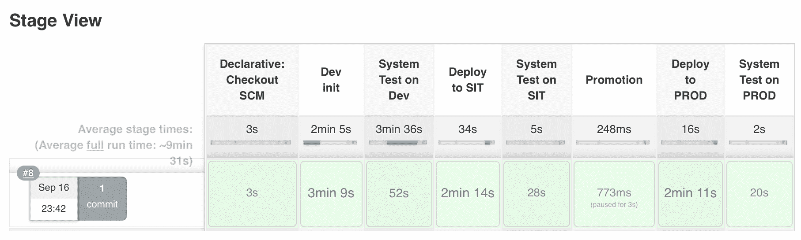
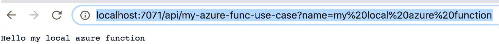

# 第九章：使用案例和附加功能

在上一章中，我们学习了如何应用与无服务器函数和 DevOps 相关的一些最佳实践。我们理解了构建轻量且安全的无服务器函数有多么重要。我们还学习了如何监控和记录无服务器应用程序的一些最佳实践。那么，接下来，让我们看看无服务器架构如何在实际应用中被使用，并学习如何围绕它实现端到端的 DevOps。

随着开发者们从单体应用转向无服务器架构，越来越多的使用案例开始出现。但与此同时，构建、测试和部署它们变得更加困难。因此，在本章中，我们将学习一些无服务器的使用案例，并学习如何设置端到端的部署管道。

本章将涵盖以下主题：

+   AWS Lambda 使用案例和附加功能

+   Azure Functions 附加功能

+   Google Functions 附加功能

# AWS Lambda 使用案例和附加功能

到目前为止，我们的旅程是关于 AWS Lambda 的介绍，如何构建、测试、部署、监控和记录它。我们还研究了一些 AWS Lambda 和 DevOps 的最佳实践。那么，现在在本章中，是时候将它们汇聚成一个使用案例了。在我们讨论与 AWS Lambda 相关的 DevOps 使用案例之前，让我们先看看 Lambda 可以高效使用的一些案例，然后再看看 DevOps 如何为开发者和业务用户简化工作。

# AWS Lambda 使用案例

如我们所知，无服务器架构的引入是为了帮助企业专注于应用开发，而不必担心底层服务器。通过降低成本和缩短部署周期，无服务器架构的采用率正在呈指数级增长。现在，很多公司采用无服务器架构作为确保快速自动扩展和缩减的方式。让我们看看一些无服务器架构在行业中被广泛采用的有用应用场景。

# 无服务器网站

对于无服务器架构的最佳采用模型是那些希望利用 AWS Lambda 和 AWS S3 的网站。AWS 提供的这两项资源都非常便宜。而且，使用 AWS Lambda 时，它可以按需扩展并在需求减少时缩减规模。因此，它们不需要为始终保持服务器运行而支付大量费用。我们可以考虑将静态内容或前端托管在 S3 存储桶中，这些前端应用程序可以通过 API 网关的 HTTPS 端点向 Lambda 函数发送请求，Lambda 会完成应用逻辑的重负担，并将数据持久化到完全托管的数据库服务中（**RDBMS**（**关系数据库**）或 **DynamoDB**（**非关系数据库**））。我们可以将 Lambda 函数托管在 VPC 中，将其与其他网络隔离，这样也能降低成本，因为我们只需支付 AWS S3 和 AWS Lambda 所产生的流量费用，以及数据库服务的额外费用。

# 视频和图像处理

随着 Instagram 越来越流行，图像和视频的应用变得更加广泛，但处理或调整大小同样需要较高的成本。传统的编辑视频和图像的方式是托管一个始终运行的虚拟机，当图像或视频需要编辑时，再在虚拟机内运行相应的应用程序。但我们不得不承担 24/7 运行虚拟机的成本，即使它并不总是被使用。无服务器计算可能是这类任务的最佳选择。无服务器服务可以用来动态调整图像大小或更改视频转码，以适应不同目标设备的需求。

此外，使用无服务器计算，我们可以接入 Google Vision API 或 Amazon Recognition 来识别面部和图像，或屏蔽不当内容。在 AWS 章节中，我们创建了一个教程，其中图像上传到一个 S3 存储桶，当图像上传到该 S3 存储桶时，Lambda 会自动触发，将图像调整大小并推送到另一个存储桶。

# 日志处理与通知

我们可以使用 Lambda 函数从 CloudTrail 和 CloudWatch 获取日志，Lambda 会监控特定的触发器和日志条目，并在事件发生时调用 SNS 通知。这些通知可以配置并发送到 Slack、Jabber 或其他支持系统。

# 控制物联网

**物联网**（**IoT**）是市场上的最新趋势，许多家庭和办公室的智能设备可以通过 Alexa 控制。但它们是如何工作的呢？正是 Alexa 与 Lambda 联手控制这些智能设备。比如我们要点亮一个由 Alexa 通过语音消息控制的 LED 灯泡，事件会在 Alexa 上触发，然后调用 Lambda 函数执行开关灯的操作。所以，无服务器计算可能会成为所有物联网调用的后端。

# 备份和日常任务

Lambda 函数在备份和日常任务中扮演着重要角色。我们可以调度 Lambda 函数来处理重复性任务，比如检查空闲资源、创建备份、生成日报和其他日常工作。传统方式是安装一个始终运行在服务器上的任务管理应用程序，按照需求执行任务。但使用 Lambda 后，函数仅在特定事件或时间表下被调用。它们在需要时也会水平扩展，而且成本更低。

# 持续集成与持续部署

快速迭代软件的能力比以往任何时候都更为重要。CI/CD 流水线允许你以小幅度更新代码，这样就可以每天发布 bug 修复和其他更新。

无服务器计算可以自动化许多这些过程。代码提交可以触发网站构建和自动重新部署，或者拉取请求（PR）可以触发自动化测试，确保代码在人工审核之前经过充分测试。

当你考虑与无服务器应用相关的自动化可能性时，去除工作流程中的人工任务变得更加简单。

所以，我们已经看到了不同的使用场景，在这些场景中，我们可以使用 AWS Lambda 函数，它们能够比传统的服务器或虚拟机执行更好的工作。目前，现实生活中使用无服务器架构的数量较少，但随着时间的推移，这种情况肯定会在未来几年增长。

但是，随着无服务器架构的使用增加，管理它们变得非常繁琐。例如，如果我们将无服务器架构用于股票市场门户网站或任何票务应用程序，那么这些应用程序将有许多功能需要协同工作，因为应用程序和功能必须进行版本控制、构建、测试、部署和回滚。这就是持续集成和持续交付发挥作用的地方。因此，我们的 DevOps 使用案例将是如何为 Lambda 函数设置高效的 CI/CD。

从本地开发开始，serverless 框架提供了一个有趣的插件——**serverless offline**。这个插件在本地模拟 AWS Lambda 和 AWS API 网关，帮助我们在彻底测试代码之前，在本地开发和测试代码，而无需先上传到 AWS 云。

为了演示这一点，我使用了我们之前的任务管道并进行了修改，使其能够在本地节点上与 DynamoDB 的无服务器离线模式一起使用。有趣的是，AWS 提供了一个可下载版本的 DynamoDB 文件，允许我们在本地开发环境中设置 DynamoDB 服务器。因此，这使得我们可以在本地开发 DynamoDB 应用程序，而无需为数据存储和数据传输付费，而且也不需要互联网连接。你可以在以下链接找到更多关于如何设置的信息：[`docs.aws.amazon.com/amazondynamodb/latest/developerguide/DynamoDBLocal.html`](https://docs.aws.amazon.com/amazondynamodb/latest/developerguide/DynamoDBLocal.html)。

我仅仅使用了 `serverless-dynamodb-local` 插件名称来在本地进行设置。与 Jenkins 一起设置起来更容易。我在 Jenkinsfile 中创建了一个额外的阶段。因此，在这个阶段，我正在安装 `serverless-dynamodb-local`、`serverless-offline` 和 `serverless-mocha-plugin`，这些插件是我们在将函数推送到 AWS 云之前进行单元测试所需要的。我已经为此添加了代码片段，并将代码放入 Git 仓库中（[`github.com/shzshi/aws-lambda-devops-usecase.git`](https://github.com/shzshi/aws-lambda-devops-usecase.git)）：

```
#Jenkinsfile

stage ('Dev init')
{
    nodejs --version
    npm install serverless-dynamodb-local --save-dev
    npm install serverless-offline --save-dev
    npm install serverless-mocha-plugin --save-dev
    npm install
    serverless dynamodb install
    chmod 755 startOffline.sh
    chmod 755 stopOffline.sh
}
```

在下一个 Jenkins 阶段，我正在本地安装 DynamoDB，并将本地 API 任务端点的路径添加到 Jenkins 作业中，并调用无服务器测试。我已经更新了 `serverless.yml` 配置文件，并确保在 Jenkinsfile 中更新了 `TASKS_ENDPOINT`，因此其余的管道应与第三章中*应用 DevOps 于 AWS Lambda 应用程序*的内容相同：

```
# serverless.yml
plugins:
    - serverless-dynamodb-local
    - serverless-offline
    - serverless-mocha-plugin
custom:
    serverless-mocha-plugin:
        preTestCommands: 
            - bash startOffline.sh
        postTestCommands:
            - bash stopOffline.sh
    dynamodb:
      stages:
        - dev
      start:
        migrate: true
```

```
# jenkinsfile
stage ('Dev init')
        {
            steps {

                deleteDir()

                checkout scm

                sh '''
                    nodejs --version
                    npm cache clean --force
                    npm install serverless-offline --save-dev
                    npm install serverless-mocha-plugin --save-dev
                    serverless plugin install -n serverless-dynamodb-local
                    npm install
                '''
            }
        }

        stage ('System Test on Dev') {

             steps {
                sh ''' 
                    sls dynamodb remove
                    serverless dynamodb install
                    chmod 755 startOffline.sh
                    chmod 755 stopOffline.sh
                    export TASKS_ENDPOINT=http://localhost:3000
                    serverless invoke test
                '''
                }
        } 
```

Jenkins 日志应该类似于下面这样：

```
Installation complete!
+ chmod 755 startOffline.sh
+ chmod 755 stopOffline.sh
+ export TASKS_ENDPOINT=http://localhost:3000
+ serverless invoke test
Serverless: Tests being run with nodejs6.14,  service is using nodejs6.10\. Tests may not be reliable.
Serverless: Run command: bash startOffline.sh

  Create, Delete
    ✓ should create a new Task, & delete it (198ms)

  Create, List, Delete
    ✓ should create a new task, list it, & delete it (180ms)

  Create, Read, Delete
    ✓ should create a new task, read it, & delete it (133ms)

  3 passing (523ms)
```

一旦管道成功，应该如下图所示：



所以，现在我们可以将函数作为持续集成的一部分在本地开发和测试，然后将其迁移到云端用于其他非生产和生产环境。但有一件事可以进一步自动化，就是我们在云中的 Lambda API 路径，因为当函数部署到 AWS 云时，我们会得到 API 网关的随机主机名：

```
api keys:
  None
endpoints:
  POST - https://ax1hlqv0vl.execute-api.us-east-1.amazonaws.com/sit/mytasks
  GET - https://ax1hlqv0vl.execute-api.us-east-1.amazonaws.com/sit/mytasks
  GET - https://ax1hlqv0vl.execute-api.us-east-1.amazonaws.com/sit/mytasks/{id}
  PUT - https://ax1hlqv0vl.execute-api.us-east-1.amazonaws.com/sit/mytasks/{id}
  DELETE - https://ax1hlqv0vl.execute-api.us-east-1.amazonaws.com/sit/mytasks/{id}
functions:
```

我们已在 Jenkins 流水线 Jenkinsfile 中更新了 API 主机名的任务端点。之所以这么做，是因为 API 网关提供的主机名不是静态的，而且每次我们重新部署或删除服务时，主机名会发生变化，因此我们必须在任何使用该主机名的地方进行更改。那么，如何解决这个问题呢？通过动态分配静态域名，这可以通过 Serverless 框架及其插件`serverless-domain-manager`轻松实现。让我们看看如何实现这一点。

在我们开始使用插件之前，有几个前提条件：

+   我们需要通过以下链接注册所需的域名：[`docs.aws.amazon.com/Route53/latest/DeveloperGuide/registrar.html`](https://docs.aws.amazon.com/Route53/latest/DeveloperGuide/registrar.html)

+   我们需要确保我们的域名已经在 Route 53 中注册（[`console.aws.amazon.com/route53/home?#DomainListing`](https://console.aws.amazon.com/route53/home?#DomainListing)）

+   我们需要为我们创建的域名申请新的证书，可以通过此链接创建：[`console.aws.amazon.com/acm/home?region=us-east-1#/wizard/`](https://console.aws.amazon.com/acm/home?region=us-east-1#/wizard/)

一旦前提条件成功完成，我们需要安装 Serverless 域管理插件：

```
$ npm install serverless-domain-manager --save-dev
```

然后，在`serverless.yml`文件中，我们添加两个部分。首先，我们在插件区块中添加`serverless-domain-manager`，然后通过**Custom**区块配置插件的`customDomain`。`basePath`属性将被添加到我们服务的每个路由前缀。例如，如果我们的函数是`helloworld`，并且我们将`basePath`设置为`serverless`，那么注册为`/helloworld`的路由将通过`serverless/helloworld`访问。

例如，`https://api.<registered_domain_name>/serverless/helloworld:`

```
plugins:  
    - serverless-domain-manager

custom:  
    customDomain:  
        domainName: 'api.<registered_domain_name>'  
        basePath: '<my_base_path>'  
        stage: ${self:provider.stage}                                     createRoute53Record: true
```

我们还可以通过在 Jenkins 流水线中集成 SonarQube 或 ESlint 来设置源代码分析。

# 监控

当我们谈论监控无服务器应用程序时，我们不需要担心 CPU 使用率或内存使用率，也不需要更新我们的系统包，因为所有这些都由 AWS 管理。但 Lambda 函数仍然需要监控执行失败，因为在生产环境中，一次函数失败可能会带来灾难。

默认情况下，CloudWatch 为 Lambda 函数提供度量指标，这些指标包括：

+   **调用次数**：函数被调用的次数

+   **错误**：由于各种错误、超时、未处理的异常、内存问题和其他问题导致函数失败的次数

+   **限制**：函数被限制的次数，AWS 限制了每个函数的并发执行次数，如果超过限制，函数将被限制执行

+   **时长**：函数的调用时间

错误和限制需要 24/7 监控，我们不能一直盯着 CloudWatch 看，但我们可以为所有的错误和限制设置警报。如果我们使用 serverless 框架，可以通过一个名为`serverless-plugin-aws-alerts`的插件来管理。这使得为服务设置警报变得非常简单。

要设置警报，我们需要在 serverless 框架服务中安装该插件：

```
$ npm install serverless-plugin-aws-alerts --save-dev
```

然后，我们需要将其添加到插件部分，并在`serverless.yml`的 custom 部分设置警报详情。这样，部署到生产阶段时，所有函数都会添加警报。接着，我们为 SNS 主题配置订阅，每个订阅必须有一个协议，在我们的案例中是电子邮件，端点则是电子邮件地址：

```
# serverless.yml
plugins: 
    - serverless-plugin-aws-alerts 
custom:  
    alerts:  
        stages:  
            - production
         topics:  
             alarm:  
                topic: ${self:service}-${opt:stage}-alerts-alarm
                notifications:  
                    - protocol: email  
                      endpoint: myemail@domain.com   
                alarms:  
                    - functionErrors  
                    - functionThrottles
```

# 静态网站

AWS Lambda 函数将作为我们网页应用的支柱。我们还需要一个外观前端，和 Lambda 函数一起部署，并且有一个可用的 serverless 框架插件，可以轻松完成这个任务。这个插件是`serverless-finch`。它会将我们网页应用的静态资源上传到 AWS S3。

让我们来看看它是如何工作的。要使用这个插件，我们首先需要安装它，然后将其配置到我们的`serverless.yml`文件中：

```
$ npm install --save serverless-finch
```

所以，一旦插件安装完成，我们首先需要创建一个分发文件夹，默认情况下为`client`/`dist`，也可以通过`custom`标签进行配置。所以，所有的静态内容将存放在`client`/`dist`文件夹中：

```
custom:
  client:
    ...
    distributionFolder: [path/to/files]
    ...
```

接下来，我们需要在 custom 标签中提到 S3 桶的名称，静态文件将上传到该桶：

```
custom:
  client:
    bucketName: [unique-s3-bucketname]
```

所以，理想情况下，`serverless.yml`应如下所示，在这里我们定义了提供者，添加了`serverless-finch`插件的配置，并通过`custom`标签定义了客户端详情。`indexDocument`参数用于索引页面，`errorDocument`参数用于错误页面：

```
service: my-static-website

frameworkVersion: "=1.26.0"

provider:
  name: aws
  runtime: nodejs6.10
  stage: dev
  region: us-east-1
  profile: dev-profile

plugins:
  - serverless-finch

custom:
  client:
    bucketName: my-static-pages-bucket
    distributionFolder: client/dist 
    indexDocument: index.html
    errorDocument: index.html

```

最后，要部署内容，我们需要运行以下命令，并应该能够在 serverless 应用的控制台输出中看到新部署网站的位置：

```
$ serverless client deploy 
```

这个插件还提供了许多其他的配置参数和功能。你可以通过以下链接找到它们：[`github.com/fernando-mc/serverless-finch`](https://github.com/fernando-mc/serverless-finch)。

# 热身

冷启动是与无服务器函数相关的主要问题之一。函数越温暖，性能越好。但我们如何确保我们的函数始终保持热启动状态呢？Serverless 框架提供了一个插件来帮助我们做到这一点。该插件的名称是 Serverless WarmUP Plugin。那么，这个插件是如何工作的呢？

插件创建了一个调度事件 Lambda，该 Lambda 在指定的时间间隔内调用我们选择的所有服务 Lambdas。因此，该插件通过强制使底层容器保持活动状态来保持函数的热身。要设置此插件，我们首先需要安装它：

```
$ npm install serverless-plugin-warmup --save-dev
```

然后在 `serverless.yml` 中，我们可以通过在插件部分调用它来配置它。我们需要提到应该运行哪个环境的预热，可以是单个或多个。然后在自定义部分，我们需要定义要运行的预热 Lambda 函数的配置。它可以进一步配置，有关这些配置的详细信息可以在链接找到：[`github.com/FidelLimited/serverless-plugin-warmup`](https://github.com/FidelLimited/serverless-plugin-warmup)。

```
# serverless.yml
plugins:
  - serverless-plugin-warmup
functions:
  hello:
    warmup:
      - production
      - staging
custom:
  warmup:
    folderName: '_warmup' // Name of the folder created for the generated warmup 
    cleanFolder: false
    memorySize: 256
    name: 'warm-my-lambdas'
    role: myCustRole0
    schedule: 'cron(0/5 8-17 ? * MON-FRI *)' // Run WarmUP every 5 minutes Mon-Fri between 8:00am and 5:55pm (UTC)
    timeout: 20
    prewarm: true // Run WarmUp immediately after a deploymentlambda
    tags:
      Project: foo
      Owner: bar  
```

这些是一些 Lambda 函数的附加组件，可以帮助我们更轻松地创建和维护无服务器函数。

# Azure 函数的附加组件

在 DevOps 中，确保开发更顺畅、更快速，并且将无错误的应用程序部署到生产环境非常重要。如果我们能够在本地开发、调试和测试应用程序，那将是可能的。但是就 Azure 函数而言，为了测试和调试函数，我们需要每次将其部署到 Azure 云中。好消息是，像 AWS Lambda 一样，Azure 函数可以通过 **Azure 函数核心工具** 在本地进行调试和测试。

使用 Azure 函数工具，我们可以在本地创建、开发、测试、运行和调试 Azure 函数。它们可以安装在 Windows、macOS 和 Linux 上。我们可以访问 GitHub 链接了解如何设置它们：[`github.com/Azure/azure-functions-core-tools`](https://github.com/Azure/azure-functions-core-tools)

安装完工具后，我们需要首先创建`create function`应用程序。默认情况下，这也会创建一个本地 Git 仓库，可以通过传递参数 `-n` 来跳过：

```
$ mkdir my-local-azure-function
$ cd my-local-azure-function
$ func init -n 
Writing .gitignore
Writing host.json
Writing local.settings.json
Created launch.json
```

下一步是通过执行 `func new` 来创建函数。我们将被要求选择要创建的函数类型和我们为函数选择的语言类型，然后将创建一个包含三个文件 `function.json`、`index.js` 和 `sample.dat` 的函数文件夹。

```
$ func new
Select a language:
1\. C#
2\. JavaScript
Choose option: 2
JavaScript
Select a template:
1\. Blob trigger
2\. Cosmos DB trigger
3\. Event Grid trigger
4\. HTTP trigger
5\. Queue trigger
6\. SendGrid
7\. Service Bus Queue trigger
8\. Service Bus Topic trigger
9\. Timer trigger
Choose option: 4
HTTP trigger
Function name: [HttpTriggerJS] my-azure-func-use-case
Writing /Users/shashi/Documents/packt/chapter4/tutorial1/mylocalfunction/myLocalFunction/index.js
Writing /Users/shashi/Documents/packt/chapter4/tutorial1/mylocalfunction/myLocalFunction/sample.dat
Writing /Users/shashi/Documents/packt/chapter4/tutorial1/mylocalfunction/myLocalFunction/function.json
```

由于我们通过模板将函数包含进来，现在我们可以通过 `func start` 来本地调用该函数，此命令将在本地启动函数应用程序，并为我们提供 API URL：

```
$ func start
%%%%%%
 %%%%%%
 @ %%%%%% @
 @@ %%%%%% @@
 @@@ %%%%%%%%%%% @@@
 @@ %%%%%%%%%% @@
 @@ %%%% @@
 @@ %%% @@
 @@ %% @@
 %%
 %
[09/20/2018 20:57:09] Reading host configuration file '/Users/shashi/Documents/packt/chapter9/my-local-azure-function/host.json'
[09/20/2018 20:57:09] Host configuration file read:
[09/20/2018 20:57:09] {}
info: Worker.Node.769f18ed-34f3-4813-9e9f-b4d43ea01191[0]
 Start Process: node --inspect=5858 "/usr/local/lib/node_modules/azure-functions-core-tools/bin/workers/node/dist/src/nodejsWorker.js" --host 127.0.0.1 --port 65058 --workerId 769f18ed-34f3-4813-9e9f-b4d43ea01191 --requestId 964f6629-d61a-4006-a293-e0438da20e45
info: Worker.Node.769f18ed-34f3-4813-9e9f-b4d43ea01191[0]
 Debugger listening on ws://127.0.0.1:5858/0d0bfa98-d2a3-4af2-8c5c-3a2cc346b1fc
info: Worker.Node.769f18ed-34f3-4813-9e9f-b4d43ea01191[0]
 For help see https://nodejs.org/en/docs/inspector
[09/20/2018 20:57:10] Generating 1 job function(s)
[09/20/2018 20:57:10] Starting Host (HostId=shashismacbookpro-628939497, Version=2.0.11415.0, ProcessId=5072, Debug=False, ConsecutiveErrors=0, StartupCount=1, FunctionsExtensionVersion=)
[09/20/2018 20:57:10] Found the following functions:
[09/20/2018 20:57:10] Host.Functions.my-azure-func-use-case
[09/20/2018 20:57:10]
[09/20/2018 20:57:10] Job host started
info: Worker.Node.769f18ed-34f3-4813-9e9f-b4d43ea01191[0]
 Worker 769f18ed-34f3-4813-9e9f-b4d43ea01191 connecting on 127.0.0.1:65058
Listening on http://localhost:7071/
Hit CTRL-C to exit...
Http Functions:
my-azure-func-use-case: http://localhost:7071/api/my-azure-func-use-case
```

当从 `http` 调用该函数时，它的功能是通过 `req` 参数检索请求数据，并在请求体中查找 `name` 参数，成功执行后添加一些响应文本：



# 谷歌函数的附加组件

当我们决定迁移到云基础设施或决定使用 Google Functions 时，我们首先会进行概念验证或最小可行产品开发，以证明我们的应用程序在云环境中能够表现更好，并且我们不必担心基础设施问题。而且，如果在概念验证时功能的数量较少，手动开发、测试和部署它们会更容易，但随着功能的增多，管理开发、测试和部署会变得相当困难。将它们整合在一起，使其作为一个应用程序工作，还是一个挑战。因此，为了更顺利的开发，Google 还推出了 Google Cloud Functions 的 Node.js 模拟器。虽然目前它还处于 alpha 阶段，但它仍然是本地解决许多问题的好方法。

Google Functions 的 Node.js 模拟器作为 npm 标准包分发，因此必须通过 `npm` 命令进行安装：

```
$ npm install -g @google-cloud/functions-emulator
```

安装完成后，有许多命令可以用于设置本地环境以测试和调试 Google Functions。更多细节可以参考 [`cloud.google.com/functions/docs/emulator`](https://cloud.google.com/functions/docs/emulator)。

在本章中，*使用 Google Functions 的 DevOps*，我们学习了如何使用 Google Cloud 的现成工具进行部署，但它们也可以在无服务器框架中进行部署，该框架也提供了可供使用的模板。

要使用无服务器框架，我们首先需要安装框架插件。插件的名称是 `serverless-google-cloudfunctions`。因此，如果我们需要快速开始使用 Google Functions，我们应该通过以下命令开始，它将创建一个简单的 `helloworld` Google Function，文件名为 `index`、`serverless.yml` 和 `package.json`。目前，服务器框架只支持 Node.js 运行时：

```
$ serverless create --template google-nodejs --path my-service-name
```

在 `serverless.yml` 中，我们需要配置 Google 项目名称和凭证。凭证 JSON 文件需要是绝对路径。但出于安全考虑，应该将其保存在服务器路径中的某个非常安全的位置：

```
provider:
    name: google
    runtime: nodejs
    project: my-serverless-function-usecase
    # the path to the credentials file needs to be absolute
    credentials: ~/.gcloud/Serverless-SIT.json
plugins:
    - serverless-google-cloudfunctions
```

然后通过 Serverless 命令将其部署到 Google Cloud。

```
$ serverless deploy -v
Serverless: Packaging service...
Serverless: Excluding development dependencies...
Serverless: Compiling function "first"...
Serverless: Uploading artifacts...
Serverless: Artifacts successfully uploaded...
Serverless: Updating deployment...
Serverless: Checking deployment update progress...
...............
Serverless: Done...
Service Information
service: my-g-function-usecase
project: serverless-sit-217120
stage: dev
region: us-central1
Deployed functions
first
 https://us-central1-serverless-sit-217120.cloudfunctions.net/http
```

一旦部署成功，我们应该在部署输出中获得 API 链接，并且可以在浏览器中访问它，屏幕应该显示：

**你好，世界！**

# 总结

在本章中，我们探讨了一些流行的无服务器使用案例，并介绍了一些能够改善开发和部署的基本要素。在下一章，也是最后一章中，我们将看到无服务器如何塑造 DevOps，以及 DevOps 在采用无服务器架构后必须做出的变化。
