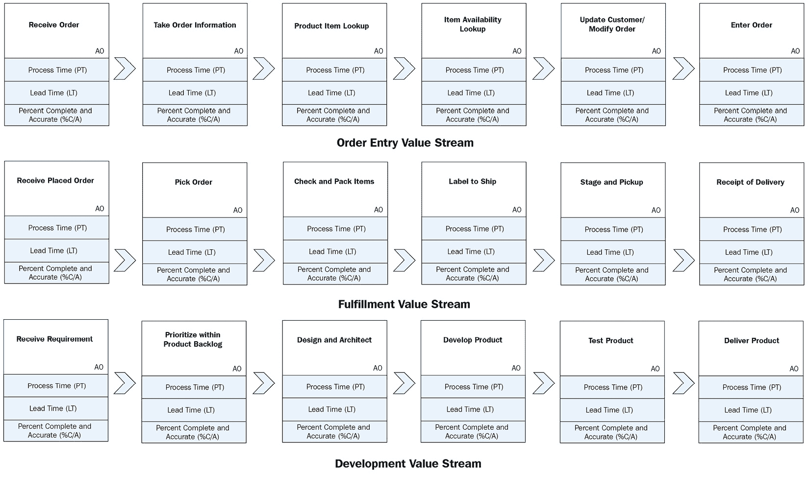
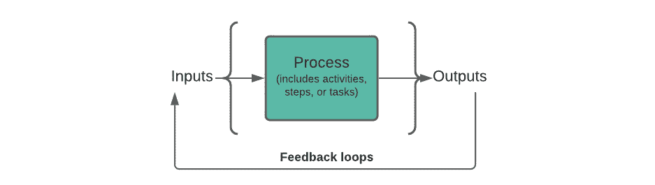
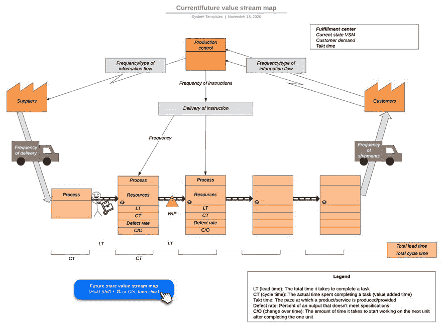

# 第一章*:* 交付以客户为中心的价值

本章介绍了价值的多种不同定义，并解释了敏捷、系统思维和精益开发如何协同工作以交付以客户为中心的价值。通过这些基础的理解，**价值流管理**（**VSM**）和**DevOps（开发运维）**也作为互补的**信息技术**（**IT**）实践和工具被引入，以支持**精益敏捷**实践。

你将学习 VSM 如何帮助最大化客户价值在组织的软件开发和交付流程中的流动。例如，当开发支持业务操作的应用时，VSM 有助于改善**系统开发生命周期**（**SDLC**）过程中的工作流。

然而，VSM 不仅仅是为了在数字经济中改善商业系统的软件开发和交付实践。许多商业企业、政府机构和非营利组织提供以信息为导向的产品和服务，这些产品和服务通过基于 Web 的服务进行交付。此外，许多物理产品都集成了计算设备、软件和互联网接入，以在整个生命周期中按需提供新功能和增强功能。

基于这些原因，VSM 方法和工具的使用必须超越 IT，以帮助改善跨操作和面向开发的价值流中的工作流程和信息流。

DevOps 以互补的方式改善了 IT 部门之间的沟通，同时集成和自动化 IT 流程，使得客户为中心的价值能够在所有组织价值流中持续流动。因此，现代的 DevOps 团队可以比传统的 SDLC 和敏捷实践更加高效、快速且无错误地交付价值。

本章将教你这些实践如何协同工作，以交付以客户为中心的价值。涵盖的主题包括：

+   定义多种形式的*价值*这一术语

+   开发价值主张

+   创造价值

+   从精益敏捷的角度看待价值

+   理解 VSM

+   理解 DevOps 在交付价值中的作用

+   整合精益、敏捷、价值流管理（VSM）和 DevOps

定义多种形式的价值这一术语

本书的核心内容是创建数字化转型，以高效、快速且低成本地交付以客户为中心的价值。这一策略涉及将信息技术（IT）与在企业中发生的价值流转型进行整合和对齐。价值流管理（VSM）是一种精益生产改进策略，在 IT 领域找到了新的应用。由于 VSM 是本书的主要内容，让我们从 VSM 语境下的价值定义开始。

## 从精益导向的视角看待价值

**价值流**是**精益生产**概念，描述了从构思、创建、部署、支持、退役到维护所需的产品生命周期活动。这一概念如其名所示，*价值流*的重点在于确保所有产品交付活动都能创造价值。从精益的角度来看，创造以客户为中心的价值意味着不仅仅提供功能和特性，还要消除所有客户不希望其成本中增加的浪费形式。

VSM 是一种方法，旨在系统地消除浪费，提高生产力和效率，同时降低成本。更准确地说，您将学习到 VSM 涵盖了面向精益的多种方法，以改善跨价值流的工作和信息流。现代 VSM 工具支持最初由丰田开发的 VSM 方法，这些方法用于映射物料和信息流，并在 2000 年代初期（Jones, Womack, 2003）将这一方法推广到全球。

当我们进入精益-敏捷视角和 VSM 相关部分时，您还会发现有两种形式的价值流：**运维**和**开发**。我们来快速看看这两种价值流之间的区别。

### 区分开发与运维

面向运维的价值流为组织的外部客户提供产品和服务，而开发价值流则创造组织运维价值流使用或交付的东西。

换句话说，可以这样表达：

+   运维价值流包括定义公司——或其产品线或**业务部门**（**LOBs**）——如何开展业务、赚取收入并向客户交付服务的工作和信息流。

+   开发价值流包括构建和支持运维价值流用来交付价值的产品、服务和其他工件的工作和信息流。

面向运维的价值流通过提供产品、信息和服务（无论是在线提供还是通过个人接触）来增强客户体验。相比之下，面向开发的价值流为内部或外部客户创造产品和服务。换句话说，开发价值流负责构建东西，而运维价值流则需要向客户销售、交付并提供支持。

这两项职能都是必要的，并且具有增值作用。然而，在目标、计划范围以及谁控制和资助这些活动方面，区分开发和运维是至关重要的。例如，业务部门高管和产品负责人对其运维价值流活动中的投资优先级负责。相比之下，投资组合管理团队则控制开发导向流活动的投资优先级。

另一种看待这种区分的方式是销售、交付和支持产品的运营导向过程。这些是为我们的客户提供价值的战术性活动，通常具有相对较短的规划周期。开发价值流的投资通常更大，对组织的长期生存至关重要，需要更长的规划和实施周期。相对而言，开发导向的价值流有助于确保组织具备满足战略目标所需的基础设施、产品和服务。

乍一看，开发与运营之间的这种区分似乎支持传统的 IT 组织模型。开发团队为内部和外部客户或用户创建软件产品，而运营团队则负责保持系统的运行、安全和可用，同时通过帮助台服务解决客户和用户的问题。

本书稍后你将学到，实施精益-敏捷实践的 IT 组织应考虑将传统的 IT 开发和运营职能转移到专门的产品团队中。但我们现在先不谈这个，我们稍后将在*第四章*，*定义价值流管理*中回到这个话题。

现在，让我们来看一些 IT 开发导向的价值流如何为其他组织价值流（例如客户订单输入或产品履行）开发和支持软件应用程序的示例。

### 开发支持组织价值流的应用程序

以下图表展示了三个组织价值流：*订单输入*、*履行* 和 *软件开发*。订单输入和履行是运营导向的价值流，而软件开发活动是开发导向的价值流：

图 1.1 – 价值流示例

每个活动块标识了活动的名称、**过程时间** (**PT**)、**交付时间** (**LT**) 和 **完成百分比与准确性** (**%C/A**) 指标。你将在稍后的*第八章*，*识别精益指标（VSM 第 5 步）*中学习如何使用这些指标。需要理解的主要一点是，IT 是一个关键的开发价值流，它提升了其他运营价值流的交付能力和效率。

本书故意以讨论面向运营和开发的价值流作为开篇。当前的趋势是将 VSM 视为一种基于工具的方法，用于改进 DevOps 流水线工作和信息流。DevOps 流水线流程的改进是 VSM 的一个很好的应用。然而，如果你的组织的 VSM 策略仅限于 DevOps，那么它就忽视了关键点。*图 1.1* 中展示的价值流示例讨论清楚地表明，基于 IT 的开发价值流如何帮助改善运营价值流。

本书提供了关于整合敏捷、精益、VSM 和 DevOps 实践的指导，以便在企业规模上实现业务敏捷性。这些方法和工具使组织能够快速、高效、以最低成本提供客户所需的产品和服务。那些成功实施这些方法的企业，特别是在整个企业范围内实施的企业，在我们日益数字化的经济中竞争时占据了优势。

我们将在本章后续内容以及整本书中讨论所有这些概念。在此之前，首先需要清楚理解在数字经济和 IT 角色中竞争意味着什么。

## 在数字经济中竞争

唐纳德·塔普斯科特在他的书《数字经济：网络化智能时代的机遇与危险》（1997 年）中首次提出了*数字经济*这一术语。书中的核心焦点是数字技术如何改变个人和社会之间的互动方式。

之后，在 2001 年，时任**美国人口普查局**经济项目副主任的托马斯·L·梅森堡发表了一篇名为《测量数字经济》的论文。论文描述了美国人口普查局发起的一项努力，旨在衡量电子设备作为我们当时正在兴起的数字经济基础的经济影响。

在他的论文中，梅森堡描述了数字经济的三个主要组成部分，列举如下：

+   **电子商务基础设施**：包括所有参与的计算、网络、通信、安全和软件系统。

+   **电子商务流程**：支持数字经济的业务流程。

+   **电子商务交易**：支持在线销售商品和服务的交易。

### 为数字经济构建产品

*数字经济*这一术语在现代语境下的意义远远超出了梅森堡最初以电子商务为中心的看法。例如，数字化技术如今允许组织通过互联网和移动技术开展业务，并提供近乎实时的全球信息和基于知识的服务访问。

此外，数字技术通过为物理产品增添新特性，从而增强了产品功能，这些功能是通过简单的材料或机械部件修改无法实现的。广义上讲，这些技术被归类为**物联网**（**IoT**），即使是在交付给客户之后，产品的功能和能力也可以进行更新。

物联网（IoT）能力的关键区分因素是能够通过网络传输数据，而无需人与人之间或人与计算机之间的互动。从概念层面看，物联网是一个由**唯一标识符**（**UIDs**）连接的计算设备系统，使它们能够通过互联网和移动连接与其他计算系统和数字设备进行交互。

物联网设备包括机械和数字增强的机器以及嵌入在制造商品、人员或动物中的物体。作为现代例子，您的汽车通过移动连接接收工厂更新，更新内容包括计算和导航系统。基于远程医疗的物联网解决方案通过外部和嵌入式监测系统实时监控患者的健康状况。最后的例子是，带有应答器的嵌入式生物芯片帮助识别动物并监控它们在野外和农场中的健康状况与位置，甚至可以识别您的宠物。

### 在数字经济中实现连接

我们的现代数字经济不仅仅包括电子商务和数字化增强的产品。互联网通过社交媒体工具和平台开辟了非凡的沟通途径、信息共享和协作。

基于网络的社交媒体工具使人们能够通过多种媒体格式（例如音频、视频、文字、照片、图像等）互动并分享信息和经验。社交媒体的核心在于利用内容推动*人与人之间*和*商业与人之间*的互动。

Gibbons Business Solutions LLC.的总裁 Holly Gibbons 列出了六种社交媒体内容类别，这些内容能够驱动互动（[`gibbons-business-solutions.com/6-types-of-social-media-content-that-drive-engagement/`](https://gibbons-business-solutions.com/6-types-of-social-media-content-that-drive-engagement/)），具体如下：

+   **推广**：提供关于产品和服务的信息

+   **教育**：建立专业知识并启用自助

+   **连接**：提供关于你业务的“内部”视角

+   **对话**：专门针对吸引客户

+   **灵感**：“让人感觉良好”的信息，包含引用、事实和成功的个人故事，反映了个人或实体的愿景和价值观

+   **娱乐**：通过分享节日祝福、笑话、漫画、有趣但富有信息的视频、竞赛和赠品来与观众互动

社交媒体是一种变革性能力，有助于推动我们现代数字经济的发展。以下小节列出了其他数字化增强的商业转型。

### 在数字经济中提供价值

数字经济的其他名称包括**互联网经济**、**新经济**或**网络经济**。数字经济的发展迫使传统的实体公司重新思考其商业战略，否则将面临被如**亚马逊**（零售）、**Airbnb**（旅游住宿）、**谷歌**（信息搜索）、**Netflix**（家庭娱乐）、**Lyft**和**Uber**（交通服务）、**特斯拉**（汽车和航空航天）、**YouTube**（基于视频的信息和娱乐内容共享）等激烈的竞争性颠覆者挤出市场的风险。

由于传统基础设施的投资遗产，公司需要迅速找到创造性的方法，利用其传统规模经济在数字经济中竞争。在某些情况下，这意味着寻找与客户互动的不同方式。在其他情况下，将传统和数字基础设施相结合的混合方式可能会提供最具竞争力的优势。

无论如何，公司必须定义并执行其竞争价值主张。他们必须评估所有的投资和活动，以确保最大程度地为增加以客户为中心的价值做出贡献。最终，本书介绍了许多相互关联的概念，帮助组织在数字经济中创造价值，但在进入这些章节之前，我们需要对*价值*的含义达成共识。以下小节将讨论这一主题。

## 深入探讨价值的众多概念

语义学在计算机科学中至关重要——如此重要，以至于有一个专门的 IT 学科叫做**本体论**。如果你查找*本体论*这个词，你会发现它源自形而上学的一个分支，专门研究*存在的本质*或*什么是存在*。本体论是一个复合词，结合了*onto*（希腊语*ὄν*）和“*存在；那就是*”（*gen. ὄντος, ontos*）。换句话说，它是一个旨在发现*什么是现实*的学科。

在信息科学领域，本体论处理*语义意义*。问题在于，人类有一个令人烦恼的习惯，那就是使用相同的术语，但对这些词语的实际含义有非常不同的看法。我们的生活经历、教育和智力能力极大地影响了我们对所使用词汇的理解。这是我们人类常常误解沟通的主要原因。

相比之下，传统信息系统必须对其使用的术语和价值有准确的上下文理解；否则，它们无法正确交换信息。这个问题同样适用于人机交互。我们希望使用的词语可能与计算机对这些术语的理解不匹配。这种二分法是推动**人工智能**（**AI**）研究的一个重要因素。换句话说，部分 AI 研究旨在帮助计算机理解在特定人机交互中词语的上下文含义。

*价值*一词在商业中有许多含义，这些含义支持各种商业实践或根据语境所追求的商业结果（也就是说，*价值*一词的含义根据其应用场景不同而有所不同）。举个与本书相关的例子，敏捷（Agile）、精益（Lean）、价值流映射（VSM）和 DevOps 都共享一个理念，即组织必须从客户的角度交付价值。然而，它们实现这一目标的策略各不相同。此外，IT 专家和商业分析师需要理解，他们与其他部门互动时，可能会遇到对*价值*一词的完全不同的理解。

用一个类比来说，我们遇到的情况有点像盲人描述大象的故事。由于他们看不见，盲人只能通过触觉来了解大象的样子，理解也有限，正如下面的图示所示：

图 1.2 – 六个盲人和大象

对于不熟悉这个故事的人来说，第一个盲人触摸到大象的象鼻并喊道，“*大象就像一条粗蛇*”；然而，下一个盲人摸到大象的耳朵，说：“*不，它像一个风扇*”。接下来，另一个人摸到大象的獠牙，说：“*我不知道你们在说什么；它是一支矛*”。排在后面的盲人摸到大象的腿并宣称，“*大象就像一根又粗又壮的树干*”，但是摸到大象侧面的人认为他们碰到的是一堵墙。最后，摸到大象尾巴的盲人认为自己抓住的是一根绳子。

只有一只大象，但盲人根据他们各自的“亲身”经历以及缺乏全局观念，形成了不同的大象理论。商业分析师在试图理解什么能为企业增值时，也会面临类似的问题。因此，在讨论敏捷、精益、VSM 和 DevOps 如何提升价值之前，我们需要花一些时间理解这个词在不同语境中的多种用法。

本章探讨了带有这一目标的多种价值变体，涵盖了所有权、会计、市场营销、供应链、敏捷、精益和 DevOps 等领域。

## 从商业资产的角度看待价值

在最简单的语境下，*价值*一词指的是从金钱、物质、实用性或个人角度表达的资产价值——例如，有许多方式来表达上市公司的商业价值，如股东价值、公司货币价值、价值捕获、公允价值和市场价值。

**股东价值**与公司在市场中股票持有者股份的价值有关。股东的价值会随着市场对公司在维持和增长利润能力的看法而波动。从这个角度来看，一家公司的价值大致等同于其流通股数乘以当前的股价。

*货币价值*是对资产——如公司、产品、财产、土地或服务——如果出售时会带来的金钱数额的表达。换句话说，货币价值是指某物在自由公开市场上值多少钱。货币价值的评定来自*供给*与*需求*的动态——例如，相对需求增加时，产品供给增加会降低其价值。相反，供给有限而需求强劲时，会推动价格上涨。

如果你和一位**工商管理硕士**（**MBA**）毕业生或会计师交谈，他们可能会使用术语*价值捕获*。在他们的语境中，价值捕获描述的是在每笔商业交易中保留一部分价值的过程，通常表现为盈利。然而，在与公共融资相关的事务中，价值捕获意味着利用公共融资开发基础设施，从而提升一个城市整体价值以及周边商业地产的价值。

*公允价值*是根据一个国家的标准会计实践对商业资产（和负债）进行评估，用于财务报告，通常用于评估销售、并购中的价值。**国际财务报告准则基金会**（**IFRS 基金会**）是一个非盈利的行业标准组织，定义了全球公认的会计准则，发布为*IFRS 准则*。*IFRS 第 13 号准则*（[`www.ifrs.org/issued-standards/list-of-standards/ifrs-13-fair-value-measurement/`](https://www.ifrs.org/issued-standards/list-of-standards/ifrs-13-fair-value-measurement/)) 将公允价值定义为“*在计量日期，市场参与者之间进行有序交易时，出售资产或转移负债所收到的价格（退出价格）*”。

最后，*市场价值*是对公司在当前市场条件下价值的评定。市场价值是资产在市场上的估计价格，或者是投资界对股权所给予的价值——即第三方为获得企业或其他资产的股权或证券所支付的价格。

我们现在对*价值*这一术语在企业和其他资产所有权中的应用有了广泛的理解。但*价值*这个术语也可以具有一个语境意义，指示特定商业关系的重要性，如*价值链*和*价值网络*。**增值**（**VA**）关系是下一节的主题。

## 从商业关系的角度看待价值

从商业资产所有权的角度来看，价值的概念在语境中的应用是直接的。人们和企业通过投入时间、金钱和资源来提升其商业资产的价值，但企业也通过与供应商和其他合作伙伴的关系来获得价值。

从最广义的角度来看，所有外部合作伙伴提供产品或服务，以支持另一个实体的业务目标，尽管两个合作伙伴都能从这种关系中获得价值。但在这里，我们仍然需要仔细定义合作伙伴关系的类型，以了解每个合作伙伴提供的价值。例如，一家公司可能有供应商提供用于其产品的组件和材料，并将其交付给消费者。其他合作伙伴可能会转售或重新品牌化其他公司的产品。这些关系有多个变体，例如转售商、**VA 转售商**（**VAR**）和**原始设备制造商**（**OEM**）。

转售商就像零售商店，购买产品后再将其转售给客户。零售合作伙伴可以是传统的实体公司、在线转售商，或是两者的混合体。

VAR 是一种通过定制或服务增强其他公司产品价值的公司。例如，一家**休闲车**（**RV**）制造商通常从一个或多个主要的汽车和卡车制造商那里购买裸车底盘、发动机和轮胎。然后，它会添加车身和内部设备，使车辆适合露营。VAR 还可以提供围绕其他公司产品的服务，如安装和配置服务、咨询、故障排除、维修或客户支持。

OEM 公司通常采用其他公司的产品，并将其重新品牌化并以其公司名义销售原始产品。OEM 还可以提供类似于 VAR 类型业务关系的产品和服务扩展。不管怎样，OEM 都会采购主要制造商额外的权利，将其产品重新品牌化为自己的产品。

## 建立作为价值网络的商业关系

**价值网络**包括任何一组互联的组织或个人，他们以集成和协作的方式工作，以便整个团队受益。面向商业的价值网络帮助成员买卖产品、组织和分配工作以及共享信息。虽然有许多类型的价值网络关系，但它们都属于两个广泛的类别：内部或外部价值网络。

*内部价值网络* 包括组织内部的人们合作以实现共同或互补的目标。这些内部价值网络通常在已建立的业务流程或价值流的范围内工作。业务流程和价值流都描述了结构化的工作方法。

“*业务流程*”一词通常与传统的跨职能和官僚化的组织结构相关联。**价值流**的概念来源于精益生产和精益六西格玛方法，这些方法用于产品交付。本书的后续章节将详细介绍精益生产和价值流的相关内容。现在，可以将价值流理解为一系列与客户需求对接的活动，用以交付产品和服务。此外，精益生产是一种改进产品和信息流动的方式，旨在提升价值流的效率。

一个规模化多个但小型的敏捷导向团队的组织，通过集成、协调和同步的方式来开发和交付大型产品，另一个例子是内部价值网络。这些敏捷团队也可能采用精益产品开发概念，通常被称为精益敏捷方法论或框架。

*外部价值网络*描述了第三方之间的跨组织互动，这些第三方超出了主要商业实体的范围，但对其成功有所贡献。换句话说，外部价值网络在支持或从主要商业实体的目标中获益方面具有共同的利益。在这种情况下，外部价值网络包括代理商、商业伙伴、客户、顾问、产品用户、利益相关者、供应商以及参与增值关系的任何其他个人或实体。

内部或外部价值网络通过其关系、跨职能或面向价值流的流程，以及它们在企业中与产品和服务相关的具体角色创造价值。这些关系必须是互惠互利的——换句话说，所有在价值网络中的各方都应从他们的关系中获得价值。如果情况不是这样，网络就无法实现其目标和期望，关系通常会变得具有破坏性。在极端情况下，网络会解体，参与者也会退出他们的商业或雇佣关系。

此外，价值网络中的参与者必须履行各自的责任。无效的参与者会削弱整个网络，其他人则必须介入填补空缺——前提是这可能实现。另一方面，拥有价值网络的一个优势是，参与者可以提供资源、技能、经验和冗余，帮助较弱的环节赶上进度或克服他们的局限性。

本节结束了我们对价值网络的讨论。在下一节中，我们将探讨一个互补的概念——价值链。与将 VA 关系视为网络不同，价值链描述了一家公司为其产品和服务增加价值的活动。

## 将业务关系建立为价值链

**价值链**是指公司通过一系列过程或活动向其产品和服务增加价值的方式。价值链包括产品生命周期活动，涵盖了产品构思、设计、原材料接收以及通过更细化的生产过程增加附加值。价值链过程还包括推广产品、接收订单，然后将最终产品销售给消费者。

迈克尔·波特在他的书籍《竞争优势：创造与维持卓越表现》（1985 年）中首次提出了*价值链*这一术语。波特将增加价值和竞争优势的主要价值链活动描述为以下五个要素：

+   **内部物流**：接收、存储和处理原材料和库存。

+   **运营**：将原材料转化为成品。

+   **外部物流**：将产品和服务分发给客户。

+   **市场营销与销售**：包括广告、促销、定价策略，并管理所有销售渠道（线上、内部直销、外部直销、通过转售合作伙伴的间接销售）。

+   **服务**：帮助维持产品并提升消费者体验，包括客户支持、产品维护和修理、退款和换货。

**价值链分析**提供了一种利用价值链获得竞争优势的战略。价值链分析评估了将产品或服务的输入转化为特定客户类型所重视的输出所涉及的活动。价值链分析从识别创建产品所需的每一个生产步骤开始，然后寻找提高整体价值链效率的方法。

迈克尔·波特关于**价值链管理**（**VCM**）理论的观点支持了传统的使用商业流程、最佳实践、组织资产和**人力资源**（**HR**）来实现竞争优势，从而推动市场进一步增长的观点。迈克尔·波特明确指出，他的做法是实施一种基于活动的理论来推动竞争优势。

尽管他的观点听起来与精益开发的概念有些相似，但波特的理论与精益最初注重客户的导向相对立。波特提倡一种战略，即比竞争对手更便宜、更快速地生产和交付产品，而在他看来，这种做法自动带来新的客户和增长。然而，精益实践者认为，我们必须首先关注客户需求，然后再优化活动以交付客户想要的内容，否则我们将失去方向。

既然我们已经说明了这一点，让我们从客户的角度来探讨价值。

## 定义客户价值

**客户价值**是最终客户从产品或服务中获得的价值。在前一部分中，你了解到精益开发战略强调评估活动以增加价值，并消除那些没有增加价值的活动。

精益开发策略是有意义的，因为最终，客户是决定“价值”对他们意味着什么的唯一裁判。客户通过效用、质量和利益来感知价值。我们能够提供他们所需的东西，是客户满意度的决定性因素。

但是，客户价值是一个复杂的概念。如果所有客户都看重相同的事物，那该多好啊。在一个如此同质化的世界里，我们只需生产一种产品变种，并成为最有效率的生产商。当然，我们还需要在市场营销、销售、交付和支持等环节中具备竞争力。这样的市场支持了迈克尔·波特（Michael Porter）关于利用价值链创造竞争优势的观点。

但这并不是我们所处的世界。相反，客户有不同的预算和不同的需求，偏好不同的功能和特性。在传统的大规模生产模式中，市场营销和销售组织通过告知客户他们应该喜欢哪些产品和服务来影响客户行为。这一策略使生产商能够按照迈克尔·波特的指导改善价值链。

这种策略可能有效一段时间，但直到其他竞争者开始询问客户需求并提供更好的产品时才会受到挑战。因此，面向客户的价值交付策略必须不断演变。到了 1980 年代和 1990 年代，**客户关系管理**（**CRM**）和精益开发策略成为主流实践，重点调整产品开发和交付工作，以满足大众市场和盈利性细分市场的客户需求。

**精益生产**，也称为**精益制造**，是从丰田的运营模式中衍生出来的一种现代生产方法，这一模式被称为*丰田方式*和**丰田生产系统**（**TPS**）。*精益*这一术语并非源自丰田，而是由约翰·克拉夫奇克（John Krafcik）在 1988 年创造的，当时他正在研究管理学并在詹姆斯·W·沃马克（James P. Womack）的指导下进行研究。克拉夫奇克的研究是麻省理工学院（**MIT**）对汽车未来的 5 年研究的一部分。克拉夫奇克的研究提供了《改变世界的机器》（Womack、Jones、Roos；1991 年）一书中引用的大部分数据。但正是沃马克、琼斯和罗斯的书阐述了精益制造的概念，并引入了*精益生产*这一术语。

沃马克和丹尼尔·琼斯（Daniel Jones）定义的精益概念包含五个基本原则，概述如下：

+   精确地通过特定产品指定价值

+   确定每个产品的价值流

+   让价值流动不受阻碍

+   让客户从生产者那里拉动价值

+   追求完美（Womack 和 Jones，1996，第 10 页）

CRM 是一种以数据为中心的管理客户和潜在客户信息及互动的方法。具体来说，CRM 方法和软件工具利用数据分析技术来处理客户数据，以更好地了解客户与公司之间的历史，并改善客户关系。CRM 主要是一个面向市场营销的职能，支持其改善客户留存率并推动新销售增长的目标。

通过 CRM 和精益方法，组织可以利用工具来确定从客户角度看，什么是价值，并根据这些信息调整组织活动和资源以提供该价值。其他一些方法和工具也有助于识别客户对价值的感知——例如，市场营销和产品管理职能可能会组织焦点小组，开展调查来收集客户数据。反过来，这些数据有助于通过各种分析技术进行分析，诸如以下内容：

+   **客户之声**：用来描述捕捉客户期望、偏好和不满的过程的术语。

+   **客户效用图**：一张展示六个效用杠杆的地图，用于在各个买方体验周期的六个阶段中，为买方提供卓越的效用。

+   **Kano 模型**：一种理解、分类和优先排序五种客户需求（或潜在特征）的方法，用于新产品和服务的开发。

+   **客户旅程图**：一种图示，展示客户与公司互动的各个步骤，无论是实体产品、在线体验、零售销售、服务，还是这些元素的组合。

+   **同理心图**：一种由**用户体验**（**UX**）设计师使用的方法，用于理解用户行为，并将发现结果以视觉形式传达给其他利益相关者，以提供对潜在用户的共同理解。

+   **客户价值管理（CVM）**：一种评估组织产品和服务所提供的感知价值的方法。价值通过对比利益、功能、性能与价格、成本和利润率来评估。

本小节总结了我们关于价值的多种定义，并探讨了为什么产品和服务必须始终从客户角度交付价值。我们还了解了 CRM 方法和工具结合精益实践如何帮助我们发现并向客户交付价值。但是，企业如何知道自己是否拥有一个可行的价值主张呢？这将是下一节的讨论内容。

# 开发价值主张

Michael J. Lanning 在其与麦肯锡公司合作时，提出了*价值主张*这一术语。他的工作开创了在制定公司战略、目标和商业能力时，根据客户需求进行调整的概念。Lanning 在其著作《交付有利可图的价值：加速增长、创造财富并重新发现商业核心的革命性框架》（Lanning，1998 年）中阐述了这些概念。

Lanning 从客户体验的角度看待价值，因此将*价值主张*定义如下：

组织在某一时间段内为一群目标客户提供的体验组合，包括价格，作为客户购买/使用并按组织要求进行的回报，而不是选择某些竞争的替代方案。

换句话说，*价值主张*这个术语暗示了一种明确的关系，在这种关系中，目标客户通过组织提供的产品和服务获得体验，尽管这些体验是有限时效性的（即，价值随时间变化）。

该术语还设定了期望，即客户必须购买、使用并按照交付组织的要求做某些事情，而不是选择一个竞争选项。竞争选项不仅限于客户购买竞争对手的产品或服务。客户可能选择什么都不做，或者用他们内部资源创造所需的体验。

还需要注意的是，价值主张的定义并没有直接涉及它作为市场营销和销售沟通工具的使用，尽管许多人从这个角度来看待该术语的相关性。客户看重的是他们通过使用组织的产品和服务获得的体验，而不是获得的产品功能。因此，关键问题是确保组织协同工作，提供所需的体验，而不仅仅是宣传可能相关或可能不相关的功能或特性。

不幸的是，*价值主张*这个术语通常被市场营销和销售专业人士在有限的背景下使用，作为如何竞争性地定位商业产品或服务的陈述。但这种局限的关注点忽视了 Lanning 主要工作的意义——即通过将组织与其企业战略对齐，来提供盈利的价值。从这个角度来看，组织中的每个人都在传递盈利价值中扮演着角色。

这句话并不意味着市场营销人员不应当使用价值主张来恰当地传达组织的价值，或者销售人员不应当使用价值主张来确保他们将合适的体验卖给合适的客户。然而，从比喻的角度来看，组织必须首先解决两个问题，如下所述：

+   谁在掌舵？

+   其他成员上船了吗？

本书后续章节介绍了价值流映射技术，以识别并消除组织价值流活动中的所有浪费。但价值流团队如何知道他们需要将活动与哪些结果对齐，从价值流分析（VA）的角度来看呢？这正是通过回答五个简单问题来构建引人注目的价值主张的正确目标。

## 通过五个问题来对齐商业战略

价值主张回答了五个关于实体如何计划交付价值的关键问题。这些问题列举如下：

+   谁或什么是目标市场客户？

+   价值主张的规划和执行生命周期的视野是什么？

+   我们希望这些目标市场实体为我们交付的体验做些什么？

+   这些客户有哪些竞争性替代方案可以获得期望的体验？

+   假设客户按照我们的要求操作，他们获得的体验（包括价格）与竞争性替代方案相比如何？

进一步说明，兰宁明确指出，结果体验必须是*具体的*、*可操作的*和*可比较的*。他还指出，成功的价值主张是权衡的结果，因为某些体验不如竞争对手的替代方案。因此，重要的是优化整体体验（兰宁，1998，第 62 页）。

## 为组织创建一个愿景

价值主张作为战略性文件，有助于集中并整合整个业务，以传达其目的。价值主张是领导层作出的选择，与他们的组织战略、目标和使命一致。最重要的是，价值主张表达了对其目标市场客户最有利的愿景。

在这种价值背景下，执行领导层并不负责决定组织必须为客户提供哪些产品和服务，甚至不负责决定如何创建和交付这些产品和服务。这样做是围绕领导层希望做什么的内部导向产品策略的例子。

然而，答案并不是反过来问客户你们认为组织的价值主张应该是什么。在这种情况下，追求客户意见很快会变得无效，因为有许多不同细分市场的客户具有不同的*体验*偏好，而追求特定的客户偏好可能会错误地使组织偏离为更广泛或更有利可图的目标市场客户增加价值的方向。

稍后，您将学习如何识别和优先考虑客户需求，作为产品待办事项中的可操作工作项。目前，理解一个组织必须最终将注意力转向开发具体的增值特性和功能至关重要，但在组织建立愿景并能够通过价值主张完全表达它之前，开始这种努力也是危险的。

成功的领导者往往具有高度的创造力，并且经常在客户意识到他们需要某种产品之前，便能为企业设想并表达一个愿景。典型的例子包括史蒂夫·乔布斯和比尔·盖茨，他们看到了将计算机的力量带给大众的机会，分别成立了**苹果**和**微软**。**亚马逊**创始人杰夫·贝佐斯则设想了一个在线零售书店，改变了读者评审和购买书籍的方式。最终，贝佐斯彻底改变了客户的零售体验。一旦他成功找到了书籍的在线零售模式，他就设想将这一模式扩展到几乎所有商品的销售中，并在此过程中成为全球最富有的人。

埃隆·马斯克是另一位商业领袖，他运用创意和智慧定义了多个市场机会。例如，他成立了**特斯拉公司**以大规模生产电动汽车，成立了**无聊公司**来修建地下隧道以改善拥挤地区的交通，成立了**SpaceX**以建造可以垂直降落的可回收火箭。

需要注意的是，埃隆·马斯克在这个例子中并没有试图将所有这些独特的价值主张合并成一个公司。拥有多个价值主张的组织应在不同的产品线之间建立足够的分隔，以避免让客户感到困惑。

组织可以选择通过部门、分部或公司来区分产品线。产品线的分离程度主要取决于它们的价值主张之间的差异。通过价值主张来恰当地区分产品的原则适用于数字产品和实体产品。

## 提供价值

在上一节中你已经学到，成功的首席执行官具有创造力，并且通常会在潜在客户意识到需求之前，就已经为新产品构思出创意。然而，提出一个创意仅仅是开始。组织的领导者们通过回答之前提到的五个问题，共同完善了最初的愿景。

在这个过程中，领导者会在价值主张文件中深入讨论并阐明他们共同的愿景。最终，价值主张定义了组织所处的业务领域、潜在客户是谁，以及企业必须提供哪些类型的体验以赢得客户的支持。

迈克尔·J·兰宁的书名是*提供有利可图的价值*。只有当组织获得足够的**投资回报率**（**ROI**）以证明投资的合理性时，它才得以生存。如果没有足够的资金，企业就无法持续运营，因此盈利目标显而易见。剩下的部分，*提供价值*，同样至关重要。交付价值的能力是实现盈利的关键。

在价值主张的背景下，Lanning 提供了一套扩展的*价值*和*价值交付*的定义，如下所示（Lanning，1998 年，第 316 页）：

+   **价值**：客户在某些结果体验与某些替代方案相比所感知到的净可取性——客户应该愿意为此支付的费用

+   **价值交付**：选择、提供和传达一些结果体验，包括价格

+   **价值交付链**：与业务相关的实体——包括供应商、中介、主要实体、客户和离线实体——被理解为相互交付价值，并作为一个相互连接的关系集

+   **价值交付聚焦**：从选择、提供和传达一组期望的结果体验的角度理解业务，以吸引潜在客户

+   **价值交付框架**：整个主值交付系统（**VDS**）及其支持系统的相关问题和对应的行动，在价值交付链的背景下进行理解

+   **价值交付选项识别**：探索市场空间，以发现与传统市场细分相比，哪些主要的 VDS（价值交付系统）是可行的

+   **价值交付系统**（**VDS**）：一个**端到端**（**E2E**）的商业系统，通过协作和作为一个共同体的形式，交付完整的价值主张

本节总结了我们关于价值主张的讨论。在本章结束之前，你将了解来自敏捷、精益、价值流图（VSM）和 DevOps 背景下的价值观念。但在深入这些主题之前，我们需要快速回顾一下与创造价值相关的传统商业概念。这个主题将在下一节中探讨。

# 创建价值

最终，本书的主题是价值创造以及一个组织在需求、效率和持续性方面创造价值的能力。最重要的是，我们为交付价值所作的努力必须与客户对什么能为他们的体验增加价值的看法一致，这些体验包括我们的组织、产品和服务。

“价值创造”这一术语通常赋予的定义相对广泛，我们需要理解人们在使用该术语时的具体含义。最简单的表述是，价值创造是任何能够创造比其*输入*更有价值的*输出*的过程或活动。

输入-转化-输出过程的展示（即**输入-过程-输出（IPO）模型**）包括一个功能图，展示了输入、输出和所需的处理任务，这些任务将输入转化为输出。请参见下图以示范：

图 1.3 – IPO 模型示例

输入代表来自外部来源的信息和材料流入一个过程。处理步骤包括所有需要的活动（步骤或任务），将输入转化为有价值的东西。输出是经过处理的、流出转化过程的增强数据和材料。

*图 1.3* 中显示的 IPO 图形展示了增值活动。增值过程增加了商品和服务的价值，并通过延伸改进了企业的价值。只有当客户足够渴望这些产出时，价值转化过程才能发挥作用。客户创造、交付和获取的价值驱动了股东的价值。

从财务或管理会计的角度看，我们通过将输入转化为产品、服务和流程的产出，来推动组织价值链上的货币价值。然而，对于在组织内部增加价值的事物，财务定义的创建价值是有限的，不能完全捕捉到。同样重要的是，人们的无休止和持续创新、劳动和创意，以及品牌营销。

作为精益敏捷和 DevOps 从业者，您负责无休止和持续创新的努力，同时提供劳动力和创意，以从数字增强的产品和服务中产生价值。此外，产品管理和市场营销职能负责品牌营销作为他们需求创造的一部分（即促进产品的价值主张，以创建品牌知名度，从而引起客户需求并获取产品）。

记住这个简单的 IPO 模型，因为它形成了查看大多数价值流活动的基本图形方法。主要区别在于我们将分解过程函数，显示所有相关活动及其增值相互关系。

在前一节关于价值主张的部分，您了解到我们客户基于体验的价值感知随时间而变化。因此，价值创造取决于组织能够按需、高效和持续地创造价值的能力。换句话说，组织在不断变化的压力下，即使是在最佳情况下，变革也是具有挑战性的。

宏观层面上的变革发生在组织定义新的业务战略和可能有利可图的价值主张时。这种类型的变革更为艰难，特别是当组织需要从其传统的等级制度和官僚体制组织结构演变时。

这种变革不可能仅靠法规来实现，因为这种规模的业务转型战略如果没有高管支持和领导、适当的计划以及受控的推广，就会失败。我们暂时搁置这个话题，并在*第六章*中重新讨论它，*启动 VSM 计划（VSM 步骤 1-3）*。

在敏捷的价值观和原则的背景下，变化在微观层面上非常频繁，每次开发迭代都会发生。这种频繁的变化发生是因为小型的、自治的、自给自足的团队会自动自组织，以在计划的时间范围内交付可预期的增量价值——通常为 1 到 4 周。

此外，在每次迭代结束时，团队会进行回顾活动，评估改进的领域，这些改进应该从下一个迭代开始。以敏捷方式运作的团队实施如 Scrum 等过程，通过变革在重复且可控的方式下交付以客户为中心的价值。

接下来的部分将描述敏捷和精益开发概念的核心价值观和原则。

# 从精益-敏捷的角度看待价值

精益-敏捷实践将《*敏捷软件开发宣言*》（通常称为*敏捷宣言*）中概述的价值观和原则与最初由丰田开发、后由约翰·克拉夫奇克（Krafcik, 1988）、詹姆斯·沃马克（Womack）、丹尼尔·琼斯（Jones, 1990, 2013）以及玛丽和汤姆·波彭迪克（Poppendieck, 2003）进一步阐述的精益开发实践相结合。

注意

我之前的书籍《*在现代企业中扩展 Scrum*》提供了关于精益-敏捷概念和实践的更详细内容。本节提供了一个温和的介绍，足以理解本书后续章节中描述的精益-敏捷实践的应用。

## 理解敏捷的价值观和原则

2001 年，17 位软件开发者聚集在犹他州的一个度假村，讨论他们的开发观点，看是否存在共同的立场。尽管许多参与者是竞争对手或归属于不同的软件开发方法论，但他们在价值观和原则上找到了共同点。吉姆·海史密斯描述他们的成果为“*软件开发中的模糊的价值和文化*”（[`agilemanifesto.org/history.html`](https://agilemanifesto.org/history.html)）。

*敏捷宣言*确立了 4 个价值观和 12 条原则，阐明了敏捷软件开发方法。

敏捷宣言的核心要素是其价值观，具体表述如下：

*我们通过实践开发软件并帮助他人开发，发现了更好的开发方式。通过这项工作，我们逐渐重视：*

+   *个人与互动重于过程与工具*

+   *工作软件重于全面文档*

+   *客户协作重于合同谈判*

+   *响应变化重于遵循计划*

*也就是说，虽然右侧的内容有价值，但我们更重视左侧的内容。*

*肯特·贝克 詹姆斯·格雷宁 罗伯特·C·马丁*

*迈克·比德尔 吉姆·海史密斯 史蒂夫·梅洛尔*

*阿里·范·本内克姆 安德鲁·亨特 肯·施瓦贝尔*

*阿利斯泰尔·科克本 朗·杰弗里斯 杰夫·萨瑟兰*

*沃德·坎宁安 乔恩·凯恩 戴夫·托马斯*

*Martin Fowler Brian Marick*

*《敏捷软件开发宣言》*的签署人之一是 Jim Highsmith。他建立并维护了一个包含该事件及与会者发现的详细信息的网站。相关页面的**统一资源定位符**（**URLs**）如下所示：

+   *敏捷软件开发宣言*：[`agilemanifesto.org/`](https://agilemanifesto.org/)

+   *敏捷宣言背后的原则*：[`agilemanifesto.org/principles.html`](https://agilemanifesto.org/principles.html)

+   *历史：敏捷宣言*：[`agilemanifesto.org/history.html`](https://agilemanifesto.org/history.html)

这些软件开发人员代表或使用了轻量级的软件开发实践，以避免传统的计划驱动和线性顺序 SDLC 模型（即**瀑布模型**）的陷阱。由于他们使用了竞争性的方法论，他们未能在各自的 SDLC 实践中找到共同点，而是通过书面形式的共享价值观和原则找到了共同点。

在现代背景下，基于敏捷的开发实践具有以下共同点：

+   迭代和频繁的开发周期。

+   客户中心价值的增量发布。

+   小型、自治、独立的团队，这些团队灵活、适应性强，能够自我组织，处理任何相关的工作（即，我们不期待软件开发团队执行市场营销或销售相关的工作）。

+   与客户的频繁互动，以展示新的增量价值并获取他们的反馈。

+   开发人员需要有自由从实验中学习，知道他们可能会失败，但也知道要在短期开发周期中将失败控制在最小范围内。

+   定期回顾以评估改进的领域，并实施行动计划以在下一个迭代中落实这些改进。

+   技术卓越和良好的设计增强了团队的能力和敏捷性。

+   团队成员之间的多样性和尊重是团队进化和持续成功的关键因素。

除了这些简单的原则外，软件开发团队可以自由选择他们喜欢的方法和工具。17 名参与者代表了至少 7 种轻量级的软件开发方法论。在这 7 种方法中，Scrum 后来成为了实现小团队敏捷的事实标准。

本节介绍了敏捷方法的基本概念。接下来我们将介绍精益开发的概念，特别是它在现代敏捷软件开发中的相关性。

## 回顾精益开发的基础。

如前文所述，*定义客户价值*，精益开发的概念最初在丰田发展起来。丰田并不吝于与他们的价值链合作伙伴分享这些理念，后来—在更大范围内—通过推广一本名为*丰田方式 2001*的小册子，将这些理念传播到跨行业的制造公司。他们致力于帮助其价值链合作伙伴，因为这些努力为提升其价值流带来了回报。

2004 年，Jeffrey Liker 通过 14 条基本管理原则总结了他对*丰田方式*的看法（Liker，2004）。我在我的书《跨现代企业的规模化 Scrum》中也提供了这些原则的例子。

作为简要介绍，以下列表包含了每个管理原则的总结：

+   精益是一种长期的管理哲学。

+   关注建立持续的流程，以便快速暴露问题并消除浪费。

+   根据需求，采用拉动式方法进行订单和物料输入。

+   消除一切形式的批处理流程。

+   第一次就把事情做对，并在问题出现时立即停止生产。

+   在你的价值流中标准化任务和流程。

+   使用看板等可视化控制，避免问题被隐藏。

+   只使用经过充分测试且可靠的技术，由你的团队选择，以支持他们的流程。

+   培养未来的领导者，他们已经理解工作和组织哲学，并能将其传授给他人。

+   培养卓越的团队和人才。

+   尊重并帮助改善你的扩展网络中的合作伙伴和供应商。

+   实践现场管理—亲自去了解组织中正在发生的事情。

+   慢慢做出决策，通过共识，只有在经过尽职调查和充分考虑后才能做出决定。

+   通过反思和持续改进，成为一个学习型组织。

由于本书讨论的是通过精益敏捷实践提升组织在数字经济中的竞争力，接下来我们将讨论精益软件开发实践。

## 实施精益软件开发实践

Mary Poppendieck 和 Tom Poppendieck 在 2003 年出版的同名书籍中创造了*精益软件开发*这一术语。这本书是首次广泛推广将传统精益开发实践应用于软件开发的例子。除了采用和应用 7 条精益原则到软件开发中，Poppendieck 还识别了 22 种*精益思维工具*，有助于将精益应用于各种敏捷实践。

精益原则包括以下内容：

+   **消除浪费**：从活动中剔除任何不为客户增值的部分。

+   **加强学习**：投入时间和资源进行学习和实验，提升技能、技术和流程。

+   **尽可能晚地做出决定**，保持选择的灵活性。

+   **尽可能快地交付**，通过集成和自动化软件开发生命周期（SDLC）和运营支持流程。

+   **赋能团队**：让从事工作的人员充分发挥他们的决策权，因为他们是最了解工作、最接近工作的人员。

+   **建立完整性**：构建具有一致架构、可用性和适用性的可维护、可适应和可扩展的软件系统。

+   **看到全貌**：避免专业化的做法，因为专家往往会围绕他们的特定目标和兴趣来优化系统。

精益和精益软件开发的学科，以及 Poppendiecks 推荐的精益工具过于广泛，无法在本章中深入探讨。我们将在本书的后续章节中再次讨论这些话题。但现在，让我们继续介绍价值流的概念、它们的目的、类型，以及我们如何定义它们。

## 通过价值流交付价值

詹姆斯·沃马克、丹尼尔·琼斯和丹尼尔·罗斯通常被认为是定义*价值流*一词的人，出自他们的书《改变世界的机器》（沃马克、琼斯、罗斯；1990 年）。沃马克确实在他后来的书籍中讨论了价值流，如《精益思想》（沃马克；1996 年、2003 年）和《看见整个价值流》（沃马克、琼斯；2003 年）。然而，詹姆斯·马丁是第一个在他的书《伟大的转型：使用企业工程的七项学科对齐人员、技术和战略》（马丁，1995 年）中详细定义价值流概念的人。

很容易将价值流的概念与精益中的*价值流映射*概念联系起来，但这是一个错误的关联。马丁在他的书中简要介绍了精益制造的概念，但他将价值流与精益制造的关联，主要用于围绕客户价值重新设计工作流程（马丁，1995，第 102 页）。相比之下，价值流映射是一种评估信息和物料流动的可视化技术。在接下来的子章节中，我们会进一步讨论价值流映射。

马丁将价值流定义为“*为‘客户’创造结果的端到端活动集合，客户可以是最终客户，也可以是价值流的内部‘最终用户’*”。马丁还指出，价值流必须有一个明确的目标来满足或取悦客户。马丁将价值流作为一种重新设计业务流程的方法，目的是通过以最“*简单、直接且专注*”的方式开发产品来支持客户需求。

马丁在撰写他的书时，**业务流程再造**（**BPR**）是一个主流概念，IT 组织与职能和跨职能的业务组织合作，精简并自动化关键的业务流程。马丁敏锐地观察到，业务流程传统上是通过内部需求驱动的连续变革而演化的，而不是由客户需求推动的。因此，许多业务流程都臃肿、低效，且与客户需求无关。

马丁将他的价值流概念引入为一种端到端（E2E）重新设计的业务流程，从活动或任务层面来创造更好的流动性。马丁指出，许多业务系统的发展是为了支持当时存在的业务流程，而这些基础流程往往是为了支持可疑的议程和目标而发展起来的。

更好的方法是消除业务流程的概念，转而让组织重新评估其企业为一个价值流的集合，而这些价值流很可能都需要重新设计。这种方法确定了客户所重视的内容，并评估了组织中提供这些价值的活动集合（即，价值流）。下一步是简化已识别的价值流。只有在这之后，组织才应考虑开发信息系统和自动化来支持它们新形成的价值流。

在现代精益敏捷和 DevOps 环境中，我们可以更快地行动，但精益敏捷概念是在马丁的书出版后逐渐发展起来的。如今，价值流识别和价值流映射是精益敏捷实践者工具包中的关键组成部分。

## 识别价值流

价值流是更广泛且集成的业务系统中的组成过程，描述了利益相关者——无论是内部还是外部客户——如何从组织中获得价值。一个业务价值流包括一系列步骤或活动，必要时提供客户在更基础层面上所期望的产品、服务和体验。

价值流可以支持产品开发和交付活动以及任何其他面向客户的服务。尽管面向开发的价值流可以直接为客户或转售伙伴提供产品和服务，但更典型的场景是它们将产品和服务交付给运营或面向客户的价值流。那些不增加价值的步骤在客户眼中是浪费——换句话说，客户不想为那些增加浪费而没有增加价值的内容付费。

我们容易认为客户不会知道这些多余的活动，但在竞争激烈的市场中，关注并提供更好的以客户为中心的价值的竞争对手很快会揭露这些问题。

兰宁提出的将价值评估为客户期望的体验的概念为我们定义价值流提供了一个模型。让我们快速看一下客户通常从他们的产品、服务和解决方案提供商那里想要的内容，具体列举如下：

+   开放、可用、易于访问的知识：

    a. 关于产品和服务

    b. 比较信息——来自公司、可信代表和行业专家

    c. 产品和定价信息

    d. 采购——如何以及在何处获取产品和服务

+   简化且可能是实时的订单输入

+   按照期望的质量、特性、功能和成本开发的产品

+   推销产品升级和服务，以使客户体验更加优越

+   履行—按客户偏好的方式和时间交付

+   客户支持—按需提供，能够在客户需要时解答他们的问题并解决他们可能遇到的问题

+   持续的产品维护和增强

这个列表并不完整，但为这次讨论提供了一个很好的起点。各个组织部门协作定义和创建价值流，尽管特定部门可能主导某些价值流的定义，例如，产品管理通常负责定义目标市场和客户的相关需求。相对而言，营销部门则定义创建客户认知所需的价值流。

## 价值流映射

在上一节中，你了解到 James Martin 对*价值流*的定义进行了改进，并且精益的价值流映射概念是独立的。Martin 使用*价值流*这个术语来表达围绕客户价值重新设计工作流的需求。

价值流图，也叫做*物料和信息流图*，是一种精益方法，用于绘制和评估产品或服务生命周期中当前的*现状*和期望的*未来状态*。换句话说，价值流图为记录和评估工作流提供了一个视觉辅助工具，从最初的请求到开发和交付，直到产品或服务到达客户。

有趣的是，信息和物料流映射的概念早于精益，最早可以追溯到 Charles E. Knoeppel 于 1918 年所著的书《Installing Efficiency Methods》。今天，价值流映射更多地与精益制造和精益软件开发实践相关联。

**丰田**在*丰田生产方式*中将价值流映射作为标准实践。Mike Rother 和 John Shook 研究了丰田，并出版了关于他们在这一主题上发现的书籍，名为《Learning to See: Value Stream Mapping to Add Value and Eliminate Muda》。之后，Mary 和 Tom Poppendieck 在他们同名的书中介绍了精益软件开发。该书使价值流映射成为精益社区中的主流技术。

以下图表展示了当前和未来状态的价值流图示例。我们在此不再深入探讨价值流映射的细节，而是将讨论推迟到*第七章*，*映射当前状态（VSM 第 4 步）*：

图 1.4 – 当前/未来价值流图

本节总结了精益敏捷（Lean-Agile）概念部分。接下来的章节将介绍价值流管理（VSM）概念、方法和工具，并介绍价值流图（Value Stream Mapping）技术及其如何用来识别价值流的*现状*以及一个或多个期望的*未来状态*，以实现价值改进。在此过程中，你将发现面向开发的价值流为面向运营的价值流提供支持。

# 理解 VSM

本书的*第二节*，*实施价值流管理（VSM）——改善 IT 价值流*，提供了与 VSM 相关的方法和工具的全面指导，并介绍了一些领先的 VSM 软件产品。我们还将在*第六章*中介绍基本的 VSM 概念，*启动 VSM 计划（VSM 步骤 1-3）*。在我们深入这些主题之前，本节旨在解释 VSM 在帮助组织实现价值方面的相关性。

## 基于精益基础

如果你只阅读近期的 VSM 文献，可能会认为 VSM 是对敏捷和 DevOps 实践的一种增强，且仅限于改善与 IT 相关的价值流。那是一个误解，因为这些实践源自精益生产和精益开发策略，这些策略可以追溯到丰田生产方式（TPS）演变的早期。日本工业工程师大野耐一和丰田英二自 1948 年和 1975 年起帮助定义了这些实践。丰田公司保持并持续完善其精益实践，作为**丰田生产方式**（The Toyota Way）的一部分。

丰田的精益生产制造和精益生产开发实践创造了显著的竞争优势，世界其他地区也开始注意到这一点。到 1979 年，在 James P. Womack 博士的指导下，麻省理工学院（MIT）启动了一个多年的**国际汽车项目**（**IMVP**）研究计划，旨在研究全球汽车价值链和精益流程。

1991 年，James P. Womack、Daniel T. Jones 和 Daniel Roos 出版了他们的研究成果，书名为*改变世界的机器：精益生产的故事*，这本书帮助将精益生产推向全球主流。虽然他们的工作重点是汽车行业，但在书的后记中，作者指出，他们完全预期精益生产将成为 21 世纪的全球标准生产系统。

企业实体必须采用精益生产流程，以便有效竞争，同时利用 IT 提供与数字经济相关的产品。软件行业很快意识到实施精益生产概念的优势。带头的是 Mary 和 Tom Poppendieck，他们写了那本著名的书（至少在敏捷社区内），名为*精益软件开发：敏捷工具包*。

想要深入了解精益生产和精益软件开发的朋友们，可以阅读我之前的书籍，*《在现代企业中扩展 Scrum》*。具体来说，*第五章*，*通过 DevOps 管道推动商业价值*，介绍了精益生产的概念，而*第六章*，*启动 VSM 倡议（VSM 步骤 1-3）*则介绍了软件开发中的精益实践。

VSM 是关于改善 IT 组织的精益价值流，但并不取代敏捷的价值、原则和实践。当前 IT 的趋势是将精益与敏捷实践作为一项综合战略，VSM 是将它们连接在一起的粘合剂。让我们看看为什么。

## 基于敏捷方法

VSM 不能仅仅局限于安装一种新的敏捷软件开发学科。这种策略可能会有些过头。例如，Dave Thomas 写了一篇重要的文章，标题为*敏捷已经死了（敏捷万岁）*（在[`pragdave.me/blog/2014/03/04/time-to-kill-agile.html`](https://pragdave.me/blog/2014/03/04/time-to-kill-agile.html)）中，他提出我们已经过度复杂化了敏捷软件交付的概念。他说得并不错误。

如果我们接受 Dave Thomas 的前提，认为我们已经把敏捷软件交付做得太复杂，那么 VSM 所增加的额外开销和复杂性提供了什么价值呢？这是一个好问题，接下来我们将更深入地探讨 VSM 概念和流程的起源，以及它们如何影响 IT 价值交付组织。

## 定义 VSM 的概念和流程

*VSM*这一术语并非最初来源于 IT 相关的缩略语。例如，Peter Hines 等人在他们的书籍*《价值流管理：供应链中的战略与卓越》*（Hines 等，2000 年）中使用了这一术语。该书记录了一个研究项目，涉及近 20 家制造、零售和服务公司。该研究由**精益企业研究中心**（**LERC**）进行，目的是应用精益生产概念，理解供应链环境中的价值和浪费。

该综合企业的更广泛目标是改善、加快和持续推动跨供应链的开发活动，主要集中在汽车、电子和快速消费品市场。作者使用*VSM*这一术语来传达他们的研究发现，即精益企业必须安装并管理长久的项目，以持续主动地减少供应链价值流中的浪费（*Kaizen*）。

在现代背景下，VSM 是一种精益商业实践，旨在提高软件价值交付和 IT 资源的高效利用。通过采用精益软件开发的概念，VSM 帮助 IT 组织提升向内外部客户传递价值的流动性。

现代 VSM 的背景也集中在使用软件工具和集成平台来改进 DevOps 管道流程。然而，采用精益软件开发实践的组织，可以在不使用 VSM 工具的情况下实现许多精益生产改进。始终记住——方法优先于工具！

类似于 DevOps 管道如何集成和自动化 IT 组织的开发与运维（开发与运维）流程，VSM 工具帮助集成和自动化精益价值流改进活动。现代 VSM 工具还提供直接捕捉度量和分析数据的功能，以指导改进选项。现代 VSM 工具帮助集成和自动化价值流映射、测量、监控和分析活动，跨 DevOps 管道进行。它们还支持改进所有组织的价值流。

然而，在利用工具之前，我们需要基于经过验证的 VSM 方法来建立我们的基础。

## 先学方法，再学工具。

Don Tapping、Tom Luyster 和 Tom Shuker 在他们的书《*价值流管理：规划、映射和维持精益改进的八个步骤（创建完整的精益转型系统！）*》（Tapping, Luyster, and Shuker, 2003）中提出了一种严格的 VSM 方法论。书中将 VSM 描述为一种以数据为中心、分析性的方式，用于规划和连接价值流活动。

Tapping、Luyster 和 Shuker 的书籍旨在简化基于需求的拉动、流动和生产平衡等精益开发概念，作为一个八步流程，以帮助加速、协调和维持精益开发实践，他们称之为**VSM**。在后来的书籍中，Tapping 和 Luyster 将他们的 VSM 概念应用于所有组织的价值流，如制造业、客户服务、工程、应付账款，当然还有——IT。

Don Tapping 和 Tom Luyster 都非常慷慨地允许我们将他们的八步 VSM 方法作为本书的基础 VSM 方法。然而，从*第六章*，*启动 VSM 计划（VSM 步骤 1-3）*，到*第十章*，*改进精益-敏捷价值交付周期（VSM 步骤 7 和 8）*，本书将他们的 VSM 方法应用于改进基于敏捷团队的 CI/CD 概念和工具的流程。

他们的八个 VSM 步骤如下：

1.  致力于精益。

1.  选择一个价值流。

1.  学习精益。

1.  制定当前状态图。

1.  确定精益度量指标。

1.  制定未来状态图。

1.  制定 Kaizen 计划。

1.  实施 Kaizen 计划。

请注意，Tapping 和 Luyster 的八步 VSM 过程并未明确指出 IT 实践——因为 IT 只是精益企业中众多价值流中的一个。另一方面，正如前面所提到的，IT 是一个关键的面向开发的价值流，支持几乎所有其他组织的价值流，尤其是在数字经济中。

本书的核心观点是，IT 产品需求和产品待办事项可以来自组织内的任何价值流，有些支持内部客户需求，而另一些则支持外部客户需求。同样，某些 IT 开发团队可能在多团队敏捷开发环境中支持单独的内部或外部价值流。然而，VSM 的基础精益改进概念是普遍适用的。

*第六章*，*启动 VSM 计划（VSM 步骤 1-3）* 包含了每个八个过程步骤的详细描述，这是实施组织范围精益实践的一般方法，包括 IT。但在离开本节之前，让我们快速看看 IT 行业目前如何看待 VSM。

## 在 IT 中实施 VSM

*第六章*，*启动 VSM 计划（VSM 步骤 1-3）* 解释了如何在绘制当前和理想未来状态之前识别价值流。识别价值流是两项任务中更具挑战性且更为关键的，因为一切与精益改进相关的工作都始于此。

传统上，软件开发团队认为将功能性和非功能性需求实例化为软件功能和特性。然而，在精益/VSM 模型中，开发和运维团队专注于改进活动，以实现持续的客户价值流。

在作为价值流运营的软件开发团队中，客户需求不会消失。功能性和非功能性需求、修复 bug 以及解决技术债务，都成为面向开发的价值流的输入。输出是开发的功能和能力。这些是我们在讨论*第六章*，*启动 VSM 计划（VSM 步骤 1-3）*时需要牢记的重要概念。

在现代背景下，VSM 实施了帮助组织通过优化价值流中的工作流程来增加其对客户的价值交付的方法和工具。此外，VSM 通常采用软件技术来集成工具套件，从而形成强大的 **VSM 平台** (**VSMPs**)。

行业领先的 VSMP 供应商之一，**Plutora**，在其名为 *价值流管理平台*（见 [`www.plutora.com/`](https://www.plutora.com/)）的文章中列出了九个关键的 VSMP 能力，帮助组织实现其软件目标，如下所示：

+   工具集成与互操作性

+   通用数据模型

+   绘制人员、过程和数据

+   治理和合规性

+   价值流 **关键绩效指标** (**KPI**) 数据采集和衡量

+   数据分析与分析

+   仪表板和可视化

+   财务和预算

在本书的*第二章*，*实施价值流管理（VSM）*中，你将学习这些 VSM 能力如何帮助组织改善其价值流。此外，你还将了解实施这些能力的基本方法。但由于这是本书的主要内容，我们首先来看一下行业分析师如何评估这一新兴领域在 IT 中的重要性。

## VSM 的增长前景

VSM 应用于软件开发实践，尤其是 VSMPS，均被视为新兴概念。然而，多个领先的 IT 行业分析机构，如**Forrester Research, Inc.** 和 **Gartner, Inc.**，现在都认为 VSM 是一个至关重要的需求，并且是一个呈指数增长的趋势。

例如，Forrester 定期发布*Forrester Wave™*关于 VSM 的报告，对领先的 VSM 供应商进行评分和加权评估。最新版本的*Forrester Wave™：价值流管理解决方案，2020 年第三季度*提供了对 11 家领先 VSM 供应商的评估。

同样，Gartner 关注 VSM 行业，并最近发布了题为[*Gartner*] *预测 2021：价值流将定义 DevOps 的未来*的报告。Gartner 指出：*为了加速开发并实现客户价值的持续交付，组织需要在其敏捷和 DevOps 实践中迈向下一个阶段。I&O 领导者和应用领导者必须专注于价值流管理，以最大化流动性、提高交付效率并推动创新*。

在报告中，Gartner 继续列出其关于 VSM 的战略规划假设，如下所示：

+   *到 2023 年，70%的组织将使用价值流管理来改善 DevOps 管道中的流程，从而加速客户价值的交付。*

+   *到 2023 年，用于简化应用交付的价值流交付平台的使用将从 10%增长至 40%。*

+   *到 2023 年，60%的受监管行业组织将在其 DevOps 工具链中集成持续合规自动化，至少提高 20%的交付周期。*

+   *到 2025 年，60%的 I&O 领导者将实施混沌工程，以增加弹性和提升价值流的速度，提高系统可用性 10%。*

+   *到 2025 年，20%的企业将超越 SRE，通过增加 IT 弹性角色来提高产品团队与传统灾备之间的弹性态势。*

*(Gartner, 预测 2021：价值流将定义 DevOps 的未来，Daniel Betts，Chris Saunderson，Ron Blair，Manjunath Bhat，Jim Scheibmeir，Hassan Ennaciri，2020 年 10 月 5 日)*

VSM 似乎正在不断增长并且有望持续存在。现在，让我们快速了解 VSM 如何与 DevOps 实践互补。

# 理解 DevOps 在交付价值中的作用

在这一点上，你应该对“价值”一词在精益敏捷和 VSM 实践中的含义有了相当清晰的理解。在本节中，我们将探讨 DevOps 如何支持价值的交付。我们将从快速介绍 DevOps 背后的基本概念开始，了解它如何帮助实现敏捷的某些价值和原则。

## 在 IT 中交付价值

成熟的 IT 组织通过落实《敏捷软件开发宣言》中的价值观和原则，来提升其对客户的关注、交付速度和效率。组织不需要整合或自动化其基于敏捷的 SDLC 和面向运营的流程即可实现显著的收益。另一方面，那些整合了这些流程的组织能够迅速加快交付新价值的速度。

此外，IT 组织通过改善开发与运营之间的沟通与整合，获得了更显著的收益。运营反馈帮助开发团队创造出更具 VA、可持续性和更高质量的产品。合作还帮助开发团队部署更易于部署、配置、安全以及在必要时回滚的产品。

将 DevOps 看作是 IT 职能的重新工程化并没有错。重新工程化的程度取决于 IT 组织当前的状态。仍在采用传统*瀑布*型做法的组织需要对其流程和文化进行比采用基于敏捷的方法（如*Scrum* 或 **极限编程** (**XP**)) 的组织更大幅度的改变。基于敏捷的方法论已经从实践角度重新设计了传统的 SDLC 过程，将其从线性顺序开发生命周期转变为迭代和增量的开发周期。

乍一看，瀑布和敏捷的各项活动似乎有些相似。例如，两种方法都包括以下类型的工作：

+   计划

+   需求收集和分析

+   设计与架构

+   开发

+   测试

+   客户评审与接受

+   产品发布与部署

主要的区别在于，瀑布模型将这些活动视为单一项目中的线性顺序和计划驱动的过程。传统模型延长了交付先前确定的价值的总体周期，这往往会导致在发现和修复缺陷时出现一系列问题。延迟交付可能有效地提供了客户以为他们需要的东西，但在交付时却无法满足客户的实际需求。组织必须为新增功能和修复缺陷（先前未识别的客户需求）提供合理的理由、资金支持，并启动新项目，这通常会将新工作推迟到下一财年。到那时，一切已经太晚。

相反，敏捷将 SDLC 活动视为一个循环过程，直到继续开发的投资回报不再支持添加新价值的成本为止。基于敏捷的实践通过多个迭代开发周期逐步释放新价值，形成频繁和重复的模式。短周期交付让代码在测试之间保持较小，有助于更容易发现和解决缺陷。频繁的客户评审和团队回顾帮助确保团队始终专注于客户当前的需求、优先事项以及改进的请求。

尽管敏捷宣言涉及 CD 概念，但它并未推广集成或自动化策略。这些想法是在后来提出的。相反，敏捷宣言强调改善开发职能内部的协作和沟通。DevOps 最初是一种改善开发和运维导向团队之间协作和沟通的策略。在当前的形式下，DevOps 通过跨 IT 的协作、集成和自动化，促进 IT 敏捷性，从而快速交付客户价值、更高质量的产品，并减轻压力。

## 自动化 IT 价值传递

DevOps 在两个重要方面扩展了敏捷模型。首先，DevOps 超越了传统的 SDLC 流程，链接了 IT 运维中的活动和人员。其次，DevOps 与 CI 和自动化能力同步发展，进一步加快了从创意到价值交付的周期，同时提高了交付质量。

**业务流程改进**（**BPI**）和 BPR 专家知道，在分析并实施所需的流程改进之前，自动化关键业务流程是没有意义的。理想情况下，组织应采用精益方法，绘制当前的现状和期望的未来价值流，以确定新流程应如何设计，并执行工作以实现所需的转型。

有句格言是，自动化一个有缺陷的流程只会让它更快速地输出糟糕的结果。换句话说，如果一个组织已经无法交付价值，自动化该过程只会更加高效地输出错误的结果。换句话说，自动化有缺陷的流程只会更快速地生成更多浪费。

因此，在任何 IT 组织尝试整合和自动化其 SDLC 和运维活动之前，他们首先需要了解需要解决哪些问题。我们将在下一节中讨论这些问题。

## 在 IT 开发和运维之间进行协作

从概念上讲，DevOps 最初作为一种策略，旨在改善 IT 开发和运维团队之间的协作。这种协作帮助开发团队了解运维团队在部署产品时遇到的问题。以下是一些示例问题：

+   如果没有适当的协作，工程和测试环境可能无法充分模拟生产环境，从而引发一系列问题，例子如下：

    a. 生产环境配置说明可能不充分。

    b. 测试环境中可能没有安装与生产环境相同的应用程序，这使得难以发现配置、**应用程序编程接口**（**API**）和集成冲突。

    c. 工程和测试环境中的性能测试可能无法充分评估生产环境中所遇到的负载和压力。

    d. 在工程和测试环境中开发的回滚和故障转移指令可能在生产环境中无法正确工作。

+   开发团队可能没有足够重视生产环境中的安全问题。

+   运维团队缺乏一种切实可行的方式来表达他们的关注点，并在开发团队中优先考虑他们的需求。

+   通过帮助台和客户支持职能，运维团队对客户问题和需求的改进有最直接的了解。

实际上，IT 开发团队有内外部客户需要支持。然而，当开发团队只关注外部客户时，他们往往忽视了对运维团队造成重大影响的技术债务积累。

现在我们已经识别出开发与运维之间的沟通与协作问题，并且意识到开发团队有两个客户（内外部客户），我们可以识别出典型的 **IT 价值流**。所以，下一节的主题就是这个。

## 定义 IT 价值链和价值流

IT 组织可以自由定义其 IT 价值流，只要他们识别出内部和外部客户，并花时间组织和评估他们的活动，以最大化以客户为中心的价值。VSM 章节提供了详细的指导，帮助从价值的角度映射现状和目标流程，并监控和分析交付性能，评估组织的改进目标。

另一方面，IT 组织不必从头开始——例如，**Open Group** 提供了其 **IT4IT 参考架构**（即*IT for IT*），作为一种标准参考架构和基于价值链的运营模式，用于管理 IT 业务。Open Group 采用迈克尔·波特（Michael Porter）对**价值链**的定义，作为对创建市场产品生命周期中的净价值的完整初级和支持活动集的分类方案。在 Open Group 的术语中，IT 组织即是一个价值链。

在这种背景下，Open Group 定义了 **价值流**，描述了 IT 价值链中某一特定领域的关键活动。价值流活动在 IT 产品或服务的生命周期中创造新的净价值单位。换句话说，序列中的每个价值流活动都是增值的。否则，该活动不应存在，或者至少不应以当前的形式存在。

IT4IT 定义了四个主要的 IT 价值流，概述如下：

+   **战略到组合**：推动 IT 组合实现业务创新。

+   **需求到部署**：在业务需要时构建所需的内容。

+   **请求执行**：目录、执行和管理服务使用。

+   **检测到纠正**：预测并解决生产问题。

## 加速敏捷性

敏捷开发的宣言原则之一是，敏捷过程促进可持续的开发，且不断推进。然而，现实是这些目标很难实现。客户总是有比团队能处理的更紧急的需求，团队也面临来自高层管理、市场营销和销售人员的压力，要在短时间内交付所有内容。这些压力在敏捷方法下并不会消失。

确实，当开发团队逐步交付客户所需的价值，并且客户能够看到他们高优先级请求的及时结果时，开发团队看起来像是英雄。但之前的句子依然成立：“*客户总是有比团队能处理的更紧急的需求。*”

在成熟的 DevOps 环境中使用的集成和自动化能力显著加快了交付的速度。在他们的书籍《*加速：构建和扩展高性能技术组织*》中，作者（Forsgren, Humble, 和 Kim，2018）比较了使用 DevOps 能力的高效能 IT 开发团队与未使用 DevOps 的低效能团队的指标。结果令人震惊，如下所示：

+   部署代码的频率提高了 46 倍

+   提交代码到部署的交付时间提高了 440 倍

+   **平均恢复时间（MTTR）**从停机时间恢复的速度提高了 170 倍

+   变更失败率降低了五倍（变更失败的可能性仅为五分之一）

本书讨论了 DevOps 的基本机制。具体来说，*第五章*，《*通过 DevOps 管道驱动业务价值*》介绍了开发 CI/CD 和 DevOps 管道的复杂性和挑战。接下来，在本书的*第三部分*，《*安装 DevOps 管道——在我们的数字经济中竞争*》，我们将深入探讨四种开发 DevOps 管道的策略。

我们已经完成了关于加速敏捷性的讨论，现在将继续理解为什么以及如何 VSM 和 DevOps 是互补的实践。

# 集成精益、敏捷、VSM 和 DevOps

到目前为止，您已经了解到敏捷的价值观和原则、精益生产实践以及 VSM 和 DevOps 的协作、集成和自动化能力都支持组织的主要目标：交付以客户为中心的价值。作为一名精益敏捷实践者，您的任务是帮助将这些概念和能力融入到一种无缝的工作方式中。

行业研究证实，敏捷和精益敏捷实践现在已成为主流。例如，Digital.ai 的《*第 14 届敏捷状态报告*》（2020）发现，75%的 IT 受访者正在实践**Scrum**或 Scrum 的混合型框架作为他们首选的敏捷框架，35%的受访者使用**Scaled Agile Framework®**（**SAFe®**）作为他们首选的精益敏捷扩展框架。这些数字比去年增加了 5%。

与此同时，DevOps 能力的引入越来越被视为参与全球数字经济的必要条件。高绩效者的指标表明，那些能够有效掌握 DevOps 的组织，相比那些没有掌握 DevOps 的组织，具有显著的竞争优势。

相比之下，VSM 仍然是一项新兴的实践，正在快速发展并在 IT 行业中获得认可。然而，鉴于精益生产概念在制造和服务行业的大规模成功，VSM 背后的基本精益理念增强了这一观点，即在 IT 行业中继续采用并取得成功是可行的。这个预测之所以成立，是因为 IT 价值流必须与更广泛的精益企业价值流对齐并支持它们。

在她的博客《*如何在 DevOps 中使用价值流图*》中，Lizz Corrigan 做出了以下观察：[`www.lucidchart.com/blog/`](https://www.lucidchart.com/blog/)

"*在 DevOps 环境中，VSM 和精益方法论是针对特定行动进行定制的，例如在团队之间移动工作以创建可交付成果和事故报告。DevOps VSM 是 IT 和企业如何构建、部署和管理工作流程的统一可视化表示。它应该从 SDLC 开始，经过质量保证，再到发布/运营。*"

简而言之，VSM 提供了指导和监控新需求通过 DevOps 流水线的基础设施。在本书结束时，你应该对如何将这些能力与 IT 开发和运营职能的价值导向工作相连接并加速其运作有了扎实的理解。

# 摘要

在本章中，你已经了解了在实施敏捷、精益、VSM 和 DevOps 实践时，为什么“价值”这一概念至关重要，才能充分发挥它们的优势。你还了解到，价值是期望客户体验的表现，而一个组织整体需要步调一致地工作，以提供这些体验。

当前的 IT 方法论通常使用*精益-敏捷*作为其主要区别性特征。然而，精益和敏捷是互补的概念，两者实践的融合帮助 IT 组织快速、高效且高质量地交付 VA 产品。

你还学到了，VSM 通过整合和自动化价值流识别、映射、分析、测量和监控能力，在 IT 中实现精益实践，支持端到端产品生命周期的价值交付。最后，DevOps 有助于加速价值交付。

本书*第一部分*《将 IT 聚焦于价值交付》中的后续章节提供了如何使用价值流映射评估当前和未来期望状态变化，以改善价值流的指导。接下来，你将学习如何使用 VSM 能力支持、分析和监控价值流改进活动。最后，你将了解为什么 DevOps 是快速、高效和经济地实施支持价值流改进的数字应用程序的关键推动力。

在进入这些章节之前，我们需要探讨组织如何将敏捷、精益和系统思维实践作为一套集成的实践方法。这是下一章的主题。

# 问题

1.  *数字经济* 这个术语最初描述了电子商务视角下 IT 应用的方式。在现代背景下，哪些其他元素构成了我们的数字经济？

1.  为什么语义问题在信息科学中如此关键？

1.  什么是价值主张？

1.  谁负责交付一个组织的价值主张？

1.  为什么关注价值很重要？

1.  什么是价值流的定义？

1.  专注于功能和特性的区别与专注于价值流之间的区别是什么？

1.  在现代 IT 背景下，VSM 的目的是什么？

1.  在 IT4IT 参考架构中，IT 价值链内的四个 IT 相关价值流是什么？

1.  实施 DevOps 能力在现代 IT 组织中扮演哪两个角色？

# 进一步阅读

+   *Krafcik, J. (1988). 《精益生产系统的胜利》。麻省理工学院（MIT）。斯隆管理评论。第 30 卷，第 1 期。* [`www.lean.org/downloads/MITSloan.pdf`](https://www.lean.org/downloads/MITSloan.pdf)。访问时间：2020 年 11 月 16 日

+   *Womack, James P., Jones, Daniel T. (1996, 2013). 《精益思想：消除浪费并创造企业财富》，Simon and Schuster，ISBN 9781471111006。*

+   *Womack, James P., Jones, Daniel T., Roos, Daniel (1990). 《改变世界的机器》。纽约：Rawson Associates，ISBN 9780892563500。*

+   *Poppendieck, Mary, Poppendieck, Tom (2003). 《精益软件开发：敏捷工具包》。Addison Wesley，波士顿，马萨诸塞州。ISBN 0-321-15078-3。*

+   *Rupp, Cecil G. (2020). 《在现代企业中扩展 Scrum》。在大型组织中，实施 Scrum 和 Lean-Agile 技术，适用于复杂的产品、投资组合和项目。Packt Publishing。伯明翰，英国。*

+   *Liker, Jeffrey K. (2004). 《丰田之道：世界上最伟大制造商的 14 项管理原则》。麦格劳-希尔。ISBN 978-0-07-139231-0。*

+   *罗瑟, M., 舒克, J., (1999). 《学习观察：价值流图绘制以创造价值并消除浪费》，马萨诸塞州布鲁克莱恩：精益企业研究院*。

+   *马丁, K., 奥斯特林, M. (2014). 《价值流图绘制：如何可视化工作并协调领导力以进行组织转型》。麦格劳-希尔。纽约，纽约州。*

+   *塔平, D., 露斯特, T., 舒克, T. (2002). 《价值流管理：规划、绘图和维持精益改进的八个步骤》。第一版，生产力出版社，纽约，纽约州。*

+   *塔平, D., 露斯特, T., 舒克, T. (2003). 《精益办公室的价值流管理》。生产力出版社，纽约，纽约州。*

+   *海恩斯, P., 拉明, R., 琼斯, D., 库辛斯, P., 里奇, N. (2000). 《价值流管理：供应链中的战略与卓越》。皮尔森教育有限公司。伦敦，英格兰。*

+   *福斯格伦, N., 汉布尔, J., 金, G. (2018). 《加速：构建和扩展高绩效技术组织》。IT 革命出版社。波特兰，俄勒冈州。*
