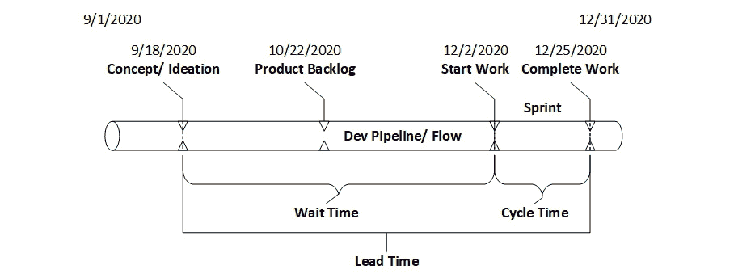
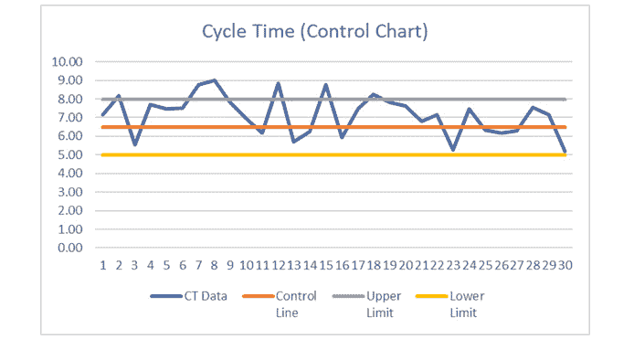
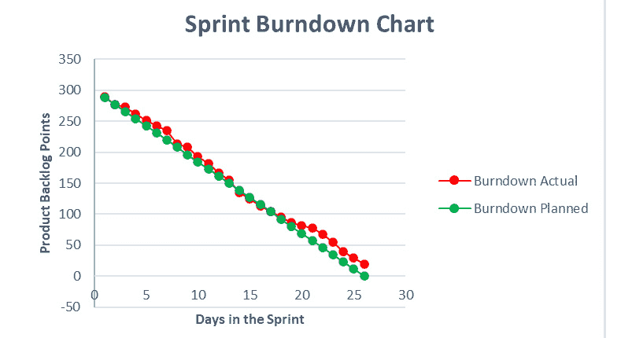
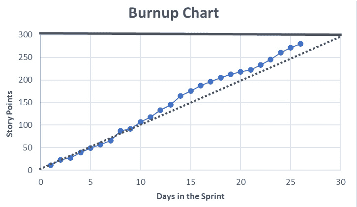
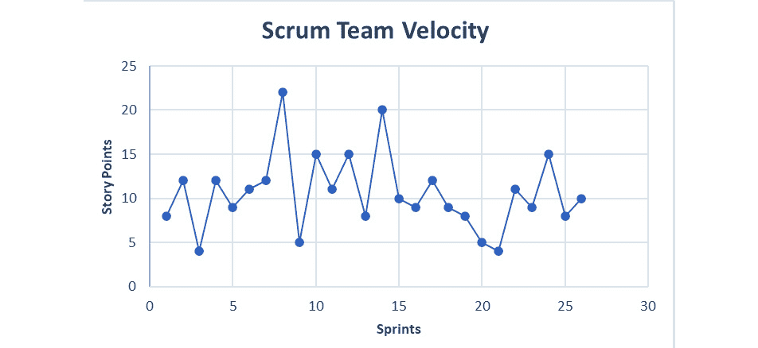
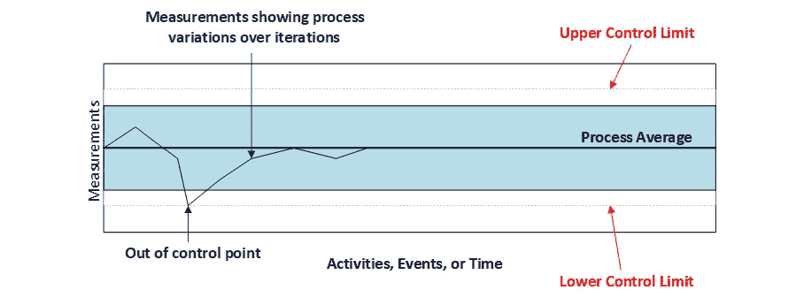
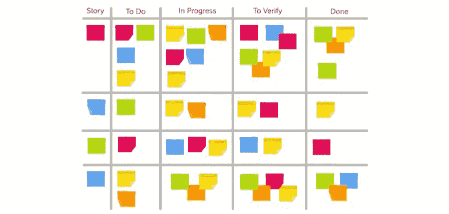
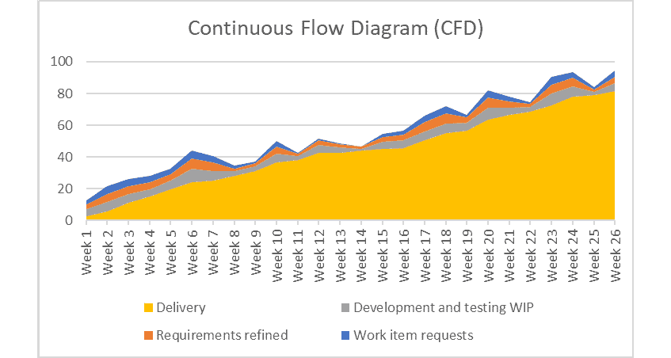
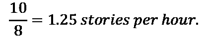
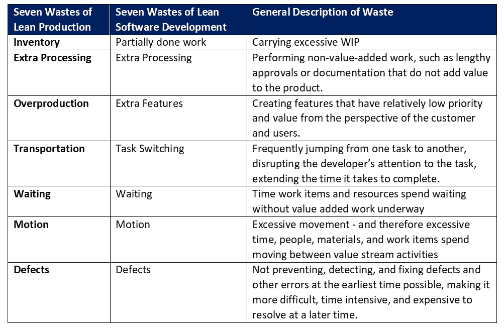

# *第二章*：构建精益敏捷基础

信息技术行业不断演变，以更快速、更高效、更高质量地交付以客户为中心的价值。一些改进理念，如敏捷和 DevOps，直接来源于软件行业。然而，精益、系统思维和价值流管理的起源则在软件行业之外。尽管如此，这些实践现在已成为软件和数字产品及服务交付行业的主流。

尽管本书是关于应用 VSM 和 DevOps 实践来加速数字价值交付，但每个组织必须建立一套基础实践。具体来说，IT 组织需要在敏捷、精益和系统思维实践的坚实、价值为中心的基础上，构建其 VSM 和 DevOps 能力。

本章将帮助精益敏捷实践者理解如何建立这一整合的基础。我们将在下一章探讨系统思维。现在，在本章中，你将了解敏捷和精益实践如何协同工作，以交付以客户为中心的价值。

本章将涵盖以下主要内容：

+   灌输敏捷的价值观和原则

+   获得利益相关者的支持

+   实施有用的度量指标

+   通过精益思维改善 IT 流动

+   消除软件开发中的浪费

+   创建精益敏捷基础

+   加速 IT 价值流中的流动

# 灌输敏捷的价值观和原则

在上一章中，你了解到《敏捷软件开发宣言》（也叫敏捷宣言，[`agilemanifesto.org/`](https://agilemanifesto.org/)）列出了四个价值观和十二条原则，用于提升软件交付。如果你是敏捷的新手，可能不知道敏捷并不是某种特定的或单一的方法论。敏捷宣言中没有关于如何灌输敏捷价值观和原则的指导，它只描述了期望的成果或目标。

另一种理解敏捷宣言的价值观和原则的方式是“成为敏捷”而不是“做敏捷”。换句话说，虽然我们可以做很多事情来提高软件开发的敏捷性，但敏捷宣言并未提供如何实现敏捷的具体指导。

许多方法论声称自己是敏捷的。对于那些需要入门的人，我在我之前的书籍《在现代企业中扩展 Scrum》中介绍了敏捷的历史以及行业领先的敏捷和精益敏捷方法论。在撰写本书时，领先的小团队敏捷方法论是 Scrum——包括几种混合版本，能够使多个团队协同合作。

相比之下，领先的多团队精益敏捷方法论是**Scaled Agile Inc.**的**Scaled-Agile Framework®**（**SAFe®**）。另一种正在获得关注的精益敏捷方法论是由**项目管理协会**（**PMI**）提供的**纪律化敏捷**。在本章稍后“*创建精益敏捷基础*”部分中，您将学习精益敏捷实践如何扩展迭代和增量开发的基本敏捷实践。

目前，理解 VSM 和 DevOps 建立在敏捷（Agile）和精益（Lean）理念之上是至关重要的。因此，组织必须先建立敏捷和精益实践的基础，并让文化围绕这些实践演化，然后才能安装 VSM 和 DevOps 所采用的流程集成和自动化能力。

集成和自动化有缺陷或实施不当的流程只会加速不良流程的负面结果。不良结果包括构建客户不需要的功能和特性的产品，交付质量较差的产品，以及交付存在 bug 和缺陷的产品。没有对基础开发和运营流程进行重新设计，集成和自动化无法解决这些问题。

敏捷和精益敏捷方法论帮助组织通过它们所实施的实践来灌输敏捷的价值观和原则。然而，规模和支持的程度驱动了大多数关于哪种敏捷方法最合适并且支持软件开发团队或项目需求的决策。我们将在接下来的部分简要回顾领先的 Scrum 和精益敏捷方法论。

## 领先的 Scrum 和精益敏捷方法论

没有什么规定组织不能自己弄清楚如何在其运营中变得更加敏捷和精益。另一方面，既然有经过验证的方法论可以帮助指导其努力，为什么要从头开始呢？问题是，哪些方法论和实践最适合该组织？

我之前的书籍，*在现代企业中推广 Scrum*（Rupp，2020），由 Packt 出版社出版，详细描述了许多历史上以及目前领先的精益敏捷实践。与其重复那些信息，本节将简要介绍当前行业领先的 Scrum 和精益敏捷方法论和框架：

+   **Scrum**：Scrum 于 1990 年代由 Ken Schwaber 和 Jeff Sutherland 开发，并在 2010 年将其**Scrum 框架**正式化为**Scrum 指南**。Scrum 实施了一个基于经验主义的框架——经验主义是一种理论，认为所有知识都来自通过感官观察获得的经验（即视力、听力、触觉、味觉、嗅觉、空间感等）。*经验主义者*重视通过经验、观察和实验假设测试（即*科学方法*）得出的基于证据的知识。

    Schwaber 和 Sutherland 继续更新 Scrum 指南，最近的版本在 2020 年 11 月发布。他们的最新版本宣称 Scrum 的基础也包括精益概念。然而，他们并没有在之前的版本中提出这一主张，而他们在最新的 Scrum 指南中的精益讨论仅限于*精益思维减少浪费，聚焦于核心要素*的声明。

    总的来说，Scrum 框架实现了迭代式**冲刺**，作为一个容器来实施其他实践和活动，所有这些都以敏捷的方式执行，在短而频繁的周期内交付增量价值。容器的概念至关重要，因为 IT 行业使用着无数的技术、方法、工具和技巧。让单一的敏捷方法强行采用某个特定的开发策略是没有意义的。相反，Scrum 框架引导团队以敏捷的方式使用他们偏好的方法和工具，在每个冲刺中交付增量价值。

+   **Scrum-of-Scrums**：最初的 Scrum 扩展，通过团队间合作的结构实现 Scrum 实践，应用于多个团队之间的协作。Scrum-of-Scrums 模型被广泛应用于协调小型团队的工作，超越了 IT 职能，所有团队共同协作以交付相同的产品。

+   **大规模 Scrum**：Jeff Sutherland 对 Scrum 指南的扩展将基础的 Scrum-of-Scrums 概念扩展到整个企业和各个业务领域，并通过**最小可行的官僚体制**（**MVB**）以及无规模限制的架构进行扩展。

+   **Nexus 框架**：Ken Schwaber（Scrum.org）对 Scrum 指南的扩展，通过实施**网络集成团队**（**NITs**）来管理跨团队的依赖关系以及集成和同步问题，应用于多团队的软件产品开发工作。

+   **大规模 Scrum**（**LeSS**）：这一规模化 Scrum 方法由 Craig Larman 和 Bas Vodde 提出，包含两种 Scrum 扩展框架，帮助协调多个团队的活动。LeSS 框架围绕*功能*协调多个 Scrum 团队，而 LeSS Huge 框架则围绕*需求领域*协调活动。这两个框架支持多团队协作，开发大型且复杂的软件产品。

+   **有纪律的敏捷**（**DA**）：这是一种精益敏捷的开发方法，提供了六种产品开发生命周期、众多的流程指南以及成百上千种潜在的有用技术。DA 方法允许团队根据他们独特的业务和组织需求与情况选择自己偏好的*工作方式*。最初由 Scott Ambler 和 Mark Lines 开发，**项目管理协会**（**PMI**）在 2019 年收购了他们的公司，同时收购了**企业转型流**（**FLEX**）以及**Net Objectives**的相关内容。FLEX 与 DA 结合，运用精益和系统思维，提升组织的商业敏捷性。

+   **Scaled Agile Framework®**（**SAFe®**）：SAFe 有四种配置，是一种适用于大规模组织的精益敏捷方法，专注于大型产品开发。SAFe 帮助大型组织利用规模经济提供更高的效率，同时融入精益敏捷实践，促进企业规模的业务敏捷性。SAFe 的四种配置如下：

    +   **Essential SAFe®**：这是一个基础的多团队精益敏捷扩展模型，围绕一个名为敏捷发布团队（Agile Release Teams，简称 ARTs）的团队协作概念构建。每个 ART 的规模通常在 50 到 125 人之间，受邓巴数的限制，源于人类在稳定关系中能积极维持的数量的认知限制。

    ART 内的团队协作以支持单一的大型产品或个别价值流。ART 内的小团队根据具体情况实践**极限编程**（**XP**）、Scrum 和 DevOps，并共同协作，在固定时间周期的**项目增量**（**PIs**）中交付集成的增量价值，这些周期通常为 8 到 12 周。XP、Scrum 和 DevOps 在较短的时间间隔内运作，并与每个 PI 同步。

    +   **Large Solution SAFe®**：这一配置扩展了*Essential SAFe*的精益敏捷基础，以协调和整合支持非常大产品或大量产品的多个 ARTs 的工作。*Large Solution SAFe*同步任何数量的 ARTs 以及数百到数千的团队成员。

    +   **Portfolio SAFe®**：通过围绕价值流组织精益敏捷企业，将投资组合执行与企业战略对齐。*SAFe 投资组合*是由开发和运营导向的价值流组成，这些价值流在一个业务单元内运作。此 SAFe 配置还加入了**精益投资组合管理**（**LPM**）概念，以便监控和评估跨时间的投资组合投资需求。

    +   **Full SAFe®**：将*Essential*、*Large Solution*和*Portfolio SAFe*作为一套集成协调的流程和活动进行连接。

之前讨论过的任何 Scrum 和混合 Scrum 方法论和框架都可以帮助你的组织提高单个或多个团队的敏捷性，协作开发单一产品或产品线。DA 和 SAFe 也包含了实施精益软件开发概念和投资组合管理流程的强大方法，以支持战略规划、资金优先级和跨多个产品线的资源分配。

无论你选择采用哪种 Scrum 或精益敏捷方法，其成功主要取决于相对于实施的规模和范围的赞助支持水平。领导力和高层支持是下一节的主题。

## 引领方向

实施敏捷和精益实践对整个组织有广泛的影响，这会影响任何实施的潜在成功。此外，实施的规模越大，影响越广，拥有适当的领导力和赞助层级对其成功至关重要。理想情况下，组织的首席执行官应引领这一进程。

小型软件开发团队有时可以在小团队层面实施 XP 和 Scrum 实践，且只需要最小的赞助。然而，这种实施往往在没有适当的产品负责人领导的情况下，难以获得客户需求和优先事项的信息。

此外，开发团队可能无法摆脱其组织传统的资金和资源分配方式所带来的项目导向思维。敏捷实践则专注于产品导向。高管、客户和其他利益相关者可能会抵制为支持产品导向模型的迭代开发和增量发布策略所需的组织变革。坦率地说，敏捷和精益专注于产品和客户，这需要他们付出更多努力，而他们可能看不到其中的价值。

价值是存在的，但受影响的内部组织和客户需要接受教育，并看到结果才能认同。所以，花点时间来讨论如何获得他们的支持。

# 获取利益相关者的支持

敏捷和精益实践要求跨业务职能之间更加频繁和紧密的互动，参与者必须对新产品或产品增强的成功有利害关系。在传统的软件开发模型中，管理层和客户的互动仅限于最初的需求收集活动，然后是在定期的里程碑审查、阶段门和后期的用户验收测试中进行最小化互动。精益敏捷方法论要求更多。

敏捷的好处直接来自于团队和利益相关者之间频繁且持续的互动，所有关键数据必须具有完整、准确和最新的可见性。但早期的采用者如何鼓励组织内部和客户中的其他人考虑这种改变呢？

早期采用者可能在教育其高管关于敏捷和精益敏捷实践的好处方面取得了一些成功。然而，根据个人观察和经验，最不成功的做法是去争取高管的注意并让他们发布立即改变的命令。没有适当的领导、指导和资源支持，命令往往会失败。

相反，组织可以遵循以下实际步骤：

+   **内部宣传**：创建关于提议的敏捷或精益敏捷实践的教育材料，以便分发和审阅。

+   **执行赞助人**：找到一位具有权威、资金支持和前瞻性视野的关键执行赞助人，以便看到交付加速价值的好处。

+   **内部试点**：确定一个具有高能见度且具有重要潜力的产品，作为内部试点和案例研究。

+   **试点团队**：组建一支由志同道合的早期采用者组成的小团队，他们看到了敏捷和精益敏捷实践的价值，并希望站在变革的前沿。此外，还需要对试点团队和其他参与方进行培训。

+   **基础设施**：建设支持试点项目所需的基础设施。理想情况下，敏捷团队应在一个地方操作，配备专用的会议室、个人工作区、笔记本电脑和服务器、软件开发和测试工具以及网络访问。

+   **规划试点实验**：规划活动和时间表，以引导初始试点通过一系列迭代，每个迭代都交付增量价值。

+   **进行试点实验**：以敏捷方式进行待办事项的优化、计划、开发和测试周期，每个周期都交付增量价值。同样重要的是，确保高层领导、客户和最终用户保持承诺并积极参与每次迭代回顾。他们的指导和意见对团队交付增量且以客户为中心的价值至关重要。

+   **检查和调整**：在最初的试点项目中，团队和其他相关方通过**回顾会议**和**产品演示**评估他们的表现，改进活动以提高效率，执行计划中的改进，进行监控，并根据需要继续调整。这个检查和调整过程是永无止境的。

+   **新试点**：在成功完成第一次试点后，寻找两个到三个新的试点项目，进一步证明并扩展组织的新开发方法。大多数人都希望参与成功的项目，每一次新的试点成功都会鼓励其他产品团队评估并采用这种方法进行开发工作。

+   **检查和调整**：在后续的试点项目中，新团队和相关方通过回顾会议和产品演示评估他们的表现，改进活动以提高效率，执行计划中的改进，进行监控，并根据需要继续调整。检查和调整过程从未停止。

+   **路线图**：随着初始试点证明了新工作方式的有效性，组织的高层领导必须制定详细的路线图，指导全企业范围的部署。从实际角度来看，没有一个初始且更新的计划，就无法准确地衡量、监控和指导未来的部署。

    在新模型下，可能需要重新定义产品和产品线，以使其与新的精益价值流模型对齐。这种重新调整不仅仅影响软件产品。业务需要从增值的角度评估所有内外部客户关系，以定义其运营和面向开发的价值流。

    需要组建产品团队，包括招聘和指导产品负责人和 Scrum 大师。需要开发和部署培训、辅导和指导资源，帮助员工迅速掌握新的精益敏捷实践。建立一个或多个**卓越中心**（**CoE**）来提供辅导和指导资源，并引导价值流转型可能是有益的。

+   **发布**：执行路线图中概述的部署计划。确保已定义适当的度量标准，并监控进展情况。

+   **检查和适应**：在推进过程中，新团队和相关利益相关者通过回顾和产品演示评估他们的表现，改进活动以促进提升，执行计划中的改进，进行监控，并在必要时继续调整。这里，检查和适应的过程永无止境。

    如你所见，检查和适应活动贯穿整个敏捷和精益敏捷转型过程，以及所有产品生命周期。此外，提供可视化是检查和适应过程的关键。度量标准和其他信息形式帮助组织可视化它们与计划和过去表现的对比。

在前一章中，我们学习了评估团队表现的四个最关键的度量标准，如下所示：

+   **部署频率**：衡量团队代码部署到测试和生产环境的频率

+   **交付周期**：衡量从开发人员在共享代码库中提交代码到在生产环境中成功运行所需的时间

+   **修复或恢复的平均时间（MTTR）**：衡量当发生影响用户的服务事件或缺陷时，恢复服务所需的时间（例如，计划外的停机或服务受损）

+   **变更失败率**：衡量生产环境中变更导致服务降级或失败的百分比（例如，导致服务中断），进而需要修复（例如，热修复或回滚）

然而，还有其他有用的度量标准和信息，每个团队可以选择维护并公开。例如，**Intellectsoft**确定了五个敏捷度量类别和 15 个有用的度量标准，这些标准提供了一个良好的起点（*15+ Useful Agile Metrics in Scrum & Kanban: Measure Quality, Productivity & Performance. 2018*，你可以参考[`www.intellectsoft.net/blog/agile-metrics`](https://www.intellectsoft.net/blog/agile-metrics)）。VSM 供应商**Plutora**也有一篇类似的文章，标题为*Agile Metrics: The 15 That Actually Matter for Success*（[`www.plutora.com/blog/agile-metrics`](https://www.plutora.com/blog/agile-metrics)）。我们将在下一部分快速回顾这两篇文章中提出的度量标准。

# 实施有用的度量标准

并非每个敏捷或精益敏捷团队都需要相同的度量指标。高层管理人员和客户会影响选择，并可能要求提供本小节未列出的信息。此外，产品负责人可能需要额外的信息，以了解产品的架构、设计和技术深度问题如何影响已识别和优先排序的产品积压项的交付。

以下列出了产品团队及其相关方可能认为有用的标准度量指标。这些度量指标广泛支持敏捷、精益和看板性能衡量标准及软件质量度量的主要质量、生产力和项目目标。

## 敏捷质量度量指标

本小节中描述的度量指标支持基于敏捷开发实践的通用质量改进目标：

+   **产品积压**：这是一个按优先级排列的新特性、功能、增强、错误修复、基础设施更改或其他工作项的列表。该度量指标关注的是识别出的工作项在基于价值和交付成本的基础上被精炼和优先排序的程度。

+   **逃逸缺陷**：这是衡量已发布到生产环境中并且之前通过了团队的“完成定义”的缺陷数量。由于完全防止缺陷是一个理想目标，因此较高的逃逸缺陷数量表明在定义验收标准或在测试能力和程序方面存在问题。

+   **失败的部署**：这是衡量软件部署到生产环境中失败并需要回滚的频率。理想情况下，开发团队的工程和测试环境以及他们的测试工具和程序，应该在部署到生产环境之前捕获并解决可能导致系统失败的问题。

    除了测试以发现缺陷和不符合验收标准的情况外，测试环境必须准确地模拟生产环境中对相同应用和配置组合的需求负载。测试环境可能会执行许多性能测试，例如负载测试、耐久性测试、容量测试、可扩展性测试、突发性测试和压力测试。在 DevOps 中，理想状态是自动化这些测试以及所有其他测试。

+   **发布净推荐值** (**NPS**)：这是一种最初定义用来衡量客户体验、预测客户忠诚度和业务增长的指标。发布导向的 NPS 通过定向问题来衡量客户对每次新发布或重大发布的满意度，评分范围是 1 到 10。在 NPS 模型中，**贬低者**是指那些在评分中给出 6 分或以下的客户；**中立者**将发布评分为 7 或 8 分；**推广者**则将发布评分为 9 到 10 分。NPS 的计算方法是用推广者的百分比减去贬低者的百分比：

    

    *贬低者* 是一个问题，因为他们更可能选择我们的竞争对手的产品，并且批评我们的产品。*中立者* 通常对新版本既不支持也不反对。*支持者* 通常会更热衷于推广一家公司、产品或新版本。

    理论上，任何高于 0 的排名意味着发布有更多热情的支持者，而不是不满的贬低者。然而，组织应努力做到比 0 更好。

## 敏捷生产力度量

本小节描述的度量标准支持敏捷开发实践中生产力改进的目标：

+   **交付时间**：如前所述，这一度量衡量的是从代码提交到其发布到生产环境中的时间。它是评估软件开发团队有效性的四个度量之一。然而，在敏捷背景下，交付时间是衡量从用户故事或工作项进入产品待办事项到冲刺结束或功能发布到生产的时间。交付时间包括工作项请求在产品待办事项中等待的时间，如下图所示：

图 2.1 – 交付时间/周期时间图

+   **周期时间（控制图）**：这是交付时间的一个子组件，衡量在价值流中完成一项活动或一组活动所需的时间。换句话说，周期时间是衡量作为在制品的时间，而不包括所有之前的等待时间。交付时间越接近周期时间，流程就越高效。

    以下图表展示了一个周期时间控制图的示例。在我们的示例中，VSM 团队收集有关其管道中特定活动的周期时间数据。在我们的示例中，软件开发团队可能会使用 VSM 工具来捕捉新增代码增量进行端到端测试所需的时间度量。无论如何，周期时间控制图包括数据点、平均值和已设定的控制阈值（限值）。

    这种类型的测试自动化应用程序的工作流，从头到尾，通过每种可能的操作排列来复制常见的用户场景，以发现应用程序在与硬件、网络、外部依赖、数据库和其他应用程序接口时的故障。团队认为，进行此测试的可接受周期时间是 5 到 8 小时之间，并且通常在夜间进行这些测试，以避免软件开发的停机时间：

图 2.2 – 周期时间（控制图）

从前述的控制图示例中，我们可以看到，过去 30 天的表现未能保持在 5 到 8 小时（6.5 小时平均）可接受的范围内。更糟糕的是，测试在六次情况下超出了分配的 8 小时。通过这些信息，团队可以获得所需的数据，探索是什么事件导致了冗长的端到端测试。团队可以将这些信息与这些日期的测试结果进行匹配，查看他们可以采取哪些措施，防止未来出现类似问题。

注意

在基于敏捷和精益/Kanban 的系统中，周期时间是衡量工作项在**进行中的工作**（**WIP**）阶段所花费的时间，这个阶段从故事已经精炼并进入*进行中*阶段开始。在这个上下文中，周期时间不包括工作项在构思、产品待办事项精炼以及后续在产品待办事项队列中的等待时间。周期时间从工作项被接受为 Sprint 待办事项中的一项工作项，或者从 Lean 或 Kanban 的价值流中拉取进入生产阶段时开始计算。

尽管如此，在敏捷、精益和 Kanban 的系统中，周期时间仍可能包括等待时间。其区别在于，周期时间始终包括敏捷 Sprint 中*接触*和*等待时间*，但我们希望在面向精益的软件价值流中，尽可能将所有等待时间分开并加以消除。

+   **等待时间**：产品或材料在*延迟*状态下处于不活动状态，直到工作开始所花费的时间。在精益和 Kanban 系统中，我们力求消除所有等待时间。

+   **Sprint 燃尽图**：衡量和可视化团队的预测速度作为完成率，通常以估算的故事点数为单位，表示从 Sprint 待办事项跨越一个或多个 Sprint 的工作进度。Sprint 燃尽图的主要目的是展示团队对 Sprint 目标的进展（见*图 2.2*）。

    团队最初预测每个工作项所需的工作量，以*故事点*的形式表示。Sprint 燃尽图追踪与 Sprint 待办事项中的实际故事点数完成的工作量相对照的进展情况。图表通常有两条线：一条显示计划的速度，另一条显示 Sprint 的实际速度。

+   **史诗和发布燃尽/燃起图**：与 Sprint 燃尽图相同的概念用于追踪跨定义的史诗和产品发布的工作进展。史诗是一个庞大的、尚未精炼成更小故事的、计划中的相互关联的工作范围：

图 2.3 – 一个月的 Sprint 燃尽图

使用此类度量标准的主要问题在于，不要将图表用于寻找团队进展的错误。周期越长，需求越不明确，越难以准确估算工作量。史诗级和产品发布完成度图仅显示与最初计划的进度相比的完成情况，并不能帮助理解原因。

+   **完成度图**：请注意，我们可以使用与 Sprint 完成度图相同的数据来可视化整个 Sprint 完成了多少工作以及剩余多少工作，如下所示：

图 2.4 – Sprint 完成度图

请注意，在前面的图中，较小的虚线表示最初计划的已完成工作的预测。在我们的示例中，团队按计划提前完成了最初估算的 300 个工作点。

+   **速度**：这是一个度量团队在一段时间内完成的估算工作量的标准，通常在每个 Sprint 中进行测量：

图 2.5 – Scrum 团队速度图

目标是使用速度图来判断未来的表现。然而，数字中的差异越大，团队或团队在估算产品和 Sprint 待办事项中的工作范围时就越困难，规划交付也将变得更加困难。

在大型组织中的 DevOps 中，速度衡量的是在天数甚至小时内完成的故事数量。

+   **控制图**：也称为 Shewhart 图（以沃尔特·A·谢沃特命名），这是一种统计过程控制工具，用于确定一个过程是否处于受控状态。在敏捷和精益开发实践中，团队使用控制图来跟踪任务从 *进行中* 到 *完成* 的持续时间：

图 2.6 – 过程控制图

在理想的情况下，所有活动都会非常可预测，并且永远不会偏离理想的平均值。然而，实际情况往往并非如此，我们使用控制图来查看我们的流程是否朝着错误的方向发展。控制图具有上限和下限边界，定义了最优持续时间以及上限和下限控制限，以指示超出范围的测量值。当团队看到他们的度量指标趋向于上限或下限控制边界时，他们知道自己需要解决问题。

控制图的典型用例是显示在某个活动或过程中的缺陷发生率。然而，当用于衡量活动持续时间时，控制图有助于显示团队的速度及其速度趋势。

## 敏捷项目度量标准

本小节描述的度量标准支持敏捷开发实践中工作流的管理：

+   **看板板和卡片**：看板是一种“拉动”信号系统，最初在日本为支持精益生产和**即时生产**（**JIT**）概念而开发。看板由“Kan”（即卡片）和“Ban”（即信号）组成，合起来的意思是*广告牌*或*标志牌*。在看板系统中，生产过程不会开始，直到接收到信号卡，表明所需的零件或工作数量和类型。整个价值流过程仅在有客户订单时按需启动。

+   **可视化工作流**：团队可以使用带有列的白板来表示团队定义的工作阶段。以 IT 为例，这些阶段可能包括*待办事项*、*精炼*、*开发和测试*、*验收*和*交付*。

    以下图像展示了一个看板板示例，显示了跨越故事、待办事项、进行中、待验证和完成的工作进度活动：

图 2.7 – 看板板与看板卡片

在前面的图像中，标签映射到由软件开发团队管理的敏捷管道看板活动。故事是管理在产品待办事项中的用户故事。待办事项是最高优先级的用户故事。进行中包括正在开发中的用户故事。待验证包括已完成但需要团队成员和产品负责人验证的用户故事。最后，完成表示可以发布到生产环境的用户故事。

+   **限制在制品（WIP）**：理想情况下，除了初始的产品待办事项外，工作或材料不应有排队情况。下游过程仅在它们有能力执行工作时才会拉动工作。如果没有这个简单规则，工作和材料会在管道的较慢过程处积累，我们知道这会因为过多的存储需求和持有成本而导致浪费。此外，过多的在制品会隐藏排队产品中的缺陷和缺点。这些缺陷变得越来越难以发现，修复起来也更为昂贵。

+   **管理流动**：使用看板卡片作为信号装置，表示来自内部和外部客户的新请求。这些卡片会进入看板板上的队列。当下游的容量准备好接受来自上游的工作时，承担工作的个人将他们选中的卡片移到看板上的下一个列，以表明他们已接受这项工作。换句话说，工作仅在下游有容量时才会被拉入下游过程；工作从不会被推送到下游过程。

+   **明确政策**：组织必须提供简单、清晰、可见的政策，描述期望的工作实践、批准的技术、采购流程和人力资源管理。这些政策必须根据新的学习不断发展，采用更好的方法。

+   **反馈**：看板中的反馈通过协作会议实现。传统的看板实践包括七种类型的会议：

    a. **战略评审**：这些是企业层面对业务使命、目标和受资源、时间、竞争和技术约束的目标的评估。

    b. **运营评审**：帮助团队评估他们的看板实践、价值流活动和资源，以交付价值。

    c. **风险评审**：识别风险并制定缓解策略和应急计划。

    d. **服务交付评审**：评估支持产品交付所需的服务（也称为操作价值流）。

    e. **补充会议**：这是一种基于看板的待办事项管理活动，用于识别必须从待办事项中拉取的任务。通过将任务分配给**服务类别**（**CoS**）并为每个 CoS 拉取的任务数量设置限制来完成这一任务。CoS 任务的示例包括紧急请求、固定交付日期、缺陷、标准任务和维护任务。

    f. **看板站立会议**：这与每日 Scrum 会议的概念相似，团队成员简短地聚集在一起讨论工作进展、剩余工作以及阻碍工作的因素。看板会议的主要区别在于将工作管理为连续流动，通过消除瓶颈最小化交付时间，并减少 WIP（在制品）。团队成员会在他们的看板面前开会。

    g. **交付规划会议**：当组织在固定日期正式发布产品时，必须举行此会议。交付规划会议帮助团队解决实施问题、支持和维护交接、数据迁移、培训开发和交付要求以及其他**服务水平协议**（**SLA**）问题。

+   **持续改进（Kaizen）**：改进的想法来自观察、协作、回顾和产品演示。利用基于团队的回顾会议回顾并分析之前的问题，进行立即的实验以解决这些问题，并且不断进行这些迭代的持续改进工作。此外，利用客户演示来帮助从他们的角度指导开发优先级。

+   **累计流图（CFD）**：这是一种通常与看板方法相关的分析工具。从概念上与敏捷的 Burnup 图类似，CFD 提供了关于每个价值流阶段累积工作量的可视性（例如，软件开发的价值流）。

    在理想的世界里，工作项在一个同步协调的开发流水线中按照一系列活动流动，活动持续时间略有差异，没有返工，也没有由于缺陷和错误导致的损失。但我们并不生活在那个世界，发生的事情会在我们开发流水线的各个环节上导致工作积压。

    以下图表展示了一个 CFD，跟踪了软件交付管道中以下四个阶段的工作：

    a. 工作项请求（蓝色）

    b. 需求精炼（橙色）

    c. 开发与测试中的工作进展（灰色）

    d. 交付（黄色）：

图 2.8 – 持续流图（CFD）

CFD 允许团队可视化他们价值流过程中的潜在障碍，并且是观察价值流活动影响的最有效工具。与相对平稳、起伏轻微的图表不同，突然上升或下降的图形表明存在障碍。

+   **代码覆盖率**：这是衡量和可视化团队产品代码被单元测试或测试套件覆盖的程度。典型的代码覆盖率度量标准包括方法或函数覆盖率、语句覆盖率、分支覆盖率、条件覆盖率、**多条件/决策覆盖率**（**MC/DC**）、参数覆盖率和环路复杂度。

    测试中的代码覆盖率越广泛，软件的潜在可靠性和质量就越高。任何代码覆盖率的空白都可能导致软件故障和 BUG。即使团队的代码覆盖率很高，仍然有可能漏掉一些问题。另一方面，如果代码覆盖率良好，这种情况应该是少数和罕见的。

## 敏捷团队的健康度量/敏捷绩效度量

本小节中描述的度量标准支持精益和敏捷开发实践中的员工满意度目标：

+   **员工幸福感**：这是一个相对主观的衡量标准，但对于保持员工的长期留任至关重要。幸福感通过简单的员工调查来衡量，调查询问员工他们对公司有多满意，最喜欢什么，不喜欢什么，以及哪些因素能提高他们的幸福感。当然，管理层需要积极行动，基于这些信息做出积极的改变，以帮助吸引和留住优秀员工。

+   **团队士气**：团队层面的士气测量通常能提供更好的工作满意度指标。同样，调查是最有效的，但问题不应为开放式问题。相反，调查要求团队成员在 1 到 7 的评分范围内评价他们对问题的认同感。问题会询问团队成员是否觉得自己适合团队，是否为自己的工作感到自豪，是否对工作充满热情，以及是否在工作中找到意义和目标。

## 核心精益和看板度量

本小节中描述的度量标准支持精益软件开发实践中的生产力提升目标：

+   **故事交付时间**：这个交付时间指标再次出现，不过这次是在精益和看板系统的背景下。由于精益和看板实施了价值流动，故事的交付时间从它进入产品待办事项列表开始，直到完成为止。因此，交付时间总是包括产品和材料在队列中等待的时间。

+   **故事周期时间**：作为交付时间的一部分，周期时间衡量完成价值流内一组活动所需的时间。在 DevOps 的背景下，这是衡量工作通过团队开发流水线所需时间的管道流量度量。具体而言，交付时间涵盖从工作项创建到完成的整个过程，而周期时间衡量工作项作为在制品所花费的持续时间。

+   **功能交付时间**：这是故事交付时间的一个变种，重点是实现特定功能。用户故事代表用户或客户期望的功能，这些功能可能在范围上非常细致。例如，一位在线汽车买家的用户故事可能是：“*作为一名汽车买家，我希望查看经销商提供的汽车颜色，以便找到符合我颜色偏好的汽车。*”从这个例子中可以看出，用户故事是从用户的角度陈述的需求。

    相比之下，功能实现了一个业务功能的切片，可能包含多个用户故事请求。在这种情况下，经销商的在线功能可能包括所有客户在线汽车查找偏好，包括品牌、型号、年份、价格、颜色和其他差异化选项。换句话说，功能是从业务角度实施的一个功能块。

    区分用户故事和产品功能是至关重要的，因为客户购买的是功能，而如果没有明确说明，客户可能不知道某个功能提供的具体能力和好处。回想我们之前讨论过的通过价值主张清晰陈述产品的能力和好处的必要性。

+   **功能周期时间**：与故事周期时间类似，这是开发人员积极设计、开发和测试功能所涉及的总时间。换句话说，周期时间衡量的是进行中的工作时间。

+   **故事等待时间**：这是衡量产品需求或进行中的工作处于闲置状态的非增值时间的指标。目标是尽可能减少等待时间。

+   **故事吞吐量**：这一速度度量衡量在一段时间内通过开发流水线（或其他价值流）的故事数量。较小的故事有助于以两种方式提高吞吐量。首先，较小的故事实现起来更快，因为需要完成的工作量较少。其次，较小的故事往往不那么复杂，因此更容易并且更快速地调试已发现的错误。

    在基于精益（Lean）或看板（Kanban）的环境中，保持故事的大小相对一致是至关重要的。在精益系统中，目标是使活动持续时间相匹配，以防止较慢活动中的排队。当然，使用与可用容量挂钩的拉式订单输入系统也有助于最小化排队。

    同时，记住任何价值流的理想周期率是可用生产时间除以同一时段内的客户请求数量（也称为**TAKT 时间**）。因此，如果你的软件开发团队每天平均处理 10 个故事，而每个工作日为 8 小时，那么**TAKT 时间**是 

    换句话说，在你的 DevOps 或看板开发流水线中的活动需要与订单输入的速度保持一致。如果你比**TAKT**时间慢，你将无法完成所有客户的订单；如果你操作得更快，你将生产出不被需求的产品。

+   **创作到完成比率**：这是衡量进入价值流的工作项数量与在一段时间内完成的工作项数量之间差异的指标。当进入价值流的工作项数量超过完成的工作项数量时，就会形成队列，假设工作项已被输入到产品积压队列中。

    如果订单输入层级稳定，开发团队可以通过简化价值流活动或增加产能来解决问题。然而，也有可能一些故事的优先级不足，或者在成本上没有充分理由被纳入产品积压队列。无论如何，过高的创作到完成比率表示当工作是客户优先且已证明其成本效益时，存在机会损失。

## 在敏捷中衡量软件质量

本小节中描述的指标支持基于敏捷的开发实践中的软件质量改进目标。

+   **静态代码分析**：这是一种用于调试软件的方法。它通过检查源代码与预定义的规则和标准的符合情况来实现，而无需执行程序。开发人员在最早的代码开发阶段进行静态代码分析，在单元测试之前，或者在与源代码仓库的主干代码集成之前。其目标是在最早的时间找到并修复编码错误。

    静态代码分析可以作为手动测试运行。但手动测试耗时、繁琐，并且容易出现人为错误。更好的方法是使用**静态代码分析工具**（**SAST**）来扫描和检查代码是否符合规则，如语法违规、未定义的值、死代码或未使用的代码、编程错误、安全漏洞、性能问题等。SAST 的输出是一个总结报告，展示你的代码健康状态。

    虽然有许多开源和商业的 SAST 工具，但现代编译器也会在运行代码之前进行语法或技术错误检查，捕获许多相同类型的错误。

+   **动态代码分析**：这是在编译代码并通过产品测试生命周期运行它后识别缺陷的过程，包括单元测试、集成测试、系统测试、验收测试和回归测试。动态代码分析旨在检查系统对在应用程序内动态变化的变量的响应。

    动态代码测试的主要好处是，测试能够在相同的时间框架内，对比人工可以手动实现的数千倍以上的数据输入排列组合。例如，动态代码分析可能涉及数万种或更多的数据输入配置，并针对多个组件和集成系统进行操作，在一个持续数小时的批处理运行中完成。

+   **质量智能**：数据分析工具有助于改善生产出差或不理想质量结果的软件开发过程。静态和动态分析工具侧重于识别正在开发中的代码中的问题。然而，质量智能旨在发现开发过程中那些在速度、质量和效率方面持续产生问题的领域。质量智能工具帮助团队组织并分析整个软件开发生命周期中各个活动的数据。

本节结束了我们对有用的精益敏捷度量的讨论。在下一节中，你将学习如何通过在 IT 组织中实施精益生产和运营实践来改善 IT 流。

# 通过精益思维改善 IT 流

在下一章中，你将学习如何应用系统思维来减少涉及一至六组活动的六种潜在价值流中的复杂性（见*图 3.2*，该图展示了节点、潜在连接、实际连接和网络密度）。所提供的图示展示了如何通过将价值流活动作为精简流来减少活动之间可能的连接和交互。因此，线性顺序方法是价值流中最有效的操作方式。

然而，如果我们没有减少较长活动的设置时间和周期时间，允许工作项在价值流中的较慢活动处排队，我们仍然可能把事情搞砸。如前所述，理想的目标是将每个活动和整体生产率与接收客户订单或需求的速度相匹配。我们可以通过将生产工作项的时间除以在此时间间隔内请求的项目数量来计算这一点，这也被称为**Takt 时间**。

从概念上讲，精益生产消除所有妨碍我们交付以客户为中心的价值的浪费形式。在传统的精益制造观念中，有七类不同的浪费，如下所示：

+   **等待**：处理延迟，包括产品在等待或排队中的任何时间。

+   **过度生产**：生产超过需求或客户当前需求的数量。

+   **过度加工**：过度加工或进行任何非增值活动。

+   **运输**：将产品和材料从一个地点搬运到另一个地点所浪费的时间、资源和成本。

+   **运动**：人们进行的不必要的移动、动作或活动。

+   **库存**：携带和存储任何没有进行增值活动的材料和产品。

+   **缺陷**：产品或服务中出现的任何缺陷。

之前列出的精益浪费主要在制造业中发展，但它同样适用于面向服务的公司，例如软件开发公司。软件开发实践中的浪费是下一节的主题。

# 消除软件开发中的浪费

2003 年，Mary 和 Tom Poppendieck 发布了他们的书《精益软件开发：敏捷工具包》，在书中他们讨论了如何将精益制造概念应用到软件开发中。他们的书将软件开发中的七种浪费形式映射回原始精益浪费概念，如下表所示：

图 2.9 – 将精益制造浪费映射到其软件开发等效项

这些精益生产和精益软件开发中的浪费定义分别已经存在了近 3 年和近 2 年。自那时以来，围绕精益实践的思考有了很大的发展，我在之前的书《在现代企业中扩展 Scrum》中对此进行了阐述。为了简便起见，我将在本节中概述主要概念。然而，我鼓励那些想深入了解的读者，去阅读我前一本书中专门讨论这一主题的两章：*第五章*，*通过 DevOps 管道推动业务价值*，以及*第六章*，*启动 VSM 计划（VSM 步骤 1-3）*。

当你阅读以下精益概念列表时，请理解它们同样适用于物理产品、数字产品以及混合物理-数字产品和服务的开发：

+   **价值**：客户总是定义价值。我们有多少经验或多聪明并不重要；我们提出的任何想法，充其量都是一种风险，直到通过目标客户进行充分验证。

+   **持续改进（Kaizen）**：目标是通过团队合作、改进程序以及员工和客户的协作，使工作更加高效和有效。持续改进的工具包括质量控制机制、及时交付、标准化工作、快速设置、简化流程、更高效的设备和废物消除。此外，改进还应帮助员工的工作更加充实、减少疲劳并提高安全性。

+   **视觉管理**：这涉及诸如看板卡片等控制手段，用于管理工作项的流入，以匹配价值流动。控制图是另一种图表形式，帮助我们查看在任何指标上何时偏离正常范围。

+   **内建质量**：这意味着在问题被引入时立即发现并修复它们。在精益系统的持续流动中，我们可能需要停止所有工作流，并集中所有人的努力快速解决问题。内建质量帮助我们消除因产品召回、返工以及在产品开发的后期阶段寻找和修复缺陷所带来的高成本。

+   **提升知识**：这是精益和敏捷实践中持续改进的重要组成部分。无论是通过经验、试错，还是通过向他人学习，我们都可以将这些学习应用到新的工作方式中，使其更有效、更高效。团队必须抽时间进行观察、分析和学习。

+   **推迟决策和承诺**：虽然这似乎与精益原则相悖，但由于信息不足做出错误决策会带来成本。当我们有足够的信息来降低风险时，推迟决策是更好的选择。从长远来看，组织通过打造客户真正需要和重视的产品，而不是我们认为客户想要的产品，节省了时间和金钱。

+   **通过自动化检测缺陷（自动化管理，Jidoka）**：日本精益概念中的“自动化管理”指的是*带有人工触感的自动化*。Jidoka 是一个质量控制原则，建议使用自动化技术来检测异常，停止流程，解决即时问题，然后找出原因及其影响，探索预防或减少未来发生的方式。

+   **消除错误（Poka-Yoke）**：这也被称为*防错*。这种消除浪费的方法可以防止员工或产品用户执行错误操作。目标是设计一个过程或机制，使得某个特定活动无法被错误地执行。例如，团队的**持续集成**（**CI**）实践可能会实现一个自动执行静态分析和测试驱动开发指令的构建过程。CI 自动化流程有助于确保开发人员的代码符合组织的编码实践和客户的验收要求，然后才允许他们将代码与主分支（也称为主干分支）合并。

+   **消除浪费**：评估并消除精益生产和软件开发中之前识别的七种浪费形式。

+   **停止多任务处理/任务切换**：因为这类活动会分散我们的注意力，破坏我们当前正在做的事情，使得大脑在任务之间迅速切换。实际上，多任务处理是一种任务切换。换句话说，当你在做多任务时，并不是在同时思考两个主题，而是在它们之间来回切换注意力。

    多任务处理仅适用于有限的一些活动，这些活动将我们的认知活动分布在大脑的左右前额叶皮层，例如在走路时与朋友聊天。此外，多任务处理只适用于在执行相对独立的运动技能与认知任务的同时进行——即便如此，你做这两项任务的速度也会变慢。

    当我们在多个认知任务之间工作时，我们的思维涉及一个顺序切换的过程，这在任务切换时会产生瓶颈。在切换主题时，我们的大脑需要时间和精力来重新调整思维并重新开始，而在这个过程中我们会丢失一些信息。因此，我们会失去思路，完成思考和工作所需的时间会变得更长。

    但多任务处理和任务切换还有其他不良影响，包括犯错、增加压力、扰乱短期记忆，以及在任务切换时错过关键细节。任务切换还会对创造力产生负面影响，可能导致你多次回顾同一个主题以完成任务。

+   **实践 Gemba（即，到源头去）**：这有助于你了解当前的情况。当应用于精益生产时，管理者会走到生产车间，查看进展并与工人交谈，讨论他们的问题和担忧。在软件开发的背景下，我们有协作团队，并通过每日站会和其他活动来沟通进展、问题和想法。开发过程中会展示大型图表，并频繁更新，以简化与任何需要或希望了解进展的人之间的沟通。

+   **实施单件流**：这是精益生产和精益软件开发实践中的理想方式。这个概念延伸了我们对最有效价值流的讨论，强调了为何最有效的价值流会建立一系列线性顺序的活动以简化工作流程。生产力的另一大杀手是批量处理，尤其是在活动之间的批处理和活动持续时间不匹配时，问题会更加严重。

    直观上，大批量处理似乎成本较低，因为它们可以在一次批处理中处理数百个项目。然而，在现实中，由于漫长的等待时间、生产设备间过多的产品更换时间，以及在大批量中隐藏的错误和缺陷，节省的成本实际上是丧失的。

    理想的情况是，每个价值流活动都有一个工作项流。应避免冗长的设置或更换要求。活动周期时间应该尽可能短，并在所有价值流活动中保持一致。最后，价值流的生产吞吐量应等于订单录入的速度（即 takt 时间）。

+   **水平化工作负载（Heijunka）**：我们必须设定一个目标，防止大量订单或请求进入系统，导致等待和其他相关问题。Heijunka 涉及在固定时间内平衡生产类型和数量。

    在精益软件开发的背景下，我们可以举一个产品负责人接收需求的例子，这些需求每天都在变化，取决于提供信息的来源和产品管理活动。然而，为了说明这个例子，假设整体需求大致保持在每周约 25 个新的高优先级需求，尽管这些需求并不是每天固定的五个。

    假设我们的精益开发团队能够处理每天五项工作的负载，产品负责人保持一个足够的产品待办事项清单，以维持每天五项工作的稳定发布。新请求的数量可能会因日而异，但目标是保持新工作项的稳定流入生产。

+   **拉动生产系统**：执行规则，只在直接响应需求时生产商品，而不是提前生产产品或功能，从而造成浪费，例如未售出的库存和客户可能永远不会需要的产品和功能。精益价值流在拉动型生产系统中不会开始工作，直到有客户订单或需求为止。看板系统是一种方法，用于在整个价值流中执行拉动型生产系统的纪律。

+   **准时交付（JIT）**：这是另一种将生产速度与客户需求相匹配，并消除所有不增值活动的浪费的策略。然而，JIT 最初是解决库存管理问题的。与其提前订购和储存一批材料，JIT 仅允许与客户需求匹配的新采购和物料交付。此外，生产商安排材料的到达时间正好与制造订单产品的时间相匹配。

    JIT（准时生产）在数字化环境中有多种应用方式。首先，软件开发团队在没有客户需求的情况下不会开始新的功能或特性开发。此外，当数字产品支持其他组织价值流时，我们需要确保交付与消费价值流的需求对接。

+   **优化整体**：这是一种聚合单件流、平衡工作负荷、拉动生产系统和准时制（JIT）子系统中的概念的方式。目标是查看整个价值流，以简化和减少复杂性并消除浪费。目标是使生产过程尽可能高效和简化。与其扑灭火灾，不如只允许订单或需求按照接收速率流入系统。并且绝不允许新订单的进入速度超过生产系统可以处理的负荷，保持持续和无中断的流动，避免等待。

    我们的价值流代表了一种简化复杂生产和面向运营的系统的方法，同时确保我们始终专注于增加或改善以客户为中心的价值。在此背景下，价值流是对整个（即全部）复杂开发或运营系统的端到端优化。

+   **拒绝未完成的工作**：在精益软件开发的背景下，这指的是任何已进入生产环境但尚未满足*完成定义*的工作。然而，未完成的工作会在价值流的各个阶段造成混乱。如果开发人员或其他工作人员感到被迫在工作完成之前提交，潜在的下游影响包括额外的错误、缺陷、故障、返工、延误和不满意的客户。作为政策，组织应永远不允许下游价值流活动接受来自上游活动的未完成工作。

+   **尊重他人**：这是建立高效组织的显而易见的要求。然而，层级化和官僚化的组织往往会创造出敌对的环境，这种环境不鼓励跨团队或跨组织的沟通与协作。此外，这些流程在问题超出流程范围时，以及通过层级结构中的响应和批准延迟时，会产生压力。

    敏捷和精益实践都强调尊重与责任并重。这些概念不同于你小时候被教导的“黄金法则”——*“你希望别人如何对待你，就如何对待别人”*。

让我们快速回顾一下黄金法则在精益导向的软件开发中的应用：

+   按时工作，消除加班，保持可持续的工作节奏。

+   帮助团队成员理解他们为客户提供的价值。

+   建立以持续学习和技能为核心的薪酬和激励计划。

+   挑战团队成员而不是贬低他们。

+   对团队而非个人负责其承诺。

+   实施安全的工作环境，使团队成员在遇到问题时可以寻求帮助而不受惩罚。

+   让团队成员参与分析问题、探索因果关系，并提出解决当前问题的方法。

+   去除障碍以减少挫败感。

+   在寻求稳定的同时，也要提供多样性，以防止枯燥。

+   通过培养稳定的员工、基于可展示的知识和技能发展的晋升体系，以及精心的继任计划，来保护组织的知识库。

我们已经到达了关于精益思维部分的结束。总结来说，精益思维是围绕价值（产品、服务、信息）组织工作，并优化工作和信息流动。到目前为止，您已经学会了如何通过系统思维和因果回路图评估价值流。这有助于评估参与价值流系统的节点或元素之间的相互关系。

在 *第七章*，《*当前状态映射（VSM 第四步）*》和 *第八章*，《*识别精益指标（VSM 第五步）*》中，您将学习如何使用价值流映射评估当前的价值流活动，并评估替代的未来状态，以改善价值流中的价值。但在我们继续之前，让我们快速看一下组织是如何将精益和敏捷概念结合起来的。

# 构建精益-敏捷基础

本节内容是关于将敏捷和精益概念与实践结合起来。乍一看，敏捷和精益的实践在提升客户价值方面有相似的目标，但这两种开发哲学似乎以不同的方式来实现这个主要目标。那么，问题来了，我们如何将两者的优势结合起来，创造出更好的成果？

在本章前面，您已经了解了敏捷是一组价值观和原则，通常作为一个迭代和增量的过程来实施，从而交付以客户为中心的价值。基本的思想是，敏捷团队在拥有灵活性、能够增量地交付小块价值并频繁进行客户和用户回顾时，能够为客户创造最大的价值。这有助于确保产品始终与当前的需求和优先级保持一致。您还了解到，Scrum 是一种基于敏捷的方法论，实施的是经验主义框架。这鼓励团队尝试不同的想法，并利用他们的经验和观察来发现更好的工作方式。

相对而言，精益通过消除所有浪费形式，专注于只做客户需要的事情，从而提升以客户为中心的价值。一些精益实践者喜欢将精益中的浪费概念理解为避免在客户不愿支付的活动上浪费时间和精力。这个思维方式的挑战在于，它有些目光短浅。例如，一个组织可能会在基础设施、培训和流程改进上花费资金，这些投资虽然短期内客户可能没有直接受益，但却间接为客户提供了更多的价值。

了解到敏捷和精益方法论的主要关注点是创造客户价值，主要区别在于开发周期。敏捷实践者倾向于通过小型团队在小范围的迭代发布中逐步提供新的价值。尽管这种迭代发布可能相对较小且频繁，尤其是与传统的瀑布模型相比，但每个敏捷冲刺仍然是一个批量过程。

使敏捷实践更加精益的一个有效方法是用基于看板的拉动模型取代冲刺迭代模型。这一策略将进行中的工作限制为最少的工作项，并同时用单件工作流取代冲刺批量过程。

但是，看板是一种手动过程，我们可以做得更好。例如，我们可以通过简化、整合和自动化我们的 IT 流程，来实现精益的全部好处。这就是下一节关于加速流程的主题。

# 加速 IT 价值流

在上一节中，你了解到敏捷和精益的目标是以不同的方式改善客户价值和管理产品流程。你还了解到，将敏捷和精益实践结合的最快最简单的方法是通过使用看板和卡片，从批次冲刺模型转向持续流模型。然而，我们也可以通过集成和自动化策略来简化并加速我们的价值交付流程。**持续集成**（**CI**）、**持续交付**（**CD**）、DevOps、平台和软件工厂帮助我们实现这些目标。

首先，CI 和 CD 能力帮助 IT 开发团队简化、整合和自动化他们的**软件开发生命周期**（**SDLC**）流程。这并不是说整个 SDLC 流程应该一次性地被简化、整合和自动化。对于一个没有实施 DevOps 平台或软件工厂的小型 IT 团队或大组织中的小团队来说，快速采用可能不可行。但从精益角度来看，最终实现软件开发价值流的端到端简化、整合和自动化是理想目标。

通过 CI/CD 能力，DevOps 将精益概念作为集成的价值流应用到 IT 运营的功能中。具体来说，IT 组织可以实施价值流管理能力，以整合前端和后端流程。同样，试图一次性管理所有这些变化对于大多数组织来说并不实际。然而，理想的目标是尽可能快速地达到这种集成能力的阶段。

流式处理、集成和自动化端到端的 CI/CD 和 DevOps 流程有助于 IT 组织加速价值交付。它们还帮助提高交付产品和服务的质量。在本书的*第二部分*（*第六章*，*启动 VSM 倡议（VSM 步骤 1-3）*，至*第十章*，*改进精益敏捷价值交付循环（VSM 步骤 7 和 8）*）中，你将学习价值流管理如何帮助从概念到交付和支持的价值交付，同时将其业务价值交付目标与软件交付能力联系起来。

*第三部分*（*第十一章*，*识别 VSM 工具类型和能力*，至*第十四章*，*介绍企业精益 VSM 实践领导者*）识别了主要的 VSM 工具供应商和方法论者。VSM 方法论者分为两派：一派是实施 VSM 以支持数字化业务转型，另一派支持精益实践的一般实施。

最后，本书的*第四部分*（*第十五章*，*避免 DevOps 实施陷阱*，至*第十七章*，*结论 – 促进精益业务转型*）讨论了使用 DevOps 平台或软件工厂策略来加速组织的努力，从而精简、整合并自动化 DevOps 流程，作为业务转型的一部分。DevOps 平台是商业产品，包含集成的 DevOps 工具链，开发团队可以在最小挑战下使用。这种方法的潜在缺点是平台提供商所采用或开发的工具的限制。

另一种方法是让内部或外部的 IT 开发组织构建软件工厂，实施完全配置的 DevOps 工具链作为代码。通过现代工具和管理配置作为代码，团队可以在几分钟内下载并搭建一个完全配置的 DevOps 环境，按需使用。

有了这个，我们将结束本章内容。

# 总结

在本章中，你学习了敏捷如何通过建立价值观和原则来改进软件开发实践，以及 Scrum 如何成为主流的敏捷方法。Scrum 实施了一种敏捷框架，结合了经验主义，帮助小团队通过观察和实验来改进他们的开发实践和产品。我们触及了系统思维，以理解软件价值流作为由多种元素形成复杂关系的复杂体系。这些关系使得理解交互部分如何响应系统内变量变化变得困难。因果回路图（CLD）为我们提供了一种工具，分析这些复杂交互对系统的整体影响。

本章还向你介绍了精益思维和精益软件开发的概念，通过精简、集成和自动化价值流活动，并根据需求和生产能力拉动匹配的工作来增加价值。最后，你学习了如何融合精益和敏捷概念，从而加速 IT 价值流的价值交付。

在下一章中，你将学习如何从参与的元素及其相互关系的角度评估复杂系统。

# 问题

1.  领先的敏捷方法论是什么？

1.  行业领先的精益敏捷方法论是什么？

1.  精益组合管理的目的是什么？

1.  至少列出两个敏捷质量指标。

1.  看板（Kanban）看板和卡片如何帮助改进交付流程？

1.  Takt 时间的目的是什么？我们如何计算它？

1.  拥有多个节点的系统中，最简单的配置是什么？

1.  我们如何加速价值交付过程？

1.  精益中的七种浪费形式是什么？

1.  精益和敏捷实践的主要目标是提高效率并增加以客户为中心的价值。它们在方法上的主要区别是什么？

# 进一步阅读

+   Beck, K., 等人 (2001) *敏捷软件开发宣言*。[`agilemanifesto.org/`](https://agilemanifesto.org/) 访问于 2020 年 12 月 2 日。

+   Rupp, C.G., (2020) *在现代企业中扩展 Scrum：在大型组织中实施 Scrum 和精益敏捷技术，适用于复杂产品、组合和项目*。 PACKT Publishing. 英国伯明翰

+   Poppendieck, M., Poppendieck, T. (2003) *精益软件开发：敏捷工具包*。 Addison Wesley. Boston, MA.
