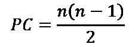
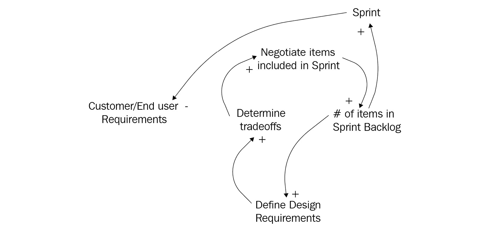

# *第三章*：分析复杂系统的交互

IT 组织在多个层面上代表着复杂的系统。首先，软件开发过程是一个系统，运营和支持功能也是如此。其次，团队成员的加入增加了软件开发系统的复杂性，计算设备、网络、工具和软件应用也增加了复杂性。

假设 IT 部门支持多个敏捷或 DevOps 开发团队共同开发一个单一的产品。在这种情况下，每个产品团队将既作为一个独立系统运作，又作为更大系统的一个组成部分——一个“团队的团队”。在这些场景中，所有团队必须协作，以支持软件产品或数字化服务的持续开发。本章提供了评估这些（以及任何其他类型系统）复杂性的方法，重点评估构成系统的元素、它们之间的连接以及交互的类型。

价值流管理的一个基本分析工具是建模和可视化技术，称为价值流映射。这个技术将在下一章作为价值流管理介绍的一部分进行介绍。然而，如果一个价值流团队只检查他们的活动，他们可能会忽略那些影响其价值流作为一个系统的更广泛因素。他们也可能错过这些因素如何影响他们的系统。这种跨领域复杂性分析是**系统思维**的领域，本章将讨论这一主题。

本章我们将讨论以下主要内容：

+   通过系统思维解决 IT 复杂性

+   分析因果关系

+   计算潜在连接

+   限制连接

+   学习系统思维的词汇

+   可视化系统元素之间的相互关系

+   阅读**因果环图**（**CLDs**）

# 通过系统思维解决 IT 复杂性

系统思维是一种评估大型系统复杂性的方法，它不是将系统看作一个个独立的部分，而是看作参与系统的元素之间的相互作用。我在《*Scaling Scrum Across Modern Enterprises*》一书的*第四章*中详细讨论了这一主题，并介绍了与基于 Scrum 的敏捷实践相关的 17 个因果环图。因此，本书中我们只会简要触及系统思维这一主题。

系统思维还帮助分析其他复杂的业务流程，包括连接的价值流之间的相互作用。然而，在本书中，主要关注的是使用价值流图来评估和改进业务流程。尽管如此，系统思维仍然是价值流图的前提活动。因此，精益-敏捷的从业者必须理解系统思维的术语，分析系统级别的因果关系，评估减少网络密度的方法，并运用系统可视化技术。

尽管系统思维和价值流图都运用可视化和建模技术来评估流动，它们的目标不同。系统思维旨在识别所有有意和无意参与系统的元素，确定系统内哪些元素相互作用，元素如何相互作用以及它们的因果关系。相比之下，价值流图是一种评估当前和未来工作方式的技术，然后寻找改进的方式。

互动元素的影响、原因和效果是评估复杂系统的整体行为时需要解决的最关键问题。让我们花点时间来了解为什么。

# 分析系统中的因果关系

系统思维中的一个关键概念是整体大于系统内各部分之和。这一说法对于系统的能力和复杂性都适用。正是部分之间的相互关系在系统内部创造了复杂性。但这些相互关系也正是让系统能够执行有用或无用的事情。如果我们不了解系统内部相互作用的原因和影响，我们就无法开始理解如何以有益的方式控制这些相互作用。

参与者的关系和互动在系统内可能是偶然的或有意的。例如，我们可以将一个制造生态系统视为代表一个包含任何数量参与元素的单一系统，这些元素相互作用，导致既有*意图的*也有*非意图的*影响。部分元素是有意为制造商的运营和交付职能提供支持。然而，制造系统也可能对其他无意的参与者产生负面影响。

在制造生态系统中，有意的参与者包括供应链合作伙伴、分销商、员工、承包商、客户以及其他支持运营的利益相关者。无意的参与者包括在行业通过不安全的环境实践造成健康或安全问题时受到影响的人和其他元素。

从系统思维的角度看，我们需要更深入地理解组织如何在更细化的层面上开展业务。我们还需要理解参与元素之间的互动关系。**元素**是构成系统的任何事物，包括材料、人员、流程、信息和技术。系统中的元素有时也被称为**节点**。在**CLD 建模**中，我们使用节点和箭头构建因果关系的有向图模型。

从技术角度看，一个有向图模型包括了随机变量对图中节点的影响概率。换句话说，因果关系可以在每次系统互动的不同值范围内变化。然而，在本章中我们不需要深入探讨这些细节。

理解系统中元素之间相互关系的挑战在于，我们可能不知道这些关系的存在，也不知道这些互动如何在系统中展开，除非进行详细的系统级分析。稍后我们将通过 CLD 建模回顾如何可视化元素及其互动关系，放在*可视化系统元素之间的相互关系*小节中。然而，在那之前，我们先快速看一下系统中元素数量的增加如何显著影响相互关系的数量。此外，在进入*阅读 CLD*部分之前，我们还需要了解一些系统思维中的术语。在下一节中，你将学习如何计算潜在的连接，以展示系统复杂性通过几何增长的参与元素的方式呈指数增加。

# 计算潜在连接

系统代表的是相互连接的网络。例如，一个大型企业中的 IT 组织可能有数百甚至数千名员工和承包商在其开发和运营职能中工作。此外，这些员工和承包商与其他部门、合作伙伴、员工、利益相关者和客户合作并相互影响。IT 系统还包括计算机、网络、应用程序以及参与 IT 生态系统的众多其他元素。

该组织创建了政策和流程，以帮助协调业务职能和人员活动，从而通过以盈利或在预算范围内生产增值产品和服务来实现期望的结果。每一个这样的流程接触点代表了更广泛的业务系统中的一次互动。当然，也存在许多无意的、计划外的以及可能不理想的互动。

到现在为止，你可能已经意识到，随着大规模系统中的连接增长，问题可能会变得相当复杂。然而，除非你已经熟悉管理网络密度的概念，否则你可能并未意识到这些相互连接和潜在关系增长得有多快。

幸运的是，我们有一种相对简单的方法来计算系统内相互作用的元素之间的*潜在连接*（以下公式中的*PC*）。我们还可以计算网络密度，作为实际连接与潜在连接的百分比。让我们从潜在连接的算法开始，这是系统内相互作用的最高测量值。

潜在连接的计算公式为，其中 *n* 是系统内节点或元素连接的数量。在任何系统中，参与的元素是通过相互作用产生复杂性的节点。节点越多，复杂性越大。让我们来看一些例子：

如果 n=1，那么潜在连接的数量是 0，因为没有其他东西可以连接。再加一个节点，潜在连接的数量仅增加一个，即！。再加一个节点，总共有 3 个节点时，连接的数量增加到 3。

到目前为止，关系和互动的数量看起来非常可控。但现在，我们将连接的数量增加到 7，这是一个中型敏捷团队的规模。在这种情况下，潜在连接的数量为 21。随着团队规模的扩大，或是我们增加更多团队一起合作，潜在连接的数量将呈爆炸式增长。

现在，让我们将团队成员的笔记本电脑添加到我们的敏捷团队示例中。通过将笔记本电脑加入我们的系统，我们在 IT 团队中创建了与设备相关的相互关系。笔记本电脑使我们的敏捷系统中的节点数量增加到 14，并且潜在连接增加到 91。换句话说，团队及其笔记本电脑形成了 91 个互动，这些互动可能影响团队的互操作性。

但敏捷团队每个迭代周期也会致力于交付一个 Sprint 待办事项。在这个例子中，我们假设每个 Sprint 有 10 个工作项。所以，连接的节点数量现在增加到包括 7 个团队成员、7 台笔记本电脑、10 个工作项——总共 24 个元素，并且潜在连接的数量每个 Sprint 急剧增加到 276 个潜在连接。

你是否在多团队环境中工作？为了演示这如何进一步增加管理敏捷团队的复杂性，让我们为我们的 IT 产品开发系统增加一个大小相同的第二个团队。因此，连接的节点数量现在增加到包括 14 个团队成员、14 台笔记本电脑和 20 个工作项，总共扩展到 48 个元素。因此，潜在连接的数量增加到 1,128。

我们可以将客户和他们必须互动的其他员工包括在内，但我想你已经明白了。每一个潜在的连接都是潜在的失败点，或者有可能在每个 Sprint 中造成不理想的结果。系统连接的增长情况如下图所示：

图 3.1 – 潜在系统连接的增长

作为潜在连接在系统内指数增长的一个例子，*图 3.1*提供了一个图形化示例，展示了从 0 到 100 个互联元素的潜在连接（PC）如何在系统内指数增长。一个 10 人团队有 45 个潜在连接，而一个有 100 名成员的 IT 组织有 4950 个潜在连接。

在我们离开这个话题之前，理解一个概念很重要，那就是通过限制实际连接的数量，我们可以消除一些潜在的负面后果。这也是下一节的主题。

# 限制连接

通常，系统中的所有元素并非都相互连接。减少系统复杂性的最简单方法是减少元素之间进行通信或协作的机会。另一种方法是减少参与系统的元素数量。

如果你学习过 Scrum 或 Lean-Agile 扩展策略，你可能注意到它们都利用了小团队的概念。即使在非常大的产品开发活动中，有时也涉及到数百或数千人，它们依然采用这种方式。通过将工作分配给多个小团队，可以限制参与产品开发人员之间的互动次数。

例如，**Scrum of Scrums**将跨团队的互动限制为少数几位团队成员，这些成员被称为大使（Ambassadors）。**Nexus**方法通过实施**网络集成团队**（**NITs**）来管理跨团队的依赖关系、协调和同步活动。类似地，**规模化敏捷框架®**（**SAFe®**）通过**极限编程**（**XP**）和**Scrum**团队的形式实施小型团队，并设有一个更高层次的团队，称为**敏捷发布列车**（**ARTs**），用于整合和协调跨大型产品开发工作的各个方面，或涉及 50-125 人的多个价值流，这些人被划分为 5-12 个 XP/Scrum 团队。

无论它们具体的策略如何，所有的扩展版 Scrum 和 Lean-Agile 方法都力求通过减少参与者之间的关系和互动来最小化复杂性。换句话说，我们希望系统中的实际连接数少于潜在的理论连接数。

实际连接与潜在连接的比率被称为**网络密度**。网络密度的概念非常重要，因为它提供了一种方法，通过最小化大型系统中潜在连接的数量，来减少它们可能引发不良影响的潜力。

*图 3.2*展示了一组六个精益价值流活动，它们作为顺序节点沿一条线连接。该图还显示了每个已识别价值流的最坏情况，其中所有活动都相互连接。每个价值流包括标识节点数量（*n*）、潜在连接（*PC*）、实际连接（*AC*）以及网络密度（*ND*）的度量：

图 3.2 – 显示节点、潜在连接、实际连接和网络密度的图形

从图示中应该可以清楚地看出，最少的互动次数，也就意味着最少的复杂性，出现在具有线性顺序流程或活动的价值流中。在本书中，您将学到，线性顺序流是精益生产实践、持续集成/持续交付（CI/CD）和 DevOps 管道的标志。当我们通过减少实际连接来降低网络密度时，我们减少了潜在的故障点数量。

通过我们之前的例子，减少网络密度的方法包括拥有备份笔记本电脑和访问替代软件产品。改善复杂系统中的成果的另一种方法是改进那些能够减少影响或修复故障连接的政策和流程。例如，能够迅速重新配置笔记本电脑和软件的 IT 支持团队可以减少因无法访问这些资源而导致的停机时间。

我们还可以减少团队成员与工作项之间的相互连接。例如，如果我们的团队成员具备广泛的技能，他们可以拆分工作项，从而减少工作项之间的依赖关系。我们还可以限制团队内部和团队之间的互动数量。在跨团队互动中，这个问题至关重要。这也是为什么许多规模化的 Scrum 方法会实施**大使**或**网络集成团队**来最小化跨团队互动的原因。

在精益系统中，理想的目标是通过价值流创建一套简化的活动流程，类似于装配线，使得工作可以通过一系列独立的活动按一个方向流动，而无需返回到先前的活动。从*图 3.2*中展示的例子应该能明显看出，线性顺序的流动方式要简单得多，且更为精简。还应该清楚地看到，随着价值流系统中活动（节点）数量的增加，网络密度问题变得越来越迫切需要解决。

到目前为止，我们的示例系统交互非常简单。现实生活要复杂得多，因为每个系统交互可能会产生不同类型的影响。元素之间的复杂系统交互被建模和分析为**因果链**。但是，在我们深入探讨这个话题之前，让我们花点时间来介绍系统思维的词汇。

# 学习系统思维的词汇

系统思维的词汇是独特的，并不直接与敏捷或精益实践相关联。但系统思维背后的概念非常强大且有用，有助于团队在分析大规模复杂业务系统中的元素及其相互关系时进行协作。以下是系统思维及因果环图中常用的基本术语列表：

+   **系统**：这些是由有形和无形事物、原则、程序以及社会和政治环境组成的复杂结构，这些元素共同服务于某种目的或功能。

+   **元素**：该术语指构成系统的各个部分的集合。这些部分可以是有形的或无形的事物、原则、程序或参与并引导系统行为的社会和政治环境。

+   **相互连接**：这些关系——包括物理、信息、正式或非正式的联系——将元素联系在一起，形成系统内部的纽带。

+   **功能**：非人类系统的目的、目标或意图。

+   **目的**：以人为基础的系统的目的、目标或意图。

+   **库存**：这些是系统内可量化、可测量的变量，受流动行为的动态变化影响。*元素*一词指在任何给定时刻的事物类型；*库存*一词则指在特定时刻，元素的属性及其可观察的数值。例如，一个元素可能是价值流活动，而其库存可能是工作项或材料。

+   **流动**：这些动作动态地改变系统内库存的方向，包括流入和流出。

+   **流入**：这些表示一种流动方向，用于增加可测量的库存量。流入显示通过带箭头的线条指向正在积累库存的元素。

+   **流出**：这些表示一种流动方向，用于减少可测量的库存量。流出显示通过带箭头的线条指向远离库存减少的元素。

+   **延迟**：当流入大于流出时，会发生延迟，导致库存积累。延迟的显示通常在连接元素的箭头上标注*延迟*字样，或在连接箭头上画上双井号。

+   **反馈回路**：这些是调节流动的机制，旨在使系统稳定或在系统内强化某一特定趋势。

+   **平衡反馈回路**：这些提供信息或资源，使系统或元素达到平衡，并保持在期望的范围内。

+   **增强反馈回路**：这些提供信息或资源，支持系统内的趋势或支持系统内的元素。该趋势可以是正向或负向的。

+   **因果回路图（CLD）**：一种将系统内元素（即*变量*）之间的相互关系可视化的方法，将元素表示为节点，节点之间的联系表示为链接（即*边*）。

+   **正因果联系**：这意味着两个连接节点之间的因果关系会导致观察到的属性朝相同（正向）方向变化，从而增加监测属性的值。

+   **负因果联系**：这意味着两个连接节点之间的因果关系会导致观察到的属性发生相反（负向）变化。

+   **开放系统**：这些系统的特点是存在系统外部的流入和流出——也就是说，能够进入或离开系统的事物。

+   **封闭系统**：这些系统的特点是系统内没有任何流入或流出——也就是说，系统完全自给自足并且平衡。

+   **标签**：在因果图中的所有元素上使用标签，以便评审人员了解这些元素和链接在系统模型中所代表的意义。

现在你已经了解了系统思维和因果循环图的基本术语，我们来快速看看在分析基于敏捷的开发团队作为一个系统时，如何使用它们。

# 可视化系统元素之间的相互关系

本节使用了前一本书《*Scaling Scrum Across Modern Enterprises*》中的一个 CLD 示例，描述了基于 Scrum 的 Sprint 规划过程（见*图 3.3*）。本练习的目的是并非解释 Sprint 规划过程，而是展示 CLD 建模过程如何运作，并以敏捷为参考。再次提醒那些希望更详细理解如何使用系统思维和 CLD 技术来评估精益敏捷流程的读者，我建议你们阅读《Scaling Scrum Across Modern Enterprises》一书。

这里展示了一个 Sprint 规划的示例：

图 3.3 – Sprint 规划因果循环图（CLD）

需要注意的是，CLD 中的箭头总是关闭系统循环，以显示一个强化或平衡的反馈回路。换句话说，所有 CLD 节点都会连接回入口点，形成一个回路，无论系统多大或多复杂，都能产生强化或平衡的效果。

强化回路是一个循环，其中改变一个变量会在系统中传播，导致某一趋势的增强或减弱。相比之下，平衡回路是一个循环，其中改变一个变量的效果会传播通过回路，并迫使系统做出反应，以抵消新的趋势。我们为 Scrum 基础的 Sprint 规划过程所举的 CLD 示例就是一个强化回路的形式，因为进入 Sprint 待办事项清单的工作项减少了产品待办事项清单中的工作项数量。

在因果循环图（CDL）中，我们用线条表示流动，箭头表示这些流动的影响。例如，正箭头（+）表示一个*正向因果关系*，趋势朝同一方向发展，而负箭头（-）则表示*负向因果关系*，即相反的趋势。

在这个模型中，客户和最终用户的需求来自于 Sprint 评审（即上一个增量的演示）或直接来自外部源。这种关系是正向因果关系，因为趋势朝同一方向发展。换句话说，随着客户和最终用户提出新的需求，潜在工作项的流量会增加。

相反，请注意产品积压中项目数量与精炼项目数量之间的关系，这是一个负向因果关系。这个关系表明，精炼过程通常会减少从积压中流出的工作项目数量。

# 阅读 CLD

在本章结束之前，让我们回顾一下 Sprint 规划过程（在上一章的*图 2.10*中展示）。这个练习将帮助你理解如何评估 CLD 模型中描述的各个关系。

Sprint 规划是基于 Scrum 的敏捷方法的一部分。我之前提到过，在我以前的书中有 17 个 CLD 模型。然而，这 17 个 CLD 模型跨越了三个不同的过程：

+   Sprint 规划

+   从项目到产品团队的转型

+   企业实施的 Scrum

这三个 CLD 模型都与分析 IT 功能相关，但每个模型的范围和目标各不相同。例如，Sprint 规划模型由五个独立的 CLD 组成。五个 CLD 大致分为团队可能希望分析的特定关注领域。这些领域包括：

+   分析产品积压优先级的 CLD 模型

+   产品积压精炼活动的开放 CLD 模型

+   设计和工作澄清的 CLD 模型

+   分析工作与团队能力的 CLD 模型

+   谈判和权衡活动的 CLD 模型

只有一个结果 Sprint 规划的 CLD 模型，但团队可能更愿意根据关注点逐步拆解工作，并逐步构建 Sprint 规划 CLD 模型。现在让我们简要看一下这些子 CLD 模型。

## 分析产品积压优先级的 CLD 模型

这个 CLD 模型的目标（见*图 3.4*）是理解构建客户和最终用户需求积压的相关元素。模型如下所示：

图 3.4 – 分析产品积压优先级的 CLD 模型

客户和最终用户的需求流入或通过 Sprint 回顾过程以及超出本 Sprint 规划 CLD 模型范围的外部过程。带有正号（+）的箭头表示正向因果关系，意味着趋势或影响朝同一方向发展。换句话说，需求的增加会使产品积压中的项目数量增加。

但请注意，这个正向因果关系并不意味着流程仅仅是一个加法过程。箭头上的（+）和（-）符号并不表示数学上的加法或减法过程，只是表示流程是否强化了某个趋势。因此，正向（+）的流向作为元素之间的关系，也意味着需求的减少。这导致产品积压中项目存量的减少。

## 产品积压精炼活动的开放 CLD 模型

这个 CLD 的目标（见*图 3.5*）是理解涉及精炼产品待办事项列表中的工作项的元素。具体来说，这意味着将史诗分解为用户故事，并理解开发任务。我们可以在以下图中看到这一点：

图 3.5 – 产品待办事项精炼活动的开放 CLD 模型

*图 3.5*中显示的示例包括具有负趋势（-）的箭头，这意味着元素之间的关系是负向因果链接，涉及待办事项列表中的项目数量和已精炼的产品待办事项列表项目数量之间的关系。产品待办事项列表中已精炼项目的数量与待办事项列表中的优先排序项目数量之间也存在类似的负向因果链接。

初看时可能有些难以理解，特别是对于那些不了解细节的人。负向因果链接表示，当链接开始的节点增加时，另一个节点会减少，反之亦然。换句话说，精炼和优先排序活动对工作项的存量有对立作用。这种对立效应发生是因为团队能够精炼和优先排序的工作量是有限的。

举个例子，假设客户希望将一个新功能包括在下一个发布版本中。该项目作为史诗或用户故事被加入到产品待办事项列表中。该项目必须经过精炼，以确保团队完全理解需求，并确定其优先级。负向链接表明，精炼后的项目数量趋势与最初进入待办事项列表的项目数量趋势相反。

同样的趋势出现在产品负责人决定哪些精炼后的工作项具有高优先级时。然而，这些高优先级的工作项会使 Sprint 目标朝同一方向发展。换句话说，高优先级工作项的数量增加，Sprint 目标的范围也会增加。同样地，如果精炼和优先排序后的工作项数量减少，Sprint 目标的范围会变小。

## 设计和工作澄清的 CLD 模型

下一个 CLD 的目标（见*图 3.6*）是理解设计和工作澄清的 CLD 模型中涉及的各个元素。这个 CLD 是工作项设计和范围界定活动的可视化。请注意，元素之间的所有关系都有正向因果链接：

图 3.6 – 设计和工作澄清的 CLD 模型

在这个 CLD 中，团队需要从产品负责人和其他来源（如客户和最终用户）获得对需求细节的澄清。改进澄清细节能够改善设计和界定工作范围的能力，反之亦然。

请注意，模型的另一部分也有一个正向因果关系，描述了产品待办事项中根据优先级确定的 Sprint 目标。理解 Sprint 目标有助于更好地理解设计需求和工作范围。

最后，*定义设计要求* 元素与 *确定工作范围* 元素之间存在正向因果关系。随着团队对设计的理解加深，他们能够更好地理解即将到来的 Sprint 中的工作范围。

## 分析工作与团队能力对比的 CLD 模型

这个 CLD（*见图 3.7*）旨在理解分析工作与团队能力对比的 CLD 模型中涉及的元素。虽然这是一个更大、更复杂的 CLD，但概念保持不变，我们只需通过其关联进行分析：

图 3.7 – 分析工作与团队能力对比的 CLD 模型

如果没有将这部分 CLD 与整个 Sprint 计划 CLD 一起考虑，就很难确定应该从哪里开始。然而，我们应该从标题为 *定义的 Sprint 目标与产品待办事项优先级的关系* 的元素开始。在接下来的子章节中，我们将看到这个 CLD 中的交互如何通过 *Sprint 待办事项节点中的项目数量* 导出到另一个 CLD。同时，请注意，这个 CLD 包含多个较小的 CLD 循环。各项活动通过参与评估团队能力与待办事项优先级之间的关系而相互连接。

这个 CLD 的重要性在于它定义了必要的元素和交互，旨在在团队能力和他们围绕 Sprint 计划工作自组织的能力的背景下定义初步任务。最终，这些关系导致了对 Sprint 待办事项中添加的工作项数量（和类型）的决策。请注意，这些项目还强化了产品在 Sprint 中开发的设计标准。

## 谈判与权衡活动的 CLD 模型

这个 CLD（*见图 3.8*）的目标是理解谈判与权衡活动的 CLD 模型。前一个 CLD——分析工作与团队能力对比——中的元素和互动影响了与设计相关的决策。但请注意，团队增加了一个 CLD 循环，用于分析与设计相关的影响与他们的能力对比，以确定是否需要与产品负责人进行权衡和谈判。例如，可能存在需要在处理一些更高优先级的工作项之前解决的技术债务问题：

图 3.8 – 谈判与权衡活动的 CLD 模型

我们现在已经完成了对整个 Sprint 计划 CLD 和本章主题的回顾。关于 CLD 建模，关键的事情是没有普遍的真理。在你的价值流中有效的方法，在另一个组织的价值流中可能不适用，尽管它们的目的可能相似。

在下一章，我们将深入探讨价值流管理的基础，作为一种以精益为导向的建模和可视化工具。但在此之前，让我们总结一下你在这一章学到的内容。然后，进行快速测试，看看是否有任何需要复习的地方。

# 小结

在这一章中，你学到了系统比其部分的总和复杂得多。随着参与元素数量的增加，潜在连接和相互作用的数量呈几何级数增长。你学会了如何运用系统思维来分析元素及其关系的复杂性。你还学会了系统思维的词汇，并了解了如何使用 CLD 作为建模和可视化技术来处理复杂的相互关系。接下来，你将运用你新获得的系统思维和 CLD 可视化知识来回顾 Sprint 规划过程。最后，你了解到系统思维与价值流映射在建模和可视化流程上的方法是不同的。

通过这些知识，你现在具备了评估系统中参与元素及其相互关系的能力——这些关系通过相互作用贡献了复杂性。系统思维是一种分析方法，用于理解相互连接和交互元素的影响、原因和效果。相比之下，价值流映射是一种评估当前和未来工作方式的技术，然后找到改进的方法。

系统思维为我们提供了发现和评估相互关联元素影响的工具，而价值流映射则为我们提供了改善工作和信息流的工具。我们将在下一章探讨价值流管理的组成部分。

# 问题

1.  系统思维的价值是什么？

1.  系统内元素之间的两种关系类型是什么？

1.  为什么我们要建模系统内元素的连接和相互作用？

1.  在因果回路图中，闭环的目的是什么？

1.  什么是一个多节点系统的最简配置？

1.  确定系统中潜在连接数量的公式是什么？

1.  为什么我们要尝试减少实际连接的数量？

1.  计算网络密度的公式是什么？

1.  CLD 图中的箭头有什么作用？

1.  正向因果关系和负向因果关系有什么区别？

# 进一步阅读

+   Rupp, C.G., (2020) *Scaling Scrum Across Modern Enterprises: 在大型组织中实施 Scrum 和 Lean-Agile 技术，跨复杂的产品、组合和项目*。Packt 出版，伯明翰，英格兰
