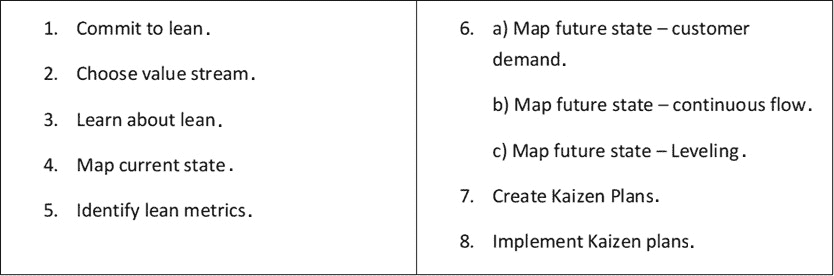
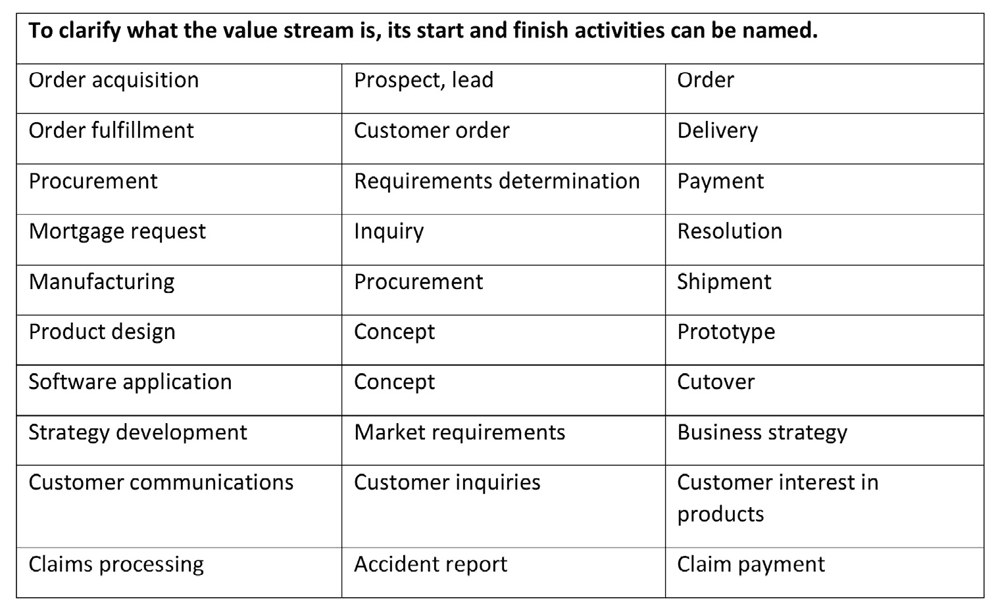
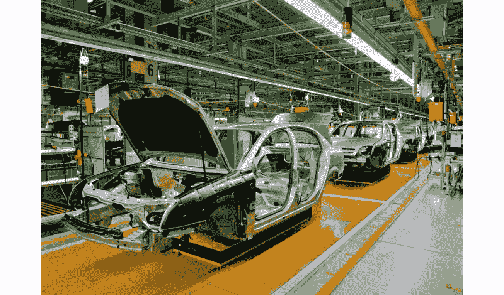
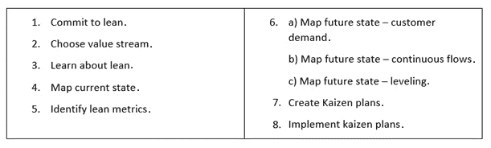

# 第四章：定义价值流管理

**价值流管理**（**VSM**）正在迅速成为 **信息技术**（**IT**）领域的核心能力，特别是作为评估和消除软件交付过程中的非增值活动（浪费）的一种手段。然而，VSM 并不是一个新概念。在本章中，您将了解 VSM 的起源及其在精益生产、供应链、办公和 IT 定向流程中的应用。

VSM 提供了一种方法，系统性和持续地评估所有组织的开发和运营价值流。VSM 实践和工具有助于改进所有价值流，而不仅仅是 IT 领域的价值流。VSM 项目的目标是确保我们的价值流最为高效，与公司战略保持一致，并以最小的浪费为客户创造价值，但没有必要学习多个 VSM 策略。

在本章中，您还将学习 VSM 的基本方法和工具。具体来说，您将了解一种通用的八步 VSM 方法，用于规划、映射和维持精益改进。本书旨在教授一种经过验证的方法，而不是学习一种高度针对特定 VSM 工具集的方法，无论价值流的应用或工具如何。

VSM 八步法总结如下截图：

图 4.1 – VSM 八步法

采用这种通用方法来处理 VSM 的原因是，在我们的数字经济中，IT 解决方案通常支持其他组织的价值流，且在过程中变得不可分割。因此，理解 VSM 的基本概念至关重要，因为每个基于 IT 的 VSM 项目都必须支持组织的更广泛目标，以在所有价值流中构建并维持精益企业。

稍后，在本书的 *第二部分* 中，我们将深入探讨基于 IT 的 VSM 实践案例。在此以及接下来的两章中，我们的重点是学习 VSM 的基本要素，而不考虑其应用。

在本章中，我们将涵盖以下主要内容：

+   实施精益理念

+   确定价值流

+   应用 VSM 方法和工具

+   定义 VSM 的八个步骤

# 技术要求

本章没有特定的要求。

# 实施精益理念

VSM 基本上涉及在组织内实施精益理念，并将精益开发和交付过程变为一种生活方式。VSM 被应用于简化以开发和运营为导向的工作，以便在现代精益实践中更加高效地交付以客户为中心的价值。在此背景下，基于 IT 的开发和运营活动是组织价值流，同样可以通过运用 VSM 功能受益。

具体来说，VSM 支持 IT 部门通过实施**持续集成**（**CI**）和**持续交付**（**CD**）能力，通常作为更大范围的**DevOps**过程集成、自动化和协作策略的一部分，推动其精益化。换句话说，使用 VSM 来推动 DevOps 开发和交付能力，本质上是组织实施 IT 价值交付的精益价值流策略。

在他们的书《*价值流管理：八个步骤规划、绘制和持续精益改进*》中，作者对 VSM 的定义如下：

"*价值流管理是一种通过简单的数据捕捉和分析来规划和连接各项举措的过程*。"（Tapping, Luyster, Shuker, 2002，第 2 页）

请注意，他们对 VSM 的定义不仅限于在 IT 价值流中进行精益生产改进。事实上，这些作者共同撰写了三本书，应用可重用的 VSM 方法论于制造业、精益行政办公室以及医疗保健价值流中，正是他们的八步方法论被应用于本书的*第二部分*《实施价值流管理（VSM）方法与工具》中，用于分析、规划和执行 CI/CD 管道流动用例场景中的精益改进。我们将在本章的后续部分*应用 VSM 方法与工具*中介绍 VSM 的八个步骤。

在我们现代的数字经济中，IT 几乎支持着每一项组织活动。因此，VSM 实践不能仅仅聚焦于改善 IT 价值流。相反，面向 IT 的 VSM 有助于改善整个企业的所有价值流活动。此外，由于组织价值流往往是相互关联的，我们必须改善跨所有连接价值流的客户交付流。

让我们来看一个快速的例子。在我们的场景中，一个客户有兴趣购买一款可定制的产品，因此他们上网访问供应商的网站查看可选项。在网站上，他们决定购买的产品并提交了订单。订单触发了其他价值流活动，涉及下单、付款、更新会计系统、订购替换材料、执行生产，最终执行组织的下游履行或供应和支持流程。在此过程中，IT 系统从头到尾发起这些流程，确保正确的信息和材料在正确的时间和地点出现。因此，所有的组织价值流在某种程度上是相互关联的，而 IT 价值流作为一个至关重要的推动力发挥着作用。

在本书的*进一步阅读*部分，你可以看到一些书籍列表，这些书籍专注于将 VSM 应用于制造业的精益生产过程、精益办公、精益供应链和精益 IT 价值流。在一个真正的精益企业中，所有的组织价值流都需要持续改进，并与其他关联的价值流进行协调。这就是 VSM 的前提。

## 实施信息流

在数字经济中，每个价值流都有信息流。在许多情况下，数字价值流的材料是信息元素（表单、图形、**商业智能**（**BI**）、原始数据或信息支持服务）。在前一段中，你了解到信息流对支持精益生产过程至关重要，但信息流同样对支持所有前端和后端价值流过程至关重要。

**前端过程**直接帮助客户，而后端过程则包括所有不需要面对面互动的内部支持活动。例如，前端过程包括销售支持活动，可以通过人员或在线产品信息系统进行。同样，组织的客户支持过程也是前端过程的例子。相反，**后端过程**的例子包括供应和合作伙伴管理实践以及履行。

换句话说，*前端*和*后端*这两个术语与产品生命周期中的顺序无关。相反，可以将*前端*理解为指那些在客户面前进行的过程，而*后端*过程则发生在幕后。

然而，在精益术语的词汇中，我们使用*上游*和*下游*这两个术语来指示产品生命周期中活动的关系，如下图所示。在精益中，客户始终是我们的关注点，因此，产品或服务的交付是最终的精益过程目标：

图 4.2 – 上游与下游价值流活动

在这个背景下，精益价值始终是向下游流动的，任何前面的活动都是上游的。同样的概念适用于每个价值流。离客户最远的活动总是位于离客户最近的活动的上游。

在*图 4.2*中进一步阐述了上游和下游的例子，价值流包括一系列材料和信息的组合，这些材料和信息在每个后续的价值流活动中逐步积累，直到准备好作为产品或服务交付给客户。

## 定义价值流的类型

*价值流*一词在现代精益环境中已经扩展为包括企业内部所有增值和非增值活动。一些价值流直接有助于产品和服务的开发，而另一些则专注于面向运营的活动，以交付产品和服务。

**精益企业研究院**（**LEI**）对价值流的定义如下：

*“所有的行动，包括增值和非增值的，都是将产品从概念到发布（也称为开发价值流）以及从订单到交付（也称为运营价值流）所必需的。这些包括从客户处处理信息的行动和在产品向客户交付过程中转化产品的行动。”*

– *摘自《精益词汇》，第 5 版*

请注意，价值流的定义包括了处理来自客户的信息所必需的行动。同时，回顾一下丰田最初将价值流映射称为*物料和信息流映射*。在精益中，我们致力于改善物料和信息流，以高效地提供以客户为中心的价值。在本章中，您将了解为何基于 IT 的策略在推动和维持企业精益计划中的重要作用。

现代的 VSM 系统提供了一套方法和工具，用于绘制现有和未来的活动图，定义改进的指标，并监控我们在绩效目标上的进展。此外，分析工具提供了评估因果关系的能力，并在做出承诺和投资之前，模拟不同的业务改进策略。

我们将在本章稍后更深入地理解 VSM 如何帮助识别和改进价值流。但在此之前，让我们先花点时间理解一下价值流和 VSM 背后原始而仍然重要的概念。

## 使用 VSM

VSM 作为一个概念已经存在了一段时间。有趣的是，20 世纪 90 年代的 IT 领导者之一詹姆斯·马丁在他的著作《伟大转型：使用企业工程的七个学科来对齐人员、技术和战略》（马丁，1995 年）中，将*价值流*一词应用于软件开发实践。马丁的书籍出版不到一年后，詹姆斯·沃马克和丹尼尔·琼斯在《哈佛商业评论》上首次提出了这一术语，文章名为《从精益生产到精益企业》（沃马克和琼斯，1994 年 3-4 月）。

在第 104 页，马丁将*价值流*一词定义为“*由‘客户’（可能是最终客户或价值流的内部‘最终用户’）产生的一系列端到端活动*”。

注意

**VSM**这一缩写代表**价值流管理**，与价值流图示（value stream mapping）所使用的缩写相同。这一缩写的重复使用是一个不幸的巧合，因为价值流图示是整个 VSM 过程的一个子集。为了保持清晰，书中所指的**VSM**始终表示价值流管理。为了进一步减少可能的混淆，本书将始终拼写出*价值流图示*，或缩写为*VS 图示*或*VS 绘图*。

虽然詹姆斯·马丁定义了“*价值流*”这一术语，但在描述改进价值流的活动过程时，他倾向于使用“*价值流重塑*”这一术语。马丁对使用“*过程*”这一术语以及**业务流程重组**（**BPR**）这一概念持有异议。

在第一个案例中，马丁认为“*过程*”这个词过于宽泛，且远离精益理念中增值、以客户为中心的概念。他对“*BPR*”这一术语的主要问题在于，他认为他那个时代的大多数过程根本没有经过*设计*。相反，大多数业务流程是为了支持层级化的商业结构而演变出来的，其中的活动往往更多地与保护组织的领地和权威相关，而非提高效率。

后来的其他作者在他们的书中引入了*VSM*这一术语，包括以下内容：

+   *价值流管理。规划、绘制和维持精益改进的八个步骤*。*唐·塔平（Don Tapping）*，*汤姆·莱斯特（Tom Luyster）*，和*汤姆·舒克（Tom Shuker）*（*精益生产*，*2002*）。

+   *精益办公的价值流管理。规划、绘制和维持行政领域精益改进的八个步骤*。*唐·塔平（Don Tapping）*和*汤姆·舒克（Tom Shuker）*（*精益办公*，*2003*）。

+   *价值流管理。供应链中的战略与卓越*。*彼得·海因斯（Peter Hines）*，*理查德·拉明（Richard Lamming）*，*丹·琼斯（Dan Jones）*，*保罗·考辛斯（Paul Cousins）*，*尼克·里奇（Nick Rich）*（*普伦蒂斯·霍尔/皮尔逊教育*，*哈罗*，*英国*，*2000*）。

汤姆·舒克（Tom Shuker）非常慷慨地授权使用他们的八步流程作为本章的示例，展示如何在整个组织中实施 VSM 战略。这一八步 VSM 流程帮助组织通过精益规划简化需求、流动和平衡等基本精益概念，并帮助实施整体流程以加速、协调和持续精益工作。

是的——这是一本关于 VSM-IT 转型应用的书。但请问自己这个问题：在数字经济中，我们到底在改善哪个商业价值流？为了回答这个问题，让我们回顾一下詹姆斯·马丁（James Martin）关于这一主题的原始和开创性著作。

# 确定价值流

詹姆斯·马丁（James Martin）从根本上理解了为什么企业组织投资于信息技术（IT），以实施和维持支持其价值流的卓越业务流程。马丁超越了时代，但他的思想依然延续——例如，**开放组架构框架**（**TOGAF**）在其*业务架构*标准中仍然运用了詹姆斯·马丁的价值流概念（*开放组指南*，*价值流*，2017 年 1 月）。

但詹姆斯·马丁使用“价值流”一词时到底是什么意思呢？马丁不仅仅是寻找改进 IT 开发和运营过程的方法。他的目标是帮助组织重构其价值流，并实施软件应用程序来支持、维持并持续改进所有价值流中的价值交付。

在他的书中，詹姆斯·马丁引用了 T.H. 达文波特（T. H. Davenport）发表的《过程创新》一书中的研究，该研究发现，在 5 家大型企业中，平均有 14 个价值流。参与的公司包括**IBM**、**Ameritech**、**道化学公司**、**施乐**以及一家大型但未透露名称的保险公司（哈佛商学院出版社：波士顿，1993 年）。

马丁综合了达文波特论文中的研究，识别出了 17 个典型的价值流（马丁，1995 年，第 107 页）。他列出的 17 个传统的业务价值流包括以下内容：

+   **客户互动**：获取客户、了解客户需求；销售，确保客户满意

+   **订单履行**：接收订单，履行订单，收取付款

+   **客户服务**：向客户提供诸如使用产品帮助、规划和咨询等服务

+   **制造**：生产商品、维护库存、与供应商互动

+   **采购服务**：协助选择供应商、签订合同和管理

+   **产品设计工程**：设计产品及其制造设施

+   **研究**：探索潜在的有价值的科学和技术

+   **市场营销**：确定客户需求，设计产品，哪些功能是必须的；广告宣传

+   **市场信息采集**：获取销售信息；收集竞争情报

+   **产品维护**：修理产品以及在客户现场进行预防性维护

+   **法务部门**：解决法律问题；起草合同

+   **IT-应用开发**：开发和修改系统和软件

+   **IT 基础设施**：建立公司范围的网络、数据库及分布式计算设施

+   **人力资源**（**HR**）：协助招聘、培训、薪酬、照护规划

+   **租赁和资本资产管理**：管理建筑物和资本资源

+   **财务管理**：会计、与银行谈判、现金管理

+   **企业工程**：设计、实施和改进价值流；工程化企业学习过程

现在我们对典型的面向业务的价值流有了更好的理解，接下来理解如何建立其边界和接口就显得至关重要。

## 建立价值流边界

每个价值流都有特定的起始和结束活动，这些活动确定了其边界。这个概念如此重要，以至于一些**业务架构**领域的人士通过其起始和结束活动来称呼他们的价值流（例如，**从潜在客户到订单**和**从订单到交付**的价值流）。James Martin 提供了选定价值流的起始和结束活动示例。

下表展示了 Martin 书中提到的价值流命名约定（Martin, 1995, 第 108 页，第 7.3 图表）：

图 4.3 – VS 命名约定

现在你已经理解了如何应用价值流边界和命名约定，我们来看看价值流改进如何帮助交付商业价值。

## 改善商业价值

重要的是要记住，James Martin 在撰写他的书《伟大转型》时，几乎所有的企业仍处于利用 IT 支持其关键业务流程的早期阶段。Don Tapscott 在 1995 年出版的《数字经济：网络智能时代的承诺与风险》一书中创造了“数字经济”这一术语，这与《伟大转型》出版的年份相同。但 James Martin 和 BPR 以及**业务流程改进**（**BPI**）领域的其他人已经理解到，重新设计或逐步改进业务流程，利用 IT 的新能力，具有重要意义。

企业必须在数字经济中开发更高效、更快速、更灵活的组织价值流，Martin 理解到其 IT 功能必须支持这些努力。Martin 对价值流重塑的看法是，替代传统的跨职能和孤立的业务流程，"*采用一种新的工作流程，该流程快速、简单、尽可能自动化，并由一个专注于取悦客户的小团队（或个人）执行*"（Martin, 1995, 第 64 页）。

James Martin 进一步指出，价值流重塑是一种改进策略，旨在回答几个根本性问题，例如以下问题：

+   组织的价值流是什么？

+   谁是价值流的客户？

+   客户需要什么？

+   我们需要做些什么才能让这些客户满意？

作为在数字经济中工作的 IT 专家，我们必须问自己这个根本性问题：*如何利用 IT 和软件应用程序，以尽可能高效、低成本、快速地支持组织的以客户为中心的价值流？*

从精益的角度来看，答案是多方面的，且从概念层面理解并不难：*IT 组织支持自动化和集成组织的价值流活动，同时提高价值流信息流的准确性和及时性。在许多情况下，IT 还支持在实体产品中实现数字功能和特性。*

我们现在明白了利用 IT 提升商业价值交付的重要性。接下来，让我们深入了解为什么组织的高级管理人员必须推动这一努力。

## 引领变革

精益策略并不容易实施。精益开发和交付活动通常需要对组织及其设施进行一定程度的结构调整，实施新的业务流程和设备，发展新的技能，并在 IT 上进行投资。只有组织的最高管理层或**业务线**（**LOB**）高层才能授权这些变更。

本书的一个主要主题是支持企业规模的精益计划，做出明智的 IT 投资，包括技能和工具。不幸的是，改变组织结构、发展新技能和投资新的 IT 方法与工具依然是一个困难的任务。有无数的技术和产品选择需要调查，大多数都需要额外的时间和资源来进行配置和集成工作。

这些是领导力必须发挥作用的领域。与其他企业精益（Lean）计划一样，只有高层领导才能指导价值流图（VSM）战略，并进行必要的工具、基础设施、集成和配置投资。将 DevOps 纳入其中会增加这些投资成本。我们稍后将在*第六章*《启动 VSM 计划（VSM 步骤 1-3）》中讨论这个话题，即 DevOps 工具、基础设施、集成和配置方面的投资。

持续集成（CI）、持续交付（CD）和 DevOps 能力已经发展到一个阶段，IT 部门能够更好地支持詹姆斯·马丁（James Martin）在 1990 年代提出的理念；此外，价值流图（VSM）提供了一套方法和工具，帮助并指导组织的精益转型。然而，所有这些能力都需要投资，高层领导必须获得足够的知识，才能做出明智的投资决策。

你可能不是高层管理人员或业务线高层，但你依然可以在你在组织中的职位或角色中提供教育、思想领导力和支持。一个组织在精益计划上的成功依赖于每个人的参与和支持。

为了便于讨论，我们假设组织得到了高层支持，并且愿意进行必要的结构调整，安装经过培训的导师和教练，并投资于必要的技术和工具。那么，下一个问题是：*如何启动并执行持续的价值流映射（VSM）策略？* 这个问题将是本章最后部分的主题。但在讨论这个主题之前，让我们快速了解一个关键的 VSM 可视化和分析工具——**价值流映射**。

## 价值流映射

本节的目的是解释价值流映射的重要性。稍后，在 *第七章*中，*映射当前状态（VSM 第 4 步）*，你将学习如何创建价值流图，这是一种评估当前（*现状*）和未来（*目标状态*）过程的技术。价值流映射帮助 VSM 团队评估完成所需工作量，以过渡到理想的未来状态，旨在精简价值流活动，最小化浪费，并提供以客户为中心的价值。我们将继续使用价值流映射来帮助指导并优先排序我们的持续改进（CI）活动。

丰田起源了价值流映射技术，但他们将这一实践称为*物料和信息流映射*。换句话说，丰田明白，即使是在分析制造过程时，改进信息流与改进物料流同样重要。

及时且准确的信息是支持制造组织内部物料流动的必要条件。如果信息流动不畅，生产过程会因为正确的物料未能在正确的时间、正确的数量到达而被延误，从而影响精益生产过程。当然，客户订单信息必须与物料一起流动，以确保为每个客户制造正确的产品集。

詹姆斯·马丁也是早期的价值流映射倡导者之一，他在他的书《伟大的转型》（Martin, 1995）中 dedicates 一个章节专门讲解价值流映射，章节标题为 *第八章*。然而，马丁的方法早于迈克·罗瑟（Mike Rother）和约翰·舒克（John Shook）在他们的书《学习看见》（Rother, Shook, 1999）中提出的现代价值流图技术。

本书讲授了罗瑟和舒克提出的现代价值流映射方法，后来由凯伦·马丁和迈克·奥斯特林在他们的书《价值流映射：如何可视化工作并对齐领导力以进行组织转型》（Martin, Osterling, 2014）中进行了更新。现代的价值流图结合了活动和信息流数据，这些数据对于评估价值流中精益状态至关重要。相比之下，詹姆斯·马丁的价值流图采用的是一种相对传统的过程流图技术。

无论您的组织偏好哪种建模技术，都必须确保采用标准化方法，并且每个人都经过相关技术的培训。否则，VSM 团队可能会在沟通、解释和分析中遇到问题。

在我们讨论价值流的过程中，理解这一基本概念至关重要：**所有的价值流代表了跨越整个组织的端到端价值流动**。在这个背景下，精益价值流的运作类似于亨利·福特第一代 T 型车组装线背后的大规模生产概念。一个关键的区别是，精益生产结合了拉动式生产和订单管理生产过程，而不是推式生产控制策略。暂时不讨论推式与拉式生产控制策略的概念，大规模生产和精益生产共享同步和自动化流动的概念。

例如，客户订单记录了一个新需求，启动了产品的生产或交付。生产过程遵循一个围绕初始组件的价值流，例如前面提到的 T 型车生产示例中的车架。另一个例子是在计算机系统组装过程开始时，构建笔记本电脑或服务器的机架或底盘。在这两种示例中，当这些车架穿越生产线上的各个活动时，额外的价值组件（如材料、零件和信息）会被添加到产品中。在精益的术语中，我们在价值流过程的每一步都会为产品添加价值。

以下截图展示了现代汽车组装线的一个画面。尽管使用了机器人技术和其他自动化能力，但亨利·福特最初的大规模生产概念仍然保留，作为一个端到端的同步过程：

图 4.4 – 汽车组装线

本书并非讨论如何在制造业中实施精益流程——对于这类信息，有许多其他优秀的资源。然而，我们将讨论如何将 VSM 应用于面向开发的流程，组装线就是其中一个例子。此外，我们还将讨论如何使用 VSM 来支持面向运营的价值流，这些流程更多地涉及前台和后台的工作。

如前所述，前台操作流程面向客户，而后台操作流程通常是行政性的。与面向开发和运营的价值流一样，所有业务流程都可以通过应用 VSM 方法和工具来实现精益化并进行改进。

在使用了*前台*和*后台*这些术语后，请注意，您很可能会决定，在您的组织中，并没有一个固定的标准来评估从客户视角出发的增值活动。价值流并不受组织层级、技能或业务职能的限制。价值流是一套从初步请求到交付所需的端到端活动。这些活动的客户可以是组织内部的，也可以是外部的。

在下一章中，我们将探讨如何将 VSM 实践作为一个由八个步骤组成的结构化过程来实施。然而，在进入下一章之前，让我们先快速浏览一下规划、绘制和维持精益实践的八个 VSM 步骤。

# 应用 VSM 方法和工具

每个 VSM 工具供应商都有其独特的 VSM 流程，通常根据其业务起源和软件工具的重点或优势进行定制。我们不需要软件工具来实施 VSM 能力，尽管它们是一个巨大的推动力。然而，在投资 VSM 工具之前，我们必须首先了解实施 VSM 实践背后的基本概念和方法。

如本书所述，VSM 实施遵循 Don Tapping、Tom Luyster 和 Tom Shuker 在其*《价值流管理》*一书中概述的八个步骤（Tapping, Luyster, Shuker, 2002；Tapping, Shuker, 2003）。具体来说，这八个步骤引导组织通过 VSM 过程来规划、绘制和维持精益改进。

以下截图介绍了八个 VSM 步骤：

图 4.5 – 八步骤 VSM 过程来规划、绘制和维持精益实践

与 Tapping、Luyster 和 Shuker 的书籍不同，他们的书籍聚焦于精益管理、精益医疗和精益办公，本书专注于将 VSM 应用于 IT。然而，*请注意*，IT 涉及到数字经济中组织内的所有事务。此外，正如 James Martin 所指出的，IT 的角色是通过精益计划支持组织的流程和价值流的重塑。因此，*任何 VSM 计划很可能包括规划、绘制、改进和维持活动，作为一个参与式的价值流，但不一定是主要的价值流。*

前面的段落指出了一个关键点。几乎所有现代的 VSM 工具都专注于对 DevOps 流程进行建模，以展示相关概念。改善 DevOps 价值流固然重要，然而 VSM 的更大好处来自于将 DevOps 活动与支持 IT 之外的企业精益计划相联系，包括面向运营和开发的价值流。

# 定义 VSM 的八个步骤

Tom Shuker 非常慷慨地允许我将他们的**八步 VSM 流程**纳入本书。在我们结束本章并进入执行他们 VSM 策略的细节之前，我们将快速回顾一下 Tapping 和 Shuker 如何定义他们的八个步骤，用于规划、映射和维持精益改进，具体如下：

1.  **承诺精益** (*步骤 1*): 一个成功的精益计划需要高层领导和员工及利益相关者的支持。所有参与 VSM 计划的人员必须理解精益实践的重要性，以通过价值交付提供更可持续的业务。精益的目标是延长人力资源的价值，而不是裁减职位或采取捷径。

1.  **选择价值流** (*步骤 2*): 我们不能在一夜之间在整个组织中实施和改进精益实践。识别和实施价值流改进需要时间和努力，优先级基于对最具价值、最低成本的工作的识别。此外，VSM 团队将继续识别并在产品生命周期内开展新的改进优先事项。

1.  **了解精益** (*步骤 3*): VSM 旨在改进组织价值流中的精益实践。因此，所有 VSM 团队成员以及被分配到价值流中的员工必须具备操作精益生产系统的日常实践的卓越知识。

1.  **映射当前状态** (*步骤 4*): 在完全理解系统如何运作之前就开始调整系统是危险的。我们需要了解我们的工作如何在价值流中流动，多少工作是增值的，多少时间花费在增值活动和等待之间。最后，我们需要识别其他形式的浪费，这些浪费增加了成本却没有增加价值。这些就是在映射我们开发或运营导向的业务实践的当前状态时的目标。

1.  **识别精益指标** (*步骤 5*): 在完成当前价值流图后，VSM 团队将注意力转向识别可以帮助组织实现业务目标的指标。如果我们不首先识别客户的需求、潜在的浪费区域以及价值流的生产力目标，我们就无法评估未来 VSM 工作的成功。满足客户需求并消除浪费是降低成本并获得可持续产品价格的最可靠路径。

1.  **映射未来状态** (*步骤 6a*)—**客户需求**: 这是构建我们所期望的未来状态计划的三个阶段中的第一阶段。目标是评估客户对我们产品和服务的需求。在这个映射练习中，我们输入了之前识别的精益指标，包括可接受的质量、单位需求量和所需的交货时间。

1.  **绘制未来状态** (*第 6b 步*)—**持续流动**：这是未来状态绘制的第二阶段。目标是标准化工作执行方式，并找出如何组织工作、材料、零件和信息的流动，以便持续流动。在很多情况下，甚至大多数情况下，可能需要移动设备和办公隔间以改善流动。信息系统是另一个关键支持因素，帮助建立跨价值流活动的高效信息流动。还应采取措施，通过最小化活动设置、更换和周期时间之间的差异来平衡工作流。最后，我们应决定实施哪些生产控制策略，如**准时制**（**JIT**）、**先进先出**（**FIFO**）和看板（Kanban）。

1.  **绘制未来状态** (*第 6c 步*)—**平衡**：这是未来状态绘制的最后阶段。在此阶段，我们应该已在价值流中安装了 Lean 实践，并最小化了影响生产力的更关键的浪费因素。现在，我们需要实施策略来平衡客户需求的流动。此 VSM 工作涉及实施基于拉动的策略，减少过度排队和等待，减少批量流程中与批次处理相关的队列和等待时间，并实施价值流的交付和提取系统——即看板卡片或看板文件夹以及工作项。

1.  **创建 Kaizen 计划** (*第 7 步*)：VSM 实施以 Lean 为导向的变更，涵盖大规模和小规模的变化。Kaizen 计划概述了我们不断改进开发和运营导向的价值流的策略，但许多 Lean 导向的投资需要大量资金，而 VSM 团队无法授权。此外，计划中的变更可能需要多个规划周期来实施，其 Kaizen 计划可能随时间变化。因此，VSM 团队需要制定变更计划（Kaizen 计划），以使计划中的变更范围可见并得到管理。

    Lean 和 Agile 的关键区别在于，Lean 评估所有潜在的改进领域，不考虑所需的投资、权限、时间和资源。相比之下，Agile 的回顾性通常专注于小型 Agile 团队在下一个 Sprint 迭代中可以授权和完成的事项。

    Lean 和 Agile 的从业者都理解持续变革的重要性，但 VSM 更强调长期规划周期，并可能包括需要更多资本投资的变更，这些变更在 Agile 回顾性中通常不会考虑。

    最后，需求、问题和优先级随着时间的推移会发生变化，因此 Kaizen 计划需要定期审查和更新。创建和修改 Kaizen 计划是此步骤的主要活动。

1.  **实施 Kaizen 计划** (*第 8 步*): 最后，我们需要实施所有我们制定的 Kaizen 计划。此外，我们还需要定期回顾和更新它们。商业中的一个常态是持续变化，因此我们需要不断改进精益实践，并保持与客户需求的对齐。我们还需要不断评估如何通过发现和消除额外浪费来改善我们的价值流活动。

现在，我们已经介绍了规划、绘制和维持精益改进的八个关键步骤，让我们更详细地了解每个步骤中发生的事情，从对精益的承诺开始。这是下一个章节的主题。

# 总结

这就是 VSM 的介绍章节。你已经了解到，VSM 提供了一种系统地、持续地评估所有开发和运营价值流的方法。VSM 的目标是确保一个组织始终与企业战略保持一致，并为客户提供以客户为中心的价值。

你还了解到，VSM 并不是一个新概念，相关的概念和实践支持在组织的价值流中实施和维持精益生产实践。组织通常拥有多个价值流。IT 领导者 James Martin 对以价值流形式进行业务流程的端到端重塑的需求进行了全面的讨论。Martin 还是价值流图绘制的早期倡导者，尽管他的方式早于我们将在*第六章*中使用的现代格式，即“启动 VSM 计划（VSM 步骤 1-3）”中所涉及的价值流绘制与改进。

最后，你现在可以识别出八个 VSM 步骤，用于规划、绘制和维持跨价值流的精益改进。在下一章中，我们将继续学习如何执行与 VSM 规划相关的步骤，包括承诺精益、选择 VSM 计划的价值流以及学习精益相关内容。

# 问题

为了增强你的学习体验，请花几分钟时间回答以下 10 个问题：

1.  VSM 的主要或基本目的是什么？

1.  丰田如何称呼其价值流图绘制活动，这有什么重要意义？

1.  在精益生产的背景下，上游和下游之间的区别是什么？

1.  对还是错：价值流始终包括创造价值和非创造价值的活动。

1.  James Martin 是如何定义价值流的？

1.  价值流有哪两种类型？

1.  VSM 的八个步骤是什么？

1.  在承诺 VSM 计划时，建立坚实基础的五个关键要素是什么？

1.  哪个著名的原则或法则帮助指导你的 VSM 决策过程？

1.  用于识别价值流的良好命名规范标准和方法是什么？

# 进一步阅读

+   *Martin, J. (1995). 《伟大的转型》。运用企业工程的七大原则来对齐人员、技术与战略。美国管理协会，现为哈珀·柯林斯领导力的一个部门。纽约，纽约*。

+   *Womack, J. P., Jones, D. T. (1994 年 3 月至 4 月). 从精益生产到精益企业。作者：詹姆斯·P·沃马克和丹尼尔·T·琼斯。哈佛商业评论.* [`hbr.org/1994/03/from-lean-production-to-the-lean-enterprise`](https://hbr.org/1994/03/from-lean-production-to-the-lean-enterprise) 访问时间：2021 年 6 月 26 日。

+   *Open Group 指南。价值流（2017 年 1 月）。*（必须注册才能访问） [`publications.opengroup.org/downloadable/download/link/id/MC45NDQ2MjkwMCAxNjA4MzM2NjcwNzM2ODYwNzU1OTU2MjUx/`](https://publications.opengroup.org/downloadable/download/link/id/MC45NDQ2MjkwMCAxNjA4MzM2NjcwNzM2ODYwNzU1OTU2MjUx/) 访问时间：2020 年 12 月。

+   *Tapping, D., Luyster, T., Shuker, T. (2002) 价值流管理。规划、绘制和维持精益改进的八个步骤。生产力出版社。纽约，纽约*。

+   *Tapping, D., Luyster, T., Shuker, T. (2003) 精益办公室的价值流管理。规划、绘制和维持精益改进的八个步骤。生产力出版社。纽约，纽约*。

+   *Tapping, D., Koslowski, S., Archbold, L., Speri, T. (2009) 精益医疗中的价值流管理。规划、绘制、实施和控制各种医疗环境中改进的四个步骤。MCS 媒体公司。切尔西，密歇根州*。

+   *Gregory, L. (2018 年 9 月). 丰田的组织结构：一项分析。* [`panmore.com/toyota-organizational-structure-analysis`](http://panmore.com/toyota-organizational-structure-analysis) 访问时间：2020 年 12 月 28 日。

+   *Ohno, T., Bodek, N. (1988) 丰田生产方式：超越大规模生产。生产力出版社。劳特里奇/泰勒与弗朗西斯集团。英福玛商业。伦敦，英格兰。*（原版于 1978 年在日本出版）

+   *Hines, P., Lamming, R., Jones, D., Cousins, P., Rich, N. (2000) 价值流管理。供应链战略与卓越，普伦蒂斯·霍尔/皮尔逊教育。哈洛，英格兰*。

+   *Martin, K., Osterling, M. (2014) 价值流图示：如何可视化工作并对齐领导力以实现组织转型。麦格劳-希尔教育。纽约，纽约*。

+   *Rother, M., Shook, J. (2003) 学会看。价值流图示以创造价值并消除浪费。精益企业研究所。剑桥，马萨诸塞州*。

+   *Jones, D., Womack, J. (2011) 看见整个价值流，第 2 版。精益企业研究所。剑桥，马萨诸塞州*。

+   *Brenton, F. (2019) 什么是价值流管理？企业领导力入门指南。* [`www.forbes.com/sites/forbestechcouncil/2019/07/08/what-is-value-stream-management-a-primer-for-enterprise-leadership/?sh=50a0be77b678`](https://www.forbes.com/sites/forbestechcouncil/2019/07/08/what-is-value-stream-management-a-primer-for-enterprise-leadership/?sh=50a0be77b678) 访问时间：2020 年 12 月。
