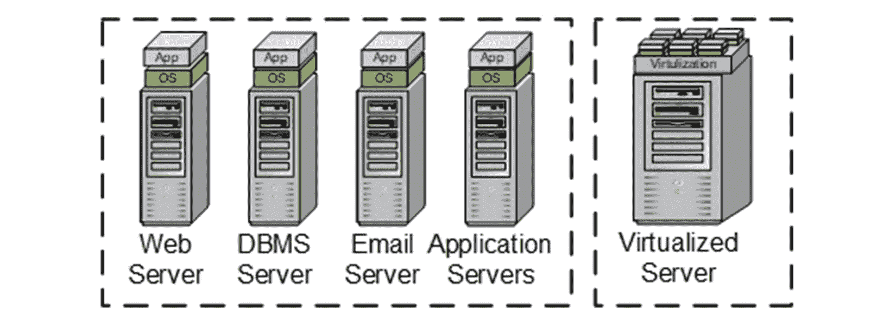
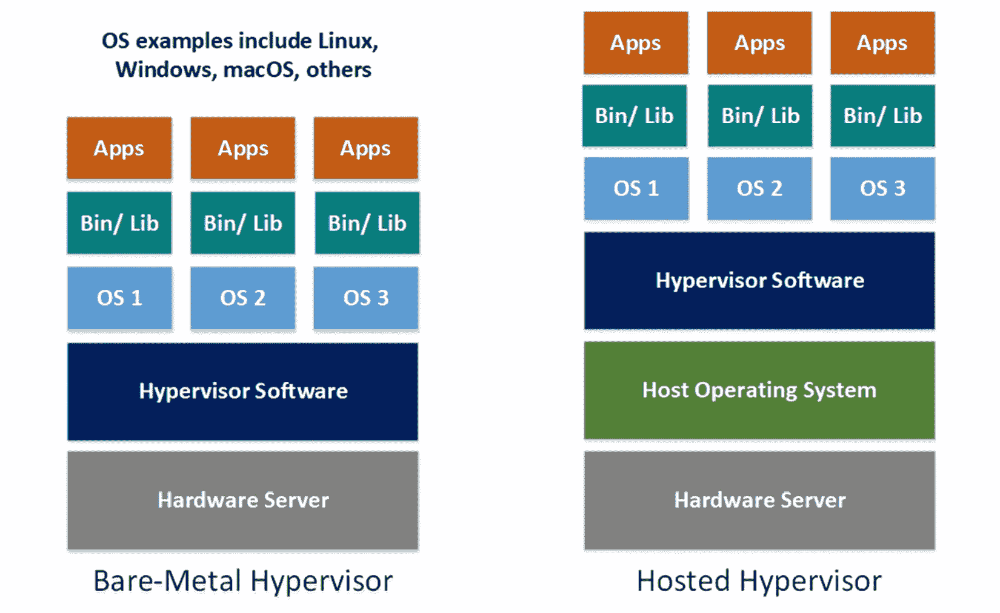
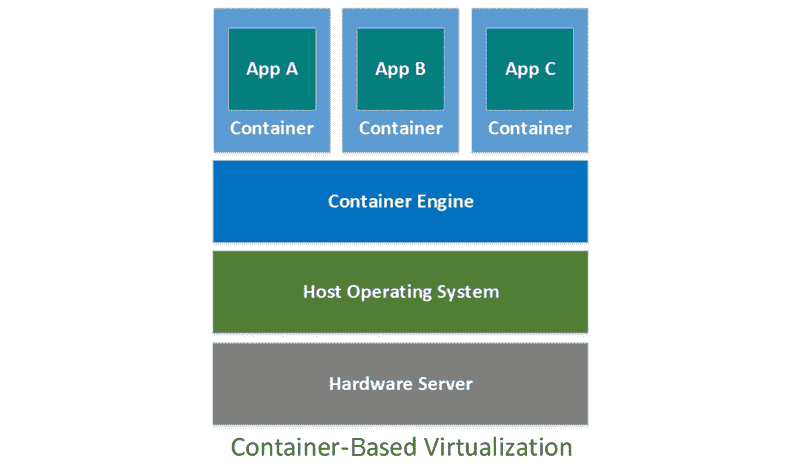
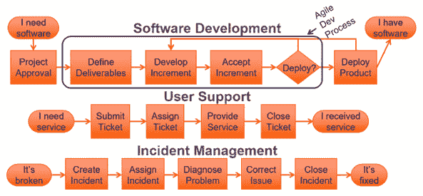
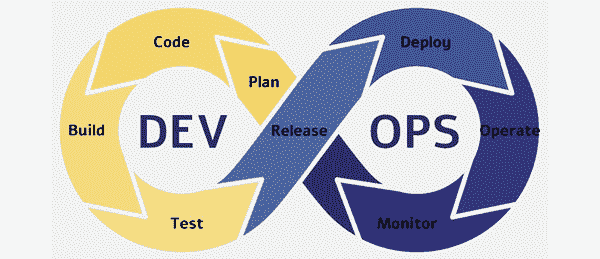
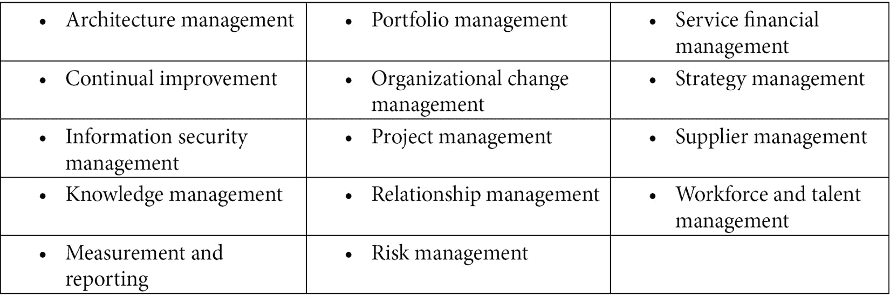
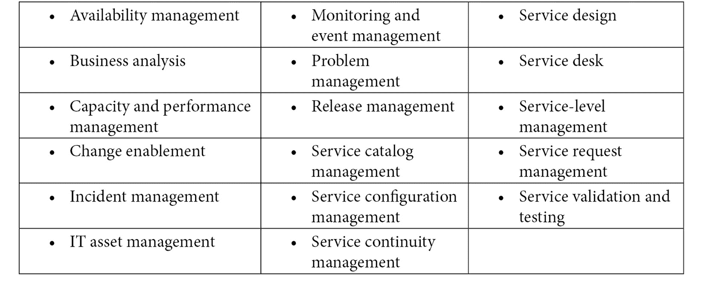
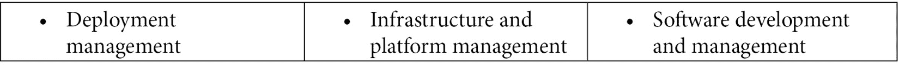

# *第五章*: 通过 DevOps 流水线推动商业价值

在前四章中，你学习了有多种不同的方式来定义“*价值*”这一术语，以及理解其在特定语境中使用的重要性。因此，我们花了一些时间学习这些术语，以确保在讨论如何使用**价值流管理**（**VSM**）和 DevOps 交付以客户为中心的价值时，能够拥有共同的语义理解。

你学习了精益（Lean）和敏捷（Agile）实践如何互补，帮助组织交付以客户为中心的价值。你还学习了为什么我们需要采取系统思维的视角，在大型复杂的组织中改善价值交付。

本章解释了 IT 组织如何以及为何代表着两大主要职能之间非常复杂的系统：**开发**和**运营**。在传统的 IT 组织中，开发和运营部门作为独立的部门运作，分别进行不同的活动，每个部门有不同的关注点和文化。这种人员和职责的分离只会增加 IT 组织的复杂性。

本章将解释为什么 IT 组织中的这种职能分裂可能会成为一个问题。你还将学习到一种合作与集成策略，可以用来解决这些问题。这个策略被称为**DevOps**，即开发和运营的合成词。

本章所介绍的主题是我们在*第二部分*中将讨论的 VSM 工具和方法实施之前必要的前提。

在本章中，我们将讨论以下主题：

+   打破障碍

+   通过 DevOps 流水线改善流程

+   理解虚拟化

+   定义**持续集成**（**CI**）

+   定义**持续交付**（**CD**）

+   启用 CI/CD 和 DevOps 流水线流程

+   理解 DevOps 的范围

+   集成**IT 服务管理**（**ITSM**）

+   从项目转向产品

在本书*第一部分*的最后一章中，你将了解开发具有竞争力的 DevOps 流水线能力所涉及的不同技术、投资组合层级的投入以及真正的复杂性。让我们从理解导致 DevOps 在软件行业演变的商业驱动因素开始这段介绍。

# 打破障碍

现在，只需在互联网上快速搜索，你会发现许多行业分析师和评论员会同意，DevOps 已经成为在现代数字经济中有效竞争的基础（Dietrich, 2019）。那些掌握开发和运营 IT 价值流中各类活动工具的集成与自动化的组织，在软件交付的速度、质量和效率上有着数量级的优势。

正如精益实践在制造业和其他服务型公司中改变了竞争格局，DevOps 也同样改变了 IT 行业。具体来说，DevOps 流水线实现了一种软件开发策略，这与制造业及其他行业中的精益生产流程概念相当。因此，那些有效实施 DevOps 流水线的组织，在响应新的市场机会、不断变化的竞争压力和客户需求时，具有显著的竞争优势。

此外，DevOps 是精益（Lean）和敏捷（Agile）实践的结合，简称为精益敏捷（Lean-Agile）。敏捷提供了指导以客户为中心的软件开发实践的价值观和原则；而精益生产概念则提供了经过验证的方法，旨在消除浪费并实现高效的软件价值交付。正如你将在本书*第二章*中学习到的那样，现代的价值流映射（VSM）方法和工具使得组织能够在其 IT 价值流中实施精益转型。

DevOps 的概念在 2008 年开始浮现。具体来说，Andrew Shafer 和 Patrick Debois 因在同年举行的敏捷大会上，在一次私人会议中首次讨论了这些概念而受到认可。随后，DevOps 在 2009 年 Patrick Debois 组织的第一次*DevOpsDays*大会上变得广为人知，该会议在比利时举行。

需要注意的是，DevOps 起初是在**敏捷系统管理**中作为一种协作策略开始的。其目标是克服敏捷软件开发团队之间的冲突，这些团队现在可以更频繁地交付新的软件产品和功能（即，提高了*速度*），而传统上更为保守的系统管理组织则不愿接受这种变更。

CI 能力，我们将在本章稍后介绍（见*定义 CI*），使得开发人员能够提高应用交付到 IT 运维功能的速度。然而，原先并没有多少集成的流程或协作文化来促进新软件产品频繁发布到组织的测试和生产环境中。

在传统的 IT 组织中，开发和运维是两个独立的职能。它们有不同的目标和任务，也有不同的思维方式。软件开发人员在变化的环境中蓬勃发展，不断交付新的功能和能力。这是件好事，因为客户和用户希望获得能够增加价值的新功能，而且越快越好。

另一方面，系统管理员不喜欢变更，因为他们负责确保所有网络、系统和应用程序的运行、稳定和安全。简而言之，变更可能会破坏他们的系统、基础设施和安全性。而他们的犹豫是件好事，因为我们需要确保网络和软件的正常运作和安全。

可以将文化差异理解为这样的对比：开发人员擅长进行变更，并且当他们发布支持客户和用户需求的新功能时，会获得奖励。相比之下，运营中的任何变更都是可怕的——因为这些变更可能会破坏已部署的网络、系统和应用程序。更糟糕的是，当系统发生故障时，系统管理员将受到责备，而他们自己将承受所有压力，直到系统恢复正常运行。

## 共享责任

首先，DevOps 是一种沟通和协作策略。在这种背景下，DevOps 的目标是让两个团队以协调的方式共同工作，信息双向流动。开发人员需要了解为什么他们的新版本在生产环境中失败。相比之下，运营团队需要有关安装配置、系统管理和支持信息的详细信息，以及产品发布是否已经通过系统测试、安全测试、性能测试、负载测试和压力测试进行彻底测试。然而，当开发和运营团队因各自的责任、期望的结果以及成功标准的差异而分开时，这种协作几乎是不可能的。

开发团队经常希望发布他们已经构建并测试过、并且认为准备就绪的新版本。但由于运营团队传统上与开发团队分开工作，运营团队会不愿意发布新版本，直到确认该产品不会在生产环境中导致故障或其他系统配置、性能或安全问题。

当开发团队实施新变更时，运营部门负责确保一切在部署中正常工作。例如，运营团队可能会进行**用户验收测试（UAT）**，这种测试本应在开发早期完成。如果软件失败，运营团队必须将错误和缺陷列表返回给开发团队，然后尝试将这些问题作为开发优先事项。

其他测试，如**性能测试**、**负载测试**、**压力测试**和**系统测试**，需要复制组织的生产环境。如果开发团队无法在其测试环境中完全复制生产环境，他们可能无法发现应用程序扩展中的潜在问题。这意味着，性能和集成问题可能要等到应用程序进入生产后才会被发现。即使那时，也可能需要一段时间，直到一组事件触发故障。结果，看起来像是运营团队的失误，实际上却是没有在类似生产环境中彻底测试系统的失误。

理想情况下，开发或运维团队会构建一个预生产或暂存环境，以模拟其生产环境。当这不可行时，运维团队可能被迫直接在生产环境中运行一小部分测试，尽管这样做是希望能够尽量避免问题，但仍然要做好应对最坏情况的准备。

运维团队的所有测试都需要时间来规划和执行。除此之外，这些测试只有在开发团队已经进入下一个迭代周期，开始开发新的特性和功能时，才会进行。运维团队发现的任何错误或缺陷都需要重新进入产品待办事项列表，以便重新排序和安排，这可能会延迟客户期待的新特性发布。而且，任何失败的发布责任和指责往往会转嫁到运维部门。

如果开发和运维团队仍然各自为政，这种文化上的障碍是无法解决的。利用你在*第二章*中学到的精益-敏捷概念，*构建在精益-敏捷基础之上*，组织需要整合、简化并协调信息和工作的流动，跨越 IT 开发和运维团队。

组织必须消除那些使这些职能相互隔离的障碍。对于较小的组织来说，消除沟通障碍可以简单地通过在每次发布之前让两个团队提前进行良好的沟通。然而，较大的组织可能拥有多个产品线、多个软件开发团队，甚至不同的运维支持团队。在这些情况下，沟通、整合和同步的挑战呈指数级增长。对于大型组织来说，消除开发和运维之间的隔阂的唯一实际方法是将这两项职能整合到产品团队或产品线中，并让每个团队成员对每次发布的速度和质量负有同等责任。

这种战略的实际影响是，开发和运维的活动必须与每个正在开发的产品紧密关联、简化并同步。换句话说，开发和运维需要作为一个单一的产品团队进行协作。

产品团队成员共同负责每一个新特性的发布，从创意到交付。产品团队还需要有效地支持产品生命周期中的运维相关活动。

另一个问题源自两个 IT 组织——开发和运维——的速度不同。传统上，运维团队需要更多的时间来管理将新版本部署到组织的生产环境中所带来的风险。速度上的不匹配会造成瓶颈，进而减缓新特性发布到生产环境的速度。

在下一部分，你将学习现代**CI**和**CD**功能如何解决这些问题。

# 通过 CI/CD 管道改善流动

在*第六章**，启动 VSM 倡议（VSM 步骤 1-3）*到*第十一章*，*识别 VSM 工具类型和功能*，我们将使用你在本节中学到的概念作为一个用例，介绍如何利用八步 VSM 方法学来改善 CI/CD 管道中的工作和信息流。然而，在进入该用例之前，我们需要对 CI/CD 管道的目的、其组成活动以及实现完全集成和自动化工具链的复杂性有一个基本的理解。这些就是我们将在本小节中讨论的话题。

CI/CD 工具链使得软件开发生命周期中的工作项和信息流能够在管道中流动。另一种有用的方式来看待 CI/CD 管道是，它们使得在 IT 价值流中实施精益生产理念成为可能。在我们讨论 CI/CD 管道的组成部分之前，先来回顾一下其两个组成元素的目的：

+   **CI**：这提供了基础设施，允许多个软件开发者甚至不同的开发团队在开发中的软件产品上实现并测试代码更改。

+   **CD**：这使得开发、测试和生产环境的自动化配置成为可能，作为**可配置项**。

支持 CI/CD 管道实施的三个关键能力和相关工具如下：

+   **配置管理**（**CM**）

+   任务管理/自动化

+   容器化

让我们更详细地看看这三种支持技术和工具。

# 建立 CI/CD 管道的工具

CM 帮助我们跟踪和管理构成每个软件发布的 CI 的正确版本。可配置项是一个系统组件或关联信息文档，已被唯一标识用于版本和变更控制以及标识目的。**源代码管理**（**SCM**）工具帮助开发人员维持源代码和其他 CI 的版本控制。

Git 和 GitHub 是两种比较知名的源代码管理（SCM）工具。但还有其他工具，如**Apache Subversion**（**SVN**）、Azure DevOps Server（前身为 Team Foundation Server）、Bazaar、Bitbucket Server、CVS、GitLab、Gerrit、Kallithea、Mercurial、Monotone、Perforce Helix Core、Rational ClearCase，以及**版本控制系统**（**RCS**）。

**任务管理**工具促进了 CI/CD 和 DevOps 工作流的自动化。在 CI/CD 和 DevOps 平台中，软件行业将自动化的工作流称为管道（pipelines）。通常，CI/CD 工作流自动化了规划、设计、开发、测试、供应和交付软件发布的管道活动。此外，任务管理还支持跟踪工作项的进度，监控和分析管道中的关键指标，并报告结果。

一款广为人知的任务管理工具是 Jenkins，它以其社区被誉为提供行业领先的开源自动化服务器。Jenkins 用于自动化软件的构建、测试和部署过程，在 CI/CD 环境中运行。尽管 Jenkins 是免费的，但一些人认为它已经过时且使用繁琐。Jenkins 有一些替代品，包括 AutoRABIT、Bamboo、Bitrise、Buddy、Buildkite、CircleCI、CruiseControl、FinalBuilder、GitLab CI、GoCD、Integrity、Strider、TeamCity、UrbanCode 和 Werker。

**容器化**是一种机制，用于将应用程序的代码及其相关的配置文件、库和其他依赖项打包，以便在目标硬件环境中运行应用程序。从概念上讲，容器实现了一种虚拟化策略，以最大化计算资源的利用率。

在虚拟化技术出现之前，组织必须为运行特定应用程序（如电子邮件、基于 Web 的应用程序和后台业务应用程序）专门配置服务器。拥有专用应用服务器极其低效且不灵活。

两种广为人知的容器技术是**Docker**和**Kubernetes**，它们共同协作。Docker 是开发人员用来构建和部署容器的软件工具，而**Kubernetes**（即**k8s**或**Kube**）负责协调和管理集群中的多个容器。协调是必要的，用于调度和自动化容器化应用程序的部署、管理和扩展。

与 SCM 和任务管理一样，行业中也有许多 Docker 和 Kubernetes 的替代工具。Docker 的替代品包括 Canonical（Ubuntu）、**Linux Containers**（**LXD**）、CoreOS rkt、**Open Container Initiative**（**OCI**）、LXC Linux Containers、Mesos Containerizer 和 OpenVZ。Kubernetes 的替代品包括**Amazon ECS**（**Elastic Container Service**）、AWS Fargate、AZK、**Azure Kubernetes Service**（**AKS**）、Cloudify、Containership、**Google Kubernetes Engine**（**GKE**）、OpenShift、Marathon、Minikube、Nomad 和 Rancher。

如果你认为支持这三种技术的工具数量让人不知所措，那就等着看看我们将在稍后探讨的支持整个 DevOps 工具链的更多工具选择吧。这些工具只是 DevOps 管道工具的一个小子集，既有商业化工具，也有开源工具。稍后在 *第十一章*中，*识别 VSM 工具类型与功能*，你将了解到支持 DevOps **价值流交付平台**（**VSDP**）的工具有 17 个类别，且超过 400 种工具可以供选择。

我们将在本章稍后重新审视这三种技术。然而，在深入探讨容器化之前，你需要理解虚拟化背后的基本概念。

# 理解虚拟化

IT 组织，尤其是大型 IT 组织，需要最大化其计算资源的灵活性、利用率和可扩展性。没有虚拟化，这些目标很难（甚至不可能）实现。虚拟化是 IT 组织用来简化操作并更快响应不断变化的业务需求的方法。

虚拟化提供了一种实际的方法，将应用程序分布在任意数量的计算设备上。例如，在许多情况下，由于负载需求过高，单一计算设备不足以运行业务应用程序。在一个相关的例子中，应用程序的需求负载会随着时间变化而波动，覆盖整个组织的应用程序。虚拟化提供了一种方法，可以在服务器间重新分配负载，随着需求变化，确保关键需求应用的高可用性，同时简化应用程序的部署和迁移过程。

此外，现代数据中心使用部署在机架中的服务器以最大化计算资源的利用率。虚拟化使得协调使用机架式服务器成为可能，从而最大化资源的利用。这些基于机架的服务器策略减少了计算设备的功耗和空调需求；此外，还减少了数据中心对土地和设施空间的需求。

## 虚拟化数据中心资源

虚拟化创建了一个逻辑（虚拟）计算环境，它位于物理计算环境之上。每个虚拟化环境模拟了硬件、**操作系统**（**OSes**）、存储设备以及运行特定软件应用所需的其他系统和安全组件。

虚拟化使得 IT 组织能够将单个物理计算机或机架服务器划分为**虚拟机**（**VMs**）。每个虚拟机独立运行，并且可以在共享单一主机资源的同时运行不同的操作系统或应用程序。

虚拟化的主要好处是，每个物理计算系统可以管理多个虚拟环境，从而最大化其利用率。此外，IT 部门可以自动化构建和拆除虚拟环境，以匹配需求负载和业务应用的需求，从而最大化 IT 组织的响应能力和灵活性。

虚拟化概念使用特定的语义描述来区分物理环境与虚拟化环境，以及主机与客户机。主机是用于虚拟化的物理机器，而客户机是虚拟机。主机与客户机的术语使得区分运行在物理机器上的操作系统与运行在虚拟机上的操作系统变得更为简单。

## 使用虚拟机监控程序软件进行虚拟化

*图 5.1*展示了传统应用服务器架构（左侧）和虚拟化服务器架构（右侧）。该图清楚地表明，传统模型需要为每个应用程序需求配备独立的计算机作为服务器。相比之下，虚拟化的主机通过共享其资源为所有虚拟化的客户机及其应用程序提供支持：

图 5.1 – 传统（左）与虚拟化（右）服务器

在原始虚拟化模型中，**虚拟机监控程序**（即*虚拟机监控器*，*VMM*，或*虚拟化程序*）安装在主机上，以便多个虚拟机作为客户机在一台物理服务器上运行。虚拟机监控程序是一种轻量级操作系统，作为抽象层将应用程序及其所需的操作系统与服务器的操作系统隔离开来。

虚拟机监控程序有两种工作模式：

+   **裸金属虚拟机监控程序**在单一硬件服务器上运行多个操作系统。

+   **托管虚拟机监控程序**安装在硬件标准操作系统之上，但将虚拟化应用程序的操作系统隔离开来。

*图 5.2*展示了两种标准虚拟机监控程序软件实现模型，即裸金属和托管模型：

图 5.2 – 虚拟机监控程序软件实现模型

使用虚拟机监控程序软件进行虚拟化的好处包括：

+   它在配置虚拟机时提供更高的速度、效率和灵活性，而不需要为每个软件应用程序安装一台或多台物理服务器。

+   它允许多个操作系统驻留在同一台主机上。因此，软件应用程序无需重新编写即可在主机的操作系统上运行。

+   所有虚拟化的应用程序共享相同的虚拟计算、存储和内存资源，从而减少了计算设备的需求、机房空间、能源成本和设备维护成本。

+   它通过简化和加速创建和恢复快照映像来提高灾难恢复能力。

+   它简化了将测试环境创建为虚拟机（VM）的过程。

为了更好地理解虚拟化的强大功能，在大型企业中，通常会有成千上万的服务器专门用于支持一个关键的业务应用程序。事实上，最大的商业数据中心可能会在成千上万的机架上部署超过一百万台服务器，运行着为无数客户提供服务的各种应用程序。

这些数据中心提供基于云的服务，网络上托管了远程服务器。随着时间的推移，数据中心可能会采用不同的技术。服务器虚拟化对于外部客户的数据存储、管理和处理至关重要，无论其底层物理环境如何。

然而，事实证明，基于虚拟机监控程序的虚拟化并不是一个完美的解决方案。由于虚拟机监控程序软件模拟虚拟硬件，它必须包含所有客户端机器的应用程序操作系统和系统功能，使得它们相对低效。

在接下来的子节中，你将学习容器如何通过共享轻量级操作系统来解决这些问题。

# 使用容器进行虚拟化

容器和虚拟机监控程序都能使应用程序更快、更具可移植性，并且更高效地部署。然而，它们实现这些目标的方式不同。你已经学过，虚拟机监控程序软件通过在宿主机的环境上实现一个轻量级操作系统。而与此不同，容器的操作系统比虚拟机监控程序软件更小、更高效。容器将应用程序及其依赖项打包，并将它们作为宿主机上的操作系统进程运行。

容器包可以在安装了容器引擎的任何地方运行。例如，请参考*图 5.2*，了解基于容器的架构的图示，然后将其与下图所示的虚拟机监控程序虚拟化架构进行比较：

图 5.3 – 基于容器的虚拟化

乍一看，基于容器的虚拟化模型看起来与托管虚拟机监控程序模型相似。它们都在宿主操作系统和应用程序之间提供一个抽象层。然而，虚拟机与虚拟机监控程序通过隔离硬件及其操作系统来运行虚拟化应用程序的完整操作系统。相比之下，容器引擎在硬件操作系统之上提供一个抽象层，使得应用程序能够直接运行其首选的操作系统，而无需使用安装在虚拟机上的操作系统。

商业操作系统，如 Linux、Windows 或 macOS，需要提供许多常见服务，以支持在其安装的硬件上运行的计算机应用程序。然而，大多数服务并不是单个应用程序所需要的。因此，容器不包含完整的操作系统——只有运行其支持的应用程序所必需的最基本元素。

基于容器的虚拟化方法比基于虚拟机监视器的虚拟机更加轻量级和灵活。例如，虚拟机可能需要几十 GB 的空间，而容器可能仅需几十 MB。此外，由于每个容器的操作系统是自包含的，因此容器通常更安全，因为对恶意行为（例如通过恶意软件或入侵攻击）的入口点较少。

隐喻上，容器扮演着一种运输功能，模拟了用于通过船舶、火车和卡车移动物理产品的集装箱（例如，一种容器类型从起点到最终目的地）。在软件类比中，开发人员通过容器构建产品，并将其部署到目标主机环境。但在我们的软件类比中，容器将应用程序及其在目标主机物理环境中运行时所需的资源一起作为虚拟化客户端。

这些资源包括代码、运行时、系统库、系统工具和配置设置。容器被构建为*镜像*，与其运行时环境分开。因此，它们可以在任何地方部署 - 只要目标环境安装有容器引擎，比如 Docker Engine。

在软件开发的现代方法中，特别是在面向 DevOps 的流水线中，将定义和创建非常小的代码片段作为独立服务，称为微服务。基于微服务的开发策略允许将新功能快速编码、测试和部署到生产环境中 - 这通常可以是每天多次。在概念上，微服务方法模仿了精益生产实践中单件流概念的概念。

您将了解在*第七章*中实施单件流的价值，*映射当前状态（VSM 第 4 步）*，以及*第八章*，*识别精益指标（VSM 第 5 步）*。目前，重要的是理解单件流代表最高效的精益开发流程。

容器引擎提供两项关键服务：**集群**和**编排**。集群将两个或多个服务器连接为一个虚拟化的计算机。服务器的集群允许它们并行操作，容器引擎管理跨服务器集群的负载均衡和容错活动。

容器编排自动化容器的部署、管理、扩展和网络配置。在调度数百或数千个由微服务组成的单个容器时，编排至关重要，这些微服务跨多个集群运行。

当使用软件容器时，软件开发人员无需担心在多种生产环境中部署，也不用担心硬件资源的虚拟化；容器具有在桌面、组织后端服务器或云中提供应用程序运行所需的一切。

## 兼得其利

IT 组织可以在部署和管理应用程序时，通过部署虚拟化策略，例如半导体和基于容器的虚拟化策略，来最大化其灵活性。两种虚拟化技术，即半导体和容器引擎可以在同一台物理服务器上共存。

在基于云的环境中，容器表现良好，并且当开发人员希望构建称为微服务的细粒度服务时，容器表现良好。没有太多传统应用程序的 IT 店可能更倾向于从一开始采用这种方法，因为微服务提供了构建、测试和部署新 IT 服务的最大速度和灵活性。

另一方面，虚拟机提供了所有成熟操作系统中可用的管理功能和安全工具。虚拟机提供了消除与底层硬件兼容性问题的**硬件抽象层**（**HAL**）。虚拟机有效地利用了内存容量和多核 CPU 中的多个核心，允许在每个物理系统上合并大量应用程序和任务。实际上，虚拟机非常适合运行需要持久性和高事务量工作负载的应用程序。例如，具有大型事务数据库的应用程序——考虑需要具有弹性和持久性后端的银行 ATM，不得丢失数据，并且具有高**输入/输出**（**I/O**）事务需求。最后，一些第三方应用程序尚未采用容器模型，可能也不会采用。

现在您了解了支持 CI/CD 所需的必要工具，我们可以介绍包括在 CI 和 CD 进程中的活动类型。我们将从定义 CI 的活动开始。

# 定义 CI

从根本上说，CI 是一种加快软件开发速度的开发方法。CI 在技术层面上强制执行一种纪律，即将所有开发者的代码工作副本几次每天合并到共享存储库中。其目的是通过软件构建和测试过程验证每个增量代码集成的功能。其目标是确保主要软件代码始终处于工作且可能部署的状态。

成熟的 CI 流水线包括自动化构建和自动化测试功能；尽管这两种功能不是原始定义的一部分。今天，CI 工作流程涵盖了从主分支（即主线代码、主干或主）获取每个新代码提交，并运行适当步骤以验证该提交的过程。

基本的 CI 流水线涵盖以下软件开发活动，如*图 5.4*所示：

图 5.4 – CI 管道流程

上面的图示是一个更复杂过程的高层次视图。作为复杂性的一个例子，以下任务通常通过 CI 自动化服务器（如 Jenkins）来管理：

+   将源代码移至版本控制系统。

+   管理版本控制系统的推送、拉取和合并功能。

+   执行软件构建过程（例如，编译源代码，链接目标文件和库，以及打包库和工具）。

+   执行静态代码分析。

+   运行自动化单元测试。

+   执行代码覆盖率分析。

+   提供测试服务器。

+   设置测试环境（例如，设置测试环境的代码，并在测试完成后将其恢复到原始状态）。

+   运行自动化测试。

+   发布日志和报告。

+   将信息发送给开发者。

CI 过程看起来是一项繁重且高度复杂的工作——确实如此，特别是在作为手动过程实施时。然而，作为自动化的 CI 过程，完整的反馈循环应该在 10 到 20 分钟内完成。目标是使这个过程快速且简单到，开发者每天都能毫不犹豫地多次启动它。

CI 策略解决了两个根本性问题。第一个问题是确保每一块新代码在变更成为主代码的一部分之前，能够根据需求和验收标准正确实现其功能。第二个问题是确保新集成的代码不会在应用程序的主干代码中引起问题或错误。

## 鼓励频繁测试

从根本上来说，CI 是一个用于快速且频繁地开发和测试小增量新功能的软件开发过程。这个策略支持《敏捷软件开发宣言》中的第一条和第七条原则（Beck 等人，2001 年）。

《敏捷宣言》原则 1 和 2

1) 我们的首要任务是通过早期和持续交付有价值的软件来满足客户需求。

2) 可工作的软件是进展的主要衡量标准。

请参阅 [`agilemanifesto.org/principles.html`](https://agilemanifesto.org/principles.html) 获取更多详情。

虽然第一条原则很有价值，但事实证明，第七条原则通常更为重要，至少在持续集成（CI）的好处方面是如此。让我们花点时间来理解为什么。

在传统的瀑布模型中，软件开发者在启动任何测试之前，首先创建实现所有已识别需求的所有代码。这个开发策略的一个重大问题是，当代码集越来越大时，软件漏洞的源头变得越来越难以定位和解决。一个更好的策略是，每一步都对新代码的小增量或单元进行测试。这样做的好处是，当测试中出现错误或漏洞时，开发者可以更准确地知道他们在代码中做了什么修改。

此外，频繁的代码更新有助于识别代码合并冲突、代码策略的分歧以及重复尝试。换句话说，借助 CI 和自动化测试，开发人员必须在问题出现时立即处理这些问题，而不是等到它们变得极其复杂、耗时且昂贵时才解决。

本节结束了我们对 CI 的讨论。接下来，我们将学习 CD 功能如何增强和改善软件交付中 CI 阶段的速度。

# 定义 CD

CD 功能使产品团队能够快速搭建新的环境，以最小的人工干预测试新的代码更新。CD 的主要目标是将新更新转变为常规的、高速的任务，开发团队可以按需执行。

正如 CI 具有一系列连续的步骤，CD 过程也如此，如*图 5.5*所示：

图 5.5 – CD 管道流程

上述图表中展示的 CD 管道视图提供了一个高层次的视图，类似于 CI 管道，它也可以被分解为一系列相关活动的更长列表。这些活动可能包括以下内容：

+   进行静态代码分析

+   进行单元测试

+   进行 API 测试

+   部署到测试环境

+   并行测试（例如，可用性/可访问性测试、探索性测试、UI 测试和性能测试）

+   部署到预生产环境

+   执行应用程序测试（例如，验收测试、探索性测试、容量测试、负载测试和压力测试）

+   执行软件和网络安全测试

+   进行用户验收测试（UAT）

+   将应用程序部署到生产环境

再次强调，这个列表并不打算全面总结团队可能需要执行的所有测试。

一个最终的评论是，CI 作为一个过程的结束与 CD 开始之间并没有明确的界限。例如，一些分析师将合并代码过程——一个源代码集成活动——放在 CI 管道中，而其他人则视其为 CD 管道活动。实际上，CI/CD 管道代表了整个**系统开发生命周期**（**SDLC**）中的连续流程。除了为了传达每个管道部分的工作类型外，没有理由去做这种区分。

一旦开发团队确定了要运行的测试和所需的工具，他们可以通过编写机器可读代码中的配置指令来自动化测试的执行。

## 通过代码自动化配置任务

在 CD 方法和工具出现之前，开发团队必须要求运维人员设置测试和预生产环境。然后，运维人员手动按照配置文档中的指示设置网络、计算设备和软件。这样的手动过程既昂贵又耗时。

在现代的持续交付（CD）环境中，开发人员可以将软件和系统配置指令作为机器可读的代码进行部署。此外，这些配置可以在源代码控制库中进行管理，并作为自助服务提供，供快速部署使用。基础设施和软件资源在云环境中按需提供，并在执行机器可读代码后几分钟内即可使用。

软件行业中用来描述自动化部署配置的术语是基础设施即代码（IaC）。然而，您可能也遇到过“配置即代码”（CaC）这一术语，它是单个 IT 从业者和供应商用来表示将配置作为源代码进行实现的通用说法。我们将在本章后面讨论 IaC 和 CaC 之间的语义差异。

目前，理解基础设施即代码（IaC）和配置即代码（CaC）如何通过机器可读的代码实现配置指令，用于按需搭建和配置环境以及软件至关重要。在详细讨论 IaC 和 CaC 之前，让我们首先理解为什么配置管理（CM）如此重要，以及为什么某些配置项不能以代码形式进行部署。

基础设施和软件配置广泛地属于**软件配置管理**这一学科，具体内容请参见以下小节。

## 保护我们的软件资产

复杂的软件发布涉及部署和配置大量硬件、网络和应用安全、软件组件及其他相关信息工件。配置管理确保我们对构成每个独特软件发布的状态和工件有一个完整的理解。没有这些信息，我们很难，甚至不可能，回溯修复 bug 和缺陷、维持产品或增强以前的软件版本。

随着软件的演进，每个新版本都有其独特的配置。每次发布时，某些组件会发生变化，而其他组件则不会。尽管所有组件可能从相同的版本控制编号开始，但随着时间推移，这些版本控制 ID 会在软件组件和其他信息导向的工件之间有所不同。因此，单单给发布版本分配一个版本控制 ID 是不够的。我们需要了解构成该发布的每个信息工件和软件组件的具体版本。

现代版本控制库，如 Git（本地仓库）和 GitHub（基于 Web 的协作源代码管理平台和仓库），使用树状结构作为隐喻来管理与每个软件发布相关的配置项。

回到应用于软件配置管理（SCM）仓库的树形隐喻，开发人员会创建（并演化）、集成和测试作为应用程序独立*分支*的组件，然后再将它们与主*干*代码合并。主代码是任何给定时间点上最接近发布的代码集。并不是说主代码一定能发布，但它在集成功能和测试方面是最为成熟的。

然而，除了追踪源代码外，我们还需要追踪与每次发布相关的所有其他信息工件，这就是软件配置管理（SCM）的目的。

在软件配置管理（SCM）下的信息和软件工件涵盖了整个软件开发生命周期（SDLC）过程，包括以下内容：

+   **软件需求**：这包括在规范、用例、史诗和用户故事中指定的功能性和非功能性需求。

+   **环境**：这包括网络交换机、防火墙、路由器、服务器、操作系统、安全网络系统、数据库和其他关键基础设施元素。

+   **软件构建**：这包括编译、链接和将源代码文件转换为独立软件工件的指令，以便它们可以在计算机上运行。

+   **软件发布计划**：这提供了如何将产品发布到生产环境中的指示，包括其时间表、交付日期以及面向生产的测试要求，如**用户验收测试（UAT）**、质量保证（QA）测试、预生产测试（例如压力测试、负载测试和性能测试）以及现场测试等。

+   **软件评审**：这可能包括同行评审、**软件质量保证**（**SQA**）评审或由第三方进行的**独立验证与验证**（**IV&V**）测试。

+   **版本控制**：这包括当前和过去所有软件系统组件及相关工件的版本信息，通常在源代码控制仓库中进行管理。

+   **配置项**：这包括所有软件组件和工件，它们由独立的名称和版本控制 ID 标识，并属于特定的发布版本。

+   **测试信息**：这包括与每次软件发布相关的测试用例、测试脚本、测试场景和测试结果。

+   **用户支持**：支持团队的信息提供用户帮助指南，并在产品实施和使用过程中协助解决用户问题。

+   **文档**：这可以包括培训工具、系统管理文档、架构和设计文档。

+   **问题跟踪**：这用于记录与缺陷和漏洞相关的信息。漏洞是由编码错误引起的，而缺陷则是已识别的与需求偏离的地方。

+   **任务管理**：这用于维护开发和交付生命周期中活动的信息。

大多数与版本发布相关的信息组件并不属于应用程序的源代码。因此，产品团队必须实施流程和系统，记录并维护每个产品版本的这些信息。我们需要按版本管理所有这些信息，以确保在生产环境中的可操作性和可持续性，发现后修复错误或缺陷，并在产品生命周期内进行改进。

现在我们了解了更重要的软件配置问题，让我们来看一下管理和执行 CaC 与 IaC 之间的区别。我们将从描述 CaC 开始。

### CaC

CaC 是一个广泛的术语，意味着在源代码库中实现配置文件，但该术语通常更广泛地应用于应用程序的配置信息。CaC 的目的是促进在不同环境之间迁移应用程序配置的版本化。

CaC 配置通过配置文件以机器可读的代码形式实现，重点关注安装软件应用程序、服务器和操作系统所需的设置和参数。开发人员通过 CaC 指定配置设置，参数可以更改以影响目标信息系统的远程硬件、软件或固件组件。这些配置设置和参数会影响系统的安全级别和功能。

必须在 IT 产品中实现和维护几乎无尽的潜在配置，特别是在可以定义与安全相关的配置设置的产品中。美国**国家标准与技术研究院**（**NIST**）*特别出版物 800-53（第 4 版）*列出了以下可配置项目的示例：

大型主机、服务器（例如，数据库、电子邮件、身份验证、Web、代理、文件、域名）、工作站、I/O 设备（例如，扫描仪、复印机和打印机）、网络组件（例如，防火墙、路由器、网关、语音和数据交换机、无线接入点、网络设备、传感器）、操作系统、中间件和应用程序（[`nvd.nist.gov/800-53/Rev4/control/CM-6`](https://nvd.nist.gov/800-53/Rev4/control/CM-6)）。

NIST 出版物还列出了标准的安全相关参数，如下文所示：

与安全相关的参数会影响信息系统的安全状态，包括满足其他安全控制要求所需的参数。

(i) 注册表设置，

(ii) 账户、文件、目录权限设置，

(iii) 功能、端口、协议、服务和远程连接的设置。

已建立的设置成为系统配置基准参数的一部分。在手动过程中的软件开发人员会创建安全配置检查清单、锁定和加固指南、安全参考指南和安全技术实施指南。操作人员根据这些指南正确配置系统和应用程序。CaC 的价值在于它自动化并简化了配置设置和参数的建立过程。

与 CaC 相对，IaC 是关于配置 IT 基础设施，包括服务器、网络、负载均衡和安全性，如以下小节所述。

### IaC

正如其名称所示，IaC 允许开发人员使用编程或脚本语言生成一组可重复的代码或脚本指令来配置 IT 基础设施。通过 IaC 功能，开发人员不需要手动配置或更改基础设施组件的配置，例如服务器、操作系统、数据库连接、存储、网络、虚拟机、负载均衡器和网络拓扑。

如果没有 IaC 功能，开发人员必须每次都手动设置和配置新的系统环境，当他们想要开发、测试或部署软件应用程序时。从精益的角度来看，因此从客户的角度看，这些活动是不必要的重复且没有增值的。这并不是说这些活动不必要。然而，自动化这些过程能提高周期时间，并消除以人为或其他错误形式的浪费。

人为错误的问题尤其令人担忧，因为配置错误的积累会导致**环境漂移**，其中每个新的环境配置都与以前的配置截然不同。开发人员称这些新配置为*雪花*，因为它们有一个相似的特征——每个配置都是独一无二的。

#### 管理环境漂移

环境漂移的问题在于，每次系统配置的更改都可能影响之前部署的资产。回想一下，操作的功能是保持环境和应用程序的稳定、安全和可用。然而，假设某个开发人员未能将新的配置更改通知基础设施或应用程序，那么这些修改可能导致生产环境失败或暴露于与安全相关的风险。

对于工程和测试环境，情况也是如此。配置更改使得从配置变化而不是代码中的 bug 或缺陷中隔离和修复错误变得越来越困难。同样，每个新的配置更改都可能引入以缺陷形式的浪费，这些缺陷需要花费大量时间和成本来解决。

有无数的问题会导致环境漂移。然而，这些配置变更大多数来源于文档不当、沟通不畅或在搭建服务器、配置网络或其他计算资源时引入了新的或修改过的参数。

上述示例显示人类错误是根本原因。计算机在执行通过代码精确描述的配置时更擅长执行重复指令。然而，这些类型的错误可以在测试过程中被发现，从而避免负面后果，并限制新发布版本进入生产时的风险。

#### 避免配置错误

与 CaC 概念类似，开发团队使用 IaC 编写脚本或代码来描述配置设置和参数。每个配置文件代表一个单一的、权威的环境定义来源，并随时间推移更新环境设置。

代码或脚本被保存为独立的配置文件，并检查到开发团队的版本控制和 SCM 系统中。将 IaC 文件管理在 SCM 系统中的好处是，可执行的例程通过自服务模型自由地提供给所有开发人员和运维人员。

换句话说，CaC 和 IaC 有助于提升软件交付速度，同时减少错误。

#### 提高交付速度的同时减少错误

通过 CaC 和 IaC，IT 人员可以按需下载并执行配置文件，在几分钟内搭建新的环境而不引入人工错误。自服务模型意味着开发人员无需涉及运维团队即可搭建和配置新的测试环境。此外，运维团队可以确保在发布新版本到生产环境之前，代码和配置已经过充分的测试。

IaC（基础设施即代码）使得持续交付（CD）能够达到与开发人员通过其持续集成（CI）工具所能获得的相同速度。通过 CI/CD 流水线，开发人员可以实时更改代码和配置，并快速搭建测试环境，以确保一切正常运行。此外，高效的团队每天可以部署多次新功能，且交付时间不超过 1 小时（Forsgren 等，Accelerate，2018）。

IaC 是指定 CI/CD 和 DevOps 流水线配置及流程的关键工具。手动配置过程过于缓慢且效率低下。如你将在《VSM、CI/CD 和 DevOps 流水线》章节中发现的，当这些流程得到充分实施时，CI/CD 和 DevOps 流水线能够在所有 IT 价值流中实现精益生产概念。

然而，在我们深入这些章节之前，我们需要理解 CI/CD 和 DevOps 流水线如何支持整个 IT 价值流中的工作和信息流。

# 启用 CI/CD 和 DevOps 流水线流程

本书清楚地区分了 CI/CD 和 DevOps 工具链及流水线：

+   工具链是多个工具的组合，这些工具共同执行一组特定的 IT 任务或功能。这个术语可能包含集成或自动化策略，也可能不包含，因此有些模糊。

+   DevOps 流水线和 CI/CD 流水线包括一系列集成工具，用于简化和自动化 IT 任务或功能，贯穿整个 IT 价值流。流水线更类似于本书后续介绍的精益和 VSM 概念。现在，让我们将 CI/CD 和 DevOps 流水线理解为提高软件价值交付的速度和可靠性。

**工具链**（toolchain）一词指定了支持 IT 价值流活动的一系列工具。仅仅这个术语本身并不一定暗示集成或自动化策略。虽然不是最理想的情况，开发人员仍然可以手动设置以下工具，以便与之前工具的输出相对应。

更好的策略是通过集成和自动化工具链来提高效率，从而协调和简化工作和信息流。在此背景下，**流水线**（pipeline）一词表示流动。对于精益生产理念，我们希望工作和信息能够在 IT 价值流中实现简化和高效流动。

CI/CD 和 DevOps 工具链已经集成并自动化，以支持在所有 IT 价值流中高效、简化的工作和信息流。当工具被集成并自动化，以支持简化和高效的工作和信息流时，CI/CD 和 DevOps 工具链被称为*流水线*（pipelines）。

## 改善流水线流

工具链与流水线之间的区别非常重要。例如，一个基于敏捷的软件开发团队可以采购一组工具，这些工具共同构成一个工具链。然而，在项目驱动的运营模式下，团队不太可能有足够的时间或预算来实施集成或自动化的工具链。

在这种情况下，敏捷团队无法像实施完整流水线的产品导向团队那样实现相同的生产效率。由于产品团队贯穿其产品生命周期，因此他们能够证明并摊销 CI/CD 和 DevOps 流水线工具链的投资。

然而，敏捷团队有一种解决办法。例如，敏捷团队可以通过商业或内部 DevOps 平台提供商，作为基于云的服务访问集成和自动化的工具链。你将在本书的*第三章*了解更多这些选项。在本章的其余部分，我们将超越 CI/CD 活动，探讨与 DevOps 相关的全面活动。

## 理解 DevOps 的完整范围

CI/CD 活动只能将我们带到传统的 SDLC 过程，即从概念到部署。但是 IT 组织还必须维护和支持其软件应用程序。在本章的剩余部分，你将学习到 DevOps 超越了软件开发和交付，确保已部署软件产品的适当生命周期支持。

虽然 DevOps 仍然包括你在本章中学习的基本 CI/CD 活动，但 DevOps 的总体工作范围扩展到了涵盖软件生命周期的所有阶段。这些阶段包括以下内容：

+   构建自动化和 CI

+   测试自动化

+   CD 和供应

+   部署自动化

+   操作、监控、支持和提供反馈

+   发布协调和自动化

让我们讨论一下这些活动在软件开发和交付的 CI/CD 阶段之外的内容。在以下小节中，我们将开始定义 CI/CD 流水线和 DevOps 流水线之间的边界。

## 定义 CI/CD 和 DevOps 流水线的边界

正如你在本章开始时所学，DevOps 最初作为一种协作策略，旨在实现敏捷系统管理。其主要目标是作为一种风险管理策略，改善 IT 开发和运维团队之间的信息流。然而，DevOps 必然会发展以解决速度不匹配的问题。换句话说，运维服务的速度需要与基于敏捷的开发团队的速度相匹配。

在传统的 IT 行话中，我们使用术语 SDLC 来指代由开发团队实施的 IT 价值流活动和工具。相比之下，运维团队使用术语 **ITSM** 来描述与设计、创建、交付、支持和管理与 IT 服务相关的活动及其支持工具。

毫不奇怪，术语 **DevOps 流水线** 包含了 SDLC 和 ITSM 的活动与工具，最终形成了一个集成的 DevOps 流水线。在接下来的小节中，我们将探讨 CI/CD 模型如何扩展成为 DevOps 流水线。

## 扩展 CI/CD 模型

CI/CD 模型涵盖了通常由软件开发团队执行的活动，跨越一个迭代的 SDLC。DevOps 将 CI/CD 流水线的概念扩展到包括 IT 运维团队的活动。换句话说，DevOps 旨在将开发和运维的活动合并，理想情况下是在产品团队层面。

在一篇名为 *8 个 CI/CD 最佳实践助你成功* 的文章中，Taz Brown 创建了以下图表，展示了在 IT 功能中实施和支持精益价值流的更大复杂性。这个图表将价值流分为三个不同的流，即 **软件开发**、**用户支持** 和 **事件管理**：

](img/B17087_Figure_5.6.jpg)

图 5.6 – IT 价值流

[`opensource.com/article/20/5/cicd-best-practices (Taz Brown, CC BY-SA 4.0)`](https://opensource.com/article/20/5/cicd-best-practices)

此图简化了构建、部署和支持产品所需活动的视图。虽然从 DevOps 的角度来看，这个模型是不完整的，但它确实突出了开发与支持相关活动之间的分离。

图表的第一行位于边界线内，描述了一组标准的 CI/CD 流水线活动。请注意，在边界内有一个决策点，用来决定开发和运维团队是否准备好将软件部署到组织的生产环境中。

由于它位于边界线外，**部署产品**节点暗示了一个手动决策和流程。然而，情况并非一定如此。通过成熟的 CI/CD 流水线能力，软件发布可以实现自动化。

开发和运维团队可能仍然倾向于在发布前进行一些手动审查流程。然而，当通过自动化测试功能和在向更大用户群体部署版本前，自动化用户验收测试（UAT）对小部分用户进行测试，并且以更高的速度发布微小增量的新功能时，即使是这种需求也变得不再必要。

从*图 5.6*的第二行和第三行来看，我们进入了运维团队的传统 IT 支持和事件管理职能。这些活动属于 ITSM 过程。

然而，这个模型仍然缺少面向运营的**IT 运维管理**（**ITOM**）流程。ITOM 涵盖了 IT 运维的控制和设施管理，但也与技术管理和应用管理有重叠。一个非常成熟的 DevOps 流水线将在产品团队层级集成并自动化这些活动。

我们将在本章的最后部分深入探讨 ITOM 和 ITSM。但在我们进入这些话题之前，让我们先看看开发和运维之间速度不匹配如何成为推动 DevOps 策略、后来的 DevOps 工具链和流水线发展的动力。这是我们下一小节的主题。

## 解决速度不匹配问题

正如前一小节所提到的，开发的速度通常超过了运维管理有效地频繁部署新版本所面临的风险管理能力。然而，所有这些问题都可以通过 CD 和持续部署能力来解决。

许多基于敏捷的 IT 开发人员采用创新的实践，使用 CI 方法和工具频繁地部署小增量的新功能。CI 能力通过自动化前端 SDLC 开发流程，在开发人员每次将代码提交到源代码库时，执行自动化的代码集成、构建和集成测试。

持续交付（CD）最初是为了支持自动化测试需求而发展起来的，测试需求位于开发和运营之间的边界。开发团队应在部署前彻底测试所有新的软件发布，包括系统、验收、负载、压力、性能以及其他关键测试。手动设置测试环境以支持这些测试需求需要时间、计算资源和人力。

简而言之，手动测试过程无法与持续集成（CI）的速度相提并论。持续交付（CD）自动化了读取应用程序和基础设施配置代码、配置测试服务器、安装和配置应用程序，然后运行所有必要测试的活动。

持续部署将配置过程进一步推进，自动化了生产环境中的部署过程。此外，持续部署还可以在接近实时的情况下自动化基础设施资源的配置，以满足变化的生产需求。

运营职能可以通过使用 CI 方法和工具以及 CD 和部署能力来匹配基于敏捷的开发团队的速度。精益生产过程强调高质量产品和服务的快速交付，以及准时交付，它为将 IT DevOps 管道活动整合到单一 IT 价值流中提供了一个方法。

当你阅读到本书的*第二部分*，即*实施价值流管理（VSM）*时，你将学到如何在 IT 价值流中实施精益生产理念，以创建精益管道流程。但在我们进入书中的这一部分之前，我们需要了解 DevOps 活动的完整范围。

## 确定 DevOps 管道活动的范围

事实证明，完全发展的 DevOps 管道包含了许多超出 CI/CD 管道流程的集成活动。在本节中，我们将探索这些更高级别的活动，以及它们如何作为一个持续的迭代和增量开发与支持过程运作。

在阅读本节时，请记住你在*第一章*《交付以客户为中心的价值》中学到的内容，关于组织有两种类型的价值流：开发和运营。提醒一下，面向运营的价值流将产品和服务交付给组织的外部客户，而开发价值流则创造供组织的运营价值流使用的东西。

DevOps 这个缩写令人困惑，因为该术语暗示运营和开发是同一价值流的一部分，实际上它们确实是。但是，DevOps 中“开发”和“运营”这两个词的语义，与精益生产中的语境意义有所不同。DevOps 范式包括与 CI/CD 管道相关的迭代软件开发生命周期（SDLC）活动，而运营活动则包括产品的 IT 服务管理（ITSM）活动。

*图 5.7* 是 DevOps 流水线的标准展示。虽然 DevOps 流水线可以显示为线性顺序流，但更常见的方法是显示为无限循环。无限循环暗示迭代和增量的 DevOps 交付活动作为连续流动进行：

图 5.7 – 无限的 DevOps 流水线流程

现代敏捷和精益敏捷实践都实施了交替开发周期，以提供客户价值的频繁增量。DevOps 简单地扩展了迭代和增量开发模型，以涵盖 IT 服务管理活动。

此 DevOps 模型过于简单化，因为它的重点仅在于传达高级管道流程。正如我们在 CI/CD 管道活动中发现的那样，DevOps 管道的 ITSM 部分包含的活动比 DevOps 无限循环图表中描绘的要多得多。

您已经知道如何将 CI/CD 活动作为管道集成到 DevOps 管道模型中。在下一节中，我们将看一下与 ITSM 相关的活动及其流程。

# 整合 ITSM

在 *第一章*，*交付客户中心的价值*，您了解到组织价值流支持开发或运营，并经常是相互关联的。您还了解到，以 IT 为基础的开发导向价值流通常创建支持运营导向价值流的软件产品。

例如，保险公司的内部软件开发团队可能会创建支持公司保险产品推广、销售和交付的基于 Web 的服务。同样，医疗软件提供商有多个开发团队支持多个价值流。这些可能包括患者注册、理赔管理、财务管理、会计、诊断和计费代码、患者健康数据、预约安排、合规性和报告。

然而，正如您已经了解的那样，IT 价值流不仅限于实施软件开发和交付活动。除了这些能力之外，IT 组织或软件产品团队还必须安装 ITOM 能力和 ITSM 流程及平台。

ITSM 关注 IT 团队如何交付服务。相比之下，ITOM 关注事件管理、性能监控和 DevOps 流水线中 **OPS** 部分中所使用的活动和工具。理想情况下，IT 组织在产品团队层面安装 ITOM 和 ITSM 活动作为其 DevOps 流程的一部分。

令人方便的是，ITIL 4 已经从 **服务价值系统** (**SVS**) 的视角解决了 ITOM 和 ITSM。如果组织已经实施了 ITIL 4 的实践或等效实践，VSM 团队需要评估 DevOps 管道中与运营相关的工作。

## 交付服务价值

在之前展示的 *图 5.7* 中，DevOps 管道的 **OPS** 部分包括 **发布**、**部署**、**操作** 和 **监控** 作为其主要活动。其中两个活动，**发布** 和 **部署**，是过渡活动，要求产品团队的开发和运维方面的支持。

然而，在本节中，你将学习到，这些 4 个面向运营的过程被分解为至少 34 个独立的 ITSM 领域，涵盖 3 个管理实践。领域一词意味着指定的活动或知识领域。在 ITSM 的背景下，你可以假设领域一词包括特定的知识领域和相关的一系列活动。

服务管理广义上描述了旨在改善公司客户服务流程的实践和活动。服务管理包括涵盖战略、设计、开发、集成、运营和服务改进的活动。ITSM 然后包括支持客户使用 IT 组织生产或获得的相关基础设施和安全组件的软件的实践和活动。

产品团队可以选择使用多种 ITSM 框架，例如 ISO/IEC 20000-1、ITIL 4®、COBIT 5、FitSM、**微软运营框架** (**MOF**)、The Open Group IT4IT 参考架构、VeriSM™、SIAM® 和 YaSM®。鉴于其领导地位，本章评估了 ITIL 4® 如何将其 **服务价值链** 定义为其最佳实践的一部分，以在 DevOps、敏捷和精益方法的背景下交付 ITSM。

ITIL 4® 将 *服务价值链* 定义为一组“在 ITSM 价值流中使用的连接实践、活动和行动。”换句话说，ITIL 4® 的服务价值链代表了一种流程。当然，我们知道 ITSM 价值流仅仅是更大 IT 价值流工作和信息流的一部分，而这些工作和信息流被包含在 DevOps 管道中。

在我们深入探讨服务价值链的活动和流程之前，首先让我们快速看一下帮助交付价值的 ITSM 四个维度。

## 包括 ITSM 的四个维度

ITIL 4 将服务管理的四个维度描述为 ITSM 提供者能力的基础。从系统思维的角度来看，这四个维度是参与基于价值的 ITSM 交付的要素。它们包括以下内容：

+   **组织和人员**：这是为了构建正确的组织结构和能力。

+   **信息和技术**：这是为了构建使用正确技术的 IT 系统和基础设施，以支持服务交付。

+   **合作伙伴和供应商**：这是为了实施在财务和技术上适当的第三方服务交付合同。

+   **价值流和流程**：这是为了开发高效且以客户为中心的服务价值交付能力。

服务管理的四个维度有助于产品团队提供服务价值。软件产品团队必须协调其服务价值链响应，涵盖所有四个维度。如果没有，服务交付功能将无法最佳运行，无法为客户和产品用户提供价值。

最后需要注意的是，以下外部因素可能会影响服务交付的四个维度：经济、环境、法律、政治、社会和技术。这些因素在决定如何部署服务管理的四个维度时必须考虑。

现在我们了解了服务管理的基础要素，接下来让我们探讨与 ITSM 相关的活动流程。

## 定义 ITSM 交付流程

与任何价值流一样，ITIL 4®服务价值链代表了一个活动流程；虽然它在高层次上进行了描述，正如我们将在接下来的小节中看到的那样。服务价值链包括六个主要活动，以从价值交付的角度响应 IT 服务需求：

1.  **规划**：这是对服务能力、需求和政策进行现状/待办评估，以制定共同愿景，明确所需服务及其交付方式。

    交付的价值：新服务的识别与供应计划。

1.  **改进**：确保在服务管理的四个维度中持续改进所有产品、服务和实践。

    交付的价值：达成服务级别目标。

1.  **互动**：确认我们对利益相关者需求的理解，并确保及时的互动和与利益相关者的积极成果。

    交付的价值：管理和解决用户投诉。

1.  **设计与过渡**：确保产品和相关服务的新版本不断满足利益相关者在质量、成本和市场时间方面的期望。

    交付的价值：启用业务应用程序的下一版本升级。

1.  **获取/构建**：确保服务组件在需要的时间和地点可用，并且符合约定的规格。

    交付的价值：及时和准确地完成用户请求。

1.  **交付与支持**：确保按照约定的规格或服务级别协议交付和支持服务，同时满足利益相关者的期望。

    交付的价值：成功解决所有事件报告。

这六个活动展示了定义、创建和交付以客户为中心的服务的工作流程。因此，正如软件开发有一个从构思到交付的流程，ITSM 也提供了一个价值流流程，用于定义和交付 IT 服务。在 DevOps 中，我们需要将这两个流程整合，如*图 5.7*所示。现在，让我们定义涉及交付基于价值的 ITSM 的全部潜在工作范围。

## 提供 ITSM 价值

在本节前面，我们提到过，虽然没有明确归因于 ITIL 4®，但服务价值链文档涵盖了 34 个独立的 ITSM 领域，跨越了 3 个管理实践。再次说明，领域一词既指知识领域，也指相关的活动集。本书的范围限制了我们深入描述每个领域的能力。然而，ITIL 4®提供了关于规划、管理和改进这些管理实践及其领域相关活动的详细指南。

三个管理实践组包括以下内容：

+   **一般管理实践**：这一组涵盖了 14 个服务管理领域，涉及一般业务管理，有助于支持工作或实现特定目标。领域包括以下内容：

+   **服务管理实践**：这一组涵盖了 17 个领域，确保服务能够提供约定的可用性水平，以满足客户和用户的需求。领域包括以下内容：

+   **技术管理实践**：这一组涵盖了三个领域，以实施服务管理实践，将焦点从技术解决方案转向 IT 服务。领域包括以下内容：

应该很明显，ITSM 引入了更多广泛的实践和活动，以在面向 DevOps 的价值流中实施、改进和支持。然而，在本书中没有必要深入探讨 ITSM 的细节。本章的主要目标是介绍构建和简化 DevOps 作为编排管道流程所涉及的工作范围。

我们接近本章的结束。到目前为止，你应该已经意识到，在开发简化的 DevOps 生产流程时面临的复杂挑战。需要在工具链上进行投资，并实施、集成、自动化和编排无数活动。

本书并不试图解决你在 CI/CD 和 DevOps 管道流程中遇到的具体问题，而是为你提供解决问题的工具。具体来说，本书的*第二部分*介绍了一个八步 VSM 方法论、现代 VSM 工具及其功能。在这个背景下，VSM 涵盖了你可以使用的方法和工具，用于改善 CI/CD 和 DevOps 管道中的精益生产流程。

在我们结束本章和本书的这一部分之前，还有一个话题需要讨论，那就是从项目导向的开发模式转向产品导向的开发策略。

# 从项目到产品的转变

传统的瀑布模型用于软件开发是基于项目的。在行业的早期，由于软件开发中的高成本、复杂性和风险，项目导向的方法似乎是合乎逻辑的。

让我们回顾一下最适合传统项目管理实践的工作类型。例如，基于项目的工作的特点包括以下内容：

+   项目有可定义的*交付成果*或输出，形式可以是*产品*、*服务*或*结果*。

+   基于项目的交付成果是相对独特的，因此，工作具有显著的风险。

+   项目约束在项目章程中定义，由客户或执行发起人批准，具体限制包括授权的*范围*、*时间表*、*成本*和*质量*。

+   面向项目的工作高度定制，以支持每个产品的独特需求，因此，从一个项目到另一个项目，工作内容相对不具重复性。

+   鉴于软件产品需求相对独特，工作的完整细节和范围可能只有在项目推进过程中才能显现（这一点对于基于敏捷的方法的工作也同样适用）。

+   项目团队采用正式的变更管理实践，以最小化范围蔓延、预算不足和进度超支。

+   时间表有助于强化项目的临时性，明确项目的开始和交付日期，以及预定义的活动、依赖关系和持续时间。

+   基于项目的工作往往跨越组织边界，因此需要涉及多种技能。

在一组强制性的约束条件下管理高度定制化的工作似乎是一个矛盾——确实如此。尽管如此，我们应该理解客户为什么会对项目相关工作设定约束条件。具体而言，我们的付费客户设定项目约束，是为了确保预计的投资回报率（ROI）能够在时间框架内实现，并且在成本上具有经济意义。

然而，在基于项目的约束下开发软件会产生一系列问题，其中有三个是至关重要的。首先，鉴于每个软件产品的独特性质，开发团队无法预见他们可能遇到的所有问题。其次，客户和用户往往不知道他们需要什么，直到他们手上有了一个可以评估的软件版本。第三，客户需求会不断变化，优先级也随时间而改变。

关键点是，无论项目团队在项目规划上投入多少时间和精力，这些规划在执行前都会变得过时。

现代软件方法和工具已经发展，以支持软件开发的独特需求，例如响应客户需求和优先级变化。这种响应能力在传统的瀑布式项目管理模型下是无法实现的。通过完全发展的 CI/CD 和 DevOps 流水线，最成熟的软件开发团队可以迭代、增量并快速地交付新功能，甚至可能一天多次。因此，CI/CD 和 DevOps 流水线在功能上等同于现代制造设施。

在本书的*第二章*，我们将探讨如何通过 VSM 帮助改善 DevOps 流水线中的精益生产流。但在此之前，让我们先花一点时间了解为什么基于产品的开发和交付模型优于传统的基于项目的瀑布模型。

## 产品资金支持

不需要将软件开发活动限制在特定的范围、时间表、成本或质量指标内。相反，正如制造工厂只要有新的客户订单就会继续运营一样，现代软件工厂也会在客户的产品需求不断发展的情况下持续运作。

实体产品往往会磨损，迫使客户进行更换。相比之下，软件产品不会物理磨损。另一方面，驱动最初软件开发目标的需求通常有其生命周期。在这种情况下，客户最终需要更换或更新他们的软件应用程序。

基于这些原因，将项目模型转变为产品导向的开发模型是合理的。在产品导向的开发模型中，产品团队取代了项目团队，团队会一直维持下去，直到客户不再使用该产品。

团队的组成可能会随着时间的推移而变化，以支持不断变化的需求。在产品生命周期的初期，开发在工作量和成本中占据主导地位。到生命周期的后期，开发资源可能会减少，资源重点转向面向运营的支持。

基于产品的资金支持模式不同于基于项目的资金支持模式。基于项目的资金支持依赖于预计未来的投资回报。基于项目的资金支持有两个风险。首先，存在产品能否在授权的限制条件内完成的疑问。其次，存在未来市场是否会存在并支持这项投资的问题。

基于产品的资金支持风险较低，因为它颠覆了基于项目的模型。与其问“产品是否最终能够回报投资”，基于产品的资金支持模型会评估当前的成本和收入，以此来评估投入开发和运营支持的资金数量。

初始开发成本投资依然存在风险。然而，这些风险转移到了投资组合层面，企业高层管理人员决定他们需要做出哪些投资，以便为公司未来的业务定位做好准备。这些投资可以开发新产品，或者作为对现有产品的增强，以吸引新市场细分中的客户。投资组合层面的投资具有战略意义，而对产品团队预算的持续调整则是根据实际成本与实际收入对比所做出的战术决策。

本节完成了本书*第一章*的最后一部分。我们将以总结部分和一组 10 个问题来结束，这将帮助你分析自己对本章内容的理解。

# 总结

本章介绍了实施 CI/CD 和 DevOps 流水线流的复杂性。该信息是本书*第三章*的前置内容，在那里你将学习如何运用 VSM 的方法和工具，在你的 IT 价值流中实施和改进精益生产流。

具体来说，在本章中，你学习了实施成熟 CI/CD 和 DevOps 流水线的复杂性。你了解到虚拟化，主要通过基于容器的技术，是支持高效利用 IT 基础设施资源并实现快速交付小规模的新软件功能的关键。最后，你学习到 CI/CD 流水线集成并自动化了传统的 SDLC 过程，而 DevOps 则将 CI/CD 流水线扩展到包括服务管理功能。

有了这些知识，你现在已经为理解如何使用 VSM 方法和工具实施并改进作为精益生产导向的 DevOps 活动做好了充分准备。VSM 方法和工具构成了本书主题的下一部分——*第二章*，*实施价值流管理（VSM）方法和工具*——以改善 IT 价值流。

# 问题

1.  什么驱动了 DevOps 概念的产生，后来又推动了其方法和工具的发展？

1.  支持 CI/CD 流水线实施的三个关键能力和相关工具是什么？

1.  什么是 CI，它的目的是什么？

1.  软件开发团队和 IT 运维团队之间有哪些显著的文化差异？

1.  什么是 CD，它的目标是什么？

1.  IaC 和 CaC 有什么区别？

1.  使用“工具链”和“流水线”这两个术语时，主要区别是什么？

1.  仅用两个术语，如何最好地描述构成 DevOps 流水线的 IT 价值流？

1.  如何区分 ITOM 和 ITSM？

1.  项目导向团队与产品导向团队的资金来源有何不同？

# 进一步阅读

+   Dietrich, E. (2019 年 6 月) *DevOps Table Stakes: The Minimum Amount Required to Play the Game*. DZone/DevOps Zone。[`dzone.com/articles/devops-table-stakes-the-minimum-amount-required-to`](https://dzone.com/articles/devops-table-stakes-the-minimum-amount-required-to)。访问日期：2021 年 2 月 2 日。

+   **美国国家标准与技术研究院**（**NIST**）信息技术实验室。国家漏洞数据库 NIST。特别出版物 800-53（修订版 4）。*联邦信息系统和组织的安全与隐私控制*。[`nvd.nist.gov/800-53/Rev4/control/CM-6`](https://nvd.nist.gov/800-53/Rev4/control/CM-6)。访问日期：2021 年 2 月 2 日。

+   Forsgren, N., Humble, J., Kim, G. (2018) *Accelerate. Building and Scaling High-Performance Technology Organizations*. IT Revolution. Portland, OR.
