# 第六章：启动 VSM 倡议（VSM 步骤 1-3）

在上一章中，你已经学习到**价值流管理**（**VSM**）提供了一种系统性且持续评估所有开发和运营价值流的方法。VSM 倡议的目标是确保组织与企业战略保持一致，同时增加以客户为中心的价值。你还学习了支持 VSM 团队在规划、映射和维持精益改进中的八个关键步骤。

理解 VSM 的基本原则至关重要，因为每个基于**信息技术**（**IT**）的 VSM 倡议必须支持组织更广泛的目标，以构建和维持精益企业。本章将指导如何应用前三个 VSM 步骤。你将学习如何在*第六章*中执行剩余的五个 VSM 步骤，即启动 VSM 倡议（VSM 步骤 1-3），以及在*第十章*中，*改进精益-敏捷价值交付周期（VSM 步骤 7 和 8）*，你将在这里学习如何映射、分析和改进你的价值流。

本书的这一部分通过*第五章*，通过 DevOps 流水线推动业务价值，一直到*第十章*，改进精益-敏捷价值交付周期（VSM 步骤 7 和 8），融入了**持续集成/持续交付**（**CI/CD**）流水线的案例。该用例将帮助你在实际的 IT 导向价值流应用中，直观地了解如何使用 VSM 方法论。在这一初始章节中，重点是学习准备启动 VSM 活动的基本要素。

本章将涵盖以下主要内容：

+   承诺于精益—VSM 步骤 1

+   选择价值流—VSM 步骤 2

+   学习精益—VSM 步骤 3

# 承诺于精益—VSM 步骤 1

VSM 旨在对组织的价值流进行精益改进。大多数 VSM 倡议会影响战略和投资组合层面的规划决策。因此，我们需要高层管理和利益相关者对精益的承诺，才能在 VSM 中取得成功。这是本节的主题。

应该显而易见的是，如果一个组织不认真实施精益生产（开发）和交付（运营）实践，那么它不可能真正认真地采用 VSM。如果你的 VSM 倡议仅仅是关于改进 DevOps 价值流，那么组织就偏离了核心目标。VSM 的目的是在所有价值流中实施和维持精益实践，最终在企业层面推广。

在我们决定承诺于精益之前，我们应该了解它的起源和目的。这是下一个小节的主题。

## 探讨精益的起源

精益的起源可以追溯到亨利·福特早期的汽车组装线和大规模生产概念。亨利·福特的方法显著提高了生产率和质量，同时降低了成本，但他的流水线方法无法容纳产品线的变种。

例如，他早期的流水线将汽车产品限制为仅有一种颜色（黑色）、一种型号（T 型车）以及每个组装零件的唯一规格。没有任何考虑来组装不同类型、车身风格、颜色、底盘或其他汽车零件。

后来，通过丰田喜一郎、大野耐一、丰田佐吉和慎吾茂的努力，丰田改进了亨利·福特的流水线和大规模生产概念，在支持多个产品线变种的同时，保持了生产流程的连续性。丰田对精益生产概念的贡献是多方面的，经过了几十年的演变，并且持续发展。

这些努力始于 1930 年，当时丰田喜一郎实施了**准时生产**（**JIT**）概念，以提高稀缺且昂贵资源的利用率，消除生产过程中不增加价值的浪费。简而言之，JIT 就是按需生产，按时生产。

大野耐一、丰田佐吉和丰田喜一郎改进了 JIT 概念，并实施了基于自主与自动化的**自働化**（**Jidoka**）概念。JIT 和 Jidoka 构成了**丰田生产方式**（**TPS**）的两大支柱。慎吾茂曾在丰田工作，实施了丰田的**单分钟换模**（**SMED**）和** poka-yoke**（防错）概念，并发布了丰田生产流程的首个详细评估。这本书名为*丰田生产方式研究*（Shingo, Dillon；2005—英文版）。

在现代形式中，丰田生产方式（现在称为*丰田方式*）包括 JIT 制造、消除浪费和持续改进（Kaizen），但丰田并没有创造*精益*这个术语。

John Krafcik 因在其论文*精益生产方式的胜利*中定义了“精益”这一术语而获得了认可，该论文发表于*Sloan Management Review*（1988）。论文描述了他在**麻省理工学院**（**MIT**）斯隆管理学院攻读**工商管理硕士**（**MBA**）期间进行的研究，同时他还在 MIT 的**国际汽车项目**（**IMVP**）担任精益生产研究员和顾问。

在 James P. Womack、John Krafcik 和 IMVP 团队的指导下，他们对 15 个国家的 90 多家汽车制造公司进行了研究，旨在了解精益生产实践如何帮助西方制造公司与采用丰田 TPC 概念的日本同行竞争。Womack 在他的著作*改变世界的机器*（Womack, Jones, Roos；1990）中发布了 IMPV 研究的结果。

## 将精益与价值交付联系起来

精益企业寻求实现世界级的价值交付能力。精益组织在可能的情况下减少成本，生产行业中最高质量的产品，满足交付要求，并消除客户价值流中的所有浪费。

VSM 团队成员明白他们的责任是帮助改善组织的价值流，并同时帮助组织比任何同行更好地满足客户需求。他们通过推动精益导向的改进，在组织价值流中实现这些目标。

精益公司通过持续改进其业务运营，比其他公司更具竞争力。精益企业通过尊重员工的工作并将责任下放到执行工作的人手中，显得更加友好。这些员工友好的策略有助于减少阻碍生产力的官僚主义和等级化的组织结构，进而最终减少员工的压力和疲劳。同样，精益管理还承诺员工培训、认可、沟通以及精益工具的使用。

世界级组织遵循一种成本降低原则，即永不批准将更高的成本转嫁给客户，因为其运营已被精简并提高了效率。目标是让竞争对手无法通过更好的定价占据市场份额。世界级组织努力实现零缺陷，并消除价值流活动中的一切浪费，从而进一步降低成本，同时提升竞争力。

精益组织不会在生产或运营职能中推送工作，直到有足够的产能来完成这些工作。比生产流速更快地将订单和物料推入生产环境，只会导致库存持有成本、等待时间和隐性缺陷等浪费。因此，精益企业的高层知道，员工必须在产能可用时才将工作拉入价值流，并且物料、零件和信息必须在恰当的时刻到达，以支持运营，而不是提前。

## 在不妥协灵活性的情况下改善生产流程

丰田在改善生产流程的同时保持产品变异灵活性的工作意义不可低估。没错，福特早期的流水线效率高，生产的汽车质量也很高，但由于产品线变异缺乏灵活性，使得公司容易受到竞争对手的挑战，后者找到了在保持灵活性同时仍能实现高效流程的方法。提供以客户为中心的价值意味着我们必须在客户需要时、以竞争力价格提供他们所需的产品特性和功能。

同样的经验教训也适用于我们现代的 IT **开发运维**（**DevOps**）实践。现代的持续集成/持续交付（CI/CD）和 DevOps 流水线使得生产流程更加高效，而不会妥协组织在需要时、按需开发正确产品的能力。完全自动化的 CI/CD 和 DevOps 流水线并不限制软件开发中的创意方面，但它们确实消除了重复性和无价值活动的繁琐操作。

本节的其余子章节强调了持续沟通、管理层参与以及为长期成功设定适当的起始条件的重要性。精益方法强调在生产流程的开发和维持过程中进行持续改进（CI）。VSM 的方法和工具支持精益产品生命周期承诺过程。虽然这个精益承诺步骤只是你 VSM 之旅的开始，但起步时做到位至关重要。

## 为 VSM 安装合适的操作系统

需要注意的是，丰田从未认为有必要脱离传统的等级化组织结构。相反，随着丰田成长为全球化的大企业，他们在地区和产品线层面建立了更多的决策权，并在各分部层级赋予更多决策权。设立地区分部使得每个地理业务单元可以根据本地市场需求定制产品和服务。相比之下，产品线分部帮助丰田发展和维护其产品品牌。

在**业务线**（**LOB**）**层级保留高层和职能管理职位**并不符合精益哲学，但精益生产实践也将决策权下放到组织中实际可行的最低层级。

例如，本地操作员和主管最了解事物如何运作以及哪些地方可以改进。价值流团队有权在不涉及超出其权责范围的投资或生产延误的情况下，在本地层面进行改进。

这并不意味着管理层和高层领导不参与决策。在*第七章*，*当前状态映射（VSM 步骤 4）*中，您会了解到**Gemba**的实践（这一术语翻译为*“实际”或“真实”的地方*），这是一种管理者和 VSM 团队走上生产车间，了解实际情况的做法。Gemba 的价值在于，当决策需要上升到更高权限时，管理者和高层领导已经意识到并了解了问题。

精益价值流在等级化组织中的所有业务职能上都得到叠加，产品线作为独立的业务单元运作。精益的理想情况是高层管理人员、经理和操作人员之间有开放的沟通和持续的协作。在精益企业中，沟通既向上流动，也向下流动，穿越等级或部门的业务结构。

看起来保持层级组织结构可能违背了敏捷方法要求的小团队操作或通过**团队-团队**模型进行规模化的理念，这种模型是完全自给自足且大多自主的生产交付结构。然而，仔细观察后发现，精益价值流具有专门的资源，这些资源在类似的独立性和自主性下运作。

在精益管理中，当功能性管理结构存在时，它们支持所有开发和运营导向的价值流的价值交付。每个价值流可能有较小的独立团队，这些团队作为半自治单元运作。然而，它们必须始终与支持精益导向的工作和信息流对齐，贯穿于其更大价值流和其他互联价值流中。

另一个推动精益改进的关键方面是，高管和经理不能是唯一提出想法或单独做决策的人。执行工作的员工往往拥有如何改进工作的最佳想法。自由流动的沟通和对所有团队成员的尊重使得这些想法能够迅速获得支持并传递给决策者。

在约翰·科特（John Kotter）2014 年出版的《为更快发展的世界构建战略敏捷性》一书中，他提出我们需要两种商业“操作系统”。双操作系统利用大型企业的规模经济，这并不是通过拆除功能性层级结构，而是通过将精益价值流叠加在管理结构上来实现的。

将层级结构与价值流叠加的概念通过沿价值流对资源进行对齐来支持数字化转型。功能性结构有助于发展和维护增长所需的资源。面向开发和运营的价值流有助于提升敏捷性和对客户需求的响应能力，并推动对新兴商业机会的投资。

你现在已经知道 VSM 是一种持续推动精益改进的方法，并且明白了为何精益是从客户角度提供最佳价值的重要战略。接下来，让我们深入了解如何启动和支持 VSM 计划。

## 管理 VSM（价值流管理）计划

高管和经理在指导精益企业中扮演着至关重要的角色。他们对 VSM 项目的成功负有最终责任，因此需要对结果承担全部责任。他们的角色是确保价值流组织通过比竞争对手更高效、更聪明、更精益的方式创造更多价值。

高管们负责制定和指导战略、治理政策以及投资决策。他们有受托责任和法律责任来监督这些职能。他们还制定企业的使命和愿景，并指导组织的价值观。

相反，经理将战略、使命、愿景、政策、价值观和投资决策转化为可操作的工作。换句话说，经理能够促进并指导具体实施战略计划目标和宗旨的工作。

在战术层面，经理在每月、双月或季度会议中审查客户订单，回顾客户状态和投诉、供应商和定价信息。经理评估并上报关于设施、设备和工具的新投资请求，以满足客户需求。

无论作为产品经理还是产品负责人这一正式角色，经理们是否还会审查竞争对手的产品和定价，并将这些信息分享给所有产品团队成员和其他相关利益相关者。业务线经理会表彰员工的努力，并支持实施价值流流程改进活动。

在协助 VSM 工作时，执行经理确定 VSM 冠军和初始核心团队成员。赞助高管建立 VSM 章程，指导 VSM 倡议，并选择一名 VSM 经理来领导该工作。

如果价值流已经存在，赞助高管、VSM 团队负责人和价值流经理应该已经实践**Gemba**（即走到*实际的地方*，在那里发生价值流工作），但在 VSM 倡议启动时，他们必须一定要这样做。他们在 Gemba 的目标是打破任何妨碍跨职能协作的沟通和层级障碍。VSM 负责人还会审查现有的持续改进（Kaizen）计划（如果存在的话）。

在 VSM 倡议开始时，VSM 团队负责人应创建检查清单，以确保团队实现其目标。拥有检查清单是没有问题的，因为它们只是另一种*待办事项*清单的形式，以便我们不忘记需要做的事情。然而，如果检查清单变成强迫做不必要的工作的指令，因为“就是这么做的”，并且被用作工具来惩罚那些未完成指派工作的人，它们很快就会失去价值。

例如，检查清单可能包括以下活动：

+   确保 VSM 章程已由执行赞助人制定并批准

+   制定初步的 VSM 倡议计划，概述目标、宗旨、指标和资源

+   计划并组织启动会议

+   分配时间和资源用于培训

+   为 VSM 团队成员和支持实现 VSM 目标的员工创造激励措施

+   制定沟通计划，并保持执行和更新计划的谨慎

+   根据一组与预期结果相匹配的指标，监控团队活动

+   与 VSM 团队合作，识别并消除精益倡议的障碍

+   为支持 VSM 倡议分配足够的资金

+   对日期和时间保持灵活，但在推动精益目标上不容妥协

+   保持参与，参加启动和评审会议，并保持信息更新

关于 VSM 负责人角色的最后一点说明是，VSM 团队必须作为一个协作且互相尊重的团队共同工作，不必害怕来自专制或独裁领导的报复。

例如，团队成员必须有权停止工作并请求帮助，以解决任何影响交付质量的问题。这个概念在日语中叫做**安灯（Andon）**。这个词意味着*灯笼*，其含义是，当工人发现质量问题时，他们可以打开灯作为信号，停止生产线。任何人，无论其职级或职位如何，都会因采取此行动而受到尊重，且不必担心遭遇报复。

正如敏捷实践中一样，VSM 负责人是一个促进者和服务型领导，帮助清除阻碍团队工作的障碍。VSM 团队领导者还会辅导、引导并为 VSM 负责人提供精益生产过程方面的指导。

在 IT 社区中集成精益-敏捷实践的原因之一，是因为这两者的基本理念（即哲学和文化）非常相似，正如我们在这里所看到的：

+   作为一个团队工作

+   尊重所有团队成员和利益相关者

+   专注于根据客户需求增加价值

+   作为一个团队协作，立即解决问题，即使这意味着停止其他工作

+   查找并解决根本原因，以防止问题反复出现

+   消除一切形式的浪费活动

+   通过迭代、增量和实验的方式解决问题

+   永远不要停止寻找改进的方法

现在我们已经了解了执行赞助人、经理和 VSM 团队负责人在 VSM 计划中的角色，接下来我们来看看 VSM 团队启动的要求。

## 启动 VSM 计划

在为 VSM（价值流映射）计划选择一个价值流之前，我们必须为开展一个高效的 VSM 项目建立合适的环境。本节的学习目标就是这个主题。

在选择精益改进的目标价值流之前，我们需要确保目标 VSM 项目与公司的战略计划相连接。我们也可能要求 VSM 计划支持一个投资组合目标。

换句话说，VSM 团队必须清楚理解为何公司要在其项目上进行投资是合理的。改善那些无法积极支持组织使命和战略的价值流活动几乎没有任何意义。当然，在做出 VSM 投资决策时，传统的**投资回报率**（**ROI**）标准同样重要。

高层管理人员和经理需要确保为 VSM 计划批准适当的资源。这些资源需要承诺参与工作，并在规划、绘制映射和改进计划中充分参与。

VSM 倡议与基于敏捷开发项目的迭代和递增方面相同。以下图显示了八个 VSM 步骤作为迭代和递增值交付周期，以表示此概念：

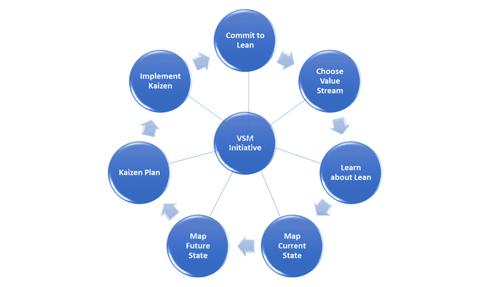

图 6.1 - 八个 VSM 步骤作为迭代和递增值交付周期

每个完整执行八步 VSM 规划、映射和改进周期的迭代，每次迭代都逐步提供新的值交付能力。

注意，VSM 团队可能会在八个 VSM 步骤之间来回反弹，通常是为了在迭代的 VSM 周期内获取额外信息。进行 VSM 周期的主要目标是确保工作朝着期望的精益价值流改进活动的连续性进行。

就像基于敏捷概念一样，每个 VSM 迭代都会逐步增加组织实施精益能力的价值。因此，组织的高管必须抵制定义和指定具体结果作为 VSM 努力正当化的诱惑。只要继续在他们的工作中投资是成本合理的，VSM 团队的倡议就会继续存在。

为确保 VSM 倡议具有长期可持续性，高管必须指定一个项目经理或 VSM 冠军，或者在敏捷背景下可能是 Scrum Master 来指导团队的努力。在 VSM 努力期间，VSM 团队负责人、VSM 团队成员和价值流管理者必须全力以赴，致力于他们的价值交付改进工作，并愿意在 VSM 倡议的整个生命周期内维持他们的精益努力。

无论做什么，都值得花些时间准备和规划——不需要很多时间，但可能会有几周的时间。最初，组织的高管或其指定人必须制定 VSM 宪章。宪章正式批准和资助倡议。VSM 宪章还概述了目标和目标，以及工作的广泛范围，并确定了 VSM 团队负责人和成功的高水平度量和结果。

制定并由高管签署 VSM 宪章有助于确保 VSM 倡议有一个或多个高管赞助并希望推动该倡议。组织的高管必须支持并主导这一努力，以获取 VSM 团队支持其确定的改进倡议所需的资金和批准。

一旦批准 VSM 宪章，VSM 团队将制定初步的 VSM 计划。计划在团队工作的概述方面不应过于繁琐或压迫。但是，至少，VSM 计划需要确定以下内容：

+   VSM 团队成员

+   可用或需要进行培训和指导的资源

+   用于 VSM 团队工作及其建议的改善 Kaizen 的资金

+   VSM 团队为指导组织精益改进所采取的步骤，如本书中概述的八个步骤

+   可用的 VSM 软件工具

+   关于持续的团队和利益相关者沟通的指导

在 VSM 宗旨和计划制定并批准后，VSM 团队负责人会启动一个启动会议，以确保每个人都在同一页上，并理解各自的角色和责任。至少，VSM 团队负责人、所有 VSM 团队成员、赞助高层（即负责预算的高层）以及关键利益相关者必须参加。

随着 VSM 启动会议的召开，VSM 项目正式启动并准备开始工作。

## 维持 VSM 项目

虽然精益概念相对简单易懂，但实施起来具有挑战性，并且随着时间的推移，维持精益的持续性更加困难。人类天性使得我们容易去关注其他事物或开始放松对细节的把控。

VSM 与敏捷实践有几个共同点——例如，沟通和尊重人员有助于确保困难信息被共享并有效处理。与 Scrum 一样，精益实践鼓励实验和观察（即实证主义），以及通过小的迭代和渐进步骤提升价值，VSM 团队必须愿意展示他们的发现（**透明性**），检查他们的发现（**检查**），并在必要时灵活应对并积极改变（**适应性**）。

最重要的是，执行赞助商和团队领导必须始终全力投入并领导该项工作。参与价值流的人员很快会察觉到，当领导者没有认真对待他们的改进建议时，团队成员会因沮丧而放弃改进努力。

价值流改进活动的可视化是 VSM 维持活动的一个重要组成部分。同样，类似于敏捷概念，VSM 使用视觉辅助工具，提供更新的团队信息和指标，持续告知高层、经理和其他利益相关者工作目标和状态。我们将在本章的 *学习精益* 部分更详细地讨论视觉辅助工具。

本节总结了对精益承诺的必要性讨论。现在你已经知道承诺精益的重要性，接下来我们来看支持这一目标的工具。

## 承诺精益 - 工具

本节讨论的工具帮助我们实现对精益的承诺。包括以下工具：

+   VSM 宗旨

+   启动会议

+   VSM 故事板

每个工具将在接下来的子章节中详细讨论。

### VSM 宗旨

**VSM 宗旨**是一个关键工具，帮助确保你获得高层的承诺。宗旨是管理层和 VSM 团队成员对他们希望达成目标的正式承诺。VSM 宗旨应涵盖以下内容：

+   VSM 项目标题

+   VSM 宗旨的使命

+   可交付成果

+   预期的范围/方法/活动

+   战略对齐因素

+   时间框架/持续时间

+   团队资源

+   团队流程

+   预期结果

+   主要客户和供应商

+   假设

+   风险

+   内部问题

+   外部问题

*附录 A* 包括一个 **VSM 宪章** 的示例。

### 启动会议

一个 **启动会议** 是一个重要的会议，确保每个人都准备好开始 VSM 倡议，并知道他们的角色和责任。VSM 倡议的冠军应该出席这次会议，解释团队为什么被组建以及如何被选中。VSM 冠军向 VSM 团队解释为什么执行管理赞助并资助 VSM 倡议。例如，VSM 项目可能解决竞争压力、新兴或利基市场客户需求、减少交货时间、提高质量或其他关于浪费的担忧。

至关重要的是，VSM 冠军必须强调对 VSM 团队成员学习精益原则和工具的重要性，我们稍后在本章中将会详细讨论这一点。

### VSM 故事板

**VSM 故事板** 是本书中介绍的重要工具之一。它作为您 VSM 项目的指南，带领您完成规划、映射和改进所选价值流的八个步骤过程。

VSM 故事板包括以下部分：

+   起始日期

+   已识别的价值流

+   VSM 冠军

+   VSM 团队成员

+   问题类别

+   主要精益工具

+   当前（现状）状态图

+   未来（预期）状态图

+   指标

+   改善提案/计划

*附录 B* 包括一个 **VSM 故事板模板** 的图表。请花点时间查看这个图表，因为我们将在本书的本章和其他章节中经常回顾这个模板。

注意

对于这个最初的 VSM 步骤，“致力于精益”，VSM 冠军完成 VSM 故事板的“第 1”和“第 2”部分，表明初始项目状态、潜在的价值流（如果已确定）、VSM 倡议的负责人姓名以及 VSM 团队成员。

有了这一点，我们已经完成了致力于精益的部分。现在，承诺已经做出，是时候讨论 VSM 团队如何确定最佳的组织价值流来支持其努力了。

## 选择价值流 - VSM 第 2 步

本节涉及帮助 VSM 团队选择其精益改进倡议的价值流的活动。从长远来看，最初的 VSM 团队可能会继续评估其他价值流。然而，更大的组织也很可能启动多个 VSM 团队，以支持其他价值流的精益改进倡议。

VSM 倡议必须具有紧迫感，以证明对资源和时间的投资是合理的。我们已经知道，组织通常有多个价值流，并且可能没有时间和资源同时处理所有这些流程。因此，我们需要优先考虑团队的努力。

问题变成了：*我们应该从哪些方面开始改进？* 根据**帕累托原则**（也叫**80/20 法则**和**帕累托法则**），一些价值流的改进对组织的即时成功比其他的更为关键。组织的高层管理人员可能已经识别出了效率低下、成本高昂、未能生产客户需求的产品或表现出其他浪费特征的领域，但我们仍然需要做工作，识别我们的价值流并优先考虑改进领域。例如，VSM 团队可以进行以下操作：

+   评估组织在多大程度上已识别出其价值流

+   评估每个价值流与以客户为中心的价值交付之间的关系

+   进行研究，发现哪些价值流具有最高的成本和延迟

+   进行客户调查，了解组织在多大程度上满足了他们的需求

+   使用精益指标来识别浪费最多的价值流

+   与员工讨论他们关于需要解决的价值流问题的观察

+   如果有条件的话，进行竞争分析，确定公司在行业中的表现如何

+   识别关键的基准指标，包括公司内外的对比，看看它们与公司内其他业务以及拥有类似价值流的其他企业的比较情况

+   在做 VSM 投资决策时，可以使用**SMART**缩写——**S**pecific（具体）、**M**easurable（可测量）、**A**ttainable（可实现）、**R**elevant（相关）、**T**ime-based（时间导向）

无论采取哪些步骤，VSM 团队必须始终以交付以客户为中心的价值为目标，并尽可能以最精益的方式实现这一目标，无论是在短期还是长期。因此，为了做出这些决定，让我们花点时间重新探讨一下价值这个话题，但在 VSM 的上下文中。

### 在 VSM 上下文中定义价值

本节重新探讨了与价值流图（VSM）相关的**价值**概念。你已经知道，从精益的角度来看，*价值*意味着以产品、服务或成果的形式为内部或外部客户提供价值。此外，价值的概念还意味着活动所提供的结果是客户愿意购买的。

事实上，我们的价值流总是包含某种程度的浪费。那些产生与客户需求无关的结果的活动就是浪费，我们需要尽最大努力消除它们——这正是*改善*（Kaizen）的核心，Kaizen 是持续改进的日语词汇。

精益中的*价值*一词适用于我们在价值流和 VSM 活动中所做的工作。但你可能会问，*流*这个词意味着什么。它字面上的含义与我们所想的非常直接。从隐喻上讲，*流*指的是一系列顺序的活动，这些活动创造价值，因此 VSM 改善了我们组织中价值的流动。

概念上，工作项沿着价值流活动向下游流动，就像水在小溪或河流中向下游流动一样。比喻来说，正如水流最终汇入大海，精益导向的价值流也最终流向我们的客户。

精益实践者明白，价值流包括增值和非增值的工作活动。从长远来看，我们希望消除非增值的工作活动，尽管在短期内可能不实际做到这一点。

以下图表提供了一个通用的**活动工作流程模型**的图示，展示了价值流中四个活动的周期时间和等待时间：

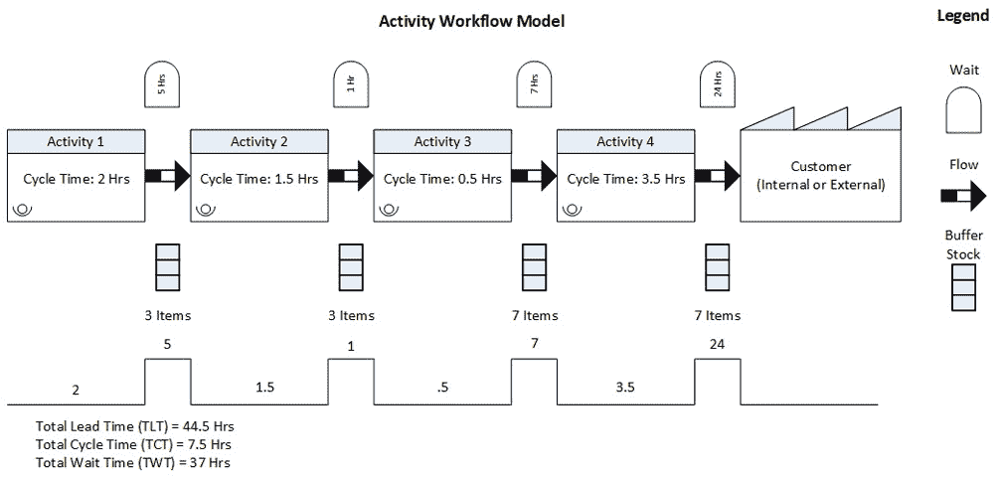

图 6.2 – 活动工作流程模型

这个模型开始引入一些在价值流图中使用的图标，但我们将在后续章节中更详细地讨论当前状态和未来状态的价值流图。现在，可以使用图例来解释图表中的信息。

例如，假设我们的工程师知道如何改善**活动 2**，使其周期时间降低到 1 小时。乍一看，这似乎是一个合理的做法。然而，问题在于系统的主要瓶颈出现在**活动 4**，因为它的周期时间明显更长，为 3.5 小时。改善上游活动的速度只会意味着更多的产品在**活动 4**的入口处排队，而流动并没有得到改善。

这个例子是基础的，因为在改善流动时，还需要考虑其他变量。我们可能有可以通过更好的工具改进的设置时间。我们可能有高水平的缺陷，这些缺陷给组织带来的成本超过了**活动 4**的缓慢输出。到目前为止，我们的价值流图没有说明批量大小或缓冲库存限制，这些都可能显著改变各个已识别活动中的吞吐量和排队情况。

到目前为止，我们所知道的仅仅是活动周期时间和物料的基本流动。然而，我们已经可以看出，这个模型并没有体现精益价值流。相反，它可能更像那些尚未过渡到精益的组织中的情况。例如，箭头表示物料被推送到每个下游活动，并且每个活动之间有缓冲库存，用于处理因周期时间不匹配而产生的溢出。

请注意，总等待时间为 37 小时，总交付时间为 44.5 小时。换句话说，整体交付时间中只有 7.5 小时是工作时间。最可能的原因是周期时间和批量大小不匹配，但我们需要分析整个价值流的流动情况，以确认实际的原因和影响。

精益组织还必须考虑另一个问题，那就是价值流之间的整合或接触点。这个话题将在下一小节中讨论。

### 整合价值流

价值流互动发生在一个价值流以产品、服务或信息的形式为其他价值流提供所需的价值时。例如，在 IT 行业中，我们经常看到，当以 IT 开发为导向的价值流生产软件产品后，这些产品会通过以运营为导向的价值流交付给内部或外部客户。

我们还可以看到，价值流互动发生在产品和营销管理价值流进行有助于识别客户需求的活动时，这些需求将帮助产品设计、开发和交付导向的价值流。例如，组织可能会开发或采购软件应用程序，以支持其产品和营销管理功能，如下所示：

+   战略规划

+   市场分析

+   产品规划

+   市场进入活动

+   销售赋能

在数字经济中，所有价值流都被 IT 集成并支持，以提供基础设施、计算设备、软件、网络和安全组件。许多物理产品和服务都内置了计算、网络和软件组件作为功能，来增强产品的能力。使用数字功能的价值在于，产品更新可以实时传输到产品中，从而在没有昂贵维护或服务电话的情况下增强现有产品。

但让我们暂时简化一下问题，回到使用数字服务来支持与产品和营销管理相关的价值流的主题。作为我们的示例，*图 6.3* 显示了一个**适应性产品化过程**，该过程包括三个**产品管理子流程**——**战略规划**、**产品规划**和**市场分析**——以及两个**营销管理子流程**——**市场进入**和**销售赋能**。

每个子流程包括多个工作流，如轮辐所示，这些工作流在适应性营销过程中传递价值。理想情况下，每个工作流都经过精简，能够以最小的浪费（如果有的话）交付价值。在这种背景下，每个轮辐都是一种价值流形式。此外，基于每个产品的独特需求以及产品生命周期中的各种需求，这些流程的执行会随着每个产品的生命周期而有所变化。

流程如图所示：

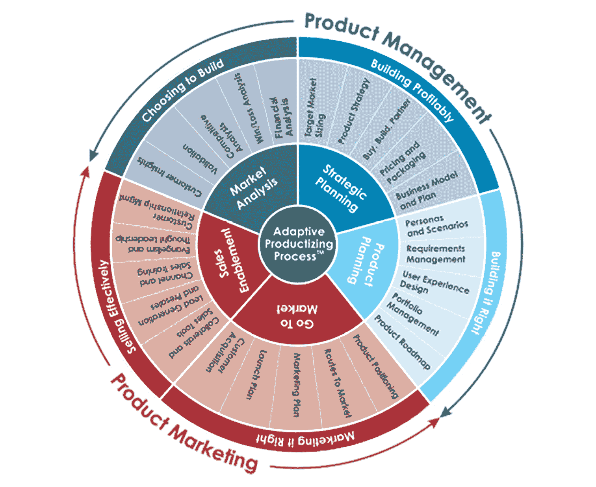

图 6.3 – 产品管理与营销管理流程

产品和营销管理价值流是以运营为导向的——换句话说，它们并不为外部客户开发产品，但它们确实支持我们为外部客户提供帮助和交付价值的能力。在接下来的部分，我们将通过适应性产品化过程为例，深入探讨以运营为导向的价值流是如何运作的。

### 以运营为导向的价值流整合

根据定义，面向操作的价值流直接与内部或外部客户进行接口，但不直接参与产品开发。面向操作的价值流通常收集、分析并为其客户提供信息。面向操作的价值流也可能直接向组织的客户交付产品和服务。

本小节介绍了支持产品管理和市场营销管理功能的面向操作的价值流活动，我们将以自适应产品化过程作为示例。

自适应产品化过程是一种以客户为中心的方法，帮助组织追踪并响应客户需求。自适应的产品和市场管理方法是为了支持新兴的商业模式而发展起来的，如**软件即服务**（**SaaS**）、通过 Web 2.0 实现的新推广和销售市场渠道，以及通过**企业对企业**（**B2B**）和**企业对消费者**（**B2C**）行业细分向客户销售。

自适应产品化过程的一个关键要素是利用基于社交媒体的营销。因此，自适应产品化过程非常适合在我们的数字经济中工作。

自适应营销过程利用数字化手段支持组织的价值链——换句话说，产品和市场管理价值流已经演变为支持我们在现代数字经济中开发、销售和交付产品的方式。产品和市场管理子过程通过市场和客户信息为客户中心视角的产品需求提供价值。

*图 6.3* 通过图示方式展示了自适应产品化过程作为**中心辐射**过程模型——换句话说，工作文档和信息在自适应产品化过程中可以向任何方向流动。因此，当我们设计产品管理和市场营销管理的价值流以及相关的信息系统时，需要考虑这些问题。

使用 IT 类比，我们需要一种价值流集成方法，模拟中心辐射式消息代理的工作，以简化通信、数据流和异步转换。不幸的是，点对点过程和信息集成策略不起作用，因为集成点太多。此外，开发团队无法预见自适应产品化过程中所有可能的信息流或活动交互。

更好的方法是将每个辐射环节中的活动集评估为整体价值流的潜在元素。每个环节代表一个独立的活动或子过程。此外，随着需要的出现，每个子过程可以由其他子过程触发。对于每个产品或产品系列，评估整体产品管理和产品营销价值流，以识别在哪些地方流动瓶颈形成阻塞，哪些地方的浪费妨碍了整体流程。

中心辐射类比并不意味着在自适应产品化过程中，工作是从一个营销价值流推送到另一个营销价值流。在精益导向的生产过程中，工作总是根据上游客户或后续活动的需求按需拉动。

尽管如此，中心辐射类比仍然有其用处，因为工作在所识别的自适应产品管理和产品营销任务中的流动高度依赖于每个产品在其生命周期中的需求。

以**Go To Market**过程为例，**产品定位**、**市场渠道**以及其他相关子过程是潜在的价值流工作流组件。每个工作流组件可能包含多个活动和技术。这些组件子过程有不同的周期时间和等待时间。它们通常都有增值和非增值活动的混合，以及应当随着时间清理的其他形式的浪费。

始终优先改进活动，以消除整体价值流过程中当前的瓶颈。如果你有时间和资源在多个价值流改进计划中开展工作，始终确保将优先级放在解决主导流动瓶颈或最高成本驱动因素上。本章后面会介绍如何使用当前的（*现状*）和未来的（*目标*）价值流图，帮助你做出这些评估。

自适应产品化价值流相比最初由 James Martin 定义并概述的产品和营销导向价值流，呈现了一个更复杂的视角。然而，*图 6.3*中所展示的众多子过程依然具有重要的相关性。该图表还更好地展示了活动的复杂性以及产品和营销管理价值流之间可能的相互作用。通过这个类比，你应该能理解为何 VSM 和 DevOps 是提高整个组织精益价值流的关键推动力。

### 面向开发的价值流整合

从概念上讲，面向开发的价值流包括了从最初概念到开发完成，再到收到付款所需的所有增值和非增值活动。面向开发的价值流为外部客户生产产品，或者支持组织内部的操作导向价值流。

在制造业中，每个产品系列都有一个独立的价值流。产品系列通常会将共享相似工艺流程的零件或零件编号进行分组。整体目标始终是确保合适的零件和材料在恰当的时间、恰当的地点准时到达，以支持开发过程。

从概念上讲，这意味着与产品订单相关的信息必须在所有上游的面向开发的价值流活动中流动，以将零件与产品及其相关的开发活动匹配。零件和材料必须按正确的顺序到达缓冲区，随后才能支持客户订单的特定生产活动。客户订单信息返回库存管理系统，以触发新的零件和材料替代订单，供应链合作伙伴进行补充。

每个产品领域都有三个主要的价值流，这些价值流相互重叠并共同流动，正如下面所示：

+   一个**从概念到发布**的价值流——包括所有将概念或想法推向产品设计和工程的活动，确定竞争性定价，建立供应链和采购材料的流程，设计客户订单和报价活动，并确定控制计划发布过程。

+   一个**从原材料到成品**的价值流——包括所有制造材料和信息活动，以最高质量、最低成本、最短周期时间将产品交付给客户。

+   一个**从订单到收款**的价值流——从客户订单的接收到付款的收讫。

**从概念到发布**和**从订单到收款**是面向运营的价值流，而**从原材料到成品**则是一个面向开发的价值流。上述三种面向开发的价值流的命名约定遵循之前确定的策略，以明确名称的起始和结束活动。你不必以这种方式命名你的价值流，但这种方法可以帮助更容易地构思每个价值流中的工作内容及其交付物。

就像面向运营的价值流一样，面向开发的价值流也包含多个流程和活动。这些活动在不同行业和公司之间有所不同，因此 VSM 的一个关键要素是定义那些能为你带来更大竞争优势的活动。

这个问题值得反复强调：永远不要试图在没有完整了解价值流的情况下改善单个流程。如果没有当前价值流的图示，你无法知道瓶颈和浪费在哪里。如果改善的流程不是瓶颈所在，那么它可能几乎不会有任何效果，而且在任何时刻，价值流中总是只有一个主要瓶颈。

根据帕累托原则（即 80/20 法则），一旦你解决了当前的主要瓶颈，其他活动的周期时间会在价值流中变得相对较长，从而形成新的瓶颈。这个原则同样适用于解决价值流中的任何形式的浪费。这是我们必须始终实践 Kaizen（即持续改进我们的工作实践，消除下一个最大约束和其他形式的浪费）的主要原因。

在他们的著作《精益办公室中的 VSM》一书中，Dan Tapping 和 Don Shuker 指出，60%到 80%的产品开发成本是非生产性成本。换句话说，最高的成本累积来自于**从概念到发布**和**从订单到现金**的价值流。由于这些主要是信息驱动的价值流，因此 VSM 和 DevOps 是所有精益实施活动的关键推动力（Tapping, Shuker; 2002, 2003）。

在我们结束这一小节之前，快速回顾一下帮助识别哪些价值流具有最高机会改善我们价值交付能力的工具。

### 选择价值流——工具

在每个 VSM（价值流管理）项目开始时，VSM 团队成员应该进行四项活动，以帮助他们选择适合下一个项目的价值流。这些活动包括以下内容：

+   识别未得到充分解决的即时客户需求和关注点

+   执行工作单元路线分析

+   根据最显著的净正面影响来优先选择目标价值流

+   更新团队章程并持续进行头脑风暴

VSM 团队用于协助这四项活动的主要工具包括**产品数量**（**PQ**）分析、**产品路线**（**PR**）分析、工作单元路线分析以及 VSM 故事板的更新。以下是详细的说明：

+   **PQ 分析**：这涉及创建一个帕累托图，其中包含过去 6 个月内生产的零件或工作项的列表。每个条目包括零件编号、生产数量、累计数量、生产百分比以及生产累计百分比。该分析帮助 VSM 团队快速识别哪些产品线对提升生产量具有最高的贡献和影响。

+   **PR 分析**：如果 PQ 分析的 PQ 比率为 40:60 或更高（即 40%的产品占据 60%以上的零件总数量），则使用 PR 分析来帮助选择你的价值流。换句话说，我们希望围绕具有相似价值流活动的高产量产品形成产品家族。

    使用矩阵或表格格式，在第一列列出产品及其工作量，然后水平列出它们的产品活动序列。接下来，将具有相同过程序列的产品分组并分析过程路线的组合。你的分析应该包括对最高工作量产品、最高成本产品、最低效流程以及当前和未来客户需求的评估。以下截图展示了该分析的示例：

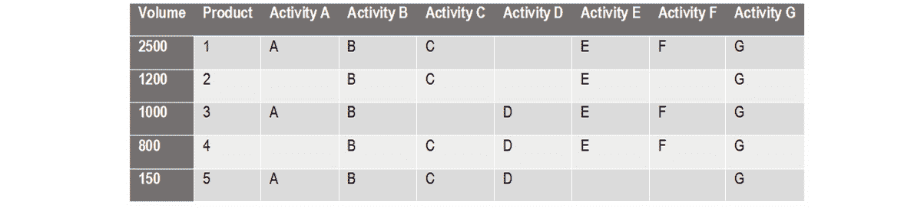

图 6.4 – PR 分析表

在这个示例中，产品团队创建了 PR 表，并可以迅速看到最高工作量的产品**1**-**3**都包含活动**C**、**E**和**G**。此外，产品**1**和**3**都需要活动**A**和**F**。因此，创建一个包含活动**A**到**C**以及**E**到**G**的价值流作为专用工作站可能是有意义的。然而，在最高工作量的产品列表中，只有产品**C**需要活动**D**。需要进一步分析以确定是否将活动**D**添加为专用工作站进入价值流是否具有成本合理性。

+   **工作单元路由分析**：这是面向服务的等效于 PR 分析，但不是在矩阵中列出产品线，而是列出你所关注的改进领域中的工作单元或客户群体。

    以下截图展示了工作单元路由分析的工作表格式示例：

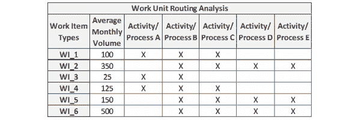

图 6.5 – 工作单元路由分析

第一列列出了为客户生产的工作项类型，第二列列出了每个已识别的工作项或客户在一段时间内的平均工作量。接下来的几列在矩阵中列出了支持生产工作项的过程或活动序列。在矩阵中形成的网格中，标记出生产每种产品类型所需的活动或过程。最后，将具有相似流程的工作单元分组，然后根据它们的工作量对所有流程进行排序。

我们的示例显示，工作项类型**1**、**5**和**6**有相似的工作流，总工作量为 1000 个工作项。我们将其称为*A 组*。另外，工作项**1**和**4**具有相同的流程，总工作量为 225 个工作项，我们称其为*B 组*。工作项**3**单独存在，仅需要**25**个单位。

应该很明显，*A 组*代表公司最大量的工作，其次是*B 组*。工作项**3**的生产需求相对较小，除非它异常盈利或为其他产品线造成瓶颈问题，否则可能不需要太多分析。

+   **更新的 VSM 故事板**：你现在应该明确知道你的 VSM 团队计划专注于哪些价值流进行精益改进活动。更新 VSM 故事板以反映在*第二部分*中识别的价值流。

到目前为止，你已经学习了八步 VSM 流程中的前两步，这些步骤涉及规划、映射和维持精益改进。*第 1 步*包括识别并启动核心 VSM 实施团队的活动。接下来，*第 2 步*的活动帮助识别出最优先的价值流进行 VSM 项目。现在，是时候查看*第 3 步*了。

## 了解精益——VSM 第 3 步

在*第 3 步*中，VSM 团队必须确保他们对精益概念有深入的理解，并且确保在价值流中工作的团队成员理解精益生产的概念。

有许多资源可以用来了解精益生产实践。本节内容是为那些刚刚开始精益学习之旅的人提供的快速入门指南。最重要的是，VSM 团队成员必须学习精益的基本概念，然后加以应用。正是精益原则的应用帮助培养了未来所有 VSM 项目的技能。

### 制定学习计划

为确保所有团队成员都能发展出足够的技能和理解精益概念，VSM 团队应该通过制定**精益学习计划**来启动他们的学习活动。制定培训计划通常包括以下六个步骤：

1.  记录所需的技能和知识。

1.  进行当前技能和知识评估。

1.  进行技能和知识差距评估。

1.  设计培训方法（例如，讲师主导的课堂培训、互动小组会议、实操培训、计算机基础和电子学习培训、视频培训、辅导和指导）。

1.  安排并进行培训。

1.  评估培训的效果并进行必要的调整。

### 基准测试

假设这是你团队的首次 VSM 项目。在这种情况下，他们可能还不清楚在行业中安装精益生产能力的最佳实践和衡量标准是什么。此时，花时间从类似企业或部门收集信息，制定一套基准进行对比分析往往很有帮助。这类活动被称为**基准测试**，通常涉及使用质量、时间和成本指标分析竞争性做法。

VSM 团队应该通过明确想要改进的内容来开始基准测试活动。坦率地说，团队应该从一开始就这么做，因为这正是 VSM 项目的核心所在。当团队接触潜在的基准测试组织时，他们需要理解这是一个大要求，必须保持谦逊。

你不太可能让你的竞争对手分享这些信息，因此，团队的首要任务是识别与 VSM 团队价值流所执行的工作类型相似的组织和行业。

当 VSM 团队联系其目标标杆合作伙伴时，首先应花时间了解合作伙伴的业务。如果你还没有花时间了解合作伙伴的情况，那么你很难说服潜在的合作伙伴花时间与您合作。此外，向他们表明，你的目标是建立一个双方都能通过共享信息获得双赢的关系——不仅是在短期内，可能还会在长期内实现。这样，两个组织可以继续共同发展和改进，且标杆合作伙伴也不太可能感觉自己被利用。

一旦你知道了 VSM 项目的目标，利用这些信息制定一系列问题来询问你的标杆合作伙伴。这项工作应在与他们会面或甚至联系之前完成。再次强调，这种预备工作将向他们展示你已经做了功课，并且你为合作关系带来了价值。

当你与标杆合作伙伴会面时，VSM 团队应至少有一名成员参与。你不需要让整个 VSM 团队都去，但至少需要两个人——一个记录笔记，另一个提出问题。

你可能提出的问题在涉及机密和专有信息时可能会显得具有侵略性。因此，你需要对他们的担忧保持敏感，并尊重他们的隐私。

面对面的会议几乎总是最适合观察人们的反应并对他们的关切做出适当回应。你的合作伙伴甚至可能愿意在你参观他们的现场时向你的团队展示他们的活动示例。然而，尤其是在当今 COVID-19 大流行的时代，在线电话会议当然也是可行的且合适的。

会议结束后，感谢你的标杆合作伙伴的时间和考虑，并确保按照承诺跟进并分享信息。具体来说，你应该分享你在价值流中实施的 VSM 实践的成果。

标杆实践的目的是拥有一套可以与自身进行比较的指标和程序。假设你选择了标杆合作伙伴，因为他们在你所衡量的领域展示了卓越的能力。在这种情况下，你将拥有一个可靠的基准，能够评估当前状况并定义对未来理想状态的期望。

在实施精益培训计划后，VSM 团队需要确保所有参与者和积极的利益相关者都能充分利用这次培训。具体来说，他们必须理解精益的六个领域。我们将在下一小节中讨论这六个基本概念。

### 学习精益的基本概念

有六个基本概念，你需要理解才能创建一个精益系统。这六个概念包括：

+   成本降低原则

+   精益的七种浪费

+   精益的两大支柱——JIT 和自动化（Jidoka）

+   5S 系统

+   视觉化工作场所

+   精益应用的三个阶段——需求、流动和平衡

我们将在接下来的子章节中简要回顾这六个精益概念。

#### 成本降低原则

精益中的**成本降低原则**与主流定价方法相对立，后者通过将成本加总后，再加上期望的利润率来计算产品价格。这种策略的问题在于，焦点既不在顾客身上，也不在如何改进上。如果我们不理解顾客如何评估价值，我们就无法知道他们愿意支付什么价格。此外，如果我们不专注于优化价值传递并根据此定价，我们就可能面临失去业务给竞争对手的风险。

相反，精益组织允许顾客设定售价，而成本和利润则成为变量。换句话说，精益组织通过分析来确定一个可接受的价格，然后评估在整个价值流中必须做什么以消除浪费，从而能够在可接受的价格下交付产品和服务。

#### 七种致命浪费

**七种精益浪费**增加了成本和时间延迟，或阻碍了质量，而没有为顾客增加价值。精益的七种浪费包括：

+   **过度生产**：当我们在没有顾客订单或外部顾客历史需求的情况下生产过多的某些东西，或者在工作项尚未被内部顾客要求之前就开始生产时，便会发生过度生产。

    过度生产还会发生在我们获取或开发与其他价值流活动的流动速率不匹配的批量处理过程或高速设备时。回想单件流的理想状态，我们已经知道批量处理会导致队列的形成并造成过量库存。此外，花费金钱、时间和资源来加速某一活动，可能会导致等待时间、瓶颈和队列在整个价值流中形成。

    回想**80/20 法则**（**帕累托原则**或**帕累托法则**）总能提升在你效率问题中排名前 20%的表现，因为这通常代表了你当前浪费和低效的 80%到 90%。通过解决当前的瓶颈问题，你能改善整个价值流中的流动性和产能。

+   **等待**（**Q 时间**）：指的是任何事物——包括人、材料、设备或信息——在没有增加价值的工作时所浪费的时间。这种浪费源于隐藏的错误和缺陷、库存持有成本和额外的存储设施。

+   **运输**：指的是为了执行下一个活动，需要将某物搬动到比实际需要更远的位置，这代表着时间和精力的浪费。运输适用于物料、人员和基于纸张的信息流。

    与运输相关的浪费通常发生在迁移到精益生产之前，当价值流活动在功能或部门内，或由外部供应商提供时，未能为特定产品线支持高效的流动。

    作为浪费的运输，也发生在物品被临时归档、储存、堆放或以其他方式移走时。

+   **过度加工**：当我们为产品添加客户未要求的功能和特性时，就会发生过度加工。它们可能不被重视，我们不应该在确认有客户需求来证明工作的合理性之前，就开发或交付任何产品功能。此外，只有产品经理或产品所有者进行商业机会评估，了解是否有成本合理的市场来支撑这些增强功能时，我们才能知道这一点。

    过度加工是一种关键的浪费形式，因为我们无法找回我们的时间和资源，而必须承担客户不重视的工作的成本。即使识别出了市场，这些功能或特性也可能不是最优先的，且可能不具有成本合理性。我们的客户可能不愿意支付开发和交付所需的费用来证明成本。

+   **库存**：指的是任何不立即需要的物料、产品，甚至是资源的过剩库存。我们只需要足够的物料来平衡流程，不需要更多。

    记住，理想情况是所有价值流活动中的单件流，且所有活动的周期时间相等，并且没有切换时间。如果我们能实现这一理想，包括 JIT（准时生产）物料配送，就没有库存的理由。

    与此同时，库存占用空间，可能影响安全，可能在特定情况下过期，或者隐藏库存批次中的缺陷和问题。库存还需要大量资金购买和存储，更糟糕的是——当你最终将库存物料与客户订单匹配时，它们可能不是你需要的（即错误的零件号、型号或类型）。

+   **运动**：包括任何不必要的动作，去完成操作的过程。运动是一种浪费形式，通常由无效的工作流程或设施布局引起，往往会导致比必要的更多步行、伸手或弯腰。在数字化赋能的背景下，这可以视为过多的过程开销和延迟，或者内建的推式系统和工作流。

    这种浪费形式类似于运输，但规模较小。可以将运输视为跨设施或跨地区的流动，而运动仅限于在或跨链接的价值流活动中的移动范围。

+   **缺陷**：这是一个隐形的浪费形式，表现为物理产品中的缺陷或软件开发中的漏洞。尽管有时可以互换使用，*缺陷*在软件开发中指的是产品增强缺少客户要求的功能，而漏洞是指软件代码中的缺陷。

    缺陷通常需要返工或销毁材料和产品。无论是哪种情况，缺陷都非常昂贵。

尽管不包含在原始的七大浪费之一，部分精益思想领袖描述了另一种被称为**未被利用的才能**的浪费形式。人类拥有能够为组织增加价值的智力和身体素质。特别是，我们员工的智力属性可以通过获得相关经验、知识和技能来增长。

假设我们没有启动改进员工智力潜力的计划。在这种情况下，我们通过限制人力资本的增长以及员工为工作场所带来的创新，允许浪费的产生。人力资本是对我们员工贡献的经济视角，它评估员工的技能、知识和经验，并认为这些因素对组织既带来了价值，也带来了成本。

在这一部分的最后要指出的是，所有在价值流中的浪费形式都包括在产品的整体成本中，因此也影响其价格。这个精益理念至关重要，因为消除浪费代表着改进价值流的机会，从而提供以客户为中心的价值。在这种情况下，浪费的产生是因为我们没有充分利用未被利用的人类才能。

本节总结了我们关于消除浪费的讨论。接下来，我们将继续理解支撑 TPS 的两个精益支柱的重要性：JIT 和 Jidoka。

#### TPS 的两个支柱

回想一下我们之前关于 TPS 的讨论。在他的书中，大野耐一声称 TPS 基于两个主要概念或支柱：**JIT**和**Jidoka**（即自动化）。

TPS 的目标是尽可能快速和高效地生产客户订购的车辆，并尽快交付价值。让我们快速回顾一下 JIT 和 Jidoka 如何为这些目标做出贡献，如下所示：

+   **JIT 生产**：这是一个理想的连续流状态，其中物料按照正确的顺序、在正确的组装点和恰当的时间到达。当客户订单进入时，信号会沿着生产线或价值流传播，以指示每个生产阶段的新物料需求。在**先进先出**（**FIFO**）的订单输入系统下，价值流中的订单和物料会向前流动，直到与正确的产品在生产的正确阶段、正确的时间相遇。

    换句话说，JIT 系统是通过客户订单驱动的拉动系统来补充零部件。理想的情况是优化精益流程和价值流活动，使得在需求发生的时刻和地点能够实现单件流补充材料。例如，JIT 系统会在接收到上游客户订单后，触发第三方供应商的零部件和材料配送。在面向 IT 的价值流中，我们通过看板（Kanban）板和卡片来实现相同的概念。

    JIT 是精益生产系统的核心，建立了其脉搏，以确保在需要的时候、需要的地方提供正确的信息、材料和零部件的节奏。

+   **Jidoka**（也叫做**自働化**）——这利用自动化来执行重复性和危险性的任务。其目标并非用自动化来取代人工。相反，自働化的能力帮助解放工人的时间，让他们能够在价值流中执行需要灵活性和思考的多任务。

    为了实现这一目标，我们必须区分需要人工指导的工作与重复性工作、危险性工作或容易出错的工作，因此这些工作最适合由自动化设备来执行。自働化包括为所有组装和测试过程开发缺陷检测和预防装置以及自动化能力。

    请注意，Jidoka 同样适用于自动化任务，如软件开发中的测试、配置和供应过程。换句话说，CI、测试自动化和 CD 中使用的自动化能力让开发人员能够专注于与需求分析、架构与设计、编码和问题解决等价值增值任务相关的工作。

    Jidoka 的目标是使工作场所高效、安全，同时尽量减少交付低质量或有缺陷产品的可能性。最终，Jidoka 帮助防错你的价值流，同时提供效率和产量，以符合客户需求的速度交付产品（即 Takt 时间）。

    Jidoka 有四个基本概念，概述如下：

    a) 简化或自动化异常发现

    b) 立即停止所有失败或正在失败的活动，即使这意味着需要停工整个价值流，因为我们不希望形成排队。

    c) 在重新启动生产线之前修复问题

    d) 调查并解决问题的根本原因

    这四个过程确保问题能够被迅速发现并解决。此外，Jidoka 的目标是通过防止问题恶化为产生更多浪费，来避免问题失控。最终，我们需要找出根本原因，以便能够防止未来的事故发生。

现在我们已经讨论了 JIT 和 Jidoka 的概念，接下来讨论 5S 系统，这是一个精益生产工具，有助于通过消除浪费来提高工作场所的效率。

#### 5S 系统

与前一部分讨论的精益两大支柱一样，**5S 系统**是在日本作为 TPS 制造方法的一部分开发的。在启动精益改进计划时，通常会发现价值流过程不协调、杂乱且低效，甚至可能根本不存在。

这种情况常发生在生产多个产品线的制造流水线中，以及在操作导向的价值流中，存在无组织的纸质系统、文件、物资、工具、设备和书籍。5S 系统的主要目的是消除杂乱，改善价值流活动的流动，以结构化的方式进行。

*5S*一词的来源来自日语中的*Seiri*、*Seiton*、*Seiso*、*Seiketsu*和*Shitsuke*。幸运的是，我们有五个以字母*S*开头的英文词汇，恰好能代表这些日语原词。5S 系统包含了五个步骤，每个步骤的名称都以*S*开头，如下图所示：

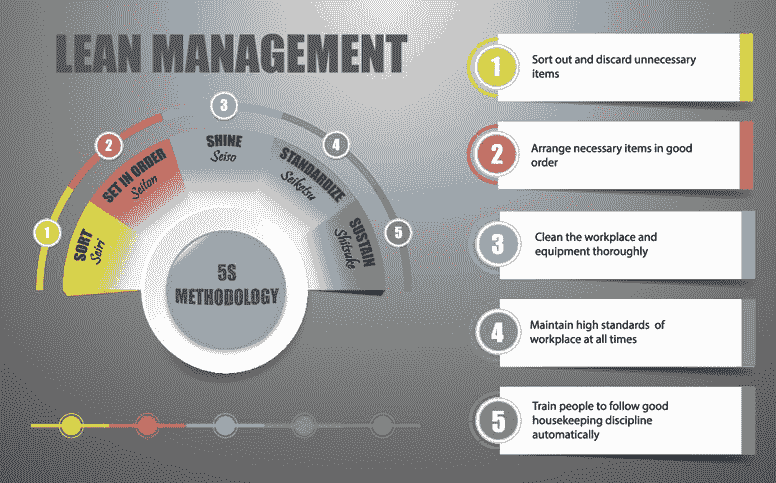

图 6.6 – 5S 系统

每个字母代表一个改进和保持精益实践的步骤。所以，让我们花一点时间来回顾每个步骤所涉及的工作，具体如下：

1.  **整理**—*Seiri*（整顿）：首先审查所有的物资、零件、设备、文件、文档、书籍或任何其他杂物，清除在修订或新价值流中不再需要的东西。

1.  **整顿**—*Seiton*（有序）：组织剩余的物品以支持高效的工作流程，包括确定并存储库存和缓冲库存区域。安排所有必需的物品，使其便于高效访问。最重要的是，努力保持有序性。

1.  **清扫**—*Seiso*（清洁）：在前两个步骤的基础上，花时间清洁区域并检查设备，确保一切正常运作。定期清洁和检查每个工作区。定期清洁的过程有助于确保工作区和设备得到适当的维护，从而减少产生浪费或意外工作停顿的潜在风险。

1.  **标准化**—*Seiketsu*（标准化）：这里的目标是标准化活动，以维持价值流中的工作环境——换句话说，创建 5S 标准操作程序，以维持秩序、清洁和工作环境的维护。让你的 5S 标准在工作区内可视并显而易见。

1.  **维持**—*Shitsuke*（纪律性）：5S 标准的维护不是偶然发生的。它需要持续的细致关注和纪律性，以确保价值流团队保持对任务的掌控。价值流的倡导者或领导者必须分配责任、跟踪进度并继续循环。他们还负责教育和告知团队成员 5S 过程和标准，以确保持续合规。

5S 系统背后的概念非常简单易懂，但实施和维护却具有挑战性。我们正在工作的价值流必须注重尽职调查和持续关注。消除浪费并防止浪费重新进入价值流系统的回报是值得的。

由于我们已经介绍了将已实施的 5S 系统和标准可视化的概念，以帮助维持纪律性，接下来我们来谈谈视觉辅助工具如何改善价值流图（VSM）的其他方面。

#### 视觉化工作场所

如果你是一个敏捷实践者，你应该已经非常清楚在工作环境中创建视觉辅助工具的重要性，以便提供与你团队工作相关的及时信息。这些视觉辅助工具以**大可视化图表**（**BVCs**）和**信息辐射器**的形式存在。尽管大视觉显示的概念最早起源于 TPS，但正是 IT 创新者 Kent Beck 和 Alistair Cockburn 使得在敏捷实践者的 IT 社区中，使用视觉辅助工具的做法得到了广泛传播。

Kent Beck 在他的书《*极限编程解释*》（1999）中创造了术语 *BVC*，而 Alistair Cockburn 在他的书《*敏捷软件开发*》（2001）中创造了术语 *信息辐射器*。*信息辐射器* 是指敏捷或精益敏捷团队在其共用工作区内，以易于看到的位置放置的任何手写、绘制、打印或电子显示装置。

拥有大规模的视觉显示旨在使所有产品团队成员、管理者和其他利益相关者能够迅速找到并查看有关产品待办事项和正在开发的工作项的更新信息。关于生产数据的可视化，请记住那句老话：*一幅图胜过千言万语*。信息辐射器可以包括看板、燃尽图、燃起图、自动化测试的状态和数量、事件报告、CI 状态，以及任何其他与理解产品团队目标、进度和优先级相关的信息。

现在，让我们继续讨论精益应用的三个阶段，包括需求、流动和平衡的概念。

#### 精益应用的三个阶段——需求、流动和水平化

虽然很诱人想要立即在整个价值流中实施精益实践，但这可能不会取得良好的效果。更好的方法是将分析和实施过程分为三个阶段，首先关注客户需求，其次是持续流动，最后是平衡。

各个阶段应按照以下顺序发生：需求、持续流动和平衡。我们将在下一章的价值流映射中看到这一点，特别是未来状态的映射。但在进入这一主题之前，我们先来看看这些阶段中发生的活动，如下所示：

1.  **客户需求阶段**：包括一组活动，用于确定我们的客户是谁以及他们的需求。本阶段使用的工具包括 Takt 时间计算、排程计算、缓冲区和安全资源、办公室 5S 以及问题解决方法。

1.  **持续流阶段**：包括一组活动，帮助在价值流中建立持续流动，以确保正确的单元在正确的时间、以所需的数量到达，支持客户的订单，既包括内部订单也包括外部订单。本阶段使用的工具包括在制超市、看板系统、FIFO 生产线平衡、标准化工作和工作区域设计。

1.  **平衡阶段**：包括将工作均匀且有效地分配到价值流中的活动。此阶段的工具包括可视化的排程板、负载平衡（heijunka）箱以及运行系统。

前述描述应能明确显示，每个未来状态映射阶段都包括一组独特的活动和工具。如前所述，未来状态映射工作还有一个隐含的流程。我们需要在改善工作流程之前，了解客户需求如何影响我们的价值流；并且在我们能够平衡工作负荷之前，需要先改善工作流程，以应对新的客户订单进入我们的价值流系统。

实施八个 VSM 步骤的指南为在目标价值流中实施精益实践以及保持和改进精益改进提供了坚实的基础。然而，学习如何实施精益实践中的需求、流动和平衡阶段，以实现期望的未来状态目标，也是至关重要的。

以下截图展示了精益应用的三个阶段：需求、流动和平衡，以及每个阶段的工具和阶段的顺序：

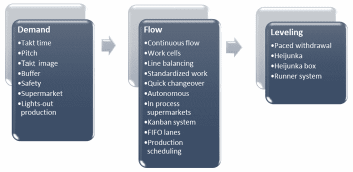

图 6.7 – 精益应用的三个阶段：需求、流动和平衡

高层管理者不能强制执行精益实践——这是一个涉及所有团队成员支持价值流映射（VSM）活动的全员参与过程，同时也包括在价值流中工作的员工。员工的参与是下一小节讨论的主题。

#### 员工全面参与

员工被鼓励通过持续改进活动，也就是**Kaizen**，为改善工作区域做出积极贡献。需要注意的是，在精益管理中，Kaizen 事件与敏捷回顾的理念是等同的。在这两种情况下，产品团队都会预留时间来评估哪些方面做得好，哪些方面做得不够好。目标是探索改善那些不太顺利部分的方法。

*Kaizen* 这个词来源于日语的两个词根：*Kai*（拆解）和 *Zen*（改善）。因此，我们的目标是将问题拆解开来，探索其原因和影响，然后找出如何改变我们做事的方式，从根本上消除问题的根源。

Kaizen 事件或敏捷回顾的结果是制定一个行动计划，列出团队可以立即采取的活动，以改善其表现。在 Kaizen 和回顾过程中，重点必须放在改善工作本身，而不是指责个人。后者只会导致相互指责和团队成员之间的功能失调。就像任何系统一样，一个团队的力量远大于其各个部分的总和，但一个功能失调的团队不再像一台运转顺畅的机器。

每个团队成员必须对眼前的工作有共同的愿景，并将价值流视为一个整体。如果价值流中的某一部分出现问题，那么整个价值流作为一个功能系统就会崩溃。发生这种情况时，所有人需要分享想法，鼓励反馈，并获得认同，以确定解决问题的策略。

请记住，这些好的想法来源于组织的各个层面，包括管理者、利益相关者和员工。因此，所有的想法都需要仔细考虑，无论其来源如何。每个人都需要感受到自己对结果拥有一定的归属感，并鼓励他们改善材料和信息在价值流中的流动，消除成本高昂的浪费。

我的一个好朋友，也是本书的技术审阅者，Enrique Gomez，曾讲述了他在六西格玛培训时学到的一个故事，关于 Kaizen 事件如何具有相当强的攻击性。他举的例子据说发生在一家日本制造厂。某个特定工位的生产任务执行混乱不堪。然而，管理者并没有逐步改进这个工位，而是将工具一股脑扔在地上——这是一个非常生动的拆解例子。然后，操作员们作为一个团队重建了工位，将东西放回需要的位置，移除不必要的工具，并替换掉那些无法正常工作的工具或设备。

通过这种方式，Kaizen 事件虽然相当具有破坏性，但在解决阻碍生产效率的根本问题方面非常有效。简而言之，并非所有的 Kaizen 事件都像友好的敏捷回顾那样进行。它们可能采用高度破坏性的措施来强制实施必要的改进。

类似地，我们也可以通过翻新房屋作为另一个例子，来说明有时需要进行颠覆性的改变。例如，为了使房屋中的厨房更加实用，最好拆除现有的墙壁、设备、台面和橱柜，以便创造一个更好且更实用的工作环境。长期的收益超过短期的干扰。

本节结束了精益概念学习的部分。正如你需要知道精益的模样一样，你还需要知道精益不是怎样的。这就是下一个小节要讨论的内容。

### 了解何时不属于精益生产

现在，既然你已经了解了精益生产的概念，我们来讨论如何评估在价值流中实施的精益实践的状态。为此，我们需要观察组织中的开发和运营导向流程，并且需要问自己一系列问题。这些问题围绕着流程、订单处理、批量大小、客户需求、清洁度、库存管理和活动换线等方面。

在进一步讨论之前，请注意，在本书中，*精益*、*精益生产*和*精益产品开发*这三个术语是可以互换使用的。三个术语都意味着在运营和开发导向的价值流中实施精益概念。

第一组问题涉及工作、零件、材料和信息的流动。

#### 流程问题

与流程相关的问题有助于评估浪费的运输、运动和等待程度。具体来说，你需要提出问题，了解你的组织在以下方面的实施程度：

+   改变设施布局，以支持工作的连续流动

+   消除导致过多库存、瓶颈和排队现象的批量处理

+   采取措施最大限度地减少所有价值流活动中换线和周期时间的差异

+   采取措施最大限度地减少在价值流活动中运输货物的距离

+   采取措施减少执行每项价值流活动所需的运输距离、运动、重物搬运和弯腰操作

接下来，我们将看一下帮助我们评估订单管理活动精益程度的问题。

#### 订单管理问题

一旦我们解决了流程问题，我们就需要评估订单是如何处理的，包括零件、材料和信息的到达。以下是你在操作中应该问的有关订单处理的问题：

+   零件和材料是否仅在支持现有客户订单时才进行订购和供应？

+   订单在收到时是否会推送到生产中，不管是否有能力承担工作？

+   订单是作为批量处理并处理，还是单独处理？

+   操作员只有在有能力的情况下才能拉取工作吗？

+   价值流操作员是否一次处理多个工作项？

+   在价值流活动中，正确的物料是否在正确的地点和时间出现？

+   在每个活动中，是否可以按需获得所有订单和流程信息，以便执行当前的工作？

到这个阶段，我们应该对流程的效率有一个相当清晰的了解，特别是关于流程流动和订单处理。接下来，我们需要评估订单在价值流中如何根据批量大小来处理。

#### 批量大小问题

VSM（价值流图）实践者试图使价值流的输入、输出和中间活动的持续时间与客户需求同步。换句话说，产品订单进入系统并通过每个活动的速率应该与客户希望交付产品的速率匹配。

例如，如果一个客户每周需要交付 40 个产品，那么理想的生产速率是每周 40 个产品，或者每小时一个产品。为了满足客户在我们的价值流管道中的需求，我们可能会每小时向生产系统引入一个新的工单，生产一个产品。同样，每个中间活动也会每小时循环一次，输出一个产品。生产控制在我们必须批量生产且生产与运输活动之间的持续时间变化时，会变得更加具有挑战性。

从概念上讲，生产控制经理“指挥”工作的流动，就像指挥家指挥乐队保持节奏一样。精益实践者使用“Takt time”（或者更简单的“Takt”）来指代满足客户需求所需的生产节奏。Takt 是德语中指挥家用来调节管弦乐团或乐队节奏的指挥棒的词。

因此，精益生产的理想目标是在所有价值流活动中以一个恒定的速度（等于 Takt 时间）协调所有物料和部件的单件流动。为了实现这一目标，以下是你在运营中应该提出的关于批量大小的问题：

+   在你们的开发和运营价值流中，工作项的批量大小是多少？

+   组织是否已经识别出价值流中每个活动的批量大小（也就是说，某些设备可能最适合处理较大的批量，这可能导致瓶颈和上下游的等待）？

+   组织是否已经采取措施，在所有价值流活动中向单件生产转变？

+   组织需要做些什么才能在所有价值流活动中实现单件生产？

在回答了流动、订单处理和批量大小的问题之后，我们需要根据已知的或预测的客户需求来评估价值流的 Takt 时间。

#### 客户需求问题

在这一部分，我们需要了解客户订单的频率。在圣诞高峰等季节性需求大的行业中，这个问题可能尤为具有挑战性。以下是你应该询问的有关运营中客户需求的问题：

+   你计算过你的价值流程的 Takt 时间吗？

+   是否有历史数据显示 Takt 时间随时间的趋势？

+   你是否需要根据季节调整 Takt 时间？

+   是否有特定的客户一次性下大批订单？

+   你的价值流程生产速率是否与 Takt 时间匹配？

+   确保你的价值流程生产速率与 Takt 时间相等，可以采取哪些措施？

+   组织在管理不同客户需求下的流程方面做得如何？

+   组织管理不同客户需求的订单输入过程是什么？

精益生产旨在匹配生产能力以满足客户需求。提出前述问题的目的是识别组织能够如何调整生产速率以满足客户需求，同时不会影响生产效率或导致其他形式的浪费积累。

你在*5S 系统*部分早就学到了保持清洁和秩序状态的重要性。做出这些决定是下一组问题的焦点。

#### 清洁度问题

到现在为止，你应该已经对材料、零件和信息在价值流程中的流动情况有了相当好的理解，但是总是问一些具体问题来帮助辨别任何与流动问题有关的原因，特别是与设施的清洁和秩序有关的问题。以下是你应该询问的有关清洁度和运营中秩序程度的问题：

+   你的价值流程工作区是否凌乱或不干净？

+   上次工作区域清洁是什么时候？

+   上次工人清理并去除多余的材料、供应品、文件、文件夹、文档和其他文件是什么时候？

+   在支持最佳流程方面，你的价值流程工作区是否杂乱无章？

+   价值流程中存在哪些维持清洁和组织的过程？

+   是否有清洁和维护流程的视觉展示？

+   是否有检查表来确保遵守清洁和维护流程？

开发清洁和维护流程，然后展示并遵守它们可能看起来有些过度，但投资于这些努力显著降低了停机、延迟、缺陷以及长期成本增加的风险，这导致了我们下一组问题的提出，即库存管理的问题。

#### 库存管理问题

组织通常允许材料作为安全库存和缓冲库存进行排队。缓冲库存允许在客户需求突变时积累材料和零件以维持流动。安全库存存在于价值流或生产线上，以支持在周期时间和批次或批量大小不匹配的情况下，上游和下游过程的正常运行，但无论是安全库存还是缓冲库存，都代表着在持有成本、延迟以及可能隐藏缺陷和问题方面的浪费。

考虑到这些问题，以下是关于库存管理方面你应该询问的几个问题：

+   你的价值流工作区域是否允许零件和材料的排队？

+   你的价值流工作区域是否有明确的存储缓冲区？

+   你的价值流是否执行严格的存储缓冲区限制规则？

+   是否存在材料和物资自然积累并排队的生产活动？

+   你的组织是否知道为什么在运营的某些阶段会出现库存排队？

+   你的组织是否发现库存和缓冲区内有隐性的缺陷和问题？

+   你是否有关于周期时间、等待时间和整个价值流的总交货时间的历史数据？

+   你的价值流是否有流程来最小化材料和零件库存的排队、等待、运输和运动时间？

我们的提问即将完成。我们尚未涉及的一个领域是设定和零件切换时间的影响。这是下一组问题的主题。

#### 活动切换问题

设备设定和零件或工作项目的切换要求似乎是内建的必要条件，但冗长的设定和切换事件会影响库存和库存缓冲区的大小，这些缓冲区用于存储材料和在制品。因此，从精益的角度来看，它们是延迟和等待等形式的浪费的另一个主要原因，同时它们也可能隐藏有缺陷的工作项目和材料。

我们需要进行投资，以减少甚至消除我们价值流中的设定和切换要求，但首先，我们需要了解问题的严重程度。为了回答这个高层次的问题，我们需要通过一系列问题来寻找潜在的原因，涉及设备设定和零件切换要求，例如以下问题：

+   你的设备是否需要定期停机，以便为订单、材料或零件号的变化进行设置？

+   你知道在价值流活动中，由于零件号或客户订单的变化，切换设备所需的时间吗？

+   设定设备时需要哪些信息？

+   支持设备切换所需的工具和模具有哪些？

+   你的设备、设定程序或配置多久会发生一次故障？

+   是否有一个流程来确保当工具和模具发生故障时，可以迅速获得备件？

+   你是否与你的前导时间、周期时间和等待时间一起，测量了设置和换线的时间？

+   你的价值流团队成员是否有积极的项目来评估和改进过多的换线时间？

+   哪些换线活动在等待、排队零件和材料，以及处理延迟上造成了最多问题？

上述问题帮助 VSM 团队评估目标价值流中的精益实施情况。这些问题大多数直接与面向开发的价值流（如物理产品的制造）相关，但由于运营与面向开发的价值流之间的相互依赖，某一价值流中的问题往往会在其关联的价值流中引发负面且意外的后果。

现在你应该对如何了解开发与运营导向的价值流中的精益生产过程有了一个较好的理解，从而能够优先考虑并进行未来的改进。但在我们完全离开这一部分之前，让我们花一点时间回顾一下那些帮助组织学习精益的工具。

### 学习精益 – 工具

在这一小节中，你将了解组织可以实施的各种工具，来帮助团队成员及其他利益相关者学习精益生产过程的基础知识。主要工具包括以下内容：

+   培训计划

+   基准测试清单

+   需求阶段工具

+   流程阶段工具

+   定级阶段工具

我们将通过回顾精益培训计划的组成部分来开始这次讨论。

#### 培训计划

培训计划是帮助组织引导员工及其他利益相关者提升技能和知识的重要工具。精益培训计划应包括以下几个部分：

+   所需技能和知识领域列表

+   计划评估受影响团队成员的现有技能和知识水平以及他们的培训需求

+   列出可用或期望的培训资源和材料，包括以下内容：

    a) **微学习**：这包括开发和部署简短且精确的内容单元，用于教授关键的精益理念或实践。这些模块必须易于发现、具有吸引力，并且具有实际应用价值。

    b) **视听**：这包括整合视觉和听觉格式，通常以幻灯片或视频内容和录制的语音形式，来展示精益理念。可能会加入音乐覆盖层，以使内容更加吸引人。

    c) **互动内容**：这可以是基于网页的，或者是多媒体演示的一部分。这种教学方式要求员工完成特定任务，如参加测验或调查、参与社区讨论板，或通过游戏化的方法测试学生解决特定问题的能力。

    d) **图像**：与文本说明结合提供的照片、信息图和图表，有助于说明精益理念和活动。

    e) **播客**：音频或视听内容可以帮助员工在非传统学习环境中，从组织的导师和教练那里找到时间学习精益理念——也就是说，在课堂或办公室之外。

+   培训内容开发计划

+   培训交付计划

+   用于评估培训效果的过程

#### 基准测试清单

基准测试是一个强大的工具，用于收集其他组织的价值流——甚至其他组织——如何采用精益实践的信息，但要充分利用这种方法，基准测试评估团队必须在与基准组织会面之前准备好他们的问题清单。基准测试清单应明确你想要获取的信息。

你必须确定一个你认为在你希望效仿的精益价值流领域中具备世界级能力的组织，确保基准组织充分有动机与你的团队合作会有帮助。这个任务可能具有挑战性，因为你需要弄清楚对方为何支持你的努力。同时，提前了解一些基准组织的情况，也有助于让他们知道你已经做了功课，不会浪费他们的时间。

最好在会议前提前发送你拟定的问题，以便对方有时间准备。与基准组织会面时，最好有不止一位人员参加基准测试团队，以便分工合作，一人提问，另一人记录笔记。同样，你也可以要求基准组织派出不止一位成员，以便充分提供所需的专业知识来涵盖你希望讨论的主题。

现在，让我们继续讨论精益需求阶段工具。

注意

术语*阶段*和*阶段性*在需求、流动和水平化这三个精益应用过程中可以互换使用。

#### 需求阶段工具

在本章中，你学习了三个精益应用阶段：**需求**、**流动**和**水平化**。本小节介绍了需求阶段的工具，如下所示：

+   **Takt 时间**：这是顾客需求的节奏。Takt 时间是可用生产时间除以同一时期内所需的总数量（即秒、分钟、小时、天、周或月）。简而言之，Takt 时间是时间除以数量的衡量标准。

+   **提速**：这是基于 Takt 时间的一个量度，表示上游操作将预定数量的在制品交付给下游客户所需的时间。当上游过程必须一次性批量交付一批物品时，这个问题就显得尤为重要。

    例如，客户可能会批量订购产品，按箱装、卡车装或集装箱运输。大宗订单通常更便宜，成为客户采购决策的一部分，即使这些到货量未必符合公司理想的单件流目标。另一方面，作为生产商，你可能更喜欢知道客户愿意每月下订单订购 1,000 个小部件，因此你希望以最具成本效益的方式进行运输。

    解决这个问题的方法是计算一个**投放**率，该率等于 Takt 时间乘以大宗包装质量。如果你的 Takt 时间是 6 分钟，理想的运输单元为每个集装箱 100 个小部件，那么你的投放率就是 600 分钟。因此，你应该能够在每 10 个生产小时内释放 100 个小部件。这个投放率也意味着，你可以每 10 小时将 100 个客户的月度小部件订单交付到价值流中。公式如下所示：*6 分钟（Takt 时间） X 100 个小部件 = 600 分钟。*

    投放概念也适用于反向情况——例如，假设你的价值流无法实现单件流。假设某个价值流的 Takt 时间为 30 秒，但必须以 20 件为批次进行生产。在这种情况下，价值流的投放率是 300 秒，这意味着每 5 分钟释放 10 个新订单。公式如下所示：*30 秒（Takt 时间） X 10 件 = 300 秒。*

+   **Takt 图像**：这是一种可视化过程，其中价值团队成员必须有实现单件流的愿景，并消除所有形式的浪费。理想状态永远无法完全实现。遵循 80/20 规则（即帕累托原则），总有一些我们可以改进的地方——这正是要点。永远不要停止可视化改进你价值流活动的方法，始终追求精益理念。

+   **缓冲和安全库存**：缓冲库存和安全库存是浪费的形式，应尽量避免。然而，在短期内，直到达到改进后的未来状态，你可能需要缓冲和安全库存来满足客户需求。

    **缓冲库存**是用于确保当客户需求突然增加时能够交付的成品存货——换句话说，是用来防止 Takt 时间出现大幅波动的库存。

    相比之下，**安全库存**是用于应对内部问题的成品存货，这些问题可能会减慢或阻止在制品的生产（例如，劳动力问题、物料供应问题、质量问题、设备可靠性问题和换线问题）。

+   **成品超市**：从概念上讲，想象客户像从超市货架上取商品一样，在需要时从你的价值流货架上取订单。在超市中，员工会定期以批量处理方式补充货架上的商品，但客户会根据需求以小批量从货架上取商品。

+   **无人值守制造**：在概念上，这包括任何可以在没有操作员参与的情况下自动运行的精益生产过程。例如，在 DevOps 中，我们可能会在夜间运行自动化测试流程，以检查软件开发人员第二天上班时可以修复的错误和缺陷。

    如果你的价值流的部分或全部以这种方式运作，这里有一些需要考虑的因素：

    a) 自动化过程有多耐用？

    b) 执行过程所需的材料和信息的可靠性如何？

    c) 执行过程所需的材料和信息流有多复杂？

    d) 在自动化模式下运行的最佳批量是多少？

这一节完成了我们对精益需求阶段工具的介绍。我们将继续介绍支持精益流程改进阶段的工具。

#### 流程阶段工具

本小节介绍了流程阶段或阶段的工具。首先，我们将从连续流程的介绍开始，如下所示：

+   **连续流程**：这也被称为一对一制造。连续流是一种理想状态；价值流中的每个活动从上游活动中拉取一个工作项，并且只处理这一个产品。但连续流也可以在一个较少理想的状态下工作，其中每个活动从上游活动中拉取一个小批量，然后在完成该小批量的工作。并不需要让整个价值流都同步移动，但这是理想的目标。

+   **工作单元**：工作设施的布局对敏捷和精益实践都至关重要。在时间和空间允许的情况下，最好将工作站和设备按顺序安排以支持工作流程。对于劳动密集型活动，通常有逆时针流动以支持绝大多数右撇子工人的努力是有用的——研究表明，70%到 90%的人是右撇子。

    将设备和工作站靠近考虑安全因素，以最小化站点间的运动和传输。虽然我们希望我们的工作顺序流动，但并不需要线性流动。相反，通常最好将价值流的最后一个站点靠近第一个站点，这意味着 U 形工作环境通常是最优的。但是，其他形状也可以工作，例如 C 形，L 形，S 形或 V 形的单元。设备和资源约束以及可用性通常决定单元设计的最佳形状。

+   **线平衡**：尽管我们尽力而为，但往往参与价值流的活动的周期时间有所不同。在这样的环境中很难实现连续流，导致过多的排队和等待时间。克服这个问题的一种策略是线平衡。

    线路平衡是一个过程，在这个过程中，我们将工作活动进行合并，以分配工作流，从而创建大致相等的周期时间（即加工时间）。根据定义，周期时间是从活动开始到完成的时间。我们希望我们的周期时间与 Takt 时间相同，但这种情况很少发生，尤其是当 Takt 时间随着时间变化时。

    以下图示提供了一个 U 型价值流的示例，展示了如何将活动分组，以便平衡流动，使周期时间匹配。目标是使每个分组的周期时间大约为 30 秒，这与最长活动**A1**、**A4**、**A7**和**A12**的周期时间相匹配：

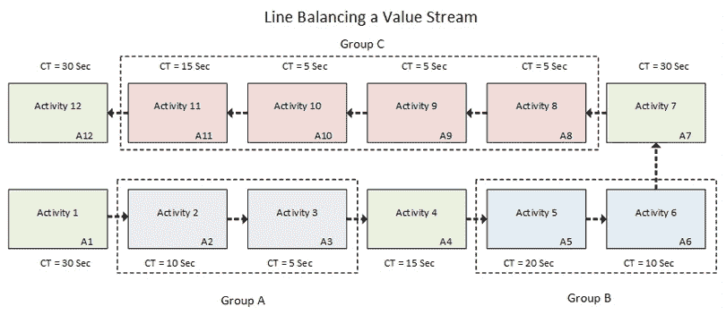

图 6.8 – 线路平衡示例

另外，注意到所有 12 个活动的总周期时间是 210 秒，其中包括 7 个单元，每个 30 秒。当然，我们没有包括等待时间。由于我们已经平衡了我们的生产线，我们希望在这个示例中不会有等待时间。

不幸的是，我们很少能得到像*图 6.8*中所展示的那样理想的世界。例如，价值流通常会生产多种产品、服务或结果的变体。每种产品变体可能需要不同的处理时间，并具有不同的设置或转换要求。它们甚至可能以不同的工作模式穿越价值流，并以不同的方式利用劳动力。

在这种情况下，分析平衡价值流的方法超出了本书的范围。然而，如果你发现自己处于这样的情况，开发一个**操作员平衡图**作为各个活动的工作元素、时间要求和操作员的可视化展示将会有所帮助。

开发操作员平衡图是一个两步过程。首先，我们希望创建一个快速表格，展示每个产品线活动的周期时间。我们还希望显示每个活动所需的操作员数量，以及整个价值流活动所需的操作员总数。

以下截图提供了操作员平衡图准备表的示例：

图 6.9 – 操作员平衡图准备表

接下来，我们创建一个条形图，显示活动及其周期时间，并绘制一条表示 Takt 时间的线。下一步是评估通过将周期时间较短的活动进行合并，以及共享资源的方式来平衡流动。

以下截图展示了单一产品的操作员平衡图示例。类似的图表需要在产品线之间进行开发：

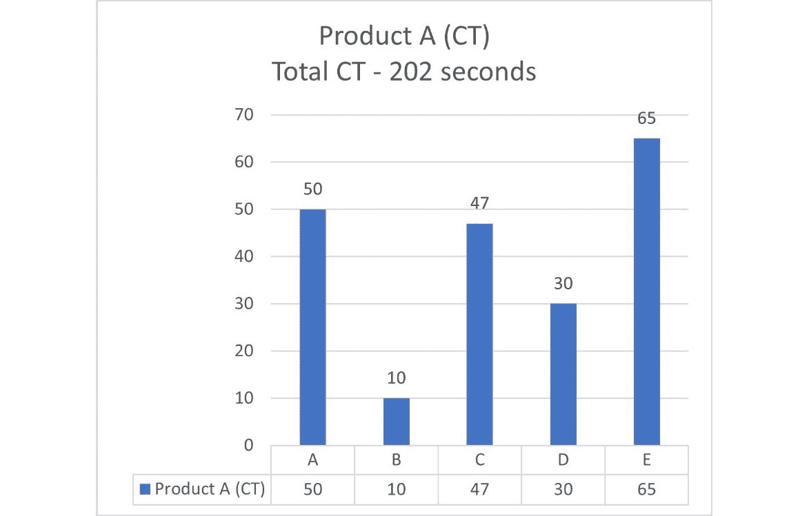

图 6.10 – 操作员平衡图

现在，让我们关注一种视觉展示，它有助于确保工人通过标准化工作表以标准化的方式执行其活动。

+   **标准化工作表**：这种工作表是一种以图表形式呈现的视觉辅助工具，展示价值流中操作的顺序。标准化工作表应展示活动的周期时间、质量检查、安全措施、标准工作流程、作为**在制品**（**WIP**）的件数、节拍时间、总周期时间以及操作员数量。

    以下截图展示了这种格式的标准工作表：

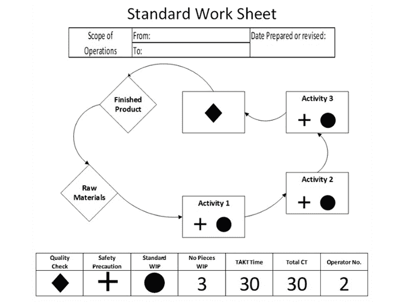

图 6.11 – 标准化工作表

另一种展示方式是通过表格形式创建工作表，展示活动顺序、活动描述和活动持续时间。以下截图展示了一种采用这种格式的**标准工作组合表**：

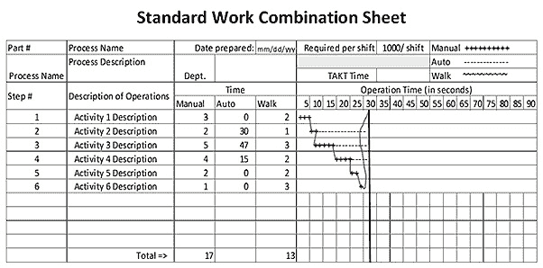

图 6.12 – 标准工作组合表

接下来我们将讨论快速换模方法，它能将换模时间保持在一分钟或更短。

+   **快速换模**：顾名思义，这种方法旨在确保我们能够迅速从一种活动切换到另一种，即使产品类型发生变化。这一概念来源于丰田的 Shigeo Shingo 的工作，旨在开发能够实现 SMED（单分钟换模）的方法。

    从客户的角度来看，设备和物料之间的换装时间和精力完全是浪费。他们希望支付成品费用，而不是设备设置或信息检索的活动费用。后者（及时检索正确信息）尤其影响协助价值流改进的 IT 专家。

+   **自主维护**：在制造环境中，自主维护活动旨在消除潜在的设备故障原因。换句话说，我们可以将这些策略视为预防性维护。我们在以操作为导向的价值流中也有类似的社区需求，来实施适当的维护、安全、回滚和故障切换功能。

+   **在制超市**：如前所述，超市提供成品库存缓冲区，客户可以按需取用产品。然而，当在价值流中难以实现连续流动时，在制超市策略允许在流程中建立排队，使得上游活动在其能力可用时有在制品（WIP）可以提取。这种策略有助于缓解当多个需求针对单一机器或活动时的生产不足。

+   **看板系统**：这是一种基于信号的池式系统，利用附在物料容器上的卡片来指示标准批量大小。当容器中的物料耗尽时，卡片会指示需要更换的物料及其数量。

    看板系统在基于 IT 的精益敏捷社区中变得非常流行，尽管这一方法与原始的精益生产概念略有不同。基于 IT 的看板系统通常采用一个白板，白板上用垂直线将其分割成几个列，列与团队的开发过程活动步骤相对应。团队成员在便签上写下产品待办项的名称，以便将其放置在各个列中。当团队成员有空接受新任务时，他们会查看上游活动列，看看有哪些可供他们选择的工作项，并从中做出工作选择。

    基于 IT 的看板系统的价值在于它促进了软件开发活动中工作的持续流动。在传统的敏捷流程中，例如 Scrum 或**极限编程**（**XP**），工作项作为一个批次被拉入 Sprint 待办事项列表，Sprint 的持续时间限制了这一批次工作项的流动。

+   **FIFO lanes（先进先出通道）**：FIFO 是一种在精益价值流中使用的生产控制策略，适用于工作项之间存在较大差异，并且多个价值流汇聚以进行最终组装或定制产品的情况。在这种情况下，我们需要确保零件不会因无人处理或无法进行必要的变换而卡在队列中。FIFO 策略确保在队列中等待时间最长的产品始终具有最高优先级。

+   **生产调度**：这与调度零件和材料以支持精益价值流中的工作流动有关。你还可以将信息调度纳入其中，确保客户订单要求的信息也能在正确的时间和正确的上下文中出现在价值流中的每个活动中。关键点是，在拉动导向的系统中，生产调度和库存控制系统必须协调上游活动，以支持离客户最近的下游操作的需求。

    的确，理解拉动导向的生产流程可能具有一定挑战性。从直觉上看，当有新的客户订单进入时，我们应该立即将其推送到生产车间，并让每个后续的生产阶段推动产品通过制造过程。然而，正如你现在所知道的那样，将产品推送通过生产过程只会造成排队和等待时间，隐藏缺陷和缺陷，并产生其他形式的浪费，从而阻碍生产力，同时增加成本。

    在精益企业中，较好的策略是从概念上让每个下游活动通过生产过程拉动订单。实施拉动式生产调度策略可以立即暴露问题，因为下游活动由于上游障碍而缺乏工作。此外，组织需要完善其信息系统，以确保零件和物料按照正确的顺序、到达正确的位置、在正确的时间到达。

    精益组织中的 IT 部门必须与价值流协同工作，以开发支持新精益流程的业务信息系统。

本节完成了我们对支持持续流动的工具的介绍。接下来，我们将介绍精益平准化阶段的工具。

#### 平衡阶段工具

在解决了客户需求和流动问题之前，我们不能开始改进生产负荷水平，但现在我们已经解决了这些问题，接下来可以看看帮助我们平衡价值流中生产流动的工具，使其变得更加高效和生产力更强。本小节介绍了平准化阶段或阶段的工具，具体如下：

+   **节奏化提取**促进了在客户希望以标准包装量交付产品时的配送，而不是逐个交付。然而，节奏化提取仅在价值流中没有产品变异的情况下有效。换句话说，生产流动是稳定的，产品线之间几乎没有或根本没有换线，并且周期时间大致相同。

    节奏化提取的时间等于节拍。回顾一下，节拍等于 takt 时间乘以包装量。节奏化提取通过将下游客户的总需求在指定的时间内分配到等于包装量的批次大小，帮助平衡生产流。

+   **平准化（负荷平衡）**是一个更好且更强健的方式，用于平衡具有不匹配生产活动的价值流中的生产计划。平准化使用基于节拍的节奏化提取法来平衡生产，但它根据生产产品的数量和种类，将其拆分为基于看板单元的计划。

    *图 6.12*展示了一个平准化负荷表的示例。假设这个精益价值流每天可以生产 500 个单位的产品，涵盖五个基本的产品线变种（即产品**A**到**E**），并且假设下游客户的批量交付要求为每批 25 个单位。

    此外，我们的价值流每天仅运行一个班次，总的可用生产时间为 28,800 分钟。因此，我们的 takt 时间等于可用时间 28,800 分钟除以我们的生产量 500 个单位，即 57.6 秒，而我们的节拍等于 takt 时间乘以我们的批量大小 25，即 1,440 秒（24 分钟）。换句话说，每 24 分钟，我们需要能够发运 25 个单位的产品。

    但现在，我们需要决定按产品线交货的频率。为此，我们需要知道每种产品的每日生产量。通过将每日需求量除以包装大小，我们可以确定每天为每种产品类型形成并释放多少个看板。下图展示了每种产品类型所需的看板数量：

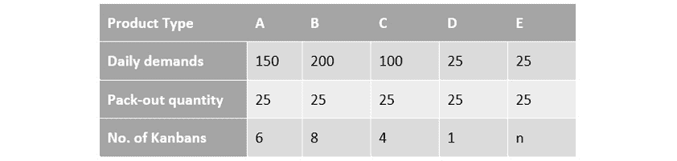

图 6.13 – 平准化负载表

我们还可以看到，每班次需要生产 20 个每个 25 个单元的看板。最后，平准化表帮助我们评估看板如何在各产品类型间分配（如*图 6.13*底部行所示）。

现在我们已经知道每种产品类型所需的看板数量，我们可以确定如何将它们安排进生产。接下来将讨论的平准化盒子是一种不错的方法。

+   **平准化盒子**，最初的构想是一个物理盒子，用来将看板卡片放入槽中，槽对应于一天中的特定时间段。平准化盒子的目标是平衡固定时间段的工作负荷。然而，我们也可以在电子图表或表格中以类似的方式调度和平衡看板。下图展示了一个这样的例子：

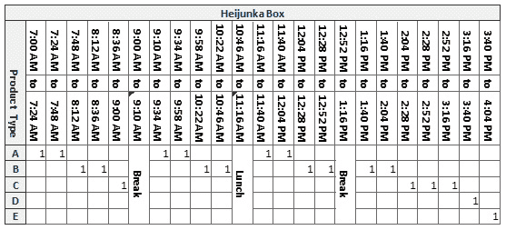

图 6.14 – 平准化盒子

有时，我们必须依靠蛮力来迅速完成任务。生产调度和平衡的这种方法是接下来要介绍的内容。

+   **跑步员**是指从一个活动地点到另一个地点，快速移动物料并及时解决生产问题的人。跑步员的主要目标是确保生产节奏得以保持。他们通常在生产节奏范围内沿指定路线行走，拾取看板卡片，供应工具和物料，并在合适的时间将它们送到合适的位置。

    生产线上的“跑步员”不能只是任何一个新员工，或者是对价值流生产活动和要求有深入理解的员工。他们必须具备出色的沟通技能，能够识别问题并报告任何阻碍流程的异常情况。他们必须理解精益概念以及 takt 时间和生产节奏的重要性。最后，他们必须能够高效且准确地完成工作。

#### VSM 故事板更新

在学习精益 VSM 步骤时，你需要准备好使用的另一个工具是 VSM 故事板。回顾一下，VSM 故事板是一个可视化工具，用来更新 VSM 项目的信息、指标和价值流图。该阶段对 VSM 故事板的主要更新是记录 VSM 团队可能选择解决的问题类别或问题。

如果你还没有这样做，你应该现在创建你的 VSM 故事板。你需要的仅仅是一个简单的大白板和一些标记笔，放置在一个共享或集中式的空间中。你可以使用*附录 B*中提供的 VSM 故事板作为示例，帮助你的 VSM 团队构建他们的故事板。请注意，*附录 B*中的示例 VSM 故事板使用了编号图标来指示在每个 VSM 步骤中需要更新的信息。

根据你在本章中学到的信息，你现在已经准备好开始绘制你当前状态的价值流图，这是下一章的主题。

# 总结

本节结束了我们关于 VSM 参与规划和准备的章节。在本章开始时，你了解到 VSM 是一种精益商业方法，旨在改善组织内价值流的流动，并从端到端管理和监控开发和交付生命周期。你已经了解到 VSM 并不是一个新概念。规划、绘制和改进精益生产流程在开发和运营导向的价值流中的传统步骤有八个。

最重要的是，你学到了 VSM 不仅仅是关于在 DevOps 范式中改善 IT 操作。相反，VSM 在我们的数字经济中作为一个强大的倍增器，通过利用精益和 DevOps 能力，改善、监控和管理组织中所有开发和运营导向的价值流。

在下一章中，你将学习如何绘制你价值流操作的当前状态和未来状态。你还将学习如何持续实施精益 Kaizen（即持续改进）过程。但在我们进入下一章之前，让我们花一点时间回顾一下你在本章中学到的内容。

# 问题

为了增强你的学习体验，请花一些时间回答以下 10 个问题：

1.  VSM 的基本内容是什么？

1.  列出三个精益实践对组织至关重要的原因。

1.  确定所选价值流“精益度”程度的可行策略是什么？

1.  精益应用的三个阶段是什么？

1.  为什么基准测试是一个重要的精益评估工具？

1.  Heijunka 的目的和目标是什么？

1.  VSM 与组织之间的关系如何？

1.  有哪三条主要的价值流是交叉并一起流动的？

1.  列出你需要理解的六个基本概念，以创建一个精益系统。

1.  精益的七种致命浪费是什么？

# 进一步阅读

+   *丰田公司（2013）准时生产—完全消除浪费的理念* ([`www.toyota.com.cn/company/vision_philosophy/toyota_production_system/just-in-time.html`](http://www.toyota.com.cn/company/vision_philosophy/toyota_production_system/just-in-time.html))

+   *新乡清（Shingo），S.，迪龙，A. P.（2005）。《丰田生产方式研究：从工业工程角度看（按需生产，及时生产）》第一版，英文翻译。CRC 出版社，泰勒与弗朗西斯集团。佛罗里达州博卡拉顿。*

+   *克拉夫奇克，约翰·F.（1988 年秋季）。《精益生产系统的胜利》。斯隆管理评论，1988 年秋季；30，第 1 期；ABI/INFORM Global，第 41 页。*

+   *科特尔，J.（2014）。《加速（XLR8）：为快速变化的世界构建战略敏捷性》。哈佛商业评论出版社。波士顿，MA。*

+   *马丁，J.（1995）。《伟大的过渡：利用企业工程的七个学科来协调人员、技术和战略》。美国管理协会，现在是哈珀柯林斯领导力部门的一部分。纽约，NY。*

+   *塔平，D.，卢斯特，T.，舒克，T.（2002）。《价值流管理：规划、绘制和维持精益改进的八个步骤》。生产力出版社。纽约，NY。*

+   *塔平，D.，卢斯特，T.，舒克，T.（2003）。《精益办公室的价值流管理：规划、绘制和维持精益改进的八个步骤》。生产力出版社。纽约，NY。*

+   *格雷戈里，L.（2018 年 9 月）。《丰田的组织结构：分析》。([链接](http://panmore.com/toyota-organizational-structure-analysis)) 访问日期：2020 年 12 月 28 日。*

+   *大野耐一（Ohno，T.），博德克，N.（1988）。《丰田生产方式：超越大规模生产》。生产力出版社。劳特利奇/泰勒与弗朗西斯集团。英格福出版公司。伦敦，英格兰。（原版于 1978 年在日本出版）*
