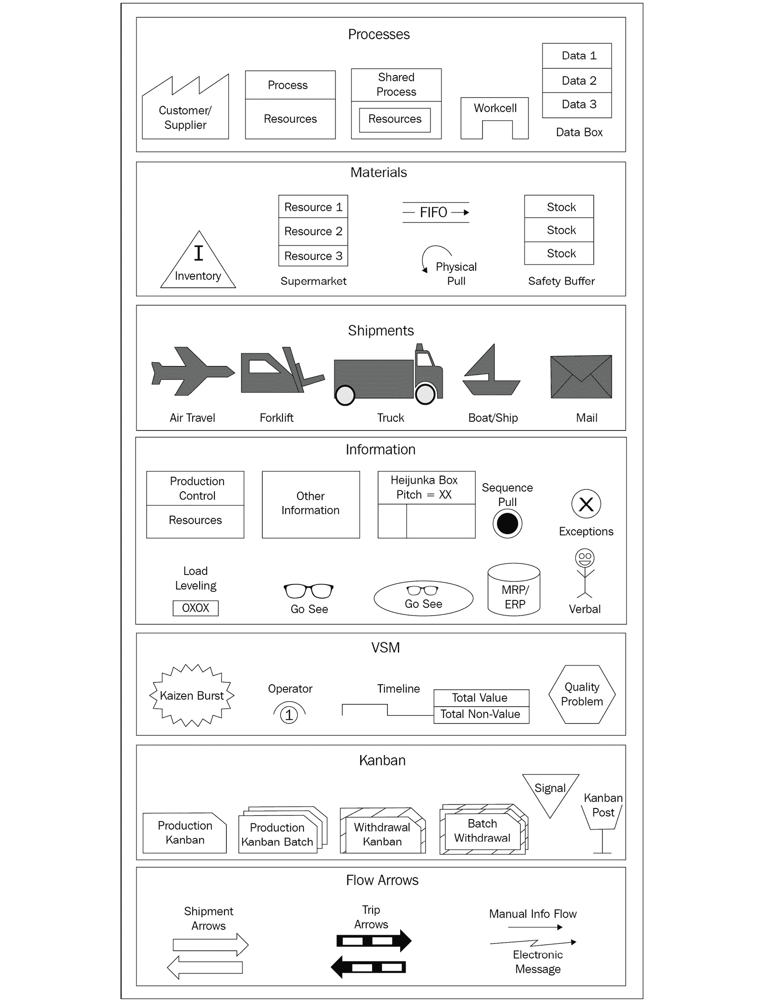
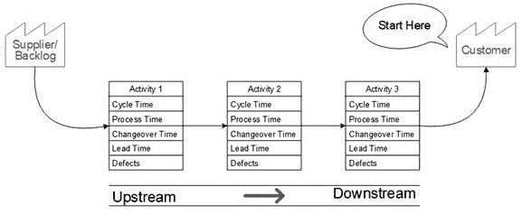
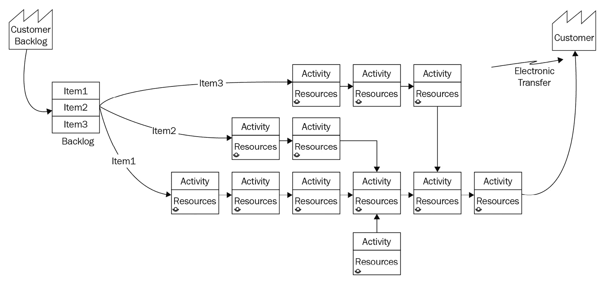
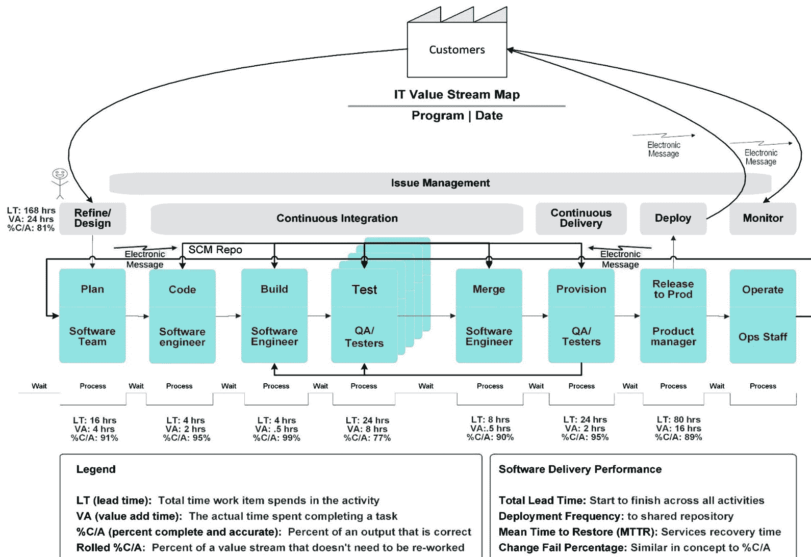

# 第七章：绘制当前状态（VSM 第 4 步）

在前两章中，你学习了**价值流管理**（**VSM**）的目的以及如何规划 VSM 计划。接下来，我们将深入探讨在 VSM 计划中进行的分析类型。具体而言，你将学习如何创建价值流图来描述当前的流程。这是我们八步 VSM 方法论中的*第 4 步*。

虽然直接开始工作并实施变更以消除感知中的浪费领域可能很有诱惑力，但问题在于，如果没有适当的分析，你的努力可能无法得到你和你的 VSM 团队预期的结果。如果没有当前状态的价值流图，你可能没有意识到当前价值流活动所带来的系统性影响。具体来说，我们需要记录现有的活动流程、订单录入系统、生产控制系统、周期时间、设备设置和产品换型时间、批量和批次大小、质量水平、缺陷以及不同步的物料和信息流。

在本章中，我们将讨论以下主要内容：

+   评估精益实践的当前状态

+   开始绘制价值流图

+   开始绘制价值流图

+   创建**信息技术**（**IT**）价值流图

根据本章提供的指导，你将能够在几乎任何类型的价值流中创建当前状态的价值流图。此外，本练习中使用的**持续集成/持续交付**（**CI/CD**）案例将帮助你可视化如何使用价值流图来评估面向软件开发的价值流。

# 评估精益实践的当前状态

在经典的业务流程分析技术中，常见的做法是分析当前的工作方式（*现状*），然后评估需要改进的领域，以实现期望的未来状态（*目标状态*），进行分析以了解为实现这些变化所需的全部工作（*差距分析*），最后创建并执行过渡计划。你会发现，VSM 实践遵循了类似的模式。本章介绍了如何从精益导向的视角，利用价值流图评估我们 CI/CD 活动的当前*现状*。

如前所述，在*第四章*中，*定义价值流管理*，**价值流图**的概念已经存在一段时间了。然而，它主要归因于丰田使用的一种分析方法，称为材料与信息流映射。正如*材料和信息流*这一术语所暗示的，价值流图提供了一种图形化的技术，用以同时建模材料和信息在价值流活动中的流动。但在深入了解价值流图之前，让我们先了解这种技术与其他业务建模技术的不同之处。

## 对比业务流程建模技术

参与**业务流程改进**（**BPI**）或**计算机辅助系统工程**（**CASE**）工具的人，可能对业务流程建模技术比较熟悉。例如，**对象管理集团®**（**OMG®**）**业务流程模型和标记**（**BPMN**）规范是 IT 社区中业务流程建模的标准规范。

其他流程建模标准包括**统一建模语言**（**UML**）中的活动图和**流程描述捕获方法集成定义**（**IDEF3**）。UML 最初由 Rational Software 公司创建，但现在已成为 OMG 标准，而**美国**（**US**）空军在**集成计算机辅助制造**（**ICAM**）计划下开发了 IDEF3。此外，IT 专家可能还熟悉各种工作流建模工具和技术，例如**Web 服务业务流程执行语言**（**WS-BPEL**），通常简称为**BPEL**。BPEL 是一种标准的可执行语言，用于在 Web 服务中指定业务流程操作。

鉴于有这么多正式的业务流程建模标准，你可能会想知道为什么我们需要一个不同的标准来建模精益业务实践。答案在于每种建模技术的重点不同。

价值流图提供了一个高层次的视图，展示信息和材料的流动，并提供了一个理想的图形设计，用于记录、传达并最终消除影响效率的浪费，以及影响组织提供以客户为中心的价值的能力。正如其名称所示，价值流图迫使组织将增加价值的活动与其他活动以及由官僚膨胀积累的浪费行为区分开来。价值流图的总体目标是识别并消除妨碍生产力的浪费——从创意生成到产品和服务的交付——并妨碍组织提供以客户为中心的价值的能力。

价值流映射的另一个重要方面是为 VSM 和价值流团队成员及其他利益相关者之间的视觉协作提供一个平台。这些图示使参与者能够更好地沟通他们对当前运营的理解，并且在之后评估和传达替代的变革方案。

相比之下，业务流程改进和以工作流为导向的流程建模技术，专注于识别工作流的协调，并为业务流程自动化工作提供关于数据和数据流的详细信息。BPMN 是通过软件应用程序促进 BPI 的经典方法。而 BPEL 是通过基于 Web 的应用程序来建模和改进业务流程数据和信息流的现代方法。

业务流程模型提供了跨领域和跨职能业务环境中技术与组织活动相互作用的详细视觉展示，强调了复杂的互动和决策点。业务流程模型通常用于支持业务流程再造和改进活动，并创建自动化这些改进的业务系统。

换句话说，IT 社区和 BPI 分析师使用的标准化业务流程建模技术专注于建模业务流程以实现自动化。而价值流映射技术则建模跨价值流的工作和信息流，以消除浪费，作为精益改进倡议的一部分。

顺便提一句，在 1990 年代初到中期，作为领导**AT&T 全球信息解决方案**（**AT&T GIS**）的 CASE 工具和工作流策略的产品经理，我与《电子绩效支持系统》一书的作者**Gloria Gery**合作（Gery, 1991）。我们的合作目标是确保我们的专业服务组织构建的**电子绩效支持系统**（**EPSS**）能够支持客户业务流程中既有专家又有新手从业人员的需求。

我当时以及现在仍然最关心的一点是，许多业务系统并没有帮助支持从价值流角度流动的工作。例如，假设你的业务系统没有帮助强化工作和信息流的期望目标状态，那么你将很难实现 VSM 倡议的目标和任务。

业务流程的自动化与精益实践并不矛盾，正如你将在下一节中看到的那样。因此，两种建模方法——价值流映射与流程建模的结合——对于实现 VSM（价值流映射）倡议的更广泛效率目标至关重要。

## 业务流程的自动化

在 Lean 实践中，使用流程建模工具（尤其是 BPEL）来自动化业务流程并不矛盾，因为这样的活动与**丰田生产方式**（**TPS**）中的**自働化**（也称**自动化**）概念是一致的。但在我们不知道一个业务流程是否高效并且具有增值之前，自动化该流程是没有意义的。

确实——我们可能能够采用自动化和数字化信息系统，也许是**现成商业软件**（**COTS**）解决方案的组合，使我们的流程更加高效。但过快推进的危险在于，可能会出现吞吐量不匹配、隐藏缺陷，或充斥着没有增值的工作，最终我们会把浪费进行自动化。而且，即便是 COTS 解决方案，通常也需要高度定制才能实现有效的业务流程，使得组织具备高效、增值和竞争力。

在奠定了这些基础后，让我们开始进行价值流映射练习。

# 开始映射

对于这一部分，我们假设你的组织和 VSM 团队已经完全准备好并致力于 Lean 实践。你们也已经选择了价值流，并学习了 Lean 实践的基本原理。现在，是时候开始工作，开始向 Lean 企业过渡了。没有理由再拖延了。用丰田的泰一千·大野的话说：

*去做吧！*

由于这是一本关于 VSM 推动**开发-运营**（**DevOps**）能力的书，我们的示例遵循 Lean 方法在 IT 价值流的**持续集成**（**CI**）和**持续交付**（**CD**）部分中的改进。如你在*第五章*《通过 DevOps 管道推动商业价值》中学到的，CI/CD 实践是更广泛的 DevOps 管道的一个子集。因此，我们的 CI/CD VSM 用例示例旨在简化分析范围，重点介绍如何使用 VSM 方法和工具。

别忘了，DevOps 几乎是数字经济中所有价值流改进的关键推动力。然而，本书中介绍的原则和技术同样适用于所有 VSM 项目，无论正在改进的是哪个价值流。

最后一条提示：请花点时间查看*附录 B*中的 VSM 故事板。它是记录当前和未来状态价值流映射活动的主要工具。

## 构建价值流映射图标标准

价值流映射的一个关键组成部分是坚持使用特定的图标来描述你的价值流系统元素——例如，*图 7.1*，你很快就会看到，展示了最常见的价值流映射符号作为图标。当然，你的组织或 VSM 团队也可以选择使用其他图标。这没有问题，因为没有一个权威标准机构来管理价值流映射的图标。

然而，确保每个人都完全理解在您的价值流图中使用的图标定义，并且不允许人们在没有适当协议和沟通的情况下创建非标准图标。没有标准，VSM 团队成员和其他审核图的利益相关者之间的沟通和理解会迅速恶化。本书中使用的价值流图符号按类别组织，如下所示：

+   **过程**：识别跨越客户和供应商的工作活动，包括专用和共享流程、活动工作单元以及数据框，显示关键的信息和指标。

+   **材料**：指示材料在价值流各个阶段的处理方式，包括库存和缓冲库存，以及生产控制策略，如超市、拉动和**先进先出**（**FIFO**）。

+   **运输**：包括所有识别出的用于运输材料、零部件和产品的机制，包括空运、叉车、卡车、船只或轮船。但您的组织也可以包含用于显示由铁路、自动化线、机器人或第三方运输公司进行的运输的图标。

+   **信息**：捕获度量指标，以提供当前状态（现状）和期望的未来状态（目标状态）分析，并提供支持开发和运营价值流工作流的信息。*图 7.1* 中显示的图标表示从多个来源收集的信息，例如：

    a) Gemba（*现场观察*）活动或口头沟通

    b) 在**企业资源规划**（**ERP**）/**物料需求计划**（**MRP**）系统中维护的信息

    c) 来自生产控制数据或策略的信息

+   **价值流图**：用于显示价值流中的特定点，团队希望在图中突出显示某些感兴趣的区域，如 Kaizen 爆发（即**快速过程改进**（**RPI**）计划要求）、操作员、时效性或质量问题。

+   **看板箭头**：显示材料和信息在运输和生产过程中的流动。请注意，直箭头通常表示推式产品控制策略，而弯箭头表示拉式策略。弯曲箭头表示电子信息流。

您可以在以下截图中看到最常见的价值流图图标：

图 7.1 – 常见的价值流图符号

请注意，*图 7.1* 中显示的常见价值流图符号包含了本书中使用的 41 个标准精益图标。图形显示了跨越之前确定的七个 VSM 图标类别的符号。

每个 VSM 工具提供商都会提供一个带有自己图标集的价值流图工具。尽管大多数现代 VSM 工具都具有价值流图绘制功能，但许多图形工具提供了易于使用的**图形用户界面**（**GUI**）工具，配有预定义的图标来绘制价值流，且通常价格要低得多。

VSM 团队可以使用标准的价值流图符号绘制目标价值流中的工作和信息流。然而，在绘制图之前，还有一步是收集数据，以了解价值流活动中的工作和信息流。

创建准确的价值流图所需的理解并不是通过阅读规格和文档就能获得的。相反，他们必须走进车间，与做实际工作的人员会面，提出大量问题，并亲自观察工作和信息是如何在价值流中流动的。

## 进行现场观察（Gemba）

当前的价值流图绘制活动的主要目标是识别增值活动，同时消除那些造成浪费（Muda）的活动。因此，在开始当前状态图绘制活动之前，我们的 VSM 团队必须先*去现场*（Gemba），了解价值流的运作方式，然后再进行绘制和提出改进建议。

有些书籍让人觉得 Gemba 观察只是一个简单的一次性活动。这是很遗憾的，因为一次价值流观察并不能完成任务。例如，作为德州仪器（Texas Instruments）的一名年轻制造与工业工程项目经理，我在车间的时间远远超过了我在办公桌前的时间。我的工作涉及规划和指导三项大型工厂改进项目，涵盖两个地理位置分隔的制造工厂。我所需的生产信息并不在办公桌上，而是在车间，并且主要在执行工作的人的脑海中。

Gemba 和当前状态绘制活动提供了对阻碍物料和信息流动的浪费区域的洞察。另一种理解浪费的方式是，它几乎总是会导致额外的行政开销和处理时间。我们的重点始终应该放在客户身上，而这类行政任务大多是开销和非增值的。

在进行 Gemba 活动时，有三条基本规则，如下所示：

+   **亲自去看**发生了什么。

+   **多问为什么**，以找到问题的根本原因（即**5 个 W**或**5 个为什么**）。

+   **尊重他人**：你的工作是帮助解决问题，而不是寻找过错。

当 VSM 团队成员进行 Gemba 观察时，需要有条理地进行。以下步骤概述了一个合理的 Gemba 观察策略：

1.  确定目标和任务。

1.  让价值流团队知道你即将到访及访问的原因。

1.  以两人或更多 VSM 团队成员一起行动。

1.  跟随价值流的流动。

1.  聚焦于识别价值流过程和工作活动中的问题，而不是指责人。

1.  记录调查结果。

1.  提问——即通过五个 W（谁、什么、何时、哪里、为什么）或“为什么”五次来充分理解问题并找出根本原因。

1.  听取意见——不要在最初的走访中建议变更。你的目标是学习。

1.  后续跟进与价值流员工，分享你的观察和建议。

1.  再次前往 Gemba 确认实施和改进的结果。

1.  再次前往 Gemba 启动新的 Kaizen 改进周期。

一个同步且有序的价值流，从流动的角度来看，几乎是自动化的。在一个组织良好的价值流中，工作流的流动有自然且直线的顺序。信息和物料流动没有障碍或瓶颈。所需的正确信息和物料会在需要时立刻到位，而不会提前或滞后。这就是理想的未来状态。利用你的 Gemba 走访来识别当前状态下这些事情没有发生的区域和原因。

最后，VSM 团队必须了解收集准确的实时信息的重要性，包括实际工作活动、信息流和物料流，无论现有的活动是**增值**（**VA**）还是充满浪费。如果未能记录所有不同步的流动和浪费，就无法将价值流评估为一个整体系统。此外，缺乏从系统角度看待价值流的全貌，也就无法理解影响其表现的动态。

## 以客户为中心开始我们的流程图

从最终客户交付开始进行当前状态绘制，向上游（回溯）绘制各个流程。记住——目标是交付客户所需的产品、服务或结果。如果不在进行当前状态评估时考虑客户的需求和预期结果，VSM 团队可能会错过那些初期或中期活动对价值交付产生负面影响的部分。

下图直观地展示了价值如何流向客户：

](img/B17087_Figure_7.2.jpg)

图 7.2 – 价值流图从客户开始

在传统的流程模型中，我们通常从第一个活动开始，逐步绘制跨活动和工作地点的工作流。在价值流图绘制中，我们从客户接收价值的起点开始收集数据，然后向上游回溯。每一步，我们都要问自己，当前的活动是否与客户需求对齐，或者是否在某种形式上增加了浪费。

分析的顺序并不意味着我们打算按照这个顺序解决浪费问题。相反，VSM 团队必须根据最大价值影响来优先改进。我们将在*第九章*，*绘制未来状态（VSM 步骤 6）*中详细讨论这个话题，但现在，了解我们通过价值流逆向绘制的原因是非常重要的，原因包括以下几点：

+   它将焦点保持在客户的需求上。

+   它帮助我们将思维导向基于拉动的流程。

+   在生产环境中，处理多条装配分支的复杂流程时，我们可以更好地应对挑战。

后续问题，管理多个分支，增加了管理流程的复杂性。在推式生产调度系统中，几乎不可能让物料流在需要时可用，从而避免排队等待。然而，正如你将在*第九章*，*绘制未来状态（VSM 步骤 6）*中发现的那样，使用拉动式生产调度和**准时生产**（**JIT**）物料与信息交付系统，可以更容易避免瓶颈。

在这里，你可以看到一个包含多个分支的价值流图：

图 7.3 – 多分支的价值流图

现在我们已经明白，我们需要以客户为中心来开始 VSM 图绘制，让我们来了解一下在进行当前状态绘制时需要做的准备工作。

## 准备绘制

你已经学会了收集当前状态图所需信息的 Gemba 基本步骤，但让我们更详细地看看在进行当前状态绘制之前所需的准备工作。VSM 团队在绘制前通常需要执行四个常见步骤，如下所述：

+   确定 VSM 团队成员分工

+   绘制价值流的粗略草图

+   开始你的 Gemba 练习

+   讨论数据

VSM 团队需要为每个成员分配具体角色，以简化他们在任何当前状态绘制练习中的数据收集和绘制工作。虽然 VSM 团队可以使用电子工具或翻转图表来绘制图，但最好从一个可擦写的白板开始。你将在整个练习过程中定期更新它，并且一个更大的白板更便于每个人查看和参与讨论。最好还指定一个人负责记录，或者更好的是，在团队成员之间轮换这个角色。

需要另一个人负责促进映射活动，确保团队专注于当前目标并监控时间。如果团队保持日程安排并有时间休息，他们会更容易集中精力完成工作——如果需要，可以稍后安排更多时间回去完成工作。甚至可以允许在更新映射之间留出时间，让团队休息并反思已完成的工作，审查地图以识别可能遗漏的信息。

我们还需要一个人在 Gemba 走访期间充当计时员。他们的职责是记录在 Gemba 走访过程中观察到的价值流活动的周期时间和换班时间。他们还应记录在走访中发现的其他重要信息，例如问题、原因、影响、延迟或其他浪费领域。

让我们停下来讨论创意工作与标准化工作之间的区别。开发者进行软件架构和设计、编写代码的工作是创意性工作。没有两个业务需求是完全相同的，开发者必须思考所涉及的工作，并设计合适的解决方案。相比之下，标准化工作包括在受控环境中不应有显著变化的重复性任务。

标准化工作是精益的核心，消除浪费，从而提高结果的可预测性。不幸的是，在敏捷实践中，标准化工作往往不受欢迎，因为许多敏捷从业者不希望被束缚于特定的工作方式。然而，当组织试图在持续集成/持续交付（CI/CD）和 DevOps 流水线，或任何其他精益价值流中构建和维护持续流动时，没有标准化的方法和工具会带来额外的风险。

例如，假设我们已经花费了时间、精力和资金来设计精简的价值流，包括工具的采购。在这种情况下，我们不应随意进行更改，而应彻底评估我们的需求和目标，并评估更改活动和流程可能带来的负面后果。价值流图（VSM）是评估我们精益企业持续改进的适当方法。

无论是使用敏捷（Agile）还是精益（Lean）理念，我们仍然希望保持与我们节拍时间（takt time）相匹配的生产流程。换句话说，理想情况下，我们的生产速率（Takt）应与客户的需求速率相匹配。唯一具有挑战性的地方是在**软件开发生命周期**（**SDLC**）的前端，在那里产品负责人和团队会识别、优先排序并细化需求。接下来，软件团队必须评估涉及的工作量，以设计和实施这些需求作为软件功能和特性。最后，产品待办事项的精炼具有创意性质，这使得预测工作范围和持续时间变得更加困难。

一旦工作项进入开发周期并作为精炼任务执行，工作的流动可以遵循一套标准的、具有时间限制的活动，这些活动是合理标准化且可预测的。然而，强行对产品待办事项的精炼创意工作施加任意的时间限制要困难得多。相反，改善设计相关工作的可预测性的最佳策略是将初步的高层需求细分成尽可能小的部分。

基于微服务的架构在最小的规模层面上分解需求，以描述最细粒度的独特业务服务。除了更好的设计可预测性，基于微服务的架构的其他好处包括能够创建高度可维护、可测试和可独立部署的功能单元，作为松散耦合的业务服务。

在 Gemba 走访之前绘制当前状态图的目标是确保 VSM 团队成员理解价值流中的工作。因此，让熟悉价值流的人来引导这一工作可能会很有帮助。

粗略的地图有助于在 Gemba 走访之前改善 VSM 团队对价值流活动的理解，从而使他们在走访中的时间更加高效。此外，草图有助于团队后来识别价值流中与他们对流程应如何运作的原始预期不符的区域。

当团队开始进行 Gemba 走访时，应准备好捕捉以下信息：

+   每班次或每日的总工作时间

+   价值流中的计划停机时间和休息时间

+   实际执行工作的可用时间

+   支持价值流的员工和承包商或合作伙伴的数量

+   每个价值流工人的工作量

+   价值流中每项活动的交付频率

+   每项活动的周期时间，从开始到完成

+   每个价值流活动的等待（排队）时间和数量

+   标准流程的任何例外情况

+   价值流中其他相关的独特信息项

在开始 Gemba 走访之前，团队应尊重价值流工人的时间和努力。出于礼貌，VSM 团队成员需要寻求价值流经理的批准，并根据 VA 经理和员工的日程安排规划走访，以最小化对其工作的影响。

花时间沟通你计划在哪里进行走访以及你希望达成的目标。然后，当你参与 Gemba 走访时，确保你和你的团队成员自我介绍，并提醒团队你此次访问的目的。诚实回答他们的问题，并且不要回避解释精益生产实践的目标和益处。

请记住，您需要获得他们的支持。在您走访时，请尊重工作人员的时间和工作区域。最重要的是，要记住他们是价值流中执行工作的专家。

VSM 团队现在可以开始他们的 Gemba 走访。VSM 团队成员不应在收集到数据之前进行分析。这只会浪费宝贵的时间并妨碍价值流工作人员的工作目标。走访结束后，将有充足的时间反思和分析数据。

既然我们已经进行了 Gemba 走访并收集了数据，现在是时候开始我们的当前状态映射练习了。

# 开始绘制地图

到目前为止，您已经完成了以下步骤，为当前状态映射练习做好准备：

+   确定客户需求和优先事项

+   制定价值流映射计划

+   分配角色和责任

+   进行信息收集的 Gemba 走访

+   开发当前状态图的粗略预草图

现在是时候使用这些信息来创建我们的当前状态价值流图了。再次建议使用大白板或海报板进行此操作，并根据需要使用可擦除的标记笔或铅笔，以便您可以纠正任何错误或遗漏。再次提醒，您可以使用软件工具来创建您的图表，但请确保有足够大的屏幕供所有人围绕并查看。

尽管数字化的 VSM 映射工具能制作出更好看且更易读的图纸，但它们也可能会使映射过程变慢，尽管有些工具比其他工具更容易使用。在团队准备好展示和分发工作成果之前，手工绘图可能更为合理。团队需要凭借自己的判断来决定哪种方法最适合他们。

## 按八个步骤绘制当前状态图

绘制价值流图并没有单一的最佳方法。然而，最好有一个共同的策略来指导整个过程，确保没有遗漏。秉持这一目标，以下八个步骤按此顺序应用，提供了一种务实的当前状态映射方法。

1.  **绘制客户和供应商**：识别提供需求并接收交付成果的外部或内部客户。请注意，在*图 7.3*中，地图从客户的角度识别了产品待办事项。此外，注意到*图 7.3*中客户图标出现了两次，这是不必要的。在这种情况下，使用图标两次——一次表示需求，另一次表示交付——表明产品待办事项包含了所有客户需求，而交付成果则送给特定客户。最后，识别任何提供材料、产品或零部件的供应商、承包商或合作伙伴，他们为价值流提供贡献。

1.  **绘制进出活动**：在以 IT 开发为导向的价值流中，进入点可能是待办事项精炼或 Sprint 目标的确定。相反，退出点可能是部署活动。由于活动代表着工作，因此一种好的做法是使用动词和动词短语来命名活动。此外，由于我们活动的预期输出是有形的——以产品、服务或结果的形式——一种好的做法是使用名词和名词短语来命名输出。

1.  **绘制进出口过程之间的所有活动**：虽然你最初是从客户的角度反向收集数据，但你可以从最远端（即从左到右）开始绘制活动。这种方法使得以图形方式描述工作流程更为简便。确保使用带有分段字段的活动框来记录必要的数据，例如周期和转换时间、等待时间、资源、批次或批量大小、缺陷及其他重要细节。

1.  **列出所有活动属性**：这些包括交货时间、周期、转换时间、等待时间、资源、批次或批量大小、缺陷以及其他必要的细节。

1.  **绘制活动之间的队列和等待时间**：使用不同的图标来表示队列的类型，例如等待材料、安全库存、缓冲库存和预期库存。**等待材料**是由于生产速率不匹配而在工作单元之间形成的队列。**安全库存**是为确保在材料短缺时可以继续工作而储备的材料。缓冲库存有助于抵御客户引起的需求波动或激增。最后，**预期库存**包括为应对预计的需求激增（如节假日需求）而存放的成品。

1.  **绘制价值流内的所有通信**：使用不同的箭头类型来指示通信是口头的、邮件的还是电子信息流。

1.  **绘制推式或拉式图标以识别工作流类型**：使用直箭头表示推式流动。使用圆形箭头表示拉式流动。使用不同的箭头类型来表示外部材料和产品的运输与价值流内部的材料和产品流动。

1.  **记录所有其他收集的数据**：使用附录 B 中的价值流故事板来说明你可能需要收集的信息类型——即地图日期、价值流名称、VSM 主导者、团队成员、问题类别以及其他与活动和流程相关的重要信息。

可能会很想快速完成当前状态图的绘制，但不要急于求成。团队可能会犯错或遗漏，后来可能会影响团队的可信度以及他们未来状态图和建议的准确性。

同时，不要轻易将你当前状态价值流图中的现有信息应用到标准化实践中，比如车间流程或指南。这些来源通常代表理想化的方法和预期的指标，但可能无法反映实际的做法。再一次，这也是为什么我们使用 Gemba 亲自去现场观察的原因。

# 创建 IT 价值流图

VSM 已成为在 IT 相关价值流中实施和改进精益实践的关键能力。通常，采用 VSM 方法和工具的组织可能已经建立了敏捷实践，并可能实施了 CI/CD 工具链。但现在，他们的目标是实施 CI/CD 实践，将其转化为精益管道。VSM 团队的主要目标是改善协作，并在面向开发的价值流中同步信息和工作流程。

这些活动中的任何一个都不能保证 IT 部门已从以客户为中心的精益视角出发，致力于消除浪费。然而，VSM 帮助我们做到这一点。此外，在此次映射过程中，假设执行管理层与 VSM 团队合作，已选择一个软件开发项目作为其目标价值流进行改进。

更准确地说，在本书中使用标准化八步 VSM 方法的示例中，我们假设组织有一个或多个使用敏捷实践的软件开发团队，并购买了工具链来实现 CI/CD 能力。我们并没有假设组织会利用购买的工具集成或自动化 SDLC 过程。

此外，我们的公司高管已批准甚至强制执行 DevOps 实践，但可能并未完全理解执行如此重大的价值交付转型所涉及的问题。该问题的解决超出了本 CI/CD 用例的范围，但我们在本书的 *第三部分* 中讨论了这个问题，*安装 DevOps 管道以在数字经济中竞争*。

在开始工作之前，VSM 团队成员必须接受所有精益实践的培训——假设这是他们的第一次 VSM 项目。接受精益培训后，团队会再次召开会议，为接下来的当前状态映射工作做准备。作为准备工作的一部分，他们分配角色和责任，并初步勾画出他们预期看到的 IT 开发流程。最后，他们进行 Gemba 走访，收集所需数据。

在这一阶段，VSM 团队讨论他们已收集的数据，并构建当前状态图。在映射过程中，团队会通过几次会议讨论数据，并构建当前状态图。他们可能还进行了额外的 Gemba 走访，以收集更多数据，并验证之前收集的数据，后者可能看起来不完整或不准确。

## 记录我们的 Gemba 走访发现

在我们开始绘制当前状态图之前，我们需要收集足够的信息来绘制我们的地图。以我们的示例为例，VSM 团队必须记录以下活动，涵盖从程序 IT 价值流的开始到结束：

+   **计划**：任务包括用户故事的细化、更新待办事项优先级、进行架构和设计审查、分配团队任务以及更新发布计划。

+   **编码**：任务包括开发测试、编写软件代码和配置、将源代码提交到版本控制下的源代码仓库、进行静态代码分析以及进行自动化和同行代码审查。

+   **构建**：任务包括编译代码、进行单元测试、检查代码度量（大小、复杂性、耦合度、内聚性和继承性）、构建代码容器或包、准备或更新部署配置以及监控仪表板。然而，VSM 团队注意到，构建过程会因所使用的编程语言和工具不同而有所不同。

+   **测试**：任务包括——但不限于——冒烟测试/构建验证、回归测试、性能测试、负载测试、压力测试、**用户界面**（**UI**）、**端到端**（**E2E**）测试和系统测试，并且根据需要，可能还会有其他特定的测试。

    测试可以手动执行，或者更好地通过运行自动化测试脚本来配置服务器并启动测试。理想情况下，多个测试会在不同的测试服务器或容器上并行运行。但这属于未来状态的考虑。相反，VSM 团队需要了解 IT 组织如何设置其测试环境，所需测试类型，以及开发团队如何执行当前状态图中的测试活动。

+   **合并**：任务包括在**源代码管理**（**SCM**）仓库中创建分支、推送、拉取和合并代码。

+   **配置**：任务包括设置或更新基础设施配置，以适当的方式包括开发/工程、**质量保证**（**QA**）/测试、暂存和生产环境。

    当 VSM 团队进行 Gemba 走访时，他们注意到开发团队会在所有新的测试实例上重新执行冒烟测试，包括暂存和生产环境。他们的目标是验证最新的软件安装是否稳定，并符合所有验收标准。

+   **部署**：作为正式发布过程的一部分，任务包括准备发布说明，冻结代码、配置和功能的决策，以及开发**系统管理员**（**sysadmin**）、用户和流程指南及培训材料（如有必要）。

+   **操作**：任务包括通过仪表盘和错误日志监控性能和安全性。监控工具通常包括在网络、服务器或应用程序在预设的性能和安全度量标准下变得不稳定、失败或故障时触发警报的功能。**安全信息与事件管理**（**SIEM**）是操作监控的另一个关键组成部分。

在他们的 Gemba 走访过程中，VSM 团队还注意到运营部门已实施基于**信息技术基础设施库**（**ITIL**）的**IT 运营管理**（**ITOM**）和**IT 服务管理**（**ITSM**）实践。然而，在初步的 VSM 工作中，团队选择专注于记录开发团队的 IT 价值流工作和信息流，以改进他们的 CI/CD 管道流。

VSM 团队计划稍后处理面向操作团队的工作和信息流。目前的问题是开发和运营团队未能作为一个集成的 IT 价值流共同运作。尽管 DevOps 能力的实施作为战略是组织高层管理团队的既定目标，但 VSM 团队决定价值流改进工作超出了他们批准的范围，并需要单独的任务授权。

在 VSM 团队观察这些活动时，他们会监控并记录活动的前置时间、增值时间（VA 时间）、**故障平均间隔时间**（**MTBF**）和**恢复平均时间**（**MTTR**）以及每个价值流阶段中，完成并准确的与活动相关的工作百分比。此外，VSM 团队还观察了整个价值流中的工作和信息流，并记录了 IT 组织标准软件交付流程中的例外情况。

## 绘制 IT 当前状态价值流图

对于本节内容，请参阅*图 7.4*，展示了 VSM 团队当前状态的 IT 价值流图的最终图示。

请注意，*图 7.4*中的 IT 价值流图包括监控活动，这本质上是一个 IT 运营导向的任务。VSM 团队选择将监控活动展示为信息源和产品待办事项的积压项。产品待办事项作为一项活动展示，用于记录精炼过程，但你也可以展示一个客户待办项的库存或等待队列。

*图 7.4*中展示的当前状态图似乎相对详细且复杂；然而，它并不那么详细。提供的信息相对高层，VSM 团队需要付出更多的努力，以进一步细化这些活动。

例如，Karen Martin 和 Mike Osterling 在他们的书《价值流图》中，描述了基于 Scrum 的 IT 开发组织中的**变更请求**（**CR**）过程，这是整个 IT 价值流中的一个小子集。他们的 CR 过程当前状态图包括十个不同的活动和六个信息系统，用来管理工作和信息流（Martin, Osterling; 第 181-186 页，2014 年）。

花点时间回顾一下*图 7.4*，包括 VSM 收集的度量指标。**LT**（代表**前置时间**）是一个度量，汇总了价值流中每个活动的周期时间和等待时间。相反，**VA**是指开发人员在活动中执行的工作时间，提升了每个活动中工作项的价值。最后，**%C/A**（即**完成且准确的百分比**）是一个度量，表示通过该活动的工作项百分比，这些工作项无需返回进行某种返工：

图 7.4 – DevOps 价值流图

这些是任何类型精益改进计划中监控的标准精益度量指标，但还有许多其他指标。以下部分将我们引导至 VSM 方法中精益改进的*第 5 步*——*识别精益度量指标*，但在进入该部分之前，让我们先花点时间回顾一下我们在绘制当前状态图时使用的工具。

## 当前状态绘制——工具

本节总结了在当前状态绘制过程中使用的工具，其中大部分工具我们已经在本章中提到过——例如，用于当前状态绘制的工具包括*图 7.1*中识别的价值流图符号。你还需要一个大幅海报板或白板，确保每个人都能看到信息并参与绘制过程。正如*附录 B*所示，价值流故事板是另一种重要工具，用于记录价值流数据和当前的价值流图。白板最适合团队合作，但价值流故事板则提供了 VSM 绘制活动和分析的永久记录。

在前往价值流工作区进行 Gemba 走访之前，你的团队应该制定一个活动清单和关键指标（即属性），并记录下来。然后，你的团队将指标直接记录在价值流图上。一种好的策略是列出活动和相关属性的项目清单，以便记录在 Gemba 走访中发现的信息。

当你和你的 VSM 团队成员从 Gemba 走访回来后，你可以开始绘制当前状态图。

本节介绍了另一种八步绘图过程，作为绘制价值流图并记录关键属性和活动信息的工具，完成了我们关于执行当前状态价值流绘制练习的讨论，这是我们 VSM 方法论中的第四步。

# 总结

在本章中，你学会了如何创建一个价值流的当前状态图，以便从精益生产概念的角度评估工作和信息流。你还学会了价值流图与其他过程建模概念（如 UML、IDEF3 和 BPEL）之间的区别。

作为绘图练习的一部分，你学会了如何使用一套标准的精益符号作为图标。这种策略旨在简化你的价值流图，同时确保其他人能够理解图表所表示的内容。

也许最关键的一点是获取有效的信息，这与构建图表无关。在本章中，你学会了如何通过 Gemba 走访亲自观察工作现场的情况。此外，你还学到，执行工作的操作员是关于如何执行工作以及如何改善工作和信息流的最佳信息来源。

在下一章中，你将学习使用度量来分析价值流的表现，既包括当前状态，也包括理想的未来状态。

# 问题

1.  为什么不建议直接开始绘制价值流的理想未来状态？

1.  价值流图与过程建模技术有何不同？

1.  为什么在改进工作和信息流之前，我们不应该自动化一个业务流程？

1.  一旦 VSM 团队、价值流操作员和其他关键利益相关者学习了精益流程，是否还需要在执行他们的 VSM 计划之前做些什么？

1.  为什么要为价值流图绘制提供一套标准的符号和图标？

1.  作为价值流图绘制的一部分，进行 Gemba 走访的总体目的是什么？

1.  在实践 Gemba 时，有哪些三条基本规则？

1.  绘制当前状态图时，从哪个方向开始？为什么？

1.  VSM 团队如何实施精益改进到价值流中，顺序如何？

1.  绘制当前状态图的八个步骤是什么？

# 进一步阅读

+   Gery, G. (1991) 《电子性能支持系统：如何通过战略性使用技术重塑工作场所》。ISBN 978-0-9617968-1-5。Weingarten 出版公司，波士顿，MA。

+   Tapping, D., Luyster, T., Shuker, T. (2002) 《价值流管理：规划、绘制和维持精益改进的八个步骤》。生产力出版社。纽约，NY。

+   Tapping, D., Luyster, T., Shuker, T. (2003) 《精益办公室的价值流管理：规划、绘制和维持精益改进的八个步骤》。生产力出版社。纽约，NY。

+   Tapping, D., Kozlowski, S., Archbold, L., Sperl, T. (2009) 《精益医疗中的价值流管理：在所有类型的医疗环境中进行规划、绘制、实施和控制改进的四个步骤》。MCS 媒体公司，切尔西，MI。

+   Martin, K., Osterling, M. (2014). 《价值流图》：如何可视化工作并将领导力与组织转型对齐。麦格劳-希尔教育图书。纽约，NY。
