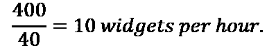
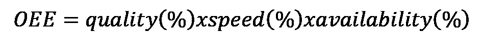
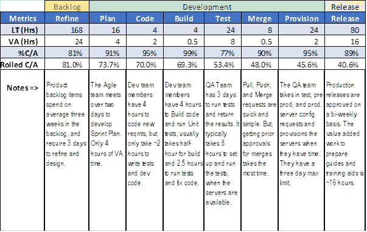
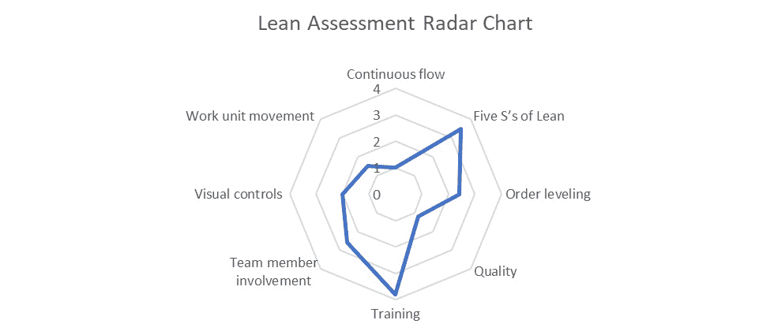
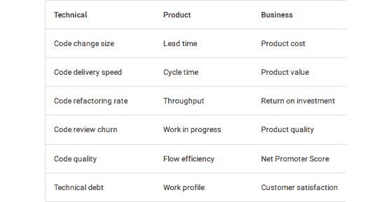
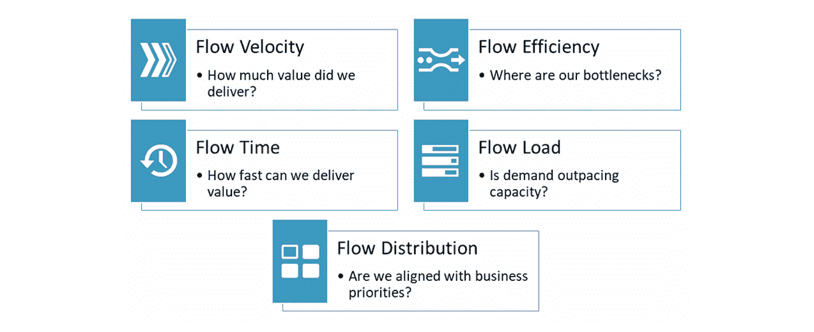
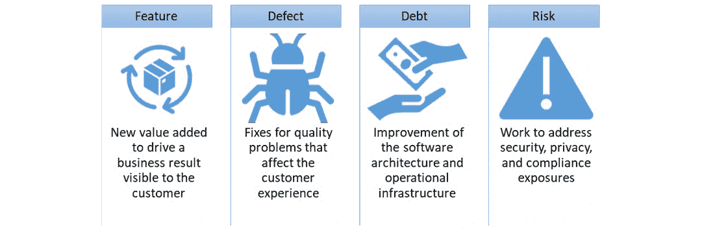
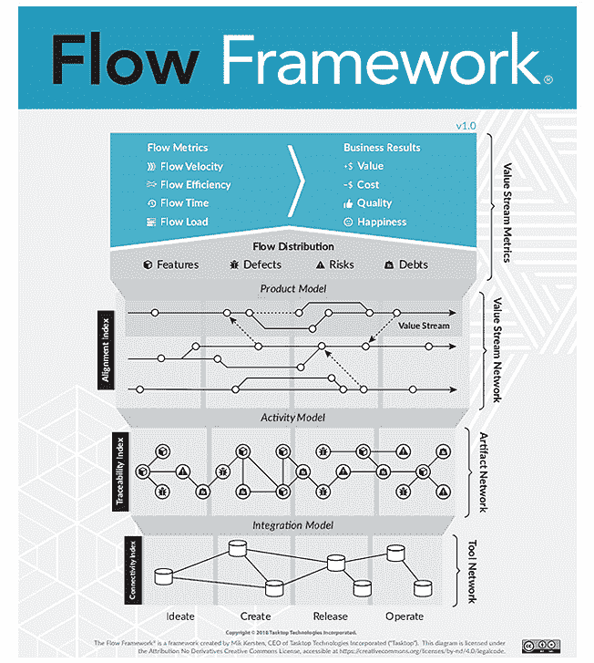

# *第八章*：识别精益度量（VSM 第 5 步）

完成当前价值流图后，我们现在将注意力转向评估潜在的未来状态机会，以同步我们的流程并消除浪费，从而为客户创造更多价值。但首先，我们必须以量化和可度量的精益度量为形式，明确我们的目标。这将是 VSM 的第五步，并将在本章中介绍。

如果没有衡量当前状态和期望未来状态的指标，改进就变得困难。这就像是开车前往一个新目的地，却没有地址或地图。没有这些信息，你就不知道该走哪条路，得走多远，甚至不知道何时到达。 本章帮助你识别关键的度量指标，这些指标将为你构建价值流图、定义期望的未来目标提供决策支持。

阅读完本章后，你将了解帮助组织和 VSM 团队评估几乎所有价值流中的改进领域的基本精益度量。你还将学习最适用于评估现代 DevOps 基础的软件交付团队和管道绩效的度量。最后，你将了解支持收集精益度量的工具。

在本章中，我们将讨论以下主要内容：

+   定义通用精益度量

+   评估精益绩效

+   衡量关键软件交付度量

+   将流程度量和分析添加到 VSM 中

+   实施精益度量工具

# 定义通用精益度量

在前一章节关于当前状态价值流图的讨论中，我们已经介绍了一些精益度量。然而，我们没有花时间定义与软件交付性能明确相关之外的精益度量。此外，还有许多传统的精益度量，你和你的 VSM 团队需要了解如何使用，以下是一些列出的度量：

+   **周期时间**（**CT**）：CT 是指从开始到完成一个过程或价值流活动的时间跨度。CT 实际上是产出的衡量指标（每单位时间的产出）。因此，如果我们可以在 40 小时的工作周内生产 40 个小部件，那么我们的周期时间就是。VSM 团队仅包括工作时间，不包括**在制品**（**WIP**）或价值流活动之间的等待时间。然而，CT 并不总是完全等于**增值时间**（**VT**）。在活动中可能存在一些非增值工作的元素，通常表现为浪费。这些浪费包括缺陷、库存、运动、过度加工、过度生产、运输和等待。

    举个例子，假设一个操作员拉取了一个工作项，但必须等待检索信息、材料或审阅信息才能开始工作。在这种情况下，这种等待仍然是该活动的 CT 的一部分。此外，用于设备设置或更换材料的时间也是 CT 的一部分。

    举个现实生活中的例子，最近我在后院做了一些景观工作。材料供应商将物品送到我的车道上，堆放在托盘上。我不得不支付景观承包商团队的人工费，用来拆开托盘并手动将材料搬到后院。作为一名付费客户，我更希望托盘能直接送到后院。因此，我支付的 CT 费用包括了增值的景观工作，也包括了搬运材料这一非增值的工作，这就是精益生产中以“动作”为形式的浪费。

+   **库存天数**：这是以每日生产使用量为单位储存和量化的物料、零件或产品的数量。例如，如果我们每天使用 20 个小部件，且库存有 100 个小部件，那么我们就有 5 天的库存。

+   **每百万机会缺陷数**（**DPMO**）：这是衡量每百万次发生缺陷的机会中有多少次出现缺陷的指标。例如，我们可能在每百万次活动中有 40 次缺陷。或者，在每百万行生产的代码中，可能有 40 个缺陷。因此，我们需要简明地解释 DPMO 所测量的缺陷比率类型。

    我们的质量目标始终是努力消除所有缺陷及其原因，防止错误或故障的发生。我们希望在任何高度重复和连续的流程中，监控并记录缺陷，借助控制图的最小值和最大值来看我们的流程何时开始出现问题。随着我们的指标接近上限或下限，我们仍然有时间在问题变得灾难性之前进行纠正。

    例如，精益生产从业者常常在精益生产过程中使用六西格玛计算方法，作为期望的质量目标。六西格玛质量目标是每百万机会中出现 3.4 次缺陷的衡量标准。

+   **停机时间**：这是与正常运行时间相反的概念。停机时间是一个比率，衡量设备无法在总时间内执行工作的计划外时间占比。

+   **一次通过能力**（也叫**一次通过合格率**，或**FTT**）：这是衡量生产过程中没有缺陷、错误或需要返工的产品比例的指标，通常以价值流中生产的总单元百分比表示。80%的 FTT 意味着每生产 100 个产品中有 80 个没有缺陷，不需要返工。

+   **库存或工作项周转**：指在特定期间内，物料、零件或产品的使用或销售次数。这个指标至关重要，因为更频繁的周转与更好的流动性、更高的回报和减少的库存持有成本相关。

+   **交付时间** (**LT**)：这是从接到订单到订单达到内部或外部客户的整个周期时间和等待时间的总和。在这个上下文中，LT 通常适用于整个价值流、业务流程，甚至适用于价值流中一个或多个活动之间。无论如何，LT 包括测量的工作跨度内等待时间和周期时间的总和。

+   **故障间隔时间** (**MTBF**)：这是衡量活动或过程失败频率的时间度量，通常以小时为单位。例如，MTBF 为 89 意味着我们可以预期该活动或设备每 89 小时会发生一次故障。

    当然，事情永远不可能完美无缺。我们还应该测量偏差和概率分布，以更好地了解我们的故障频率。我们还需要查看故障的原因，看看如何减少或消除它们。

    VSM 团队应评估价值流设备、软件发布、以及由于安全漏洞、网络或计算机系统故障导致的停机时间的 MTBF 指标。

+   **修复/恢复时间中位数** (**MTTR**)：这是从发现问题或故障到我们拥有有效的解决方案，能够继续工作的时间度量。MTTR 值通常适用于我们价值流的设备，但也适用于我们软件产品的可用性以及 IT 基础设施和安全性。

+   **准时交付**：这是衡量我们如何满足客户需求的指标，以按时、完整且无错误或遗漏地交付给客户的所有订单的成品或服务的百分比表示。

+   **总体设备效率** (**OEE**)：这是精益价值流中工业机械或设备有效性的百分比的可量化表达，包括质量、速度和可用性度量。具体而言，OEE 通过将质量、速度和可用性等指标的百分比相乘来计算设备效率，正如我们在这里所看到的：

举个例子，OEE 为 100%意味着操作能够在 100%的最佳生产速率下生产符合质量标准的零件，并且 100%的时间没有中断。但是请注意，如果质量、速度和可用性都下降到 90%，会发生什么情况。在这种情况下，OEE 降至 72.9%（即 OEE 为 0.729）。

换句话说，即使所有因素的效率达到 90%，所测量的价值流活动或设备的效率仍然下降到总体生产效率的 73%。

+   **排队（等待）时间**：这是物料、零件、产品或信息在下游过程中等待的时间。当不同的批次大小和周期时间在价值流活动中不匹配时，无论是在推式还是拉式生产控制系统中，都会发生等待。

    推拉导向的生产过程有助于减少等待和库存，只要操作人员在限制缓冲区大小和在准备好执行工作时拉入新工作方面有纪律性。发生的任何等待时间都表现为活动之间的延迟，直到上游活动的工作项被拉入下一个下游活动。

    使用推动导向的生产调度过程，您可以预期等待时间和队列时间显著增加。在价值流程中，如果循环时间和批量大小不匹配，那么减少库存和等待时间将变得更加困难。在相同工作单元或设备上具有不同流程的产品线进一步加剧了这些问题，因为预测哪些工作项将出现在哪些工作站上以及何时出现变得极为困难。

+   **可报告的健康和安全事件**：在美国，**职业安全与健康管理局**（**OSHA**）实施健康和安全法规。但我们关注的不仅仅是法律，因为任何安全问题都代表着对实体的生产力、财务和法律责任。如果事件严重到需要报告，那么我们应该对其进行测量并采取措施，以减少甚至消除其原因。

+   **整个价值流程的工作在制品**：在精益生产中，理想状态是让一个工作项在我们的价值流程中流动，即所谓的*单件流*。如果我们的价值流程中有 10 个不同的活动，我们的偏好是在 WIP 总数不超过 10 个工作项。这个目标在短期内可能不可实现，但我们的目标是监控、控制和限制整个价值流程中的 WIP。

+   **总循环时间** (**TCT**)：这是价值流程中所有活动的循环时间总和。与特定活动的循环时间一样，我们不包括工作项在活动之间等待的时间，但我们包括与非增值工作相关的时间。

+   **总流程时间** (**TLT**)：这是价值流程中所有循环时间和队列时间的总和。这个指标让您了解从接收客户订单到交付所需的时间。TLT 可以针对内部或外部客户在价值流程中进行测量。

    请注意，TLT 值可能还包括参与交付的多个开发和操作导向价值流程中的 LT。无论如何，清晰地指出价值流程和与指定 TLT 度量相关的活动的范围至关重要。

+   **正常运行时间**：这是可用性的表达，计算方法是设备在所需时间内可用进行工作的总时间与所需时间的比率。注意，计算可用时间时不包括计划的停机时间（也称为非生产性活动），例如预防性维护、设备设置或工作项目的变更。无论计划的工作是否增值或非生产性，都不关心，关键是设备是否可用。

+   **增值时间** (**VT**)：这是一个价值流活动或过程的 CT，减去所有浪费时间。理想的目标是使活动的 CT 完全等于 VT 的 100%。(这意味着设计一个没有缺陷、库存、移动、过度加工、过度生产、运输和等待的活动。）不幸的是，我们很少能实现这个理想目标，但我们会不断努力消除所有形式的浪费。

前面列出的标准精益指标对于任何精益改进计划来说都适用，无论是哪种类型的价值流。然而，有四个关键指标往往能最好地预测 IT 组织的软件交付价值流的表现。我们将在*衡量软件交付表现*一节中讨论这一点。但在进入该主题之前，让我们回顾一下 VSM 团队在评估和收集精益指标时需要注意的事项。

## 收集精益指标

当你的 VSM 团队审查哪些精益指标最能支持当前的价值流映射工作时，请牢记以下几点：

+   回顾你团队的章程，明确战略方向和期望的结果。

+   从消除浪费和提供以客户为中心的价值的角度评估价值流。

+   确定你需要收集哪些精益指标。

+   为你团队选择的指标争取管理层的支持。

+   基于标准化流程或活动数据计算最佳可能结果。

+   使你的指标对所有团队成员、操作员和利益相关者可见且易于获取。

现在，您已经了解了评估所有价值流所需的标准指标和收集它们的策略，我们来看看哪些指标在评估 IT 价值流的表现上最为有效。

## 分析当前价值流图的指标

回到我们当前状态的价值流图，在*第七章**，当前状态映射（VSM 步骤 4）*中，图 7.4 中展示了 LT、VT、完成和准确百分比以及滚动完成和准确指标。现在，让我们开始使用这些信息来分析价值流的表现。

下表显示了**总交付时间** (**TLT**)、**总增值时间** (**TVA**)以及整个价值流的滚动完成和准确百分比：

图 8.1 – TLT、TVA 和滚动完成/准确的表格

该表格分为三行数据，分别表示跨 IT 价值流三个部分的 TLT、TVA 和滚动 C/A 值。表格中第一个部分的数据显示了产品待办事项的精炼和设计工作项活动。第二列数据覆盖了从规划到资源提供的所有开发活动。第三列数据包括与将产品发布到生产环境相关的活动。

现在，让我们更仔细地看看 IT 价值流交付活动中的细节。*图 8.2* 总结了由 VSM 团队收集的精益指标和信息，涵盖了整个 IT 价值流中的所有活动，涉及软件交付。数据和信息被分别划分为与工作相关的类别，涵盖待办事项精炼、开发和发布，如下图所示：

图 8.2 – 跨 IT 价值流的精益指标表

有可能一些发布任务，例如开发指南和培训辅助工具，可以并行执行。但 IT 价值流还将功能整合到计划的双周发布中，这也是 80 小时周期时间的原因。实际上，发布过程是 IT 开发与运维人员之间的过渡或集成点。它涉及 IT 组织双方的人员，但工作更偏向运维，并据此进行了划分。

请注意，从规划到发布的总周期时间（TLT）为 328 小时，或稍超过 8 周的时间，从需求进入产品待办事项直到作为功能或特性发布到生产环境。然而，增值工作时间总计只有 57 小时（约 1.5 周）。虽然我们还不知道原因，但在我们的 IT 价值交付系统中，内建的等待时间太长了。

工作项的大部分非增值时间积累在产品待办事项中，总计为 168 小时。这是项目根据优先级排队等待的地方。回想之前提到的，精炼和设计过程由于工作内容的创造性方面，通常难以估算和控制。这可能解释了一些延误的原因。然而，产品精炼和设计活动的总周期时间与增值时间之间的巨大差距表明，我们在下游的开发和发布活动中可能存在吞吐量问题。

然而，IT 价值流中开发和发布阶段的工作项周期时间分别各自增加了 80 小时，或者接近一个月，导致整体产品周期时间增加。所以，我们在这些活动中也有很多内建的等待时间。根据这些数据，似乎我们可能有一些内建的限制因素，阻碍了开发和发布中的流动。或许我们面临设备和资源的限制，以及审批流程，这些都影响了我们的流动性。

我们现在离开当前价值流图指标分析的主题，进一步关注构成 CT 指标的时间要素。

## 细分 CTs

在整个 IT 交付价值流的 VA 时间中，我们可以看到精炼活动占据了最大比例，其次是发布活动，最后是测试活动。这三个领域是我们需要改进的地方，以减少成本并提高流动性。

当我们开始更加仔细地查看 VA 时间时，我们将探讨一些导致浪费的非增值活动，例如以下几点：

+   **等待所花费的时间**：这包括材料或工作项在队列中等待处理的时间。等待可能由多种原因引起。其中一个突出的等待原因是当生产控制将更多的产品推送到价值流或某个价值流活动中，而它的处理能力不足时。另一个等待时间的原因是多个活动的输出速度超过了单一活动的处理能力。此外，当某个价值流活动的速度慢于上游活动时，也会发生等待。

+   **走动所花费的时间**：这是一种精益浪费，称为运动。运动是非增值的时间和精力。目标是尽可能消除运动。实现这一目标的方式包括将工作活动靠得更近，可能还需要重新配置工作单元在价值流位置内的布局。

+   **输入数据所花费的时间**：这虽然是非增值工作，但通常是必要的工作。使用条形码、图像扫描仪和**射频识别**（**RFID**）标签及读取器可以显著缩短数据输入所需的时间。

+   **检索文件所花费的时间**：这也是一种等待，属于非增值工作。然而，在这种情况下，材料和操作员都在等待完成活动所需的信息。

+   **发送和审阅电子邮件或其他消息所花费的时间**：这正是它听起来的样子——进行增值工作所需的信息在需要时并未及时提供。这一问题类似于与长时间文件下载相关的问题。

+   **增值工作**：与前面列出的所有项不同，这项工作是唯一能为产品增加价值的努力。

我们现在已经查看了当前价值流图的交付时间和周期时间。接下来，让我们来看看准确度指标的完成百分比。

## 改进准确度完成百分比（%C/A）指标

另一个我们需要关注的最终问题是累积的 C/A 值。*图 8.2*中的%C/A 值乍一看似乎在每个活动中都相对合理。但仔细看看影响测试。77%的 C/A 比率对最终的累积平均值（在这个例子中为 41%）产生了过大的影响。**完成准确率**（**%C/A**）指标，更简单地说，是衡量一个工作项或信息在 100 次通过一个活动或一系列活动时，未要求返工或纠正错误的次数。

每个活动都有一个%C/A 值，而累积的%C/A 度量则是将所有活动的%C/A 数值相乘。因此，仅仅一个异常值就可能产生巨大的负面影响。此外，测试中的低%C/A 值是我们在未来状态映射过程中需要关注的另一个领域。

现在我们已经回顾了当前价值流图中使用的度量指标，接下来让我们回顾一下评估精益绩效所需的工具。

# 评估精益绩效

到目前为止识别的精益度量帮助我们评估价值流中的流动效率，并作为识别浪费领域的手段。但我们还需要评估那些需要特别关注的领域，以便在我们持续的改善活动中消除浪费。一种实际的方法是通过开发**精益评估雷达图**。

精益评估雷达图将你已经学到的具体精益目标映射到一个网格上，像辐射线一样从中心向外扩展。完成的雷达图看起来有点像蜘蛛网，如*图 8.3*所示。该图包含了一个精益评估雷达图的示例图形展示：

图 8.3 - 精益评估雷达图

雷达图使用刻度来排名能力，从中心的无承诺开始，到外部半径的世界级能力等级。*附录 C*中的示例从 0（无承诺）开始，向外扩展，涵盖四个改进的能力水平。

在我们的精益评估雷达图示例中，如*图 8.3*所示，辐射线具有以下排名：

0：无承诺。

1：开始实施精益。

2：变化开始变得可见。

3：各级别的结果在不断改进。

4：世界级水平。

快速查看*图 8.3*中的雷达图显示，我们最需要改进的领域是持续流动、质量和可视化控制。相比之下，五常法系统和培训的实施似乎都已经得到了很好的掌控。

如果没有精益度量指标作为目标，那么该度量将变得主观。VSM 团队必须努力确定在每个评估的精益实践中，世界级绩效的表现是什么样的。我们示例雷达图中评估的精益评估度量指标包括以下内容：

+   **持续流动**：这表示流动中的同步性和效率，理想目标是实现单件流。

+   **精益五个 S**：这是指价值流的工作区域是否清洁、整洁、安全、有序，并且已实施、安排并以视觉方式展示了 5S 实践。

+   **订单平衡**：组织在多大程度上采用了 Heijunka 和其他精益平衡实践。

+   **质量**：价值流在多大程度上达到其既定的质量度量，同时始终朝着理想目标努力，即没有错误、缺陷、返工或失败。

+   **培训**：所有价值流成员都已完成精益培训，并可以获得教练和导师的帮助，以及随时访问精益培训资料。

+   **团队成员参与度**：VSM 团队成员和价值流操作员在遵循价值流的标准精益实践、参加精益评估会议、应用 5S 实践、参加精益培训项目以及支持持续改进目标方面的参与程度。

+   **视觉控制**：VSM 团队、VA 操作员和经理在维护和展示他们的精益度量、5S 标准以及标准活动信息方面的程度。

+   **工作单元移动**：价值流在限制等待、应用准时和拉动导向调度概念以及将流动与 Takt 时间匹配方面的程度。

在进行 Gemba 走访之前，VSM 团队应讨论并决定每个精益评估类别的 0 到 4 的数值应是什么样的。他们还需要确定计划查看的内容，以便正确评估每个类别。

例如，假设在 5S 类别中，价值流内每个五个“S”实践的积极观察都会为总共可能的 4 分积累 0.8 分。因此，VSM 团队为每个类别获取了多个数值，最终计算出的平均值会有小数点。

这些精益评估度量是我们 Kaizen 努力的重要基础。与敏捷团队一样，精益团队必须不断努力改善其价值流活动和流动。精益评估度量帮助我们看到团队可以在哪些方面改进他们的活动。

我们即将完成精益度量部分。但是在结束之前，让我们快速回顾一下与收集和应用精益度量相关的工具。

# 衡量关键软件交付度量

到目前为止，分配给活动的指标仍然是相对传统的精益指标，适用于任何组织的价值流。然而，Nicole Forsgren、Jez Humble 和 Gene Kim 在《Accelerate: Building and Scaling High Performing Technology Organizations》一书中（2018 年，第 17-19 页）确定了一组预测软件交付性能的关键指标。基于他们对来自 2,000 个独立组织的 23,000 个调查回答的详细统计分析，他们发现以下四个指标对于衡量软件交付性能至关重要：

+   交付交付时间

+   部署频率

+   **平均恢复时间**（**MTTR**）

+   变更失败百分比

他们的工作在**DevOps 研究与评估**（**DORA**）团队的指导下继续进行。这个谷歌研究小组开展了为期 6 年的项目，旨在衡量和理解整个 IT 行业的 DevOps 实践和能力。DORA 的研究成果在 2014 年至 2019 年的《DevOps 年度报告》中展示，并可以在[`cloud.google.com/devops/state-of-devops`](https://cloud.google.com/devops/state-of-devops)查看。

我们将在接下来的四个子章节中更详细地讨论这些指标。

## 交付交付时间

**交付交付时间**是将客户需求从创意阶段到客户满意所需的总时间。在软件开发中，满意意味着产品增强满足其*完成定义*。换句话说，团队和客户都同意交付的项目符合其已定义的接受标准。

但是，作为一个以精益为导向的指标，交付交付时间的计算是比较复杂的。在 *第七章*，*当前状态映射（VSM 第 4 步）*，特别是在*准备映射*部分中，你学到了定义和验证需求与设计的活动是创造性的任务。相比于开发和测试代码、配置和部署等相对标准化的工作，执行创造性工作所需的时间和精力是很难预测的。当我们谈论使用交付交付时间来衡量软件交付性能时，通常最好在产品待办事项列表中的需求被充分细化，开始编码工作时启动计时。

高绩效的软件交付组织可以在不到一小时的时间内，将一个新的需求开发、测试并交付为有效代码，并推送到主代码库分支。相比之下，最低绩效的组织在最近的数据显示（2017 年），他们每周到每月才将有效代码部署到主分支，而在之前的年份中，有的甚至需要每六个月才能部署一次。

## 部署频率

**部署频率**是指将代码发布到生产环境或发送到应用商店的频率。如前所述，编写和测试较小增量的功能优于一次性构建和部署大规模的代码更改。表现较差的团队往往会承担更多的功能增量，增加了编码、测试和调试的复杂性，从而将部署频率推迟到 1 到 4 周的范围内。相比之下，表现最好的团队根据需求接受新功能要求，按小的增量构建功能，并且每天发布多次部署。

请注意，软件开发的价值流等同于理想化的生产流概念——*单件流*。当组织自动化了从*代码*到*生产发布*的 DevOps 管道时，就会发生单件流。单件流是 CI/CD 管道的终极目标。换句话说，每次将软件代码提交到 SCM（源代码管理）仓库时，都可以自动流经管道并进入生产环境，而无需人工干预。

理论上，这仍然是一个连续流的例子，最终停留在预生产环境进行最终审批。但如果这一环节还涉及到分阶段和发布多个功能，那么这一部分的过程现在就变成了批处理过程。无论原因或优点如何，所有批处理都会阻碍价值流向客户的过程。

## 恢复平均时间

**恢复平均时间**是一个关键的指标，因为它代表了应用程序或系统失败并未为客户提供服务的时间。通常，当系统或功能出现故障时，我们别无选择，只能回滚更改，直到我们能识别并修复问题。因此，关键在于快速发现故障并执行回滚到先前的工作版本。理想情况下，我们希望看到这一 MTTR 值低于一小时。表现较差的团队通常需要一天到一周的时间来恢复失败的服务。

## 变更失败率

**变更失败率**指定了代码变更导致失败所需的时间百分比，通常表现为 bug 或缺陷的形式。借助现代管道部署能力，新版本发布可能仅涉及回滚新发布的功能。但失败也可能表现为系统崩溃和服务丧失。无论如何，表现较差的团队的变更失败率在 31%到 45%之间，而表现最好的团队的变更失败率则在 0%到 15%之间（Forsgren 等，2018 年）。通过编写测试脚本（如测试驱动开发和自动化测试能力）的改进，有助于降低变更失败率。

现在你对常见的价值流度量以及最常定义软件开发组织绩效水平的四项度量有了全面的了解。在接下来的子部分中，我们将探讨如何使用当前的价值流度量来分析现状。

## 向 VSM 中添加流程度量和分析

除了**DORA 四项度量**，软件开发的趋势是实施**流程度量和分析**能力，为业务领导者、产品经理和价值流团队提供可见性，从而持续改进其流程。次优流程和团队表现可能对组织的精益敏捷转型工作产生负面影响。

或者，当组织能够访问准确且一致的业务操作和价值流度量时，可以指导改进活动和辅导。这些度量必须始终可用、最新，并对所有利益相关者可见。

现代 VSM 工具使捕获价值流度量变得更加容易。这是因为它们充当自动化活动，避免了可能影响结果的人工操作和报告。数据捕获自动化使信息更加可用、及时、准确且易于使用。业务领导者、团队成员和其他利益相关者必须对数据及其准确性充满信心。

数据可能来自参与价值流管道流程的许多不同工具或系统。现代 VSM 工具应用**通用数据模型**，对数据进行标准化，从而提供跨整个价值流管道的端到端数据视图。此外，某些分析工具利用人工智能功能，使高层管理人员和 VSM 团队成员更容易评估当前状态活动中的流程，并评估未来状态的替代场景。

此外，投资组合经理和产品负责人可以使用相同的流程度量和分析功能，评估与其产品和发布路线图的进展。因此，业务负责人和相关利益相关者将能获得更高的产品交付状态和相关生产成本的可见性。

## 超越 DORA 四项度量

DORA 四项度量非常有用，因为它们有助于识别定义最佳软件交付能力的关键度量。它们还为软件开发团队在向精益敏捷实践转型过程中提供了一组有价值的度量目标。

然而，在精益敏捷企业中，组织应跟踪许多其他度量，以识别持续改进的领域，并验证其改进目标的实现。例如，Gartner 分析师 Bill Swanton 在名为*《软件工程领导者如何使用价值流度量提高敏捷效能》*的**Gartner 报告**中识别了 18 项流程度量。这些领域显示在下图中：

图 8.4 – Gartner 确定的流程度量列表

Swanton 提到，以下是应该考虑的一些流度量示例，并指出：“*就像精益制造过程中的度量指标一样，它们衡量工作如何顺畅地流动，并且团队对需求变化的响应速度如何*。”

他进一步指出：“*供应商们已经开始提供与您的软件开发、基础设施和监控工具（版本控制、工作管理、测试管理等）集成的系统，以便持续收集、计算和展示这些度量指标*。”

一家在这一领域做了大量工作的公司是 Tasktop，在公司首席执行官 Mik Kersten 的领导下，推出了 **流程框架**®。

## 实施流程框架

Tasktop VSM 工具在 *第十二章** 中进行了更详细的介绍，题为“介绍领先的 VSM 工具供应商”。然而，鉴于流程框架与本节的相关性，我们将花点时间解释现代 VSM 工具如何帮助捕捉和分析流程度量。

流度量和流程框架背后的概念最早在 Mik Kersten 博士（2018 年）的《从项目到产品》一书中介绍。自那时以来，IT 领导者们在全球范围内采纳了这些概念，以缩小技术人员与业务利益相关者之间的差距。具体来说，流程框架提供了一个方法论和词汇，系统地发现并消除那些减缓软件交付速度并对业务结果产生负面影响的瓶颈。

流程框架的目标是确保业务层面的框架和转型举措与实现敏捷和 DevOps 相关的技术框架相连接，同时也涵盖未来将出现的方法论。Tasktop 的流程框架扩展了 **DevOps 的三种方式** —— **流动**（加速开发、运营直至客户交付）、**反馈**（创建更安全的工作系统）和 **持续学习与实验**（促进信任和科学方法以推动组织改进和风险承担）—— 到整个业务。这些概念最早在《DevOps 手册》一书中提出（Kim 等，2016 年）。

借助现代 VSM 工具，任何组织都可以收集数百个有价值的度量指标，用于评估过程、生产力、质量、成本、收入以及标准遵循的改进。关键是要将所有信息理清楚。不幸的是，许多组织常常缺乏对端到端管道流程的可视化，导致难以回答下图所示的问题：

图 8.5 – 流程框架的流度量

流动指标有助于识别和解决系统瓶颈，消除当可见性仅限于孤立工具数据时可能存在的低效局部优化。它们还提供了你表现的历史视图，让你了解选择和变化如何影响你的流动。

四个流动项构成了一个由利益相关者通过产品价值流拉动的业务价值单位。这些项包括**功能**、**缺陷**、**风险**和**债务**，如*图 8.6* 所示。流动指标对每个流动项进行单独和集体测量。下图展示了这些项目：

图 8.6 – 四个流动项

流动项代表对组织有价值的项目。换句话说，我们如何处理功能、缺陷、技术债务和风险的优先级，将影响我们交付客户价值的能力。因此，业务和技术领导者必须通力合作，分析这四种价值类型的流动、速度和优先级。

例如，功能通常具有优先级，但有时我们需要修复 bug、减少技术债务，或者解决关键风险和问题。如果我们不平衡这四个流动项目所关联的工作，最终会付出沉重的代价。

尽管软件交付工作复杂且难以捉摸，流动框架通过定义如何从执行工具中提取必要的数据（**集成模型**），使得流动指标（以及 VSM 的日常实践）对任何组织、任何结构都变得可达。这些数据被抽象为流动项和流动状态（**活动模型**），并以与业务对齐的视图呈现（**产品模型**）。

通过上述展示和分析，流动指标可以用来帮助领导者和团队做出决策，以实现有针对性的业务成果。Tasktop 的 VSM 平台通过一个点选界面提供这些功能。*图 8.7* 展示了流动框架的海报视图：

图 8.7 – 流动框架海报

Tasktop 强调，除了流动框架外，还有其他重要的框架（如**有纪律的敏捷**（**DA**）、**规模化敏捷框架®**（**SAFe®**）、**大规模 Scrum**（**LeSS**）和 Nexus），这些框架帮助组织规模化敏捷，并将这些实践与业务目标联系起来。你会记得，敏捷是一套价值观和原则，帮助组织围绕增加以客户为中心的价值和灵活应对变化来调整其资源和活动。

相反，VSM 能够增加商业价值的流动，从最初的客户需求到最终交付给客户。Flow 框架是一种结构化的、规定性的方法，用于软件交付组织中的价值流管理，旨在为企业提供一个面向客户的流动视图，涵盖整个软件交付过程。因此，敏捷方法有助于确保我们在正确的时间交付正确的客户中心价值，而 VSM 则确保我们快速且高效地交付这一价值。

## 创建一个安全的工作环境

一直保持与敏捷的价值观和原则一致，我们绝不应将流动度量作为惩罚或奖励个人和团队的工具。相反，它们的目的是帮助引导我们的持续改进工作。

精益敏捷实践强调基于团队的绩效，当事情出现偏差时——这在所难免——我们需要采取全员参与的方式来解决当前的问题。如果团队和个人害怕惩罚，那么你可以预期他们会避免发声，甚至可能隐瞒那些影响他们有效、快速和高效交付软件价值的关键问题。

因此，当我们的价值流发生中断时，我们需要立即停下来，让所有团队成员共同合作解决问题。试图保持生产持续进行会导致排队、活动等待、产品延迟，甚至可能导致更多缺陷的积累，这些只会增加我们的成本。

拥有实时流动度量的好处是，我们可以在问题出现时立即发现它们。这使我们能够更早地解决问题，从而减少生产时间损失和其他浪费。此外，这些度量和分析有助于团队评估问题和根本原因，并集思广益，提出替代的解决策略。

# 实施精益度量工具

在本章关于精益度量的内容中，你了解了常用的度量指标，这些指标通常用于衡量精益生产实践。你还了解了四个特定的度量指标，它们能最佳地预测软件交付团队的表现。传统的价值流图（VSM）实践采用手动工具来捕捉和分析价值流度量。此外，你还了解了现代 VSM 工具、流动度量和分析如何帮助提高软件交付的速度和效率，同时确保软件开发与业务目标和宗旨保持一致。

关于手动工具，你了解了如何使用一个大型白板或图表，或者电子屏幕，使你的度量指标高度可见。你还了解了如何更新你的 VSM 故事板，以保持所有 VSM 团队数据的集中并能从一个单一来源访问。最后，你了解了如何评估价值流的精益实践。这些实践涵盖了八个类别，并以精益评估雷达图的形式展示。这些都是与 VSM 实践同时发展的手动工具。

现代 VSM 工具的优势在于它们能够捕捉端到端的管道信息，并提供跨统一数据模型的分析工具。在它们的现代复兴中，VSM 工具供应商实施了捕获和分析度量指标的功能，以支持 CI/CD 和 DevOps 管道流动，使用与所有其他组织价值流中采用的相同概念和类型的度量指标。因此，分析师可以评估管道活动的性能，无论其集成了多少第三方工具。

但是现代 VSM 工具不仅仅限于数据捕捉和分析。它们还支持管道流动的**集成**、**自动化**和**编排**。我们将在下一章的未来状态映射中开始探讨这些主题，并在本书的*第三部分*中深入讨论 VSM 供应商。

本节结束了我们关于精益度量指标的讨论，这是我们 VSM 方法论中的第五步。在下一章，*第九章*，*映射未来状态（VSM 第 6 步）*，我们将开始在三个阶段中绘制理想的未来状态：评估与客户需求的对齐，实施持续流动，以及通过生产控制和编排策略实现生产流动平衡。

# 总结

本章提供了关于帮助我们从精益角度评估价值流有效性的关键度量指标的指导。你还学习了如何收集有用的精益度量指标（我们通用 VSM 方法论中的第五步）。

尽管 VSM 团队可以手动收集和分析度量指标，但这是一个劳动密集型的过程。相比之下，现代 VSM 工具越来越重要，主要原因在于它们能够实时捕捉和显示这些信息。此外，VSM 工具的分析功能和假设能力支持未来状态分析。

在下一章中，你将学习如何通过三个不同的阶段，涵盖客户需求、持续流动和生产平衡，进行未来状态映射练习。在进入下一章之前，花点时间回答以下问题。如果你暂时记不清或不完全理解所有问题，别担心。回去寻找答案将有助于你更好地理解和记忆这些知识。

# 问题

请回答以下 10 个问题：

1.  为什么识别精益度量指标如此关键？

1.  什么是**周期时间**（**CT**）？

1.  **周期时间**（**CT**）与**增值时间**（**VT**）是一样的吗？

1.  六西格玛的相关性是什么？

1.  精益软件交付中最重要的四个度量指标是什么？

1.  列出那些导致浪费的非增值活动类型。

1.  变更失败率的相关性是什么？

1.  精益评估工具的核心是什么？

1.  精益评估雷达图上通常的径向线是什么？

1.  在其现代复兴中，VSM 工具供应商实现了带有度量和分析功能的平台，以支持哪三项功能？

# 进一步阅读

+   *Tapping, D., Luyster, T., Shuker, T. (2002) 《价值流管理：规划、映射和维持精益改进的八个步骤》。生产力出版社。纽约，纽约州*

+   *Tapping, D., Luyster, T., Shuker, T. (2003) 《精益办公中的价值流管理：规划、映射和维持精益改进的八个步骤》。生产力出版社。纽约，纽约州*

+   *Tapping, D., Kozlowski, S., Archbold, L., Sperl, T. (2009) 《精益医疗中的价值流管理：规划、映射、实施和控制各类医疗环境中改进的四个步骤》。MCS Media, Inc. 切尔西，密歇根州*

+   *Forsgren, N., Humble, J., Kim, G. (2018) 《加速：构建和扩展高效能技术组织》。IT Revolution 出版社。波特兰，俄勒冈州。*

+   *Kim, G., Humble, J., Debois, P., Willis, J. (2016) 《DevOps 手册：如何在技术组织中创造世界级的敏捷性、可靠性和安全性》。IT Revolution 出版社。波特兰，俄勒冈州。*

+   *Kersten, M. (2018) 《从项目到产品：如何在数字化颠覆时代通过流动框架生存和发展》。IT Revolution 出版社。波特兰，俄勒冈州*
