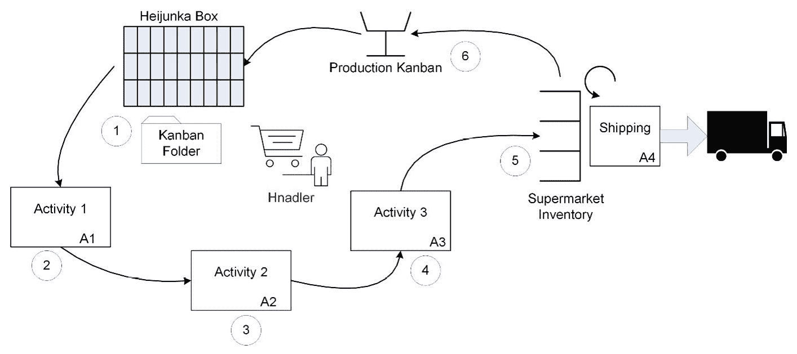

# 第九章：映射未来状态（VSM 第 6 步）

在上一章中，你学习了如何映射当前状态，进行精益办公室评估，并观察和记录价值流的关键精益指标。你还学习了如何记录与工作和信息流动相关的重要信息。最重要的是，你学会了如何从精益的角度来可视化工作和信息流动。

当前 VS 映射练习中执行的工作是文档性质的。它不涉及太多的想象力——只是准确的发现（通过 Gemba 走访）、记录和映射。现在，我们将进入精益价值流映射的创意阶段，设计一个改进的未来状态。**未来状态映射**发生在三个连续阶段，以帮助评估方法并改善价值流在满足客户需求、建立和保持持续流动以及均衡客户订单分配方面的能力，从而最大化运营效率。

本章将涵盖以下主要内容：

+   建模三个未来状态目标

+   未来状态映射的第 1 阶段 – 客户需求

+   未来状态映射的第 2 阶段 – 持续流动

+   未来状态映射的第 3 阶段 – 均衡

具体来说，你将学习如何结合精益和敏捷实践，通过实施持续改进，发展自己的技能，并将精益思维的概念融入到 CI/CD 和 DevOps 管道实现中。你将从介绍未来状态建模的三个阶段开始学习：客户需求阶段、持续流动阶段和均衡阶段。

# 建模三个未来状态目标

本节提供了如何在三个阶段进行未来状态映射练习的指导，包括分析客户需求、持续流动和均衡。以下列表简要描述了每个阶段所涉及的工作：

+   **客户需求阶段**：这包括分析客户对产品或服务的需求，以确保它们包含质量目标和交付时间。

+   **持续流动阶段**：这一阶段有助于改善流动，以便我们的客户能在正确的时间、以正确的特征和数量，获得正确的产品或服务。

+   **均衡阶段**：这一阶段有助于在产品线之间均匀分配工作，减少等待时间，并消除批量处理（即，目标是实现单件流动）。

尽管三个阶段之间可能会有重叠，但初步分析将遵循这三个阶段。

价值流作为管道流动的形式运作，具有输入、工作活动的顺序和输出。在更复杂的环境中，我们可以预期会与其他价值流或活动集成分支。因此，如果我们不理解需求如何流入我们的价值流，几乎不可能理解我们优化的连续活动流目标应是什么。

当我们识别并协调需求流输入时，VSM 团队可以分析如何改善活动和信息流，以匹配需求速率。最后，我们可以预期客户需求会随时间变化，因此我们需要理解如何平衡生产工作负载，以持续最小化瓶颈、等待和其他形式的浪费。

由于未来状态阶段遵循上述分析顺序，我们将按相同顺序介绍三个阶段，从分析客户需求开始。

# 阶段 1 – 客户需求

未来状态映射练习的这个阶段明确设立，确保 VSM 团队以客户需求为中心，开始精益改进目标。但我们并不是在谈论从功能和特点的角度理解客户需求，因为这种分析属于产品管理职能。换句话说，工作项的识别、选择和优先排序是 IT 环境中敏捷产品管理和产品待办事项梳理过程的一部分。

在这个阶段，你需要回答以下问题：

+   你的客户对这个价值流的需求是什么？

+   你有多少个客户？

+   支持的客户类型、市场细分或利基市场有哪些？

+   所有客户或按产品线分类的客户的订单可预测性如何，包括季节性调整？

+   你是过度生产、生产不足，还是正好满足需求？

+   你满足客户需求的能力会随时间变化吗？如果会，为什么？

+   你能用当前的资源和能力按时交付给客户吗？如果不能，为什么？

+   你需要携带缓冲或安全库存吗？如果需要，是什么类型的，为什么，需要多少？

+   当前需要解决的问题是什么？

+   你的价值流的设施和操作有多干净和有序？如果不足，负面影响是什么，我们需要做些什么来减少杂乱和无序？

在精益生产中，满足客户需求的重点在于履行领域。换句话说，VSM 团队致力于帮助价值流提高交付速率。提高未来状态下满足客户需求的能力是一个多步骤过程，涉及以下问题：

+   计算节拍时间。

+   确定目标。

+   调整缓冲区和库存。

+   改善工作环境。

+   解决当前问题。

VSM 团队通过计算价值流的节拍时间，开始他们的未来状态——与客户需求相关的分析。

## 计算节拍时间

理解 Takt 是首要任务，因为它是衡量价值流需要多频繁地交付产品或服务以满足客户需求的指标。如果我们不知道需求目标，就无法了解需要多少改进来提高交付效率。

**Takt 时间**是客户要求交付我们产品或服务的速度或频率。我们通过将*净可用操作时间*除以*所需交付产品的数量*来计算 Takt 时间。**净操作时间**是指在特定时期内可用的工作小时数（例如，7 小时的班次、一天 14 小时的运营时间，或每月 2,240 小时）。

计算净操作时间时，确保从总时间中扣除会议、健康休息、午休和其他非增值活动的时间。因此，在一个 8 小时的工作班次中，若有两次 15 分钟的健康休息、一个 30 分钟的午休以及一次 15 分钟的每日 Scrum 或站立会议，那么净操作时间为 405 分钟：

*净操作时间 = ((8 小时 * 60 分钟) – 15 分钟 – 15 分钟 – 30 分钟 – 15 分钟) => 405 分钟*

如果我们的每日客户需求率是 810 个单位，那么我们的 Takt 时间可以按以下方式计算：

*405 分钟 ÷ 810 单位/天 = 0.5 分钟/单位*

换句话说，Takt 时间为每个单位 0.5 分钟时，你需要每分钟生产两个单位。大型商用飞机或船舶制造商通常没有每天交付多次的要求。然而，汽车和电子设备制造商通常有这个需求。

在传统的瀑布模型或**软件开发生命周期**（**SDLC**）模型中，软件开发团队通常每年发布新产品——这些产品通常作为与财政年度预算对齐的时间限定项目启动。不幸的是，这种策略由于多种原因并未取得良好的效果。相比之下，现代敏捷实践使得软件开发团队能够在 1 到 4 周的时间内交付新功能。

然而，即使采用敏捷实践，软件产品经理可能仍然选择较少频繁地将软件发布到生产环境中。对于商业产品，交付活动可能需要与市场营销和销售推广相协调。在 BPI 的背景下，新的软件增强功能会影响业务流程，这需要附加活动来创建和部署系统管理员支持指南及培训资料，并提供给操作人员和用户。

另一方面，**持续集成和持续交付**（**CI/CD**）工具和实践能够增强敏捷实践，使得新软件版本的部署频率大大提高。IT 开发团队可能会从整合软件工程工具开始，形成集成工具链，帮助自动化并加速软件开发生命周期(SDLC)过程中各个环节的流转。

随着成熟度的提升，IT 组织实施了一条集成化且自动化的工具链，支持跨软件开发和运维功能的信息和工作流。通常被称为**DevOps 流水线**或**DevOps 平台**，这些集成和自动化工具显著提升了软件交付的速度和可靠性。

例如，一个现代的 DevOps 环境的持续部署能力使得新功能和功能可以一天多次发布到生产环境中。此外，成熟的 DevOps 流水线允许开发团队按需启动多个测试环境，并在部署之前迅速检查功能、系统负载、性能和压力能力。

大型在线零售商、保险公司、制造企业和医疗服务提供商之间的竞争变化的快速节奏帮助证明了对 DevOps 流水线和平台的投资是合理的。正如前面提到的，DevOps 能力是我们在数字经济中竞争并满足客户不断变化需求所必需的基础条件。Takt 时间则设定了节奏。

## 建立 pitch

**Pitch**是指一个价值流生产一个产品容器所需的时间。在理想的情况下，客户订单将按单个订单、每次一件的批量、以恒定的速度到达，我们能够以相同的速度处理这些订单，作为单件流。然而，对大多数生产商来说，这种情况很少见。此外，我们的供应链合作伙伴可能无法仅为了满足一个客户订单而交付材料和零件，至少由于运输大宗产品的成本通常较便宜这一原因，情况往往是这样。

当软件通过互联网连接进行交付时，运输成本不是问题。但当软件以 CD-ROM 或作为实体产品的一部分打包时，软件交付就成了一个问题。

由于这些原因，将生产速率与精确的 Takt 时间匹配具有挑战性，生产调度员必须找到有效的方式来应对这些差异。这就是建立**pitch**的目标——确保组织能够以最有效的方式应对需求变化。

在学习如何计算 pitch 之前，我们需要理解**包装数量**，因为它是 pitch 度量的一部分。包装数量是客户（内部或外部）希望一起交付的物品数量，通常在运输过程中以容器形式搬运。

理解包装数量最简单的方法是想象生产足够的零件来填满运输纸箱或运输集装箱，以便交给客户。如果我们能够实现单件流并一次只发运一个零件，那么我们的包装数量就是一。但如果我们要为零售商的订单提供产品，包装数量可能会根据季节、产品类型和每个客户的销售量而有所不同。

Pitch 的计算相当简单，即*Takt 时间乘以包装数量*。例如，如果产品*A*的最优包装量是每批 100 个零件，而我们的 Takt 时间是每天 400 次产品*A*的发布，那么我们的 pitch 可以这样计算：

*Pitch=每天 400 个零件 X 每批 100 个零件 = 每天 4 批*

换句话说，价值流必须每天运送四批 100 个产品。

在考虑什么是“pitch”时，必须理解 Takt 时间是由客户驱动的，但包装数量可能会受到限制。因此，在考虑你的 pitch 时，有几个因素是你必须考虑的。

客户可能不会选择一次购买或接收一个产品。有些客户可能要求不同批量大小的发货，可能是由于季节性调整。此外，由于长时间的设置和更换时间以及批量处理，组织可能还无法最有效地生产单件流的产品。

相反，允许价值流以更大的批次大小进行流动可能更为可取，以最小化零部件和物料的更换。最后，运输成本通常是确定最优交付批量大小时的重要因素。

在软件交付组织中，包装数量和 pitch 成为在**敏捷冲刺（Sprints）**中发布的敏捷团队中的重要因素。例如，一个敏捷**Scrum**团队评估他们的包装数量为每个 Sprint 完成的用户故事数量，这就是他们的 pitch。

许多 IT 组织面临基础设施的限制，这些限制可能限制它们能够并行运行的测试服务器数量。在这种情况下，包装数量就是它们可以并行运行的测试数量，而它们的 pitch 是测试活动的持续时间。

最后，客户可能不愿意在生产中一次接收一个新功能，特别是当这些功能影响到业务流程且需要通知和培训员工时。在这种情况下，每次发布都具有一定的功能包装数量，而 pitch 是发布之间的时间间隔。

## 理解生产控制

当组织必须以更大的批量大小处理工作项时，调度员应该实施**生产控制**机制。例子包括**看板（Kanban）箱**或**平准化（Heijunka）箱**，通过按工作量和生产的工作项类型来平衡工作项的流动。

价值流操作员仍然将工作项拉入他们的工作站。但是，他们拉取的是整个批次，而不仅仅是一个零件。例如，在制造业中，零件可能是通过一个容器提供的，操作员按其特定活动设计允许的单件速率完成工作。然后，一旦容器被重新填充，下一个排队的操作员在有可用容量时可以将整个批次拉入他们的工作站。

在软件交付价值流中，软件工程师从 **Sprint Backlogs** 中拉取工作项，并完成相关用户故事功能的实现和测试。实际上，Sprint Backlogs 作为 Heijunka 箱的类型，用来管理一组用户故事的流动，这些故事会一起经过开发和测试活动。

下图展示了 Sprint Backlog，作为容器呈现了即将在下一个 Sprint 中进行开发的用户故事：

图 9.1 – Sprint Backlog 作为一种 Heijunka 箱

团队已经选择了接下来 2 周 Sprint 的六个最高优先级的工作项。然而，产品负责人每 4 周会向产品待办事项列表中发布平均 20 个新需求。基于这一点，你需要管理开发团队的能力，以支持客户的需求。

假设开发团队成员在休息和会议后，每天工作 7 小时，四周的月总计为 140 小时的净操作时间，或者每个 2 周的 Sprint 期间为 70 小时。因此，无论你选择哪种持续时间，你的 Takt 时间将是每个工作项 7 小时。换句话说，新的工作项平均每 7 小时就会进入我们的 IT 价值流。

由于开发团队为 Sprint Backlog 选择了六个工作项，因此该批次的 Pitch 时间是 *Takt 时间乘以选择的工作项数量*，即 42 小时。换句话说，开发团队必须在 42 小时内启动新的六个工作项批次，以匹配 Takt 时间的交付速率。

由于每个 2 周的 Sprint 期间都有 70 小时的净操作时间，因此很容易认为应该能够满足需求。但等等，VSM 团队的工作还没有完成。首先，我们需要评估这段时间内，处理一批六个工作项跨越整个价值流所需的时间。

如果我们的 IT 价值流能够实现自动化和持续流动，我们或许不必太担心这个问题。然而，在基于 Scrum 的敏捷实践中，开发团队只能在接下来的 2 周内专注于这六个工作项。

查看当前价值流图中显示的度量指标，以及 *第八章**，识别精益度量（VSM 第 5 步）* 中的度量表，在 *图 8.1* (*总交付时间、总增值和滚动 C/A 表*) 和 *图 8.2* (*IT 价值流中的精益度量表*) 中。我们知道整个 IT 价值流的 **总交付时间** (**TLT**) 为 328 小时，约为 8 周多一点的时间。大部分时间都花费在产品待办事项队列中，或者等待新版本作为功能发布。

从积极的方面来看，我们的**总增值时间**（**TVT**）是整个 IT 价值流中的 57 小时，这在 Sprint 可用的 72 小时净工作时间内完全是可以接受的。从消极方面来看，开发相关活动有 80 小时的提前期，发布相关活动也有 80 小时的提前期。

VSM 团队需要做一些工作来解决与等待和不匹配的周期时间相关的问题。例如，如果基础设施未设置为按需处理单件流的测试，工作项可能会在测试时再次排队。类似地，经过测试的软件工作项，现在作为已测试功能可用，可能会再次坐在队列中，等待发布到客户的生产环境中。

在敏捷环境中，产品发布到生产环境可能会在每个 Sprint 中进行，但更常见的是通过较少频繁和更正式的产品发布进行发布。正式发布给我们提供了时间来实施市场推广和销售活动以便于商业交付，以及当软件交付影响关键业务流程时的社会化和培训。

等待是示例 IT 软件交付价值流中的一个主要问题。既然我们已经注意到队列有时是必要或不可避免的，我们就来讨论如何管理它们。

## 管理缓冲区和安全库存

到目前为止，你已经学习了如何使用 Takt 时间和生产节拍来管理流动以满足客户需求。但是，我们还需要管理我们的缓冲区和安全库存，以确保始终有**在制品**（**WIP**）来支持客户需求。然而，我们不能拥有过多库存，以至于人为引入问题，导致产品延迟并增加我们的持有成本。我们已经知道**WIP**等待在示例 IT 价值流中是一个问题，因此我们从这里开始。

### 消除在制品队列

在深入讨论之前，必须理解消除所有**在制品缓冲区**（WIP）的工作项和物料的必要性。WIP 队列仅仅是隐藏问题的方式，并不能在任何方面帮助改进流程。WIP 队列只是隐藏流动问题的机制。精益只允许携带成品作为库存，但即便如此，也有严格的限制。

同样重要的是，不要将库存的概念与处理工作项批量的概念混淆，正如在前一部分中关于建立生产节拍所述。库存一词指的是我们价值流管道中或管道的某些部分中包含的所有物料、工作项或产品的总数量。相对而言，批量大小是一种机制，用来将一定数量的工作项（物料或产品）一起流经价值流，从而改善流动。

例如，当一个软件开发团队从产品待办事项列表中选择工作项时，产生的冲刺待办事项列表实际上是团队判断最适合在即将到来的冲刺中完成的批量大小。

### 冲刺待办事项中的工作项流动

在短期内，直到我们能够实现单件流时，可能更高效的是以较大的批量流动工作项。这一局限性源于价值流活动之间的不均匀流动速率，周期不匹配、设置时间和批处理过程等问题。

这正是我们 IT 价值流示例中的情况。通过实施敏捷实践来实现迭代和增量开发，并通过冲刺待办事项列表最小化在制品批量大小，我们提高了生产力。实际上，这也是 IT 相关价值流中冲刺待办事项列表的目的：控制产品开发流程，使其易于管理。但以批量流动工作项与允许这些工作项在活动间排队等待是不同的。

在敏捷环境中，一个常见的做法是从产品待办事项列表中选择一批工作项，为即将到来的冲刺做准备，然后使用看板（Kanban）管理冲刺过程中的流动。稍后，当 IT 部门实施成熟的 CI/CD 或 DevOps 流水线——以简化、集成和自动化软件开发生命周期（SDLC）过程——时，IT 价值流可以针对产品待办事项列表中排队的工作项实施单件流。

### 使用看板管理流动

另一种策略是完全取消基于敏捷的冲刺，而改为采用纯粹的**看板导向**生产控制策略。在看板系统中，开发团队成员直接从产品待办事项列表中拉取已精炼和优先排序的工作项。团队成员从头到尾处理每个工作项，贯穿整个开发流水线。

要有效实施看板导向的 IT 生产控制策略，需要相对成熟的 CI/CD 能力。如果没有 SDLC 活动的集成和自动化，团队将会花费大量时间在与设置和配置开发、测试环境以及等待测试结果相关的非增值工作上。

在一个合适的看板系统中，冲刺待办事项列表中的所有工作项必须经过**SDLC**流程，才能进入敏捷/敏捷框架团队的下一个工作。换句话说，看板和敏捷实践并没有消除传统的 SDLC 活动，如编码、构建、集成、合并代码、配置、开发和测试环境的配置、执行单元测试、集成测试、系统测试以及其他许多关键测试。

但这些活动执行得更加频繁，以适应每个迭代开发周期中小规模新功能增量的生产。**集成**和**自动化**改善了流程，帮助消除 SDLC 中的浪费，而价值流管理则帮助优先处理并推动 IT 价值流的改进。

下图展示了在 IT 价值流中实施的看板生产控制策略。请注意，看板板并未引用开发管道中的特定 SDLC 任务。相反，这些活动都被封装在看板导向的产品工作流中的**进行中**和**验证**阶段：

](img/B17087_09_02.jpg)

图 9.2 – IT 价值流的看板板

与此同时，看板的**拉动式生产控制策略**防止 Scrum 团队在完成 Sprint 待办事项中的用户故事之前承担新的工作。

唯一的解决方法是 Scrum 团队将用户故事分配给团队成员，并在所有相关的 SDLC 活动中，从前到后逐一处理每个用户故事，直到系统，包括负载、压力和性能测试。如果它们确实发生，那些类型的测试活动通常会在产品发布到生产环境之前以批处理方式进行。

### 使用 CI/CD 管道改进流程

不幸的是，在产品发布前推迟测试会带来与批处理相关的问题。任何潜藏在代码中的缺陷或错误都会在 IT 部门计划发布软件产品时被发现，这将推迟发布日期。此外，在这个晚期阶段，集成代码的复杂性使得隔离和调试问题代码、API/ Web 服务、查询、安全、计算或网络相关的问题变得困难。

简而言之，除非开发团队拥有成熟的 CI/CD 管道，否则看板和 Scrum 是矛盾的实践。有了 CI/CD 能力，开发团队可以从头到尾独立地处理每个用户故事和功能，而不会有任何延迟。此时，团队需要评估 Sprint 的长度以及他们希望在 Sprint 待办事项中排队的工作项数量。记住，精益的目标是最终实现单件流。这个目标对精益敏捷实践同样适用。

既然你已经知道允许 WIP 队列不是精益实践，接下来我们看看在什么情况下允许队列和等待是有意义的。

### 允许成品库存

在精益中，我们需要在价值流中管理两种类型的库存：**缓冲库存**和**安全库存**。这两者都是成品库存的例子。成品这一术语意味着产品已完成开发并通过了 QA/测试，但在销售之前由于某种原因被暂时保留。

在软件开发中，软件组件和产品的发布可能会在满足完成定义的验收标准后被推迟（存储），即使这些产品技术上已经准备好交付给客户、零售或应用商店，或安装到生产环境中。造成这种推迟的一个主要原因是确保交付的其他要素已经到位。

例如，软件产品可能作为物理产品发布的一部分发布，或由于作为更大范围功能发布的一部分而被延迟。软件交付也可能会推迟，以便与市场营销和销售促销活动，或者与新业务流程的部署相协调。

*缓冲库存*是组织为应对客户需求变化（即节拍时间的变化）而持有的额外成品库存。与此不同，*安全库存*是用于满足持续客户需求的成品库存，当价值流的流动受到干扰时使用，例如设备故障、电力中断、劳动问题和意外的质量问题。缓冲库存和安全库存是分别存储并独立管理的，因为它们服务于两个完全不同的目的。

然而，理解*成品*的概念也很重要，它不仅包括由你的价值流生产的完成的工作项目。成品还可以包括从供应链供应商处采购的材料和零件。如果你的价值流合作伙伴，或者他们的运输或配送服务遇到交付问题，那么持有一些此类库存可能是有意义的，以防止你的价值流“断粮”。

当你的软件产品嵌入到物理产品中时，这些概念尤为相关，例如制造设备和汽车中的控制系统，或支持基于物联网的价值交付能力。

物联网（IoT）

物联网（IoT）是描述一种物理对象网络的术语，这些对象嵌入了传感器、软件和其他技术，使其能够进行基于互联网的连接，并与其他连接的服务器、设备和信息系统交换数据。此外，物联网的能力使我们能够提供产品功能增强，例如更新汽车、卡车、飞机、船舶及其他运输系统中的导航系统。

随着软件产品为我们现代产品和服务提供动力，组织必须仔细管理工作项库存（即软件、硬件和其他物理产品及组件）。然而，组织也必须在所有组织价值流中管理其资源，以支持客户需求的变化。

### 管理缓冲和安全资源

库存概念不仅仅局限于管理零件、材料和完成工作项的库存。价值流可能需要缓冲和安全资源来应对高需求时期的生产提升，或者当我们的价值流操作人员请假时。缓冲和安全资源包括加班、雇用临时工或退休人员，或借调其他部门的员工。

同样地，我们可能需要在设备或工具中安装过剩的产能，以应对不同的客户需求负荷，或者在价值流因任何原因意外停机时弥补失去的时间。也有可能将过剩的工作交给其他价值流、合作伙伴或承包商，他们拥有多余的设备和人力资源。在后者的情况下，组织必须采取积极措施，确保合作伙伴/承包商能够提供相同质量和成本的交付。

### 使用成品超市

库存有助于在需求中断以及零部件、材料和产品的可用性中保持流程顺畅。但我们也可以利用库存来执行我们的拉动式生产控制策略。用于此目的的库存被称为**成品超市**。

这里的理念是，根据客户订单从成品库存中按需拉取产品，并且价值流会快速补充这些商品。从概念上讲，成品超市的运作方式与您当地的杂货店非常相似。顾客从杂货店的货架上取走产品，而补货员则从他们的成品缓冲区商店中补充这些库存。

超市跨越价值流和价值交付链工作。顾客从组织的成品库存中拉取产品，即使物理拉动过程涉及运输部门和货运公司。价值流会根据生产和操作流程上游补充成品库存。类似地，供应链合作伙伴会在交付组织的价值流拉取时补充组件材料和零部件。

超市是 JIT 生产理念的精髓。顾客作为最下游的活动触发工作、信息和材料的流动。所有其他上游的价值流和价值链活动都会同步补充它们的增值工作，并且是 JIT 以满足下一个客户的需求。

在 IT 环境中，最接近携带成品的做法是我们在发布前积累功能。但拥有软件成品库存的目的并没有太大区别，因为目标仍然是确保产品在客户准备好接受时已准备就绪。

到现在为止，您的 VSM 团队已经计算了所有产品线和客户的 Takt 时间，并且他们已经建立了一个或一组提升流程的节奏，以满足客户的交货需求。您还可以改善工作环境，以帮助价值流更好地满足客户需求。

## 改善工作环境

精益组织使用**5S 系统**来改善工作环境。由于我们已经在*第六章**，启动 VSM 计划（VSM 步骤 1-3）*中介绍了它如何改善工作空间，因此无需花费太多时间讨论这个话题。5S 系统的目标是创建一个功能齐全且清洁的环境，提升工作环境的效率、效果和安全性。

5S 系统的一个核心要素是，它提供了一个持续的机制来观察并解决可能妨碍流动、导致延误并掩盖问题的无序和杂乱问题。在精益管理中，我们总是从七大浪费的角度来看待问题：运输、库存、动作、等待、过度加工、过度生产和缺陷。回顾一下，精益的七大浪费在*第六章**，启动 VSM 计划——七大致命浪费*中已被介绍。

简单回顾一下，以下表格列出了 5S 系统和**潜在浪费领域**的方法，以及精益的七大浪费：

图 9.3 – 5S 系统的方法和潜在浪费领域

5S 系统按数字列出，因为这些活动的执行往往遵循这一顺序。精益浪费的类型和程度会因组织和每个价值流的不同而有所不同。我们会根据浪费对我们交付价值能力的影响程度，从最高到最低的顺序来解决浪费。这里要强调的主要观点是，5S 系统帮助 VSM 团队、价值流操作员及其他相关方消除任何妨碍精益生产过程的浪费。如果你需要进一步复习 5S 技术，请参考*第六章*，*启动 VSM 计划（VSM 步骤 1-3）*。

现在，让我们进入评估如何提升满足客户需求能力的最后一个工作领域。在接下来的部分中，你将学习如何利用问题解决方法来改善价值流的表现，以便更好地满足客户需求。

## 解决需求相关的问题

由于客户需求常常随着时间变化，无论是数量还是产品需求，需求相关的问题始终是价值流操作员和经理必须解决的持续性问题。从客户的角度来看，需求相关的问题通常在于：下订单困难，或者无法获得他们所需的功能和特性，质量不可接受，或者交货日期超出了他们愿意等待的时间。

VSM 团队可以使用多种问题解决模型来解决客户需求问题。我喜欢的一个模型是由*爱荷华大学人力资源部*发布的。让我们来看一下它。

以下是**8 步问题解决过程**：

**步骤 1 – 定义问题**

要理解这种方法，你必须思考以下问题：

+   问题是什么？

+   你是如何发现这个问题的？

+   这个问题是从什么时候开始的？这个问题已经持续多久了？

+   是否有足够的数据来控制问题，并防止其传递到下一个过程步骤？如果有，控制问题。

**步骤 2 – 澄清问题**

在尝试解决问题之前，我们需要确保真正理解问题的范围。我们可以通过提问以下问题来避免这个问题：

+   有哪些数据是可用的，或者需要哪些数据来帮助澄清或全面理解问题？

+   此时，解决这个问题是否是最优先的任务？

+   是否需要额外的资源来澄清问题？如果需要，将问题上报给领导，帮助找到合适的资源并组建团队。

+   考虑进行一次精益活动（Do-it、Burst、RPI 或项目）。

+   确保问题已经得到控制，不会传递到下一个过程步骤。

**步骤 3 – 确定目标**

在软件开发中，我们总是想知道新特性或功能必须交付哪些能力，以满足客户的需求。在敏捷中，我们称之为**完成定义**。在解决需求相关问题时，同样的概念也适用。我们需要定义目标，以明确未来状态的改进目标：

+   你的最终目标或期望的未来状态是什么？

+   如果解决了这个问题，你将达成什么目标？

+   解决此问题的期望时间表是什么？

**步骤 4 – 确定问题的根本原因**

我们不能只关注症状，而忽视解决我们需要解决问题的根本原因。关注解决症状就像是服用阿司匹林来缓解头痛——它提供了暂时的缓解，但因为我们没有解决其根本原因，头痛最终还是会回来。以下列表提供了寻找与客户需求相关问题根本原因的策略：

+   确定问题的可能原因。

+   优先考虑可能的问题根本原因。

+   有哪些信息或数据可以验证根本原因？

**步骤 5 – 制定行动计划**

通常，与客户需求相关的问题很复杂，需要许多活动和人员的参与才能妥善解决。在这种情况下，VSM 团队应制定一个行动计划，明确所需的活动、时间框架以及角色和职责，具体内容如下：

+   列出解决根本原因并防止问题反复发生所需的行动。

+   为每个行动分配负责人和时间表。

+   设置状态以确保完成。

**步骤 6 – 执行行动计划**

当然，制定行动计划和执行行动计划是两回事。必须有专人负责确保工作按时完成并达到满意标准。与精益和敏捷实践一致，**价值流映射**（**VSM**）团队可以审查进度和结果，但必须有专人跟踪并引导工作，如以下列表所示：

+   执行行动计划以解决根本原因。

+   维护并显示进度的可视化图表。

+   验证所有行动项是否完成。

**第 7 步 – 评估结果**

这一步验证了第 3 步中列出的目标是否达成，并总结了行动中的经验教训。首先，我们需要确保在离开某项活动之前已完成我们的行动项目标。但我们也不希望重新发明轮子，如果我们过去已经进行过类似的发现和分析工作。事实上，如果我们保持关注并维护准确的历史记录，我们可能已经有了解决当前问题的方案。以下清单列出了评估我们的发现和结果的活动：

+   监控并收集数据。

+   您是否达到了第 3 步中定义的目标？如果没有，请重复 8 步流程。

+   是否有任何无法预见的后果？

+   如果问题已经解决，删除之前为控制问题而增加的活动。

**第 8 步 – 持续改进**

最后一步有助于捕捉并解决任何未完成的事项。例如，我们是否有足够的数据来完全解决客户需求问题？我们能做得更好吗？如果能，我们该如何改进？第 8 步包括以下活动：

+   寻找额外的机会来实施更好的解决方案。

+   确保问题不会再发生，并沟通经验教训。

+   如有必要，重复 8 步问题解决过程以推动进一步改进。

欲了解更多信息，请参考*爱荷华大学人力资源，组织效能*：

`https://hr.uiowa.edu/development/organizational-development/lean/8-step-problem-solving-process`

## 绘制客户需求图

现在我们拥有足够的信息来制定**未来状态图**，这将帮助我们改进满足客户需求的能力。需求阶段的未来状态图使用相同的 VA 映射符号，但映射过程不同。以下清单描述了绘制未来状态需求阶段图所需的步骤顺序：

1.  在白板、海报板或电子系统上开始绘制新的未来状态客户需求图，同时使用 VSM 故事板作为指导。

1.  从在白板顶部绘制客户和供应商（如果供应商与客户不同）开始。

1.  记录客户需求和需求履行要求，以 Takt 时间和节拍为单位。

1.  将最后一项活动（即最下游的活动）放置在绘图区域的最右边。

1.  在白板的左侧绘制启动客户请求或需求的上游流程。

1.  在客户和供应商之间绘制一个手动或电子通讯链接。

1.  用适当的 VA 符号绘制缓冲区和安全库存。

1.  绘制价值流操作员需要实施 5S 系统以进行改进的位置。使用 Kaizen Burst 图标，代表改进活动。

1.  确定需要实施问题解决项目的地方。（使用 Kaizen 爆发图标表示。）

下图展示了客户需求阶段改进的未来状态图，这可能就是你未来的 IT 价值流：

图 9.4 – IT 价值流未来状态图 – 需求阶段

未来状态图上的数字表示之前列表中标注的映射步骤。在我们的示例中，VSM 团队已决定集中关注三个关键领域，以提高 IT 价值流对客户需求的响应能力。第一个计划的 Kaizen 爆发使用 5S 系统来发现可以改善流程和消除浪费的低垂果实。第二个改进活动是帮助引导开发团队在软件开发和测试工具上的集成工作，使其能够实施更有效的 CI/CD 工具链。他们计划的最后一个 Kaizen 爆发是使用问题解决技巧来帮助开发团队实施看板系统。这一策略能够更快速地响应来自客户的请求。

本节完成了我们对未来状态客户需求映射的讨论。在进入未来状态客户流动阶段之前，让我们回顾一下在需求阶段使用的工具。

## 未来状态 – 客户需求工具

在未来状态映射的这一阶段使用的工具帮助 VSM 团队改善价值流对客户需求变化的响应。我们首先计算了 *Takt 时间*，涵盖了不同客户和产品之间的变化，以及假期或其他季节性调整的变化。

接下来，VSM 团队为价值流设定了 *pitch*，它计算 Takt 时间与工作单位数量的乘积。Pitch 的目标是确定通过我们的价值流传递工作项时最合适的批量大小。

接下来，你学会了如何结合 *缓冲库存和安全库存* 来确保需求和流量波动不会使价值流陷入瓶颈，并防止其无法进行增值工作。你还学会了如何利用成品超市来强制实施拉动式生产控制策略，覆盖整个价值流，甚至是你的价值交付链。

另一个改善价值流对客户需求变化响应能力的关键工具是 *5S 系统*。价值流操作员使用 5S 系统清除杂乱，组织工作区域以改善工作流和效率，并普遍提高操作员的健康与安全。此外，5S 系统帮助价值流团队评估并消除浪费源。

在这一阶段，VSM 团队开始评估妨碍价值流响应变化的客户需求的问题，并分析每个问题的原因及其影响。在这一部分，您学习了如何使用*8 步问题解决过程*来解决与需求相关的问题。

最终，您开始开发*未来状态地图*，以可视化显示价值流的预期变化，同时更新了 Takt 时间和节拍的数据。VSM 团队将未来状态地图绘制在一个大白板或海报板上，或使用任何能够在大屏幕上显示的电子工具。理想情况下，VSM 团队应该使用 VSM 故事板格式（见*附录 B*），将所有关键信息集中在一个地方。

本节总结了我们关于绘制未来状态地图以改进以满足客户需求的讨论。接下来，我们将学习如何开发未来状态，以便我们可以分析并展示改进，以实现并维持价值流中的连续流。

# 第二阶段——连续流

现在，VSM 团队已经解决了客户需求的问题，他们可以开始着手改进生产流，以满足客户的需求。在这一部分，我们将继续进行未来状态映射活动，并解决与建立和维持精益连续流相关的问题。

**连续流**是一种精益策略，旨在实现将单个工作项通过价值流中的每个步骤，而不是将*大量*工作项作为批次集合并一起移动的理想目标（也称为**一次制作**，**一次移动**；**单件流**；**单件生产流**）。其目标是尽可能连续地生产和移动一个工作项，或者至少是最小的实际工作项数量，通过一系列的价值流活动。作为基于拉动的生产控制策略的一部分，每个活动只生产满足下一个活动请求所需的内容。

促成精益连续流的是价值流的机制，确保其内部和外部客户在正确的时间、正确的数量收到正确的工作单元。我们最初将精力集中于改善单个工作活动，而忽略了价值流系统中的其他活动并不罕见。不可避免地，这种局限性的关注会导致整体工作流的问题。相反，我们需要从系统思维的角度来审视我们的价值流。

在这一部分，您将学习如何通过不同的方法改善价值流中的连续流。

## 评估价值流作为一个复杂的系统

组织通常专注于单个活动的改进，因为改进工作交给了在该活动中有深厚技能的专家或工程师。从某种程度上来说，这些技能对于改进活动是必需的。但无法仅仅通过计算单个活动的吞吐量来理解它对整体系统的影响——回想一下我们在*第三章*中关于*分析复杂系统交互*的讨论。

我们需要从系统的角度来看待我们的价值流，而不是将每个活动独立地看待，以便理解和控制阻碍工作、物料和信息在价值流中流动的机制。在价值流的各项活动中，客户订单、周期时间、批量或批次大小、设置时间以及零件更换时间的差异都会阻碍连续流动。

VSM 团队必须将价值流视为一个复杂的集成系统，来解决这些问题。他们的任务是确定如何以最有效的方式控制价值流中的工作流动。他们必须评估机制，以平衡工作流，使得需求增加时不会使系统陷入困境，而需求较低时也不会让系统处于停滞状态。

他们还需要与价值流操作员合作，实施标准化的工作流程。这有助于消除阻碍流动的差异，并减少生产力和质量一致性的波动。在许多情况下，VSM 团队需要设计更高效的设施和工作站布局，并获得执行管理层的资金和批准，以便进行所需的变更。

## 应用连续流的概念

从概念层面来看，连续流的理想状态是每次客户从我们的成品库存中取走一个工作项时，就补充一个工作项。如下面的图示所示，这一概念有时被称为*一个生产，一个移动*：

图 9.5 – 连续流 – "一个生产，一个移动"

价值流通过在多个活动之间同步进行中的工作，以继续补货活动，如前面的图示所示。换句话说，补货过程必须在所有上游活动中以协调和同步的方式继续进行。

前面的图示使用了弯曲的*物理拉动*箭头，而不是直线的*推动*箭头，表示该价值流采用了拉动导向的生产控制系统。拉动导向的生产调度方法控制着上游活动的协调方式，以实现同步和连续的流动。

连续流的速度是另一个问题。只要一切都能一起流动，流速是每 5 分钟一次还是每 5 小时一次并不重要。如果每个活动都只有一个部件流过，还是 10 个部件作为一个批次一起流过也不重要。只要部件和材料的流动是同步的，并且它们能以相同的速度一起移动，你就有了连续流。

在未来的连续流状态中，我们最关心的是提高价值流的整体效率，即提高吞吐量和减少瓶颈（即消除不匹配的生产速率、工作项排队和等待）。因此，流动的改进始终来自于消除各种形式的浪费。

## 评估流动的障碍

大多数 VSM 团队不能期望一蹴而就地做出大规模变革。这曾是**业务流程再造**（**BPR**）的初衷。但很少有组织能够承受一次性做出激进变革所带来的投资和干扰。相反，大多数公司通过根据成本效益评估识别的改进机会，逐步进行变革，从而获得更好的结果。

虽然通过未来状态的价值流改进计划可以一次性实施激进的变革，但这并不推荐，原因与 BPR 不再流行相同。除非组织面临**燃烧平台**的生死存亡局面，否则更好的选择是通过逐步改进来实现变革。

事实

*燃烧平台*这个术语来源于 1988 年 7 月 6 日发生在北海**派珀·阿尔法**石油平台上的一起可怕事故。该油平台发生爆炸，造成了大规模火灾，夺走了 167 条生命。然而，三名最初将自己锁在远离火灾的房间里的人，最终走到了外面，面临着跳入冰冷海水还是被火焰吞噬的选择。两名男子跳了下去，虽然受了重伤，但设法幸存并被救起。不幸的是，第三名待在燃烧平台上的男子未能幸免。

在这种情况下，VSM 团队评估最具影响力的机会，消除浪费和实施成本，并据此优先考虑变更计划。遵循*帕累托原则*，那些能显著改善流动和投资回报的变更计划应始终具有最高的实施优先级。

VSM 团队通过回答一系列问题来评估价值流中的流动，如下所示：

+   哪些价值流活动、设备和系统需要连接，以获得同步和连续的流动？

+   现有的价值流活动能支持单件流吗？

+   如果不能，什么是最优的批量大小，直到我们能够更好地优化流动？

+   哪些工作单元或活动充当瓶颈？为什么？（即，较长的周期、设置和转换时间、批量处理、过度移动或运输时间等。）

+   解决已识别瓶颈的优先顺序是什么？

+   我们可以在导致瓶颈的工作单元或活动中做些什么？

+   我们可以做些什么来减少导致瓶颈的延迟？

+   我们如何改善设施布局以提高工作流效率？

+   我们如何改善信息系统以提高信息流动？

+   我们可以采取哪些措施来改善内部物料流动？

+   我们必须与供应链合作伙伴做出哪些过程和合同变更，以更好地对接进货材料和零部件与客户的需求？

+   我们如何控制上游工作，以便它与下游需求相匹配并同步？

+   我们能否使用看板系统，并且需要做哪些改变来支持看板系统？

+   价值流是否应采用**先进先出**（**FIFO**）生产控制策略？

+   如果有的话，我们是否需要设置过程中的超市、缓冲区和安全库存，以应对客户需求的变化或供应商交货周期长的问题？

+   还有哪些问题影响我们支持持续流动的能力？

上述问题引导 VSM 团队、VS 操作员和其他利益相关者通过发现过程，找出价值流中持续流动的障碍。每个障碍都指向一个改进机会，并在未来状态图上标记为 Kaizen 突发点。与产品待办事项列表完善的过程类似，VSM 团队对改进活动的列表进行完善，定义和优先排序以完成改善流动所需的工作任务。

请注意，前面的列表包括三种生产控制策略（即看板、FIFO 和超市），这些策略可以帮助我们在价值流中保持持续流动。让我们花点时间在这个背景下回顾一下它们。

## 实施生产控制策略

我们的价值流工作流控制策略必须支持持续流动。我们在前面几节介绍了三种工作流控制方法，VSM 团队可以选择在单一价值流中使用这三种策略。这些工作流策略如下：

+   **超市**：这是一种基于拉动的工作流策略，通过允许下游客户从有限的工作项目缓冲区中拉取物品来帮助执行 JIT 规则。当库存低于预定的下限时，上游活动会补充这些库存。

看板或其他控制机制可以防止操作员将工作推进到下游活动中，这在软件开发场景中尤为重要。相反，精益敏捷团队从 Sprint 或产品待办事项中拉取工作到工作站，但只有在完成前一个任务并且有能力承担新工作时。

在 CI/CD 和 DevOps 流水线中，集成和自动化工具链将各项活动链接起来，以提高流动速率并实施面向拉动的生产控制编排，从而最小化在制品（WIP）。

+   **FIFO**：此规则要求队列中的第一个物品在工作顺序中始终具有最高的工作优先级。FIFO 工作流策略在延误可能导致工作项质量下降或无法完成独特客户订单时非常有用。

+   **看板**：这是一种纯粹的拉动式工作流，利用信号指示价值流活动中的工作需求。这些信号以卡片、便签、标志、电子信号或文件夹的形式显示。这些工作项可以独立流动或成批流动，通常存储在一个与批次一起移动的储物箱中。

看板信号告诉每个下游活动应生产什么以及数量。在制造业价值流中，看板卡可能包括以下所有或部分信息：

+   部件/物品编号和部件/物品描述

+   用于提取额外订单、车间工艺信息和图纸的条形码

+   所需的物品或零件数量

+   看板箱或盒子的容量

+   起源（下游）和后续（上游）活动名称或位置——用于没有顺序流的工作车间情况

+   材料或零部件供应商

+   安全库存的位置和数量

+   补货触发点和数量

+   交货期（即，物品到期前的持续时间）

+   负责人

+   订单和到期日期

+   其他重要信息

在面向 IT 的价值流中，看板卡通常列出用户故事及其接受标准。如果看板卡来源于操作，卡片应包括一个工单号、问题描述（缺陷或漏洞）、问题日期以及报告人的信息。

最后，看板卡还应包括在开发或测试过程中发现的任何问题或漏洞（也称为*阻塞因素*），这些问题或漏洞会妨碍工作进行。

**加权最短作业优先**（**WSJF**）：这一排队模型在精益敏捷社区，特别是在 SAFE 实践者中得到了广泛认可。该方法最初由 Don Reinertsen 在其著作《产品开发流的原则》中定义（Reinertsen, 2009）。

WSJF 优先级模型用于对工作进行排序（例如，功能、能力和史诗），以产生最大经济效益。在 SAFe 中，WSJF 通过**延迟成本**（**CoD**）除以工作规模来估算。

例如，假设我们的产品待办事项中有三个工作项，产品负责人需要一种方法来评估这些工作项在即将到来的开发迭代中的优先级。下表列出了各个工作项的预计持续时间（作为交货期，单位为周），延误造成的收入损失成本，以及每个工作项的调整权重：

图 9.6 – 加权最短作业优先 (WSJF) 示例

上表显示，每延迟一周发布功能 A 将给组织带来 $10,000/周的损失，而功能 B 的成本为 $100,000/周，功能 C 的成本为 $150,000/周。如果我们的 CoD 和持续时间估算相对准确，那么功能 C 应该是最高优先级，其次是 B，最后是 A。

除了管理工作项在价值流系统中的流动外，我们还需要平衡流动，以保持持续流动。这个话题将在下一个小节的产线平衡中讨论。

## 平衡我们的价值流

如果前序价值流活动中没有可拉取的工作项，那么实施基于拉动的生产控制系统几乎没有价值。我们需要引入**产线平衡**技术，以防止上游活动的饥饿现象。为此，我们必须优化在价值流中进行中的工作分配，使其与我们的 Takt 时间匹配。

在一个完全自动化的系统中，**产线平衡**是系统设计的一部分。例如，汽车在装配线上的推进是通过传送带连接的，因此所有的作业都以相同的速度同时进行。然而，许多开发和运营导向的价值流中的工作站并未集成，也未自动化。此外，操作员可能会在工作站和设备之间移动，以支持跨价值流的多个工作活动。

产线平衡是一种优化价值流中人员利用率的策略。目标是确保操作员不会过度负担或未被充分利用。VSM 团队使用以下公式来确定在价值流中的任何给定活动所需的工人人数：

*所需工人人数=总处理周期时间/Takt 时间*

回想一下，在*图 9.1* 中，我们的 IT 价值流的 Takt 时间为每个工作项 7 小时。VSM 团队已经识别出我们 IT 价值流中每个活动的总周期时间，如下表所示。所以，我们有了所需的数据，可以确定支持 IT 价值流的开发团队成员数量。

以下表格使用之前识别出的产线平衡公式来计算支持整个 IT 价值流所需的工人人数：

图 9.7 – 产线平衡公式用于确定所需操作员的数量

我们的总增值时间是对 IT 价值流活动中所有周期时间的度量。而增值时间（周期时间）是处理一个工作项所需的度量。由于开发团队是一个基于 Scrum 的敏捷团队，我们必须通过六倍的系数来调整 Takt 时间，以便考虑生产六个工作项所需的总时间，这个时间是 42 小时，这也是我们对该价值流的预估。

因此，VSM 团队得出结论，他们需要 7.8 名开发团队成员来支持 IT 价值流。但是，事情从来不会这么简单。一方面，开发团队成员在*精化*、*计划*和*发布*过程中同时处理整个六个工作项，但在*编码*、*构建*、*测试*、*合并*和*提供*过程中是独立进行的。

下表显示了为调整小时数以匹配工作项吞吐量所做的批量大小调整，然后计算每个 IT 价值流活动所需的工作人员数量：

图 9.8 – 为计算所需工作人员数量而调整的每个工作项的周期时间

下表重新评估了与调整后的总增值时间 90.5 小时相对应的工作人员数量。调整后的 90.5 小时的 TVA 除以我们原始的 Takt 时间 7 小时，表明 IT 价值流需要 12.9 名工作人员来支持这一负荷：

图 9.9 – TVA 和劳动调整

然而，让我们回过头来看图 9.7。应该显而易见的是，各个价值流活动中的劳动水平差异显著，从 0.4 名工人到 3.4 名工人不等。如果我们试图通过单件流操作这个价值流，就会遇到资源分配问题。

为了继续我们的评估，让我们将与开发相关的活动与与发布相关的活动区分开来。组织中的其他人员通常执行发布相关的活动，而开发团队中的一部分成员则在每个 Sprint 迭代前作为一个小组进行精化活动。

VSM 团队创建了当前状态工作者平衡图，以开始评估开发流，如下图所示。该图表明，如果我们将资源分配到每个活动，并以 Takt 时间的速率工作，那么所有工人都会有很多浪费时间在等待新的工作，除了那些专门从事测试的工人。这是因为测试人员在每个工作项的 Takt 时间（每个工作项 7 小时）内没有足够的时间来进行测试：

图 9.10 – 当前状态工作者平衡图

应该很明显，你不需要为每项活动专门分配一个工作人员。敏捷的核心思想是建立跨职能和自给自足的团队，让所有开发团队成员能够执行软件交付价值流中的大部分（如果不是全部的话）任务：

图 9.11 – 未来状态工人平衡图

如我们所见，通过任务组合，有三个逻辑区域可以拆分工作。在团队内部，一人或多人可以负责计划、编码、构建和合并等活动。与此同时，其他人员负责配置服务器并设置、运行、分析和分发测试结果。

请注意，软件测试可以以**无人值守自动化**的方式运行。一旦测试设置完成并启动，测试便会以自动化的方式运行，而无需人工干预。看管计算机并不增加价值，这也是为什么测试自动化如此重要的原因之一。

## 稳定工作实践

本节讨论了一个主题——创建标准化实践——一些 IT 专业人员可能会对这个话题有所质疑。初看之下，实施标准化工作实践可能看起来限制性较强，特别是对于那些认为软件开发既是一门艺术又是一门科学的人来说。然而，正如本书后续所示，成熟的 DevOps 管道——一个集成并自动化软件开发生命周期（SDLC）实践的管道——只有在我们拥有标准化流程时才能发挥作用。

**标准化工作**是一套公认的工作程序，旨在确定完成每个定义的价值流过程的最佳当前方法和活动顺序。换句话说，标准化实践实施的是在价值流中执行工作的最佳、最简单、最安全和最快的方式。

请注意，精益中的标准化工作概念似乎与敏捷倡导的理想有所偏离，在敏捷中，团队通常可以自由地尝试新的工作方式。精益的重点是消除浪费并改善持续流动，而敏捷的重点则是适应性强，并支持在每个新产品发布之前将需求转化为可操作的架构和设计的创造性方面。

问题实际上是创新与生产之间的界限问题。创新通常是一个创造性的过程，也被称为模糊前端，它很难界定范围。相比之下，生产开发过程在标准化时能够最好地发挥作用，从而实现最佳的价值交付。

模糊前端（FFE）

**模糊前端**这一术语描述了每个新产品或功能开发生命周期中的“*创新阶段*”。具体来说，模糊前端包括创建新产品或功能的初始阶段，在这个阶段，机会被识别，架构和设计概念被发展，并且构建和交付策略在进入产品开发阶段之前得以演化。模糊前端现象在精益和敏捷开发场景中都存在。

一旦软件开发进入生产阶段，就没有必要对那些各个活动存在如此大变动，以至于无法控制工作流或消除缺陷和错误的集成过程进行自动化。实现 CI/CD 或 DevOps 管道的核心目的是改善工作和信息流，以提高价值交付。而我们无法在没有标准化流程和活动的情况下改善这些流动。

VSM 团队需要与工程师、领域专家和操作员一起，首先解决这些问题。之后，我们可以利用技术帮助集成和自动化底层活动。

VSM 团队可能会发现，使用以下图片中展示的**标准工作组合时间表**来记录在 Gemba 走动过程中收集的信息非常有用。该工作表提供了记录跨越价值流中关联工作流步骤的行。换句话说，操作员必须在开始处理另一个工作项或“批次”工作项之前，完成所有这些步骤。VSM 团队记录完成每项任务所需的时间，并说明该工作是手动任务、自动化任务，还是与搬运或运输相关的任务。

在我们的示例中，VSM 团队确定了以下九个高级步骤（活动），这些步骤定义了软件开发团队的 CI/CD 管道流程。团队按执行顺序列出了这些活动：

**需求分析**：定义用户故事及其验收标准。

**功能设计**：确定软件功能实现需求和开发测试。

**编写测试脚本**：作为测试驱动开发（TDD）实践的一部分，开发必要的测试，以证明代码符合需求。

**开发代码**：根据接受标准创建实现所需功能的源代码。

**单元测试**：在进行集成测试之前，对每个代码段进行测试，确保它们符合用户故事和验收标准中规定的要求。

**合并代码**：在单元测试通过后，将源代码与源代码控制仓库中的主干代码进行集成。确保集成过程中没有错误。

**配置预生产服务器**：执行**基础设施即代码**（**IaC**）配置指令，自动化搭建预生产服务器的测试环境。

**启动预生产测试**：在预生产测试环境中执行自动化测试，测试内容如产品测试计划中所定义的：

图 9.12 – 标准工作组合时间表

该标准工作表还提供了显示工作随时间流动的空间。一个垂直线显示了工作项的 Takt 时间，展示了与工作流相关的整体时间。当整体工作流时间超过 Takt 时间时，我们就知道这个价值流段无法按当前设计满足客户订单需求。

这里展示的标准化工作组合时间表示例记录了 IT 价值流开发工作中与工作项相关的所有任务。该工作表告诉我们，在与客户需求相关的 Takt 时间内，无法将一个工作项完成所有的开发和测试任务。我们可以通过实施 CI/CD 工具链和 DevOps 流水线，集成和自动化 SDLC 流程，评估解决这些问题的方法。

这一概念本质上就是现代 CI/CD 和 DevOps 工具链和流水线的核心——消除系统开发和运营活动中的变异。在敏捷和精益实践中，团队通过员工的创造力，利用其产品交付技能和 Kaizen（改善）或回顾会议，持续改进标准化流程。Kaizen 的目标是做出能减少风险的改进，而不是增加风险。

总结一下，标准化工作做了以下几件事：

通过我们收集的信息来完成*标准化工作组合时间表*，VSM 团队可以开始评估消除浪费和改善流程的方法。一种常见的浪费形式是运动；也就是说，工作活动和工作站的布局相隔太远，以至于我们增加了非增值时间和资源，仅仅是在人与物料之间移动。这一部分中，你将学习如何改善工作区域，以消除因过度运动造成的浪费。

## 改变工作布局

无论你的 VSM 团队是在与价值流合作，构建实物产品、软件产品，还是支持行政运营，设施布局对改善流程至关重要。关键问题是消除过度运输和移动带来的浪费。这些问题通常来源于低效的设施布局，或是将部门、业务职能或操作分布在不同的地点或地区。

VSM 团队需要与高层管理合作，获得资金和批准，重新布置价值流活动，并改变其布局，以实现精益生产流程。在*第三章**，《分析复杂系统交互》中*，你学到，精益流程的最佳表现形式是以图示的方式呈现工作过程的**线性顺序流**。然而，在实际的物理工作环境中，线性顺序流可能并不是最好的选择。

相反，通常更好的做法是让工作流程回绕，以减少与操作员过度运输材料和在价值流中移动相关的浪费。因此，一个设施中的最佳流动可能具有*U*、*C*或*L*形状的工作区域，如下图所示：

图 9.13 – 设施布局设计

当 VSM 团队评估替代布局时，他们需要叠加工作流。这是下一小节的主题。

## 显示标准化工作

当 VSM 团队致力于改善标准化工作方法和流程时，所有在价值流中工作的人员必须理解如何在多个活动中执行工作。这种策略提供了在所有活动中保持流程所需的最大灵活性。

组织可能采用详细文档或车间流程来描述开发和面向操作的价值流中的工作。在许多情况下，所有操作员需要的只是一个简单的标准化工作任务视觉提醒。**标准化工作图表**就是这种展示的一个例子，如下所示：

图 9.14 – 标准化工作图表

此时，VSM 团队已经分析了可以改善客户流动的工作元素。现在，让我们继续开发价值流的连续流动未来状态图。

## 绘制连续流动阶段图

在 VSM 团队开始绘制**连续流动的未来状态图**之前，他们应该回顾分析工作：

1.  首先，团队必须回顾当前状态图和需求阶段图。

1.  然后，VSM 团队成员必须回顾流动问题，以及他们在 Gemba 走访中获得的信息，来回答这些问题。

1.  接下来，如果他们还没有这样做，VSM 团队成员必须绘制当前和未来状态的**工人平衡图**。

1.  最后，他们必须回顾我们在*图 7.1*中识别的价值流符号。

与之前的图表一样，有一系列推荐的活动顺序，有助于生成未来状态——连续流动图，如下所示：

1.  使用需求阶段图作为起点。

1.  使用标准工作时间表和标准化工作图表作为指导，在地图上按照正确的顺序绘制工作位置。

1.  在 VSM 故事板中（参见*附录 B*），输入在地图上工作区域提议的周期时间中工人的数量。

1.  在适当的工作区域位置输入所有已识别的属性。

1.  确定支持连续流动的任务。

1.  在地图上标明开始拉动式生产控制策略的位置。

1.  如果需要，显示超市库存的放置位置。

1.  显示 FIFO 工作流程发生的地方。

1.  确定需要 Kanban 信号的位置。

1.  确定其他需要改进的活动，以优化流程（例如，Kaizen Burst 图标）。

1.  在地图上显示所有必要的通信链接。

当 VSM 团队开始绘制未来状态持续流图时，他们需要牢记以下几点：

+   实施持续流意味着排队和等待被消除。

+   评估工作区设计并提出变更建议。

+   团队需要高层批准和资金支持，以进行重大更改。

+   精益生产控制拉动上游工作，以确保与客户需求同步。

+   传达所有变更建议的原因和益处。

以下图表展示了 VSM 团队提出的未来状态图，展示了跨 IT 价值流的持续流改进：

](img/B17087_09_15.jpg)

图 9.15 – IT 价值流中持续流改进的未来状态图

在审查未来状态图时，注意地图现在如何显示以下多个通信链接：

+   积压改进。

+   为每个用户故事创建完成定义。

+   开发过程中，开发团队获取需求澄清。

+   传达自动化测试的测试结果。

+   将代码进出源代码管理库。

+   传达用于配置的服务器配置。

VSM 团队还识别了四个新的改进计划，这些计划通过 Kaizen Burst 图标标识，用于在两个位置实施看板信号，作为与产品和冲刺待办事项相关的看板拉取：

+   开发团队设施的新设计

+   看板信号和可视化生产控制系统

+   开发和测试之间的 FIFO 生产控制策略

+   实施测试自动化功能，使测试能够在“灯熄”状态下进行操作。

最后，注意我们已将单独的开发步骤替换为两个活动领域——一个用于开发，另一个用于测试。技术上，还有一个与配置相关的第三个领域——数据中心。然而，所有与数据中心的交互都通过电子通信进行，以帮助通过代码实现基础设施更改。这也被称为**基础设施即代码** (**IaC**)。

发布过程与开发过程分开，因为这些活动不属于 IT 开发流域。这并不是说开发团队成员不参与发布活动。VSM 团队决定稍后在一个单独的映射练习中审查这些活动。

本节完成了未来状态——持续流改进映射部分。在我们完全离开这一节之前，让我们快速回顾一下本节使用的工具。

## 未来状态 – 持续流工具

在本节中，你学会了提出几个问题，帮助 VSM 团队评估价值流中的持续流动状态。然后，你了解了使用*拉动式生产控制策略*来管理持续流动的重要性。三种拉动式生产控制策略包括使用*超市库存、FIFO 工作流和基于看板的信号传递*。

你了解了建立标准化工作的重要性，作为实现价值流活动集成和自动化的前奏。用于评估工作活动的两种主要工具是*标准化工作时间表*和*标准化工作图表*。

改善工作和物料流动的另一个重要考虑因素是设施的*设计和布局*。精益流程可以实施线性顺序流动，最大限度地减少与运动和移动相关的浪费。然而，在许多情况下，重新引导线性顺序流动使其回到前端是有意义的，例如通过“U”形或“C”形单元，或者通过“L”形工作单元将其引导到一侧。

在许多价值流中，操作员最有效的时间利用方式是能够在工作单元或设备之间移动。为了以这种方式利用我们的人力资源，他们必须在多个（如果不是所有的话）价值流活动中接受交叉培训。此外，U 形和 C 形单元提供了较少的工作位置之间的移动。

在本节中，你还学习了如何使用**工人平衡图**来平衡操作员在价值流活动中的利用率。

最后，正如我们在整个价值流管理章节中所做的那样，你学习了如何更新 VSM 故事板，以展示管理持续流动改进的未来状态变化。你还在本练习中使用了几个*流阶段符号*（图标）。

本节完成了我们关于制定未来状态图以评估价值流中持续流动改进领域的讨论。现在，我们将继续学习如何使用未来状态图来改善工作平衡。这使我们能够高效地利用价值流资源，同时满足客户需求。

# 第三阶段 – 工作平衡

到此为止，VSM 团队已经进行了多次 Gemba 走访，收集了用于价值流映射练习的信息。他们已经建立了当前状态图和未来状态图，以指导满足客户需求和实施持续流动的改进。最后，他们将构建的未来状态图帮助指导生产平衡方面的改进。

**工作平衡**是一种策略，用于分配支持客户需求所需的工作量。我们的目标是以 Takt 时间的节奏持续向价值流输入新的客户订单，以便在等待新订单到达时不会浪费生产时间，并且避免在其他时间价值流中存在超过其承载能力的工作量。

在理想状态下，生产平准化旨在以 Takt 时间的速率持续生产相同数量的物品。不幸的是，客户订单往往不会以连续流的方式到达。它们可能是批量到达的，每个客户请求的物品数量也会有所不同。因此，我们必须实施策略来平衡需求曲线，使其与我们的价值流的生产速率相匹配。

所使用的时间增量取决于与我们产品相关的总增值和总交货时间。在某些情况下，我们可以在小时、天或周之间进行工作平准化。然而，如果我们在建造大型建筑、飞机或船只时，我们可能需要跨月甚至跨年进行工作平准化。

## 通过类比平准化流

通过类比，你可以将尝试通过软管流水的过程进行思考。假设我们有一条花园软管，可以在任何给定时刻容纳 1 加仑的水。如果我们试图一次性流动 10 加仑水，软管的大小限制了水流，且软管一次只能容纳 1 加仑的水。

除非我们有一个非常灵活的软管，能够让水在管道中膨胀流动，否则 10 加仑的水只能以软管能承受而不爆裂的速度逐渐通过软管；也就是说，1 加仑水通过软管从一端流到另一端的速度。

同样，如果我们将软管分成八个相等的部分，每个部分在任何时刻都将包含正好 1/8 加仑的水。为了完成我们的类比，水必须从软管的最后一部分流出，才能使上游部分的水流入相连的下游部分。精益价值流恰恰是以这种方式操作的，作为连续且均匀的流动。

我们使用 **流水线** 这个术语来指代我们价值流中的流动。作为示例，下面的图示显示了 DevOps 流程作为跨越八个主要活动的线性顺序工作流：

图 9.16 – DevOps 流水线作为线性顺序过程展示

当然，在现实生活中，监控活动会获取已经反馈给开发团队的信息，作为未来规划活动的输入。因此，DevOps 流水线通常以一个无限循环的形式展示，如此处所示：

图 9.17 – DevOps 流水线展示为一个无限循环

两种图形模型都不理想，因为新的需求来自多个来源。我们将在平准化生产流部分讨论这个问题。在我们进入那个话题之前，先看看 VSM 团队在 VSM 项目这一阶段会问哪些问题。

## 评估平准化需求

与之前的未来状态映射练习类似，VSM 团队可以提出问题，以帮助评估生产平准化的需求。让我们快速浏览一下这些问题：

+   客户订单是否大致以一个恒定且可预测的速度到达？

+   由于客户需求的变化，价值流的操作员是否会经历高峰和低谷的活动？

+   我们能否将接收的订单进行分组，以平衡需求负荷？

+   我们是否能够充分预测未来的订单，包括数量和类型，从而提前生产？如果可以，我们能够提前多久生产而不带来过大风险？

+   我们能否将订单按批次进行分组，以改善流动？

+   当物料或零件必须流入我们价值流的各个阶段时，我们将如何分发看板卡片，以确保物料能够准确流动并与工作项目同步？

+   我们应该在价值流的哪个环节安排生产/工作需求？

+   我们是否可以使用**定速取货**或 Heijunka 箱来管理批次流动？

+   我们是否需要使用跑道工来保持物料流动并确保平衡？

+   我们还能使用哪些其他方法和工具来改善生产平衡？

既然我们知道了需要回答的问题，让我们在参考 IT 价值流模型的同时，描述生产平衡背后的概念。

## 平衡概念

在未来状态映射的这一阶段，我们需要集中精力绘制有助于价值流平衡生产的元素。本阶段解决的问题是客户很少能够可预测地向我们下订单。当订单集中到达时，我们可能没有足够的生产能力来迅速处理它们。而有时，订单可能以较慢的速度到达，这又导致我们的生产能力没有被充分利用，进而导致价值流缺乏工作任务。

生产平衡的目标是将工作分配到不同的时间段，以满足客户需求。在高容量生产环境中，我们可能需要每班次甚至更频繁地平衡流量。另一方面，零售制造商在假日季节的销售量可能大幅增加，这迫使他们提前生产。

VSM 团队会等到这一阶段后期才开始处理生产平衡问题，因为他们需要了解 Takt 时间和最佳节拍，以便让他们的价值流与客户需求相匹配。此外，VSM 团队还需要时间来梳理价值流活动，以最大限度地优化流程。换句话说，通过解决满足客户需求和改善流程的问题，可以在生产力方面获得更大的提升。生产平衡更多的是一种微调工作，而非重大变革。

在我们之前提到的 IT 价值流示例中，我们指出，产品负责人平均每四周会向产品待办事项中添加 20 个新需求。这些需求来自多个来源，包括 IT 部门的运营人员、直接来自客户、行业来源以及产品和市场管理团队。

产品负责人不太可能每天都会收到确切的一个新需求。相反，需求通常是随机且成批到来的，特别是在产品营销团队进行客户访谈和焦点小组会议后。当新需求成批到达时，它们会被添加到产品待办事项列表中，排队等待开发团队开始工作。

在基于 Scrum 的敏捷实践下，开发团队评估他们认为可以在 Sprint 周期内承担并完成的产品待办事项中的工作量。在我们的示例中，团队从产品待办事项列表中提取一批用户故事，作为六个工作项的一批来通过 Sprint。一旦选择了工作项，团队将工作分配给团队成员，团队成员将从头到尾完成每个用户故事的工作。

在理想的世界里，所有开发团队成员都具备在整个 SDLC 过程中完成任务所需的所有技能。但实际情况并非总是如此。此外，根据工作项的复杂性，团队可能会指派多个成员来实现单个用户故事中概述的功能。

这里的 Scrum 团队示例是一种跨 Sprint 的生产平衡方法。这些任务作为一批被接受，并通过 SDLC 流程独立完成。但存在一个问题，因为团队需要在 10 天内完成六个工作项。在同一段 10 天的时间内，产品待办事项列表很可能会收到 10 个新的工作项。换句话说，IT 价值流忽视了每个 2 周 Sprint 期间的四个新客户需求。这不仅代表着丧失的业务，而且还为竞争对手填补了空白。

仅仅进行生产平衡并不能解决这个问题。VSM 团队需要与系统工程师合作，实施 CI/CD 和 DevOps 工具链及管道，以加速工作流程。从长远来看，VSM 团队应与 IT 部门合作，实施符合每个工作项每日完成的 Takt 时间的能力。更快的流动速度提供了应急能力，并在 IT 系统故障时能够弥补丢失的时间。

回到*图 9.15*，在成熟的 DevOps 管道下，每天会有一个工作项离开管道，其他工作项也以相同的速度在管道中流动。这意味着每天可以有一个新的工作项进入 DevOps 管道。但由于客户需求是随意且经常成批到来的，开发团队仍然需要一个输入缓冲区，即产品待办事项列表，用于存储和管理新需求，直到它们被提炼、优先排序并纳入 IT 价值流。

在 IT 部门实施新的 CI/CD 工具链时，VSM 团队开始制定他们在新开发和测试环境中的生产平衡策略。让我们来看看他们可以用来平衡生产量的方法。

## 平衡方法

VSM 团队可以探索多种方法来进行生产平衡。在本节中，您将了解用于平衡的 5S 方法，包括 **看板**、**定速提取**、**平准化箱**、**视觉控制** 和 **看板文件夹**。

并非所有这些策略都适用于每个价值流。此外，精益敏捷生产具有足够的独特性，推动了相对较新的看板变体的发展，该变体使用便签和白板来平衡跨 Sprint 的流程。我们首先介绍这种调度和平衡方法，即 **看板**。

### 看板

产品负责人通常会在 IT 环境中将新的工作项带到开发团队的关注下。每个需求的新工作项指令通常会写在便签卡片上，并放置在白板上的 *产品待办事项* 列中。便签卡片是看板信号，白板被称为看板。请参阅 *图 9.9 – IT 价值流的看板*。

然而，最初的需求以业务和用户需求的形式表达，可能定义得过于宽泛，难以形成一组简明的功能性和非功能性能力。开发团队成员与产品负责人合作，将需求细化为独立的小型用户故事，代表能够定义的最小工作单元。

用户故事通常从客户的角度表达需求。以此为参考，用户故事的典型格式如下：

*作为（用户类型），我想要（描述期望的功能），以便（原因）。*

用户故事还应该定义验收标准，最终指定故事的完成定义。以下格式有助于定义用户故事的验收标准。请注意，每个用户故事可能需要多个验收标准声明来定义所有潜在场景：

*假设[某个场景]，当[某件事发生时]，那么[描述期望结果]。*

然后，产品负责人与开发团队合作，确定已识别用户故事的优先级。然而，开发团队最终决定每个用户故事所涉及的工作量以及他们可以维持的工作节奏。

这种细化工作发生在每个 Sprint 的规划阶段，输出是 Sprint 目标加上支持实现该目标的已选用户故事。开发团队将每个用户故事的看板卡片移入看板上的 *Sprint 待办事项* 列中。

用户故事可能需要进一步的澄清，才能让开发团队成员开始开发和测试与每个用户故事相关的功能。一旦用户故事得到充分开发，Kanban 卡片将被移入 Kanban 看板的**待办**部分。开发团队成员从**待办**列中拉取 Kanban 卡片并将其放入**进行中**列，开始开发和测试与该卡片用户故事相关的功能。

一旦开发人员完成工作，他们将 Kanban 卡片移入**待验证**列。验证过程会有另一双眼睛审查工作，以确保新代码实现了期望的功能，并符合接受标准。一旦验证了新代码的功能，Kanban 卡片将被移入**完成**列，表示工作符合用户故事的接受标准。

一些团队可能选择在 Kanban 看板上实施额外的列，以更精细地跟踪他们执行的工作。没问题。关键问题是不要追求过于细化的细节，以至于跟踪工作变得过于繁琐。

### 有节奏的提取

我们之前描述的 Kanban 看板最适合支持在一起工作的团队平衡工作，通常是在同一个房间内。因此，Kanban 看板在软件交付或其他行政或面向运营的价值流类型中非常有用。相反，有节奏的提取生产平衡方法适用于开发实物产品的环境，且工作站和设备分布在大面积区域。

有节奏的提取方法使用**人工处理器**（也称为**跑者**）在价值流的活动中移动信息和工作项，遵循价值流的流程顺序。处理器设定价值流的节奏，当它们从一个操作移动到另一个操作时，将部件和信息从一个工作地点移动到另一个工作地点。

以下图示展示了有节奏的提取生产平衡方法：

图 9.18 – 有节奏的提取平衡方法

让我们仔细看看使用上述图示的生产流程平衡是如何工作的：

1.  跑者（处理器）通过从 Heijunka 盒子中取出当前的生产 Kanban 开始一个周期。生产 Kanban 只是一个详细的列表，列出了需要在特定时间完成的所有项目。Heijunka 盒子有槽位，这些槽位对应一天中的特定时间间隔。每个槽位可以容纳一个文件夹，里面包含该时间段内计划的客户订单。

1.  跑者将生产 Kanban 带到最上游的工作区域，交接新的订单。

1.  跑者稍后在活动 2 的地点取走在制品，并将其移到下一个工作区域，进行活动 3\。

1.  当活动位置 3 的工作完成后，跑者将该部分移至活动 4 的工作站。

1.  当跑者到达最下游的活动时，他们将成品移入超市以存放库存，直到产品被客户提取或发货。

1.  在这一点上，操作员接收新的客户订单（即以生产看板信息的形式），并将这些文件移到价值流的平准化盒子中。

这完成了原始周期，操作员重新开始循环。关键是将操作员的周期时间与节拍率匹配。这个策略将生产数量限制为在制品，同时匹配流程以满足客户需求。

你可能会想，为什么要学习适用于构建实物产品的价值流的平准化策略。简短的回答是因为我们都在一个数字经济中运营。IT 团队通常支持制造和其他类型的开发导向价值流的改进，因此 IT 专业人员必须理解精益流程在其他组织价值流中的运作。

例如，IT 部门可能会实施变更，以支持不断变化的客户需求和商业机会，这些变更可能涉及组织的**企业资源规划**（**ERP**）或**制造需求计划**（**MRP II**）系统。这些现代商业应用有助于集成和自动化涉及库存管理、仓库管理、会计和财务管理、订单管理、调度、采购、运输、**客户关系管理**（**CRM**）以及电子商务的业务流程。这些职能在组织内部作为价值流运作，而在这些价值流中的大多数精益改进需要对企业业务系统进行相关的变更。

### 平准化盒子

如前所述，平准化盒子本质上是一个带槽的柜子，用于存放生产看板文件夹。下图展示了两个平准化盒子的示例：

图 9.19 – 平准化盒子

每个文件夹都包含该批次生产看板项的生产看板指令。平准化盒子中的槽位指示生产物品应在何时生产。

左侧的平准化盒子被划分槽位，以支持两个班次，每个班次之间安排 1 小时的时间段。换句话说，每个槽位包含一个看板文件夹，其中包含生产看板指令，用于在 1 小时节拍内构建所需的工作项批次。

右侧的平准化盒子被划分槽位，以支持一个班次内三种产品类型的生产。调度员正在确定具有多种产品类型的价值流中的生产能力。这决定了在每个槽定时间段内每种类型的物品可以生产多少。

尽管我们提到了作为定速撤回平衡方法一部分的平准化盒（Heijunka box），但平准化盒也可以独立作为一种平衡工具。在这种情况下，平准化盒是一种可视化的工作流控制方法。员工不再像在行政办公室等共同工作空间中那样使用跑者，而是可以直接从盒子中提取工作。

### 可视化控制

VSM 团队可能会选择实施一个可视化投放板，以指导一天中的生产流动。投放板是一个表格，显示每个操作员在其班次内不同投放时间段的工作分配情况。这是一种有效的机制，适用于面向操作的价值流，用于在行政区域内平衡工作流。

例如，假设一个价值流每小时平均接收到 20 个新工作项请求，且有四个操作员被分配到这些任务上。这种类型的可视化辅助工具适用于开发和面向操作的工作流，所有人都能轻松看到可视化的投放板显示。换句话说，我们不需要跑者，操作员可以直接从生产控制系统中提取他们的生产看板卡。

以下是一个行政部门的可视化投放板示例：

图 9.20 – 可视化投放板 – 订单录入价值流示例

在这个示例中，平均投放量为每小时 19 个客户订单，但最少为 18 个，最多为 20 个客户订单。调度员已分配工作，以确保每位订单录入员每小时的订单量不会过多。

每个操作员的最大订单录入率为每小时五个订单，每个订单录入活动的周期时间为 12 分钟。但在每个 1 小时的时段内，一至两名订单录入员只需要处理四个客户订单，这样他们就有 12 分钟的空闲时间。此外，这些人员还可以进行其他增值任务，例如接听客户电话或处理电子邮件。

分配给个别工人的工作项数量（投放）可以根据他们的技能和可能执行的其他职责而有所不同。同时请注意，投放板仅按工作量分配工作负载，不包括有关所需工作的说明。在这种情况下，员工会收到包含这些说明的彩色看板文件夹。

### 看板文件夹

看板文件夹包含生产看板信息。它们用于定速撤回系统，或者在独立的平准化盒中使用，或分发给通过可视化的投放板（Visual Pitch Board）接收工作任务通知的团队成员。例如，生产看板包含有关标准化工作绩效和客户订单要求的信息。此外，可能会对看板文件夹进行颜色编码，以表示工作已分配给哪个操作员，或指示正在执行的标准化工作类型。

在定速提取系统中，看板文件夹随着工作流动，并由 Runner 移动。在独立的 Heijunka 箱中，操作员从与他们执行的工作类型和时间段相关的槽位中提取工作。通常，当使用可视化排程板时，本地经理会按标准间隔将看板文件夹直接分配给操作员。这些间隔设定了节奏，而文件夹帮助将工作拆分并分配给操作员。

本节总结了我们关于平准化方法的讨论。在评估并选择适当的平准化方法之后，VSM 团队可以继续绘制未来状态的价值流平准化图。

## 绘制平准化阶段地图

VSM 团队现在拥有他们所需的信息，以便为平准化阶段绘制未来状态的价值流图。与其他阶段一样，团队通过一系列相关问题来评估平准化机会，如下所示：

+   最优流动的最小工作项组大小是多少？

+   在价值流的工作环境中，哪种类型的看板信号方法有效？（即，看板板、看板卡、看板箱或可视化排程板？）

+   看板卡或文件夹将如何分配？（即，经理分配、Heijunka 箱或 Runner/操作员？）

+   如果适用，哪些类型的平准化箱或可视化辅助工具是必需的？（即，展示已分配给价值流操作员的工作或按部件类型分配的工作？）

+   如果需要使用 Runner，最优的路线和节奏应该是什么，以便平准化流动？

在绘制平准化阶段地图之前，VSM 团队应决定计划使用哪些图标来表示 FIFO、Runner、Heijunka 箱、看板卡、看板文件夹和可视化排程板的生产平准化要求。

VSM 团队在之前评估过的未来状态——连续流动图的基础上，加入了帮助平准化流动所需的元素。在之前的连续流动练习中，VSM 团队评估了使用基于看板的系统来帮助建立更好的产品流动的需求。他们已经精细化了思路，并决定实施带有粘性便签的看板板作为理想的信号传递方式。

下图显示了与实施基于看板板的平准化和粘性便签相关的 Kaizen 冲击：

图 9.21 – 基于看板板的平准化平面图，使用粘性便签的 IT 价值流未来状态图

看板板帮助 IT 价值流管理其流动的节奏，同时在任何给定时刻平准化 WIP。开发人员仍然进行 Sprint 规划会议，以精细化产品待办事项中的用户故事，并与产品负责人合作，以优先处理工作项。

许多选定的项目支持开发客户请求的增强功能。然而，一些用户故事涉及技术债务、安全性以及架构和设计改进。VSM 团队通过在未来状态地图的开发阶段添加看板图标来注释拟议的变更。VSM 团队还添加了关联的 Kaizen 冲击，以表示持续改进活动。

在本章中，我们讨论了如何将以精益为导向的概念作为软件开发实践的叠加层。然而，如果软件开发团队已实施敏捷实践，我们可能需要撤销一些由冲刺积压所实施的批量导向做法。批处理会造成等待和过多在制品的浪费。

如果一个软件开发组织已经围绕 Scrum 实施了敏捷实践，他们可能希望在未来状态映射（future state mapping）活动中调整基于看板的生产调度概念。因此，在我们结束未来状态映射活动之前，让我们花一点时间讨论如何改进敏捷实践，以消除跨冲刺批量处理工作项的负面影响。

## 消除基于敏捷的批量处理

冲刺积压（Sprint Backlogs）本质上是批量生产过程。敏捷团队从产品积压中提取工作项作为一个“批次”，然后将其放入队列中，直到开发团队成员有时间处理它们。排队处理工作项可能导致过度等待和队列中的在制品（WIP），以及任务切换。这三种做法都是浪费的表现。

一些组织实施看板板来可视化并管理冲刺中的在制品（WIP）。通过这种方式，看板板帮助开发团队在每个冲刺周期内平衡生产流。

然而，敏捷团队实施看板（Kanban）板并不是一种支持优化持续流动的策略示例。团队仍然在跨冲刺（Sprints）中移动工作项，并且批量大于一项。然而，随着 CI/CD 和 DevOps 流水线的实施，工作项可以在价值流中作为单件工作流动。此外，开发团队还可以利用他们的看板板在产品积压（product backlog）级别直接平衡客户需求，只要工作项已被完全细化并且进行了优先级排序。

是的，精益（Lean）可以成为 Scrum 和其他敏捷实践的一部分。但重要的是要理解，使用冲刺作为控制需求流动的机制，就变成了批处理过程，这与精益理念中实现单件流的理想是不一致的。

这是否意味着冲刺和其他基于节奏的开发形式——例如在 SAFe 中的开发方式？简而言之，答案是否定的。冲刺和其他形式的开发节奏迫使价值流团队花时间计划即将进行的活动。团队向客户和其他利益相关者提供产品和解决方案演示，同时检查并调整他们的工作，并进行基于 Kaizen 或回顾的反思，以支持他们的持续改进目标。

本节完成了我们关于未来状态（第三阶段）映射的讨论，以改善客户需求流平衡。在我们完全离开本节之前，让我们回顾一下支持平衡的工具。

## 未来状态——平衡工具

在本节中，你了解了何时以及如何使用看板板来管理流经价值流的在制品。看板板在面向 IT 的价值流和其他面向行政或运营的价值流中都能有效工作。

价值流经理可以使用物料搬运工或“跑腿人员”来搬运必须手动跨越大距离的材料和零件。跑腿人员可以通过将在制品和生产看板卡或文件夹从一个工作地点移动到另一个工作地点，来设定价值流的节奏。跑腿人员跟随价值流的流程，每次循环时设定节奏。

Heijunka 盒子提供了一种存储生产看板卡和文件夹的方法，将它们放置在盒子的插槽中。Heijunka 盒子作为视觉辅助工具，表示特定时间段内的日常计划工作。Heijunka 盒子可能会显示哪些个人负责执行工作，或者要生产的产品类型。

另一种视觉辅助工具是*视觉看板*，它与 Heijunka 盒子类似，根据价值流的节奏展示超时的计划工作。但不同的是，价值流经理手动将看板卡和文件夹分发给操作员，而不是将生产看板文件夹放置在盒子中的插槽里。

顺便提一下，IT 部门可能会被要求实施看板板、Heijunka 盒子和视觉看板的电子版。在本书的第二部分，我们将学习 VSM 工具如何提供这些功能。

最后，我们需要使用未来状态映射——平衡阶段改进来更新 VSM 故事板。VSM 团队需要决定他们计划使用哪些图标来表示看板板、定速撤离、Heijunka 盒子、看板文件夹或卡片，以及视觉看板。

本节完成了我们对未来状态映射的介绍，这是我们 VSM 方法论中的第六步。在下一章中，你将学习如何实施 Kaizen 计划，以引导你的持续改进行动。

# 总结

在本章中，你了解了未来状态价值流映射的三个阶段。这些阶段包括评估价值流管理客户需求的能力，实施持续流动，以及平衡客户订单以优化生产能力。此外，你还学会了如何在这三个阶段中发展和演变未来状态图。

在你的学习过程中，本章继续以原始的面向 IT 的价值流示例，展示 VSM 团队如何从工作和信息流的持续状态评估转向分析一个理想的未来状态。你通过练习完成了这一部分，注意到敏捷和 Scrum 的基于冲刺的实践固有地实现了批处理过程，这在精益中是一种浪费。然而，你现在知道，批处理可以通过转向基于看板的生产调度以及实施集成和自动化的 CI/CD 和 DevOps 流水线流来消除。

通过阅读本章，你现在掌握了评估和实施精益改进的知识，可以在价值流中解决与生产对齐客户需求、改善持续流动以及平衡生产以应对客户需求变化相关的问题。凭借这些信息，你已经制定了以离散的 Kaizen 突发为形式的改进策略。

在下一章中，你将学习如何创建和实施 Kaizen 计划，以执行你的未来状态改进策略。

# 问题

请花些时间回答以下问题，以确保你已充分掌握未来状态映射：

1.  未来状态价值流映射的三个阶段是什么？

1.  客户需求阶段的目标是什么？

1.  持续流阶段的目标是什么？

1.  平衡阶段的目标是什么？

1.  Takt 时间是如何计算的，它的目的是什么？

1.  投放（pitch）是如何计算的，它的目的是什么？

1.  在管理价值流中的客户需求时，什么是一个关键问题？

1.  第 2 阶段——持续流的主要目标是什么？

1.  在理想状态下，生产平衡的目标是什么？

1.  为什么迭代的敏捷和基于 Scrum 的冲刺固有地实现了面向批量的过程，这些策略如何得到改进？

# 进一步阅读

Tapping, D., Luyster, T., Shuker, T. (2002) *价值流管理：规划、映射和持续精益改进的八个步骤*。生产力出版社。纽约，NY。

Tapping, D., Luyster, T., Shuker, T. (2003) *精益办公室的价值流管理：规划、映射和持续精益改进的八个步骤*。生产力出版社。纽约，NY。

Tapping, D., Kozlowski, S., Archbold, L., Sperl, T. (2009) *精益医疗的价值流管理：规划、映射、实施和控制医疗环境中所有类型改进的四个步骤*。MCS 媒体公司，密歇根州切尔西。
