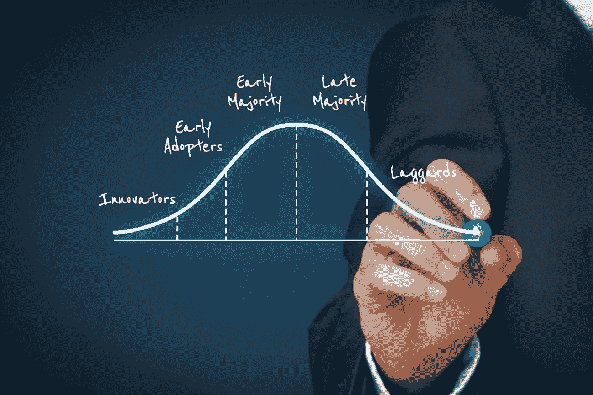

# *第十章*：改进精益-敏捷价值交付周期（VSM 第 7 和第 8 步）

在前面的章节中，你已经学习了如何开展 VSM（价值流管理）计划，绘制当前状态图，并绘制三个阶段的理想未来状态。此时，VSM 团队已经准备好开始改进活动。VSM 实施了 Kaizen（持续改进）理念，以实现持续的改进。VSM 团队现在知道如何应用 VSM 工具，在他们的 IT 价值流和其他组织价值流中进行精益改进。

精益改进在工作范围、时间框架、成本和权限方面与基于敏捷的改进有显著不同。在本章中，你将了解到精益改进通常解决战略层面的问题，这些问题需要投资组合的投入和高层决策，至少在初期是如此。相比之下，基于敏捷的改进通常在战术层面进行，并且是在敏捷团队的范围内，且时间框架较短，通常以单个冲刺（Sprint）为单位进行衡量。

精益和敏捷实践都是必要的，且应在组织中融合。然而，由于本书的主题是价值流管理，我们的重点是进行以精益为导向的价值流改进，特别是在 IT 导向的价值流中。

在我们的通用 VSM 方法论中，有三个与 Kaizen 相关的步骤：首先，识别 Kaizen 爆发点——作为改进机会；然后，规划并实施你的 Kaizen 计划。你在前面的章节中已经学习了如何识别 Kaizen 机会。本章将提供关于如何构建 Kaizen 计划以及如何实施它的指导。

精益改进本质上是业务转型。VSM 计划有助于重新设计业务流程，将其转变为精益生产流程。生产流程一词并不总是意味着产品是为外部客户开发的。例如，一些面向软件的价值流开发并交付软件产品，以支持其他内部业务运营或面向运营的价值流。

我们将在这一章中涵盖所有这些主题。具体来说，到本章结束时，你将能够创建并实施 Kaizen 计划，作为你精益业务转型的一部分。

在这一章中，我们将涵盖以下主题：

+   结合精益和敏捷实践

+   持续进行精益-敏捷改进

+   创建 Kaizen 计划——VSM 第七步

+   实施 Kaizen 计划——VSM 第八步

+   总结 VSM 方法论

# 结合精益和敏捷实践

目前，敏捷方法学家中的当前趋势是将敏捷背后的软件开发概念与与精益生产过程相关的概念结合起来。在玛丽和汤姆·波本迪克在其著作《精益软件开发：敏捷工具包》（波本迪克，2003）中将精益作为敏捷实践的一个组成部分推广后，精益和敏捷实践的整合才逐渐成为主流。他们的书产生了重要影响，大多数现代敏捷方法论，如**Scrum**、**大规模 Scrum**（**LeSS**）、**Disipline Agile**（**DA**）和**规模化敏捷框架®**（**SAFe®**），现在都声称具有精益的基础。

尽管如此，精益-敏捷实践的概念作为 IT 学科相对较新。大多数所谓的精益-敏捷方法论并不提倡或教授全面的方法来进行精益导向的生产改进。相反，大多数精益-敏捷方法论指出，精益或精益思维原则已融入其方法论中。

换句话说，那些声称仅仅遵循他们的实践就可以使组织变得精益的方法学家们认为，精益实践可能会使组织变得精益。但是，精益实践相当成熟，将精益的概念嵌入其他方法论中，而不实施价值流管理的学科，则削弱了其已被证实的生产和价值交付改进方法的严谨性。

尽管敏捷和精益从业者都提倡持续改进的概念，但在改进过程、时间框架和涉及的工作范围方面存在根本性差异。我们将在下一节中详细探讨这些差异。

# 进行持续的精益-敏捷改进

到现在为止，你一定已经意识到组织的价值流管理倡议并非一次性事件。相反，它们是产品线生命周期内持续且循环进行的。然而，在这一章中，你会发现，许多最初的精益改进倡议往往比基于团队回顾的敏捷连续改进具有更大的规模。

这并不意味着在小范围内不能进行精益改进。从根本上讲，精益组织鼓励每个人发现妨碍工作的问题，找到解决方案并加以实施。然而，敏捷团队和个人通常无法对设备和工具进行全面更改，也不能在没有高层批准的情况下采购新的设备和工具来改善价值流的持续流动。精益和价值流管理的学科在实施大规模改进和业务转型时表现突出。

当 IT 组织希望实施**持续集成/持续交付**（**CI/CD**）或 DevOps 流水线时，大规模 IT 价值流改进问题会显现。这些投资通常大于一个敏捷软件开发团队，甚至一个软件产品团队可以批准的金额。基于这些原因，精益导向的改进范围通常比敏捷要大——至少在初期阶段——因此时间框架和投资也往往较大。

精益敏捷的目标是结合两种业务模式的优势。这两个概念有更多的相似之处而非不同。例如，敏捷和精益的概念都专注于交付以客户为中心的价值。两个概念都寻求提高生产效率、改善质量和快速交付。而且，两个概念都鼓励持续改进。

敏捷、Scrum 和精益都共享持续改进操作的理念。然而，精益实践者采用价值流管理实践来指导改进，而敏捷实践者则倾向于使用回顾会议。

VSM 实现了一个比基于敏捷的回顾会议更为严格的持续改进过程，称为**Kaizen**。与敏捷回顾相比，精益基于 Kaizen 的改进倾向于从整体上看待价值流，从头到尾进行改进，以便改善产品和信息流。因此，基于 Kaizen 的改进可能跨越时间框架和投资规模，超出小型敏捷团队能批准的范围。

换句话说，有时候，我们需要先把复杂的事物拆解开来，然后再弄清楚如何将它们重新组合成一个更好的操作系统。由于这些投资非常巨大，我们需要根据每个提议的变更对其贡献进行优先排序，以便在最短的时间内提供最大价值。

在我们对 IT 价值流进行持续性和未来状态映射练习的过程中，我们识别出了许多改进机会。具体来说，Kaizen Burst 图标突出了我们在未来状态图中识别出的改进机会。敏捷和 Scrum 实践寻求基于对实时问题的评估进行增量改进，这些问题需要立即关注。相比之下，价值流管理则采取更长期的视角来评估组织、工作和信息流的结构性变更。

VSM 团队将与价值流操作人员和利益相关者合作，逐步实施推荐的 Kaizen 改进。然而，规划的视野要比敏捷和 Scrum 推荐的视野长得多，至少在 VSM 团队初次参与时是如此。此外，VSM 的改进通常具有战略性，投资决策通常在投资组合层面做出。

两种持续改进概念——敏捷（Agile）和精益（Lean）——都是至关重要的。但正如你在*第五章*《通过 DevOps 流水线推动业务价值》中发现的那样，实现跨开发和运维部门的精益 IT 价值流需要大量的投资。这样的高成本改进需要高层管理的支持和批准，而且 IT 部门需要时间和精力来实现成熟的 DevOps 能力。

现在你已经了解了精益与敏捷基础的持续改进目标之间的不同，我们可以继续前进，了解如何制定基于 VSM 的 Kaizen 计划。

# 创建 Kaizen 计划——VSM 第七步

在逐步实施 CI/CD 或 DevOps 工具链和流水线时，存在真正的失败风险，特别是在临时基础上进行实施。首先，高层管理者可能无法完全理解涉及的时间和成本，并且当他们看到需要批准的**资本支出**（**CAPEX**）请求时，可能会产生抗拒。开发和运维团队如果他们的工具链和平台请求未被批准，将会感到沮丧。在开发 DevOps 流水线时，必须解决工具、流程集成和安全问题，内部客户和利益相关者可能对改进所需的时间抱有不切实际的期望。

**DevOps**是一项业务转型活动。它更像是业务流程再造项目，而不是增量的业务流程改进计划，因此 DevOps 计划需要相应的对待。换句话说，DevOps 是一个战略投资，必须在投资组合层面进行规划和执行。这意味着 VSM 团队必须进行严格的规划，提供详细的预算和时间表，并为其实施制定路线图，以支持组织其他精益价值流的计划。

在本节中，你将学习如何为 VSM 计划构建 Kaizen 计划。那我们就开始吧。

## 与业务战略的连接

随着三阶段未来状态映射练习的完成，VSM 团队对需要进行的改进有了广泛的理解。现在，VSM 团队必须学习如何实施这些改进，这就需要一个计划。

不需要在开始时就试图把计划做对并完成。最好从我们已知的开始，找出我们不知道的部分，并随着团队的推进对计划进行有根据的改进。这种方法与敏捷对软件改进的观点一致。首先，我们必须实施我们认为客户需要和想要的东西。然后，我们展示给他们我们所做的，再根据他们的反馈进行逐步改进。相同的策略也适用于 Kaizen 计划的制定和实施。

在 VSM（价值流图）计划的每个阶段，团队都会通过一系列问题开始工作。这个策略同样适用于 Kaizen 规划。但这一次，VSM 团队的重点是将改进活动与战略目标对齐。换句话说，组织的高层管理者批准 VSM 计划时设定的目标和任务是什么？一些相关的问题如下：

+   价值流的客户是谁，他们如何从 VSM 改进中受益？

+   这个 VSM 计划如何支持组织的战略目标？

+   VSM 计划的成本是如何被证明为一个高优先级投资组合的？也就是说，是什么样的高层管理期望证明了这些投资的合理性？

+   VSM 计划支持哪些内部或外部产品？

+   VSM 计划影响了哪些内部和外部组织？

+   该计划预期的质量改进是什么？

+   精益 IT 价值流将如何支持组织的其他精益价值流？

+   是否有价值流的部分，改进会对系统的整体生产力产生更大的影响？

    a. 换句话说，价值流中是否存在对整体流动性和吞吐量产生负面影响的部分？

    b. 是否有价值流中相互关联的活动可以合并成更简单、更高效的活动？

+   我们应该如何优先处理在未来状态映射活动中识别出的流改进活动？

+   实施每个 Kaizen 改进计划需要哪些类型的投资？

+   为支持每项已识别的改进建议，需要什么样的培训或技能？

+   实施已识别 Kaizen 改进的最佳时间表是什么？

VSM 团队必须清晰地定义所有前述问题的定性和定量指标。最终，这些指标将定义每项改进行动的有效性。

## 在各个阶段规划精益改进

就像 VSM 团队在三个阶段内确定了**未来状态改进**，改进计划的实施也应遵循相同的三个阶段。这些阶段如下：

+   子计划：满足**客户需求**

+   子计划：改进**过程流**

+   子计划：**平衡工作负载**

这三项子计划直接对应于上一章中识别出的未来状态 Kaizen 计划（*第九章*，*未来状态映射（VSM 步骤 6）*）。快速回顾一下，未来状态映射指导跨越以下三个阶段的改进：

+   **客户需求阶段**：评估产品、工作项和服务的客户需求，包括客户驱动的质量、特性或功能的变化，以及交付时间。

+   **持续流阶段**：旨在改进生产流动，以匹配客户需求。

+   **平衡阶段**：实施策略来分配工作，无论是按量还是按种类，以减少瓶颈和等待时间，并尽量减少批量大小。回忆理想的批量大小是一个。

别忘了，VSM 团队为每个阶段识别了多个改进机会。因此，Kaizen 计划应涵盖每个阶段的所有推荐改进措施。

## 制定 Kaizen 计划

再次强调，不同于 Agile 概念中在每个**Sprint**中识别和实施改进，精益改进通常需要几个月才能推出。其主要原因之一是需要识别实施必要工具、设备和布局变更所需的投资，获得高层批准，并将其纳入预算周期。

提议的变更同样需要时间来设计、采购、部署和测试所需的工具、平台和设备。VSM 团队不能忽视让组织的人才快速适应这些变化的需求。Kaizen 计划应包括**时间**和**资源**用于辅导、指导和培训。在本节中，您将学习如何使用三种主要工具来制定 Kaizen 计划；即月度 Kaizen 计划表、VSM 目标和可衡量指标图表以及详细的月度 Kaizen 计划表。

如果 VSM 团队愿意，他们可以使用项目管理调度工具，如 MS Project，来开发 Kaizen 计划的**甘特图**。但一个简单的工作表或大白板已经足够用来创建**月度 Kaizen 计划表**。

下图展示了作为 Excel 工作表的月度 Kaizen 计划表示例。该工作表直观地展示了各个 Kaizen Burst 在未来状态改进的三个阶段中的计划改进举措。此外，VSM 团队会根据随着时间的推移而识别的新的改进举措更新月度 Kaizen 计划工作表：

图 10.1 – 月度 Kaizen 计划表

月度 Kaizen 计划工作表概述了计划中的精益改进举措；因此，它并未提供与每个精益改进举措相关的任务的详细信息。随着计划的推进，更多的细节将被揭示，VSM 团队将使用不同的视觉展示来跟踪这些细节并告知他人其进展。详细计划可能被称为**Kaizen 里程碑图**或**月度 Kaizen 计划**。

VSM 团队持续使用位于月度 Kaizen 计划表底部的符号（*图 10.1*）来更新每个 Kaizen Burst 在其日历字段中的状态。

另一个重要的可视化展示是显示**精益可衡量指标**的图表，包括基准线和目标值、目标、拟议变更的状态，以及已识别的风险和问题。这个图表称为**VSM 目标与可衡量指标图表**，它的目的是提供 VSM 改进活动的高可视性展示，包括改进目标、目标和指标。它还标识了与每个推荐改进目标相关的风险和问题。

下图展示了一个 VSM 目标与可衡量指标图表的示例。

图 10.2 – VSM 目标与可衡量指标图表

请注意，风险和问题是分别列出的。原因在于，根据定义，*风险*是可能发生的事件，而*问题*是已经影响我们项目的事项。两者的区别至关重要，因为 VSM 团队应该在风险发生之前识别潜在风险，并决定为避免或缓解风险的负面影响而采取哪些必要的步骤。此外，VSM 团队还应该为最严重的潜在风险定义应急计划，以便在发生时能立即采取措施，将影响降到最低。

例如，假设 VSM 团队建议采用新的**源代码管理**（**SCM**）库和持续集成工具。如果安装过程中出现问题，我们希望能够有备份和恢复功能作为应急计划，将原始环境和数据恢复到故障发生之前，直到我们弄清楚导致新系统切换失败的原因。

详细的月度改善计划包括与月度改善计划相同的要素，如阶段、计划任务和月份。但详细的计划应包括额外的信息，例如责任分配、估计完成时间以及任务是否逾期。它还提供了比按月划分更为细化的时间展示，按周为单位。*变更状态*字段更新了在 VSM 目标与可衡量指标图表底部识别的符号（*图 10.2*）。

下图提供了一个**详细的月度改善计划**示例展示。顾名思义，该计划旨在了解拟议的 VSM 改进活动。具体而言，计划提供了识别所有改进措施的空间，直到任务级别：

图 10.3 – 详细的月度改善计划

《详细月度 Kaizen 计划表》为每个推荐的改进目标提供了一个**任务编号**，并进一步细化到任务层级。描述性的任务**名称**突出了涉及的工作，计划应标明谁负责完成工作，以及目标是否已达成。时间表提供了**开始日期、持续进行的工作以及完成日期**的可视化展示。VSM 团队还应进行注释，标明计划任务是否已**逾期**。

里程碑标志着重大事件的开始或完成，使用在《详细月度 Kaizen 计划表》（*图 10.3*）底部标识的符号。因此，对于每项改进活动，VSM 团队需要识别重要事件，用于衡量其变革举措的开始、进展和完成。所有里程碑必须在变革目标的量化方面可度量，并且能够衡量活动完成所设定目标的程度。

重要的是要理解，VSM（价值流管理）举措是基于项目的工作，而不是基于敏捷开发策略的工作。这并不是说 VSM 举措与精益实践不兼容。尽管如此，基于敏捷的回顾通常受时间和范围的限制，并且仅限于小型敏捷团队的权力范围和一个迭代周期（Sprint）的持续时间。

相比之下，精益举措往往具有更长远的规划周期，涉及更大的投资，需要高层的支持和赞助，并且通常更符合支持企业战略。

VSM 举措的任务是识别出实施和改进精益实践所必需的关键变革，这些变革横跨整个价值流。工作范围和投资需在高层获得批准，并直接影响组织实现战略目标的能力。

在这种情况下，VSM 举措具有项目的特征。换句话说，它们有明确的工作范围、明确的交付任务、明确的预算和明确的时间表。然而，随着精益转型的初步完成，并安装到基于敏捷的框架上，持续改进工作将在长期内转交给敏捷团队，作为其常规迭代回顾的一部分。通过这些初步的精益转型，**IT 导向**的价值流将作为精益敏捷实践进行改革。

现在，VSM 团队已经制定了他们的 Kaizen 计划，他们需要获得继续进行的批准。此批准要求将是下一小节的主题。

## 获取继续进行的批准

如前所述，精益改进举措通常涉及大量的投资。但它们也可能会干扰价值流日常活动。因此，VSM 团队必须在开始新的变革举措之前，寻求并获得适当的批准。

注意，这一层次的批准通常不适用于基于敏捷的持续改进活动，因为它们通常集中在局部层面的程序性变更。但考虑到大型 VSM 举措所涉及的时间、资源和投资，获得高层批准是必要的。

VSM 团队可以使用其**VSM 故事板**和**Kaizen 计划**来总结其精益转型的概念。在高层审核时，VSM 团队应该准备回答以下问题：

+   这个项目如何与组织的战略目标相关？

+   为什么 VSM 团队选择了这个价值流、相关价值流或部分价值流来进行此次精益改进？

+   精益方法将对我们的内外部客户产生什么影响？

+   预期的吞吐量变化是什么？

+   预期有哪些产品质量改进？

+   预期的成本节省是多少，时间框架是多少？

希望高管团队参与了早期的规划会议，并正式支持了 VSM 团队，明确了**授权书**，以授权他们的时间和资源。然而，提醒高管团队 VSM 举措的目的和目标，以及团队的工作如何支持组织的战略目标和使命，总是没有坏处的。

VSM 团队的建议可能乍一看显得过于激进且成本高昂。团队必须准备好用可靠的逻辑、准确的数据和规避风险的 Kaizen 策略来支持他们的建议。在准备演示文稿时，VSM 团队应牢记以下几点：

+   设定现实的目标和预计完成日期。

+   在正式演示之前，与高管、价值流经理、操作员和其他关键利益相关者进行开放对话，以获得他们的支持。

+   向所有与价值流相关的人员展示草稿版的 VSM 演示文稿和图示，并获取他们的意见。

+   保持主要演示文稿简洁，用要点列出关键内容，但准备好详细的幻灯片来深入探讨必要的细节。

+   使演示文稿更具视觉冲击力，使用图形和大字体的幻灯片，并展示大型 VSM 故事板。

+   确保优秀的工作得到认可，包括 VSM 团队成员、VA 操作员和其他重要利益相关者的工作。

+   获得批准后，花时间庆祝一次，再在每次成功的精益改进举措后再次庆祝。

这就是关于 Kaizen 规划的所有内容。如果您已经熟悉敏捷概念，您知道在 IT 领域，详细的项目和时间表计划是没有意义的。在我们开始与价值流客户合作之前，我们无法知道哪些解决方案是最好的或最优的。此外，需求和优先级随着时间的推移而变化，这使得详细的计划在我们开始工作之前就过时了。更好的选择是将您的基本 VSM 计划整理好，推进它，然后在工作过程中逐步和增量地改进它，以不断改善价值流。

本节结束了我们对 Kaizen 规划的讨论。在下一节中，您将学习如何实施 Kaizen 计划。

# 实施 Kaizen 计划 – VSM 第八步

在本节中，您将学习如何实施您的 Kaizen 计划。这最后一步也是最简短的 VSM 方法，但可以说是最关键的一步，也是最长的活动——它持续整个价值流的生命周期。与敏捷一样，在精益实践中，我们永远不会停止改进的努力。

这个 VSM 步骤也是最难实施的。原因是许多人，如果不是大多数人，天生对变革有抵触情绪。VSM 团队的精益改进建议是否成功，取决于他们能否让全组织的人认可。您必须从解决变革问题开始这一步骤。

## 解决变革问题

获得组织的认同以实施 VSM 团队的建议不是一蹴而就的。最好与一个高度激励的价值流团队合作，这个团队愿意作为**创新者**和**早期采纳者**，参与组织的精益企业倡议。

与商业流程再造的原始目标不同，VSM 团队不应一次性实施其建议。唯一的理由是，如果组织处于**燃烧的平台**状态，延误可能导致组织破产或失败。相反，VSM 团队需要通过其已识别的 Kaizen 爆发点，逐步和增量地实施变革。这并不意味着过程应该不必要地延长时间。目标是实现快速的成功，并利用这些早期成功，然后通过快速跟进的成功来传达整个 VSM 计划的价值。

根据*技术采用生命周期*原则，最早由 Joe Bohlen 和 George Beal 在他们的论文《扩散过程》中提出，一旦组织成员确信变革的好处，其余成员也会跟随新的实践。下图提供了典型的技术或产品采用曲线的图示：

图 10.4 – 技术采纳曲线

技术采用生命周期是一个社会学模型，描述了新产品或创新的采用或接受情况。当你查看前面图中的贝尔曲线时，你会注意到曲线上标注了几个标签：**创新者、早期采用者、早期大众、晚期大众和滞后者**。让我们花点时间来理解这些标签的含义：

+   **创新者**：他们是行业或组织中最早实施新方法、工具和运营模式的人。他们喜欢变化，较少规避风险。在某些情况下，他们可能处于危机模式（即“燃烧的平台”），别无选择，只能改变他们的做事方式。

+   **早期采用者**：他们是第一个看到创新者带来好处的人，并迅速采纳新的工作方式。他们通常也愿意接受变革并承担一定风险，但他们不会是第一个行动的人。

+   **早期大众**：在技术或商业转型的生命周期阶段，此时事情开始起飞。足够多的人已经为证明新技术或新工作方法的好处铺平了道路，更多的人也开始愿意承担采用新方法的风险。

+   **晚期大众**：这些人是最保守和最规避风险的人，他们会等到变革的动力如此强大，以至于新的方法成为唯一的做事方式。

+   **滞后者**：这些人根本不喜欢变革，可能信息不全，或许只是缺乏做出改变的资源。因此，他们是最后做出改变的人。

虽然创新者和早期采用者引领了变革，但当早期大众、晚期大众和滞后者看到利益大于风险并接受新的工作方式时，变革才会在组织内生根发芽。

到现在，你可能在想，如何启动一个新的精益变革倡议。答案是，这不仅仅是一个过程，更是一个潜在的变革支持行动清单，具体如下面的列表所示：

+   每一步都要沟通原因和意图。

+   理解那些离工作最接近的人，通常会有很好的想法，知道什么需要修正，为什么以及如何修正。

+   立即解决任何人员问题或不当行为。

+   奖励并认可支持 VSM 倡议的人。

+   解决障碍和问题——并且不要让它们阻止你前进。

+   不要害怕实验，去发现更好的运营模式。

+   高层赞助人和价值流映射（VSM）团队需要保持可接触性、灵活性，并愿意听取来自价值流操作员和利益相关者的意见，同时也要专注于精益改进目标。

+   在进行渐进性变革时，积极的效果是累积的。

+   记住，我们是为长期而来。

既然你已经有了应对变革中人类因素的策略，那么让我们来分解实施策略。

## 引导精益业务转型

正如本章引言中所提到的，精益是通过进行大规模的业务转型来改善价值交付，并且在整个组织生命周期内持续对整个价值流进行改进。从技术角度来说，协调精益业务转型工作有三个阶段：**准备**、**实施**和**后续跟进**。

我们在前一节的 Kaizen 规划中已经讨论了准备工作。实施是*实际落地的时候*，此时是进行变更的时机。接下来，VSM 团队需要跟进，确保这些变更得以贯彻实施。此外，VSM 团队还需要确保价值流达成那些能够证明精益改进投资的目标和指标。

记住，精益持续改进努力与基于敏捷的持续改进活动是不同的。精益侧重于长期规划和投资，使组织在竞争激烈的市场中具有难以超越的优势。另一方面，基于敏捷的回顾往往是局部的、相对较小的，通常不涉及投资，并且是在非常短的迭代中实施的。

通过其精益改进导向，VSM 的目标是消除所有形式的浪费。目标是帮助 VSM 团队构建从客户角度看高效、响应迅速、增值的价值流。然而，借助帕累托原则，我们知道每一次改进都会将其他问题提升至优先级列表的顶部。每一个新的精益改进都将价值流朝着为客户提供卓越服务的方向前进。

VSM（价值流管理）倡议是大局观的改进活动，逐步和持续地实施。VSM 团队使用他们的故事板来指导活动，并向其他利益相关者解释结构化的价值流管理过程如何改善价值交付。

## 拆解精益改进工作

在需求、持续流动和水平化改进的三个未来状态阶段中，VSM 团队专注于对 Kaizen 突发事件中识别出的改进进行实施。每个 Kaizen 突发事件中的改进活动可以是相对较小的，也可以是非常大的举措，包含多个任务，可能还涉及重大投资。

将每个 Kaizen 改进活动的工作拆解为事件的目的是全面暴露所需的工作，并让所有相关的利益相关者参与评估。VSM 团队可能会选择使用*用户故事*格式，如在“水平化阶段”的看板部分所描述，用以表达每个 Kaizen 事件的目标和目的。这些 Kaizen 事件可以类比为产品待办事项中的工作项。

实际上，在 IT 价值流中，Kaizen 事件可以作为产品待办事项的一部分，因为改进工作很可能涉及到价值流运营人员的努力。也可以使用看板（Kanban Board）来管理和展示更大范围的 VSM 倡议在 Kaizen 爆发和事件中的工作流程。

无论你选择哪种管理 Kaizen 事件的方法，VSM 团队必须收集并沟通额外的信息。为此，遵循以下步骤：

1.  确定 Kaizen 事件的目标并进行沟通。

1.  确定分配支持 Kaizen 事件的人员的角色和职责。

1.  定义团队工作范围；例如，通过故事或史诗（Epic）格式。

1.  确定支持 Kaizen 事件所需的培训或信息需求。

1.  在详细的月度 Kaizen 时间表计划中，展示 Kaizen 事件的预计开始和完成日期，作为里程碑。

1.  识别潜在的风险和问题，并根据需要制定缓解策略和应急计划。

1.  计划并协调完成 Kaizen 事件所需的工作。

1.  如果需要额外的投资或资源，超出最初设想，请寻求高层管理支持和批准。

1.  如果需要新团队成员支持工作，更新 VSM 团队章程。

再次强调，一些 Kaizen 事件比其他事件更容易规划和执行。因此，只需进行足够的准备和规划工作，确保事情朝着正确的方向发展。但也要知道，通过反复试验，你对需要做什么的理解会随着时间的推移而改善。

从长远来看，VSM 团队需要准备好重新审视其价值流图的时效性，并相应更新。现场观察（Gemba walks）永不停止，价值流改进也永不停歇。每个 Kaizen 事件都需要一个完整的 VSM 团队和高层领导的承诺，始终如一。否则，工作可能会滞后，甚至无法完成。

本节完成了我们关于实施 Kaizen 计划、在价值流中安装精益改进的讨论。但在离开 Kaizen 话题之前，让我们花几分钟讨论一下，为什么 VSM 倡议需要作为投资组合级别的项目获得高层批准。

## 将 VSM（价值流图）倡议作为投资组合级别的项目进行管理。

VSM 团队及其支持的高层管理人员需要在努力过程中保持耐心。VSM 倡议涉及大规模的业务转型，旨在实现精益的产品和信息流。转向精益的业务转型可能需要几个月甚至几年的时间才能完成。目标是给予 VSM 团队时间和资源，以完成至少一个 VSM 迭代，涵盖未来状态改进活动的所有三个阶段（即需求、持续流动和平衡）。

一旦 VSM 的未来状态价值交付改进周期完成，VSM 团队可能会觉得有必要转向另一个价值流，支持精益改进工作。组织的高层领导必须持续支持跨企业评估精益改进机会的努力，并在其组合规划活动中对投资优先事项进行对齐。大型组织可能会同时进行多个 VSM 项目。

所有 VSM 项目都需要资金、时间和资源，并需要投资。没有足够的前期分析，组织的高层领导无法知道如何最好地部署有限的资源以获得最大收益。这也是现代精益敏捷实践（如**纪律敏捷**和**规模化敏捷框架**® (**SAFe®**)）在其工具包和方法论中实施严格的组合分析技术的原因。

由于缺乏精益敏捷框架，VSM 团队必须将其活动与组织的组合管理优先事项对齐，并通过组合管理过程寻求投资。由于没有正式化的组合管理过程，VSM 团队必须与高层领导合作，建立正式机制，审查团队的精益投资策略和优先事项。没有这些批准，就无法有效推进实施已识别的精益改进。

与与八个 VSM 步骤相关的其他部分一样，我们将在讨论改善时总结一节，概述用于支持改善实施活动的工具。

## 利用改善工具

如果您的 VSM 团队仍然使用手动系统，改善实施工具与用于改善规划和价值流映射阶段的工具相同。不同之处在于，现在这些工具用于支持实施变革过程。您所学到的 VS 方法和工具可以用于改进跨开发和运营导向的价值流中的精益实践。

支持您的改善规划和实施活动的工具包括以下内容：

+   VSM 故事板

+   当前和未来状态的价值流图

+   每月改善计划

+   VSM 目标和可衡量指标图表

+   详细的每月改善计划

通过*第六章*《启动 VSM 计划（VSM 步骤 1-3）》到*第十章*《改进精益-敏捷价值交付周期（VSM 步骤 7 和 8）》的学习，你已经掌握了启动并执行 VSM 计划的实践知识，从而在价值流中实施精益改进。在本书的剩余部分，即《实施价值流管理（VSM）方法和工具》章节中，我们将重点了解现代 VSM 工具如何支持 CI/CD 和 DevOps 管道开发与改进活动。在继续阅读剩余章节之前，让我们快速回顾一下 VSM 方法论。

# 回顾 VSM 方法论

在*第四章*《定义价值流管理》和*第六章*《启动 VSM 计划（VSM 步骤 1-3）》中，本书通过应用八步流程介绍了价值流管理，并通过一种通用方法定义了已验证的 VSM。例如，这一八步 VSM 方法论已在制造业、办公室管理、供应链和医疗行业中证明了其有效性。

八个步骤如下：

1.  承诺实施精益

1.  选择价值流

1.  了解精益

1.  绘制当前状态

1.  确定精益指标

1.  绘制未来状态

1.  创建 Kaizen 计划

1.  执行 Kaizen 计划

这八步 VSM 方法论同样适用于 IT 导向的价值流，正如本书本部分提供的 CI/CD 管道案例所示。IT 导向的 VSM 案例故意将复杂性限制，以便专注于学习 VSM 方法论。但选择使用 IT 导向的案例并非偶然，因为现代价值流管理工具支持在 IT 导向的价值流中实施精益实践。

然而，在一个组织中采用多个 VSM 方法论是没有意义的，使用一个方法就足够了。每个 VSM 团队应该自由地修改基础的 VSM/精益改进策略，以提升其在独特环境中的有效性。此外，在数字经济中，跨企业的每个 VSM 计划可能都需要得到组织 IT 部门的某种支持。

在前面的章节中提到，DevOps 能力是我们在现代数字经济中竞争所需的“最低要求”。因此，大多数现代 VSM 工具支持 DevOps 能力的实施、集成和改进。但这些工具供应商也指出，VSM 与 DevOps 的结合还支持组织的精益改进目标。因此，DevOps 是为组织生产的任何产品和服务增值的关键推动力。

# 总结

本章讨论了持续改进我们价值流工作和信息流能力的重要性。你了解到 VSM 和敏捷有共同的原则，但它们的时间线和工作范围是不同的。例如，敏捷团队使用回顾会议来评估他们在下一个冲刺中可以进行的小规模改进。

相对而言，VSM 团队将精力集中在更重要的、精益导向的改进计划上，这些改进计划跨越较长的时间框架并需要更大的投资。此外，敏捷团队的持续改进通常不需要高层管理的批准；而 VSM 团队的改进建议几乎总是需要高层管理的批准。

在继续进行我们的八步 VSM 方法论时，你学习了如何创建改善计划（VSM 第七步）并实施改善计划（VSM 第八步）。你还学习了如何开发和使用几种工具来规划和实施改善计划，比如每月改善计划、VSM 目标和可衡量指标图表以及详细的每月改善计划。

在下一章中，你将学习 VSM 工具如何通过提供对关键 IT 价值流数据、基于仪表盘的可视化和度量的实时访问，支持在 DevOps 流水线中的精益改进。VSM 工具帮助 DevOps 团队成员和其他相关方监控并改善信息和工作流在 IT 价值流中的流动，并专注于客户。

# 问题

1.  日语词汇“Kaizen”在英语中是什么意思？

1.  为什么实施 DevOps 能力是授权高层管理支持的 VSM 计划的理想项目？

1.  每月改善计划的目的是什么？

1.  VSM 目标和可衡量指标图表的目的是什么？

1.  详细的每月改善计划的目的是什么？

1.  未来状态改进计划和活动涉及哪三个阶段？

1.  当 VSM 计划中的项目型工作转交给敏捷团队时会发生什么？

1.  鉴于 VSM 计划所涉及的变化范围，哪种生命周期模型最能代表组织如何演变以采纳新的精益原则？

1.  为什么 VSM 计划被视为投资组合级别的决策？

1.  哪两种调度和可视化方法适用于管理与 Kaizen 冲刺相关的工作？

# 进一步阅读

+   Poppendieck, M., Poppendieck, T. (2003 年 5 月) *精益软件开发：敏捷工具包*。Addison-Wesley。波士顿，马萨诸塞州

+   Tapping, D., Luyster, T., Shuker, T. (2002) *价值流管理：精益改进的规划、映射与持续的八个步骤*。生产力出版社。纽约，纽约

+   Tapping, D., Luyster, T., Shuker, T. (2003) *精益办公室的价值流管理：精益改进的规划、映射与持续的八个步骤*。生产力出版社。纽约，纽约

+   Tapping, D., Kozlowski, S., Archbold, L., Sperl, T. (2009) *精益医疗中的价值流管理：规划、绘图、实施和控制各类医疗环境改进的四个步骤*。MCS Media, Inc. Chelsea, MI.
