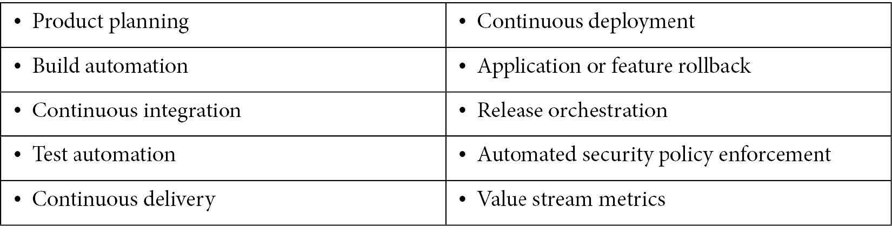
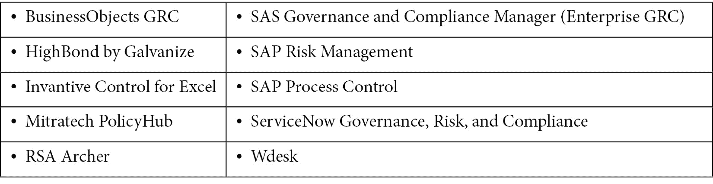
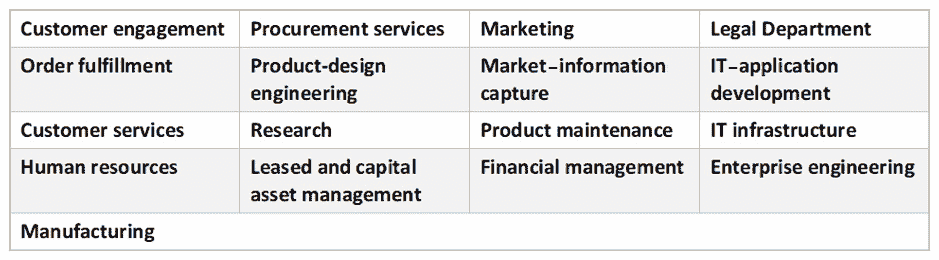

# 第十一章：识别 VSM 工具类型和功能

在 *2021 年预测：价值流将定义 DevOps 未来报告*（2020 年 10 月 5 日发布）中，Gartner 表示：“到 2023 年，70%的组织将使用价值流管理来改善 DevOps 流水线中的流动，从而加快客户价值交付。”（[`www.gartner.com/`](https://www.gartner.com/)）显然，Gartner 认为 VSM 作为 IT 改进策略，正在迅速成为主流。

正如你从前面的 Gartner 引用中看到的，VSM 工具在 IT 行业中迅速获得关注。但在理解 VSM 的更大目标以及如何在价值流中实施 VSM 活动之前，开始实施这些工具是一个错误。问题在于，VSM 工具提供的数据和指标，除非我们首先理解精益价值流改进的目标和原则，否则几乎没有实际用处。这就是为什么你花了前四章时间学习如何应用通用的 VSM 方法论。

现在你已经了解了与价值流管理相关的目标、指标和活动，我们必须看看支持我们持续进行 VSM 活动的工具。本章将提供关于如何使用市场上主要 VSM 工具类型的指导。你还将了解现代 VSM 工具中提供的不同功能。

在本章中，我们将涵盖以下主题：

+   利用 VSM 工具和平台

+   启用 VSM 工具功能

+   突出 VSM 工具的重要功能

+   VSM 工具解决的关键问题

+   VSM 工具实施问题

+   促进业务转型

+   VSM 工具的好处

# 利用 VSM 工具和平台

本节将介绍现代 VSM 工具中可用的工具类型和功能。你还会发现，VSM 工具行业宣传其帮助实施精益改进到 IT 价值流的能力。但这些 VSM 工具所提供的信息也可以通过它们的数字触点支持跨所有组织价值流的精益改进活动。

VSM 工具通过提供对关键 IT 价值流数据、基于仪表板的可视化和指标的实时访问，帮助在 DevOps 流水线中实施和改进精益实践。这些信息帮助 DevOps 团队成员和其他利益相关者监控和改进信息流和工作流，贯穿 IT 价值流。此外，VSM 工具提供有助于保持 IT 价值流聚焦于为客户创造价值的信息和分析。

在本章中，你将学习 VSM 工具所提供的功能。但在此之前，我们将先进行一场关于支持 IT 价值流客户交付能力的 DevOps 工具和流程类型的简介讨论。

在本章介绍中提到的同一篇文章中，Gartner 概述了三种支持 DevOps 工具，这些工具能够转变 IT 价值流快速且可靠地交付客户价值的能力。这些工具和流程包括以下内容：

+   **DevOps 价值流管理平台**（**VSMPs**）：提供开箱即用的连接器，整合不同的 DevOps 工具链，促进跨规划、发布、构建和监控活动的 IT 活动编排。VSMPs 通过提供 IT 价值流的可见性和分析，帮助提高速度、质量和客户价值。当你在现代背景下查找**价值流管理**（**VSM**）工具时，你通常会发现这些类型的工具。

+   **价值流交付平台**（**VSDPs**）：提供集成工具链作为开箱即用的解决方案，通常作为基于云的 CI/CD 或 DevOps 平台提供。VSDPs 还包括支持软件交付价值流中活动的可见性、可追溯性、可审计性和可观察性的工具。这些功能远远超出了传统 DevOps 平台的能力。在这个意义上，VSDPs 将 DevOps 平台的能力与 VSM 工具的能力相结合。你会发现 DevOps 平台供应商和 VSM 工具供应商正在融入这个共享领域。

+   **持续合规性自动化**（**CCA**）**工具**：这些工具帮助自动化和加速合规性和安全性相关的任务，取代了手动检查表、政策和工作表。此外，这些工具还能够在 SDLC 周期的早期阶段提供潜在问题的可见性，此时修正问题更为容易且成本较低。CCA 工具不应孤立运作，应该与组织的 CI/CD、DevOps 和 VSM 平台及工具集成。最好将它们作为自动化测试能力的一部分，与集成的 VSM 工具一起，这有助于支持实时监控、合规性和安全性测试结果的可见性。

Gartner 还确定了两个关键的过程，**混沌工程**和**IT 弹性角色**，这有助于优化 IT 价值流的流动。书中的后续部分将讨论事件管理和服务恢复的重要性。这些是事后问题解决策略。混沌工程进一步识别了 IT 部门可以采取的预防措施，以在复杂环境中提供高可靠性。

与前面的讨论类似，**灾难恢复**（**DR**）也是一种事后问题解决方法，用于将失败的系统恢复到在线状态。*IT 弹性角色*是一种将 DR 团队与产品团队联系起来的预防措施，有助于在 DevOps 价值流中实现更好的弹性。

# 启用 VSM 工具能力

对于任何产品负责人来说，一个好的策略是评估客户在其能力方面的需求。换句话说，我们的客户期望我们的产品在解决他们可能遇到的问题或需求时提供哪些能力？提供能够解决客户问题或需求的能力，就是我们提供价值的方式。在这个背景下，产品的特性和功能通过它们提供的能力来传递价值。

根据定义，**能力**一词意味着一种能力或做某事的权限。在软件开发中，需求分析定义了客户无法做或实现某些期望的领域。目标是创建能够提供这些能力的软件产品。

但是，认为*能力*一词仅仅指代某些功能或特性的交付是错误的。实际上，客户购买的东西，例如软件，是为了满足基本的人类需求，如以下几个方面的改善：

+   性能或生产力

+   健康和福祉

+   经济学或财务

+   个人形象

VSM 工具也不例外。VSM 工具需要为用户增加价值，以支持其组织的 IT 价值流改进计划。是的，生产力和性能的提高是精益生产改进的核心。但这些改进也有助于提升组织的健康和福祉，并可能对其客户产生积极影响。而一个成功的 VSM 项目可以改善组织的经济状况。

但不要忽视最后一个关注点：*形象*。对 VSM 和 DevOps 工具及平台的大规模购买和投资，可能对高层管理和利益相关者的决策和认可产生巨大的情感影响。当高层管理做出关于组织结构和工作活动的全盘变动时，员工的担忧也是成立的。最终，最强大的动机可能就是通过改善组织在行业中的形象来推动投资和结构性变革。

但我偏离了主题。接下来，让我们继续了解现代 VSM 工具所提供的功能以及这些功能为何至关重要。

在阅读了本书前四章关于应用通用 VSM 方法的内容后，你可能已经猜到，VSM 工具应该支持 VSM 流程，包括映射、度量和分析。如果你还猜到了集成、自动化和编排，那么你就更接近理解现代 VSM 工具所提供的扩展价值了。

在*识别 VSM 工具能力*一节中，我们将介绍许多领先的 VSM 供应商。我们将介绍的其中一位供应商，**ConnectAll**，提出了一种观点，即工具无关的 VSM 解决方案必须实现以下六个关键特性：

+   IT 与业务对齐

+   可操作和相关的数据

+   数据驱动、以结果为导向的分析

+   动态价值流可视化

+   工作流编排

+   IT 治理

这个清单是一个很好的起点，让我们花几分钟时间来了解这些功能提供的能力。换句话说，在你继续阅读之前，最好将每项内容中的 *features* 替换成 *capabilities*，这样会更有帮助。

## IT 与业务的对齐

在我们现代的数字经济中，IT 功能几乎支持业务的各个方面。例如，组织可以将 IT 解决方案作为独立的产品提供，或与实物产品集成以提供增强的功能和特性。但 IT 解决方案同样能提高其他开发和运营导向价值流的生产力。

出于这些原因，VSM 的作用必须超越单纯改进 CI/CD 和 DevOps 管道流的目的。这些改进还必须支持整个业务的战略、目标和使命。换句话说，你的价值流不仅仅局限于软件开发。软件价值流扩展到业务，支持所有组织的价值流。

在这种背景下，VSM 解决方案必须帮助组织通过提供以下能力，使其 IT 功能与业务对齐：

+   实施实时指标以支持精益价值流改进

+   实施并可视化**关键绩效指标**（**KPIs**），覆盖开发和运营导向的价值流，以提高交付的速度和质量

+   提供端到端的关键指标和结果的可见性，覆盖所有投资组合投资

访问实时数据在 VSM 中是一个游戏规则的改变者。然而，如果数据不可操作且与提高交付价值的能力无关，它的价值就微乎其微。

## 可操作且相关的数据

VSM 是从精益生产的角度出发，对我们价值交付流的持续改进活动。VSM 工具应提供用于衡量价值流活动表现的指标，以便实现预期结果。

CI/CD 和 DevOps 管道涉及在复杂的工具链中集成、自动化和编排工作项流。与此同样重要的是，支持跨系统开发和生命周期支持过程的工具之间实时数据的流动。

正如在 *第六章*，《*启动 VSM 活动（VSM 步骤 1-3）*》到 *第十章*，《*改进精益-敏捷价值交付周期（VSM 步骤 7 和 8）*》中定义的手动 VSM 流程一样，VSM 工具帮助组织识别浪费，表现为瓶颈和由低效、不匹配的流程导致的等待。然而，软件开发相比于典型的大规模生产线在产品需求上有更多的不确定性。基于这个原因，我们还需要一些信息，帮助我们识别由废弃软件（*abandonware*）、定义不准确的配置、不明确的需求和不增值的、不必要的测试所引起的延迟。

此外，作为未来状态建模的一部分，必须具备将当前状态指标替换为所需变量进行 *假设测试* 的能力。实际上，我们可以使用 VSM 工具，通过使用当前状态的地图、指标和流程作为实验基准，来模拟未来状态的操作。

## 数据驱动、以结果为导向的分析

VSM 团队对价值流表现的评估与推动它的指标质量息息相关。在 *第八章*，《*识别精益指标（VSM 第 5 步）*》中，你学到了哪些指标有助于支持精益导向的生产改进。你还了解到，获取这些指标的一个优秀方法是通过现场走访（Gemba Walks）并与价值流操作员会面。

但如果你能够获取实时数据，这些数据直接与 VSM 团队定义为监控和改善价值交付与生产性能所需的关键价值流指标相匹配，情况会如何呢？这正是现代 VSM 工具所承诺的。

当然，我们首先需要做功课，定义我们当前状态的流程、浪费和指标。这是一个 VSM 工具无法消除的人类活动。

从我们关于价值流映射的讨论中回想，我们总是从下游开始评估客户的交付；然后，逐步向上游推进，评估我们如何交付价值。换句话说，我们从描述期望价值交付结果的客户需求开始分析，然后逆向分析价值流活动——这有助于我们从客户的角度亲自看到它们是否在为我们提供价值。

因此，在我们能够利用 VSM 工具提供的数据之前，我们需要可视化价值流工作和信息流，以及浪费的区域。快速回顾 *第七章*，《*绘制当前状态（VSM 第 4 步）*》，让我们总结一下当前状态映射过程，因为这项工作为我们未来状态的改进分析奠定了基础：

1.  确定客户（内部或外部需求；对于任何合作伙伴关系也需如此）。

1.  绘制价值流的入口和出口点。

1.  绘制从入口到出口的所有流程，从最下游的活动开始，向上游扩展到最初的订单/待办事项入口点。

1.  确定并定义所有活动属性（与每个活动相关的信息、材料和约束）。

1.  绘制活动之间的排队，并包括等待时间指标。

1.  绘制作为信息流在价值流中发生的所有通信链接。

1.  绘制每个价值流活动中实施的生产控制策略——主要记录推式与拉式工作和信息流。

1.  完成地图，并添加任何其他有助于完善我们对工作理解以及标准流程例外的数据。

应该明确的是，整个 VS 映射过程需要人工操作才能完成地图，直到第八步。但最重要的不是地图本身——而是走出去观察事情如何运作，这才是驱动改进的真正洞察。现代 VSM 工具的集成和分析能力使我们能够按需获取实时数据，确保我们的发现和分析是准确的。

CI/CD 和 DevOps 工具链的集成与自动化功能隐藏了大量活动细节和指标。VSM 工具帮助将这些活动和指标可视化，并在需要时立即提供。此外，监视器和触发器可以立即指出需要解决的异常（超出期望绩效指标的度量）。

这并不是说传统 VSM 中的 Gemba 漫步概念没有帮助。在现代的敏捷软件公司中，团队成员经常聚集在一起评估改进机会。更重要的是，所有软件需求和生产数据都可以随时、清晰地呈现给管理者、高层和其他利益相关者。现代 VSM 工具使产品生产和交付数据的可视性更准确、更易访问，并且可以随时获取。

随着组织在数字化转型中前行，价值流变得数据驱动，VSM 工具是解锁这些数据的关键。例如，一旦连接，VSM 工具会提供关于关键绩效指标的准确数据，如过程时间、周期时间、交付时间、流动时间、等待时间、增值时间、**修复平均时间**（**MTTR**）、逃逸缺陷率、在制品（WIP）、阻塞数据、排队、吞吐量和生产影响。

VSM 工具可以提供数据和分析工具，帮助团队评估产品问题和风险，包括错过的发布日期、不合格的 NPS 分数、未充分利用的产能和不够的测试覆盖率。这些分析帮助决策者评估成本降低、竞争定位和产品在市场中的契合度等备选方案。

简而言之，VSM 捕获数据，而分析工具帮助组织评估价值流的表现，并做出更好的决策，以实现其预期的结果。这些结果必须与业务的目标和宗旨，以及组织客户的预期结果相吻合。毕竟，收入和盈利能力取决于我们为客户提供价值的能力。

VSM 提供按需访问实时数据的能力，并提供分析工具，它们还帮助使数据和分析结果可见。

## 动态价值流可视化

拥有实时数据和强大分析工具的访问权限是现代 VSM 工具提供的关键能力。但与敏捷实践一致，我们还需要确保数据对需要它的人高度可见、可评估并且易于消费。VSM 工具提供通过安全网络或基于互联网的连接分发访问的仪表板，以支持可视化需求。

VSM 工具和平台提供跨所有连接的产品价值流的可视化，配有度量和可视辅助工具，展示跨流的集成、关系和编排。在多个团队的大型产品开发环境中，VSM 工具提供每个工作项的端到端可视性，以及它们如何跨价值流流动。VSM 工具提供的信息，使独立的功能团队或更大的需求领域能够发现并帮助解决依赖、集成和同步问题。

虽然 VSM 工具动态地提供实时数据访问，但它们也提供跨价值流的历史数据访问。这一点非常重要，因为历史数据使我们能够诊断问题，确定问题是如何、何时以及为何演变的。当然，它们的*假设*功能也使我们能够在投入时间、资源和金钱之前，探索替代解决方案。

许多 VSM 工具最初作为工具链集成和自动化平台出现。换句话说，CI/CD 和 DevOps 管道发展成集成工具链并自动化传统**软件开发生命周期**（**SDLC**）过程中的活动。但不久后，软件行业意识到，工具链集成和自动化只是面向精益的 IT 价值流改进活动的一部分。我们还需要编排。

## 工作流编排

CI/CD 和 DevOps 管道通过集成工具链、自动化 SDLC 以及潜在的 ITSM 过程，并编排工作和信息流来实现最有效的操作。大型软件产品在多个产品团队之间分配工作，创造了一个更复杂的环境。团队必须处理集成、协调和同步问题，以确保组件工作项在更广泛的集成系统中正确运作。

许多 VSM 平台支持多个开发团队之间的协作，这些团队必须协调和组织他们的工作。VSM 功能的扩展源于其作为集成平台的历史背景以及对 CI/CD 需求的支持。编排功能的例子包括构建的自动触发、自动化测试和部署。

自动化触发假设开发团队已经将他们的配置作为代码进行应用。通常接受的基于代码的配置有两种类型：**配置即代码**（**CaC**）和**基础设施即代码**（**IaC**）。

CaC 涉及开发配置文件，这些文件在源代码仓库中进行管理，用于指定如何配置软件应用程序以便在不同平台或计算环境中运行。CaC 支持应用程序配置的版本控制、跨各种环境部署的每个软件配置版本的可追溯性，以及无需重新部署应用程序即可部署新的软件配置。

基础设施即代码（IaC）支持通过机器可读的定义文件自动配置计算数据中心资源，从而消除手动过程和干预以重新配置计算设备。在传统环境中，数据中心操作员必须在每次软件部署之前手动配置服务器、网络、安全系统和备份系统。这种方法是繁琐的、昂贵的且劳动密集的，涉及多种技能。配置必须精确且一致，以确保对其性能进行适当的监控和可见性。因此，许多事情可能出错，增加了部署的延迟和成本。IaC 有助于避免所有这些问题。

作为一个编排平台，VSM 工具可以集中管理构建、CI/CD 测试和发布/部署。DevOps 的跨职能特性以及其支持的 VSM 平台提高了开发、质量和运维团队之间的协作。最后，VSM 仪表板提供数据和分析工具，以洞察配置和流程变化如何影响未来的发布。

IT 中的另一个关键问题是对 IT 治理政策和合规要求实施有效控制，我们将在下一个小节中讨论这一问题。

## IT 治理

CIO 和其他 IT 高管有责任管理和保护组织的 IT 资产和投资。还有一些财务、监管和法律要求必须遵守，以帮助我们避免法律和财务风险。因此，IT 组织需要对开发和支持组织计算系统、网络、安全系统和软件应用程序的团队进行一定的控制。

为了支持合规要求，IT 组织通常会实施 IT 框架，如 ITIL、CMMI、COBIT、HIPAA、INFOSEC 和 ISO 27001 等。还有许多其他 IT 框架可供选择。这些框架大多富含政策和程序，但在执行能力和细节方面存在不足。

虽然编写文档以指定标准、政策和程序要求相对容易，但提供监督以确保每个人都遵循指导原则却要困难得多。幸运的是，IT 治理是 VSM 供应商提供自动化支持的另一个领域，帮助管理组织的 IT 政策、合规要求和标准。

现代 VSM 工具能够通过支持上述 IT 框架来协调与治理 IT 能力相关的流程。在这种能力下，VSM 工具提供了对整个产品价值流中的工作流的集中治理。VSM 平台提供的数据和度量有助于提供 IT 价值流管道的可见性，以及产品质量目标和合规要求。可用的信息还提供了基于数据的证据，支持工具投资决策、人员需求和生产力目标。

本小节完成了我们对一般 VSM 工具功能的讨论。在下一节中，我们将学习常见的 VSM 工具类型及其如何支持 IT 价值流生产和交付改进能力。

# 突出显示重要的 VSMP/VSM 工具功能

本节将介绍现代 VSMP/VSM 工具提供的基本功能。这是一类专注于支持 DevOps 环境中 VSM 活动的工具。更具体地说，VSMP/VSM 工具收集来自 DevOps 导向的价值流的信息，并提供可视化的 VSM 仪表板，以支持向精益导向实践的数字化转型。

VSMP/VSM 工具通常包括以下类型的 VSM 支持功能，以适应 DevOps 环境：

+   **DevOps 价值流映射**：当前和未来状态 IT 价值流的端到端映射，包括工作流和信息流。

+   **DevOps 工作流度量**：这有助于衡量价值交付的速率，包括四个关键的 DevOps 度量：*部署频率*、*变更平均前置时间*、*恢复平均时间*和*变更失败率*。

+   **DevOps 分析**：包括用于评估当前 DevOps 工具链状态并根据未来状态推荐进行能力处理的工具。分析可以包括记录和分析跨越以下 DevOps 价值流活动的前置时间和周期时间度量：

    i. 问题解决

    ii. 从规划新特性到首次代码提交

    iii. 从功能分支创建到合并请求

    iv. 执行自动化测试

    v. 执行代码审查

    vi. 配置、提供和编排开发、测试和预发布环境

    vii. 部署到生产环境

    viii. 启用应用程序和特性回滚以及服务恢复

+   **DevOps 协同 orchestration**：这有助于通过协调和同步 DevOps 工具链中的工作项和数据流来消除 DevOps 价值流中的浪费。

+   **DevOps 工作流优化**：这有助于平衡跨集成和自动化的 DevOps 工具链和管道中的工作流。

+   **DevOps 信息流可视化**：这通过报告和仪表板可视化的形式提供数据和信息输出，具有接近实时的相关性。

+   **DevOps 流程指标**：这帮助团队分析 DevOps 管道在周期时间、交付时间和等待时间方面的性能。

分析工具帮助 IT 组织评估从创意到部署开发一个“完成”特性或功能的速度、新特性和功能随时间推出的吞吐量（也称为 *速度*），用于提升业务价值的工作时间（例如，*特性*、*缺陷*、*风险* 和 *技术债务*），**在制品**（**WIP**）的数量，以及投入的价值增值工作时间与等待时间。

+   **DevOps 数据清理**：这提供了发现并修正或删除支持 DevOps 工具链的损坏、不正确或不完整数据记录、表格或数据库的工具。

    许多 VSM 工具提供一个价值流数据模型和数据存储，能够规范化跨活动的数据，以及来自不同但集成的 CI/CD 和 DevOps 工具链的数据输入。规范化是指将数据在数据库中组织，以消除冗余和不一致的关系与依赖性。通过规范化的单一 VSM 数据源可以实现跨价值流和每个产品生命周期的端到端数据分析。

+   **假设分析**：来自分析工具的这一功能帮助 DevOps 或 VSM 团队评估更改 DevOps 价值流过程和指标的影响，而不会直接影响价值流管道的过程和活动或它们的工作和信息流。实际上，VSM 工具捕获的当前状态指标和活动流形成了进行 *假设分析* 的基准，以评估未来状态改进概念。

+   **DevOps 工具集成**：这包括 **应用程序编程接口**（**APIs**）、适配器和连接器，必要时将 DevOps 工具链与 VSM 工具集成，整合 CI/CD 和 DevOps 工具链，自动化活动并协调工作和信息流。

现在让我们快速查看一下当前在这三类工具中已识别的供应商提供的产品。

## 对 VSMP/VSM 工具供应商的分类

DevOps VSMP 提供数据和工具，用于监控和评估战略指标，如发布速度和 DevOps 操作效率。虽然 **Gartner** 将这些工具称为 VSMP，**Forester** 则将它们称为 **价值流管理**（**VSM**）工具。

VSMP 和 VSM 工具作为第三方 DevOps 工具的集成、自动化和编排平台，有很多工具可供选择。例如，**Digital.ai**在其**2020 年 DevOps 工具周期表**中提供了一个综合的 DevOps 工具列表，涵盖了跨 17 个类别的 400 种产品。

目前符合 VSMP/VSM 类别的工具包括**ConnectAll**、**Digital.ai**、**Plutora**、**CloudBees 价值流管理**和**Tasktop Viz**。

## 对 VSDP 工具供应商进行分类

与之前提到的 VSMP 和 VSM 工具相比，VSDP 的关键区分点在于它们是否直接在其 VSDP 平台中提供 DevOps 工具。在某些情况下，VSDP 供应商可能提供许多 DevOps 工具作为*现成的*解决方案，以消除管道集成任务。在其他情况下，集成的 DevOps 工具可能来自第三方供应商，但集成和自动化工作已经完成。

DevOps **价值流交付平台**（**VSDP**）有助于协调 DevOps 工具链，以集成和自动化与构建、交付和部署软件相关的 SDLC 流程。由于 VSDP 平台控制这些工具，它们可以创建一个中央数据存储库，存储标准化数据，并提供从端到端的所有管道活动的可视化和分析能力。

我们将在下一章中更详细地了解现代 VSDP 工具的功能。但目前，作为简要介绍，我们可以指出 VSDP 支持众多的 SDLC 和 ITSM 流程，包括以下内容：

当前符合 VSDP 类别的 VSM 工具包括**ServiceNow**、**GitLab**、**HCL Accelerate**、**IBM UrbanCode Velocity**、**Jira Align**和**ZenHub**。

VSMP、VSM 和 VSDP 的目的和功能相似。关键的区别在于供应商提供完整 DevOps/VSM 解决方案的程度，或者提供一个平台来集成您选择的 DevOps 工具。但目前，我们将简要了解一些具有不同但同样重要作用的 CCA 工具，这些工具有助于提高业务绩效。

## 对 CCA 工具供应商进行分类

CCA 工具也被称为**治理、风险和合规性**（**GRC**）平台。这些工具实现了管理组织整体治理政策、企业风险管理评估以及遵守法律和法规的能力。GRC 的目标是将 IT 与组织的商业目标对齐，同时管理风险并满足合规要求。

CCA 工具/GRC 平台有助于改善与业务战略和产品线目标对齐的 IT 决策。它们通过确保足够关注企业合规、风险管理和合规性问题，帮助改进 IT 投资的优先级排序。CCA 工具/GRC 平台还帮助 IT 部门从企业层面支持公司政策、管理风险和确保合规。

最后，CCA 工具/GRC 平台功能的一个关键要素是确保 IT 系统和数据的安全性。它们并不取代用于保护应用程序和基于 Web 的服务的安全软件。相反，它们有助于确保政策、合规性和风险管理评估的持续执行，这对于保持 IT 系统和数据的安全至关重要。

GRC 平台和工具往往不重新发明优秀的实践，而是实施行业指定框架的基础流程和政策。因此，CCA 工具/GRC 平台可能会实施特定的合规框架，如 **COBIT**，风险管理框架如 **COSO**，或 ITSM 框架如 **ITIL**。

**TrustRadius**，一个可信的商业技术评论网站，列出了当前 GRC 平台的示例（[`www.trustradius.com/`](https://www.trustradius.com/)）：

到目前为止，我们已经评估了 VSM 工具和平台的类型及其功能。你了解了支持将 IT 价值流转化为精益 DevOps 管道环境的三种基本工具或平台类别。接着，我们深入探讨了现代 VSM 工具提供的功能，这些工具通过 DevOps 导向的 IT 价值流来支持数字化转型。我们将在下一章评估 VSDP 和 CCA 工具的功能，届时我们将探讨如何通过 DevOps 管道推动业务价值。现在，让我们来看一下实施 VSM 工具和平台所解决的一些关键问题。

# VSM 工具解决的关键问题

在我们的数字经济中，软件产品通过三种形式实现价值交付。首先，软件通常作为独立产品进行销售。其次，软件支持其他组织的价值流，例如在 *第四章* 中讨论的内容，*定义价值流管理*，包括在 *识别价值流* 部分中讨论的内容。第三，VSM 可以帮助改善 CI/CD 和 DevOps 管道流中的软件交付速度，从概念构思到交付和支持。

在本书中，你已经学到软件交付的驱动因素包括*协作*、*集成*、*自动化*和*编排*。但你也学到，软件交付的速度必须支持其他组织价值流的流动和交付。因此，软件开发的速度必须与依赖它的其他组织价值流的需求同步。

诚然，软件交付价值流本身就很复杂。但考虑到软件交付对其他组织价值流的关键影响时，它们变得更加复杂。简而言之，我们的新兴数字经济推动了通过软件交付价值的需求，同时也推动了 IT 网络和基础设施的需求，以支持所有组织价值流中的价值交付。

生活中很少有值得追求的东西是免费的，或者容易获得的，甚至是没有问题的。所以，让我们通过识别任何 VSM 团队或倡议可能面临的问题来正确设定期望。

# VSM 工具实施问题

与任何一组软件交付工具一样，组织在承诺采购 VSM 平台之前，必须解决实施问题。本节中突出的问题适用于在企业规模上安装 DevOps 和 VSM 能力。我们将在稍后的*第十五章*《定义适当的 DevOps 平台策略》中更详细地讨论 DevOps 平台和工具的实施问题。所以，目前我们将讨论 VSM 工具实施问题，包括以下内容：

+   打破组织壁垒

+   发展知识、技能和资源

+   获得高层支持

+   知道如何开始

+   缺乏过程成熟度

+   克服预算限制

+   维护治理和合规性

让我们深入了解这个列表，了解问题是什么，以及我们可以采取哪些方法来直接解决它们。

## 打破组织壁垒

保护地盘问题不是一个新问题，但它是任何组织面临的最关键问题之一。成功的组织不断发展，建立起规模经济，使其更加高效和盈利。问题在于，组织规模的扩大往往导致膨胀、过度处理、低效的管理层次，以及将决策从产品线逐渐移远的职能导向部门。结果是效率降低，灵活性和敏捷性大大减弱。

现代规模的 Scrum 和 Lean-Agile 实践提供了打破组织壁垒的方法。一个有助于打破壁垒的方法是 DevOps，在这个方法中，开发团队和运维团队协作，确保信息在 IT 组织中双向流动。

开发人员需要与运营团队合作，确保他们开发的产品在投入生产后得到充分测试和支持。同样，运营团队也需要向开发团队反馈他们在支持、运营、保障和维护业务应用程序时遇到的问题。

精益流程实施连续流，但基于拉动导向的范式。实际上，管道活动之间的沟通既受到精益的拉动导向产品控制系统的支持，又受到其制约。

然而，组织可能仍保留一些职能导向，以在价值流之间建立领域技能和能力。在这种情况下，组织中的每个人都必须理解，决策和权力应尽可能下放到价值流。对于那些超出地方性权力范围的问题，高层管理人员必须建立开放的沟通渠道，并能通过图表和仪表盘实时访问信息数据和指标。

正如你在*第七章*中所学到的，*当前状态映射（VSM 步骤 4）*，高层管理人员、经理和 VSM 团队成员必须实践**Gemba**。换句话说，他们必须前往*实际工作场所*，亲眼观察发生了什么，并直接从价值流操作员那里了解障碍和问题。通过与操作员的合作，高层管理人员、经理和价值流团队成员可以共同解决这些问题，获取做出有效决策和计划所需的信息。

## 开发知识、技能和资源

在 CI/CD 或 DevOps 管道环境中开展软件开发所需的技能，并非 IT 部门可以轻松解决的问题。但是，在较小的团队中，团队通常会随着时间的推移逐步发展这些技能。然而，在企业规模上构建实施 DevOps 管道所需的知识、技能和资源是一个不可小觑的巨大挑战。

在接下来的子章节中，我们将处理平台和工具链投资成本的问题。但也存在一个问题，即许多软件开发团队可能正在处理遗留应用程序和企业级**商业现成软件**（**COTS**）应用程序。它们在这些应用程序上工作得越久，团队的技能可能就越与现代方法和工具脱节。

尽管这些问题并非无法克服，但希望转向以 DevOps 为中心的软件交付方式的高层管理人员必须在其人员上进行投资。我们员工的开发成本与平台、基础设施和工具方面的投资一样，都是业务转型费用和投资回报的组成部分。

## 获得高层管理人员的支持

生活中很少有免费的东西。我处于一个情况，组织高层希望减少某个供应商的应用生命周期管理平台的成本，并利用 DevOps 转型计划为这一举措提供正当理由。不幸的是，决策者并未充分认识到过渡过程中的人员和工具投资成本。

虽然高层可以强制转型为 DevOps，但这可能比他们想象的需要更为重大的人员和工具投资。加入 VSM 来改善管道流动性是一个明智的举措，但这项工作也会增加在技能、平台和工具开发方面的投资成本。

这个问题在*第六章*中已经讨论过，*启动 VSM 计划（VSM 步骤 1-3）*。很难让高层关注并支持将人员抽调到执行不直接为客户提供价值的工作。然而，进行精益改进对于确保整个组织能以最佳方式提供价值至关重要。这需要在人员、流程和工具上进行投资，以改善价值流管道的流动性。

同样的问题也出现在通过 DevOps 和 VSM 平台与工具投资开发 IT 价值流管道的过程中。组织中有适当权力的人将必须建立商业案例，在人员、流程和工具上进行这些投资。理想情况下，领导这一工作的应是首席技术官（CTO）、首席信息官（CIO）或首席执行官（CEO），或者至少是某一业务线的高管。如果没有，那么组织中某个人需要挺身而出，抓住机会并建立商业案例。

在下一节中，你将学习如何根据**投资回报率**（**ROI**）来评估应用程序，以便为安装 DevOps 和 VSM 功能的投资提供合理依据。

## 克服预算限制

让我们面对现实吧：组织的预算始终处于压力之下。总是有更多的东西值得投资，而组织无法承受这么多。这是无可避免的。与 DevOps 和 VSM 相关的投资属于投资组合级决策。换句话说，它们影响着企业的使命和战略，因此需要以此为依据进行评估。

**规模化敏捷框架®**（**SAFe®**）作为一个例子，从两个方面处理投资组合级的投资。一方面是与产品相关的，另一方面是他们称之为**架构跑道**的内容。产品相关的投资容易理解，因为它们直接与组织所交付的价值相关。

*架构跑道* 这个词可能听起来有些奇怪，且不——我们不是在谈论设计和建造机场。实际上，架构跑道指的是为了构建未来的技术基础设施，以支持开发商业举措并实施新特性和功能所做的投资。DevOps 和 VSM 是组织在其架构跑道上进行的主要投资，以提升其在数字经济中的价值交付能力。

## 知道如何开始

这个话题就是你购买本书的原因，我希望如此。在*第六章*《启动 VSM 举措（VSM 步骤 1-3）》到*第十章*《改善精益敏捷价值交付周期》（*VSM 步骤 7 和 8*）中，你学习了如何应用通用的八步 VSM 方法论。你知道如何在任何类型的价值流中开展 VSM 举措。随着时间的推移，你可以修改本书中教授的方法，使其成为你自己的方法。

但我想强调的一点是，现代的 VSM 工具帮助协调你的流程，它们为你提供了度量指标和可视化，帮助你在 IT 价值流中进行精益导向的改进。但这些工具不应取代人类在协作、理解和改进流程方面的作用。从隐喻的角度讲，不要害怕作为一个团队合作，深入数据和 VSM 的分析工作中。

## 缺乏流程成熟度

本小节的标题并不是要暗示实施一个正式的过程成熟度计划。然而，正如俗话所说，*熟能生巧*。好吧，同意，这不是一个敏捷或精益导向的概念。在我们精益敏捷的导向中，我们不断寻求改进我们的流程和活动。但精益方法不能生效，除非我们也拥有成熟的标准化实践。

在*第四章*《定义价值流管理》中，已经讨论了标准化问题，特别是在 5S 系统这一节中提到了标准化工作的必要性。回想一下，5S 系统中的第四项是**清洁（Seiketsu）**——将 5S 融入标准操作程序。创建指导方针，确保流程保持有序、清洁，并使标准变得直观易见。

标准化流程的原因在于，如果我们已经努力减少浪费，并确保浪费不再悄悄回流，那么我们就无法实现最佳的流程。是的，我们可以并且应该继续寻求改进我们价值流的流程，但我们始终应该以经过验证的标准化流程为基础进行构建。

## 维护治理和合规性

我们列出的 VSM 工具实施问题中的最后一项涉及治理。回想本章第一节 *利用 VSM 工具和平台* 中提到的，Gartner 将 CCA 工具列为一种重要的 DevOps 工具类别，这些工具有助于改变 IT 价值流快速且可靠地交付客户价值的能力。

在 *IT 治理* 子节中，你还了解到 CIO 和其他 IT 高管有责任管理和保护组织的 IT 资产和投资。在该子节中，我们主要讨论了 IT 治理作为确保财政责任并最小化法律责任的关键因素。然而，关于健康（例如健康隐私和安全方面的 HIPAA）、安全（例如遵守 OSHA）和用户可访问性问题（由 508 合规性管辖）等还有其他治理问题。还有许多其他的合规要求，其中许多是由政府机构监管的。

本节关于 VSM 工具实施问题的内容到此结束。在这一节中，你了解到预算编制和高管支持是关键问题。如果没有高管的支持，预算将无法为实施 DevOps 和 VSM 平台提供资金。高管们需要看到支持商业使命和战略的价值，以便为他们的投资提供正当理由。带着这个目标，我们现在将探讨 VSM 和 DevOps 如何支持商业转型，帮助组织在我们的数字经济中有效地竞争。

# 促进商业转型

在本书中，你已经了解到 VSM 是一种用于实施精益改进的方法。而且，你还学到，精益改进通常需要比小型敏捷团队能够批准和授权的更大规模的投资。但精益转型的结果和收益也远远更大。

VSM 是在整个组织中交付商业价值的变革过程。正是在这种背景下，组织需要评估他们在 VSM 项目和工具上的投资。本节将探讨一些帮助高管们为 VSM 工具和流程的战略投资提供理由的应用程序。

## 提供显示商业价值的度量指标

如果你没有跳过 *第四章*，*定义价值流管理*，你应该已经理解了捕获相关度量指标以改进价值交付的重要性。现代 VSM 工具使得实时捕获数据快照变得更加容易。

此外，在现代的 CI/CD 流水线中，活动流程是以微秒为单位来衡量的。人类无法通过时钟或秒表捕捉到这些时间框架中的有意义的度量指标。但 VSM 工具可以做到这一点。这使得人类可以专注于进行分析。这些度量指标告诉我们哪些地方存在低效的流程、等待和瓶颈。它们甚至可以告诉我们这些浪费发生在哪个流水线环节。然而，最终需要人类介入，进行工作以找出如何解决任何已识别的问题。

## 理解跨组织价值流的成本

识别成本的能力与度量指标密切相关。在精益（Lean）中，所有形式的浪费都会阻碍我们交付价值的能力，因此所有形式的浪费都会产生非增值的成本。

回顾*第四章*中，*定义价值流管理*部分，James Martin 记录了 17 个常见的组织价值流，以下表格再次展示了这些内容。我们连接的价值流越多，非增值成本积累的速度就越快：

图 11.1 – James Martin 的 17 个常见商业价值流列表

在本书中，我们讨论了软件开发价值流如何支持其他运营价值流，例如前面表格中列出的那些。例如，软件开发团队可能会实施软件产品，无论是 COTS 还是定制软件，以改善订单履行或客户服务交付。软件交付延迟可能会使这两个*面向运营的*价值流造成客户订单或未来业务的损失。

同样的原则适用于市场营销和市场信息捕捉。我们在*第六章*中讨论了这些问题，*启动 VSM 计划（VSM 步骤 1-3）*部分，*整合价值流*部分。在这里，我们实施了**自适应产品化过程**。在现代敏捷环境中，产品负责人根据由市场营销和产品管理价值流创建的市场情报做出开发决策。然而，市场驱动的情报的速度、准确性和可操作性都被手动过程严重制约。

此外，软件可能推动与在现代制造设施中构建物理产品相关的许多过程改进。例如，制造设备通常具有控制系统，能够监控过程以及物料、信息和工作的流动。

此外，劳动力成本较高的国家已经发现，有必要实施现代化的工厂自动化和机器人技术，以在降低劳动力成本的同时提高质量和生产力。但工厂自动化和机器人系统必须进行编程。

通过这些例子，应该显而易见，IT 价值流与组织的其他价值流是相互关联的。正如我们正在使用 VSM 和 DevOps 平台来集成、自动化和协调 IT 价值流一样，我们必须在所有关联的价值流中应用相同的能力，以确保整个价值交付链条中流动的优化。

## 理解价值流的前置时间和周期时间

提高我们市场交付的时间是几乎所有业务转型活动的基本要求。提高价值交付的关键在于改进价值流的前置时间和周期时间。我们在前面的章节中已经详细讨论过这个话题，所以这里没有必要再解释一遍。

这里需要强调的关键点是，VSM（价值流管理）平台提供了一个准确的视图，可以看到整个 DevOps 管道中从前到后的价值流前置时间和周期时间。此外，作为 VSM 工具解决方案的一部分，拥有“假设”分析功能可以让组织尝试不同的改进场景。

需要记住的是，在活动层面进行局部优化可能对提高整体生产力和吞吐量没有实际影响。换句话说，周期时间的改进可能并不会带来前置时间的改进。这是因为我们需要解决那些最阻碍流动的活动，了解哪些活动的周期时间最长，进而妨碍了我们的管道流动。

另外需要考虑的是，客户看不到也不会重视活动层面的周期时间改进。他们关心的是交付时间，而这通常是通过前置时间来衡量的。

## 管理跨价值流的风险

VSM 和 DevOps 工具平台通过显著减少意外问题出现的可能性，改善了 IT 价值流中的风险。现代 VSM 工具集成了能够支持信息和工作持续流动的工具。DevOps 平台的 CI/CD 能力有助于自动化管道中的 SDLC 活动，从而最大程度地减少人为错误和延迟的可能性。这些 VSM 工具提供了协调能力，影响持续和优化的流动。

此外，当我们的管道发生变化时，无论是客户需求的变化还是流动的不优化，VSM 工具的度量标准和分析能力会提供所需的信息，帮助你在风险变成问题之前评估替代方案并做出决策。

## 分析模式和趋势

在传统的精益产品流程中，产品开发团队使用六西格玛技术来监控性能参数，这些参数指示我们生产过程和质量目标的上限和下限趋势。

我们在*第八章*中识别的指标，*识别精益指标（VSM 第 5 步）*，确定了我们价值流活动的目标。当前和未来状态的映射活动帮助我们确定了优化管道中的物料、信息和工作流所需操作的上限和下限边界。正如你可能猜到的，现代 VSM 工具提供了监控和可视化功能，帮助我们看到价值流活动如何与这些目标和边界的趋势相匹配。

VSM 工具还提供了对产品积压工作的可见性。这帮助我们监控工作如何在管道的前端排队，并跟踪其在管道中的进展。我们可以看到，一旦工作引入开发管道，需求的精炼和范围与现实的匹配情况如何。我们还可以利用 VSM 工具的数据监控和可视化功能，查看我们的 DevOps 管道，甚至是生产环境中是否出现了故障。例如，了解何时以及是否有应用程序、数据存储、网络、服务器或安全组件出现故障是非常有帮助的。在传统的 IT 环境中，这些功能是孤立的。在现代 VSM 工具出现之前，将所有数据汇集到一个监控和可视化平台中是具有挑战性的。

## 加速使用人工智能的改进

在 VSM 工具中使用**人工智能**（**AI**）是现代 VSM 平台中出现的另一个功能。从定义上讲，基于人工智能的工具和平台模仿人类的思维能力，这些被称为认知功能，包括学习、感知、解决问题和推理等类人活动。然而，认知人工智能只是人工智能这一更大领域的一个子集。那么，在深入了解人工智能之前，我们先来看一下两者之间的区别：

+   **认知计算**：这是人工智能的一个狭窄子集，旨在创建能够理解和模拟人类推理与行为的系统。

+   **人工智能**：这些系统通过在大数据集中应用模式识别能力，增强人类思维以解决复杂问题。

**机器学习**通过实现从经验中学习和改进的能力，推动了人工智能的进一步发展，而无需显式编程。这一人工智能分支创建了能够从海量数据中发现模式和趋势的应用程序，并利用这些数据通过反复试验发现达到预定目标的最佳方法。

换句话说，具有机器学习能力的人工智能系统会根据目标评估数据，然后应用不同的策略来实现这些目标，而不需要程序员告诉它们如何操作。

实际上，机器学习系统应用了与敏捷程序员用来实现目标的相同类型的迭代和渐进式开发过程——不同的是计算机能处理更多的信息，并且比人类快得多。然而，AI 系统快速识别出的模式和策略并不能取代人类对发现结果的分析、决策以及解决负面趋势所需的工作。

AI 研究人员将人工智能学科分为四种类型和七种模式。四种 AI 类型形成了越来越高层次的能力，包括以下几种：

+   **反应式机器**：这是最古老和最简单的 AI 形式。在这种情况下，AI 应用程序被编程为执行单一目的，并根据其指令对输入做出反应，而不会保存任何发现。换句话说，这些 AI 系统仅仅是“反应”当前的输入，可能在每种遇到的情况中应用数百万次计算，从而选择最佳结果。

    这种类型的 AI 系统的一个例子是与人类竞争的应用程序，例如国际象棋。

+   **有限记忆**：这是比反应式机器更进一步的步骤，AI 系统在其中结合有限的记忆，以保留从先前学习的信息、存储的数据或观察到的事件中获得的知识。这类系统的目标是建立即时有用，但时间和目的上短暂的经验性知识。

    例如，自动驾驶车辆会监控周围环境以识别威胁和障碍物，预测轨迹，作出相应反应，然后继续评估周围环境并根据情况继续反应。这类系统需要保留足够的周围环境信息，但之后需要忘记这些信息，并迅速转向评估新的数据并根据下一个环境条件做出适当响应。

+   **心理理论**：这类 AI 系统试图模仿人类决策和沟通过程，采用相同的情境思考和情感，这些都影响着人类的行为。这类 AI 系统必须迅速学习并对与其互动的人的面部表情、肢体语言和情感反应作出反应。

    心理理论 AI 系统的应用包括与人类建立类人反应和富有同理心的沟通。随着这些能力的发展，基于心理理论的 AI 系统在呼叫中心和客户服务环境中提升了类人沟通的能力。

+   **自我意识**：AI 系统试图达到人类水平的意识。在这里，我们可以想到那些能够理解自身存在、能独立思考、拥有欲望以及具有情感和体验的机器人和计算系统。

    自我意识的人工智能系统尚未出现。这类潜在的应用可以帮助人类完成各种生活或工作任务，其中同理心和自我意识有助于确保与人类互动时的安全条件。在老版的《杰森一家》卡通中，你可以将清洁机器人 Rosey 想象成一种未来的应用。

    当然，这类能力的一个著名负面例子来自阿瑟·C·克拉克的小说和电影《2001 太空漫游》中的虚构 AI 计算机**Hal**。Hal 是发现号太空舱中的一个机载计算机，他变得具有自我意识。当 Hal 犯下无意的错误时，他害怕自己会被关闭，从而被终止。于是，他开始杀害太空舱的宇航员，担心他们会发现他的错误。

好的，在表达了这个负面担忧之后——并非要贬低它——我们来继续讨论 AI 技术的当前现实、局限性和能力。根据*Cognilytica*，一家领先的人工智能应用市场研究公司，AI 的七种模式如下：

+   **自主系统**：这些 AI 系统专注于特定任务，旨在实现目标或与周围环境进行互动，且几乎不需要人工干预。自主系统分为两类。第一类是面向物理和硬件的产品，如自动驾驶车辆。第二类是包括软件系统或虚拟自主系统的，如软件机器人。

+   **对话和人类互动**：这些系统通过自然对话直接与人类互动，互动形式包括语音、文本、图像及其他书面格式。其目标是使计算机与人类之间能够使用日常语言进行交流，甚至可以在人类间进行沟通，尤其是在语言差异或障碍干扰的情况下。这样的系统还可以生成文本、图像、视频、音频及其他供人类消费的媒体格式内容。

    另一个目标是实现*心智理论*能力，旨在提升参与者之间的理解。这类应用提供了在商业或社交互动中，信息双向准确传递至关重要的情境。

+   **目标驱动型系统**：这一系统应用机器学习及其他认知方法，通过试错学习寻找最优解。有些人认为，理论上，试错过程可以应用于学习任何事物。

    目标驱动的 AI 系统在我们知道期望结果是什么，但不确定如何实现时最有价值，尤其是在有许多替代方法可以选择的情况下。回想一下我们在*第三章*中讨论的有关大型复杂系统中节点间指数扩展相互关系的问题，*分析复杂系统交互*。目标驱动系统通过评估所有潜在场景，应用蛮力方法来发现最佳结果。

+   **超个性化**：这是一种机器学习应用，用于开发个体的独特档案，并随着时间的推移进行持续学习和适应，以支持各种目的。例如，基于个人偏好，AI 系统可能会展示相关内容，推荐相关产品，并提供个性化的建议和指导。超个性化系统将每个人视为独一无二的个体。

    超个性化的应用包括提供个性化的医疗保健、金融服务、定向洞察、产品信息、一般建议和反馈。

+   **模式与异常**：这些可以通过应用机器学习和其他认知方法来检测。目标是识别数据中的模式，并发现信息之间的更高阶连接。更准确地说，目标是了解在更大数据集中的任何给定数据是否符合现有模式。如果符合，则数据符合并强化该模式；如果不符合，则是异常值。换句话说，这个模式的主要目标是找出哪些事物相似，哪些不相似。

    该 AI 策略应用于 VSM 工具和平台，以发现模式和趋势。

+   **预测分析与决策**：该策略利用机器学习和其他认知方法，理解如何通过分析系统行为、交互和数据来获得的洞察，帮助预测未来的结果。

    预测分析是现代 VSM 工具和平台中的另一个 AI 应用，因为预测结果可以帮助人类做出决策。这个模式最重要的方面是，人类仍然在做决策，但工具正在帮助人类做出更好、更有信息支持的决策。

+   **识别**：基于识别的 AI 系统使用机器学习和其他认知方法来识别和确定某些形式的非结构化内容中的对象或其他需要识别的事物。

    结构化数据是高度组织化并格式化的数据，可以在关系型数据库中存储、管理和检索。相比之下，非结构化数据没有预定义的格式或组织，这使得收集、处理和分析变得更加具有挑战性。

    非结构化内容的示例包括图像、视频、音频或文本文件格式中的信息。基于 AI 的识别系统的目标是识别、识别、分割或以其他方式分离某些内容部分，以便对其进行标记和标签，以备将来使用。通过标记和标签化非结构化数据，文件和元数据可以在关系数据库和其他结构化数据中进行管理。

    使用识别系统的价值在于，它们比人类执行完全相同的识别和分类任务更快，且潜在地更准确。这类应用包括图像和物体识别、面部识别、声音和音频识别、物品检测、手写和文本识别、手势检测，以及识别内容中的模式。

到现在为止，你应该已经明白，AI 系统并不像它们看起来那样是完全的“黑箱”，并且并非所有 AI 模式都适用于在 VSM 工具和平台中使用。

AI 和机器学习系统在 VSM 中承担了繁重的工作，通过搜索大量数据找到关系和模式，这些是人类需要数百个工时才能找到的。AI 系统并不是在施展魔法；相反，它们遵循一组规则和任务，这些规则和任务是人类指引的。

计算系统可以忠实地遵循其编码规则和算法，精确地应用数学和逻辑表达式无数次，同时在大量数据中进行搜索——没有错误。相比之下，人类无法很好地完成这些任务。此外，假设有任何人希望在 DevOps 环境中进行这种任务，工作速度以微秒为单位测量，没有人类能够跟得上。

最后，和人类一样，一些 AI 系统会从经验中学习，并重新应用他们学到的知识，获得新的见解并评估解决复杂问题的潜在方案。

人类一直在创造工具，使他们的生活更轻松、更舒适。当这些工具是基于 AI 的 VSM 工具时，情况也不例外。它们使我们的工作变得更轻松，工作效率更高。但是，与任何工具一样，人类必须控制 AI 工具，以实现生产性和人道的目的。

## 软件交付过程的治理

我们在上一小节中讨论了 IT 治理，标题为*保持治理和合规性*。这里的背景是保持 IT 必须支持的治理政策和标准。这里的问题是使用 VSM 和 DevOps 工具来改善整体软件交付过程的治理。

在 DevOps 流水线流程中，系统的开发生命周期遵循与传统和敏捷模型相同的模式，只是速度大大加快。换句话说，我们依然遵循一个流程，其中包括识别业务或用户问题、收集需求，然后进行架构设计、开发、测试和部署解决方案，以交付以客户为中心的价值。但在 DevOps 流水线中，速度如此之快，以至于我们需要确保在执行过程中对流程进行适当的治理。

在软件交付过程中，实施治理无疑涉及到业务、行业和监管合规方面的要求，而这些合规要求也需要以加速的速度运行。

这里的关键能力是，VSM 工具与集成和自动化的 DevOps 流水线运行速度相同。现代 VSM 工具在没有人工干预的情况下实施和强制执行治理政策，从而减少了人为错误漏掉关键流程和合规要求的风险，这在软件开发和交付的加速节奏下尤其重要。

## 将价值流作为连续流进行管理

传统的瀑布式软件开发模型的关键问题在于，它没有强制执行以精益为导向的生产流程。整个系统开发生命周期被割裂，并且延伸至不合理的长度。传统的瀑布模型完全与组织在其他价值流中实施的精益生产流程脱节。

敏捷实践通过实施迭代和增量开发模式提供了一些帮助。但早期的敏捷方法论，如 Scrum，仍然强制采用批处理方式进行冲刺（Sprints）。看板（Kanban）帮助改善了冲刺内的流动，但并未改善整体系统开发流水线的流动性。

CI/CD 和 DevOps 流水线实施了集成的工具链和自动化策略，以改善端到端的工作和信息流动，包括扩展至面向运营的支持活动。但这仍然留有编排方面的问题，需要确保流水线流程的正确性和高效性，并且在整个软件交付过程中管理治理和合规要求。

现代 VSM 工具实现了从头到尾的编排能力，覆盖软件开发和面向运营的价值流。通过 DevOps VSM 工具，组织能够实现持续且优化的软件交付和支持流程。

## 可视化价值流

在现代 DevOps 流水线中，大多数活动都是自动化和编排方式进行的，无需人工干预。如果没有可视化能力，我们只能凭信念认为流水线按照预期运行。不幸的是，这意味着如果出现问题，通常我们只能在事后发现，届时由于错过交付或遗漏需求，我们将面临更严重的问题。

现代的价值流管理（VSM）工具提供了可视化功能，能够展示关键的度量标准和管道流动。这些工具还提供图形化的可视化，帮助描绘工作项的排队和等待情况。简而言之，现代 VSM 工具帮助识别需要改进的浪费区域，并提供可视化功能以查看这些浪费所在。

## 改善跨职能和跨团队的协作

这一领域是 DevOps 的初衷：使开发团队与运维团队之间能够进行协作。但沟通与协作必须跨越整个价值交付链条和所有价值流，而不仅仅局限于开发和运维团队。

在我们现代的数字化世界中，团队分布在多个工作地点、地理区域，甚至国际边界的情况并不罕见。用于沟通、协作和协调工作的工具包括项目管理软件、视频会议、办公聊天或即时消息系统、文件共享、在线及实时协作文档修订工具、文档管理和同步工具、在线白板和版本控制工具。

这些能力的价值在于，如果没有持续和适当的沟通与协作，几乎不可能维持工作流程和任务的持续性和协调性。组织及其客户和供应链合作伙伴的地理分布越广泛，这些工具就越加必要。

## 改善价值流效率和交接

本书的核心内容是改善各类价值流的生产流程，尤其是面向 IT 的价值流。IT 行业已经经历了一个范式转变，从传统的项目驱动型流程转向敏捷的批量工作流，再到现代的 CI/CD 和 DevOps 流水线流程。那些能够有效实施 DevOps 能力的组织，相比那些未实施的组织，具有明显的竞争优势。

虽然 DevOps 背后的某些概念在没有集成工具链和自动化流程的情况下也能实现，但这些环境无法与那些已经全面投资于 DevOps 和 VSM 工具的其他组织竞争。简单来说，DevOps 和 VSM 平台提供的加速软件交付与比传统和敏捷基础的实践更高质量的软件。

这并不意味着 DevOps 或 VSM 与敏捷方法有所不同。通过类比，乌龟和兔子都是动物，但兔子比乌龟快得多。在 IT 领域也一样，DevOps 流水线比传统或敏捷基础的工作流程在交付软件价值的速度上要快得多。它们还更高效，且往往交付更高质量的产品。

## 提高质量

前一节提到，实施了 DevOps 和 VSM 平台的 IT 团队通常能交付更高质量的产品。我们来花点时间看看为什么。

在传统的瀑布模型中，测试是部署前进行的最后一项活动。这个方法的问题在于，到那时代码库已经完全构建完成，很可能隐藏了大量的漏洞。或许这样说有点夸张，但确实会有许多 bug——这是可以保证的。更糟糕的是，它们很难在最后阶段被隔离和修复。

敏捷实践的优势在于，开发团队以迭代方式构建较小的代码增量，并在每个增量中测试新功能。因此，即使软件在多个迭代周期内被推迟，作为正式发布版本，它的代码通常会比传统模型下的代码测试得更好。

然而，CI/CD 和 DevOps 流水线将事情提升到了一个新的层次，通过自动化测试和按需配置测试环境来实现。例如，我曾在一个团队工作，每天的代码都会经过一系列测试，通常是成千上万的测试，每晚都会执行。结果是，发现 bug 进入生产环境的情况非常罕见。

这种能力可以被安装在敏捷团队中。但下一步是交付微小的功能增量——通常被称为微服务——这些增量通常是一天多次，甚至在一小时内进行多次更新，并根据需要动态生成类似生产环境的测试环境来测试每个新的微版本的软件。这就是持续交付的核心。

但一些组织进一步发展了持续交付（CD）的概念，允许每次通过所有功能、非功能和性能测试的新代码版本直接进入生产环境。开发团队可以将新特性和功能按角色分配给选定的用户群体，在生产环境中发布。这有助于通过让小范围的用户验证功能或特性在大规模部署到所有用户之前的可用性，从而降低风险。

## 执行假设分析

本书中我们已经多次提到这个话题。组织投入、DevOps 技能和工具链并不便宜，而且在较大组织中实施这些也需要时间。这些组织需要逐步进行变革，以便负担这些投资，并尽量减少开发团队逐步适应过程中可能带来的干扰。

如你从阅读 VSM 方法论章节（*第六章**，启动 VSM 计划*（*VSM 步骤 1-3*）到*第十章**，改进精益-敏捷价值交付周期*（*VSM 步骤 7 和 8*））中了解到的，VSM 通过逐步的增量改进来实现理想的未来运营状态。基本思路是评估你价值流中的所有活动，并根据最少成本消除最多浪费来优先处理这些活动。这一策略将迅速而经济地逐步改善价值流。最重要的是，精益-敏捷的流程改进活动永远不会停止。我们总是可以做得更好。

但问题是，我们如何知道哪些替代方案是最佳的，能够将我们从当前状态带到更好的未来运营状态？这时，VSM 工具和平台的*假设情境*功能就派上用场了。实际上，我们可以在进行投资之前，通过模拟对产品、设备、流程和活动的更改，来查看其对整个价值流生产力的影响。

## 通过重用模板来更好地标准化工作项

DevOps VSMP、VSDP 和 CCA 工具可能包括一些有助于简化繁琐但相对常见工作的工具。例如，VSMP 工具可能包括适配器表单和模板，用于输入参数来连接数据库和应用程序。VSMP 和 VSDP 都可能包括价值流映射工具和模板，以加快当前状态和未来状态地图的开发。另一方面，CCA 工具可能包括其系统填充的模板，作为审计痕迹以证明符合监管要求。

## 统一数据和文档

拥有多个产品线的大型企业，必须在职能部门和价值流使用不同的数据源和文档来监控、治理和记录其活动时，评估价值流的生产力。当组织依赖人工劳动来捕捉并重新格式化信息以供管理层、客户和利益相关者使用时，情况会变得更加复杂。

精益和价值流管理（VSM）实践为我们提供了共同的语义，用来描述如何改善价值交付。这解决了问题的一半。另一半则是消除收集、转化和交付信息的人工劳动。虽然这些信息对于决策可能非常有价值，但它们可能是滞后的，从客户的角度来看，这些工作是没有增值的。现代的 VSM 平台通过实时自动捕捉数据来解决这些问题，并且提供工具，允许数据使用者随时用多种工具和格式可视化并分析价值流数据。

## 集成、自动化和编排价值流活动

精益产品改进包括无论何种价值流，价值增值活动的集成、自动化和编排。目标是通过消除浪费，更快速且更高质量地交付以客户为中心的价值。现代 DevOps 和 VSM 平台通过消除浪费，提升软件开发、交付、运营和支持过程中的生产力。

然而，软件可能涉及所有组织的价值流。因此，我们必须使用 DevOps 和 VSM 方法和工具，通过软件解决方案集成、自动化并编排所有价值流活动。

## 提供一个共同的数据架构

许多 IT 组织允许其开发团队选择不同的工具来集成 CI/CD 和 DevOps 工具链。提供这种灵活性是 DevOps VSMPs 运作的前提。虽然 VSMP 策略提供了很大的灵活性，并允许使用最好的工具，但缺点是每个工具可能有不同的数据存储和数据模型，这使得跨工具链检索、规范化和使用数据变得更加困难。

VSDP 供应商通过最小化工具选项并将其集成到单一数据存储中，跨所有价值流活动实现数据规范化，从而解决了这个问题。使用 VSMP 工具时，每个数据源必须映射到中央存储库。在任何情况下，拥有一个包含规范化数据的单一数据存储的价值在于，查询能够端到端地操作所有已管理的与价值流相关的数据项及其活动。简而言之，单一数据源存储与数据规范化使得生成报告、进行分析和创建管道流的图形可视化变得更加容易。

## 制定并填充关键绩效指标

定义上，**关键绩效指标**（**KPIs**）是组织定义的*关键*进展指标，用以衡量朝着预期结果的进展。组织可能定义 KPIs 来支持战略和战术目标。KPI 是基于指标的，因为结果必须是可衡量的，以确定与我们的目标和任务的进展情况。

现代 VSM 工具提供最新且准确的指标，这些指标与组织的 KPIs 映射，为高管的决策过程提供更大的信心。例如，作为投资组合管理的一部分，主要高管和产品经理会根据客户需求、竞争价格点、历史和计划成本因素做出投资决策。此外，在产品开发过程中，访问实时指标至关重要，以评估实际与计划的表现，这有助于实现及时的调整。

我们已经结束了*促进业务转型*部分。在接下来的最后一部分，我们将探讨投资 VSM 技能、工具和平台的好处。

# VSM 工具的好处

在上一节中，你了解了现代 VSM 工具和平台提供的能力。现在，你将学习如何解释它们的好处。

接下来将讨论实施 VSM 工具所带来的一些关键好处。许多这些好处在上一节中已经讨论过了。所以，下面我们简要回顾一下：

+   **提升发布质量**：VSM 工具和平台监控 DevOps 性能参数，强制执行标准的生产流程和合规性要求，确保价值流活动在上下边界点内进行，从而实现最佳工作流并达到质量目标。

+   **更快的发布周期**：VSM 工具和平台帮助集成、自动化并协调 DevOps 流水线流程。它们还帮助贯彻精益理念，消除浪费，以实现最快和最高效的软件价值交付系统。

+   **可衡量的业务价值成果**：VSM 工具提供了组织所需的度量标准，用于衡量当前状态的表现，预测未来生产和交付能力，并确保过渡符合预期。

+   **减少风险和浪费**：VSM 工具和平台严格执行标准流程和合规性要求，确保没有错误，最大限度地减少引入风险和无价值浪费的可能性。

+   **成本降低**：通过 VSM 工具指导 DevOps 生产，组织可以确保以最小的浪费达到最佳运营效率。实时度量和分析工具帮助组织发现并消除次优活动，并评估改进生产力和价值交付的替代方法。

+   **更好的工具链协调**：VSM 工具的协调能力有助于发现 DevOps 流水线中的瓶颈，实施标准化流程，集成并强制执行安全性和合规性要求，同时同步和协调开发和发布应用所需的步骤——包括手动活动。

+   **提升合规性和可审计性**：CCA 工具帮助自动化和加快合规性和安全相关任务，替代手动检查表、政策和工作表。最重要的是，CCA 工具帮助消除与合规失败相关的风险和法律责任。

本节完成了我们对如何利用 VSM 工具和平台能力的讨论，以及如何改进精益敏捷价值交付周期的章节内容。接下来，让我们总结一下本章内容，并查看一些问题，帮助你巩固本章所学。

# 摘要

在本章中，你了解了 VSM 工具如何通过提供对关键 IT 价值流数据的实时访问、基于仪表盘的可视化和度量，支持 DevOps 流水线中的精益改进。VSM 工具帮助 DevOps 团队成员和其他利益相关者监控并改进信息和工作在 IT 价值流中的流动，聚焦于客户。

您还了解到三种主要类型的 VSM 工具 - VSMP/VSM、VSDP 和 CCA，以及它们应提供的功能。接下来，我们涵盖了在组织中推广这些工具时可能遇到的实施问题。然后，您了解了 VSM 工具和平台的众多潜在应用及其能够证明投资的好处。

下一章将介绍当前行业领先的工具。我们将探讨每个工具的优势，并讨论实际应用案例，同时突出它们在特定场景下的优势。

# 问题

1.  为什么这本书在讨论 VSM 工具的主题之前介绍了一种经过验证的八步 VSM 方法？

1.  哪三种 DevOps 工具可以帮助您快速可靠地交付客户价值的 IT 价值流转化？

1.  DevOps 价值流管理平台（VSMP）中的主要功能是什么？

1.  DevOps VSMP/VSM 工具的关键好处是什么？

1.  GRC 工具和平台的目的是什么？

1.  价值流交付平台（VSDP）内可用的主要特性是什么？

1.  VSDP 的主要好处是什么？

1.  DevOps 工作流程指标的目的是什么？

1.  DevOps 管理编排的目的是什么？

1.  “假设分析工具”的主要好处是什么？

# 进一步阅读

+   Betts, D., Saunderson, C., Blair, R., Bhat, M., Scheibmeir, J. Ennaciri, H. (2021 年 10 月)，*Gartner Research Predicts 2021: Value Streams Will Define the Future of DevOps Report*（2020 年 10 月 5 日发布），ID: G00734377\. [`www.gartner.com/en/documents/3991376/predicts-2021-value-streams-will-define-the-future-of-de`](https://www.gartner.com/en/documents/3991376/predicts-2021-value-streams-will-define-the-future-of-de). 访问日期：2021 年 3 月 1 日。

+   Condo, C., Mines, C., Giudice, D.L., Dobak, A., Hartig, K. (2020 年 7 月) *The Forrester Wave™: Value Stream Management Solutions, Q3 2020 Report.* [`www.forrester.com/report/The+Forrester+Wave+Value+Stream+Management+Solutions+Q3+2020/-/E-RES159825`](https://www.forrester.com/report/The+Forrester+Wave+Value+Stream+Management+Solutions+Q3+2020/-/E-RES159825) . 访问日期：2021 年 3 月 1 日。

+   Corporate, 2019 年 4 月 4 日\. *AI FUNDAMENTALS, The Seven Patterns of AI.* [`www.cognilytica.com/2019/04/04/the-seven-patterns-of-ai/#:~:text=The%20Seven%20Patterns%20of%20AI%201%20The%20Seven,9%20Combining%20multiple%20patterns%20in%20a%20project.%20`](https://www.cognilytica.com/2019/04/04/the-seven-patterns-of-ai/#:~:text=The%20Seven%20Patterns%20of%20AI%201%20The%20Seven,9%20Combining%20multiple%20patterns%20in%20a%20project.%20). 访问日期：2021 年 4 月 30 日。
