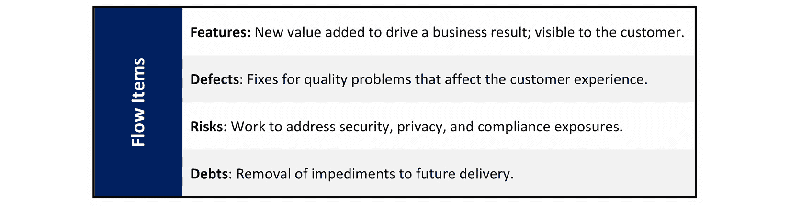
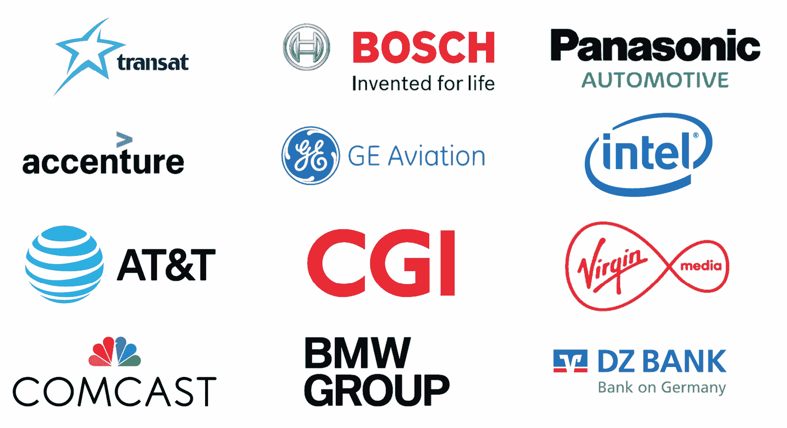

# 第十二章：介绍领先的 VSM 工具供应商

在上一章中，你学习了现代 VSM 工具的一些基本功能。你还了解了如何识别三种 VSM 工具分类。

我们还深入探讨了常见的 VSM 工具实施问题，VSM 工具在支持数字化业务转型中的作用及其关键优势。现在，我们将介绍行业公认具有 VSM 能力的领先软件工具供应商。

我没有重复其他行业分析师所写的内容，而是联系了领先的 VSM 工具、方法论和服务提供商，请他们告诉我们为什么他们的客户选择他们的产品。那些选择接受本书采访的供应商将在本章中列出。在采访中，我请他们的指定代表解释他们认为自己特别的优势所在以及原因。他们还有机会展示一到两个他们认为有助于展示其 VSM 工具和服务优势的客户案例。

在本章中，我们将涵盖以下主题：

+   让现代 VSM 工具具备正确的视角

+   提升价值交付

+   在 CI/CD 和 DevOps 之外使用 VSM

+   列出领先的 VSM 工具供应商

我们将从谨慎的提醒开始，踏上探讨领先 VSM 方法和工具的旅程。

# 让现代 VSM 工具具备正确的视角

从前面的章节中，你现在知道 VSM 背后的概念并不新颖，已经被应用于许多行业和无数的价值流。你也知道 VSM 起源于精益生产改进的学科。与传统的层级化和以职能为中心的过程改进观念不同，精益改进将组织活动结构化为协调的流程，以最佳方式向内部和外部客户交付价值。

由于 VSM 本质上是一种帮助组织调动资源进行精益改进的策略，我们在本书中花了一些时间学习精益。从这些培训中，你现在知道精益是一种规划和实施持续过程改进的系统。它的核心在于通过从客户的角度消除各种浪费，来发展高效的生产和信息流。提醒一下，常见的浪费类型包括**缺陷**、**库存**、**动作**、**过度加工**、**过度生产**、**运输**和**等待**。

# 提升价值交付

在*第四章**，定义价值流管理*中，你了解到 James Martin 阐述了 17 种常见的价值流。在他的著作《伟大的转型》中，Martin 写到了定义和改进**价值流动**在任何业务流程重设计中的重要性。

Martin 的概念建立在 Thomas Davenport 的论文 *Process Innovation: Reengineering Work through Information Technology* 的基础上。在这篇论文中，Davenport 将组织价值增值流程分为三类：

+   产品设计、开发和制造流程

+   面向客户的流程，包括营销和销售管理、订单管理和客户服务

+   管理和行政流程

重要的结论是，Martin 和 Davenport 都通过价值导向或价值交付改进的视角来评估流程重组和流程改进举措，并且 IT 是推动业务流程创新的重要推动力。此外，他们的写作解释了为什么组织不能通过建立保持现状的流程和系统来找到真正的业务流程改进，尤其是在等级制、官僚制度和职能领域中。换句话说，Martin 和 Davenport 主张利用 IT 重新设计业务流程，但要从增加价值的角度来进行。

根据你在本书中学到的内容，应该显而易见，VSM 作为一门学科，与软件工具几乎没有关系，甚至与改善你组织的 CI/CD 和 DevOps 流程也没有直接关系。VSM 的意义远比这些更大，更重要。

# 在 CI/CD 和 DevOps 之外使用 VSM

商业公司、政府机构和非营利组织的存在是为了在产品、服务或其他期望的结果和成果中创造价值。在我们现代的数字经济中，Martin 和 Davenport 的洞察比以往任何时候都更加重要。改进我们的 CI/CD 和 DevOps 流水线可以提高我们在所有组织价值流中交付价值的能力。

但当然，如果你的 IT 组织没有与支持组织其他价值流的需求同步，你的 CI/CD、DevOps 和 VSM 工具链投资就不会有什么成效。因此，必须理解，你的组织可以花费大量时间、金钱和精力购买 CI/CD、DevOps 和 VSM 工具，但仍然可能无法提高价值交付能力。

CI/CD、DevOps 和 VSM 工具链投资是潜在的 Kaizen Burst 活动的例子，用于推动其他关键价值流的改进。因此，这些投资并不便宜，并且成为支持组织核心业务使命和战略的投资决策。然而，CI/CD、DevOps 和 VSM 工具链投资是基础性的，因为它们支持任何其他 VSM 举措，必须从这个角度进行评估。

这一问题正是本书在讨论如何在 IT 功能之外实施 VSM 时，所花费大量篇幅的原因。然而，改善 IT 的主要驱动力是改善它所支持的其他面向开发和运营的价值流。换句话说，你的 IT 导向的 Kaizen Bursts 将受到其他价值流改进需求的推动。了解这一点后，我们来介绍当前 VSM 的工具和思想领袖。

# 列出领先的 VSM 工具供应商

本章向你介绍了各大行业分析师如 **Forrester Research**、**Gartner Inc**.、**GIGAOM**、**SD Times** 等所识别的领先 VSM 供应商。然而，我有意避免重复这些行业报告中关于具体产品的看法。

相反，本书的目标是识别出领导者，然后让每个 VSM 供应商如果愿意的话，讲述他们自己的故事。这些故事会出现在接下来的章节中。但在进入这些章节之前，我们需要首先了解谁是被认为的领导者。因此，*图 12.1* 显示了当前的 VSM 工具和方法供应商列表，按字母顺序排列：

图 12.1 – 领先的 VSM 方法和工具供应商列表

我已添加了三家 VSM 方法学公司，**Disciplined Agile**、**SAFe** 和 **价值流管理联盟**（**VSMC**），它们提供关于如何将 VSM 应用于扩展精益和敏捷实践的指导。不过，它们的产品描述会在下一章中介绍，*第十三章*，*介绍 VSM-DevOps 实践领袖*。

在阅读每个列出的 VSM 供应商信息时，请记住它们是如何从精益导向的角度支持 CI/CD 和 DevOps 管道的改进的。同时，回顾一下，成熟的 CI/CD 或 DevOps 管道的三个关键元素是*集成*、*自动化*和*编排*能力。

最后，回顾一下，VSM 是一种经过验证的、有效的、并且有条理的逐步方法，用于理解和应用精益思维的原则和实践。VSM 作为一门学科，已经实践了几十年，适用于所有组织的价值流，其根基来自于**丰田生产系统**（**TPS**）中采用的精益生产理念。

本节的其余部分介绍了行业当前领先的 VSM 工具供应商，概述它们的能力。需要注意的是，并非所有这些工具都声称其关注点是 VSM 支持。例如，一些 DevOps 和 CI/CD 工具供应商，如 **Atlassian**，在软件项目和产品管理中发挥着至关重要的作用。但我们需要探讨它们的产品如何在 VSM 项目中得到应用。

## Atlassian

**Atlassian**是一家澳大利亚团队协作软件工具公司。尽管 Forrester Research 将 Atlassian 包括在其*Forrester Wave™: Value Stream Management Solutions Scorecard (Q3 2020)*中，但 Atlassian 并没有明确的价值流管理策略。尽管如此，Forrester 对该公司的产品愿景、性能、合作伙伴生态系统和市场存在给予了高度评价。

当我向 Atlassian 询问他们在价值流管理方面的立场时，我得到了以下回答：

*"虽然我们没有专门销售 VSM 解决方案，但我们的产品决定性地用于跨越从概念到客户再到学习回路（学习循环）的开发和运营价值流程。我们信奉开放的方法，因此我们与几乎所有东西都集成，并且我们主张保持一定的中立，以便我们的客户可以设计他们最优的工作方式。"*

有了这些信息，让我们看看 Atlassian 如何适应 VSM 的格局。

两位大学同学，Mike Cannon-Brookes 和 Scott Farquhar，在 2002 年开发了可以说是排名第一的项目管理软件**Jira**。最初，Jira 是一个为软件开发人员设计的问题追踪平台。然而，现在的 Jira 软件帮助敏捷软件开发和支持团队*规划*、*跟踪*和*发布*他们的软件。

Jira 的能力不仅限于软件开发和 IT 运营活动的计划、跟踪和支持。组织还使用 Jira 来支持产品管理、营销和销售等其他价值流程的协作。其目标是支持跨团队协作，协调产品战略、演进、开发、支持和维持活动。

Atlassian 在其近 20 年的存在中规模和产品都有了增长，并且目前提供了 13 种产品，涵盖以下 4 个解决方案领域：

+   计划、跟踪和支持

+   协作

+   编码、构建和交付产品

+   安全和身份

Atlassian 的工具共同提供了企业规模的实时可见性，并帮助企业聚合团队级别的数据，以实时使整个组织的所有工作可见。

公司提到了价值流映射作为一种优化持续交付管道的分析技术在一篇名为*What is value stream mapping? at* [`www.atlassian.com/continuous-delivery/principles/value-stream-mapping`](https://www.atlassian.com/continuous-delivery/principles/value-stream-mapping)的文章中。但 Atlassian 并没有作为现成解决方案提供集成的价值流映射工具。

组织通常将 Jira 集成作为支持其 CI/CD 和 DevOps 工具链及 VSM 平台的协作解决方案。例如，一个常见的 Jira 集成是与 ServiceNow 的集成，支持跨 CI/CD 和 DevOps 管道及 ITSM 过程的双向协作，涵盖问题和项目管理。

**Atlassian 网站**：[`www.atlassian.com/`](https://www.atlassian.com/)

## CloudBees

**CloudBees** 是另一家 VSM 解决方案提供商，其根基在于连接 DevOps 工具链，自动化并改善软件交付过程。Forrester Research 将 CloudBees 排名为强劲表现者，而 GigaOm 则将 CloudBees 评为 *快速移动者*，进入其 VSM GigaOm 雷达的内圈。

CloudBees 通过提供核心功能（**持续集成（CI）、持续交付（CD）**、发布编排、分析和功能标志）将软件交付和 VSM 结合成一个平台。通过这样做，组织可以在开发生命周期中大幅提升可视性、一致性和协作——这是 VSM 的本质。将这些核心工具集中在一起，还能扩展审计准备性，因为团队和流程更容易被衡量和管理，同时消除了执行平面和控制平面需要独立产品的需求。

*图 12.2* 提供了 CloudBees 平台提供的核心功能的快速列表：

图 12.2 – CloudBees 平台功能

CloudBees 的平台支持公司所称的软件交付自动化和管理的五大支柱：

+   **连接的流程**：协调软件交付，高效地连接功能，以最大化价值和采用率，将创意带入市场。

+   **合规即代码**：在所有管道中集中执行政策、访问和标准，并确保仅使用经过批准的、不变的组件、自动化和环境。

+   **通用数据模型**：使数据从端到端可用，并以标准化的数据模型进行捕捉和存储，以促进协作、连接的流程和共享的洞察。

+   **通用洞察**：使整个组织中的所有职能都能从数据中理解和持续学习。

+   **持续的** **协作与改进**：允许围绕软件交付组织跨职能和团队进行协作，放大其价值创造和交付努力。

CloudBees 的客户基础深植于开源 Jenkins 开发社区；Jenkins 用于在 CI 和 CD 环境中构建、测试和部署软件。因此，他们的工具重点提高开发和部署过程的效率。

CloudBees 平台通过建模从代码提交到生产的软件交付管道来映射价值流。该管道模型包括到生产的路径、批准的组件、门控和阈值、测试协调、部署自动化、工具链集成（及数据）等内容，呈现为图形视图。内置分析包括可配置的仪表板，用于 DORA 指标，以及每个阶段的等待时间、执行时间和持续时间。AI/ML 组件根据开发者、代码库和 CI 影响生成每次发布的风险评分。

在他们的报告中，行业分析师表示，他们希望看到 CloudBees 发展其 VSM 能力，以支持通过更好的业务指标和仪表板与业务结果的改进关联。CloudBees 已经作出回应，开发了包括一系列流程指标和业务指标（如价值、成本、质量和幸福感）在内的更多指标。

总之，除了在 CI/CD、发布编排和功能标志能力方面的优势外，CloudBees 平台还提供了从创意到生产全程映射、管理和治理价值流的能力，并提供对集成第三方工具的卓越支持。

有关更多信息，请访问 CloudBees，并可以在[`www.cloudbees.com/`](https://www.cloudbees.com/)找到其提供的服务。

## ConnectALL

**ConnectALL**的根基在于为**应用生命周期管理**（**ALM**）工具（如 Sarena（现为 Micro Focus ALM））开发适配器和连接器，连接到其他用于开发、配置管理和项目管理的软件工具，包括 Perforce、ClearCase 和 Jira。此外，公司还不断发展其连接器，以支持与 IBM Rational、HEAT Software、Git 和 Rally 的集成。

ConnectALL LLC 于 2018 年正式成立，最初作为 Orasi 和 Go2Group 之间的合资企业。Lance Knight 和 Brett Taylor（现为董事会成员）于 2016 年 12 月开始讨论对价值流管理需要采取新方法的议题。Lance Knight 于 2017 年加入公司，担任总裁兼首席运营官，他与 Brett 一起开始战略性地定位 ConnectALL 以推动这一变革。同时，Tom Stiling（现为 ConnectALL 董事会主席）加入了这一努力。因此，三位合作伙伴于 2018 年开始将 ConnectALL 作为一个独立实体建立，专注于 VSM。

Andrew Fuqua，产品高级副总裁，于 2018 年加入公司，帮助推动公司的产品战略。此外，Eric Robertson，战略顾问高级副总裁，最近被聘请以引领公司在 VSM 行业的未来。该团队的合作和由此产生的产品获得了**Forrester** **Research**、**Gartner**和**SD Times**的好评。

ConnectALL 的战略目标是“*传递给软件的‘人性化’方面*”。因此，虽然 ConnectALL 的集成工具一流，但他们并不认为 VSM 仅限于提供集成工具和流程编排能力。相反，他们认为 VSM 工具的更大价值来自于以人为驱动的评估。这些评估帮助 ConnectALL 的客户发现提升*敏捷性*、*可追溯性*、*可预测性*和*速度*的领域。VSM 评估实际上实现了以人为导向的精益改进措施，如本书第 6 到第十章所讨论的那样。

ConnectALL 的 VSM 评估从客户进行 VSM 工具采购投资之前开始，并且评估将持续到工具购买之后。最重要的是，ConnectALL 的 VSM 愿景不仅仅局限于改善 CI/CD 和 DevOps 流水线流动，它还旨在将数字化计划对齐整个组织，以改善业务成果，并提升客户交付软件的速度。

ConnectALL 在 VSM 中的重点是帮助组织*看见*、*衡量*并*自动化*它们的价值流。它们通过连接工具来实现这一目标。虽然集成无疑是 ConnectALL VSM 解决方案功能的一个重要组成部分，但它们的更大愿景是将工具连接作为主要的价值主张。工具的连接使公司能够收集指标、绘制价值流、分析替代方案并编排优选的价值流。

ConnectALL 产品的一个关键差异化因素是其专利申请中的**通用适配器**。通用适配器使其平台能够与任何其他具有 REST API 的工具连接，从而使得在 CI/CD 和 DevOps 流水线中快速集成其他工具成为可能。

ConnectALL 在其价值流评估工作坊中使用其价值流可视化工具作为辅助工具。*图 12.4* 说明了 ConnectALL 价值流图的一个示例：

图 12.3 – ConnectALL 的价值流可视化工具

ConnectALL 的 VSM 平台提供四项关键功能：**集成**、**流程指标**、**工作流** **编排**和**治理**。该平台通过提供内置的供应商适配器，实现工作和信息流在整个价值流中的双向或单向同步，从而连接软件交付价值流中的工具。平台还提供开箱即用的工作流编排和治理功能。

ConnectALL 的**洞察分析**产品利用 ConnectALL 的适配器将支持价值流的不同工具中的原始数据提取到其标准化的数据模型中。此外，洞察分析的可视化功能使得诸如流动性、精益、DevOps 和 IT 性能等指标的数据变得可见、透明且易于获取。

您可能对这个着陆页感兴趣，其中包含一些案例研究：[`www.connectall.com/resources/case-studies/`](https://www.connectall.com/resources/case-studies/)。

**ConnectALL 的网站**：`www.connectall.com/`

## Digital.ai

**Digital.ai** 拥有一个独特的 VSM 平台，解决了大多数大型企业面临的一个常见问题：*通过“允许团队选择”并继续使用他们选择的工具来保持开发人员的满意度和生产力*。做到这一点需要为数百种不同的 DevOps 解决方案提供预构建的智能集成。

Digital.ai 发布了年度**DevOps 工具周期表**，其中包括实践者评级的 DevOps 应用程序，用以说明不同工具链的问题。其 2020 年版本的周期表涵盖了 17 个独特类别中的 400 多种产品。您可以在这里下载：[`digital.ai/periodic-table-of-devops-tools`](https://digital.ai/periodic-table-of-devops-tools)。

Digital.ai VSM 平台连接了整个软件交付生命周期，无论您选择的工具和供应商是什么。将 Digital.ai 面向开发者友好的平台与从零开始使用单一供应商的新技术相比，成本高昂的替代方案进行比较。

起初，这种方法有许多预期的好处，包括接触前沿技术和新的思维方式以及解决问题的方法，这也是为什么它通常是一个具有吸引力的初步考虑。但一旦理论与现实相碰撞，大多数企业发现，*撕掉并替换*工具增加了风险和复杂性，增加了停机时间和成本，且通常需要学习新工具和新流程。

更糟糕的是，围绕这些现有工具构建的数百个支持流程和自动化可能需要被更改。采用这种“重构”方法会消耗团队的精力和可用容量，使团队的焦点偏离数字化转型的目标。相反，组织必须实现数字化，以提高运营效率，成为一个能够快速创新的数字化企业。

Digital.ai 的统一 VSM 平台连接了您的业务和开发价值流。它提供了端到端的 DevOps 管道和其他支持工具和组织（如投资组合规划、客户支持、运营和销售等）的监管和治理，帮助改善业务成果。

虽然大多数价值流工具仅帮助改善软件开发和 DevOps 效率，*Digital.ai 的解决方案连接了敏捷规划与投资组合管理、持续测试、应用保护、软件开发生命周期管理、发布与部署协调，以及端到端的 AI 驱动智能*。其平台使大型复杂企业能够优化 CD 管道，以最大化价值交付和质量，而不是仅仅遵循固定的交付计划。

Digital.ai 认为 VSM 平台必须提供端到端的 DevOps 流水线监督和治理。它通过整合整个软件生命周期工具链的数据，应用业务分析和 AI/ML 技术，提供实时可见性，揭示业务和开发价值流的指标和 KPI，提供可操作的洞察（*图 12.5*）：

](img/B17087_Figure_12.4.jpg)

图 12.4 – Digital.ai：智能价值流平台

Digital.ai 是少数（如果不是唯一）理解应用 AI/ML 并连接业务与开发流指标和 KPI 需求的 VSM 平台解决方案提供商之一。通过提供统一的数据模型及评估客户价值流动所需的预构建指标和仪表板，他们的 VSM 平台帮助实现了这一目标。

作为这些功能的一个示例，Digital.ai 利用 AI/ML 技术洞察并跨组织孤岛汇总数据，形成信息的整体视图。然后，它提供跨销售、营销、财务、开发、运营和技术团队的可操作洞察。

Digital.ai 提供多个支持价值*流智能和变更风险管理*的解决方案，具体包括以下内容：

+   用于计划与创建、集成与测试、发布与部署、运营与监控生命周期阶段的分析视角，以及结合业务与技术数据的全生命周期视角全景镜头

+   使用 AI 和 ML 优化服务管理、变更风险预测、流动加速和质量改进

Digital.ai 的价值流*编排*解决方案包括以下内容：

+   敏捷规划和组合管理的敏捷性（以前是**Collabnet | VersionOne**）

+   发布与部署 DevOps 解决方案，用于发布和部署编排（以前是**XebiaLabs**）

+   持续测试（以前是**Experitest**）

+   应用保护（以前是**Arxan**）

Digital.ai 的解决方案的更多信息，请参见本书第二部分，*识别 VSM 方法论提供商*。

Digital.ai 价值流平台的基本元素如下：

+   **应用智能**：Digital.ai 平台自动且智能地指导软件交付编排，加速价值流动，并预测变更失败和计划风险。

+   **通用数据模型**（**CDM**）：Digital.ai 的 CDM 有助于聚合和协调数据，并应用人工智能（AI）和机器学习（ML）。Digital.ai 强大的 AI 平台功能分析跨所有价值流的数据，创建 360 度的业务成果和技术输出的数字视图。

+   **标准化视图**：CDM 支持一个智能层，提供客户数字世界的整体视图或镜头，适合技术高管和商业领导者的消费。

+   **全景 360°数字视图**：360 度视图使得从概念到现金的价值交付得以提升，将技术改进与组织的更广泛商业目标和战略对齐。

Digital.ai 价值流平台的主要亮点如下：

+   多租户、专为云端托管或本地部署而构建。

+   共享服务（例如，用户管理、单点登录、授权）促进用户、工具、方法论和团队的无缝协作与对齐。

+   CDM 和平台整合了来自各类工具和业务系统的数据。

+   分析视角提供了全景式的 360 度视图，使得业务和技术团队能够最终对齐并衡量技术投资对业务结果的影响。

+   智能软件生命周期编排应用 AI 和 ML，帮助可视化生产解决方案所需的所有工作，并识别延迟、瓶颈、交接和过多的在制工作。

+   内建的 AI/ML 能够识别潜在的变更失败并减少相关事件的**平均修复时间**（**MTTR**）。此外，它还可以回溯并调查跨越人员、流程和技术的技术变更问题的系统根本原因。

+   应用 AI/ML 模型，发现、预测并解决整个价值流中的问题，支持数据驱动的决策。

+   将开发成果与业务结果相连接，以理解技术投资对开发新功能和产品的影响。

Digital.ai 价值流平台提供跨团队、工具和流程的可视化。因此，组织能够有效地衡量价值和质量，如客户满意度和保持率、应用使用情况和安全性、执行效率、收入和增长。

除了支持所有主要的敏捷框架（**Scrum**、**Kanban**）和扩展框架（**SAFe**、**DA**、**LeSS**），Digital.ai 还提倡 VSM 方法论，优化*人员*、*流程*和*技术*，以持续改进从创意到客户交付的业务价值流。

在 Digital.ai 看来，衡量输出指标（如创建的功能数量、周期时间、开发速度和部署数量）只是 VSM 故事的一部分。

“我们还必须捕捉和衡量支持更好商业成果和用户体验的数据。因此，必须理解客户旅程中存在摩擦的地方，消除浪费和延误，增加客户的愉悦感。理解这一点可以帮助您的组织快速适应，并积极改善您的底线（成本、收入、客户生命周期价值、最终用户满意度等）。”

Mike O'Rourke，Digital.ai 副总裁兼首席研发官

Digital.ai 提供了一整套 *DevOps* 产品，帮助组织显著提高 IT 组织的精益产出，并将其与客户体验和业务成果连接起来。这种方法为潜在改进提供了前所未有的视角，能够推动业务成果的提升。

Digital.ai 为本书提供了两个案例。第一个使用案例来自一家大型美国保险公司，该公司使用 Digital.ai 的软件工具来支持其数字化转型活动：

图 12.5 – 第一个使用案例

以下是 Digital.ai 使用案例，突出了全球零售商使用 Digital.ai 软件产品提供跨不同工具的端到端可见性的经验，以及评估其价值流的效果：

图 12.6 – Digital.ai 使用案例

**Digital.ai** **官方网站**: [`digital.ai/`](https://digital.ai/)

## GitLab

**GitLab** 被多家行业分析机构（如 **Forrester Research** 和 **GigaOM**）认可为价值流管理（VSM）领域的领导者。GitLab 本质上是一个 DevOps 平台提供商。GitLab DevOps 平台通过单一应用程序集成了计划、开发、运营和安全团队。GitLab 还强调其平台能帮助“*团队将软件交付从几周缩短到几分钟，同时降低开发成本和安全风险。*”

借助其端到端的 DevOps 平台，GitLab 实现了整个软件交付生命周期的端到端可见性。但由于 GitLab 在一个应用程序中提供了所需的工具，软件开发团队避免了所谓的 **DevOps 工具链附加成本**，即当团队还必须支持 DevOps 工具链集成和自动化能力的开发与维护时产生的成本。

换句话说，DevOps 工具链的附加成本是开发团队必须支持两项同时进行的软件交付活动的额外成本。一项活动支持客户产品的开发——从我们客户的角度看，这是增值工作。另一项活动支持开发 DevOps 管道环境——这不是增值工作。

GitLab 的价值流分析是一个开箱即用的功能，帮助团队可视化并管理从构思到客户交付的整体 DevOps 流程周期时间。GitLab 的价值流分析提供了一个统一数据模型中常见工作流程和指标的报告。

尽管可定制，GitLab 的价值流分析提供了默认的阶段来表示 GitLab 流程，包括以下内容：

+   **问题** (*追踪器*): 安排问题的时间（按里程碑或通过将其添加到问题看板）

+   **计划** (*看板*): 首次提交的时间

+   **代码** (*IDE*): 创建合并请求的时间

+   **测试** (*CI*): GitLab CI/CD 测试代码所需的时间

+   **审查**（*合并请求/MR*）：用于代码审查的时间

+   **暂存**（*持续部署*）：合并和部署到生产之间的时间

GitLab 还为八种类型的问题提供了默认标签：**缺陷**、**已确认**、**严重**、**讨论**、**文档**、**增强**、**建议**和**支持**。此外，GitLab 推广了其单击钻取功能，可以深入到工作项的层面，使团队能够在发现问题时立即消除阻碍。GitLab 还提供了**范围标签**和**互斥标签**（例如 workflow::edit 和 workflow::design），可以用于建模自定义工作流，之后可以通过看板风格的板块或**洞察仪表盘**进行可视化：[`docs.gitlab.com/ee/user/project/insights/#insights`](https://docs.gitlab.com/ee/user/project/insights/#insights)。

从软件交付团队的角度来看，GitLab 提供了一个单一工具，消除了管理分散工具链所需的工具集成和自动化头痛，从而维持一个成熟的 DevOps 流水线。最重要的是，GitLab 的 DevOps/VSM 平台策略使开发人员能够有时间交付价值，并且意味着他们不必花时间解决与管理 DevOps 环境相关的技术债务问题。

GitLab 的 VSM 页面可以在 [`about.gitlab.com/solutions/value-stream-management/`](https://about.gitlab.com/solutions/value-stream-management/) 找到。

## HCL 软件

**HCL 软件**是**HCL 科技公司**的一个部门，开发并交付超过 50 款围绕 DevOps、数字化、物联网、云计算、自动化、网络安全和基础设施管理构建的创新软件产品。它是本次评审中最大的软体提供商之一，年收入超过 10 亿美元，拥有 4200 名员工，业务遍及 50 多个国家，并服务于超过 20,000 个企业客户。

**HCL 软件 DevOps**，如*图 12.5*所示，是该产品组合的关键支柱，提供一个完整且智能的企业软件价值流平台，涵盖从规划到生产、从大型主机到微服务：

图 12.7 – HCL 软件 DevOps

HCL 软件 DevOps 是一套最佳产品组合，产品之间松散耦合但高度集成，跨产品组合和 DevOps 工具生态系统。此外，一个开放的插件框架使企业客户能够快速将一个或多个解决方案连接到现有环境中。寻找全面 DevOps 解决方案的客户可以采用整个平台。*图 12.5*展示了这一产品集，其中包括以下内容：

+   **HCL Accelerate**：一个智能的**VSM 平台**，通过与 DevOps 环境中的许多工具集成，促进持续改进，能够可视化价值流动、捕捉可执行的洞察，并自动化发布过程。

+   **HCL OneTest**：一套集成的 **软件自动化测试** 工具，包括 UI、性能和 API 测试，贯穿整个项目生命周期。它提供一个无脚本、向导驱动的测试编写环境，支持 100 多种技术和协议。

+   **HCL AppScan**：一套全面的 **应用程序安全测试** 和管理解决方案，涵盖 SAST、DAST、IAST 和 SCA，适用于 Web、移动和桌面应用，能够直接与您的软件开发生命周期工具和流程集成。

+   **HCL Launch**：一个持续交付（CD）引擎，自动化应用程序部署、中间件配置和数据库变更，支持本地和云端的开发、测试和生产环境。

+   **HCL Compass**：HCL Compass 是一个强大的低代码 **DevOps 工作流引擎**，使企业能够快速建立定制的流程，用于敏捷管理、质量管理、IT 服务管理等。

+   **HCL VersionVault**：HCL VersionVault 是一个安全的企业级 **版本控制和配置管理** 解决方案。它提供对软资产的受控访问，包括代码、需求、设计文档、模型、原理图、测试计划和测试结果。

+   **HCL RTist**：HCL RTist 是一个基于 **Eclipse 的建模与开发环境**，用于创建复杂的事件驱动和实时应用程序。它专门为软件工程师设计，提供功能丰富的工具，帮助进行嵌入式实时系统和物联网应用的设计、分析、构建和部署。

    HCL 软件 DevOps 解决方案旨在帮助最复杂的组织，特别是那些需要减少风险、管理成本和推动收入的受监管行业。许多改进可以通过 DevOps *第一天* 解决方案来实现，这些解决方案主要聚焦于持续交付（CD）管道中的自动化。这些解决方案包括建立一个自动化的、受控的生产路径，通常通过 CI、CD、测试和安全工具来实现。使用 HCL 软件 DevOps 解决方案的这些做法的投资回报率（ROI）已经得到了充分的文献记录，总结为更好的质量、更快的市场响应、较低的成本和更高的员工士气。

随着 DevOps 进入第二个十年，HCL 发现其前瞻性客户通常专注于解决 DevOps *第二天* 的挑战，主要包括以下内容：

+   将 IT 价值与业务价值连接

+   适应组织文化和对齐

+   在整个企业范围内推广最佳实践

+   优化端到端价值流的流动

+   在多种工具和多年的技术平台之间进行管理

+   减少安全和质量暴露带来的风险

+   将安全、质量和治理转移到左侧

+   提高生产发布频率

通过 HCL Accelerate 统一价值流，企业能够应对这些*第二天*的挑战。软件交付可以作为核心企业能力来建立，使 IT 活动与商业成果对齐，从而在这个数字时代获得成功。组织能够主动并有效地利用 HCL 软件 DevOps 创建商业敏捷性、安全产品和具有韧性的运营，如 *图 12.6* 所示：

图 12.8 – HCL 软件 DevOps 智能价值流

除了产品功能，HCL 还通过提供高质量的服务和支持体验来帮助客户成功，这种体验在大型企业软件供应商中是罕见的。这种方法源于 HCL 在 IT 服务业务中的根基，并且从首次接触到试点再到企业级运营都能切实感受到。早期阶段，技术顾问将主办免费的价值流研讨会，以识别改进机会并定义实现业务目标的路径。接着，客户可以利用 HCL SoFy（[hclsofy.com](http://hclsofy.com)）云原生环境，启动 HCL 软件 DevOps 产品实例，进行实际演示和试用。最后，当客户推进实施时，HCL 将为客户指派专门的客户支持人员，以便定期协作，确保实现最大化的业务成果。这种方法使得 HCL 在行业中获得了最高的 **净推荐值**（**NPS**）（NPS 60+）和深厚的客户成功。

想了解更多关于 HCL 软件及其 VSM 平台的信息，请访问 [`www.hcltechsw.com/DevOps/`](https://www.hcltechsw.com/DevOps/)。

## Kovair

**Kovair 软件** 是一家硅谷的软件产品公司，提供支持全球产品开发和管理的集成软件工具。历史上，Kovair 以其 *Omnibus 集成平台* 享有盛誉——这是一种 **企业服务总线**（**ESB**）平台，通过现成的集成适配器和插件，集成了 110 多种第三方（最佳实践）软件工具和其他应用程序。此外，Kovair 的集成平台还支持 DevOps、**应用生命周期管理**（**ALM**）和 **项目投资组合管理**（**PPM**）的需求。

然而，Kovair 还推动其平台支持数字化转型，并安装 VSM 解决方案，提供跨组织业务的可视化。在这种背景下，Kovair 正在对公司的产品进行品牌重塑，包括 **Kovair VSMP**（**价值流管理平台**）、**Kovair VSDP**（**价值流交付平台**）、**Kovair PPM**（**项目和投资组合管理**）用于 DevSecOps，以及将 **Omnibus** 作为其 **集成平台即服务**（**iPaaS**）的集成平台。

Kovair 的 VSMP/VSDP 解决方案已经能够将组织的数据、流程和来自传统 ALM 的应用合并到云端，支持 DevSecOps。例如，Kovair 的项目组合管理和基于 iPaaS 的 Omnibus 支持 VSMP 框架。同时，Kovair 将其 ALM 和 DevOps 平台推广为 VSDP 解决方案。

Kovair 通过**工作流**和**政策引擎**自动化工具链，帮助建立一个自动化的治理和可视化系统，涵盖所有商业沟通和最佳的第三方解决方案，包括新的解决方案，如**智慧城市 5G 服务启用**和数字化转型。最后，Kovair 还可以帮助 IT 从成本中心转变为价值中心，集成和管理业务成果。

尽管目前未被 Forrester Research 或 GigaOM 认可，但 Kovair Software 在 Gartner 的*2020 年 DevOps 价值流管理平台市场指南*中获得了认可，SD Times 也在其文章 *价值流管理解决方案指南*（SD Times，2021 年 1 月 6 日）中报道了 Kovair 的 VSM 能力。

Kovair 的 VSMP 解决方案作为*捕捉收入机会的销售漏斗 CRM*，提供与业务成果相关的 KPI 仪表板，这一点非常独特。换句话说，Kovair 的度量跟踪所有组织价值流和产品的生命周期成本，而不仅仅是软件。同时，他们将其价值流指标与预期和实现的收入联系起来，而不仅仅是成本节省。

Kovair 还推广其 VSMP，声称在以下领域提供独特的能力：

+   **有针对性且系统化的减少浪费**：Kovair 提供统一视图，帮助高级管理层通过中层管理到达运营、行政、销售和物流团队。这一能力使得可以在交付的每个环节及早发现瓶颈并消除浪费。

+   **确保流程治理**：Kovair 提供任务驱动的工作流，涵盖宏观和微观层面，以确保交付中每个团队的治理。

+   **改善跨职能协作**：Kovair 使得工具、流程和团队能够在混合基础设施环境中进行协作。

+   **提升生产力**：Kovair 提供跨越时间、资源和成本三重约束的完整可视性，通过高效利用资源来提高生产力。

+   **提高流程效率**：Kovair 提供通过其屡获殊荣的 Omnibus 多云 iPaaS 解决方案与最佳应用无缝集成，确保安全和高效。

+   **持续的产品生命周期管理**：Kovair 提供完整的项目和组合管理能力。

+   **无缝的 iPaaS 集成**：Kovair 提供与最佳应用的第三方集成。

+   **并行的多模 IT**：Kovair 提供多种 IT 方法论，包括瀑布式、迭代式、V 模型和敏捷（Scrum 和 Kanban），全部基于以流程为驱动的平台。

Kovair 的软件产品提供基于任务的工作流实施和可视化功能，涵盖关键的软件开发活动及相关数据，帮助产品团队发现改进领域，以优化价值流动。

Kovair 不会强制执行或推广特定的 VSM 方法论。相反，Kovair 允许现有或新的项目管理流程和方法通过 Kovair 的工作流引擎进行构思和部署，同时提供流程自动化、治理以及项目和投资组合管理。

读者可以在**Kovair 软件官网**找到更多有关 Kovair 平台的信息：[`www.kovair.com/`](https://www.kovair.com/)。

## Micro Focus

**Micro Focus**是全球最大的企业软件提供商之一。其产品提供可信赖且经过验证的关键任务软件，保障数字世界的正常运行。通过务实、严谨、以客户为中心的方法，企业可以在当今快速变化的市场中成功运营和转型。Micro Focus 的产品组合涵盖了 IT 运维、网络安全、信息治理、大型机、大数据和应用交付等多个领域。

Micro Focus 需要通过 DevOps 进行公司转型，赋能客户实现数字化转型，并推动自身业务增长。为推动这一变化，Micro Focus 创建了一个软件工厂，将其战略规划与一整套工具、服务、数据和流程整合，使公司能够规划、构建、测试、发布、运营和管理交付给客户的软件。

公司的转型之旅始于对如何交付和启用端到端价值流的差距分析。他们将这些活动分类为四个初步组成部分：**计划**（战略到投资组合）、**构建**（需求到部署生命周期）、**请求到完成**（**R2F**）和**检测到修正生命周期**（**D2C**）。随着产品通过链条中的各个活动，它们在每一步都获得了价值。价值链框架帮助 Micro Focus 识别出那些对战略推进和目标达成尤其重要的活动。

Micro Focus 的应用交付解决方案是软件工厂的关键组成部分。它们使团队能够快速行动，同时具备一个中央可视化点和符合业务目标的治理层。通过开放框架，团队可以整合广泛的工具生态系统，优化工作流，减少管理复杂工具链的开销，并提供持续改进的洞察。

Micro Focus 的集成解决方案方法使价值流参与者能够可视化并上下文化产品价值流中的活动，并跟踪跨多个阶段的流动和价值。在这些解决方案中嵌入了跨多个来源摄取并智能分析数据的能力，帮助观察趋势、识别瓶颈、发现相关性和检测异常，从而促进持续改进。

该方法解决了企业组织面临的常见挑战，如未能优先处理高价值的客户需求、无法追踪产品价值流的流动、以及对过程摩擦和执行约束的理解不足。关键产品包括以下内容：

+   项目与组合管理作为业务的支柱，确立战略愿景和目标，并与史诗、功能、产品待办事项和用户故事对齐。

+   ALM Octane 作为中央神经系统，管理从规划到发布的工作、风险和质量。

+   PulseUno 提供一个统一的、受保护的基于 Git 的开发者平台，跟踪代码、构建、审查和工件捕获中的变更价值。

+   功能（UFT）、性能（LoadRunner）和应用安全（Fortify）等连续测试解决方案，将自动化测试纳入软件交付管道，在每次提交、每个步骤或关卡，直到生产过程中。

+   部署自动化无缝实现了部署管道自动化，减少了周期时间，并在所有环境中提供关于部署和发布的快速反馈。

Micro Focus 采用软件工厂视角来安装 DevOps 能力。有关此主题的更多背景信息，请点击此处：

+   **大规模 DevOps：如何构建你的软件工厂：** [`techbeacon.com/devops/devops-scale-how-build-your-software-factory`](https://techbeacon.com/devops/devops-scale-how-build-your-software-factory)

+   **创建软件工厂以发展 DevOps 并加速转型：** [`www.microfocus.com/en-us/digital-transformation/our-perspective/software-factory`](https://www.microfocus.com/en-us/digital-transformation/our-perspective/software-factory)

有关公司及其产品的更多信息，请访问**Micro Focus 官网**：[`www.microfocus.com/en-us/solutions/accelerate-application-delivery`](https://www.microfocus.com/en-us/solutions/accelerate-application-delivery)。

## Plandek

**Plandek** 提供一个完整的敏捷和交付度量**商业智能**（**BI**）平台，提供客户软件交付周期的端到端视图。虽然它不是一个完整的 VSM 平台解决方案，但 Gartner 在其新的*DevOps 价值流管理平台市场指南*中将其平台列为全球前 10 大供应商。

他们的愿景是将数据科学应用于软件交付过程，提供智能洞察力，以更好地交付软件产品。团队使用 Plandek 的*预测数据分析*能力，揭示隐藏的风险，提升端到端交付性能，并解决他们在软件交付过程中最棘手的问题，诸如以下问题：

+   我们是否达到了敏捷、DevOps 和业务转型的目标？

+   我们如何帮助我们的敏捷团队更快、更可预测地交付价值？

+   我们如何客观地比较我们的软件交付团队的表现？

+   我们如何缩短市场时间并提高交付速度？

+   我们与行业内其他公司相比，表现如何？

+   我们如何为团队提供他们需要的度量，以便作为持续改进的过程？

SD Times 声称 Plandek 具有独特的集成和数据挖掘能力，能够与多个价值流交付工具集（例如**Jira**、**Git**、**Jenkins**、**Azure** 和 **DevOps**）集成，获取管道度量。此外，Plandek 的数据挖掘能力提供了从端到端管道的交付度量，揭示了模式，以便其客户可以做出明智的决策，提升软件交付的效率、质量、速度和可预测性。

Plandek 还提供可自定义的仪表板，展示关键度量和 KPI，使产品交付团队能够执行以下操作：

+   授权团队更快、更可预测和更频繁地交付有价值的软件。

+   降低交付和信息安全风险，并在大规模上改善治理。

+   将价值流度量和分析置于 VSM 计划的核心。

Plandek 在以下领域获得了高度评价：

+   技术栈和流程无关

+   一个无需协调层的分析解决方案

+   企业规模和安全性

+   提供软件交付管道的完整端到端视图

+   支持团队协作、持续改进以及产品可见性和报告

Plandek 提供了两个案例研究，以展示其度量和分析平台作为 DevOps VSM 解决方案的有效性。

*图 12.7* 总结了 Plandek 提供的第一个案例研究：

](img/B17087_Figure_12.9.jpg)

图 12.9 – Plandek 客户案例 #1

而*图 12.9*总结了第二个 Plandek 客户案例的使用情况和结果：

](img/B17087_Figure_12.10.jpg)

图 12.10 – Plandek 客户案例 #2

Plandek 提供了强大的 BI 功能，支持从工具链中收集的数据，以支持端到端 CI/CD 和 DevOps 管道活动的决策制定。

**Plandek 的网站：** [`plandek.com/`](https://plandek.com/)

## Plutora

**Plutora** 提供一个高度评价的 VSM 平台，已被 **企业管理协会（EMA）**、**福雷斯特研究（Forrester Research）** 和 **GigaOM** 评为行业领导者。它们也是 **VSM 联盟** 的创始成员之一。

Plutora 推广其 VSM 平台作为一个完整的软件交付管理解决方案，旨在提高时间到价值。在这种背景下，Plutora 平台为软件交付管理支持提供以下能力：

+   **价值流管理**：无缝地将产品负责人、发布和开发经理、风险与合规团队、工程与部署团队汇聚在一起，以交付价值并支持在整个软件开发生命周期（SDLC）中持续的端到端改进。

+   **发布管理**：定义并安排分层发布，追踪依赖关系，管理审批，并保持合规性，同时加速整个企业组合中的变更。

+   **测试环境管理**：集中管理预订，解决冲突，追踪系统依赖。消除易出错的手动配置管理和变更控制过程。

+   **部署管理**：帮助简化跨团队的部署过程，以最小化风险并加速切换事件。管理跨多个团队的生产切换活动的规划、审批、协调和执行。利用分析能力简化审计并为实施后的评审提供信息。

+   **预测分析**：通过定制化仪表盘展示的端到端集成和标准化数据，用户可以在企业规模上，从构思到生产的整个软件交付过程中，拥有唯一的真实数据源。

需要特别注意的是，Plutora 将其 VSM 平台定位为一个软件开发数据平台，提供必要的基础设施，以整合、自动化和编排软件交付管道。最重要的是，其以数据为中心的 VSM 平台、强大的分析引擎和通用数据模型，提供实时访问关键数据的能力，以便做出决策。正如他们所说，"*这一切都体现在我们丰富的指标和仪表盘的分析和展示中，为组织提供了他们所需的洞察力，以便通过开发工作将最大的价值交付给客户。*"

Plutora 认识到，许多项目管理工具内嵌了有用的 VSM 数据和分析能力。然而，决策者面临的挑战是如何在多个价值流仪表盘中导航，并理解端到端管道流程。因此，Plutora 推动了建立一个专门的分析平台的必要性，该平台能够从多个平台提取数据。

### 监督你的软件交付过程

Plutora VSM 平台提供了一整套工具，用于监督整个软件交付中的人员、流程和工具。无论管理方法论、自动化支持，还是组织使用的第三方工具，Plutora 的 VSM 平台都能正常工作。其目的是帮助企业扩大敏捷和 DevOps 战略的应用。

*图 12.9*以图形方式展示了 Plutora VSM 平台中的三大工具类别，分别是*决策与分析、管理与协调，以及集成与通用数据模型*：

图 12.11– Plutora 的 VSM 平台

Plutora 的平台在最顶层实施了**决策与分析**层，该层捕获、管理并提供与您的 KPI 相关的 SDLC 数据访问权限。此层还提供对流水线度量和预测分析能力的访问，以支持数字业务中的软件交付。

Plutora 的开箱即用的度量和报告功能（包括监控**DORA 四个指标**）提供了关于流水线流动的准确且接近实时的信息。此外，Plutora 的仪表盘展示了度量标准，涵盖了对比发布规划过程与面向业务的结果和优先事项的表现。

Plutora 最近发布了一个扩展的数据驱动 VSM 平台，提供了增强的 VSM 流动度量标准。这些流动度量帮助组织监控和管理价值流动，持续衡量软件交付流水线中的效率，精确识别瓶颈。凭借其数据驱动平台和通用数据模型，Plutora 的客户可以管理任何流水线、开发方式或工具的度量标准，通过数据驱动决策实现更大的业务成果。

Plutora 的**管理与协调**层在中间层提供了 DevOps 流水线流动的控制、可见性和自动化。此层的一个重要且近期的改进是 Plutora 的*规划管理与价值交付*功能，这得益于与规划工具的更深层集成以及跨不同工具的通用数据模型。Plutora 的通用数据模型一直存在，但新版本通过规划管理集成进行了增强；此外，公司还在平台中增加了更多的扩展性，以反映其作为成熟数据平台的变化使用情况。

丰富的数据提供了完整的时间序列和产品生命周期及软件交付流的变更历史。产品领导者可以利用企业级分析和报告工具，实现对整个投资组合的完全可见性，并生成可以识别软件开发过程中趋势和模式的基于时间的分析数据。

Plutora 的 VSM 平台提供了在不同的 CI/CD 和 DevOps 工具链中协调工作的手段。发布和部署管理是显而易见的协调应用。然而，同样重要的需求是，在混合环境中协调管道工作。例如，可能需要集成本地的应用程序，这些应用程序需要与云环境中的其他应用程序一起持久化。

**集成和共同数据模型**层提供了连接组织的 CI/CD 和 DevOps 工具、敏捷规划工具、**项目投资组合管理**（**PPM**）工具以及生产和后生产工具的能力，消除了使用集成中介来编写点对点工具链集成的需求。相反，平台的连接器整合来自不同工具的数据，并提供标准化的数据模型，支持跨 IT 价值流的端到端分析。这种集成和分析覆盖整个价值流，从构思到现金，包括面向敏捷和 DevOps 的人员、流程和工具。

作为价值流改进和投资组合管理工具，团队可以建模其价值流，存储和管理指标数据，并在管道活动中单独引用这些指标，或将其汇总到投资组合视图中。产品团队可以实施控制措施，如自动化或手动审核门，来管理构建、发布和部署活动。提供标准数据模型和集成分析工具，有助于可视化瓶颈和等待区域，支持决策制定，并为规划和资源配置活动提供输入。

### 使软件开发与业务目标对齐

Plutora 将其 VSM 平台推广为帮助填补业务目标和软件开发之间空白的工具，从而减少时间到价值的周期。他们进一步将此视为五个步骤的活动：

1.  **管理您的远程软件工厂**，通过智能仪表板使工作可视化，并自动化治理以提高组织绩效。

1.  **创建单一事实来源**，通过将不同的数据源整合为一个共同且标准化的数据模型，提供软件开发生命周期活动的端到端和实时视图。

1.  **全面控制、可视化和自动化**测试、部署规划和发布管理活动，协调多个管道从构思到生产，提高生产力，消除浪费，并管理风险。

1.  **通过采用先进的 KPIs、指标和预测分析**，全面提升您的软件交付过程，从而赋能您的数字业务。这里的核心理念是，您无法持续改进那些没有持续衡量和分析的活动。同时，通过自动化治理和合规要求，利用标准门槛和审计历史来管理风险。

1.  通过识别瓶颈、消除浪费、提高效率并缩短时间价值来实现竞争优势。

### 改善软件交付过程

Plutora 确定了 VSM 在改善软件交付过程中的许多潜在应用：

图 12.12 – VSM 的潜在应用

作为 VSM 解决方案，Plutora 提供了一个强大的集成、自动化和编排平台。其目标是通过使用 Plutora 的 VSM 平台能力，通过识别瓶颈、消除浪费、提高效率并缩短时间价值，来获得竞争优势。

**Plutora 网站**: [`www.plutora.com/`](https://www.plutora.com/)

## Quali

**Quali** 是另一家软件公司，虽然没有明确解决全面的 VSM 平台需求，但在任何 CI/CD 或 DevOps 流水线中提供必要的组件。Quali 的 *CloudShell Colony* 是一款用于实现 **大规模基础设施自动化** 的 SaaS 平台。更精确地说，CloudShell Colony 提供自助服务自动化和治理能力，旨在简化应用开发、测试和生产发布。此外，它的软件支持在云技术上部署和治理复杂的软件应用，包括 AWS、Azure 和 Kubernetes。

Quali 出现在这份名单中，是因为它支持自动化治理政策，这是 Gartner 在定义 VSM 工具时列出的三大类别之一：**持续合规自动化**（**CCA**）工具。然而，它必须作为附加组件购买，以支持企业内更广泛的 VSM 平台需求。

Quali 推广的主要产品以支持 VSM 计划是 **CloudShell** **Colony**，该产品于 2021 年 6 月 22 日正式更名为 **Torque**。我们的主要优势来自于持续关注将 **应用中心化环境** 作为主要组织结构来实际、甚至轻松地加以利用。

Quali 的应用中心化环境结合了应用、基础设施和数据资源。综合来看，凭借其所有系统性依赖关系和复杂性，作为一个完整的逻辑单元，它为持续设计、交付、操作、优化和治理开发及 DevOps 价值流所需的云基础设施资源提供了更好的方式。

表面上看，这似乎不是一个大问题，因为你肯定可以使用任何数量的工具和方法来单独或以某种组合自动化这些单独资源的配置和部署。然而，不幸的是，大多数工具都是围绕执行个别动作设计的，留下更大的背景、系统逻辑和依赖关系往往需要手动、单独地定义，并且往往不一致。

Quali 的 Torque 采用了相反的方式，基于开发人员和 DevOps 产品团队需要开发和部署的由多个资源类型和配置组成的完整系统的预期。最终，IT 运维团队负责交付、运行和管理产品所有者优先级的价值。

之前的陈述并不意味着仅有完整的环境才能由 Torque 按需设计和交付；恰恰相反。定义单一的资源类型并不限制未来自动化按需组合不同资源类型的能力，即将它们拼接在一起以便按需协作。用户还可以在初始部署后更换云服务提供商，而不会影响以应用为中心的环境。

另一个核心优势来源于 Quali 的产品 Torque 所设计的假设组合：

+   管理云成本和政策合规性对于成为业务的良好管理者至关重要，并且是识别低效并推动优化工作的重要数据源。

+   获取准确、及时且有用的成本和政策合规性数据很难做到，而且如果不引入会影响流程速度的摩擦，这个任务会变得更加困难。

+   环境及其支持资源很少从生命周期的角度进行部署，更不用说从生命周期的角度管理它们。产品本身以及它们支持的产品和价值流有一个有用的生命周期，之后它们应该被重构或退役。

Torque 通过自动标记资源使用情况，包括成本、政策和角色信息，来帮助满足成本和治理需求，这些信息与技术属性一起，通过 Torque 的报告和仪表盘进行分析，或可供其他工具进行分析。

Torque 也是从产品生命周期的角度构建的。以应用为中心的环境有一个预期的生命周期，按照定义，这有助于推动产品（在此案例中是环境）改进，并通过自动化退役未使用的资源来减少云资源浪费。

Torque 的另一个关键能力是其与 DevOps 工具链的利用和集成，使开发人员、DevOps 产品团队和 IT 运维团队能够更轻松地利用其自动化和编排功能。在这种背景下，Torque 成为了客户工作流程中的自然组成部分。例如，环境可以基于代码提交（触发 CI/CD 流水线运行）通过命令行、API 调用或 GUI 进行请求和交付。

Quali 认为，这些能力的总和积极影响并提供了额外的洞察力，帮助优化交付时间、周期时间、产出、在制品、流程效率和工作特征。

目前，Quali 并未推广或采用特定的 VSM 方法论。也就是说，他们指出，在与客户的互动中，他们最常遇到的两种框架或价值流概念是 SAFe 和 Gartner 的 DevOps 价值流。

Quali 提供了一个来自 Resident 的相关客户案例研究（*图 12.10*），他们认为这个案例展示了他们的产品即使在表面上看似现代的数字化企业中也能产生积极的影响：

图 12.13 – Quali 客户案例

Quali 在 IT/CI/CD 或 DevOps 以外的改进倡议中的主要价值在于其通过自动化蓝绿部署来促进更快速、更具体的应用发布和更新实验。例如，市场营销部门希望在一定时间内尝试一组新消息，而业务运营则希望在进一步推出新版本之前提供新的支付处理选项。Quali 的 Torque 产品帮助简化并加快反馈循环。

你可以通过访问他们的网站 [`www.quali.com/`](https://www.quali.com/) 了解更多关于 Quali 及其产品的信息。

## ServiceNow

ServiceNow 提供了一个统一的平台，**Now Platform**®，它集成、自动化、编排软件交付流水线流程。ServiceNow 将其 Now Platform 推广为提供“*交付跨企业数字化工作流，连接人员、职能和系统，以加速创新、提高敏捷性并增强生产力*”的能力。

该平台包含一个统一的数据架构，支持端到端流水线可视化和分析。因此，ServiceNow 用户可以通过其数据模型追踪从客户到开发者的流水线活动流。

ServiceNow 认识到，组织需要交付业务价值，而 VSM 提供了最佳的方法来管理和改善跨企业的价值流动。因此，ServiceNow 在这种背景下采用了 VSM。

ServiceNow 的许多客户仍在从项目型管理过渡到产品导向型管理策略。因此，DevOps 平台必须在短期内支持这些过渡，作为混合软件开发和交付环境的一部分。

ServiceNow 提供了广泛的功能，超越了 VSM，凭借其行业内工具密集的平台，提供了全面的产品范围。从概念上讲，ServiceNow 将其产品推广为支持数字工作流，以优化任何业务的工作方式：

+   **IT 工作流** 用于优化 IT 服务运营，使投资与优先事项保持一致，并管理风险、安全和成本。

+   **员工工作流** 使员工能够在需要时更容易获得所需信息，通过支持基于价值的交付流打破壁垒，并提高生产力。

+   **客户工作流**通过定制的自助服务模型，创造无缝的客户体验并提高客户保持率，实现高效的服务交付。

+   **创建者工作流**帮助公民开发者和专业开发者通过低代码软件功能和连接的数字工作流，快速安全地构建跨企业应用程序。

ServiceNow 提供了软件行业中最全面的产品线之一，在其产品目录中列出了 47 款产品。然而，如果没有实施工作流功能，这些产品将仅作为点解决方案——与 VSM 一起作为实现精益导向改进的手段，广泛应用于整个企业。

### VSM 解决方案产品

ServiceNow 工作流战略的关键是使用信息技术支持价值流交付流程的实施、可视化和改进，无论组织结构如何。或者，从实施精益改进的角度看，ServiceNow 工具帮助组织集成、自动化并协调其价值流流程。这种方法是组织打破阻碍高效价值交付的组织壁垒的唯一途径。

VSM 是客户可以利用 ServiceNow 平台采用的一种方法。根据客户希望采纳的用例和方法论，Now 平台上运行的各个 ServiceNow 产品开始发挥作用。

Now 平台提供了基本功能，如集成技术、名为 Service Graph 的标准数据模型、先进的分析和报告、行动工作流、人工智能和机器学习。*图 12.11* 提供了一个示例，展示了 Service Graph 数据如何帮助组织可视化流水线执行过程中的交互和结果：

图 12.14 – 可视化流水线执行过程中的交互和结果

一个用例的示例可能是软件产品价值流，在该价值流中，Now 平台提供了对计划、构建、运营和服务生命周期的连接性和洞察力。软件产品价值流中的基本 ServiceNow 产品包括 IT 业务管理、DevOps 和 IT 服务管理。

### 关键差异化因素和优势

ServiceNow 的关键差异化因素是其所支持的工作流和连接性在广度和范围上的表现。例如，在软件价值流领域，许多供应商专注于代码提交到部署之间的交付环节，而 ServiceNow 的方法覆盖了从客户需求到产品使用的整个价值流。

Now 平台还通过相同的单一数据模型连接到组织内的其他管理领域。例如，包括员工（HR）和客户服务工作流。

1.  流水线集成平台：

    a. 抽象化和关联的数据模型（涵盖多种来源类型）。

    b. 集成中心作为中央平台工具，提供与广泛目标（包括并超越 DevOps 工具和平台）的一系列现成集成的 API 和工具包，同时允许合作伙伴和客户轻松添加他们使用 ServiceNow 工作流和数据模型的集成。

1.  指标和分析：

    a. 从创意到生产过程中发生的情况，尤其是如果你已经在 ServiceNow IT 运营管理（可用性和性能）和 IT 服务管理（管理与治理）中管理生产，使用一个连接的数据模型。例如，显示变更失败率（一个常用的加速指标）非常简单，因为 ServiceNow 运行的系统知道何时发生变更以及何时失败。

    b. 现成的洞察仪表板，来自所有数据源的规范化数据使得跨团队使用不同 DevOps 工具的报告变得更简便。

    c. 完整的 BI 平台，支持深度分析、实时指标、时间序列分析、易于定制和个性化的功能，提供低代码/无代码的指标创建方法。

1.  连接或策略支持其他组织价值流的改进：

    a. 可以处理任何可以导入到 ServiceNow 的数据，并与组织中许多其他业务系统和基础设施监控器连接。

1.  工具支持 Dev 与 Ops 之间的集成、协作和编排：

    a. 一个信息和管理层通过量身定制的仪表板支持协作，针对每个角色或职位提供流量指标和基于 Dora/Accelerate 推广的现成 DevOps 指标。

到目前为止，我们已经讨论了 Now 平台的众多工具和功能。但同样重要的是我们如何运用这些工具来支持组织的 VSM 计划。

### VSM 方法论

客户可以利用该平台和产品实施最符合其需求的方法论和用例。此外，ServiceNow 预计将聚焦于业务成果（包括捕获和管理财务数据、收集效率指标、识别改进领域）。

许多 ServiceNow 客户正在通过保持混合方式来实现从项目到产品的转变，这种方式在他们过渡期间发挥作用，意味着项目和程序管理职能可以在公司或程序层面运作，同时与规模化敏捷和基于团队的方法无缝协作。

### 支持超越 IT 组织的精益改进

ServiceNow 客户可以使用该平台从创意到生产，获取终端用户反馈，捕捉产品创意和需求，并通过 IT 业务管理为产品待办事项提供战略输入。他们还可以通过 ServiceNow DevOps 追踪交付过程，并通过 IT 服务管理或客户服务管理服务终端用户。

ServiceNow 应用程序中的可见性不仅限于流水线流动和其他精益改进指标的测量。例如，用户可以使用**DevOps Pipeline UI**视图显示每个应用程序的流水线阶段进展和详细信息，如图 12.15 所示：

图 12.15 – 设置用户创建的集成，用于额外的规划、编码和测试工具

这种端到端的工作流在单一平台上使用单一数据模型，为客户提供了对过程的卓越可见性，以及优化技术团队之外的价值链的机会。除了跟踪提供的价值之外，我们的平台还帮助捕捉价值流的成本，以便客户能够做出明智的投资决策。

### 客户使用案例

ServiceNow 提供了以下客户使用案例，作为他们平台应用实施端到端 DevOps 流水线解决方案的示例：

图 12.16 – 客户使用案例

DNB 使用案例的详细描述可在以下 URL 找到：[`www.servicenow.com/customers/dnb.html.`](https://www.servicenow.com/customers/dnb.html)

DNB 强调管理和利用其产品交付价值流以提升性能和效率并促进特定期望行为的重要性。因此，他们在以下条件存在时通过提供完全自动化的变更治理来鼓励开发者行为：

+   您实施了经批准的 CI/CD 流水线工具链，并且部署过程至少部分自动化。

+   您的流水线工具中需要的变更票据至少具有必填的最小数据集，以便自动批准。

+   您有一个设置好的流水线，分离用于生产、**用户验收测试** (**UAT**)、系统测试和开发的环境。

+   您总是在专用环境中运行不同的测试。

+   所有测试均顺利通过。

+   您必须找到允许您部署到生产环境的时间表。

+   您的服务上没有重大或显著的事件。

DNB 的使用案例强调了本书中讨论的一个关键点，即需要实施**基础设施即代码** (**IaC**)，以支持按需自动化测试和测试环境的供应。我们将在*第十五章*中重新讨论此主题，*定义适当的 DevOps 平台策略*，以及*第十六章*，*通过 VSM 和 DevOps 转变业务*。

读者可以通过访问他们的 DevOps 网站 [`www.servicenow.com/products/devops.html`](https://www.servicenow.com/products/devops.html) 了解更多关于 ServiceNow、Now 平台以及 VSM 方法的信息。

## Tasktop

**Tasktop**是另一家行业领先的 VSM 平台供应商，获得了行业分析师的高度评价，如**Forrester Research**和**GigaOM**。该公司的核心信息是*将企业转型为高性能的科技公司*。

此外，其首席执行官兼创始人，Mik Kersten 博士，撰写了亚马逊畅销书《从项目到产品》(*Project to Product*)，帮助软件行业理解为什么我们必须从传统的基于项目的管理理念转向基于产品的管理结构和战略。Kersten 博士的书还介绍了**Flow Framework®**，该框架提供了一个管理框架和基础设施模型，帮助弥合商业与技术之间的鸿沟。此外，它还提供了从项目导向转向产品导向的过渡指南。

Flow Framework 帮助组织通过可视化和衡量价值流，将技术投资与商业价值对齐，涵盖了将软件或 SaaS 推向市场的完整活动集。它还提供了一个共同的语言，帮助商业和技术相关方设定优先级并衡量结果。

Tasktop VSM 平台，实施了 Flow Framework，旨在提供语言、度量标准和模型，以在任何工具链和任何组织结构中实践 VSM。它有两个主要应用，分别是**Tasktop Viz™**和**Tasktop Hub**，如*图 12.13*所示：

图 12.17 – Tasktop VSM 平台

Tasktop 的 VSM 平台实现了三个关键功能，这些功能通常在内部不存在：

+   掌握大规模软件开发的蓝图

+   一个强大的数据捕获和存储层

+   一个可扩展和自适应的商业视角，基于原始的事实数据

虽然该平台提供了广泛且复杂的双向集成功能，但这些连接也为数据和分析提供了可见性。与 60 多个敏捷和 DevOps 工具的连接器提供了管道数据，供可视化、决策和根据用户定义的规则触发事件。

Flow Framework 建立在一个**集成模型**之上，提供了**构思**、**创建**、**发布**和**运营**生命周期任务之间的连接。基于集成模型的是一个**活动模型**，该模型提供了由组织的价值流产生的工件的可追溯性。最后，一个**产品模型**将价值流活动与以客户为中心的交付对齐。

基于精益（Lean）的基础，Flow Framework 旨在改善流程以促进商业成果。但与传统精益改进实践中的标准工作和信息流程不同，Flow Framework 评估了软件交付中的四种 Flow Items（*图 12.14*）及其相对分布：

图 12.18 – Flow Items

流量分布模型代表了在功能、缺陷、债务和风险流动中可能出现的调整。这些调整是根据产品生命周期阶段情况而定，旨在最大化业务价值。

流量分布在帮助企业（产品/业务线所有者）和技术专家在调整流动时评估因果关系方面至关重要。例如，优化功能的流速以捕获新市场机会可能会牺牲其他关键项目的工作，例如修复错误和减少技术债务。错误会导致客户的负面评价，影响未来的交付和销售，而不断积累的技术债务会使未来增强功能的交付变得越来越困难和昂贵。找到正确的平衡对产品的长期成功至关重要。

与任何精益倡议一样，Tasktop 的流量框架中的指标和业务结果至关重要，如*图 12.15*所示：

图 12.19 – 流量框架：流量指标和业务结果

Tasktop 认识到许多大型组织出于对可见性和成本效益的紧迫需求，围绕 2-3 个核心工作管理工具来整合其 DevOps 工具链。

不幸的是，这些是以执行为中心的工具，旨在支持采用 Scrum、Kanban 或 Squad 方法论的小型敏捷团队。当高级领导监督数百万或数千万美元预算的技术从业者时，面向团队的工具过于分立，无法支持有效的决策制定。

此外，这些工具的端到端管道支持能力有限，不支持 PPM、UX 设计、合规性、信息安全、测试及其他参与软件价值交付链的 IT 从业者。最终，这些针对特定目的构建的工具和记录系统的需求变得明显，导致越来越多的分立工具和管道数据。

在这种环境下，组织无法叠加和抽象化端到端的价值流数据，包括所有其组成但分立的工具领域。因此，他们的高管可能会基于部分信息做出错误的决策。

Tasktop 指出来自 Forrester 报告的数据，指出业务线高管做出了 65%的技术购买决策。因此，IT 必须更加专注于创造业务价值和投资回报率（Craig Galbraith, Forrester, 2020）。

Tasktop 强调其能够提供专注于业务的可视性，以支持数据驱动的 IT 投资，帮助技术和产品领导者实施适合软件时代的管理框架。

此外，Tasktop 的产品替代了传统的纸笔价值流映射练习，将 VSM 的实践带入数字经济。Tasktop 工具支持的端到端视图生成了一个实时、共享且可操作的视图，帮助加速软件产品组合中的价值创造。

Tasktop 推广以下由其客户体验到的好处：

+   将上市时间缩短平均 75%

+   可以识别如何花费下一个资金

+   可以查看实时的价值流图，并标出其中的瓶颈

+   可以将工作重心从项目转向透明且可衡量的产品价值流

Tasktop 的 VSM 平台提供跨单个产品和整个产品组合的可视化。决策者可以利用这些信息来确定优先级，并解决导致延迟和瓶颈的问题。此外，假设分析可以帮助可视化流改进的潜在效益和成本节约。Tasktop 在其网站上列出了许多客户参考资料，您可以在[`www.tasktop.com/customers.`](https://www.tasktop.com/customers.) 找到这些信息。Tasktop 的一些客户包括：

Figure 12.20 – Tasktop customers

更多信息请访问 **Tasktop 的网站**：[`www.tasktop.com/.`](https://www.tasktop.com/)

## Apptio/Targetprocess

**Targetprocess**，在 2021 年 2 月被 Apptio 收购，基本上是一个帮助采用和扩展所有形式敏捷的软硬件平台。具体来说，该平台提供了一个视觉平台，帮助 IT 组织在其企业内采纳和扩展敏捷方法。此外，它还是一个全面的工具链集成平台。

在这种背景下，Targetprocess 支持诸如 **Disciplined Agile**、**Large Scale Scrum**（**LeSS**）、**Nexus**、**SAFe**、**Scrum**、**XP** 或定制构建的混合型敏捷框架等规模化敏捷方法，以实现业务敏捷性并改善整个组织的价值流。此外，Targetprocess 还支持在程序、产品和团队层面实施敏捷实践。

Targetprocess 支持通过原生集成 CI/CD 和 DevOps 流水线工具（如**Jira**、**Azure DevOps**、**BitBucket**、**GitLab**、**GitHub**、**Jenkins** 和 **Phabricator**）实现持续的软件交付。Targetprocess 还通过与产品管理、ITSM、销售和营销等职能所使用的工具（如**MIRO**、**SalesForce**、**Zendesk** 和 **ServiceNow**）的集成，帮助对齐这些职能的活动和目标。

Forrester Research 在其 *Forrester Wave™: Value Stream Management Solutions Report*（2020 年第三季度）中将 Targetprocess 排为强劲表现者，并在 *Gartner* 2021 年和 *2020 年企业敏捷规划工具魔力象限*中被评为领导者。

Targetprocess 通过实施**目标与关键结果**（**OKRs**）、财务控制和集成的分析引擎，帮助对齐业务利益。OKRs 的支持帮助组织观察到业务目标与相关开发努力之间的脱节。将业务职能与开发连接的能力是 Targetprocess 的优势之一。

Targetprocess 支持在其标准化数据模型中进行人力资源管理，覆盖管道活动，使计划者能够考虑资源成本、时间表和分配。Targetprocess 还提供了广泛的现成度量标准，这些度量标准是可扩展、可定制的，并且可以通过其工具集成在工具链中使用。

**Targetprocess 网站**: [`www.apptio.com/products/targetprocess/`](https://www.apptio.com/products/targetprocess/)

## ZenHub

**ZenHub**是另一个不是 VSM 平台的工具，但它提供了项目管理和项目数据展示功能，类似于 Atlassian 的 Jira 软件产品。然而，ZenHub 的方法不同，它们的一套团队协作和项目管理工具直接扩展了 GitHub 基于云的版本控制功能。

ZenHub 的软件产品在 GitHub 源代码管理仓库之上提供了一层抽象，提供项目管理、规划、工作流自动化和报告功能。此外，ZenHub 工具利用 GitHub 中已有的数据，为软件开发管道中的活动提供可见性、报告和自动化功能。

ZenHub 方法的好处是，软件开发人员和其他利益相关者不需要在外部系统（如 Jira 或 Asana 的产品）中维护记录。相反，ZenHub 的产品基于 GitHub 的提交记录直接自动拉取信息。因此，尽管其他项目管理软件供应商将 GitHub 集成到他们的产品中，ZenHub 的方法是直接扩展 GitHub。

ZenHub 方法减少了在多个不同工具中手动重新输入数据的需求，这些工具本来需要管理源代码和文档，并规划和管理软件开发活动。ZenHub 用户不再需要在多个第三方应用之间切换，而是在 GitHub 的 UI 内切换标签，使用已经共享并可用的项目数据。

ZenHub 支持通过连接、汇总和分发跨越史诗、故事、特性、变更请求、错误列表和技术债务工作需求的工作项信息来进行冲刺规划和估算。此外，ZenHub 还支持 VSM 需求，提供可视化和报告功能，显示工作进度和管道效率，并通过累积流图帮助识别瓶颈。

在撰写本文时，ZenHub 提供了七种工具，如*图 12.17*所示：

图 12.21 – ZenHub 软件产品

ZenHub 产品非常适合那些已经决定使用 GitHub 进行分布式版本控制和**源代码管理**（**SCM**）的组织。

本节结束了对领先 VSM 供应商的介绍。当你继续自行探索这个话题时，你会发现还有其他一些有着坚实资质的 VSM 供应商没有出现在本书中。主要原因是某些供应商没有回复我的查询，或者决定不参与采访。

# 概要

本章简要介绍了 19 家行业领先的 VSM 工具供应商及其软件产品。这些供应商进入我们的列表，是因为一个或多个 IT 行业分析师，如 Forrester Research、Gartner、GigaOM 和 SD Times，已对其进行评审并指定其在 VSM 工具和平台类别中有相关的产品。我们的评审重点是每个供应商的应用程序和优势。你还阅读了几个用例，展示了这些产品如何被用于改进 CI/CD 或 DevOps 流程。

在下一章中，你将了解四个领先的 VSM 方法论提供商，**Disciplined Agile**（**DA**）、Scaled-Agile、**精益企业研究所**（**LEI**）和 LeanFITT™。每个提供商都提供了实施 VSM 实践的方法。

# 问题

1.  判断正误：VSM 完全是一种基于工具的方法，用于在你的 CI/CD 和 DevOps 流水线中实施改进。

1.  判断正误：VSM 是一种面向精益的价值流改进方法。

1.  快速提醒一下，精益生产中常见的浪费类型有哪些？

1.  两位最初贡献于在软件开发中应用精益概念和价值流的思想的贡献者是谁？

1.  Davenport 和 Martin 是从哪个角度或视角看待 IT 在价值流改进中的作用的？

1.  人工智能（AI）和机器学习（ML）在价值流管理（VSM）中的潜在应用是什么？

1.  在 CI/CD 或 DevOps 流水线中应用的三个关键能力是什么？

1.  从根本上讲，什么是 VSM？

1.  价值流管理（VSM）的根源是什么？

1.  难题：DORA 四个指标是 VSM 中唯一有用的指标吗？

# 推荐阅读

1.  Martin, James. (1995) *伟大的转型。使用企业工程的七大纪律来协调人、技术与战略。Amacon*。纽约，纽约

1.  Davenport, Thomas. (1992). *过程创新：通过信息技术重新设计工作。安永 – 信息技术与战略中心。哈佛商学院出版社，马萨诸塞州波士顿。* [`www.researchgate.net/publication/216300521_Process_Innovation_Reengineering_Work_through_Information_Technology`](https://www.researchgate.net/publication/216300521_Process_Innovation_Reengineering_Work_through_Information_Technology)

1.  Kersten, Mik. (2020 年 7 月 15 日) *价值流管理（VSM）的崛起。Tasktop 创始人兼首席执行官。* 最初发表于 2020 年 7 月 15 日的 Tasktop 博客，也发布在 LinkedIn 上。[`www.linkedin.com/pulse/rise-value-stream-management-vsm-mik-kersten/`](https://www.linkedin.com/pulse/rise-value-stream-management-vsm-mik-kersten/)
