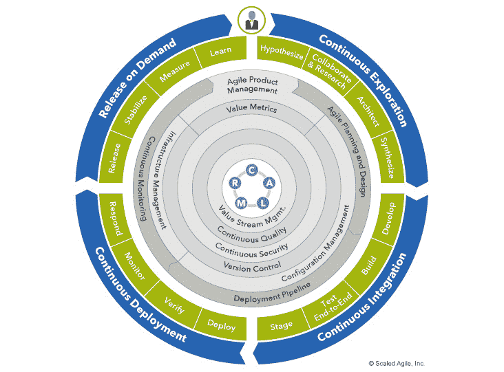

# 第十三章：介绍 VSM-DevOps 实践领导者

在本章中，你将了解当前领先的价值流管理（VSM）实践领导者。我们将从 VSM 联盟的介绍开始，VSM 联盟是一个非营利性贸易协会，由成员（供应商和企业）资助，向所有人开放，旨在通过研究、学习、网络交流和开源项目，支持价值流管理市场的崛起。

接下来，你将了解项目管理协会（PMI）通过其 DA-FLEX 服务实施 VSM 战略和方法的方式。PMI 收购了**纪律化敏捷**（**DA**）和**企业转型流（FLEX**），这两者在各自领域中都是成熟且公认的领导者，旨在建立其精益敏捷实践、培训和认证项目。DA 为 PMI 提供了软件开发中的敏捷实践。相对而言，互为补充的是，你将了解 FLEX 作为一个基于系统思维的框架，提供一套全面的组合管理、敏捷产品管理、执行/管理层、项目和团队成功模式，基于精益敏捷原则和实践。

接下来，我们将了解 Scaled Agile 的价值流管理方法，作为其**Scaled Agile Framework**™（**SAFe**™）的一部分。具体来说，Scaled Agile 将价值流管理作为其 SAFe DevOps 课程和培训的一部分。

在本章中，我们将讨论以下主题：

+   VSM 联盟

+   PMI 的 DA FLEX

+   **Scaled Agile Framework**（**SAFe**）

到本章结束时，你将掌握三大领先的数字 VSM 实践领导者实施有效的价值流管理实践的方法的基础知识。

# VSM 联盟

**价值流管理联盟**（**VSMC**）是一个新成立的组织，成立于 2021 年 3 月 3 日，旨在通过采用和推动价值流管理工具和实践，帮助全球组织交付客户价值。VSMC 的目标是通过领导力和社区支持，推动价值流管理标准和创新，为整个 VSM 社区服务。

## 定义 VSMC 的目标、使命和宗旨

*VSMC 的目标是推动以价值流为中心的工作方式，在技术团队中领导更高绩效的组织。VSMC 作为一个非营利性贸易协会运作，其使命是培养并推动数字价值流管理的新兴市场，帮助社区学习、制定实践和标准，并通过其应用促进发展。*

VSM 联盟对所有有兴趣将价值流管理作为业务转型和客户价值交付改进策略的个人和组织开放。VSMC 的资金主要通过会员费用筹集，但计划还将包括转售与 VSM 相关的学习产品。

从结构上看，VSMC 将精益实践和价值流作为其运营模式，其资金支持 VSMC 的*研究*、*学习*和*外展*价值流。

尽管由几家领先的 VSM 工具提供商成立，但其目标是让 VSMC 成员推动未来 VSM 方法和工具的增强方向。VSMC 成员还将在建立 VSM 实践知识库方面发挥关键作用。

## 通过协作建设 VSM 行业

VSMC 由五家技术领导者**Digital.ai**、**HCL Software**、**Plutora**、**ServiceNow**和**Tasktop**成立。其创始人为 VSMC 制定的章程是*通过采纳价值流管理（VSM）帮助全球组织提升绩效并改善客户价值交付*。

尽管在开放市场上是竞争对手，但这些创始公司认识到，要使 VSM 行业实现真正和可持续的增长，需要全球和行业范围的协作研究，以指导通过早期采用阶段开发的 VSM 工具、平台和服务。没有任何一家公司可以单独承担这项工作的范围。此外，研究必须是公正的，且不偏向任何供应商。

创始人从一开始就认识到将合作关系扩展到全球的组织和个人实践者的重要性。因此，创始人将 VSMC 建立为一个会员协会，面向与价值流管理实践和平台相关的企业和个人，以实现这一目标。

VSMC 主席 Helen Beal 提出了以下价值主张，以建立 VSMC 作为一个技术专家和实践者的专业社区：

“通过创建这个社区，我们将增加并加速 VSM 的使用，同时发展并灌输最佳实践和标准。最终，正如 VSM 本身的实践一样，我们将帮助行业从业者提供最大的价值。”

## 通过软件交付客户价值

VSMC 仍处于初创阶段，但旨在成为推动 VSM 实践、创新和采纳的首要专业组织。VSMC 的目的是帮助软件行业交付 VSM 产品和服务，帮助组织实现数字经济中具有价值的业务转型。

VSM 通过一个全面的软件生命周期编排过程实现这一目标，该过程为价值流经理、发布经理、DevOps 经理、产品经理和领导提供改进软件交付流水线所需的数据、可见性和分析工具。

## 引领 VSM 行业

VSMC 将作为一个关于价值流管理实践和采纳的中央信息和教育中心。持续的研究将帮助组织了解如何衡量价值，并因此成为更高效的组织。此外，培训和认证项目将支持全球会员的协作，帮助将 VSM 作为行业标准工作方式。

VSMC 与领先的分析师合作，运用科学可靠的原则进行信息收集和分析活动。目标是发现能够为采用价值流管理原则以提高价值交付绩效的团队和组织提供坚实指导的洞见。

## 正在进行中的产品

联盟的初步研究成果将是*价值流管理现状报告*，该报告将衡量团队如何应用价值流管理原则、实践和度量标准，进而影响其价值流管理的成果。VSMC 董事会已启动首份调查，初步结果将于 2021 年 6 月公布。

2021 年晚些时候，VSMC 将调查价值流映射的原则和实践，并与其会员社区合作，解决他们的具体需求和优先事项。第一门 VSMC 在线课程是*价值流管理基础*课程，计划于 2021 年 8 月发布。

尽管 VSMC 还处于初期阶段，*价值流管理现状报告*本身将成为帮助全球组织了解其他组织如何从 VSM 方法、工具和服务中受益，并根据情境提供最佳实践指导的有力工具。价值流管理基础课程将帮助实践者建立必要的技能，以帮助他们的组织有效地采用 VSM。随着实践的演进，VSMC 将制定新的指导意见，告知其会员。

## 来自初步 VSMC 报告的发现

截至本书写作之时，第一份 VSMC 报告尚未发布。然而，我已经看过初稿，摘要中的发现非常有趣。VSMC 主席海伦·比尔（Helen Beal）非常慷慨，允许我在本书中分享这些摘要发现。

*"尽管在采纳 VSM 方面仍然存在重大挑战，但以下三个关键实践是更广泛采纳的证据：*

+   *组织正在识别价值流并围绕它们进行组织：*

    *随着组织需要不断创新，理解关键价值流、获取对其的可见性，并围绕它们进行组织以改善价值交付是至关重要的。*

+   *以产品为导向的团队比以项目为导向的团队更受欢迎：*

    *产品聚焦使团队更加紧密地与生产者-消费者关系绑定。价值是通过产品的消费者使用情况来确定的，而不是由项目或程序定义的抽象输出。*

+   *人们有专门聚焦于价值流中心化工作方式的角色：*

    *通过定义基于价值流的组织角色，个人了解自己的职责范围。拥有专门定义的角色，负责采纳并思考如何改变价值管理的方式，这是采纳这一概念的重要一步。"*

    完整披露

    VSMC 董事会于 2021 年 4 月选举我担任顾问角色，帮助他们在以下三个领域：

    – 关于价值流角色和学习路径的指导

    – 将 VSM 与其他数字交付框架连接

    – 通过企业和咨询社区进行网络交流

这些初步发现令人兴奋，我期待帮助 VSMC 实现其学习目标，并参与这一探索之旅。

# PMI 的 DA FLEX

**项目管理协会**（**PMI**）最著名的是其围绕传统项目管理实践的培训和认证项目。然而，PMI 于 2019 年收购了两家公司，**规范化敏捷**（**DA**）和 Net Objectives，以为其成员建立一个专业的培训和认证路径，帮助他们学习并应用**精益敏捷**实践。DA 专注于在软件开发中实施精益和敏捷实践。与此同时，Net Objectives 开发了**企业转型流程**（**FLEX**），这是一个基于系统思维的框架，提供了一个全面的产品组合、敏捷产品管理、高管/管理、项目和团队成功模式，基于精益敏捷原则和实践。

与其从零开始构建这些方法论，PMI 明智地选择了收购成熟的公司和方法论，以加速其精益敏捷认证项目和产品的开发。PMI 面前的工作是将这两种实践整合为无缝的产品。PMI 将其结合的精益敏捷方法称为*DA*，其企业级产品为基于 FLEX 的 DA 价值流顾问。

PMI 提供了*五个*培训和认证项目来支持其 DA FLEX 收购，具体如下：

+   **规范化敏捷 Scrum 大师**（**DASM**）**认证**

+   **PMI 敏捷认证从业者**（**PMI-ACP**）® **认证**

+   **规范化敏捷高级 Scrum 大师**（**DASSM**）**认证**

+   **规范化敏捷价值流顾问**（**DAVSC**）**认证**

+   **规范化敏捷教练**（**DAC**）**认证**

DASM 操作于单一和小型团队层面，而 DASSM 则指导如何让多个团队协作。此外，PMI 很快将发布一个多团队教练认证。最后，**规范化敏捷价值流顾问**（**DAVSC**）是 DA FLEX 在企业级的实施。

尽管许多 DA FLEX 认证对于学习基于敏捷的角色和实践有帮助，但与 DevOps 和 VSM 的主题无关。因此，本节大部分信息集中在 DAVSC 培训和认证项目上。DAVSC 结合了精益、流动、约束理论和组织发展理论与实践，作为 PMI 在价值流管理中方法论的基础性学习内容。

DAVSC 与 FLEX 之间的关系如下：

+   DAVSC 基于对那些尝试提高组织创造价值能力的人员的工作任务分析。

+   支持这一点的系统是 FLEX。

+   DAVSC 研讨会教授这些职责以及如何实现它们。

现在你已经了解了 DA FLEX 中精益敏捷（Lean-Agile）内容的范围，我们可以开始深入探讨 DA 工具包，看看框架是如何构建的，以及它是如何支持精益敏捷实践的。让我们从对 Disciplined Agile 核心理念的介绍开始，*选择你自己的工作方式（WoW）！*

## 将精益敏捷实践与支持你的工作方式相适应

PMI 并不将 DA FLEX 作为一个框架来推广。相反，PMI 将 DA FLEX 推广为一个工具包，包含了能够协同工作的实践。框架和工具包之间的区别很微妙，接下来我们花几分钟了解一下它们的不同之处。

从定义上看，**框架**提供了支持一个系统的基本结构，例如软件开发和交付。在概念层面上，软件开发框架提供了一种结构化的方法来应用精益和敏捷实践。例如，SAFe™和基于 Scrum 的扩展框架提供了一整套组织结构、事件和流程，以实施它们的精益敏捷实践。它们在实施精益和敏捷实践时采取的是非常规定化的方式，通过小团队角色、结构、事件和时间框架的开发周期来实施。Scrum 和 SAFe 的实践者在他们的框架内应用各种流程、技术和方法。然而，基本的结构和事件依然保持不变。

相比之下，DA FLEX 不同意“单一的精益敏捷实践实施方法适用于所有组织”的观点。相反，DA FLEX 提倡组织必须审视不同的策略和工具，评估哪些最适合其需求和文化。因此，PMI 将 DA FLEX 作为一个工具包来推广。基本思想是，价值流团队根据实际工作需要选择合适的工具。同时，作为一个工具包，PMI 将其 DA FLEX 工具包作为独立的精益敏捷方法，旨在改善价值流并将这一理念扩展到其他框架。

从哲学角度来看，DA FLEX 融合了基于价值流的连续流、精益改进、约束理论、组织发展和人类行为等概念。关键问题在于，围绕业务职能构建的层级化组织结构，与支持基于价值交付的精益流动是对立的。

在讨论 DA FLEX 如何支持价值流管理之前，我们需要花一些时间分别回顾一下每个方法：**规范化敏捷**和**FLEX**，以理解它们对现代精益敏捷实践的贡献。

### 选择 DA 的工作方式

DA 是由 Scott Ambler 和 Mark Lines 于 2012 年共同创建的一个过程决策工具包，帮助个人、团队和企业在特定情境下优化其**工作方式**（**WoW**）。Scott Ambler 和 Mark Lines 在软件开发领域非常有名，因为没有一种单一的软件开发策略能够在所有客户场景中取得良好效果。因此，DA 工具包的用户可以在六种不同的软件开发生命周期方法之间做选择，并根据情境指导选择数百种方法和工具及其潜在应用。

**DA 工具包**融入了**过程刀片**的概念，帮助团队和组织根据其独特的软件开发需求选择适合的过程刀片。进而，过程刀片引导用户如何应用所选技巧，提升关键的组织能力。

每个过程刀片提供了其哲学基础或**思维方式**，应用技巧的**人员**角色和职责，简化的业务流程描述作为改进业务敏捷性的**流动**，以及为应对情境需求而提供的**选择**。整体而言，*思维方式*、*人员*、*流动*和*选择*代表了 DA 工具包的四个视角。

除了四个视角，DA 工具包还提供了四个过程刀片级别，涵盖了**基础**、**规范化 DevOps**、**价值流**和**DA 企业**。如*图 13.1*所示，DA 工具包目前为 24 个定义明确的过程刀片提供了基于情境的指导：

图 13.1 – DA 工具包

如你在*图 13.1*中看到的，DA 工具包包括四个层次：基础层、规范化 DevOps、价值流和规范化敏捷企业。我们将在接下来的子节中更详细地探讨这四个层次。

#### 在企业规模上实施精益敏捷实践

**基础**层是 DA 工具包的核心，指导着形成 DA 思维方式的基本原则和概念。该层还介绍了敏捷、精益和传统（串行）软件开发方法、角色和团队结构之间的基本概念和区别，以及选择 WoW（工作方式）背后的理念。

**严谨 DevOps**层提供了用于简化软件开发和 IT 运维活动的指导和技术。一个重要的区分点是 DA 的系统思维方法，帮助可视化和理解 DevOps 工作流背后的复杂性，如*图 13.2*所示：

图 13.2 – 严谨 DevOps 的工作流

如*图 13.2*所示的系统导向图，比价值流图或工作流图更为复杂。但你可以运用在*第三章*《分析复杂系统交互》中获得的知识，逐步理解该图。

**价值流**层结合了从 FLEX 获得的精益敏捷原则，你将在下一部分学习到。目前，理解 FLEX 是一种以精益为导向的方法，旨在提高价值实现。此层中的流程刀片提供了一个视觉地图和指南，以帮助在组织的互联价值流中进行基于价值的改进。

**严谨敏捷企业**（**DAE**）层提供了支持构建和维持精益敏捷企业的业务管理指导。DAE 的流程刀片帮助组织发展感知和快速响应市场变化的能力。

注意

想了解更多关于严谨敏捷的读者，可以阅读我之前的书籍，《在现代企业中扩展 Scrum》。

现在你已经对严谨敏捷有了基本的了解，接下来我们来理解 FLEX 如何通过生命周期方法，在 DA 工具包中实现精益导向的价值交付改进。

在我们讨论 FLEX 作为价值流管理工具的应用之前，我们首先需要了解 DA 工具包中的 DevOps 层。

#### 使用 DA FLEX 实施 DevOps

DA 工具包为 DevOps 专门设立了一个完整的流程刀片层。DevOps 流程刀片包括以下内容：

+   **严谨敏捷交付**（**DAD**）：一种以人为本、学习导向的混合敏捷 IT 解决方案交付方法

+   **安全性**：描述保护组织免受信息、网络、虚拟和物理威胁的各种方法

+   **数据管理**：提倡一种务实、精简的方式，将数据视为关键资产，必须支持组织中的其他流程

+   **发布管理**：包括规划、协调和验证 IT 解决方案的部署到生产环境

+   **支持**：基于结果的技术，用于实施帮助台或最终用户支持，帮助客户使用你的交付团队所提供的解决方案

+   **IT 运维**：基于结果的技术，用于管理和治理你的 IT 生态系统

Scott Ambler 和 Mark Lines 适当地得出结论，DevOps 现在是允许一个组织在数字经济中有效竞争的最低门槛。简化组织的 CI/CD 和 DevOps 管道流程所带来的竞争优势是无法通过传统的，甚至是基于敏捷的软件交付方法复制的。

PMI 对 DevOps 的贡献不在于工具链集成、自动化或编排能力。相反，它的 DA 工具包提供了关于实施和维护端到端 DevOps 基础设施和管道流的全面指导。

由于本书的这一部分主要聚焦于价值流管理，接下来我们将看看 DA FLEX 如何通过 DA 工具包中的价值流层，帮助组织完成以精益为导向的业务转型和改进。

### 使用 FLEX 实现业务敏捷

FLEX 为 PMI 提供了一种基于精益思维和系统思维模式的行业领先的业务敏捷实现方法。FLEX 的开发者 Al Shalloway 定义了组织的业务敏捷性为*快速、可预测、可持续并高质量的价值实现*。

通过 FLEX，组织使用精益原则来发现系统层面上哪些地方不起作用以及原因。但同样重要的是要注意，*FLEX 是 PMI 用于实施价值流的全新方法，旨在利用价值流管理技术改进价值交付*。

企业转型是 FLEX 的一个关键目标，它构成了**FLEX**（**企业转型流**）缩写的基础。换句话说，FLEX 通过有效实施价值流来推动企业转型。

DA FLEX 将组织的战略与价值交付层面活动的执行相连接。DA FLEX 方法帮助组织简化其复杂的业务系统，以暴露出更有效的价值流，从而使你能够在整个业务系统的背景下做出改进组织各个部分的决策。

虽然企业需要创新以提高竞争力，但它们也需要改善价值交付。在这种背景下，DA 工具包中的价值流层中的过程刀片建立了支持组织产品和服务的端到端价值实现活动。

就像我在早期职业生涯中一样，Al Shalloway 也深受 Eliyahu M. Goldratt 的《目标：持续改进的过程》一书的影响，该书向我们介绍了*约束理论*（Goldratt，1984，2014）。尽管像 VSM 这样的精益改进计划强调识别瓶颈作为引入延迟的关键点，Goldratt 的研究则帮助我们更深入地评估导致生产延迟的约束因素。

例如，我们可能有一个较慢的流程，或者多个工作项通过我们的流程管道流动。我们可能面临系统设计无法承载过多工作量，或者缺乏足够的可视化以便在问题发生时及时察觉。或者，我们可能有过于繁琐的流程和审批，限制了流程流动。

FLEX 方法帮助价值流团队识别瓶颈、导致瓶颈的浪费，并评估消除或减少这些浪费、改善工作流的方法。FLEX 方法是一种 VSM 方法论，包含以下步骤：

1.  定义基于价值的工作流和组织结构。

1.  识别实现期望流动和结构的障碍。

1.  确定消除障碍的潜在解决方案。

1.  应用系统思维和精益思维来定义在组织文化中工作的改进优先级。

1.  按照优先级实施建议的解决方案，并根据预定目标和指标评估其效果。

1.  持续分析、重新规划并重复 FLEX 过程。

在阅读这一部分时，重要的是要注意，FLEX 明确设计为支持以知识为导向的工作。此外，Al 对于价值流管理角色的当前思考，涵盖了一个全面的组织视角，这一视角来源于他多年精益敏捷咨询经验所获得的洞察。以下部分将详细介绍这些洞察。

#### 在 DA FLEX 中定义价值流

DA FLEX 以与其他精益学科一致的方式定义了价值流，正如在维基百科中所描述的那样：[`en.wikipedia.org/wiki?curid=55610257`](https://en.wikipedia.org/wiki?curid=55610257)。

价值流

一系列从最初请求到客户价值实现的过程中添加价值的行动。价值流始于初步概念，通过不同的开发阶段，最终到达交付和支持阶段。

正如你在*第七章*《绘制当前状态（VSM 步骤 4）》和*第九章*《绘制未来状态（VSM 步骤 6）》中所学到的那样，DA FLEX 指出，价值流总是以客户为起点并以客户为终点。他们还区分了价值流中的工作与执行这些工作的人员。他们的关注点是，将二者混淆会对组织造成不利影响，因为价值流有着单一的关注点，而人员可能支持多个价值流的工作。

另一个关键点是，组织必须从关注人员的利用率转向关注价值流的产出。虽然职能型组织结构可以提高在开发关键技能和能力方面的局部效率，但从执行精益价值流的角度来看，它们同时也会带来等待、瓶颈以及其他形式的浪费。

*图 13.3* 显示了工作在价值流中流动的图示（*绿色箭头*），以及传统层级管理的叠加（*红色箭头*）：

图 13.3 – 工作在价值流中流动，带有层级管理叠加

因此，在传统的管理结构中，工作流程通常是单向流动的，水平方向上作为跨职能的流动，而决策和批准则在职能层级内部垂直流动。所以，DA FLEX 首先提出的问题是，谁在管理价值交付的端到端流程？

这是一个值得提问的好问题，因为在传统模型中，并没有单个人负责管理产品流动。相反，它是通过委员会进行管理，委员会内部有着冲突的议程和目标。因此，首先我们必须解决这个问题——一个组织结构对齐的问题。然后，我们需要确保已经定义了高效且简化的流程，最小化浪费。

最终，改善组织价值流的目标是提高业务敏捷性。由于 FLEX 在 DA 工具包中实施了价值流层，让我们来回顾一下 FLEX 如何帮助组织发展其价值流，从而提升业务敏捷性。

#### 使用 DA FLEX 提升业务敏捷性

DA FLEX 将业务敏捷性定义为：在最短的时间内、持续一致地、以高质量的方式实现最高的业务价值。通过在所有价值流中交付增量价值，组织可以在需要时灵活调整，并以最低的成本改变方向。

这种灵活性使得那些在组织的价值流中传递价值的人员面临的风险和压力更低。在这种背景下，DA FLEX 教导我们，改善价值流的主要目标是建立业务敏捷性。

#### 使用 DA FLEX 应用系统思维

DA FLEX 采用整体视角来改善组织，使用你在 *第三章*《分析复杂系统交互》中学到的相同系统思维概念。回想一下上一章，系统思维是通过分析参与系统的所有元素之间的交互来评估复杂性的。随着元素的增多，由于潜在关系和后果性影响的数量呈指数级增长，系统的复杂性也随之增加。

DA 工具包中的 FLEX 方法在价值流上应用了相同的系统思维原则。我们需要优化整个业务系统。**局部优化**几乎总是无法达到预期效果，除非我们在前期工作中确保变革解决了影响整个系统表现的浪费领域。

在他的讨论中，Al Shalloway 指出，我们不能运用**还原主义思维**来解决系统中的复杂问题。例如，Al 指出，如果我们尝试用所有最好的零件来组装一辆汽车，我们将无法制造出一个正常运转的汽车。你甚至不会得到一辆汽车，因为这些零件根本无法一起工作。

Al 使用的情景源自 Russ Lincoln Ackoff 教授 1994 年在由 Clare Crawford-Mason 和 Lloyd Dobyns 主持的活动上的演讲，旨在捕捉 W. Edwards Deming 博士的学习和遗产。当时，Ackoff 博士是宾夕法尼亚大学沃顿商学院安海斯-布希管理科学荣誉教授。

演讲题目是*如果 Russ Ackoff 进行 TED 演讲*：[`www.youtube.com/watch?v=OqEeIG8aPPk`](https://www.youtube.com/watch?v=OqEeIG8aPPk)。花几分钟观看这个演讲是值得的，因为他阐述了为什么局部优化永远行不通的观点。

在 Ackoff 博士的讨论中有很多值得深入探讨的地方。例如，他谈到了*持续改进*和*非连续改进*的区别。他的观点是，持续改进适合追随者，而这些追随者永远不可能领先。相反，领导者通过非连续改进来领先竞争对手。换句话说，领导地位是通过创新而来的。

Ackoff 博士提出的另一个关键观点是，他同意日本对整个汽车工业质量改进的积极影响是不可否认的。但他也指出，尽管*日本做对了事情，但他们正在做错误的事情*。他在 1991 年发表了这一声明，对我们城市中的污染和拥堵问题提出了异议。Ackoff 的讨论早在气候变化成为前沿关注的问题之前就已经进行了。

Ackoff 博士指出，**效率**与**有效性**之间存在差异，质量需从后者角度来看待。他将效率比作*知识*，而将有效性比作*智慧*。因此，从系统角度来看，质量必须在提供价值的同时同时解决效率和有效性。换句话说，我们需要在知识之外应用智慧。

简而言之，如果在驾驶更高质量的汽车的同时，它们却在破坏我们的环境和整体生活质量，那又有什么好处呢？因此，我们需要从全面的角度看待质量及其对提供客户最有价值产品的贡献。

#### 将人们融入我们的框架中

在精益和敏捷实践中，框架提供了完成工作的系统或模式。然而，DA FLEX 对框架背后的概念提出了异议，因为它们未考虑到使用这些框架的人。例如，似乎过于限制或与组织文化和运营系统相悖的框架，往往会导致摩擦和抗拒。

DA FLEX 方法通过其 WoW（工作方式）概念，正是为了应对过于规范化的框架未能从系统思维的角度处理框架内部人员之间复杂的相互关系。换句话说，无论采用精益还是敏捷方法，我们都需要从系统角度处理人员、流程和事件之间的互动。因此，DA FLEX 方法通过组织化的过程“刀片”实现其工具包，每个刀片都包括相关的方法和工具集，组织根据具体情况在其价值交付系统中运用这些工具集。

#### 协同价值流

精益思维通过协调信息、人员和物料的流动，围绕价值交付目标来管理系统的复杂性。换句话说，尽可能地，我们消除了让系统组件参与那些不支持我们价值交付目标的互动的可能性。

DA FLEX 在 DA 工具包中实现了其价值流层，以帮助组织识别跨组织的多个价值流。所有这些价值流都支持产品交付，并且必须以高效和有序的方式进行。

这意味着我们不能仅仅孤立地看待构成组织的各个组件。我们的价值流是系统，我们需要管理参与组件之间的关系。积极的一面是，价值流为我们的价值交付流动提供了可见性。它们还简化了价值交付过程。

关于这一点，Al Shalloway 提出了以下观点：

“尽管抵制变革的原因有很多，但它们通常表现为局部优化。鉴于许多组织中存在恐惧情绪，且很少有方法能够真正关注价值流，这一点并不令人意外。”

换句话说，组织围绕其商业运作方式发展文化，而这种运作方式受到其传统的层级化和职能化组织结构的高度影响。因此，业务流程往往支持职能领域内人员的本地化目标和任务。虽然这些流程可能已针对部门需求进行了优化，但可能并未在支持基于价值的横向业务流程方面得到优化。

但我们也需要理解的是，最上游的活动对下游活动有最显著的影响。这意味着，如果没有及时发现，价值流开始处的问题可能会扰乱整个价值流交付系统，而且可能很难隔离问题的根本原因。

组织通常有多个价值流来支持其整体的产品开发和交付能力，这些价值流是相互关联的。例如，产品管理为产品积压的接受过程提供信息，而该积压则属于一个面向开发的价值流。

虽然在价值流中添加、修改或删除活动相对简单，但由于可能对多个价值流产生影响，增加新的价值流对组织来说却更加具有破坏性。此外，相互关联的价值流会形成一个更大、更复杂的系统，涉及相互联系的活动。因此，我们希望在启动 VSM（价值流管理）计划时，就开始考虑端到端的流动。

#### 吸引高层管理人员和经理的参与

回顾我们对 FLEX 的介绍，它本质上是一项商业转型活动，通过精益敏捷的组织结构和实践来提高价值交付。因此，DA FLEX 在战略层面操作，因此需要高层管理人员的支持和赞助。

在这个话题上，Al Shalloway 提出了以下观察：

“高层管理人员常常误判价值流中的挑战所在——他们通常认为问题出在开发区域。正确的价值流管理——特别是工作和延迟的可视化——可以帮助让系统的真正瓶颈显现出来，而高层管理人员通常只是看到他们所做的事情的后果，而非原因——而这个原因往往是他们所做决定的结果。”

DA-VSC（敏捷项目管理及价值流优化）毕业生学会如何为高层管理人员和经理们举办工作坊，讨论他们的客户，以支持组织的战略商业转型目标。理想情况下，所有人会聚集在一个房间里，房间内至少有一块大型白板，因为这些会议有时涉及 30 到 40 人。

组建的团队将白板分为两个部分：一侧是面向业务的价值流，另一侧是面向**实施和支持**的价值流。在两者之间是一个**接受队列**，其中列出了组织需要关注的、以实现预期商业转型的业务改进工作项。

Al Shalloway 将接受队列称为**最小商业增量**（**MBIs**）的列表。MBI 代表的是以产品、服务或结果的形式交付的最小增量价值。团队从业务角度评估每个 MBI，其中每个交付项都满足目标客户的需求，并符合企业批准的战略。

如你在*图 13.4*中所见，业务部分进一步划分为投资组合和产品管理职能。同时，板上的实施和支持部分有展示开发输入、开发、集成以及部署与支持活动信息的区域。

图 13.4 – 按阶段划分的规范化敏捷过程目标

**投资组合管理**价值流引导支持实体任务和战略的投资。**目标和指标**描述了高管希望通过战略达成的成果，以及用于衡量目标达成的量化指标。每项投资都衍生出一个**倡议**，在其生命周期内根据既定目标和指标进行跟踪。倡议在**业务积压**中进行管理。

**产品管理**价值流涉及一个**发现工作流**，用以评估价值流交付需求，以满足组织的战略、目标和指标。这些已发现的业务需求定义了在更细粒度层面上实现业务转型所需的交付项。这些业务改进工作项在作为任务进入输入队列之前，会进行评估和优先级排序。

输入队列形成了业务与实施和支持职能之间的边界线。从这一点开始，工作项遵循基于精益敏捷的开发和交付流水线流程。

我们的数字经济中的几乎每个价值流都依赖于软件、硬件、安全性和其他基础设施组件，以提高业务敏捷性。因此，当数字化增强能够促进价值流动时，DevOps 是首选的开发和交付流水线策略，因为它是最有效的 IT 价值交付系统。

尽管 IT 组织的参与程度各不相同，但价值流的实施和改进活动遵循一种精益敏捷流程，涉及跨越**开发输入**、**开发**、**集成**和**部署与支持**的流水线流动。

#### 聚焦解决方案团队

FLEX 方法实现 MBI 的方式是围绕聚焦解决方案团队结构组织人员。解决方案团队以产品为中心，采用敏捷方式运作。换句话说，聚焦解决方案团队的任务是定义满足 MBI 需求的解决方案。

通常，MBI 的规模过大，无法由单个小型敏捷团队开发。在这种情况下，FLEX 将解决方案团队拆分为**特性团队**和**核心团队**。特性团队具备完整的技术技能和资源，能够开发所识别的产品特性。相比之下，核心团队通常包含专家，负责支持特性团队。例如，核心团队可能会处理平台配置、集成以及工具链自动化，并在必要时增强特性团队的能力。

在某些情况下，可能需要借调资源，甚至临时聘用资源。在这种情况下，借调的成员会按照分配继续留在解决方案团队中的特性或核心团队，并参加借调团队的每日站会。然而，与核心团队不同，借调成员还可以继续支持他们通常分配的职责，并参加原团队的每日站会。

特性团队和核心团队都使用基于看板的生产控制系统，从产品待办事项中拉取工作项。他们还通过协作来交付 MBI 的产品。

在解决方案团队中的成员 100%致力于该团队的工作。请记住，任务切换/多任务处理是浪费的形式，它会妨碍生产力，因为人们必须花费非增值时间从中断的地方重新进入状态，从一个任务转移到另一个任务。

现在我们已经了解了规范化敏捷和 FLEX 如何在 DA 工具包中运作，让我们继续了解 DA 如何支持多个产品团队的协作工作。

### 将多个团队与精益敏捷思维对齐

本节解释了 DA FLEX 如何支持精益思维的三个关键原则——*系统思维、管理为团队创造工作背景和消除延迟*——在软件开发中的应用。在阅读本节时，请回想一下，精益价值流是组织的增值工作流，从*概念*到*消费*。另外，我们快速浏览一下 DA FLEX 中精益的三个原则：

+   **系统思维**：将业务视为一个复杂且高度集成的系统，要求参与的各个元素以协调的方式共同工作以实现其目标。

+   **管理监督**：管理层必须创建并传达指导团队工作的背景，使其能够以支持业务战略和目标的方式自我组织。

+   **消除延迟**：消除等待的浪费。在软件开发中，这意味着我们在准备好处理时才创建需求，不会在没有定义需求、确定接受标准以及没有具备快速集成和测试的基础设施的情况下编写代码。我们还必须消除从犯错到发现并修复错误的延迟。

DA 将其原则作为指导，而非强制性规定。事实上，DA 的核心思想是为人们和组织提供更多的选择，以支持他们特定的情况。我们将在下面的小节中探讨 DA 如何鼓励选择。

#### 建立一种新的纪律性

重要的是要理解，**纪律化敏捷**这一术语并不意味着要推行一种*过于强硬*的敏捷改进方法。相反，DA FLEX 认识到，过多的管理、过度的计划、过度的设计和过于庞大的项目都是无效的，注定会导致软件项目失败。然而，Al Shalloway 也指出，*不守纪律的团队将敏捷作为借口来逃避做必要的事情，也是无效的……顺便说一下，这样的团队根本不算敏捷*。

敏捷的起源可以追溯到所谓的轻量级软件开发方法，并且发展到协调小团队的工作，以提高软件交付表现。但我们也需要方法来提高企业规模的敏捷性，以增强我们的端到端价值交付能力，通常涉及多个价值流。

跨团队的依赖关系需要更高的纪律性，以解决整个企业范围内的集成、自动化和编排问题，涉及价值流的各个方面。不幸的是，*团队中的团队模型*在扩展敏捷时存在问题，因为它形成了一个新的职能模型。结果，每个团队都无法理解自己在价值流中的贡献。换句话说，团队往往专注于孤立地解决跨团队问题，而不是从整体上看待自己在价值交付系统中的参与。

从这个角度来看，我们或许可以简单地推断，Agile 的小团队概念可以在大型或多团队环境中工作。但这种观点忽视了一个事实，即团队成员之间的动态与团队之间的动态是截然不同的。

因此，我们需要将敏捷的小团队模型扩展到解决本地开发和运维问题，同时实施以精益为导向的流程，以协调和提高整个组织各个价值流的交付速度。这一战略正是精益敏捷学科的核心。

精益敏捷方法改进了*组织工作流，以消除接收反馈、检测错误、使用信息的延迟，并最终交付价值*。在这种背景下，软件开发工作必须支持更广泛业务系统及其价值流的集成、自动化和编排需求。

#### 聚焦于价值流的流动

DA FLEX 是一种面向企业全局的敏捷扩展方法，应用精益敏捷（Lean-Agile）概念来提升多个团队之间的价值交付。DA FLEX 在团队之间实施精益敏捷流程。通过聚焦工作和信息流，确保每个人都同意在价值流中的特定节点做出决策，便可以实现多产品、多团队的敏捷性。

尽管我们可能仍然在纵向管理人员，但我们需要横向管理价值交付流。回想一下我们关于*图 13.3*的讨论。

价值流始终是横向的。纵向衡量资源的利用情况，在职能部门内，甚至在分散的团队之间，都会与价值流产生脱节，从而导致局部优化，几乎没有机会提升组织的整体生产力。因此，我们最核心的衡量指标是评估市场响应时间，以辨识导致延误和增加成本的瓶颈。

#### 理解 DA FLEX 背后的纪律

在前面的*建立一种新型纪律*一节中，我们提到过，DA FLEX 建立了一种新的纪律，使多个团队能够有效协作，从而改善流程。我们当时没有说明这些纪律是什么，但现在会说明。DA FLEX 推广了三种纪律，旨在提升多团队的表现，如果你仔细阅读了本书，这些纪律应该对你非常熟悉：

+   **纪律 #1**：*利益相关者不能启动比开发组织能够承担的更多项目*。确保这一点的最佳方法是采用面向拉动的生产控制系统，例如看板（Kanban）。

+   **纪律 #2**：*交付所选价值的团队必须协同工作*。大型软件组织中可能会将工作分配到不同的产品、组件、功能或大规模需求上。分拆的团队总是存在依赖问题。

    如果每个团队维护自己的产品待办事项，并以对他们高效的方式拉取工作项，这些依赖关系变得更加难以解决，这本质上是一种局部优化。我们需要一个统一的产品待办事项，并确保所有团队根据该待办事项的优先级拉取任务。

    此外，每个团队的工作必须集成到一个共享的源代码控制库中，新的单元级代码需要定期进行测试，通常是每天多次测试，与主干代码进行对比，以确保新代码不会引入 bug。随着代码的增长，发现和修复这些 bug 变得越来越具有挑战性。

    最后，我们需要频繁地向客户发布增量，供他们进行审查和测试。如果我们等到客户不喜欢我们所做的东西，那时进行更改会变得更加困难。

    精益思维方法实现了最短的可行周期时间（从构想到消费），并在我们的价值流管道中具有最少的延迟。理想情况下，我们希望整个价值流系统中都能内建快速的客户和产品测试反馈循环。

+   **纪律#3**：*团队必须让看到大局的人来决定他们应该做什么工作*。这句话可能看起来像一个*显而易见*的评论。但在这里犯错比很多人认为的要容易得多。高层管理者必须向价值交付链上下传达业务战略、优先事项和目标。他们必须实践 Gemba，亲自去了解战术层面的情况。并且，他们必须征求从事工作的人员的意见。

    同时，价值流操作员无法决定他们应该专注于哪些工作或他们的产品待办事项优先级应该是什么。只有产品负责人拥有这一权力，并且在做出产品待办事项优先级决策之前，他们会明智地寻求团队及其成员的建议。具体来说，他们必须向价值流团队寻求建议，以获取有关已识别的缺陷和可能导致未来状态或下游问题的技术债务的实时信息。

#### 赋予选择权是一件好事

在这一部分，我们讨论了使用有纪律的多团队方法来提高敏捷性的问题。事实证明，赋予选择权是构建和维持精益敏捷业务系统的有纪律方法的一个关键组成部分。

赋予选择权并不是看起来的那样自由放任。要实现组织一致的目标，团队之间必须有纪律性，以便能够协作。但规定预定义的流程和任务的*方法*则由执行工作的人员决定。不幸的是，传统的瀑布式项目管理实践倾向于规定*什么*做和*如何*做。

规划者过于频繁地几乎完全依赖于他们公司 SDLC 中定义的所有实践——或许认为更多的实践就是更好。但事实并非如此。组织的 SDLC 流程、分类法和推荐的活动依赖关系往往使项目计划过于臃肿，加入了不必要且没有价值的任务。

DA FLEX 提供了数百种技术，但很少会有超过几种适用于任何特定的软件迭代。因此，团队仅选择那些最能支持当前需求的模式和技术。而且，只有评估这些技术的团队才能了解哪些技术对他们的特定需求有帮助并能应用。但同时，拥有一个预定义且具有情境价值的实践库也是有帮助的，这些实践可以重复使用并根据每个新应用的情况进行调整。

本节完成了我们关于通过 DA FLEX 方法实现多个团队对精益思维对齐的讨论。现在我们来回顾一种经过验证的方法，成功推动整个企业范围内采纳 DA FLEX。

### 采用 DA FLEX 模型

成功采用 DA FLEX 通常围绕着几个核心概念，具体如下：

+   从一开始就专注于定义和建立价值流：

    – 你必须摒弃基于项目的或其他推动型的生产控制方法。

    – 相反，采用以产品为导向的关注点，使用拉动型生产流程，并提高整个组织的价值交付。

    – 假设你跳过了本书中的一些章节。那么，这意味着我们通过消除浪费、围绕稳定的节奏精简工作流，并且仅在下游产能可用时按需拉动产品，从而寻求更高效的物料和信息流。

+   根据组织的文化和采用的原因来评估适当的采用节奏：

    – 例如，将 DA FLEX 应用作为潜在的竞争优势是一个动机层次，但与那些已经面临迫切平台情况的人有着很大的不同。

    前者是一种*可有可无*的情况，而后者则是*必须具备*的情况。

+   为你的采用创建一个量身定制的方法：

    – 记住，DA FLEX 是一个工具包，提供了在具体情境中使用信息的指导；它不是一个框架。

    使用那些对提高采用成功有意义的工具。

+   指导性的持续改进始于 MBI 计划的初期，并在价值流的整个生命周期中持续进行，而不会改变改进过程。

+   专注于工作流本身，而不是 DA FLEX：

    – 再次强调，DA 工具包提供了应对特定情境需求的工具，你可以用来解决独特的情况。

现在你已经理解了采用 DA FLEX 背后的核心要素，我们将一同查看指导采用的手册。

### 实施 DA FLEX 手册

从概念的角度来看，DA FLEX 提倡一个观点，即来自不同公司——甚至不同行业的价值流——出奇地相似。这与 James Martin 在其著作《大转型》（Martin, 1995）中提出的观点类似。但另一方面，正是这些差异带来了价值和竞争优势。因此，要确定组织所需的内容，并认识到没有普遍适用的解决方案。

企业有需要开发、改进或更改的产品或服务，因此它们进行工作，并期望获得回报的价值。那些有附加约束的组织，例如专用硬件的监管，也有类似理想化的价值流，但需要关注额外的因素。

在这些概念的指导下，DA FLEX 从适用性描述和持续改进的方法开始。其目标是避免过于简化，同时又不复杂。因此，它的起始分析方法为组织的持续改进提供了基础。

DA FLEX 手册包括以下步骤：

1.  **了解理想化的价值流**：从当前状态过渡到期望的未来状态。了解理想化的价值流是什么样子。

1.  **看清挑战**：需要克服的因素，如预算、执行批准、对流程和设备的新改进、新技能以及其他潜在的变革项目。评估以了解你的挑战。

1.  **识别行动**：根据优先级解决问题，优先选择那些为可用的财务资源、时间和人力提供最大客户价值的变革方案。

1.  **改进积压**：用于跟踪已识别并优先排序的改进目标。记住你组织的文化，指定一个负责领导变革的人，并识别变革机会。

    延迟或避免优先考虑那些超出范围或利益相关者不支持的变更项目，以及那些会导致认知负担过重的工作项。

1.  **持续改进**：不断将改进内容添加到积压列表中，精炼工作项目，并重新优先排序，以与客户需求和市场机会对齐。

    当你的组织通过这一迭代和增量改进过程时，不断地想象理想化的价值流是什么样子。现在让我们看看如何规划 DA FLEX 的参与。

    ### 规划 DA FLEX 计划

    在这一点上，组织已经决定采纳 DA FLEX。他们已经获得了管理层的支持和赞助。采纳团队和其他相关利益相关者理解 DA FLEX 的操作手册。所以现在是时候规划该计划了。

    就像基于敏捷的学科有产品积压一样，DA FLEX 采纳团队创建了一个改进积压，指导改进客户价值实现的活动。但同样，DA FLEX 认为规范性方法是无效的，因此认识到定制是必要的。定制是通过遵循**DA FLEX 参与前规划过程**来实现的，如*图 13.5*所示：

    

    图 13.5 – DA FLEX 参与前规划

    DA FLEX 参与前规划过程非常直接，如*图 13.5*所示。首先，团队进行**评估**，确定产品流的当前状态。接下来，他们评估**症状**，即他们在从当前状态过渡到期望的未来状态时面临的挑战，目的是减少浪费并改善流程。

    由于 DA FLEX 本质上是一个面向精益的改进工具包；因此，参与前的规划过程也采用 **拉动** 导向的控制策略，按优先级顺序从手册中处理期望的目标。优先级总是建立在确保参与团队始终专注于改善那些对端到端流程有最大积极影响的价值流活动上。然后，在团队参与 DA FLEX 采用过程中，他们从 DA 工具包中选择适合的 **WOW**。

    在选择了 DA FLEX 游戏手册的目标并从 DA 工具包中选择了期望的 WOW 选项后，团队现在确定工作任务，以便将其从当前状态迁移到期望的未来状态。接下来，这些工作项将被管理在 **改进积压清单** 中，优先级再次基于对改善端到端流程的最大影响。

    #### 通过阶段管理变革

    DA FLEX 实施了一个三阶段的方法来促进变革，包括跨企业的业务转型。这三个 DA 阶段如下：

    +   **启动**：项目启动阶段、起始阶段或迭代/冲刺零阶段。

    +   **建设**：构建或配置具有足够功能的可消费解决方案，以满足当前利益相关者的需求。

    +   **过渡**：执行计划以过渡到期望的未来状态。

每个阶段包括 DA 流程目标，帮助用户指导在定制和扩展敏捷策略时所需的流程相关决策。此外，流程指南提供选项以支持每个组织独特的运营环境、情况和期望结果。

我们不会进一步深入讨论 DA 工具包中可用的流程目标、结果和技术，因为这里列举不完。然而，想了解更多的读者可以在 PMI 的网站 [`www.pmi.org/disciplined-agile/start-here`](https://www.pmi.org/disciplined-agile/start-here) 上找到更多的详细信息。

#### 跨越所有价值流

FLEX 的根源在于精益、看板、产品组合管理和敏捷设计在信息技术中的应用。然而，作为一种通用的精益-敏捷方法，FLEX 还帮助公司在全企业范围内过渡到精益和敏捷方法。

在我们的数字经济中，无法避免将 IT 作为推动业务发展的工具。然而，面向精益的价值流跨越所有职能层级，包括 IT 部门。FLEX 使用的所有方法都基于底层的抽象——IT 基础架构，包括流程、精益和约束理论。因此，FLEX 的实践可以应用于所有价值流。

既然我们已经讨论了 DA FLEX 在价值流中的应用，我们需要快速了解 DA FLEX 如何对其价值流进行分类。

### 分类价值流

许多精益实践者谈到两种基本类型的价值流——**开发**导向和**运营**导向。例如，Scaled Agile 和精益企业研究所都识别了这两类。但请记得，James Martin 在描述中更加细致，确定了 17 种常见的价值流类型。所以，区别在于粒度的不同。最终，所有组织的价值流种类都超过了 2 种，而且大多数组织的价值流数量会多于或少于 17 种。

DA FLEX 引入了其以精益为导向的概念，涵盖了四种类型的通用价值流——开发、运营、支持和赋能。他们定义这四种价值流类型如下：

+   **开发**：创建一个为客户提供价值的产品/服务。

+   **运营**：客户如何创造价值。

+   **赋能**：一种使开发价值流的输出能够在运营价值流中使用的价值流；例如，内部 IT 部门构建一个软件应用程序或基于 Web 的系统，用于实施产品目录和产品订单处理。

+   **支持**：支持运营价值流的价值流。例如，我们可以以一个分销商或合作伙伴计划为例，它增强了组织的销售和交付能力。

DA FLEX 是一种旨在实施精益敏捷实践、推动业务转型以提高业务敏捷性的方式。在这种背景下，DA FLEX 利用软件交付价值流作为关键推动力。但也应明确，DA FLEX 的视角不仅局限于 IT 职能，它旨在改善跨所有组织价值流的业务敏捷性。我们现在将从这个角度来审视 DA FLEX。

### 从整体角度看 VSM

本书的核心观点是，VSM（价值流管理）不能仅仅是应用现代 VSM 工具来改善 CI/CD 和 DevOps 管道流动以及软件价值交付。在我们现代的数字经济中，我们使用计算系统、高速网络和软件来改善一切——人们的生活方式、商业流程、信息访问和分析、产品功能以及控制系统。因此，我们的现代 VSM 工具必须帮助 IT 组织在所有这些用例中提升价值交付。

当 Al Shalloway 与他的客户合作时，他意识到，组织必须在整个企业范围内应用精益敏捷实践，而不仅仅是在软件交付领域。简而言之，Al 意识到，组织必须从整体上看待组织作为一个复杂的互动系统，才能成功地实施精益敏捷实践，在数字经济中交付价值。

以下七个小节记录了他在数字经济中应用精益敏捷实践支持业务敏捷性的见解。此外，在 Al 的许可和审阅下，我也对他最初的观察做了一些扩展。

在我们开始之前，让我们先理解这一部分内容的意图。用 Al 的话说，以下列出的活动和策略*代表了大多数公司需要学习如何做的 80%内容*。

#### 投资组合管理

本小节重点介绍了投资组合管理中的活动和目标，这些活动和目标对支持精益敏捷企业具有最大的影响。

+   **实施敏捷预算和精益资金管理**：精益敏捷预算支持创新策略，这些策略至少每季度进行一次评审。产品资金是持续的，贯穿整个产品线的生命周期，并根据适时原则进行分配。

    换句话说，基于精益的改进需要对持续的价值流活动进行资助，这与为时间和范围有限的项目分配资金的方式相反。主要问题在于，基于项目的会计方法由于担心错过计划的范围、进度和交付约束，往往阻碍了创新。但当然，项目计划通常会过时——即使在墨水未干之前。

    相反，价值流持续存在，负责开发和交付产品。随着时间的推移，产品和价值流活动通过不断的创新得以改进。因此，精益敏捷预算是长期投资，需要频繁的评估、调整和微调。

+   **为整个事业提供资金**：公司往往专注于价值主张，而忽视了使价值主张能够被预期客户消费所需的附加或辅助因素。

+   **协调资本支出（CAPEX）和运营支出（OPEX）**：同时制定**资本支出（CAPEX）**（可折旧资产）和**运营支出（OPEX）**的资金计划，以避免建设那些在财务上不可行的项目。资本支出还促进了开发与运营之间的协调，这通常是必需的。

+   **定义具有衡量标准的策略**：衡量标准可以清晰地指示计划中的投资领域及其量化方式。这些衡量标准实际上是接受标准，确保实现那些为投资提供依据的业务价值命题。

+   **实施投资组合管理以推动商业战略**：投资组合管理是一门跨产品和服务的学科，它能够明确哪些投资能够为支持业务使命和战略提供最大价值。

投资组合管理活动决定了为实现公司使命、战略和目标所需的投资和优先事项，其中许多投资直接与产品相关。在以下小节中，您将学习如何管理产品开发和交付活动。

#### 产品管理

本小节重点介绍了产品管理中的活动和目标，这些活动和目标对支持精益敏捷企业具有最大的影响。

+   **实施发现接收工作流程**：实施策略以将高层次的产品需求从计划转化为待办事项，并最终形成**最小可行产品**（**MVP**）和**最小商业增量**（**MBI**）是至关重要的。

+   **提升客户体验质量**：客户体验的质量与您对客户运营价值流及其所提供的价值的关注程度成正比。同样，用户故事和验收标准度量从客户的角度或客户角色的角度定义了质量。客户角色，或买家角色，是一个虚构的原型，代表我们大量客户群体的关键特征。

+   **使用 MBI 和 MVP**：MVP 是对新产品的投资，其回报无法保证。相比之下，MBI 是对现有产品的投资，回报是预期的。所有的开发和服务扩展应通过使用 MBI 或 MVP 以小步增量的方式进行。

    换句话说，在每个构建迭代中，仅构建足够的功能以便客户能够使用，然后利用他们的反馈来推动未来产品开发增强的需求。

    MVP 和 MBI 之间的区别至关重要。MVP 指导新产品的创建，在这种情况下，营销基础设施可能尚未建立。相比之下，MBI 则指导针对现有客户群体的产品增强，工作可能涉及多个开发团队和其他价值流。在整个产品生命周期中，两个方面的资金都需要得到支持。

+   **定义服务类别的“准备定义”**：同意**看板服务类别**（**CoS**），然后为每个类别定义准备定义。例如，定义验收标准或完成标准。

    看板采用 CoS 概念，帮助团队优化待办事项的执行。实际上，CoS 实施了治理开发接收规则的政策，始终考虑客户的利益。

+   **序列 MBI 和 MVP**：MBI 或 MVP 是根据优先级在接收队列中进行排序的。最高优先级的面向功能的工作项为客户提供最高价值，这通常涉及分析开发和交付成本与产品交付的整体盈利性或可承受性之间的关系。

现在我们已经了解了管理产品开发和交付活动的内容，接下来我们需要了解如何将新订单注入到我们的开发和交付系统中。

#### 开发接收

本小节强调了开发接收中对支持精益敏捷企业最有影响的活动和目标：

+   **定义开发引入过程**：开发引入过程是一个明确定义的协议，用于启动计划工作。该过程遵循正式化的治理政策，并可以通过机器可读格式进行自动化。如果没有明确的引入工作流程，组织将无法看到实际进行的工作。因此，它们往往会处理过多的任务。

+   **计划价值流**：就工作项的顺序和如何管理已识别的依赖关系达成一致。在以精益为导向的工作流程中，VSM（价值流映射）计划旨在最小化依赖关系，集成并自动化价值流活动，同时协调跨依赖关系的工作和信息流。

+   **实施项目级待办事项**：项目待办事项包括 MBI、MVP、功能、缺陷修复和技术债务发布，供在下一个价值交付流或投资组合规划周期中进行开发。

引入到我们系统中的新产品遵循特定的产品开发流程。因此，我们需要构建支持这些产品的管道流，如以下小节所述。

#### 产品开发

本小节突出介绍了产品开发中对支持精益-敏捷企业影响最大的活动和目标：

+   **定义 MBI/MVP 验收标准**。我们构建的任何产品都必须有可量化的指标，表明产品客户所期望的能力和性能水平。通过其 VSM 计划，组织必须评估每种交付物的验收标准的有效性。

+   **实施小团队以提高工作效率**：小团队的实施支持协作工作环境，旨在减少价值流参与者之间的交接和反交接。团队成员有共同的目标和使命。通过基于精益的流动和生产控制策略，例如看板，他们在 MBI、功能和故事层面实现了更高的产出。

    注：

    Disciplined Agile 提供了众多精益-敏捷模型，用于部署和管理小团队。此外，我的上一部书籍，*《在现代企业中扩展 Scrum》*，专注于在多个产品团队和企业规模上扩展 Scrum 和精益-敏捷实践。

+   **自包含领域技能**：最佳团队的成员拥有重叠且全面的领域技能，确保他们拥有构建高质量和可维护的产品与服务所需的所有资源和技能。

+   **围绕价值创造组织**：组织开发团队以创建有效的价值流。涉及多个活动、分布式工作站或地理位置，以及多个知识领域的大型价值流，必须采用团队协作、依赖关系和同步策略。

+   **创建跨职能团队**：跨职能团队具备完成分配给他们工作的所有技能、能力和资源。建立团队时，还必须考虑不同的工作经验和文化背景，以便为问题解决带来更广泛的经验和知识。虽然小团队理想，但往往不实际，或无法为更大、更复杂的产品交付提供足够的能力。FLEX 引入了额外的团队结构，以适应这些现实。

+   **通过持续质量验证进行左移**：开发团队必须在每个步骤后验证质量，并尽可能自动化这一过程。在传统的瀑布模型中，测试通常是在后期进行的，这带来了各种缺陷和 bug 识别及解决问题，常常导致产品发布延迟。现代的迭代和增量开发实践使得缺陷和 bug 可以更早、更轻松地被发现和解决，对计划中的生产发布影响最小。

+   **产品的可维护性、韧性和稳健性设计**：产品或服务的架构和设计必须支持其在低成本下的维护和增强。在 Lean-Agile 开发环境中，利用架构和设计的关键是在不确定性面前保持选择。两种术语常用于描述基于 Agile 的架构和设计策略。一种是 **进化架构**，另一种是 **Emergent design**：

    – *Evolutionary architecture* 概念旨在将可变性纳入产品的架构中，使其更容易在以后进行更改，以支持之前未识别的功能性和非功能性需求。Nel Ford、Rebecca Parsons 和 Patrick Kua 在他们的著作 *Building Evolutionary Architecture: Support Constant Change*（Ford 等，2017）中概述了进化架构的概念。

    – *Emergent design* 是一种策略，旨在让开发团队根据需求构建功能，并让设计作为结果自然呈现出来。这个策略要求对软件进行持续的重构，以合并已发布增量中的冗余功能，形成一个精简、更简单且性能更高的代码库。Emergent design 应当由模式思维来引导。

    PMI 的 Scott Bain 在他的著作 *Emergent Design: The Evolutionary Nature of Professional Software Development*（Bain，2008）中，融合了设计模式、模式思维和高质量设计所需的纪律。

+   **变更向量跟踪** 是一种迭代和反思的软件工程实践，支持 Emergent design。首先，开发人员根据定义为 *可修改性* 的功能需求评估不同的设计选项。然后，随着业务需求的变化，变更被跟踪为一个潜在的 *向量*，可能需要软件重构。

产品开发活动在人员、技能、流程和活动的整合下，能够高效、顺畅地利用组织资源，形成面向精益的生产流。

#### 集成

本小节重点介绍了通过整合人员、技能、流程和活动来支持影响精益-敏捷企业的活动和目标：

+   **利用 DevOps**：这里的关键概念是让 IT 开发和支持团队共同工作。最重要的是，DevOps 是一种合作策略，旨在使 IT 职能之间的工作协调一致。拥有这种合作的好处是，通过让 IT 的两方共同工作，最小化失败发布的可能性，并在发布之前识别潜在问题和改进机会。

    当然，在现代形式中，DevOps 也是一种基于软件工具的集成、自动化和编排策略，它有效地将精益生产实践带入软件开发和交付管道中。

    值得注意的是，尽管 DevOps 得到了应有的关注，但归根结底，它仅仅是将基于精益的价值流管理原则应用于以 IT 为导向的价值流。同样的概念也适用于 CI/CD 管道。两者都是将精益生产流程应用于一系列 IT 活动的示例。

+   **实现持续集成能力**：在软件工程中，CI 是将所有开发人员的工作副本合并到一个共享的主干代码库中（如 Git 或 GitHub），并且一天多次进行合并的实践。

    然而，CI 概念在实施精益实践时同样有效。在这种情况下，多个团队频繁地将他们的工作整合到整个产品或服务中。例如，团队的工作可能涉及将工作项整合到单一的价值流中，或在多个相互关联的价值流之间协调工作项。

+   **共享服务池**：大多数基于敏捷的方法论都提倡创建自主且完全自给自足的团队，以便开发产品或提供服务。所谓自给自足，意味着团队拥有开发产品或服务所需的所有技能和资源。

    然而，有时新的需求可能需要超出团队现有技能的能力。在这种情况下，组织必须能够按需提供专业服务，以增强团队的技能。此外，如果新需求是长期需求，团队预计会有一名或多名成员来开发这些新技能。

+   **提供系统演示**：在敏捷的迭代式和增量式开发策略以及精益的持续流中，共同的目标是交付客户价值。然而，需求和验收标准的定义并不是一个无懈可击的过程。如果没有其他原因，很多时候客户在没有手握工作原型的情况下，无法想象自己需要的是什么。

    与所有敏捷实践一样，DA FLEX 实施了频繁展示端到端产品功能的做法，通常是在每个开发迭代和增量价值发布时进行。即便在一个完全自动化的 DevOps 环境中，业务服务频繁地直接发布到生产环境，仍然是一种好实践，即将每个新功能增量发布给一部分用户，以便他们根据接受标准评估其功能。如果出现问题，这些已发布的服务将产生有限的影响，并且可以在允许全面发布之前撤回并修复。

+   **开发与客户支持协调**：这个概念是 DevOps 的前提。开发团队关注他们对客户支持的影响，以提供即将推出的内容的可见性。开发人员还会在发布后（根据需要）与客户支持人员合作。

    目标是解决可能在进入生产之前出现的问题，并快速解决已经进入生产的问题。联合团队应回顾经验教训，以防止未来出现类似问题。两个团队将讨论并解决软件缺陷、可维护性、可持续性、性能、故障转移、安全性以及支持人员识别的潜在增强功能。

+   **开发与营销协调**：在许多精益敏捷实践中，如 Scrum、SAFe 和 Disciplined Agile，产品所有者管理产品待办事项活动，以识别需求、工作项细化，并设定开发优先级。虽然产品所有者最终对所有产品交付负责，但他们必须与开发团队、客户和其他利益相关者直接合作，做出明智的决策。

    尽管如此，几乎所有精益敏捷方法论中对于产品所有者功能的描述都极为简化。他们的角色直接与产品管理和营销组织的更广泛责任相关。回顾我们在《第六章》中*整合价值流*部分讨论的**适应性营销**过程和活动，*启动 VSM 倡议（VSM 步骤 1-3）*。

+   **底线**：开发团队必须告知营销和产品管理部门即将发布的内容，并确保他们有足够的知识来构建客户所需的产品、功能和特性，且这些内容的价格是客户能够承受的，或愿意支付的。

请注意，使用 MBI（最小可交付项）如何促进不同部分的价值流协调，MBI 包括参与创建它们的必要角色，并确保它们能够被轻松消费。最后，采用精益敏捷实践的组织将始终比不采用这些实践的组织具有明显的竞争优势。那么，接下来我们来看看如何跨价值流管理活动和目标。

#### 跨价值流

本小节重点介绍了在价值流中对支持精益-敏捷企业产生最大影响的活动和目标：

+   **确保所有工作在所有工作流中可见**：围绕价值流组织的核心目的是协调围绕价值交付的工作，以通过消除工作流中的延迟和获得快速反馈来改善流程并消除浪费。如果我们无法看到工作或工作如何执行，那么实现这一目标将非常困难。我们需要价值流图、流程指南和度量标准来开始。但借助现代的价值流管理（VSM）工具，我们还可以实时访问和查看工作流的流动情况，以及我们在交付目标方面的表现如何。

+   **建立安全的工作环境**：这一人文因素对于在敏捷和精益实践中建立可持续的工作环境至关重要。人们必须感到安全，才能：1）公开沟通与工作相关的问题和担忧，2）展示他们的工作成果，3）不因无法控制的工作结果或结局而受到责难。

    敏捷和精益实践者明白，我们生活在一个充满超出我们控制的变量的随机世界中，这些变量会影响我们的工作。因此，精益和敏捷实践都实施了识别计划偏差、评估新机会并探索改进工作结果的方法。

    当安全感缺失时，人们往往会集中精力在自己的任务上进行局部优化。不幸的是，这只会加强价值流管理所试图打破的障碍。通过关注我们价值流之间的端到端关系，我们可以避免过度关注无效的局部优化。

+   **人力资源和教育部门必须发展以支持业务敏捷性**：人力资源和教育政策需要增强敏捷性，而不是与之对立。这些部门必须鼓励建立学习型企业，并确保员工的日程安排中有时间进行学习。我们的员工还需要获取支持其在企业中工作的领域的继续学习资源。

    组织人员围绕价值交付组成团队，而不是把他们固定在职能部门中。同样，管理结构也需要与价值交付对齐。最后，我们必须创建促进持续改进的协作工作环境。

    我们需要让员工在表达他们的担忧或识别改进机会时感到安全。因此，我们需要创造尊重和包容多样性的文化（包括种族、性别、技能、经验），即使在要求团队内部和跨团队的卓越时也要如此。

    薪酬计划需要支持相关技能和经验的增长，而不仅仅是服务年限。与服务年限相关的薪酬更应与减少通货膨胀的负面影响挂钩。同时，最好将晋升加薪与支持企业业务需求的技能和认证增长挂钩。

    最后，组织还需要通过奖金计划来推动团队表现，而非个人表现。在现代数字经济中，精益敏捷团队而非个人提供了竞争优势。

与任何精益敏捷方法一样，角色必须明确，以便理解各自的责任。因此，我们将在下一个小节中讨论 DA FLEX 中的角色。

#### 角色

本小节强调了支持精益敏捷企业所需的必要角色和责任：

+   **精益敏捷领导与管理**：精益敏捷的领导者和管理者专注于改善人们的工作环境，提供足够的指导，并避免微观管理。

    执行工作的人员通常最能理解妨碍其工作的难题。实践 GEMBA 的管理者亲自看到问题，并能与那些日复一日处理这些问题的员工进行交流，共同合作制定有效的解决方案。此外，管理者和领导者处于更有利的位置，可以就所需投资做出明智决策。

+   **价值流经理**：每个价值流必须有一个负责从头到尾交付客户价值的人。专职的价值流经理帮助精益敏捷组织摆脱在职能或局部层面的局部优化，实施有效且高效的端到端生产流程，从而交付客户价值。

+   **业务架构师**：组织必须拥有一位称职且具有影响力的业务架构师。业务架构师专注于定义能够将实施策略与业务战略对齐的业务结构。业务架构的根基在于业务流程再造。

    对象管理集团将业务架构定义如下：*业务架构是企业的蓝图，提供对组织的共同理解，并用于对齐战略目标和战术需求*。业务架构师负责监督组织在业务治理、流程和信息等领域的结构。此外，他们评估组织当前实施战略的能力，确定理想的未来状态，并定义实施未来运营模式的路线图。

+   **企业架构师**：与专注于业务与战略过程对齐的业务架构师不同，企业架构师从信息中心的角度来审视企业。

    **企业架构**（**EA**）起源于 John Zachman 在 1987 年撰写的论文*信息系统架构框架*。近年来，EA 框架包括**开放组架构框架**（**TOGAF**）、**联邦企业架构框架**（**FEAF**）和**高德纳企业架构框架**（**Gartner's EA Framework**）。

    注释

    在题为*商业架构师与企业架构师：这场斗争必须结束*的文章中，John Maynen 做出了以下陈述：

    *“简而言之，商业架构关乎企业做什么，而企业架构则关乎企业知道什么。而这两个学科都关注‘为什么？’以确保企业做它需要做的事情，并知道它需要知道的事情。”* ([`www.linkedin.com/pulse/business-architects-vs-enterprise-battle-must-end-john-maynen/`](https://www.linkedin.com/pulse/business-architects-vs-enterprise-battle-must-end-john-maynen/))。

+   **产品经理**：每个产品或服务都有一个人担任产品经理的角色。与价值流经理不同，产品经理独立负责发现、阐明并实现产品所带给客户的价值。

    产品经理确立产品的愿景并制定开发路线图。他们捕捉、分析并记录客户需求、产品能力要求和细分市场机会。关键的是，他们必须具备在客户意识到这些需求之前，就能看到新的或新兴的产品需求的能力。

    产品经理分析并考虑其行业和产品线内的竞争情况。他们的评估有助于为新产品线的投资或现有产品的增强制定商业案例。最后，他们将自己的商业案例和投资回报率（ROI）向组织的高层管理人员和投资组合管理团队展示。

    最后，他们作为公司内部的产品倡导者，并向客户、媒体及行业分析师进行推广。

+   **项目经理**：产品经理负责将每个产品或服务线所需的所有部分整合在一起，通常会指导作为战略投资组合层次的活动。

    产品交付很少只涉及一个价值流，而且许多价值流之间有交互点。就像我们需要在一个价值流中整合、自动化和编排工作一样，项目管理将相同的策略应用于跨价值流的操作。

+   **产品负责人**：产品经理必须确保有足够的产品负责人来有效实施其产品战略。在基于敏捷的方法中，产品负责人对开发成果和优先事项负有唯一责任。

    这并不是说他们不从开发团队、客户和其他利益相关者那里获得输入。他们必须清楚地了解客户的需求，并需要理解与功能性与非功能性需求相关的开发权衡，修复缺陷，和减少技术债务的工作。他们还必须评估产品待办事项中的工作项的成本效益关系。但最终，只有一个人能够成为开发优先级的最终决策者，这个人就是产品负责人。

现在你已经理解了在 DA FLEX 中支持精益-敏捷实践的所有角色。DA FLEX 不是一次性的活动。与任何精益或敏捷方法一样，DA FLEX 实施了一种持续改进的策略。我们将在下一节中探讨这种策略如何运作。

### 实施生命周期变更策略

在 *选择与 DA 一起工作的方式* 这一节中，你已经看到 DA 工具包如何将 FLEX 定位为支持价值流实施的层级。价值流层级在 *图 13.1* 中以一组过程模块的形式呈现，这些模块引导着由紫色六边形标识的 10 个价值流。

*图 13.6* 提供了这八个价值流与 DA FLEX **DevOps 层**的六个关注领域协同工作的不同视角。本节可能是展示 DA FLEX 如何将精益价值流与 DevOps 结合，作为一个改进的价值流管理周期的最重要部分：

图 13.6 – DA FLEX 生命周期

如你从 *图 13.6* 中所见，DA FLEX 生命周期是一个持续改进的过程，也作为一个流动的过程。在精益方法中，我们总是以客户为中心开始并结束，这对于 DA FLEX 方法同样有效。

从我们的客户开始，我们逆时针跟随以下大纲：

+   **战略**：制定支持我们目标客户需求的业务战略，同时也支持企业的使命

+   **投资组合管理**：评估支持战略的投资策略

+   **产品管理**：定义维持业务所需的 MBI (最小可交付业务)

+   **项目管理与严谨敏捷**：定义一套可行的产品提供，针对客户需求提供解决方案，从而创造价值

+   **发布管理与 IT 运维**：为了妥善支持我们开发的产品

+   **业务运营**：实现价值，从我们的经验中学习，并调整以改善我们的工作方式

+   **支持**：确保我们的客户在产品生命周期内获得最大价值

### 使用五个为什么找到根本原因

DA FLEX 引用了一个案例，其中使用了精益的 5 Why 方法来查明一个看似与 IT 相关的问题的根本原因，结果发现问题的根源其实是另一个完全不同的价值流中的过程失败。让我们来看一下，使用 5 Why 问题技术如何帮助团队找到根本原因。

在阅读这个案例时，请记住，5 Why 策略涉及询问某个事件发生的原因，并不断地继续询问“为什么”，反复探究特定问题背后的因果关系，直到找到问题的根本原因：

图 13.7 – 五个为什么案例

这个过程执行起来所需时间超过了其解释所需的时间。但你是否注意到，问题是如何开始关注到影响 IT 部门的一个问题，并精确指出他们为何需要重新开发其中一款软件产品？然而，经过深究，真正的问题最终被发现是销售部门的一个价值流过程故障，导致他们的责任被过早结束，而没有妥善地交接服务器配置要求。

本节结束了我们对 PMI 的 DA FLEX 收购及其在实施 DevOps 和价值流管理能力中的应用的介绍。它是本书中介绍的两种现代精益敏捷方法之一。另一种是 SAFe，将在下一节中进行讲解。

# 大规模敏捷框架（SAFe）

SAFe 是跨企业推广敏捷方法的领先框架。它提供了四种配置，用以在大型企业中实施精益敏捷实践，这些企业传统的敏捷方法的小团队结构不足以应对大规模经济中的工作管理。全球已有超过 20,000 家企业在实践 SAFe，超过 80 万人接受过培训，**SAFe**是全球领先的框架，用于在企业中推广精益敏捷实践。

与本书主题相关，价值流是 SAFe 投资组合的核心构件，它们贯穿于框架的各个层面，为组织中的所有人员和层级提供执行指导。在这一部分，你将了解 SAFe 如何运用精益敏捷概念，包括围绕交付价值进行的人才和业务资源的对齐，并学习 SAFe 如何将价值流管理纳入其 SAFe DevOps 战略中。让我们从介绍 SAFe 如何实施价值流开始这一部分内容。

## 围绕价值流进行组织

在 SAFe 中，价值流是理解、组织和交付价值的核心构件。SAFe 于 2013 年将价值流引入框架，提出了运营价值流和开发价值流，并为企业用户社区提供了价值流映射。理解并持续优化价值流是有效实践 SAFe 的关键。

开发价值流是一系列长久存在的步骤，用于创造价值——从概念到为客户交付可触及的结果——是 SAFe 中价值流管理的核心。开发价值流识别出活动的时间顺序流，如*图 13.8*所示：

*图 13.8*显示了一个初始请求，后面是一个传输流，交付增量价值，并且与交付期望的实现存在交付时间。作为一个过程，交付流在产品的生命周期中反复进行。*图 13.1*中定义的关键要素在下列列表中进行了定义：

+   **触发**：一个重要事件启动了价值流，例如特性请求或新解决方案想法。它在某个价值单元——一个产品、服务或规范——交付后结束。

+   **步骤**：中间的箭头表示跨职能活动，要求定义、构建、验证并发布该价值单元。

+   **价值**：客户在所有步骤完成后收到价值，且交付的解决方案满足他们的期望。组织可能通过收入、成本节约、客户满意度或这些因素的组合来获得回报。

+   **人员和系统**：开发价值流还包括执行工作的人员、他们操作的系统或设备，以及从一个步骤流向下一个步骤的信息和材料。

+   **交付时间**：从触发到价值交付的时间就是交付时间。缩短交付时间加速了市场上市的时间。缩短交付时间最简单的方法是识别并减少（或消除）非增值活动和浪费性延迟。这是精益思维的主要焦点。

精益中的价值流横向跨越职能部门。正如我们在本书中所学到的，真正的客户价值来自于将活动与概念到交付的高效、精简流对齐，这意味着我们需要打破产生浪费、等待、延迟交付和增加成本的职能孤岛。SAFe 通过其**敏捷发布列车**（**ARTs**）支持精益生产过程的横向流动。

这个概念在*图 13.9*中显示为一个长期存在的 ART。注意，列车下方较大的箭头表示价值流的横向流动，通常跨越软件开发、产品管理、信息安全、合规性和运营等职能。不过，还要注意，较小的返回箭头表示该过程是迭代应用的，以持续提供增量价值交付：

图 13.9 – 跨职能敏捷发布列车

*图 13.9* 直观显示 ARTs 实现了产品交付流程；在这种情况下，定义、构建、验证和发布活动。换句话说，ART 支持价值流交付，并围绕增加价值进行对齐。我们将在接下来的小节中更详细地探讨 ART 的基于价值的交付。

## 围绕价值对齐 ARTs

SAFe 认识到基本的团队拓扑结构（如 Skelton 和 Pais, 2019 所定义），以帮助团队和 ART 设计，具体定义如下：

+   **流对齐团队**：围绕工作流组织，具备直接向客户或最终用户交付价值的能力

+   **复杂子系统团队**：围绕需要专业技能和专业知识的特定子系统组织

+   **平台团队**：围绕开发和支持为其他团队提供服务的平台组织

+   **支持团队**：组织起来以帮助其他团队提供专业能力，并帮助他们在新技术中变得熟练

ARTs ([`www.scaledagileframework.com/identify-value-streams-and-arts/`](https://www.scaledagileframework.com/identify-value-streams-and-arts/)) 引导价值流动，但其规模有限，通常由 50-125 人组成。限制 ART 的规模有助于最小化在大型组织中，随着人员网络扩展所带来的复杂性。*图 13.10* 展示了 ART 设计的三种可能情景：

图 13.10 – ART 设计的三种可能情景

*图 13.10* 直观展示了 SAFe 支持的三种价值流交付情景，具体内容如下：

+   单个 ART 支持多个价值流

+   单个 ART 支持一个价值流

+   多个 ART 参与大型解决方案的开发和交付

ART 支持以整体解决方案或相关产品或服务的形式交付价值流。ART 是一个长期存在的、跨职能的敏捷团队，能够持续交付价值。SAFe 的目标之一是最小化 ART 之间的依赖关系，以减少系统性的沟通、集成和交付问题。因此，任何给定的 ART 都可以独立于其他 ART 发布其解决方案，保持持续的价值流向客户。

在某些情况下，解决方案需要多个 ART 紧密协作。例如，交付新的卫星系统、复杂的医疗设备或飞机可能涉及跨越许多企业和供应商职能的成千上万的人员。SAFe 实施了其 **解决方案列车** 和 **大型解决方案** 配置，如 *图 13.10* 底部所示，以管理这种复杂性。

SAFe 还实施了一种精益敏捷模型，以提高企业规模的业务敏捷性，从而在数字经济中有效竞争，接下来的小节中我们将更详细地探讨这一点。

## 在数字经济中与 SAFe 竞争

Scaled Agile 强调其优势，提供企业和合作伙伴在数字时代成功所需的价值流指导、工具和资源。这包括识别和映射价值流活动，并管理和优化它们。SAFe 融合了精益、敏捷和 DevOps 实践，能够促进价值流的实现。凭借其全球 450+合作伙伴和 12,000+SAFe 项目顾问（SPC）的社区，Scaled Agile 在将所有这些概念结合应用以支持数字化转型计划方面积累了丰富的经验。

然而，不同于詹姆斯·马丁（James Martin）提出的 17 种常见价值流，SAFe 将价值流聚合为**运营**和**开发**两种类型，尽管它确实提供了每种类型的价值流示例，如下所定义和识别：

+   **运营价值流**：为客户交付产品或服务所需的活动顺序。示例包括制造产品、履行电子商务订单、接收并治疗病人、提供贷款和交付专业服务。

+   **开发价值流**：将业务假设转化为提供客户价值的技术解决方案所需的活动顺序。示例包括设计和开发医疗设备、开发并部署 CRM 系统以及电子商务网站。

SAFe 是另一个认识到 DevOps 能力对于在数字时代竞争至关重要的组织。因此，他们迅速将 DevOps 纳入了他们的框架中。

## 利用 DevOps 支持数字企业

2018 年，Scaled Agile 发布了其 SAFe DevOps 课程，旨在为整个组织提供 DevOps 教育和价值流思维，而不仅仅是为技术从业者提供 CI/CD 指导。SAFe DevOps 课程涉及跨职能的技术和非技术从业者及领导者，进行价值流映射、瓶颈分析和价值流优化。与软件行业当前的 VSM 工具概念一致，SAFe 将价值流管理作为核心 DevOps 实践，定义如下：

价值流管理

**VSM**是一种商业实践，专注于增加从客户请求到客户交付的业务价值流动（Kirsten，2020）。VSM 提供轻量级的、端到端的持续交付管道治理，并将其优化以最大化价值交付，而不是最大程度地遵循固定的交付计划。

VSM 包括一些具体的实践，如价值流映射、分析端到端交付管道的流动效率，以及设定交付速度、质量和价值的目标。VSM 还涉及与管道中的其他工具集成的专业软件平台，用于收集和揭示关于价值流健康状况的实时数据：[`www.scaledagileframework.com/devops-practice-domains/`](https://www.scaledagileframework.com/devops-practice-domains/)。

SAFe 在价值流映射和管理的背景下采用了特定的 VSM 方法。SAFe 的 VSM 方法涵盖了整个价值流——从客户需求到交付有价值的、数字化支持的技术解决方案，这些解决方案超越了*CI/CD*或*DevOps*管道应用程序。换句话说，SAFe 的 VSM 方法支持跨所有组织团队和职能的精益导向改进，而不仅仅是开发和运维。

在这个更广泛的企业背景下，Scaled Agile 对 VSM 的定义如下：

*“价值流管理（VSM）是一种领导和技术学科，旨在通过端到端的解决方案交付生命周期，最大化业务价值流。VSM 在价值流的持续运营、度量和优化过程中实施精益、敏捷和 DevOps 的价值观、原则和实践，从客户需求到解决方案交付。”*

正如你从本书中了解到的，价值流管理从根本上来说是一个机制，用于在整个组织内进行精益导向的改进。那么，让我们来看一下 Scaled Agile 如何在其框架内采用精益实践，同时从将工作分配给多个小型敏捷团队中获得好处。

## 使用 SAFe 进行精益敏捷改进

请回忆一下，敏捷，正如*《敏捷软件开发宣言》*所表达的，基本上是一套价值观和原则，旨在引导小型团队在交付以客户为中心的价值的过程中。敏捷宣言背后的价值观重视个人和互动、可工作的软件、客户协作以及对变化的响应。《敏捷宣言》的 12 项原则客观地列出了敏捷组织的运作方式：[`agilemanifesto.org/`](http://agilemanifesto.org/)。

然而，敏捷宣言的创始人们当时是在解决传统瀑布模型所带来的问题，该模型无法响应客户需求或高效地构建软件。因此，创始人的关注点主要限于赋予相对较小的软件开发团队的权力范围。因此，SAFe 适当地在小团队层面实施敏捷实践。

然而，组织还必须在所有组织的价值流中交付价值，作为跨部门和职能的横向和高效运营的过程。这正是精益生产理念的核心，SAFe 也在其中得以实施。

为了实现业务敏捷性，SAFe 价值流需要采用所有必要的技能来交付产品和解决方案。这必然包括财务、合同、质量、人力资源、安全、产品管理和营销等其他业务职能。对于 SAFe 的网络物理系统建设者客户来说，这还包括硬件团队、零部件供应商和物流合作伙伴。

换句话说，价值流管理支持跨整个组织的精益改进，而不仅仅是 IT。然而，信息技术，特别是 DevOps，是价值流改进的关键推动力。诀窍在于使 DevOps 团队的努力与整个企业的价值流改进保持一致，并以协调且有效优先的方式进行支持。

注意

Scaled Agile 正在扩大其在此领域的 *超越 IT* 指导。目前，它包括面向硬件、营销、人力资源和合规（质量、安全等）的研讨会和文章，每一篇都解释了它们在精益敏捷、价值流导向的组织中的作用。

SAFe 对 VSM 的方法平衡了敏捷和 DevOps 实践的深思熟虑应用、支持工具和度量，同时也支持 Womack 和 Jones 的五项精益思维原则，涵盖整个企业。本书将在下一章中介绍 **五项精益原则**，*第十四章*， *介绍企业精益 VSM 实践领导者*，在 **精益企业研究所** (**LEI**) 章节中详细讲解。

鉴于 SAFe 强调实施精益实践，价值流识别对于实施 SAFe 至关重要，并且是 SAFe 实施路线图中的一项早期活动。此外，Scaled Agile 采用了 Karen Martin 和 Mike Osterling 的价值流映射方法。

在本节关于 SAFe 的内容中，我们了解到 Scaled Agile 推广精益敏捷理念，以应对现代数字经济中的竞争。我们了解到 SAFe 指导企业围绕开发和运营价值流进行组织。我们还了解到 SAFe 在框架中嵌入了价值流管理的概念，既包括 DevOps 指导，也涵盖了更广泛的内容。SAFe 的内容远不止这些，但在进一步讨论之前，我们需要了解 SAFe 的四种配置。

## 选择正确的 SAFe 配置

在本节中，参见 *图 13.4*。乍一看，SAFe for Lean Enterprises 图表似乎相当复杂，但我们可以通过将其分解为 SAFe 的四种组成配置来简化图中的信息：

+   **Essential SAFe**：基本配置，采用迭代节奏和增量发布，利用一个长期存在的敏捷团队（Scrum、XP 和 Kanban）围绕**敏捷发布列车**（**ARTs**）组织。

+   **Large Solution SAFe**：多个 ARTs 可以协同工作，作为一个解决方案列车来进行非常大的产品开发工作。

+   **Portfolio SAFe**：建立了**精益组合管理**学科，以在多个规划周期中对产品和基础设施投资进行对齐，并与精益会计实践一致。

1.  **Full SAFe**：安装所有四个配置，以在企业规模上实现业务敏捷：

图 13.11 – Lean 企业的完整 SAFe（SAFe™ 5.1）

看一下完整 SAFe 图表的左列（*图 13.11*），可以看到 SAFe 实现了比其他敏捷框架中更常见的角色更多的角色。但与 Scrum 中的角色也有一定的一致性，敏捷团队、ARTs 和解决方案列车都有三个关键角色：

+   **Scrum Master / RTE / STE**：分别是敏捷、ARTs 和解决方案列车的服务型领导

+   **产品负责人 / 产品经理 / 解决方案管理**：分别负责敏捷团队、ARTs 和解决方案列车的产品待办事项优先级

+   **开发团队 / 系统架构师/工程师 / 解决方案架构师/工程师**：在敏捷团队层面开发产品，在 ART 和大型解决方案层面设计或工程化产品和解决方案。

SAFe 还确保业务负责人保持参与，引导产品开发和交付活动。业务负责人通常在其价值流中有**投资回报率**（**ROI**）的责任。

在组合配置层，SAFe 通过 Epic 负责人和企业架构师来引导产品和基础设施的战略投资，并在企业层面解决技术债务。在其他角色通常在相对较短的程序增量上工作，通常为 8 到 12 周，而组合层的高管则会规划 1 到 3 年以上的规划周期。

还有很多关于 SAFe 的内容需要学习，但超出了本书的覆盖范围。想了解更多 SAFe 的读者可以阅读我之前的书《*Scaling Scrum Across Modern Enterprises*》（Rupp, 2020）。不过，让我们回到通过 SAFe 的 DevOps 概念来提升价值的话题。

## 实现持续的价值交付

我们现在将深入探讨 SAFe 方法在支持组织持续交付管道中的 DevOps 方法。如*图 13.12*所示，Scaled Agile 将管道流分为四个部分——**持续探索（CE）**、**持续集成（CI）**、**持续部署（CD）**和**按需发布（RoD）**：

图 13.12 – 持续交付管道（CDP）

这个图表涉及的内容很多，所以我将通过以下的项目列表来进行分解：

+   **持续探索**（**CE**）专注于确保对需要构建的内容达成一致。在这里，重点是理解市场机会和客户需求。目标是确定**最小可行产品**（**MVP**）和**最小市场化功能**（**MMF**）的需求。此项工作还包括对架构和现有产品修改的评估，以便深入了解满足客户和市场需求所需的能力和特性，这些需求随后会在产品组合、项目和团队积压中进行优先级排序和管理。

+   **持续集成**（**CI**）专注于从项目积压中提取功能并实施。在这里，工作重点是产品设计（例如，设计用户故事地图），并可能包括开发用户反馈的原型。当具体功能被清晰理解和完善后，敏捷团队根据典型的敏捷方法（如 XP、Scrum 或看板）实施这些功能。所有产品和相关工件必须在版本控制下进行维护，构建并集成到完整的系统或解决方案中，在生产环境的预发布环境中进行端到端的测试，然后进行用户验证和性能验证。

+   **持续部署**（**CD**）将来自预发布环境的更改部署到生产环境中。尽管产品已经经过持续的测试，但生产部署仍需监控和验证，以确保满足所有的接受标准。这个步骤将新功能迁移到生产环境，但发布的时机由业务决定，适合的时机才能发布给客户。控制发布也使得组织能够应对问题，并在必要时回滚或前进修复。所有与特定发布相关的工件必须在配置管理控制下维护，以确保产品和解决方案的可维护性。

+   **按需发布**（**RoD**）是指根据市场和业务需求，以一次性或分阶段的方式向客户提供价值的能力。这一策略使得业务能够在市场时机最优时发布新产品，同时最大程度地减少与每次发布相关的风险。例如，企业软件应用的更改通常会影响业务流程，我们需要确保与受影响的员工和其他利益相关者进行沟通，并对即将发生的变化进行培训。RoD 还包括关键的管道活动，能够在发布后很长一段时间内保持解决方案的稳定性和持续价值，例如**IT 服务管理**（**ITSM**）和**IT 运维管理**（**ITOPs**）过程。最后，RoD 还包含关键的*衡量*和*学习*活动，这些活动为基于假设的开发过程闭环，并推动持续学习和实验。

CDP 代表了指导新功能或能力从构思到按需发布价值给最终用户所需的工作流、活动和自动化。CDP 的目标是优化流水线流。所以，接下来我们来详细看看 CDP 过程如何运作。

## 在 SAFe 中改进流水线流

SAFe 实施了流水线流改进的流程，这些流程在阅读完本书的 *第六章*，*启动 VSM 计划（VSM 步骤 1-3）* 到 *第十章*，*改进精益-敏捷价值交付周期（VSM 步骤 7 和 8）* 后会显得非常熟悉，其中我们应用了通用的 VSM 方法来改进 CI/CD 流水线流。SAFe 中的改进步骤包括：

+   映射当前流。

+   捕捉相关指标：

    – 过程时间、交付时间、延迟时间，以及**完成百分比和准确度**（%C&A）

+   将当前工作流与持续交付流水线对齐：

    – 与探索相关的活动

    – 与集成相关的活动

    – 与部署相关的活动

    – 发布及发布后的相关活动

+   识别改进机会。

+   通过 **投资组合**、**解决方案** 和 **项目看板** 构建持续交付能力。它们流转的工作项类型分别为 *Epic*、*Capability* 和 *Features*。

    注意

    请注意，SAFe 在投资组合、解决方案和项目层级上采用相同的流水线流改进和持续交付策略。

    此外，SAFe 实施了 **架构跑道** 的概念，以识别和管理提升交付能力的技术投资，例如，投资 DevOps 工具链。

+   通过持续测量、反思和学习，不断改进。

在线的 SAFe 指导手册中没有明确讨论未来状态映射。然而，Scaled Agile 强调将未来状态映射作为一项重要练习，并将其包含在 SAFe DevOps 课程中的价值流映射练习中。Scaled Agile 还在开发一个广泛可用（不仅仅是为 DevOps 客户）的价值流映射工作坊，其中将包括关于未来状态映射的详细指导。

Scaled Agile 理解到，我们不能忽视映射期望的未来状态的多个原因。那么，接下来我们来看看，当我们在识别改进机会时未能映射未来状态，会出现的一些问题。

## 映射当前状态和未来状态

尽管我们通常从高层次的当前和未来状态图开始，但最终我们必须深入到更详细的层级，识别涉及工作和信息流、工具和工具配置、决策制定以及手动干预的低层级活动。

通过详细和准确的当前状态图，我们可以识别出可以通过新工具和配置进行聚合和改进的不必要活动。我们可以识别出可以通过自动化改进的活动，并且可以探索更好的方法和工具来协调工作和信息流。简而言之，未来状态图可能与当前状态图大不相同，VSM 团队在评估选项时，可能会有多个未来状态图。

未来状态图提供了理想状态的可视性，使得所有价值流成员、管理层及其他利益相关者对目标愿景有共同的理解。一些变化可以在较小的成本和努力下完成，但其他变化可能需要跨多个规划周期的投资。我们不想失去这个愿景，而当前状态图无法展示这一点。

最后，表明我们浪费和不平衡流动的指标，这些浪费导致排队、等待和额外成本的指标，并不能告诉我们如何解决问题。我们必须进行实际的工作，评估替代方案，并创建显示改进选项的未来状态图，包括时间、资源和实施每个提议的替代方案的成本估算。在这种情况下，未来状态图非常重要，它们是改进识别和评估过程的一部分。

你现在应该对 SAFe 如何在所有 SAFe 配置中实现持续交付流水线有了大致了解。接下来，让我们深入了解 SAFe DevOps 如何改善持续交付流水线。

## 启用 DevOps 的 CDP

这正是 SAFe 与传统的 VSM 概念不同之处，它将 DevOps 定位为成功的关键推动力，并将其应用扩展到整个价值流。你现在知道，DevOps 是在数字经济中竞争的关键推动力；Scaled Agile 也持有相同观点。在这种背景下，SAFe DevOps 遵循我们在*第十一章*中讨论的 VSM 工具倡议，*识别 VSM 工具类型和能力*。

在这一小节中，我们将深入探讨**SAFe DevOps**如何支持持续交付的改进。这个话题还将让我们回到在 SAFe 中应用价值流管理的讨论。正如你将发现的，SAFe DevOps 涵盖了一些我们只会简要讨论的概念。

对于这一部分，请参考下图：

图 13.13 – DevOps 启用 CDP

在*图 13.13*中，你应该首先注意到的是外圈环形图，它展示了之前识别出的 CDP 的四个组件，包括**持续探索**、**持续集成**、**持续部署**和**按需发布**。但是现在我们看到，SAFe DevOps 为每个 CDP 阶段都包括了流水线活动。

在 SAFe 的 DevOps 元模型的中心是 SAFe 的 CALMR 方法，这是一个持续交付的思维方式，指导 CDP 中的所有决策和行动。**CALMR**缩写代表**文化**、**自动化**、**精益**流、**衡量**和**恢复**。让我们更详细地了解 CALMR 的每个元素：

+   **共享责任的文化**

+   **自动化**CDP

+   **精益流**加速交付

+   **衡量**流动、质量和价值

+   **恢复**降低风险并保持价值

SAFe DevOps 及其 CALMR 方法的重点是将 ARTs 集中在实现卓越的业务成果上。这些成果并非仅仅通过在管道中自动化任务就能产生。真正的好处来自于以一种建立繁荣的持续交付文化的方式应用自动化、精益、衡量和恢复技术。

SAFe DevOps 图表的内部环路突出显示了建立成熟 DevOps 环境所需的组件能力。这些能力从中心向外扩展：

+   **价值流管理**：用于在价值流动中进行精益导向改进的方法。在 SAFe DevOps 中，目标是从客户需求到解决方案交付，增加业务价值的流动。

+   **持续质量**：确保我们交付的产品和服务符合要求及其定义的验收标准。在 SAFe 下，质量在管道的早期就已建立，并在整个解决方案生命周期中持续管理。质量实践包括假设驱动开发、**行为驱动开发**（**BDD**）、**测试驱动开发**（**TDD**）、A/B 测试和探索性测试等具体实践。自动化用于提高测试的速度和准确性，贯穿整个价值流。

+   **持续安全**：帮助确保我们信息、产品和服务的安全性，不仅是为了我们自己的组织，也是为了我们的合作伙伴、利益相关者和客户。安全实践包括设计中的安全性、威胁建模、安全即代码以及在漏洞扫描、渗透测试和入侵检测中的自动化。

+   **版本控制**：确保制定适当的流程，严格识别我们在价值流动中创建的所有工件。工件包括应用程序代码、服务器、网络和防火墙配置、数据库脚本、需求和测试脚本。所有版本需要存储在一个公共仓库中，以确保可以按需构建、部署、修复和退役解决方案和环境。

+   **配置管理**：确保有适当的流程，严格识别与每个产品发布相关的所有工件。版本控制强调*如何*管理不同版本的工件，而配置管理强调*什么*要管理每个发布的内容。在现代 DevOps 环境中，配置通常作为*代码化*来管理——基础设施即代码、安全即代码、合规性即代码。

+   **基础设施管理**：确保我们拥有一个健壮、可持续、安全且可支持的基础设施，以开发和交付我们的产品和服务。基础设施管理的目标是确保已部署解决方案的稳定性和弹性，从而实现最大价值。配置管理安装了一套设计时实践，而基础设施管理则安装了一套运行时实践。

+   **敏捷产品管理**：关注持续学习，但也包括以客户为中心、假设驱动开发、设计思维、精益创业和市场研究实践。该领域的目标是确保 CDP 始终被校准以交付特定、可衡量的业务成果。

内圆中的外环表示四个关键实践领域，代表解决方案通过系统的路径。三个实践领域包括以下内容：

+   **敏捷规划与设计**：为开发提供输入，包括期望的业务结果、解决方案范围、架构和设计，以改进持续交付。

+   **部署管道**：这是软件管道交付模型中的 CI/CD 部分。

+   **持续监控**：包括全栈遥测、可观察性、主动问题检测、可视化、AIOps 和分析，以高精度衡量和维持业务价值。

## SAFe 客户用例

Scaled Agile 指出，没有价值流就无法真正实施 SAFe，他们认为许多案例直接证明了这一点。所有 SAFe 客户故事可以在以下网址找到：[`www.scaledagile.com/customer-stories/`](https://www.scaledagile.com/customer-stories/)。

更具体地说，位于此网址的用例，[`youtu.be/02IPXgYlNkY?t=2331`](https://youtu.be/02IPXgYlNkY?t=2331)（第 39 分钟），直接说明了价值流的力量。

Scaled Agile 展示了以下用例，描述了 PCCW Global/香港电信如何实施 ARTs 来支持多个新实施的价值流的启动：

图 13.14 – PCCW Global/香港电信用例

本节结束了我们对规模化敏捷框架（SAFe）的讨论以及整章内容。在本节中，您了解了 SAFe 如何通过其敏捷和面向解决方案的发布列车支持实施价值流。SAFe 提供了直接的指导，帮助企业利用其资源，发挥规模经济优势，同时通过精益敏捷改进支持数字化转型。像纪律化敏捷一样，SAFe 也将 DevOps 视为关键推动因素，旨在通过支持组织的数字化改进目标来提升软件价值交付。

接下来，我们将以总结结束本章，之后是问题环节，和以往一样。

# 总结

在本章中，您了解了三个支持在现代精益环境中实施 VSM 概念的组织，具体通过改进 DevOps 管道流来精简组织的软件价值交付能力。首先，您了解了 VSMC，一个由成员（供应商和企业）资助的非营利性行业协会，致力于与价值流管理方法和工具相关的研究、学习、网络建设和开源项目，旨在推动软件交付改进。

接下来，您学习了 PMI 的新 DA FLEX 收购，这是 PMI 帮助组织在企业规模上实施精益敏捷实践的方法。在本节中，您了解到 DA 工具包帮助您、您的团队和您的组织根据各自独特的情况选择最适合的 WOW（最佳实践）。您还了解了 FLEX 如何作为 PMI 实施价值流流动并使用价值流管理技术改善价值交付的方式。

您了解到的第三种精益敏捷/VSM 实施方法是 SAFe™——当前领先的企业级敏捷实践扩展框架。您了解了 SAFe DevOps 是规模化敏捷在 DevOps 中实施 VSM 概念的方法，旨在通过端到端的解决方案交付生命周期最大化业务价值流动。您还了解了 SAFe DevOps 如何在跨职能团队中实施 VSM、精益、敏捷和 DevOps 的价值、原则和实践，以实现价值流从客户需求到解决方案交付的持续运营、衡量和优化。

现在我们已经覆盖了支持基于 DevOps 改进的领先 VSM 方法论提供商，接下来将进入*第十四章*，*介绍企业级精益 VSM 实践领导者*。在该章中，您将了解两个领先的精益方法论和培训组织，**精益企业研究所**和**LeanFITT**。这两个组织分别定义了价值流和价值流管理背后的原始概念。

# 问题

1.  VSMC 的目的和目标是什么？

1.  在结构上，VSMC 通过围绕三个价值流组织其工作来践行其理念。这三个价值流是什么？

1.  VSMC 提供的初步研究成果是什么？

1.  PMI 收购了两家公司以启动其精益敏捷实践。这两家公司是什么，它们提供了什么服务？

1.  Disciplined Agile 的方式如何帮助精益敏捷团队？

1.  DA 工具包中的过程模块有什么目的？

1.  DA 工具包的四个层次是什么？

1.  FLEX 在 DA 工具包中扮演什么角色？

1.  说明在**可扩展敏捷框架**®（**SAFe**®）中，价值流的重要性。

1.  SAFe 中的精益价值流的关键元素是什么？

1.  在更广泛的企业背景下，SAFe 如何定义价值流管理？

1.  贡献 SAFe 的**持续交付管道**（**CDP**）的流程有哪些？

1.  DevOps 与 SAFe 的**持续交付管道**（**CDP**）的关联是什么？

1.  CALMR 这个首字母缩略词代表什么，它的目的是什么？

1.  价值流管理在 SAFe DevOps 中扮演什么角色？

# 进一步阅读

+   Ward, Allen (2004), *精益产品和过程开发*（视频）。精益企业研究所，2004 年。

+   Kirsten, M. (2020 年 7 月), *价值流管理（VSM）的崛起*: [`www.linkedin.com/pulse/rise-value-stream-management-vsm-mik-kersten/`](https://www.linkedin.com/pulse/rise-value-stream-management-vsm-mik-kersten/)。

+   Skelton, Matthew 和 Manuel Pais, *团队拓扑：为快速流动组织业务和技术团队*。IT 革命出版社，2019 年。
