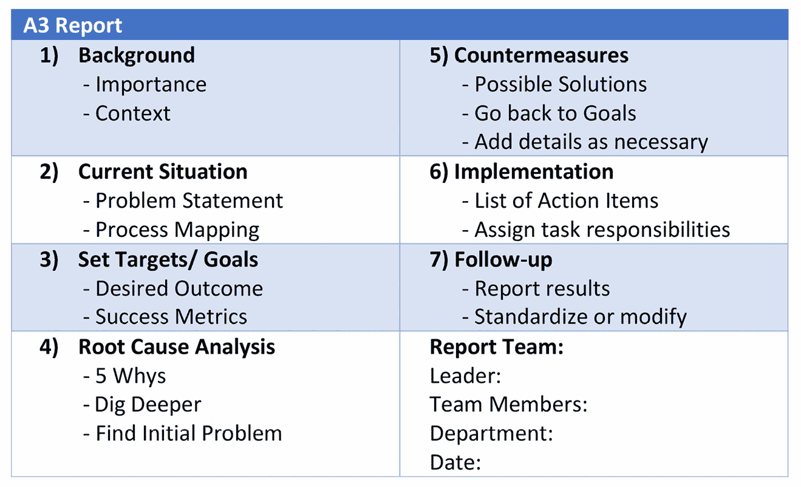
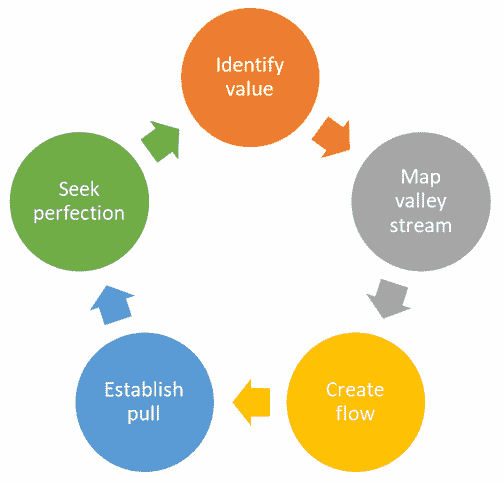
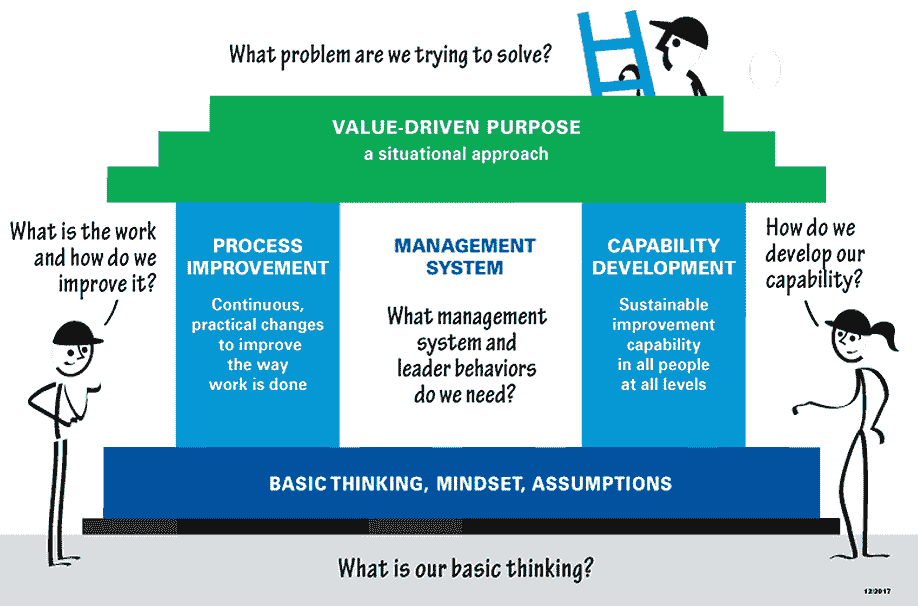
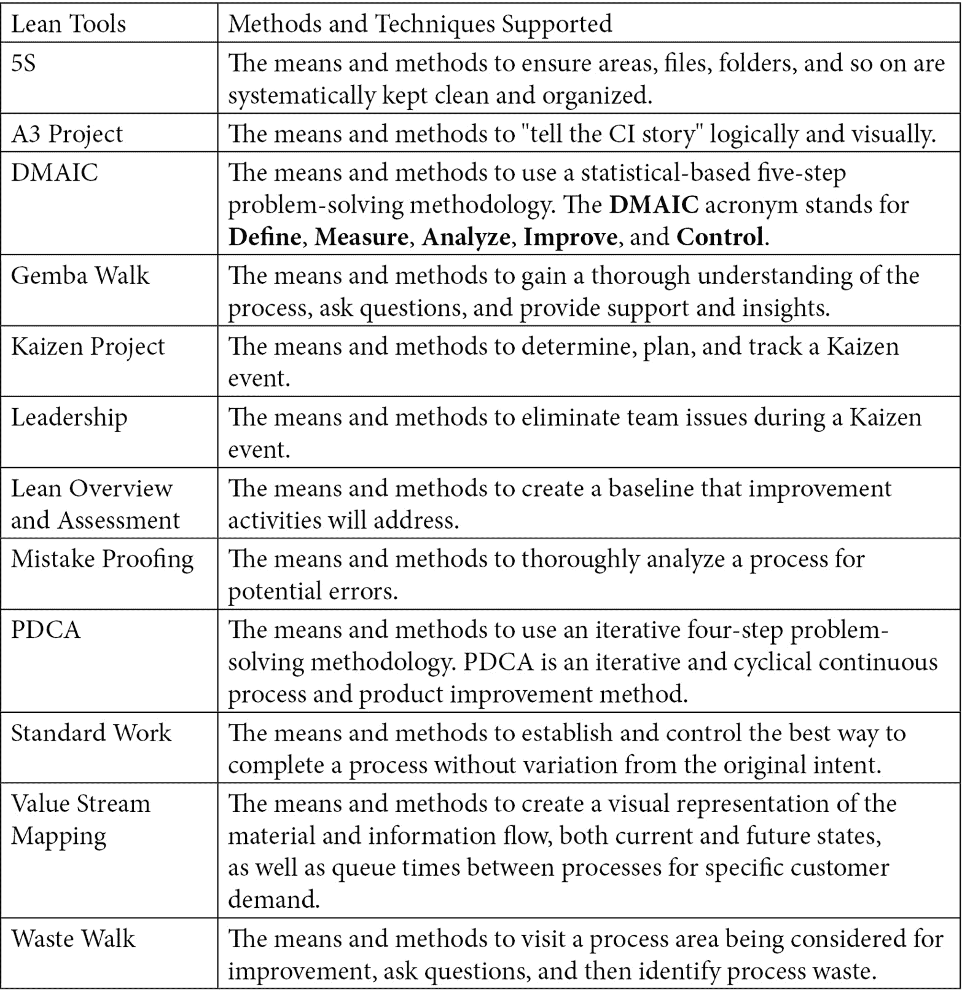
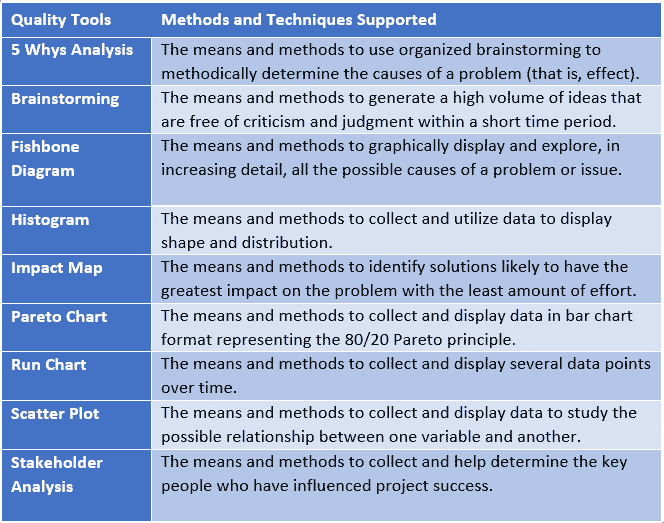

# *第十四章*：介绍企业精益-VSM 实践领导者

本章提供了关于领先的精益导向实践和方法论的领导者的说明，包括**精益企业研究所**（**LEI**）和**LeanFITT™**。这两家组织被提及是因为精益实践从敏捷方法中独立演变出来，而这两家组织是精益运动背后运营最久的思想领导者之一。

LEI 成立于 1997 年，由管理专家詹姆斯·P·沃马克博士和他的同事丹尼尔·T·琼斯共同创立。沃马克和琼斯在《哈佛商业评论》杂志上发表的文章《从精益生产到精益企业》中创造了*价值流*这一术语（沃马克和琼斯，1994 年 3-4 月；[`hbr.org/1994/03/from-lean-production-to-the-lean-enterprise`](https://hbr.org/1994/03/from-lean-production-to-the-lean-enterprise)）。LEI 在其网站上宣传该组织“*进行研究，举办教育工作坊，出版书籍和电子书，举办会议，并分享关于精益思维和实践的实际信息*。”

第二家组织，LeanFITT™，开发了本书中使用的**价值流管理**（**VSM**）方法论（ *第六章**，启动 VSM 倡议（VSM 步骤 1-3）* 通过 *第十章**，改进精益-敏捷价值交付周期（VSM 步骤 7 和 8）*），作为参考模型，用于在**持续集成/持续交付**（**CI/CD**）管道流程中进行精益导向的改进。LeanFITT 更加关注 VSM，改进所有组织的价值流，而不仅仅是**信息技术**（**IT**）中的价值流。自 2001 年以来，LeanFITT 团队合作编写了超过 50 本书籍和学习工具及资料，致力于将 VSM 作为一种实践方法，推动全企业范围内的精益改进，并适用于任何类型的价值流。LeanFITT 的创始人是 VSM 概念和方法论早期发展的最初思想领导者。

在本章中，我们将介绍以下部分中这两家公司与 VSM 的相关性：

+   全力投入精益实践

+   介绍 LEI

+   开始实施精益方法

+   实施基于阶段的精益改进方法

# 全力投入精益实践

到现在为止，你应该完全理解这本书的前提：

理解更广泛的 VSM 图景

*如果组织不能从根本上理解 VSM 不仅仅是为了改善 CI/CD 和 DevOps 流水线的流动性，现代 VSM 工具导向的行业将会有一个非常短暂的生命周期。这些目标至关重要，然而，更大的机会是将我们改进的 IT 流水线流和资源部署到跨组织的产品和价值流改进中。否则，企业将花费大量资金、时间和精力安装集成、自动化和协调的工具链，最终发现这些对组织的底线和价值交付能力几乎没有影响。*

问题在于，从系统思维的角度来看，若我们没有关注其对整个系统的贡献，改善组织的某一价值流实际上是一种局部优化。因此，我们需要利用我们改进的 IT 价值流交付能力，推动组织其他价值流的改进。我们通过使用本书中教授的相同 VSM 方法，但将其应用于所有组织价值流，来实现这一目标。

在这个过程中，我们会发现许多潜在的价值流改进涉及信息、集成、自动化和协调等方面，而 IT 可以解决这些问题。因此，我们在改善 IT CI/CD 和**开发-运维**（**DevOps**）流水线的投资理由并不是来自于软件交付的加速，至少不是在一个真空环境中。相反，更大的理由来自于通过软件加速跨所有组织价值流的精益导向改进。

在*第七章*，*当前状态映射（VSM 步骤 4）*中，VSM 团队选择了对 CI/CD 流水线的改进作为其高优先级的精益改进举措。选择这一项的目的是强调 IT 可以成为 VSM 改进举措的独立主题。然而，VSM 团队本可以轻松选择另一个组织价值流，在该价值流中，CI/CD 流水线的改进是为了改善目标价值流内的工作和信息流所需的 Kaizen 突发（改进）之一。

因此，我们需要采用通用的价值流图（VSM）方法论，并让组织的战略目标、投资组合优先级和当前状态-未来状态分析引导我们识别并选择精益改进目标。由于精益生产改进是 VSM 背后的操作概念，我们不应该为不同的价值流采取不同的 VSM 方法。

因此，应该显而易见，LEI 和 LeanFITT 组织的重要性并不在于利用现代 VSM 工具的力量。相反，它们为使用 VSM 作为一种方法来改进所有组织价值流奠定了基础，包括 IT 部门，以高效地交付价值，支持企业的使命和优先事项。

在奠定了基础后，我们继续学习 LEI 和 LeanFITT。首先，我们从 LEI 的介绍开始。

# 介绍 LEI

在本节中，您将了解 LEI，可能是最著名的精益培训组织，因为其创始人深入研究了最初由丰田开发并在全球广泛采用的精益实践原理。

## 培训和认证项目

LEI 是一个位于 **马萨诸塞州**（**MA**）波士顿的 501(c)(3) 非营利组织。其明确的使命是通过精益思维和实践来改善事物。

LEI 成立于 1997 年，由管理专家詹姆斯·P·沃马克博士创办，他是《改变世界的机器》一书的作者。今天，LEI 推动其研究工作，开展教育研讨会，出版书籍和电子书，举办会议，并分享有关精益思维和实践的实际信息。

与传统的“*智库*”相比，LEI 将其组织视为一个 *实干* 的机构。正如您将在后续部分中发现的，LEI 采用相同的精益原则来指导其研究活动。具体来说，它会提出关于精益思维的假设并进行实验，看看哪种方法在现实世界中最有效。然后，它会写下并教授自己发现的内容，提供组织转型的新方法。

LEI 力求回答每个经理应该问的简单问题：*我周一早晨可以做些什么，来为我的组织带来不同？* 通过其网站和公开活动创建一个强大的精益社区，LEI 的目标是给予经理们勇气，成为精益变革的推动者。

LEI 的使命声明

"*通过精益思维和实践，改善事物。*"

LEI 通过以下价值流来执行其使命：

+   精益教育

+   精益学习材料

+   共同学习伙伴关系

+   精益峰会会议

+   LEI 的官网：[`www.lean.org/`](https://www.lean.org/)

此外，LEI 的实践者们通过精益全球网络（[`leanglobal.org/`](http://leanglobal.org/)）在全球范围内交换信息，该网络由十多个类似于 LEI 的非营利组织组成，所有组织在不同国家共同承担相同的使命。

LEI 是为公司、企业高管、经理、团队领导和团队成员提供的专业资源。任何希望加入精益价值创造转型的人都可以加入 LEI 的精益社区（[`www.lean.org/WhoWeAre/why_join.cfm`](https://www.lean.org/WhoWeAre/why_join.cfm)）。LEI 组织的存在是为了支持那些正在开始或继续精益之旅的人们。

## 阐述 VSM 概念

LEI 并没有明确地定义 VSM。然而，读者可以在 LEI 的官网上找到与此主题相关的几篇文章。

例如，James Womack 在 2002 年写了一篇题为*用钱替代价值流管理*的文章。这篇文章的前提是，他经常发现公司的一线经理和高管“*被赋予了一组关键指标——每个指标都有本年度的挑战目标——并通过奖金激励去实现这些目标*。”

问题在于，这些经理和高管管理着跨多个职能部门的多个价值流，但衡量标准和财务激励措施推动的是部门或设施级别的改进。正如 Womack 所说：“*在以产品为核心的价值流从开始到结束经过多个部门和设施的过程中，部门或设施最佳利益和产品最佳利益之间出现了自然冲突。*”

Womack 指出，其他问题的出现使得负责解决这些问题的人感到**疲惫**。他将这些问题归结为以下三个根本原因：

+   **缺乏政策部署流程**，无法优先考虑改进举措，并缩小选择范围，只留下那些每年可以合理完成并稳定下来的项目。

+   **没有指定价值流经理**，没有人负责从整体上审视每个产品系列的整个价值流，优化整体而非部分。

+   **多重且冲突的衡量标准**，没有优先级排序或培训，可能导致疲惫和不断的失败感。

2009 年，Dan Jones（当时是精益企业学院的主席）写了一篇题为*价值流管理*的文章。在这篇文章中，正值所谓的“大衰退”结束时，Jones 讨论了“*网络在打开将顾客从陌生人转变为合作伙伴的可能性上的日益影响*”。文章的前提是，网络建立了与顾客之间更紧密的联系，将他们转变为要求更高的合作伙伴。具体来说，这些顾客要求我们“*按照他们所需的时间、地点和方式，提供他们想要的精确产品，并显著改善使用这些产品和服务的体验，同时最小化对环境的影响*”。

然而，当他写这篇文章时，许多公司有着 200 到 300 天的供应链，而零售商可以响应顾客的需求。Jones 发现供应商强调 98%的服务交付水平，但实际上他们只接受约 70%的零售商订单。弥合这一差距的唯一办法是应用价值流管理（VSM）概念，将供应链的交付周期从几个月缩短到几天。

然而，Jones 指出，VSM 成功应用的最大障碍在于“*职能、部门和业务单元变得过于强大，并按照自身利益行事。*”换句话说，组织忽视了顾客的声音，支持职能性、官僚性和自利性利益。

Jones 的观察与 Womack 在七年前的文章中提出的并没有太大不同。将价值交付的控制权交给等级化和职能部门，会使组织从客户的角度忽视价值流的重点。Jones 指出，前进的最佳途径是通过引入价值流分析和 VSM 来重新平衡职能组织的权力。我们还需要应用科学的实验方法来解决问题，并找到更好的方法来设计必要的管理系统，以创建并维持新的系统性解决方案，从而解决我们的开发、运营和供应链交付问题。

## 实施精益背后的核心概念

精益的核心思想是最大化客户价值，同时最小化浪费。简单来说，精益意味着用更少的资源为客户创造更多的价值。

精益组织理解客户价值，并将其关键流程聚焦于持续增加这一价值。最终目标是通过完美的价值创造过程，在没有浪费的情况下为客户提供完美的价值。

精益思维将管理的重点从优化单独的技术、资产和垂直部门，转变为优化跨技术、资产和部门流向客户的整个价值流。消除整个价值流中的浪费可以创建出需要更少人力、更少空间、更少资本和更少时间来生产产品和服务的流程，且成本远低于传统的商业系统，缺陷也少得多。公司还可以以高多样性、高质量、低成本和更短的生产周期响应客户需求的变化。同时，信息管理变得更加简单和准确。

有关此主题的更多详情，请访问 LEI 网站：[`www.lean.org/WhatsLean/`](https://www.lean.org/WhatsLean/)。

# 开始实施精益

LEI 并不把精益推广为一种**宏大的理论**，认为“一刀切”的方法适用于所有情况。相反，LEI 将精益视为一种基于实验，为你的组织开发一套标准实践的方法。精益过程从定义一个创造价值的过程开始，以**价值流**或**模型线**的形式呈现。接下来，组织识别它们的价值流，并使用价值流映射技术描述当前和未来的流程状态。

LEI 对价值流的定义包含在以下的框框中。

价值流

所有的行动，不论是创造价值的还是非创造价值的，都是为了将产品从概念带到发布（也称为**开发价值流**）以及从订单到交付（也称为**运营价值流**）。这些行动包括处理来自客户的信息以及将产品转化到达客户的过程。

不可避免地，精益转型工作将识别出问题、难题和浪费领域，这些问题妨碍了信息和产品的高效流动。精益转型团队将每个问题作为独立的问题解决活动来处理。

LEI 提出使用**A3 技巧**作为形成关于如何改进事物的假设的最佳方法。具体来说，A3 是一种解决每天不可避免出现的大大小小问题的技术。

与**风险分析和改进**背后的过程类似，A3 关注的不仅仅是我们能轻易看到的表面症状，而是去发现并解决根本原因。只有解决根本原因，我们才有希望解决问题并将其遏制。

A3 是作为**丰田生产方式**（**TPS**）的一部分开发的。A3 内容通常以一页报告的形式发布。事实上，A3 这个缩写来自于欧洲标准的 A3 纸张尺寸（11 英寸 x 17 英寸或 29.7 厘米 x 42 厘米）。

A3 包含三个角色，如下所示：

+   **问题负责人**：他们负责管理 A3 过程以及创建和维护文档。

+   **响应者/利益相关者**：这些是价值流中的上下游人员，以及最关注和受 A3 项目结果影响的高层管理人员。

+   **导师/教练**：这是一位精益实践专家，负责指导并促使问题负责人找到解决方案，而不是给出答案或提供解决方案。

A3 报告包含与解决问题相关的信息，如下方截图所示：

图 14.1 – 典型的 A3 报告内容和格式

现在你已经看到 A3 格式的简要示例，接下来我们将详细讨论如何使用该报告。

## 通过实验改进

你应该意识到，A3 报告在内容和格式上有许多变体。只要它们能帮助你的团队找到问题的根本原因，这些变体都是可以接受的。

基本策略是识别你当前的状况，然后识别商业问题或机会及其根本原因。使用度量指标来衡量绩效差距，并确定潜在的对策。问题解决团队使用传统的**计划-执行-检查-行动**或**计划-执行-检查-调整**（**PDCA**）循环来对可用选项进行实验，以识别和选择最佳方法。

通过无数的参与，LEI 已经了解到，精益转型工作必须由一线经理主导，而不是由实践社区或 CI 团队主导。一线经理包括**首席执行官**（**CEO**）、**首席运营官**（**COO**）、**首席财务官**（**CFO**）、执行/**业务单元**（**BU**）负责人、部门负责人、设施经理、区域领导者或生产线经理。换句话说，问题解决工作发生在组织的各个层级，但始终由最接近执行层的高管或经理主导。

相比之下，**实践社区**（**CoPs**）、CI 团队或 VSM 团队在担任导师和教练的角色。

## 反思、分享与改进

LEI 的精益改进方法不是一次性的解决问题活动。相反，每次解决问题时，团队都会反思他们学到了什么。但如果这些学习停留在评估团队内，整个组织就无法进化。

因此，精益转型依赖于在组织及其价值流之间垂直和水平地分享经验教训。日语中对此的术语是**Yokoten**，本质上是好的想法的传播。最后，我们需要不断实验，寻找改进的新方法。这就是实现 CI 背后的本质——将问题识别和解决作为一个永无止境的工作循环。

让我们花点时间总结一下到目前为止所学到的内容。

总结来说，LEI 的精益转型方法包括以下内容：

+   识别和绘制价值流

+   使用 A3 问题解决模型解决问题

+   通过实验不断改进

+   反思所学的内容

+   与组织内其他人分享我们的发现

+   保持持续改进（CI）

现在我们了解了 LEI 的精益转型方法，让我们快速了解一下 LEI 在精益实践中的指导原则。

## 定义精益原则

LEI 定义了其精益实践背后的五项原则，详见 Lean.org 网站：[`www.lean.org/WhatsLean/Principles.cfm`](https://www.lean.org/WhatsLean/Principles.cfm)。这些原则定义了引导精益实施的流程。

“引导精益技术实施的五步思维过程容易记住，但并不总是容易实现：

1.  从最终客户的角度，通过产品系列指定价值。

1.  为每个产品系列识别价值流中的所有步骤，尽可能去除那些不创造价值的步骤。

1.  使价值创造步骤紧密地按顺序进行，以便产品能够顺利地流向客户。

1.  随着流动的引入，让客户从下游活动中拉取价值。

1.  随着价值的指定，价值流被识别，浪费的步骤被去除，流动和拉动被引入，过程再次开始，并持续进行，直到达到完美的状态，在这个状态下，创造了完美的价值且没有浪费。”

LEI 将其五项精益原则呈现为一个循环过程，如下图所示：

图 14.2 – LEI 的精益原则

现在我们了解了 LEI 的精益原则，让我们快速看一下精益应用的潜在广度。

## 在组织中推广精益方法

LEI 明确指出，精益不仅仅用于改善制造生产过程。精益导向的方法改进了企业内的每个业务和每个流程。精益还作为战略倡议运作，而不是作为单一使用或战术计划。精益也不是成本削减计划；相反，精益是一种改进价值传递的思维和行为方式。

LEI 在以下网页提供了有关此主题的更多信息：[`www.lean.org/WhatsLean/`](https://www.lean.org/WhatsLean/)

LEI 指出，**转型**或**精益转型**经常用来描述公司从旧的思维方式向精益思维转变的过程。精益要求公司彻底改变其业务的进行方式。

精益不是一夜之间发生的。相反，组织必须采取长远的视角并坚持不懈。因此，让我们花点时间了解为什么有业务问题需要进行精益转型。

## 实施精益以推动业务转型

LEI 创始人沃马克和琼斯概述了应指导整个组织转型的三个基本业务问题（[`www.lean.org/WhatsLean/`](https://www.lean.org/WhatsLean/)）。这些在此列出：

+   **目的**：企业将解决哪些客户问题以实现繁荣的自身目标？

+   **流程**：组织将如何评估每个主要价值流，以确保每个步骤都是有价值的、能力强的、可用的、足够的和灵活的，并且所有步骤都通过流动、拉动和平衡相连？

+   **人员**：组织如何确保每个重要流程都有负责不断评估价值流的人员，以业务目的和精益流程为评估标准？如何确保每个接触价值流的人员都积极参与正确操作和持续改进？

现在我们知道是什么促使一个组织采纳精益实践，让我们来看看制定精益行动计划的方法。

## 制定精益行动计划

尽管每个踏上精益之旅的个人或公司都会根据他们特定的情况面临不同的挑战，但是有几个关键步骤可以帮助减少阻力，传播正确的学习目标，并培养精益企业所需的承诺。LEI 在以下网页提供了有关此主题的更多详细信息：[`www.lean.org/WhatsLean/GettingStarted.cfm`](https://www.lean.org/WhatsLean/GettingStarted.cfm)。

### 开始

LEI 提倡以下行动导向的步骤来启动组织并采纳精益作为新的运营模式：

+   **找到变革的推动者**，一位愿意个人承担精益转型责任的领导者。

+   **获取精益知识**，通过一位老师或顾问获取精益技术，并将其作为系统的一部分来实施，而不是作为孤立的程序。

+   通过**抓住危机**或制造一个危机来找到杠杆点，开始转型。如果你的公司没有危机，可以将注意力集中到精益的竞争对手上，或者寻找一个精益的客户或供应商，他们将提出对更高效表现的要求。

+   **暂时忘掉宏大战略**。

+   **绘制价值流图**，首先描绘出物料和信息流动的当前状态，然后绘制出更精益的未来状态，并制定实施计划及时间表。

+   **尽快开始**，从一项必要且可见的活动开始。

+   **要求立即见效**，不要让事情因为缺乏领导力、支持或足够的优先级而停滞不前。

+   **扩大你的视野**，将价值流中的改进联系起来，一旦你取得进展，就不仅仅局限于车间流程，还要扩展到办公室流程。

既然我们知道如何开始，我们也需要理解支撑精益转型的组织结构。

### 创建一个组织来引导你的价值流。

精益生产流程将改变你组织的运作方式。虽然组织可以选择维持等级制和职能部门来建立和维持技能，但价值交付领导力必须支持跨职能的价值流交付，哪怕以前从未存在过。换句话说，价值流是横向的，即使你的管理结构是纵向的。

LEI 为实施精益转型战略的组织提供以下指导：

+   按照产品家庭和价值流重组你的公司。

+   创建精益推广职能。

+   在开始时处理过剩人员问题，然后承诺未来因引入精益技术而导致的裁员不会发生。

+   制定增长战略。

+   移除那些拖后腿的人。

+   一旦你修复了某件事情，再次修复它。

+   两步前进，一步后退是可以的；完全没有进步则不行。

采用精益作为新运营模式的组织，也必须安装业务系统来鼓励和支持精益实践，相关内容将在下节讨论。

### 安装业务系统以鼓励精益思维。

创建行动计划并重新调整资源是支持精益转型的关键任务。然而，除非组织的高层管理人员安装必要的业务系统来支持和鼓励精益导向的转型，否则这些实践将无法长久维持。为此，LEI 建议安装以下业务系统：

+   利用政策部署。

+   创建精益会计系统。

+   根据公司业绩支付员工薪酬。

+   使绩效衡量标准透明。

+   教授每个人精益思维和技能。

+   根据实际需求调整工具的规模，例如生产设备和信息系统。

在这一点上，我们已经有了行动计划，一个支持精益转型目标的组织结构，以及鼓励精益思维长期采用的业务系统。现在我们需要采取步骤来完成精益转型。

## 完成转型

组织精益行动计划中的最终活动帮助解决 Womack 和 Jones 在其关于 VSM 的文章中提出的问题。这些行动聚焦于使你的供应链合作伙伴与价值交付对齐，并在全球范围内进行。我们还需要确保领导力和决策流程与我们的精益采用保持一致。

LEI 推荐以下活动，以完善或补充你的精益转型行动计划：

+   说服你的供应商和客户采取刚才提到的步骤。

+   制定精益全球战略。

+   从自上而下的领导转变为基于提问、辅导和教学的领导，并扎根于 PDCA 的科学方法。

LEI 提供了一个框架来支持精益转型，这是下一节的主题。

## 应用 LEI 的精益转型框架

LEI 发现，有效的企业转型涉及五个维度的变化。LEI 使用“房屋”这个隐喻来解释五个变化维度。*精益之屋*的组成部分包括以下内容：

+   **屋顶**——保护我们免受外部环境影响的目标、目标和愿景，例子包括：

    a. 我们的价值驱动目的是什么？

    b. 每种情况都不同，我们的对策也不同，因此我们的 approach 必须不同。

+   **墙壁**——支撑我们屋顶的支柱，包括以下内容：

    a. **过程**——需要完成的工作是什么？

    b. **能力**——我们需要什么能力来完成工作，解决问题，实现目标？

+   **基础**——包括我们的基本思维方式、心态和潜在假设：

    a. **明确的假设**——我们知道的并且指导我们所有活动的假设

    b. **隐藏的假设**——我们不知道的假设

    c. **精益转型差距**——从我们当前的文化到理想文化的过渡

精益之屋通过提出以下问题，帮助我们改善对因果关系的基本思维：

+   我们需要解决哪些**问题**？

+   我们试图实现的**目的**或目标是什么？

+   需要完成的**工作**是什么？

+   改善我们现状所需的工作**流程**是什么？

+   我们需要哪些**能力**，以及我将如何培养这些能力？

+   我们需要定义哪些**管理系统**？

+   为了构建执行工作所需的能力，我们需要哪些**行为**？

以下截图提供了 LEI 精益之屋的图示展示：

图 14.3 – LEI 精益之屋

LEI 与其他公司合作，运用其科学方法寻求 CI 到精益转型的流程。这些合作关系是在 LEI 的**共同学习伙伴计划**下成立的，后续小节将对此进行介绍。

## 共同学习伙伴关系

多年来，LEI 与一组选定的公司建立了合作伙伴关系，帮助他们进行精益之旅，并共同开展有关精益转型最佳方法的实验。合格的合作伙伴公司可以接触到 LEI 的思想领袖，例如 John Shook、Jim Womack 和 Mark Reich，以及 LEI 的教练和**主题专家**（**SMEs**）。

合作伙伴包括将精益方法应用于整个企业的传统制造商。与此同时，LEI 还与一些开创精益应用的公司合作，涵盖了零售、医疗保健和金融服务等多个服务行业。

通过这些合作关系，LEI 保持了来自这些活动的最新和现实世界的知识，为未来 LEI 的出版物、培训和研究提供了基础。

共同学习伙伴在他们的时间和资源上进行投资，他们必须从中获得一些好处。LEI 列举了其合作伙伴公司获得的以下利益：

+   高层领导的辅导和指导

+   精益转型项目支持

+   战略规划与部署（又名 Hoshin）

+   定制的学习机会

+   基于现场的改进活动

+   行动研究和共同学习实验

+   记录的学习内容共享给伙伴之间以及更广泛的精益社区（需经批准）

+   与伙伴社区的互动

+   独家的伙伴间学习活动

+   在 LEI 举办的实用性公开工作坊上的席位

+   在富有启发性且具有信息量的精益峰会会议上的席位

+   书籍和其他产品的折扣

你可以在以下网页上找到更多关于共同学习伙伴计划的信息：[`www.lean.org/WhoWeAre/CoLearningPartners.cfm`](https://www.lean.org/WhoWeAre/CoLearningPartners.cfm)

本节完成了我们对 LEI 的介绍。在接下来的章节中，你将了解 LeanFITT™及其对 VSM 发展的贡献。

## 来自 LeanFITT™的培训和工具

**LeanFITT™**由 Don Tapping、Rob Ptacek、Todd Sperl 和 Abhishek Paul 创立。从你阅读*第六章**，启动 VSM 倡议（VSM 步骤 1 - 3）*到*第十章**，改进精益-敏捷价值交付周期（VSM 步骤 7 和 8）*时，你可能会记得 Don Tapping 及其合作者定义了本书前面章节中使用的八步 VSM 方法论，我们将其作为用例来评估和改进从精益角度出发的 CI/CD 管道流。

作为一次集体努力，LeanFITT™ 团队自 2001 年以来一直合作编写超过 50 本关于精益和 VSM 实践的书籍、学习工具和资料。通过他们合作中获得的知识，LeanFITT 公司提供一套精益工具来支持您的精益改进计划。LeanFITT 中的**FITT**代表**功能性**、**集成**、**技术**和**培训**。

LeanFITT 起初是一个咨询公司，但逐步发展为开发并提供支持精益生产过程的方法和工具。例如，自 2014 年起开发的 LeanFITT 工具将团队的学习经验整合，并通过增强的软件工具提供。与精益的手动选项相比，这些工具通过更简单的方式促进精益团队合作。因此，LeanFITT 的工具体系帮助组织更快速、可持续地部署精益理念。

LeanFITT 的工具为 VSM 团队、精益实践者、企业高层及其他参与价值流改进的利益相关者提供基于知识的指导。每个 LeanFITT 工具提供以下功能：

+   详细内容，解释其目的和实际应用

+   来自行业精益六西格玛专家的**导师建议**

+   为各级领导者提供的领导力技巧，以更好地激发员工的参与感

+   可追踪的行动项，带有通知功能，并允许附加备注和图片/照片

LeanFITT 工具的目标是利用持续改进、员工参与、标准化知识和工具使用的力量，激发能够带来重大影响的过程变化。基于这一理解，让我们来回顾这些工具。

## LeanFITT™的服务内容

LeanFITT 体系提供方法、工具和技术，以改善组织过程、员工和利润。作为一个完整的体系，LeanFITT 包括以下 12 个工具，支持各自的方法和技术：

图 14.4 – LeanFITT™ 精益工具

客户可以根据需求灵活使用 LeanFITT 工具。然而，公司提倡采用四阶段实施方法，您将在接下来的内容中了解这一点。

# 实施基于阶段的精益改进方法

LeanFITT 体系采用四阶段方法对组织过程进行精益改进。LeanFITT 实施方法的目标是**实现积极的行为变化**，朝着**持续改进的思维模式**发展，使高水平的纪律性和标准化变得简单易行，并创造**组织文化和盈利能力的积极转变**。

让我们快速了解 LeanFITT 的四阶段方法，如何创建一个精益企业。

## 第一阶段 – 培训并激发员工参与

正如我们在*第六章*中讨论的，*启动 VSM 计划（VSM 步骤 1-3）*，组织需要确保参与 VSM 计划的人员理解精益原则。我们还需要确保已识别价值流，并且高管和利益相关者支持并参与精益改进工作。最后，我们利用在*第七章*中学到的价值流图绘制活动，*绘制当前状态（VSM 步骤 4）*和*第九章*中的内容，*绘制未来状态（VSM 步骤 6）*来识别浪费，并通过**改善突击**（识别的精益改进计划）消除这些浪费。

在这一阶段使用的 LeanFITT 工具包括**浪费巡视**、**5S**、**PDCA**、**改善项目**、**价值流图绘制**以及其他适当的工具。主要活动包括以下内容：

+   确定关键用户

+   制定和实施个人、团队或小组的发展和培训计划

+   理解商业案例，识别浪费和改进机会

+   测试你的知识，获得反馈并获得奖励

这一阶段的重点是寻找和评估消除浪费的方法。随着这一阶段的结束，组织将开始标准化和改进其精益实施过程。

## 阶段 2 – 标准化改进过程

在这一阶段，VSM 团队致力于标准化其精益改进过程，利用 LeanFITT 工具并添加 DMAIC。DMAIC 是基于**六西格玛**的改进过程。

六西格玛过程是指一个过程中 99.99966%的实例或产品没有缺陷。六西格玛策略设定并监控过程和产品缺陷度量的上下界限，以在偏差造成灾难性后果之前发现趋势。当观察到偏离统计常规时，团队会迅速分析并解决偏差的原因。

在这一阶段使用的 LeanFITT 工具包括**标准巡视**、**A3**、**Gemba 巡视**、**5S**、**PDCA**、**DMAIC**以及其他适当的工具。主要活动包括以下内容：

+   实施有针对性且结果导向的改进项目

+   应用 LeanFITT™工具进行改进

+   测量和追踪改进进度

+   与他人共享结果

本阶段的活动专注于消除*第一阶段*中识别的浪费。成功消除浪费将提升组织为客户创造价值的能力。

精益改进在战略层面和全组织范围内运作。但与任何商业转型计划一样，变革是困难的。变革不能强制执行——它必须由领导推动，并且变革的原因必须得到有效传达，否则组织内其他人将感到威胁并抵制变革。

此外，人们通常希望加入成功的努力和组织。因此，赞助 LeanFITT 的高管需要促进其初步成功，以在整个组织中获得更多的认可。高管还需要在整个组织中提供机会，培训其他价值流中的人员应用 Lean 实践、方法和工具。这是下一阶段的目标。

## 第三阶段 – 通过积极参与和透明化激发团队

在这第三阶段，之前 Lean 改进工作的成功得到社会化，并且在内部和领导最初努力的个人因其成就而受到认可。LeanFITT 提倡使用度量和工作可见性来促进组织支持和接受新的工作方式，就像任何 Lean 倡议一样。这些目标是 *第三阶段* 活动的重点。

本阶段使用的 LeanFITT 工具包括 **标准步行**，**A3**，**现场步行**，**5S**，**PDCA**，**DMAIC** 和其他适当的工具。主要活动包括以下内容：

+   推广和展示 LeanFITT™ 工具应用和项目的结果

+   跟踪和分享团队改进项目的进展和行动项目

+   在整个组织中标准化和扩展培训

+   分享成功故事

到目前为止，领导 Lean 改进的团队可以因他们的成功而受到表彰。庆祝成功是一件好事。然而，组织不能止步于此。Lean 是关于在产品生命周期和组织生命周期中实现持续改进。

## 第四阶段 – 使 Lean 成为日常和可持续的做法

停止改进的组织会变得陈旧，并将其业务置于风险之中。其他竞争对手将看到通过数字增强产品和组织价值流驱动的新产品的市场份额机会。这第四阶段旨在维持甚至增强您 Lean 取向的竞争优势。

本阶段使用的 LeanFITT 工具包括 **标准步行**，**现场步行**，**PDCA**，**防错** 和其他适当的工具。主要活动包括以下内容：

+   持续监控和调整进展和活动，以应对当前需求

+   实施行动项目以推动持续改进

+   测量和分享明显的货币节约和诸如改善沟通和团队合作等无形节约

+   使持续改进和 LeanFITT™ 成为您组织的文化！

Lean 和 Six Sigma 通常解决质量问题，其中有许多支持质量改进目标的方法和工具。正如您可以想象的那样，LeanFITT 在其产品提供中提供质量改进工具。

## 通过 LeanFITT 改善质量

LeanFITT 包括九种用于改进质量的方法和工具，如下图所示：

图 14.5 – LeanFITT™改进质量的九种方法和工具

本部分结束了我们关于 LeanFITT 的讨论，也结束了本章关于 VSM 领先实践的内容。在下一章中，作为本书的*第三部分*的开始，我们将再次深入讨论 DevOps。在我们开始之前，我们将以总结和一系列问题结束本章，以帮助您验证和提高对讨论内容的记忆。

# 总结

在本章中，您了解了两个在精益实践和 VSM 发展中起到关键作用的组织。我们从介绍 LEI 开始。LEI 进行研究，举办教育研讨会，出版书籍和电子书，举办会议，并分享有关精益思维和实践的实用信息。

您还了解了 LeanFITT。LeanFITT 的创始伙伴们为 50 多本关于精益实践的书籍做出了贡献。他们还写了关于 VSM 的最早书籍之一，并且在 VSM 实践和方法论的早期发展中起到了积极作用。

我们现在准备进入本书的*第三部分*，该部分描述了安装现代 DevOps 管道和工具链的复杂性和方法。第一章，*第十五章*，*定义适当的 DevOps 平台策略*，讨论了两个关键问题。第一个问题是避免所有组织在尝试实施成熟的 DevOps 管道和工具链策略时所面临的实施陷阱。第二个问题是确定最适合您组织的 DevOps 平台实施策略。具体来说，您将了解四种实施 DevOps 管道的方法。

最后一章，*第十六章*，*通过 VSM 和 DevOps 转型企业*，讨论了一个潜在的未来状态，其中现代 VSM 工具不仅帮助改善基于 IT 的价值流，而且帮助改进整个组织的价值流。

# 问题

1.  谁创造了*价值流*这一术语？

1.  LeanFITT 在我们对 VSM 的讨论中有什么相关性？

1.  James Womack 描述了哪些与组织使用资金作为功能经理和高管激励措施相关的关注点？

1.  LEI 如何定义价值流？

1.  在 LEI 中，精益行动计划的目的是什么？

1.  LeanFITT 的产品的明确目标是什么？

1.  LeanFITT 在创建精益企业时采用的四个阶段是什么？

1.  什么是 A3 项目？

1.  什么是六西格玛过程？

1.  LeanFITT 有两组工具——它们分别是什么？

# 进一步阅读

1.  *Martin, James (1995). The Great Transition. Using the Seven Disciplines of Enterprise Engineering to Align People, Technology, And Strategy. Amazon. New York, New York.*

1.  *Davenport, Thomas (1992 年). 流程创新：通过信息技术重新设计工作. 安永 – 信息技术与战略中心. 哈佛商学院出版社, 波士顿, 马萨诸塞州。* 来源：[`www.researchgate.net/publication/216300521_Process_Innovation_Reengineering_Work_through_Information_Technology`](https://www.researchgate.net/publication/216300521_Process_Innovation_Reengineering_Work_through_Information_Technology)。

1.  *Kirsten, M. (2018 年). 从项目到产品. 如何在数字颠覆时代通过 Flow 框架生存并繁荣. IT 革命. 波特兰, OR。*

1.  *Cardoza, C. (2021 年 1 月 6 日). 价值流管理解决方案指南. 采购指南.* 来源：[`sdtimes.com/value-stream/a-guide-to-value-stream-management-solutions-2/`](https://sdtimes.com/value-stream/a-guide-to-value-stream-management-solutions-2/)。访问日期：2021 年 5 月 20 日。

1.  *Collins, J. (2020 年 9 月 29 日). GigaOm Radar for Value Stream Management v1.0.* 来源：[`gigaom.com/report/gigaom-radar-for-value-stream-management/`](https://gigaom.com/report/gigaom-radar-for-value-stream-management/)。访问日期：2021 年 5 月 20 日。

1.  *Condo, C., Mines, C. (2020 年 7 月 15 日). Forrester Wave™: 价值流管理解决方案, 2020 年第三季度。* 11 家最重要的供应商及其竞争力分析。来源：[`www.forrester.com/report/The+Forrester+Wave+Value+Stream+Management+Solutions+Q3+2020/-/E-RES159825`](https://www.forrester.com/report/The+Forrester+Wave+Value+Stream+Management+Solutions+Q3+2020/-/E-RES159825)。

1.  *Rupp, C. G. (2020 年). 在现代企业中推广 Scrum：在大型组织中的复杂产品、投资组合和项目中实施 Scrum 和精益敏捷技术. Packt 出版社. 英国伯明翰。*

1.  *Ford, N., Parsons, R., Kua, P. (2017 年). 构建进化架构：支持持续变化. O'Reilly Media, Inc. 塞巴斯托波尔, CA。*

1.  *Zachman, J. (1987 年 2 月). 信息系统架构框架. IBM 系统杂志 26, 276-292。*

1.  *Kersten, Mik (2020 年 7 月 15 日). 价值流管理（VSM）的崛起.* Tasktop 创始人兼 CEO。原文发布于 2020 年 7 月 15 日的 Tasktop 博客。也发布于 LinkedIn。来源：[`www.linkedin.com/pulse/rise-value-stream-management-vsm-mik-kersten/`](https://www.linkedin.com/pulse/rise-value-stream-management-vsm-mik-kersten/)。

1.  *Ennaciri, H., Bhat, M., Betts, D., Saunderson, C., Herschman, J., Murphy, T. (2020 年 9 月 29 日). DevOps 价值流管理平台市场指南.* ID: G00730782。来源：[`www.gartner.com/en/documents/3991130/market-guide-for-devops-value-stream-management-platform`](https://www.gartner.com/en/documents/3991130/market-guide-for-devops-value-stream-management-platform)。

1.  *Ackoff, R. L. (1994 年). 如果 Russ Ackoff 做了 TED 演讲. YouTube.* 由 Steven Brant 发布。发布于 2010 年 10 月 23 日。由 Clare Crawford-Mason 和 Lloyd Dobyns 主持，旨在捕捉 W. Edwards Deming 博士的学习和遗产。([`www.youtube.com/watch?v=OqEeIG8aPPk`](https://www.youtube.com/watch?v=OqEeIG8aPPk))

1.  *Robinson, F. (2001 年). MVP：最大化风险回报的有效方法论.* 访问日期：2001 年 5 月 29 日。 来源：[`www.syncdev.com/minimum-viable-product/`](http://www.syncdev.com/minimum-viable-product/)

1.  *Ries, E. (2009 年). 最小可行产品：指南. 启动公司经验教训.* 访问日期：2001 年 5 月 29 日。 来源：[`www.startuplessonslearned.com/2009/08/minimum-viable-product-guide.html`](http://www.startuplessonslearned.com/2009/08/minimum-viable-product-guide.html).

1.  *Womack, J. (2002 年 11 月). 用金钱替代价值流管理. 精益企业研究所. 波士顿, MA.* 来源：[`www.lean.org/womack/DisplayObject.cfm?o=686`](https://www.lean.org/womack/DisplayObject.cfm?o=686). 访问日期：2021 年 5 月 30 日。

1.  *Jones, D. (2009 年 12 月). 价值流管理. 精益企业研究所. 波士顿, MA.* 来源：[`www.lean.org/common/display/?o=1284`](https://www.lean.org/common/display/?o=1284). 访问日期：2021 年 5 月 30 日。

1.  *Goldratt, E. M., Cox, J. (1984, 2014 年). 《目标：持续改进的过程》. 第四版. North River Press. Great Barrington, MA.*

1.  *Bain, S. L. (2008 年). 新兴设计：专业软件开发的演化特性. Addison-Wesley，Pearson 教育公司. Upper Saddle River, NJ.*

1.  *Ward, Allen (2004 年). 精益产品与过程开发*（视频）。 *精益企业研究所，2004 年。*

1.  *Kirsten, M. (2020 年 7 月). 价值流管理（VSM）的崛起.* ([`www.linkedin.com/pulse/rise-value-stream-management-vsm-mik-kersten/`](https://www.linkedin.com/pulse/rise-value-stream-management-vsm-mik-kersten/))

1.  *Skelton, Matthew, 和 Manuel Pais. 《团队拓扑学：为快速流动组织商业与技术团队》。IT Revolution Press, 2019 年.*

## 引用 LEI 使用案例研究

LEI 引用了四个客户使用案例来展示其共同学习项目的成功。以下是这些使用案例的名称，所有案例目前均可在 LEI 网站上找到 ([`www.lean.org/common/display/?o=3342`](https://www.lean.org/common/display/?o=3342))：

+   [Thrustmaster 的转变](https://www.lean.org/common/display/?o=3342)

+   [用直线加速器和加速过程抗击癌症](https://www.lean.org/common/display/?o=814)

+   [精益+循环原则 = 制造商的新北极星](https://www.lean.org/common/display/?o=3246)

+   [将计划-执行-检查-行动（Plan-Do-Check-Act）作为帮助供应商改进的战略和战术](https://www.lean.org/common/display/?o=1808)
