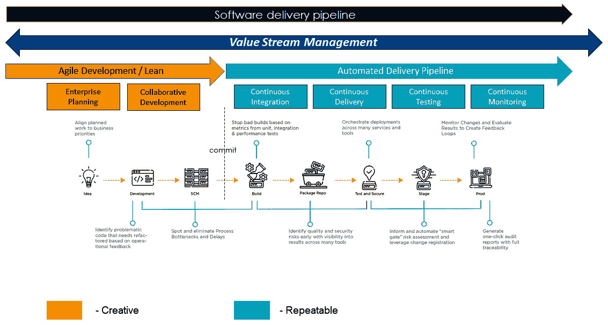

# *第十五章*：定义适当的 DevOps 平台战略

恭喜！如果您已经走到了这一步，也就是本书的 *第四部分* 的开始，您将要进入本书将要涵盖的最后一组主题。具体来说，我们现在将关注理解我们可以用来实施 DevOps 能力的方法，以及如何利用这些能力来支持数字业务转型。

在本节关于应用 DevOps 推动数字业务转型的最后一部分中，将涵盖四个主要主题，如下所示：

+   避免 DevOps 实施中的陷阱

+   决定适当的 DevOps 平台战略

+   解决 DevOps 实施的陷阱

+   采访专家

+   处理公司实施指令

+   处理创造性与可重复性流水线活动的差异

在 *第十六章*，*利用 VSM 和 DevOps 转型业务* 中，我们将讨论前三个主题，然后讨论如何使用 VSM 和 DevOps 工具来帮助影响数字业务转型。在这一章中，您将了解四种基本的 DevOps 实施策略，以及每种策略的利弊。然后，我们将继续讨论可能损害 DevOps 实施倡议的一些陷阱。最后，我们将回顾 18 个可以帮助改善您的 DevOps 工具链实施的策略。

本章中大部分信息来自于 DevOps 专家以及为本书进行访谈的 VSM 和 DevOps 工具公司。然而，我们等待推荐这些策略，因为它们与您的组织选择部署的 DevOps 工具和工具链无关。

在我们进入下一章之前，我们必须解决实施选项和问题，因为如果我们未能部署它们，那么从 VSM 和 DevOps 工具中获益如何就不重要了。成功部署我们的 VSM 和 DevOps 方法和工具对支持我们的数字转型至关重要。

在下一章中，您将发现现代 VSM 工具和实践支持将基于 DevOps 的软件交付与其他组织价值流改进对齐。从这个意义上说，我们将全面展示如何改进软件交付能力以支持组织的价值流改进，这对于在现代数字经济中竞争至关重要。

考虑到这些目标，让我们首先探讨 DevOps 实施的潜在问题。

# 避免 DevOps 实施中的陷阱

在准备撰写本章时，我采访了几位我非常看重的专家，他们是部署 DevOps 工具和工具链的实际操作者。他们分别是**斯科特·安布勒**（项目管理协会 Disciplined Agile 的副总裁兼首席科学家），**阿尔·瓦格纳**（HCL 软件 VSM 和 DevOps 倡导者），**海伦·比尔**（DevOps Institute 的首席大使和 VSMC 的主席），**普拉莫德·马尔霍特拉**（DevOps 服务执行官），和**乔尔·克鲁格**（专注于开发可重用软件工厂的高级 DevOps 工程师）。

海伦·比尔在 DevOps 及其社区中的资历非常深厚。她解释了 DevOps 实施通常是如何发展成包括多种工具，并且需要 VSM 工具来改进和协调软件交付流程的。斯科特·安布勒从精益敏捷的角度看待 DevOps，并强调在实施 DevOps 平台时选择自己的**工作方式**（**WoW**）。

普拉莫德·马尔霍特拉讨论了他作为联邦总承包商和商业系统集成商的 DevOps 实施经验。阿尔·瓦格纳将代表 VSM/DevOps 平台供应商的观点。最后，乔尔·克鲁格将讨论创建可下载的 CI/CD 和 DevOps 配置作为可重用的软件工厂的好处。

在做了这些初步介绍后，让我们开始吧。

# 采访专家

在这一部分，我们将了解五位行业专家的观点，以及他们对 DevOps 的看法和想法。

## 与海伦·比尔的访谈

海伦·比尔是 DevOps 和工作方式教练，**DevOps Institute**的首席大使，**持续交付基金会**的大使，以及**价值流管理联盟**（**VSMC**）的主席。她为 DevOps 行业领导者提供战略咨询服务，并在**加速战略集团**担任分析师。

我很荣幸海伦同意担任本书的技术审稿人，并希望为这一章贡献她的想法。我也有机会与海伦一起工作，她是 VSMC 的顾问之一。那么，在做了这个介绍后，让我们来听听海伦怎么说。

### 培养 DevOps 思维方式

海伦首先指出，她不认为组织应该创建 DevOps 团队。相反，她认为 DevOps 是一种思维方式，而不仅仅是一种组织结构。正如她所说，"*灌输这种思维方式：DevOps 是整个组织的文化运动，并设计实践 DevOps 的价值流团队。*"

价值流是精益企业中交付价值的基本组织结构。DevOps 是一种支持 IT 中价值流的协作与技术实施策略。所以，在这种背景下，海伦的说法是完全合理的。

DevOps 最初是一种协作策略，旨在协调软件开发和运维团队的努力，以提高基于价值的软件交付能力。你现在也知道，成熟的 DevOps 流水线通过集成工具、自动化活动以及工作和信息的编排，共同推动价值流的改善。DevOps 需要改变思维和文化，以便将软件交付与价值流对接。

### 授权员工

DevOps 改变了人们在组织内部和跨部门之间的工作方式。因此，DevOps 影响着组织的人力和文化。Helen 进一步指出，我们必须赋予人们参与的权利——"*人们不喜欢变革被强加给他们——他们必须被赋予自主权来找到自己的前进道路*。"Helen 还提到，如果长期没有获得授权，想要变得有权力就非常困难。

### 引领前行

Helen 指出，*领导者是领导者*。因此，他们不能在监督 DevOps 工具和工具链的部署以及必须采取的组织变革中采取旁观者的角色，以便有效地利用这种新的工作方式。

为了在他们的角色中有效，组织内的高管必须首先学习 DevOps 的技能和原则，然后才能出台任何关于使用 DevOps 的指令。否则，他们不可能就工具、相关预算、资源对接和培训需求做出明智的决策。

Helen 观察到，许多领导者认为他们是*高高在上的*。然而，领导者需要从自己做起，重新培训组织。DevOps 使组织远离传统的等级制和指挥控制结构。因此，其领导者——包括组织的高管、经理和教练——必须具备鼓励团队自我发现改进方法的能力和知识，并帮助消除团队识别的障碍。

### 演变而非转型

目前许多分析师的趋势是讨论使用精益敏捷实践来支持业务转型。在这本书中，你已经听我描述了我们如何使用 VSM 和 DevOps 方法和工具来支持业务转型，以便在现代数字经济中竞争。

然而，Helen 担心进行业务转型的概念过于*轰动性*，许多人由于之前的转型失败而感到变革疲劳。相反，Helen 认为我们最好通过持续的渐进式改进来追求演变。在这个背景下，Helen 认为，组织更应该将其努力方向引导向实现持续演变的文化，而不是追求一次性和相对短期的业务转型目标。

### 抽出时间学习

Helen 之前提到过，组织的领导者必须获得支持有效 DevOps 转型的知识。但是，这种学习要求不仅仅局限于领导层，而是要在整个组织范围内实施，并且必须为员工的持续教育提供时间和资源。

这些培训要求意味着组织的高层管理者必须为学习腾出时间。换句话说，持续学习必须被视为一项持续的工作要求，而不仅仅是一个可有可无的选项。

DevOps 的演进要求组织中的所有人放弃长期以来坚持的信念和做法（例如 PRINCE、项目管理等），并学习新的思维方式和工作方法。Helen 指出，人类的认知负荷是有限的，学习和实践新行为需要时间。因此，必须为学习分配时间，超越**日常业务**（**BAU**）和新的功能开发与解决。

### 解决技术债务

尽管技术上不属于培训的一部分，Helen 也强调了解决技术债务的重要性。换句话说，组织需要在繁忙的日程中腾出时间来重构软件代码，因为这有助于解决在团队专注于便捷地交付新特性时积累的性能问题。同样，开发和支持团队也需要不时地改进产品的架构和设计，并实施新的技术改进。

### 构建 DevOps 平台

Helen 指出，新的 DevOps 工具不断涌现，而且它们的需求也在不断变化。因此，软件交付团队需要构建一个可适应的 DevOps 框架——从 API 优先的角度进行思考。采用 DevOps 框架策略有助于确保平台在时间的推移中保持可扩展性，从而允许集成新的功能和未来的技术，以支持组织不断发展的软件交付需求。

另一个重要的考虑因素是，要在工具链中实现可追溯性。Helen 认为，你应该接受你的 DevOps 平台将成为一个异构工具链的事实，即使你一开始使用的是商业**DevOps 即服务（DaaS）平台**。支持持续改进 DevOps 工具链的进化性方法将推动这一最终结果。好的一面是，你的 VSM 平台将把这一切联系在一起。

此外，Helen 认为，你应该将 DevOps 工具链/VSM 平台作为服务提供给你的价值流团队。尽管团队可能有不同的需求和工具，但你可以将工具链的架构或类别与实际的工具链分开，并更换工具（例如，.NET 单元测试使用 NUnit，Java 单元测试使用 JUnit）。我们将在*采纳软件工厂策略*和*构建可重用的软件工厂*章节中进一步讨论这个话题，这两部分讨论了可下载和自助配置如何作为可重用的软件工厂。

### 克服 DevOps 实施挑战

海伦认为，在组织中建立关于 DevOps 的共同看法是困难的。有些人可能认为它只是自动化的一部分，比如实施 CI/CD 流水线。其他人则认识到 DevOps 的广度包括整个价值流，连接业务的所有部分，并融合敏捷、精益、**站点可靠性工程**（**SRE**）、DevSecOps、DataOps 或 AIOps。

无论您的组织如何定义 DevOps，都必须确保有倡导者和实践社区来定义并传播 DevOps 如何支持您的业务。

海伦指出，实施 DevOps 时最常见的挑战是文化问题。工具和工具链是最容易看到和实施的部分。但改变人们的思维方式和工作方式，在实践中要做到这一点要困难得多。

为了推动文化变革以实现积极的成果，海伦认为组织必须积极建立心理安全感，培训领导者分配权力，重视持续学习，并教人们讨论自己的情感、感受和行为。此外，她建议组织在帮助创造真正且持久的变革时，采用神经科学的最新研究成果。

最后，海伦讨论了 KPI 和 OKR 在定义 DevOps 实施活动的目标和宗旨中的相关性。但她也指出，这些不应强加给团队。相反，应该让 DevOps 团队定义并衡量他们的目标和指标。并确保您的团队拥有（即 VSMPs）实时监控结果的工具。

## 斯科特·安布尔访谈

斯科特与马克·莱恩斯共同创建了**项目管理协会**（**PMI**）的**严谨敏捷**（**DA**）工具包。斯科特还与阿尔·沙洛威合作，后者是 DA FLEX 的思想领袖。**严谨 DevOps**是 DA 工具包的一个层面，斯科特正是从这个角度讨论 DevOps 实施的陷阱和平台策略。

斯科特拥有丰富的 IT 经验，多年来一直分享他的知识。他在 IT 和流程领域已经著作或共同著作了超过 20 本书，并与全球各地的组织合作，帮助他们改进工作方式。斯科特目前是 PMI DA 部门的副总裁兼首席科学家。

### 你不能买到 DevOps

斯科特认为，谈到 DevOps 时，最大的实施陷阱就是决策者不了解挑战的范围。许多组织希望*安装 DevOps*，认为他们可以通过购买解决当前的困境。或者，他们认为他们可以在几个月内*转型为 DevOps*。实际上，情况远非如此。

成功的 DevOps 实施需要在人员、流程和技术方面进行大量的长期投资。首先，这是一个重大的人员问题。斯科特与每一个他合作的公司都需要开发新的技能，实施培训项目，并寻找或培养导师和教练来支持学习过程。DevOps 显然需要新的工作方式（WoW），正如你在本书中看到的那样，还需要在支持这种新兴工作方式的工具和技术上进行投资。

### DevOps 不仅仅是开发和运维

斯科特对 DevOps 的最重要观察，与 Pramod 和 Al 的观点一致，强调 DevOps 不仅仅是将 *开发* 和 *运维* 合并。在纪律化的 DevOps 中，DA 工具包的四个层次之一，PMI 将企业级 DevOps 的六个关键方面融合在一起：

+   **解决方案交付**：这是一个适应目的、战术可扩展的软件解决方案交付方法。被称为 **纪律化敏捷交付**（**DAD**），它将解决方案交付的各个方面编织在一起，从头到尾生成可消耗的解决方案。可消耗意味着某个东西是功能性（它能工作）、可用的（它运作良好）和令人期望的（人们愿意使用它）。一个解决方案可能包括软件、硬件、文档、业务流程改进以及组织结构改进。敏捷团队通常专注于生产工作中的软件，而 DA 团队则专注于生产可消耗的解决方案——这是一个巨大的区别。

+   **DevSecOps**：纪律化的 DevOps 将信息/网络安全和物理安全实践直接融入工具包中，正如 Pramod 和 Al 所分享的原因。安全性绝不应成为事后考虑的事情。

    在本章中，我们将看到 DevSecOps 这个缩写常常被用来替代更传统的 DevOps 缩写。DevOps 作为一种协作策略，旨在打破开发和运维之间的壁垒，而 DevSecOps 将安全性纳入到协作中。换句话说，安全性作为团队的一部分，参与软件开发生命周期的每个阶段，而不是作为一个孤立的职能。

    DevSecOps 的目标是避免在已部署的软件解决方案中出现安全问题。为了实现这一目标，DevSecOps 流水线包括集成、自动化和协调的威胁建模和安全测试活动。自动化能力确保每次新的代码更改都会经过彻底测试，并生成相关报告和警报，详细说明任何潜在的漏洞。

    在 DevSecOps 流水线中，安全性不仅限于软件编码和测试活动。发布后，监控工具会持续扫描潜在威胁和漏洞，并在发现时生成事件报告。

+   **数据 DevOps**：数据是你组织的命脉，但它常常被忽视，或者至少在大多数 DevOps 实施中被视为低优先级。如果你无法以同样的速度部署数据更改，那么一天内多次部署软件更改又有什么价值呢？

+   **多解决方案支持**：DevOps 的哲学是 *你构建它，你运行它，你支持它*，这是一个非常有价值的激励因素，能够促进更好的协作和流程改进。但是它无法扩展。当你的组织有数百个，甚至数千个运行中的系统时，终端用户需要一个共同且连贯的策略来获得支持。

+   **常见的 IT 操作**：如果你在生产环境中运行多个解决方案，或者支持许多 DevOps 流水线，或者两者兼有，你需要支持一些共同的操作基础设施来简化工作。在多个组织中，Scott 帮助他们识别出共享的基础设施和支持各个团队需求的独特部分。你对待、支持和发展共享基础设施的方式与对待特定应用功能的方式是不同的。Scott 的目标是帮助客户学会如何根据需要协作并发展这两种基础设施。

+   **业务运营**：Scott 一再发现，你不应将运营限制在 IT 操作上。这当然很重要，但如果你的业务运营相对不够灵活，那么你最好先投入精力改善这一价值流的方面。

Scott 认为，DevOps 实施中的一个关键危险是忽视了 DevOps 不仅仅是让开发团队和运维团队开始合作。规范化的 DevOps 展示了这些关键方面如何以流畅且可发展的方式相互配合。它还展示了如何在这些领域并行改进，但仍然作为一种协作的努力进行。

在接下来的六个小节中，Scott 将解释如何在 DA 工具包中运用 DevOps。

我们将从第一个 DevOps 概念开始，*以思维方式为起点*。

#### 从思维方式开始

Scott 提到，大多数人所称的 Agile 思维方式的描述——《敏捷宣言》——是在 20 多年前写的，目的是解决当时的问题。但是，时代已经变了，我们在过程中也学到了一些东西。Scott 强调，虽然《敏捷宣言》中表达的思维方式是一个很好的起点，但本书中你学到的 DevOps 思维方式也有许多伟大的理念，真正需要的是一种面向业务敏捷性的思维方式。虽然 DevOps 是价值流和业务敏捷性的推动者，但它并不是孤立存在的。要成功，你需要看清除 DevOps 之外的更大图景。

这种方法正是 PMI 在 DA 工具包中所采用的，包括其 DA 心态，其中捕捉了关于业务敏捷性的原则、承诺和指南。统一的业务敏捷性心态为团队成员提供了一个基础，从中他们可以进行协作，支持在不同团队之间创建共享文化。

出乎意料的是，DA 社区发现这仍然不够。从不同领域的人带着自己独特的经验、技能、优先级和观点来到桌前。例如，安全专业人员有他们独特的理念，数据专业人员、市场营销专业人员、产品经理和其他关键利益相关者也是如此。所以，我们不仅需要 DA 心态的基础原则、承诺和指南，还必须为组织内每个团队或“部落”扩展这些理念，加入各自独特的哲学。

DA 中的每个过程模块，DA 称之为过程领域——例如安全性、数据管理、企业架构、IT 运维等——都通过多个与该领域相关的理念扩展了 DA 心态。这种方法使人们能够专注于这些过程领域，以适应他们特定背景下的挑战，同时与组织中的其他人分享共同的文化。

总结来说，DA 提倡我们需要一个共同的心态，以便与他人良好互动。并且*我们还必须尊重每个人带来的差异，包括他们的观点*。DevOps 的成功要求每个人都要发展自己看待世界的方式，并以新的方式运用他们独特的优势。

#### 你的技术债务已经到期

如果 Scott 必须选出一个导致 DevOps 在组织内实施缓慢的原因，那一定是技术债务。多年来，糟糕的源代码质量和缺乏自动化回归测试一直是将 DevOps 引入组织的人的痛苦根源。但数据相关的技术债务和数据源质量问题多年来一直是许多组织的盲点。尽管高层领导通常认识到存在问题，但他们往往已放弃尝试解决它。但除非你的组织解决了所有技术债务的问题，否则你将很难成功实施 DevOps。

与名称相反，技术债务的主要原因并非技术性问题，而是与人相关。事实上，Scott 的经验是，大多数技术债务源自项目管理的思维和行为。特别是，追求*按时按预算*完成任务的愿望往往迫使团队生产比他们期望的更低质量的解决方案，从而增加了技术债务。*我们以后再修复*的说法很少兑现。而且，设计和架构概念及技术的培训水平差，也是技术债务的原因之一。

多年来，Scott 所合作的每个组织——涵盖了软件公司、金融机构、制造商和超市链——都需要投资来减少技术债务。然而，投资软件质量、自动化测试和提升数据质量始终是 DevOps 基础设施投资的主要部分，解决这些问题需要多年的艰苦努力。

#### 发展成一个适合目的的 DevOps 战略

DA 工具包采用了与提供过程建议非常不同的方法。像 SAFe 或 LeSS 这样的框架提供了一系列的*最佳实践*，规定了该做什么，这可以是一个很好的起点。但这仅仅是一个起点。Scott 认为你的组织是独特的，并且面临着一个独特且不断变化的情况，因此你需要超越敏捷框架。

相反，DA 工具包告诉你应该考虑什么，提供应对你面临的挑战的选项，并描述这些选项的权衡。它使你能够决定尝试哪些技术，以发展适合你的方法。它通过帮助你做出更好的决策，从而加速“快速失败”的改进策略，减少失败次数，进而加速改进。

再次强调，Scott 指出一个常见的实施误区是认为你可以快速安装或转型为一个 DevOps 组织。其实你做不到。相反，你需要付出艰苦的努力，逐步演进成 DevOps。你想要一个适合目的的 DevOps 战略，能够反映你的组织、你的人员和你的目标，最终实现你期望的结果。你需要对你的 WoW 负责，而 DA 工具包正是帮助你做到这一点。

#### 你可以购买一些你的 DevOps 基础设施

我们已经谈过了 DevOps 平台。是的，你可以购买 DevOps 工具或采用基于云的**DevOps 即服务**（**DASS**）选项及其组合。因此，情况并非完全悲观，但你仍然需要安装和配置这些工具。你仍然需要培训人员，使他们知道如何使用。你仍然需要有效地使用新的基础设施。正如 Scott 之前提到的，你还需要投资来减少技术债务。技术债务的一个关键方面是基础设施方面——例如开发自动化测试。因此，简而言之，你可以购买一些基础设施，但你仍然需要自己构建很多基础设施。

#### 有纪律的 DevOps 是敏捷企业的基础条件

你可以通过努力弄清楚开发、运维、安全、数据和支持如何相互配合。你还可以考虑这些如何支持你的价值流，并适应整个组织的需求。或者，你可以查看 DA 工具包，它已经做了所有这些繁重的工作，并以此作为起点。

DA 工具包展示了这一切如何协同工作，远远超出了 DevOps 的范围，解决了如何有效实施价值流并在企业层面支持它们的问题。它是基于选择的，而非强制性的，教会团队如何演进一个合适的 *WoW*，使其尽可能高效，同时又能融入它所在的整体价值流。当然，精益治理策略贯穿于整个工具包；否则，混乱将会发生。

#### 与时俱进

有两个至关重要且不幸的观察，您必须接受它们，才能在 DevOps 上取得成功：

+   **您的组织是独一无二的**：我们之前说过这一点；其含义是您需要选择合适的 WoW，以确保有一个符合目的的工作方式。

+   **您的环境是流动的**：您的 WoW 不能是静态的；它必须随着您的情况发展而演进。您必须成为一个能够不断改进的学习型组织。

DA 教您如何更好地提高自己。它明确地告诉您，您有多个选择，并且如何根据当前情况选择最佳选项。它在团队和组织层面嵌入了改进策略，并且采纳了一种引导式的实验方法，超越了主流敏捷的 *快速失败* 理念。

### 并没有简单的答案

Scott 总是说，不能强调这一点太多——没有捷径可走。您不能购买 DevOps 解决方案，不能安装一个，也不能快速地将其转变为 DevOps。相反，您需要付出努力，逐步演进您的文化，演进您的 WoW，并改善您的基础设施。他的经验是，DevOps 涉及人、过程和技术。他最后的警告是 *忽视这些问题将自食其果*。

## 与 Pramod Malhotra 的访谈

拥有直接且广泛的运营经验，Pramod 是 Salient CRGT 的一名高管，担任公司 DevSecOps 和应用现代化的思想领袖。此外，他还监督了许多大型商业企业和联邦政府机构的 DevOps 实施。过去五年直接与 Pramod 合作，让我见证了他的观点如何随着行业的发展而演变。以下是他的一些见解。

### 获得高管支持

首先，Pramod 认为，在没有高管级别支持的情况下，任何关于 DevOps 工具和工具链的实施都将失败。这一问题在本书中反复提到。但 Pramod 亲眼见证了没有高管领导支持，在大规模实施 DevOps 时的困难。

首先，DevOps 需要一种文化变革，而这种变革不能仅仅通过自下而上的策略来推动。人们抗拒变化，继续做他们习惯做的事情是很自然的。因此，DevOps 也不能被强制执行。相反，企业高管需要发挥领导作用，建立相关的 **目标与关键结果** (**OKRs**)，并帮助推动组织实现预期的成果。

另一方面，作为一种软件交付改进策略，DevOps 的好处是值得付出努力的。DevOps 改善了软件开发能力，企业中的每个人都在工作方式上受到影响。换句话说，在数字经济中，软件作为独立产品交付价值，能够在物理产品中启用数字增强功能，并支持整个企业价值流过程的改进。

直截了当的说，Pramod 会建议组织不应浪费时间尝试实施 DevOps 工具和工具链，除非他们有首席执行官和业务线高管的支持、能够为这些项目提供资金、能够分配足够的资源，并且能够让人们对实现可识别和可衡量的成果负责，包括时间框架、预算和 ROI，这些成果足以证明努力的价值。

### 实施有效的培训计划

接下来，企业范围内的培训至关重要。DevOps 的工具和工具链不能简单地扔给开发和运维团队，并期望他们能够有效使用它们。此外，能够从基于 DevOps 的软件交付能力中受益的价值流，需要了解什么是可能的，如何与 IT 组织进行有效的合作。这个说法同样适用于那些依赖竞争性软件交付能力来实现企业战略、目标和任务的业务负责人。

这种培训可以超出组织的员工范围，涵盖第三方顾问和供应商。例如，大多数政府机构和大型商业企业都会借助外部软件开发组织来构建支持业务的应用程序。如果高管决定采用 DevOps，那么他们的顾问也必须做出类似的承诺。

最后，利益相关者也需要接受 DevOps 培训。我个人定义“利益相关者”一词，意味着它包括任何有重要意见的人。任何在一定时间内管理过软件交付项目的人，都会经历外部利益相关者影响项目结果的情况。

有时，这可能是因为那些外部利益相关者正在争夺已分配给你项目的预算和资源。但有时，利益相关者可能看不到软件交付团队所执行工作的价值，可能觉得自己在决策过程中被排除在外。虽然敏捷实践有助于解决一些沟通和协作问题，但我们不能忘记，一旦组织转向基于 DevOps 的软件交付，利益相关者的关切和需求同样至关重要。

### 全力以赴

在本书中，你已经了解了使用价值流映射来评估当前运营状态并识别改进机会的重要性，这些改进帮助实现期望的未来状态。因此，与敏捷回顾——其评估的是有限范围内的即时改进领域——不同，VSM 倡议通常采取更广泛和长期的视角，以确保整个价值流作为一个系统，能够以更高的效率和更少的浪费运行。

DevOps 非常符合精益策略，旨在简化软件开发、交付和支持功能，作为一个集成的、自动化的、协调的价值流。从概念上讲，DevOps 工具链作为一个简化的软件交付管道运行。

VSM 提供了一种评估一系列改进机会的方法，以增加软件交付管道中的价值流动。由于财务和资源的限制，我们可能需要在较长的时间内优先投资。但这并不意味着我们可以以临时的方式进行评估和实施。正是这些改进的结合，使得 DevOps 管道能够高效且快速地交付软件价值。

因此，组织的高管不能允许其 IT 部门以零散的方式实施 DevOps 工具和工具链。实施 DevOps 工具和工具链是一个战略性举措。组织需要规划并引导其 DevOps 投资，就像他们对待任何其他由 OKR 驱动的产品和投资组合投资一样。

我们将在*第十六章*，*通过 VSM 和 DevOps 转型业务*中更详细地探讨 OKR 的主题。但目前，请知道 OKR 确立了关于期望结果和可衡量结果的高层次期望。换句话说，高管应当设立 OKR 作为指导，明确 DevOps 实施中相关人员的期望和衡量成功结果的指标。

### 建立 DevSecOps 卓越中心（COE）

到目前为止，我们讨论了拥有高层领导、有效的培训计划和端到端 DevOps 实施策略的重要性。但组织还需要一个卓越中心，以建立治理政策，确保可重用工具链配置的建设，并为培训、辅导和指导提供资源。

在监督多个企业规模的 DevOps 实施之后，Pramod 得出了这样的观点：组织需要选择一个供应商或专家组（COE）来建立组织的整体 DevSecOps 和 CI/CD 平台解决方案。这并不是说多个团队不能参与 DevOps 平台和工具的选择和治理政策。但是，让不同的团队或组独立工作是不明智的。否则，组织将以零散的工具进行许可、跟踪、集成、支持和维护其 DevOps 平台的生命周期。

COE 应帮助建立和指导初始的 DevSecOps 平台原型开发。当原型平台准备就绪时，COE 应帮助指导一个或多个产品团队过渡到新平台。当软件产品团队使用原型 DevSecOps 平台时，COE 和软件团队应合作改进和完善平台，以支持更广泛的使用。

一系列的滚动部署将有助于验证和构建其在更大规模组织中广泛部署的能力。 COE 必须准备好根据每个新部署识别的新需求进行必要的平台调整。此调整将包括支持额外的 DevSecOps 活动、工具和工具链的集成、自动化和配置。

持续学习和增强不断改进主要平台，将其推向下一个级别。然而，如果你没有正确建立基础平台，组织将起步不良，这可能会减少高管支持，从而减少未来投资和部署的机会。相比之下，构建正确的基本 DevSecOps 平台允许组织使用 VSM 来证明进一步的投资。但更重要的是，VSM 倡议指导扩展使用改进的 DevSecOps 平台，以支持跨企业的数字化价值流改进。

通过一个供应商或 COE 领导 DevSecOps 实践，并应用 VSM 原则，我们避免每个团队或每个供应商都需要成为 DevSecOps 和 VSM 实践的专家。可以这样想：我们聘请软件开发人员来构建软件产品，而不是建立他们的基于 DevOps 的软件工厂。

在大多数情况下，我们不会让制造企业中建造产品的员工去建造他们工作的工厂 - 也不应该期望我们的软件开发人员创建他们的软件工厂。是的，许多人可以学习成为 DevOps 工程师的技能 - 只要有足够的时间和实践。但这些时间和精力会从他们正常工作中交付新的和增强的软件产品的价值中抽取出来。因此，不要这样做 - 这是对他们时间的非增值浪费！

鼓励一个非常开放和协作的反馈文化是适当的，包括 COE、软件交付团队成员和相关供应商。正是这些协作提高了问题的可见性，并有助于改善 DevSecOps 平台。

### 定义 COE 的角色和职责

COE 包括 DevSecOps 工具和平台领域的专家。但它还必须包括或与组织的 IT 架构团队保持一致。DevSecOps 平台 COE 和 IT 架构团队的职责包括以下内容：

+   COE 不制造任何东西——它们负责治理和政策：

    a. 以 DevSecOps 治理政策的形式建立一份*做与不做*的清单。

+   与高层管理人员和投资组合管理部门合作，建立 DevSecOps 平台改进计划和预算。

    评估**软件即服务**（**SaaS**）和 DevSecOps 供应商的产品：

    a. 单一 DevOps 平台，如 AWS、Azure、GitLab 或 HCL Software。

    B. 多工具平台，如 ConnectALL、Digital.ai、Plutora、ServiceNow 或 Tasktop。

    c. 定义启动 VSM 和 DevSecOps 工具及平台请求与审批的工作流程。

    d. 进行**替代方案分析**（**AoA**）。

    e. 与法律、IT 和财务部门合作，协商许可、条款和条件，以及**服务水平协议**（**SLAs**）。

    f. 建立并维护组织内已批准使用的 DevSecOps 工具列表。

+   指导任何相关的 VSM 团队和需要软件交付的 VSM 项目：

    a. 进行 IT 预算审查委员会或支持投资组合管理职能，确定软件价值流/产品开发支持优先级。

### 决定合适的 DevOps 平台策略

在 Pramod 看来，他认为最佳策略是选择**DevSecOps 即服务**（**DaaS**）供应商，而不是开源工具策略。DaaS 的例子包括**Azure DevOps Services**、**GitLab**和**AWS CodeDeploy**。他列举了几个支持这一观点的理由，如下所示：

+   它有助于避免与在联邦政府机构内使用开源工具时需要获得安全批准所涉及的 FISMA 和 FedRamp 合规性问题。

+   组织无需实施、集成和维护不同的工具。

+   IT 组织无需编写**基础设施即代码**（**IaC**）配置。

    例如，开发定制的 DevSecOps 平台需要聘请 IaC 工具（如 Ansible、Terraform 等）领域的专家。

+   他已经成为 Azure Kubernetes Service 的忠实粉丝。

    组织无需安装 Kubernetes、维护 Kubernetes，也无需处理 Kubernetes 的复杂性。

Pramod 认为，大多数组织可以很好地使用基于 DaaS 的解决方案。然而，像 Netflix、Amazon、Google、Walmart 以及一些非常大的联邦机构这样的数字和高科技组织，对性能和大规模软件交付有着特殊的需求，这使得构建定制的 DevSecOps 和 CI/CD 管道成为必要。

但 Pramod 也意识到，一些 IT 人员认为，当他们能够集成特定的工具而不是服务时，他们对运营的控制会更好。而且，坦率来说，对于许多开发人员来说，DevSecOps 工具的选择是情感化的问题，因为他们的技能和能力是围绕一组特定的工具培养出来的。

## 与 Yaniv Sayers 的访谈

Yaniv Sayers 是 Micro Focus 的研究员和 CTO，负责其应用交付管理和软件工厂项目。Yaniv 在 IT 和软件行业已有超过 20 年的经验，经历并领导过多次转型。他和我通过虚拟方式会面，并讨论了我们在 DevOps 和 VSM 方面的经验。在我对他的访谈中，他为本节贡献了内容。我们从讨论 DevOps 实施中的主要陷阱开始，例如忽视组织 DNA、面临大数据的挑战，并探讨如何通过应用软件工厂方法克服这些陷阱。

### 认识到你组织的 DNA

Yaniv 强调，忽视一个组织的 DNA 是许多组织常犯的一个错误。在数字时代，想要保持相关性的组织会关注如何像 Facebook、Google、Amazon、Spotify 和 Netflix 这样的领先高科技公司，利用 DevOps 以子弹般的速度前进。

这些成功案例激励了高管和其他关键利益相关者。他们可能会感受到压力，想要变得更像这些其他组织，并认为通过实施这些组织使用的实践和工具，他们也能获得类似的成功。

然而，关于 DevOps 转型的这些流行案例，主要适用于数字时代诞生的组织。它们的员工是数字原住民，流程从一开始就很敏捷，技术也是云原生的。

这与金融服务、制药或政府部门的 IT 组织有很大的不同。许多企业仍然使用传统的软件开发方法论，如瀑布式或 Water-Scrum-Fall 流程。它们包含了从主机、大型客户端/服务器到云的一系列技术，而且他们的员工很多是在之前的时代培养的。许多人尚未能够适应或在我们的现代数字经济中竞争。

对于传统企业而言，"更快"的挑战甚至其含义可能与数字原生企业的体验有所不同。这些组织有不同的 DNA，Yaniv 认为这一点必须得到承认。他们可以从数字原生企业取得的成就和运营方式中汲取灵感，但不能简单地照搬数字原生企业的实施方式，也不能忽视他们的过去和当前环境。相反，他们需要在继续运营当前环境的同时，制定适合其 DNA 的转型计划。

### 以成果为导向

大多数组织采取以技术为中心的方法。他们从工具和设备入手，向外扩展到用户或消费者——然而，大多数未能实现预期的成果。例如，仅仅实施一个敏捷规划工具并不能让一个项目变得敏捷。项目仍然可能运行于长周期交付、没有快速反馈或团队成员发现很难转变为敏捷思维的状态。正如 Grady Booch 著名地说过，"*有工具的傻瓜仍然是傻瓜*。"

相反，最好从外向内的视角开始，与客户和消费者合作，达成对他们来说重要的成果和推动这些成果的价值流的一致意见。然后，基于期望的成果，你可以识别并确定所需的人员、流程和技术变革。例如，可能需要你为员工培训新的工作方式、定义新的角色和职责、改进现有流程，并实施新工具——所有这些都需要作为协作努力同步进行，以实现预期成果。

### 掌握平衡的艺术

速度、质量、成本和幸福感并不是相互竞争的，它们并非各自为政，也不应被视为权衡关系——它们是相互交织的。例如，假设你只关注速度而忽视质量，那么低质量最终会导致用户和员工的不满。低质量还会增加返工，进而导致更高的成本和技术债务，这些共同作用会导致交付速度变慢。

另一方面，更高的质量能够减少失败和返工的需求。因此，提高质量不仅能降低成本，还能加快交付速度，并促进幸福感（员工、客户和最终用户）。

利益相关者应该意识到，短期内感知到的权衡最终会导致长期的反向结果。相反，应当意识到这些权衡是相互依存且相互交织的。在这种背景下，IT 组织需要持续平衡速度、质量、成本和幸福感。

### 通过大数据做出更好的决策

Yaniv 经常遇到利益相关者根据直觉和猜测做出关键决策，结果导致一些人幸运地获得次优成果，而另一些人则遭遇重大失败——例如，在没有获得客户反馈的情况下，根据他们对用户和客户需求的猜测来优先考虑投资，在没有明确了解发布质量和安全风险的情况下决定是否将发布推向生产环境，或者在未意识到对其他服务影响的情况下更改接口和数据模型。

当决策者无法访问所需数据时，通常是由于一系列原因，如组织和政治壁垒阻止了数据共享，不同领域之间的“语言”差异使得共享上下文变得困难，系统之间缺乏集成导致无法访问和无法追溯数据点之间的关系。

在 DevOps 中，数据挑战变得更加严峻。随着持续交付周期的增加和自动化的转变，数据量呈指数级增长，决策者需要做出更加迅速且持续的意识决策。在实践中，这就变成了一个大数据挑战。

想要在大规模 DevOps 中取得成功的组织，必须解决大数据挑战，而让决策者能够追溯数据访问是第一步。此外，旨在实现价值驱动交付、意识清晰和持续决策、分析和机器学习的目标，应该将大数据转化为可操作的洞察力。

### 采用软件工厂模式

Yaniv 表示，企业组织在实施 DevOps 转型时，应考虑采取软件工厂模式。软件工厂将组织的战略规划与一整套集成的服务、流程、工具和数据对齐，使组织能够规划、构建、测试、发布、运营和管理交付给客户的软件。

首先通过外部视角创建基准，并与利益相关者合作，统一对能够赋能这些成果的结果和价值流的理解。然后，绘制主要活动、角色、系统和数据及其相互作用的图谱。

Yaniv 还指出，可以利用像 IT4IT 这样的框架，提供常见价值流的参考。例如，在 IT 中，面向 DevOps 的价值流包括从接收需求到交付给用户，或者用户遇到问题直至解决或偿还技术债务的活动。

接下来，分析问题，例如缺乏供利益相关者决策的信息、重复的系统、容易出错的手工操作、浪费的时间。针对每个问题，映射可能的改进领域，例如合并到标准的敏捷规划服务中以实现依赖关系管理和透明度、集成服务提供数据可视性、性能测试服务以支持左移和更早的故障检测。

在绘制价值流并分析问题后，你将拥有一个共同的语言和对重要结果、当前问题和机会的理解——换句话说，就是有价值的服务。然后，尽可能地采用共享服务，并在业务需求的情况下进行差异化。

那么，交付一个服务的机制是什么呢？Yaniv 指出，它们与交付数字产品的方式完全相同——通过采用基于敏捷的方法和持续改进。

Yaniv 表示，IT 组织应该采用迭代的、持续改进的方式来交付服务，从小处着手，并随着进展不断演变。他简要描述了使这一过程实践化的生命周期：

+   **选择你的关键价值流**：在分析价值流后，识别出需要改进的 2-3 项服务。一个价值流可以是知识库服务、质量管理服务、安全测试服务或任何其他关键 IT 服务。

+   **创建最小可行产品（MVP）**：MVP 的目的是验证服务的价值，减少未知因素，并通过少数几个消费团队进行孵化，以便快速获得反馈。然后，根据反馈在短周期内学习和改进服务。

+   **创建标准模型**：该模型作为蓝图，描绘了创建标准服务系统所需的技术、人员（角色和责任）和流程。然后，围绕技术和自动化进行实例化，确保你能够使其可用、可完成并在足够好的水平上运行。

+   **上线**：通过将改进后的服务发布给用户并部署所需的基础设施来使其在全球范围内可用，以便按需扩展。然后，测量和监控关键性能指标并进行优化。最后，积累经验教训，为下一个迭代做准备。

+   **反复循环**：完成第一次改进循环后，识别下一个 2-3 个服务，并再次通过这个迭代的持续改进过程进行循环。每个循环都会改善人员、流程和技术。

对于需要通过实施 DevOps 进行转型的企业组织，软件工厂方法有助于制定适合其企业 DNA 的转型计划，从小处着手，避免过度工程化，并允许持续改进。

你可以通过以下链接了解 Micro Focus 推荐的软件工厂方法：https://www.microfocus.com/en-us/digital-transformation/our-perspective/software-factory。

## 与 Allan Wagner 的采访

**Allan "Al" Wagner**是 HCL Software DevOps 咨询和采用团队的转型顾问/DevOps 爱好者。我和他在虚拟平台上见过几次面，并且在 VSM 和 DevOps 方面的看法产生了共鸣。他很友好地参与了我对他的采访，为本节内容提供了帮助。我们从讨论 DevOps 实施中的主要陷阱开始，重点是花钱在 IT 上却没有看到量化的商业价值回报。让我们看看他怎么说。

### 花钱却没有可验证的结果

当我问 Al 他认为 DevOps 实施中的陷阱时，他立刻想到了一个具体而常见的用例。具体来说，作为 HCL 的 VSM 和 DevOps 布道者，他经常听到潜在客户提到他们的 IT 经理和高管厌倦了花钱在 IT 上，却没有在整个组织中展现出价值。

我认为这个问题是我在本书中多次提到的。没有适当的对齐，组织可能会花费大量的资金、资源和时间来实施成熟的软件交付流水线。此外，正如 Pramod 在他的采访中所指出的，DevOps 既不容易学习，也不容易实施。如果任凭其发展，许多（如果不是大多数的话）软件开发团队缺乏集成、自动化和编排软件开发流水线的支持、资金，甚至技能。

坦率地说，这种工作甚至不是他们的责任。软件开发人员通过交付软件产品创造价值，而不是构建软件交付平台和流水线。

### 安全地失败

Al 指出，实施 DevOps 能力的一个主要陷阱是需要进行重大文化和组织变革。他提倡组织应逐步进行变革，以便能够安全地失败。IT 组织及其依赖的服务必须理解，并不是所有事情都会按计划进行。但是，为了提高成功的几率，我们也应该花些时间和精力进行规划！

### 通过命令进行管理

Al 和我讨论了 DevOps 项目通常是如何作为命令下达的。这样的命令存在多方面的问题。首先，高层的预期可能与现实不符。结果，往往没有进行事前规划，也没有足够的资金来购买工具、平台和培训。如果没有规划来确定组织的需求和要求，就很难正确识别预算。

此外，如果没有规划和构建原型 DevSecOps 平台，我们就把工作留给每个软件开发团队去解决——不管他们是否有时间和技能来处理这些问题。与此同时，他们的软件交付工作会受到影响。

即使软件开发团队克服了平台开发问题，仍然很可能没有足够的预算来执行实施工作——尤其是在大型企业规模下更是如此。所需的工具可能甚至未被批准在组织内使用，这对所有关注安全和风险的组织来说尤为重要，特别是合规性和治理问题是关键。未计划的成本也是一个因素。没有执行计划、预算预测，以及将投资与价值交付连接起来的手段，任何指令都是无效的。所有相关人员都会被置于失败的境地，这导致挫败感、更多的工作、错失的期望，最终甚至导致不信任。

在我之前的书《*在现代企业中扩展 Scrum*》中，我讲述了美国海军学院的田径教练阿尔·坎特洛的故事。在四年的日常训练中，我每天都听他一遍又一遍地说：“*你们这些年轻人啊！你们只想要即时的满足感！*”他的意思是，任何值得追求的事物都不会来得轻松或迅速。作为一名两次获得全美奖的标枪学生运动员和一名曾经打破过所有国内外标枪记录的奥运选手——他完全有权在我们需要重新集中精力时指出我们的问题。

我提到这个故事的目的在于，商业领域也同样适用这些原则。我们需要理解我们的目标，定义并设定可衡量的目标，规划如何实现这些目标，然后每天努力工作来实现它们。如果没有与特定目标和关键结果相联系的规划、原型（实验）、预算和资源，任何指令都是无效的。而且，OKRs（目标与关键成果）应该优先指导我们的计划、实验、预算、资源分配和工作。

### 错误的结果

这是阿尔·瓦格纳所引用的常见情境。多年来，组织们一直在制定并资助为期一年的或多年期的软件开发计划，结果却因为开发团队未能在项目的约束条件下交付而感到失望。在财政年度开始时，工程团队可能会提交每个季度的预算估算，或者是他们的全年度开发计划。经过协商，业务部门会批准一定的资金。然而，更糟糕的情况是，当高管和经理们仅凭 ROI（投资回报率）考虑，而没有考虑工作的实际情况来决定进度、预算和资源的限制时。

尽管如此，工程部门可能会欣然接受这些限制，并努力开发所请求的新特性或功能，可能每季度交付一次更新，或者每年根据项目预算交付一次更新。最终，利益相关者将有机会审查并检查工程部门构建的内容，但他们会发现自己并没有得到想要的结果。或者，业务需求发生了变化，但这些变化没有传达给开发部门。无论结果如何，情况总是一样——缺乏业务价值和投资回报。

敏捷实践的出现旨在使开发工作与业务及其客户不断变化的需求和优先事项保持一致。具体而言，敏捷解决了与传统项目驱动的开发模型相关的问题。随后，CI/CD 和 DevOps 流水线策略逐步发展，旨在更迅速高效地交付软件产品。

敏捷开发通过让团队更早交付、持续交付、拥抱变化以及与业务更加紧密地对接，修正了基于项目的软件交付模型。直到今天，这些因素仍然至关重要。改变和改进的是，更多的焦点放在交付业务价值上，团队致力于提高效率，并且通过数据做出决策，从创意到实施，乃至更远的地方。这就是基于 CI/CD 和 DevOps 的软件交付流水线所承诺的。

在早期，当组织开始进行 DevOps 之旅时，他们可能赋予了单独的软件开发团队选择自动化解决方案来构建和部署其各自交付流水线的权限。尽管单个团队可能喜欢这种自主性——这也是敏捷的精神——但这种做法创造了一些混乱，原因如前所述。

但还有另一个问题也在发挥作用。当工程和产品数据存储在多个不同的仓库中并采用不同格式时，商业领导者在基于数据做出业务决策时面临着挑战。

Al 指出，强制要求每个产品或项目团队在交付流水线中使用相同的工具集可能不切实际，因为有许多因素会决定哪种工具或解决方案最适合完成任务。如本章之前所述，我们不能忽视软件开发人员和运维人员在推动他们偏好的方法和工具方面的影响。

但组织可能能够通过允许团队选择最适合当前任务的解决方案来找到折衷办法——前提是这些解决方案能与提供整体视图或仪表板的方案（或多个方案）进行集成。这就是现代 VSM 与 DevOps 平台所提供的功能——通过在 DevOps 工具链中集成工具并采用统一的标准化数据模型，从而提供端到端、实时的软件交付流水线流程可视化。

### 寻找你的真相来源

无论一个组织是选择构建自己的仪表板，还是购买基于 COTS 的 VSM 解决方案，我们在托管用于填充仪表板并做出准确业务决策所需的数据时，需要访问几个**事实来源**。Al 列出了这些*事实来源*如下：

+   **企业规划**：一个共享的企业规划工具，提供组织内所有开发活动的视图。

+   **版本控制**：在组织内实现一个单一的版本控制系统，用于存储所有开发、构建、测试和部署软件时使用的资源。

+   **制品库**：所有可部署制品的单一位置。

+   **发布协调**：一个单一的数据来源，用于协调软件发布的自动化部署。它还提供了已发布版本的清单视图和已部署软件的位置。

+   **质量管理**：一个单一的数据来源，提供质量水平的详细信息。此外，这项功能支持可追溯性，将需求与测试用例、执行的测试以及相关的测试结果关联起来。

+   **事件管理**：一个单一的仓库，用于全面管理和协调企业内部事件的解决方案。

Al 提到，这种整合不同事实来源的方法，仍然为各个软件交付团队提供了关于工具选择的灵活性。但这一策略只有在有集成平台来链接业务领导依赖的共享数据仓库，以便做出明智的业务决策时才有效。

### 制定接受策略

这些缺乏信任的问题并不是一夜之间出现的——它们已经积累了很长时间。我们不能把打破随着时间推移形成的组织障碍的过程简化或缩短。而且，组织管理软件产品交付的时间也过长，因为项目通常受限于信息不足的预算、时间表和资源。这同样让 IT 部门面临失败的风险。

提供持续和可预测流的精益生产过程是改善我们交付软件价值方式的最佳途径。但精益方法也会极大地改变我们的工作方式。它改变了我们如何做出决策和衡量进展。它还改变了我们的工具并要求新的技能。

正如 Pramod 在前一部分所指出的，我们需要我们的高层领导提供资源，帮助引导组织度过这些变革。例如，组织的领导必须找到资源和预算，以便安装以下内容：

+   COE

+   教练和导师

+   思想领袖

+   变革倡导者与创新者

+   原型合作

+   VSM 和 DevOps 工具链采购

没有这些资源和坚定的努力，任何企业级的 VSM 和 DevOps 平台实施都注定会失败。而正如 Al 所说，"*当好人遭遇不幸时，他们会回到他们熟悉的方式。*"

### 向前推进

Al 提出了几个常识性步骤，帮助我们迈向一个更理想的未来状态，这个状态可以通过 VSM 和 DevOps 方法及工具实现，具体见下列清单：

+   在每周的时间表中安排学习时间。

+   爬行/行走/奔跑，逐步迈向成功。

    Al 表示：“*你可能需要放慢速度才能走得更快*。”例如，你必须分配时间、精力和资源来解决与技术债务相关的问题。

+   不要在没有高层支持的情况下启动 VSM 或 DevOps 平台实施计划。

+   与项目和程序管理驱动的发布计划脱钩：

    a. 基于 PM 的时间表由货币和 ROI 考虑驱动，这与支持不断变化的市场变化、客户需求和客户优先事项的日常现实脱节。

    b. 不应指望 PMO 理解开发团队的能力和约束。

    c. 团队负责人需要在制定时间表时提前参与，并与产品管理协商他们应该如何推进；例如：

    A. 我们需要更多的人吗？

    B. 每件事都需要成为优先事项吗？

    C. 我们在管道中应该设定哪些 WIP（工作进行中的任务）限制？

    D. 评估吞吐量作为流动来建立燃尽率。

    E. 建立机制，更好地在团队内以及与内部或外部客户之间进行协作。

这个清单为成功实施 VSM 和 DevOps 工具提供了一个起点。但如果我们没有认识到这些投资必须创造价值，那么这些都没有意义。

### 增加价值

在商业中一个基本的现实是，几乎总有比组织能投入时间、金钱和资源处理的事务更多。因此，最根本的更重要的是理解我们的优先事项，决定哪些东西能为我们的客户和组织的 OKRs 带来最大的价值。所以，专注于那些能为投资带来最大价值的事项，然后通过流动逐步交付这些价值。

Al 这样说：“*专注于产品，并不断交付能为业务创造价值的增量变化*。”他还指出：“*更快乐的人能更频繁地向最终用户交付更高质量的软件*。”Al 还表示，更愉快的工作环境能够消除员工流失问题，因为人们更愿意在高效的开发组织中工作。

我们将在*第十六章*中回到增加价值的话题，*用 VSM 和 DevOps 转型企业*。事实上，使用 VSM 推动整个组织价值流中的软件交付价值是本书的核心主题。现在，让我们继续前进，看看四种潜在的 DevOps 平台实施策略。

### 跳上云原生的快车道

最后，Al Wagner 提出了一个重要的观察，许多组织似乎正在纷纷加入云原生的潮流。云原生环境为利用**基础设施即服务**（**IaaS**）提供商的资源提供了巨大的灵活性，这些服务是按需付费和按使用量计费的，能够提供持续集成、容器引擎和云编排能力。

然而，Al 也提出了这一关键观点：“*大型企业公司所使用的传统系统——这些系统经过多年独特功能的构建——在短期内不会消失。主机系统不会消失；它不会死亡。原因是，现代化这些传统系统和应用程序的功能有相当大的成本。[组织必须问]是否有足够的投资回报率来证明重写和迁移的合理性？*”

我们将在后面的*决定适当的 DevOps 平台策略*小节中再次讨论这个问题。具体来说，长期运营一个混合云环境可能是有意义的。

## 与 Joel Kruger 的访谈

**Joel Kruger** 是一名 DevSecOps 工程师和 AWS 解决方案架构师，拥有 10 年的经验，在商业和政府部门建立 CI/CD 流水线。他也是使用容器编排系统自动化计算机应用程序大规模部署的专家。在他目前的角色中，他正在为一个拥有数百个软件产品团队的大型联邦机构构建可重复使用的 CI/CD 流水线配置。Joel 提倡将 CI/CD 流水线配置构建为可下载和自助服务的软件工厂。正是从这个角度，他讨论了潜在的 DevSecOps 实施陷阱和平台实施策略。

### 利用可重用的配置

Joel 提到，**配置管理**（**CM**）并不是一个新概念，而是一个必要的实践、政策和存储库集合，用于在产品生命周期内跨版本保持产品的一致性。

Joel 提到，CM 的理念来源于其他机构，如军队，软件社区借鉴了这些理念并加以改造，以保护我们组织的 IT 资产。Joel 还指出，CM 传统上是一项完全手动的任务，通常由系统管理员或初级开发人员完成。但是，在较小的项目中，CM 任务可能会落到更资深的开发人员身上。

无论如何，CM 角色曾涉及大量手动工作，需要仔细记录系统状态。但这些日子正在迅速消失，因为行业正在推动实现配置即代码。并不是说 CM 会消失；而是我们可以减少捕捉、维护和使用某些信息所涉及的非增值工作量。这些变化源于加速跨 CI/CD 和 DevOps 流水线的配置任务、支持基于云的计算环境以及实施新的基于 API 的自动化工具的需求。

然而，有时，配置管理会与版本控制混淆。两者有一些相似之处，都是跟踪产品、产品组件和信息工件在演变过程中的版本。主要的区别在于版本控制识别单个组件的变化，无论它们是否包含在生产版本中。相比之下，配置管理过程会跟踪所有软件和基础设施组件的版本，以及与每个产品版本相关的其他信息工件，贯穿整个生命周期。

我们已经讨论过，IaC 是确保所有已配置的基础设施通过代码进行自动化的实践。但 IaC 的一个补充目的，是建立一份书面记录，记录现有服务的位置、部署情况以及部署的条件。

配置管理（CM）可能看起来像是一个过于官僚化且没有增值的任务。然而，事实并非如此，因为组织必须在其生命周期内保护其 IT 资产。因此，并不是配置管理本身没有增值；而是我们为了记录、保存和将代码及其他工件与软件发布关联所必须采用的手动流程是繁重的。因此，组织可能会发现通过基础设施即代码（IaC）来记录代码和其他工件的使用更加容易，从而维护公司所拥有和部署的所有技术资产的完整记录。

Joel 指出，随着软件产品的成熟，并非所有组件和信息工件在每次发布时都会发生变化。然而，从版本控制的角度来看，问题可能会迅速失去同步。因此，配置管理对于维护产品的性能、功能以及与每个版本的独特要求、设计和操作信息相关的物理属性是必要的。

虽然配置管理不是一个新概念，但相对较新的做法是通过作为代码实现的配置自动化新版本的部署，具体表现为**基础设施即代码**（**IaC**）和**配置即代码**（**CaC**）。IaC 和 CaC 都属于现代配置管理实践，且两者都使用脚本语言在不同环境之间自动化配置。但这两个术语在具体语境中的使用意义不同。

让我们来看一下：

+   **IaC**：这一方法用于定义您的 IT 基础设施，如网络、服务器、负载均衡和安全性等，形式为文本文件（脚本或定义文件），并进行版本控制。文本文件作为创建或更新指定环境的基准源。IaC 提供了一种可执行的规范，采用机器可读的语法，并包括能够生成虚拟化基础设施的步骤，能够作为发布进行版本控制，并在软件配置管理（SCM）库中进行跟踪。

+   **CaC**：这定义了您的软件组件如何相互交互——通过指定应用程序、服务器处理和操作系统的参数和设置——这些设置也作为配置文件托管在仓库中。因此，CaC 使得能够在流水线的早期阶段构建和测试软件代码更改，从而更早发现和解决问题，并提高每次发布的质量。与 IaC 一样，CaC 实现了机器可读语法中的可执行规范，并包括将应用程序基础设施配置对齐为版本发布的步骤，该版本在 SCM 仓库中进行跟踪。

现在你已经理解了 IaC 和 CaC 背后的基本概念，让我们看看 Joel 是如何解释它们的使用方法和原因的。

### 实现 IaC 和 CaC 资源

Joel 首先指出，组织应通过基础设施功能模块化地架构其业务的 IaC 和 CaC 资源。例如，一个经典的基于 Web 的应用程序包括前端用户界面、后端业务逻辑和数据库。与其将所有配置代码放在一个文件中，不如将代码拆分成每个应用层的单独文件。这种模块化结构和解耦策略使得随着时间的推移更容易更换组件和系统。

这将帮助他们更好地定位工程师，迅速执行新的软件和基础设施部署，尤其是在以下事件发生时：

+   客户对特定工具和功能的需求发生变化。

+   需要将现有代码片段重新用于其他产品或产品组合。

+   之前实施的工具或第三方服务提供商的成本不可持续地增加。

+   替换业务需求。

在实践中，IT 架构远比之前提到的简单三层架构模型复杂。包含数百个应用程序的大型组织必须支持可能会随着时间变化的成百上千个配置选项。

到此为止，Joel 继续谈论如何利用 IaC 和 CaC 概念来改善互操作性。

### 维护互操作性

关于 IaC 和 CaC，Joel 指出，您必须在构建计划、手册、流水线和脚本时考虑互操作性。这种策略减少了采用新工具链时所需的代码重构和时间。它还将显著中断其他操作基础设施的机会降到最低。

Joel 建议最佳方法是鼓励开发人员使用输入参数，表示为环境变量和模板代码配置。这样，您解决方案的每个组件都可以像软件函数一样运行，并且可以在任何工具链堆栈的组合中被调用。

### 从代码中移除“秘密”

应用程序和系统安全是所有组织中的关键问题，或者至少应该是。 然而，Joel 提到，他看到太多开发人员在这些问题上走捷径，通过将密码和系统访问输入硬编码到他们的配置文件中。 他的底线告诫是“*不要在源代码控制中硬编码秘密*！”

相反，更好的选择是将它们作为加密数据存储在**特权访问管理**（**PAM**）工具中，例如 HashiCorp Vault、Akeyless Vault、Thycotic Secret Server、BeyondTrust 或 AWS Secrets Manager。Secrets Manager（或 PAM）通常会将敏感信息作为环境变量注入到容器运行时，或将其挂载为卷。归根结底，开发人员绝不能轻易让黑客看到应用程序的入口点、访问码和其他敏感信息。

大多数 Secrets Manager 都包含一个客户端进程，该进程旨在在微服务容器（Docker、Kubernetes）中运行，通过 Secrets Manager 服务器颁发的 API 密钥解锁秘密。在许多情况下，授权可以根据组或个人、每个秘密，甚至动态配置，以生成具有时效性的单次使用密码。Joel 提到，除了更安全之外，参数化秘密是确保软件配置可重用、可扩展和可扩展的关键步骤。

IT 组织应该指定为*秘密*的项包括用户名、密码、令牌、API 密钥、SSH 密钥、PGP 密钥、TLS 密钥、TLS 证书、IP 地址、端口号、域名、安全字符串和敏感文件。此外，IT 组织还应确定任何其他被视为秘密或受组织保护的数字信息，并将其包含在此列表中。

### 避免配置锁定

通过代码定义可重用的配置，减少了组织必须找到和维护的专家数量，以支持其 CI/CD 和 DevOps 平台。 IaC 和 CaC 还减少了每个软件开发团队在设置环境、运行测试和部署代码时所需的时间和精力。但如果配置变得无法使用，那么所有这些好处都将丧失。

考虑到这一问题，Joel 强烈建议开发人员不要硬编码那些会导致 IaC、CaC 或内部代码无法重用的键值对。相反，在可能的情况下，使用命令行输入、API 调用或实现可以提交到源代码控制并被自动化流使用的环境文件。

和参数化秘密一样，在代码中参数化关键的键值对项是确保软件配置可重用、可扩展和可扩展的关键步骤。

以下列表包含你应该参数化的键值对项：

+   **资源值**：CPU、内存、磁盘大小、虚拟机名称

+   **云服务提供商属性**：区域、可用区、AMI、VPC

+   **网络配置**：子网、IP 地址、域名、DNS 解析器

+   **应用程序配置**：应用名称、端口号、版本、依赖关系

+   **容器编排**：容器注册表、镜像名称、镜像标签

现在我们已经讲解了如何在避免配置锁定的同时对秘密进行硬编码，接下来我们来看 Joel 关于频繁发布的观点。

### 鼓励频繁发布

Joel 引用了 CI/CD 和 DevOpsOps 管道构建中经常提到的一个目标：“*如果产品的主代码分支在 20 分钟内无法成功部署到生产环境，你就没有正确实施 DevOps。只有经过彻底测试并符合客户规范的稳定部署才算有效*。”

换句话说，Joel 鼓励开发团队频繁地向应用程序推出较小的改进单元。Joel 建议产品发布过程应完全自动化，通过一键式实现或尽可能接近的方式来实现这一目标。他还指出，借助现代 CI/CD 工具，即使在许多仍有主机的旧版环境中，也能构建这种能力。

遵循快速构建和发布的理念，确保客户会体验到不断符合需求的改进流。这一策略即使在你的产品或服务尚未包含客户所希望的所有功能时，也能改善客户体验。

目标是确保每次新版本发布都能够逐步*更*紧密地与客户的期望对齐，而不是*更少*。同样重要的是，这种策略可以极大地减轻你所在组织或业务单元在功能尚未准备好之前就部署新特性的压力。没有任何 IT 组织希望因为发布的版本不适合生产环境而不得不回滚。

相反，安装了快速构建和部署能力后，客户可以看到具体的证据，证明他们的需求在失去对你产品的兴趣之前一直被考虑。

在频繁发布、且通常跨越不同生产环境的情况下，我们需要确保在每次发布时构建并部署正确的配置。

### 配置正确的 DevOps 平台

Joel 声称，没有办法避免创建和维护利用基于 API 的基础设施部署的脚本或配置。无论你的组织是实施 SaaS，还是在本地或云 DevOps 平台上运作，这一声明始终适用。

Joel 进一步指出，DevOps 平台策略可以分为以下三大类：

+   声明式配置

+   程序化的自助式 SaaS/PaaS 工具

+   两者的结合

使用声明式配置策略的好处是，所有的 IaC、CaC 和参数都可以存储并在源代码管理中进行审计。该策略便于变更管理，并且在进行安全审计时，能够为组织提供稳固的立场。

这一策略在政府和金融行业中非常流行，通常在企业组建一个集中式 BizDevOps 团队，来编写所有开发团队必须围绕的批准的 IaC、CaC 和自动化模板时使用。这一方法的好处是，个别团队可以拥有更多的自由度来创建和管理自己的运营基础设施。

缺点是，自动化流水线无法像自服务 PaaS/SaaS 方法那样良好扩展。很可能会创建多个庞大的代码库，每一个都需要追踪和维护，还需要维护它们相关的 CI/CD 流水线和其他工件。

另一方面，Joel 指出，如果你的组织更倾向于围绕软件终端、API 驱动的 Web 服务、临时部署和第三方供应商来标准化业务流程，那么程序化自服务 SaaS/PaaS 策略是最优选择。通过这种方法，基础设施可以按需通过程序化方式组装、配置并提供，适应不同的工作负载。一旦每个服务的工作负载执行完毕，任何生成的工件和元数据都会被推送到持久化存储，并且之前使用的基础设施会被重新配置，以供其他人使用。

这种方法的好处在于，业务流程可以根据需求扩展，并且减少了管理开销。缺点是，将活动集中到标准化流程中，可能会让开发团队感觉不灵活或受限。另一挑战是追踪治理和问责制的变化。

当然，Joel 指出，从 DevOps 平台决策的角度来看，这个问题从来不会那么简单明了。有些情况下，治理和问责制可能优先于可扩展性。在某些其他情况下，事务的速度和流畅度比维护广泛的审计配置更为关键。因此，大型组织应做好准备，维护不同的 DevOps 平台解决方案和配置，以支持它们多样化的业务需求。

### 采用软件工厂策略

当有效地进行联邦化时，企业可以通过允许各个 CI/CD 和 DevOps 流水线开发团队构建和维护可扩展服务，从而在一定程度上实现去中心化，这些服务可以供企业其他团队使用。这一策略经济高效，有助于培养跨职能协作、共享责任以及价值流生产力提升的文化。Joel 指出，落实这些原则的一种非常有效的方法是开发软件工厂。

**软件工厂**是一个结构化的相关软件资产集合，旨在根据特定的、外部定义的最终用户需求，通过组装过程来帮助生产计算机软件应用程序或软件组件。借助 IaC 和 CaC 能力，软件工厂概念使得基础设施和应用程序基础设施的快速自动化部署成为可能。

Joel 认为，组织可以将这些概念扩展到包括业务开发和安全操作应用程序。实质上，软件工厂将传统的制造技术和原则应用于软件开发、基础设施部署和业务运营。

对于那些有兴趣深入探索实施软件工厂和自动化技术的细节的人，Joel 在其网站`dynamicVSM.com`提供了更多细节。该网站是 DevOps 和 VSM 技术技巧的汇聚点，包含代码片段、可克隆的演示、教育练习、相关信息以及行业新闻。

Joel 认为，采用软件工厂提供了实施精益价值流基础的最有效解决方案，能够帮助组织的 DevOps 平台实现这一目标。当 DevOps 的快速软件交付能力与业务战略和目标对齐时，有助于简化所有组织价值流活动，从而显著提高用户生产力。此外，采用具有可重用配置的软件工厂，可以帮助以 IT 开发为导向的价值流在所有业务应用程序中建立标准化和一致的用户界面，减少最终用户培训的需求。

Joel 指出，企业需要不断演变，以支持不断变化的业务、市场和客户需求。同样，组织的业务应用程序也必须同步演变，以实施新的流程变更。通过可重用和可扩展的软件工厂提供的新功能的部署简便性，以及灵活的用户界面，使得组织的业务应用程序能够演变以支持新兴需求，并帮助最终用户执行任务，实施新的业务工作流。

我们已经完成了与 DevOps 实施专家的访谈。在这些访谈中，您了解了专家们对于 DevOps 实施陷阱和平台部署策略的看法。在接下来的部分，您将学习到四种常见的 DevOps 平台实施策略。

# 决定一个合适的 DevOps 平台策略

现在，您已经了解了一些潜在的 DevOps 实施陷阱，我们将开始学习四种可选的 DevOps 实施策略。随着时间的推移，用于部署 DevOps 能力的平台发生了变化，其中一些平台今天比其他平台更为常见。

在本部分中，您将了解四种常见的 DevOps 实施策略，以及它们的潜在应用。

这四种实施策略包括以下内容：

+   构建自定义 DevOps 工具链

+   购买 **DevOps 即服务**/**DevSecOps 即服务**（**DaaS**）

+   基于 VSM 工具的 DevOps 平台集成与编排解决方案

+   开发 DevOps 管道配置作为可重用的软件工厂

每个选项都有自己的一套优缺点，我们将在本章中探讨这些内容。我们将从构建自定义 DevOps 平台解决方案选项开始讨论。

## 构建自定义 DevOps 平台

正如本小节标题所示，这种方法涉及内部 DevOps 工程团队进行集成、自动化和编排工具，以构建自定义的 DevOps 平台。这是 DevOps 早期唯一可用的方法。你可以将这一策略比作建造一辆定制的赛车，并且还要配备建造它的工具。或者，换个比喻，像是购买并建立你的制造设施，并进行安装。因此，你将面临两类问题——为你的软件交付平台构建工具以及构建该平台。

今天没有实际的理由去这么做。没有任何技术要求能使这种策略有效。相反，今天选择这条路的唯一动机是建立帝国和确保工作安全。此外，当独立的软件开发团队无法获得企业的支持和资金时，可能会自己选择这条路。

Al Wagner 喜欢将这一策略称为 *源源不断地索取的礼物*。走这条路的组织未能正视定制集成、许可、支持和维护问题的负面影响。过了一段时间，DevOps 工程团队花费越来越多的时间在维护配置上，而在构建软件产品上所花的时间越来越少。而且，如果你的 DevOps 工程专家离职，公司将陷入巨大的麻烦！

现在，让我们讨论一下另一端的情况，即使用采购 DevOps 平台即服务的方式，在这种方式下，所有安装软件交付管道所需的工具都可以获得并集成。

## 购买 DaaS

这一策略涉及购买一个已经集成的平台，其中包括一个端到端的工具链，以支持软件交付。例子包括 **Amazon Web Services**（**AWS**）、**GitLab**、**Microsoft Azure DevOps**，以及许多独立公司，它们集成了第三方 DevOps 工具，并作为 DaaS 产品提供云端服务。

供应商锁定是这一方法的最大缺点，而且他们的平台可能不支持你组织所需的工具。另一方面，几乎所有 DaaS 供应商都允许你集成其他工具来创建定制解决方案。但如果你的组织全力投入定制呢？在这种情况下，他们将承担集成、自动化和编排这些不同工具所带来的问题，这些工具用于开发支撑业务运行的 DevOps 能力。

此外，你的数据存储在别人的环境中。我们都需要问自己，如果他们或你的系统出现故障会发生什么？软件支撑着我们的数字世界。我们在商业中所做的每一件事都依赖于软件。因此，如果没有控制你的数据和应用开发管道，一旦它们遭到黑客攻击或发生故障，可能会带来灾难性的后果。

此外，如果你的 DaaS 供应商的工具和平台产品变得过于昂贵怎么办？你是否被锁定在一项协议中，想要退出时会面临巨大的财务压力？迁移到云端是一个非常昂贵且需要多年时间的项目。你是否有足够的投资回报率来证明进行 DaaS 推广的合理性？如果必须更换 DaaS 供应商，你是否能够承受失去或需要弥补 DevOps 实施投资的风险？

还有另一个问题。假设你有一个组织，已经在 DevOps 工具和平台上进行了投资。如果你的公司考虑强制迁移到 DaaS 解决方案提供商，那么领导层和 COE 需要评估公司是否有能力顺利完成迁移。

如果你现在的做法并没有出现问题怎么办？组织的高层需要深入审视他们希望修复的内容。高层通常希望避免 DevOps 工具投资和工具链集成的成本。而且，他们可能会对长期的维护成本和可支持性问题有所担忧。他们对此类担忧并不错误。但在进行如此重大的变革之前，组织必须对替代方案进行彻底的调查和分析。另外，不要强行在一夜之间执行强制性措施。要花时间规划迁移，包括在大规模迁移之前进行多次原型测试和小范围推广。

顺便说一下，采用基于云的 DaaS 解决方案并不是错误的决定。但在许多情况下，向基于平台的工具套件进行大规模或企业级的迁移可能会耗费时间且资源有限。我们还需要考虑 DevOps 迁移对客户的影响。在迁移过程中，我们是否能够在不丧失服务的情况下维持交付？如果迁移失败，我们如何确保能快速回滚？

DevOps 通常并不是解决难以处理的技术问题——而是解决业务问题。因此，我们需要将迁移到基于 DaaS 的解决方案视为一个业务决策。

Al Wagner 提出了一个重要的观察，值得我们关注：“*主机并没有消失，它们并不会消失。那些经过多年独特能力构建的遗留系统并不会消失。复制它们的能力是巨大的成本。（组织必须问自己）是否有投资回报率来证明重写和迁移的合理性？*”

所以，我们已经看到了两个极端的选择：一个是自己构建 DevOps 平台解决方案，另一个是购买一个完全启用的 DaaS 基础解决方案。现在，让我们看几个处于中间的备选方案：使用 VSM 工具和构建可复用的软件交付工厂。首先，我们从基于 VSM 的 DevOps 平台解决方案选项开始。

## 使用 VSM 工具

我们可以使用 VSM 工具来帮助集成、自动化和编排各种工具的能力。这又回到了集成不同工具链以及将数据作为决策的真实数据源问题；也就是说，商业决策应基于六个真实数据源中的数据：企业规划、版本控制、工件仓库、发布编排、质量管理和事件管理。无论你部署了什么工具，都需要将数据集成到你的数据仓库中。

使用端到端数据来做决策。我们并不关心你在特定任务中使用什么 DevOps 工具，但你需要访问那些工具中维护的数据。因此，最好能让这些工具与一个真实数据源进行通信，并使用一个通用且标准化的数据模型进行分析和决策。正是通过集成回主要数据源，完成了所有的艰苦工作。缺点是，VSM 工具可能没有所有必要的集成适配器和连接器。因此，你可能需要通过自定义 API 来解决集成问题，或者利用 DevOps 工具供应商的插件框架。

## 构建可复用的软件工厂

创建内部团队或使用外部软件集成团队，开发能够通过 Git 或其他 SCM 工具下载的自服务 CAC 的软工厂。以下是这三类定义：

+   **基础设施即代码**（**IaC**）：比如 terraform 部署。

+   **代码即管道**（**PaC**）：整个无缝的端到端集成、自动化和编排，通过提交时执行的脚本完成。这会触发 Jenkins 或 Ansible 中的一组完整的 API 命令。整个过程都由代码实现。

+   **自愈管道**：任何执行中的错误（Jenkins 或其他自动化工具）都会触发机器可读的错误，并使用工具和自动化运行手册来修正并重新运行失败的步骤。

换句话说，如果 DevOps 团队发现自动化失败并进行修复，然后团队会对问题进行分类诊断，找出根本原因并构建修复方案。接下来，他们将修复方案编码为一个自动化的运行手册，作为 Jenkins 文件的一部分来处理这类错误，以防未来再次发生。（这就是我们所说的自愈）。

本小节完成了我们关于如何决定哪种 DevOps 平台实施策略最适合贵组织需求的讨论。你已经了解了四种基本策略。现在，我们将讨论如果贵组织的高层管理人员在没有充分规划、准备和预算的情况下强制实施 DevOps 能力，你可以采取的措施。

# 处理公司实施命令

DevOps 是一个至关重要的业务推动者，以至于公司高层和业务主管可能会通过公司命令推动这一过渡，而没有足够的时间来规划、准备和预算，以支持企业级的部署。当这种情况发生时，最佳的 DevOps 实施策略是选择**DevSecOps 即服务**（**DaaS**）。IT 部门不需要实施 DevOps 工具并维护集成工具链即可开始。而且，当由公司命令推动时，决策者可能并不清楚技术实施选项、工具和工具链的替代方案、配置和集成要求、成本以及其他问题。

DaaS 是一种多租户实施概念。*软件多租户*指的是一种软件架构，其中软件至少在一台服务器上运行，但更常见的是在多台虚拟化服务器上运行，并为多个租户（客户）提供服务。DaaS 的例子包括**Azure DevOps Services**、**GitLab**和**AWS CodeDeploy**。此外，需要在多个环境中部署基于微服务的应用程序的大型组织可能会考虑使用**Azure Kubernetes Service**。

关键的是，基于 DaaS 的开发人员不需要编写 IaC，因为 DaaS 平台已经包括了一个集成的工具链。大多数 DaaS 解决方案是可扩展的，允许软件团队将其他工具作为定制服务添加到其基本平台服务中。如果交付团队想要创建一个自定义的 DevOps 平台，他们将需要具备或雇佣如 Ansible 和 Terraform 等 IaC 工具的专家。

当被要求快速部署 DevOps 时，还有其他需要考虑的因素可以提供支持。例如，使用**以用户为中心的设计**（**UCD**）过程，专注于能够帮助业务的功能和能力。这些工具让客户和用户在你开发代码之前就能看到他们想要的功能。因此，UCD 过程发生在你编写第一行代码之前！

开发人员可以使用如 Adobe InDesign、AXURE 和 Balsamic 等线框图工具进行 UCD，创建用于业务工作流的可视化展示。这是一项非常棒的功能，因为它有助于简化开发过程中的*模糊前端*。UCD 概念还大大减少了设计时间和由于代码缺陷而产生的返工。缺陷是误解或先前未识别的需求，客户觉得你应该早已知道并实现这些需求。

自动化测试是 CI/CD 流水线中的关键能力。团队可以使用诸如 Leapwork（[`www.leapwork.com/`](https://www.leapwork.com/)）等工具来实现低代码/无代码的自动化测试解决方案。

当高层要求实施 DevOps 能力时，VSM 工具变得更加重要。在这种情况下，一切似乎都急于进行。毕竟，这一任务的下达可能是因为组织未能向客户交付足够的价值。

如果组织未能履行其 DevOps 任务，情况会变得更糟吗？现代 VSM 工具提供了软件交付团队需要的指标，以改善基于价值的交付并展示他们所取得的改进。简而言之，VSM 工具有助于识别瓶颈、协调工作并提高流水线效率。

但是，软件交付流水线中仍然有一些领域难以整合、自动化和协调。这是下一节的主题。

# 处理创意活动与可重复流水线活动

提升价值流交付的一个挑战是与自动化或甚至估算概念构思、需求定义和分析所涉及的工作范围相关的挑战。在软件开发中，我们将这个阶段称为**模糊前端**。

这一术语最初由*史蒂文斯理工学院*的教授彼得·科恩提出。它指的是与创造新产品创意和概念相关的价值流活动，这些活动需要经过分析，以确定其是否符合客户需求和商业可行性。

其中一些活动由产品管理或产品负责人控制。这是因为他们单独负责决定产品中包含什么内容以及不包含什么内容。但开发团队也会参与其中，因为他们必须评估实现每个新需求所需的难度和时间。在敏捷中，我们将评估需求称为**产品待办事项清单优化**。

HCL 软件的同事们很友好地允许我展示他们关于模糊前端创意方面如何融入整体软件交付流水线的观点，如*图 15.1*所示。

这个软件交付流水线图的重要特点是突出软件开发中*创意与可重复*的方面，二者被划分为敏捷和 DevOps 实践。

垂直线左侧的部分是模糊前端，创意是决定性努力，难以估算。然而，右侧的部分是承诺并且可以自动化。因此，左侧的部分需要创意、思考、设计思维等，而右侧的部分则成为自动化软件交付工厂的一部分！

图 15.1 – 处理创意活动与可重复 DevOps 流水线活动的区别

Al Wagner 阐述了一个 DevOps 实施场景，涉及三个阶段，他称之为零天、第一天和第二天。让我们来理解它们的每个阶段：

+   **零天**（在代码提交之前）：敏捷实践的敏捷实施，涵盖冲刺计划、冲刺执行、发布、提交等内容。这是开发过程中的创意阶段和模糊前端，难以估算和自动化。然而，这些活动帮助我们保持对客户的关注。

+   **第一天**（在代码提交之后）：这包括集成、自动化和编排 DevOps 流水线活动。在这里，IID 模型通过集成和自动化工具链的能力变得更加精简。

+   **第二天**：这是我们希望达到的状态。即 VSM 的应用——专注于满足业务需求——这意味着我们需要对模糊的前端（敏捷）和 CI/CD 自动化流程有一个全面的视角。它包括不断地监控、跨团队协调并不断改进。通过实验寻找更好的方法，可能通过 AI 来评估需要改进的领域和方法。始终使用交付周期时间和周期时间作为改进的实际指标。

我们还可以利用 VSM 技术跨越所有组织的价值流，确定那些能从 DevOps 快速高效的软件交付能力中受益的高优先级/最高价值的改进活动。这个想法是，我们可以花费大量的时间、金钱和资源来构建我们的 DevOps 流水线，但如果这些新能力没有应用到组织最具影响力的价值流改进计划上，那么就看不到任何真正的业务影响。例如，我们可以使用 OKRs 和**加权最短作业优先**（**WSJF**）（一种在**精益敏捷框架**（**SAFe**）中使用的方法）来帮助团队优先排序一系列的改进举措。

此时，你已经听到了关于 DevOps 实施潜在陷阱的不同观点，以及如何应对可能面临的挑战的建议。你还了解了四种不同的 DevOps 平台实施策略及其优缺点。接下来，你了解了当组织高层要求使用 DevOps 时应采取的最佳方法，同时也了解了为什么自动化软件交付流水线的后端比自动化模糊前端要容易。现在，我们将深入探讨如何解决一系列潜在的 DevOps 平台实施问题。

# 解决 DevOps 实施的陷阱

在本节中，您将学习应对 18 种可能对您的 DevOps 实施计划构成挑战的情景的策略。这份清单并非旨在涵盖您可能面临的所有情况，但它相对全面。在阅读这些子章节时，开始思考如何应用您所学的 VSM 概念、方法和工具，来发现问题及其根本原因，以及如何加以改进。

让我们从识别并避免 Conway 定律的后果开始。

## 避免 Conway 定律的陷阱

1968 年，梅尔文·E·Conway 为**哈佛商业评论**（**HBR**）写了一篇题为*委员会如何创新*的文章。不幸的是，HBR 因为他未能证明其论点而拒绝了这篇文章 ([`www.melconway.com/Home/Conways_Law.html`](http://www.melconway.com/Home/Conways_Law.html))。然而，Conway 坚持不懈，并将论文提交给**Datamation**，该期刊于 1968 年 4 月发表了这篇文章。他的坚持最终得到了回报，因为他在文章中的一个观察是，组织倾向于创建那些镜像组织内部沟通结构的系统（Conway 将系统定义得较为宽泛）。

这是原话，逐字逐句：

Conway 定律 ([`www.melconway.com/Home/Conways_Law.html`](http://www.melconway.com/Home/Conways_Law.html))：

"任何设计系统的组织（广义上定义）都会产生一个其结构是该组织沟通结构的复制品的设计。"

——梅尔文·E·Conway

虽然 Conway 在多年前就做出了他的观察，但今天这一观察依然非常相关，包括其在交付软件的系统中的应用；甚至在现代基于 DevOps 的软件交付系统中也是如此。所以，让我们利用我们所学到的精益生产系统的知识，来理解 Conway 观察的后果。

价值流管理方法和工具帮助组织通过消除浪费并改善工作和信息流来优化其价值流。然而，如果 DevOps 团队被要求创建一个支持关键业务流程的应用程序，那么根据当前的运作方式来构建其逻辑是没有意义的。相反，业务应用程序需要支持通过 VSM（价值流管理）计划所识别的工作和信息流的改进。

Conway 定律同样直接适用于软件交付团队作为一个系统。事实上，这些是描述 Conway 定律影响时最典型的使用案例。简而言之，任何构建的软件应用程序将拥有与参与其构建的不同组织一样多的层级或模块。实际上，软件将镜像团队如何分配活动和沟通的方式。

Alan MacCormack、Carliss Baldwin 和 John Rusnak 在 2012 年的《哈佛商业评论》文章中讨论了与 Conway 法则相关的研究成果，文章题为 *探索产品与组织架构之间的二重性：'镜像'假设的测试*。他们在文中指出了以下相关性：“*镜像假设预测这些不同的组织形式将会生产出具有明显不同架构的产品。具体来说，松耦合的组织将会开发出比紧耦合的组织更具模块化的设计。*”

现代的 CI/CD 和基于 DevOps 的软件交付团队采用微服务、容器和 API，这些都支持松耦合的应用程序。松耦合的服务是可重用和可互换的，并且在实现时不会破坏现有的互联关系。

Conway 法则描述了组织结构对软件开发的影响。例如，作为一个松散集合体的庞大产品团队将会在工作流程、沟通和信息流动中造成瓶颈。将软件交付视为一个价值流时，我们知道需要通过围绕端到端的价值交付流程水平对齐团队来消除这些人为障碍。我们还必须消除阻碍持续和同步流动的浪费。

## 实施 CALMS 框架

Damon Edwards 和 John Willis 最初提出了缩写 **CAMS**，代表 **文化**（Culture）、**自动化**（Automation）、**衡量**（Measurement）和 **共享**（Sharing）。后来，Jez Humble 增加了一个字母 L，将精益（Lean）纳入缩写中，形成了 **CALMS**。**CALMS 框架**是一个用于整合 DevOps 团队、其活动以及它们所使用的系统、工具和工具链的概念模型。CALMS 缩写中的各个元素定义如下：

+   **文化**：要求从指令和控制、层级化的组织商业结构转变为具有共享责任的协作工作环境，并围绕横向流动进行组织，以支持基于价值的交付。

    DevOps 文化欢迎变化，利用反馈和信息（度量指标）进行持续改进，并对团队的工作承担责任。与精益（Lean）类似，DevOps 文化将决策尽可能地下放给那些执行或负责工作的人员。

+   **自动化**：在 DevOps 中，转型包括尽可能地自动化手工任务。例如，回想一下右侧 **自动化交付流水线** 中的 CI 和测试自动化活动，如 *图 15.1* 所示。

    基于 DevOps 的软件交付流水线消除了重复的、非增值的手动工作。基础设施即代码（IaC）和配置即代码（CaC）功能产生可重复和高质量的流程及可靠的系统。事实上，无论你使用什么工具，"一切皆代码"的思维方式都是 DevOps 自动化的核心。测试自动化（通过自动化部署打包构建并将其推进测试环境）实现了持续交付（CD）能力。

+   **精益**：这涉及通过消除创造延迟、等待和过多工作进程（WIP）的浪费，来实现流程的持续改进。精益旨在实现“流动”（FLOW）——将工作从一个*工作中心*平稳过渡到下一个工作中心——在最短时间内，理想情况下尽可能减少排队和缓冲。这正是本书的核心内容。

+   **衡量**：如果我们不知道问题所在、问题的根本原因以及哪些因素最能影响我们快速、频繁且高质量地交付价值，我们就无法解决问题。为此，我们需要度量和分析。首先确定你最关键的精益度量指标，从 DORA 四大指标开始：交付周期（变更的交付时间）、变更频率、变更失败率和 **平均修复时间** (**MTTR**）。

+   **共享**：DevOps 本质上是一种协作策略，旨在对齐开发（Dev）和运维（Ops）活动。要想成功，开发和运维不能是相互隔离的“信息孤岛”。相反，它们必须找到共同的目标，而这个共同目标围绕着交付和维持客户会重视的软件产品而形成。但仅有协作是不够的；他们还必须共同承担产品在整个生命周期中的成功责任。

## 决定合适的 DevOps 平台战略

本章前面，你了解了四种 DevOps 实施选项：构建你自己的 DevOps 平台、购买 DaaS 许可证、使用 VSM 工具和构建软件工厂。我们不需要再次讨论这四种选项的优缺点。然而，我们需要解决一些其他问题，例如使用容器和混合云环境。

容器是一种软件，它将代码及其所有依赖项打包在一起，以便无论目标计算环境如何，都能快速且可靠地部署应用程序。然而，如果你的组织没有达到非常大的规模，使用容器编排工具（如 Kubernetes、Mesos 等）可能会显得过于复杂。所谓非常大的规模，指的是像 Google、Amazon、Netflix 等公司，以及大多数政府部门和其他拥有大量不断发展的基于互联网服务的企业。

如果你的员工对容器编排工具不熟悉，实际上它可能会成为一个损失价值的选择。例如，即使是熟练的开发人员，也觉得 Kubernetes 很难学习。因此，**弹性容器服务**（**ECS**）或自托管的 Docker Swarm 模式对于大多数组织来说更为合适。甚至使用传统的 **虚拟机**（**VM**）环境也可能足以支持你的扩展需求。顺便提一下，即使是 Kubernetes（也叫 K8s）也必须运行在虚拟机上。

如果你致力于使用容器，并且你的公司有一小部分开发人员，恰好能够招聘到几位超级 K8s 忍者，他们是可以让这一切运作的。但是，在小型开发公司中拥有这种人才是非常罕见的，而且对于组织的应用部署需求来说，可能并不具备成本效益。

如果你的团队计划在某个云服务提供商（如 AWS、Azure、GCP 等）中运营，但又没有相关经验，最初采取 **混合云** 方法可能更为合适。换句话说，利用你在本地的网络和计算资源，逐步迁移到云端。这种渐进式策略使得迁移更加安全，直到你的团队正式决定准备好切换到 100% 云架构。

混合云方法仍然需要投资新的技能。例如，你的开发人员需要学习所选云提供商的 API 和一些独特的特性（即 JSON 或 REST API 语法，Bash 或 Python 脚本用于 IaC 应用程序，Jenkins 和 Bamboo 等自动化服务器，这些都需要专门的脚本编写知识）。

无论你选择哪种 DevOps 平台实施方案，如果没有配备好足够的专家团队来维护，最有效或最先进的工具可能都太难以维护。而且，在 400 多个被分类为 DevOps 组件解决方案的工具中，你将使用哪些工具，为什么？最后，你需要实施什么样的治理方案来评估这些工具、处理许可问题，并做出明智的预算决策？

最后，如果你的工作场所面临人才短缺的情况，那么你的选择将受到团队整体技能和经验的限制。那么，你如何使用 VSM 技术帮助你的组织解决这些问题？一旦选择了 DevOps 实施策略，你如何使用指标来持续改进你的软件交付流程？

## 避免强制执行

我们之前谈到过，当实施基于 DevOps 的软件交付能力的过渡是通过高层指令强制进行时，DaaS 是一个可行的选择。这类指令的业务驱动因素可能包括一个迫切的情境，或者意识到组织错失了在数字经济中有效竞争的机会。

无论动机如何，在支持数字化转型时，架构您的 DevSecOps 解决方案时，VSM 路线图应从客户当前的工作流程和方法开始。迅速剥离开发团队当前的做法并强制要求实施根本不同的方法，会带来意想不到的成本，降低产出，并打击团队士气。

最终的关键是，人们需要接受变革；变革不能强制实施。然而，假如您鼓励您的 Dev 和 Ops 团队成员参与 VSM 价值流图谱，并采用基于 Kaizen 的方法进行精益改进，那么这些团队成员更有可能接受任何已识别的变革场景，并协助过渡过程。

## 避免浪费时间

精益本质上是消除浪费，包括那些占用我们交付以客户为中心的价值的时间的活动。最大的时间浪费之一就是开会，而不是工作。是的，我们必须保持信息畅通，但贵组织的领导者必须不断问自己，某些会议是否真有必要。是否有更好的方式让人们保持信息更新？如果必须开会，领导者还需要问谁真的是必须参加的。

保持每日站立会议简洁明了，专注于识别已完成的工作、具体的问题或障碍，并确定行动项。会议之所以叫**站立会议**是有原因的。它把问题拉到线下，只有相关人员参与。换句话说，您应该为问题解决单独召开会议。

避免长时间的 DevOps 规划和实施会议。大规模的会议已经变得非常流行，尤其是在 SAFe 框架下，拥有大型培训班和**程序增量**（**PIs**）。大型会议在内容相关、有信息量且能引人入胜时有效。但是，除非您能将大团队划分为小团队并在会后将各组分享发现，否则大型会议永远无法用于解决问题。

无论做什么，我们都必须问自己，这个会议是否让我们的团队更精益、更敏捷？如果无法为会议清晰地定义一个以客户为导向的可交付成果，那么会议很可能是不必要的。一个常见的问题是，您的客户是否愿意为这场会议付费——因为这就是您举办每场会议的最终结果。换句话说，您的客户最终通过购买您的产品和服务来为这些会议买单。

始终从增值的角度看待会议，就像您现在能够在任何其他价值流活动中做到的那样。最终，您的会议只有一个目的——改善组织的价值流交付。否则，从精益视角来看，它们就成了一种浪费。

## 消除信息孤岛，增加跨职能团队的协作

我们在本书中已经多次讨论过这个主题。但从根本上讲，这就是 DevOps 的核心理念。我们不再让开发和运维团队各自独立工作，而是将它们汇聚在一起，进行协作，提升软件价值交付。

然而，从增值的角度来看，“DevOps”这个术语实际上是有局限的。本书提到了 DevSecOps，它包括与安全部门的协作，确保我们的网络和应用程序安全。然而，在数字经济中，越来越难以将其他组织和开发价值流中的工作与软件交付价值流分开。因此，我建议在提到 VSM（价值流管理）倡议时使用**BusDevSecOps**这一术语，它代表着作为战略转型的一部分，以在数字经济中竞争。

BusDevSecOps 方法鼓励跨职能团队协作，打破功能型组织模式中的层级隔阂。BusDevSecOps 的目标是促进横向工作、物资和信息流的开发，从而提升商业价值交付。

假设在敏捷方法中有一个重要的经验教训：人员的数量并不是未来成功的主要指标，反而可能因为规模带来的日益增多的相互联系成为失败的根源。相反，人员在小团队中工作时最为高效。

扩展是通过各种团队间协作的概念来实现的，但当团队将价值流整合以支持工作流时，效果最好。最终，技能的多样性、相关经验和跨团队的协作是推动组织成功的关键因素。

## 提升技能变得至关重要

VSM 通过方法、工具和指标持续改进组织的价值交付能力。我们在前一小节中提到过，成功完成所有分配的工作需要小团队拥有多样化的技能。敏捷和精益方法都采用了将所有必要技能汇聚到小型自主管理团队的理念。

理想情况下，团队成员拥有多项技能，从而提供更多的灵活性和容错性。然而，除非这些团队也在持续学习，否则它们无法不断改进自己的工作方式。因此，必须为此提供时间和资源，且高层管理者需要将持续学习的理念融入组织文化中。

## 实施预生产测试

从根本上讲，CI/CD 是一个顺序的工作活动流，从创意到交付给客户。现代软件工程实践，如 CaC、IaC 和测试自动化，使得通过最少的人工干预（如果有的话）来简化这些活动变得切实可行。

结果是，通过将持续集成（CI）和持续交付（CD）实践直接应用于生产环境，可以加速软件交付周期。然而，通常最好是构建 CI/CD 自动化流程，但在发布之前实施一个预生产阶段。这种方法使得应用程序发布能够在类似生产的环境中进行监控，然后再允许产品发布给客户。原因在于，在预生产环境中发现配置问题要比让客户发现并回滚发布要好。

在这里，现代价值流管理（VSM）工具的数据捕获和分析能力使得在将应用程序发布到生产环境之前，能够在预生产环境中更轻松地分析和改进应用程序性能。

## 将 DevOps 工程与 DevOps 实践分开

DevOps 工程师负责帮助安装 CI/CD 和 DevOps 管道中的集成、自动化和编排能力。然而，在这些管道中，开发人员和运维人员的角色仍然存在。

现在，我们知道不能让各部门以孤立的方式运作。因此，我们需要 Dev 和 Ops 团队协作，打破那些会降低组织快速和频繁交付高质量产品能力的障碍，并尽量减少生产发布失败或不理想的风险。

在这种背景下，DevOps 工程有助于构建自动化管道能力。然而，作为一种实践的 DevOps 是将开发和运维功能结合起来，解决产品交付问题的战略，既包括每次产品发布之前，也包括发布之后。这两种能力都对加速和改进价值交付至关重要。

## 允许 DevOps 政策和流程的灵活性

大型企业通常有许多价值流，并且有多个具有独特价值主张的产品。因此，IT 必须提供灵活性，以应对客户需求，并确保与为每条产品线带来竞争优势的交付能力保持一致。此外，需求、实践和技术随着时间的推移而变化。今天有效的做法，明天可能不再适用。我们总是可以进行改进。

在上一章中，我们讨论了建立 COE（卓越中心）以制定围绕工具和实践的治理政策的重要性，监督组织 DevOps 实践的成熟度，并为新团队和现有的 DevOps 团队提供指导。掌握这些 DevOps 技能和能力的学习曲线相当陡峭，而 COE 可以减少组织过渡的影响。

然而，卓越中心（CoE）不能具有指令性。它们履行指导、辅导和服务型领导的角色。当标准实践在满足内部和外部客户需求时无法奏效时，它们可以帮助 DevOps 团队从情境分析中权衡替代方案。它们还在 CALMS 框架内运营，协助 DevOps 团队进行转型和持续改进工作。CoE 的角色不是实施一种命令和控制的监督机制，以免阻碍做出基于经验和信息的改进。CoE 的目的是提供领导力、指导和支持，但不是通过指令来实现。它们是服务型领导者。

现在，让我们继续讨论如何在提高交付速度的同时提升质量。

## 在提高速度的同时提升质量

在 DevOps 导向的敏捷实践者中，一个常用术语是**加速**。这个术语背后的意思是，精益流动的 DevOps 帮助我们加速软件价值的交付。但在这个表述中，**价值**这一术语与**加速**同样重要。没有质量改进的加速软件交付只意味着更快速、更高效地交付错误的产品。尽管如此，它依然是错误的产品——这意味着我们可能正朝着破产的方向加速。

这个概念适用于整个软件交付价值流。当我们决定加速流动而没有平衡地考虑提升交付质量时，就会为增加浪费和失败创造机会。

集成持续（CI）与自动化测试是提高软件质量的关键因素。但与之相关的模糊前端活动，如收集需求、编写相关的验收标准、定义测试以确认每个构建工作项的完整性或**完成定义**，也是同样重要的。如果我们开始时没有做好，结果就不可能正确。缺陷来自前端没有做对，这会扼杀任何可能拥有的交付速度。

## 从内部构建 DevOps 团队

我们已经注意到，DevOps 是一种技能，不可能一蹴而就。然而，雇佣专门的资源来创建一个独立的 DevOps 团队并不是最佳的前进方式。从零开始构建专门的 DevOps 团队只会在你的水平价值流中创建新的孤岛。

回顾我们在*第十三章*中讨论的横向价值流跨越垂直功能孤岛的实现问题，*介绍 VSM-DevOps 实践领导者*部分，在*定义 DA FLEX 中的价值流*一节中。参见*图 13.3*。更好的方法是围绕价值流开发团队。这包括你的 DevOps 工程师，以及现有的**质量保证**（**QA**）、运维和开发团队成员。这种方法将现有的人员和流程带入围绕价值组织的工作中。无需替换他们。相反，我们需要带领他们一起前进。

从那些喜欢成为创新者和早期采用者的人开始。帮助他们取得成功，并基于他们的成功建立企业级 DevOps 工具、政策和流程的核心基础。然后，利用这些团队的经验和成功，吸引早期大多数人，最终吸引滞后者。

这个过程不必花费太长时间。然而，拥有多个产品线和多个开发与运维团队的大型组织可能需要经历一个多年的过程。因此，实施这种规模的组织转型的三年时间表并不不切实际。

## 自动化数据库构建

说什么！？在构建 CI/CD 管道时，我们习惯于考虑自动化软件构建的执行、测试基础设施的搭建和配置，然后执行测试。然而，我们往往没有考虑到我们的应用数据库如何融入这些场景。

在持续集成（CI）中，我们从源代码仓库的特定分支拉取一批文件，然后允许配置脚本执行构建和集成测试过程。问题是，数据库代码（有状态的、顺序特定的、累加的数据库结构）不适合跨分支合并代码。理想情况下，数据库更改应该在处理前合并到批次中。此外，数据库更改必须按顺序处理，顺序非常重要。

在不同的开发环境中创建的数据快照会随着时间的推移而发生漂移，这使得同步每次构建的数据变得具有挑战性。因此，需要有人负责与应用自动化配置一起自动化数据库。

## 维护事件处理程序

无论我们投入多少时间和精力来构建自动化脚本，总会有一些问题不可避免地发生。我们进行敏捷回顾的目的是无责备地回顾发生的问题，并找出避免这些失败的方法。而当失败是不可完全避免时，我们需要确保改进并记录我们的恢复流程。

DevOps 团队需要保持严格的事件处理程序，记录如何处理配置、测试和部署失败。最好的地方是将这些信息放在运行手册文档中，文档可以保存在像 Git 或 GitHub 这样的源代码仓库中。

## 将安全与 DevOps 集成

将安全与 DevOps 集成是如此重要，以至于许多组织将其自动化软件交付管道称为 DevSecOps。不幸的是，安全往往成为 IT 组织内的另一个潜在孤岛。而且，正如运营团队一样，安全人员往往具有规避风险的倾向，因此可能被视为加速软件交付的瓶颈。

然而，更大的错误是忽视或绕过安全职能以避免延迟。在过去的一年里，当这本书正在撰写时，我们亲眼目睹了忽视安全所带来的负面后果。例如，Colonial Pipeline 公司遭遇勒索病毒攻击，导致美国东海岸 45%的石油供应中断，持续了近一周。另一个备受关注且可能造成灾难性后果的事件是黑客通过 SolarWinds 的一个软件更新附加的恶意软件。该恶意软件使得黑客能够在四个月内监控近 18,000 个 SolarWinds 客户的计算机网络，包括政府和私营部门的客户。

## 获得 DevOps 的知识

看起来很显然，在启动 DevOps 项目之前，拥有 DevOps 的知识是必需的。但不幸的是，理解 DevOps 的潜在好处要比理解在企业规模上实施 DevOps 所涉及的问题要容易得多。

这回到了我以前海军田径教练 Al Cantello 所说的关于我们渴望即时满足的那句话。现在，你应该完全理解，在支持数字化业务转型的过程中建立大规模 DevOps 的困难。但梦想一个更好的未来状态很容易，然而为了实现这些目标，做出努力则是另一回事。所以我们必须付出努力。

这些努力必须从组织的高层开始，因为只有他们有权力推动和资助企业级转型的工作。

## 在实施 DevOps 过程中感到疲惫

IT 行业不断发展。即使是 IT 专家也很难跟上变化，更不用说那些受其活动影响的组织其他利益相关者了。此外，DevOps 的复杂性使得在企业规模上实施它尤其令人沮丧。

看一个基于 DaaS 的 DevOps 平台解决方案，可能会认为我们可以几乎瞬间搭建一个新的 DevOps 平台。在一个有限的规模上，这确实是对的——只要你有经过培训的员工，可以立刻投入工作。

但在更大规模上，一系列问题会迅速浮现，包括预算、培训、辅导、教练、首选及新兴工具集成、支持遗留应用程序的独特配置、安全性、合规性、许可、长期可支持性与可持续性，以及价值流性能改进等。有时，可能会觉得组织前进了两步，却又因高管和其他利益相关者重新评估之前的决策而倒退了一两步。

这时，价值流管理就显得尤为重要。如果你没有一个游戏计划，根本无法执行。是的，即使是足球教练也会在中场时做出调整。但这些调整只是对原计划的微调，目标和任务保持不变。

DevOps 实施疲劳是执行支持对成功结果至关重要的另一个原因。组织的首席执行官和业务线高管必须在困难时期保持动力。来自预期 OKR 的明确和持续的沟通是他们推动实施的一种方式。其他时候，他们可能需要充当啦啦队员和教练。但是，无论如何，他们需要保持知情、参与和承诺。

## 在源代码控制中编码机密

Joel Kruger 在他的访谈中提到过这个话题。安全性必须是所有软件交付组织的关键关注点。例如，基于 DevOps 的软件交付系统使用 IaC 和 CaC 来自动化创建或更新指定环境和应用程序基础设施配置的执行。但是，当访问信息被硬编码到指令中时，这些配置可能会成为安全漏洞。正如 Joel 所指出的，"*就像将你的姓名、地址和银行账户信息发布到网上*。"

硬编码机密的另一个问题是，每个变化都需要构建一个新的独特配置文件。然而，开发人员可以使用参数化的、可重复使用的脚本与环境变量一起，以减少重复配置文件的维护，而不是维护多个执行相同功能的配置文件。

例如，开发人员可能会编写 Ansible 脚本来配置服务器，但随后需要处理 50 个独立实例，以应对独特但细微的变量。将其做成一个配置并参数化会更好，这样开发团队只需更改影响配置的参数即可。

参数化代码的概念适用于配置、人为输入、机器对机器的交互、Web 应用等各个方面。一切都需要模块化（开放式），包括 IP 地址、主机名、应用程序名称、资源配置（CPU 和内存）、默认配置文件、证书和令牌等。

注意

需要审计配置，例如在政府和高安全性应用程序中的需求，可能导致在源代码和工具脚本中硬编码参数和集成。然而，例如 AWS Secrets Manager 等工具可以让你参数化你的变量输入，但安全地管理它们，并仍然允许授权人员进行审计。

本节总结了我们关于定义合适 DevOps 平台策略的章节。下一章是本书的最后一章，在这一章中，我们将运用所学的 VSM 和 DevOps 方法与工具来帮助推动数字业务转型。但在继续之前，让我们总结一下你在这一章中学到的内容，并检查你对所学概念的理解。

# 总结

在这一章中，你有机会听取五位行业专家对潜在 DevOps 实施陷阱和各种 DevOps 平台实施策略的看法。这五位专家被选中，以提供尽可能广泛的实践经验。

接下来，你学习了实施 DevOps 平台的四种基本方法。这些方法包括构建定制的 DevOps 平台，购买基于云的**DevOps 即服务**（**DaaS**）解决方案，利用 VSM 工具集成和编排你的 DevOps 工具链，以及通过构建自助式 CaC，使用 Git 或其他 SCM 工具下载来构建软件工厂。

最后，你回顾了 18 种实施场景，这些场景可能会在你的 DevOps 平台实施程序中引发问题。当你阅读这些场景时，你被鼓励思考如何利用你对 VSM 和 DevOps 方法的了解，以及如何通过工具来克服这些问题。

有了这些信息，你现在准备好学习如何运用你所学的知识，使用 VSM 和 DevOps 方法与工具来实现业务的数字化转型，这也是本书最后一章的主题。

# 问题

1.  Helen Beal 指导我们不要创建 DevOps 团队。她认为我们应该做什么？

1.  Scott Ambler 建议我们不能仅限于 Dev 和 Ops 思维。PMI 的 DA 工具包中定义的企业级 DevOps 的六个关键方面是什么？

1.  Pramod Malhotra 建议我们不应该考虑启动 DevOps 项目，除非我们具备什么？

1.  Al Wagner 听到他客户们常常抱怨的一个问题。这个问题是什么？

1.  Joel Kruger 将**配置管理**（**CM**）确定为保护组织 IT 资产的手段。虽然他指出配置管理并不是一个新概念，但在 CI/CD 和 DevOps 流水线的背景下，配置管理实践中相对较新的是什么？

1.  一个组织可能采取的四种基本 DevOps 实施方法是什么？

1.  当企业高层要求快速转型以实施 DevOps 时，通常最好的策略是什么？

1.  Jez Humble 创建了 CALMS 框架，作为整合 DevOps 团队、其活动，并运用其系统、工具和工具链的概念模型。CALMS 这个首字母缩略词代表什么？

1.  本书建议最好从内部组建你的 DevOps 团队，以支持你组织的价值流。为什么这么说呢？

1.  谁最终负责解决 DevOps 实施疲劳的问题？

# 进一步阅读

MacCormack, Alan, Carliss Baldwin, 和 John Rusnak. 2012. *探索产品与组织架构之间的二元性：对“镜像”假设的测试.* 《研究政策》 41 (8) (10 月): 1309–1324. doi:10.1016/j.respol.2012.04.011. [`dash.harvard.edu/bitstream/handle/1/34403525/maccormack%2Cbaldwin%2Crusnak_exploring-the-duality.pdf`](https://dash.harvard.edu/bitstream/handle/1/34403525/maccormack%2Cbaldwin%2Crusnak_exploring-the-duality.pdf). 访问时间：2021 年 7 月 12 日。
