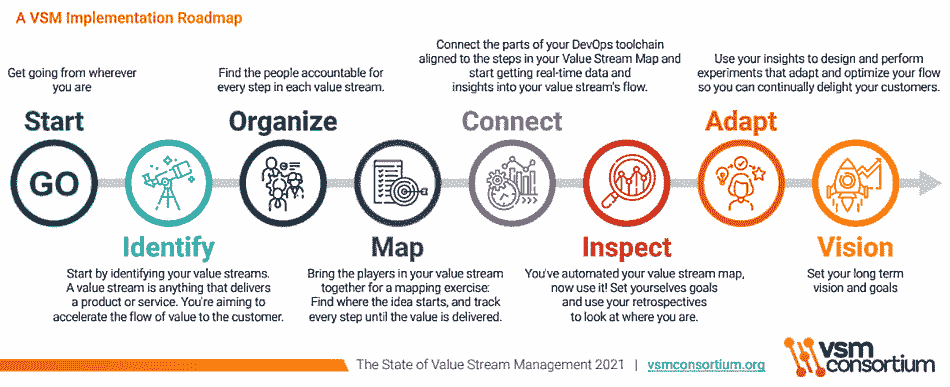
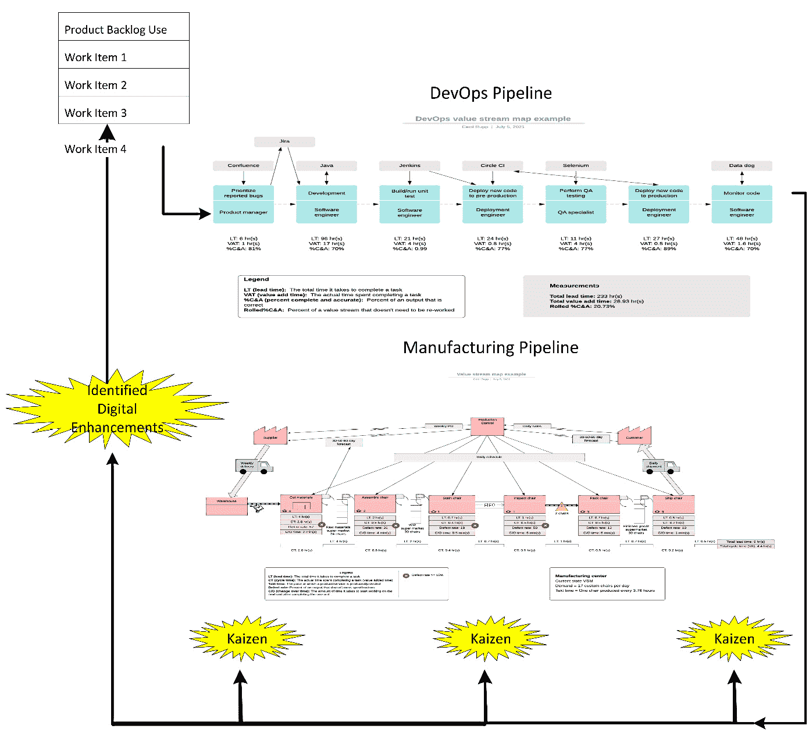
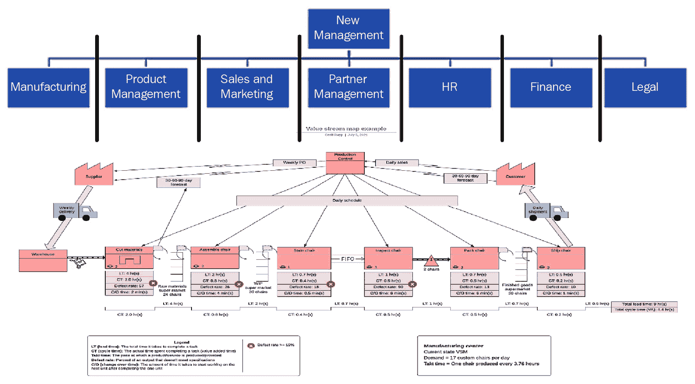
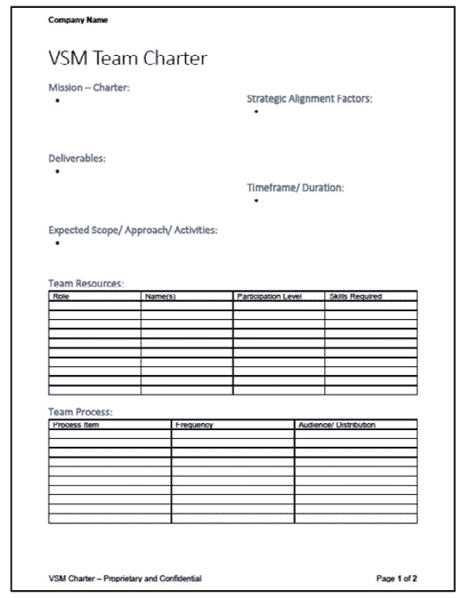
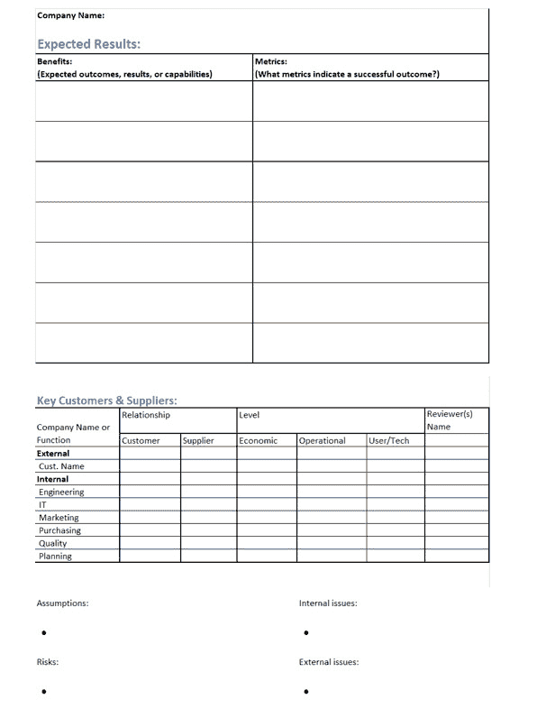
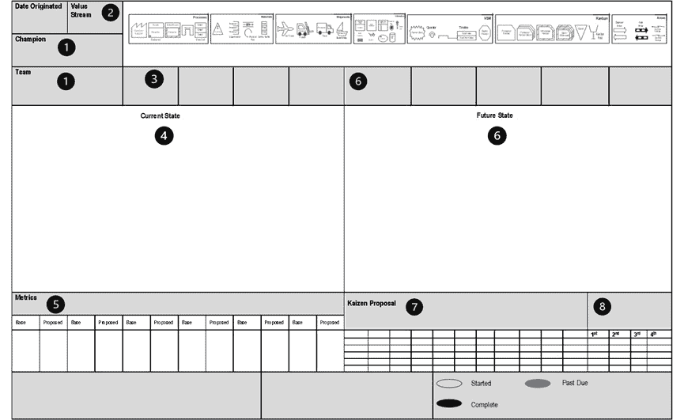

# 第十六章：通过 VSM 和 DevOps 转型企业

在这最后一章，您将学习如何使用**价值流管理**（**VSM**）和 DevOps 工具以及相关实施倡议，将企业转变为在数字经济中竞争的可行实体。但是数字转型有两个部分。在第一部分中，我们需要转变我们的软件交付能力，以支持组织整体的业务转型。在第二部分中，我们利用转型后的软件交付能力来改进我们跨价值流构建和交付产品的方式。

换句话说，我们必须通过 DevOps 相关的 VSM 倡议连接所实现的软件交付改进，以支持更广泛的企业 VSM 倡议的需求。但这种连接并不是自动的。从系统思维的角度来看，单独改进软件开发能力，而不考虑业务价值交付需求的交叉点，是一种局部优化。组织能够从其 VSM 和 DevOps 工具投资中获得足够的投资回报的唯一途径是利用其增强的软件交付能力来改进其跨组织的价值交付能力。

在本章中，您将学习如何将 VSM 和 DevOps 工具投资与公司战略和投资组合进行对齐。我们将逐步解决这个问题。考虑到这一目标，本章涵盖的主题包括以下内容：

+   统一 VSM 倡议

+   使用 VSM 改进 DevOps

+   连接企业 VSM 倡议

+   使用 OKR 推动业务转型

+   将 VSM 倡议与战略和投资组合对齐

+   扩展 VSM 工具行业的愿景

请注意，最后一个主题将为 VSM 工具行业引入未来愿景。读取当前 VSM 工具供应商的文档和新闻稿可能会让人相信，他们的工具能够提供跨所有价值流的端到端可见性的即插即用解决方案。但今天实际情况并非如此。现代 VSM 工具提供支持软件交付管道的活动的端到端可见性。VSM 工具的愿景可以在长远内扩展，以整合所有组织的开发和运营价值流。我将此主题包含在内，呼吁 VSM 工具供应商将这一愿景变为现实。

让我们开始理解如何通过 VSM 将我们的企业转变为具有竞争力的数字企业。我们将从讨论统一 VSM 倡议的意义及其重要性开始。

# 统一 VSM 倡议

精益概念并不新鲜。例如，可以认为亨利·福特的 T 型生产线体现了现代精益实践中应用的几个概念。例如，福特在汽车装配线上创造了连续流和流水线作业，并安排零部件在装配之前到达。但是，正是丰田的创始人和未来的领导人，主要是这三位个人：

+   **豊田佐吉** – 丰田公司创始人

    开发和实施了背后的概念**自动化与人类触摸** – 作为实现源头质量的手段。

+   **丰田喜一郎** – 佐吉豊田的儿子

    成立了*丰田汽车公司*，并开发了制造业的**即时制**（**JIT**）概念。

+   **大野耐一** – 车间监督、工业工程师和丰田公司高管

    将丰田的 JIT 系统与自动刹车系统相结合，定义了看板系统，并建立了持续改进背后的原则。大野还被认为定义了**丰田生产方式**（**TPS**）中的许多元素，如拉动式生产系统、消除浪费、**快速换模**（**SMED**）、非增值工作、U 型工作单元和单件流。

最终被称为*丰田方式*的理念对全球制造业竞争产生了深远影响，因此被广泛研究和复制，作为在日益竞争激烈的全球市场中生存的手段。**精益**这个术语源于由**麻省理工学院**（**MIT**）的**国际汽车项目**（**IMVP**）在**詹姆斯·P·沃马克**指导下进行的研究。IMVP 的研究人员约翰·克拉夫奇克创造了精益生产这个术语，这是 VSM 的核心。除了这些先驱之外，还有许多从业者和专家进一步扩展了精益生产实践的应用。

关键是，了解精益的人们已经了解价值流映射和 VSM，并将其扩展到其他组织发展和运营价值流的更广泛背景中。此外，他们已经应用这些方法数十年！

## 发展不同的客户为中心的发展战略

然而，在软件开发和 VSM 中，精益实践作为主流软件开发概念相对较新。而其他领域和行业则专注于精益生产实践，以提高其客户为中心的价值交付能力，软件社区则专注于实施基于敏捷的策略。尽管精益和敏捷实践都专注于改善客户导向的价值交付和持续改进，但敏捷的早期倡导者致力于解决不同的问题集。

例如，丰田在大萧条和第二次世界大战后，面临资源有限且昂贵的岛屿国家环境，致力于提高质量和效率。丰田在全球市场上的竞争力来源于用更少的资源制造更高质量的产品，并同时确保只生产客户在需要时才会购买的产品。他们在这方面的卓越表现使得世界其他制造行业不得不作出相应反应，以确保生存。其他行业也迅速跟随精益趋势。

相比之下，敏捷方法起源于软件开发社区，其倡导者解决的是一组不同的问题。具体来说，传统的项目管理模式未能充分响应企业及其客户不断变化的需求和优先事项。因此，敏捷方法作为一套价值观和原则开始，旨在支持小型软件开发团队更加敏捷和适应变化。在这个过程中，敏捷逐渐发展为一种实施迭代和增量开发的实践，利用原型设计和经验主义，以便快速创建具有客户导向输入的可工作解决方案。

但现在，我们看到精益和敏捷背后的概念开始融合，通常表现为实施精益-敏捷实践。这个话题至关重要，因为精益-敏捷是 VSM 联盟在实现 VSM 工具作为提升基于 DevOps 的软件交付能力的手段时所依据的方法论。我们将在接下来的章节《*使用 VSM 进行 DevOps 改进*》中讨论这个问题。然而，在我们进入这一话题之前，先来回顾一下现代 VSM 工具行业在使用“VSM”一词时的含义。

## 将 VSM 定义为现代软件工具类别

在现代语境下使用时，VSM 是一种工具驱动的策略，旨在支持 VSM 实践，实现跨 CI/CD 和 DevOps 管道活动的精益改进。在互联网上进行简单搜索可能会让我们认为这就是 VSM 的唯一含义，因为有关 VSM 的最新信息主要来自 VSM 和 DevOps 工具行业。

例如，Forrester 在其《New Wave™》文章《*价值流管理工具 Q3 2018*》中，定义了 VSM 如下：

VSM 是一种新兴的工具类别，它将一个组织的业务与其软件交付能力连接起来。VSM 工具为多个角色——产品经理、开发人员、质量保证（QA）人员和发布经理——提供了规划、健康指标和分析视图，帮助他们更有效地协作，减少浪费，专注于为客户和企业创造价值的工作。

然而，请回想本书的*第一部分*，*价值交付*，和*第二部分*，*VSM 方法论*，介绍了 VSM 作为通用精益改进策略和方法论的原始概念。区分传统 VSM 和现代 VSM 概念至关重要，因为这两种 VSM 方法的融合是将我们组织资源对齐以在数字经济中竞争的最佳方式。牢记这一理解后，我们现在可以学习如何以及为什么必须融合传统和现代 VSM 概念。

# 使用 VSM 改进 DevOps

在*第五章*，*通过 DevOps 管道推动商业价值*，你学习了如何将通用的八步 VSM 方法应用于任何 VSM 改进计划。我们在*第六章*，*启动 VSM 计划（VSM 步骤 1-3）*，到*第十章*，*改进精益-敏捷价值交付周期（VSM 步骤 7 和 8）*的 CI/CD 管道改进用例中使用了相同的八步方法。没有理由我们不能使用相同的八步方法来指导 DevOps 管道改进。

然而，VSM 联盟建议对与 DevOps 活动和工具链相关的 VSM 实施采取略有不同的路线图，如下图所示：

图 16.1 – VSM 联盟 – VSM 实施路线图

在 VSM 实施路线图中，你可以看到与精益和敏捷改进概念的相似之处。事实上，它是这两种实践的结合。

## 实施 VSM 路线图中的精益部分

VSM 联盟的 VSM 实施路线图首先通过识别价值流、定位并组织负责各个价值流活动的人员，绘制当前状态和理想未来状态，并将 DevOps 工具链与价值流中的活动连接起来。然后，根据所使用的**价值流管理平台**（**VSMP**），DevOps 工具链集成可以承担多个角色，包括集成、自动化和编排跨软件开发、安全和合规的价值流活动。

然而，较大的目标是使用 VSMP 及其与 DevOps 工具的集成，捕获跨已识别软件交付价值流的实时端到端数据。通过使用统一且标准化的数据模型，价值流经理、团队成员、组织高管以及其他相关人员能够实时查看软件生产流，进而观察并确定瓶颈和等待的原因。

因此，VSM 联盟的 VSM 实施路线图与通用的八步 VSM 方法论之间的主要区别在于，集成软件工具以捕捉价值流中的端到端数据，而无需人工干预或手动数据收集。另一个关键的区别在于使用分析工具，我们将在接下来的子章节中讨论这一点。

## 实施 VSM 路线图中的敏捷方面

VSM 联盟的 VSM 实施路线图中的接下来的两个步骤涉及**检查（inspection）**和**适应（adaption）**。Scrum 倡导者会立刻识别出这两个步骤，源自 Scrum 的三大经验性支柱：**透明性（transparency）**、**检查（inspection）**和**适应（adaptation）**。

在前面的子章节中，你已经了解了 VSMP 产品如何支持价值流活动的集成、自动化和协调。但这些工具也为我们提供了在 DevOps 管道中工作和信息流的可视性。因此，虽然这个术语没有明确提到，VSM 联盟并没有忽视 Scrum 的透明性*（Transparency）*支柱。VSM 工具行业的独特之处在于，它通过其平台和工具取代了手动收集和报告数据的方式，这在 VSMP-DevOps 工具链集成的*连接（Connect）*步骤中得以实现。

既然我们可以实时看到 DevOps 管道流的可视性，DevOps 团队可以*检查（Inspect）*管道，以便通过准确和当前的信息来指导他们的回顾会议。我们可以利用从检查和回顾中获得的见解，提出一个或多个潜在解决方案的假设，并进行实验，评估所识别的替代方案对我们目标的有效性。最后，我们可以根据我们的经验性发现来*适应（Adapt）*我们的 DevOps 系统。

因此，从*启动（Start）*到*适应（Adapt）*步骤，VSM 实施路线图将精益（Lean）和敏捷（Agile）的最佳实践结合成一个无缝的框架。这将我们带到最后一步——*愿景（Vision）*。事实证明，这是精益-敏捷实践中的一个关键步骤。

## 建立业务转型愿景

回想一下，敏捷是由软件工程师和顾问们发展而来的一套价值观和原则，目的是更快速地响应客户需求和优先事项的变化。但敏捷的演变主要是作为一种面向小团队的开发哲学，在每次开发迭代中评估增量变化——基于团队从上一轮 Sprint 中获得的经验。换句话说，基于敏捷的改进往往局限于非常短期的计划周期——一般在 1 到 4 周之间，并且仅限于开发团队所获得的预算和权限。

相较之下，精益改进通常会看到跨多个规划周期的变化，这些周期可能跨越多个财政年度，涉及需要高层支持和承诺授权的变更和预算。事实上，VSM 和 DevOps 工具的投资涉及组织投资、业务运营和文化变革，这些是小型软件开发团队无法授权的。因此，这种规模的投资必须支持业务战略，获得高层支持，并符合组织层次的投资和优先事项。

因此，作为 VSM 实施步骤的*愿景*变得至关重要，它有助于将 VSM 和 DevOps 实施目标与业务战略对齐，以获得高层支持并优先分配预算。而实现这一目标的唯一途径是高层看到软件交付的改进如何改善公司在所有组织价值流中的产品交付。

现在我们已经理解了精益和敏捷概念在作为工具和 DevOps 驱动的软件交付改进策略的*VSM 实施路线图*中的结合方式，让我们退一步，来看一下人员在这些工具的实施和使用中的重要性。

## 实施工具并不能替代人员

拥有实时数据访问权限来监控 DevOps 管道并不能取代高层管理人员和经理进行*Gemba*巡查的必要性，特别是在涉及多个团队的大型软件开发项目中。执行日常工作的人员对工作如何进行、为何如此以及哪些问题干扰他们的工作流程最为了解。在现代 VSM 工具的背景下，Gemba 巡查是探索性的活动，可以包括虚拟和面对面的数据收集与沟通活动。

类似于在*第七章*中的*去现场看（Gemba）*部分对 Gemba 的解释，VSM 成员、VSM 经理和高层可以与 DevOps 团队成员进行对话，提出以下问题：

+   让 DevOps 团队成员描述他们在当前软件开发工作中遇到的问题。

    - 注意，大多数人倾向于避免讨论困难的主题，或表达他们认为别人不想听的观点。

    - 经理需要深入挖掘，以超越表面显现的、容易看见的问题，找到影响团队表现和软件交付的真正问题。

+   接下来，询问团队成员他们认为问题的根本原因是什么，并提供证据来支持他们的推理（**透明性**）。

+   当根本原因被揭示出来后，接下来，询问 DevOps 团队成员应该采取什么措施来解决这些问题，以及原因是什么。

+   然后询问 DevOps 团队成员他们如何知道问题是否已经解决。

    - 什么证据可以清晰地表明问题已经解决？

    - 什么数据和指标可以作为成功结果和改进的指示器？

+   最后，通过实验和检查调查推荐的替代解决方案，并适应提供最大价值的方法。

你现在理解了管理者和高管们走出去看看实际情况的重要性，以及他们必须向 DevOps 团队成员提出的那些问题。但是，在许多情况下，问题可能需要专业技能和团队合作来解决。在这种情况下，组织应建立一个 VSM 团队来进行分析并管理 VSM 计划。

## 创建一个 DevOps 转型的 VSM 团队

创建一个 VSM 团队，就像我们为任何其他类型的 VSM 计划所做的那样，帮助引导 DevOps 导向的软件交付价值流改进投资和活动。此外，涉及多个开发和支持团队的大型软件产品，使得建立一个专门的 VSM 团队来指导整体计划变得至关重要。

也有可能，非 IT 的 VSM 团队——即指导组织的开发或运营价值流改进的团队——会识别出需要改进或调整软件开发交付能力，以支持其价值流的需求。在这种情况下，原始 VSM 团队可以指导其价值流的 DevOps 导向改进，但他们的团队也必须包括 DevOps 活动和工具方面的专家。

无论组织采取哪种方法，VSM 团队都负责引导软件交付能力的改进，以满足价值流的需求。当指定的 VSM 团队支持组织的一个开发和运营价值流作为其 VSM 计划时，这种对齐更容易实现。

相反，支持 DevOps 作为独立价值流的 VSM 团队必须认识到，他们最终必须将 DevOps 团队对准，以支持其他组织价值流中的高优先级改进。通过类比来说，如果你不知道自己要瞄准什么，那么很难命中目标。所以，面向 DevOps 的 VSM 团队可以承担这个责任，与组织的投资组合经理、产品负责人以及其他价值流经理合作，识别高优先级的软件开发需求。

本小节总结了我们关于使用 VSM 进行基于 DevOps 的软件交付能力改进的讨论。在下一节中，我们将探讨 DevOps VSM 计划如何支持组织的数字业务转型。

# 连接到企业 VSM 计划

在本节中，您将学习如何将传统 VSM 方法与现代 VSM 工具应用和 DevOps 结合起来，以支持数字化商业转型。您在本书中已学到，组织可以使用现代 VSM 工具来提升基于 DevOps 的软件价值交付能力。然而，组织也可以并且应该继续实施传统 VSM 计划，以识别所有其他组织价值流中的数字化改进机会。

让我们看一下*图 16.2 – DevOps 管道为制造管道流程提供数字化改进*，以展示这一策略是如何运作的。在这个场景中，传统的 VSM 计划已经在制造导向的管道中识别出了三种潜在的数字化改进（Kaizen Bursts）。对于这个例子而言，它们可能是什么并不重要，但它们可能包括以下任何类型的数字化改进：

+   改进制造管道活动中的产品订单和材料信息。

+   改进车间/制造过程信息的获取。

+   重新编程机器人和自动化制造系统，以提高性能或减少设定时间。

+   实施自动化质量检查系统。

+   在自动化喷漆过程中实施编程。

+   改进标签和运输指令与产品的一致性。

+   改进供应链管理系统，以支持准时交货（JIT）需求。

+   其他数字化增强。

VSM 团队与 DevOps 团队会面，解释他们的需求和优先级，并将这些信息纳入他们的产品待办事项列表。DevOps 管道在技术上可以处于任何成熟阶段。不管怎样，根据优先级，经过批准的数字化增强会通过管道进入生产，并且在制造产品线的生命周期中必须得到支持，并可能进行修改：

图 16.2 – DevOps 管道为制造管道流程提供数字化改进

在组织传统 VSM（价值流图）计划中，优先级的 Kaizen Burst（改进机会）跨越所有开发和运营价值流，提供了必要的信息，帮助理解数字化转型对企业运营产生最大正面影响的地方。在这个例子中，组织将 VSM 方法作为精益导向的改进技术，战略性地用于识别、评估和优先考虑通过数字化转型消除浪费、精简价值流活动的地方。

阅读完本书后，你应该完全意识到，战略性 VSM（价值流映射）举措识别了许多改善机会，用以消除浪费并简化价值流流程，其中一些可能并不需要基于软件的解决方案或增强功能。然而，软件及相关的计算和网络系统在我们的数字经济中，是大多数产品和价值流改进的核心。我们使用 VSM 工具来改善 DevOps 流水线，以支持在所有其他组织 VSM 举措中识别出的数字化改进需求。

我们可以将我们改进后的 DevOps 软件交付能力，应用于消除浪费并简化所有组织价值流的流程。然而，更常见的情况是，正是那些战略性 VSM 举措帮助组织识别战略性改进机会——无论是数字化的，还是其他形式的。这些建议最终需要执行层的支持，并考虑由精益投资组合管理功能对投资优先级的决策。

假设一个软件开发团队或价值流经理采取捷径，绕过组织的预算审批流程，在这种情况下，他们将无法获得成功所需的管理和财务支持。一个小型开发团队可能会找到为其 DevOps 实施提供独立资金的方式，但这不是一个可扩展的过程。而且他们可能无法提供足够的价值来证明其努力的意义或证明扩展其努力的合理性。

正如本章介绍中所讨论的，单独改善软件交付能力，而不考虑其他组织价值流需求，从系统思维的角度来看是一种局部优化。我们可能会花费大量的时间、精力和资金，却看不到合理的投资回报。

下面是一个说明为何会这样的问题的例子。一个完全集成、自动化并协调的 DevOps 流水线的测量周期时间可精确到微秒——这是你的连接 VSM 工具很快会指出的。大部分的整体交付时间延迟来自于与产品概念化、需求和设计相关的*模糊前端*活动。但一旦需求、验收标准和设计问题得到解决，且一个特性进入生产阶段，大多数周期时间事件可以在几分钟或更短的时间内测量出来。

因此，成熟的基于 DevOps 的软件开发流水线不会成为组织价值流中的瓶颈。当然，前提是 DevOps 流水线改进活动已经解决了工具的预算和审批问题，并为建立测试环境和执行 CI/CD 流水线活动创建了可重用的配置。

初始的 DevOps 管道改进活动没有任何快速或容易的步骤。组织的 IT 职能需要投入时间和资源。它们还需要获得高层支持和认可，以便在整个企业范围内扩展 DevOps 能力。

在以下列表中，展示了 DevOps 增强软件交付如何支持组织的商业目标的三种一般场景：

+   生产独立的软件产品——为外部客户提供

+   对物理产品的改进——例如现代汽车中的导航和控制系统

+   价值流改进——提升跨操作价值流的价值交付能力

上述列表的目标并不是将软件产品与价值流混为一谈。相反，目的是指出软件在所有类型的开发和操作价值流中的普遍存在。

我在本书中反复强调这一点，以使其明确：我认为组织必须始终进行两个平行的 VSM 努力：

+   改进软件交付能力的 VSM 举措

+   支持企业精益改进的 VSM 举措

企业资助的 VSM 举措贯穿所有开发和组织价值流，以支持持续的精益改进——其中一些/许多将需要数字化增强，以实现所需的增值变化。因此，虽然软件交付的 VSM 改进至关重要，但这些改进的真正价值来自于将软件交付与支持跨企业的数字化改进对齐。这些改进机会通过企业资助的 VSM 举措，在组织的价值流中被识别并优先排序。

此外，VSM 团队及其举措应重点识别 IT 可以改善产品价值、消除浪费和改进价值流流动的领域——分配的 DevOps 团队可以帮助进行这些评估。软件行业越来越意识到与产品团队和价值流对齐的重要性。例如，VSM 联盟的初步报告（预计于 2021 年 7 月发布）发现，近 40%（37.36%）的受访者报告称他们在一个产品、功能、组件或流对齐团队中工作：[`www.vsmconsortium.org/`](https://www.vsmconsortium.org/)。

现在你已经知道如何将基于 DevOps 的 VSM（价值流管理）举措与组织的其他价值流对齐。在接下来的两个部分中，你将学习如何通过组织的战略**目标与关键成果**（**OKRs**）和投资组合管理，与这些其他价值流进行连接。我们将从 OKRs 的讨论开始。

# 使用 OKRs 推动业务转型

OKR 背后的概念由英特尔前首席执行官安迪·格罗夫（Andy Grove）创造，他将公司转变为世界上最大的半导体公司。OKR 的早期倡导者首先是在英特尔，随后是其他科技公司，包括谷歌。英特尔和谷歌使用 OKR 的过程被约翰·多尔（John Doerr）在《*衡量重要事项*》一书中记载（Doerr, 2017）。

约翰·多尔在离开英特尔成为 Kleiner Perkins 风险投资公司的合伙人之前，曾作为英特尔的员工了解并学习了 OKR 的使用。在 Kleiner Perkins 工作期间，他将 OKR 背后的原则教授给了他投资的公司，包括谷歌。

OKR 的概念相对简单。**目标**陈述了组织要实现的事项，而**关键结果**是我们设定并监控的成功结果的目标指标。OKR 不仅仅是一组目标和衡量标准，它们还是一种管理方法和框架，旨在集中公司的努力。

结果必须是可量化、可衡量且可验证的。换句话说，我们使用实际数字来阐述目标，而不是模糊的文字，无法衡量或证明。简而言之，通过明确的 OKR，组织内部对于是否达成目标没有任何疑问。

OKR 也有时间限制，通常是按季度设定目标，尽管一些组织可能会设置按月目标。也有可能设定长期目标，可能会跨越一年或更长时间。但关键结果通常是按季度进行监控和汇总的。

OKR 不是隐藏的，它们对所有员工和利益相关者都可见。如果人们不知道组织的目标是什么，他们怎么知道自己要去哪里，也不知道是否已经到达目标？OKR 指导每个人的努力方向。

OKR 的目标并不意味着容易达成。相反，它们应该是可以实现的，但也具有挑战性。正如前面所述，目标需要具体、明确、可量化且可见。理想的情况是设定具有挑战性的目标，通过激励组织中的每个人来实现伟大的成就。

到现在，你可能会想，为什么我们在一本关于应用 VSM 和 DevOps 方法与工具的书中讨论 OKR。答案是，OKR 有助于推动公司战略、投资组合优先级和投资决策，最终推动 VSM 指标的实现。

例如，一个公司目标可能是推出一个新的软件产品增强功能，以支持一个细分市场机会。我们的可衡量的**关键结果**（**KRs**）可能包括以下内容：

+   **KR #1**：在下一个季度内开发三个必需的功能。

+   **KR #2**：在相同时间内，进行一次有针对性的营销活动，将产品增强功能推广给 20,000 名合格潜在客户。

+   **KR #3**：在发布后的第一个月内销售 100 个新软件许可证，并在第二季度末总共销售 400 个许可证。

你注意到只有*KR #1*与软件开发相关吗？另外两个涉及销售和市场支持，这是组织运营价值流的一部分。这种情况在任何战略 VSM 计划中都是典型的。

我们可能会包括其他关键成果来描述转售商或其他价值流改进目标和预期结果。通常，一个 OKR 会有 3 到 5 个关键成果。

组织使用的另一组重要指标是**关键绩效指标**（**KPIs**）。理解 KPI 和 OKR 之间的区别至关重要。例如，KPI 关注个人、团队或一组人在其目标上的表现衡量。因此，KPI 通常侧重于战术目标，而 OKR 则支持战略目标。

以之前的例子为例，我们战略性地推出了一款新产品变种，以开拓一个新的市场细分。关键成果帮助组织理解期望值。但它们也提供了哪些价值流受影响最大的一些线索。我们现在可以使用 VSM 计划来指导为实现目标所需的改进工作。

# 将 VSM 计划与战略和投资组合对齐

VSM 计划支持战略目标和任务。无论 VSM 团队是否在通过实施 DevOps 管道能力评估软件交付的改进，还是在进行其他组织价值流的改进，它们都是战略性的，因为许多识别出的改进机会将涉及超过小型价值流团队能够授权的投资和时间框架。

首席执行官不会支持与公司使命、愿景和战略不一致的大额投资。较大的企业（或应该）会比小型实体拥有更正式的预算程序。但无论大小，首席执行官都必须拥有评估和优先排序投资的机制。从这个角度看，VSM 和 DevOps 工具的投资与组织内其他潜在投资进行竞争应该是显而易见的。

由于这是一本关于 VSM 而非投资组合管理的书籍，我们将简要触及这一话题。然而，投资组合管理的主要目的是集中和控制预算及投资流程，以便组织能够在公司战略背景下评估所有改进机会及其优先级。

改进机会本质上倾向于以项目为导向。换句话说，它们的特点是具有相对较短的持续时间，并且有明确的开始和结束日期。工作通常是相对独特且独立的，作为一次性变革的努力。高层管理者根据投资回报标准做出预算和优先级决策，因此改进项目具有明确的时间表、资源和预算限制。

结果，组合管理实践通常会衍生出传统的项目和计划来管理已批准的工作。然而，随着精益-敏捷实践的推进，组织开始实施精益组合管理概念，例如由 Scaled Agile Framework®（SAFe®）实施的概念。具体来说，SAFe 的精益组合管理过程将精益和系统思维方法应用于战略和投资资金、敏捷组合操作和治理。

现在，你对如何通过组合管理方法来评估、优先排序和批准预算，以支持组织在 VSM 项目中识别的改进机会有了一个基本的理解。你也知道如何应用 VSM 方法和工具来改善整个组织的价值交付。现在，让我们继续了解无论我们 VSM 项目多么成功，如果没有持续的高层支持、培训以及精益导向的改进，如何随着时间的推移而失败。

# 了解 VSM 项目如何随着时间的推移而失败

在为这本书进行研究时，我与**LeanFITT**™的创始人之一 Todd Sperl 进行了对话，这次对话既有趣又令人不安。他指出了几个例子，其中一个组织对价值流图（VSM）项目进行了投资，并且取得了很大的、有时甚至是非常出色的成果，然而几年后，整个项目却分崩离析。此外，他还提到，当组织开始失败时，通常失败的速度和程度会比它们成为高效企业时的转型速度更快、更严重。事实上，它们往往最终表现得比刚开始实施精益之前还要差。这是怎么发生的呢？

我与 Todd 和后来与 PMI FLEX 开发者 Al Shalloway 讨论了这个话题。这是一个有趣的现象，可能需要专门的研究才能完全理解。但一个共同的因素似乎是新管理层进入后没有理解组织如何改变其实践、行为和文化，以支持更好的水平流动和价值交付。

有时，新管理层是通过收购进入的。换句话说，精益公司取得的成功使其成为收购目标。然而，新高管们未能意识到精益导向的操作和结构对其成功的贡献。

相反，新的高管往往更熟悉并且更愿意管理围绕传统业务职能和领域（如市场营销、销售、制造、人力资源、法律、会计、运输和仓储）形成的垂直孤岛。而且，跨领域的价值水平流动很难被看到；看起来也比管理与业务领域和职能对齐的资源更难管理。

*图 16.3* 将价值流图的水平流动与传统的垂直组织结构图叠加。再一次，很容易看到，这两种管理组织的方式并没有直接的关联：

图 16.3 – 垂直组织结构与水平工作流对比

结果，回归管理垂直孤岛而不是管理产品流动，对于组织的表现是一个立即致命的打击。首先，不同小组之间的壁垒迅速建立，这些小组必须协同工作，以维持水平价值交付流动。然后，支持水平活动流动的流程迅速瓦解并失败。此时，组织在隐喻上会发现自己回到不断扑灭无法熄灭的火源的状态。到那时，事情已经如此严重，以至于组织开始大规模地失败。

我们永远无法在垂直孤岛中解决价值交付问题。相反，我们必须建立水平协作并改善工作和信息流动，而这一过程需要时间和努力才能完成。但如果适当执行，除了继续沿着管理以产品为导向的水平流动的路径前进之外，没有合理的理由回到管理垂直领域。

通过类比，尽管建造一座建筑可能需要数月甚至数年的时间，但我们可以通过爆破和重型设备在几个小时内将其摧毁。那些回溯实施传统管理实践和垂直职能孤岛的管理者，带来了爆破和重型设备，迅速摧毁了我们的精益生产流程。

对新高管、股东和董事会成员来说，最重要的学习点是：在收购已经运作良好的精益导向公司时，要小心。他们必须花时间理解它为何以及如何运作，然后再强加新的管理结构。

本节完成了我们关于融合传统和现代 VSM 计划以支持业务转型的讨论。然而，在结束本书之前，让我们探讨一下 VSM 工具行业的潜在未来状态，以及所有组织从这种新的、扩展的视野中应用 VSM 工具所能获得的好处。

# 扩展 VSM 工具行业的视野

我对 VSM 的最终愿景是，传统的 VSM 方法和现代的基于 VSM 工具的概念能够结合起来。事实上，我认为这对 VSM 工具行业来说可能是一个巨大的推动力。我们可以不再将它们的使用局限于改善基于 DevOps 的软件交付价值流，而是利用相同的集成、自动化和协调能力，跨所有组织的价值流进行应用。

例如，将当前支持数据捕获和规范化软件交付流水线活动的数据的 VSM 工具视角，扩展到也能够提供跨所有价值流的端到端可视化和分析，这将有多难？这种策略意味着 VSM 工具供应商需要创建扩展功能，帮助他们的客户开发应用程序和集成，监控和捕获跨其他类型开发和运营价值流及其活动的数据。

大多数制造公司已经使用商业和定制软件应用程序来控制生产流程。过程控制系统在高度集成、自动化和大批量生产环境中尤为重要。

在*第二部分*，*VSM 方法论*中，我质疑是否需要为 IT 制定单独的 VSM 方法，并且这种方法与支持其他开发和运营价值流的 VSM 方法有所不同。我同样质疑是否需要一套不同的工具来捕获数据、进行规范化和分析跨不同价值流的数据。在我们的数字经济中，我们需要将 VSM 概念和工具能力应用于所有组织的价值流。工具的聚合将使得实时访问数据成为可能，并提供从概念到价值交付/现金的端到端可视化和分析。

# 摘要

在本章的最后，你已经学习了如何将传统的价值流图（VSM）方法与通过基于 DevOps 的 VSM 方法和工具所做的改进结合起来，以提高组织在现代数字世界中的竞争力。虽然许多 VSM 工具供应商让人觉得他们的 VSM 工具能够提供跨所有价值流的端到端可视化，但实际上它们主要关注 IT 导向的价值流。这并不是坏事，因为 DevOps 流水线复杂且昂贵，且在企业规模上构建需要耗费大量时间。

但你也已经了解到，在没有理解它们对整个系统的影响的情况下，单独对任何价值流进行改进实际上是一种局部优化。这意味着，我们可能会在提升基于 DevOps 的软件交付能力上花费大量时间和金钱，但却没有推动组织提升整体的价值交付能力和盈利能力。

我们必须调整我们改进的软件交付能力，以支持组织价值流的需求。这正是更大的投资回报所在。事实上，如果这种对齐不发生，IT 组织将难以获得执行层面的支持，无法在企业范围内大规模维持这一倡议。因此，在本章中，您学到了必须通过组合管理过程将 VSM 和 DevOps 工具投资与公司战略对齐。您还必须调整您改进的 DevOps 流水线，以支持组织其他价值流及其 VSM 倡议中确定的数字改进机会。

# 问题

1.  VSM 和 DevOps 工具及其相关实施倡议的常见用途是什么？

1.  是或否：精益和 VSM 是新概念。

1.  丰田领导人在演变今天我们称之为精益生产的概念时，面临了什么问题？

1.  软件社区通过敏捷软件开发宣言背后的价值观和原则旨在解决的问题集是什么？

1.  VSM 实施路线图的哪三个步骤与本书介绍的通用八步 VSM 方法最为密切相关？

1.  VSM 实施路线图中的哪一步骤有助于在 DevOps 流水线中提供可见性？

1.  敏捷和精益的常见改进视野和管理层级是什么？

1.  将 VSM 或 DevOps 工具链的实施与评估其他价值流的改进隔离开来，这是什么的例子，我们为什么关心？

1.  为什么我们关心组合管理的目的是什么？

1.  为什么一些先前非常成功的精益导向组织随着时间的推移会失败？

# 进一步阅读

+   Doerr, John (2017), *衡量重要的事情。OKRs – 推动 10 倍增长的简单理念*，The Bennet Group, LLC，由 Portfolio Penguin, Random House LLC，伦敦，英国出版。

# 附录 A – VSM 宪章

附录 A

# 附录 B – VSM 故事板

附录 B
