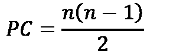

# 评估

你可以在这里找到所有章节末尾问题的答案：

# *第一章*：提供以客户为中心的价值

1.  数字增强技术现在使得组织能够通过互联网和移动技术进行商业活动，同时提供近乎实时的全球信息和基于知识的服务访问。此外，产品还通过**物联网**（**IoT**）进行通信并获取更新。

1.  问题在于人类有一个恼人的习惯，那就是在彼此之间使用相同的术语，但却对这些词的含义有着截然不同的理解。术语的不同语义使得人与人之间以及人与计算机之间的沟通变得非常具有挑战性。

1.  组织在给定时间范围内向一组预定客户交付的所有经验（包括价格）的组合，以换取客户购买/使用或以其他方式做出组织期望的行为，而不是选择某个竞争替代品。

1.  每个人。

1.  因为在竞争激烈的市场中，你会被那些关注市场并提供更具客户价值的竞争对手迅速超越。

1.  价值流是从头到尾的一系列活动，这些活动为客户创造结果。

1.  特性和功能是功能性和非功能性需求的实现，而价值流是促成这些交付的活动。

1.  VSM 实施的方法和工具帮助组织通过优化其 IT 价值流中的工作流程，增加他们向客户交付的价值。

1.  a. 战略到投资组合——推动 IT 投资组合实现业务创新。

    b. 部署要求——在业务需要时构建所需的内容。

    c. 请求到完成——目录、完成并管理服务使用。

    d. 发现并纠正——预测并解决生产问题。

1.  a. 在数字经济中竞争的基本要求

    b. 加速 IT 价值交付

# *第二章*：在精益敏捷基础上构建

1.  Scrum

1.  扩展敏捷框架

1.  将企业战略与投资组合、产品和架构维护需求相结合，并确定在多个规划周期中的资金优先级。

1.  这四项中的任何两项：产品待办事项、逃逸缺陷、部署失败、发布**净推荐值**（**NPS**）

1.  a. 可视化工作流

    b. 限制**在制工作**（**WIP**）

    c. 管理流程

    d. 明确政策

    e. 征求反馈

    f. 为持续改进生成创意

1.  理想的精益生产目标是将每项活动和整体生产速率与接收的客户订单或需求速率匹配。

    我们可以将其计算为生产工作项所花费的时间除以在该时间间隔内请求的项数，也就是 Takt 时间。

1.  一个线性顺序过程，没有反馈回路。

1.  我们可以通过实施精简、集成和自动化策略来加速价值交付。

1.  a. 等待 – 处理过程中的延迟，包括产品在等待或排队时所花费的时间

    b. 过度生产 – 生产超出需求的数量，或生产客户当前不需要的产品

    c. 过度加工 – 过度处理或进行任何非增值活动

    d. 运输 – 将产品和材料从一个地点移动到另一个地点所浪费的时间、资源和成本

    e. 运动 – 不必要的移动，或者人的活动

    f. 库存 – 存储和携带任何未进行增值活动的材料和产品

    g. 缺陷 – 产品或服务中存在的故障

1.  敏捷方法论通常采用**迭代和增量开发（IID）**哲学。尽管最小化，但 IID 方法仍然是一种批量处理形式。相比之下，精益追求实现持续流动，理想情况下是单件流。

# *第三章*: 分析复杂系统交互

1.  系统思维是一种评估大型系统复杂性的方法，不是将其视为独立部分的集合，而是通过评估参与系统的元素之间的相互作用来进行分析。

1.  故意和无意的。

1.  用于确定系统交互的因果关系及其影响。

1.  一种评估系统中元素之间复杂相互关系和交互的建模技术，以实现强化或平衡行为。

1.  一个线性顺序的过程，没有反馈回路。

1.  

# *第四章*: 定义价值流管理

1.  **价值流管理**（**VSM**）本质上是将精益概念在组织内实施，并使精益开发和交付过程成为一种生活方式。

1.  材料和信息流映射。其意义在于，信息流的识别和管理与材料流同样重要，尤其在精益价值流中。

1.  精益价值始终流向下游客户，任何前置活动都属于上游。

1.  同样的概念适用于每个价值流。离客户最远的活动总是被视为上游活动，而那些离客户最近的活动则被视为下游活动。

1.  真实的。价值流包括组织在将产品从概念到推出过程中所涉及的所有创造价值和非创造价值的活动。

1.  “一个端到端的活动集合，为‘客户’创造结果，客户可以是最终客户或价值流的内部‘终端用户’。”

1.  开发价值流 – 从概念到推出所需的所有行动，包括创造价值和非创造价值的活动

1.  运营价值流 – 从订单到交付的所有活动。

1.  价值流包括处理客户信息所需的活动，以及在产品到达客户的过程中转化产品的行动。

1.  它们是：

    i. 承诺精益

    ii. 选择价值流

    iii. 学习精益

    iv. 绘制当前状态

    v. 确定精益指标

    vi. 绘制未来状态

    vii. 绘制未来状态 – 客户需求

    viii. 绘制未来状态 – 持续流动

    ix. 绘制未来状态 – 平衡

    x. 制定 Kaizen（持续改进）计划

    xi. 实施 Kaizen 计划。

1.  沟通、管理、设定适当的起始条件、维持和工具。

1.  帕累托原则（也称为 80/20 法则和帕累托法则）是一种自然现象，指出在任何系统中，大约 20%的元素会产生 80%的影响。在 VSM 计划的背景下，一些价值流的改进对组织的即时成功比其他改进更为关键。为了做出这种评估，VSM 团队需要收集关键的精益指标，涵盖所有价值流活动中的生产率和浪费。

1.  确定并命名价值流的首尾活动。例如，常见的面向开发的价值流包括从概念到发布、从原材料到成品、从订单到现金。

# *第五章*：通过 DevOps 管道推动商业价值

1.  DevOps 起初是敏捷系统管理中的一种协作策略。最初的目标是改善开发和运营团队之间的沟通与协作，特别是在 IT 组织内部。最终，CI/CD 管道解决了开发和运营团队之间速度不匹配的问题。

1.  配置管理、任务管理/自动化、容器化

1.  CI 强制执行将所有开发人员的工作副本几次合并到共享代码库中的纪律。

    其目的是通过软件构建和测试过程，验证每次增量代码集成的功能，当代码被开发时进行验证。

    目标是确保主软件代码始终有效，并处于潜在可部署状态。

1.  软件开发人员在变化的世界中茁壮成长，持续交付新功能和新能力。这是件好事，因为客户和用户希望获得能够带来价值的新功能。而系统管理员并不特别喜欢变化，因为他们的责任是确保所有的网络、系统和应用程序都能正常运行、保持稳定并且安全。这也是件好事，因为我们需要我们的网络和软件正常运作并保持安全。

1.  持续交付能力使得产品团队能够快速适应新环境并快速测试新的代码更新，最小化，甚至无需人工干预。

1.  CD 的主要目标是将新更新转变为常规和高效的任务，开发团队可以按需执行。

1.  IaC 允许开发人员使用编程或脚本语言生成可重复的代码或脚本指令来提供 IT 基础设施。安装在共享存储库中，IaC 允许开发人员通过自服务模型按需启动新服务器。

1.  CaC 的目的是促进应用配置在不同环境之间的版本化迁移。

1.  “工具链”一词指代支持 IT 价值流活动的一系列工具。但“工具链”一词本身并不一定意味着集成或自动化策略。

1.  “管道”一词意味着流动。在精益导向的生产哲学中，我们希望工作和信息在 IT 价值流中的流动是精简且高效的。

1.  SDLC 和 ITSM 价值流，或者 CI/CD 和 ITSM 价值流。

1.  ITSM 关注的是 IT 团队如何提供服务。与此相反，ITOM 关注事件管理、性能监控以及 DevOps 管道中的操作部分所描绘的运营流程所使用的活动和工具（*图 5.7*）。

1.  基于项目的资金分配建立在对未来投资回报的预测之上。

1.  基于产品的资金模型评估当前的成本和收入，以评估应该在开发和运营支持中投资多少钱。

# *第六章*：启动 VSM 倡议（VSM 步骤 1-3）

1.  在组织内部实施精益概念，并使精益开发和交付过程成为一种生活方式。

1.  精益公司比其他公司更具竞争力，因为它们不断改善业务运营。精益企业对员工更友好，因为它们尊重员工的工作，并将责任委派给实际从事工作的人员。它们还帮助最小化官僚主义和层级化的组织结构，这些结构会妨碍生产力，最终导致员工压力和倦怠。

1.  提出问题，以确定流动状态、订单处理、浪费大小、客户需求、清洁和整洁状态、库存管理、设备设置以及产品更换等情况。

1.  需求、流动和平衡

1.  当你刚开始你的 VSM 倡议时，可能还不知道精益表现和浪费指标的优秀标准是什么。

1.  Heijunka 是一种负荷平衡工具，提供了一种更好、更稳健的方法来平衡生产计划，以应对生产过程中周期时间和批量大小的变动。

1.  Heijunka 使用基于 Pitch 的生产平衡节拍法进行平衡。然而，它会根据生产产品的数量和种类，将其拆分成 Kanban 单元。

1.  VSM 改善了我们组织中价值的流动。

1.  启动价值流的概念

1.  从原材料到成品的价值流

1.  从订单到现金的价值流

1.  成本减少原则

    精益的七种浪费

    精益的两大支柱——JIT 和 Jidoka

    5S 系统

    可视化工作场所

    精益应用的三个阶段：需求、流动和水平化

1.  过度生产

    等待（Q 时间）

    运输

    过度加工

    库存

    动作

    缺陷

# *第七章*：映射当前状态（VSM 第 4 步）

1.  如果没有当前状态的价值流图，你可能不会意识到当前价值流活动对系统整体的影响。

1.  我们需要记录现有的活动流程、订单输入系统、生产控制系统、周期时间、设备设置和产品更换时间，以及我们的批次和批量大小、质量水平、缺陷以及不同步的物料和信息流。

1.  价值流映射有助于识别并消除阻碍生产力的浪费。

    商业流程模型通常用于支持业务流程重组和改进活动。它们还用于创建能够自动化这些改进的商业系统。

1.  我们需要知道业务流程是高效且增值的，因为自动化一个有缺陷的流程只会通过快速积累非增值成本来加剧其低效。

1.  不，不是时候停下来。开始工作吧！只管做！

1.  如果没有标准，VSM 团队成员和其他审阅地图的利益相关者之间的沟通和理解很快就会恶化。

1.  现场和当前状态映射活动提供了对阻碍物料和信息流动的浪费区域的洞察。

1.  **去看看**——亲自了解发生了什么。

    **询问为什么**——多次提问，找出问题的根本原因（使用 5 个 W 或 5 个为什么）

    **尊重他人**——你的工作是帮助解决问题，而不是找出过错。

1.  从最终客户交付开始，向上游（向后）推进，通过各个流程进行当前状态映射。

1.  它始终关注客户的需求。它引导我们的思维朝着基于拉动的流动方式转变。此外，通过设立多个组装分支，我们可以更好地在生产环境中处理复杂的流程。

1.  VSM 团队必须根据最高价值影响来优先改进。

1.  它们是：

    绘制客户和供应商。

    绘制进入和退出活动。

    绘制进入和退出过程之间的所有活动。

    列出所有活动属性。

    绘制活动之间的排队和等待时间。

    绘制所有在价值流中发生的通信。

    绘制推式或拉式图标以识别工作流程类型。

    记录所有其他收集的数据。

# *第八章*：识别精益指标（VSM 第 5 步）

1.  没有当前状态和期望未来状态的衡量标准，很难改进事物。

1.  CT 是开始和结束一个价值流活动之间的时间跨度。CT 在这个衡量标准中不包括**在制品**（**WIP**）在价值流活动之间的等待时间。

1.  不一定。任何活动中都可能包含非增值工作的元素，表现为浪费。（例如，缺陷、库存、运动、过度处理、过度生产、运输和等待。）

1.  精益生产中的六西格玛提供了期望质量目标的衡量标准。六西格玛质量目标是每百万机会中有 3.4 个缺陷。

1.  交付领先时间、部署频率、**恢复平均时间**（**MTTR**）、变更失败百分比。

1.  它们如下：

    +   等待所花费的时间。

    +   步行所花费的时间。

    +   输入数据所花费的时间。

    +   检索文件所花费的时间。

    +   发送和审查电子邮件或其他消息所花费的时间。

    +   增值工作（处理时间）。

1.  变更失败率指定了代码更改导致失败的时间百分比，通常以缺陷或故障的形式被检测到。

1.  精益评估雷达图

1.  它们是：

    +   持续流动

    +   精益的五个 S

    +   订单平衡

    +   质量

    +   培训

    +   团队成员参与

    +   可视化控制

    +   工作单元移动

1.  管道流的集成、自动化和编排。

# *第九章*：映射未来状态（VSM 步骤 6）

1.  阶段如下：

    第一阶段 – 客户需求

    第二阶段 – 持续流动

    第三阶段 – 平衡

1.  分析客户对贵组织产品或服务的需求，包括质量目标和交付时间。

1.  改善流动，使我们的客户能够在正确的时间、正确的数量下，获得正确的产品或服务，并且具备正确的特性。

1.  在产品线之间均匀分配工作，减少等待时间，消除批量处理（也称为朝着实现单件流的目标努力）。

1.  通过将净可用操作时间除以所需的产品数量来计算 Takt 时间。Takt 时间是衡量价值流需要多频繁地交付其产品或服务，以满足客户需求的指标。例如，Takt 时间为 0.5 分钟意味着价值流每 30 秒必须生产一个新项目，以跟上客户需求。

1.  Pitch 等于 Takt 时间乘以打包数量。Pitch 是价值流制作一个产品容器所需的时间。

1.  消除**在制品**（**WIP**）会导致排队和等待的浪费。

1.  通过尽可能连续的方式，将一个工作项或至少最小的实际数量的工作项通过一系列价值流活动，进行生产和移动。

1.  生产平衡的目标是始终如一地在准确的 Takt 时间内生产相同数量的项目。

1.  敏捷开发团队从产品待办事项中汇总选定的工作项到冲刺待办事项中，然后以一个整体的方式在一个迭代冲刺周期内（通常为 1 到 4 周）处理这些工作项，从开始到结束。

    使用传统敏捷或 Scrum 基于 Sprint 的看板板帮助开发团队可视化和管理 WIP。看板实施了一个从 Sprint 积压和跨每个 Sprint 的拉动式生产控制策略。

    CI/CD 和 DevOps 管道能力允许敏捷团队直接从产品积压中拉取工作项，并在 IT 价值流中作为单一件流程处理。

# *第十章*：改进 Lean-Agile 价值交付周期（VSM 步骤 7 和 8）

1.  当翻译成英语时，*Kaizen*是两个词的结合 – *kai*（打破）和 *zen*（改善）。换句话说，有时我们需要先打破复杂的事物，然后才能想出如何将它们作为更好的操作系统重新组合。

1.  DevOps 是一项业务转型活动，需要对组织的业务流程进行重大变革，以及投资于新的工具和技术。

1.  为了在未来状态改进的三个阶段中每个 Kaizen 突发事件中可视化显示计划的改进倡议。

1.  该图表的目的是为 VSM 倡议的改进目标、目标和指标提供高度可见的展示。它还识别了与每个推荐改进目标相关的风险和问题。

1.  该计划的目的是审查所提出的 VSM 改进活动的详细信息。具体来说，该计划提供了空间，以识别所有改进倡议直至任务级别。

1.  应对客户需求。

    改善流程流动。

    工作平衡。

1.  利用这些初步的精益转型完成，并安装在基于敏捷的框架上，IT 导向的价值流改革为精益敏捷实践。

1.  技术和产品采用生命周期模型。

1.  VSM 倡议涉及大规模的业务转型，可能需要几个月甚至几年的时间来完成。

    VSM 团队提出的改变可能需要重组组织和重大的财务投资。

    简言之，VSM 倡议具有战略影响，而基于敏捷的回顾往往在战术层面运作。

1.  产品积压和 Kaizen 板。

# *第十一章*：识别 VSM 工具类型和能力

1.  问题在于，除非我们首先了解 Lean 价值流改进背后的目标、指标和活动，否则 VSM 工具的数据和指标几乎没有实际用途。

1.  DevOps **价值流管理平台**（**VSMPs**）或更简单地说是**价值流管理**（**VSM**）工具

    **价值流交付平台**（**VSDPs**）或更简单地说是 DevOps 工具链和管道

    **持续合规自动化**（**CCA**）工具，也称为**治理、风险和合规性**（**GRC**）工具和平台

1.  提供开箱即用的连接器，集成不同的 DevOps 工具链，从而促进 IT 活动在计划、发布、构建和监控活动中的编排。

1.  VSMPs 通过提供 IT 价值流的可见性和分析，帮助提高速度、质量和客户价值。

    他们提供数据和工具来监控和评估战略指标，如发布速度和 DevOps 操作效率。

1.  将信息技术与组织的业务目标对齐，同时管理风险并满足合规性要求。

1.  VSDPs 提供集成的工具链，作为开箱即用的解决方案，通常以云基础的 CI/CD 或 DevOps 平台的形式提供。

    VSDPs 还包括支持可见性、可追溯性、可审计性和可观察性的工具，覆盖软件交付价值流中的活动，超越传统平台的能力。

1.  VSDPs 将 DevOps 平台的能力与 VSM 工具的能力相结合。你会发现 DevOps 平台供应商和 VSM 工具供应商在这个共享领域融合在一起。

1.  测量价值交付率，包括部署频率、变更提前期、平均修复时间和变更失败率这四个关键的 DevOps 指标。

1.  通过协调和同步 DevOps 工具链中的数据流，消除 DevOps 价值流中的浪费。

1.  它们帮助 DevOps 或 VSM 团队评估在不影响实际系统或数据的情况下，进行变更对 DevOps 价值流的影响。

# *第十二章*：介绍领先的 VSM 工具供应商

1.  错误。作为一项学科，VSM 已经存在数十年，并被用来改善所有组织价值流的流程。

1.  正确。VSM 应用精益生产的原则，旨在对所有组织的价值流进行持续改进。

1.  缺陷、库存、运动、过度处理、过度生产、运输和等待。

1.  托马斯·达文波特（*《流程创新：通过信息技术重新设计工作》*）和詹姆斯·马丁（*《伟大的转型》*）。

1.  马丁和达文波特从价值导向或价值交付改进的角度，以及信息技术作为实施业务流程创新的关键推动力，评估了流程再造和流程改进计划。

1.  **人工智能**（**AI**）和**机器学习**（**ML**）帮助团队突破组织孤岛，聚合数据，形成信息的整体视图，进行分析并获得跨销售、市场营销、财务、开发、运营和技术团队的洞察。

1.  集成、自动化和编排。

1.  VSM 是一种经过验证、有效且有纪律的逐步方法论，用于理解和应用精益思维的原则和实践。

1.  VSM 的根源来自于**丰田生产系统**（**TPS**）中应用的精益生产理念。

1.  不，DORA 四个指标突出了 DevOps 团队中的最佳表现者。然而，VSM 是一种精益改进策略，它涉及更多的指标，以确定如何提升组织在所有价值流中的价值交付能力。

# *第十三章*：介绍 VSM-DevOps 实践领导者

1.  其目的是帮助全球组织通过采用和推动价值流管理工具和实践来交付客户价值。VSMC 的目标是通过领导力和社区连接推动价值流管理标准和创新，从而服务整个 VSM 社区。

1.  从结构上看，VSMC 实施精益实践和价值流作为其运营模型。此外，其资金支持 VSMC 研究、学习和外展价值流。

1.  联盟的初步研究成果将是*价值流管理现状报告*，该报告将衡量团队如何应用价值流管理原则、实践和指标，进而影响他们的价值流管理结果。

1.  PMI 收购了**Disciplined Agile**，该方法专注于在软件开发中实施精益和敏捷实践。

    PMI 还收购了 NetObjects，这家公司开发了**FLEX**（**企业转型流**），一个基于系统思维的框架，提供了一套全面的投资组合、敏捷产品管理、执行/管理、项目和团队成功模式，基于精益敏捷原则和实践。

1.  DA 提供了一个过程决策工具包，帮助个人、团队和企业在特定背景下优化他们的**工作方式** (**WoW**)。

1.  过程刀片帮助团队和组织根据他们独特的软件开发需求，指导他们选择替代技术。反过来，过程刀片指导用户如何应用选定的技术，以增强关键的组织能力。

    每个过程刀片提供有关其哲学基础（或心态）的信息，这些心态包括应用这些技术的人员角色和职责，或简化业务流程作为流动，以提高业务敏捷性并提供应对情境需求的就业选项。综合来看，心态、人员、流动和选项代表了 DA 工具包的四个视角。

1.  DA 工具包提供了四个级别的过程刀片，涵盖基础、纪律化 DevOps、价值流和 DA 企业。

1.  FLEX 是 PMI 实施价值流流动的方法，旨在利用 VSM 技术提高价值交付。

1.  价值流是理解、组织和交付价值的主要构架。SAFe 引入了操作和开发价值流，并通过价值流映射将其带入了企业用户社区。理解并不断优化价值流是有效实践 SAFe 的关键。

1.  触发器、步骤、价值、人员与系统，以及交付时间。

1.  价值流管理（VSM）是一种领导力和技术学科，旨在通过端到端的解决方案交付生命周期最大化业务价值流动。VSM 在持续运营、衡量和优化价值流过程中，跨功能实施精益、敏捷和 DevOps 的价值观、原则和实践，从客户请求到解决方案交付。

1.  **持续探索** (**CE**)、**持续集成** (**CI**)、**持续部署** (**CD**)、和 **按需发布** (**RoD**)。

1.  DevOps 支持持续交付流水线。

1.  **CALMR** 首字母缩写代表 *文化*、*自动化*、*精益流动*、*衡量* 和 *恢复*。

    CALMR 是 SAFe DevOps 的核心思想，指导 ARTs 通过管理交付中的同步进展来实现持续的价值交付。

1.  VSM 是一种用于在价值流中进行精益导向改进的方法。在 SAFe DevOps 中，目标是提高从客户请求到客户交付的业务价值流动。

# *第十四章*: 引介企业精益-VSM 实践领导者

1.  James P. Womack 博士，James Womack 及其同事 Daniel T. Jones 在《哈佛商业评论》杂志中发表的文章《从精益生产到精益企业》中创造了“价值流”一词（1994 年 3-4 月期）。

1.  LeanFITT 的创始人是价值流管理概念和方法论早期发展的原始思想领袖。

1.  问题在于，这些经理和高管的职能部门中有多个价值流在运行，但度量指标和财务激励措施驱动的是部门或设施层面的改进。

1.  所有的行动，无论是创造价值还是非创造价值的，都需要将产品从概念推向发布（也称为开发价值流），并从订单到交付（也称为运营价值流）。这些包括处理客户信息的行动和在产品前往客户过程中对产品进行转化的行动。

1.  精益行动计划帮助减少阻力，传播正确的学习目标，并培养实现精益企业所需的承诺。

1.  LeanFITT 系统提供了改进组织流程、人员和利润的方法、工具和技术。

1.  阶段包括：

    1.  培训和让人们参与其中。

    1.  标准化改进过程。

    1.  通过积极参与和透明度激励团队。

    1.  使精益成为常规并可持续。

1.  *以逻辑和视觉化方式讲述持续改进故事*的手段和方法。

1.  质量的一个信息性衡量标准，六西格玛过程是指 99.99966% 的所有机会生产的特性或部分预计在统计学上是无缺陷的。

1.  精益工具和质量工具

# *第十五章*: 定义适当的 DevOps 平台战略

1.  “灌输一种观念：DevOps 是一个全组织的文化运动，并设计出实践 DevOps 的价值流团队。”

1.  解决方案交付、DevSecOps、数据 DevOps、多解决方案支持、共同 IT 运营和业务运营。

1.  首席或业务线高管支持资助这些倡议，分配足够的资源，并要求人员在可识别的时间框架、预算和 ROI 下实现可衡量的结果，从而证明这些努力是值得的。

1.  他们的 IT 经理和高管们已经厌倦了在 IT 上花钱，却无法在组织的其他部分展现出价值。

1.  在 CI/CD 和 DevOps 流水线中，我们可以通过以**基础设施即代码**（**IaC**）和**配置即代码**（**CaC**）的形式实现的代码配置，自动化新版本的部署。

1.  构建定制的 DevOps 平台，购买基于云的 DevOps 即服务（DaaS）解决方案，使用 VSM 工具集成和协调你的 DevOps 工具链，并通过构建自助配置即代码的软件工厂，通过 GIT 或其他 SCM 工具进行下载。

1.  购买许可，使用商业**DevSecOps 即服务**（**DaaS**）。

1.  文化、自动化、精益、度量和共享。

1.  从零开始建立一个专门的 DevOps 团队只会在你的横向价值流中创造新的孤岛。

1.  组织的首席高管和业务高管。他们必须在困难时期保持动力。

# *第十六章*: 利用 VSM 和 DevOps 转型业务

1.  将企业转型为能够在我们的数字经济中竞争的可行实体。

1.  错误。除了 IT 领域，这些概念相对较新，制造业和其他行业已经实践精益和价值流图（VSM）几十年了。

1.  丰田寻求在一个岛国中提高质量和效率，摆脱大萧条和第二次世界大战的影响，那时资源有限且昂贵。丰田的全球市场竞争策略是通过减少资源浪费，生产高质量的产品，同时确保他们只生产客户在需要时才购买的产品。

1.  敏捷最初是为了支持小型软件开发团队的需求，通过一套价值观和原则使其更具响应性和适应性。在这个过程中，敏捷逐渐演变为实现迭代和增量开发的实践，利用原型制作和经验主义，快速创造出能够响应客户需求的有效解决方案。

1.  识别、组织和映射

1.  连接

1.  **敏捷** – 按照 1 到 4 周的周期进行度量，并且仅限于开发团队获得的预算和权限。

    **精益** – 通常在多个规划周期中查看变化，这些周期可能跨越几个财年，并涉及需要高层支持和承诺权限的变更和预算。

1.  本地优化。

    因为我们可能会在这些计划上花费大量的时间、精力和资金，但未必能有效提升整个组织的价值交付能力。

1.  投资组合管理的主要目的是集中化和控制预算及投资过程，以便组织能够在公司战略的背景下评估所有改进机会及其优先级。

    VSM 和 DevOps 工具的投资与组织内部其他潜在投资之间存在竞争。

1.  因为新管理层进入后，无法轻易看到支撑横向价值交付的机制。他们更习惯于管理传统层级商业结构中的垂直孤岛。
