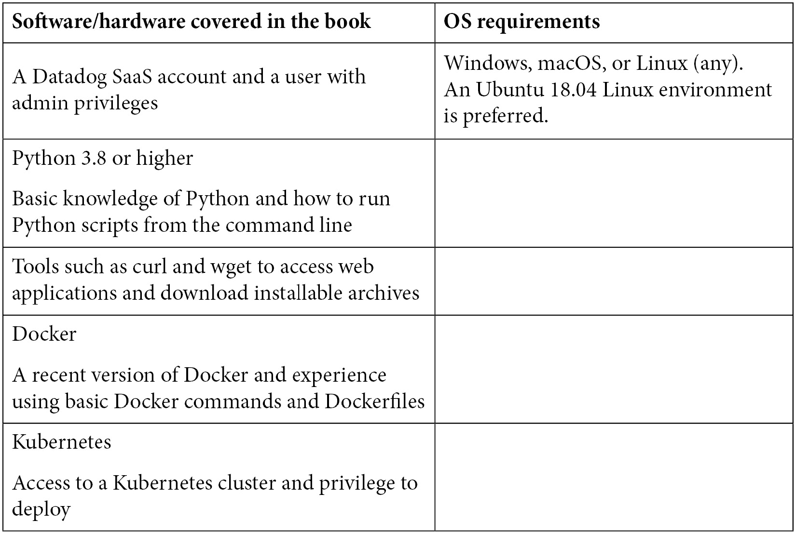

# 前言

监控软件应用程序曾经是一个事后思考的问题——当发生故障时，才会设置监控来检查软件功能或软件系统运行所在基础设施的状态。监控从未是全面的，监控基础设施是自然生长起来的。第一代监控工具仅设计用于满足这种简单、反应性的监控推出方式。

公共云作为计算平台的广泛使用、将应用程序部署为微服务的持续趋势以及提供**软件即服务**（**SaaS**）并实现*24x7*可用性，使得软件系统的操作变得比以往更加复杂。主动监控成为 DevOps 文化的核心部分，因为逐步迭代和渐进式地推出监控已经不再是一个选项，用户期望软件系统始终可用。现在，软件系统在设计时便考虑到了可观察性，以便能够暴露其工作原理并进行有效监控。系统和应用程序日志都会被汇总并分析，以便获取操作洞察。

现在有大量的监控应用程序可供选择，以满足这些新的监控需求，既有本地部署的解决方案，也有基于 SaaS 的解决方案。一些工具专注于监控的特定领域，而其他工具则试图满足所有类型的监控需求。通常需要使用三到四种不同的监控应用程序来覆盖监控的各个方面。Datadog，一种 SaaS 监控解决方案，正作为一个监控平台崭露头角，企业可以使用它来构建全面的监控基础设施。本书旨在向各种受众介绍 Datadog，并帮助您将其作为一种主动的监控解决方案进行部署。

# 本书的适用对象

本书适合 DevOps 工程师、**站点可靠性工程师**（**SREs**）、IT 生产工程师和系统管理员，他们需要了解 Datadog 作为一个全面的 SaaS 监控平台所提供的功能，以便将这些功能推出并将 Datadog 与其他应用程序集成。对于软件开发人员来说，本书也很有帮助，可以帮助他们理解现代监控工具的工作原理，并相应地对他们的应用程序进行微调。

本书是一本关于监控的入门级书籍，也是一本监控技术指南，除了关注 Datadog 的功能外，本书还将对任何有兴趣了解更多软件应用程序监控的人有所帮助。然而，以下背景将帮助您更好地理解本书的内容，并充分利用书中的示例来获得实际操作经验：

+   具备公共云的工作知识，并有云资源配置的经验

+   具备 Linux 或 Windows 操作系统的工作知识，尤其是前者

+   在生产环境中支持软件系统和处理生产问题的工作经验

# 本书内容简介

*第一章*，*监控简介*，介绍了业界标准的监控术语，并定义了实际应用中不同类型的监控。本章还概述了当前流行的监控工具和平台。

*第二章*，*部署 Datadog 代理*，讨论了 Datadog 代理的工作原理及其在 Datadog 监控平台中的作用。并提供了安装 Datadog 代理的过程和示例步骤。

*第三章*，*Datadog 仪表板*，介绍了 Datadog 用户和管理员使用的 Datadog 仪表板。本章描述了 Datadog UI 的各种功能，这些功能是 Datadog 的常规用户日常使用的。

*第四章*，*账户管理*，解释了 Datadog 用户在维护账户时会执行的各种管理任务。

*第五章*，*指标、事件和标签*，描述了指标和标签，这是 Datadog 用于发布、监控状态和组织数据与资源的两个重要概念。本章还涵盖了监控事件。

*第六章*，*基础设施监控*，详细讲解了 Datadog 在基础设施监控方面的工作，这是监控的重要类别。本章还描述了不同的基础设施类型和组件，以及 Datadog 发布的相关指标组。

*第七章*，*监视器和警报*，介绍了监视器和警报，这是任何监控工具的核心部分。本章详细探讨了这些概念在 Datadog 中的实现方式。

*第八章*，*与平台组件集成*，详细描述了将 Datadog 与其他基础设施和软件组件集成的多种方式，并提供了示例。

*第九章*，*使用 Datadog REST API*，介绍了 Datadog REST API，该 API 用于以编程方式访问 Datadog。本章描述了典型的使用案例，详细解释了如何使用 Datadog API，并附有教程。

*第十章*，*使用监控标准*，探讨了将监控工具与应用程序集成的行业标准。本章通过示例讨论了三种集成标准：SNMP、JMX 和 StatsD。

*第十一章*，*与 Datadog 集成*，介绍了一些常用的官方和社区开发的编程库，这些库可用于将应用程序直接与 Datadog 集成。

*第十二章*，*容器监控*，讨论了 Datadog 在 Docker 和 Kubernetes 环境中可用的容器监控工具。

*第十三章*，*使用 Datadog 管理日志*，介绍了日志管理提供的标准日志聚合、索引和搜索功能，这是 Datadog 平台最近新增的功能。

*第十四章*，*杂项监控主题*，讨论了 Datadog 平台上一些新的功能，如 APM、安全监控、可观察性和合成监控，该平台持续增长。

# 为了充分利用本书的内容

对公共云或裸金属基础设施的工作知识会有帮助。为了跟随本书中的示例，您需要具备 Linux 发行版和 Python 的工作经验。对于完全理解书中讨论的概念，您需要对生产环境中运行的软件系统有所了解。



**如果您使用的是本书的电子版本，我们建议您手动输入代码，或通过 GitHub 仓库（下节提供链接）访问代码。这样可以帮助您避免与复制粘贴代码相关的潜在错误。**

# 下载示例代码文件

您可以从 GitHub 下载本书的示例代码文件，网址为 https://github.com/PacktPublishing/Datadog-Cloud-Monitoring-Quick-Start-Guide。如果代码有更新，GitHub 上的现有仓库将会进行更新。

我们还提供了其他来自我们丰富的书籍和视频目录中的代码包，您可以在 [`github.com/PacktPublishing/`](https://github.com/PacktPublishing/) 查找。快去看看吧！

# 下载彩色图片

我们还提供了一个 PDF 文件，其中包含本书使用的截图/图表的彩色图像。您可以在此下载：`www.packtpub.com/sites/default/files/downloads/9781800568730_ColorImages.pdf`。

# 使用的约定

本书中使用了一些文本约定。

`文本中的代码`：表示文本中的代码词汇、数据库表名、文件夹名称、文件名、文件扩展名、路径名、虚拟 URL、用户输入和 Twitter 账号。例如：“主 Datadog Agent 配置文件 `datadog.yaml` 可以更新以满足您的特定监控需求。”

代码块的格式如下：

```
init_config:
instances:
    - url: "unix://var/run/docker.sock"
      new_tag_names: true
```

当我们希望引起您对某个代码块中特定部分的注意时，相关行或项目将以粗体显示：

```
usermod -a -G docker dd-agent
```

所有命令行输入或输出都按如下格式书写：

```
DOCKER_CONTENT_TRUST=1 docker run -d --name dd-agent -v /var/run/docker.sock:/var/run/docker.sock:ro -v /proc/:/host/proc/:ro -v /sys/fs/cgroup/:/host/sys/fs/cgroup:ro -e DD_API_KEY=<DATADOG_API_KEY> datadog/agent:7 

```

**粗体**：表示一个新术语、重要的词汇，或是你在屏幕上看到的文字。例如，菜单或对话框中的文字会以这种方式出现。以下是一个示例：“如果代理能够连接到后台，相应的主机将会在仪表板下的**基础设施** | **主机映射**和**基础设施列表**中列出。”

提示或重要说明

以这种方式出现。

# 联系我们

我们总是欢迎读者的反馈。

**一般反馈**：如果你对本书的任何方面有疑问，请在邮件主题中提及书名，并通过电子邮件联系我们：customercare@packtpub.com。

**勘误**：虽然我们已经尽力确保内容的准确性，但错误仍然可能发生。如果你在本书中发现了错误，我们将非常感激你向我们报告。请访问[www.packtpub.com/support/errata](http://www.packtpub.com/support/errata)，选择你的书籍，点击“勘误提交表格”链接，并填写相关详情。

**盗版**：如果你在互联网上发现任何我们作品的非法复制品，请将其位置或网站名称提供给我们。请通过版权@packt.com 联系，并附上材料的链接。

**如果你有兴趣成为作者**：如果你在某个领域有专长，并且有兴趣写书或为书籍贡献内容，请访问[authors.packtpub.com](http://authors.packtpub.com)。

# 评论

请留下评论。在阅读并使用本书后，为什么不在你购买本书的网站上留下评论呢？潜在读者可以参考并根据你的客观意见做出购买决策，我们 Packt 也能了解你对我们产品的看法，而我们的作者则可以看到你对其书籍的反馈。谢谢！

关于 Packt 的更多信息，请访问[packt.com](http://packt.com)。
