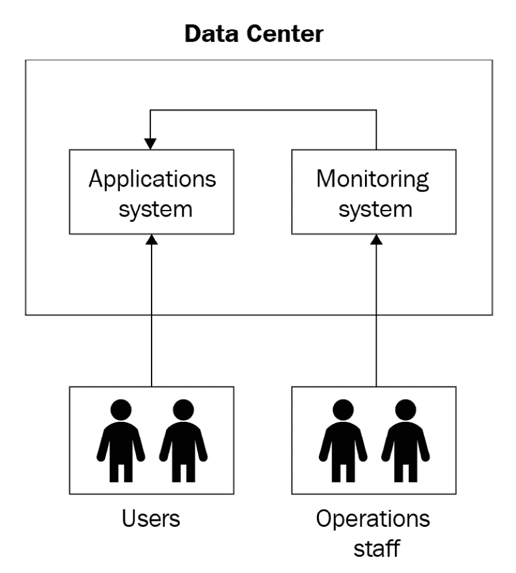
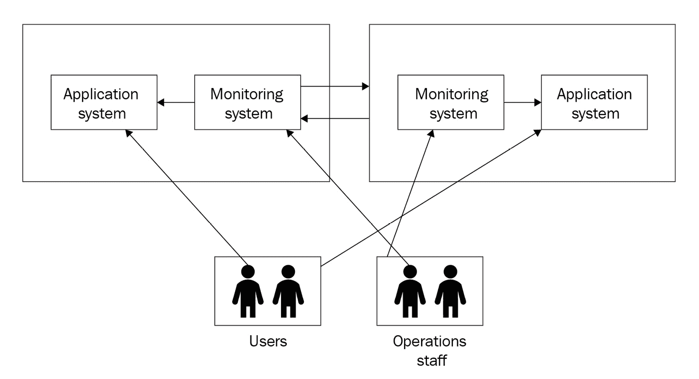
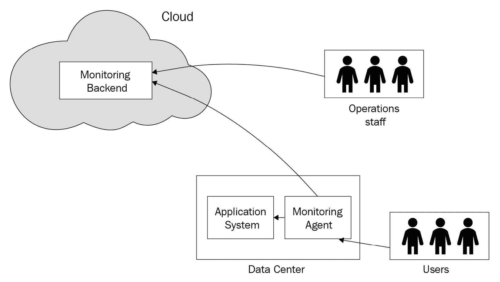
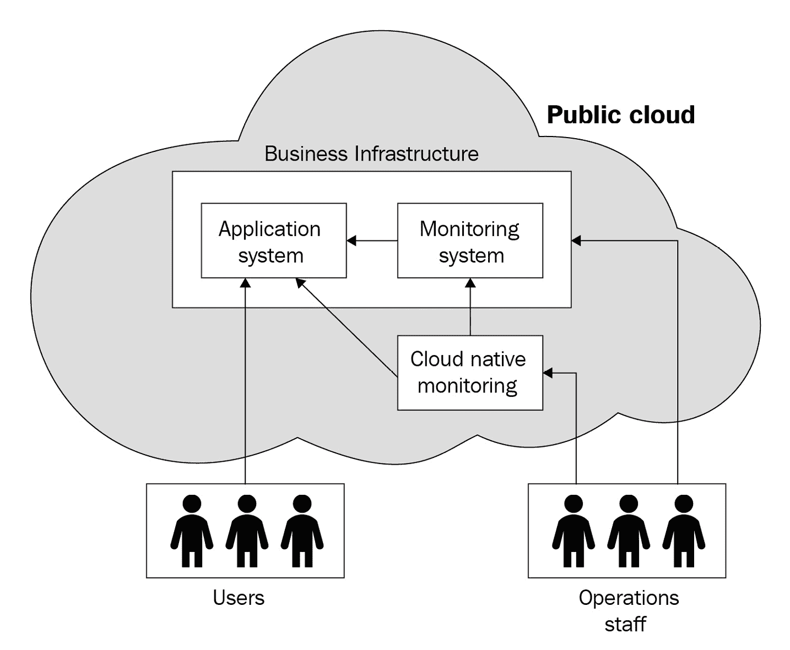
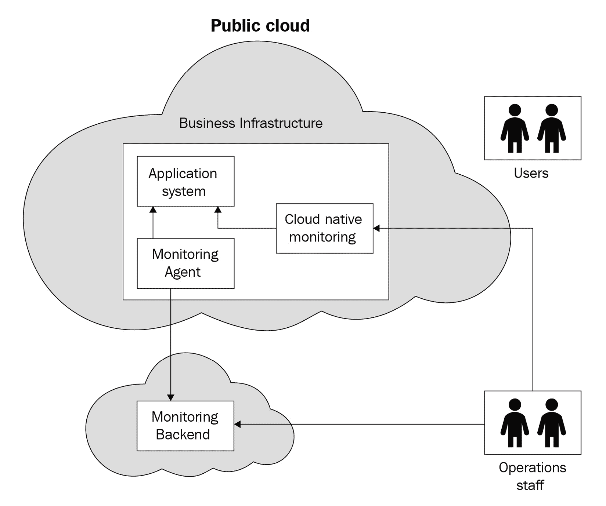
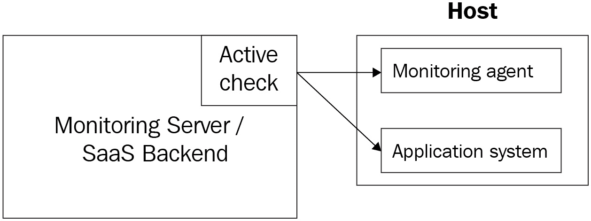
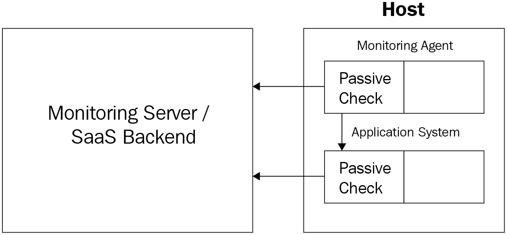
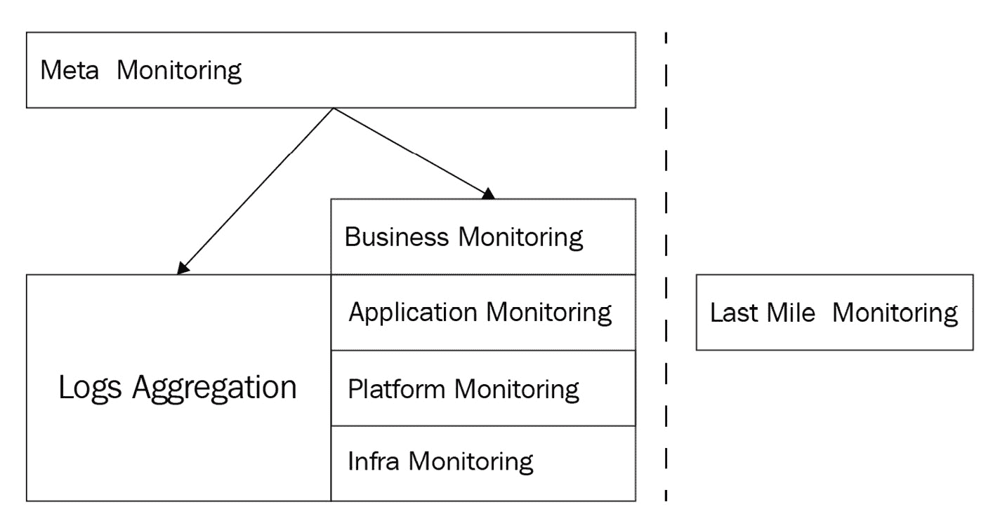

# 第一章：监控简介

监控是一个广泛的领域，涉及许多工具和解决方案，它们满足该领域不同的需求。然而，仔细观察后会发现，这些产品有很多共同的特征。因此，在我们开始讨论 Datadog 作为监控工具之前，理解监控的核心理念和术语非常重要。

在本章中，我们将涵盖以下主题：

+   为什么要监控？

+   主动监控

+   监控用例

+   监控术语和流程

+   监控的类型

+   监控工具概览

# 技术要求

本章没有技术要求

# 为什么要监控？

监控是经营业务中的一个通用术语。在有效运营企业的一部分过程中，企业运营的各个要素会被衡量其健康状况和效果。这些测量结果会与企业目标进行比较。当这些工作周期性和系统性地进行时，就可以称之为监控。

监控可以是直接或间接的，也可以是自愿的或由某些法律强制的。成功的企业擅长通过使用各种指标来跟踪增长，并根据需要采取纠正措施，以调整他们的运营和目标。

之前的陈述是常识，适用于任何成功的运营，即使它是一次性事件。然而，我们已经提到了一些重要的关键词——指标、测量和目标。监控活动就是测量某些内容，并将结果与目标或指标进行比较。

虽然跟踪企业运营的各个方面很重要，但本书的重点是监控在生产中运行的软件应用系统。**信息技术**（**IT**）是运营企业的关键要素，它涉及到软件系统的运营。随着软件作为服务通过互联网提供（通常称为**软件即服务**或**SaaS**），大多数软件用户不需要在内部运行软件系统，因此他们无需监控它。

然而，SaaS 提供商需要监控他们为客户运行的软件系统。像银行和零售连锁等大型企业可能仍然需要在内部运行软件系统，因为云中可能没有所需的软件服务，或者出于安全性或隐私原因。

监控软件系统的主要关注点是检查其健康状况。通过跟踪软件系统的健康状况，可以判断系统是否可用，或者其健康状况是否在恶化。

如果能提前捕捉到软件系统恶化的状态，那么在发生停机之前修复潜在问题就可能成为可能，从而确保业务连续性。提供提前警告的这种主动监控方法是理想的监控方式。但这并非总是可行的。必须也有应对软件系统停机的相关流程。

运行在生产环境中的软件系统有三个主要组成部分：

+   **应用软件**：软件服务提供商构建的应用程序供客户使用，或者软件是为内部使用而在公司内部构建的。

+   **第三方软件**：现有的第三方软件，例如数据库和消息平台，被用来运行应用程序软件。这些软件可以通过 SaaS 服务订阅，或者在内部部署使用。

+   **基础设施**：通常指用于运行应用程序和第三方软件的网络、计算和存储基础设施。这可以是数据中心中的裸金属设备，也可以是通过 AWS、Azure 或 GCP 等公共云平台提供的服务。

虽然我们之前广泛讨论了软件系统的监控，但仔细看就会发现，监控之前提到的三个主要组成部分是其中的关键。使用相关度量标准所测量的信息对于每个类别都是不同的。

这三个组成部分的监控构成了核心监控。还有许多其他方面——包括系统内部的健康状况和外部的安全性——也需要纳入软件系统的监控当中。我们将在本章中简要介绍软件系统监控的所有主要方面，并在后续章节中介绍 Datadog 如何支持这些方面。

# 主动监控

从技术角度来看，监控并不是生产环境中运行的一个软件系统的组成部分。软件系统中的应用程序可以在没有任何监控工具的情况下运行。作为最佳实践，软件应用程序必须与监控工具解耦。

这种情况有时会导致将软件系统以最小或没有监控的状态投入生产，这最终会导致问题未被发现，或者在最糟糕的情况下，用户在使用软件服务时发现这些问题。由于以下原因，这种情况对业务来说是不利的：

+   生产环境中的问题会影响客户的业务连续性，通常还会产生与之相关的财务成本。

+   软件服务的计划外停机会给用户留下关于软件服务及其提供商的负面印象。

+   非计划停机会在业务层面造成混乱，处理和解决这些问题可能对每个相关方造成压力，并且对受影响的企业来说也是昂贵的。

在应对生产问题时采取的缓解措施之一是增加一些监控，以便捕捉并报告相同的问题给运维团队。通常，这种反应式方法会有机地增加监控覆盖范围，但并没有遵循监控策略。虽然这种方法有时能帮助捕捉问题，但不能保证有机增长的监控基础设施能够检查软件系统的健康状况并发出警告，从而采取主动的修复措施，以最小化未来的故障。

主动监控是指为软件系统推出监控解决方案，以报告软件系统组件及其运行基础设施的问题。这种报告有助于通过手动或自动采取缓解措施来避免即将发生的问题。后一种方法通常称为自我修复，这是监控的一个高度理想的终极目标，但实现起来困难。

主动监控策略的关键要素如下。

## 实施全面的监控解决方案

传统上，监控的重点一直是基础设施组件——计算、存储和网络。正如你将在本章稍后看到的，还有更多的监控方面需要完成这个清单。必须为软件系统实施所有相关类型的监控，以便捕捉并报告任何组件、软件或基础设施的问题。

## 设置警报以警告即将发生的问题

监控解决方案必须设计为预警软件系统中即将发生的问题。对于基础设施组件来说，这是容易的，因为可以轻松追踪内存使用、CPU 利用率和磁盘空间等指标，并在任何超出限制的使用情况下发出警报。

然而，在应用程序层面，满足这样的需求可能会很棘手。有时应用程序可能会在配置完美的基础设施上发生故障。为了解决这个问题，软件应用程序应该提供对其内部运行情况的洞察。在监控术语中，现在通常称为可观察性，稍后我们将在本书中看到如何在 Datadog 中实现这一点。

## 建立反馈回路

一个成熟的监控系统，能够预警即将发生的问题并帮助采取缓解措施，还不够好。这些警告还必须用于自动解决问题（例如，当现有虚拟主机的磁盘空间耗尽时，启动一个新虚拟机并分配足够的磁盘空间），或被反馈到应用程序或基础设施的重新设计中，以避免未来发生类似问题。

# 监控用例

监控应用程序的安装和配置是根据要监控的应用程序运行的位置进行的。在这里，我们将查看几个不同场景中监控如何推出的使用案例，以理解典型的配置。

## 数据中心中的所有内容

这是一个经典的监控场景，其中托管应用程序的基础设施和监控工具都位于一个或多个数据中心中。数据中心可能是由企业私有拥有，也可能是从数据中心提供商那里租用的托管设施。后一种选择通常称为共址（co-location）。

该图展示了软件应用和监控工具如何在同一个数据中心中运行。

图 1.1 – 单一数据中心

以下图示展示了软件应用和监控工具如何在两个数据中心中运行，这确保了软件系统的可用性：

图 1.2 – 在一个数据中心与多个数据中心

如果应用程序托管在多个数据中心中，且其中一个数据中心无法访问，监控系统能够发出警报。如果仅使用一个数据中心，则不可行，因为整个监控系统将与其监控的软件系统一起无法访问。

## 在数据中心中应用与云监控

这是一个新兴的场景，企业将其基础设施托管在数据中心，并使用像 Datadog 这样的云监控服务进行监控。在这种情况下，监控后端位于云端，其代理程序与应用系统一起在数据中心中运行。

图 1.3 – 在数据中心中应用与云监控

不需要监控监控系统本身，因为 SaaS 提供商会提供其状态。

## 完全云端

在完全云端的监控场景中，可能有两种不同的情况。在这两种情况下，运行软件系统的基础设施都会位于云端，通常是公共云平台，如 AWS。整个监控系统可以部署在相同的基础设施上，或者使用云监控服务，如 Datadog，在这种情况下，只有它的代理会与应用系统一同运行。

图 1.4 – 完全云端与内部监控

在完全云端的场景下，您需要设置监控系统，或利用由公共云提供商提供的监控服务，比如 AWS 的 CloudWatch，或者两者结合使用。

图 1.5 – 完全云端与云监控

在完全云化的第二种情况下，使用的是第三方 SaaS 监控服务，例如 Datadog。使用 SaaS 监控服务的主要吸引力在于其丰富的功能集、高可用性以及部署和维护监控时的最小开销。

使用云基础设施的额外优势之一是可以访问原生监控工具，例如 AWS 上的 CloudWatch。这些服务具有高度可靠性，可以通过多种方式增强监控，以完成以下任务：

+   监控通过标准监控工具难以监控的云资源

+   作为二级监控系统，主要用于覆盖基础设施监控

+   作为元监控工具监控其余的监控基础设施

我们在这里讨论的场景是经过简化的，以便解释核心概念。在现实生活中，监控解决方案会结合多个工具，一些工具可能是在本地部署的，另一些则可能是基于云的。当涉及到如此复杂的配置时，不丢失主动监控的主要目标是拥有一个可靠的监控系统的关键，这样可以帮助减少故障，并提供操作性洞察，从而有助于对应用系统进行微调。

# 监控术语和流程

现在，让我们来看一下文献和工具中最常用的监控术语。某些术语之间的差异微妙，您可能需要特别留意才能理解它们。

## 主机

在数据中心时代，主机通常指的是物理服务器。在监控领域，它通常指具有 IP 地址的设备。这涵盖了各种各样的设备和资源——裸金属机器、网络设备、物联网设备、虚拟机，甚至容器。

一些第一代监控工具，如 Nagios 和 Zenoss，是围绕主机概念构建的，这意味着在这些平台上执行的所有操作都必须与主机相关联。在 Datadog 等新一代监控工具中，这种限制已被放宽。

## 代理

代理是与应用软件系统一起运行的服务，帮助进行监控。它执行监控工具的各种任务，并将信息报告回监控后台。

代理安装在应用系统运行的主机上。它可以是直接在操作系统上运行的简单进程，也可以是微服务。Datadog 支持这两种选项，当应用软件以微服务方式部署时，代理也以微服务方式部署。

## 指标

监控中的指标是指某些信息的时间度量，这些信息能够提供被监控系统的工作状态的洞察。以下是一些常见的例子：

+   机器根分区上可用的磁盘空间

+   查看机器上的空闲内存

+   SSL 证书到期前剩余的天数

这里需要注意的重要一点是，度量是有时间限制的，并且其值会变化。出于这个原因，根分区的总磁盘空间不被视为度量。

一个度量是定期测量的，用于生成时间序列数据。我们将看到，这些时间序列数据可以以多种方式使用——在仪表盘上绘制图表、分析趋势，以及设置监控。

监控工具生成了各种各样的度量，特别是与基础设施相关的度量。也可以选择生成自己的自定义度量：

+   监控工具提供运行脚本生成度量的选项。

+   应用程序可以将度量发布到监控工具。

+   监控工具或其他工具可能提供插件，用于生成与软件系统使用的第三方工具相关的度量。例如，Datadog 为大多数流行工具（如 NGINX）提供这样的集成。所以，如果你在应用栈中使用 NGINX，启用集成后，你就可以获得 NGINX 特定的度量。

## 启用/禁用状态

一个度量的测量值可以有一个范围，但启用或禁用是一个二进制状态。以下是一些示例：

+   一个进程是否运行

+   一个网站是否可用

+   一个主机是否可 ping

跟踪软件系统各个组件的启用/禁用状态是所有监控工具的核心，它们具备内置的功能来检查各种资源。

## 检查

检查是监控系统用来收集度量值的工具。当它定期执行时，会为该度量生成时间序列数据。

虽然标准基础设施级度量的时间序列数据在监控系统中是现成可用的，但可以实现自定义检查来生成需要一些脚本的自定义度量。

图 1.6 – 主动检查/拉模式

一个检查可以是主动的或被动的。主动检查由监控后端发起，用于收集度量值和启用/禁用状态信息，可以有也可以没有代理的帮助。这也被称为数据收集的拉取方法。

图 1.7 – 被动检查/推模式

一个被动检查将此类数据报告给监控后端，通常通过其自身的代理或一些自定义脚本。这也被称为数据收集的推送方法。

数据收集的主动/被动或拉/推模型在所有监控系统中都是标准的。该方法取决于监控系统收集的度量类型。你将在后续章节中看到，Datadog 支持这两种方法。

## 阈值

阈值是度量值可能范围内的固定值。例如，在一个总磁盘空间为 8 GB 的根分区上，可用磁盘空间可能是从 0 GB 到 8 GB 之间的任何值。这个特定情况下的阈值可以是 1 GB，它可以设置为指示根分区存储不足。

也可以定义多个阈值。在这个具体示例中，1 GB 可能是警告阈值，500 MB 可能是关键或高严重性阈值。

## 监视器

监视器查看为度量标准生成的时间序列数据，并且在值越过阈值时向警报接收者发出警报。监视器也可以设置为上/下状态，这种情况下，如果相关资源停机，它将向警报接收者发送警报。

## 警报

当关联检查确定度量值越过监视器设置的阈值时，监视器生成警报。监视器可以配置为通知警报接收者警报。

## 警报接收者

警报接收者是组织中注册接收监视器发送的警报的用户。警报接收者可以通过多个通信渠道接收到警报，例如电子邮件、短信和 Slack。

## 严重级别

警报根据其揭示的软件系统问题的严重性进行分类，并由适当的严重级别设置。对警报的响应与警报的严重级别相关联。

一个示例的严重级别集合可以包括 **信息**、**警告** 和 **关键**。例如，在根分区可用磁盘空间的示例中，当可用磁盘空间为 30%时，监视器可以配置为警告，并且在 20%时可以配置为关键警报。

正如您所看到的，为不断加重的严重性设置警报级别将提供捕捉问题并及时采取缓解措施的机会，这是积极监控的主要目标。请注意，在系统组件随时间退化的情况下，这种方法是可行的。

跟踪上/下状态的监视器将无法提供任何警告，因此应尽快启动相关服务来采取缓解措施。然而，在实际情况中，必须有多个监视器，这样至少其中一个监视器可以提前捕捉到潜在问题。例如，在根分区没有磁盘空间时，可能会停止某些服务，监视根分区的可用空间将有助于防止这些服务停止运行。

## 通知

作为电子邮件等通信平台特定警报的一部分发送出去的消息被称为通知。警报和通知之间有微妙的区别，但有时它们被视为相同。警报是监视系统内的一个状态，可以触发多个动作，如发送通知和更新监视仪表板的状态。

传统上，电子邮件分发组是发送通知的主要通信方式。目前，有更多复杂的选项，如聊天和短信，几乎所有监控平台都原生支持这些选项。此外，PagerDuty 等升级工具可以与现代监控工具如 Datadog 集成，根据严重性路由通知。

## 停机时间

监控系统的停机时间是指该监控系统在一定时间窗口内禁用警报功能的时段。通常，这种做法是为了临时停用警报，当基础设施或软件组件的变更正在进行时，监控该组件变得无关紧要。例如，当增加存储空间的维护任务进行时，跟踪磁盘驱动器可用空间的监控将受到影响。

如 Datadog 等监控平台支持这一功能。该功能的实际应用是避免从受影响的监控系统接收通知。通过将 CI/CD 管道与监控应用程序集成，停机时间可以自动安排，作为部署的先决条件。

## 事件

监控系统发布的事件通常会提供软件系统发生变化的详细信息。一些常见的示例如下：

+   进程重启

+   由于用户流量变化而进行微服务的部署或关闭

+   向基础设施添加新的主机

+   用户登录敏感资源

请注意，这些事件不需要立即采取行动，而是提供信息。这就是事件与警报的区别。警报是可操作的，而事件没有严重性级别，因此不可操作。事件会记录在监控系统中，并且在问题排查时是有价值的信息。

## 事故

当产品功能无法提供给用户时，这称为事故。事故发生在基础设施出现故障时，可能是硬件或软件问题，但也不一定。它也可能由于外部网络或互联网相关的访问问题而发生，尽管这种情况较为少见。

处理事故并进行缓解的过程本身就是一个独立领域，通常不被视为核心监控的一部分。然而，监控和事故管理因以下原因密切相关：

+   如果没有全面的监控，事故总是会发生，因为没有监控系统，就无法在问题导致故障之前进行缓解。

+   当然，**根本原因分析**（**RCA**）的行动项通常会包括实施更多监控任务，这是一种典型的反应性策略（或者说没有反应性策略），必须避免这种情况。

## 值班

由监控系统发送的关键警报由值班团队响应。尽管实际需求可能会根据被监控应用程序的**服务级别协议**（**SLA**）要求有所不同，但值班团队通常是 24 小时全天候待命的。

在成熟的服务工程组织中，将提供三个级别的支持，问题从 L1 升到 L3：

+   L1 支持团队由了解应用程序的产品支持人员组成，能够使用运行手册来响应问题。

+   L2 支持团队由**站点可靠性工程师**（**SREs**）组成，他们可能也依赖运行手册，但他们还能够进行故障排查和修复基础设施和软件组件。

+   L3 支持团队通常由设计并构建生产环境中的基础设施和软件系统的 DevOps 和软件工程师组成。通常，只有在处理未知问题时，这个团队才会介入。

## 运行手册

运行手册为值班支持人员提供响应警报通知的步骤。步骤可能并不总是提供解决报告问题的方法，有时仅仅是将问题升级到工程联系人，以便进一步调查。

# 监控类型

监控有不同的类型。与软件系统相关的所有监控类型都必须实施，才能使其成为一个全面的解决方案。另一个需要考虑的方面是推出某种类型的监控的业务需求。例如，如果软件服务的客户坚持要求确保他们订阅的应用程序的安全性，那么软件提供商就必须推出安全监控。

（本节讨论的监控类型最初出现在我发表的文章《主动监控》中，文章发布于[DevOps.com](http://DevOps.com)网站。）

图 1.8 – 监控类型

现在让我们详细探讨这些监控类型。

## 基础设施监控

运行应用系统的基础设施由多个组件组成：服务器、存储设备、负载均衡器等。检查这些设备的健康状况是监控的最基本要求。流行的监控平台提供了开箱即用的支持此功能。除了为这些度量设置合适的阈值以便触发警报外，几乎不需要其他定制。

## 平台监控

一个应用系统通常是由多个第三方工具构建的，以下是一些示例：

+   数据库，包括关系型数据库（MySQL，Postgres）和 NoSQL 数据库（MongoDB，Couchbase，Cassandra）数据存储

+   全文搜索引擎（Elasticsearch）

+   大数据平台（Hadoop，Spark）

+   消息传递系统（RabbitMQ）

+   内存对象缓存系统（Memcached，Redis）

+   BI 和报告工具（MicroStrategy，Tableau）

检查这些应用组件的健康状况也很重要。大多数这些工具提供了一个接口，主要通过 REST API，可以利用它在主监控平台上实现插件。

## 应用监控

拥有健康的基础设施和平台并不足以保证应用程序正确运行。最近部署的有缺陷的代码、第三方组件问题或与外部系统的不兼容更改，都可能导致应用失败。可以实现应用层检查来检测这些问题。如前所述，功能性或集成测试能够在测试/预发布环境中发现这些问题，并且在生产环境中也应该实现相应的检查。

实现应用层监控可以通过在应用中构建钩子或 API 端点来简化。通常，提高应用的可观测性是关键。

监控通常是事后考虑的，应用的设计阶段往往忽视了这种工具的需求。DevOps 团队参与设计评审可以提升系统的可操作性。规划生产环境中的应用层监控是 DevOps 可以提供建议的一个方面。

## 业务监控

应用系统在生产环境中运行，以实现特定的业务目标。你可能有一个在健康基础设施上完美运行的应用，但业务可能仍未达到其目标。在最早的机会提供反馈给业务非常重要，这样可以采取纠正措施，进而触发应用功能的增强和/或业务运作方式的改善。

这些努力应该仅仅作为更加复杂的基于 BI 的数据分析方法的补充，后者可以提供更深入的业务状态洞察。业务级监控可以基于数据仓库中现有的事务数据和 BI 系统生成的数据聚合。

应用层监控和业务层监控都是公司特定的，必须为这些监控需求开发插件。从监控平台访问标准信息源（如数据库和 REST API）实现一个框架，可以最大程度地减少每次都需要从零开始构建插件的需求。

## 最后一公里监控

在与应用程序运行的相同公有云或数据中心环境中部署的监控平台，无法检查最终用户体验。为了解决这个问题，市场上有多个 SaaS 产品，例如 Catchpoint 和 Apica。这些服务由实际的基础设施支持，用于监控特定地理位置的应用。例如，如果你想知道你的移动应用在芝加哥的 iPhone 上的表现，便可以通过服务提供商在芝加哥的测试基础设施进行跟踪。

在这些工具上设置警报，若应用无法从外部访问或出现性能问题时，通知站点可靠性工程团队。

## 日志聚合

在生产环境中，操作系统、平台组件和应用程序会在各种日志文件中记录大量信息。当出现问题时，这些信息会引起关注，否则通常会被忽略。传统的监控工具如 Nagios 除了在某些模式下发出警报外，无法处理不断变化的日志文件。

日志聚合工具的出现，如 Splunk，改变了这一局面。通过聚合和索引日志，可以检测到之前可能被忽略的问题。可以根据索引日志数据中的信息设置警报。例如，Splunk 提供了自定义查询语言，可以搜索索引以获取操作洞察。通过这些工具提供的 API，警报功能实际上可以与主要的监控平台集成。

为了充分利用这些工具的聚合和索引功能，应用程序或脚本可以生成结构化数据输出，这些输出稍后会被日志聚合工具索引。

## 元监控

确保监控基础设施本身正常运行非常重要。在部署期间禁用警报并忘记稍后启用它，是操作中常见的疏忽之一。这类错误很难监控，只有在部署过程中改进才能解决这些问题。

让我们看一看在元监控中使用的几种流行方法：

### Ping 主机

如果有多个监控应用程序实例在运行，或者有一个备用节点，则可以实施交叉检查，以验证用于监控的主机的可用性。在 AWS 中，可以使用 CloudWatch 监控 EC2 节点的可用性。

### 监控健康检查

检查监控 UI 的可用性以及监控工具日志文件中的活动，以确保监控系统本身是完全正常运行的，并且它继续在生产环境中监视问题。如果使用了日志聚合工具，跟踪应用程序的日志文件将是检查日志文件中是否有任何活动的最有效方法。通过使用标准关键字，如`Error`和`Exception`，同一索引也可以查询潜在的问题。

## 非核心监控

到目前为止讨论的监控类型构成了核心监控解决方案的组成部分。在综合解决方案中，你会看到大多数这些监控类别。还有一些高度专业化的监控类型，在特定的业务情况下会成为重要组成部分。

### 安全监控

安全监控是一个庞大的领域，并且有专门的工具可供使用，如**SIEM**工具。然而，这种情况正在慢慢改变，包括 Datadog 在内的通用监控工具开始提供安全功能，以在市场中保持竞争力。安全监控通常包括以下几个方面：

+   应用系统，包括基础设施，由于其状态变化而导致的脆弱性

+   基础设施组件相对于已知问题的脆弱性

+   监控攻击并捕捉安全漏洞

如您所见，这些目标可能并不完全由我们迄今为止讨论的核心监控概念所涵盖，我们将需要引入一组新的术语和概念来更好地理解这些内容，稍后在书中我们将详细讨论这些内容。

### 应用性能监控（APM）

正如其名称所示，APM 帮助精细调整应用程序的性能。这是通过改进对应用系统的可观察性来实现的，从而使各个组件的互操作性变得更加明显。尽管这些监控工具最初是作为专用 APM 解决方案推出的，但如今它们已经提供全栈监控，因此也可以用于通用监控。

# 监控工具概述

在本节中，您将深入了解市场上所有流行的监控工具，帮助您更好地评估 Datadog。

市场上有很多监控工具，从开源、免费软件到许可和基于云的产品应有尽有。尽管许多工具（如 Datadog）是通用应用程序，涵盖我们之前讨论的各种监控类型，但一些工具，如 Splunk 和 AppDynamics，则解决了非常专业的监控问题。

在规划监控解决方案时，DevOps 架构师面临的一个挑战是评估现有工具，以便推出主动监控解决方案。在这方面，正如我们在本书中所看到的，Datadog 凭借其核心监控功能以及提供一些非核心功能（如安全监控）而脱颖而出，是最好的通用监控工具之一。

为了给市场上大量种类繁多的监控工具带来一些结构，它们根据实际运行的位置被分为三大类。其中一些应用程序同时提供本地部署和 SaaS 解决方案。

我们将简要了解除了 Datadog 之外，市场上还有哪些其他监控应用程序。其中一些应用程序与 Datadog 竞争，而其余的则可能是补充解决方案，用于完善推出主动监控所需的工具组合。

## 本地工具

这一类监控应用程序必须部署在您的基础设施上，与应用系统一起运行。其中一些工具也可能作为 SaaS 提供，我们将在需要时提到这一点。

这里的目标是向新手介绍监控生态系统的全貌，并展示其多样性。

### Nagios

Nagios 是一款流行的第一代监控应用，广泛用于监控系统和网络基础设施。Nagios 是通用的开源软件，提供免费和许可版本。它是一款高度灵活的软件，支持通过广泛可用的数百个插件进行扩展。此外，编写插件并部署以满足定制监控需求也相对容易。

### Zabbix

Zabbix 是另一款流行的第一代开源免费监控应用。它是类似于 Nagios 的通用监控应用。

### TICK Stack

**TICK** 代表 **Telegraf**、**InfluxDB**、**Chronograf** 和 **Kapacitor**。这些开源软件组件构成了一个高度分布的监控应用栈，是一款受欢迎的新一代监控平台。与第一代监控工具基本是单体软件不同，下一代平台被分为多个组件，使其更加灵活和高度可扩展。TICK Stack 的核心组件执行以下任务：

+   **Telegraf**：生成度量时间序列数据。

+   **InfluxDB**：存储时间序列监控数据，以便以多种方式进行消费。

+   **Chronograf**：为度量时间序列数据提供 UI。

+   **Kapacitor**：为度量时间序列数据设置监控。

### Prometheus

Prometheus 是一款流行的新一代开源监控工具，通过拉取目标系统收集度量值。基本上，监控系统依赖于使用主动检查或拉取方法收集数据，正如我们前面所讨论的。基于 Prometheus 的监控具有以下组件：

+   **Prometheus 服务器** 拉取并存储时间序列监控数据。

+   **Alertmanager** 处理警报并与其他通信平台集成，特别是像 PagerDuty 和 OpsGenie 这样的升级工具。

+   **Node exporter** 是一个代理程序，它查询操作系统的各种度量，并通过 HTTP 暴露它们供其他服务使用。

+   **Grafana** 并非 Prometheus 工具集的一部分，但它是与 Prometheus 一起使用的最流行的数据可视化工具。

### ELK Stack

ELK Stack 是目前最流行的日志聚合和索引系统之一。ELK 代表 Elasticsearch、Logstash 和 Kibana。每个组件在栈中的功能如下：

+   **Elasticsearch**：这是搜索和分析引擎。

+   **Logstash**：Logstash 聚合并索引日志以供 Elasticsearch 使用。

+   **Kibana**：这是用户与栈进行交互的 UI 可视化工具。

ELK Stack 组件是开源软件，并提供免费版本。栈的 SaaS 版本也可以通过多个供应商作为许可软件服务提供。

### Splunk

Splunk 是在日志聚合类别中开创性的许可软件，具有较大的安装基础。

### Zenoss

Zenoss 是类似 Nagios 和 Zabbix 的第一代监控应用。

### Cacti

Cacti 是一个第一代监控工具，主要以网络监控而闻名。它的特点包括自动网络发现和网络地图绘制。

### Sensu

Sensu 是一个现代监控平台，认识到基础设施在不同层面的动态特性。使用 Sensu，监控需求可以作为代码来实现。这个特点使得它在竞争激烈的监控产品市场中脱颖而出。

### Sysdig

Sysdig 平台提供了现代监控系统的标准监控功能。它专注于微服务和安全性，使其成为一个重要的产品值得考虑。

### AppDynamics

AppDynamics 主要作为**应用性能监控**（**APM**）平台而闻名。然而，它的当前版本也涵盖了标准的监控功能。然而，这类工具通常是作为更通用的监控平台的附加功能。

## SaaS 解决方案

大多数新一代监控工具，如 Datadog，主要作为云中的监控服务提供。这意味着监控解决方案的后端托管在云端，但其代理服务必须在本地运行，以收集指标数据并将其发送到后端。有些工具既可以在本地使用，也可以作为云服务提供。

### Sumo Logic

**Sumo Logic**是一个主要用于日志聚合和搜索的 SaaS 服务。然而，其令人印象深刻的安全相关功能也可以用作**安全信息与事件管理**（**SIEM**）平台。

### New Relic

尽管最初主要作为一个 APM 平台，像 AppDynamics 一样，它也支持标准的监控功能。

### Dynatrace

Dynatrace 与 AppDynamics 和 New Relic 一样，也是 APM 领域的主要参与者。除了具有标准的 APM 功能外，它还将自己定位为一个由 AI 驱动的工具，能够关联监控事件并标记异常活动。

### Catchpoint

Catchpoint 是一个最终用户体验监控或最后一公里监控解决方案。按设计，这样的服务需要由第三方提供，因为相关的指标必须接近最终用户所在的位置进行测量。

这种类型的监控产品有多个供应商。Apica 和 Pingdom 是该领域的其他知名厂商。

## 云原生工具

像 AWS、Azure 和 GCP 这样的流行公有云平台提供了大量的服务，监控只是其中之一。实际上，有多个服务可以用于监控目的。例如，AWS 提供 CloudWatch，主要是一个基础设施和平台监控服务，还有像 GuardDuty 这样的服务提供先进的安全监控选项。

尽管 Google Operations 和 Azure Monitor 是功能齐全的监控平台，但云原生监控服务在相关云平台以外的通用监控解决方案中尚未得到广泛应用。

然而，当涉及到监控特定于云的计算、存储或网络服务时，云原生的监控工具可能更为合适。在这种情况下，可以使用主监控平台提供的集成功能，将监控集中到一个地方。

### AWS CloudWatch

AWS CloudWatch 提供 AWS 上云服务的基础设施级别监控。它可以作为独立的平台来增强主监控系统，或与主监控系统集成。

### Google 操作

这个在 GCP（前称 Stackdriver）上提供的监控服务是一个全栈的、基于 API 的监控平台，同时还提供日志聚合和 APM 特性。

### Azure Monitor

Azure Monitor 也是一个全栈的监控平台，类似于 GCP 上的操作。

### 企业级监控解决方案

尽管它们严格来说不属于用于实施主动监控的监控工具类别，但在大型企业中也使用了其他监控解决方案，以满足如 ITIL 合规性等多样化的需求。为了完整呈现此概述，我们来看看一些相关的解决方案：

+   **IBM Tivoli Netcool/OMNIbus**：一个用于监控大型复杂网络和 IT 域的 SLM 系统，广泛应用于大型 IBM 系统中。

+   **Oracle Enterprise Manager Grid Control**：一款系统管理软件，提供集中化的监控、管理和生命周期管理功能，适用于整个 Oracle IT 基础设施，包括非 Oracle 技术。通常出现在大型 Oracle 硬件和软件系统中。

+   **HPE Oneview**：惠普企业集成的 IT 解决方案，用于系统管理、监控和软件定义基础设施。广泛应用于大型 HP、TANDEM 和 HPE 安装环境中。

# 总结

本章中，您了解了监控软件系统的重要性及其对业务运营的重要作用。您还了解了各种类型的监控、监控的实际应用案例、市场上流行的监控工具，最重要的是，掌握了所有监控工具中使用的核心监控概念和术语。

本章提供了关于监控概念、工具和市场的全面概述，下一章将专门介绍 Datadog，并提供有关其代理的详细信息，该代理需要安装在您的基础设施上才能开始使用 Datadog。
