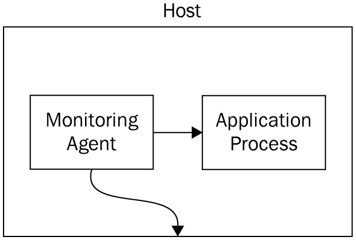
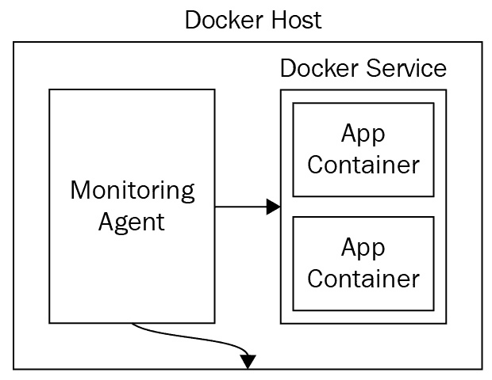
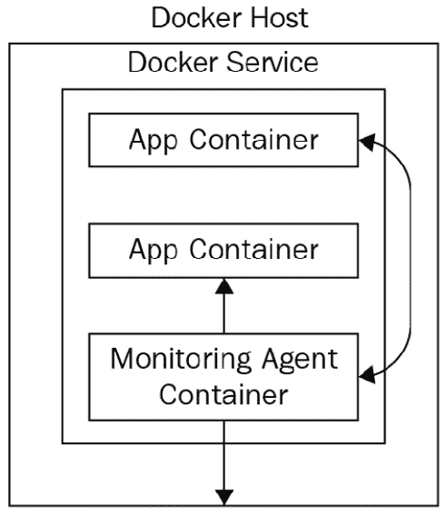
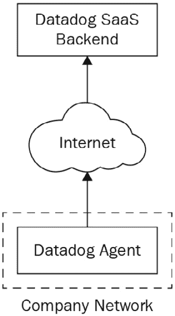
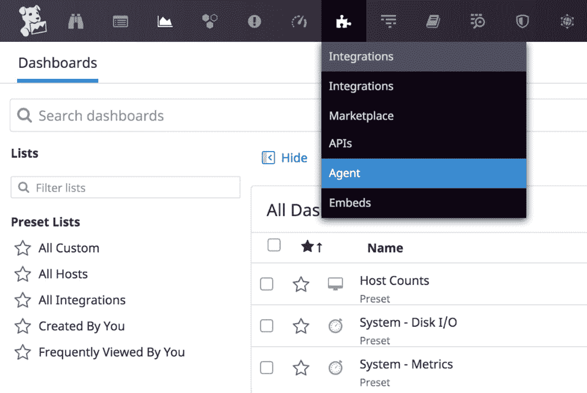
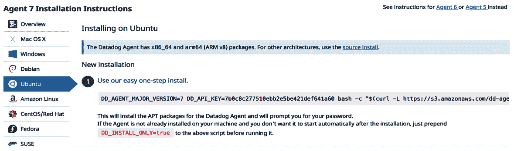
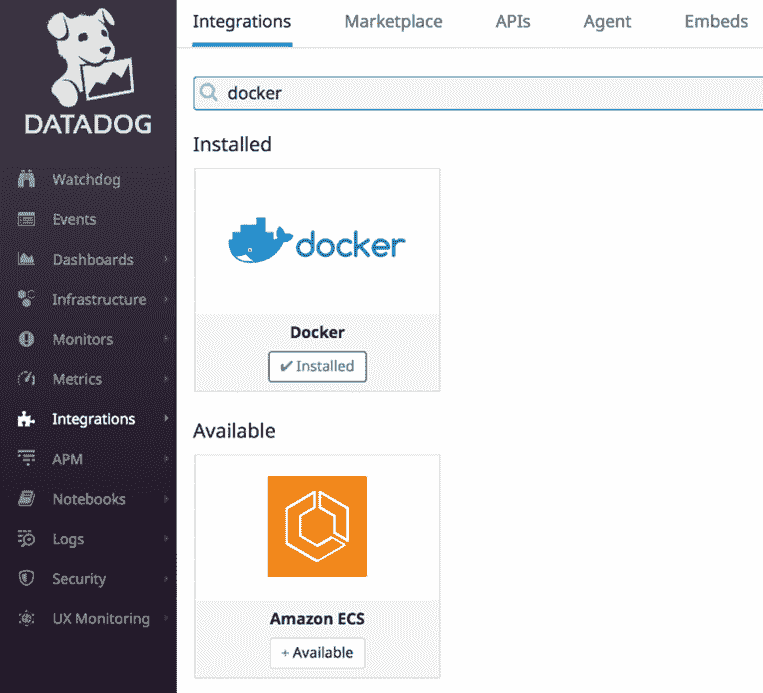
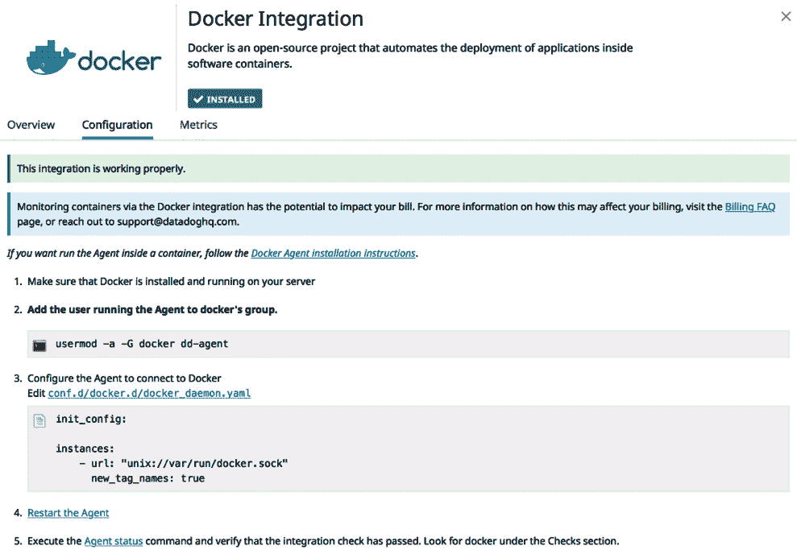
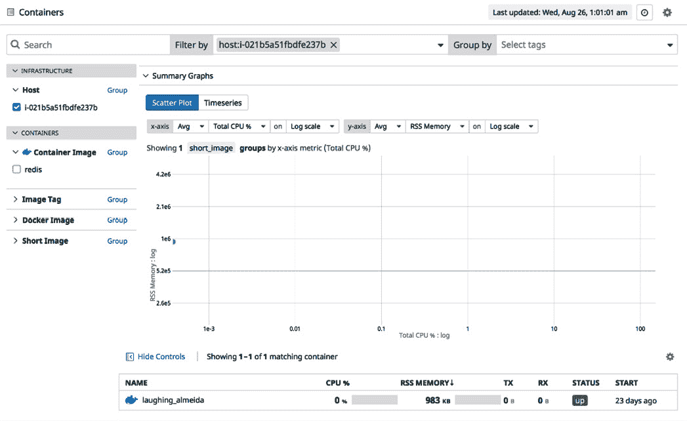
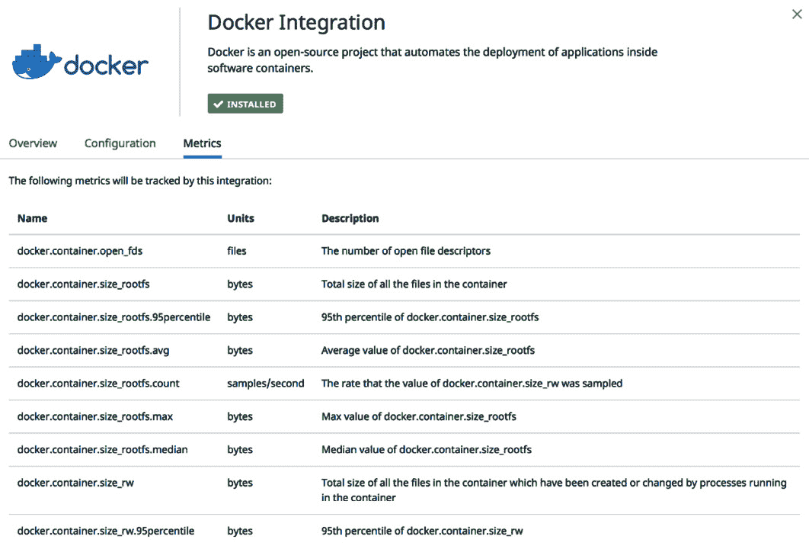

# *第二章*：部署 Datadog 代理

在上一章中，我们学习了监控工具的基石是帮助检查生产系统健康状况的一组指标。监控工具的主要任务是定期收集度量值作为时间序列数据，并根据为每个指标设置的阈值对问题进行警报。

监控工具常用的收集数据的方法是将代理进程运行在软件应用程序所在的地方，无论是裸金属服务器、虚拟机还是容器。这将使监控代理能够通过查询软件应用程序及其运行的基础设施直接收集度量值。

Datadog 通过多种方式收集这些数据，像其他监控工具一样，它也提供了一个代理。该代理从本地环境收集监控数据，并将其上传到 Datadog 的云端 SaaS 后端。在本章中，我们将学习如何配置 Datadog 代理以在生产环境中运行。

本章将涵盖以下主题：

+   安装 Datadog 代理

+   代理组件

+   作为容器的代理

+   部署代理 – 使用案例

+   高级代理配置

# 技术要求

要尝试本书中提到的示例，您需要具备以下工具和资源：

+   一个带有 Bash shell 的 Ubuntu 18.04 环境。Datadog 代理可以安装在多种操作系统上，Ubuntu 仅作为示例环境。

+   一个 Datadog 账户和一个具有管理员级别权限的用户。

+   Docker

# 安装 Datadog 代理

Datadog 代理可以通过多种方式进行配置，以便监控基础设施和运行环境中的进程，包括微服务。它可以在主机级别和作为微服务运行，实际配置通常取决于应用软件的部署方式。

## 运行时配置

有多种方式可以在运行时环境中部署 Datadog 代理来收集事件和数据，这些配置在很大程度上取决于应用程序的部署方式。例如，如果所有应用程序都直接在主机上运行，那么 Datadog 代理也会直接在主机上运行。我们来看一下常见的运行时配置。

Datadog 代理可以在本地以三种不同的方式进行配置，如下图所示。在所有情况下，代理除了收集特定于应用程序的指标外，还会收集基础设施健康状况的数据：

+   **作为主机上的服务监控应用进程**：在这种情况下，Datadog 代理服务监控一个或多个在同一主机上运行的应用进程或服务：

图 2.1 – Datadog 代理作为主机上的服务监控服务

+   **作为宿主机上的服务，监控应用容器**：在这种情况下，软件应用作为容器部署在 Docker 宿主机上，Datadog Agent 直接在宿主机上运行，监控容器和应用的健康状况：



图 2.2 – Datadog Agent 作为宿主机上的服务，监控微服务

+   **作为 Docker 宿主机上的容器，监控应用容器**：在这种配置下，Datadog Agent 和应用程序都作为容器运行在 Docker 宿主机上：



图 2.3 – Datadog Agent 作为微服务，监控其他微服务

真实环境中的配置可能会更复杂，但这些基本配置提供了关于如何部署 Datadog Agent 以收集监控数据的核心思路：



图 2.4 – Datadog Agent 与其 SaaS 后端通信

在这三种配置及其变体中，Datadog Agent 应能通过公司网络和互联网连接到 Datadog SaaS 后端，上传本地收集的指标。因此，配置公司网络防火墙以允许 Datadog Agent 发送流量是其正常运行的前提条件。尽管在大多数环境中，默认允许这种网络访问，但在一些限制性环境中，需要适当配置网络，才能顺利部署 Datadog。

一般来说，如果应用软件以微服务方式部署，最好将 Datadog Agent 也作为微服务进行部署。同样，在非微服务环境下，Datadog Agent 会直接在宿主机上运行。如果将 Agent 部署为微服务，维护任务（如版本升级）会非常简便，这也是在兼容环境中首选的方法。

## 安装 Agent 的步骤

Datadog 支持多种客户端平台，Agent 可以在这些平台上运行，例如 Windows、Kubernetes、Docker 以及所有流行的 Linux 发行版，如 Ubuntu、CentOS 和 Red Hat Enterprise Linux。作为示例，我们将讨论如何在 Ubuntu 宿主机上安装 Agent。在其他操作系统上，步骤类似，但会根据平台差异做适当调整。

在安装 Agent 之前，您需要注册 Datadog 账户。Datadog 允许您免费试用其大部分功能，试用期为 2 周。获得账户后，您将获得该账户的**API 密钥**。安装 Agent 时，必须指定 API 密钥，这样 Datadog 的 SaaS 后端就能将 Agent 流量与客户账户相关联。

对于示例步骤，我们将使用 Datadog 代理 7\. 旧版本也受支持，特定版本的步骤可以在官方文档中找到。

在 Linux 发行版中，安装步骤只需要执行一个可以从命令行执行的命令。要获取该命令，可以在 Datadog 仪表盘上按照以下步骤操作：

1.  点击**集成**主菜单，然后选择**代理**:

    图 2.5 – 获取安装步骤的代理菜单

1.  在左侧面板中，可以选择目标操作系统以查看可以用于在该平台上安装代理的命令：



图 2.6 – 目标平台特定的安装步骤

如你所见，对于 Ubuntu，我们有一个类似这样的命令：

```
DD_AGENT_MAJOR_VERSION=7 DD_API_KEY=<DATADOG_API_KEY> bash -c "$(curl -L https://s3.amazonaws.com/dd-agent/scripts/install_script.sh)"
```

基本上，这个命令设置了两个环境变量，分别指向要安装的 Datadog 代理版本和 API 密钥，下载安装脚本并执行它。

将 Datadog 代理直接安装在主机上就是这么简单。稍后我们将看到如何将其部署为容器。

一旦代理成功安装，它将尝试连接到 Datadog 后端。如果代理能够连接到后端，对应的主机将显示在仪表盘的**基础设施** | **主机地图**和**基础设施列表**下。这是快速验证代理是否正常工作的一个方法。

在 Linux 平台上，与安装过程相关的日志可在 `dd_agent.log` 日志文件中找到，该文件位于运行安装脚本的当前目录。如果安装过程失败，它会提供有关出错原因的提示。代理日志文件位于 `/var/log/datadog` 目录下。

如前所述，安装 Datadog 代理的步骤可以通过导航到**集成** | **代理**窗口获取。支持的操作系统和平台列在左侧面板中，点击所需的操作系统后，可以获得步骤，如 *图 2.6* 中的 Ubuntu 所示。

# 代理组件

Datadog 代理是由多个组件进程组成的服务，每个进程执行特定的任务。让我们详细了解这些组件，以便理解 Datadog 代理的工作原理。

在 Ubuntu 系统上，Datadog 代理服务的名称为`datadog-agent`。可以像其他服务一样，使用系统命令服务检查和维护此服务的运行状态。

`/etc/datadog-agent` 目录包含与在该机器上运行的 Datadog 代理相关的所有配置文件。YAML 格式的 `/etc/datadog-agent/datadog.yaml` 文件是主要的配置文件。如果对该文件进行了任何更改，需要重新启动 Datadog 服务才能使这些更改生效。

`/etc/datadog-agent/conf.d/` 目录包含与在该主机上运行的集成相关的配置文件。我们将在*第九章*《与平台组件集成》中看到集成的配置要求以及如何安装这些集成，本章专门讨论 Datadog 与云平台应用程序的集成。

Datadog Agent 服务主要有三个组件：

+   **Collector**（收集器）：顾名思义，收集器每 15 秒收集一次系统指标。其他类型的指标收集频率可能不同，Datadog 文档提供了相关信息。

+   **Forwarder**（转发器）：本地收集的指标通过 HTTPS 发送到 Datadog 后端。为了优化通信，收集到的指标会先缓存在内存中，然后再发送到后端。

+   默认情况下是 `8125`。StatsD 是许多监控工具提供的流行接口，用于与外部系统集成。DogStatsD 是 Datadog 提供的 StatsD 实现，并作为 Datadog Agent 的一个组件可用。本书后面将展示如何使用 StatsD 来实现轻量但非常有效的集成。

除了这三个组件外，还可以通过在 `datadog.yaml` 文件中指定它们来启动可选进程：

+   **APM agent**（APM 代理）：此进程支持 APM 功能，如果使用 APM 功能，则应运行该进程。

+   **Process agent**（进程代理）：为了收集主机上运行的实时进程的详细信息，需要启用 Datadog Agent 的该组件。

+   **Agent UI**：Datadog Agent 还提供了一个 UI 组件，该组件直接运行在 Datadog Agent 所在的主机上。这不是一种常用的选项，主机信息通常通过主仪表板查阅，仪表板能提供对基础设施及其上运行的应用程序的完整洞察。然而，这个 UI 组件可用于临时用途，例如在 macOS 和 Windows 等消费平台上的故障排除。

# 作为容器的 Agent

如前所述，Datadog Agent 可以作为容器安装在 Docker 主机上。尽管实际选项可能有所不同，以下是一个示例命令，说明如何将 Datadog Agent 作为容器启动：

```
DOCKER_CONTENT_TRUST=1 docker run -d --name dd-agent -v /var/run/docker.sock:/var/run/docker.sock:ro -v /proc/:/host/proc/:ro -v /sys/fs/cgroup/:/host/sys/fs/cgroup:ro -e DD_API_KEY=<DATADOG_API_KEY> datadog/agent:7 

```

本示例中，Datadog Agent 7 的 Docker 镜像是从 Docker Hub 拉取的。

当代理安装在主机上时，您已经看到`datadog.yaml`用于设置配置项。在 Docker 镜像中，这个选项是不可直接使用的。然而，任何自定义更改都可以通过设置相应的环境变量来完成。例如，在这个示例中，`api_key`通过传递`DD_API_KEY`环境变量来设置。在 Kubernetes 集群中，Datadog Agent 作为 DaemonSet 安装，该配置确保代理容器部署在集群中的所有节点上。`DD_API_KEY`被指定为 Kubernetes 密钥。Datadog 提供了多个模板，用于创建 Kubernetes 清单，这些清单可以用于在您的集群中部署 Datadog。`kubectl`用于配置和部署 Datadog Agent。

# 部署代理 – 使用案例

在本章开始时，我们探讨了多种运行 Datadog Agent 的运行时配置。在本节中，我们将探索一些实际案例，展示这些选项的应用。

## 所有主机上

这是一个经典配置，其中 Datadog Agent 和应用软件都直接运行在主机上。主机可以是裸机或虚拟机。每个主机上都会运行一个代理，将事件和度量数据报告到 Datadog 后台。

部署可以使用以下自动化或半自动化方法完成。在实际生产环境中，手动在主机上安装 Datadog Agent 可能不切实际，或者无法扩展：

+   Datadog Agent 可以嵌入到用于启动裸机或创建虚拟机的机器镜像中。例如，在 AWS 中，可以在**Amazon 机器镜像**（**AMI**）中预安装并预配置代理，以适应目标环境。

+   使用像 Ansible 这样的编排和配置管理工具，在多个机器上并行部署代理，以便操作任务能够扩展。

在公共云环境中，首选的方法始终是使用机器镜像，因为可以通过自动扩展等功能按需启动和关闭主机。在这种情况下，像使用 Ansible 这样的半自动化方法不可行。然而，Ansible 可以用于生成机器镜像和相关的配置任务。

## 主机上的代理监控容器

直接在主机上运行 Datadog Agent 简单灵活，且在某些操作需求下可能很有意义。Datadog Agent 可以像之前讨论的那样进行部署，但需要额外的配置更改，使代理能够发现并监控在主机上运行的容器。

容器本质上是短暂的，这种动态性也必须在监控中考虑。Datadog Agent 使用**自动发现**功能来识别和监控容器。

启动监控主机上运行的容器的最简单方法是启用 Docker 集成。尽管在不同的操作系统平台上启用的具体步骤可能略有不同，但以下在 Ubuntu 18.04 上启用的示例提供了所涉及的一般步骤：

1.  在 Datadog UI 中，导航到**集成**|**集成**，然后搜索 Docker：

    图 2.7 – 搜索 Docker 集成

1.  在 Docker 图标下，点击**安装**链接，完成后端的安装步骤。

1.  要获取主机端的配置步骤，即容器运行的地方，请点击 Docker 图标上的**配置**链接。点击后会打开一个包含所有所需信息的窗口，如下图所示：



图 2.8 – 启用 Docker 集成的步骤

在**配置**选项卡中提供的步骤会在主机上执行，以完成主机上的容器监控。我们很快就会看到如何执行。通过此集成提供的 Docker 专用指标列在**指标**选项卡中。

以下是在每个 Docker 主机上执行的步骤：

1.  将用户`dd-agent`添加到`docker`操作系统组：

    ```
    usermod -a -G docker dd-agent
    ```

1.  在`/etc/datadog-agent/conf.d/docker.d/conf.yaml.example`下会有一个示例配置文件。将该文件复制或重命名为`conf.yaml`，并添加以下设置：

    ```
    init_config:
    instances:
        - url: "unix://var/run/docker.sock"
          new_tag_names: true
    ```

1.  重启 Datadog Agent：

    ```
    service datadog-agent restart
    ```

    要验证 Docker 集成是否在主机上工作，可以从**基础设施**主菜单中查找**容器**仪表板，如下图所示：

    

    图 2.9 – Docker 容器的自动发现

    在**容器**仪表板上，通过在**筛选条件**字段中输入主机名来搜索特定主机，如前面的截图所示。

1.  启用 Docker 集成后，可以使用以`docker.*`为前缀的 Docker 专用指标。这些 Docker 指标可以在`docker.containers.running`指标中查找，当 Docker 集成启用时，用于查找`i-021b5a51fbdfe237b`主机上正在运行的容器数量。为此，请在**图表**字段中导航到`docker.containers.running`，在**筛选**字段中输入主机名。

    在 Docker 集成页面的**指标**选项卡下列出了完整的 Docker 专用指标，如下图所示：

    

    图 2.11 – Docker 指标列表

    启用 Docker 集成将只提供 Docker 专用指标。此示例中的特定应用程序 Redis 可能也会发布指标。要启用此功能，您需要执行与我们在启用 Docker 时所见的类似步骤。

1.  在主机上，示例配置文件 `/etc/datadog-agent/conf.d/redisdb.d/conf.yaml.example` 可以重命名或复制到 `/etc/datadog-agent/conf.d/redisdb.d/conf.yaml`，然后重启 Datadog Agent 完成配置。

    如果集成成功，你将能够查询到 `redis.*` 中的相关指标。

    如果某些步骤失败，无法通过前述方法直接验证主机上集成的启用情况。检查这一点的一种方式是通过运行以下命令查看 Datadog Agent 状态的输出：

    ```
    sudo datadog-agent status 
    ```

1.  在输出中，查找相关的集成。在本示例中，我们查看了 Docker 和 Redis，输出中会提到这些内容：

    ```
    docker
        ------
          Instance ID: docker [OK]
          Configuration Source: file:/etc/datadog-agent/conf.d/docker.d/conf.yaml
          Total Runs: 1
          Metric Samples: Last Run: 21, Total: 21
          Events: Last Run: 0, Total: 0
          Service Checks: Last Run: 1, Total: 1
          Average Execution Time : 63ms
          Last Execution Date : 2020-08-28 07:52:01.000000 UTC
          Last Successful Execution Date : 2020-08-28 07:52:01.000000 UTC
        redisdb (3.0.0)
        ---------------
          Instance ID: redisdb:fbcb8b58205c97ee [OK]
          Configuration Source: file:/etc/datadog-agent/conf.d/redisdb.d/conf.yaml
          Total Runs: 1
          Metric Samples: Last Run: 33, Total: 33
          Events: Last Run: 0, Total: 0
          Service Checks: Last Run: 1, Total: 1
          Average Execution Time : 91ms
          Last Execution Date : 2020-08-28 07:52:08.000000 UTC
          Last Successful Execution Date : 2020-08-28 07:52:08.000000 UTC
          metadata:
            version.major: 2
            version.minor: 8
            version.patch: 23
            version.raw: 2.8.23
            version.scheme: semver
    ```

如果出现问题，你会在相关部分看到错误信息。

部署策略包括将 Datadog Agent 和与你的环境相关的配置文件集成到机器镜像中，例如 AWS 中的 AMI。为了将来自主机上运行的容器的所有相关指标发布到 Datadog，需要一个定制的 Datadog Agent 配置文件和与各种集成相关的配置文件，类似于我们在示例中看到的配置。

## 作为容器运行的代理

这是在软件应用程序部署为容器时运行代理的首选配置。代理可以作为容器部署在 Docker 主机上，或作为服务部署在 Kubernetes 集群中。我们之前讨论过这些场景中的代理部署方式。

由于 Datadog Agent 是以容器形式部署的，因此不需要将其包含在用于启动 Docker 节点的机器镜像中。这提供了操作灵活性，因为在推出或升级使用的 Datadog Agent 时，无需更新机器镜像。

# 高级代理配置

主 Datadog 代理配置文件 `datadog.yaml` 可以根据你的具体监控需求进行更新。默认情况下，文件中只设置了 `api_key`。在实际环境中使用的 `datadog.yaml` 文件会有更多的配置选项。

接下来我们将介绍一些通常用于微调监控基础设施的重要配置项：

+   `proxy`：如果出站流量需要通过代理访问互联网，则需要配置此选项。支持 `http`、`https` 和 `no_proxy` 的典型代理设置。

+   `hostname`：如果需要使用特定的主机名进行报告，可以通过此选项进行设置。默认情况下，主机名是通过操作系统级别的工具自动检测的。

+   `tags`：一个非常重要的选项，始终用于标记代理报告的指标。可以指定多个键值对。

+   `collect_ec2_tags`：启用此选项后，可以将 AWS EC2 节点标签作为主机标签收集。

+   `config_providers`：要启用来自特定 Docker 镜像的容器自动发现，必须在此提供相关的配置。

+   `docker_labels_as_tags`和`docker_env_as_tags`：这些配置项可用于提取 Docker 标签和环境变量，并将其作为与相关容器收集的指标的标签。

    使用`kubernetes_pod_labels_as_tags`和`kubernetes_pod_annotations_as_tags`，Kubernetes 也可以提供类似的标签选项。

# 最佳实践

正如你所看到的，安装和配置 Datadog Agent 有多种方式，对于初次接触 Datadog 的人来说，可能会感到不知所措，不知道如何高效地部署和调优 Agent 以满足监控需求。然而，有一些明显的最佳实践，我们在这里总结如下：

+   如果 Agent 安装在主机上，计划将其包含在用于启动或启动主机的机器镜像中。

+   设置 Ansible 剧本或类似工具，以便对主机上的 Datadog Agent 进行临时更改。对于一些复杂的基础设施环境，尤其是在使用裸金属服务器的情况下，不推荐这种做法，因此可能需要进行一些现场更改。

+   当需要监控容器时，计划将 Agent 也作为容器进行部署。

+   计划通过适当配置 Agent，收集来自底层基础设施组件（如 Docker 和 Kubernetes）的标签。

# 概述

Datadog Agent 可以用于监控构建在各种云平台和操作系统上的经典环境和基于微服务的环境。为了将监控指标收集并发布到其 SaaS 后台，必须在本地环境中运行 Agent。Agent 可以直接在主机机器上运行，也可以作为 Docker 主机上的容器运行，或者作为微服务编排框架（如 Kubernetes）中的服务运行。本章介绍了部署 Datadog Agent 的各种配置选项及典型使用案例。

在下一章，我们将查看 Datadog UI 的关键特性。尽管大多数更改可以通过 API 完成，但 Datadog UI 是一个便捷的工具，既适用于用户，也适用于管理员，帮助他们查看 Datadog 的后台，特别是自定义仪表板，它提供了对基础设施和应用软件系统状态的可视化洞察。
