# 第三章：Datadog 仪表盘

在上一章中，我们了解了 Datadog 代理如何将监控指标上传到 Datadog 的 SaaS 后端。Datadog 仪表盘提供了一个极好的数据视图，可以通过常见的网页浏览器访问。管理员使用仪表盘执行多种任务 —— 管理用户账户及其权限、创建操作仪表盘、启用集成以及创建监控是常见的例子。仪表盘还提供了一个聊天窗口，供用户联系客户支持。

虽然仪表盘具有许多功能，但其中有些比其他的更重要，我们将在本章中详细研究这些功能。这些是重要的仪表盘功能：

+   基础设施列表

+   事件

+   指标浏览器

+   仪表盘

+   集成

+   监控

+   高级功能

# 技术要求

为了尝试本书中提到的示例，您需要拥有以下工具和资源：

+   一个运行 Ubuntu 18.04 环境并使用 Bash shell。示例也可能在其他 Linux 发行版上工作，但必须对 Ubuntu 特定的命令做适当的修改。

+   一个 Datadog 账户和具有管理员级别权限的用户。

+   一个 Datadog Agent 在主机级别或作为微服务运行，具体取决于示例，指向 Datadog 账户。

# 基础设施列表

一旦在主机上启动并运行代理，代理便开始向云端的 Datadog 后端报告。只要代理与后端之间的通信成功建立，主机将被添加到基础设施列表中。

基础设施列表位于 **基础设施** 主菜单下。最重要的包括 **主机地图** 和 **基础设施列表**：

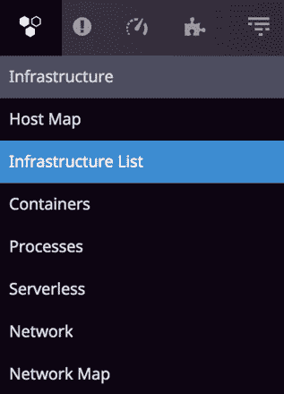

图 3.1 – 基础设施菜单选项

**主机地图** 菜单中的每个块代表一个代理正在运行的主机。在以下截图中，绿色表示代理正在运行并能够与后端通信。橙色表示通信出现问题；然而，它也表明在过去的某个时刻，相关的代理曾经能够连接到后端：

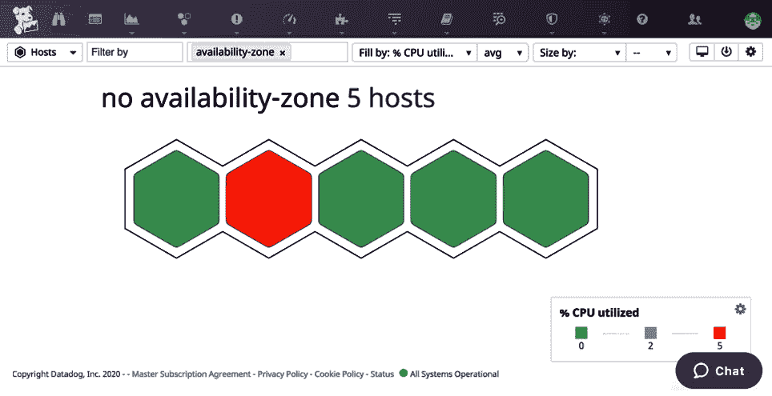

图 3.2 – 一个主机地图示例

通过点击特定块，您可以查看相关主机的监控详情，例如主机名、在主机级别定义的标签、各种系统级别信息以及正在监控的服务列表，如以下截图所示：

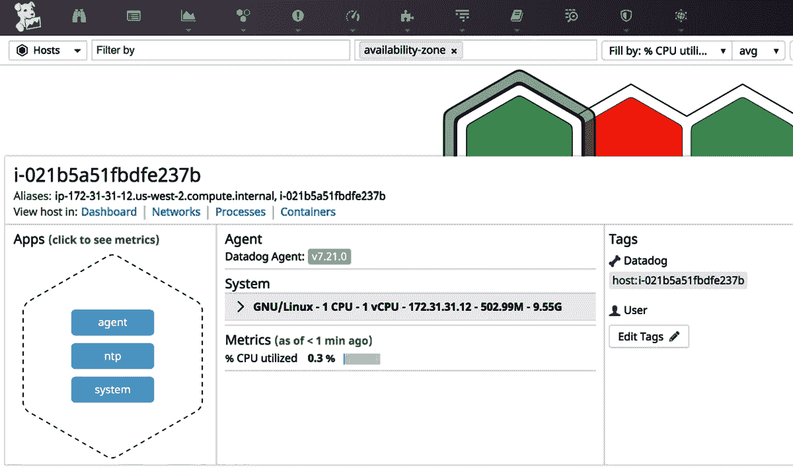

图 3.3 – 主机地图中的主机详情

这个主机级别的深入功能可以查看各种系统信息，避免了登录到主机去查看这些细节。

如下图所示，此界面上有链接可以带你到不同的主机特定仪表板。例如，**仪表板**链接将打开一个仪表板，在该仪表板中你可以查看各种基础设施指标，如 CPU 使用率、负载平均值和磁盘使用情况。

**基础设施列表**提供主机的表格视图，如下图所示：

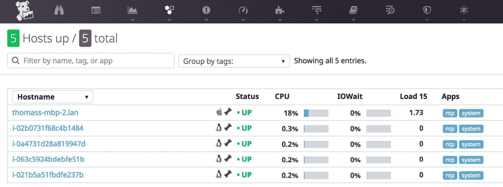

图 3.4 – 基础设施列表示例

该界面是主机列表的另一种视图，在提供特定主机监控信息方面，与**主机地图**没有太大区别。

你可以在**基础设施**菜单下查看更多选项，如**容器**和**进程**。顾名思义，可以在各自的仪表板中列出和搜索相关的运行时资源。

# 事件

大多数监控工具只专注于收集和报告时间序列指标数据。而 Datadog 除了报告这些数据，还会报告事件，这是其吸引人的特点之一。这些事件是系统级事件，例如 Datadog 代理的重启和新容器的部署：

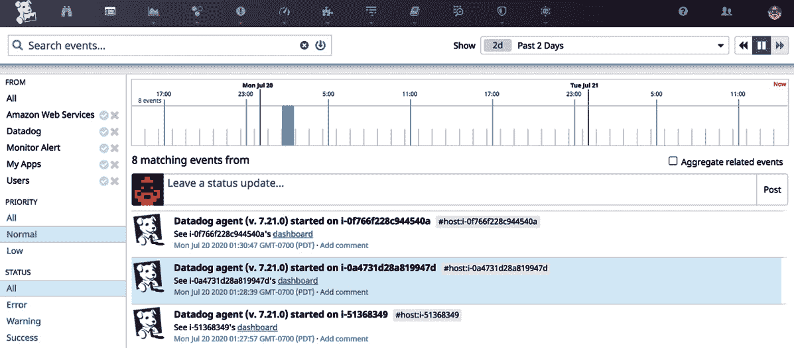

图 3.5 – 事件仪表板示例

可以通过 Datadog UI 中的**事件**主菜单选项访问**事件**仪表板。使用此仪表板，你可以直接向事件流添加更新，也可以对已经发布的事件进行评论。这个灵感来自社交媒体的功能在需要与远程团队沟通或澄清一些系统维护生成的事件时非常有用。

仪表板上列出的事件可以通过多种选项进行过滤，包括**搜索**。此外，还有一个聚合相关事件的选项，这在简化事件列表时非常有用。

**事件**是主要菜单选项之一，使用它可以访问仪表板。

# 指标浏览器

通过**指标浏览器**仪表板，可以查看和搜索 Datadog 收集的指标，仪表板可以通过主**指标**菜单访问：

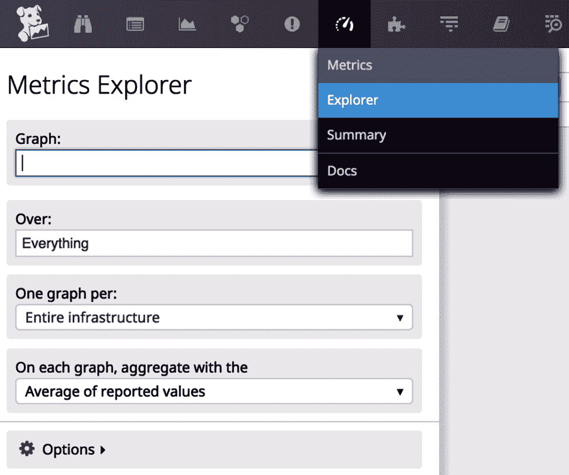

图 3.6 – 指标菜单选项

一旦在主机上运行的代理与 Datadog 后端连接，你就可以开始查看监控基础设施的各种指标。此功能是开箱即用的，无需特别配置：

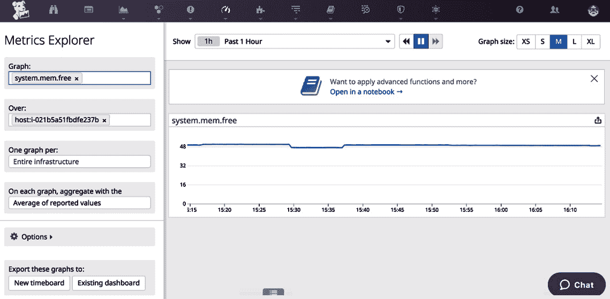

图 3.7 – 使用指标浏览器查看主机的可用内存

基础设施的指标名称以**system**为前缀，Datadog 文档中列出了开箱即用的所有可用指标的完整列表。

在**度量探索器**仪表板中，度量名称在**图表**字段中指定。系统有一个自动搜索功能，会根据你输入的文本字符串拉取可能的度量名称。可以在此字段中指定多个度量。

在 `host` 中，指向主机名。通过添加 `tags` 条目到 Datadog 代理配置文件中，可以非常轻松地为度量添加标签。

作为 Datadog 用户，你将定期使用**度量探索器**，原因如下：

+   查找与特定基础设施资源或应用程序相关的度量时间序列数据。

+   除了查找度量数据，还可以为相关数据创建图表，以添加自定义仪表板。

+   故障排除问题涉及发布自定义度量和标签。如果这些自定义功能有效，那么通过该仪表板查询自定义度量和标签并验证其可用性将变得容易。

# 仪表板

Datadog 仪表板是一个可视化工具，用于跟踪和分析度量。它提供了一整套丰富的功能，可以用来构建自定义仪表板，除此之外，还可以使用现成的仪表板。

**仪表板**主菜单选项包含两个选项：**仪表板列表**和**新建仪表板**：

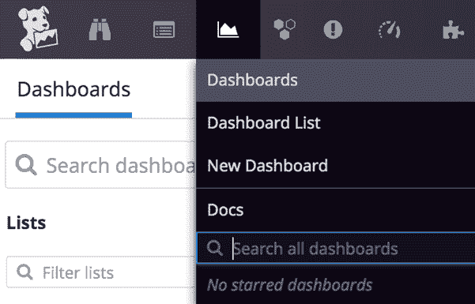

图 3.8 – 仪表板主菜单选项

**仪表板列表**菜单将列出所有按各种类别分组的仪表板。

在 Datadog 中可以创建两种类型的自定义仪表板：**Timeboards** 和 **Screenboards**：

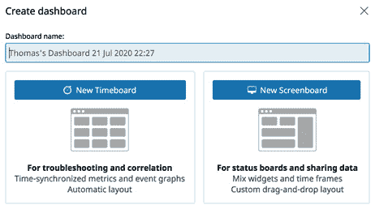

图 3.9 – Datadog 仪表板类型

**Timeboard** 类型仪表板中的图表将共享相同的时间框架，因此它对于并排比较多个度量非常有用。此功能使得**Timeboard**类型仪表板在故障排除时非常有用。**Screenboard**仪表板没有时间限制，可以将不同的对象组合在一起。从这个意义上来说，**Screenboard**类型仪表板更适合用于构建传统的监控仪表板。

现在，让我们来看一下如何创建**Timeboard**类型的仪表板，以便解释仪表板的创建过程。

第一步是设置仪表板的名称和类型，如前图所示。

在下一步中，你应该会看到**添加图表**选项。点击它后，你将获得添加不同类型小部件的选项，如下图所示：

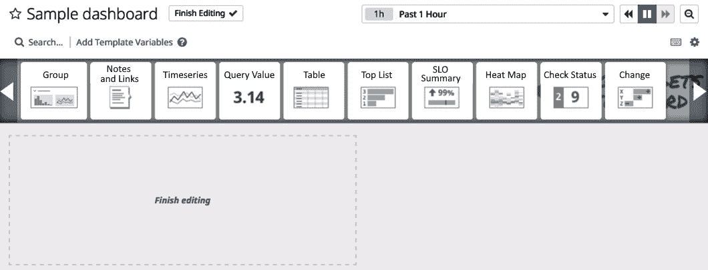

图 3.10 – Screenboard 类型仪表板的小部件

你需要的仪表板小部件可以从前面的列表中拖动到下方的仪表板区域。对于我们的示例仪表板，我们将使用一个**时间序列**小部件，这对于构建带有时间序列度量的仪表板非常有用。

在示例仪表板中，已为特定主机的 `system.cpu.user` 和 `system.disk.free` 指标添加了两个图表。

有几个选项可以帮助缩小您想要为图表实现的功能范围。在以下截图所示的图表中，可以选择任何可用的指标来绘制图表，并可以使用 **Graph your data** | **from** 下拉菜单中的选项进行过滤。在此示例中，已选择 **system.cpu.user** 指标，并将其过滤到单个 **i-021b5a51fbdfe237b** 主机：

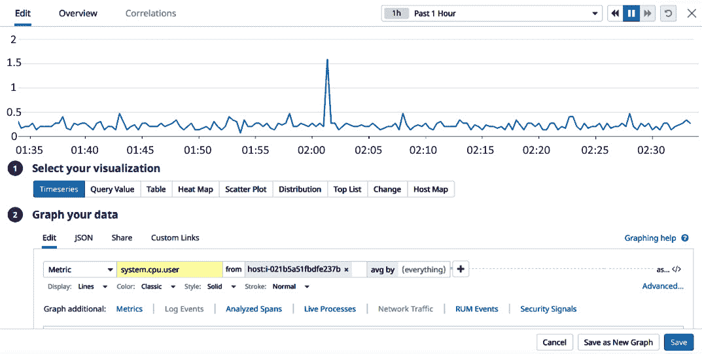

图 3.11 – 配置仪表板图表

如前所述，有几个选项可以帮助创建仪表板小部件。如果在您的组织中设置监控仪表板是一个重要需求，并且每个可能的选项都有文档可供参考，那么这是您需要通过实践掌握的领域。

以下截图显示了示例仪表板上的两个图表。同样，您可以创建更多图表，使其成为针对特定用途的完整仪表板。在这种情况下，仪表板上显示的是 `system.cpu.user` 和 `system.disk.free` 系统指标的时间序列图：

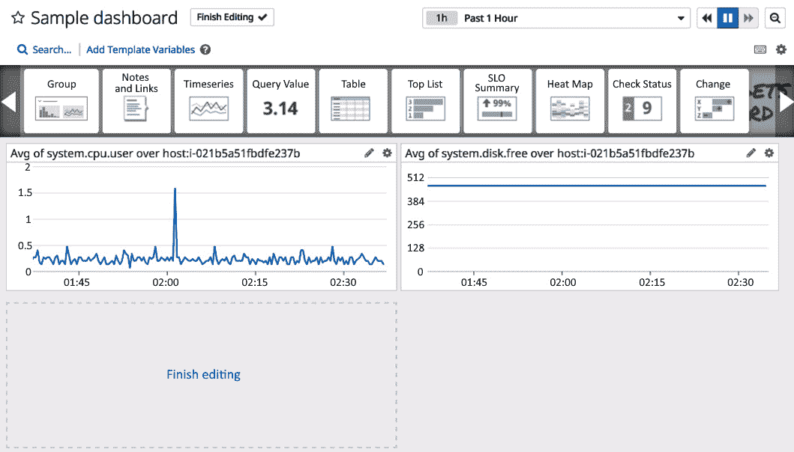

图 3.12 – 示例仪表板上的图表

每个这样的图表都可以使用 **Graph your data** | **Share** 选项共享并嵌入到 Datadog UI 之外，如*图 3.11*所示。点击此选项后，您将获得如下图所示的共享选项：

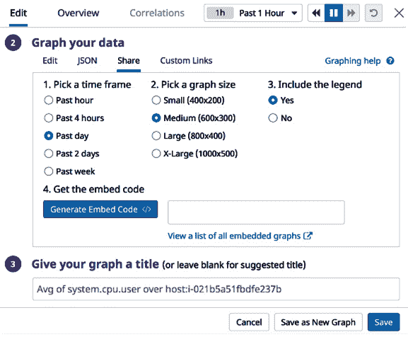

图 3.13 – 共享图表

共享图表的配置选项不言自明。基本上，它将生成一个可以用来将图表嵌入网页的 JSON 代码片段。

# 主要集成菜单

**集成**主菜单选项下列出的选项很重要，您将经常使用它们：

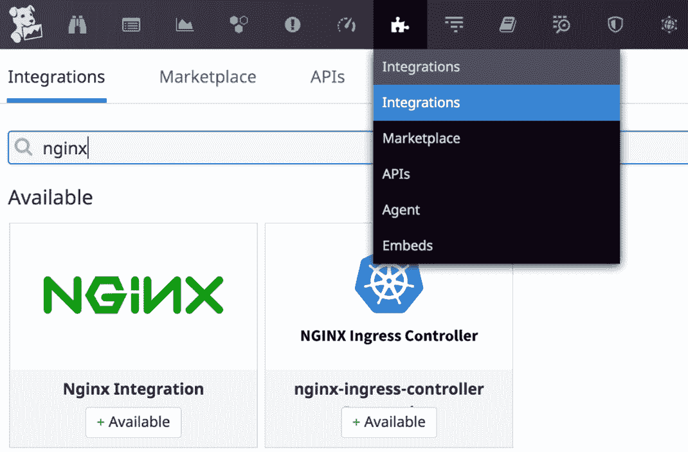

图 3.14 – 集成主菜单选项

现在，让我们看看在主菜单项**集成**下可以使用的选项。

## 集成

如下图所示，在此标签下，Datadog 与第三方工具的集成已开箱即用，可以查看并进行搜索：

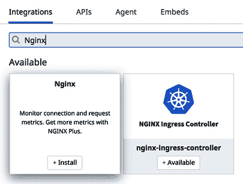

图 3.15 – NGINX 集成

例如，前面截图中显示的 NGINX 集成可以从仪表板安装。这只会在 Datadog 后端启用您的帐户集成。通常，基础设施方面需要完成额外的步骤，这些步骤将在仪表板中提供，如下图所示：

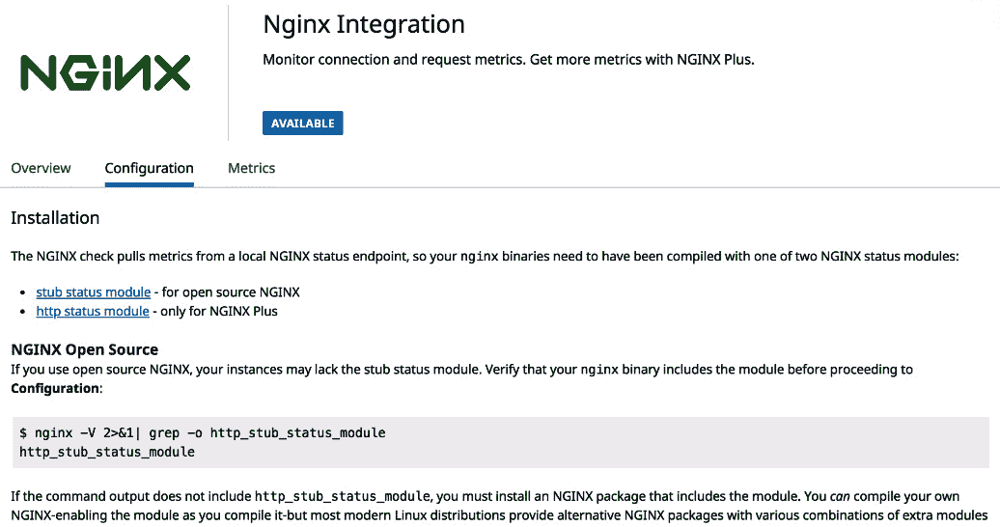

图 3.16 – NGINX 集成 – 配置

此外，该界面提供了通过此集成将可用的指标列表。以下截图展示了 NGINX 集成将发布的指标：

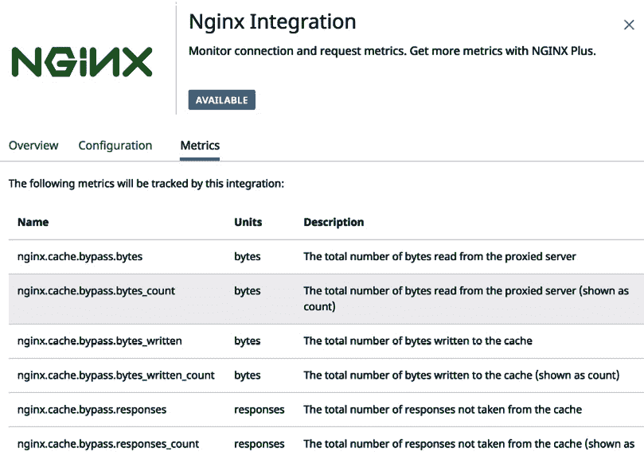

图 3.17 – NGINX 集成 – 指标

在运行 NGINX 的主机上，可以执行在基础设施端启用集成的步骤。完成所有集成设置要求后，特定于 NGINX 的前述指标将在这些机器中的每一台上可用，并且这些指标可以用于构建仪表板和监控。

## APIs

在 **集成** 仪表板上的 **APIs** 标签下，您可以找到所有与 Datadog 集成应用所需的资源。Datadog 提供 API 和网关，以程序化方式与其后端进行交互，成熟的监控系统将利用这些选项与 Datadog 集成，以便添加可能无法开箱即用的自定义指标和功能：

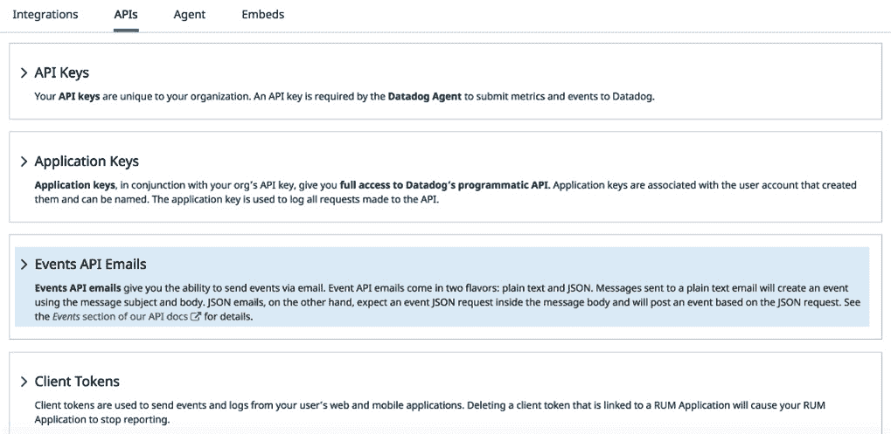

图 3.18 – 集成访问资源

以下是可以用来以客户端身份程序化访问 Datadog 后端的主要资源：

+   **API 密钥**：如您在上一章 *Datadog 代理* 中所看到的，API 密钥是将代理与您的账户相关联的信息，它是一个必须在 Datadog 代理配置文件中设置的配置项。

+   **应用密钥**：在执行 API 操作（如发布事件或指标）之前，脚本或应用程序需要通过 Datadog 后端进行身份验证。身份验证需要一个 API 密钥-应用密钥对，可以通过仪表板生成。

+   **事件 API 邮件**：这是一个邮件网关，事件可以发布到您的账户并显示在 **事件** 仪表板上。

+   **客户端令牌**：客户端令牌用于在 **真实用户监控** (**RUM**) 设置中发布事件和传输来自 Web 或移动应用的日志。

## 代理

在 **代理** 标签下，您可以找到安装 Datadog 代理所需的所有信息，适用于目标平台。通常，页面上会提供安装代理的命令行。

## 嵌入

我们已经在 *仪表板* 部分了解了如何创建和共享一个新的仪表板。该仪表板可以通过相关的 JSON 代码嵌入到网页中。通过此选项，共享的仪表板可以按如下方式列出：

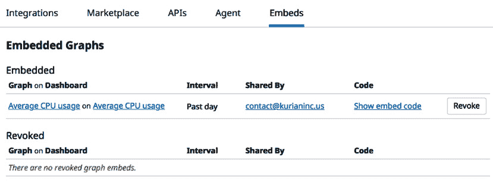

图 3.19 – 集成菜单中的嵌入选项

此外，可以使用 **撤销** 按钮从任何仪表板中撤销共享选项，如前面的截图所示。

我们已经查看了与集成相关的各种菜单选项。接下来，让我们探索监控选项。

# 监控

我们已经在*第一章*，“*监控简介*”中讨论了监控的基本概念。Datadog 提供了一个高级的监控实现，具有各种功能。监控可以通过仪表盘手动创建和维护。以下截图提供了该菜单项下的可用选项列表：

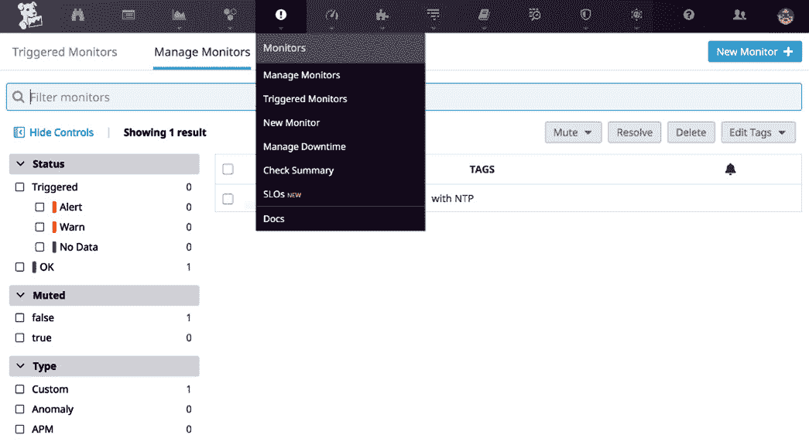

图 3.20 – 监控主菜单选项

我们将在*第八章*，“*监控与警报*”中更详细地讨论监控。在这里，我们将简要介绍可用的重要菜单选项：

+   **管理监控**：在此选项卡下，列出了所有可用的监控，用户可以从该列表中选择监控进行更新。

+   **触发的监控**：本质上，阈值设置在某个指标上，以定义监控，并且当阈值值达到时会触发。在此菜单下，列出了这些触发事件的列表。

+   **新建监控**：可以通过遵循此处提供的工作流程手动创建新的监控。尽管监控通常与指标相关，但 Datadog 提供了各种监控。我们将在*第八章*，“*监控与警报*”中更详细地讨论这一点。然而，在接下来的部分中，我们将学习如何设置一个简单的监控，帮助你了解基本概念。

+   **管理停机时间**：在停机窗口期间，即使监控达到阈值，也不会触发监控。停机的经典用途是在某些维护或部署活动期间静默监控。在此选项卡下，可以安排停机时间。

## 创建新的指标监控

在 Datadog 中，你可以设置多种监控，我们将在*第八章*，“*监控与警报*”中详细讲解所有内容。在这里，我们将学习如何创建一个基于指标的监控，这是最常见的一种监控。

从 Datadog UI 中选择**监控** | **新建监控**。选择**指标**作为**选择监控类型**选项。你将看到一个表单，用于配置新监控，以下截图展示了该表单（请注意，该表单未完全提供）：

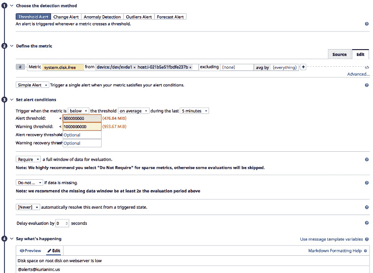

图 3.21 – 配置新监控

本质上，示例监控跟踪的是`/dev/xvda1`存储设备上的可用空闲磁盘空间，该设备是`i-021b5a51fbdfe237b`主机的根分区。当空闲磁盘空间达到 1 GB 时，它将发送警告消息；当空闲空间降至 0.5 GB 时，它将发送严重警告消息。这些警报被配置为发送到一个电子邮件地址。

要完成此操作，请执行以下步骤：

1.  在**选择检测方法**下，选择**阈值警报**。

1.  在**定义度量**下，选择**system.disk.free**作为度量，并在**from**字段中选择所需的主机和设备。

1.  在**设置警报条件**下，可以指定**警报阈值**和**警告阈值**。配置这些阈值，当度量值**低于**阈值时触发警报。

1.  在**说明发生了什么**下，你可以提供警报消息的模板，当度量值达到任意阈值时，系统会发送该消息。

1.  在**通知你的团队**字段中，可以指定警报接收人的电子邮件地址。

我们已经浏览了你可以在 Datadog UI 中使用的所有常见选项。界面提供了更多选项，可以使用 Datadog 提供的所有功能。在接下来的部分，我们还将简要介绍你可以通过 Datadog UI 访问的高级功能。

# 高级功能

在 Datadog 仪表板中有比我们到目前为止看到的更多菜单选项。不过，这些是你将定期使用的核心功能，特别是如果你是负责维护 Datadog 帐户的 DevOps 工程师。让我们来看一下其中的一些，并了解每个选项具体涵盖的内容：

+   **Watchdog**：Watchdog 是一种算法特性，它查看可用的度量数据，寻找任何不规则的模式。可以使用此选项创建监控器，提醒你注意这些异常。

+   **应用性能监控**（**APM**）：APM 是一个附加功能，如果您的帐户有相应许可证，则可以使用此功能。

+   **笔记本**：笔记本是一个按时间顺序收集的文本和图表集合。它用于记录具有高度可视化数据的特定问题，以图表形式呈现。

+   **日志**：此选项提供了访问附加功能**日志管理**的权限。

+   **安全**：可以从此菜单访问**安全监控**选项。我们将在*第十四章*中更详细地讨论此内容，*其他监控话题*。

+   **用户体验监控**：合成测试允许你以模拟的方式监控**用户体验**（**UX**）。此监控选项允许你通过不同的方法来监控用户体验。我们将在*第十三章*中讨论此功能，*使用 Datadog 管理日志*。

+   **真实用户监控**：**RUM**通过应用程序中嵌入的探针直接衡量实际的用户体验。这是一种我们在*第一章*中讨论过的最后一公里监控类型，*监控简介*。我们已经查看了与 Datadog 重要功能相关的 Datadog 仪表盘上可用的关键菜单选项。熟悉这些菜单选项非常重要，因为仪表盘是用户将定期用来与 Datadog 应用程序交互的主要界面。

# 总结

在本章中，我们查看了 Datadog 仪表盘菜单选项，这些选项是用户与 Datadog 后台交互的核心。仪表盘上有许多可用的功能，如监控的创建和维护，可以实现自动化。然而，Datadog 的仪表盘功能是业内最好的之一，创建自定义的运营和管理报告仪表盘非常简单。我们在这里讨论的功能可以由 Datadog 用户，尤其是管理员，定期使用。

在下一章，我们将学习如何管理您的 Datadog 账户。同样，仪表盘是管理员用于此目的的主要界面。
