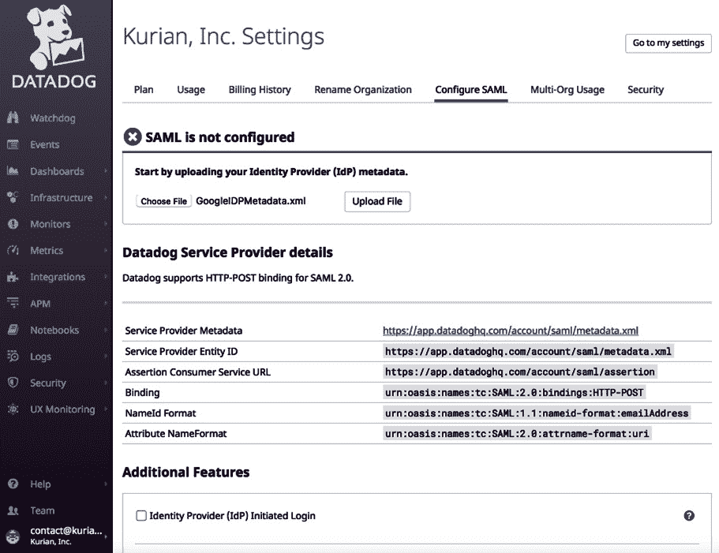
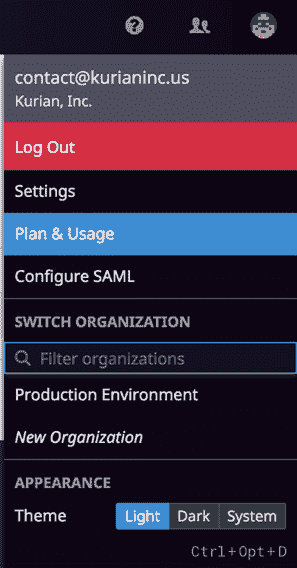

# 第四章：账户管理

在上一章中，我们介绍了 Datadog 用户界面的主要功能。账户管理功能也是用户界面的一部分，但由于账户管理是管理性质的功能，并不是所有 Datadog 用户都会访问这些功能，因此需要单独讨论。

Datadog 支持**单点登录**（**SSO**），并提供基于密钥的 API 支持。它还支持在客户账户中创建多个组织，用于构建隔离的监控环境，有时是为了满足分离开发和生产账户的合规要求，或隔离由 SaaS 提供商托管的客户端账户。

当创建用户时，可以首先通过使用现成的默认角色来设置该用户的权限，也可以通过管理员设置的自定义角色来精细设置。在 Datadog 账户中，可以创建多个组织来分组或划分需要监控的环境。虽然 Datadog 提供了本地身份验证系统供用户登录，但它也支持 SSO。可以为 Datadog 用户创建 API 和应用程序密钥对，并且密钥对可以用于以编程方式访问 Datadog。

本章涵盖了在 Datadog UI 上提供的所有账户管理功能，具体包括以下内容：

+   管理用户

+   使用角色授予自定义访问权限

+   设置组织

+   实现单点登录（SSO）

+   管理 API 和应用程序密钥

+   跟踪使用情况

# 技术要求

本章没有技术要求。

# 管理用户

在 Datadog 部署到一个主要涉及部署代理的环境中后，用户可以获得对 Datadog 接口的访问，这些接口提供有关基础设施和应用软件系统的洞察。虽然用户可以通过 API 访问 Datadog，但他们主要通过 UI 来查看可用的信息。

用户可以通过电子邮件发送邀请来添加，可以通过 Datadog 仪表板的主菜单项**团队**完成此操作。

以下截图是一个**团队**窗口的示例：


图 4.1– 主菜单团队窗口

用户可以通过**团队**窗口底部提供的表单进行邀请，如下所示：


图 4.2 – 团队窗口中的邀请用户表单

此外，还可以通过在**团队**窗口中使用**邀请用户**选项来完成：


图 4.3 – 邀请用户对话框

当邀请用户加入团队时，必须为该用户分配一个或多个角色。

这是可用的角色：

+   **Datadog 管理员角色**：顾名思义，具有此角色的用户是管理员，用户可以管理其他用户，并访问账单信息。

+   **Datadog 标准角色**：拥有此角色的用户可以完全访问 Datadog 的各种功能。

+   **Datadog 只读角色**：顾名思义，拥有此角色的用户可以仅以只读方式访问各种功能。通常，这种访问权限会分配给许多 Datadog 组织中的用户，这些用户负责覆盖生产环境。

正如你在本节中所看到的，用户的访问权限可以通过一个或多个预定义角色进行授予。如果预定义角色无法满足访问控制需求，可以通过角色更精细地定义用户访问权限。接下来我们将展示如何实现这一点。

# 使用角色授予自定义访问权限

每个角色都会授予用户一组权限，具体如下截图所示：


图 4.4 – 标准用户角色中的权限

虽然在大多数访问管理用例中，分配一个或多个预定义角色可能已经足够，但用户可以通过自定义角色分配更具体的权限。

自定义角色可以由管理员设置，并在此之后分配给用户。

以下是创建自定义角色时需要遵循的几个步骤：

1.  进入仪表盘上的**角色**页面（直接链接：[`app.datadoghq.com/access/roles`](https://app.datadoghq.com/access/roles)）。

1.  在页面的右上角，点击**新建角色**链接：

    图 4.5 – 创建新的自定义角色

1.  在**名称**字段中输入角色名称，从**权限**表格中选择要添加到角色的权限，然后点击**保存**按钮创建角色。

    重要说明

    现有的自定义角色也可以按照类似的步骤进行更新。

在本节中，我们已经看到如果预定义角色无法满足访问控制需求，可以通过自定义角色精细地定义用户访问权限。资源和用户可以在 Datadog 账户下按组织分组，接下来我们将展示如何配置这一点。

# 设置组织

在同一个 Datadog 账户中，可以设置多个组织。此**多组织**功能默认未启用，您必须向客户支持请求启用。多个子组织在需要为部分基础设施和其上运行的应用程序进行隔离监控时非常有用：

+   **开发和生产的专用环境**：在访问监控信息时，涵盖生产和非生产环境的信息在访问者和所需权限上可能非常不同。监控的重点通常是跟踪生产中的系统，并且相关信息的访问权限受到严格控制。尽管可以使用角色来细致控制访问，但一个简单且安全的方式是将监控划分为多个组织。

+   **为客户提供专用监控**：为了满足隐私合规要求，监控基础设施可能需要被隔离。如果有此需求，并且应用系统运行在托管基础设施上，则托管服务提供商应为托管基础设施及其上运行的软件系统提供专用监控。多组织功能提供了逻辑上的监控隔离，可以用来在同一个由托管供应商管理的 Datadog 帐户下，为每个客户推出专用监控。

一个组织可以与子域绑定，以便更好地识别。你需要通过客户支持启用此功能。一旦启用，你可以通过特定的 URL 访问一个组织，例如[`prod.datadoghq.com`](https://prod.datadoghq.com)。在这种情况下，子域“prod”指向一个组织。

现在，让我们看看如何设置一个组织：

1.  在客户支持启用多组织功能后，你将能够看到**新组织**功能，如下图所示：

    图 4.6 – 新组织选项已启用

1.  点击选项`生产环境`，以便使用这个新组织监控所有与生产相关的资源：

    图 4.7 – 创建新组织

1.  Datadog UI 将在创建新组织时切换到该组织。你可以通过点击**切换组织**部分下的相应标签，来在组织间切换，如下图所示：


图 4.8 – 切换组织

当前活动的组织会显示在同一菜单的顶部。

如果用户是 Datadog 帐户中多个组织的成员，则该用户可以在 Datadog 仪表板上切换不同的组织。

对于许多公司来说，**SSO**是满足公司或安全合规要求的必要条件。Datadog 支持多种 SSO 方法和提供商，我们将在接下来的部分详细介绍。

# 实施单点登录（SSO）

和其他流行的 SaaS 应用一样，Datadog 也可以设置为使用 SSO，允许用户使用第三方平台（如 Google）或内部认证平台（如**Active Directory**或**轻量级目录访问协议**（**LDAP**））的现有凭据登录 Datadog UI。

Datadog 使用**安全声明标记语言**（**SAML**）来实施 SSO 的第三方身份验证。

让我们看一下 Datadog 提供的几个关键单点登录功能：

+   可以使用行业标准的身份验证平台和提供商来实施 SSO，如 Active Directory、LDAP、Google、**AuthO**和**Okta**。

+   通过将 SAML 属性映射到 Datadog 用户角色，认证用户可以被授予相应的权限。

+   Datadog 支持 **Just-in-Time** 用户预配，避免需要预先创建用户的要求。用户在首次登录时将被创建。可以为 JIT 用户设置默认用户角色，并根据此设置设置新用户的权限。

尽管细节可能有所不同，基于 SAML 的 SSO 设置通常需要以下通用步骤：

1.  在第三方端设置第三方 SSO 提供者作为 SAML **身份提供者（IdP）**。完成此设置后，下载 IdP 元数据文件。

1.  使用**配置 SAML** 菜单选项在 Datadog UI 上，主要通过上传上一步创建的 IdP 元数据来配置 SSO：

    图 4.9 – 配置 SAML 菜单选项

1.  如果需要，从第三方应用启用 Datadog 的 SAML 认证。

1.  根据以下用户登录工作流之一验证认证设置：

    **Identity Provider (IdP)-initiated**: 在这种情况下，登录由身份提供者即第三方平台发起。选择此选项后，Datadog 用户可以通过第三方提供的仪表板发起登录流程，用户已经登录到第三方平台。

    **Service Provider (SP)-initiated**: Datadog 用户将使用 Datadog URL，如 [`app.datadoghq.com/account/login`](https://app.datadoghq.com/account/login) 来启动登录流程，这将将用户带到第三方平台进行身份验证。

现在让我们看看如何使用 Google 作为 IdP 提供者配置 SSO：

1.  Google 提供了生成 Datadog IdP 元数据的步骤。请按照 Google 管理应用中提供的步骤[`support.google.com/a/answer/7553768`](https://support.google.com/a/answer/7553768)生成并下载 IdP 元数据文件。

1.  在 Datadog UI 中，从**配置 SAML** 页面上传 IdP 元数据文件，如下截屏所示：

    图 4.10 – 上传 IdP 元数据文件

1.  一旦上传并加载了 IdP 元数据文件，点击**启用**按钮以启用 SAML，如下截屏所示：

    图 4.11 – 启用单点登录

1.  如果在上一步成功启用，您将看到可以用来登录 Datadog 的单点登录 URL。如果尚未登录，该链接将首先带您到 SAML 提供者，然后重定向到 Datadog UI。

1.  为了使上述工作流成功，用户需要事先在 Datadog 中设置好。Datadog 提供了一种名为即时配置（Just-in-Time Provisioning）的选项，本质上是从白名单域创建用户。这样可以避免在 Datadog 中显式配置用户的要求。配置可以通过以下截图进行：


图 4.12 – 即时配置（Just-in-Time Provisioning）

在前面的示例中，`kurianinc.us`是被列入白名单的域。任何使用该域并由 SSO 提供商认证的用户，都可以访问 Datadog，而无需事先在 Datadog 中创建该用户。该用户将在首次成功登录时创建。

与 Datadog 用户关联的密钥对跟踪该用户的所有帐户和访问信息，是通过编程方式访问 Datadog 的重要资源。让我们在接下来的部分中看看这些密钥对是如何管理和使用的。

# 管理 API 和应用程序密钥

当用户使用自己的凭证或 SSO 平台进行身份验证登录 Datadog UI 时，密钥对用于程序化访问场景中的身份验证，例如从程序发布指标或使用 Terraform 配置 Datadog 资源。在这两种情况下，过程独立于 Datadog 环境运行，并且必须进行身份验证。

API 密钥与组织相关联，应用程序密钥与用户帐户相关联。

密钥可以从**集成** | **API**页面进行设置：


图 4.13 – API 页面

一旦密钥对可用，就可以在以下 Python 代码片段中看到如何进行身份验证：

```
from datadog import initialize, api
options = {
    'api_key': '<DD_API_KEY>',
    'app_key': '<DD_APPLICATION_KEY>'
}
initialize(**options)
```

还有其他不太常用的选项可以间接访问 Datadog 以获取信息和发布指标：

+   `@dtdg.co`电子邮件帐户，用于通过发送电子邮件发布事件。

+   **客户端令牌**：客户端令牌用于对 Web 和移动应用进行仪表化，以便它们将日志和事件发送到 Datadog 后台。这主要用于衡量最后一公里的用户体验。

Datadog 提供了多种选项来跟踪您对 Datadog 服务的使用情况，让我们在下一部分中看看与此相关的重要功能。

# 使用情况跟踪

与其他 SaaS 服务一样，Datadog 的使用通常具有弹性，因为它通常部署在公共云中的基础设施上。

重要提示

请注意，Datadog 也可以在传统的裸金属环境中部署，但这种使用案例正在变得越来越少见。

由于计费与按需使用挂钩，因此管理员跟踪使用模式非常重要：

1.  使用**计划与使用**菜单选项，在您的用户资料下查看您订阅的计划的详细信息，以及 Datadog 作为服务的使用情况，如下图所示：

    图 4.14 – 计划与使用菜单

1.  点击**计划与使用**选项，你可以进入主页面，在此页面中查看和更新订阅计划、使用情况、账单和组织的详细信息。查看该页面上所有可用选项的截图如下：

    图 4.15 – 计划与使用页面，包含计划的详细信息

1.  在**使用**标签下，可以查看 Datadog 使用情况的详细信息，如下图所示：

    图 4.16 – 计划与使用页面上的使用标签

    从此页面，你可以查看 Datadog 在特定时间段内监控了多少台机器，这与账单有关系。此外，你还可以了解 Datadog 监控了多少个容器：

    +   在**账单历史**标签下，顾名思义，可以查看和下载账单历史及相关收据。

    +   在**Multi-Org**标签下，你可以查看汇总的使用情况和相关趋势。如果你将 Datadog 的使用分割到多个组织中，这将非常有用。例如，如果你导航到**Multi-Org 使用** | **长期趋势**，你可以看到如以下截图所示的各种使用情况：


图 4.17 – Multi-Org 标签下的整体使用趋势图表

1.  在**Multi-Org 使用** | **月度使用情况**标签下，你还可以查看按组织分类的逐项使用概况，如下图所示：


图 4.18 – 单个组织使用概况

我们已经查看了多个用于管理公司 Datadog 帐户及其 Datadog 用户的功能和选项，现在让我们来看一下管理 Datadog 帐户的最佳实践。

# 最佳实践

以下是一些与管理帐户和用户相关的最佳实践：

+   考虑为隔离生产监控与非生产基础设施上的监控、以及开发和测试新监控功能的各种监控环境而创建多个组织。这样可以保持生产监控的整洁与安全，防止任何意外的修改。

+   为生产监控创建自定义用户角色。使用预定义的用户角色可能会赋予用户比所需更多的权限。始终使用最小权限策略，并记住，监控通常是只读的，除非实现了自动问题解决。

+   为 Datadog 用户推出 SSO（单点登录）功能。

+   使用通过服务账户进行身份验证的主要程序访问，而不是通过真实用户进行身份验证，因为真实用户可能离开公司，删除用户密钥可能会破坏你的程序。

# 概览

账户和用户管理是一项管理任务，普通用户通常不会涉及，除非是执行诸如创建应用密钥之类的任务。多组织功能可以用于将账户划分为逻辑单元，我们查看了这些功能在不同场景下的应用。Datadog 支持使用 SAML 的行业标准 SSO 选项，我们学习了如何实现这些选项。有多种方法可用于编程访问，主要机制是使用密钥对，我们介绍了生成密钥对的步骤。可以通过自定义用户角色来实现对 Datadog 的细粒度访问，我们也学习了如何为用户配置这些角色的步骤。

这是本书第一部分的最后一章，概述了监控的一般情况，并特别介绍了 Datadog 以及如何开始使用它。在本书的后续部分和章节中，我们将详细讨论 Datadog 中监控功能的实现和使用。在下一章中，我们将进一步了解指标、事件和标签——Datadog 依赖的三个重要概念。
