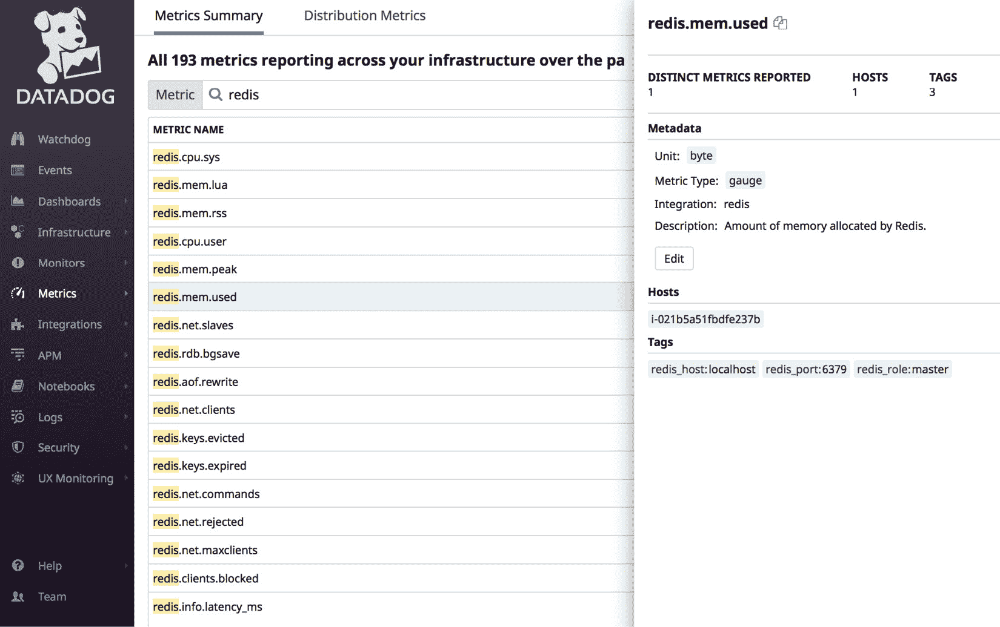

# *第五章*：指标、事件和标签

在本书的第一部分，我们讨论了一般的监控概念以及如何开始使用 Datadog，包括安装 Agent 和浏览 Datadog UI 的主菜单选项，Datadog UI 是终端用户可用的主要界面。在第一章中，我们还讨论了作为所有现代监控应用程序中的核心概念的指标，指标用于衡量软件系统的健康状况和状态。此外，我们还讨论了标签作为一种分组和过滤指标数据及其他监控信息（如 Datadog 生成的事件）的手段。

在本章中，我们将详细探讨 Datadog heavily 依赖的两个重要构件——指标和标签的实现方式。指标是用于报告 Datadog 中监控信息的基本实体。Datadog 还使用标签来组织指标和其他类型的监控信息，如事件和警报。讨论指标和标签是非常重要的，因为对指标进行适当的标签化对于从典型 Datadog 账户中可用的大量指标时间序列数据中提取有意义的信息至关重要。

虽然指标是任何监控系统中的核心概念，帮助持续衡量系统的健康状况，但事件捕获的是系统中发生的某个事件。进程崩溃、服务重启和容器重新分配都是系统事件的例子。指标是在特定时间间隔内进行测量的，并且与其相关联的是一个数值，而事件本质上不是周期性的，仅提供状态信息。标签可以用于组织、分组和仅搜索与指标一起使用的事件。

在本章中，我们将详细讨论指标、事件和标签。具体来说，我们将涵盖以下主题：

+   理解 Datadog 中的指标

+   标记 Datadog 资源

+   定义自定义指标

+   监控事件流

+   搜索事件

+   事件通知

+   生成事件

+   最佳实践

# 技术要求

要尝试本书中提到的示例，您需要具备以下工具和资源：

- 一个 Datadog 账户和具有管理员级别权限的用户。

- 一个运行在主机级别或作为微服务的 Datadog Agent，具体取决于示例，指向 Datadog 账户。

# 理解 Datadog 中的指标

软件系统及其运行的基础设施的健康状况由一组指标及其阈值定义。例如，在基础设施层面，如果机器上的 CPU 使用率低于*70%*，则对于特定用例可能被视为健康。当所有用于监控环境的指标报告的值都在正常范围内时，整个环境可以被视为健康。通过在监控中为这些指标设置相关的阈值，可以将问题报告为警报。Datadog 提供了定义基于指标的监控和警报的功能。

我们在*第二章*《*部署 Datadog Agent*》和*第三章*《*Datadog Dashboard*》中看到，已发布的指标可以在 Datadog UI 的**指标浏览器**中使用标签进行查看和过滤，如以下示例所示：

1.  导航到**指标** | **指标浏览器**以打开**指标浏览器**窗口：

    图 5.1 – 指标浏览器

1.  在`docker.cpu.usage`中。

1.  在`docker.cpu.usage`中，对于运行在主机上的特定容器来说意义最大，除非你有兴趣监控一台或多台机器上容器的平均或总 CPU 使用率。

1.  通过指定标签主机和`container_name`，你可以轻松地将范围缩小到特定的容器。你还可以看到，基于你在左侧窗格中选择的指标和过滤条件，右侧窗口呈现了一个时间序列图。

上述示例演示了指标和标签如何协同工作，从 Datadog 发布的大量时间序列指标数据中提取洞察。Datadog 实现的指标远比我们在*第一章*《*监控简介*》中讨论的基本概念要复杂得多；让我们来看看在 Datadog 中定义的与指标相关的一些概念。

## 指标数据

指标数据值是某一时刻的指标度量。例如，`system.memory.free` 指标跟踪主机上可用的空闲内存。Datadog 测量该指标并定期报告该值，这个值即为指标数据值。这样的一系列测量将生成一个时间序列数据流，如*图 5.1*所示。

## 刷新时间间隔

Datadog 在此时间窗口内处理接收到的指标值，并根据指标类型进行处理。

## 指标类型

主要的指标类型是计数、速率和仪表，它们在如何处理指标数据点以发布为指标值方面有所不同：

+   **计数**：在刷新时间间隔内接收到的指标数据相加，作为指标值返回。

+   **速率**：在刷新时间间隔内接收到的指标数据总和除以该间隔中的秒数，作为指标值返回。

+   **仪表**：在刷新时间间隔内接收到的最新值作为指标值返回。

## 指标单位

指标类型是一组相似的度量单位。例如，字节组是一种存储和内存度量类型，包含位、字节、千字节、兆字节、吉比特等单位。时间组包含从纳秒到一周的单位。有关指标单位的完整列表，请参阅 Datadog 文档 ([`docs.datadoghq.com/developers/metrics/units/`](https://docs.datadoghq.com/developers/metrics/units/))。

## 查询

一个查询返回来自时间序列指标数据集的值，基于给定的筛选条件和时间窗口。例如，`system.memory.free` 指标的时间序列数据将会报告给所有运行 Datadog Agent 的机器。

如果你只想在过去一小时内监控特定主机的指标，可以使用 Datadog 定义的 `host` 标签来缩小范围，指定一个特定的主机，同时你还可以指定时间范围。指定查询参数的方式取决于你使用的界面。例如，你已经看到如何在 Datadog 仪表盘上的 **Metrics Explorer** 窗口中运行查询，在那里这些参数是通过可视化方式指定的。

Datadog 在查询中识别以下部分：

+   `host` 标签将范围设置为单一主机。

+   `system.disk.free` 会为同一主机生成多个时间序列数据集，因为每个磁盘会生成一个数据集，并且通常一台主机会有多个磁盘。假设你有兴趣监控所有 Web 主机的总磁盘空间。如果这些主机使用自定义标签（如 `host_type`，值为 `web`）被标记为 Web 主机，则可以用它来设置范围，`host` 标签则可用于分组。

+   `system.cpu.*`、`system.load.*` 和 `system.mem.*`

    B. `system.disk.*`

    C. `system.disk.directory.*` 模式

    D. `system.processes.*` 模式

Datadog UI 上的 **集成** 页面提供了通过这些集成可用的所有指标的完整列表。与指标关联的元数据可以查看，并且一些设置可以在 **Metrics Summary** 窗口中编辑：

+   转到 **Metrics** | **Metrics Summary**，列出了所有指标。可以通过指标名称或与之关联的标签搜索特定的指标。查看以下屏幕截图，了解如何搜索 Redis 指标：


图 5.2 – 在 Metrics Summary 界面中搜索 Redis 指标

+   可以通过点击任何感兴趣的指标来查看该指标的元数据。在以下屏幕截图中，提供了 `redis.mem.used` 指标的汇总：



图 5.3 – redis.mem.used 指标汇总

使用该窗口上的 **Edit** 按钮，可以更改指标的描述和刷新时间间隔。它还提供了源主机和可用于筛选的标签。在这一部分中，我们了解了 Datadog 中如何实现指标的概念，并且它们如何在仪表盘上以不同方式呈现。在接下来的部分中，我们将讨论标签，这是与指标和其他资源一起使用的构造。

# 标签化 Datadog 资源

在本章的前几节中，我们已经提到过标签作为分组和过滤指标的手段。虽然标签的使用与其他系统中的关键字、标签或话题标签类似，但了解标签是如何应用到指标中的非常重要。标签也可以应用于其他 Datadog 资源，例如事件和监控。不过，我们将在接下来的部分集中讨论如何在处理指标时使用标签。

## 定义标签

以下是定义标签的主要规则和最佳实践：

+   标签应以字母开头，且可以包含以下字符：字母数字、下划线、连字符、冒号、句点和斜杠。

+   标签应该使用小写字母。如果使用大写字母，它们会被自动转换为小写。自动转换大小写可能会造成混淆，因此建议仅使用小写字母定义标签。

+   标签最长可以有 200 个字符。

+   标签的常见格式是 `<KEY>:<VALUE>`，这种格式准备好在查询的不同部分中使用，正如我们之前所看到的那样。Datadog 对某些标签保留了特定的关键字，例如 `host`、`process` 和 `env`，这些标签具有特殊含义，使用时应符合相关含义。

## 标签化方法

Datadog 提供了多种标签化指标的方法。然而，以下两种方法是最常见的：

+   来自 Datadog Agent 配置文件

+   从集成的配置文件中

这两种方法都是在 Datadog Agent 层面执行的。标签也可以通过 Datadog UI、使用 Datadog API 或作为 DogStatsD 集成的一部分来设置。

在 Datadog Agent 配置文件 `datadog.yml` 中，可以使用配置项 `tags` 来添加标签，如下所示：

```
tags: ["KEY1:VALUE1", "KEY2:VALUE2"]
```

这里有一种替代方法：

```
tags:
    - "KEY1:VALUE1"
    - "KEY2:VALUE2"
```

后者的语法在配置文件中更受推荐，因为它具有更好的可读性。

## 自定义主机标签

我们已经遇到过系统定义的 `host` 标签，它在过滤指标数据时非常有用。它默认基于 Datadog Agent 运行的机器的主机名进行设置，但可以通过在 `datadog.yml` 中设置 `hostname` 配置项进行自定义。

## 标签化集成指标

集成生成一个已发布的指标列表，并可以通过为集成配置 `tags` 配置项来为这些指标打标签：

```
tags:
    - "KEY1:VALUE1"
    - "KEY2:VALUE2"
```

例如，对于 Redis 集成，此更改在 `/etc/datadog-agent/conf.d/redisdb.d/config.yaml` 中完成。

除了从配置文件应用的标签外，一些集成还通过继承源应用程序和平台的标签来提供标签。最好的例子是 Datadog 集成从相关 AWS 服务中提取 AWS 标签。

## 来自微服务的标签

如果 Datadog Agent 部署在容器化环境中，Docker 和 Kubernetes 等相关应用程序的标签会自动收集。可以通过设置以下环境变量提取更多标签：

+   `DD_TAGS`：可以使用此环境变量设置主机级标签。

+   `DD_DOCKER_LABELS_AS_TAGS`：将 Docker 标签发布为标签。

+   `DD_DOCKER_ENV_AS_TAGS`：将 Docker 环境变量发布为标签。

+   `DD_KUBERNETES_POD_LABELS_AS_TAGS`：将 Pod 标签发布为标签。

## 使用标签进行过滤

在 Datadog 帐户中，某个度量的时间序列数据可以来自多个来源。例如，对于`system.disk.free`度量，同一主机可能会有多个时间序列数据流，因为该数据系列是为主机上的每个磁盘生成的。因此，数据可能需要以在大多数情况下有意义的方式进行分组，我们已经看到如何在**Metrics Explorer**和查询中使用标签来过滤数据并提取逻辑分组的度量数据。

标签的使用不仅限于过滤度量。这些标签也可以应用于其他 Datadog 资源，用于过滤和分组，就像对度量数据的处理一样。以下是可以被标记的主要 Datadog 资源：

+   事件

+   仪表盘

+   基础设施：主要是主机、容器和进程

+   监控

在 Datadog 中，标签的使用非常广泛，前面的列表仅涵盖了重要的资源。当某个特定资源类型（例如事件）的数量非常大时，没有标签的帮助，几乎无法追踪到特定实例。例如，关联到某种特定主机类型的事件可以通过适当地标记这些事件来提取。

无论何时需要查找某些信息的子集时，标签都用作搜索相关资源和度量数据的关键字。这意味着已发布到 Datadog 的监控数据必须做好标签，以便能够轻松提取该数据的子集。

Datadog 及其提供的各种第三方产品集成生成了我们在实际工作中使用的大部分度量。在接下来的部分中，我们将讨论自定义度量及其如何发布到 Datadog。

# 定义自定义度量

你已经看到，通过这些方法可以定义度量，并生成相关的时间序列数据：

+   通过启用核心基础设施集成，安装 Datadog 代理

+   通过启用 Datadog 提供的平台和应用集成

可以通过在相关配置文件中定义自定义标签，将其与前述的度量集合关联起来。某些集成还提供从源应用程序和平台继承标签的功能。

除了开箱即用或可以轻松启用的这组度量，Datadog 还提供了多种选项来定义自定义度量和标签。这是 Datadog 成为一个强大的监控平台的原因之一，它可以根据你的具体需求进行微调。

自定义度量需要设置以下属性：

+   **名称**：名称不得超过 200 个字符，应以字母开头，并且只能包含字母、数字、下划线和句点。与标签不同，指标名称是区分大小写的。

+   **值和时间戳**：指标值将与时间戳一起发布。

+   **指标类型**：如前所述，主要的指标类型有计数、速率和仪表。

+   **间隔**：这设置了指标的刷新时间间隔。

+   **标签**：专门为此指标设置的标签。

提交自定义指标有多种方式：

+   **Datadog Agent 检查**：Datadog Agent 可以配置为运行自定义脚本作为检查，并且可以利用该接口发布自定义指标。我们将在*第八章*中进一步了解如何实现自定义检查，*与平台组件集成*。

+   **Datadog REST API**：可以使用 Datadog 提供的 REST API 查看、创建和管理 Datadog 资源。自定义指标和标签也可以通过这种方式进行处理。当 Datadog 不与需要监控的软硬件系统紧密集成时，这种方式特别有用。我们将在*第九章*中学习如何使用 Datadog REST API，*使用 Datadog REST API*。

+   **DogStatsD**：这是 Datadog 实现的 StatsD 接口，用于发布监控指标。我们将在*第十章*中进一步讨论这一内容，*与监控标准一起工作*。

+   **PowerShell**：提供一个选项，从微软平台提交指标。

Datadog UI 有一个事件流仪表盘，我们将看到事件是如何在仪表盘上列出的，以及发布了哪些事件详情。在大规模环境中，事件流的数量可能相当大，你可能需要搜索感兴趣的事件。虽然大多数事件仅提供信息，但对于某些类别的事件，比如重要服务的停止，接收通知可能是有意义的。事件通常是由 Datadog 生成的，但 Datadog 也提供了生成自定义事件的功能，作为集成选项。

让我们看看 Datadog 是如何通过其事件流仪表盘开箱即用地处理事件的。

# 监控事件流

由 Datadog 生成或由应用程序发布的事件，提供了应用系统中发生的活动日志，特别是在基础设施和系统层面，例如主机出现一次性问题或服务重启。在 Datadog UI 中，事件流仪表盘列出了最新的事件，可以按如下方式查看。

点击**事件**菜单并在**显示**字段中选择一个时间窗口，以查看特定时间段内的事件。事件流仪表盘将如下所示：


图 5.4 – 事件流仪表盘

事件流中列出的事件已被分类，可以在仪表盘上按如下方式进行过滤：

+   **按来源**：在仪表盘的左侧窗格中，**FROM** 部分列出了事件的来源。

+   **按优先级**：在仪表盘的左侧窗格中，**PRIORITY** 部分列出了事件的优先级。

+   **按严重性**：在仪表盘的左侧窗格中，**STATUS** 部分列出了事件的严重性。

通过选择此处描述的一个或多个事件类型，可以在事件流仪表盘上筛选显示您需要查看的特定事件。如果仪表盘上选中了**聚合相关事件**选项，则相关事件将被聚合，如下图所示：


图 5.5 – 事件流仪表盘上的聚合相关事件选项

在接下来的部分，我们将看到如何在事件流仪表盘上定位特定的事件。

# 搜索事件

在一个大规模环境中，Datadog Agent 运行在数百台主机上，监控着运行在这些主机上的各种微服务和应用程序，每分钟都会有大量事件发布到事件流仪表盘。在这种情况下，手动查看事件流是不可行的，必须使用标准搜索方法来定位感兴趣的事件。Datadog 提供了多种搜索和筛选选项，以获取正确的事件集合。

如我们在前一部分所见，您可以在**显示**字段中指定一个时间窗口，仅查看特定时间段的事件。如以下截图所示，可以通过多种方式指定时间窗口：


图 5.6 – 过滤事件的时间窗口选项

时间可以按如下方式指定：

+   通过选择过去的固定时间段（分钟、小时或天）。

+   通过输入自定义时间窗口，如截图所示；此选项可以使用 Unix 时间戳。

提供了一个全文搜索选项，您可以使用它通过关键词查找事件。在以下示例中，使用了 `ntp` 关键词来列出仅相关的事件：


图 5.7 – 使用关键词搜索事件

可以保存关键词搜索以便将来使用。点击关键词搜索框中的向下箭头查看保存选项，如下图所示：


图 5.8 – 保存事件的关键词搜索

虽然上一个示例进行了简单的全文搜索，但 Datadog 查询语言可以用于进行更复杂的搜索，您可以使用以下一些重要的构造：

+   `sources`:`<source_name_1>`，`<source_name_2>`：在这种情况下，搜索将针对来自 `source_name_1` 或 `source_name_2` 的事件进行。

    同样，你也可以在查询中指定标签、主机、状态（错误、警告或成功）和优先级（低或正常）作为筛选条件。

+   可以使用 `OR`、`AND` 和 `NOT` 布尔运算符来组合基本搜索条件。以下是一些示例：

    `ntp` `OR` `nagios` 将搜索包含 `ntp` 或 `nagios` 关键字的事件。

    `tags:region:us-west-2 AND environment:production` 将搜索标记为 `region:us-west-2` 和 `environment:production` 的事件。

    `* NOT "ntp"` 将列出所有不包含 `ntp` 关键字的事件。

现在我们来看看如何接收事件通知。

# 事件通知

监控事件的常规方式是通过事件流仪表板进行搜索，特别是在基础设施或应用系统出现问题时，寻找一些线索来查明根本原因。事件在主动监控方面的作用有限，因为你只能在问题发生后才知道情况。然而，通知他人关于某些事件可能会很有用。此外，通过通知 Datadog 支持团队，也可以基于事件提交支持工单。

使用事件旁边的 **添加评论** 链接可以像以下示例一样发送通知：


图 5.9 – 事件通知

如图所示，事件通知可以发送到个人邮件、**所有人**和**Datadog 支持**。如果选择 **所有人**，组织中所有的 Datadog 用户将会收到事件通知。如果选择 **Datadog 支持**，将创建一个支持工单。

事件流与以下集成进行了集成，通过这些集成，事件详情可以转发到相关工具：

+   `@slack-<slack_account>-<slack-channel>`。

+   `@webhook_name`。(`webhook_name` 必须在 Datadog 中进行配置才能生效，我们将在*第九章*，*使用 Datadog REST API* 中看到如何操作。)

+   `@pagerduty`，事件详情可以作为警报转发到 **PagerDuty**。

在接下来的部分，我们将了解如何创建自定义事件并将其添加到事件流中。

# 生成事件

到目前为止，我们已经讨论了如何查看、搜索和提升由 Datadog 生成的事件。与指标和标签一样，Datadog 也可以创建自定义事件。此功能的主要用途是将事件流仪表板作为 **站点可靠性工程** (**SRE**) 和生产工程团队的沟通中心。

一个常见的场景是在受 Datadog 监控的环境中进行部署。在部署过程中，多个服务和进程将被重启，并且会产生大量事件。将部署作为事件发布，并附带详细信息，可能有助于缓解其他监控环境但没有积极参与部署过程的团队的担忧。

事件可以从事件流仪表板发布为状态更新。请看以下示例：


图 5.10 – 发布自定义事件

与创建和管理其他 Datadog 资源一样，事件也可以通过 Datadog API 程序化生成。这使得独立程序能够将事件发布到事件流。在前面的例子中，状态更新直接发布在事件流仪表板上。在更自动化的环境中，部署编排过程、**Jenkins 作业**或**Ansible playbook**可以使用 API 实现相同的操作。

发布事件的 API 地址为[`api.datadoghq.com/api/v1/events`](https://api.datadoghq.com/api/v1/events)，其有效载荷中的主要属性如下：

+   `alert_type`：值可以是 `error`、`warning`、`info` 或 `success`。

+   `priority`：值可以是 `normal` 或 `low`。

+   `source_type_name`：可用源的列表请见[`docs.datadoghq.com/integrations/faq/list-of-api-source-attribute-value/`](https://docs.datadoghq.com/integrations/faq/list-of-api-source-attribute-value/)。

+   `tags`：应用于事件的标签，用于过滤和分组。

+   `text`：事件正文。

+   `title`：事件标题。

我们将在*第九章*，*使用 Datadog REST API* 中详细学习如何使用 Datadog API。我们将在那里通过一个例子展示如何使用 Datadog API 向事件流发布事件。

现在，让我们来看看在 Datadog 中定义和使用指标、事件和标签的最佳实践。

# 最佳实践

以下是与创建和维护指标和标签相关的最佳实践：

+   确保启用了通过各种集成提供的所有标签。这主要涉及从源平台（如公共云服务、Docker 和 Kubernetes）继承标签。当复杂应用程序是你环境的一部分时，拥有更多标签有助于提高可追溯性。

+   从 Datadog Agent 和集成中添加更多标签，以便轻松划分你的指标数据，并高效追踪环境、服务和所有者。

+   为你的自定义指标使用带有句点的命名空间结构，这样可以方便地进行分组和定位——例如，`mycompany.app1.role1.*`。

+   根据指南格式化指标和标签的名称和值。如果其格式不符合规范，Datadog 会默默地对名称和值进行更改。这些更改后的名称可能会导致混淆，因为它们与预期的值不同。

+   如果发生某些事件，且从监控警报中无法立即获取足够的信息，请查询事件流以寻找线索。

+   从仪表盘发布可能有助于某些正在进行的活动的自定义消息，例如部署，特别是当你在分布式团队环境中工作时。

+   如果自动化过程对 Datadog 监控的资源有影响，考虑从自动化过程中发布事件到事件流。

+   使用通知选项向 Datadog 支持团队提交工单，若某个事件需要他们进一步调查。

# 总结

指标是现代监控系统的核心，Datadog 也不例外。Datadog 提供了丰富的选项来生成和使用指标。尽管标签在所有 Datadog 资源中都有通用用途，但它们的主要作用是对大量的指标数据进行分组和筛选。

在本章中，我们学习了如何定义指标和标签，以及如何通过标签对指标和其他资源进行分组和搜索。除了 Datadog 定义的指标和标签之外，还有多种方法可以添加自定义的指标和标签，其中一些方法在本章中已经讨论过。

事件是 Datadog 监控的基础设施或应用系统中的活动。Datadog 会捕获并在事件流仪表板上列出这些事件。可以通过多种方式搜索事件，包括使用关键词和标签。事件还可以转发到不同的渠道，如电子邮件、Slack 和 PagerDuty。

在下一章中，我们将了解如何在 Datadog 中管理监控事件。我们还将学习如何搜索这些事件，以及如何发布自定义事件。
