# 第六章：监控基础设施

在上一章中，我们了解了在软件系统中发生的事件，这些事件对于监控非常有用，并且它们在 Datadog 中的处理方式。指标和事件与标签结合后，为 Datadog 用户提供了一套丰富的数据，并可以用来对信息进行分组和过滤，以满足多种监控需求。

在*第一章*，*监控简介*中，我们了解了构成全面、主动监控过程的不同类型监控。基础设施监控是其中的一种基本监控类型，主要关注监控应用系统运行的计算、存储和网络基础设施。所有主要的监控应用都提供开箱即用的基础设施监控功能。而在许多组织中，监控的范围有时仅限于此类型的监控。Datadog 为基础设施监控提供了出色的支持，我们将在本章学习这些内容。我们将具体探讨以下主题：

+   主机清单

+   列出容器

+   查看系统进程

+   监控无服务器计算资源

# 技术要求

若要尝试本书中提到的示例，你需要安装以下工具并确保资源可用：

+   一个 Datadog 账户和一个具有管理员权限的用户。

+   在主机级别或作为微服务运行的 Datadog Agent，具体取决于示例，指向 Datadog 账户。

# 主机清单

在 Datadog 中，有两个界面提供主机列表：**主机地图**和**基础设施列表**。这些界面上列出的每个主机上都将运行 Datadog Agent。该主机可以是裸金属机器，也可以是已在公共云服务（如 AWS 或 Azure）中配置的**虚拟机**（**VM**）。

让我们首先看看**主机地图**功能。要访问该界面，请在 Datadog 仪表板上导航至**基础设施** | **主机地图**。你将看到一个类似于以下内容的仪表板：

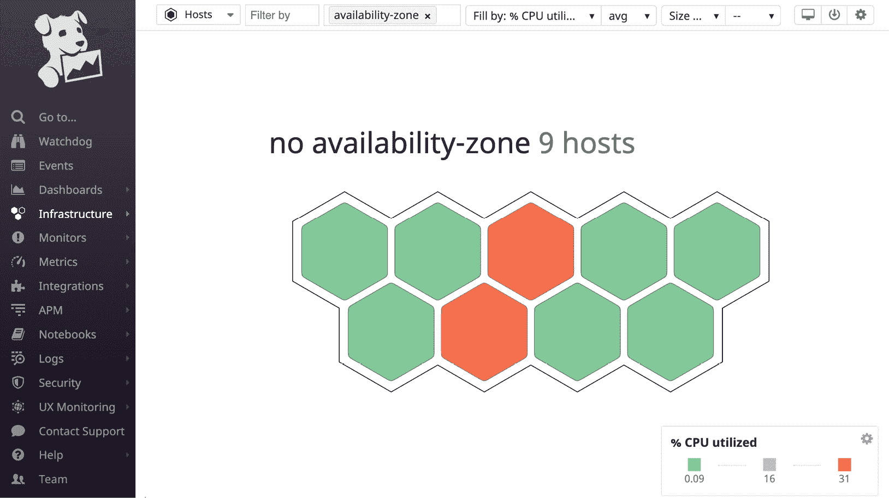

图 6.1 – 示例主机地图

仪表板上的每个六边形图标代表 Datadog 监控的基础设施中的一个主机。主机的 CPU 利用率（以百分比表示）通过颜色编码表示，较低的使用率用绿色表示，较高的使用率用橙色表示。仪表板右下角的图例提供了颜色编码的详细信息。图例中提供的齿轮按钮可以用来根据个人喜好自定义颜色编码。

六边形的大小可以与某个度量的值相关联。在此情况下，属于某主机的六边形大小将与该主机报告的度量值成正比。要在主机图中的六边形中使用*百分比 CPU 利用率作为大小*度量，请从仪表板右上角的**填充方式与大小方式**下拉菜单中选择该度量。生成的主机图将如下所示：

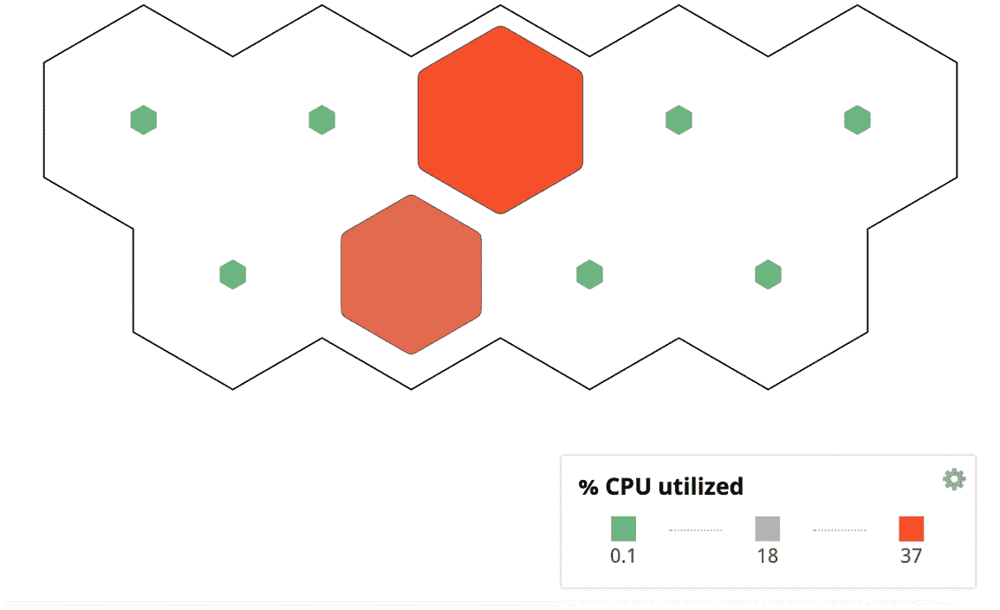

图 6.2 – 使用大小选项的主机图

如您所见，六边形对于那些 CPU 利用率较低的主机来说较小。任何由主机发布的其他度量都可以用于此目的。

**主机图**仪表板上列出的主机可以通过可用标签进行筛选和分组。使用标签搜索特定主机集通常非常有用。例如，在故障排除时，如果基础设施中有成百上千的主机，缩小搜索范围到少数主机会更为方便。

让我们来看看使用标签筛选主机时可用的选项。

通过在**按标签筛选**字段中选择一个或多个标签，仅会列出相关的主机，如下所示：

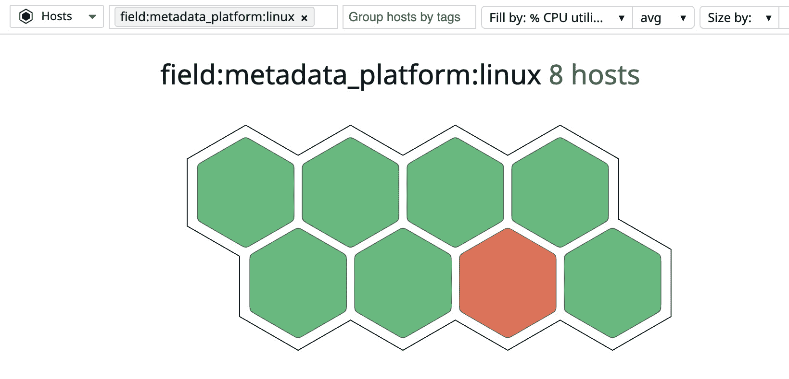

图 6.3 – 启用过滤器的主机图

在此案例中，`metadata_platform:linux`标签被用作筛选器，以仅查看 Linux 主机。

通过在**按标签分组主机**字段中选择一个或多个标签，主机可以在**主机图**仪表板上按簇列出，如下所示：

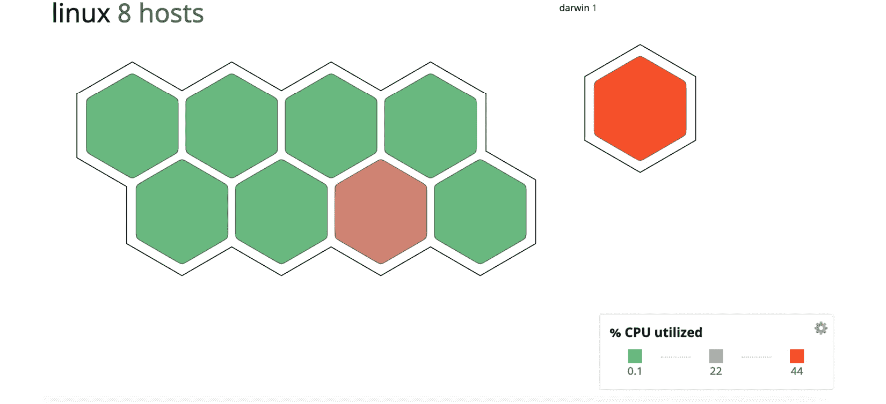

图 6.4 – 主机图与分组主机

在此情况下，用于分组主机的标签是`metadata_platform`。在此处，我们可以看到五台 Linux 主机被分组在一起，而单独的 Mac (**darwin**) 主机则与 Linux 组分开显示。

重要说明

**按标签分组主机**选项仅使用标签的键，而**按标签筛选**选项还需要标签的值。

如您所见，已经有多种方式可以在**主机图**仪表板上列出和定位主机。如果您想查看特定主机，可以点击它，这将打开另一个窗口，显示该主机的放大版，并包含特定主机的详细信息：

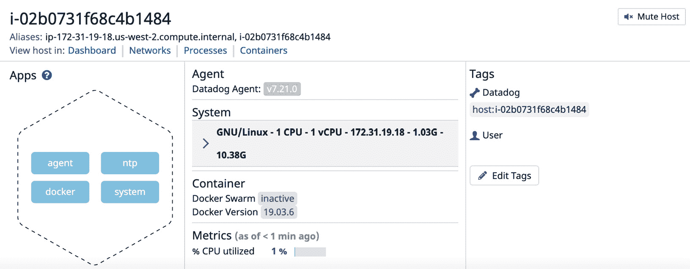

图 6.5 – 主机图，放大显示主机详细信息

此界面提供了主机级别的信息和与之相关资源的链接，便于您收集主机的所有详细信息，无论是在静态情况下还是在运行时。

可以从主机仪表板中查看以下资源的详细信息：

+   **应用**：列出了有关已为该主机实施的集成的详细信息链接，形状为六边形。

+   **代理**：代理的版本。

+   **系统**：此处提供了操作系统级别的详细信息，可以深入多层次查看。

+   **容器**：如果主机上运行着容器，相关信息将在此显示。

+   **指标**：最近发布的主机级指标列在此处。

+   `host` 标签指向主机名称，默认情况下可用，更多`host`级别的标签可以在 Datadog 代理配置文件中使用`tags`选项进行设置。

在此界面的顶部，提供了主机名称和主机别名。此外，以下与主机相关的仪表板链接也可在同一位置找到：

+   **仪表板**：这是一个特定于主机的仪表板，包含有关重要主机级指标的图表。我们将很快查看这个仪表板。

+   **网络**：**网络性能监控**的仪表板。启用此功能需要在 Datadog 代理中进行配置。

+   **进程**：如果启用了 Datadog 代理中的实时进程功能，则此仪表板将显示主机上正在运行的进程的详细信息。我们将在*系统进程*部分详细查看。

+   **容器**：此链接将引导您到显示主机上运行的容器的仪表板。

现在，让我们来看看可以从**主机图**放大窗口访问的一些详细仪表板。

通过导航到**应用** | **代理**，您可以弹出一个列出 Datadog 代理特定指标的仪表板，如下图所示：

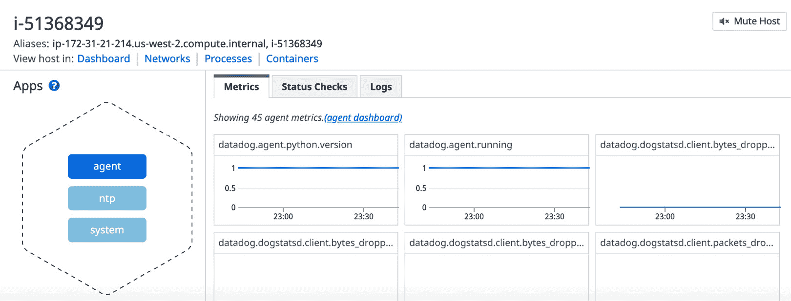

图 6.6– Datadog 代理特定指标

**datadog_agent.** 类别的指标对于监控应用系统不直接有用，但它可以提供有关 Datadog 代理在特定主机上运行状况的洞察。

通过导航到**应用** | **系统**，您将看到一个包含关于主机核心基础设施指标的图表的仪表板，例如 CPU 使用率、负载平均值、磁盘使用率和延迟、内存可用性和使用情况，以及网络流量。以下截图展示了这样的示例仪表板：

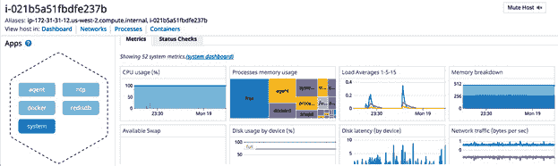

图 6.7 – 带有系统指标的主机仪表板

我们已经看到，在*图 6.5*中的**应用**部分列出的块链接与在该主机上运行的集成相关。除了我们刚才查看的常见链接，如**代理**和**系统**外，其余的链接将取决于在主机上启用了哪些集成。例如，在*图 6.5*中，显式启用了**docker**和**redisdb**。点击**docker**，将弹出一个包含 Docker 特定指标图表的仪表板，如下图所示：

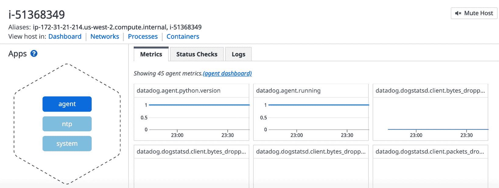

图 6.8 – Docker 指标仪表板

通过导航到**应用** | **系统**，我们可以看到如何查看包含系统级别指标的主机仪表板，正如*图 6.7*所示。

通过点击**查看主机：** | **仪表板**链接，在主机缩放窗口中可以以更好的方式查看系统指标。此仪表板为每个系统指标类别提供图表，便于检查某一时间范围内的指标。接下来，我们来看看这些系统指标中哪些构成了基础设施监控的核心内容。

对于每一类系统指标，主机仪表板上都提供了一个小部件，并绘制了相关的指标图表。通过使用右上角可用的菜单选项，可以进一步深入查看这些小部件。

点击左侧按钮，可以以全屏模式查看该小部件，并提供更多选项。中间按钮会弹出一个与管理图表相关的菜单。右侧按钮提供图表中使用的指标的详细信息。以下是这些菜单的截图，其中中间按钮被高亮显示：

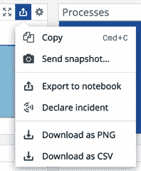

图 6.9 – 小部件常见菜单选项

现在，让我们看一下主机仪表板上可用的主要小部件。

## CPU 使用情况

通过将鼠标悬停在**CPU 使用情况**图表上，可以在仪表板上显示相关指标，如下图所示：

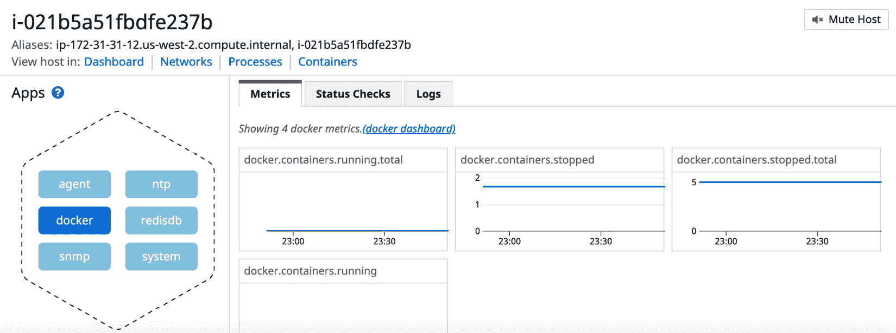

图 6.10 – CPU 使用情况指标

这些是主要的 CPU 使用情况相关指标及其含义：

+   `system.cpu.idle`：CPU 花费时间处于空闲状态的百分比。

+   `system.cpu.system`：CPU 花费时间运行内核的百分比。

+   `system.cpu.iowait`：CPU 花费时间等待 I/O 操作完成的百分比。

+   `system.cpu.user`：CPU 花费时间运行用户空间中的进程的百分比。

通过跟踪这些指标，你将对主机的 CPU 使用情况有一个整体的了解，通过在这些指标上建立监控，可以使这些指标的跟踪实现自动化。

## 负载平均值

运行某些基于 UNIX 的操作系统（如 Linux 或 macOS）的主机负载，是通过运行在主机上的并发进程数量来衡量的。通常，负载会跟踪过去 1 分钟、5 分钟和 15 分钟的平均值。因此，UNIX 命令如 `uptime` 返回的就是负载平均值的三个测量值，如以下示例所示：

```
$ uptime
12:18  up 2 days,  3:29, 4 users, load averages: 1.45 1.71 1.76
```

主机的负载平均值数据在**负载平均值**图表上进行绘制，该图表位于**主机**仪表板上，如下图所示：

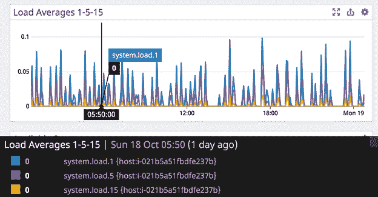

图 6.11 – 主机仪表板上的负载平均值图表

通过将鼠标悬停在图表上，可以显示 1 分钟、5 分钟和 15 分钟负载的平均值，如前面的截图所示。此类别中的重要指标如下，所有指标名称都有自文档说明：

+   `System.load.1`：过去 1 分钟的平均负载

+   `System.load.5`：过去 5 分钟的平均负载

+   `System.load.15`：过去 15 分钟的平均负载

在本节中，我们查看了与系统负载相关的指标。现在，让我们来看交换内存指标。

## 可用交换空间

Linux 主机上的交换空间允许将内存中不活跃的页面移动到磁盘，以腾出 RAM 空间。以下系统指标在主机仪表板上的图表中绘制：

+   `system.swap.free`：空闲交换空间的大小，以字节为单位

+   `system.swap.used`：已使用的交换空间大小，以字节为单位

交换空间相关的指标可以在仪表板上查看，如下方截图所示：

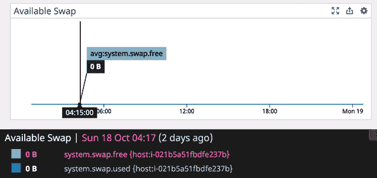

图 6.12 – 可用交换空间

除了在此图表中使用的指标外，Datadog 还发布了更多与交换空间相关的指标，这些指标也可以用于自定义图表和监控。

## 磁盘延迟

存储设备的磁盘延迟由处理 I/O 请求的延迟决定，其中还包括队列中的等待时间。这个值由 `system.io.await` 指标跟踪：

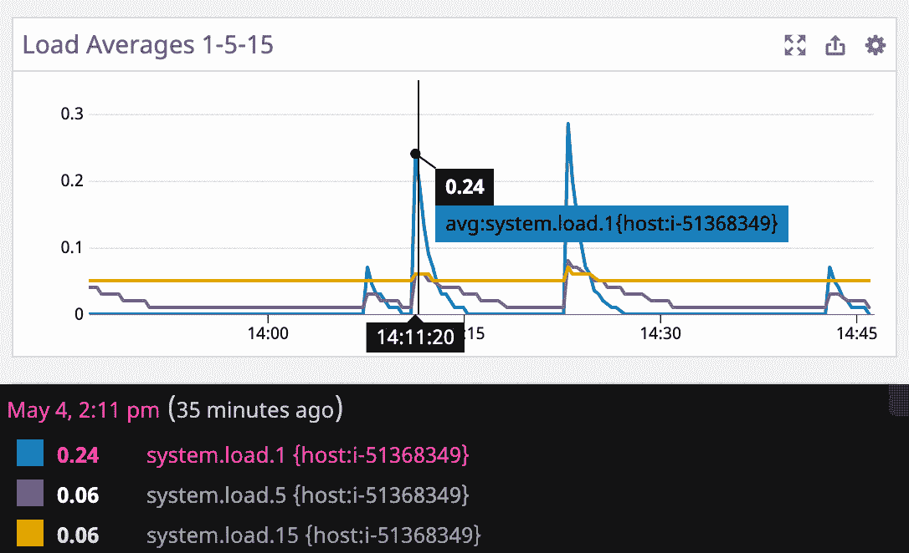

图 6.13 – 磁盘延迟小部件的全屏模式

此指标值针对主机上的每个存储设备进行报告。在前面的截图中，提供了此小部件的全屏模式的示例视图。

## 内存细分

虽然 Datadog 发布了与主机上可用内存及其使用情况相关的多项指标，但此小部件仅显示两个指标：`system.memory.usable` 和 `system.memory.total` 与 `system.memory.usable` 的差值，后者提供了保留内存的估算值：

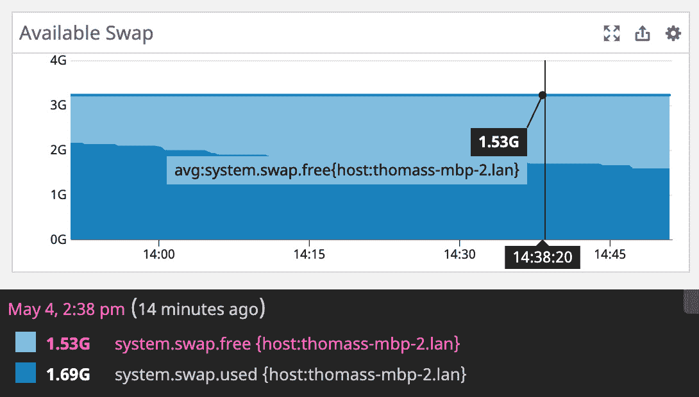

图 6.14 – 内存细分小部件的全屏视图

这些是静态指标，不提供有关主机内存动态使用情况的信息。现在，让我们来看一下此类别中一些重要的指标：

+   `system.mem.cached`：缓存中使用的 RAM 量，以字节为单位

+   `system.mem.free`：空闲 RAM 量，以字节为单位

+   `system.mem.paged`：用于分页的物理内存量，以字节为单位

+   `system.mem.used`：已使用的 RAM 量，以字节为单位

在本节中，我们已查看了与内存相关的重要指标。在下一节中，我们将看看如何使用相关指标监控磁盘存储使用情况。

## 磁盘使用情况

跟踪附加到主机的磁盘存储使用情况是基础设施监控中最常见的方面之一。这个小部件使用`system.disk.in_use`指标来绘制每个设备的磁盘使用情况，该指标表示设备上已使用的磁盘空间占总可用空间的比例：

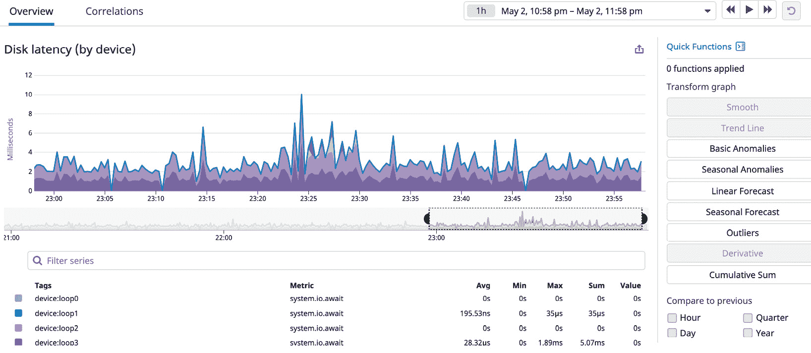

图 6.15 – 磁盘使用情况小部件

Datadog 发布了几个与磁盘相关的指标。重要的指标如下：

+   `system.disk.free`：设备上空闲的磁盘空间（以字节为单位）

+   `system.disk.total`：设备上磁盘空间的总量（以字节为单位）

+   `system.disk.used`：设备上已使用的磁盘空间（以字节为单位）

+   `system.fs.inodes.free`：设备上空闲的`inodes`数量

+   `system.fs.inodes.total`：设备上`inodes`的总数

+   `system.fs.inodes.used`：设备上已使用的`inodes`数量

+   `system.fs.inodes.in_use`：设备上已使用的`inodes`占总可用的比例

在本节中，我们了解了帮助我们监控存储磁盘使用情况的各种指标。在下一节中，我们将回顾用于监控网络流量的指标。

## 网络流量

主机的入站和出站网络流量分别通过`system.net.bytes_rcvd`和`system.net.bytes_sent`指标进行跟踪。以下截图显示了在**主机**仪表板上可用的网络流量小部件：

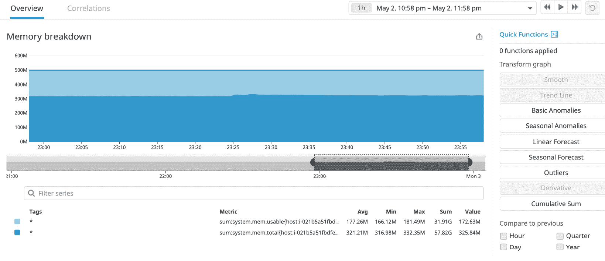

图 6.16 – 网络流量小部件全屏模式

与其他系统指标类别一样，Datadog 发布了几个与网络相关的指标，这些指标可以与图表和监控一起使用。网络指标的完整列表可以参考[`docs.datadoghq.com/integrations/network/`](https://docs.datadoghq.com/integrations/network/)。

到目前为止，我们已经查看了你可以使用的多个选项，用于深入了解主机各个组件的状态，从**主机地图**界面开始。可以通过在 Datadog 仪表板上导航到**基础设施** | **基础设施列表**来查看主机列表。

以下截图展示了**基础设施列表**界面的示例：

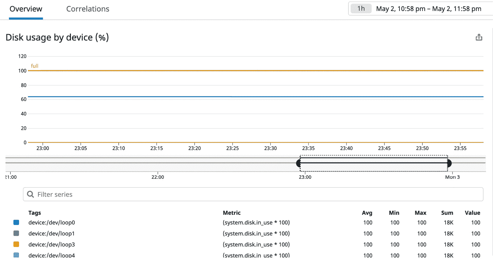

图 6.17 – 示例基础设施列表界面

与主机地图相比，基础设施列表是一个更简单的界面，并以表格形式列出主机。点击特定的主机会带你到该主机的仪表板，我们在本节前面已经详细讨论过。

虽然主机，无论是裸机还是虚拟机，以前是承载应用系统的基础设施构建块，但继续将应用程序作为微服务进行部署意味着容器也是基础设施的重要构建块。

在下一节中，我们将了解 Datadog 如何帮助您监控环境中运行的容器。

# 列出容器

微服务是通过在不同主机上运行一个或多个容器来部署的。如果这些主机上运行了 Datadog 代理，并且已配置为检测这些容器，Datadog 将在**容器**仪表盘上列出它们。有关发现主机上运行的容器所需的 Datadog 代理配置更改，请参考*第二章*，*部署 Datadog 代理*。

要访问**容器**仪表盘，您可以导航至**基础设施** | **容器**。在这里，您将能够看到如下截图所示的仪表盘：

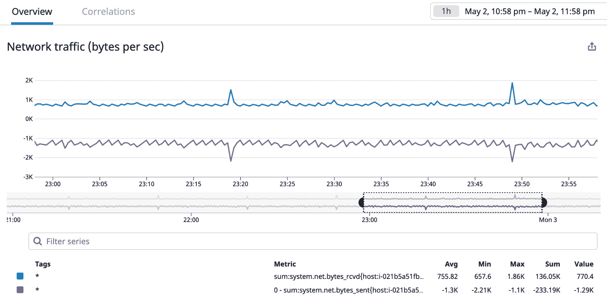

图 6.18 – 容器仪表盘

所有 Datadog 代理在主机上发现的容器都会列在此仪表盘上。在左侧面板的**主机**部分下，列出了容器主机。通过从该列表中选择特定主机，您可以仅显示该主机上运行的容器：

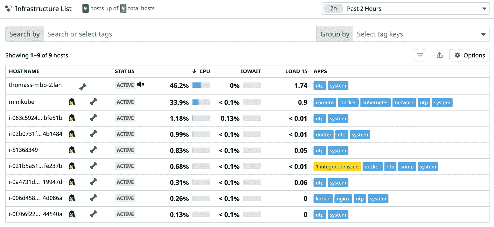

图 6.19 – NGINX 容器的详细信息

点击容器列表项将带您进入一个详细的界面，其中提供了容器的运行时详细信息，如主机名称、用于创建容器的 Docker 镜像和容器上的 Datadog 标签。前面的截图显示了一个示例容器的详细信息。

查看在主机上运行的进程是部署应用程序、确保应用程序正常工作或检查主机健康状况等基本系统管理任务之一。Datadog 使这项任务变得更加容易。我们将在下一节中讨论此功能。

# 查看系统进程

查看主机上运行的进程的传统方法是登录到该机器并使用`ps`等命令列出进程，适用于类 UNIX 操作系统。在更倾向于使用弹性和不可变基础设施的环境中，这类手动步骤通常不被推荐或不鼓励。在这种情况下，查看主机上运行的进程选项非常有用。此外，将进程列在一个地方使得比较两个或更多主机的运行时环境变得更加容易。

要访问**进程**仪表盘，请在 Datadog 仪表盘上导航至**基础设施** | **进程**。您将看到类似于以下截图所示的界面：

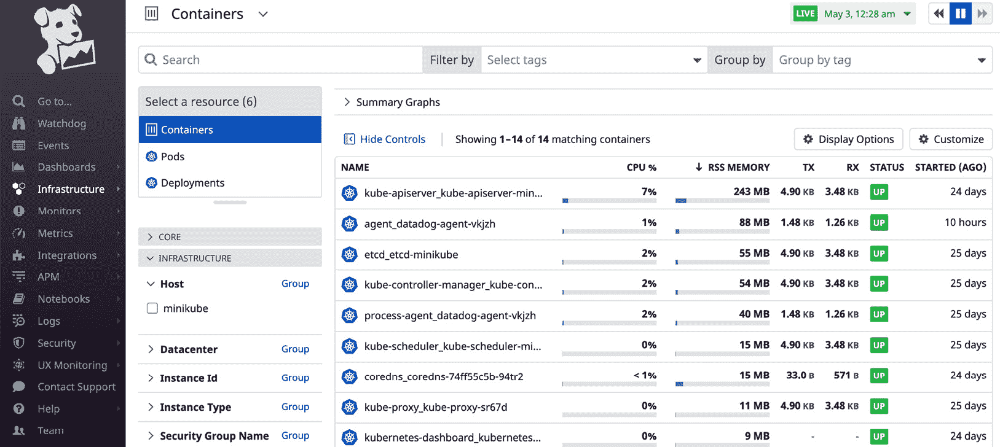

图 6.20 – 进程列表

这个仪表盘与我们在上一部分看到的**容器**仪表盘类似。在左侧窗格中，有搜索和过滤选项，你可以使用它们来定位需要深入查看的进程。点击进程列表后，你可以查看其详情，如下图所示：

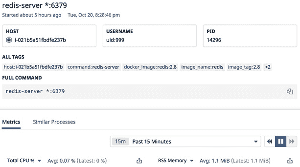

图 6.21 – 进程详情

关于进程的信息，如进程名、**进程 ID**（**PID**）以及启动进程的用户，可以在详细页面上查看。这个示例中提供的进程详情可以直接在主机上查询，方法如下：

```
$ ps -ef |grep redis
999      14296 14273  0 03:28 ?        00:00:11 redis-server *:6379
```

默认情况下，Datadog 代理不会报告主机上运行的进程，因此你需要启用此功能。为此，请将以下选项添加到`datadog-agent.yml`的 Datadog 代理配置文件中，并重启代理服务：

```
process_config:
    enabled: 'true'
```

通常，这个配置选项是可用的，但在代理配置文件中已被注释掉，所以你只需取消注释这些行并重启代理。

到目前为止，我们提到过真实和虚拟机以及容器作为基础设施的构建块。在接下来的部分，我们将看到 Datadog 如何帮助监控无服务器计算环境。

# 监控无服务器计算资源

当前的趋势是完全避免任何形式的基础设施，转而使用无服务器计算环境，在这种情况下，公共云供应商提供平台来创建、运行和监控应用程序。不要与云中的任何托管服务混淆。这里没有主机的概念（因此得名无服务器）；相反，应用程序运行在云服务商提供的计算沙箱中。

最受欢迎的无服务器计算服务之一是 AWS Lambda。Lambda 函数运行应用程序代码，实际上，你可以把它看作是一个微服务。通过安装 AWS 集成并进行一些针对 Lambda 的额外配置，可以从 Datadog 监控 Lambda 函数。

以下步骤概述了设置 Datadog 以监控 Lambda 函数的过程：

1.  在 Datadog 中安装 AWS 集成。

1.  在你的 AWS 账户上安装 Datadog 转发器 Lambda 函数。

1.  如果需要将任何与应用监控相关的信息发布到 Datadog，请对 Lambda 函数进行监控。

进行此配置的详细步骤可以参考[`docs.datadoghq.com/serverless/`](https://docs.datadoghq.com/serverless/)。

导航到**基础设施** | **无服务器**以进入无服务器仪表盘，在这里所有的**Lambda**函数都可以进行监控，如下图所示：

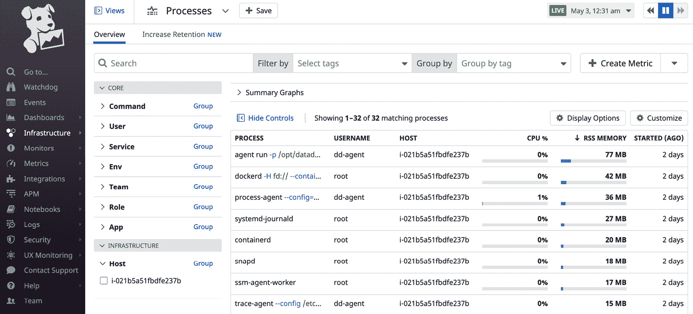

图 6.22 – 用于无服务器计算的 AWS Lambda 函数

请注意，在这种情况下不需要传统的代理，但被称为**Datadog Forwarder**的 Lambda 函数能够为基于 Lambda 的无服务器计算执行此任务。

# 最佳实践

以下是进行基础设施监控时应遵循的最佳实践：

+   Datadog 提供了大量的度量指标，涵盖了计算、存储和网络监控的各个方面。确保你只关注每个类别中的重要度量。

+   容器正成为托管现代应用程序的基础设施核心构件。如果使用了微服务，监控容器并获取可以用来优化应用程序性能和可用性的见解就变得非常重要。

+   汇总进程将使比较运行时环境变得更加容易，并且必须启用该功能。

+   尽管在无服务器计算中没有需要管理的基础设施，但 Datadog 提供了监控应用程序功能的选项，应该启用这些选项来跟踪相关的度量标准。

# 摘要

在涉及主机的传统计算场景中，基础设施监控是监控的核心。主机包括裸金属和虚拟机。随着微服务的广泛使用，容器已成为构建基础设施的重要元素。Datadog 提供支持主机和容器级监控的功能。Datadog 汇总主机进程的功能使得比较主机级别的运行时环境变得容易。尽管没有涉及基础设施，Datadog 仍然可以用于监控无服务器计算资源，如 AWS Lambda 函数。在本章中，你了解了如何使用 Datadog 监控运行软件应用程序系统的基础设施的各个组件。这些基础设施组件可以位于传统数据中心或公共云中，也可以是虚拟机或容器。

尽管有用的度量可以发布到 Datadog 或由它生成，但如果不使用监控和警报，它们的价值有限。在下一章中，我们将学习如何在 Datadog 中设置监控和警报。
