# *第七章*：监控和警报

在上一章中，我们学习了如何使用 Datadog 监控基础设施。现代的基于云的基础设施比基于数据中心的裸机计算、存储和网络基础设施更加复杂和虚拟。Datadog 旨在与以云为中心的基础设施一起工作，并且能够满足大多数基础设施监控需求，无论是裸机还是公有云基础设施。

任何监控应用程序的核心需求之一是通知你正在发生的问题。理想情况下，应该在问题导致服务中断之前就被通知。在之前的章节中，我们讨论了度量标准以及它们如何生成、查看和在仪表盘上绘制。度量标准的一个重要用途是预测即将发生的问题。例如，通过跟踪存储设备上的`system.disk.free`度量标准，可以轻松在它达到某个阈值时发出通知。将`system.disk.total`度量标准结合到这个公式中，还可以按百分比跟踪可用存储。

监控通常跟踪度量标准的时间序列值，当度量标准值在指定时间窗口内超出阈值时，会发送通知。它发送的通知称为警告或警报通知。这些通知通常被称为警报。警告和严重状态的阈值在监控中设置。例如，从之前提到的磁盘存储度量标准中，可以计算出可用存储的百分比。警告阈值可以设置为 30%，而严重阈值可以设置为 20%。

本章中，我们将详细学习监控和警报以及它们在 Datadog 中的实现方式。具体来说，我们将覆盖以下主题：

+   设置监控

+   管理监控

+   分发通知

+   配置停机时间

# 技术要求

为了尝试本书中提到的示例，你需要安装以下工具并准备好相关资源：

+   一个 Datadog 账户和一个具有管理员权限的用户。

+   根据示例，Datadog Agent 在主机级别运行或作为微服务，指向 Datadog 账户。

# 设置监控

在通用的监控系统中，监控通常与度量标准或事件相关联，Datadog 覆盖了这些以及更多内容。根据 Datadog 中定义的数据源，有多种监控类型。以下是一些最重要的类型：

+   **度量标准**：如本章开始时提到的，度量标准是用于构建监控的最常见信息类型。度量标准类型的监控基于为度量值设置的用户定义阈值。

+   **事件**：监控 Datadog 跟踪的系统事件。

+   **主机**：检查主机上的 Datadog 代理是否已报告到 Datadog **软件即服务** (**SaaS**) 后端。

+   **实时进程**：此监控器检查操作系统级别的一组进程是否在一个或一组主机上运行。

+   **进程检查**：此监控器检查 Datadog 跟踪的进程是否在一个或一组主机上运行。

+   **网络**：这些监控器检查 TCP/HTTP 端点的状态。

+   **自定义检查**：这些监控器基于 Datadog 代理运行的自定义检查。

现在，我们将了解这些类型的监控器是如何创建的，以及需要在 Datadog 代理端支持它们的什么样的仪器设置。

要创建一个新的监控器，在 Datadog 仪表盘中，导航到 **Monitors** | **New Monitor**，如以下截图所示：

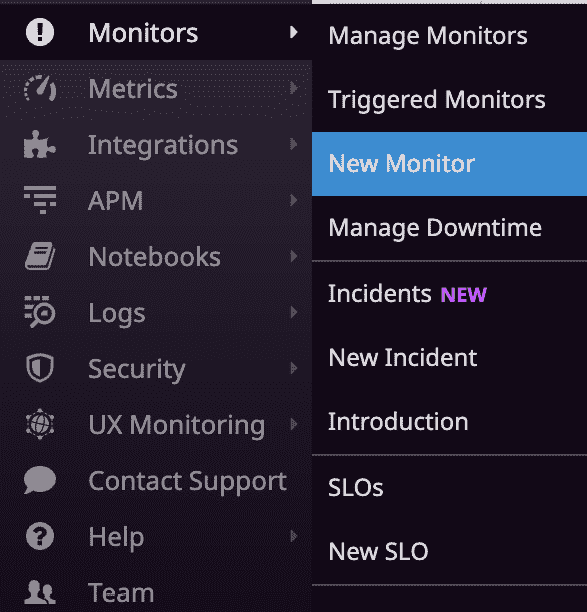

图 7.1 – 新监控器菜单项

它会提供选择监控器类型的选项，如 *图 7.2* 所示。在此示例中，我们将创建一个度量类型的监控器：

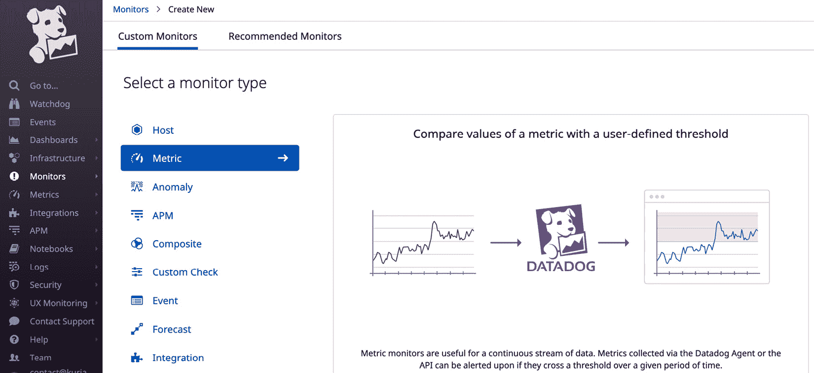

图 7.2 – 选择度量类型的监控器

单击此选项后，您将进入一个详细的表单，其中提供创建监控器所需的所有信息。由于设置监控器时有多个选项可用，因此此表单相当长。我们将在接下来的截图中查看它：

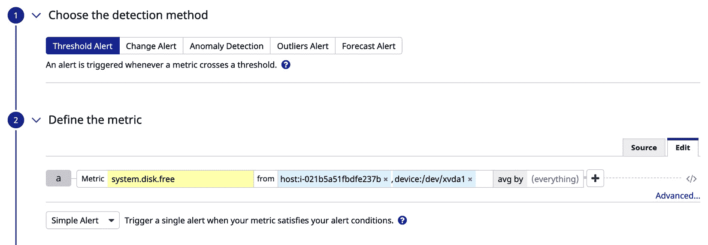

图 7.3 – 新监控器表单 – 选择检测方法和度量标准

第一步是选择检测方法。如 *图 7.3* 所示，选择了 **阈值告警** 作为检测方法。这是常用的检测方法，其中度量值与静态阈值进行比较，从而触发告警。

以下列表突出了其他可用的检测方法：

+   **变更告警**：此方法将当前的度量值与时间序列中的过去值进行比较。

+   **异常检测**：此方法根据过去的行为检测度量时间序列数据中的任何异常。

+   **异常值告警**：当组内某成员的行为异常时会触发告警。例如，集群中特定主机的内存使用量增加。

+   **预测告警**：这与阈值告警类似；然而，预测的度量值与静态阈值进行比较。

选择监控器类型非常重要，因为监控器的行为和使用在很大程度上取决于监控器的类型。

重要说明

请注意，只有阈值告警是您可以在其他监控系统中找到的标准方法，其它方法都是 Datadog 特有的。通常，在通用监控系统中实现这些检测方法需要一些自定义设置，而 Datadog 则开箱即用地支持这些方法。

在第二步中，选择用于监视器的度量标准，并使用标签添加过滤条件以定义监视器的范围。让我们逐一查看这一部分的每个字段，以了解所有可用选项：

+   **度量标准**：在此选择用于监视器的度量标准。它应该是 Datadog 代理报告的度量标准之一。

+   `host`和`device_name`标签，监视器专门为主机上的磁盘分区定义。

+   **排除**：在此处可以选择标签，以明确排除更多实体。

如果过滤条件（从多个主机和设备的`system.disk.free`值中设置），将选择聚合函数之一，如`average`（平均值）、`maximum`（最大值）、`minimum`（最小值）或`sum`（总和），用于指定可用于度量值比较的值。选择正确的聚合函数和标签进行分组非常重要。如果过滤条件已经只返回一个值，那么此设置将不相关。

由此监视器触发的警报可以配置为**简单警报**或**多源警报**（在*图 7.3*中，选择了**简单警报**）。当监视器的范围是单一源时，例如主机上的存储设备，选择简单警报。如果涉及多个源并且选择了监视器的**简单警报**选项，则会为所有源发送聚合警报通知；如果选择**多源警报**选项，则会针对每个源单独发送警报通知。

在表单的这一部分，之前提到的配置都在**编辑**标签下完成。通过点击**源**标签，可以查看您在底层 Datadog 定义语言中所做的配置，如下所示：

```
avg:system.disk.free{device_name:xvda1,host:i-021b5a51fbdfe237b}
```

在此表单的第三部分，主要设置监视器的阈值和相关配置，如下图所示：

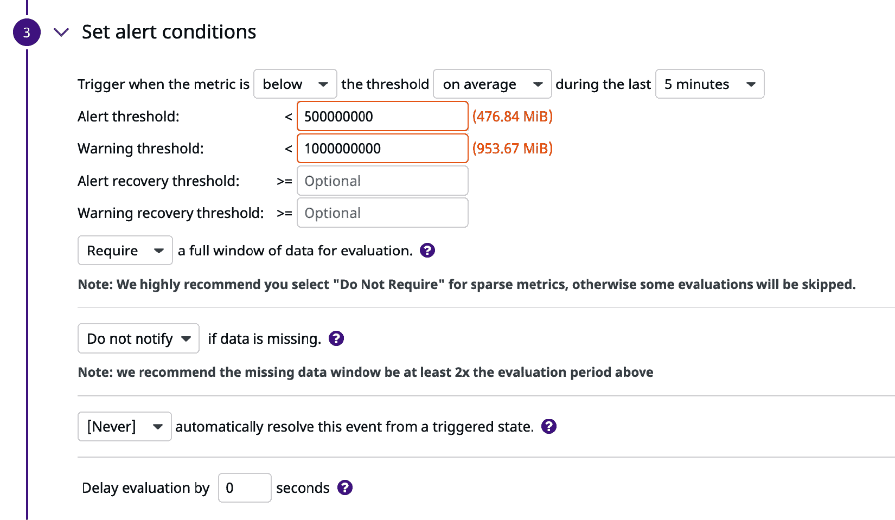

图 7.4 – 新建监视器表单 – 设置警报条件

在 Datadog 术语中，警报表示一个关键状态，警告被称为警告。在示例监视器中，我们正在构建**警报阈值**，该阈值设置为 0.5 GB，**警告阈值**设置为 1 GB。这意味着当磁盘上的空闲空间降至 1 GB 时，您将收到警告通知；当磁盘上的空闲空间降至 0.5 GB 时，您将收到一个关键状态的通知。警告和警报状态不仅在监视器触发的通知内容上有所不同，而且对警报的响应也可以进行不同的配置。稍后当我们学习如何配置警报通知时，我们将看到如何完成此操作。

让我们看看在表单这一部分中可以设置的其他选项。

在这一部分的顶部，在第一行本身，您可以配置以下三个项目：

+   `高于`、`或等于`、`低于` 或 `低于或等于`。在我们的示例中，我们需要选择 `低于`，因为监控的目标是检查磁盘上的可用存储是否低于已设定的某个阈值。

+   `1 分钟` 到 `1 天`，还有一个**自定义**选项。此时间窗口中的度量值将根据事件设置的性质进行检查。

+   `平均而言`、`至少一次`、`始终` 或 `总计`。正如选项所示，基于此设置，将检查指定时间窗口中的度量值是否存在潜在问题、警告或告警。

当相关条件不再满足时，监控器会被标记为从警告或告警状态恢复。然而，您可以使用**告警恢复阈值**和**警告恢复阈值**来添加特定于恢复的可选阈值。

数据窗口可以选择为**需要**或**不需要**。如果选择**需要**，则监控器将等待完整的数据窗口，以运行检查。如果预期源将定期报告度量值，则必须选择此选项。如果期望根据监控器上指定的数据窗口中的可用数据点来运行检查，则选择**不需要**。

除了**警告**和**告警**通知外，监控器还可以报告缺失的数据。如果选择**通知**选项，则当度量值在指定时间窗口内未报告时，监控器将发送通知。当预期源在正常操作条件下报告度量值时选择此选项，而**无数据**警告表示 Datadog 监控的应用系统存在问题。如果监控器中选择的源预期不会定期报告度量值，则选择**不通知**选项。无数据警告可以设置为在指定的时间窗口后自动解决。通常，这个设置为**从不**，除非有特殊情况需要自动解决。

使用**延迟评估**选项，可以将用于评估监控器中设置的各种阈值的度量值延迟指定秒数。例如，如果指定了 60 秒的评估延迟，则在 10:00 时，监控器的检查将在 9:54 到 9:59 报告的数据上进行，数据窗口为 5 分钟。在公共云环境中，Datadog 建议使用最长 15 分钟的延迟，以可靠地确保度量值可用。

根据为监控器设置的阈值，实时状态将在表单顶部进行绘制，以下截图展示了示例监控器如何显示其确定的状态：


图 7.5 – 新监控器表单 – 阈值图表

图表的浅黄色区域表示警告阈值范围，浅紫色区域表示临界（警报）阈值。蓝色粗线在这些区域上方，跟踪度量值的当前值，当然，它远高于危险区。通过交互式构建新监控时，这张图表对于设置实际的阈值非常有帮助。

在**新监控**表单的第四部分中，当监控触发警告或临界（警报）状态时，需要发送的通知。它以模板形式呈现，如下截图所示：

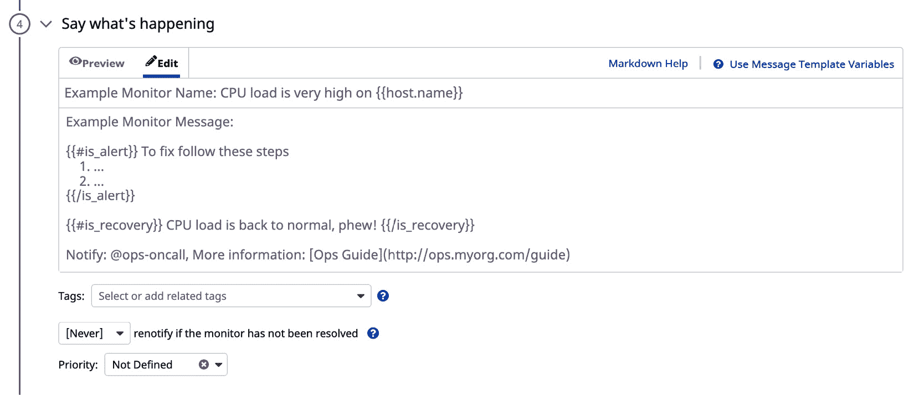

图 7.6 – 新监控表单 – 通知模板

通知可以有标题和正文，就像电子邮件一样。模板变量和条件语句也可以用于使它们动态化。以下截图显示了实际通知模板的可能样式：

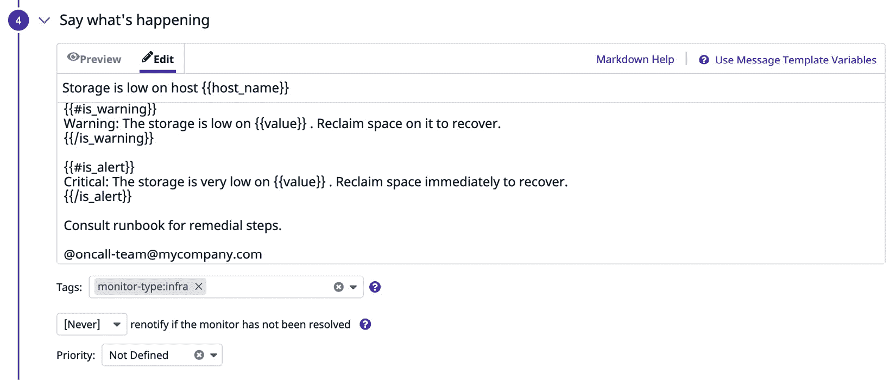

图 7.7 – 新监控表单 – 示例通知

在*图 7.7*中显示的示例通知中，可以看到如何在通知消息中使用模板、标签变量和条件语句。通过使用`is_warning`和`is_alert`消息，可以发送特定于警告或警报的消息。我们来看看一些可以在消息中使用的重要变量和条件语句：

+   `Value`：这是将触发警报的度量值。

+   `threshold`：这是触发警报的阈值，用于与度量值进行比较。

+   `warn_threshold`：这与阈值类似，但用于触发警告。

+   `last_triggered_at`：这是警报触发的时间，采用 UTC 时间。

如果通知消息中的`TAG_KEY.name`。点击**使用消息模板变量**帮助链接，了解可以使用哪些标签。

使用条件语句时，可以根据触发的警报类型发送自定义通知。在*图 7.7*中的示例消息模板中，可以看到消息的一部分是针对警告或警报的。以下是可以在消息模板中使用的主要条件语句列表：

+   `is_alert`：当通知由警报触发时使用此字段。

+   `is_warning`：当通知是由警告触发时使用。

+   `is_no_data`：当通知因报告没有度量数据而触发时使用此字段。

+   `is_recovery`：当警告、警报或无数据状态恢复为正常时，触发通知时使用此字段。

请参考 Datadog 文档，了解完整的模板变量集及其使用方法，网址为[`docs.datadoghq.com/monitors/notifications`](https://docs.datadoghq.com/monitors/notifications)。

通知消息也可以进行格式化，Markdown 格式的详细信息可以通过表单上的**Markdown 格式帮助**链接查看。

通知的接收者可以使用`*@*`进行指定，如示例模板中所示。通常，`*@*`后面会跟着电子邮件地址或分发列表。可以通过点击表单底部的**测试通知**按钮来测试通知消息，如*图 7.9*所示。你应该看到一个弹出窗口，可以选择一个或多个测试场景，测试消息将根据选定的场景发送给接收者。

你可以为新监控器添加标签，以便后续搜索和分组监控器。通过在**标签**字段中输入标签键和值，标签`monitor-type`及其值`infra`已被添加到示例监控器中。

必须使用`如果监控器未解决则重新通知`选项，以便在没有采取任何措施解决触发告警的应用系统状态时升级问题。如果选择了重新通知选项，则必须向监控器添加附加的消息模板，如下图所示：

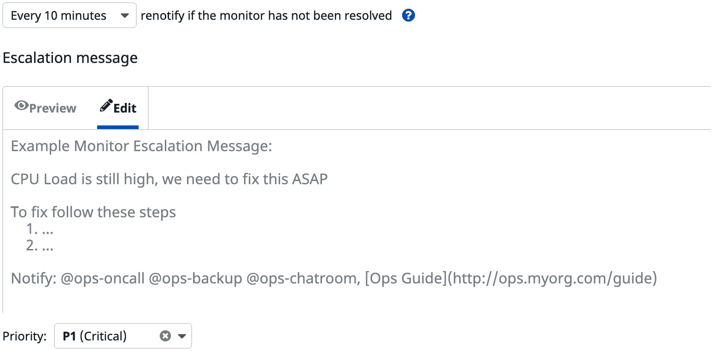

图 7.8 – 新监控器表单 – 告警升级模板

在**新监控器**表单的最后部分，如*图 7.9*所示，配置了通知规则：

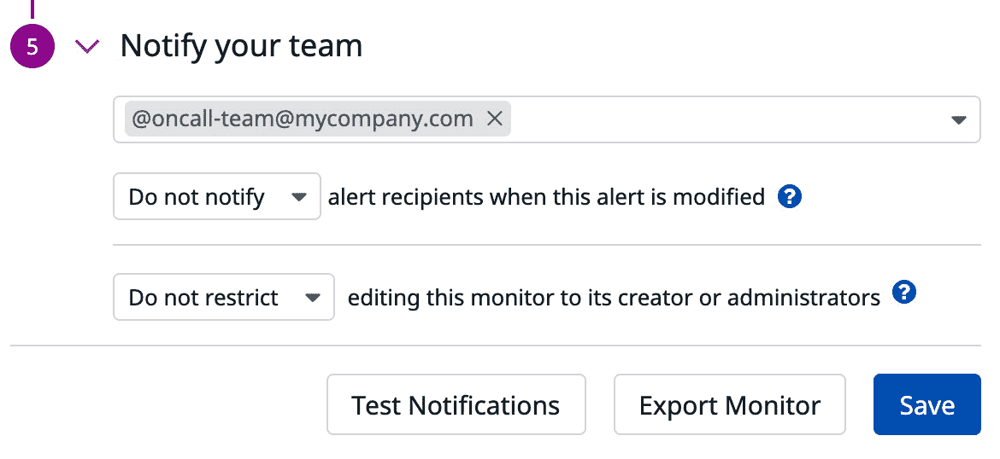

图 7.9 – 新监控器表单 – 通知团队并保存监控器

在*第 4*节的消息模板中由`*@*`指定的收件人列表会自动显示在这一部分，反之亦然。

可以配置监控器，在监控器定义本身发生更改时通知告警接收者，使用**当此告警被修改时通知告警接收者**选项。

还可以使用**仅限创建者或管理员编辑此监控器**选项来限制对监控器的编辑权限。

我们在前面的示例中构建的监控器是一个度量类型的监控器，这是所有监控平台（包括 Datadog）上最常见的监控器类型。这些监控器的创建方式相似，因此我们不会逐一查看设置其余监控器类型所需的每个步骤。

让我们来看看其他监控器类型的主要特性，以及它们可能有用的场景：

+   `host`标签。

+   **事件**：在此监控器类型中，Datadog 提供基于关键字的事件搜索，时间窗口内的事件，并允许你根据搜索结果中的事件数量设置警告和告警阈值。如果可以根据发布到 Datadog 的事件描述来跟踪问题，则设置事件监控器会很有用。

+   `&&`)，或者（`||`），和非（`!`）。例如，如果 a、b 和 c 是现有的监控器，你可以使用以下条件创建一个复合监控器：

    ```
    ( a || b ) && !c
    ```

    当 `a` 或 `b` 触发且 `c` 不触发时，此监控器将触发。

+   `sshd` 和警报阈值 `below 1` 足以设置监控器。

+   `process.up`；但它更有条理。要使用这种类型的监控器监控的进程，必须在 Datadog 代理端的 `conf.d/process.yaml` 文件中定义。

+   `conf.d/tcp_check.d/conf.yaml` 文件中的定义了 TCP 检查，HTTP 检查则在 `conf.d/http_check.d/conf.yaml` 文件中定义。HTTP 检查还涵盖了 HTTPS URL 的 SSL 证书相关验证。

    网络检查返回 `OK`、`WARN` 或 `CRITICAL`。设置阈值，以确定需要连续返回多少个此类状态代码，才能触发警告或警报。

+   **集成**：如 Docker 和 NGINX 等第三方应用程序提供与 Datadog 的集成，这些集成开箱即用，只需在需要时启用。启用并由 Datadog 代理配置后，这些集成将把特定领域的度量指标和状态检查结果发布到 Datadog，并且这些结果将可供此类型的监控器使用。

    创建这种类型的监控器时，可以使用集成特定的度量指标或状态检查作为监控器跟踪的信息源。

+   **自定义检查**：当无法使用 Datadog 代理报告的各种信息（无论是否进行配置更改）或通过集成来检查某一状态时，可以编写自定义脚本并与 Datadog 代理一起部署。我们将在*第八章*《与平台组件集成》中讨论如何做到这一点的详细信息。

    这种监控器类型类似于集成监控器，其中选择了一个自定义检查作为状态检查。

+   **看门狗**：看门狗监控器会报告由 Datadog 监控的系统中的任何异常活动。Datadog 提供了各种问题场景，涵盖计算基础设施和集成。

我们已经详细讲解了如何设置新监控器，并回顾了能够满足您所有可能需求的不同类型的监控器。在下一部分中，我们将学习如何在大规模环境中维护这些监控器，并且可能需要一些自动化。

# 管理监控器

通过在 Datadog 仪表板上导航至 **Monitors** | **Manage Monitors**，您可以列出所有现有的监控器，如下截图所示：

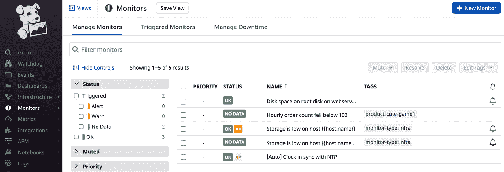

图 7.10 – 监控器列表

如*图 7.10*所示，有多种选项可以静音或解决监控器。通过静音监控器，您可以停止监控器触发警告或警报。此外，监控器可以在不等待底层问题解决和状态在 Datadog 中反映的情况下标记为已解决。

除了明显的**编辑**和**删除**选项外，还可以使用**克隆**选项来克隆一个监控器，如下图所示，并且可以对其进行修改，创建一个新的监控器，该监控器可以使用源监控器的一些功能：

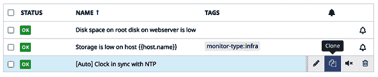

图 7.11 – 克隆监控器

监控器的定义可以导出为 JSON 格式，并可以作为备份或模板保存在源代码控制系统中，以便以后派生出类似的监控器。

要导出定义，打开监控器的**编辑窗口**，并使用表单底部的**导出监控器**按钮。一个窗口将弹出，如下图所示，你可以使用**复制**按钮复制代码：

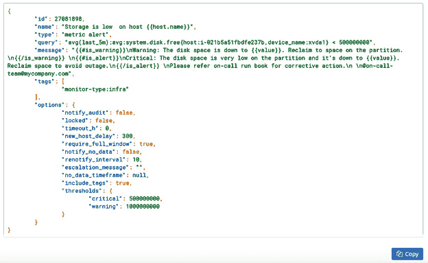

图 7.12 – 将监控器导出为 JSON

在**新监控器**工作流中，使用**从 JSON 导入监控器**选项，可以从 JSON 创建一个新的监控器。此选项提供一个文本框，可以在其中输入监控器的 JSON 格式定义。如果成功，它将带你进入预填充了 JSON 中详细信息的**新监控器**表单。在保存监控器之前，可以进行额外的修改。使用此方法创建的任何新监控器的 JSON 是通过修改从类似监控器导出的 JSON 来开发的。

之前，我们已经了解了如何通过在消息模板中添加*@*符号，将警报通知转发到电子邮件地址和分发列表中。在接下来的章节中，我们将探讨如何将通知分发到广泛的通信平台。

# 分发通知

让我们回顾一下本章讨论的一些概念，以重申相关的工作流程。当监控器跟踪的系统中的某个阈值或状态达到时，监控器会触发警告或告警。关于此状态变化的通知，从**正常**到**警告**或**告警**，然后恢复到**正常**，可以发送到不同的通信平台，如电子邮件、Slack、Jira 和 PagerDuty。这些通知也可以发布到任何支持 Webhooks 的系统。

我们已经了解了，只需在个人或群组电子邮件地址前加上*@*，通知就可以转发给他们。最好将这些通知转发到群组邮箱或分发列表中，因为它们必须由团队中的某个人处理。

与其他工具的集成可以促进警报通知的分发和升级，以便进行系统跟踪并解决问题。我们来看看一些重要的工具：

+   **Jira**：Atlassian 的 Jira 是一款流行的问题跟踪工具。通过启用此集成，每次监控器生成警报通知时，都可以为其创建一个 Jira 工单。此外，Jira 工单的创建过程会在 Datadog 中作为事件进行跟踪。

+   **PagerDuty**：像 PagerDuty 这样的工具被支持团队用来系统地升级问题。需要将警报通知分发到正确的资源，以便对相关问题进行分类，如果该人员不可用，则必须通知其他资源，或者将问题升级。PagerDuty 擅长处理这类任务，并且可以配置以满足复杂的升级需求。

+   **Slack**：类似 IRC 的团队通信平台，如**Slack**，非常流行，并且覆盖了许多曾由电子邮件处理的消息传递需求。一旦集成，许多 Datadog 任务，如静音监控，可以从 Slack 渠道启动。这些选项除了将警报通知转发到 Slack 渠道的核心功能外，还可以使用。

+   **Webhooks**：虽然 Datadog 支持与流行的缺陷跟踪和通信平台，如 PagerDuty、Jira 和 Slack 的集成，但它也提供了一个使用**Webhooks**的自定义集成选项。如果在警报通知模板中指定，Webhook 将把警报相关的 JSON 数据发布到目标应用程序。由该应用程序决定如何消费警报数据并根据这些数据采取行动。在*第八章*，《与平台组件集成》中，我们将详细学习如何在 Datadog 中设置 Webhooks，以便与其他应用程序集成。

监控工具可以通过已配置的集成渠道发送大量通知，有时可能需要静音监控，例如在维护或部署期间。在下一节中，你将学习如何实现这一点。

# 配置停机时间

使用 Datadog 提供的选项，可以在预定时间段内静音一组监控。通常，当你对计算基础设施进行更改或部署代码时，需要此类停机时间。在这些更改完成并且受影响的环境稳定之前，监控生产中的软件系统可能没有太大意义。此外，通过禁用监控，你可以避免根据现有集成接收电子邮件、短信，甚至电话的警报通知。

要安排停机时间，请导航到**监控** | **管理停机时间**，你将看到一个表单，如下图所示，其中将列出现有的调度：

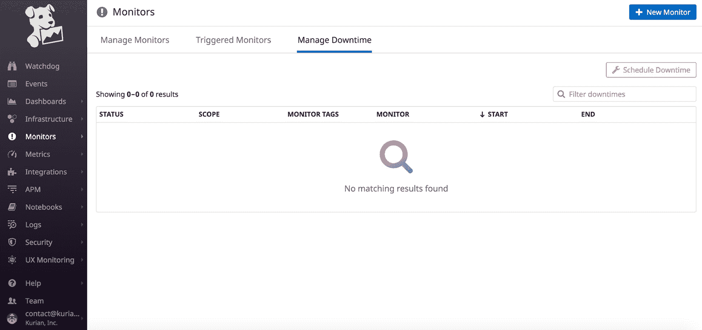

图 7.13 – 管理监控停机时间

通过点击**安排停机时间**按钮，你可以添加新的停机时间安排，如下所示：

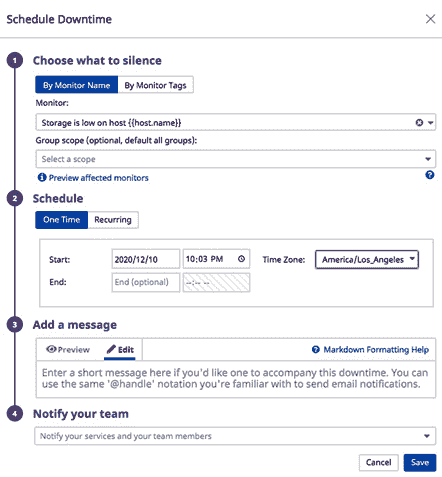

图 7.14 – 安排新的停机时间

以下选项可用于安排停机时间：

+   停机时间可以为所有监控或通过名称或标签标识的监控组定义。

+   停机可以是一次性的，也可以是定期的。定期停机在一些服务会周期性不可用时非常有用，例如一些在周末关闭的应用程序。

+   可以像警报通知一样指定通知消息模板和接收人列表，用于发送有关停机的通知。

我们已经看过了配置监控停机的过程，本章到此结束。接下来，让我们看看与设置和维护监控及警报相关的最佳实践。

# 最佳实践

现在，让我们回顾一下与监控和警报相关的最佳实践：

+   定义一个全面的监控列表，涵盖 Datadog 监控的软件系统的各个方面。

+   你可能只使用 Datadog 来处理某一部分的监控需求，在这种情况下，确保所定义的监控涵盖你关注的领域。

+   为了避免警报疲劳，确保所有警报通知都是可操作的，并且修复步骤已经在通知本身或运行手册中记录。继续微调阈值和数据窗口大小，直到你开始收到可靠的警报通知。如果监控过于敏感，可能会产生噪声。

+   如果任何微调都不足以减少监控发送过多警报的情况，考虑删除该监控，并计划以其他合理的方式监控相关场景。

+   将监控与公司选择的事故跟踪、升级和团队沟通工具集成。电子邮件通知必须作为备用，并且这些通知必须发送给用户组而不是个人。电子邮件警报还应该作为历史记录，用作事后分析（或**根本原因分析**或**RCA**）和第三方审计的证据，例如那些要求**SOC 2 Type** 2 合规的审计。

+   通过导出 JSON 定义并将其保存在源代码管理系统（如 Git）中，以代码的形式备份监控。尽可能通过在 Terraform、Ansible 或 Datadog 的 JSON 格式中定义监控，来将监控保存在代码库中。

+   在进行维护时，普及停机功能并实践它。如果没有这个，警报通知可能会变得恼人，而且监控系统本身的可信度可能会受到影响。

# 总结

在这一章中，你已经学会了如何基于 Datadog 中有关软件系统和基础设施的各种信息创建新的 Datadog 监控器。此外，我们还学习了如何通过现有的选项手动维护这些监控器，或者将其作为代码进行维护。我们探讨了将监控器与通信工具集成的不同方法，以便广泛分发警报通知。最后，你学会了如何在维护和停机期间有效地使用停机时间功能。

我们已经在使用或监控 Datadog 时讨论了多个第三方工具。在下一章中，我们将学习这些集成如何在 Datadog 中使用，以及如何推出自定义集成。
