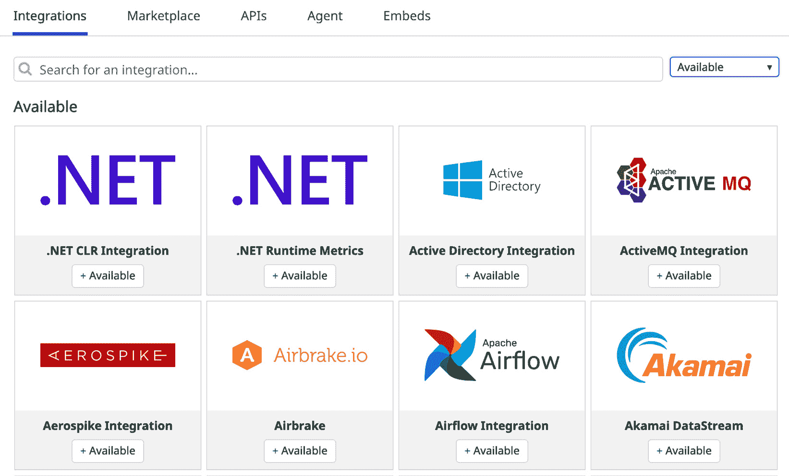
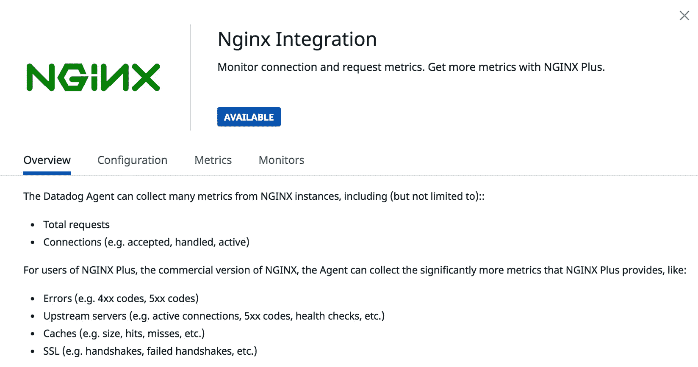
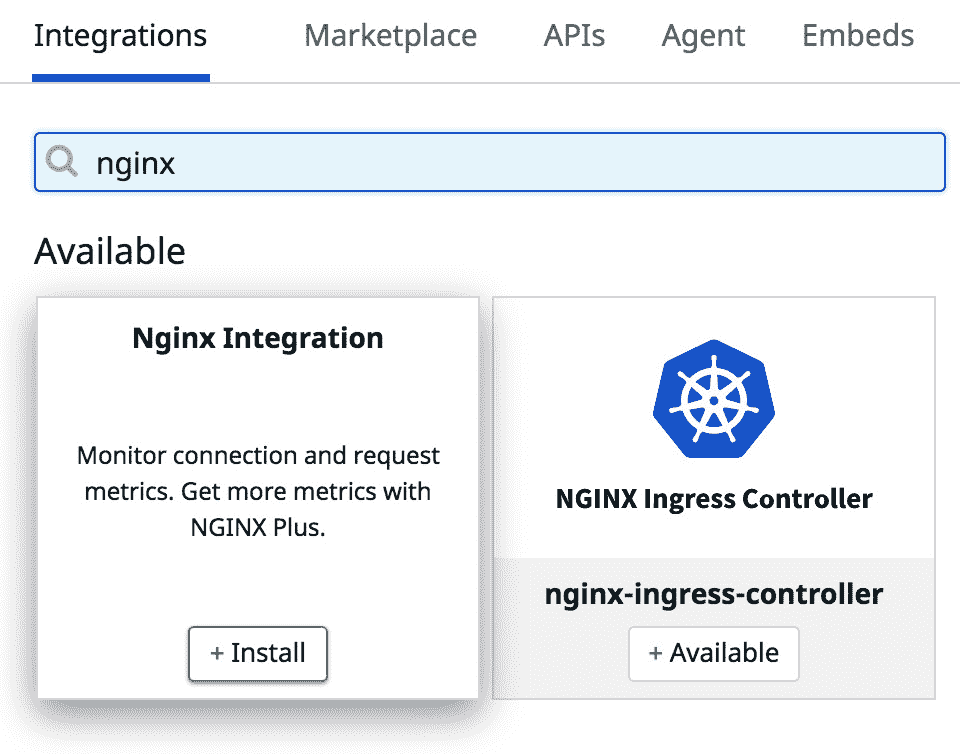
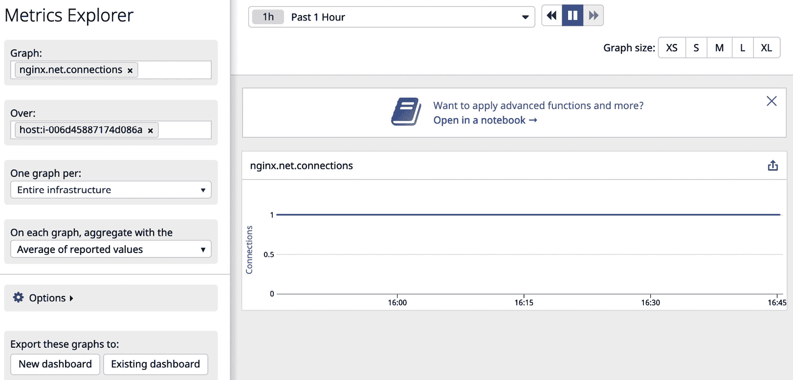
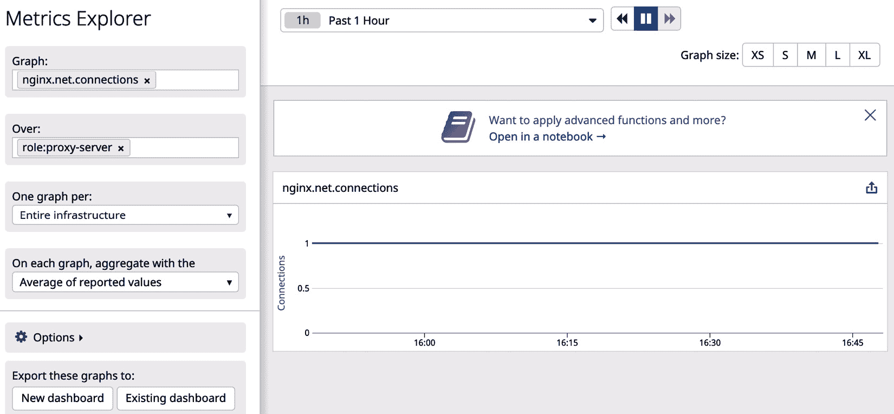
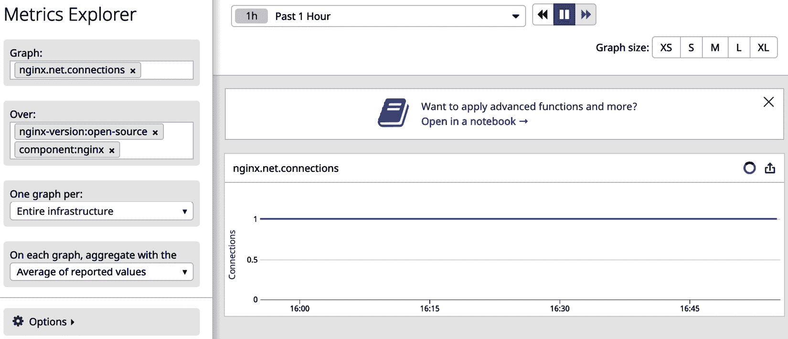
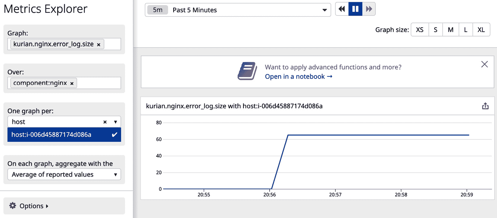
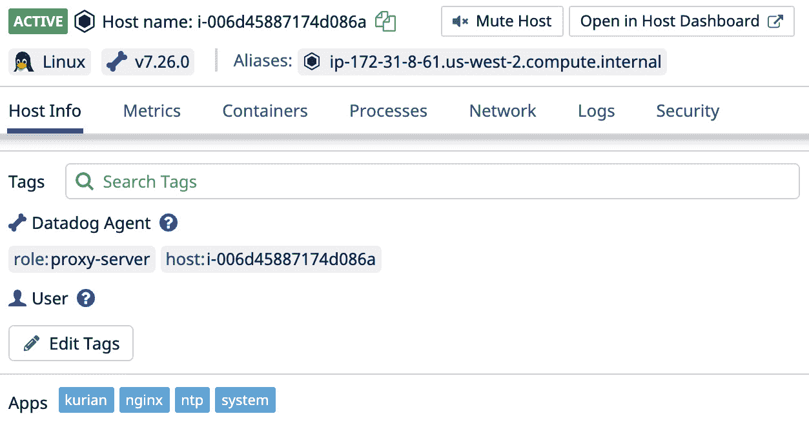

# *第八章*：与平台组件集成

在上一章中，我们学习了监视器和警报，它们是监控基础设施的关键要素，对于对生产环境中的软件系统进行 24 小时全天候监控至关重要。在书中的早期章节，我们看到如何通过 Datadog 来监控基础设施资源，基础设施资源是任何运行软件系统的计算环境的基本构建块。

在*第一章*中，*监控简介*，我们讨论了各种类型的监控，并简要提到了平台监控，平台监控是监控用于构建应用程序软件运行计算平台的软件和云计算组件。在公共云环境中，基础设施和平台组件之间存在重叠，因为计算、存储和网络组件在这些环境中是软件定义的，并且出于监控目的，它们可以被视为平台组件，如**MySQL 数据库**或**RabbitMQ**消息系统。

然而，区分基础设施资源和平台组件并不困难。云平台本质上是在基础设施资源之上运行的软件层，应用程序要么运行它们，要么在运行时使用它们。通常，基础设施资源是托管在公共云中的，而平台组件则由第三方软件供应商或开源社区提供，应用程序由其他公司构建。请注意，像 AWS 这样的流行公共云提供商也提供可以替代平台组件的服务。AWS 上的示例包括**关系数据库服务**（**RDS**）、**Amazon MQ**和**弹性 Kubernetes 服务**（**EKS**）。

我们在之前的*第六章*，*基础设施监控*中了解到，大多数基础设施监控由 Datadog 开箱即用，且配置要求极少。虽然大多数基础设施资源的功能是标准化的，但平台组件则不能简单地这样说，因为平台组件本质上是执行特定任务集的软件应用程序，其监控要求依赖于特性。

Datadog 通过两种方式解决平台监控问题：

+   提供与流行平台软件组件的集成。通过这些现成的集成，用户只需启用所需的集成，以便监控他们应用程序中使用的平台组件。

+   提供运行自定义检查的选项，这些检查可以用来监控可能没有现成集成的的平台组件。

本章将介绍使用 Datadog 中可用的集成选项进行平台监控的详细信息，如上所述。具体来说，我们将涵盖以下主题：

+   配置集成

+   标记集成

+   审查支持的集成

+   实施自定义检查

# 技术要求

若要尝试本书中提到的示例，您需要安装以下工具并确保有可用的资源：

- 一个安装了 Bash shell 的 Ubuntu 18.04 环境。虽然这些示例可能在其他 Linux 发行版上也能运行，但需要对特定于 Ubuntu 的命令进行适当的修改。

- 一个 Datadog 帐户和一个具有管理员权限的用户。

- 在主机级别运行的 Datadog 代理，或者根据示例作为微服务运行，指向 Datadog 帐户。

# 配置集成

Datadog 提供了与大多数流行平台组件的集成，需要根据需要启用这些集成。我们将通过一个示例查看启用集成的一般步骤。

可用的集成列在**集成**仪表板上，如下截图所示，可以直接从主菜单访问：



图 8.1 – 可用集成列表

如你所见，在*图 8.1*中，第三方软件组件列在**集成**仪表板上。可以使用该仪表板顶部的搜索选项筛选出已安装的集成。此外，还可以通过关键词查找可用的集成。

通过点击特定的集成列表项，可以查看与该集成相关的所有详细信息。例如，以下截图提供了与 NGINX（一款流行的 Web 服务器）集成的相关信息：



图 8.2 – NGINX 集成概览

从该仪表板中，我们可以获得启用集成后将发布的所有度量指标的完整列表。此外，这个特定的集成还提供了一些监控器，这是一个可选功能。使用集成的主要目的是获取与平台组件相关的度量指标，这些指标可以用于定制的监控器、仪表板以及其他 Datadog 资源。

配置集成需要两个主要步骤：

1.  **安装集成**：可以通过点击可用的**安装**按钮来安装集成，以下截图展示了 NGINX 集成的安装界面：

    图 8.3 – 安装集成

    当你将光标悬停在可用集成上时，**安装**按钮将显示出来。

1.  **配置集成**：集成的配置是将集成部署到 Datadog 帐户中的关键步骤。配置步骤可以在集成的**配置**标签下找到（见*图 8.2*）。这些步骤依赖于平台组件，并且可能需要在 Datadog 监控基础设施中进行更改。例如，如果某个组件运行在主机上（如 NGINX Web 服务器），则需要在运行该主机上的 Datadog 代理配置中进行更改。

现在让我们看看如何为特定的 NGINX 实例配置 NGINX 集成，这将展示配置任何集成的一般步骤。

第一步是启用你帐户中的集成，这可以通过点击集成列表中的 **安装** 按钮来完成，如 *图 8.3* 所示。

在这个示例中，我们将尝试为运行在 **AWS EC2** 主机上的开源版本 NGINX 实例启用集成，该主机运行的是 **Ubuntu 16.04** Linux 发行版。请注意，实际的配置步骤也会根据平台组件和 Datadog agent 所运行的操作系统而有所不同，这些步骤仅适用于前述环境：

1.  确保 Datadog Agent 和 NGINX 服务都在主机上运行。可以通过以下方式在 Ubuntu 16.04 上进行检查：

    ```
    $ sudo service nginx status
    ```

1.  如果服务正常运行，你将看到类似于以下的状态：

    ```
    Active: active (running) since Mon 2021-01-04 03:50:39 UTC; 1min 7s ago
    $ sudo service datadog-agent status
    Active: active (running) since Sun 2021-01-03 21:12:26 UTC; 6h ago
    ```

    *(这里只提供与服务状态相关的行，简洁起见。)*

    让我们首先完成 NGINX 端所需的配置更改。

1.  检查需要用于集成的 NGINX 实例是否已安装 stub status 模块：

    ```
    $ nginx -V 2>&1| grep -o http_stub_status_module
    http_stub_status_module
    ```

1.  在 NGINX 配置目录 `/etc/nginx/conf.d/` 下，创建一个新的文件 `status.conf`，并添加以下配置：

    ```
    server {
               listen 81;
               server_name localhost;
               access_log off;
                    allow 127.0.0.1;
                    deny all;
                     location /nginx_status {
          # Choose your status module
          # freely available with open source NGINX
          stub_status;
          # for open source NGINX < version 1.7.5
          # stub_status on;
          # available only with NGINX Plus
                 # status;
                 # ensures the version information can be retrieved
                 server_tokens on;
      }
    }
    ```

1.  重新加载 NGINX 配置更改：

    ```
    $ sudo nginx -t && sudo nginx -s reload
    nginx: the configuration file /etc/nginx/nginx.conf syntax is ok
    nginx: configuration file /etc/nginx/nginx.conf test is successful
    ```

1.  要完成配置更改，必须在 Datadog Agent 端也进行相应操作。接下来我们来做这个。对于 Datadog 支持的每个集成，都会在 `/etc/datadog-agent/conf.d/` 目录下提供一个配置目录。对于 NGINX 集成，该目录为 `nginx.d`。通常，目录中会有一个示例配置文件，可以根据你的具体需求进行定制。为了简单起见，我们将复制该示例文件，文件中已包含实现此集成所需的基本配置，然后重启 Datadog Agent：

    ```
    $ sudo cp conf.yaml.example conf.yaml
    $ sudo service datadog-agent restart
    ```

1.  要检查集成是否正常工作，你可以查看 Datadog Agent 状态中的相关信息：

    ```
    $ sudo datadog-agent status
    Getting the status from the agent.
    nginx (3.8.0)
    -------------
          Instance ID: nginx:16eb944e0b242d7 [OK]
    Configuration Source: file:/etc/datadog-agent/conf.d/nginx.d/conf.yaml
          Total Runs: 5
          Metric Samples: Last Run: 7, Total: 35
          Events: Last Run: 0, Total: 0
          Service Checks: Last Run: 1, Total: 5
          Average Execution Time : 4ms
          Last Execution Date : 2021-01-04 04:00:29.000000 UTC
          Last Successful Execution Date : 2021-01-04 04:00:29.000000 UTC
          metadata:
            version.major: 1
            version.minor: 10
            version.patch: 3
            version.raw: 1.10.3 (Ubuntu)
            version.scheme: semver
    ```

*(上述输出仅为与 NGINX 集成状态相关的摘录。)*

当主机上的配置完成并且我们确认它正常工作后，可以预期在 Datadog UI 上看到相关的 NGINX 指标，用于监控和仪表盘。验证的最简单方法是搜索一些示例指标，确认 `nginx.net.connections` 被成功查找和定位：



图 8.4 – 在 Metrics Explorer 中查看 NGINX 指标

通过这种方式，可以查找集成支持的任何度量标准，这些度量标准在集成的仪表板的 **Metrics** 标签下有所文档记录。如果您希望查找从特定主机发布的度量标准以验证该主机的新集成部署，可以通过在 **Over** 字段中选择特定主机来过滤度量标准列表，正如前面的截图所示。

我们刚刚了解了如何推出基于代理的集成的通用步骤，以及如何验证它是否正常工作。在实际的生产环境中，通常会为多个平台组件启用多个此类集成，例如 NGINX。即使是同一个组件，也可以用于多个不同的用途。例如，NGINX 可以用作 HTTP 服务器，提供简单的 Web 应用程序服务，或者用作代理服务器，将 Web 流量引导到更复杂的计算环境，如运行 JVM 的主机集群或 Kubernetes 集群。在这种情况下，必须有一些方式来轻松区分度量标准的来源，而不依赖主机名，因为公共云环境中的主机寿命通常较短。我们已经在*第五章*《度量标准、事件与标签》中看到，度量标准是如何进行标签化以方便筛选和聚合的。我们将在下一节中回顾这一点，讨论如何在推出集成时使用。

# 给集成打标签

一个集成发布的度量标准可以在集成层面进行标签化，以便在 Datadog 资源中更好地展示这些度量标准，最终这些度量标准将在其中使用。我们将看到如何实现这一点，目的是实施最佳实践以提高效果。我们已经在*第二章*《部署 Datadog 代理》和*第五章*《度量标准、事件与标签》中了解到，可以通过在 `datadog.yaml` 文件中使用标签配置项来添加主机级的自定义标签。通过此选项添加的自定义标签将在该主机上运行的各种集成生成的所有度量标准中可用。标签选项也可以在集成层面使用，并且相关的标签将仅应用于特定集成的度量标准。

在上一节提到的使用 NGINX 执行不同角色的用例中，这种多层级标签方法将有助于筛选来自多个主机的 NGINX 度量标准。例如，在主机级别，可以通过标签 `role:proxy-server` 或 `role:web-server` 来标识其作为 Web 服务器或代理服务器，而在集成层面，可以应用更多标签，标明该组件的具体名称，例如 `component:nginx`。请注意，这种方法为跟踪平台组件的角色提供了灵活性，例如 **HAProxy**、NGINX 和 **Apache**，这些组件可能在整个应用系统中用于多种 HTTP 和代理服务角色。

现在，让我们看看我们刚才讨论的标签策略如何在上一节的示例案例中实现。

在 `datadog.yaml` 文件中，添加了以下标签：

```
tags:
    - role:proxy-server
```

在 `conf.d/nginx.d/conf.yaml` 文件中，添加了以下两个标签：

```
tags:
        - component:nginx
        - nginx-version:open-source
```

请注意，附加标签 `nginx-version` 将帮助识别使用的是哪种类型的 NGINX。为了开始将这些标签应用到指标，必须重启 Datadog Agent。之后，你可以像以下示例一样使用这些标签过滤指标。

在第一个示例中，如以下屏幕截图所示的 *图 8.5*，你可以看到一个集成指标 `nginx.net.connections` 被标记为主机级标签 `proxy-server`。请注意，所有主机级别的指标以及来自其他集成的指标都会以相同的方式进行标记。例如，一旦启用，系统级指标 `system.mem.used` 也会被标记为 `role:proxy-server`：



图 8.5 – 应用于集成指标的主机级标签

在下一个示例中，如 *图 8.6* 所示，集成级标签 `component:nginx` 和 `nginx-version:open-source` 仅用于过滤集成级指标。你不能使用这些标签来过滤主机级别的指标，例如 `system.mem.used`：



图 8.6 – 集成级标签

在过去的两个部分中，我们了解了如何启用集成的基础知识，以及如何标记集成发布的指标。通过这些基本的理解，我们将深入了解 Datadog 对第三方应用的支持，以及它们是如何集成和组织的。我们还将探讨一些重要的集成，这些集成将是我们在使用 Datadog 时最常用的，因为它们是用于构建各种软件应用系统的常见平台组件。

# 审查支持的集成

如前所述，Datadog 提供了许多第三方平台组件的集成。其中一些组件，如 Apache、NGINX、Docker、MySQL 等，比其他组件更为重要，因为它们在各种软件应用中广泛使用。在本节中，我们将探讨重要的集成，并重点介绍任何重要的要点。

Datadog 提供了三种不同的方式来集成平台组件：

+   **基于 Agent 的**：在我们前面看到的本章示例中，必须更新 Datadog Agent 配置以启用集成。这是因为平台组件（例如示例中的 NGINX）运行在主机上。它也可以作为微服务运行，但仍然需要一个 Agent 来监控该环境。本质上，在这种情况下，集成是由本地 Agent 管理的。Datadog Agent 配备了官方集成，并且这些集成是现成可用的，正如我们在 NGINX 示例中所看到的那样。还有更多由社区构建的集成，您可以在 GitHub 上的[`github.com/DataDog/integrations-extras`](https://github.com/DataDog/integrations-extras)查看。每个集成都有自己的 README 文件进行文档化。

+   **基于爬虫的**：软件平台并不总是仅通过在本地运行的组件来构建。有些服务可能是基于云的，Datadog 提供与流行服务（如 GitHub、**Slack**和**PagerDuty**）的集成。在这种情况下，Datadog 需要获取访问这些服务账户的凭证，并会爬取该账户以报告与给定服务账户相关的指标。

+   **自定义集成**：Datadog 提供了广泛的自定义集成选项，这些选项是通用的，而非特定于平台组件的集成。通过 Datadog Agent 运行自定义检查是集成没有官方支持或支持不足的平台组件的最简单方式。稍后我们将在本节的示例中看到如何实现这一点。以下是可以用于推出自定义集成的其他选项。

+   **使用 Datadog API**：使用 Datadog 进行监控的主要吸引力之一是其广泛的 REST API 支持。尽管您需要一支熟练的团队来通过 Datadog API 推出集成，但拥有此选项使得您的监控基础设施具有可扩展性和灵活性。

+   **构建您自己的集成**：Datadog 提供了一个开发工具包，允许您按照 Datadog 的规范构建自己的集成。详细信息可以在[`docs.datadoghq.com/developers/integrations/new_check_howto`](https://docs.datadoghq.com/developers/integrations/new_check_howto)中查看。

+   **使用 StatsD 发布指标**：我们将在*第十章*中详细介绍这一通用集成选项，*与监控标准一起工作*。

现在让我们来看一些与 Datadog Agent 一起提供并且用户可以启用和使用的重要集成：

+   **与公共云的集成**：Datadog 支持与主要公共云平台（如**AWS**、**Azure**和**GCP**）以及这些平台上提供的各个服务进行集成。这些基于爬虫的集成需要访问您的公共云账户，可以通过不同的方式提供访问权限。

+   **微服务资源**：**Docker** 和 **Kubernetes** 是构建微服务基础架构中的关键组件。Datadog 支持这两个平台组件及相关产品的集成。

+   **代理和 HTTP 服务**：Apache、**Tomcat**、NGINX、HAProxy、**Microsoft IIS** 和 **Memcached** 在这一类别中非常流行，并且这些组件都有相关的集成可用。

+   **消息服务**：流行的消息软件和云服务，如 RabbitMQ、IBM MQ、Apache Active MQ 和 Amazon MQ，都得到了支持。

+   **关系数据库管理系统** (**RDBMS**)：几乎所有流行的 **关系数据库管理系统**（**RDBMS**），如 **Oracle**、**SQL Server**、**MySQL**、**PostgreSQL** 和 **IBM DB2**，都得到了支持。监控数据库是一个重要需求，因为数据库在许多软件应用中是核心。通过这些集成，可以提供多种指标，用于监控数据库的工作状态和性能。

+   **NoSQL 和大数据**：由于灵活性和可扩展性，NoSQL 数据库在大数据和云应用中被广泛使用。像 **Redis**、**Couchbase**、**Cassandra**、**MongoDB**、**Hadoop** 以及来自这一类别的相关产品，均受到 Datadog 的支持。

+   **监控工具**：在部署全面的监控解决方案时，通常会使用多个监控工具。在这种情况下，Datadog 将是其中一个服务平台，凭借其优越的用户界面和仪表盘功能，它是聚合其他监控系统输入的一个良好平台。Datadog 还提供与其他监控工具的集成，以促进这一整合。目前，支持 **Catchpoint**、**Elasticsearch**、**Nagios**、**New Relic**、**Pingdom**、**Prometheus**、**Splunk** 和 **Sumo Logic** 等监控应用的集成。

如果 Datadog 提供的集成无法满足重要的自定义需求，你可以通过实现自定义检查来扩展 Datadog 以满足这些需求。在接下来的章节中，你将学习如何使用一个简单的 Python 脚本来实现一个示例自定义检查，该脚本将发布一个自定义指标。

# 实现自定义检查

如果现有的集成功能不足，或者某个平台组件根本没有集成，可以使用自定义检查来监控该组件。Datadog API 也可以用来向 Datadog 报告自定义生成的指标。我们将通过一个示例来探讨这个选项。

在 Datadog 中实现发布自定义指标的检查过程是简单的，我们可以通过以下示例来学习这个过程。

继续本章前面部分关于 NGINX 的示例，我们将通过将自定义度量指标添加到 Datadog 来扩展该集成。这个自定义度量指标`kurian.nginx.error_log.size`跟踪 NGINX 错误日志文件的大小。最好以与你的公司或部门相关的命名空间开头度量指标名称，如本示例所示，以便轻松过滤自定义度量指标。

手动情况下，可以通过在任何 UNIX 兼容的 Shell 上运行`ls -al`命令来收集文件大小信息。也可以从 Datadog 自定义检查中运行相同的命令，并解析输出以获得所需的结果。

我们称这个自定义检查为`custom_nginx`。配置步骤大体上与我们之前为启用 NGINX 集成所做的相同。在这种情况下，必须创建配置目录和相关资源：

1.  创建一个配置目录，并为检查设置配置文件：

    ```
    $ cd /etc/datadog-agent/conf.d
    $ sudo mkdir custom_nginx.d
    ```

1.  在新目录中创建一个`custom_nginx.yaml`文件，并将以下内容保存到其中：

    ```
    instances: [{}]
    $ sudo chown -R dd-agent:dd-agent custom_nginx.d
    ```

1.  安装 Python 脚本到`/etc/datadog-agent/checks.d`目录：

    将以下脚本保存为`custom_nginx.py`。请注意命名约定很重要，因为这就是 Datadog Agent 将自定义检查与脚本关联的方式：

    ```
    # Based on the sample code provided in Datadog documentation.
    try:
        from datadog_checks.base import AgentCheck
    except ImportError:
        from checks import AgentCheck
    # Value set on __version__ will be shown in the Agent status page
    __version__ = "v1.0"
    from datadog_checks.base.utils.subprocess_output import get_subprocess_output
    class NginxErrorCheck(AgentCheck):
        def check(self, instance):
            file_info err, retcode = get_subprocess_output(["ls", "-al","/var/log/nginx/error.log"], self.log, raise_on_empty_output=True)
            file_size = file_info.split(" ")[4];
            self.gauge("kurian.nginx.error_log.size", file_size,tags=['component:nginx'])
    ```

    除了脚本的模板要求外，它还执行以下任务：

    A. 在`/var/log/nginx/error.log`文件上运行`ls -al`命令

    B. 从命令输出中解析文件大小

    C. 将文件大小作为度量值报告给 Datadog，并应用`component:nginx`标签

1.  重启 Datadog Agent 以启用自定义检查。要检查是否成功运行，可以运行`status check`命令并查找与自定义检查相关的状态：

    ```
          $ sudo datadog-agent status

         Running Checks
      ==============

        custom_nginx (1.0.0)
        --------------------
          Instance ID: custom_nginx:d884b5186b651429 [OK]
          Configuration Source: file:/etc/datadog-agent/conf.d/custom_nginx.d/custom_nginx.yaml
          Total Runs: 1
          Metric Samples: Last Run: 1, Total: 1
          Events: Last Run: 0, Total: 0
          Service Checks: Last Run: 0, Total: 0
          Average Execution Time : 2ms
          Last Execution Date : 2021-01-04 10:03:18.000000 UTC
          Last Successful Execution Date : 2021-01-04 10:03:18.000000 UTC
    ```

1.  一旦你验证了服务器端自定义检查的工作情况，你就可以预期在 Datadog UI 上看到自定义度量指标，并可以像以下截图所示那样进行验证：



](img/Figure_8.8_B16483.jpg)

图 8.7 – 在 Metrics Explorer 中查找自定义度量指标

自定义检查通常会经过此序列，使用不同的方法来收集它支持的相关自定义度量指标的值。默认情况下，检查每 15 秒运行一次，这一行为可以通过设置配置项`min_collection_interval`进行控制。

使用自定义命名空间定义度量指标还有其他优点。自定义检查将被识别为主机仪表盘上的**应用程序**，如以下截图所示，其中使用命名空间标识了自定义检查及其生成的度量指标：



](img/Figure_8.8_B16483.jpg)

图 8.8 – 自定义检查列为应用程序

仪表盘还会将 NGINX 集成跟踪为主机仪表盘上的应用程序之一。

现在让我们在接下来的部分中回顾一下与本章所涵盖的主题相关的最佳实践。

# 最佳实践

在 Datadog 提供的集成和其提供的自定义集成接口之间，你有很多可用的选择，因此最好遵循最佳实践，而不是实现一个虽然可行但不够优化的方案：

+   完全探索所有 Datadog 提供的集成，并检查是否可以通过这些集成满足监控需求。在监控的上下文中，自定义代码和配置的开发成本高，易出错，且难以部署和维护，因此你应该将编写自定义代码作为最后的手段。

+   如果没有现成的 Datadog 支持的集成，请检查社区维护的庞大集成库。

+   如果你需要调整一个社区维护的集成使其适合你的需求，考虑参与该项目并公开提交更改，因为这样可以帮助获得 Datadog 社区的有价值反馈。

+   在开始使用标签和自定义指标进行集成之前，先制定命名策略。对指标进行系统化命名并使用合适的命名空间，有助于轻松地组织和聚合它们。

+   将用于启用和实现集成的自定义代码和配置保存在源代码控制系统中作为备份，并且可以选择将其作为自动化配置 Datadog 资源的源，使用如 Terraform 和 Ansible 等工具。这个最佳实践不仅适用于集成；每当自定义代码和配置参与设置任何内容时，都应遵循这一原则。

+   在公有云环境中，启用集成所需的主机级配置必须内嵌到机器镜像中。例如，在 AWS 中，这些配置和自定义代码以及 Datadog Agent 软件可以作为相关 AMI 的一部分进行部署，用于创建主机。

# 总结

我们已经探讨了 Datadog 提供的集成以及自行实现集成的选项。一个监控大规模生产环境的 Datadog 环境通常会使用现成集成和自定义检查的组合。虽然在 Datadog 中推出自定义检查非常简单，但建议你考虑实施这些检查的总成本。在本章中，你已经学习了如何选择合适的集成并进行配置。此外，你还学习了如何在缺少现成集成的情况下进行自定义检查。

在继续讨论如何扩展 Datadog 以超越其现成功能的过程中，下一章我们将探讨如何使用 Datadog API 来访问 Datadog 功能，并利用这些功能来实现自定义集成。
