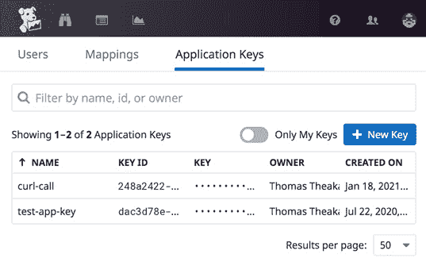
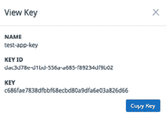
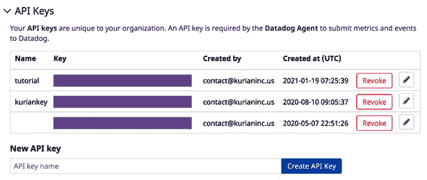
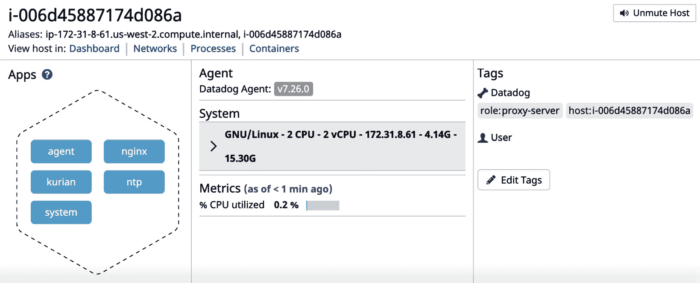
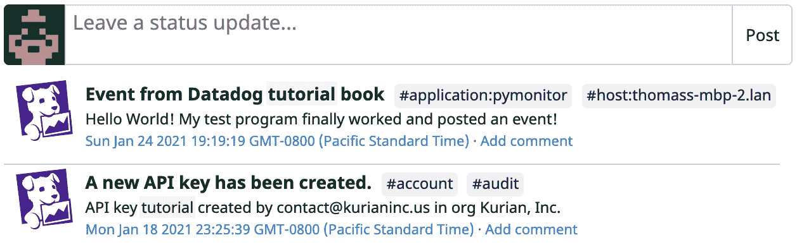
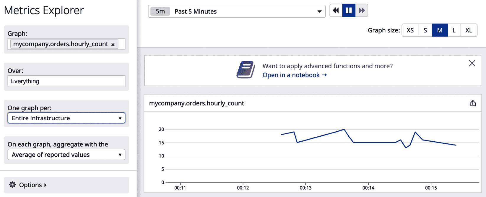
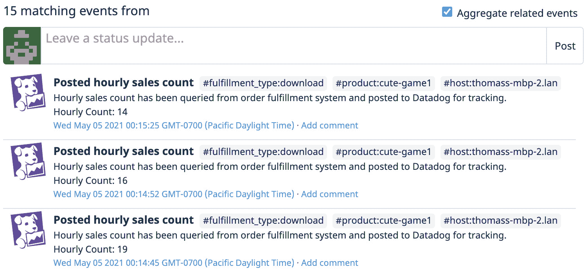
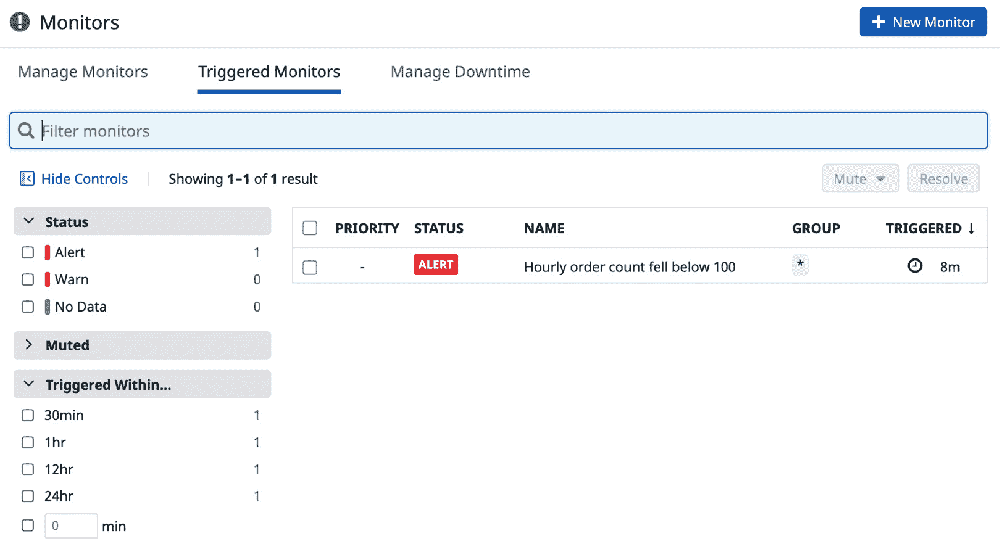

# 第九章：使用 Datadog REST API

在上一章中，您学习了如何通过 Datadog 支持的集成和自定义检查将平台组件，主要由第三方软件产品和云服务组成，集成到 Datadog 中。这些集成的主要目标是通过 Datadog 监控应用栈中使用的第三方工具。Datadog 的集成也可以反向进行。工具和脚本可以使用 Datadog 的 HTTP REST API 以编程方式访问 Datadog 平台。例如，如果您需要从应用程序向 Datadog 发布一个指标值或事件，可以使用相关的 REST API 来完成。

Datadog REST API 集是一个全面的编程接口，用于访问 Datadog 监控平台。这些 API 可用于发布自定义指标、创建监控器和仪表板、标记各种资源、管理日志以及创建和管理用户和角色。本质上，您可以在 Datadog UI 中执行的任何操作，以及在代理级别进行配置更改的操作，都可以通过这些 API 完成。

在本章中，您将通过教程学习如何使用命令行工具和编程语言操作 Datadog API。具体来说，以下主题将被涵盖：

+   脚本化 Datadog

+   审查 Datadog API

+   使用 Datadog API 进行编程

# 技术要求

要尝试本书中的示例，您需要安装以下工具并确保资源可用：

+   拥有 API 密钥的 Datadog 帐户

+   风格，请全面检查

+   **Python 2.7** 或 **Python 3.8** 或更高版本

# 脚本化 Datadog

本节中，您将学习如何使用 curl 命令行工具调用 Datadog API，并了解如何在 Python 中使用这些 API。访问 Datadog 平台进行编程操作的一个重要前提是设置用户访问权限。虽然在访问 Datadog UI 时，通过专用用户凭证或 SAML 进行身份验证，但使用 Datadog API 时则需使用一对应用密钥和 API 密钥。让我们来看看这些密钥是如何设置的。

通过导航至**Team** | **Applications Keys**，您可以在**Application Keys**页面创建一对新的应用密钥，如下图所示：



](img/Figure_9.1_B16483.jpg)

图 9.1 – 生成应用密钥

点击**New Key**按钮并为其提供新名称即可创建一个新的密钥。新生成的密钥将在相同的**Application Keys**页面中列出。您可以通过点击前表中列出的特定密钥来查看和复制该密钥，如下图所示：



](img/Figure_9.2_B16483.jpg)

图 9.2 – 查看应用密钥

通过在 Datadog 仪表板中导航至**Integrations** | **APIs**，您可以进入 API 页面，在那里可以创建新的 API 密钥或复制现有的 API 密钥，如下图所示：



](img/Figure_9.3_B16483.jpg)

图 9.3 API 密钥页面

通过在**新 API 密钥**字段中提供名称并点击**创建 API 密钥**按钮，可以生成新的密钥。生成的密钥会如前述截图所示列出。

应用程序密钥是唯一的，属于设置它的 Datadog 组织。API 密钥与 Datadog 用户绑定，因此它继承了相关的权限。为了从程序中进行身份验证，必须使用应用程序密钥和 API 密钥，分别标识组织和用户。我们将在示例程序中看到如何使用应用程序和 API 密钥对，进一步说明密钥的使用。

可以通过像 curl 这样的命令行工具调用 Datadog API，作为临时 shell 脚本的一部分，或者使用如**'Python'、'Go'和'Java'**等编程语言调用。在本节中，你将学习如何从 curl 和 Python 发起 API 调用。

## curl

在以下示例中，我们将看到如何使用简单的`curl` API 调用来查询 Datadog 监控的主机。如你所见，JSON 输出是冗长的，通常用于自动化处理，而非手动查看：

```
$ curl -s -X GET https://app.datadoghq.com/api/v1/hosts -H "Content-Type: application/json" -H "DD-API-KEY: cd5bc9603bc23a2d97beb118b75f7b11" -H "DD-APPLICATION-KEY: 21f769cbd8f78e158ad65b5879a36594c77eb076" |python -m json.tool
            "metrics": {
                "cpu": 15.446295,
                "iowait": 0,
                "load": 1.0077666
            },
            "mute_timeout": null,
            "name": "thomass-mbp-2.lan",
            "sources": [
                "agent"
            ],
            "tags_by_source": {
                "Datadog": [
                    "host:thomass-mbp-2.lan"
                ]
            },
            "up": true
        }
    ],
    "total_matching": 1,
    "total_returned": 1
}
```

*(这里只提供了输出的一部分，完整版本可以在本章的 GitHub 仓库中找到。)*

输出内容冗长，前面的代码仅为其一部分。结果提供了关于 Datadog 代理运行的主机的详细信息。

尽管这是一个简单的 API 调用，但从这个示例中，你可以学到关于 Datadog API 和 curl 的多种内容，因此我们将一一解析。

不仅命令行工具 curl 需要在本地环境中安装，通常是在操作系统的某些 Unix shell 中，还必须确保 Python 可用。需要 Python 是因为 API 调用的输出会被传递到 Python 模块`json.tool`，该模块用于格式化输出，使其更易读。因此，在这种情况下，Python 是可选的，但你需要 Python 来运行其他示例程序。

让我们逐一看看`curl`调用中的每个部分：

+   传递给 curl 的`-s`开关可以让工具在执行过程中不输出关于自身工作的消息。这是在输出需要被另一个工具或代码解析时的好做法，避免与 API 调用的结果混合。

+   `-X GET`是使用的 HTTP 动词或方法，curl 的`-X`选项用于指定这一点。`GET`方法允许读取资源，当从任何工具（包括 curl）发起 REST API 调用时，`GET`是默认方法。因此，在这种情况下，没有必要使用`-X GET`，因为`GET`是默认动词。其他重要的方法包括`POST`（用于创建新资源）、`PUT`（用于更新资源）和`DELETE`（用于删除现有资源）。我们将在本章中看到这些方法的使用；请注意，`POST`和`PUT`可以互换使用。

+   [`app.datadoghq.com`](https://app.datadoghq.com) 是访问 Datadog 后端的 URL。

+   `/api/v1/hosts` 是用于列出主机的 API 端点。API 端点对应于可以通过 REST API 访问的资源。与 API 端点一起使用的 HTTP 方法确定操作的性质。（这些约定并不总是严格遵循。）例如，`GET`返回有关现有主机的详细信息，而`POST`或`PUT`调用可以用于对相同资源进行一些更改。

+   curl 的`-H`选项允许您作为 API 调用的一部分传递 HTTP 头部。在这个例子中，传递了三个这样的头部`Content-Type`，`DD-API-KEY`和`DD-APPLICATION-KEY`。实际上，头部可以被视为 API 调用的输入。使用`POST`和`PUT`方法时，可以使用 curl 的`-d`选项将数据作为输入传递给调用（类似于为 Web 表单传递输入），但是在`GET`调用中，头部是唯一的选择。在这种情况下，`Content-Type`告诉 API 以 JSON 格式返回结果。

+   如名称所示，头部`DD-API-KEY`和`DD-APPLICATION-KEY`用于指定用于身份验证的 API 密钥和应用程序密钥对。本示例中使用的密钥是在本节中先前生成的密钥。

+   `python -m json.tool`用于格式化 API 调用的 JSON 输出，以提高可读性。请注意，这不是 API 调用的一部分。管道符号（在 Unix shell 术语中称为管道）用于组合这两个命令以生成前面的输出。

现在，让我们使用不同的选项集合进行相同的 API 调用，以说明使用`curl`与 Datadog REST API 的用法：

```
$ curl -i https://app.datadoghq.com/api/v1/hosts  -H "DD-API-KEY: cd5bc9603bc23a2d97beb118b75f7b11" -H "DD-APPLICATION-KEY: 21f769cbd8f78e158ad65b5879a36594c77eb076"
HTTP/2 200 
date: Sun, 24 Jan 2021 22:48:05 GMT
content-type: application/json
content-length: 2687
vary: Accept-Encoding
pragma: no-cache
cache-control: no-cache
set-cookie: DD-PSHARD=134; Max-Age=604800; Path=/; expires=Sun, 31-Jan-2021 22:48:05 GMT; secure; HttpOnly
x-dd-version: 35.3760712
x-dd-debug: V1SoipvPhHDSfl6sDy+rFcFwnEIiS7Q6PT
TTTi5csh65nTApZwN4YpC1c2B8H0Qt
x-content-type-options: nosniff
strict-transport-security: max-age=15724800;
content-security-policy: frame-ancestors 'self'; report-uri https://api.datadoghq.com/csp-report
x-frame-options: SAMEORIGIN
```

在这个`curl`调用的版本中，输出没有格式化，但是非常有用的`curl`选项`-i`被使用。它会在结果中添加头信息，可以用来更好地处理输出。输出的第一行中重要的头信息是 HTTP 状态码`HTTP/2 200`。在自动化脚本中查看 HTTP 状态码是重要的，以便在 REST API 调用失败时采取适当的操作。`200`系列状态码指示 API 调用成功。查看 API 调用结果头部的信息对于使您的脚本更加健壮是很重要的。`300`系列状态码与 URL 重定向相关，`400`系列状态码指示客户端调用问题，如错误的 URL 和身份验证问题，而`500`系列状态码指示服务器端问题。总的来说，查看 API 调用结果头部中的信息对于使您的脚本更加健壮是很重要的。

现在让我们看看如何使用`curl`进行`POST` API 调用，这将对资源进行某些更改。在下面的示例中，通过编程方式静音所选主机，以防止发送任何警报通知：

```
$ curl -i -X POST https://app.datadoghq.com/api/v1/host/thomass-mbp-2.lan/mute  -H "DD-API-KEY: cd5bc9603bc23a2d97beb118b75f7b11" -H "DD-APPLICATION-KEY: 21f769cbd8f78e158ad65b5879a36594c77eb076" -d @mute.json
HTTP/2 200 
date: Mon, 25 Jan 2021 01:21:59 GMT
content-type: application/json
content-length: 74
vary: Accept-Encoding
pragma: no-cache
cache-control: no-cache
set-cookie: DD-PSHARD=134; Max-Age=604800; Path=/; expires=Mon, 01-Feb-2021 01:21:59 GMT; secure; HttpOnly
x-dd-version: 35.3760712
x-dd-debug: HbtaOKlJ6OCrx9tMXO6ivMTrEM+g0c93H
Dp08trmOmgdHozC5J+vn10F0H4WPjCU
x-content-type-options: nosniff
strict-transport-security: max-age=15724800;
content-security-policy: frame-ancestors 'self'; report-uri https://api.datadoghq.com/csp-report
x-frame-options: SAMEORIGIN
{"action":"Muted","downtime_id":1114831177,"hostname":"thomass-mbp-2.lan"}
```

以下是需要从前面的示例中注意的新要点：

+   使用`curl`选项`-X`作为 API 调用方法的`POST`。

+   API 端点 `/api/v1/host/thomass-mbp-2.lan/mute` 包含主机名，该主机名将在 API 调用中被更改，并执行相应操作。

+   输入通过 `curl` 选项 `-d` 提供。`@` 符号表示它前面的字符串是一个文件名，输入必须从该文件中读取。如果没有 `@` 修饰符，字符串将被视为字面量输入。请查看示例程序中使用的输入文件 `mute.json` 的内容：

    ```
    {
      "action": "Muted",
      "end": 1893456000,
      "message": "Muting my host using curl"
    }
    ```

    输入参数是特定于 API 端点的，必须提供所需的信息。

+   来自 Datadog 后端的 JSON 消息是输出的最后部分。虽然它能提供 API 调用结果的一些提示，但其成功与否必须结合 HTTP 状态码来判断，正如你在之前的示例中所学到的：

    ```
    HTTP/2 200 
    {"action":"Muted","downtime_id":1114831177,"hostname":"thomass-mbp-2.lan"}
    ```

如果你在 Datadog UI 中查看相同的主机，你可以验证它是否被静音，如下图所示：



](img/Figure_9.4_B16483.jpg)

图 9.4 – 主机被程序化静音

curl 是一个非常有用的工具，可以从脚本中调用 Datadog API。然而，对于更强大的自动化，你需要使用 Python 等编程语言。

## Python

现在，让我们看看如何通过 Python 调用 Datadog REST API。尽管 curl 工具不可忽视，但在严肃的自动化项目中，通常会使用 Python 等功能全面的编程语言来构建用于生产的程序。同样，Go、Java 和 Ruby 等其他编程语言也得到了 Datadog 的支持，Datadog 为 REST API 提供了特定语言的包装器。

在下面的示例 Python 程序中，一个自定义事件被发布到 Datadog 后端：

```
# post-event.py
from datadog import initialize, api
options = {
    "api_key": "cd5bc9603bc23a2d97beb118b75f7b11",
    "app_key": "21f769cbd8f78e158ad65b5879a36594c77eb076",
}
initialize(**options)
title = "Event from Datadog tutorial book"
text = "Hello World! My test program finally worked and posted an event!"
tags = ["application:pymonitor"]
api.Event.create(title=title, text=text, tags=tags)
```

测试程序是不言自明的。所有需要的输入都已在其中硬编码，包括用于用户身份验证的密钥对。在实际生产中使用的程序中，密钥的使用会被参数化，以提高灵活性和安全性。程序中预期的异常将被处理，以增强健壮性。

你需要在本地环境中安装 Python 和 Datadog 客户端库才能运行该程序。Datadog 客户端库可以作为 Python 模块使用 `pip` 工具安装，`pip` 通常与 Python 一起安装：

```
$ pip install datadog
```

上面的示例 Python 代码可以保存为 `post-event.py`，并可以通过以下方式使用 Python 调用来运行：

```
$ python post-event.py
```

该程序的成功执行可以通过 Datadog UI 的 **事件** 仪表板验证，如下图所示：



](img/Figure_9.5_B16483.jpg)

图 9.5 – Python 程序发布的事件

注意程序提供的标题、正文和标签信息是如何转换为新发布事件的相应属性的。

通过这些示例，你学习了如何使用 curl 和 Python 调用 Datadog API 的基础知识。在下一部分，你将概览一些重要的 API，这些 API 可用于将应用程序与 Datadog 集成。

# 查看 Datadog APIs

在本节中，我们将讨论可以使用 REST API 访问和管理的主要 Datadog 功能。正如前面提到的，您在 Datadog UI 上可以做的任何事情都可以通过 Datadog APIs 的代码完成。在高度自动化的环境中，这个选项非常方便，因为所有与监控相关的活动都可以集中在 Datadog 平台上。如果应用程序不直接支持集成，那么使用 REST APIs 进行自定义集成是可行的最佳选择之一。（也有特殊情况下可以使用 **StatsD** 和 **JMX** 等监控标准，我们将在下一章节《使用监控标准》中讨论如何使用这些标准。）

让我们来看看 Datadog APIs 的广泛分类。

## 公共云集成

通过与主要公共云平台 **AWS**、**Azure** 和 **GCP** 集成，Datadog 可以在没有任何代理的情况下导入基础设施信息。相关的配置更改可以使用 Datadog APIs 程序化地完成。

典型用例可能是提供一个需要与 Datadog 集成的新公共云账户。在成熟的环境中，使用 **Terraform** 或 **自定义脚本** 或两者结合的工具自动进行公共云资源的配置，而 Datadog APIs 则可作为基础设施配置过程中添加 Datadog 集成支持的有用工具。

## 仪表板

您可以通过 Datadog UI 执行的仪表板任务也可以使用 APIs 完成。以下是覆盖仪表板整个生命周期的一些重要 API 终点：

+   创建一个仪表板

+   列出现有仪表板

+   获取关于仪表板的详细信息

+   更新和删除现有仪表板

+   发送邀请与其他用户共享仪表板

+   撤销仪表板共享

## 停机时间

停机是为了阻止监视器发送警报通知。如前所述，这类配置在某些操作原因（如将代码推送到生产环境时）是必要的。停机的生命周期，从计划到取消，可以使用相关 APIs 进行管理。

## 事件

在上一节中，您看到可以通过 API 调用将事件发布到 Datadog 事件流。APIs 也可用于获取事件的详细信息以及使用标签等过滤器查询事件。

## 主机

使用 APIs 可以收集关于由 Datadog 监控的主机的详细信息，以下是一些重要的细节：

+   活跃主机的总数

+   所有由 Datadog 监控的主机的详细信息

+   关于静音/取消静音主机的详细信息

## 指标

使用 Datadog APIs，可以执行以下与指标相关的任务：

+   将指标数据发布到 Datadog 后端

+   查询已发布到 Datadog 后端的指标数据

发布和查询指标数据的 API 被广泛用于与 Datadog 的集成。由于 Datadog 拥有出色的图表、仪表盘和监控管理功能，因此将监控数据以时间序列数据的形式展示在 Datadog 平台上非常具有吸引力。

在下一节中，您将学习如何将自定义指标数据发布到 Datadog，并稍后使用它来构建有用的监控器。

## 监控器

监控器观察指标数据，并根据设定的阈值进行检查和通知。监控器的整个生命周期可以通过 API 进行管理，包括以下任务：

+   监控器的生命周期阶段，例如创建、更新和删除监控器

+   获取监控器的详细信息

+   搜索监控器

+   静音监控器

在下一节中，您将学习如何使用一些特定的 API 端点来管理监控器。

## 主机标签

您已经了解到，标签是 Datadog 中用于组织和筛选信息（尤其是指标数据）的重要资源类型。Datadog 提供了优秀的 API 支持来应用和管理主机级别的标签。以下是主要的 API 端点：

+   添加、更新和删除主机级别的标签。

+   列出在主机级别定义的标签。

一般来说，Datadog API 端点用于管理资源时，提供了将标签应用于资源的选项。此外，标签还可以作为查询这些资源时的筛选选项之一。您将在下一节的示例程序中学习如何做到这一点。

本节仅涵盖了重要资源和相关 API 端点。要获取 Datadog API 的最完整和最新信息，起点是官方的 Datadog API 页面：[`docs.datadoghq.com/api/`](https://docs.datadoghq.com/api/)。

下一节是一个教程，通过使用示例 Python 程序进一步解释 Datadog API 的使用。

# 使用 Datadog API 编程

在本节教程中，您将学习如何发布自定义指标，并使用该自定义指标以编程方式设置监控器。您还将学习如何将事件发布到 Datadog 事件流，并使用关键字搜索事件流。然后，您将基于新创建的自定义指标设置一个监控器。您还将了解这些事件、创建自定义指标和监控器的过程是如何发布到事件流中的。最后，您将学习如何使用已知标签查询事件流，以帮助程序化地定位先前发布到事件流中的事件。

## 问题

在本教程中，假设您正在维护一个电子商务网站，并需要按小时监控业务的表现，管理层可能对这些数据感兴趣。有一个自定义程序用来查询公司订单管理系统中的每小时订单数据，并将指标数据发布到 Datadog，且该程序计划每小时运行一次。

一旦度量数据可用，就可以在 Datadog 中用于构建监控和仪表盘。此外，每当自定义程序的每小时运行完成时，它将发布一个事件到 Datadog 事件流，表示每小时作业的完成。这可以确保如果调度作业出现问题，你可以从事件流中获得详细信息。

## 发布度量数据和事件

以下 Python 程序将发布订单的每小时计数和相关事件到 Datadog 平台：

```
# post-metric-and-event.py
import sys
import time
from datadog import initialize, api
options = {
    "api_key": "cd5bc9603bc23a2d97beb118b75f7b11",
    "app_key": "21f769cbd8f78e158ad65b5879a36594c77eb076",
}
initialize(**options)
# Get the hourly count as a parameter.
orders_count=int(sys.argv[1])
ts=time.time()
tag_list=["product:cute-game1","fulfillment_type:download"]
# Post metric data
api.Metric.send(
   metric='mycompany.orders.hourly_count', 
   points=(ts,orders_count),
   tags=tag_list)
# Set event info for posting
title = "Posted hourly sales count"
text = "Hourly sales count has been queried from order fulfillment system and posted to Datadog for tracking.\nHourly Count: "+sys.argv[1]
# Post event
api.Event.create(title=title, text=text, tags=tag_list)
The Python code provided here can be saved in a file named post-metric-and-event.py and it could be executed as follows from a UNIX shell with Python installed:
$ python post-metric-and-event.py SALES_ORDERS_COUNT 
```

让我们仔细看看这个程序。第一部分与身份验证和应用客户端初始化相关，这些内容你已经在第一个 Python 示例程序中见过。`orders_count` 值作为参数传入这个程序，该值在命令行中显示为 `SALES_ORDERS_COUNT,`，在程序执行时应该用一个真实的数字来替换。在实际应用中，另一个程序会估算出这个数字并将其传递给这个 Python 程序。销售订单数量也可以在 Python 程序中进行估算，这种情况下就不需要将 `orders_count` 作为参数传入。

当前的时间戳存储在一个变量中，并在稍后的时间序列度量数据发布中使用，如下所示：

```
ts=time.time()
```

`ts` 存储与当前时间相关的 Unix 时间戳，它与度量值一起传递：

```
tag_list=["product:cute-game1","fulfillment_type:download"]
```

`tag_list` 设置了一个标签数组，这些标签会应用到发布到 Datadog 的度量数据上。

以下是将度量数据发布到 Datadog 的 API 调用：

```
api.Metric.send(
   metric='mycompany.orders.hourly_count', 
   points=(ts,orders_count),
   tags=tag_list)
```

`metric` 应该是度量的名称，且不需要显式创建——只要带有数据点进行发布即可。`points` 必须是一个元组，包含时间戳和一个标量值，表示该时间点的度量值。

度量值必须是一个数字，这就是为什么在示例程序中，`orders_count` 从命令行传入的值被转换为整数的原因：

```
orders_count=int(sys.argv[1]) 
```

程序的第二部分是设置事件的文本并将其发布到 Datadog。在执行完这个程序后，结果可以在 Datadog 用户界面上进行验证。

可以使用 **Metrics Explorer** 查找度量和度量时间序列数据，如下图所示：



图 9.6 – 在 Metrics Explorer 中列出的自定义度量

在 `mycompany.orders.hourly_count` 中可以查找到相关信息。应用于自定义度量的标签可以在 **Over** 字段中查看。如果对不同的产品和履约类型跟踪相同的度量，可以通过为标签应用适当的值轻松区分这些度量。

发布的事件可以在 **Events stream** 仪表盘中查看，如下图所示：



图 9.7 – 发布到事件流的自定义事件

你可以通过视觉方式验证程序发布的详细信息是否按预期出现在事件流中。如果由于某种原因每小时销售数量的聚合失败，这种状态也可以发布到事件流中，对于那些需要处理故障的人员来说，这将是一个重要的信息。

## 创建监控

让我们尝试使用刚创建的自定义指标程序化地设置监控。管理层可能需要知道每小时订单数是否低于`100`。在这种简单的场景下，可以设置监控来触发警报：

```
# create-monitor.py
from datadog import initialize, api

options = {
    "api_key": "cd5bc9603bc23a2d97beb118b75f7b11",
    "app_key": "21f769cbd8f78e158ad65b5879a36594c77eb076",
}
initialize(**options)
tag_list=["product:cute-game1"]
# Create a new monitor
monitor_options = {
   "notify_no_data": True,
   "no_data_timeframe": 20
}
api.Monitor.create(
    type="metric alert",
    query="avg(last_5m):avg:mycompany.orders.hourly_count{*} < 100",
    name="Hourly order count fell below 100",
    message="The order count dropped dramatically during the last hour. Check if everything is alright, including infrastructure",
    tags=tag_list,
    options=monitor_options
)
```

这个 Python 程序的第一部分类似于你之前看到的 Python 程序。该程序中需要关注的主要内容是调用`api.Monitor.create`。这个 API 接受几个选项，可以精细配置监控。为了清晰起见，本示例只使用了必需的参数。

如果程序成功执行，新的监控将会在 Datadog UI 的**Monitors**仪表盘中列出。

为了生成触发警报的数据，可以多次运行`post-metric-and-event.py`程序，销售量低于`100`。等待 5 分钟后，你会看到新创建的监控变为红色，表示监控处于临界状态，如下图所示：



图 9.8 – 监控 "每小时订单数降至 100 以下" 触发警报

程序化创建监控通常是某些配置过程的一部分，其中新配置的资源必须使用相关的指标数据进行监控。

## 查询事件流

作为将自定义指标值发布到 Datadog 后端的一部分，脚本还将事件发布到事件流中。我们已验证该事件来自`fulfillment_type:download`，且时间不超过`500`秒：

```
# query-events.py 
import time
import json
from datadog import initialize, api
options = {
    "api_key": "cd5bc9603bc23a2d97beb118b75f7b11",
    "app_key": "21f769cbd8f78e158ad65b5879a36594c77eb076",
}
initialize(**options)
end_time = time.time()
start_time = end_time - 500
result = api.Event.query (
    start=start_time,
    end=end_time,
    priority="normal",
    tags=["fulfillment_type:download"],
    unaggregated=True
)
print (json.dumps(result, sort_keys=True, indent=4))
```

该脚本不言自明：`start`和`end`，API `api.Event.query`的两个参数，设置了要考虑的事件时间范围，进一步的筛选是通过标签`fulfillment_type:download`来完成的，这是之前发布的自定义事件上应用的标签之一。基本上，这个程序将能够定位由自定义事件发布的最近事件。

程序的最后一行以一种易于阅读的格式打印结果，格式如下：

```
$ python query-events.py 
{
    "events": [
        {
            "alert_type": "info", 
            "comments": [], 
            "date_happened": 1611721000, 
            "device_name": null, 
            "host": "thomass-mbp-2.lan", 
            "id": 5829380167378283872, 
            "is_aggregate": false, 
            "priority": "normal", 
            "resource": "/api/v1/events/5829380167378283872", 
            "source": "My Apps", 
            "tags": [
                "fulfillment_type:download", 
                "product:cute-game2"
            ], 
            "text": "Hourly sales count has been queried from order fulfillment system and posted to Datadog for tracking.\nHourly Count: 300", 
            "title": "Posted hourly sales count", 
            "url": "/event/event?id=5829380167378283872"
        }
    ]
}
```

如输出所示，JSON 结果包含了该事件的所有属性，可以在**Events**仪表盘上查看，甚至更多。通常，像这样的程序将是另一个自动化的一部分，在这个自动化中，事件将被查询，用于跟踪定时程序的状态，该程序将每小时销售订单估算数据作为指标发布到 Datadog 平台。

尽管我们在本节中看到的示例很简单，但它们可以轻松扩展为实现各种集成和自动化需求的有用程序。

接下来，让我们来看一下使用 Datadog API 的最佳实践。

# 最佳实践

我们回顾了 Datadog API，并学习了如何通过 curl 和 Python 调用它们的基础知识。现在，让我们看看使用 API 来自动化监控任务的最佳实践：

+   如前所述，在编写自己的代码之前，尽量多利用现有的集成功能使用 Datadog API。主要原因是，长期维护自定义代码通常成本较高。

+   如果您必须编写使用 API 的代码，请从一开始就将其维护在源代码控制系统中。

+   正如我们在示例程序中看到的，考虑从其他内部系统中提取有用的监控信息，并使用 API 将其作为指标和事件发布到 Datadog 平台。Datadog 是一个优秀的平台，可以从不同来源汇总信息，应该被充分利用，以扩展组织的整体监控能力。

+   可以使用 API 从 Datadog 中提取数据，并将其加载到流行的报告工具中，以满足定制的报告需求。同样的方法也可以用于通过编程方式将与基础设施相关的状态发布到其他内部系统。

# 总结

在本章中，您主要学习了如何使用 curl 和 Python 与 Datadog 平台进行交互，利用 Datadog API。此外，我们还了解了 Datadog 提供的主要 API 类别。这里需要记住的重要一点是，几乎所有您在 Datadog UI 上能做的事情，都可以通过使用适当的 API 以编程方式完成。

我们将继续研究 Datadog 的集成选项，在下一章中，您将专门学习一些所有主要监控应用程序（包括 Datadog）所实施的重要监控标准。
