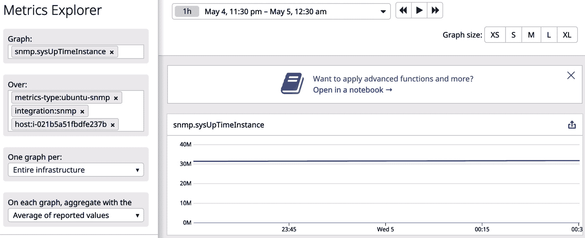
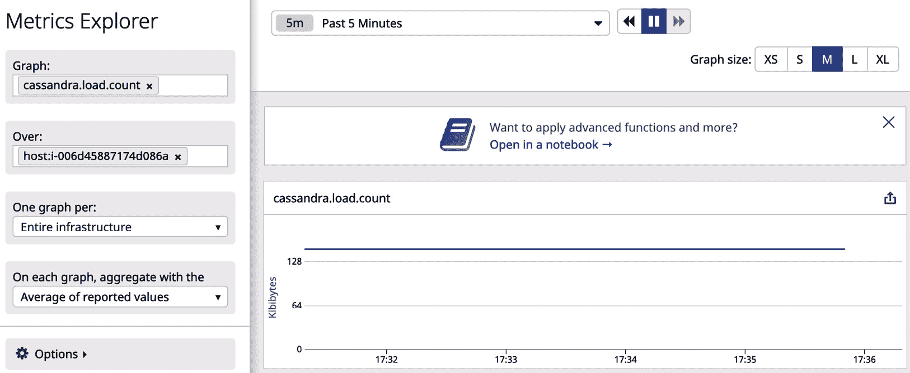
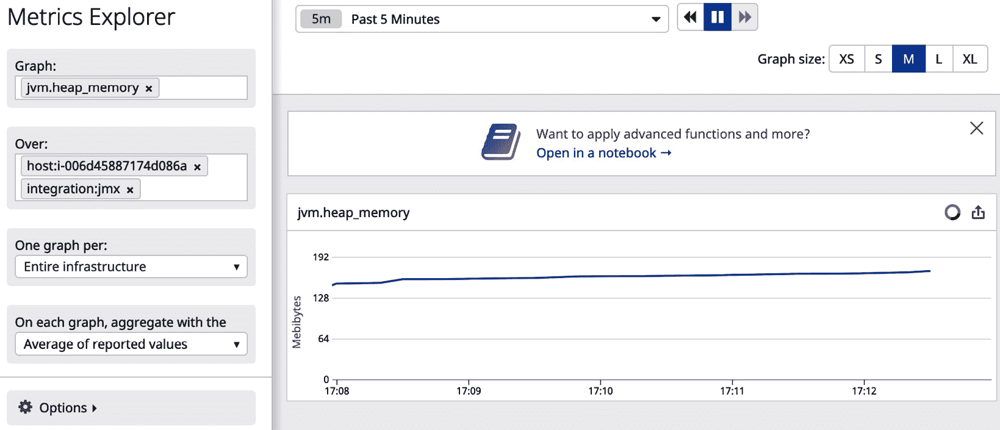
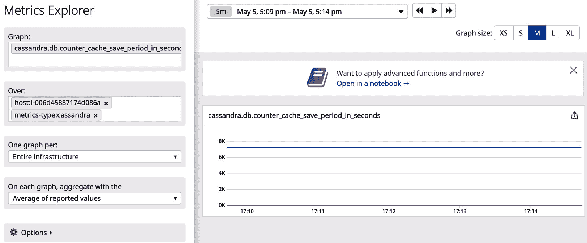
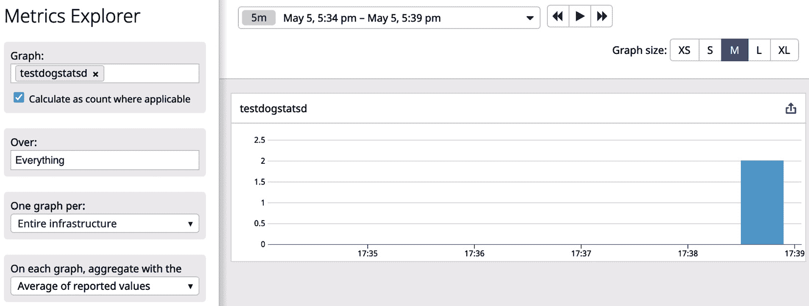
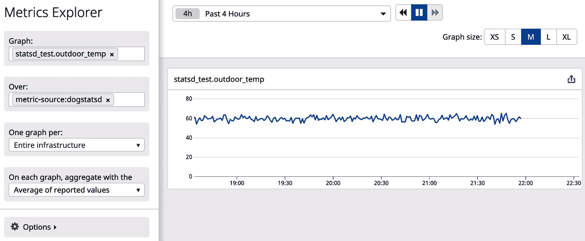
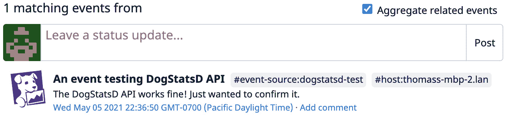

# *第十章*：使用监控标准

你已经看到 Datadog 提供的集成和 REST API 在扩展 Datadog 功能方面的实用性。本章将探讨更多可用于扩展这些功能的选项，这些选项本质上是监控领域标准的实现，以及如何使用它们来部署自定义的监控需求。

本章涵盖的主题包括：

+   使用 SNMP 监控网络

+   使用 JMX 消费应用程序指标

+   使用 DogStatsD 接口

# 技术要求

要尝试本书中提到的示例，你需要安装以下工具并准备好相关资源：

+   带有 Bash shell 的**Ubuntu 18.04**环境。示例可能也适用于其他 Linux 发行版，但需要对特定于 Ubuntu 的命令做出相应更改。

+   具有管理员级别访问权限的 Datadog 账户。

+   Datadog 代理运行在主机级别或作为微服务，具体取决于示例，指向 Datadog 账户。

+   curl。

+   **Python 2.7**，**Python 3.8**或更高版本

# 使用 SNMP 监控网络

**简单网络管理协议**（**SNMP**）是一种用于管理网络设备的协议。它已被用来跟踪网络中的设备及其性能，供应商也将其作为发布相关数据的标准。即使在公共云环境中，网络监控的需求几乎为零，在大规模操作环境中，设置一个同机房连接客户或内部管理一些物理网络设备始终是可能的。将这些设备接入现有的 Datadog 平台可能会很方便，而不是为此推出另一个监控解决方案。

在启用了 SNMP 的设备上，代理从设备收集性能指标并将其存储在`snmpwalk`中，`snmpwalk`是一个流行的命令行工具，用于扫描设备以获取此类数据。Datadog 与 SNMP 集成，可以配置代理扫描多个网络设备以收集指标。

由于网络设备并不容易找到，特别是在云环境中，我们将运行 SNMP 服务在虚拟机上，并使用`snmpwalk`查看指标。此外，启用 Datadog 中的 SNMP 集成的步骤也将通过该环境进行说明。

你需要一台 Ubuntu 主机来尝试以下的 SNMP 教程。这些步骤是在运行**Ubuntu 18.04**的 AWS EC2 节点上测试的：

1.  安装 SNMP 包：

    ```
    $ sudo apt-get install snmpd snmp snmp-mibs-downloader
    ```

1.  编辑`/etc/snmp/snmp.conf`并注释掉`mibs`的配置。

1.  重启 SNMP 守护进程：

    ```
    $ sudo /etc/init.d/snmpd restart
    ```

1.  这些步骤足以让 SNMP 服务在本地启动并运行，你可以使用`snmpwalk`扫描该服务：

```
$ snmpwalk -mALL -v2c -cpublic localhost  2>/dev/null
SNMPv2-MIB::sysObjectID.0 = OID: NET-SNMP-TC::linux
DISMAN-EVENT-MIB::sysUpTimeInstance = Timeticks: (346799) 0:57:47.99
SNMPv2-MIB::sysContact.0 = STRING: Me <me@example.org>
SNMPv2-MIB::sysName.0 = STRING: ip-172-31-31-12
SNMPv2-MIB::sysLocation.0 = STRING: Sitting on the Dock of the Bay
SNMPv2-MIB::sysServices.0 = INTEGER: 72
SNMPv2-MIB::sysORLastChange.0 = Timeticks: (2) 0:00:00.02
SNMPv2-MIB::sysORID.1 = OID: SNMP-MPD-MIB::snmpMPDCompliance
SNMPv2-MIB::sysORID.2 = OID: SNMP-USER-BASED-SM-MIB::usmMIBCompliance
SNMPv2-MIB::sysORUpTime.1 = Timeticks: (1) 0:00:00.01
HOST-RESOURCES-MIB::hrSystemUptime.0 = Timeticks: (760881) 2:06:48.81
HOST-RESOURCES-MIB::hrSystemDate.0 = STRING: 2021-1-31,6:53:37.0,+0:0
HOST-RESOURCES-MIB::hrSystemInitialLoadDevice.0 = INTEGER: 393216
HOST-RESOURCES-MIB::hrSystemNumUsers.0 = Gauge32: 1
HOST-RESOURCES-MIB::hrSystemProcesses.0 = Gauge32: 103
HOST-RESOURCES-MIB::hrSystemMaxProcesses.0 = INTEGER: 0
```

*(此输出仅为摘录。)*

如示例输出所示，扫描结果中可以获取不同的系统性能度量。我们来看看 `snmpwalk` 使用的命令行选项。启用 Datadog SNMP 集成时也需要类似的信息：

+   `-mALL` 选项指示 `snmpwalk` 查看所有可用的 MIB。在 Ubuntu 主机上，这些文件存储在 `/usr/share/snmp/mibs` 目录下。

+   `-v2c` 指定将使用的 SNMP 协议版本。共有三个版本，在 Datadog 中默认为 `v2`，与此处使用的版本相同。

+   `-cpublic` 表示扫描所使用的社区字符串是 `public`。在 SNMP 协议的 `v1` 和 `v2` 版本中，社区字符串类似于密码。在 `v3` 中，社区字符串被凭证认证取代。

现在，我们来看一下如何配置 Datadog 中的 SNMP 集成，以访问在 Ubuntu 主机上运行的 SNMP 服务：

1.  通过复制示例文件来设置 `conf.yaml`：

    ```
    $ cd /etc/datadog-agent/conf.d/snmp.d
    $ cp conf.yaml.example conf.yaml
    ```

1.  编辑 `conf.yaml` 并启用以下设置：在 `instances` 部分，将 `ip_address` 指向 `127.0.0.1`，即本地主机。

1.  将 `community_string` 设置为 `public`。

1.  添加两个自定义标签，以便轻松跟踪 SNMP 集成发布的度量：

    ```
    tags:
           - integration:snmp
           - metrics-type:ubuntu-snmp
    ```

1.  重新启动 Datadog 代理，以使这些更改生效。检查状态并通过运行以下命令验证 Datadog 代理是否可以本地查询 SNMP 服务：

```
$ sudo datadog-agent status
    snmp (3.5.3)
    ------------
      Instance ID: snmp:98597c6009cbe92e [OK]
      Configuration Source: file:/etc/datadog-agent/conf.d/snmp.d/conf.yaml
      Total Runs: 96
      Metric Samples: Last Run: 2, Total: 192
      Events: Last Run: 0, Total: 0
      Service Checks: Last Run: 1, Total: 96
      Average Execution Time : 7ms
      Last Execution Date : 2021-01-31 08:16:21.000000 UTC
      Last Successful Execution Date : 2021-01-31 08:16:21.000000 UTC
```

通过此集成发布到 Datadog 的度量可以在**Metrics Explorer**中查看，如下截图所示：



图 10.1 – 从 SNMP 集成中查看度量

可以在 SNMP 集成配置文件的 `instances` 部分指定多个网络设备，并且可以使用适当的标签区分这些度量。Datadog 代理可以配置为扫描整个网络子网，查找支持 SNMP 的设备。有关详细信息和配置，请参考官方文档 [`docs.datadoghq.com/network_performance_monitoring/devices/setup`](https://docs.datadoghq.com/network_performance_monitoring/devices/setup)。

在接下来的部分，我们将讨论**JMX**，这是一个与 Java 应用程序监控相关的重要领域，您将了解 Datadog 如何与其集成。

# 使用 JMX 消费应用程序度量

**Java 管理扩展** (**JMX**) 是一种 Java 技术，Java 应用程序可以使用它发布其操作统计信息。JMX 具有额外的功能，可以帮助管理应用程序整体，但我们这里只关注其暴露应用程序度量的能力，这些度量可用于监控。Datadog 提供对这些度量的收集支持。

通常，可以使用符合 JMX 标准的客户端应用程序，如**JConsole**，来消费 JMX 发布的指标并查看它们。由于 Java 应用程序通常使用 JMX 发布操作性指标，大多数现代监控平台都提供与 JMX 集成的选项，Datadog 也不例外。

推出应用级别的监控本身就很具挑战性，因为它依赖于发布自定义指标来跟踪应用程序的健康状况和性能。由于应用程序和监控工具需要做一些定制化工作才能发布和消费自定义指标，因此这类工作并不容易实现，因此在许多组织中，监控通常仅限于基础设施和平台监控功能，这些功能是开箱即用的。对于 Java 应用程序而言，使用 JMX 发布指标要比为监控构建 API 接口容易得多。Datadog 通过为流行的基于 Java 的平台组件，如**Cassandra** 和 **Tomcat**，提供特定的 JMX 集成，简化了 JMX 的使用，这些组件通过 JMX 发布操作性指标，此外还提供了通用的 JMX 集成。你将在本节中通过示例了解这两种特性。

## Cassandra 作为一个 Java 应用程序

**Apache Cassandra** 是一个高可扩展性的 NoSQL 数据库系统，可以管理跨多个数据中心和云区域的结构化和非结构化数据。它可以在普通硬件上运行，并具有高度的韧性设计。

在生产环境中，Cassandra 运行在一个由多台机器组成的集群中，这些机器可能跨越多个数据中心以保证可靠性。为了演示其 JMX 特性，我们将在单节点上运行它，使用可以从[`cassandra.apache.org/download/`](https://cassandra.apache.org/download/)下载的二进制**tarball**安装包，你还可以从该网址下载最新的稳定版本：

1.  选择的 tarball 可以通过以下示例命令下载：

    ```
    $ curl -OL https://apache.claz.org/cassandra/3.11.9/apache-cassandra-3.11.9-bin.tar.gz
    ```

1.  解压 tarball 并切换到解压后的目录：

    ```
    $ tar xzf apache-cassandra-3.11.9-bin.tar.gz
    $ cd apache-cassandra-3.11.9
    ```

1.  确保环境中可用**Java 8**。如果没有，安装它。在 Ubuntu 主机上，可以通过安装包来完成，方法如下：

    ```
    $ sudo apt install openjdk-8-jre-headless -y
    ```

1.  如下所示启动 Cassandra 服务：

```
$ bin/cassandra
```

如果一切顺利，且此实例不打算与应用程序一起使用，那基本就是这样了。你可以使用此服务来测试 Datadog 的 JMX 支持。

现在，让我们看看 Cassandra 的运行时细节和相应的 `nodetool`，你还可以查看日志以排查问题：

```
$ bin/nodetool status
Datacenter: datacenter1
=======================
Status=Up/Down
|/ State=Normal/Leaving/Joining/Moving
--  Address    Load       Tokens       Owns (effective)  Host ID                               Rack
UN  127.0.0.1  70.71 KiB  256          100.0%            03262478-23a3-4bd4-97f1-bc2c837ad650  rack1
      $ tail -f logs/system.log
INFO  [main] 2021-01-29 06:05:27,118 CassandraDaemon.java:650 - Startup complete
INFO  [OptionalTasks:1] 2021-01-29 06:05:36,893 CassandraRoleManager.java:372 - Created default superuser role 'cassandra'
```

这里需要注意的一点是 Cassandra Java 应用程序的启动方式，启用了 JMX。如果查看 Java 命令行，可以找到以下选项：

+   `-Dcassandra.jmx.local.port=7199`：此选项指定 JMX 服务在哪个端口上对客户端应用程序可用，供监控工具等消费数据。稍后您将看到，这个端口在客户端配置中使用，以便客户端应用程序能够定位该服务。

+   `-Dcom.sun.management.jmxremote.authenticate=false`：此选项指示 JMX 服务是否可以远程访问。

+   `-Dcom.sun.management.jmxremote.password.file=/etc/cassandra/jmxremote.password`：这是认证信息。

在本节中，我们已经查看了如何配置 Datadog 通过 JMX 接口获取应用程序指标，以 Cassandra 为例。下一节将介绍更多关于基于 JMX 的集成内容。

## 使用 Cassandra 集成

我们已经看到 Cassandra 服务启动时启用了 JMX 服务，并且该服务在端口 `7199` 上可用。Datadog 在此基础上提供了与 Cassandra 的集成，利用 JMX 接口提供的监控信息。

要启用 Cassandra 集成，需要按照以下标准步骤进行操作：

1.  在 Cassandra 主机上，还应该运行一个 Datadog Agent。在 `/etc/datadog-agent/conf.d/cassandra.d` 目录下，使用示例配置文件设置 Cassandra 集成的配置文件：

    ```
    $ cp conf.yaml.example conf.yaml
    ```

    从示例中复制的配置文件适用于启用集成。请注意，端口 `7199` 和配置文件中指定的用于收集数据的指标与 JMX 兼容。此外，从配置文件中的以下设置可以清楚地看出该集成的性质：

    ```
    init_config:
      ## @param is_jmx - boolean - required
      ## Whether or not this file is a configuration for a JMX integration
      #
      is_jmx: true
    ```

1.  设置好配置文件后，重启 Datadog Agent 服务：

    ```
    $ sudo service datadog-agent restart
    ```

1.  检查 Cassandra 集成的状态，特别是在 `JMXFetch` 部分下列出的状态：

```
$ sudo datadog-agent status
========
JMXFetch
========
  Initialized checks
  ==================
    cassandra
      instance_name : cassandra-localhost-7199
      message : <no value>
      metric_count : 230
      service_check_count : 0
      status : OK
```

通过该集成获取的指标可以在 **指标浏览器** 中查看。例如，查看如何从 JMX 接口获取的一个指标在 **指标浏览器** 中查找并绘制图表：



](img/Figure_10.2_B16483.jpg)

图 10.2 – 在指标浏览器中列出的 Cassandra 指标

在这种情况下，您无需了解 JMX 即可消费通过 JMX 接口发布的监控数据。

## 访问 Cassandra JMX 接口

Datadog 还可以配置为通过通用 JMX 集成从 **Cassandra JMX** 接口获取指标，而不是之前使用的专用 Cassandra 集成。Datadog 使用这种通用方法从没有 Datadog 集成的第三方应用程序中获取 JMX 指标。如果您的 Java 应用程序通过 JMX 发布应用程序指标，这种方法也适用：

1.  在启用通用 JMX 集成之前，通过将 `/etc/datadog-agent/conf.d/cassandra.d` 中的 `conf.yaml` 配置文件重命名为 `conf.yaml.BAK` 来禁用 Cassandra 集成。

1.  根据示例文件 `conf.yaml.example` 创建 `conf.yaml` 配置文件，该文件位于 `/etc/datadog-agent/conf.d/jmx.d`。

    你可以验证配置文件中指定的 JMX 端口是否为 `7199`：

    ```
    instances:
      -
        ## @param host - string - optional - default: localhost
        ## JMX host to connect to.
        #
        host: localhost
        ## @param port - integer - required
        ## JMX port to connect to.
        #
        port: 7199
    ```

1.  将这些标签添加到配置文件中，以便你以后可以使用它们来过滤指标：

    ```
                 tags:
                     - integration:jmx
                     - metrics-type:default
    ```

1.  重启 Datadog Agent 以启用 JMX 集成：

    ```
    $ sudo service datadog-agent restart
    ```

1.  检查 `JMXFetch` 的状态，确保集成按预期工作：

```
$ sudo datadog-agent status
========
JMXFetch
========
  Initialized checks
  ==================
    jmx
      instance_name : jmx-localhost-7199
      message : <no value>
      metric_count : 27
      service_check_count : 0
      status : OK
  Failed checks
  =============
    no checks
```

请注意，在前面的示例中提到的 Cassandra 是在 `JMXFetch` 状态下，而这次是 `jmx` 状态。

在 JMX 集成正常工作的情况下，你可以在**指标浏览器**中查找任何默认的 JMX 指标，如下图所示：



](img/Figure_10.3_B16483.jpg)

图 10.3 – Cassandra JMX 接口的默认指标

要从 JMX 接口收集特定于应用程序的指标，这些指标应在 JMX 集成的配置文件中显式指定，如下所示：

```
 conf:
  - include:
      domain: org.apache.cassandra.db
      type:
         - Caches
```

这只是可用指标的示例集。Cassandra 发布了大量指标，你可以在 `/etc/datadog-agent/conf.d/cassandra.d/metrics.yaml` 中查找。需要注意的是，为了让 Datadog 从 JMX 接口收集应用程序指标，必须在配置文件中明确指示这些指标，就像在示例中所做的那样。

此外，将 `metrics-type` 标签的值设置为 `cassandra`，以便轻松过滤由 Datadog 从此示例中收集的指标。像往常一样，进行这些配置更改后，你需要重启 Datadog Agent，才能使更改生效。

你将能够在**指标浏览器**中查找由 Datadog 收集的新指标，如下图所示：



](img/Figure_10.4_B16483.jpg)

图 10.4 – Cassandra 特定的应用程序指标

Datadog 与 JMX 的集成细节可以在官方文档中找到：[`docs.datadoghq.com/integrations/java`](https://docs.datadoghq.com/integrations/java)。如果你计划为你的 Java 应用程序配置 Datadog 以消费指标，这是一个很好的起点。

在下一节中，你将了解 StatsD，这是一种流行的监控标准，以及 Datadog 如何支持它。

# 使用 DogStatsD 接口

**StatsD** 是一个开源项目，用于发布应用程序指标，最初由照片共享网站 **Flickr** 构想。它经历了多个实现，最新版本是一个 Node.js 应用程序。StatsD 的代码和文档可以在 [`github.com/statsd/statsd`](https://github.com/statsd/statsd) 找到。

StatsD 服务通常运行在端口 `8125` 上，并监听通过 UDP 或 TCP 发送的统计数据。默认情况下，StatsD 监听 UDP 端口，并将聚合数据发送到图表和监控应用程序，如 Graphite。Datadog 将此服务捆绑为 DogStatsD，并且它作为一个 UDP 服务默认运行在端口 `8125`，即 Datadog Agent 运行的地方。

可以通过在运行 Datadog Agent 的主机上执行 `datadog-agent status` 命令来检查 DogStatsD 服务的状态，其输出如下所示：

```
=========
DogStatsD
=========
  Event Packets: 0
  Event Parse Errors: 0
  Metric Packets: 5,107,230
  Metric Parse Errors: 0
  Service Check Packets: 0
  Service Check Parse Errors: 0
  Udp Bytes: 329,993,779
  Udp Packet Reading Errors: 0
  Udp Packets: 5,107,231
  Uds Bytes: 0
  Uds Origin Detection Errors: 0
  Uds Packet Reading Errors: 0
  Uds Packets: 0
```

前面的步骤描述了如何从 Java 应用程序访问 JMX 指标。尽管某些应用程序（如 Cassandra）提供了访问 JMX 指标的应用程序特定集成，但这种通用集成足以从任何 Java 应用程序中获取 JMX 指标。

## 发布指标

自定义指标值可以通过多种方式发布到 Datadog 后端，以便在监控和仪表板中使用。例如，可以将任意的指标值发送到本地主机上运行的 DogStatsD 服务，如以下示例所示：

```
$ echo "testdogstatsd:2|c" | nc -u -w0 127.0.0.1 8125
```

发送到 DogStatsD 服务的测试指标值将由 Datadog 作为后端应用程序进行处理，并且该指标值可以在**Metrics Explorer**中查找，如下图所示：



图 10.5 – 在 Metrics Explorer 中查找通过 DogStatsD 发送的指标值

可以通过 DogStatsD 接口将各种类型的指标值（如 **count**、**gauge**、**set** 和 **histogram**）发布到 Datadog 后端。以下 Python 代码示例演示了如何发布这样的时间序列数据集：

```
# post-metric-dogstatsd.py 
import time
import random
from datadog import initialize, statsd
options = {
    'statsd_host':'127.0.0.1',
    'statsd_port':8125
}
initialize(**options)
while(1):
  # Get a random number to mimic the outdoor temperature.
  temp = random.randrange(50,70)
  statsd.gauge('statsd_test.outdoor_temp', temp, tags=["metric-source:dogstatsd"]
  )
  time.sleep(10)
```

该程序基本上会在 `50` 和 `70` 之间选择一个随机数，并将其作为户外温度发布，标签为 `metric-source:dogstatsd`。它将在无限循环中运行，每次发布指标时等待 *10* 秒，模拟时间序列数据集。

这里需要注意的重要一点是，发布数据不需要身份验证。只要 Datadog Agent 运行的主机上的 DogStatsD 服务端口（默认是 `8125`）是开放的，前面的示例程序就可以发布指标。虽然这提供了灵活性，但如果 Datadog Agent 运行的网络没有进行加固，也可能成为安全漏洞。

可以通过指标名称和标签（如果需要）在 **Metrics Explorer** 中查找发布到 Datadog 后端的数据，如下图所示：



图 10.6 – 通过 DogStatsD 接口发布的时间序列指标值

StatsD 是一个用于发布度量数据的通用接口。然而，由 Datadog 实现的 DogStatsD 扩展了对 Datadog 特定资源（如事件和服务检查）的支持。如果 DogStatsD 被用作将状态和更新发布到 Datadog 后端的中心，特别是在你的应用程序使用 DogStatsD 作为主要通道将监控信息发布到 Datadog 后端时，这些附加功能将非常有用。

## 发布事件

向 Datadog 事件流发布事件很简单，以下 Python 程序进行了说明：

```
# post-event-dogstatsd.py 
from datadog import initialize, statsd
options = {
    'statsd_host':'127.0.0.1',
    'statsd_port':8125
}
initialize(**options)
title = "An event testing DogStatsD API"
text = "The DogStatsD API works fine! Just wanted to confirm it."
tags = ["event-source:dogstatsd-test"]
statsd.event(title, text, alert_type='info', tags=tags)
```

该程序将向事件流发布事件，如下图所示：



Figure 10.7 – DogStatsD 集成发布的事件

如果你希望保持 StatsD 接口的通用性，以便其他兼容的监控应用程序也能从中获取度量数据，最好仅将其用于发布符合 StatsD 标准的度量数据。对于发布 Datadog 特定资源，最好使用 Datadog API。

你已经了解了三种不同的监控标准，它们虽然差异很大，但都是非常强大的选项，可以用于部署全面的监控解决方案。接下来，让我们看看与它们相关的最佳实践。

# 最佳实践

现在，让我们看看如何利用监控标准和 Datadog 提供的支持来实现最佳实践：

+   在使用 SNMP 集成监控网络设备时，你必须处理的度量数据数量可能会让人不知所措。因此，识别出几个关键的度量数据，能够跟踪性能并主动识别问题，并使用这些数据来实施监控是非常重要的。

+   JMX 可以用来操作应用程序的工作方式，而这些操作不应该在监控基础设施端实现，因为监控本质上是一个*只读*活动。换句话说，监控应用程序通常不会主动采取任何纠正措施，因为监控不被认为是应用程序系统的一部分，而且监控工具的不可用不应妨碍它所监控的主应用程序的正常工作。

+   StatsD 仅设计用于处理可由 Datadog 等应用程序消费的度量数据。如果你的环境中有多个监控工具，且 Datadog 只是其中之一，最好仅通过 DogStatsD 发布度量数据，以保持在多个系统之间移动数据的灵活性。

+   由于 DogStatsD 除了访问服务端口外不需要任何认证，因此运行 DogStatsD 的环境（如主机或容器）应该得到充分的安全保护，以防止未经授权的信息发布。

# 摘要

在本章中，你已经学习了三种重要的监控标准：SNMP、JMX 和 StatsD，它们有助于将网络设备和自定义应用程序集成到 Datadog 中。由于这些是通用标准，它们得到了大多数流行监控工具的支持。使用这些标准的一般模式是坚持使用标准功能，而不是使用扩展，因为前者的方法能够使你的监控与其他监控工具兼容。

在下一章，本书集成部分的最后一章，我们将讨论如何直接从自定义应用程序处理中集成。可以使用官方和社区开发的编程库，将应用程序直接与 Datadog 进行集成。我们将探讨如何使用这些库以及 Datadog REST API 来将自定义应用程序与 Datadog 集成。
