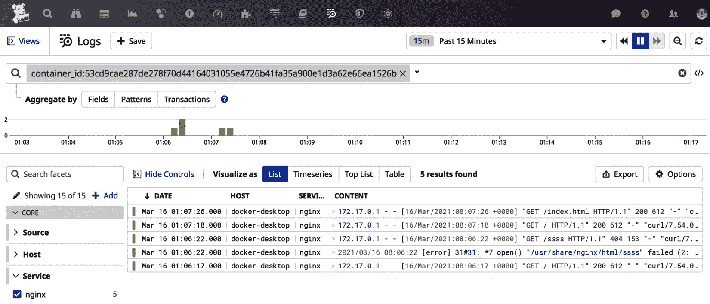

# *第十二章*：监控容器

容器监控在本书的早期已经简要介绍。然而，采用基于微服务的架构来构建应用程序，以及越来越多地使用容器来部署这些应用程序，要求有像本章这样专门的章节来讲解。监控应用程序正在努力支持这一领域的进展，而 Datadog 也在不断添加新特性。

在本章中，您将了解与监控容器相关的 Datadog 重要功能。具体来说，将涵盖以下主题：

+   收集 Docker 日志

+   监控 Kubernetes

+   使用实时容器

+   使用实时尾随查看日志

+   搜索容器数据

# 技术要求

要尝试本章中提到的示例，您需要在 Docker 或 Kubernetes 上部署 Datadog Agent 的环境。以下环境中开发了这些示例：

+   **Docker**：**Docker Desktop 3.2.2**，在 MacBook Pro 上运行。任何具有最新版本 Docker 的环境都兼容。

+   在 MacBook Pro 上运行`minikube v1.18.1`。要尝试这些示例，可以使用任何拥有`kubectl` `v1.20.0`或更高版本的 Kubernetes 环境。

这些示例甚至可能适用于旧版本的 Docker 和 Kubernetes；我们鼓励您在它们各自的最新版本上尝试这些示例。

# 收集 Docker 日志

在*第二章*，*部署 Datadog Agent*，您学习了如何作为基础设施的一部分监控基于 Docker 的容器。通过适当配置 Datadog Agent，可以获取正在运行的 Docker 容器的信息、`metrics.*`指标组，并监控容器的健康状态。容器的应用日志通常写入`stdout`和`stderr`流。在本节中，我们来看看如何通过配置 Datadog Agent 及相应的 Docker 镜像来收集应用日志。

从容器收集日志的首选方法是将 Datadog Agent 作为容器在同一 Docker 主机上运行。尽管启动 Datadog Agent 容器的实际命令行可能会因目标操作系统的不同而略有不同，但在 Unix 类系统（如 macOS 或 Linux）上，命令将如下所示：

```
$ docker run -d --name datadog-agent \
           -e DD_API_KEY=DATADOG-API-KEY  \
           -e DD_LOGS_ENABLED=true \
           -e DD_LOGS_CONFIG_CONTAINER_COLLECT_ALL=true \
           -e DD_CONTAINER_EXCLUDE="name:datadog-agent" \
           -v /var/run/docker.sock:/var/run/docker.sock:ro \
           -v /proc/:/host/proc/:ro \
           -v /opt/datadog-agent/run:/opt/datadog-agent/run:rw \
           -v /sys/fs/cgroup/:/host/sys/fs/cgroup:ro \
           gcr.io/datadoghq/agent:latest
```

请注意，`DATADOG-API-KEY`必须替换为与 Datadog 用户账户关联的有效 API 密钥。

成功运行 Datadog Agent 容器后，您应能够从命令行验证其状态，具体如下：

```
$ docker ps
CONTAINER ID        IMAGE                           COMMAND                   CREATED             STATUS                  PORTS                  NAMES
2689f209fc16        gcr.io/datadoghq/agent:latest   "/init"                  29 hours ago        Up 29 hours (healthy)   8125/udp, 8126/tcp     datadog-agent
```

主机上可能还会运行其他容器，但请寻找标签为`datadog-agent`的 Datadog Agent 容器。

要检查 Datadog Agent 服务是否能够从其他容器收集日志，您可以运行任何其他生成日志的容器。对于这里的示例，我们可以尝试运行一个 NGINX 容器，如下所示：

```
$ docker run -it --rm -d -p 8080:80 --name web nginx
```

该命令将运行一个标签为`web`的 NGINX 容器，这是我们稍后可以在 Datadog 仪表盘中用来定位此容器的名称。此外，容器端口将映射到 Docker 宿主机上的`8080`端口。

上述命令的输出在此未提供以简化说明，但您可以按照以下方式检查它是否正在运行：

```
$ docker ps 
CONTAINER ID        IMAGE                           COMMAND                   CREATED             STATUS                  PORTS                  NAMES
53cd9cae287d        nginx                           "/docker-entrypoint.…"   28 hours ago        Up 28 hours              0.0.0.0:8080->80/tcp   web
2689f209fc16        gcr.io/datadoghq/agent:latest   "/init"                  29 hours ago        Up 29 hours (healthy)   8125/udp, 8126/tcp     datadog-agent
```

查看容器的名称和端口映射；这使得您可以通过宿主机上的`8080`端口访问 NGINX 服务，即使该服务在容器中运行在`80`端口。

此外，您还可以通过浏览器使用 URL `http://localhost:8080` 访问 NGINX 服务（如果从远程主机访问服务，可以使用 IP 地址或`CNAME`替代 localhost）。也可以使用命令行工具如`curl`访问该服务。您需要这样做，以生成一些日志，查看 Datadog Agent 如何收集它们。

现在让我们看看如何通过 Datadog UI 查看日志。通过导航到**基础设施** | **容器**，您可以进入**容器**仪表盘，如下图所示：


图 12.1 – 列出容器

查找您想查看日志的容器名称。在此示例中，容器名称为**web**，您可以双击它以打开以下对话框。在下拉菜单中选择**日志**标签，如下图所示：


图 12.2 – 从容器收集的日志

如您所见，显示的日志可以按时间窗口进行筛选，比如示例中设置的过去 15 分钟。要生成新日志，只需通过 web 浏览器或`curl`访问 URL。

日志也可以在**日志浏览器**提供的更好的界面中查看。如*图 12.2*所示的对话框提供了一个链接，用于启动日志浏览器，如下图所示：


图 12.3 – 链接到日志浏览器

通过点击链接**在日志浏览器中打开**，如*图 12.3*所示，可以启动**日志浏览器**仪表盘，界面如下所示：



图 12.4 – 日志浏览器

该界面与行业标准的日志聚合工具非常相似，如**Splunk**、**Sumo Logic**和**ELK Stack**。

在此示例中，您已经学习了如何从容器捕获日志并通过运行 Datadog Agent（也是作为容器）在同一 Docker 宿主机上将其发布到 Datadog。如果您有自定义运行容器的 Docker 镜像的选项，则可以对镜像进行修改，以更好地捕获容器日志。在接下来的示例中，您将学习如何在容器上启用 NGINX 日志集成。

主要步骤是为日志收集给 Docker 镜像打标签，如下所示的**Dockerfile**所示，该文件用于构建在前面的示例中使用的 NGINX 镜像的自定义版本：

1.  在当前目录中创建如下所示的 Dockerfile，构建自定义版本的 NGINX 镜像，并使用它启动容器：

    ```
    $ cat Dockerfile
    FROM nginx:latest
    LABEL "com.datadoghq.ad.logs"='[{"source": "nginx", "service": "webapp-custom"}]'
    ```

1.  构建 Docker 镜像：

    ```
    $ docker build -t nginx-custom .
    ```

1.  验证 Docker 镜像是否成功构建：

    ```
    $ docker images|grep custom
    nginx-custom                                           latest              b8121cf4a3fe        29 minutes ago      133MB
    ```

1.  启动自定义构建的 NGINX 容器：

    ```
    $ docker run -it --rm -d -p 8080:80 --name web-custom nginx-custom
    59162bf7694cd146166c040263d73afea934eb8081c63875f17e28228
    48b4b16
    ```

1.  检查 NGINX 容器是否正在运行：

    ```
    $ docker ps | grep custom
    59162bf7694c        nginx-custom                    "/docker-entrypoint.…"   41 minutes ago      Up 41 minutes          0.0.0.0:8080->80/tcp   web-custom
    ```

1.  验证是否可以在 Docker 主机的端口`8080`上访问容器：

    ```
    $ curl -I http://localhost:8080
    HTTP/1.1 200 OK
    Server: nginx/1.19.8
    Date: Wed, 17 Mar 2021 05:55:45 GMT
    Content-Type: text/html
    Content-Length: 612
    Last-Modified: Tue, 09 Mar 2021 15:27:51 GMT
    Connection: keep-alive
    ETag: "604793f7-264"
    Accept-Ranges: bytes
    ```

如果所有前面的步骤都成功，您可以检查 Datadog 是否正在捕获日志。

为了验证日志是否已被收集，可以在 Datadog 容器仪表盘中查找容器日志，正如您之前所看到的那样：

1.  导航到**基础设施** | **容器**。

1.  双击**nginx-custom**容器。

1.  在**日志**标签下查找日志条目。

1.  另外，**日志浏览器**也可以用于搜索日志，正如您在前面的示例中所学到的那样。

您已经了解了如何使用 Datadog 监控运行在 Docker 主机上的容器的基础设施和应用程序级别，特别是在本节中如何收集来自容器的应用程序日志。Kubernetes 最近正在成为部署微服务的默认平台，在下一节中，您将学习如何使用 Datadog 监控运行在 Kubernetes 上的容器。

# 监控 Kubernetes

Docker 可以用于打包和运行微服务，您在前面的章节中已经看到了这些示例。然而，这只是微服务可用的打包解决方案之一。Kubernetes 是一个用于运行使用 Docker 等工具打包的微服务的平台。它提供了大量功能来编排和维护基于微服务的软件系统的部署。实际上，它可以被视为微服务的操作系统。

Kubernetes 环境可以在多种基础设施上设置，从用于测试目的的笔记本电脑到数据中心中几台机器的集群。然而，运行 Kubernetes 最流行的方式是使用公共云平台上提供的托管服务，如`kubectl`。在本节中，您将学习如何部署 Datadog 代理，以监控在 Kubernetes 环境中运行的容器。

为了测试这里提供的步骤，使用了基于`minikube`的 Kubernetes 环境，它在个人计算机上运行。关于如何设置`minikube`的详细信息可以在这里找到：[`minikube.sigs.k8s.io/docs/start/`](https://minikube.sigs.k8s.io/docs/start/)。这些部署 Datadog 的步骤适用于任何 Kubernetes 环境，您可以在任何地方尝试，无论底层 Kubernetes 基础设施如何。

监控 Kubernetes 包括两个部分：监控 Kubernetes 集群本身，以及监控由 Kubernetes 编排的容器中运行的微服务。前者是基础设施监控，后者是应用程序监控。要使 Datadog 能够访问相关的监控信息，必须将 Datadog Agent 安装为 Kubernetes 集群中的一个容器之一，由此定义 Kubernetes 资源以支持。

## 安装 Datadog Agent

Datadog Agent 安装为 Kubernetes 集群中所有节点上的 **DaemonSet**，以便收集并推送来自每个节点的日志、跟踪和指标至 Datadog 后端。在较大的环境中，实际实施可能会有所不同，因为 Kubernetes 平台及其运行的服务类型在实际场景中可能大不相同。让我们通过进行示例安装来查看一般步骤：

1.  下载用于创建 `datadog-agent` 的 `ClusterRole` 的示例 YAML 文件：

    ```
    $ wget https://raw.githubusercontent.com/DataDog/datadog-agent/master/Dockerfiles/manifests/rbac/clusterrole.yaml
    ```

1.  将以下代码片段添加到 `clusterrole.yaml` 文件的末尾。在最新版本的 Kubernetes 中可能不需要这样做：

    ```
    - apiGroups:  
      - "apps"
      resources:
      - deployments
      - replicasets
      - pods
      - nodes
      - services
      verbs:
      - list
      - get
      - watch
    ```

1.  为 `datadog-agent` 创建 `ClusterRole`：

    ```
    $ kubectl apply -f clusterrole.yaml
    $ kubectl get clusterroles |grep datadog-agent
    datadog-agent     2021-03-18T07:32:49Z
    ```

1.  下载用于为 `datadog-agent` 创建 `ServiceAccount` 的示例清单，然后进行配置：

    ```
    $ wget https://raw.githubusercontent.com/DataDog/datadog-agent/master/Dockerfiles/manifests/rbac/serviceaccount.yaml
    $ kubectl apply -f serviceaccount.yaml
    $ kubectl get serviceaccounts |grep datadog-agent
    datadog-agent   1         23h
    ```

1.  下载用于创建 `ClusterRoleBinding datadog-agent` 的示例 YAML 文件，它链接到先前步骤中设置的 `ClusterRole` 和 `ServiceAccount` 资源：

    ```
    $ wget https://raw.githubusercontent.com/DataDog/datadog-agent/master/Dockerfiles/manifests/rbac/clusterrolebinding.yaml
    $ kubectl apply -f clusterrolebinding.yaml
    $ kubectl get clusterrolebindings |grep datadog-agent
    datadog-agent     ClusterRole/datadog-agent           23h
    ```

1.  为 API 密钥创建一个秘密：

    ```
    $ kubectl create secret generic datadog-agent --from-literal api-key="API-KEY" --namespace="default"
    $ kubectl get secrets |grep datadog-agent
    datadog-agent       Opaque         1      26h
    ```

1.  下载一个适合您需求的 Datadog Agent 的示例清单。完整列表可在 [`docs.datadoghq.com/agent/kubernetes/?tab=daemonset`](https://docs.datadoghq.com/agent/kubernetes/?tab=daemonset) 上找到。为了本示例部署的目的，使用支持启用日志和指标的清单：

    ```
    $ wget https://docs.datadoghq.com/resources/yaml/datadog-agent-logs.yaml
    ```

1.  更新示例 Datadog Agent 清单，进行以下更改。

    在 `datadog-agent` 密钥资源部分，使用有效 API 密钥的 base64 编码值更新 `api-key` 字段。可以以不同方式进行编码，并且有在线工具可用于这些方式。如果您的工作环境中有 `openssl`，可以在命令行上可靠地执行编码：

    ```
    $ echo -n 'API-KEY' | openssl base64
    Y2Q1YmM5NjAzYmMyM2EyZDk3YmViMTxyzajc1ZjdiMTE=
    ```

1.  在代理程序的容器部分添加以下环境变量：

    ```
    DD_KUBELET_TLS_VERIFY to false on all Kubernetes platforms, so it's optional.
    ```

1.  部署 Datadog Agent DaemonSet：

    ```
    $ kubectl apply -f datadog-agent-logs.yaml
    $ kubectl get daemonset
    NAME DESIRED  CURRENT READY UP-TO-DATE  AVAILABLE  NODE SELECTOR AGE
    datadog-agent 1   1    1    1   1       kubernetes.io/os=linux   25h
    ```

可以通过 Kubernetes 仪表板查找和验证之前步骤中创建的 Kubernetes 资源。例如，如果所有前面的步骤都成功，您将能够看到列出 `datadog-agent` Pod，并显示状态为 `Running`，如下所示的截图：


图 12.5 – 在 Kubernetes 仪表板上列出的 datadog-agent Pod

同样，可以在 Kubernetes 仪表板上查找与部署 Datadog Agent 相关的其他资源，并可以从那里管理它们。

在成功部署 Datadog Agent 后，您将能够在 **Containers** 仪表板上查看 Kubernetes 基础设施资源和在集群中运行的容器，如以下截图所示：


图 12.6 – Kubernetes 资源和容器

通过点击感兴趣的容器，可以在 **Containers** 仪表板上查看与该容器相关的日志和指标，如您在上一节中学习到的内容，包括访问 **Log Explorer** 仪表板的权限。

查看 Kubernetes 平台资源的选项，例如 **Pods**、**Deployments**、**ReplicaSets**、**Services** 和 **Nodes**，与 Kubernetes Dashboard 提供的选项类似。然而，通过 Datadog 跟踪这些资源，还可以选择使用 Datadog 来监控这些资源。

我们已经学习了如何通过与 Docker 和 Kubernetes 的集成，使用 Datadog 来监控实时容器。在接下来的部分中，您将了解在 Kubernetes 环境中有关该功能的更多信息。

# 使用实时容器

实时容器是 Datadog 的一项功能，它提供了对实时容器运行情况的洞察。如您所知，Kubernetes 已经成为编排容器的行业标准，这不仅限于 Docker。Docker 只是用于打包和运行微服务的工具之一。尽管 Docker 仍然是主导的容器化平台，但像 **CoreOS rkt** 这样的工具也可以与 Kubernetes 配合使用，而且这一趋势正在获得动力。

Kubernetes 是一个复杂的平台，因此除了监控其运行的容器之外，监控 Kubernetes 平台本身同样重要。尽管 Kubernetes Dashboard 等原生应用程序是手动监控 Kubernetes 集群的首选工具，Datadog 的平台监控功能有助于将监控整合到一个平台上并实现自动化。

当 Kubernetes 集群完全配置，以便 Datadog Agent 发布集群级别和应用程序级别信息时，**Containers** 仪表板将如 *图 12.6* 所示。通过点击容器和 Kubernetes 资源，您可以随时查看相关的实时信息。

要能够将从 Kubernetes 集群捕获的信息发布到 Datadog，需要对集群进行配置。上一节已经讨论过一些配置内容，但值得再次回顾一些未讨论或未详细说明的重要事项：

+   Datadog Agent 容器应定义以下环境变量：

    ```
    - name: DD_ORCHESTRATOR_EXPLORER_ENABLED
        value: "true"
    ```

+   Datadog Agent 的 `ClusterRole` 应该设置权限，以便实时容器能够收集 Kubernetes 资源的信息。这个要求在上一节中已经讨论过，涉及到 `clusterrole.yaml` 文件的设置。

+   进程代理容器必须设置以下环境变量才能运行：

    ```
    - name: DD_ORCHESTRATOR_EXPLORER_ENABLED
      value: "true"
    - name: DD_ORCHESTRATOR_CLUSTER_ID
      valueFrom:
        configMapKeyRef:
          name: datadog-cluster-id
          key: id
    ```

+   设置`DD_CLUSTER_NAME`环境变量，适用于`agent`和`process-agent`：

    ```
    - name: DD_CLUSTER_NAME
      value: "<YOUR_CLUSTER_NAME>"
    The cluster name can be obtained from the Kubernetes configuration file.
    ```

在**容器**仪表板上，还列出了有关各种 Kubernetes 资源的信息，如节点、服务、部署和 Pod。通常，这些详细信息是通过 Kubernetes 仪表板 UI 进行查询和管理的，但将它们显示在 Datadog **容器**仪表板上会很方便，因为这样您可以在一个位置收集来自多个 Kubernetes 集群的信息。

在**容器**和**日志浏览器**仪表板的**日志**标签页中，您可能已经注意到**实时日志**选项。我们将在下一节中进一步介绍该功能的更多细节。

# 使用实时日志查看日志

Datadog 的`tail`会持续输出它跟踪的日志文件中的任何新增内容。使用**实时日志**的好处是，可以在一个仪表板上跟踪来自多个来源的相似日志文件的更新。

**实时日志**选项在**容器**仪表板上也可用，如下图所示：


](img/Figure_12.7_B16483.jpg)

图 12.7 – 使用实时日志选项实时查看日志

**日志浏览器**也有一个**实时日志**选项，如下图所示：


](img/Figure_12.8_B16483.jpg)

图 12.8 – 在日志浏览器中使用实时日志

在本节中，您已经了解了如何利用**实时日志**选项查看日志并定期报告它们。在下一节中，您将学习如何搜索从容器收集的大量日志，并利用这些洞察进行监控。

# 搜索容器数据

到目前为止，我们的重点一直是收集来自容器及其运行基础设施的信息，并将这些信息发布到 Datadog 后端。各种 Datadog 仪表板，尤其是**实时容器**和**日志浏览器**，为用户提供了这些信息。在一个实际环境中，Datadog 可能会发布大量监控信息，这样的海量数据可能会让人感到有些难以处理。解决方案是使用关键词和标签来搜索信息，您将在本节中学习如何做到这一点。

可以使用关键词在**实时容器**仪表板上搜索容器，搜索将与容器名称、ID 和镜像名称匹配。例如，在以下截图中，查找了容器 ID：


](img/Figure_12.9_B16483.jpg)

图 12.9 – 使用容器 ID 搜索容器

结果可以通过使用标签进一步筛选和/或分组。容器也可以仅通过标签来筛选，而无需使用关键词。

关键词搜索不仅仅是针对简单字符串的搜索。它可以通过使用布尔运算符，如`AND`、`OR`和`NOT`，进行复合查询。例如，`apache OR nginx`将返回在搜索支持的字段中（如容器名称字段）包含`apache`或`nginx`的容器列表。可以使用括号来创建更复杂的搜索构造。

与容器一样，Kubernetes 集群中的资源，如**Pods**、**ReplicaSets**、**Deployments**和**Services**，也可以通过关键词和标签在实时容器仪表板中进行搜索和筛选。

现在让我们在下一节中看看与容器监控相关的最佳实践。

# 最佳实践

以下是在使用 Datadog 监控容器时应遵循的一些最佳实践：

+   将 Datadog 代理作为容器运行，以便轻松发现应用容器并提供灵活性。即使由于某些原因可能需要在主机级别运行 Datadog 代理，将其作为容器在同一主机上运行也是可以接受的，考虑到它带来的操作优势。

+   在 Kubernetes 环境中，不要尝试通过 Docker 集成直接访问容器日志；而是应该在 Kubernetes 集群上安装 Datadog 代理并配置它以收集日志。

+   尽管可以使用`kubectl`和 Kubernetes Dashboard 查看 Kubernetes 集群资源，但将它们集成到 Datadog 中有助于提高它们的可用性和健康状态的可见性。

# 总结

本章中，你学习了如何利用 Datadog 结合 Docker 和 Kubernetes 的集成功能来监控容器。你还学会了在 Datadog 收集到容器信息和容器日志后，如何进行容器信息和日志的搜索。阅读本章并尝试其中提供的示例后，你已经为使用 Datadog 监控在 Docker 和 Kubernetes 环境中运行的容器做好了准备。

日志聚合、索引和搜索是监控中的一个主要领域，业内有许多重大举措，比如**ELK Stack**、**Splunk**和**Sumo Logic**。Datadog 也提供了解决方案，你将在下一章学习到相关内容。
