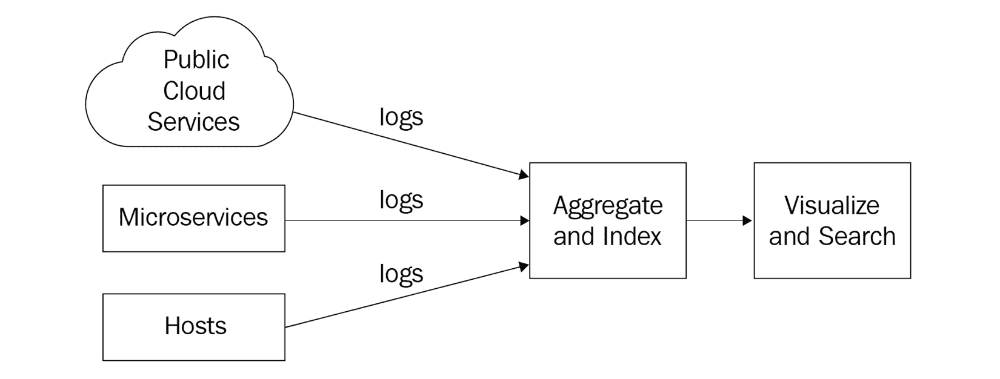
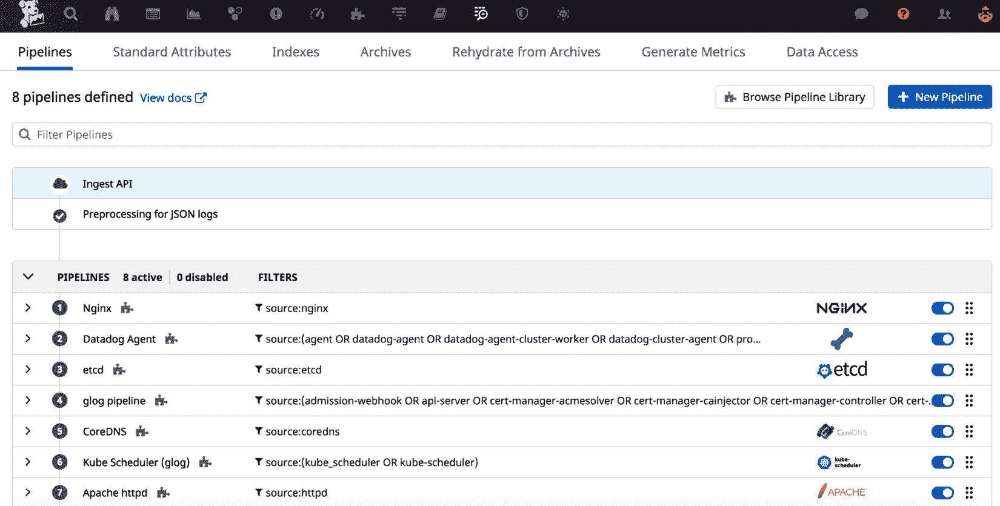
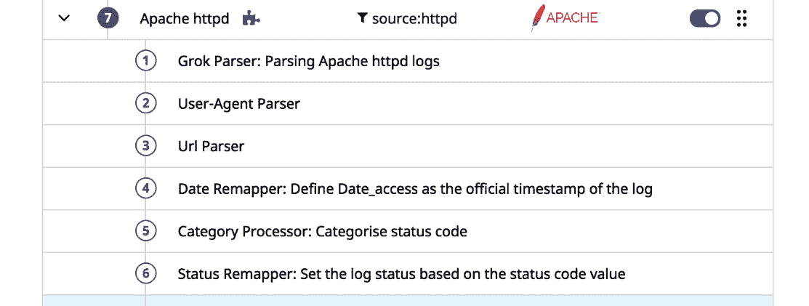
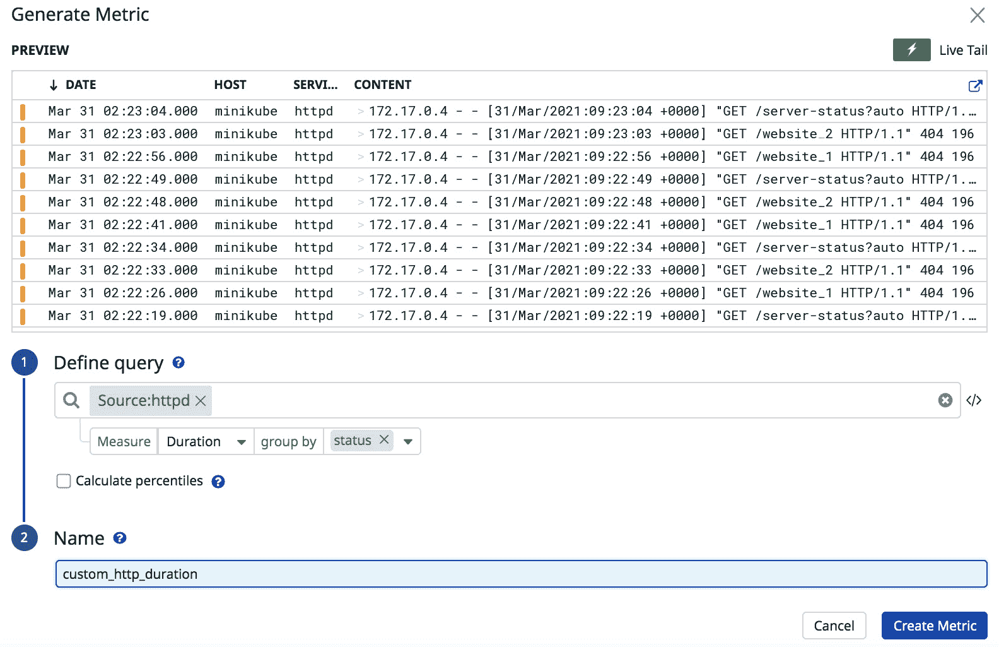
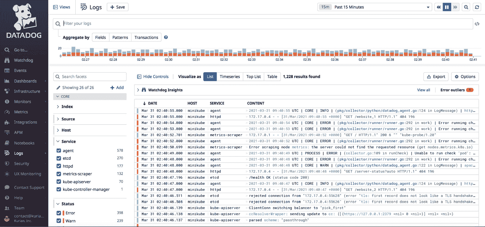
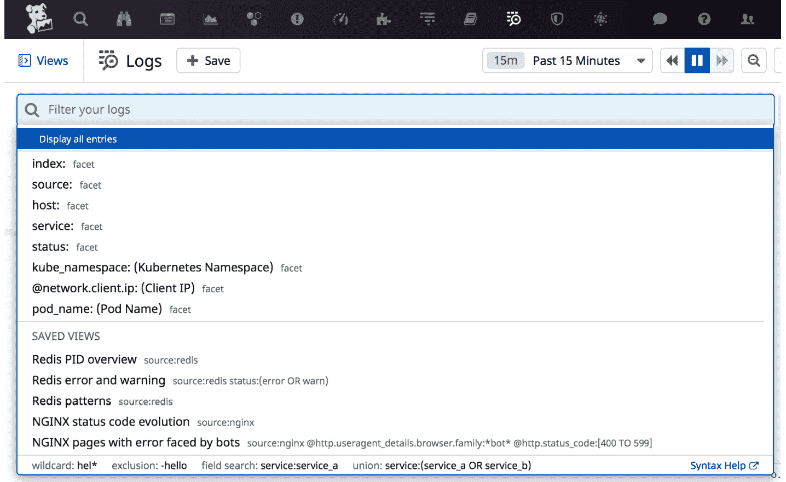
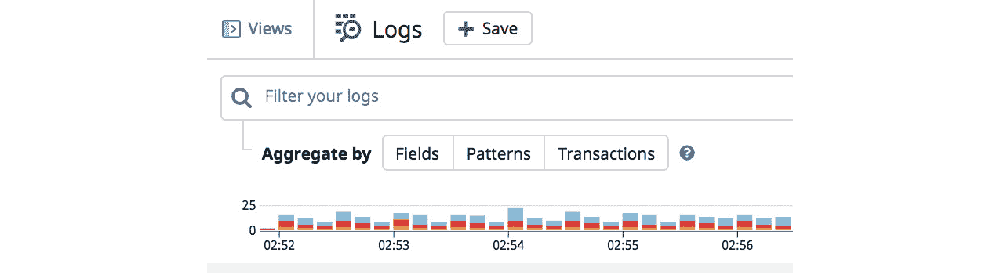

# *第十三章*：使用 Datadog 管理日志

操作系统、各个平台组件和应用服务生成的日志包含了大量关于基础设施状态以及其上运行的应用程序工作情况的信息。在中央存储库管理所有日志，并对其进行分析以获得运营洞察和监控数据，这是监控中的一个重要领域。它通常涉及日志的收集、聚合和索引。在*第一章*《监控概述》中，简要讨论了这种监控类型。在*第十二章*《监控容器》中，你学习了如何将容器中的日志发布到 Datadog，以便聚合和索引，从而便于搜索。

在这个领域，一些流行的监控产品包括 ELK Stack（**Elasticsearch**、**Logstash** 和 **Kibana**）、Splunk 和 Sumo Logic。现在，Datadog 也提供了这个功能，你在上一章中已经见过了其前端工具**日志浏览器**。

在本章中，我们将详细探讨 Datadog 的日志聚合和索引功能。具体来说，我们将关注以下主题：

+   收集日志

+   处理日志

+   归档日志

+   搜索日志

# 技术要求

若要尝试本书中提到的示例，你需要安装以下工具并具备相关资源：

+   一个具有管理员权限的 Datadog 帐户

+   在主机级别或根据示例作为微服务运行的 Datadog 代理，指向 Datadog 帐户

# 收集日志

任何日志管理应用程序的第一步是将日志收集到一个公共存储库中，以便稍后进行分析和归档保存。这项工作包括将日志文件从可用的机器和服务发送到公共存储库。

以下图表展示了收集和处理日志的工作流程，并将聚合后的信息呈现给最终用户。聚合后的信息可以作为指标发布，这些指标可用于设置监控。这与在传统监控应用程序中使用指标设置监控是相同的：



图 13.1 – 日志管理工作流程

在现代生产基础设施中，日志可能由多种来源生成，典型的来源包括以下几种：

+   **公共云服务**：公共云服务如 AWS S3 和 RDS 非常流行，尤其是在生产基础设施主要使用公共云服务构建的情况下。这些服务的日志可以通过相关的 Datadog 集成功能发送到 Datadog。

+   **微服务**：Datadog 为 Docker 和 Kubernetes 提供的集成功能可用于将这些日志发送到 Datadog。我们在上一章中已经看过如何实现这一操作。

+   **主机**：传统上，日志作为文件存储在主机上的磁盘位置，可能是裸金属或虚拟主机。可以配置 Datadog 代理将本地日志文件传输到 Datadog 后端。

现在，让我们来看一下 Datadog 如何收集和传输日志，了解上面总结的最常见用例的详细信息。

## 从公共云服务收集日志

Datadog 提供了与主要公共云平台（如 AWS、Azure 和 GCP）上提供的服务集成和日志收集方法。以下是可用的特定于云平台的方法：

+   **Cloudformation** 和 **Kinesis Firehose** 基于的选项可以用于自动化收集 AWS 服务的日志。

+   在 Azure 上，收集日志的自动化是基于 **Azure Event Hub** 和 **Azure Function** 的。

+   在 GCP 上提供 Datadog 集成，可收集该平台上提供的服务的日志。

## 从容器传输日志

当容器在 Docker 上运行，而不在 Kubernetes 集群中时，可以通过配置 Datadog 代理和相关的 Docker 镜像，将容器的日志传输到 Datadog。主要要求是在同一主机上部署一个 Datadog 代理作为容器。你在上一章已经了解了如何做到这一点。第二步是为 Docker 镜像添加容器标签，以便 Datadog 代理可以自动发现这些日志。例如，NGINX `Dockerfile` 中的以下标签有助于 Datadog 代理收集从该镜像启动的 NGINX 容器的日志，并以 `webapp` 作为容器运行：

```
LABEL "com.datadoghq.ad.logs"='[{"source": "nginx", "service": "webapp"}]'
```

对 Docker 镜像进行工具化可能并不总是可行，因为某些镜像可能由第三方提供，或者进行此类更改在操作上不可行。在这种情况下，可以在 Datadog 代理的运行环境中指定环境变量 `DD_LOGS_CONFIG_CONTAINER_COLLECT_ALL`，以收集该主机上运行的所有容器的日志。如果有任何日志需要排除在聚合之外，Datadog 提供了选项，可以在将这些日志发送进行处理之前将其过滤掉，稍后我们会在本节中讨论这个问题。

在 Kubernetes 集群中配置，将在该环境中运行的日志传输到 Datadog 后端的方式，类似于在 Docker 主机上的配置方式：

+   Datadog 代理必须作为容器在集群中运行。

+   应用容器必须被注解，`DD_LOGS_CONFIG_CONTAINER_COLLECT_ALL` 必须设置为 `true`，以便从集群中所有运行的容器中传送日志。例如，要启用 NGINX 容器的自动发现，必须在 Kubernetes 的部署描述中包含以下注解：

    ```
    template:
        metadata:
          annotations:
            ad.datadoghq.com/nginx.logs: '[{"source":"nginx","service":"webapp"}]'
    ```

接下来，我们来看看当 Datadog 代理在主机级别运行时，收集日志需要哪些配置。

## 从主机传输日志

可以通过 Datadog 为第三方应用提供的集成功能，将来自主机（Datadog Agent 运行所在的主机）的日志传送。如果没有可用的集成，则可以按照本节所述的自定义方法传送应用程序生成的日志：

在第一种情况中，应用程序如 NGINX 可用 Datadog 集成时，可以使用现有的配置文件来指定日志收集要求，如下例所示：

```
# in the config file conf.d/nginx.d/conf.yaml add the following configuration.
logs:
  - type: file
    service: webapp
    path: /var/log/nginx/access.log
    source: nginx
  - type: file
    service: webapp
    path: /var/log/nginx/error.log
    source: nginx
```

在前述示例场景中，日志文件 `/var/log/nginx/access.log` 和 `/var/log/nginx/error.log` 已配置为进行收集。如果需要直接从运行在端口上的服务收集日志，则日志类型将为 `tcp` 或 `udp`，并且必须用 `port` 替代 `path` 来指定端口。

在 Datadog Agent 配置中，默认情况下并未启用日志传输选项，需要在 `datadog.yaml` 文件中设置：`logs_enabled: true`。

如果应用程序没有现成的集成，需为该应用程序设置自定义配置文件以传输该应用生成的日志。以下是具体步骤：

+   在 `conf.d` 目录下，根据以下语法创建一个子目录，命名为 `<CUSTOM_APP>.d/conf.d`。

+   在新目录中，创建配置文件 `conf.yaml`，并为每个要收集的日志添加以下条目：

    ```
    logs:
      - type: file
        path: "</path/to/logfile>"
        service: "<CUSTOM_APP>"
        source: "<SOURCE_NAME>"
    ```

必须重新启动 Datadog Agent，以使这些配置更改生效。

## 日志过滤

如你所见，配置 Datadog Agent 或集成以从任何环境收集日志是相当简单的。然而，将日志中跟踪的所有信息传送到 Datadog 可能并非明智之举，原因有很多，以下是一些原因：

+   安全问题

+   由与客户的协议所施加的限制

+   法规要求

+   合规控制措施

因此，可能需要过滤掉日志中不用于监控、且不允许与更广泛的受众共享的信息。此外，这种过滤有助于减少存储使用量和传输到 Datadog 后端的数据量。

两个预定义规则 `include_at_match` 和 `exclude_at_match` 可以在收集阶段用于过滤日志。这些规则与正则表达式一起工作——如果日志条目与规则中使用的正则表达式匹配，则根据规则类型，日志将被包含或排除。

在下面的示例中，所有以字符串 `k8s-log` 开头的日志条目将被忽略：

```
logs:
  - type: file
    path: "</PATH/TO/LOGFILE>"
    service: "webapp"
    source: "nginx"
    log_processing_rules:
       - type: exclude_at_match
         name: exclude_k8s_nginx_log
         pattern: ^k8s-log
```

同一个日志文件允许多个 `include_at_match` 规则，这将导致 `AND` 条件。也就是说，必须同时满足两个规则，才能收集日志条目。

要实现 `OR` 规则，必须在同一表达式中使用 `|` 符号指定条件，如下例所示：

```
pattern:  ^warning | ^err
```

这将导致任何以`warning`或`err`开头的行被 Datadog 代理收集。

如您之前所见，过滤规则可以通过 Docker 运行时中的标签实现，也可以通过 Kubernetes 中的注释来实现。

## 从日志中清除敏感数据

聚合日志并将其展示给更广泛的受众时，常见的问题是日志中可能记录的敏感信息会不小心暴露，这会导致严重的安全和隐私问题。限制访问聚合日志的监控应用程序（如 Datadog 的**日志管理界面**）可能会影响其一般用途。更好的解决方案是在日志被传输到 Datadog 后端进行处理之前，从源头上清除日志中的敏感信息。

虽然您之前看到的过滤选项可以帮助避免收集包含敏感信息的完整日志条目，但它可能会遗漏日志中的某个重要细节，影响分析或监控。因此，对这些信息进行编辑是更好的选择，这样可以在日志中保留足够的操作细节。

用于清除信息的规则类型是`mask_sequences`。它与`replace_placeholder`选项一起工作，`replace_placeholder`决定了如何用占位符替换敏感信息，以表明日志条目中的信息已被遮蔽。

以下示例解释了如何同时使用这两个选项来实现所需的编辑效果，这种方法非常有效：

```
 log_processing_rules:
      - type: mask_sequences
        pattern: "^(User:.*), SSN:(.*), (.*)$"
        replace_placeholder: "${1}, SSN:[redacted], ${3}"
```

上述示例规则将把日志条目中包含 SSN 信息的字段替换为字符串`SSN:[redacted]`。这是通过将日志条目分为三部分，并使用`replace_placeholder`中提到的格式重新组装来完成的。`pattern`中的每个`()`构造中匹配的内容将作为编号变量在`replace_placeholder`中使用。

如前所述，这些规则必须在主机级别的`datadog.yaml`文件中添加，类似的规则可以通过 Docker 运行时中的标签实现，也可以在 Kubernetes 集群中通过注释实现。

您已经了解了 Datadog 如何从不同环境收集日志，并将其集中存储以进行处理，从而获得运营见解（如度量标准）并生成搜索索引。在接下来的章节中，我们将了解 Datadog 如何处理日志，并讨论该过程中涉及的资源。

# 处理日志

一旦日志被 Datadog 收集，它们将在**日志浏览器**中提供查看和搜索功能。Datadog 会自动处理结构化的 JSON 格式日志。未结构化的日志可以进一步处理并提取分析见解。Datadog 使用**管道（Pipelines）**和**处理器（Processors）**来处理传入的日志。

要查看可用的管道，请从主菜单中打开**日志** | **配置**菜单选项。管道列在**管道**标签下，如以下示例截图所示：



图 13.2 – 日志处理管道

管道可以接收日志的子集，并使用一组处理器按顺序执行以处理日志。根据当前使用的 Datadog 集成，提供了预定义的管道，并且如果相关日志被 Datadog 收集，则这些管道会被启用。也可以设置自定义管道以满足特定的索引要求。

在下图中，列出了**Apache httpd**示例集成管道中使用的处理器：



图 13.3 – 样本管道中的处理器列表

解析规则的详细信息以及从日志条目中解析出的结构化信息可以通过点击每个处理器旁边的**查看**图标来查看。例如，在**Apache httpd**管道中，**Grok 解析器：解析 Apache httpd 日志**处理器在处理后提取以下结构化信息：

```
{
  "http": {
    "status_code": 200,
    "auth": "frank",
    "method": "GET",
    "url": "/apache_pb.gif",
    "version": "1.0"
  },
  "network": {
    "bytes_written": 2326,
    "client": {
      "ip": "127.0.0.1"
    }
  },
  "date_access": 1468407336000
}
```

所有预定义的管道可以通过在主**日志**仪表板中的**管道**标签下点击**浏览管道库**链接来查看，如*图 13.2*所示。

可以基于查询生成基于日志的指标。要设置新指标，请导航至**日志** | **生成指标** | **新指标**。主要内容是提供一个查询，以便准确地定义新指标。以下是**生成指标**窗口的示例截图：



图 13.4 – 从日志生成新指标

默认情况下，Datadog 将所有处理过的日志跟踪到一个索引中。Datadog 提供了创建多个索引的选项，以便对索引数据进行更精细的控制。例如，可以根据被跟踪日志子集的重要性，设置不同的保留期。

在本节中，您已经了解了如何使用带处理器的管道从非结构化日志中提取信息。在下一节中，我们将探讨如何归档和按需检索由 Datadog 收集的日志。

# 归档日志

将日志集中存放在一个地方本身就为企业带来了显著的优势，因为集中存放的日志可以简化访问，并且来自多个来源的日志可以轻松地关联和分析。对于监控和报告汇总的信息，这样的方式已经足够，而且不需要保留旧日志。然而，出于合规性和未来审计的需要，企业可能需要保留日志更长时间。由于旧的、原始的日志不再需要用于当前使用，因此可以将这些日志归档，按需取回。

Datadog 提供了以公共云存储服务作为后端存储基础设施的存档选项。要为 Datadog 收集的日志子集设置存档，通常的步骤如下：

+   **与云服务设置集成**：此步骤需要与公共云存储服务进行集成：**AWS S3**、**Azure 存储**或**Google Cloud Storage**。

+   **创建存储桶**：这个存储桶将用来存储日志。

+   **设置权限**：设置存储桶的权限，使 Datadog 能够在其中存储和访问日志。

+   **将日志路由到存储桶**：在此步骤中，创建一个新的存档并将其指向前一步骤中设置的新存储桶。此选项可以在**日志** | **存档**标签下找到。

这些步骤在使用不同的公共云存储服务存储存档时有很大不同，相关的详细信息可以在[`docs.datadoghq.com/logs/archives`](https://docs.datadoghq.com/logs/archives)的官方文档中找到。

当需要将存档日志加载回 Datadog 时，通常是由于需要进行某些审计或根本原因分析（这种事件在实际中很少发生），可以使用**从存档恢复**选项。导航到**日志** | **从存档恢复**。

在下一部分，我们将探索 Datadog 收集的日志如何进行搜索，这是一个受运维团队欢迎的重要工具。

# 搜索日志

要搜索日志，请导航至**日志** | **搜索**，搜索窗口应如以下截图所示：



图 13.5 – 搜索日志

搜索查询由`error`和`"found error"`组成。要构建复杂的搜索查询，可以使用以下`boolean`运算符将术语和序列结合起来：

+   `AND`：两个术语必须都出现在所选的日志条目中。

+   `OR`：其中一个术语必须出现在所选的日志条目中。

+   `- (排除)`：术语后跟字符“-”，并且应排除在所选日志条目中。

可以使用内建的关键词，如**host**或**source**，作为搜索词，通过使用搜索字段中的自动完成功能。只需点击搜索字段，即可查看所有可用的术语，如以下截图所示：



图 13.6 – 搜索用途的内建关键词

特殊字符在搜索词中需要进行转义，可以通过在要转义的字符前加上`\`字符来实现。有关需要转义的特殊字符的完整列表，请查阅[`docs.datadoghq.com/logs/search_syntax`](https://docs.datadoghq.com/logs/search_syntax)的完整列表。

支持通配符`*`，并按其通常的含义使用。例如，`service*`将匹配所有以`service`开头的日志条目，`*service`将匹配所有以`service`结尾的日志条目。

成功的搜索可以保存以备未来使用。**保存**按钮位于搜索仪表盘的左上角，可以用来保存当前搜索，如下图所示：



图 13.7 – 保存搜索查询

保存的搜索可以列出并通过**视图**链接重新运行，如同在*图 13.7*中所示的截图。

你已经学习了如何通过**日志浏览器（Log Explorer）**仪表盘上的**搜索**界面搜索由 Datadog 汇总的日志，并了解如何使用关键词和运算符。此部分总结了本章的内容，接下来我们将探讨与 Datadog 日志管理相关的最佳实践和总结。

# 最佳实践

在日志管理中存在一些最佳实践模式。让我们来看一下如何利用相关的 Datadog 功能来实现这些模式：

+   计划收集尽可能多的日志。如果后来发现某些日志无用，最好停止收集它们。

+   尽可能地，特别是在你能控制格式的应用程序日志中，使日志格式便于解析。

+   考虑生成新的日志，用于从这些日志中生成指标。这样的努力在生成报告数据方面被证明是非常有用的。

+   确保在允许 Datadog 收集日志之前，敏感信息已经被删除。

+   实施日志中敏感信息的删除，而不是过滤掉日志条目。但是，过滤掉那些可能没有用的日志条目，以便 Datadog 处理的日志量尽可能最小。

+   创建一个搜索库并发布供大家使用。创建复杂查询比较困难，分享这些查询能提高团队的效率。

# 总结

在本章中，你已经学习了 Datadog 如何收集日志、处理这些日志，并提供对各种汇总信息以及原始日志的访问。Datadog 还支持将日志归档，并且兼容公共云存储服务。通过使用**日志浏览器（Log Explorer）**，你可以搜索整个活动日志集，且有效的搜索可以保存以供未来使用。

在下一章，即本书的最后一章中，我们将讨论一些尚未涉及的高级 Datadog 功能。
