# 第十四章：杂项监控主题

到目前为止，本书中已讨论了 Datadog 实现的核心监控功能。在本章中，您将了解一些最近才在 Datadog 监控平台上推出的监控功能。这些功能，尤其是**应用性能监控**（**APM**）、安全监控和合成监控，通常由专用应用程序处理。**AppDynamics** 是 APM 领域的一个例子，**安全信息与事件管理**（**SIEM**）应用程序用于安全监控，而 **Catchpoint** 是合成监控领域的专用监控应用程序。随着这些功能在 Datadog 平台上的推出，它正成为所有监控需求的一站式平台。

本章中，您将学习以下主题，具体包括：

+   应用性能监控（APM）

+   实现可观察性

+   合成监控

+   安全监控

# 技术要求

要尝试本书中提到的示例，您需要安装以下工具并提供资源：

+   一个带有 Bash Shell 的 Ubuntu 18.04 Linux 环境。可以使用其他 Linux 发行版，但需对任何特定于 Ubuntu 的命令进行适当的更改。

+   一个 Datadog 帐户和具有管理员级访问权限的用户。

+   在主机级别或作为微服务运行的 Datadog 代理，指向 Datadog 帐户，具体取决于示例。

+   curl 和 wget。

# 应用性能监控（APM）

正如名称所示，APM 工具通过多种方法监控应用程序的性能。APM 本身就是一个广泛的领域，如前所述，专用产品会处理它。APM 还可以代表**应用性能管理**，这为 APM 的讨论增加了一些混淆。共识是，要作为应用性能管理解决方案，监控工具应具备处理由工具的监控功能发现的性能问题的功能。Datadog 仅使用 APM 这一缩写，我们将在这一框架下审查功能，而不太关注 APM 的扩展。

以下是标准 APM 解决方案的一般功能：

+   测量最终用户体验

+   将用户发起的应用工作流映射到底层基础设施

+   测量应用工作流的性能

+   跟踪代码与用户与应用程序交互的过程

+   提供分析和报告选项，以将所有前述功能关联起来，并在仪表板上呈现洞察。

如您所见，这些是广泛的领域，每个 APM 解决方案都有自己实现这些功能及更多功能的方式。您还将了解到，观察性和合成监控，这两个将在后续专门章节中讨论的主题，也与 APM 相关。在本节的剩余部分，我们将查看 Datadog 中可用的 APM 功能，并尽可能地将其与前面列表中提到的广泛类别相关联。

## 将跟踪数据发送到 Datadog

使用 Datadog APM 的一个主要步骤是配置应用程序以将应用程序跟踪发送到 Datadog 后端进行分析。执行此操作的详细步骤取决于用于构建应用程序的编程语言以及运行应用程序的应用程序服务器环境。由此生成的跟踪信息将发布到 Datadog 后端，该信息是衡量性能和构建由应用程序组成的各种服务的可追溯性的基础。

为了理解在 Datadog APM 中生成跟踪的应用程序操作步骤，我们来看一下如何为 Java 应用程序进行操作。我们可以使用**Cassandra**作为示例 Java 应用程序，该应用程序在*第十章*中介绍过，*与监控标准合作*。安装 Cassandra 的步骤已经在该章节中记录。在这里，您将学习如何为 Cassandra 应用程序启用跟踪：

1.  如果 Cassandra 服务正在运行，请停止该服务：

    ```
    $ bin/nodetool stopdaemon
    ```

1.  使用 `wget` 或 `curl` 下载 Datadog 跟踪的 Java 库：

    ```
    $ wget -O dd-java-agent.jar https://dtdg.co/latest-java-tracer
    ```

1.  在环境变量 `JAVA_OPTS` 中定义跟踪指令：

    ```
    $ export JVM_OPTS="-javaagent:/<PATH/TO>/dd-java-agent.jar -Ddd.service=cassandra"
    ```

1.  启动 Cassandra 服务：

    ```
    $ bin/cassandra
    ```

示例命令假设用户所在的目录是已解压的 Cassandra 安装包所在目录，例如 `/home/ubuntu/apache-cassandra-3.11.10`。请根据实际安装路径做适当调整。

在前面的示例步骤中，已经概述了如何为运行在主机级别的 Java 应用程序启用跟踪。为运行在 Docker 和 Kubernetes 运行时环境中的服务进行工具化的步骤也类似，但有些特定于相关平台的差异。同时请注意，这些步骤对于构建应用程序所使用的编程语言是唯一的。所有这些变体在官方文档中都有记录，从[`docs.datadoghq.com/tracing/`](https://docs.datadoghq.com/tracing/)开始。

一旦如上所述为应用程序启用了跟踪，您可以通过导航到 **APM** | **Traces**，在 APM 仪表板上查看这些跟踪，如下图所示：

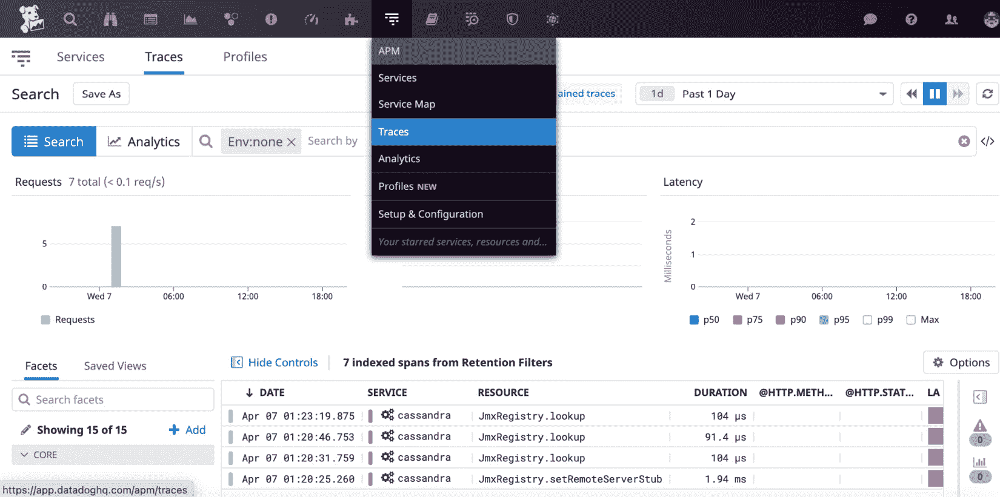

图 14.1 – APM 跟踪仪表板

这些发布到 Datadog 后端的追踪提供了对应用程序特定请求、错误和延迟的深入可视化。应用程序的追踪可以与基础设施层面的指标、主机上运行的进程以及各种日志进行关联，从而帮助定位各层级的性能瓶颈。

## 分析应用程序

通过使用 Datadog APM 的*连续分析器*功能，可以通过深入到类、方法和行号，追踪资源使用和 I/O 瓶颈到应用程序代码。启用此功能也需要进行代码仪器化，我们可以通过 Cassandra 应用程序来尝试。

为应用程序添加分析工具的步骤与为追踪功能所做的类似。实际上，最新的追踪代理也支持分析，两者都可以通过以下命令行启用：

```
$ export JVM_OPTS="-javaagent:/home/ubuntu/dd-java-agent.jar -Ddd.service=cassandra -Ddd.profiling.enabled=true"
$ bin/cassandra
```

正如您在命令行中所看到的，环境变量`dd.profiling.enabled`被设置为`true`，以启用分析功能，除了追踪功能外。

通过导航到**APM** | **Profiles**，可以在**连续分析器**仪表板上查看与分析相关的报告，如下图所示：

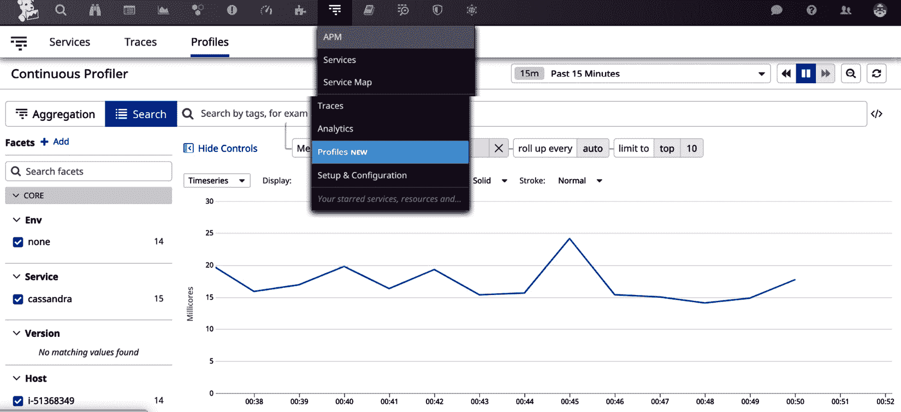

](img/Figure_14.2_B16483.jpg)

图 14.2 – 连续分析器仪表板

此仪表板上列出的分析可以通过各种标签进行过滤，包括通常用于识别主机级别上运行的应用程序的服务名称。在微服务环境中，一个应用程序由多个服务组成，并且可以通过适当的标签化服务轻松跟踪这些属于该应用程序的服务。

通过点击仪表板上列出的一个分析，基于分析数据的性能指标和洞察可以查看，如下图所示：


](img/Figure_14.4_B16483.jpg)

图 14.3 – 应用程序分析详情

在前面的仪表板上，**性能**、**分析**、**指标**和**运行时信息**标签下，提供了大量关于应用程序的运行时信息，用于处理性能问题并对应用程序的性能和安全性进行微调。

## 服务地图

服务地图将提供运行时环境中服务的图示表示，例如主机或 Kubernetes 集群，并绘制出服务之间的交互。**服务地图**可以通过导航到**APM** | **Service Map**来访问，仪表板将显示**服务**标签页，如下图所示：

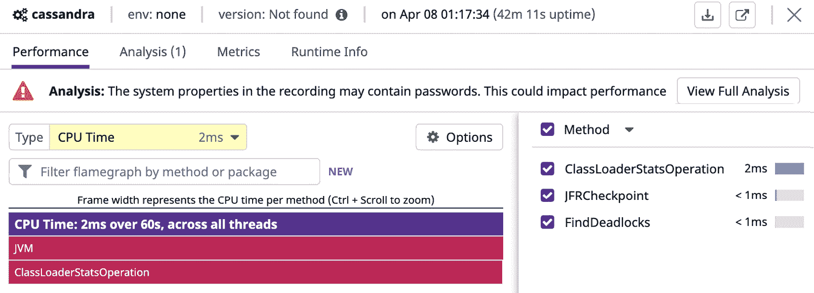

](img/Figure_14.4_B16483.jpg)

图 14.4 – 服务地图仪表板

Service Map 在微服务环境中（例如 Kubernetes 集群）将非常有用，用于理解应用程序各个组件之间的交互。通过为每个微服务启用跟踪和性能分析，可以构建应用系统的服务映射，这将为优化应用程序性能提供宝贵的见解。

在本节中，您已经了解了 Datadog 中如何通过为应用程序仪表化以生成跟踪和配置文件，并汇总这些输入以推断见解来实现各种 APM 功能。同时讨论了可观测性和合成监控，以及通常情况下的 APM，但我们将在单独的章节中讨论这些主题，因为这些主题足够通用，可以在更广泛的监控上下文中理解。

在下一节中，让我们讨论可观测性及其在 Datadog 中的实现。

# 实施可观测性

可观测性指的是使应用系统工作更透明和可测量的过程和方法。增强应用系统的可观测性将使其更适合监控。可观测性是应用系统本身的属性，而监控是利用该属性来满足操作需求的行为。

可观测性相对于监控词汇来说是一个比较新的概念，但它是从系统控制理论中重新解释而来。可观测性的概念由匈牙利裔美国工程师鲁道夫·E·卡尔曼引入，用于线性动态系统，它表明可观测性是从系统外部输出知识推断系统内部状态的好坏程度的度量。在监控的背景下，外部输出可以是各种指标、日志和跟踪。因此，具有可观测性特性的监控工具应该有助于生成和分析与应用系统工作透明性相关的各种输出，使用一组方法、过程和仪表板进行分析。这些特性将有助于增加监控工具监控的应用系统的可观测性。

虽然显而易见的是，添加可观察性对更好的监控至关重要，但你可能会好奇为什么可观察性是一个相对较新的监控术语。原因之一是，现代应用程序系统及其运行的基础设施现在远比以前复杂。过去那种单体应用程序仅在数据中心的少数裸金属机器上运行的时代已经一去不复返。现在的应用程序高度分布式，它们运行在公共云上，并由复杂的编排工具（如 Kubernetes 和 Spinnaker）进行管理。尽管现代应用程序系统更具前瞻性，灵活性和可扩展性大大提高，但应用程序系统复杂性的增加降低了整体可观察性。在这种情况下，必须采取有意的步骤来改善可观察性，这就是为什么商业监控工具现在都配备了此类功能的原因。

指标、日志和追踪通常被认为是可观察性的三大支柱。在本书中，你已经看到 Datadog 的功能主要集中在指标和标签上。Datadog 监控功能开箱即用地生成各种指标。Datadog 还提供创建自定义指标和标签的选项，这将增加对应用程序或基础设施组件工作情况的可见性。如在*第十三章*中所示，*使用 Datadog 管理日志*，Datadog 的日志管理功能在管理各种日志方面非常全面，包括来自 Docker 和 Kubernetes 等微服务平台的日志。在本章前面的 APM 部分，你也已经看到 Datadog 如何生成、收集和分析应用程序的追踪。

虽然 Datadog 拥有实现应用程序可观察性所需的所有基本组件，但这基本上是一个定制的工作，需要为每个应用程序系统单独完成。应用程序的引导和部署流程必须得到增强，以包括添加可观察性所需的仪器化步骤。让我们来看一下在 Datadog 中需要哪些仪器化操作：

+   **添加平台组件级别的指标**：通常通过使用 Datadog 提供的集成来完成。如果它能增加更多价值，可以考虑添加自定义指标并使用社区开发的集成。

+   **添加应用程序指标**：这是定制性质的，并且包括在开发过程中。就像单元测试是构建过程中的要求一样，也应将其作为新服务在构建或发布阶段获得批准的要求。

+   **自动化日志管理**：对构建和部署清单进行仪器化，比如 Dockerfiles 和 Kubernetes 部署脚本，以便将日志发布到 Datadog 的日志管理后端。必须在所有层级上自动化这一过程，因为如果手动完成，它是无法扩展的。

+   **自动化生成跟踪和配置文件**：增强构建和部署过程，自动生成跟踪和配置文件，这样这些数据就能方便地提供给 Datadog APM 服务进行分析并构建服务地图。APM 是实施可观察性的关键方面。

+   **使用 Datadog 满足所有监控需求**：如同本章之前所提到的，其他厂商也提供专用的日志管理和 APM 应用程序。使用 Datadog 的一个优势是，Datadog 不仅提供核心监控功能，还提供这两个功能。这为在单一平台上使用标签和相关结构关联各种指标、日志和跟踪数据提供了机会。如果操作得当，这将通过将所有信息集中在一个地方来增强应用程序的可观察性，而 Datadog 通常会在不同功能之间关联可用的监控信息。

很明显，Datadog 能够整合可观察性的三大支柱——指标、日志和跟踪——是该平台的一大优势。为了利用相关的现成功能，必须增强和工具化应用程序的构建和部署过程，以便日志和跟踪数据能自动且无缝地发布到 Datadog 后台。

在下一节中，我们将讨论合成监控，指的是通过请求和模拟用户体验的操作在生产环境中实时测试应用程序。

# 合成监控

在**合成监控**中，应用程序的使用是通过一个模拟的机器人用户进行的，收集到的模拟数据构成了可操作的步骤的基础，例如触发应用程序性能属性或应用程序本身可用性的警报。通常，以下是可以通过合成监控工具和方法监控的应用程序状态：

+   应用程序在各方面都可用。这可能涉及检查应用程序的多个 Web 或 API 端点。

+   应用程序的性能，即应用程序响应用户请求的速度。

+   应用程序能够按设计执行业务交易。

+   用于构建应用程序系统的第三方组件正在正常运行。

+   达到的应用程序性能是具有成本效益且在预算之内的。

这些方面大多与通过一系列指标衡量用户体验相关，这些指标的值是通过应用程序的机器人使用生成的。机器人访问可以是本地的，即应用程序托管的地方、数据中心或公共云，或者接近实际用户所在的位置。监控的后一种方式被称为“最后一公里监控”，这是我们在*第一章*《监控简介》中讨论的一种监控类型。现有专门的 SaaS 监控解决方案来满足最后一公里监控需求。借助 Datadog 的合成监控功能，也可以解决典型的最后一公里监控需求。

Datadog 的合成监控功能提供了多种检查，用于模拟最终用户的体验。这些测试从全球范围内 Datadog 管理的位置发起，您可以选择配置这些测试的来源位置。以下是使用 Datadog 的合成监控可以执行的检查类别：

+   **DNS**：检查域名是否解析，并且在用户所在的地区解析速度如何

+   **ICMP**：ping 启用了 ICMP 协议的主机，检查其可用性及从用户所在位置的访问情况

+   `80`），HTTPS（`443`），SSH（`22`），以及任何自定义端口

+   **HTTP/HTTPS**：检查 Web 应用程序端点是否正常，并正确响应

+   **HTTP 工作流**：通过串联 HTTP 请求验证涵盖完整交易的多请求工作流

+   **SSL**：验证和检查与 HTTPS 端点相关的 SSL 证书的有效性及过期时间

现在，让我们看看这些检查中的一些是否可以在 Datadog 中进行配置。与合成监控相关的选项可以从主菜单 **UX 监控** 访问。导航到 **UX 监控** | **新建测试**，然后点击 **开始** 链接，您将看到如下截图所示的选项：

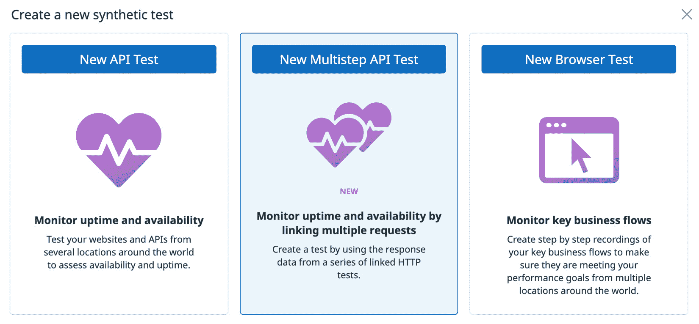

图 14.5 – 合成监控选项

让我们创建一个示例 TCP 测试，检查从巴黎和东京访问 SFTP 主机的情况。为此，需要提供 SFTP 服务器的公共 IP 地址或其域名来配置测试。由于 SFTP 服务在端口 `22` 上可用，因此可以在该端口进行检查。

点击 **新建 API 测试**，选择 **TCP** 标签页，进入可以配置 TCP 测试的表单。表单的第一部分如下面的截图所示，您可以在此输入测试的名称和 SFTP 服务器的信息：

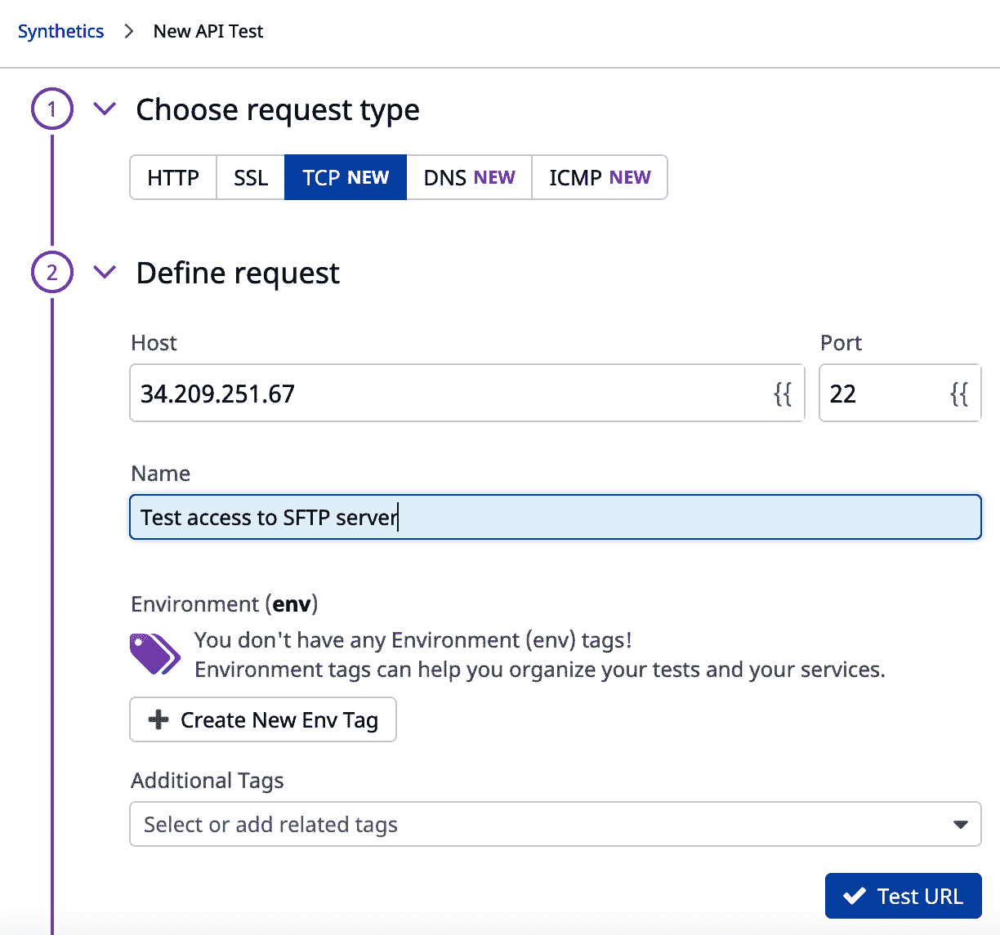

图 14.6 – 创建合成 TCP 测试；服务器详细信息

使用表单中的 `Test` `URL` 链接，可以验证端口 `22` 上服务器的基本访问。然后，可以将来自特定区域的访问添加到测试中，如下截图所示：

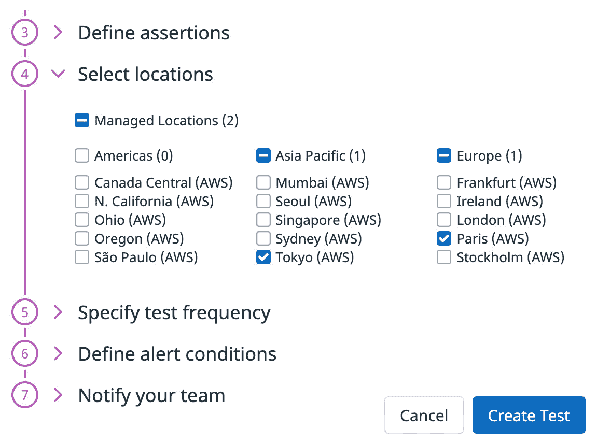

图 14.7 – 创建合成 TCP 测试；选择访问位置

可以选择多个由 Datadog 管理的位置，如前面的截图所示。SFTP 服务器的访问将来自所选的位置。其余的选项与一般设置标准 Datadog 监控器的选项类似。

其他类型的 TCP 测试 – **HTTP**、**DNS**、**SSL** 和 **ICMP** – 可以通过选择 **新建 API 测试** 表单中的相关标签，按照类似的步骤进行配置。

在实际场景中，会配置多个类似的测试，以验证应用程序的各个组件和工作流程是否在用户所在地区可用。可用性状态仪表板将类似于以下截图所示，并且可以通过导航到 **用户体验监控** | **合成测试** 来访问：

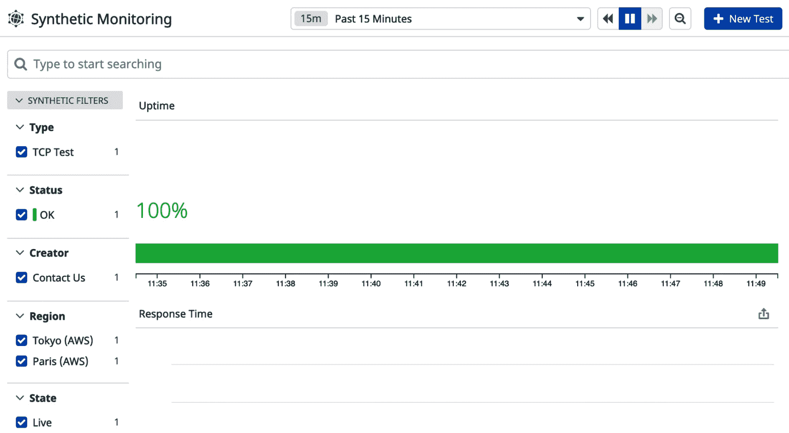

图 14.8 – 合成监控仪表板

总体的正常运行时间状态将显示在此仪表板上，结果可以通过不同的条件进行筛选，例如测试来源区域。单个测试列在此仪表板底部，点击某个特定项目，可以查看和更新该测试的详细信息，如下截图所示：

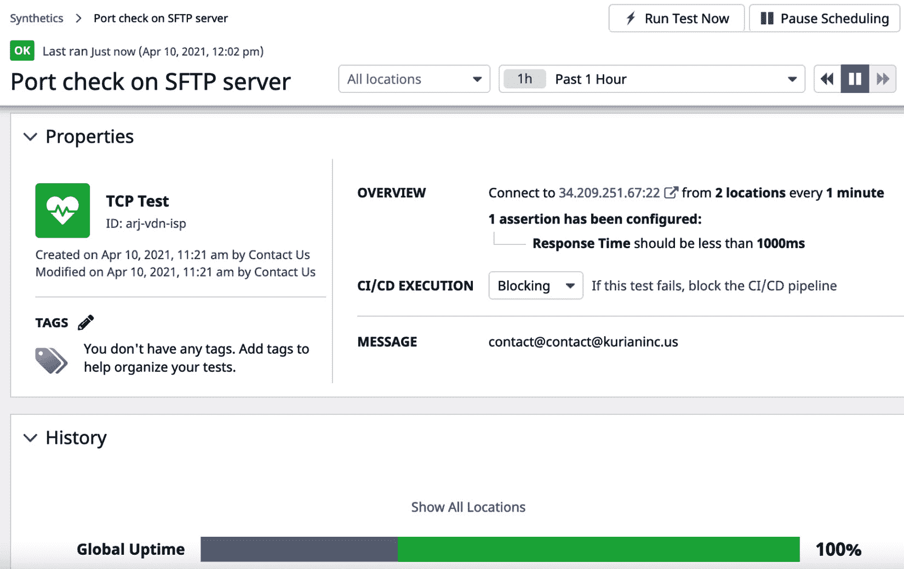

图 14.9 – 合成 TCP 测试的详细信息

从此页面，可以暂停测试或根据需要临时运行测试，而无需等待下次计划运行。这些检查看似简单，但非常强大，因为通过这些设置，你可以像最终用户使用应用程序一样访问服务。

使用 *浏览器测试*，可以模拟用户在访问 Web 应用时使用的设备和浏览器。要创建 *浏览器测试*，请导航到 **用户体验监控** | **新建测试** | **新建浏览器测试**，你将看到新测试创建表单，如下截图所示：

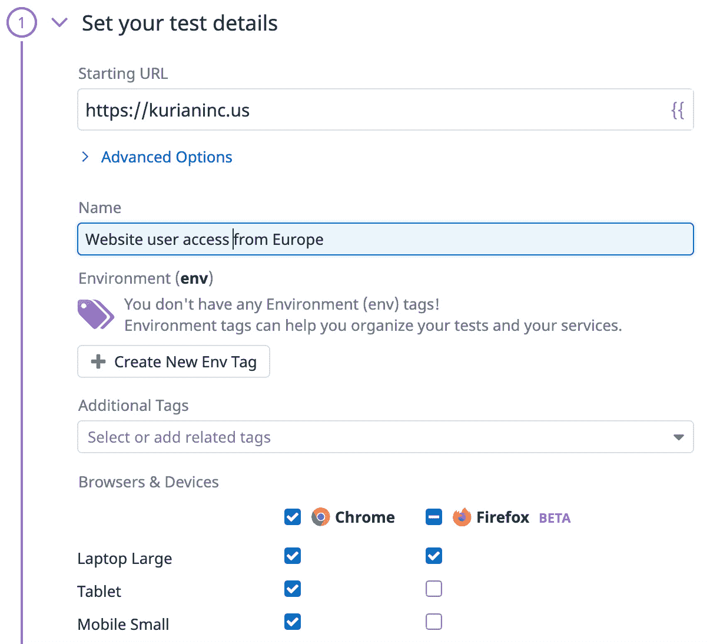

图 14.10 – 模拟用于访问的浏览器和设备的合成测试

要完成此测试的创建，需要选择浏览器、设备和位置。根据你访问 Datadog 仪表板时所使用的浏览器，可能需要安装 Datadog 提供的浏览器插件，以便记录需要由测试模拟的网页工作流程。你将获得一个选项，录制工作流程并将其保存为创建测试的一部分。

一旦测试结果出来，你可以在仪表板上查看，如下示例截图所示：

![图 14.11 – 一个示例浏览器测试结果]

](img/Figure_14.11_B16483.jpg)

图 14.11 – 一个示例浏览器测试结果

如你所见，示例测试揭示了多个问题。你可以深入报告并查看每个问题的详细信息。像这样的测试结果对于微调 Web 应用程序非常有价值，因为你现在可以看到用户如何从特定的计算设备和浏览器组合访问应用程序。

合成监控本质上是模拟可以衡量的用户体验。这就是它被视为 APM 的一部分的原因，因为合成监控测试的输入可以用来优化应用程序，以获得更好的用户体验。在接下来的部分中，你将了解 Datadog 监控平台提供的安全监控功能。

# 安全监控

网络安全在云环境中变得更加重要和必要，因为应用程序需要通过互联网访问，并且在大多数情况下，应用程序本身托管在公有云中。在自己的数据中心运行应用程序并仅在私人网络中访问它不再是一个选项。暴露于外部攻击的基础设施和应用程序应该得到保护和加固。如今有一整套软件应用和服务，解决着各种网络安全问题。

另一个方面是满足安全性、隐私和合规性标准的要求，尤其是在应用程序面向医疗保健和金融行业时。合规性要求由适用于所在司法管辖区的法律规定，而安全标准则是客户的要求。合规性要求通常由该领域的第三方服务提供商进行审计，并且这些要求必须得到监控并记录为审计员的证据。

Datadog 的*安全与合规性监控*功能提供了多个选项，可以在组织中推出，以应对常见的网络安全和合规性要求。此外，Datadog 还具有作为多种监控类型统一平台的优势。通过结合来自基础设施和应用程序的日志和追踪的分析，以及强大的监控功能，如告警和事件管理，Datadog 还可以配置为 SIEM 平台。拥有 SIEM 工具通常是证明一个组织具备健全网络安全实践的要求。

现在，让我们回顾一下 Datadog 平台上当前可用的安全功能，并查看开始使用这些功能的一般步骤。可以从主**安全**菜单中访问这些安全选项，如下图所示：

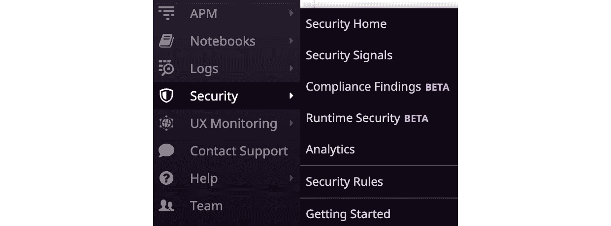

图 14.12 – Datadog 安全与合规监控选项

启用安全功能的一般步骤如下：获取日志、定义安全规则、并根据安全规则从源信息中标记安全信号进行监控。**运行时安全**功能有助于通过监控系统级活动（如文件或进程的变化）来检测生产基础设施中的威胁，应用负载在其中运行。**合规性检查**功能有助于审计生产基础设施，确保其符合行业标准的安全规范，如**支付卡行业**（**PCI**）数据安全标准和**互联网安全中心**（**CIS**），这些标准帮助审计基础设施中的漏洞。

现在，让我们来看一下如何将信息输入 Datadog 进行安全分析，并利用这些洞察力来加强基础设施和应用程序的安全性。

## 日志来源

Datadog 可以从多种公有云平台和安全产品中获取日志，以查找安全威胁。下图列出了可以与 Datadog 集成的日志来源的一般类别：

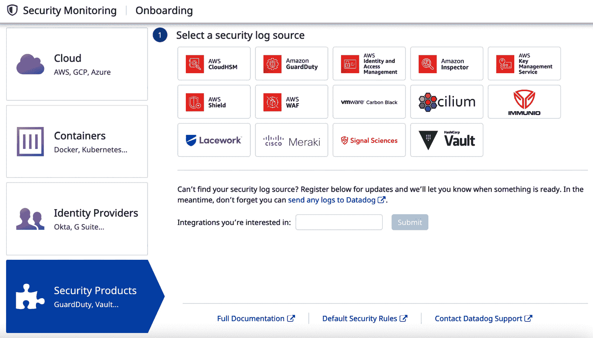

图 14.13 – 用于安全分析的日志来源

以下是 Datadog 可以分析的四类日志来源，用于检测安全威胁：

+   公有云平台 – AWS、Azure 和 GCP

+   容器产品和服务，如**Docker**、**Kubernetes**和**Amazon EKS**

+   身份提供者 – **Okta**、**Auth0**、**G Suite** 和 **Azure Active Directory**。

+   安全产品，主要是**AWS**上的服务，和其他产品，如**HashiCorp Vault**

集成方法是针对每个产品特定的，通过选择前述仪表盘上列出的产品，可以查看安装过程。

## 定义安全规则

Datadog 提供了一些预定义规则，可以直接用于分析 Datadog 从上文提到的各种来源收集的日志。可以通过导航到**安全** | **安全规则**来访问安全规则仪表盘，仪表盘上列出了可用的规则，如下图所示：

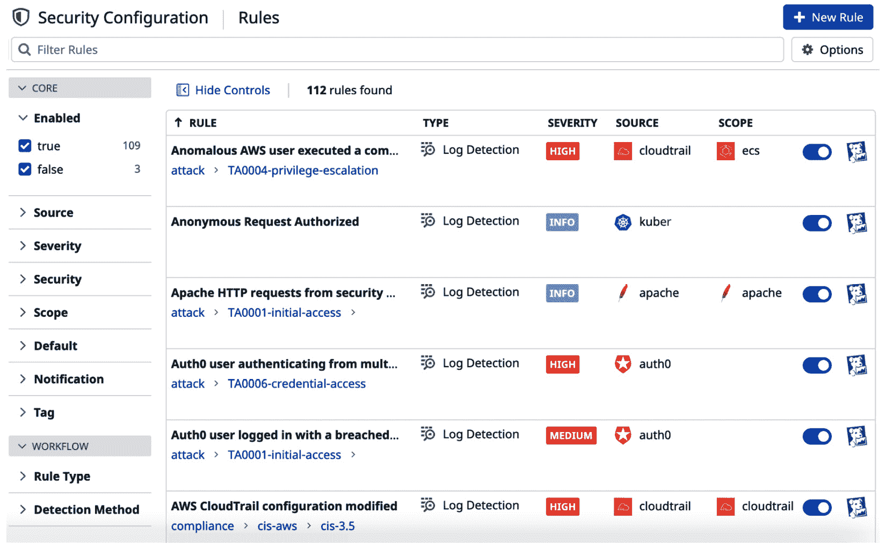

图 14.14 – 安全规则仪表盘

这些规则可以在此仪表盘上启用或禁用。同时，可以通过使用**新规则**链接添加自定义规则。

## 监控安全信号

当基于活动的安全规则在日志中找到潜在威胁时，会创建一个安全信号。这类似于当指标值超过阈值时，监控生成警报。像警报一样，信号可以广播给多个受众。通过导航到**安全** | **安全信号**，这些信号也可以在**安全信号**仪表板上查看。

本节中我们对 Datadog 平台上的安全功能做了一个概览。这是一个仍在持续改进的领域，但它的整体发展方向非常鼓舞人心，尤其是在可用功能的易用性和与安全信息源集成的简便性方面。在下一节中，我们将探讨与本章所讨论主题相关的最佳实践。

# 最佳实践

你已经了解了 Datadog 平台上的高级监控、APM 和安全功能，现在让我们来看一下这些领域相关的最佳实践：

+   用于生成应用程序跟踪和进行 APM 性能分析的工具必须集成到构建和部署过程中。

+   为每个服务定义完整的应用程序指标，并将这些指标暴露出来，方便 Datadog 使用。

+   计划收集所有应用程序日志，并在需要时定义新的日志，以便轻松观察应用程序状态。

+   确定应用程序用户的地理位置，以便对合成测试进行微调。

+   发布受支持的设备和浏览器列表。根据合成监控报告中提供的信息，微调应用程序以确保与访问设备和浏览器的兼容性。

+   为了有效的安全监控，定义与组织相关的自定义安全规则。禁用可能生成虚假消息的现成规则。

这将引导我们进入总结部分。

# 总结

在本章中，你了解了 Datadog 平台上一些相对较新的监控功能，这些功能仍在不断发展。除了 APM 外，还讨论了可观察性和合成监控，但相关的工具和概念足够通用，可以应用于更广泛的监控场景。

本章结束时，本书也告一段落，接下来推荐的步骤是将 Datadog 部署到你的环境中，积累相关经验。Datadog 提供了覆盖几乎所有监控类型的功能，如基础设施监控、日志聚合与索引、最后一公里监控、APM 和安全监控，是市场上最全面的监控平台之一。它的一大亮点是，借助平台上的多种监控功能，能够统一监控，并且具备跨产品关联信息的能力。

我们祝愿你在使用 Datadog 部署主动监控时好运，Datadog 是这个目的的一个极佳选择。
